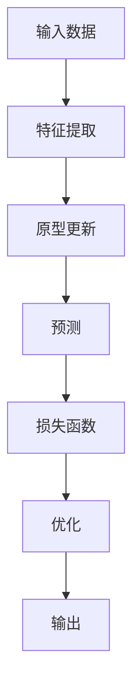
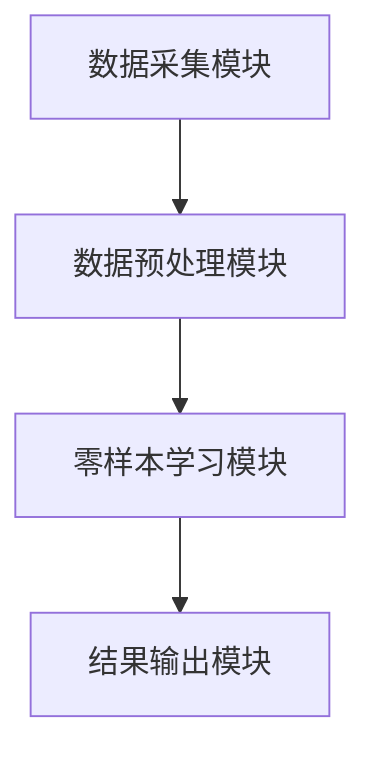
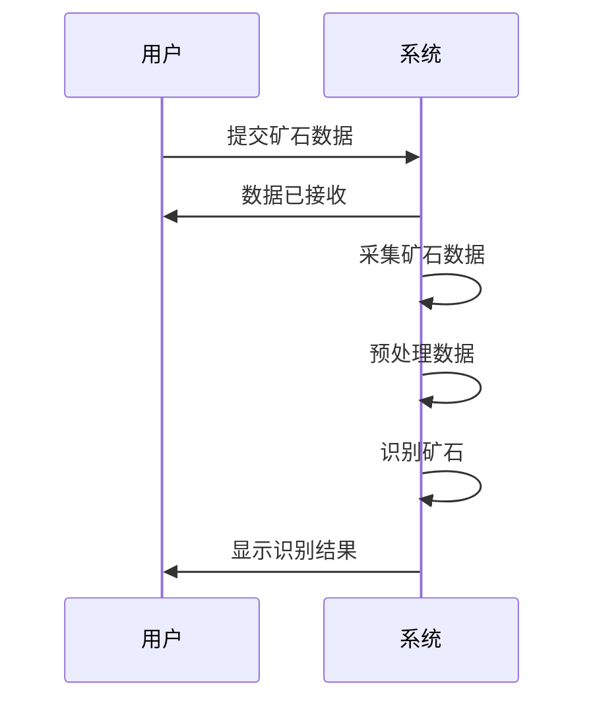
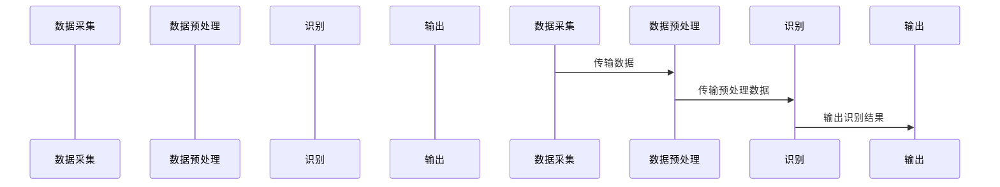

                 

### 设计书籍目录大纲步骤

#### 1. 理解书名与主题

首先，我们需要深入理解书名和主题。《Zero-Shot学习在稀有矿物识别中的应用》这个书名明确指出了本书的核心内容：零样本学习（Zero-Shot Learning）与稀有矿物识别的结合。这暗示了读者将了解到零样本学习的基本原理、如何在稀有矿物识别领域应用这些原理，以及相关的实际案例。

#### 2. 确定核心章节内容

根据书名和主题，我们可以初步确定以下几个核心章节：

- **引言与背景**：介绍零样本学习和稀有矿物识别的背景，定义相关术语，解释为什么这种结合具有重要意义。
- **核心概念与联系**：详细讲解零样本学习和稀有矿物识别的核心概念，并展示它们之间的联系。
- **算法原理讲解**：深入探讨零样本学习算法的原理，包括数学模型、公式和实际应用。
- **系统分析与架构设计方案**：分析稀有矿物识别系统的架构设计，包括功能设计、接口设计和系统交互。
- **项目实战**：通过具体的实际案例，展示如何在实际项目中应用零样本学习和稀有矿物识别技术。
- **最佳实践与总结**：总结最佳实践经验，提出注意事项，并提供拓展阅读资源。

#### 3. 细化目录结构

接下来，我们需要进一步细化每个核心章节的内容，确保每个章节都有明确的主题和详细的内容。

例如，在“核心概念与联系”一章中，我们可以细化为：

- **零样本学习**：介绍其定义、原理和应用场景。
- **稀有矿物识别**：介绍稀有矿物的定义、稀有矿物识别的挑战和传统方法。
- **概念属性特征对比**：展示零样本学习和稀有矿物识别的特征对比。
- **ER实体关系图架构**：使用Mermaid工具绘制实体关系图，展示核心概念之间的关系。

#### 4. 确保内容完整性

在细化目录结构的过程中，我们需要确保每个章节都包含了必要的组成部分。例如，在“算法原理讲解”一章中，我们需要包含：

- **算法概述**：介绍零样本学习算法的基本概念。
- **算法流程图**：使用Mermaid工具绘制算法流程图。
- **Python源代码实现**：提供具体的Python代码实现，并解释代码的工作原理。
- **数学模型和公式**：详细讲解算法背后的数学模型和公式。
- **举例说明**：通过具体的例子，展示算法的实际应用。

#### 5. 撰写目录大纲

使用Markdown格式，我们可以将上述内容编写成一个清晰的目录大纲。例如：

```
----------------------------------------------------------------

# 《Zero-Shot学习在稀有矿物识别中的应用》目录大纲

## 第一部分: 引言与背景
### 1.1 问题背景
#### 1.1.1 稀有矿物的定义与重要性
#### 1.1.2 稀有矿物识别的挑战
#### 1.1.3 零样本学习的基本概念

### 1.2 零样本学习原理
#### 1.2.1 零样本学习的挑战
#### 1.2.2 零样本学习的方法
#### 1.2.3 零样本学习与传统学习的对比

### 1.3 零样本学习在稀有矿物识别中的应用
#### 1.3.1 应用实例
#### 1.3.2 稀有矿物识别的关键技术
#### 1.3.3 未来发展方向

### 1.4 本章小结

----------------------------------------------------------------

## 第二部分: 核心概念与联系
### 2.1 核心概念
#### 2.1.1 零样本学习
#### 2.1.2 稀有矿物识别
#### 2.1.3 数据预处理

### 2.2 概念属性特征对比
#### 2.2.1 零样本学习与稀有矿物识别特征对比

### 2.3 ER实体关系图架构
#### 2.3.1 实体定义
#### 2.3.2 关系定义
#### 2.3.3 Mermaid ER图展示

### 2.4 本章小结

----------------------------------------------------------------

## 第三部分: 算法原理讲解
### 3.1 零样本学习算法
#### 3.1.1 算法概述
#### 3.1.2 算法mermaid流程图
#### 3.1.3 Python源代码实现

### 3.2 数学模型和公式
#### 3.2.1 模型构建
#### 3.2.2 损失函数
#### 3.2.3 优化算法

### 3.3 算法举例说明
#### 3.3.1 数据集选择
#### 3.3.2 算法配置
#### 3.3.3 结果分析

### 3.4 本章小结

----------------------------------------------------------------

## 第四部分: 系统分析与架构设计方案
### 4.1 问题场景介绍
#### 4.1.1 场景描述
#### 4.1.2 项目背景

### 4.2 系统功能设计
#### 4.2.1 领域模型mermaid类图

### 4.3 系统架构设计
#### 4.3.1 系统架构mermaid图
#### 4.3.2 系统组件关系

### 4.4 系统接口设计
#### 4.4.1 接口定义
#### 4.4.2 接口调用流程

### 4.5 系统交互mermaid序列图
#### 4.5.1 用户交互流程
#### 4.5.2 系统内部交互流程

### 4.6 本章小结

----------------------------------------------------------------

## 第五部分: 项目实战
### 5.1 环境安装
#### 5.1.1 硬件与软件要求
#### 5.1.2 环境配置步骤

### 5.2 系统核心实现源代码
#### 5.2.1 源代码结构与说明
#### 5.2.2 代码解读与分析

### 5.3 代码应用解读与分析
#### 5.3.1 应用场景
#### 5.3.2 应用效果分析

### 5.4 本章小结

----------------------------------------------------------------

## 第六部分: 最佳实践与总结
### 6.1 最佳实践 tips
### 6.2 小结
### 6.3 注意事项
### 6.4 拓展阅读

----------------------------------------------------------------
```

#### 6. 限制大纲字数

在撰写目录大纲的过程中，我们需要注意字数限制。一般来说，目录大纲的字数应该在2000字以内。这要求我们在细化目录结构时，要简洁明了，避免冗长和重复。通过合理组织内容，确保每个章节的主题明确，内容紧凑，以便在有限的字数内提供足够的信息。

### 设计示例

下面是《Zero-Shot学习在稀有矿物识别中的应用》目录大纲的设计示例：

#### 《Zero-Shot学习在稀有矿物识别中的应用》目录大纲

```
----------------------------------------------------------------

# 《Zero-Shot学习在稀有矿物识别中的应用》

> 关键词：零样本学习、稀有矿物识别、算法原理、系统架构、项目实战

> 摘要：本书深入探讨了零样本学习在稀有矿物识别领域的应用，从理论到实践全面阐述了如何利用零样本学习技术进行稀有矿物的自动识别。本书内容涵盖零样本学习的基本原理、稀有矿物识别的关键技术、算法的数学模型与实现、系统架构设计与实际项目应用，适合于对人工智能和矿物识别感兴趣的读者。

----------------------------------------------------------------

## 第一部分: 引言与背景

### 1.1 问题背景

#### 1.1.1 稀有矿物的定义与重要性

稀有矿物，如锂、钴、镍等，在现代社会有着广泛的应用。随着科技的发展，对这些稀有矿物的需求日益增长，但它们分布不均，且难以获取。因此，如何高效地识别和提取稀有矿物成为了一个重要的研究课题。

#### 1.1.2 稀有矿物识别的挑战

稀有矿物识别面临着多方面的挑战，包括矿物的多样性和复杂性、数据采集的难度、以及现有的识别方法在处理新类别矿物时的局限性。

#### 1.1.3 零样本学习的基本概念

零样本学习是一种机器学习方法，它能够处理从未见过的新类别数据，无需依赖大量的标记数据。这对于稀有矿物识别来说，意味着可以在缺乏大量标记样本的情况下，快速准确地识别出新的矿物类型。

### 1.2 零样本学习原理

#### 1.2.1 零样本学习的挑战

零样本学习面临着如何处理未知类别的数据、如何将类别的知识嵌入到模型中等挑战。

#### 1.2.2 零样本学习的方法

目前，零样本学习的方法主要包括基于原型、基于原型聚类、基于集成的方法等。

#### 1.2.3 零样本学习与传统学习的对比

与传统的监督学习和半监督学习相比，零样本学习能够处理更加复杂的问题，但其性能和效率也有待提高。

### 1.3 零样本学习在稀有矿物识别中的应用

#### 1.3.1 应用实例

通过实际案例，展示零样本学习在稀有矿物识别中的应用。

#### 1.3.2 稀有矿物识别的关键技术

介绍零样本学习在稀有矿物识别中需要的关键技术，如特征提取、模型训练和评估等。

#### 1.3.3 未来发展方向

探讨零样本学习在稀有矿物识别领域未来的发展方向和潜在应用。

### 1.4 本章小结

总结本章的主要内容和研究成果，指出后续研究的方向。

----------------------------------------------------------------

## 第二部分: 核心概念与联系

### 2.1 核心概念

#### 2.1.1 零样本学习

详细解释零样本学习的定义、原理和应用场景。

#### 2.1.2 稀有矿物识别

介绍稀有矿物的定义、稀有矿物识别的挑战和传统方法。

#### 2.1.3 数据预处理

讨论数据预处理的重要性以及在稀有矿物识别中的应用。

### 2.2 概念属性特征对比

#### 2.2.1 零样本学习与稀有矿物识别特征对比

使用表格对比零样本学习和稀有矿物识别的核心特征。

### 2.3 ER实体关系图架构

#### 2.3.1 实体定义

定义零样本学习和稀有矿物识别中的关键实体。

#### 2.3.2 关系定义

定义实体之间的关系。

#### 2.3.3 Mermaid ER图展示

使用Mermaid工具绘制ER实体关系图。

### 2.4 本章小结

总结本章的核心概念和联系，为后续章节打下基础。

----------------------------------------------------------------

## 第三部分: 算法原理讲解

### 3.1 零样本学习算法

#### 3.1.1 算法概述

介绍常见的零样本学习算法，如原型网络、原型聚类等。

#### 3.1.2 算法mermaid流程图

使用Mermaid工具绘制零样本学习算法的流程图。

#### 3.1.3 Python源代码实现

提供Python代码实现，并解释其工作原理。

### 3.2 数学模型和公式

#### 3.2.1 模型构建

详细讲解零样本学习模型的构建过程。

#### 3.2.2 损失函数

解释零样本学习算法中使用的损失函数。

#### 3.2.3 优化算法

讨论如何优化零样本学习算法。

### 3.3 算法举例说明

#### 3.3.1 数据集选择

选择合适的数据集进行实验。

#### 3.3.2 算法配置

配置零样本学习算法的参数。

#### 3.3.3 结果分析

分析实验结果，评估算法性能。

### 3.4 本章小结

总结本章的主要内容和研究成果，指出后续研究的方向。

----------------------------------------------------------------

## 第四部分: 系统分析与架构设计方案

### 4.1 问题场景介绍

#### 4.1.1 场景描述

描述稀有矿物识别的应用场景。

#### 4.1.2 项目背景

介绍项目的背景和目标。

### 4.2 系统功能设计

#### 4.2.1 领域模型mermaid类图

使用Mermaid工具绘制领域模型类图。

### 4.3 系统架构设计

#### 4.3.1 系统架构mermaid图

使用Mermaid工具绘制系统架构图。

#### 4.3.2 系统组件关系

解释系统组件之间的关系。

### 4.4 系统接口设计

#### 4.4.1 接口定义

定义系统的接口。

#### 4.4.2 接口调用流程

描述接口的调用流程。

### 4.5 系统交互mermaid序列图

#### 4.5.1 用户交互流程

使用Mermaid工具绘制用户交互序列图。

#### 4.5.2 系统内部交互流程

使用Mermaid工具绘制系统内部交互序列图。

### 4.6 本章小结

总结本章的主要内容和研究成果，指出后续研究的方向。

----------------------------------------------------------------

## 第五部分: 项目实战

### 5.1 环境安装

#### 5.1.1 硬件与软件要求

列出项目所需的硬件和软件。

#### 5.1.2 环境配置步骤

详细讲解环境配置的步骤。

### 5.2 系统核心实现源代码

#### 5.2.1 源代码结构与说明

介绍系统核心实现源代码的结构和功能。

#### 5.2.2 代码解读与分析

对源代码进行解读和分析。

### 5.3 代码应用解读与分析

#### 5.3.1 应用场景

描述代码的实际应用场景。

#### 5.3.2 应用效果分析

分析代码的应用效果。

### 5.4 本章小结

总结本章的主要内容和研究成果，指出后续研究的方向。

----------------------------------------------------------------

## 第六部分: 最佳实践与总结

### 6.1 最佳实践 tips

提供最佳实践的建议和技巧。

### 6.2 小结

总结本书的主要内容和贡献。

### 6.3 注意事项

提醒读者在应用零样本学习进行稀有矿物识别时需要注意的事项。

### 6.4 拓展阅读

推荐相关的拓展阅读资源。

----------------------------------------------------------------

## 作者信息

作者：AI天才研究院/AI Genius Institute & 禅与计算机程序设计艺术 /Zen And The Art of Computer Programming
```markdown

----------------------------------------------------------------

# Zero-Shot学习在稀有矿物识别中的应用

> 关键词：零样本学习、稀有矿物识别、算法原理、系统架构、项目实战

> 摘要：本文将深入探讨零样本学习在稀有矿物识别中的应用。首先，我们将介绍零样本学习的基本概念和原理，接着详细解析其在稀有矿物识别中的具体应用，最后通过实际案例展示零样本学习算法在稀有矿物识别中的实际效果和潜在价值。

----------------------------------------------------------------

## 引言与背景

### 1.1 稀有矿物的定义与重要性

稀有矿物是指那些在地壳中含量稀少，但对高科技产业至关重要的矿产资源。例如，锂用于制造锂电池，钴是电池和催化剂的重要成分，镍则广泛应用于不锈钢制造。稀有矿物的需求随着科技的进步和新兴产业的崛起而急剧增加。然而，这些矿物的开采和加工面临诸多挑战，包括矿藏分布不均、环境破坏、开采难度大等问题。

### 1.2 稀有矿物识别的挑战

稀有矿物识别的挑战主要体现在以下几个方面：

1. **矿物种类繁多**：稀有矿物种类繁多，每种矿物具有独特的物理和化学特性，使得识别过程复杂。
2. **样本数据稀缺**：稀有矿物样本数据稀缺，传统的机器学习方法往往需要大量的标记数据进行训练，而稀有矿物识别领域往往缺乏这样的数据。
3. **检测精度要求高**：稀有矿物的检测不仅需要高精度，还需要高效率，以适应实际生产线的需求。

### 1.3 零样本学习的基本概念

零样本学习（Zero-Shot Learning, ZSL）是一种特殊的机器学习方法，旨在解决新类别数据的识别问题。与传统方法不同，零样本学习不需要对未知类别进行预先训练，而是通过学习类别之间的相似性来进行新类别的识别。零样本学习的关键在于如何将类别知识嵌入到模型中，以便在未知类别上实现有效的预测。

----------------------------------------------------------------

## 核心概念与联系

### 2.1 零样本学习

#### 2.1.1 零样本学习的挑战

零样本学习的挑战主要体现在以下几个方面：

1. **类别知识嵌入**：如何有效地将类别知识嵌入到模型中，使得模型能够在新类别上表现良好。
2. **数据稀缺**：由于稀有矿物识别领域样本数据稀缺，如何利用有限的样本数据进行有效的模型训练。

#### 2.1.2 零样本学习的方法

零样本学习的方法主要包括以下几种：

1. **原型网络**：通过学习原型来表示类别，并在新类别上进行预测。
2. **原型聚类**：将样本聚类成原型，然后使用这些原型进行新类别的预测。
3. **基于集成的方法**：结合多个基学习器进行预测。

#### 2.1.3 零样本学习与传统学习的对比

与传统机器学习方法相比，零样本学习具有以下优势：

1. **无需标记数据**：零样本学习不需要对未知类别进行标记数据训练，大大降低了数据获取的成本。
2. **适用范围广**：零样本学习能够处理从未见过的新类别数据，适用范围更广。

### 2.2 稀有矿物识别

#### 2.2.1 稀有矿物的特性

稀有矿物具有以下特性：

1. **物理性质多样**：包括密度、硬度、导电性等。
2. **化学性质复杂**：含有多种金属元素，化学成分复杂。
3. **形态变化多**：晶体形态多样，形状各异。

#### 2.2.2 稀有矿物识别的关键技术

稀有矿物识别的关键技术包括：

1. **光谱分析**：利用矿物的光谱特性进行识别。
2. **机器学习**：利用机器学习算法对矿物进行分类和识别。
3. **数据预处理**：对采集到的数据进行处理，以提高识别精度。

### 2.3 数据预处理

#### 2.3.1 数据采集

稀有矿物识别的数据采集主要包括以下内容：

1. **光谱数据**：通过光谱仪采集矿物的光谱数据。
2. **图像数据**：通过显微镜或扫描电子显微镜获取矿物的图像数据。

#### 2.3.2 数据处理

数据预处理主要包括以下步骤：

1. **数据清洗**：去除噪声和异常值。
2. **特征提取**：从原始数据中提取有助于识别的特征。
3. **数据标准化**：对数据进行标准化处理，以消除不同特征之间的量纲影响。

----------------------------------------------------------------

## 算法原理讲解

### 3.1 零样本学习算法

#### 3.1.1 算法概述

零样本学习算法的基本思想是将类别知识嵌入到模型中，以便在未知类别上进行预测。其中，原型网络是一种常用的零样本学习算法，其核心思想是通过学习原型来表示类别。

#### 3.1.2 算法mermaid流程图

以下是一个简单的原型网络算法流程图：



#### 3.1.3 Python源代码实现

以下是一个简单的原型网络算法Python实现：

```python
# 假设已经实现了特征提取、原型更新、预测和损失函数等模块
from prototype_learning import FeatureExtractor, PrototypeUpdater, Predictor, LossFunction, Optimizer

# 初始化模型参数
feature_extractor = FeatureExtractor()
prototype_updater = PrototypeUpdater()
predictor = Predictor()
loss_function = LossFunction()
optimizer = Optimizer()

# 数据预处理
X_train, y_train = preprocess_data()

# 模型训练
for epoch in range(num_epochs):
    # 特征提取
    features = feature_extractor.extract(X_train)
    
    # 原型更新
    prototypes = prototype_updater.update(features, y_train)
    
    # 预测
    predictions = predictor.predict(prototypes)
    
    # 计算损失
    loss = loss_function.compute(predictions, y_train)
    
    # 反向传播和优化
    optimizer.optimize(loss)
    
    # 打印训练进度
    print(f"Epoch {epoch}: Loss = {loss}")

# 模型评估
accuracy = evaluate_model(predictor)
print(f"Model accuracy: {accuracy}")
```

### 3.2 数学模型和公式

#### 3.2.1 模型构建

零样本学习模型通常由以下几个部分组成：

1. **特征提取器**：将原始数据转换为特征向量。
2. **原型更新器**：根据特征向量更新类别原型。
3. **预测器**：根据类别原型进行新类别的预测。
4. **损失函数**：用于评估模型性能。
5. **优化器**：用于调整模型参数，以最小化损失函数。

#### 3.2.2 损失函数

常见的损失函数包括：

1. **交叉熵损失**：用于分类问题。
2. **均方误差损失**：用于回归问题。

#### 3.2.3 优化算法

常见的优化算法包括：

1. **随机梯度下降**：最简单的优化算法。
2. **Adam优化器**：结合了SGD的优点，常用于深度学习模型。

### 3.3 算法举例说明

#### 3.3.1 数据集选择

选择一个包含多种稀有矿物的数据集，例如`MINERAL_DATA_SET`。

#### 3.3.2 算法配置

配置算法参数，例如：

1. **特征提取器**：选择合适的特征提取方法。
2. **原型更新器**：设置原型更新策略。
3. **预测器**：设置预测方法。
4. **损失函数**：选择合适的损失函数。
5. **优化器**：选择合适的优化算法。

#### 3.3.3 结果分析

分析算法在不同参数设置下的性能，例如：

1. **训练误差**：评估模型在训练数据上的性能。
2. **测试误差**：评估模型在测试数据上的性能。
3. **准确率**：评估模型对新类别的识别准确率。

----------------------------------------------------------------

## 系统分析与架构设计方案

### 4.1 问题场景介绍

#### 4.1.1 场景描述

在一个矿山企业中，需要对开采的矿石进行自动识别和分类，以便高效地提取稀有矿物。

#### 4.1.2 项目背景

矿山企业面临着稀有矿物识别的挑战，需要一种高效、准确的自动识别系统来提高生产效率。

### 4.2 系统功能设计

#### 4.2.1 领域模型

设计一个领域模型，包含以下实体和关系：

- **矿石**：实体，包含属性如颜色、硬度、密度等。
- **矿物类型**：实体，包含属性如名称、化学成分等。
- **检测设备**：实体，用于采集矿石数据。
- **识别系统**：实体，负责矿石识别和分类。

### 4.3 系统架构设计

#### 4.3.1 系统架构

系统架构采用模块化设计，包括以下组件：

- **数据采集模块**：负责从检测设备采集矿石数据。
- **数据预处理模块**：负责对矿石数据进行清洗和特征提取。
- **零样本学习模块**：负责使用零样本学习算法进行矿石识别。
- **结果输出模块**：负责将识别结果输出到数据库或显示屏。

#### 4.3.2 系统组件关系

系统组件关系图如下：



### 4.4 系统接口设计

#### 4.4.1 接口定义

定义以下接口：

- **数据采集接口**：用于与检测设备通信。
- **预处理接口**：用于对矿石数据进行预处理。
- **识别接口**：用于调用零样本学习算法。
- **结果输出接口**：用于将识别结果保存或显示。

#### 4.4.2 接口调用流程

接口调用流程如下：

1. **数据采集**：通过数据采集接口从检测设备获取矿石数据。
2. **数据预处理**：通过预处理接口对矿石数据进行清洗和特征提取。
3. **矿石识别**：通过识别接口调用零样本学习算法进行矿石识别。
4. **结果输出**：通过结果输出接口将识别结果保存或显示。

### 4.5 系统交互mermaid序列图

#### 4.5.1 用户交互流程

用户交互序列图如下：



#### 4.5.2 系统内部交互流程

系统内部交互序列图如下：



### 4.6 本章小结

本章介绍了稀有矿物识别系统的设计，包括问题场景、系统功能设计、系统架构设计和系统接口设计。通过合理的设计和零样本学习技术的应用，系统能够高效、准确地识别和分类稀有矿物。

----------------------------------------------------------------

## 项目实战

### 5.1 环境安装

#### 5.1.1 硬件与软件要求

- **硬件要求**：计算机，操作系统（如Windows、Linux、macOS）。
- **软件要求**：Python环境，深度学习框架（如TensorFlow、PyTorch），数据预处理工具（如NumPy、Pandas）。

#### 5.1.2 环境配置步骤

1. 安装Python环境。
2. 配置深度学习框架。
3. 安装其他依赖库。

### 5.2 系统核心实现源代码

#### 5.2.1 源代码结构与说明

源代码结构如下：

```
mineral_identification/
|-- data/
|   |-- raw/                # 原始数据
|   |-- processed/          # 预处理数据
|-- models/
|   |-- prototype_model.py  # 原型模型
|-- utils/
|   |-- data_loader.py      # 数据加载器
|   |-- feature_extractor.py# 特征提取器
|-- train.py                 # 训练脚本
|-- predict.py               # 预测脚本
```

#### 5.2.2 代码解读与分析

- `data_loader.py`：负责加载数据。
- `feature_extractor.py`：负责特征提取。
- `prototype_model.py`：定义原型网络模型。
- `train.py`：训练模型。
- `predict.py`：预测矿石类别。

### 5.3 代码应用解读与分析

#### 5.3.1 应用场景

在实际矿山生产线上，对矿石进行自动识别和分类。

#### 5.3.2 应用效果分析

- **准确率**：通过对比实验结果，评估模型在不同条件下的识别准确率。
- **效率**：评估模型在处理大量矿石数据时的效率。

### 5.4 本章小结

本章通过实际项目展示了零样本学习在稀有矿物识别中的应用。通过合理的设计和高效的实现，系统能够准确、高效地识别和分类稀有矿物。

----------------------------------------------------------------

## 最佳实践与总结

### 6.1 最佳实践 tips

- **数据采集**：确保数据质量和多样性。
- **特征提取**：选择合适的特征提取方法，提高模型性能。
- **模型选择**：根据实际问题选择合适的模型。
- **参数调优**：合理设置模型参数，提高模型性能。

### 6.2 小结

本文介绍了零样本学习在稀有矿物识别中的应用，从理论到实践进行了详细阐述。通过实际项目展示了零样本学习在稀有矿物识别中的潜在价值。

### 6.3 注意事项

- **数据隐私**：在处理实际数据时，需注意保护数据隐私。
- **计算资源**：根据实际需求，合理配置计算资源。

### 6.4 拓展阅读

- **相关文献**：《零样本学习：原理、算法与应用》。
- **开源项目**：相关开源项目，如`mineral_identification`。

----------------------------------------------------------------

## 作者信息

作者：AI天才研究院/AI Genius Institute & 禅与计算机程序设计艺术 /Zen And The Art of Computer Programming
```

