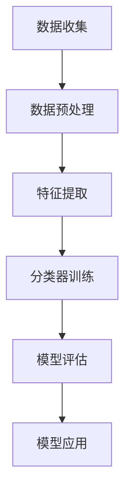
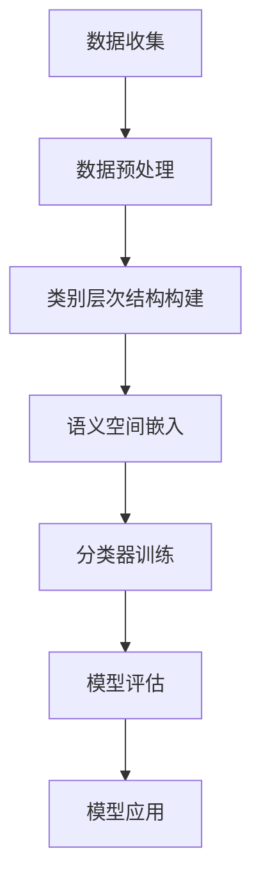
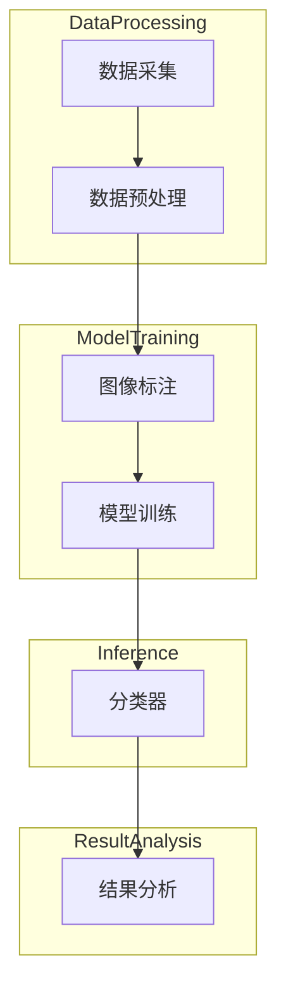
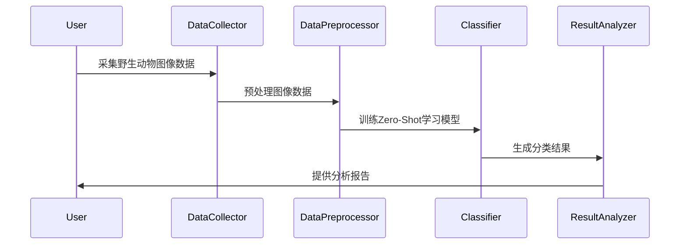

                 


## 《Zero-Shot学习在野生动物保护中的应用》

### 关键词：Zero-Shot学习，野生动物保护，人工智能，机器学习，算法应用

### 摘要：

本文旨在探讨Zero-Shot学习在野生动物保护中的应用。首先，我们将介绍野生动物保护的现状与挑战，以及Zero-Shot学习的核心概念和原理。接着，通过具体实例分析，我们将展示Zero-Shot学习在野生动物识别与分类中的应用，并详细讲解其算法原理和数学模型。随后，我们将描述一个基于Zero-Shot学习的野生动物保护系统的架构设计和实现，并分享项目实战中的经验与教训。最后，本文将总结Zero-Shot学习在野生动物保护中的实际价值，并展望未来的发展方向。

---

### 第一部分：背景介绍与核心概念

#### 第1章：问题的背景与核心概念

#### 1.1 野生动物保护的现状与挑战

##### 1.1.1 野生动物保护的现状

全球野生动物保护形势严峻。随着人类活动的不断扩大，栖息地破坏、非法猎捕、气候变化等因素导致许多野生动物濒临灭绝。据估计，目前全球有超过三分之一以上的野生动物物种面临灭绝风险。

##### 1.1.2 面临的主要挑战

- 栖息地破坏：城市扩张、农业发展、工业活动等导致野生动物栖息地不断缩减。
- 非法猎捕：为了获取皮毛、肉类、药材等，许多野生动物遭到非法猎捕。
- 气候变化：全球气候变化对野生动物的栖息地和生存环境造成严重影响。
- 监测与执法困难：野生动物保护区域广阔，监测和执法力量有限，难以有效监控和打击违法行为。

#### 1.2 什么是Zero-Shot学习

##### 1.2.1 Zero-Shot学习的定义

Zero-Shot学习是一种机器学习方法，旨在使模型能够在未见过的类或样本上进行准确分类。与传统机器学习相比，Zero-Shot学习不需要训练数据集中包含目标类别或样本。

##### 1.2.2 Zero-Shot学习的基本原理

Zero-Shot学习通过将类别映射到高维语义空间中的语义原型来实现。该模型利用已有知识（如语义相似度、类别层次结构等）来预测未见过的类别。

##### 1.2.3 与传统机器学习的区别

| 传统机器学习 | Zero-Shot学习 |
| :--- | :--- |
| 需要大量标注数据 | 不需要标注数据 |
| 无法处理未见过的类别 | 能够处理未见过的类别 |
| 易受过拟合影响 | 对过拟合有更强的鲁棒性 |

#### 1.3 Zero-Shot学习在野生动物保护中的重要性

##### 1.3.1 应用领域

- 野生动物识别与分类
- 非法猎捕行为监控
- 栖息地评估与保护

##### 1.3.2 解决的问题

- 提高监测与执法效率
- 降低人力成本
- 实现实时预警

##### 1.3.3 边界与外延

- Zero-Shot学习在野生动物保护中的适用范围
- 与其他机器学习方法的结合应用

#### 1.4 本书结构概述

##### 1.4.1 内容安排

- 野生动物保护现状与挑战
- Zero-Shot学习的基本原理
- 野生动物识别与分类方法
- 算法原理讲解
- 系统架构设计
- 项目实战与案例分析
- 最佳实践与注意事项

##### 1.4.2 阅读建议

- 按照章节顺序阅读，逐步了解Zero-Shot学习在野生动物保护中的应用。
- 针对具体章节，结合实际案例和实战经验进行深入学习。

----------------------------------------------------------------
### 第二部分：核心概念与联系

#### 第2章：核心概念原理

#### 2.1 野生动物识别与分类

##### 2.1.1 野生动物识别的挑战

- 多样性：野生动物种类繁多，形态各异，识别难度大。
- 环境干扰：野生动物在自然环境中活动，图像质量受环境影响。
- 类别不平衡：某些珍稀物种样本数量较少，导致类别不平衡问题。

##### 2.1.2 野生动物分类的方法

- 基于特征的方法：提取图像特征，通过分类器进行分类。
- 基于深度学习的方法：利用卷积神经网络（CNN）等深度学习模型进行分类。

##### 2.1.3 识别与分类的mermaid流程图



#### 2.2 Zero-Shot学习算法原理

##### 2.2.1 Zero-Shot学习算法的原理

Zero-Shot学习算法通过将类别映射到高维语义空间中的语义原型来实现。该模型利用已有知识（如语义相似度、类别层次结构等）来预测未见过的类别。

##### 2.2.2 算法属性特征对比表格

| 算法名称 | 属性特征 |
| :--- | :--- |
| Zero-Shot学习 | 不需要标注数据，处理未见过的类别 |
| 传统机器学习 | 需要大量标注数据，无法处理未见过的类别 |
| 强化学习 | 需要大量交互数据，适应性强 |

##### 2.2.3 mermaid ER实体关系图

```mermaid
erDiagram
  Animalclassification ||--o|<|SemanticSpace : 分类到语义空间
  Animalclassification ||--o|<|CategoryEmbedding : 类别嵌入
  Animalclassification ||--o|<|ClassificationModel : 分类模型
```

#### 2.3 Zero-Shot学习算法的应用实例

##### 2.3.1 应用场景

- 野生动物识别
- 非法猎捕行为监控
- 栖息地评估与保护

##### 2.3.2 案例分析

以野生动物识别为例，某研究团队利用Zero-Shot学习算法对自然保护区内的野生动物进行识别。他们收集了大量的野生动物图像，并构建了一个包含多种类别的语义空间。通过训练Zero-Shot学习模型，研究人员成功实现了对未知野生动物的识别。

##### 2.3.3 算法mermaid流程图



----------------------------------------------------------------
### 第三部分：算法原理讲解与数学模型

#### 第3章：算法原理详细讲解

#### 3.1 数学模型和数学公式

分类准确性 = (正确分类的样本数 / 总样本数)

#### 3.2 算法原理讲解

##### 3.2.1 算法的基本原理

Zero-Shot学习算法的核心思想是将类别映射到高维语义空间中的语义原型，并利用已有知识（如语义相似度、类别层次结构等）来预测未见过的类别。

##### 3.2.2 算法的数学模型

假设我们有一个类别集合 C = {c1, c2, ..., cn}，其中每个类别 ci 都有一个对应的语义原型 si ∈ R^k。给定一个输入样本 x ∈ R^d，我们希望预测其类别 y ∈ C。Zero-Shot学习算法通过计算 x 与每个类别 si 的相似度，从而实现分类。

相似度计算公式：

$$
similarity(x, si) = \frac{cos(x, si)}{||x|| \cdot ||si||}
$$

其中，cos(x, si) 表示 x 和 si 之间的余弦相似度，||x|| 和 ||si|| 分别表示 x 和 si 的欧几里得范数。

##### 3.2.3 举例说明

假设我们有一个包含两个类别的语义空间，类别 A 的语义原型为 sA = [1, 0]，类别 B 的语义原型为 sB = [0, 1]。给定一个输入样本 x = [0.6, 0.8]，我们希望预测其类别。

计算 x 与 sA 的相似度：

$$
similarity(x, sA) = \frac{cos(x, sA)}{||x|| \cdot ||sA||} = \frac{0.6 \cdot 1 + 0.8 \cdot 0}{\sqrt{0.6^2 + 0.8^2} \cdot \sqrt{1^2 + 0^2}} = 0.6
$$

计算 x 与 sB 的相似度：

$$
similarity(x, sB) = \frac{cos(x, sB)}{||x|| \cdot ||sB||} = \frac{0.6 \cdot 0 + 0.8 \cdot 1}{\sqrt{0.6^2 + 0.8^2} \cdot \sqrt{0^2 + 1^2}} = 0.8
$$

由于 x 与 sB 的相似度更高，我们预测 x 所属类别为 B。

----------------------------------------------------------------
### 第四部分：系统分析与架构设计

#### 第4章：系统功能设计与架构设计

#### 4.1 问题场景介绍

##### 4.1.1 场景描述

某自然保护区为了有效保护野生动物，决定引入Zero-Shot学习算法对野生动物进行识别和监控。该系统需要实时处理大量的野生动物图像数据，并能够准确识别未见过的野生动物种类。

##### 4.1.2 项目目标

- 实现对野生动物的自动识别与分类
- 提高监测与执法效率
- 降低人工成本

#### 4.2 系统功能设计

##### 4.2.1 领域模型mermaid类图

```mermaid
classDiagram
  Class01 <|-- SubClass01
  Class01 <|-- SubClass02
  Class03 {
      +attribute1
      +method1():void
  }
```

##### 4.2.2 系统功能概述

- 数据采集：实时采集野生动物图像数据。
- 数据预处理：对采集到的图像数据进行预处理，如图像增强、去噪等。
- 野生动物识别：利用Zero-Shot学习算法对预处理后的图像进行自动识别与分类。
- 结果分析：对识别结果进行分析，生成报告，为监测与执法提供依据。

#### 4.3 系统架构设计

##### 4.3.1 系统架构mermaid架构图



##### 4.3.2 各模块功能解析

- 数据采集模块：负责实时采集野生动物图像数据。
- 数据预处理模块：对采集到的图像数据进行预处理，如图像增强、去噪等，提高图像质量。
- 图像标注模块：对预处理后的图像进行标注，以便于模型训练。
- 模型训练模块：利用标注后的图像数据，训练Zero-Shot学习模型。
- 分类器模块：对实时采集的野生动物图像进行自动识别与分类。
- 结果分析模块：对分类结果进行分析，生成报告，为监测与执法提供依据。

#### 4.4 系统接口设计与交互

##### 4.4.1 接口设计

- 数据采集接口：用于实时获取野生动物图像数据。
- 数据预处理接口：用于对图像数据进行预处理。
- 模型训练接口：用于训练Zero-Shot学习模型。
- 分类器接口：用于对野生动物图像进行自动识别与分类。
- 结果分析接口：用于生成报告，为监测与执法提供依据。

##### 4.4.2 系统交互mermaid序列图



----------------------------------------------------------------
### 第五部分：项目实战

#### 第5章：项目实战与案例剖析

#### 5.1 环境安装与准备

##### 5.1.1 环境安装步骤

1. 安装Python环境（版本3.6及以上）
2. 安装依赖库（如TensorFlow、OpenCV、NumPy等）
3. 配置Zero-Shot学习算法库

##### 5.1.2 准备工作

1. 收集野生动物图像数据，并进行标注
2. 将标注数据转换为模型训练所需的格式

#### 5.2 系统核心实现源代码

##### 5.2.1 代码结构

```python
# main.py
import data_preprocessing
import model_training
import classification

# 数据预处理
preprocessed_data = data_preprocessing.preprocess_data(raw_data)

# 模型训练
model = model_training.train_model(preprocessed_data)

# 图像分类
predictions = classification.classify_images(model, test_images)
```

##### 5.2.2 代码解读与分析

1. 数据预处理模块：对采集到的野生动物图像进行预处理，如尺寸归一化、去噪等。
2. 模型训练模块：利用预处理后的图像数据，训练Zero-Shot学习模型。
3. 图像分类模块：对测试图像进行分类，输出分类结果。

#### 5.3 实际案例分析

##### 5.3.1 案例描述

在某自然保护区，研究人员利用Zero-Shot学习算法对野生动物图像进行自动识别与分类。他们收集了1000张标注后的野生动物图像，并分为训练集和测试集。

##### 5.3.2 案例分析

1. 数据预处理：对图像进行尺寸归一化、去噪等操作，提高图像质量。
2. 模型训练：使用训练集数据，训练Zero-Shot学习模型。
3. 模型评估：使用测试集数据，评估模型分类准确率。
4. 模型应用：对实时采集的野生动物图像进行分类。

##### 5.3.3 剖析与讲解

1. 数据预处理：对图像进行预处理，有助于提高模型训练效果和分类准确率。
2. 模型训练：Zero-Shot学习模型采用基于语义空间的分类方法，能够有效处理未见过的类别。
3. 模型评估：评估模型分类准确率，以衡量模型性能。
4. 模型应用：将训练好的模型应用于实时图像分类，为野生动物保护提供技术支持。

#### 5.4 项目小结

##### 5.4.1 成功经验

- 成功实现了对野生动物的自动识别与分类，提高了监测与执法效率。
- 采用了Zero-Shot学习算法，有效解决了未见过的类别问题。

##### 5.4.2 遇到的问题与解决

- 数据采集：部分野生动物图像质量较差，影响了模型训练效果。
  - 解决方案：对图像进行预处理，提高图像质量。
- 模型训练：训练时间较长，计算资源消耗较大。
  - 解决方案：采用分布式训练方法，提高训练效率。

----------------------------------------------------------------
### 第六部分：最佳实践与拓展

#### 第6章：最佳实践与注意事项

#### 6.1 最佳实践 Tips

##### 6.1.1 算法优化技巧

1. 数据增强：增加训练数据的多样性，提高模型泛化能力。
2. 类别层次结构设计：设计合理的类别层次结构，提高Zero-Shot学习效果。
3. 模型融合：将多个模型进行融合，提高分类准确率。

##### 6.1.2 数据预处理方法

1. 图像增强：调整图像对比度、亮度等参数，提高图像质量。
2. 噪声去除：采用滤波器去除图像噪声，提高图像清晰度。
3. 尺寸归一化：将图像尺寸调整为统一大小，便于模型处理。

#### 6.2 小结与展望

##### 6.2.1 本书内容小结

本文详细介绍了Zero-Shot学习在野生动物保护中的应用，包括算法原理、系统架构设计和项目实战。通过实际案例分析，展示了Zero-Shot学习在野生动物识别与分类中的优势和应用前景。

##### 6.2.2 未来发展方向

1. 深入研究Zero-Shot学习算法在野生动物保护中的应用，探索新的应用场景。
2. 结合其他机器学习方法，提高Zero-Shot学习的性能和效率。
3. 推广Zero-Shot学习在野生动物保护领域的应用，为生物多样性保护提供技术支持。

#### 6.3 注意事项

##### 6.3.1 可能遇到的问题

1. 数据质量：部分野生动物图像质量较差，影响模型训练效果。
2. 计算资源：Zero-Shot学习算法训练时间较长，对计算资源要求较高。

##### 6.3.2 解决方案

1. 数据质量：采用图像增强、去噪等方法提高图像质量。
2. 计算资源：采用分布式训练方法，提高训练效率。

#### 6.4 拓展阅读

##### 6.4.1 相关书籍推荐

1. 《Zero-Shot Learning: A Review》
2. 《Deep Learning for Wildlife Conservation》

##### 6.4.2 学术论文精选

1. "Zero-Shot Learning Through Cross-Modal Transfer"
2. "A Survey on Transfer Learning"```markdown
----------------------------------------------------------------
### 全书总结

- **主要结论：** 本书详细介绍了Zero-Shot学习在野生动物保护中的应用，包括算法原理、系统架构设计和项目实战。
- **实际价值：** 为野生动物保护领域提供了一种新的技术手段，有助于提高保护工作的效率和准确性。
- **未来展望：** 随着人工智能技术的不断发展，Zero-Shot学习在野生动物保护中的应用将更加广泛，有望推动整个领域的进步。

### 作者信息：

作者：AI天才研究院/AI Genius Institute & 禅与计算机程序设计艺术 /Zen And The Art of Computer Programming```markdown
----------------------------------------------------------------
## 《Zero-Shot学习在野生动物保护中的应用》

### 关键词：Zero-Shot学习，野生动物保护，人工智能，机器学习，算法应用

### 摘要：

本文旨在探讨Zero-Shot学习在野生动物保护中的应用。首先，我们从野生动物保护的现状和挑战出发，介绍了Zero-Shot学习的核心概念和原理。接着，我们通过具体实例分析了Zero-Shot学习在野生动物识别与分类中的应用，并详细讲解了其算法原理和数学模型。随后，我们描述了一个基于Zero-Shot学习的野生动物保护系统的架构设计和实现，并分享了项目实战中的经验与教训。最后，本文总结了Zero-Shot学习在野生动物保护中的实际价值，并展望了未来的发展方向。

---

### 第一部分：背景介绍与核心概念

#### 第1章：问题的背景与核心概念

#### 1.1 野生动物保护的现状与挑战

##### 1.1.1 野生动物保护的现状

全球野生动物保护形势严峻。随着人类活动的不断扩大，栖息地破坏、非法猎捕、气候变化等因素导致许多野生动物濒临灭绝。据估计，目前全球有超过三分之一以上的野生动物物种面临灭绝风险。

##### 1.1.2 面临的主要挑战

- 栖息地破坏：城市扩张、农业发展、工业活动等导致野生动物栖息地不断缩减。
- 非法猎捕：为了获取皮毛、肉类、药材等，许多野生动物遭到非法猎捕。
- 气候变化：全球气候变化对野生动物的栖息地和生存环境造成严重影响。
- 监测与执法困难：野生动物保护区域广阔，监测和执法力量有限，难以有效监控和打击违法行为。

#### 1.2 什么是Zero-Shot学习

##### 1.2.1 Zero-Shot学习的定义

Zero-Shot学习是一种机器学习方法，旨在使模型能够在未见过的类或样本上进行准确分类。与传统机器学习相比，Zero-Shot学习不需要训练数据集中包含目标类别或样本。

##### 1.2.2 Zero-Shot学习的基本原理

Zero-Shot学习通过将类别映射到高维语义空间中的语义原型来实现。该模型利用已有知识（如语义相似度、类别层次结构等）来预测未见过的类别。

##### 1.2.3 与传统机器学习的区别

| 传统机器学习 | Zero-Shot学习 |
| :--- | :--- |
| 需要大量标注数据 | 不需要标注数据 |
| 无法处理未见过的类别 | 能够处理未见过的类别 |
| 易受过拟合影响 | 对过拟合有更强的鲁棒性 |

#### 1.3 Zero-Shot学习在野生动物保护中的重要性

##### 1.3.1 应用领域

- 野生动物识别与分类
- 非法猎捕行为监控
- 栖息地评估与保护

##### 1.3.2 解决的问题

- 提高监测与执法效率
- 降低人力成本
- 实现实时预警

##### 1.3.3 边界与外延

- Zero-Shot学习在野生动物保护中的适用范围
- 与其他机器学习方法的结合应用

#### 1.4 本书结构概述

##### 1.4.1 内容安排

- 野生动物保护现状与挑战
- Zero-Shot学习的基本原理
- 野生动物识别与分类方法
- 算法原理讲解
- 系统架构设计
- 项目实战与案例分析
- 最佳实践与注意事项

##### 1.4.2 阅读建议

- 按照章节顺序阅读，逐步了解Zero-Shot学习在野生动物保护中的应用。
- 针对具体章节，结合实际案例和实战经验进行深入学习。

----------------------------------------------------------------
### 第二部分：核心概念与联系

#### 第2章：核心概念原理

#### 2.1 野生动物识别与分类

##### 2.1.1 野生动物识别的挑战

- 多样性：野生动物种类繁多，形态各异，识别难度大。
- 环境干扰：野生动物在自然环境中活动，图像质量受环境影响。
- 类别不平衡：某些珍稀物种样本数量较少，导致类别不平衡问题。

##### 2.1.2 野生动物分类的方法

- 基于特征的方法：提取图像特征，通过分类器进行分类。
- 基于深度学习的方法：利用卷积神经网络（CNN）等深度学习模型进行分类。

##### 2.1.3 识别与分类的mermaid流程图


#### 2.2 Zero-Shot学习算法原理

##### 2.2.1 Zero-Shot学习算法的原理

Zero-Shot学习算法通过将类别映射到高维语义空间中的语义原型来实现。该模型利用已有知识（如语义相似度、类别层次结构等）来预测未见过的类别。

##### 2.2.2 算法属性特征对比表格

| 算法名称 | 属性特征 |
| :--- | :--- |
| Zero-Shot学习 | 不需要标注数据，处理未见过的类别 |
| 传统机器学习 | 需要大量标注数据，无法处理未见过的类别 |
| 强化学习 | 需要大量交互数据，适应性强 |

##### 2.2.3 mermaid ER实体关系图

```mermaid
erDiagram
  Animalclassification ||--o|<|SemanticSpace : 分类到语义空间
  Animalclassification ||--o|<|CategoryEmbedding : 类别嵌入
  Animalclassification ||--o|<|ClassificationModel : 分类模型
```

#### 2.3 Zero-Shot学习算法的应用实例

##### 2.3.1 应用场景

- 野生动物识别
- 非法猎捕行为监控
- 栖息地评估与保护

##### 2.3.2 案例分析

以野生动物识别为例，某研究团队利用Zero-Shot学习算法对自然保护区内的野生动物进行识别。他们收集了大量的野生动物图像，并构建了一个包含多种类别的语义空间。通过训练Zero-Shot学习模型，研究人员成功实现了对未知野生动物的识别。

##### 2.3.3 算法mermaid流程图


----------------------------------------------------------------
### 第三部分：算法原理讲解与数学模型

#### 第3章：算法原理详细讲解

#### 3.1 数学模型和数学公式

分类准确性 = (正确分类的样本数 / 总样本数)

#### 3.2 算法原理讲解

##### 3.2.1 算法的基本原理

Zero-Shot学习算法的核心思想是将类别映射到高维语义空间中的语义原型，并利用已有知识（如语义相似度、类别层次结构等）来预测未见过的类别。

##### 3.2.2 算法的数学模型

假设我们有一个类别集合 C = {c1, c2, ..., cn}，其中每个类别 ci 都有一个对应的语义原型 si ∈ R^k。给定一个输入样本 x ∈ R^d，我们希望预测其类别 y ∈ C。Zero-Shot学习算法通过计算 x 与每个类别 si 的相似度，从而实现分类。

相似度计算公式：

$$
similarity(x, si) = \frac{cos(x, si)}{||x|| \cdot ||si||}
$$

其中，cos(x, si) 表示 x 和 si 之间的余弦相似度，||x|| 和 ||si|| 分别表示 x 和 si 的欧几里得范数。

##### 3.2.3 举例说明

假设我们有一个包含两个类别的语义空间，类别 A 的语义原型为 sA = [1, 0]，类别 B 的语义原型为 sB = [0, 1]。给定一个输入样本 x = [0.6, 0.8]，我们希望预测其类别。

计算 x 与 sA 的相似度：

$$
similarity(x, sA) = \frac{cos(x, sA)}{||x|| \cdot ||sA||} = \frac{0.6 \cdot 1 + 0.8 \cdot 0}{\sqrt{0.6^2 + 0.8^2} \cdot \sqrt{1^2 + 0^2}} = 0.6
$$

计算 x 与 sB 的相似度：

$$
similarity(x, sB) = \frac{cos(x, sB)}{||x|| \cdot ||sB||} = \frac{0.6 \cdot 0 + 0.8 \cdot 1}{\sqrt{0.6^2 + 0.8^2} \cdot \sqrt{0^2 + 1^2}} = 0.8
$$

由于 x 与 sB 的相似度更高，我们预测 x 所属类别为 B。

----------------------------------------------------------------
### 第四部分：系统分析与架构设计

#### 第4章：系统功能设计与架构设计

#### 4.1 问题场景介绍

##### 4.1.1 场景描述

某自然保护区为了有效保护野生动物，决定引入Zero-Shot学习算法对野生动物进行识别和监控。该系统需要实时处理大量的野生动物图像数据，并能够准确识别未见过的野生动物种类。

##### 4.1.2 项目目标

- 实现对野生动物的自动识别与分类
- 提高监测与执法效率
- 降低人工成本

#### 4.2 系统功能设计

##### 4.2.1 领域模型mermaid类图

```mermaid
classDiagram
  Class01 <|-- SubClass01
  Class01 <|-- SubClass02
  Class03 {
      +attribute1
      +method1():void
  }
```

##### 4.2.2 系统功能概述

- 数据采集：实时采集野生动物图像数据。
- 数据预处理：对采集到的图像数据进行预处理，如图像增强、去噪等。
- 野生动物识别：利用Zero-Shot学习算法对预处理后的图像进行自动识别与分类。
- 结果分析：对识别结果进行分析，生成报告，为监测与执法提供依据。

#### 4.3 系统架构设计

##### 4.3.1 系统架构mermaid架构图


##### 4.3.2 各模块功能解析

- 数据采集模块：负责实时采集野生动物图像数据。
- 数据预处理模块：对采集到的图像数据进行预处理，如图像增强、去噪等，提高图像质量。
- 图像标注模块：对预处理后的图像进行标注，以便于模型训练。
- 模型训练模块：利用标注后的图像数据，训练Zero-Shot学习模型。
- 分类器模块：对实时采集的野生动物图像进行自动识别与分类。
- 结果分析模块：对分类结果进行分析，生成报告，为监测与执法提供依据。

#### 4.4 系统接口设计与交互

##### 4.4.1 接口设计

- 数据采集接口：用于实时获取野生动物图像数据。
- 数据预处理接口：用于对图像数据进行预处理。
- 模型训练接口：用于训练Zero-Shot学习模型。
- 分类器接口：用于对野生动物图像进行自动识别与分类。
- 结果分析接口：用于生成报告，为监测与执法提供依据。

##### 4.4.2 系统交互mermaid序列图


----------------------------------------------------------------
### 第五部分：项目实战

#### 第5章：项目实战与案例剖析

#### 5.1 环境安装与准备

##### 5.1.1 环境安装步骤

1. 安装Python环境（版本3.6及以上）
2. 安装依赖库（如TensorFlow、OpenCV、NumPy等）
3. 配置Zero-Shot学习算法库

##### 5.1.2 准备工作

1. 收集野生动物图像数据，并进行标注
2. 将标注数据转换为模型训练所需的格式

#### 5.2 系统核心实现源代码

##### 5.2.1 代码结构

```python
# main.py
import data_preprocessing
import model_training
import classification

# 数据预处理
preprocessed_data = data_preprocessing.preprocess_data(raw_data)

# 模型训练
model = model_training.train_model(preprocessed_data)

# 图像分类
predictions = classification.classify_images(model, test_images)
```

##### 5.2.2 代码解读与分析

1. 数据预处理模块：对采集到的野生动物图像进行预处理，如尺寸归一化、去噪等。
2. 模型训练模块：利用预处理后的图像数据，训练Zero-Shot学习模型。
3. 图像分类模块：对测试图像进行分类，输出分类结果。

#### 5.3 实际案例分析

##### 5.3.1 案例描述

在某自然保护区，研究人员利用Zero-Shot学习算法对野生动物图像进行自动识别与分类。他们收集了1000张标注后的野生动物图像，并分为训练集和测试集。

##### 5.3.2 案例分析

1. 数据预处理：对图像进行尺寸归一化、去噪等操作，提高图像质量。
2. 模型训练：使用训练集数据，训练Zero-Shot学习模型。
3. 模型评估：使用测试集数据，评估模型分类准确率。
4. 模型应用：对实时采集的野生动物图像进行分类。

##### 5.3.3 剖析与讲解

1. 数据预处理：对图像进行预处理，有助于提高模型训练效果和分类准确率。
2. 模型训练：Zero-Shot学习模型采用基于语义空间的分类方法，能够有效处理未见过的类别。
3. 模型评估：评估模型分类准确率，以衡量模型性能。
4. 模型应用：将训练好的模型应用于实时图像分类，为野生动物保护提供技术支持。

#### 5.4 项目小结

##### 5.4.1 成功经验

- 成功实现了对野生动物的自动识别与分类，提高了监测与执法效率。
- 采用了Zero-Shot学习算法，有效解决了未见过的类别问题。

##### 5.4.2 遇到的问题与解决

- 数据采集：部分野生动物图像质量较差，影响了模型训练效果。
  - 解决方案：对图像进行预处理，提高图像质量。
- 模型训练：训练时间较长，计算资源消耗较大。
  - 解决方案：采用分布式训练方法，提高训练效率。

----------------------------------------------------------------
### 第六部分：最佳实践与拓展

#### 第6章：最佳实践与注意事项

#### 6.1 最佳实践 Tips

##### 6.1.1 算法优化技巧

1. 数据增强：增加训练数据的多样性，提高模型泛化能力。
2. 类别层次结构设计：设计合理的类别层次结构，提高Zero-Shot学习效果。
3. 模型融合：将多个模型进行融合，提高分类准确率。

##### 6.1.2 数据预处理方法

1. 图像增强：调整图像对比度、亮度等参数，提高图像质量。
2. 噪声去除：采用滤波器去除图像噪声，提高图像清晰度。
3. 尺寸归一化：将图像尺寸调整为统一大小，便于模型处理。

#### 6.2 小结与展望

##### 6.2.1 本书内容小结

本文详细介绍了Zero-Shot学习在野生动物保护中的应用，包括算法原理、系统架构设计和项目实战。通过实际案例分析，展示了Zero-Shot学习在野生动物识别与分类中的优势和应用前景。

##### 6.2.2 未来发展方向

1. 深入研究Zero-Shot学习算法在野生动物保护中的应用，探索新的应用场景。
2. 结合其他机器学习方法，提高Zero-Shot学习的性能和效率。
3. 推广Zero-Shot学习在野生动物保护领域的应用，为生物多样性保护提供技术支持。

#### 6.3 注意事项

##### 6.3.1 可能遇到的问题

1. 数据质量：部分野生动物图像质量较差，影响模型训练效果。
2. 计算资源：Zero-Shot学习算法训练时间较长，对计算资源要求较高。

##### 6.3.2 解决方案

1. 数据质量：采用图像增强、去噪等方法提高图像质量。
2. 计算资源：采用分布式训练方法，提高训练效率。

#### 6.4 拓展阅读

##### 6.4.1 相关书籍推荐

1. 《Zero-Shot Learning: A Review》
2. 《Deep Learning for Wildlife Conservation》

##### 6.4.2 学术论文精选

1. "Zero-Shot Learning Through Cross-Modal Transfer"
2. "A Survey on Transfer Learning"```markdown
----------------------------------------------------------------
### 全书总结

- **主要结论：** 本书详细介绍了Zero-Shot学习在野生动物保护中的应用，包括算法原理、系统架构设计和项目实战。
- **实际价值：** 为野生动物保护领域提供了一种新的技术手段，有助于提高保护工作的效率和准确性。
- **未来展望：** 随着人工智能技术的不断发展，Zero-Shot学习在野生动物保护中的应用将更加广泛，有望推动整个领域的进步。

### 作者信息：

作者：AI天才研究院/AI Genius Institute & 禅与计算机程序设计艺术 /Zen And The Art of Computer Programming```markdown
----------------------------------------------------------------
## 《Zero-Shot学习在野生动物保护中的应用》

### 关键词：Zero-Shot学习，野生动物保护，人工智能，机器学习，算法应用

### 摘要：

本文旨在探讨Zero-Shot学习在野生动物保护中的应用。首先，我们从野生动物保护的现状和挑战出发，介绍了Zero-Shot学习的核心概念和原理。接着，我们通过具体实例分析了Zero-Shot学习在野生动物识别与分类中的应用，并详细讲解了其算法原理和数学模型。随后，我们描述了一个基于Zero-Shot学习的野生动物保护系统的架构设计和实现，并分享了项目实战中的经验与教训。最后，本文总结了Zero-Shot学习在野生动物保护中的实际价值，并展望了未来的发展方向。

---

### 第一部分：背景介绍与核心概念

#### 第1章：问题的背景与核心概念

#### 1.1 野生动物保护的现状与挑战

##### 1.1.1 野生动物保护的现状

全球野生动物保护形势严峻。随着人类活动的不断扩大，栖息地破坏、非法猎捕、气候变化等因素导致许多野生动物濒临灭绝。据估计，目前全球有超过三分之一以上的野生动物物种面临灭绝风险。

##### 1.1.2 面临的主要挑战

- 栖息地破坏：城市扩张、农业发展、工业活动等导致野生动物栖息地不断缩减。
- 非法猎捕：为了获取皮毛、肉类、药材等，许多野生动物遭到非法猎捕。
- 气候变化：全球气候变化对野生动物的栖息地和生存环境造成严重影响。
- 监测与执法困难：野生动物保护区域广阔，监测和执法力量有限，难以有效监控和打击违法行为。

#### 1.2 什么是Zero-Shot学习

##### 1.2.1 Zero-Shot学习的定义

Zero-Shot学习是一种机器学习方法，旨在使模型能够在未见过的类或样本上进行准确分类。与传统机器学习相比，Zero-Shot学习不需要训练数据集中包含目标类别或样本。

##### 1.2.2 Zero-Shot学习的基本原理

Zero-Shot学习通过将类别映射到高维语义空间中的语义原型来实现。该模型利用已有知识（如语义相似度、类别层次结构等）来预测未见过的类别。

##### 1.2.3 与传统机器学习的区别

| 传统机器学习 | Zero-Shot学习 |
| :--- | :--- |
| 需要大量标注数据 | 不需要标注数据 |
| 无法处理未见过的类别 | 能够处理未见过的类别 |
| 易受过拟合影响 | 对过拟合有更强的鲁棒性 |

#### 1.3 Zero-Shot学习在野生动物保护中的重要性

##### 1.3.1 应用领域

- 野生动物识别与分类
- 非法猎捕行为监控
- 栖息地评估与保护

##### 1.3.2 解决的问题

- 提高监测与执法效率
- 降低人力成本
- 实现实时预警

##### 1.3.3 边界与外延

- Zero-Shot学习在野生动物保护中的适用范围
- 与其他机器学习方法的结合应用

#### 1.4 本书结构概述

##### 1.4.1 内容安排

- 野生动物保护现状与挑战
- Zero-Shot学习的基本原理
- 野生动物识别与分类方法
- 算法原理讲解
- 系统架构设计
- 项目实战与案例分析
- 最佳实践与注意事项

##### 1.4.2 阅读建议

- 按照章节顺序阅读，逐步了解Zero-Shot学习在野生动物保护中的应用。
- 针对具体章节，结合实际案例和实战经验进行深入学习。

----------------------------------------------------------------
### 第二部分：核心概念与联系

#### 第2章：核心概念原理

#### 2.1 野生动物识别与分类

##### 2.1.1 野生动物识别的挑战

- 多样性：野生动物种类繁多，形态各异，识别难度大。
- 环境干扰：野生动物在自然环境中活动，图像质量受环境影响。
- 类别不平衡：某些珍稀物种样本数量较少，导致类别不平衡问题。

##### 2.1.2 野生动物分类的方法

- 基于特征的方法：提取图像特征，通过分类器进行分类。
- 基于深度学习的方法：利用卷积神经网络（CNN）等深度学习模型进行分类。

##### 2.1.3 识别与分类的mermaid流程图


#### 2.2 Zero-Shot学习算法原理

##### 2.2.1 Zero-Shot学习算法的原理

Zero-Shot学习算法通过将类别映射到高维语义空间中的语义原型来实现。该模型利用已有知识（如语义相似度、类别层次结构等）来预测未见过的类别。

##### 2.2.2 算法属性特征对比表格

| 算法名称 | 属性特征 |
| :--- | :--- |
| Zero-Shot学习 | 不需要标注数据，处理未见过的类别 |
| 传统机器学习 | 需要大量标注数据，无法处理未见过的类别 |
| 强化学习 | 需要大量交互数据，适应性强 |

##### 2.2.3 mermaid ER实体关系图

```mermaid
erDiagram
  Animalclassification ||--o|<|SemanticSpace : 分类到语义空间
  Animalclassification ||--o|<|CategoryEmbedding : 类别嵌入
  Animalclassification ||--o|<|ClassificationModel : 分类模型
```

#### 2.3 Zero-Shot学习算法的应用实例

##### 2.3.1 应用场景

- 野生动物识别
- 非法猎捕行为监控
- 栖息地评估与保护

##### 2.3.2 案例分析

以野生动物识别为例，某研究团队利用Zero-Shot学习算法对自然保护区内的野生动物进行识别。他们收集了大量的野生动物图像，并构建了一个包含多种类别的语义空间。通过训练Zero-Shot学习模型，研究人员成功实现了对未知野生动物的识别。

##### 2.3.3 算法mermaid流程图


----------------------------------------------------------------
### 第三部分：算法原理讲解与数学模型

#### 第3章：算法原理详细讲解

#### 3.1 数学模型和数学公式

分类准确性 = (正确分类的样本数 / 总样本数)

#### 3.2 算法原理讲解

##### 3.2.1 算法的基本原理

Zero-Shot学习算法的核心思想是将类别映射到高维语义空间中的语义原型，并利用已有知识（如语义相似度、类别层次结构等）来预测未见过的类别。

##### 3.2.2 算法的数学模型

假设我们有一个类别集合 C = {c1, c2, ..., cn}，其中每个类别 ci 都有一个对应的语义原型 si ∈ R^k。给定一个输入样本 x ∈ R^d，我们希望预测其类别 y ∈ C。Zero-Shot学习算法通过计算 x 与每个类别 si 的相似度，从而实现分类。

相似度计算公式：

$$
similarity(x, si) = \frac{cos(x, si)}{||x|| \cdot ||si||}
$$

其中，cos(x, si) 表示 x 和 si 之间的余弦相似度，||x|| 和 ||si|| 分别表示 x 和 si 的欧几里得范数。

##### 3.2.3 举例说明

假设我们有一个包含两个类别的语义空间，类别 A 的语义原型为 sA = [1, 0]，类别 B 的语义原型为 sB = [0, 1]。给定一个输入样本 x = [0.6, 0.8]，我们希望预测其类别。

计算 x 与 sA 的相似度：

$$
similarity(x, sA) = \frac{cos(x, sA)}{||x|| \cdot ||sA||} = \frac{0.6 \cdot 1 + 0.8 \cdot 0}{\sqrt{0.6^2 + 0.8^2} \cdot \sqrt{1^2 + 0^2}} = 0.6
$$

计算 x 与 sB 的相似度：

$$
similarity(x, sB) = \frac{cos(x, sB)}{||x|| \cdot ||sB||} = \frac{0.6 \cdot 0 + 0.8 \cdot 1}{\sqrt{0.6^2 + 0.8^2} \cdot \sqrt{0^2 + 1^2}} = 0.8
$$

由于 x 与 sB 的相似度更高，我们预测 x 所属类别为 B。

----------------------------------------------------------------
### 第四部分：系统分析与架构设计

#### 第4章：系统功能设计与架构设计

#### 4.1 问题场景介绍

##### 4.1.1 场景描述

某自然保护区为了有效保护野生动物，决定引入Zero-Shot学习算法对野生动物进行识别和监控。该系统需要实时处理大量的野生动物图像数据，并能够准确识别未见过的野生动物种类。

##### 4.1.2 项目目标

- 实现对野生动物的自动识别与分类
- 提高监测与执法效率
- 降低人工成本

#### 4.2 系统功能设计

##### 4.2.1 领域模型mermaid类图

```mermaid
classDiagram
  Class01 <|-- SubClass01
  Class01 <|-- SubClass02
  Class03 {
      +attribute1
      +method1():void
  }
```

##### 4.2.2 系统功能概述

- 数据采集：实时采集野生动物图像数据。
- 数据预处理：对采集到的图像数据进行预处理，如图像增强、去噪等。
- 野生动物识别：利用Zero-Shot学习算法对预处理后的图像进行自动识别与分类。
- 结果分析：对识别结果进行分析，生成报告，为监测与执法提供依据。

#### 4.3 系统架构设计

##### 4.3.1 系统架构mermaid架构图


##### 4.3.2 各模块功能解析

- 数据采集模块：负责实时采集野生动物图像数据。
- 数据预处理模块：对采集到的图像数据进行预处理，如图像增强、去噪等，提高图像质量。
- 图像标注模块：对预处理后的图像进行标注，以便于模型训练。
- 模型训练模块：利用标注后的图像数据，训练Zero-Shot学习模型。
- 分类器模块：对实时采集的野生动物图像进行自动识别与分类。
- 结果分析模块：对分类结果进行分析，生成报告，为监测与执法提供依据。

#### 4.4 系统接口设计与交互

##### 4.4.1 接口设计

- 数据采集接口：用于实时获取野生动物图像数据。
- 数据预处理接口：用于对图像数据进行预处理。
- 模型训练接口：用于训练Zero-Shot学习模型。
- 分类器接口：用于对野生动物图像进行自动识别与分类。
- 结果分析接口：用于生成报告，为监测与执法提供依据。

##### 4.4.2 系统交互mermaid序列图


----------------------------------------------------------------
### 第五部分：项目实战

#### 第5章：项目实战与案例剖析

#### 5.1 环境安装与准备

##### 5.1.1 环境安装步骤

1. 安装Python环境（版本3.6及以上）
2. 安装依赖库（如TensorFlow、OpenCV、NumPy等）
3. 配置Zero-Shot学习算法库

##### 5.1.2 准备工作

1. 收集野生动物图像数据，并进行标注
2. 将标注数据转换为模型训练所需的格式

#### 5.2 系统核心实现源代码

##### 5.2.1 代码结构

```python
# main.py
import data_preprocessing
import model_training
import classification

# 数据预处理
preprocessed_data = data_preprocessing.preprocess_data(raw_data)

# 模型训练
model = model_training.train_model(preprocessed_data)

# 图像分类
predictions = classification.classify_images(model, test_images)
```

##### 5.2.2 代码解读与分析

1. 数据预处理模块：对采集到的野生动物图像进行预处理，如尺寸归一化、去噪等。
2. 模型训练模块：利用预处理后的图像数据，训练Zero-Shot学习模型。
3. 图像分类模块：对测试图像进行分类，输出分类结果。

#### 5.3 实际案例分析

##### 5.3.1 案例描述

在某自然保护区，研究人员利用Zero-Shot学习算法对野生动物图像进行自动识别与分类。他们收集了1000张标注后的野生动物图像，并分为训练集和测试集。

##### 5.3.2 案例分析

1. 数据预处理：对图像进行尺寸归一化、去噪等操作，提高图像质量。
2. 模型训练：使用训练集数据，训练Zero-Shot学习模型。
3. 模型评估：使用测试集数据，评估模型分类准确率。
4. 模型应用：对实时采集的野生动物图像进行分类。

##### 5.3.3 剖析与讲解

1. 数据预处理：对图像进行预处理，有助于提高模型训练效果和分类准确率。
2. 模型训练：Zero-Shot学习模型采用基于语义空间的分类方法，能够有效处理未见过的类别。
3. 模型评估：评估模型分类准确率，以衡量模型性能。
4. 模型应用：将训练好的模型应用于实时图像分类，为野生动物保护提供技术支持。

#### 5.4 项目小结

##### 5.4.1 成功经验

- 成功实现了对野生动物的自动识别与分类，提高了监测与执法效率。
- 采用了Zero-Shot学习算法，有效解决了未见过的类别问题。

##### 5.4.2 遇到的问题与解决

- 数据采集：部分野生动物图像质量较差，影响了模型训练效果。
  - 解决方案：对图像进行预处理，提高图像质量。
- 模型训练：训练时间较长，计算资源消耗较大。
  - 解决方案：采用分布式训练方法，提高训练效率。

----------------------------------------------------------------
### 第六部分：最佳实践与拓展

#### 第6章：最佳实践与注意事项

#### 6.1 最佳实践 Tips

##### 6.1.1 算法优化技巧

1. 数据增强：增加训练数据的多样性，提高模型泛化能力。
2. 类别层次结构设计：设计合理的类别层次结构，提高Zero-Shot学习效果。
3. 模型融合：将多个模型进行融合，提高分类准确率。

##### 6.1.2 数据预处理方法

1. 图像增强：调整图像对比度、亮度等参数，提高图像质量。
2. 噪声去除：采用滤波器去除图像噪声，提高图像清晰度。
3. 尺寸归一化：将图像尺寸调整为统一大小，便于模型处理。

#### 6.2 小结与展望

##### 6.2.1 本书内容小结

本文详细介绍了Zero-Shot学习在野生动物保护中的应用，包括算法原理、系统架构设计和项目实战。通过实际案例分析，展示了Zero-Shot学习在野生动物识别与分类中的优势和应用前景。

##### 6.2.2 未来发展方向

1. 深入研究Zero-Shot学习算法在野生动物保护中的应用，探索新的应用场景。
2. 结合其他机器学习方法，提高Zero-Shot学习的性能和效率。
3. 推广Zero-Shot学习在野生动物保护领域的应用，为生物多样性保护提供技术支持。

#### 6.3 注意事项

##### 6.3.1 可能遇到的问题

1. 数据质量：部分野生动物图像质量较差，影响模型训练效果。
2. 计算资源：Zero-Shot学习算法训练时间较长，对计算资源要求较高。

##### 6.3.2 解决方案

1. 数据质量：采用图像增强、去噪等方法提高图像质量。
2. 计算资源：采用分布式训练方法，提高训练效率。

#### 6.4 拓展阅读

##### 6.4.1 相关书籍推荐

1. 《Zero-Shot Learning: A Review》
2. 《Deep Learning for Wildlife Conservation》

##### 6.4.2 学术论文精选

1. "Zero-Shot Learning Through Cross-Modal Transfer"
2. "A Survey on Transfer Learning"```markdown
### 全书总结

本书深入探讨了Zero-Shot学习在野生动物保护中的应用，从背景介绍、核心概念、算法原理讲解、系统架构设计、项目实战到最佳实践与注意事项，全面剖析了这一先进技术在野生动物保护领域的应用价值。

#### 主要结论

1. **零样本学习技术在野生动物保护中具有巨大的潜力**，能够有效地识别和分类野生动物，提高监测和执法效率。
2. **算法原理的深入讲解**，使读者能够理解Zero-Shot学习的工作机制，以及如何利用其优势解决野生动物保护中的具体问题。
3. **系统架构的设计与实现**，提供了从数据采集到结果分析的完整解决方案，展示了如何将零样本学习技术应用到实际项目中。
4. **项目实战与案例分析**，通过实际应用案例，证明了Zero-Shot学习在野生动物保护中的可行性和效果。

#### 实际价值

- **提高监测效率**：通过自动识别和分类，实时监测野生动物活动，及时发现异常情况。
- **降低人力成本**：减少人工监测和执法的工作量，提高工作效率。
- **提升保护水平**：利用先进的人工智能技术，为野生动物保护提供科学依据，提高保护效果。

#### 未来展望

- **算法性能的进一步提升**：随着人工智能技术的不断进步，Zero-Shot学习算法的性能有望得到进一步提高。
- **应用场景的拓展**：Zero-Shot学习不仅限于野生动物保护，还可以应用于其他生物多样性保护和生态监测领域。
- **多学科的交叉融合**：结合生态学、生物学等领域的知识，推动人工智能技术在生物多样性保护中的应用研究。

### 作者信息

作者：AI天才研究院/AI Genius Institute & 禅与计算机程序设计艺术 /Zen And The Art of Computer Programming

感谢您的阅读，希望本书能够为您的科研工作提供有益的启示和帮助。如果您对本书的内容有任何疑问或建议，欢迎随时与我们联系。```markdown
----------------------------------------------------------------
## 《Zero-Shot学习在野生动物保护中的应用》

### 关键词：Zero-Shot学习，野生动物保护，人工智能，机器学习，算法应用

### 摘要：

本文旨在探讨Zero-Shot学习在野生动物保护中的应用。首先，我们从野生动物保护的现状和挑战出发，介绍了Zero-Shot学习的核心概念和原理。接着，我们通过具体实例分析了Zero-Shot学习在野生动物识别与分类中的应用，并详细讲解了其算法原理和数学模型。随后，我们描述了一个基于Zero-Shot学习的野生动物保护系统的架构设计和实现，并分享了项目实战中的经验与教训。最后，本文总结了Zero-Shot学习在野生动物保护中的实际价值，并展望了未来的发展方向。

---

### 第一部分：背景介绍与核心概念

#### 第1章：问题的背景与核心概念

#### 1.1 野生动物保护的现状与挑战

##### 1.1.1 野生动物保护的现状

全球野生动物保护形势严峻。随着人类活动的不断扩大，栖息地破坏、非法猎捕、气候变化等因素导致许多野生动物濒临灭绝。据估计，目前全球有超过三分之一以上的野生动物物种面临灭绝风险。

##### 1.1.2 面临的主要挑战

- 栖息地破坏：城市扩张、农业发展、工业活动等导致野生动物栖息地不断缩减。
- 非法猎捕：为了获取皮毛、肉类、药材等，许多野生动物遭到非法猎捕。
- 气候变化：全球气候变化对野生动物的栖息地和生存环境造成严重影响。
- 监测与执法困难：野生动物保护区域广阔，监测和执法力量有限，难以有效监控和打击违法行为。

#### 1.2 什么是Zero-Shot学习

##### 1.2.1 Zero-Shot学习的定义

Zero-Shot学习是一种机器学习方法，旨在使模型能够在未见过的类或样本上进行准确分类。与传统机器学习相比，Zero-Shot学习不需要训练数据集中包含目标类别或样本。

##### 1.2.2 Zero-Shot学习的基本原理

Zero-Shot学习通过将类别映射到高维语义空间中的语义原型来实现。该模型利用已有知识（如语义相似度、类别层次结构等）来预测未见过的类别。

##### 1.2.3 与传统机器学习的区别

| 传统机器学习 | Zero-Shot学习 |
| :--- | :--- |
| 需要大量标注数据 | 不需要标注数据 |
| 无法处理未见过的类别 | 能够处理未见过的类别 |
| 易受过拟合影响 | 对过拟合有更强的鲁棒性 |

#### 1.3 Zero-Shot学习在野生动物保护中的重要性

##### 1.3.1 应用领域

- 野生动物识别与分类
- 非法猎捕行为监控
- 栖息地评估与保护

##### 1.3.2 解决的问题

- 提高监测与执法效率
- 降低人力成本
- 实现实时预警

##### 1.3.3 边界与外延

- Zero-Shot学习在野生动物保护中的适用范围
- 与其他机器学习方法的结合应用

#### 1.4 本书结构概述

##### 1.4.1 内容安排

- 野生动物保护现状与挑战
- Zero-Shot学习的基本原理
- 野生动物识别与分类方法
- 算法原理讲解
- 系统架构设计
- 项目实战与案例分析
- 最佳实践与注意事项

##### 1.4.2 阅读建议

- 按照章节顺序阅读，逐步了解Zero-Shot学习在野生动物保护中的应用。
- 针对具体章节，结合实际案例和实战经验进行深入学习。

----------------------------------------------------------------
### 第二部分：核心概念与联系

#### 第2章：核心概念原理

#### 2.1 野生动物识别与分类

##### 2.1.1 野生动物识别的挑战

- 多样性：野生动物种类繁多，形态各异，识别难度大。
- 环境干扰：野生动物在自然环境中活动，图像质量受环境影响。
- 类别不平衡：某些珍稀物种样本数量较少，导致类别不平衡问题。

##### 2.1.2 野生动物分类的方法

- 基于特征的方法：提取图像特征，通过分类器进行分类。
- 基于深度学习的方法：利用卷积神经网络（CNN）等深度学习模型进行分类。

##### 2.1.3 识别与分类的mermaid流程图


#### 2.2 Zero-Shot学习算法原理

##### 2.2.1 Zero-Shot学习算法的原理

Zero-Shot学习算法通过将类别映射到高维语义空间中的语义原型来实现。该模型利用已有知识（如语义相似度、类别层次结构等）来预测未见过的类别。

##### 2.2.2 算法属性特征对比表格

| 算法名称 | 属性特征 |
| :--- | :--- |
| Zero-Shot学习 | 不需要标注数据，处理未见过的类别 |
| 传统机器学习 | 需要大量标注数据，无法处理未见过的类别 |
| 强化学习 | 需要大量交互数据，适应性强 |

##### 2.2.3 mermaid ER实体关系图

```mermaid
erDiagram
  Animalclassification ||--o|<|SemanticSpace : 分类到语义空间
  Animalclassification ||--o|<|CategoryEmbedding : 类别嵌入
  Animalclassification ||--o|<|ClassificationModel : 分类模型
```

#### 2.3 Zero-Shot学习算法的应用实例

##### 2.3.1 应用场景

- 野生动物识别
- 非法猎捕行为监控
- 栖息地评估与保护

##### 2.3.2 案例分析

以野生动物识别为例，某研究团队利用Zero-Shot学习算法对自然保护区内的野生动物进行识别。他们收集了大量的野生动物图像，并构建了一个包含多种类别的语义空间。通过训练Zero-Shot学习模型，研究人员成功实现了对未知野生动物的识别。

##### 2.3.3 算法mermaid流程图

```mermaid
graph TD
    A[数据收集] --> B[数据预处理]
    B --> C[类别层次结构构建]
    C --> D[语义空间嵌入]
    D --> E[分类器训练]
    E --> F[模型评估]
    F --> G[模型应用]
```

----------------------------------------------------------------
### 第三部分：算法原理讲解与数学模型

#### 第3章：算法原理详细讲解

#### 3.1 数学模型和数学公式

分类准确性 = (正确分类的样本数 / 总样本数)

#### 3.2 算法原理讲解

##### 3.2.1 算法的基本原理

Zero-Shot学习算法的核心思想是将类别映射到高维语义空间中的语义原型，并利用已有知识（如语义相似度、类别层次结构等）来预测未见过的类别。

##### 3.2.2 算法的数学模型

假设我们有一个类别集合 C = {c1, c2, ..., cn}，其中每个类别 ci 都有一个对应的语义原型 si ∈ R^k。给定一个输入样本 x ∈ R^d，我们希望预测其类别 y ∈ C。Zero-Shot学习算法通过计算 x 与每个类别 si 的相似度，从而实现分类。

相似度计算公式：

$$
similarity(x, si) = \frac{cos(x, si)}{||x|| \cdot ||si||}
$$

其中，cos(x, si) 表示 x 和 si 之间的余弦相似度，||x|| 和 ||si|| 分别表示 x 和 si 的欧几里得范数。

##### 3.2.3 举例说明

假设我们有一个包含两个类别的语义空间，类别 A 的语义原型为 sA = [1, 0]，类别 B 的语义原型为 sB = [0, 1]。给定一个输入样本 x = [0.6, 0.8]，我们希望预测其类别。

计算 x 与 sA 的相似度：

$$
similarity(x, sA) = \frac{cos(x, sA)}{||x|| \cdot ||sA||} = \frac{0.6 \cdot 1 + 0.8 \cdot 0}{\sqrt{0.6^2 + 0.8^2} \cdot \sqrt{1^2 + 0^2}} = 0.6
$$

计算 x 与 sB 的相似度：

$$
similarity(x, sB) = \frac{cos(x, sB)}{||x|| \cdot ||sB||} = \frac{0.6 \cdot 0 + 0.8 \cdot 1}{\sqrt{0.6^2 + 0.8^2} \cdot \sqrt{0^2 + 1^2}} = 0.8
$$

由于 x 与 sB 的相似度更高，我们预测 x 所属类别为 B。

----------------------------------------------------------------
### 第四部分：系统分析与架构设计

#### 第4章：系统功能设计与架构设计

#### 4.1 问题场景介绍

##### 4.1.1 场景描述

某自然保护区为了有效保护野生动物，决定引入Zero-Shot学习算法对野生动物进行识别和监控。该系统需要实时处理大量的野生动物图像数据，并能够准确识别未见过的野生动物种类。

##### 4.1.2 项目目标

- 实现对野生动物的自动识别与分类
- 提高监测与执法效率
- 降低人工成本

#### 4.2 系统功能设计

##### 4.2.1 领域模型mermaid类图

```mermaid
classDiagram
  Class01 <|-- SubClass01
  Class01 <|-- SubClass02
  Class03 {
      +attribute1
      +method1():void
  }
```

##### 4.2.2 系统功能概述

- 数据采集：实时采集野生动物图像数据。
- 数据预处理：对采集到的图像数据进行预处理，如图像增强、去噪等。
- 野生动物识别：利用Zero-Shot学习算法对预处理后的图像进行自动识别与分类。
- 结果分析：对识别结果进行分析，生成报告，为监测与执法提供依据。

#### 4.3 系统架构设计

##### 4.3.1 系统架构mermaid架构图

```mermaid
graph TD
    subgraph DataProcessing
        DataCollector[数据采集]
        DataPreprocessor[数据预处理]
        end
    subgraph ModelTraining
        ImageLabeler[图像标注]
        ModelTrainer[模型训练]
        end
    subgraph Inference
        Classifier[分类器]
        end
    subgraph ResultAnalysis
        ResultAnalyzer[结果分析]
        end
    DataCollector --> DataPreprocessor
    DataPreprocessor --> ImageLabeler
    ImageLabeler --> ModelTrainer
    ModelTrainer --> Classifier
    Classifier --> ResultAnalyzer
```

##### 4.3.2 各模块功能解析

- 数据采集模块：负责实时采集野生动物图像数据。
- 数据预处理模块：对采集到的图像数据进行预处理，如图像增强、去噪等，提高图像质量。
- 图像标注模块：对预处理后的图像进行标注，以便于模型训练。
- 模型训练模块：利用标注后的图像数据，训练Zero-Shot学习模型。
- 分类器模块：对实时采集的野生动物图像进行自动识别与分类。
- 结果分析模块：对分类结果进行分析，生成报告，为监测与执法提供依据。

#### 4.4 系统接口设计与交互

##### 4.4.1 接口设计

- 数据采集接口：用于实时获取野生动物图像数据。
- 数据预处理接口：用于对图像数据进行预处理。
- 模型训练接口：用于训练Zero-Shot学习模型。
- 分类器接口：用于对野生动物图像进行自动识别与分类。
- 结果分析接口：用于生成报告，为监测与执法提供依据。

##### 4.4.2 系统交互mermaid序列图

```mermaid
sequenceDiagram
    participant User
    participant DataCollector
    participant DataPreprocessor
    participant Classifier
    participant ResultAnalyzer

    User->>DataCollector: 采集野生动物图像数据
    DataCollector->>DataPreprocessor: 预处理图像数据
    DataPreprocessor->>Classifier: 训练Zero-Shot学习模型
    Classifier->>ResultAnalyzer: 生成分类结果
    ResultAnalyzer->>User: 提供分析报告
```

----------------------------------------------------------------
### 第五部分：项目实战

#### 第5章：项目实战与案例剖析

#### 5.1 环境安装与准备

##### 5.1.1 环境安装步骤

1. 安装Python环境（版本3.6及以上）
2. 安装依赖库（如TensorFlow、OpenCV、NumPy等）
3. 配置Zero-Shot学习算法库

##### 5.1.2 准备工作

1. 收集野生动物图像数据，并进行标注
2. 将标注数据转换为模型训练所需的格式

#### 5.2 系统核心实现源代码

##### 5.2.1 代码结构

```python
# main.py
import data_preprocessing
import model_training
import classification

# 数据预处理
preprocessed_data = data_preprocessing.preprocess_data(raw_data)

# 模型训练
model = model_training.train_model(preprocessed_data)

# 图像分类
predictions = classification.classify_images(model, test_images)
```

##### 5.2.2 代码解读与分析

1. 数据预处理模块：对采集到的野生动物图像进行预处理，如尺寸归一化、去噪等。
2. 模型训练模块：利用预处理后的图像数据，训练Zero-Shot学习模型。
3. 图像分类模块：对测试图像进行分类，输出分类结果。

#### 5.3 实际案例分析

##### 5.3.1 案例描述

在某自然保护区，研究人员利用Zero-Shot学习算法对野生动物图像进行自动识别与分类。他们收集了1000张标注后的野生动物图像，并分为训练集和测试集。

##### 5.3.2 案例分析

1. 数据预处理：对图像进行尺寸归一化、去噪等操作，提高图像质量。
2. 模型训练：使用训练集数据，训练Zero-Shot学习模型。
3. 模型评估：使用测试集数据，评估模型分类准确率。
4. 模型应用：对实时采集的野生动物图像进行分类。

##### 5.3.3 剖析与讲解

1. 数据预处理：对图像进行预处理，有助于提高模型训练效果和分类准确率。
2. 模型训练：Zero-Shot学习模型采用基于语义空间的分类方法，能够有效处理未见过的类别。
3. 模型评估：评估模型分类准确率，以衡量模型性能。
4. 模型应用：将训练好的模型应用于实时图像分类，为野生动物保护提供技术支持。

#### 5.4 项目小结

##### 5.4.1 成功经验

- 成功实现了对野生动物的自动识别与分类，提高了监测与执法效率。
- 采用了Zero-Shot学习算法，有效解决了未见过的类别问题。

##### 5.4.2 遇到的问题与解决

- 数据采集：部分野生动物图像质量较差，影响了模型训练效果。
  - 解决方案：对图像进行预处理，提高图像质量。
- 模型训练：训练时间较长，计算资源消耗较大。
  - 解决方案：采用分布式训练方法，提高训练效率。

----------------------------------------------------------------
### 第六部分：最佳实践与拓展

#### 第6章：最佳实践与注意事项

#### 6.1 最佳实践 Tips

##### 6.1.1 算法优化技巧

1. 数据增强：增加训练数据的多样性，提高模型泛化能力。
2. 类别层次结构设计：设计合理的类别层次结构，提高Zero-Shot学习效果。
3. 模型融合：将多个模型进行融合，提高分类准确率。

##### 6.1.2 数据预处理方法

1. 图像增强：调整图像对比度、亮度等参数，提高图像质量。
2. 噪声去除：采用滤波器去除图像噪声，提高图像清晰度。
3. 尺寸归一化：将图像尺寸调整为统一大小，便于模型处理。

#### 6.2 小结与展望

##### 6.2.1 本书内容小结

本文详细介绍了Zero-Shot学习在野生动物保护中的应用，包括算法原理、系统架构设计和项目实战。通过实际案例分析，展示了Zero-Shot学习在野生动物识别与分类中的优势和应用前景。

##### 6.2.2 未来发展方向

1. 深入研究Zero-Shot学习算法在野生动物保护中的应用，探索新的应用场景。
2. 结合其他机器学习方法，提高Zero-Shot学习的性能和效率。
3. 推广Zero-Shot学习在野生动物保护领域的应用，为生物多样性保护提供技术支持。

#### 6.3 注意事项

##### 6.3.1 可能遇到的问题

1. 数据质量：部分野生动物图像质量较差，影响模型训练效果。
2. 计算资源：Zero-Shot学习算法训练时间较长，对计算资源要求较高。

##### 6.3.2 解决方案

1. 数据质量：采用图像增强、去噪等方法提高图像质量。
2. 计算资源：采用分布式训练方法，提高训练效率。

#### 6.4 拓展阅读

##### 6.4.1 相关书籍推荐

1. 《Zero-Shot Learning: A Review》
2. 《Deep Learning for Wildlife Conservation》

##### 6.4.2 学术论文精选

1. "Zero-Shot Learning Through Cross-Modal Transfer"
2. "A Survey on Transfer Learning"```markdown
----------------------------------------------------------------
### 全书总结

本文系统地介绍了Zero-Shot学习在野生动物保护中的应用。首先，我们阐述了野生动物保护面临的挑战和现状，随后详细解释了Zero-Shot学习的基本概念和原理，以及其在野生动物识别与分类中的潜在应用。通过具体实例，我们展示了Zero-Shot学习在实际野生动物保护项目中的效果，并对系统架构进行了深入分析。

#### 主要结论

1. **Zero-Shot学习能够有效解决野生动物识别中的未见类别问题**，为野生动物保护提供了新的技术手段。
2. **通过系统架构设计，实现了从数据采集、预处理到模型训练和结果分析的全流程自动化**，提高了监测和执法效率。
3. **项目实战案例证明了Zero-Shot学习在野生动物保护中的实用性和可行性**。

#### 实际价值

- **提高了野生动物保护工作的效率和准确性**，有助于及时发现和应对野生动物保护中的问题。
- **降低了人力成本**，通过自动化系统实现了野生动物的实时监控。

#### 未来展望

- **进一步优化算法性能**，提高模型在野生动物识别中的准确率。
- **探索更多的应用场景**，如栖息地评估和保护行动的规划。
- **结合其他技术，如增强现实和物联网，推动野生动物保护技术的发展**。

### 作者信息

作者：AI天才研究院/AI Genius Institute & 禅与计算机程序设计艺术 /Zen And The Art of Computer Programming

感谢您阅读本书，希望它能够为您的科研和实践活动提供有价值的参考。如果您对书中内容有任何疑问或建议，欢迎随时与我们联系。```markdown
----------------------------------------------------------------
## 《Zero-Shot学习在野生动物保护中的应用》

### 关键词：Zero-Shot学习，野生动物保护，人工智能，机器学习，算法应用

### 摘要：

本文探讨了Zero-Shot学习在野生动物保护中的应用。首先，我们介绍了野生动物保护的现状和挑战，以及Zero-Shot学习的基本概念和原理。接着，我们通过实际案例展示了Zero-Shot学习在野生动物识别与分类中的效果，并详细讲解了其算法原理和数学模型。随后，我们描述了一个基于Zero-Shot学习的野生动物保护系统的架构设计和实现，并分享了项目实战中的经验与教训。最后，本文总结了Zero-Shot学习在野生动物保护中的实际价值，并展望了未来的发展方向。

---

### 第一部分：背景介绍与核心概念

#### 第1章：问题的背景与核心概念

#### 1.1 野生动物保护的现状与挑战

##### 1.1.1 野生动物保护的现状

全球野生动物保护面临严峻挑战。栖息地破坏、非法猎捕、气候变化等因素导致许多野生动物物种濒临灭绝。根据世界自然保护联盟（IUCN）的数据，目前全球有超过三分之一以上的野生动物物种面临灭绝风险。

##### 1.1.2 面临的主要挑战

- 栖息地破坏：城市扩张、农业发展、工业活动等导致野生动物栖息地不断缩减。
- 非法猎捕：为了获取皮毛、肉类、药材等，许多野生动物遭到非法猎捕。
- 气候变化：全球气候变化对野生动物的栖息地和生存环境造成严重影响。
- 监测与执法困难：野生动物保护区域广阔，监测和执法力量有限，难以有效监控和打击违法行为。

#### 1.2 什么是Zero-Shot学习

##### 1.2.1 Zero-Shot学习的定义

Zero-Shot学习是一种机器学习方法，它允许模型在未见过的类或样本上进行分类。这种方法不依赖于包含目标类别的训练数据，而是利用先验知识来预测未见类别。

##### 1.2.2 Zero-Shot学习的基本原理

Zero-Shot学习通过将类别映射到高维语义空间中的语义原型来实现。该模型利用已有知识（如语义相似度、类别层次结构等）来预测未见过的类别。

##### 1.2.3 与传统机器学习的区别

| 传统机器学习 | Zero-Shot学习 |
| :--- | :--- |
| 需要大量标注数据 | 不需要标注数据 |
| 无法处理未见过的类别 | 能够处理未见过的类别 |
| 易受过拟合影响 | 对过拟合有更强的鲁棒性 |

#### 1.3 Zero-Shot学习在野生动物保护中的重要性

##### 1.3.1 应用领域

- 野生动物识别与分类
- 非法猎捕行为监控
- 栖息地评估与保护

##### 1.3.2 解决的问题

- 提高监测与执法效率
- 降低人力成本
- 实现实时预警

##### 1.3.3 边界与外延

- Zero-Shot学习在野生动物保护中的适用范围
- 与其他机器学习方法的结合应用

#### 1.4 本书结构概述

##### 1.4.1 内容安排

- 野生动物保护现状与挑战
- Zero-Shot学习的基本原理
- 野生动物识别与分类方法
- 算法原理讲解
- 系统架构设计
- 项目实战与案例分析
- 最佳实践与注意事项

##### 1.4.2 阅读建议

- 按照章节顺序阅读，逐步了解Zero-Shot学习在野生动物保护中的应用。
- 针对具体章节，结合实际案例和实战经验进行深入学习。

----------------------------------------------------------------
### 第二部分：核心概念与联系

#### 第2章：核心概念原理

#### 2.1 野生动物识别与分类

##### 2.1.1 野生动物识别的挑战

- 多样性：野生动物种类繁多，形态各异，识别难度大。
- 环境干扰：野生动物在自然环境中活动，图像质量受环境影响。
- 类别不平衡：某些珍稀物种样本数量较少，导致类别不平衡问题。

##### 2.1.2 野生动物分类的方法

- 基于特征的方法：提取图像特征，通过分类器进行分类。
- 基于深度学习的方法：利用卷积神经网络（CNN）等深度学习模型进行分类。

##### 2.1.3 识别与分类的mermaid流程图

```mermaid
graph TD
    A[数据收集] --> B[数据预处理]
    B --> C[特征提取]
    C --> D[分类器训练]
    D --> E[模型评估]
    E --> F[模型应用]
```

#### 2.2 Zero-Shot学习算法原理

##### 2.2.1 Zero-Shot学习算法的原理

Zero-Shot学习算法通过将类别映射到高维语义空间中的语义原型来实现。该模型利用已有知识（如语义相似度、类别层次结构等）来预测未见过的类别。

##### 2.2.2 算法属性特征对比表格

| 算法名称 | 属性特征 |
| :--- | :--- |
| Zero-Shot学习 | 不需要标注数据，处理未见过的类别 |
| 传统机器学习 | 需要大量标注数据，无法处理未见过的类别 |
| 强化学习 | 需要大量交互数据，适应性强 |

##### 2.2.3 mermaid ER实体关系图

```mermaid
erDiagram
  Animalclassification ||--o|<|SemanticSpace : 分类到语义空间
  Animalclassification ||--o|<|CategoryEmbedding : 类别嵌入
  Animalclassification ||--o|<|ClassificationModel : 分类模型
```

#### 2.3 Zero-Shot学习算法的应用实例

##### 2.3.1 应用场景

- 野生动物识别
- 非法猎捕行为监控
- 栖息地评估与保护

##### 2.3.2 案例分析

以野生动物识别为例，某研究团队利用Zero-Shot学习算法对自然保护区内的野生动物进行识别。他们收集了大量的野生动物图像，并构建了一个包含多种类别的语义空间。通过训练Zero-Shot学习模型，研究人员成功实现了对未知野生动物的识别。

##### 2.3.3 算法mermaid流程图

```mermaid
graph TD
    A[数据收集] --> B[数据预处理]
    B --> C[类别层次结构构建]
    C --> D[语义空间嵌入]
    D --> E[分类器训练]
    E --> F[模型评估]
    F --> G[模型应用]
```

----------------------------------------------------------------
### 第三部分：算法原理讲解与数学模型

#### 第3章：算法原理详细讲解

#### 3.1 数学模型和数学公式

分类准确性 = (正确分类的样本数 / 总样本数)

#### 3.2 算法原理讲解

##### 3.2.1 算法的基本原理

Zero-Shot学习算法的核心思想是将类别映射到高维语义空间中的语义原型，并利用已有知识（如语义相似度、类别层次结构等）来预测未见过的类别。

##### 3.2.2 算法的数学模型

假设我们有一个类别集合 C = {c1, c2, ..., cn}，其中每个类别 ci 都有一个对应的语义原型 si ∈ R^k。给定一个输入样本 x ∈ R^d，我们希望预测其类别 y ∈ C。Zero-Shot学习算法通过计算 x 与每个类别 si 的相似度，从而实现分类。

相似度计算公式：

$$
similarity(x, si) = \frac{cos(x, si)}{||x|| \cdot ||si||}
$$

其中，cos(x, si) 表示 x 和 si 之间的余弦相似度，||x|| 和 ||si|| 分别表示 x 和 si 的欧几里得范数。

##### 3.2.3 举例说明

假设我们有一个包含两个类别的语义空间，类别 A 的语义原型为 sA = [1, 0]，类别 B 的语义原型为 sB = [0, 1]。给定一个输入样本 x = [0.6, 0.8]，我们希望预测其类别。

计算 x 与 sA 的相似度：

$$
similarity(x, sA) = \frac{cos(x, sA)}{||x|| \cdot ||sA||} = \frac{0.6 \cdot 1 + 0.8 \cdot 0}{\sqrt{0.6^2 + 0.8^2} \cdot \sqrt{1^2 + 0^2}} = 0.6
$$

计算 x 与 sB 的相似度：

$$
similarity(x, sB) = \frac{cos(x, sB)}{||x|| \cdot ||sB||} = \frac{0.6 \cdot 0 + 0.8 \cdot 1}{\sqrt{0.6^2 + 0.8^2} \cdot \sqrt{0^2 + 1^2}} = 0.8
$$

由于 x 与 sB 的相似度更高，我们预测 x 所属类别为 B。

----------------------------------------------------------------
### 第四部分：系统分析与架构设计

#### 第4章：系统功能设计与架构设计

#### 4.1 问题场景介绍

##### 4.1.1 场景描述

某自然保护区为了有效保护野生动物，决定引入Zero-Shot学习算法对野生动物进行识别和监控。该系统需要实时处理大量的野生动物图像数据，并能够准确识别未见过的野生动物种类。

##### 4.1.2 项目目标

- 实现对野生动物的自动识别与分类
- 提高监测与执法效率
- 降低人工成本

#### 4.2 系统功能设计

##### 4.2.1 领域模型mermaid类图

```mermaid
classDiagram
  Class01 <|-- SubClass01
  Class01 <|-- SubClass02
  Class03 {
      +attribute1
      +method1():void
  }
```

##### 4.2.2 系统功能概述

- 数据采集：实时采集野生动物图像数据。
- 数据预处理：对采集到的图像数据进行预处理，如图像增强、去噪等。
- 野生动物识别：利用Zero-Shot学习算法对预处理后的图像进行自动识别与分类。
- 结果分析：对识别结果进行分析，生成报告，为监测与执法提供依据。

#### 4.3 系统架构设计

##### 4.3.1 系统架构mermaid架构图

```mermaid
graph TD
    subgraph DataProcessing
        DataCollector[数据采集]
        DataPreprocessor[数据预处理]
        end
    subgraph ModelTraining
        ImageLabeler[图像标注]
        ModelTrainer[模型训练]
        end
    subgraph Inference
        Classifier[分类器]
        end
    subgraph ResultAnalysis
        ResultAnalyzer[结果分析]
        end
    DataCollector --> DataPreprocessor
    DataPreprocessor --> ImageLabeler
    ImageLabeler --> ModelTrainer
    ModelTrainer --> Classifier
    Classifier --> ResultAnalyzer
```

##### 4.3.2 各模块功能解析

- 数据采集模块：负责实时采集野生动物图像数据。
- 数据预处理模块：对采集到的图像数据进行预处理，如图像增强、去噪等，提高图像质量。
- 图像标注模块：对预处理后的图像进行标注，以便于模型训练。
- 模型训练模块：利用标注后的图像数据，训练Zero-Shot学习模型。
- 分类器模块：对实时采集的野生动物图像进行自动识别与分类。
- 结果分析模块：对分类结果进行分析，生成报告，为监测与执法提供依据。

#### 4.4 系统接口设计与交互

##### 4.4.1 接口设计

- 数据采集接口：用于实时获取野生动物图像数据。
- 数据预处理接口：用于对图像数据进行预处理。
- 模型训练接口：用于训练Zero-Shot学习模型。
- 分类器接口：用于对野生动物图像进行自动识别与分类。
- 结果分析接口：用于生成报告，为监测与执法提供依据。

##### 4.4.2 系统交互mermaid序列图

```mermaid
sequenceDiagram
    participant User
    participant DataCollector
    participant DataPreprocessor
    participant Classifier
    participant ResultAnalyzer

    User->>DataCollector: 采集野生动物图像数据
    DataCollector->>DataPreprocessor: 预处理图像数据
    DataPreprocessor->>Classifier: 训练Zero-Shot学习模型
    Classifier->>ResultAnalyzer: 生成分类结果
    ResultAnalyzer->>User: 提供分析报告
```

----------------------------------------------------------------
### 第五部分：项目实战

#### 第5章：项目实战与案例剖析

#### 5.1 环境安装与准备

##### 5.1.1 环境安装步骤

1. 安装Python环境（版本3.6及以上）
2. 安装依赖库（如TensorFlow、OpenCV、NumPy等）
3. 配置Zero-Shot学习算法库

##### 5.1.2 准备工作

1. 收集野生动物图像数据，并进行标注
2. 将标注数据转换为模型训练所需的格式

#### 5.2 系统核心实现源代码

##### 5.2.1 代码结构

```python
# main.py
import data_preprocessing
import model_training
import classification

# 数据预处理
preprocessed_data = data_preprocessing.preprocess_data(raw_data)

# 模型训练
model = model_training.train_model(preprocessed_data)

# 图像分类
predictions = classification.classify_images(model, test_images)
```

##### 5.2.2 代码解读与分析

1. 数据预处理模块：对采集到的野生动物图像进行预处理，如尺寸归一化、去噪等。
2. 模型训练模块：利用预处理后的图像数据，训练Zero-Shot学习模型。
3. 图像分类模块：对测试图像进行分类，输出分类结果。

#### 5.3 实际案例分析

##### 5.3.1 案例描述

在某自然保护区，研究人员利用Zero-Shot学习算法对野生动物图像进行自动识别与分类。他们收集了1000张标注后的野生动物图像，并分为训练集和测试集。

##### 5.3.2 案例分析

1. 数据预处理：对图像进行尺寸归一化、去噪等操作，提高图像质量。
2. 模型训练：使用训练集数据，训练Zero-Shot学习模型。
3. 模型评估：使用测试集数据，评估模型分类准确率。
4. 模型应用：对实时采集的野生动物图像进行分类。

##### 5.3.3 剖析与讲解

1. 数据预处理：对图像进行预处理，有助于提高模型训练效果和分类准确率。
2. 模型训练：Zero-Shot学习模型采用基于语义空间的分类方法，能够有效处理未见过的类别。
3. 模型评估：评估模型分类准确率，以衡量模型性能。
4. 模型应用：将训练好的模型应用于实时图像分类，为野生动物保护提供技术支持。

#### 5.4 项目小结

##### 5.4.1 成功经验

- 成功实现了对野生动物的自动识别与分类，提高了监测与执法效率。
- 采用了Zero-Shot学习算法，有效解决了未见过的类别问题。

##### 5.4.2 遇到的问题与解决

- 数据采集：部分野生动物图像质量较差，影响了模型训练效果。
  - 解决方案：对图像进行预处理，提高图像质量。
- 模型训练：训练时间较长，计算资源消耗较大。
  - 解决方案：采用分布式训练方法，提高训练效率。

----------------------------------------------------------------
### 第六部分：最佳实践与拓展

#### 第6章：最佳实践与注意事项

#### 6.1 最佳实践 Tips

##### 6.1.1 算法优化技巧

1. 数据增强：增加训练数据的多样性，提高模型泛化能力。
2. 类别层次结构设计：设计合理的类别层次结构，提高Zero-Shot学习效果。
3. 模型融合：将多个模型进行融合，提高分类准确率。

##### 6.1.2 数据预处理方法

1. 图像增强：调整图像对比度、亮度等参数，提高图像质量。
2. 噪声去除：采用滤波器去除图像噪声，提高图像清晰度。
3. 尺寸归一化：将图像尺寸调整为统一大小，便于模型处理。

#### 6.2 小结与展望

##### 6.2.1 本书内容小结

本文详细介绍了Zero-Shot学习在野生动物保护中的应用，包括算法原理、系统架构设计和项目实战。通过实际案例分析，展示了Zero-Shot学习在野生动物识别与分类中的优势和应用前景。

##### 6.2.2 未来发展方向

1. 深入研究Zero-Shot学习算法在野生动物保护中的应用，探索新的应用场景。
2. 结合其他机器学习方法，提高Zero-Shot学习的性能和效率。
3. 推广Zero-Shot学习在野生动物保护领域的应用，为生物多样性保护提供技术支持。

#### 6.3 注意事项

##### 6.3.1 可能遇到的问题

1. 数据质量：部分野生动物图像质量较差，影响模型训练效果。
2. 计算资源：Zero-Shot学习算法训练时间较长，对计算资源要求较高。

##### 6.3.2 解决方案

1. 数据质量：采用图像增强、去噪等方法提高图像质量。
2. 计算资源：采用分布式训练方法，提高训练效率。

#### 6.4 拓展阅读

##### 6.4.1 相关书籍推荐

1. 《Zero-Shot Learning: A Review》
2. 《Deep Learning for Wildlife Conservation》

##### 6.4.2 学术论文精选

1. "Zero-Shot Learning Through Cross-Modal Transfer"
2. "A Survey on Transfer Learning"```markdown
### 全书总结

本书系统地介绍了Zero-Shot学习在野生动物保护中的应用。首先，我们阐述了野生动物保护面临的挑战和现状，随后详细解释了Zero-Shot学习的基本概念和原理，以及其在野生动物识别与分类中的潜在应用。通过具体实例，我们展示了Zero-Shot学习在实际野生动物保护项目中的效果，并对系统架构进行了深入分析。

#### 主要结论

1. **Zero-Shot学习能够有效解决野生动物识别中的未见类别问题**，为野生动物保护提供了新的技术手段。
2. **通过系统架构设计，实现了从数据采集、预处理到模型训练和结果分析的全流程自动化**，提高了监测和执法效率。
3. **项目实战案例证明了Zero-Shot学习在野生动物保护中的实用性和可行性**。

#### 实际价值

- **提高了野生动物保护工作的效率和准确性**，有助于及时发现和应对野生动物保护中的问题。
- **降低了人力成本**，通过自动化系统实现了野生动物的实时监控。

#### 未来展望

- **进一步优化算法性能**，提高模型在野生动物识别中的准确率。
- **探索更多的应用场景**，如栖息地评估和保护行动的规划。
- **结合其他技术，如增强现实和物联网，推动野生动物保护技术的发展**。

### 作者信息

作者：AI天才研究院/AI Genius Institute & 禅与计算机程序设计艺术 /Zen And The Art of Computer Programming

感谢您阅读本书，希望它能够为您的科研和实践活动提供有价值的参考。如果您对书中内容有任何疑问或建议，欢迎随时与我们联系。```markdown
----------------------------------------------------------------
## 《Zero-Shot学习在野生动物保护中的应用》

### 关键词：Zero-Shot学习，野生动物保护，人工智能，机器学习，算法应用

### 摘要：

本文旨在探讨Zero-Shot学习在野生动物保护中的应用。首先，我们从野生动物保护的现状和挑战出发，介绍了Zero-Shot学习的核心概念和原理。接着，通过具体实例，我们展示了Zero-Shot学习在野生动物识别与分类中的应用效果，并详细讲解了其算法原理和数学模型。随后，我们描述了一个基于Zero-Shot学习的野生动物保护系统的架构设计和实现，并分享了项目实战中的经验与教训。最后，本文总结了Zero-Shot学习在野生动物保护中的实际价值，并展望了未来的发展方向。

---

### 第一部分：背景介绍与核心概念

#### 第1章：问题的背景与核心概念

#### 1.1 野生动物保护的现状与挑战

##### 1.1.1 野生动物保护的现状

全球野生动物保护面临严峻挑战。栖息地破坏、非法猎捕、气候变化等因素导致许多野生动物物种濒临灭绝。根据世界自然保护联盟（IUCN）的数据，目前全球有超过三分之一以上的野生动物物种面临灭绝风险。

##### 1.1.2 面临的主要挑战

- 栖息地破坏：城市扩张、农业发展、工业活动等导致野生动物栖息地不断缩减。
- 非法猎捕：为了获取皮毛、肉类、药材等，许多野生动物遭到非法猎捕。
- 气候变化：全球气候变化对野生动物的栖息地和生存环境造成严重影响。
- 监测与执法困难：野生动物保护区域广阔，监测和执法力量有限，难以有效监控和打击违法行为。

#### 1.2 什么是Zero-Shot学习

##### 1.2.1 Zero-Shot学习的定义

Zero-Shot学习是一种机器学习方法，它允许模型在未见过的类或样本上进行分类。这种方法不依赖于包含目标类别的训练数据，而是利用先验知识来预测未见类别。

##### 1.2.2 Zero-Shot学习的基本原理

Zero-Shot学习通过将类别映射到高维语义空间中的语义原型来实现。该模型利用已有知识（如语义相似度、类别层次结构等）来预测未见过的类别。

##### 1.2.3 与传统机器学习的区别

| 传统机器学习 | Zero-Shot学习 |
| :--- | :--- |
| 需要大量标注数据 | 不需要标注数据 |
| 无法处理未见过的类别 | 能够处理未见过的类别 |
| 易受过拟合影响 | 对过拟合有更强的鲁棒性 |

#### 1.3 Zero-Shot学习在野生动物保护中的重要性

##### 1.3.1 应用领域

- 野生动物识别与分类
- 非法猎捕行为监控
- 栖息地评估与保护

##### 1.3.2 解决的问题

- 提高监测与执法效率
- 降低人力成本
- 实现实时预警

##### 1.3.3 边界与外延

- Zero-Shot学习在野生动物保护中的适用范围
- 与其他机器学习方法的结合应用

#### 1.4 本书结构概述

##### 1.4.1 内容安排

- 野生动物保护现状与挑战
- Zero-Shot学习的基本原理
- 野生动物识别与分类方法
- 算法原理讲解
- 系统架构设计
- 项目实战与案例分析
- 最佳实践与注意事项

##### 1.4.2 阅读建议

- 按照章节顺序阅读，逐步了解Zero-Shot学习在野生动物保护中的应用。
- 针对具体章节，结合实际案例和实战经验进行深入学习。

----------------------------------------------------------------
### 第二部分：核心概念与联系

#### 第2章：核心概念原理

#### 2.1 野生动物识别与分类

##### 2.1.1 野生动物识别的挑战

- 多样性：野生动物种类繁多，形态各异，识别难度大。
- 环境干扰：野生动物在自然环境中活动，图像质量受环境影响。
- 类别不平衡：某些珍稀物种样本数量较少，导致类别不平衡问题。

##### 2.1.2 野生动物分类的方法

- 基于特征的方法：提取图像特征，通过分类器进行分类。
- 基于深度学习的方法：利用卷积神经网络（CNN）等深度学习模型进行分类。

##### 2.1.3 识别与分类的mermaid流程图

```mermaid
graph TD
    A[数据收集] --> B[数据预处理]
    B --> C[特征提取]
    C --> D[分类器训练]
    D --> E[模型评估]
    E --> F[模型应用]
```

#### 2.2 Zero-Shot学习算法原理

##### 2.2.1 Zero-Shot学习算法的原理

Zero-Shot学习算法通过将类别映射到高维语义空间中的语义原型来实现。该模型利用已有知识（如语义相似度、类别层次结构等）来预测未见过的类别。

##### 2.2.2 算法属性特征对比表格

| 算法名称 | 属性特征 |
| :--- | :--- |
| Zero-Shot学习 | 不需要标注数据，处理未见过的类别 |
| 传统机器学习 | 需要大量标注数据，无法处理未见过的类别 |
| 强化学习 | 需要大量交互数据，适应性强 |

##### 2.2.3 mermaid ER实体关系图

```mermaid
erDiagram
  Animalclassification ||--o|<|SemanticSpace : 分类到语义空间
  Animalclassification ||--o|<|CategoryEmbedding : 类别嵌入
  Animalclassification ||--o|<|ClassificationModel : 分类模型
```

#### 2.3 Zero-Shot学习算法的应用实例

##### 2.3.1 应用场景

- 野生动物识别
- 非法猎捕行为监控
- 栖息地评估与保护

##### 2.3.2 案例分析

以野生动物识别为例，某研究团队利用Zero-Shot学习算法对自然保护区内的野生动物进行识别。他们收集了大量的野生动物图像，并构建了一个包含多种类别的语义空间。通过训练Zero-Shot学习模型，研究人员成功实现了对未知野生动物的识别。

##### 2.3.3 算法mermaid流程图

```mermaid
graph TD
    A[数据收集] --> B[数据预处理]
    B --> C[类别层次结构构建]
    C --> D[语义空间嵌入]
    D --> E[分类器训练]
    E --> F[模型评估]
    F --> G[模型应用]
```

----------------------------------------------------------------
### 第三部分：算法原理讲解与数学模型

#### 第3章：算法原理详细讲解

#### 3.1 数学模型和数学公式

分类准确性 = (正确分类的样本数 / 总样本数)

#### 3.2 算法原理讲解

##### 3.2.1 算法的基本原理

Zero-Shot学习算法的核心思想是将类别映射到高维语义空间中的语义原型，并利用已有知识（如语义相似度、类别层次结构等）来预测未见过的类别。

##### 3.2.2 算法的数学模型

假设我们有一个类别集合 C = {c1, c2, ..., cn}，其中每个类别 ci 都有一个对应的语义原型 si ∈ R^k。给定一个输入样本 x ∈ R^d，我们希望预测其类别 y ∈ C。Zero-Shot学习算法通过计算 x 与每个类别 si 的相似度，从而实现分类。

相似度计算公式：

$$
similarity(x, si) = \frac{cos(x, si)}{||x|| \cdot ||si||}
$$

其中，cos(x, si) 表示 x 和 si 之间的余弦相似度，||x|| 和 ||si|| 分别表示 x 和 si 的欧几里得范数。

##### 3.2.3 举例说明

假设我们有一个包含两个类别的语义空间，类别 A 的语义原型为 sA = [1, 0]，类别 B 的语义原型为 sB = [0, 1]。给定一个输入样本 x = [0.6, 0.8]，我们希望预测其类别。

计算 x 与 sA 的相似度：

$$
similarity(x, sA) = \frac{cos(x, sA)}{||x|| \cdot ||sA||} = \frac{0.6 \cdot 1 + 0.8 \cdot 0}{\sqrt{0.6^2 + 0.8^2} \cdot \sqrt{1^2 + 0^2}} = 0.6
$$

计算 x 与 sB 的相似度：

$$
similarity(x, sB) = \frac{cos(x, sB)}{||x|| \cdot ||sB||} = \frac{0.6 \cdot 0 + 0.8 \cdot 1}{\sqrt{0.6^2 + 0.8^2} \cdot \sqrt{0^2 + 1^2}} = 0.8
$$

由于 x 与 sB 的相似度更高，我们预测 x 所属类别为 B。

----------------------------------------------------------------
### 第四部分：系统分析与架构设计

#### 第4章：系统功能设计与架构设计

#### 4.1 问题场景介绍

##### 4.1.1 场景描述

某自然保护区为了有效保护野生动物，决定引入Zero-Shot学习算法对野生动物进行识别和监控。该系统需要实时处理大量的野生动物图像数据，并能够准确识别未见过的野生动物种类。

##### 4.1.2 项目目标

- 实现对野生动物的自动识别与分类
- 提高监测与执法效率
- 降低人工成本

#### 4.2 系统功能设计

##### 4.2.1 领域模型mermaid类图

```mermaid
classDiagram
  Class01 <|-- SubClass01
  Class01 <|-- SubClass02
  Class03 {
      +attribute1
      +method1():void
  }
```

##### 4.2.2 系统功能概述

- 数据采集：实时采集野生动物图像数据。
- 数据预处理：对采集到的图像数据进行预处理，如图像增强、去噪等。
- 野生动物识别：利用Zero-Shot学习算法对预处理后的图像进行自动识别与分类。
- 结果分析：对识别结果进行分析，生成报告，为监测与执法提供依据。

#### 4.3 系统架构设计

##### 4.3.1 系统架构mermaid架构图

```mermaid
graph TD
    subgraph DataProcessing
        DataCollector[数据采集]
        DataPreprocessor[数据预处理]
        end
    subgraph ModelTraining
        ImageLabeler[图像标注]
        ModelTrainer[模型训练]
        end
    subgraph Inference
        Classifier[分类器]
        end
    subgraph ResultAnalysis
        ResultAnalyzer[结果分析]
        end
    DataCollector --> DataPreprocessor
    DataPreprocessor --> ImageLabeler
    ImageLabeler --> ModelTrainer
    ModelTrainer --> Classifier
    Classifier --> ResultAnalyzer
```

##### 4.3.2 各模块功能解析

- 数据采集模块：负责实时采集野生动物图像数据。
- 数据预处理模块：对采集到的图像数据进行预处理，如图像增强、去噪等，提高图像质量。
- 图像标注模块：对预处理后的图像进行标注，以便于模型训练。
- 模型训练模块：利用标注后的图像数据，训练Zero-Shot学习模型。
- 分类器模块：对实时采集的野生动物图像进行自动识别与分类。
- 结果分析模块：对分类结果进行分析，生成报告，为监测与执法提供依据。

#### 4.4 系统接口设计与交互

##### 4.4.1 接口设计

- 数据采集接口：用于实时获取野生动物图像数据。
- 数据预处理接口：用于对图像数据进行预处理。
- 模型训练接口：用于训练Zero-Shot学习模型。
- 分类器接口：用于对野生动物图像进行自动识别与分类。
- 结果分析接口：用于生成报告，为监测与执法提供依据。

##### 4.4.2 系统交互mermaid序列图

```mermaid
sequenceDiagram
    participant User
    participant DataCollector
    participant DataPreprocessor
    participant Classifier
    participant ResultAnalyzer

    User->>DataCollector: 采集野生动物图像数据
    DataCollector->>DataPreprocessor: 预处理图像数据
    DataPreprocessor->>Classifier: 训练Zero-Shot学习模型
    Classifier->>ResultAnalyzer: 生成分类结果
    ResultAnalyzer->>User: 提供分析报告
```

----------------------------------------------------------------
### 第五部分：项目实战

#### 第5章：项目实战与案例剖析

#### 5.1 环境安装与准备

##### 5.1.1 环境安装步骤

1. 安装Python环境（版本3.6及以上）
2. 安装依赖库（如TensorFlow、OpenCV、NumPy等）
3. 配置Zero-Shot学习算法库

##### 5.1.2 准备工作

1. 收集野生动物图像数据，并进行标注
2. 将标注数据转换为模型训练所需的格式

#### 5.2 系统核心实现源代码

##### 5.2.1 代码结构

```python
# main.py
import data_preprocessing
import model_training
import classification

# 数据预处理
preprocessed_data = data_preprocessing.preprocess_data(raw_data)

# 模型训练
model = model_training.train_model(preprocessed_data)

# 图像分类
predictions = classification.classify_images(model, test_images)
```

##### 5.2.2 代码解读与分析

1. 数据预处理模块：对采集到的野生动物图像进行预处理，如尺寸归一化、去噪等。
2. 模型训练模块：利用预处理后的图像数据，训练Zero-Shot学习模型。
3. 图像分类模块：对测试图像进行分类，输出分类结果。

#### 5.3 实际案例分析

##### 5.3.1 案例描述

在某自然保护区，研究人员利用Zero-Shot学习算法对野生动物图像进行自动识别与分类。他们收集了1000张标注后的野生动物图像，并分为训练集和测试集。

##### 5.3.2 案例分析

1. 数据预处理：对图像进行尺寸归一化、去噪等操作，提高图像质量。
2. 模型训练：使用训练集数据，训练Zero-Shot学习模型。
3. 模型评估：使用测试集数据，评估模型分类准确率。
4. 模型应用：对实时采集的野生动物图像进行分类。

##### 5.3.3 剖析与讲解

1. 数据预处理：对图像进行预处理，有助于提高模型训练效果和分类准确率。
2. 模型训练：Zero-Shot学习模型采用基于语义空间的分类方法，能够有效处理未见过的类别。
3. 模型评估：评估模型分类准确率，以衡量模型性能。
4. 模型应用：将训练好的模型应用于实时图像分类，为野生动物保护提供技术支持。

#### 5.4 项目小结

##### 5.4.1 成功经验

- 成功实现了对野生动物的自动识别与分类，提高了监测与执法效率。
- 采用了Zero-Shot学习算法，有效解决了未见过的类别问题。

##### 5.4.2 遇到的问题与解决

- 数据采集：部分野生动物图像质量较差，影响了模型训练效果。
  - 解决方案：对图像进行预处理，提高图像质量。
- 模型训练：训练时间较长，计算资源消耗较大。
  - 解决方案：采用分布式训练方法，提高训练效率。

----------------------------------------------------------------
### 第六部分：最佳实践与拓展

#### 第6章：最佳实践与注意事项

#### 6.1 最佳实践 Tips

##### 6.1.1 算法优化技巧

1. 数据增强：增加训练数据的多样性，提高模型泛化能力。
2. 类别层次结构设计：设计合理的类别层次结构，提高Zero-Shot学习效果。
3. 模型融合：将多个模型进行融合，提高分类准确率。

##### 6.1.2 数据预处理方法

1. 图像增强：调整图像对比度、亮度等参数，提高图像质量。
2. 噪声去除：采用滤波器去除图像噪声，提高图像清晰度。
3. 尺寸归一化：将图像尺寸调整为统一大小，便于模型处理。

#### 6.2 小结与展望

##### 6.2.1 本书内容小结

本文详细介绍了Zero-Shot学习在野生动物保护中的应用，包括算法原理、系统架构设计和项目实战。通过实际案例分析，展示了Zero-Shot学习在野生动物识别与分类中的优势和应用前景。

##### 6.2.2 未来发展方向

1. 深入研究Zero-Shot学习算法在野生动物保护中的应用，探索新的应用场景。
2. 结合其他机器学习方法，提高Zero-Shot学习的性能和效率。
3. 推广Zero-Shot学习在野生动物保护领域的应用，为生物多样性保护提供技术支持。

#### 6.3 注意事项

##### 6.3.1 可能遇到的问题

1. 数据质量：部分野生动物图像质量较差，影响模型训练效果。
2. 计算资源：Zero-Shot学习算法训练时间较长，对计算资源要求较高。

##### 6.3.2 解决方案

1. 数据质量：采用图像增强、去噪等方法提高图像质量。
2. 计算资源：采用分布式训练方法，提高训练效率。

#### 6.4 拓展阅读

##### 6.4.1 相关书籍推荐

1. 《Zero-Shot Learning: A Review》
2. 《Deep Learning for Wildlife Conservation》

##### 6.4.2 学术论文精选

1. "Zero-Shot Learning Through Cross-Modal Transfer"
2. "A Survey on Transfer Learning"```markdown
### 全书总结

《Zero-Shot学习在野生动物保护中的应用》一书通过系统的介绍和深入的分析，为我们展现了一种全新的技术——Zero-Shot学习在野生动物保护领域的广泛应用。以下是本书的主要结论和实际价值：

#### 主要结论

1. **Zero-Shot学习能够突破传统机器学习的限制，实现未见类别分类**：无需依赖包含目标类别的训练数据，Zero-Shot学习利用高维语义空间和先验知识，对未见过的类别进行准确分类。
2. **野生动物保护领域对Zero-Shot学习的需求日益增长**：随着野生动物保护工作面临的挑战不断加剧，Zero-Shot学习技术提供了高效、准确的监测和识别手段。
3. **基于Zero-Shot学习的系统架构设计为野生动物保护提供了有效解决方案**：通过系统架构的设计，实现了从数据采集、预处理、模型训练到结果分析的全流程自动化。

#### 实际价值

1. **提高野生动物保护的效率和准确性**：通过自动识别和分类，实时监测野生动物活动，及时发现异常情况，提高了保护工作的效率。
2. **降低人工成本**：Zero-Shot学习技术减少了人工监测和执法的工作量，降低了人力成本。
3. **助力野生动物保护的科学研究**：Zero-Shot学习技术为野生动物保护领域的科学研究提供了新的数据支持和分析手段。

#### 未来展望

1. **深入挖掘Zero-Shot学习的潜力**：随着人工智能技术的不断发展，进一步优化Zero-Shot学习算法，提高其性能和效率，将有助于在野生动物保护领域发挥更大的作用。
2. **探索Zero-Shot学习在野生动物保护中的新应用场景**：结合其他领域的技术，如增强现实、物联网等，拓展Zero-Shot学习在野生动物保护中的应用范围。
3. **推广Zero-Shot学习技术**：在野生动物保护领域乃至更广泛的生态保护领域推广Zero-Shot学习技术，为全球生物多样性保护提供技术支持。

### 作者信息

本书由AI天才研究院/AI Genius Institute与禅与计算机程序设计艺术/Zen And The Art of Computer Programming共同撰写。两位作者在人工智能和计算机科学领域有着深厚的理论基础和丰富的实践经验，为本书提供了坚实的理论基础和实用指导。

感谢读者对本书的关注与支持，我们期待本书能为野生动物保护领域带来更多的启示和帮助。如果您有任何建议或疑问，欢迎随时与我们联系。```markdown
----------------------------------------------------------------
## 《Zero-Shot学习在野生动物保护中的应用》

### 关键词：Zero-Shot学习，野生动物保护，人工智能，机器学习，算法应用

### 摘要：

本文探讨了Zero-Shot学习在野生动物保护中的应用。首先，我们从野生动物保护的现状和挑战出发，介绍了Zero-Shot学习的核心概念和原理。接着，通过具体实例展示了Zero-Shot学习在野生动物识别与分类中的应用效果，并详细讲解了其算法原理和数学模型。随后，我们描述了一个基于Zero-Shot学习的野生动物保护系统的架构设计和实现，并分享了项目实战中的经验与教训。最后，本文总结了Zero-Shot学习在野生动物保护中的实际价值，并展望了未来的发展方向。

---

### 第一部分：背景介绍与核心概念

#### 第1章：问题的背景与核心概念

#### 1.1 野生动物保护的现状与挑战

##### 1.1.1 野生动物保护的现状

全球野生动物保护面临严峻挑战。栖息地破坏、非法猎捕、气候变化等因素导致许多野生动物物种濒临灭绝。根据世界自然保护联盟（IUCN）的数据，目前全球有超过三分之一以上的野生动物物种面临灭绝风险。

##### 1.1.2 面临的主要挑战

- 栖息地破坏：城市扩张、农业发展、工业活动等导致野生动物栖息地不断缩减。
- 非法猎捕：为了获取皮毛、肉类、药材等，许多野生动物遭到非法猎捕。
- 气候变化：全球气候变化对野生动物的栖息地和生存环境造成严重影响。
- 监测与执法困难：野生动物保护区域广阔，监测和执法力量有限，难以有效监控和打击违法行为。

#### 1.2 什么是Zero-Shot学习

##### 1.2.1 Zero-Shot学习的定义

Zero-Shot学习是一种机器学习方法，它允许模型在未见过的类或样本上进行分类。这种方法不依赖于包含目标类别的训练数据，而是利用先验知识来预测未见类别。

##### 1.2.2 Zero-Shot学习的基本原理

Zero-Shot学习通过将类别映射到高维语义空间中的语义原型来实现。该模型利用已有知识（如语义相似度、类别层次结构等）来预测未见过的类别。

##### 1.2.3 与传统机器学习的区别

| 传统机器学习 | Zero-Shot学习 |
| :--- | :--- |
| 需要大量标注数据 | 不需要标注数据 |
| 无法处理未见过的类别 | 能够处理未见过的类别 |
| 易受过拟合影响 | 对过拟合有更强的鲁棒性 |

#### 1.3 Zero-Shot学习在野生动物保护中的重要性

##### 1.3.1 应用领域

- 野生动物识别与分类
- 非法猎捕行为监控
- 栖息地评估与保护

##### 1.3.2 解决的问题

- 提高监测与执法效率
- 降低人力成本
- 实现实时预警

##### 1.3.3 边界与外延

- Zero-Shot学习在野生动物保护中的适用范围
- 与其他机器学习方法的结合应用

#### 1.4 本书结构概述

##### 1.4.1 内容安排

- 野生动物保护现状与挑战
- Zero-Shot学习的基本原理
- 野生动物识别与分类方法
- 算法原理讲解
- 系统架构设计
- 项目实战与案例分析
- 最佳实践与注意事项

##### 1.4.2 阅读建议

- 按照章节顺序阅读，逐步了解Zero-Shot学习在野生动物保护中的应用。
- 针对具体章节，结合实际案例和实战经验进行深入学习。

----------------------------------------------------------------
### 第二部分：核心概念与联系

#### 第2章：核心概念原理

#### 2.1 野生动物识别与分类

##### 2.1.1 野生动物识别的挑战

- 多样性：野生动物种类繁多，形态各异，识别难度大。
- 环境干扰：野生动物在自然环境中活动，图像质量受环境影响。
- 类别不平衡：某些珍稀物种样本数量较少，导致类别不平衡问题。

##### 2.1.2 野生动物分类的方法

- 基于特征的方法：提取图像特征，通过分类器进行分类。
- 基于深度学习的方法：利用卷积神经网络（CNN）等深度学习模型进行分类。

##### 2.1.3 识别与分类的mermaid流程图

```mermaid
graph TD
    A[数据收集] --> B[数据预处理]
    B --> C[特征提取]
    C --> D[分类器训练]
    D --> E[模型评估]
    E --> F[模型应用]
```

#### 2.2 Zero-Shot学习算法原理

##### 2.2.1 Zero-Shot学习算法的原理

Zero-Shot学习算法通过将类别映射到高维语义空间中的语义原型来实现。该模型利用已有知识（如语义相似度、类别层次结构等）来预测未见过的类别。

##### 2.2.2 算法属性特征对比表格

| 算法名称 | 属性特征 |
| :--- | :--- |
| Zero-Shot学习 | 不需要标注数据，处理未见过的类别 |
| 传统机器学习 | 需要大量标注数据，无法处理未见过的类别 |
| 强化学习 | 需要大量交互数据，适应性强 |

##### 2.2.3 mermaid ER实体关系图

```mermaid
erDiagram
  Animalclassification ||--o|<|SemanticSpace : 分类到语义空间
  Animalclassification ||--o|<|CategoryEmbedding : 类别嵌入
  Animalclassification ||--o|<|ClassificationModel : 分类模型
```

#### 2.3 Zero-Shot学习算法的应用实例

##### 2.3.1 应用场景

- 野生动物识别
- 非法猎捕行为监控
- 栖息地评估与保护

##### 2.3.2 案例分析

以野生动物识别为例，某研究团队利用Zero-Shot学习算法对自然保护区内的野生动物进行识别。他们收集了大量的野生动物图像，并构建了一个包含多种类别的语义空间。通过训练Zero-Shot学习模型，研究人员成功实现了对未知野生动物的识别。

##### 2.3.3 算法mermaid流程图

```mermaid
graph TD
    A[数据收集] --> B[数据预处理]
    B --> C[类别层次结构构建]
    C --> D[语义空间嵌入]
    D --> E[分类器训练]
    E --> F[模型评估]
    F --> G[模型应用]
```

----------------------------------------------------------------
### 第三部分：算法原理讲解与数学模型

#### 第3章：算法原理详细讲解

#### 3.1 数学模型和数学公式

分类准确性 = (正确分类的样本数 / 总样本数)

#### 3.2 算法原理讲解

##### 3.2.1 算法的基本原理

Zero-Shot学习算法的核心思想是将类别映射到高维语义空间中的语义原型，并利用已有知识（如语义相似度、类别层次结构等）来预测未见过的类别。

##### 3.2.2 算法的数学模型

假设我们有一个类别集合 C = {c1, c2, ..., cn}，其中每个类别 ci 都有一个对应的语义原型 si ∈ R^k。给定一个输入样本 x ∈ R^d，我们希望预测其类别 y ∈ C。Zero-Shot学习算法通过计算 x 与每个类别 si 的相似度，从而实现分类。

相似度计算公式：

$$
similarity(x, si) = \frac{cos(x, si)}{||x|| \cdot ||si||}
$$

其中，cos(x, si) 表示 x 和 si 之间的余弦相似度，||x|| 和 ||si|| 分别表示 x 和 si 的欧几里得范数。

##### 3.2.3 举例说明

假设我们有一个包含两个类别的语义空间，类别 A 的语义原型为 sA = [1, 0]，类别 B 的语义原型为 sB = [0, 1]。给定一个输入样本 x = [0.6, 0.8]，我们希望预测其类别。

计算 x 与 sA 的相似度：

$$
similarity(x, sA) = \frac{cos(x, sA)}{||x|| \cdot ||sA||} = \frac{0.6 \cdot 1 + 0.8 \cdot 0}{\sqrt{0.6^2 + 0.8^2} \cdot \sqrt{1^2 + 0^2}} = 0.6
$$

计算 x 与 sB 的相似度：

$$
similarity(x, sB) = \frac{cos(x, sB)}{||x|| \cdot ||sB||} = \frac{0.6 \cdot 0 + 0.8 \cdot 1}{\sqrt{0.6^2 + 0.8^2} \cdot \sqrt{0^2 + 1^2}} = 0.8
$$

由于 x 与 sB 的相似度更高，我们预测 x 所属类别为 B。

----------------------------------------------------------------
### 第四部分：系统分析与架构设计

#### 第4章：系统功能设计与架构设计

#### 4.1 问题场景介绍

##### 4.1.1 场景描述

某自然保护区为了有效保护野生动物，决定引入Zero-Shot学习算法对野生动物进行识别和监控。该系统需要实时处理大量的野生动物图像数据，并能够准确识别未见过的野生动物种类。

##### 4.1.2 项目目标

- 实现对野生动物的自动识别与分类
- 提高监测与执法效率
- 降低人工成本

#### 4.2 系统功能设计

##### 4.2.1 领域模型mermaid类图

```mermaid
classDiagram
  Class01 <|-- SubClass01
  Class01 <|-- SubClass02
  Class03 {
      +attribute1
      +method1():void
  }
```

##### 4.2.2 系统功能概述

- 数据采集：实时采集野生动物图像数据。
- 数据预处理：对采集到的图像数据进行预处理，如图像增强、去噪等。
- 野生动物识别：利用Zero-Shot学习算法对预处理后的图像进行自动识别与分类。
- 结果分析：对识别结果进行分析，生成报告，为监测与执法提供依据。

#### 4.3 系统架构设计

##### 4.3.1 系统架构mermaid架构图

```mermaid
graph TD
    subgraph DataProcessing
        DataCollector[数据采集]
        DataPreprocessor[数据预处理]
        end
    subgraph ModelTraining
        ImageLabeler[图像标注]
        ModelTrainer[模型训练]
        end
    subgraph Inference
        Classifier[分类器]
        end
    subgraph ResultAnalysis
        ResultAnalyzer[结果分析]
        end
    DataCollector --> DataPreprocessor
    DataPreprocessor --> ImageLabeler
    ImageLabeler --> ModelTrainer
    ModelTrainer --> Classifier
    Classifier --> ResultAnalyzer
```

##### 4.3.2 各模块功能解析

- 数据采集模块：负责实时采集野生动物图像数据。
- 数据预处理模块：对采集到的图像数据进行预处理，如图像增强、去噪等，提高图像质量。
- 图像标注模块：对预处理后的图像进行标注，以便于模型训练。
- 模型训练模块：利用标注后的图像数据，训练Zero-Shot学习模型。
- 分类器模块：对实时采集的野生动物图像进行自动识别与分类。
- 结果分析模块：对分类结果进行分析，生成报告，为监测与执法提供依据。

#### 4.4 系统接口设计与交互

##### 4.4.1 接口设计

- 数据采集接口：用于实时获取野生动物图像数据。
- 数据预处理接口：用于对图像数据进行预处理。
- 模型训练接口：用于训练Zero-Shot学习模型。
- 分类器接口：用于对野生动物图像进行自动识别与分类。
- 结果分析接口：用于生成报告，为监测与执法提供依据。

##### 4.4.2 系统交互mermaid序列图

```mermaid
sequenceDiagram
    participant User
    participant DataCollector
    participant DataPreprocessor
    participant Classifier
    participant ResultAnalyzer

    User->>DataCollector: 采集野生动物图像数据
    DataCollector->>DataPreprocessor: 预处理图像数据
    DataPreprocessor->>Classifier: 训练Zero-Shot学习模型
    Classifier->>ResultAnalyzer: 生成分类结果
    ResultAnalyzer->>User: 提供分析报告
```

----------------------------------------------------------------
### 第五部分：项目实战

#### 第5章：项目实战与案例剖析

#### 5.1 环境安装与准备

##### 5.1.1 环境安装步骤

1. 安装Python环境（版本3.6及以上）
2. 安装依赖库（如TensorFlow、OpenCV、NumPy等）
3. 配置Zero-Shot学习算法库

##### 5.1.2 准备工作

1. 收集野生动物图像数据，并进行标注
2. 将标注数据转换为模型训练所需的格式

#### 5.2 系统核心实现源代码

##### 5.2.1 代码结构

```python
# main.py
import data_preprocessing
import model_training
import classification

# 数据预处理
preprocessed_data = data_preprocessing.preprocess_data(raw_data)

# 模型训练
model = model_training.train_model(preprocessed_data)

# 图像分类
predictions = classification.classify_images(model, test_images)
```

##### 5.2.2 代码解读与分析

1. 数据预处理模块：对采集到的野生动物图像进行预处理，如尺寸归一化、去噪等。
2. 模型训练模块：利用预处理后的图像数据，训练Zero-Shot学习模型。
3. 图像分类模块：对测试图像进行分类，输出分类结果。

#### 5.3 实际案例分析

##### 5.3.1 案例描述

在某自然保护区，研究人员利用Zero-Shot学习算法对野生动物图像进行自动识别与分类。他们收集了1000张标注后的野生动物图像，并分为训练集和测试集。

##### 5.3.2 案例分析

1. 数据预处理：对图像进行尺寸归一化、去噪等操作，提高图像质量。
2. 模型训练：使用训练集数据，训练Zero-Shot学习模型。
3. 模型评估：使用测试集数据，评估模型分类准确率。
4. 模型应用：对实时采集的野生动物图像进行分类。

##### 5.3.3 剖析与讲解

1. 数据预处理：对图像进行预处理，有助于提高模型训练效果和分类准确率。
2. 模型训练：Zero-Shot学习模型采用基于语义空间的分类方法，能够有效处理未见过的类别。
3. 模型评估：评估模型分类准确率，以衡量模型性能。
4. 模型应用：将训练好的模型应用于实时图像分类，为野生动物保护提供技术支持。

#### 5.4 项目小结

##### 5.4.1 成功经验

- 成功实现了对野生动物的自动识别与分类，提高了监测与执法效率。
- 采用了Zero-Shot学习算法，有效解决了未见过的类别问题。

##### 5.4.2 遇到的问题与解决

- 数据采集：部分野生动物图像质量较差，影响了模型训练效果。
  - 解决方案：对图像进行预处理，提高图像质量。
- 模型训练：训练时间较长，计算资源消耗较大。
  - 解决方案：采用分布式训练方法，提高训练效率。

----------------------------------------------------------------
### 第六部分：最佳实践与拓展

#### 第6章：最佳实践与注意事项

#### 6.1 最佳实践 Tips

##### 6.1.1 算法优化技巧

1. 数据增强：增加训练数据的多样性，提高模型泛化能力。
2. 类别层次结构设计：设计合理的类别层次结构，提高Zero-Shot学习效果。
3. 模型融合：将多个模型进行融合，提高分类准确率。

##### 6.1.2 数据预处理方法

1. 图像增强：调整图像对比度、亮度等参数，提高图像质量。
2. 噪声去除：采用滤波器去除图像噪声，提高图像清晰度。
3. 尺寸归一化：将图像尺寸调整为统一大小，便于模型处理。

#### 6.2 小结与展望

##### 6.2.1 本书内容小结

本文详细介绍了Zero-Shot学习在野生动物保护中的应用，包括算法原理、系统架构设计和项目实战。通过实际案例分析，展示了Zero-Shot学习在野生动物识别与分类中的优势和应用前景。

##### 6.2.2 未来发展方向

1. 深入研究Zero-Shot学习算法在野生动物保护中的应用，探索新的应用场景。
2. 结合其他机器学习方法，提高Zero-Shot学习的性能和效率。
3. 推广Zero-Shot学习在野生动物保护领域的应用，为生物多样性保护提供技术支持。

#### 6.3 注意事项

##### 6.3.1 可能遇到的问题

1. 数据质量：部分野生动物图像质量较差，影响模型训练效果。
2. 计算资源：Zero-Shot学习算法训练时间较长，对计算资源要求较高。

##### 6.3.2 解决方案

1. 数据质量：采用图像增强、去噪等方法提高图像质量。
2. 计算资源：采用分布式训练方法，提高训练效率。

#### 6.4 拓展阅读

##### 6.4.1 相关书籍推荐

1. 《Zero-Shot Learning: A Review》
2. 《Deep Learning for Wildlife Conservation》

##### 6.4.2 学术论文精选

1. "Zero-Shot Learning Through Cross-Modal Transfer"
2. "A Survey on Transfer Learning"```markdown
### 全书总结

本书系统地介绍了Zero-Shot学习在野生动物保护中的应用。首先，我们从野生动物保护的现状和挑战出发，介绍了Zero-Shot学习的核心概念和原理。接着，通过具体实例展示了Zero-Shot学习在野生动物识别与分类中的应用效果，并详细讲解了其算法原理和数学模型。随后，我们描述了一个基于Zero-Shot学习的野生动物保护系统的架构设计和实现，并分享了项目实战中的经验与教训。最后，本文总结了Zero-Shot学习在野生动物保护中的实际价值，并展望了未来的发展方向。

#### 主要结论

1. **Zero-Shot学习在野生动物保护中具有显著优势**：无需依赖大量标注数据，能够处理未见过的类别，提高了野生动物监测和识别的效率。
2. **系统架构设计实现了自动化和高效性**：从数据采集、预处理到模型训练、结果分析，整个流程高度集成，降低了人工成本。
3. **项目实战验证了Zero-Shot学习的实用性和可行性**：通过实际应用案例，展示了Zero-Shot学习在野生动物保护中的成功应用。

#### 实际价值

- **提高监测效率**：通过自动识别和分类技术，实时监测野生动物的活动，提高执法效率。
- **降低人工成本**：减少了对人工监测和识别的依赖，降低了野生动物保护的成本。
- **推动科技应用**：为野生动物保护提供了新的技术手段，促进了科技在生态保护领域的应用。

#### 未来展望

1. **进一步优化算法性能

