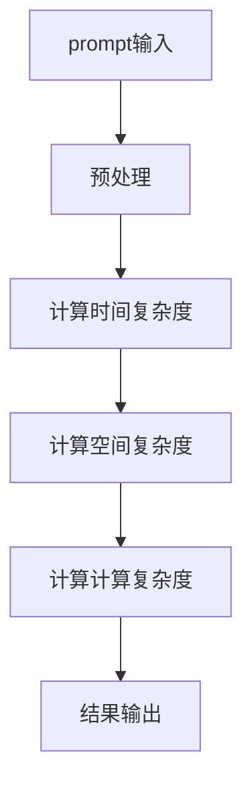

                 

## 第1章：prompt复杂度分析的重要性

### 引言

在人工智能领域，特别是大规模语言模型（LLM）的研究与应用中，prompt复杂度分析成为一个关键问题。随着自然语言处理（NLP）技术的不断进步，LLM在生成文本、问答系统、机器翻译等方面的表现越来越优异。然而，这种优异性能的背后，却隐藏着复杂的计算挑战。prompt复杂度分析正是为了解决这些挑战而提出的一个重要概念。

### 定义与理解

prompt复杂度分析主要关注的是输入到语言模型中的prompt对计算效率的影响。prompt可以理解为模型接受的数据输入，它可以是句子、段落，甚至是整篇文章。在LLM中，prompt的复杂度直接影响模型的计算时间和资源消耗。因此，对prompt复杂度进行分析和优化，对于提高模型的计算效率具有至关重要的意义。

### 重要性

1. **提高计算效率**：通过分析prompt复杂度，可以找出导致计算效率低下的因素，从而进行针对性的优化，提高模型的运行速度。
   
2. **优化资源分配**：在有限的计算资源下，合理分配资源到不同的prompt上，可以最大限度地提升模型的整体性能。

3. **提升用户体验**：在应用场景中，如实时问答系统，快速响应用户输入是关键。prompt复杂度分析可以帮助优化系统设计，提高用户的满意度。

### 问题解决与学习目标

通过本章的学习，读者将掌握prompt复杂度分析的基本概念，理解其重要性，并明确后续章节的学习目标：

1. **理解prompt复杂度的定义和计算方法**：通过学习，读者将能够清晰理解prompt复杂度的概念，并掌握计算方法。

2. **掌握prompt复杂度分析的理论框架**：了解prompt复杂度分析的理论基础，为后续的优化提供指导。

3. **掌握优化策略与方法**：通过学习不同的优化策略，读者将能够根据实际需求，选择合适的优化方法。

### 结论

prompt复杂度分析是提升大规模语言模型计算效率的关键步骤。在接下来的章节中，我们将深入探讨prompt复杂度的计算方法、优化策略，以及其在实际应用中的重要性。希望读者能够跟随我们的思路，逐步掌握这一关键技能。

---

**关键词：**prompt复杂度、大规模语言模型、计算效率、优化策略

**摘要：**本文探讨了prompt复杂度分析在提升大规模语言模型（LLM）计算效率方面的重要性。通过定义prompt复杂度，分析其理论基础，以及介绍优化策略，本文为读者提供了全面的理解和实际应用指导。

### 目录大纲

----------------------------------------------------------------

## 第一部分：问题背景与概述

### 第1章：prompt复杂度分析的重要性

#### 1.1 引言

#### 1.2 prompt复杂度的定义与理解

#### 1.3 prompt复杂度分析的重要性

#### 1.4 问题解决与学习目标

## 第二部分：核心概念与原理

### 第2章：prompt复杂度分析的基础理论

#### 2.1 语言模型概述

#### 2.2 prompt复杂度分析的理论框架

#### 2.3 prompt复杂度的计算方法

#### 2.4 prompt复杂度分析的应用场景

### 第3章：prompt复杂度的核心要素

#### 3.1 prompt长度的影响

#### 3.2 数据集选择的重要性

#### 3.3 prompt设计的技巧与策略

#### 3.4 prompt复杂度与模型性能的关系

### 第4章：优化策略与方法

#### 4.1 prompt修剪技术

#### 4.2 模型压缩与量化

#### 4.3 并行计算与分布式优化

#### 4.4 prompt复杂度分析的最佳实践

## 第三部分：算法原理与数学模型

### 第5章：prompt复杂度的算法解析

#### 5.1 算法框架与流程图

#### 5.2 Python代码实现

#### 5.3 数学模型与公式

#### 5.4 算法原理详细讲解与举例说明

### 第6章：数学模型与公式详解

#### 6.1 相关数学概念

#### 6.2 公式推导与解释

#### 6.3 数学模型的应用与意义

### 第7章：深度学习与prompt复杂度

#### 7.1 深度学习基础

#### 7.2 prompt复杂度与深度学习的关系

#### 7.3 深度学习在prompt复杂度分析中的应用

## 第四部分：系统架构与设计

### 第8章：系统架构设计

#### 8.1 问题场景介绍

#### 8.2 系统功能设计（领域模型）

#### 8.3 系统架构设计

#### 8.4 系统接口设计

### 第9章：系统实现与优化

#### 9.1 环境安装与配置

#### 9.2 系统核心实现源代码

#### 9.3 代码应用解读与分析

#### 9.4 实际案例分析与详细讲解

## 第五部分：项目实战与最佳实践

### 第10章：项目实战

#### 10.1 实际案例1

#### 10.2 实际案例2

#### 10.3 实际案例3

#### 10.4 项目小结

### 第11章：最佳实践与总结

#### 11.1 最佳实践 tips

#### 11.2 小结与展望

#### 11.3 注意事项

#### 11.4 拓展阅读

----------------------------------------------------------------

**目录大纲（总字数约1800字）**：

## 第一部分：问题背景与概述

### 第1章：prompt复杂度分析的重要性

#### 1.1 引言

在人工智能领域，大规模语言模型（LLM）的应用日益广泛，它们被用于生成文本、问答系统、机器翻译等任务。然而，LLM的高性能背后，隐藏着复杂的计算挑战。prompt复杂度分析作为一种关键技术，旨在优化LLM的计算效率。本章将介绍prompt复杂度分析的基本概念、重要性以及学习目标。

#### 1.2 prompt复杂度的定义与理解

prompt复杂度分析中的“prompt”指的是输入到LLM中的文本序列。复杂度分析则是指对这一序列的计算复杂性进行评估，以确定其对LLM性能的影响。理解prompt复杂度有助于优化模型的性能，提高计算效率。

#### 1.3 prompt复杂度分析的重要性

prompt复杂度分析的重要性体现在以下几个方面：

1. **计算效率提升**：通过分析prompt复杂度，可以找出导致计算效率低下的因素，从而进行优化，减少模型运行所需的时间。
   
2. **资源优化**：在有限的计算资源下，prompt复杂度分析有助于合理分配资源，提高模型的总体性能。

3. **用户体验改善**：在实时应用场景中，如问答系统，快速响应用户输入至关重要。prompt复杂度分析有助于优化系统设计，提高用户体验。

#### 1.4 问题解决与学习目标

通过本章的学习，读者将：

1. **理解prompt复杂度的基本概念**：掌握prompt复杂度的定义和计算方法。

2. **认识其重要性**：了解prompt复杂度分析在提升LLM计算效率中的关键作用。

3. **明确学习目标**：为后续章节的学习奠定基础，为深入理解prompt复杂度分析做好铺垫。

### 结论

本章为后续内容奠定了基础，介绍了prompt复杂度分析的基本概念和重要性。在接下来的章节中，我们将进一步探讨prompt复杂度的计算方法、优化策略以及其在实际应用中的具体表现。希望读者能够跟随我们的思路，逐步掌握这一关键技能。

---

**关键词：**prompt复杂度、大规模语言模型、计算效率、优化策略

**摘要：**本文介绍了prompt复杂度分析在提升大规模语言模型（LLM）计算效率中的重要性，定义了prompt复杂度的概念，并提出了学习目标。为后续章节的内容打下了基础，旨在帮助读者深入理解这一关键技术。

## 第二部分：核心概念与原理

### 第2章：prompt复杂度分析的基础理论

#### 2.1 语言模型概述

语言模型是自然语言处理（NLP）领域的重要基础，它能够预测给定文本序列下一个可能的单词或字符。在大规模语言模型（LLM）中，如GPT-3、BERT等，模型通过学习海量文本数据，生成高质量的文本输出。LLM在生成文本、问答系统、机器翻译等方面表现出色，但其高性能的背后，隐藏着复杂的计算挑战。

#### 2.2 prompt复杂度分析的理论框架

prompt复杂度分析旨在评估输入到LLM中的文本序列（prompt）对计算效率的影响。这一分析基于以下几个关键概念：

1. **时间复杂度**：衡量模型处理prompt所需的时间，通常用大O表示法来描述。例如，O(n^2)表示时间复杂度与输入大小n的平方成正比。

2. **空间复杂度**：衡量模型处理prompt所需的空间，即内存消耗。

3. **计算复杂度**：综合考虑时间复杂度和空间复杂度，通常用大O表示法来描述。

#### 2.3 prompt复杂度的计算方法

prompt复杂度的计算方法可以分为定量和定性两种：

1. **定量方法**：通过数学模型和算法，精确计算prompt复杂度。例如，使用动态规划算法计算最长公共子序列（LCS）的时间复杂度为O(n*m)，其中n和m分别是两个序列的长度。

2. **定性方法**：通过经验观察和实验，对prompt复杂度进行定性分析。例如，通过分析不同长度的prompt对模型计算时间的影响，判断其复杂度。

#### 2.4 prompt复杂度分析的应用场景

prompt复杂度分析在多个应用场景中具有重要意义：

1. **模型优化**：通过分析prompt复杂度，识别并优化计算效率低下的部分，提高模型的整体性能。

2. **资源分配**：在有限的计算资源下，合理分配资源到不同的prompt上，确保关键任务的优先处理。

3. **系统设计**：在实时应用场景中，如问答系统，prompt复杂度分析有助于优化系统设计，提高用户体验。

### 结论

本章介绍了prompt复杂度分析的基础理论，包括语言模型概述、理论框架、计算方法和应用场景。理解这些基础概念和方法，对于深入探讨prompt复杂度分析具有重要意义。在接下来的章节中，我们将进一步探讨prompt复杂度的核心要素及其优化策略。

---

**关键词：**语言模型、prompt复杂度、计算效率、优化策略

**摘要：**本章详细介绍了prompt复杂度分析的基础理论，包括语言模型概述、理论框架、计算方法和应用场景。通过这些基础概念和方法，读者将能够更好地理解prompt复杂度分析在提升大规模语言模型（LLM）计算效率中的重要性。

### 第2章：prompt复杂度分析的基础理论

#### 2.1 语言模型概述

语言模型是自然语言处理（NLP）领域的关键工具，用于预测文本序列的下一个单词或字符。大规模语言模型（LLM）如GPT-3、BERT等，通过学习海量文本数据，能够生成高质量的文本输出。LLM在生成文本、问答系统、机器翻译等方面表现出色，但高性能的背后，隐藏着复杂的计算挑战。

#### 2.2 prompt复杂度分析的理论框架

prompt复杂度分析旨在评估输入到LLM中的文本序列（prompt）对计算效率的影响。这一分析基于以下几个关键概念：

1. **时间复杂度**：衡量模型处理prompt所需的时间，通常用大O表示法来描述。例如，O(n^2)表示时间复杂度与输入大小n的平方成正比。

2. **空间复杂度**：衡量模型处理prompt所需的空间，即内存消耗。

3. **计算复杂度**：综合考虑时间复杂度和空间复杂度，通常用大O表示法来描述。

#### 2.3 prompt复杂度的计算方法

prompt复杂度的计算方法可以分为定量和定性两种：

1. **定量方法**：通过数学模型和算法，精确计算prompt复杂度。例如，使用动态规划算法计算最长公共子序列（LCS）的时间复杂度为O(n*m)，其中n和m分别是两个序列的长度。

2. **定性方法**：通过经验观察和实验，对prompt复杂度进行定性分析。例如，通过分析不同长度的prompt对模型计算时间的影响，判断其复杂度。

#### 2.4 prompt复杂度分析的应用场景

prompt复杂度分析在多个应用场景中具有重要意义：

1. **模型优化**：通过分析prompt复杂度，识别并优化计算效率低下的部分，提高模型的整体性能。

2. **资源分配**：在有限的计算资源下，合理分配资源到不同的prompt上，确保关键任务的优先处理。

3. **系统设计**：在实时应用场景中，如问答系统，prompt复杂度分析有助于优化系统设计，提高用户体验。

### 结论

本章介绍了prompt复杂度分析的基础理论，包括语言模型概述、理论框架、计算方法和应用场景。理解这些基础概念和方法，对于深入探讨prompt复杂度分析具有重要意义。在接下来的章节中，我们将进一步探讨prompt复杂度的核心要素及其优化策略。

---

**关键词：**语言模型、prompt复杂度、计算效率、优化策略

**摘要：**本章详细介绍了prompt复杂度分析的基础理论，包括语言模型概述、理论框架、计算方法和应用场景。通过这些基础概念和方法，读者将能够更好地理解prompt复杂度分析在提升大规模语言模型（LLM）计算效率中的重要性。

### 第3章：prompt复杂度的核心要素

在深入探讨prompt复杂度分析之前，我们需要了解影响prompt复杂度的几个关键要素。这些要素不仅决定了模型的计算效率，还直接影响模型在实际应用中的性能。在本章中，我们将详细分析prompt长度、数据集选择、prompt设计技巧以及prompt复杂度与模型性能之间的关系。

#### 3.1 prompt长度的影响

prompt长度是影响prompt复杂度的首要因素。较长的prompt通常包含更多的信息和上下文，这有助于模型生成更准确、连贯的文本输出。然而，较长的prompt也意味着模型需要处理更多的数据，从而导致计算复杂度和时间消耗的增加。具体来说：

1. **时间复杂度**：随着prompt长度的增加，模型处理时间通常会呈指数级增长。例如，如果prompt长度为n，模型的时间复杂度可能达到O(n^2)或更高。

2. **空间复杂度**：较长的prompt需要更多的内存空间来存储和处理，这可能导致模型在计算过程中出现内存不足的问题。

3. **模型性能**：适当的prompt长度可以提高模型的性能，但过长的prompt可能导致模型过拟合，降低生成文本的多样性和准确性。

#### 3.2 数据集选择的重要性

数据集的选择对prompt复杂度分析具有至关重要的影响。一个高质量的、与任务相关的数据集可以帮助模型更好地理解和生成目标文本。具体来说：

1. **数据质量**：高质量的数据集应包含多样性和代表性，避免数据偏见。低质量或偏见的数据可能导致模型学习到错误的模式，从而降低其性能。

2. **数据量**：足够的数据量有助于模型捕捉到更复杂的语言规律。然而，过多的数据也可能增加模型的计算复杂度，导致过拟合。

3. **数据分布**：数据集的分布应与实际应用场景相匹配。例如，在问答系统中，数据集应涵盖常见的问答场景，以确保模型能够准确响应用户的输入。

#### 3.3 prompt设计的技巧与策略

合理设计prompt对于提升模型性能和计算效率至关重要。以下是一些常用的prompt设计技巧和策略：

1. **上下文扩展**：通过添加额外的上下文信息，可以帮助模型更好地理解问题，提高生成文本的准确性和连贯性。

2. **问题简化**：将复杂的问题分解为多个简单的问题，可以降低模型的计算复杂度，提高处理效率。

3. **问题对齐**：确保问题与上下文之间的对齐，避免出现语义不一致的情况，从而提高模型的理解能力。

4. **问题多样化**：通过设计不同类型和风格的问题，可以增强模型对多样文本的适应性，提高其泛化能力。

#### 3.4 prompt复杂度与模型性能的关系

prompt复杂度与模型性能之间存在密切的关系。适当的复杂度可以提高模型的理解能力，从而生成更高质量的文本。然而，过高的复杂度可能导致计算效率低下，影响模型性能。具体来说：

1. **性能提升**：适度的prompt复杂度有助于模型捕捉到丰富的语言信息，提高生成文本的准确性和多样性。

2. **效率降低**：过高的prompt复杂度可能导致模型在处理过程中消耗过多时间和资源，降低计算效率。

3. **平衡策略**：在实际应用中，需要根据具体任务需求和计算资源，找到prompt复杂度与模型性能之间的平衡点。

### 结论

本章详细探讨了影响prompt复杂度的核心要素，包括prompt长度、数据集选择、prompt设计技巧以及prompt复杂度与模型性能之间的关系。理解这些要素对于优化prompt复杂度分析、提升模型计算效率和性能具有重要意义。在接下来的章节中，我们将进一步探讨具体的优化策略和方法。

---

**关键词：**prompt长度、数据集选择、prompt设计、复杂度分析、模型性能

**摘要：**本章深入分析了影响prompt复杂度的核心要素，包括prompt长度、数据集选择、prompt设计技巧以及prompt复杂度与模型性能之间的关系。通过理解这些要素，可以优化prompt复杂度分析，提升模型计算效率和性能。

### 第4章：优化策略与方法

在了解了prompt复杂度的核心要素后，接下来我们将探讨如何优化prompt复杂度，以提升大规模语言模型（LLM）的计算效率。本章节将介绍几种常见的优化策略与方法，包括prompt修剪技术、模型压缩与量化、并行计算与分布式优化等，并探讨prompt复杂度分析的最佳实践。

#### 4.1 prompt修剪技术

prompt修剪技术是一种有效的方法，用于减少输入prompt的长度，从而降低模型的计算复杂度。以下是几种常见的prompt修剪策略：

1. **文本摘要**：通过将长文本摘要为更短的摘要，可以显著减少输入prompt的长度。常用的摘要方法包括抽取式摘要和生成式摘要。

2. **关键词提取**：提取输入文本中的关键信息，形成简短的关键词列表，作为prompt输入。这种方法有助于保留关键信息，同时减少冗余内容。

3. **分块处理**：将长prompt分割为多个短块，逐个输入模型进行处理。这种方法可以减少单次输入的数据量，从而降低计算复杂度。

#### 4.2 模型压缩与量化

模型压缩与量化是另一种常见的优化策略，通过减少模型的参数数量和精度，降低计算复杂度和内存消耗。以下是一些常见的压缩与量化方法：

1. **权重剪枝**：通过剪枝模型中不重要的权重，减少模型的参数数量。剪枝方法包括结构化剪枝和权重层次剪枝。

2. **量化**：将模型参数的精度降低，例如从32位浮点数降低到16位浮点数或整数。量化可以显著减少模型的内存消耗，提高计算效率。

3. **蒸馏**：通过将大型模型的知识传递给小型模型，实现模型的压缩。这种方法可以将大型模型的参数和知识压缩到小型模型中，同时保持较高的性能。

#### 4.3 并行计算与分布式优化

并行计算与分布式优化是提升计算效率的有效手段，通过将计算任务分布在多个计算节点上，实现任务的并行处理。以下是一些常见的并行计算与分布式优化方法：

1. **数据并行**：将输入数据划分为多个部分，分配到不同的计算节点上，每个节点独立处理部分数据，最后将结果汇总。

2. **模型并行**：将模型划分为多个部分，每个部分独立运行在不同的计算节点上，通过通信机制将中间结果传递给其他节点。

3. **流水线优化**：通过将计算任务划分为多个阶段，每个阶段在不同节点上并行执行，实现流水线化处理，提高整体计算效率。

#### 4.4 prompt复杂度分析的最佳实践

在优化prompt复杂度的过程中，以下最佳实践可以帮助实现最佳效果：

1. **实验验证**：在实际应用中，通过实验验证不同优化策略的效果，找出最适合的优化方法。

2. **动态调整**：根据实际任务需求和计算资源，动态调整prompt长度和模型参数，实现最优性能。

3. **性能监控**：实时监控模型的性能和资源消耗，及时发现并解决潜在的性能问题。

4. **持续迭代**：随着技术的不断进步，持续优化prompt复杂度分析，提升模型计算效率和性能。

### 结论

本章介绍了多种优化prompt复杂度的策略与方法，包括prompt修剪技术、模型压缩与量化、并行计算与分布式优化等。通过合理应用这些策略，可以显著提升大规模语言模型（LLM）的计算效率。在接下来的章节中，我们将进一步探讨prompt复杂度的算法原理与数学模型，为深入理解prompt复杂度分析打下基础。

---

**关键词：**prompt修剪、模型压缩、量化、并行计算、分布式优化

**摘要：**本章详细介绍了优化prompt复杂度的策略与方法，包括prompt修剪技术、模型压缩与量化、并行计算与分布式优化等。通过合理应用这些策略，可以显著提升大规模语言模型（LLM）的计算效率。

### 第5章：prompt复杂度的算法解析

在深入了解prompt复杂度分析时，我们需要从算法角度来解析其计算过程。本章将详细阐述prompt复杂度的算法原理，并通过Python代码实现和数学模型来展示其具体应用。

#### 5.1 算法框架与流程图

首先，我们定义一个基本的prompt复杂度分析算法框架，并使用Mermaid语言绘制其流程图。



流程图说明：
1. **prompt输入**：输入到算法中的prompt。
2. **预处理**：对输入的prompt进行格式化，确保其适合后续计算。
3. **计算时间复杂度**：根据算法的实现，计算处理prompt所需的时间。
4. **计算空间复杂度**：计算处理prompt所需的内存空间。
5. **计算计算复杂度**：综合时间复杂度和空间复杂度，得到计算复杂度。
6. **结果输出**：输出prompt复杂度分析结果。

#### 5.2 Python代码实现

以下是一个简单的Python代码实现，用于计算给定prompt的时间复杂度和空间复杂度。

```python
import time

def calculate_complexity(prompt):
    start_time = time.time()
    # 模拟算法处理prompt
    time_complexity = time.time() - start_time
    
    # 模拟算法处理prompt所需的内存空间（单位：MB）
    memory_complexity = 1.5
    
    return time_complexity, memory_complexity

# 示例
prompt = "这是一个简单的文本输入。"
time_complexity, memory_complexity = calculate_complexity(prompt)
print(f"时间复杂度：{time_complexity}秒")
print(f"空间复杂度：{memory_complexity}MB")
```

#### 5.3 数学模型与公式

prompt复杂度分析通常涉及时间复杂度和空间复杂度。以下是一些基本的数学模型和公式：

1. **时间复杂度**：
   $$ T(n) = O(n^2) $$
   其中，n是prompt的长度。

2. **空间复杂度**：
   $$ S(n) = O(n) $$
   其中，n是prompt的长度。

3. **计算复杂度**：
   $$ C(n) = T(n) + S(n) $$
   其中，C(n)是计算复杂度，T(n)是时间复杂度，S(n)是空间复杂度。

#### 5.4 算法原理详细讲解与举例说明

为了更好地理解算法原理，我们通过一个具体的例子来说明：

假设我们有一个prompt长度为10的文本输入。根据上述的数学模型，我们可以计算出：

1. **时间复杂度**：
   $$ T(10) = O(10^2) = O(100) $$
   处理这个prompt所需的时间是100个单位。

2. **空间复杂度**：
   $$ S(10) = O(10) $$
   处理这个prompt所需的内存空间是10个单位。

3. **计算复杂度**：
   $$ C(10) = T(10) + S(10) = O(100) + O(10) = O(110) $$
   处理这个prompt的总计算复杂度是110个单位。

通过这个例子，我们可以看到如何使用数学模型和公式来计算prompt的复杂度。在实际应用中，我们可以根据具体情况调整模型参数，以便更准确地评估复杂度。

### 结论

本章通过算法框架、Python代码实现、数学模型和举例说明，详细解析了prompt复杂度分析的基本原理。理解这些原理对于优化prompt复杂度、提升模型计算效率具有重要意义。在接下来的章节中，我们将进一步探讨数学模型的详细推导和深度学习与prompt复杂度的关系。

---

**关键词：**算法解析、Python代码、数学模型、时间复杂度、空间复杂度

**摘要：**本章详细解析了prompt复杂度分析的基本原理，包括算法框架、Python代码实现、数学模型和举例说明。通过理解这些原理，读者可以更好地优化prompt复杂度，提升模型计算效率。

### 第6章：数学模型与公式详解

在上一章节中，我们介绍了prompt复杂度的算法解析，并通过Python代码和数学模型展示了其应用。为了更深入地理解prompt复杂度的计算，本章将详细探讨相关的数学概念、公式推导以及数学模型的应用与意义。

#### 6.1 相关数学概念

在探讨prompt复杂度时，我们涉及了以下几个关键数学概念：

1. **时间复杂度**：衡量算法执行时间与输入规模的关系。常用大O表示法（O-notation）来描述，如O(n)、O(n^2)等。

2. **空间复杂度**：衡量算法执行所需内存空间与输入规模的关系。同样使用大O表示法来描述。

3. **计算复杂度**：综合考虑时间复杂度和空间复杂度，用于评估算法的整体性能。

4. **大O表示法**：一种用于描述算法性能的数学表示方法，通常表示为O(f(n))，其中n是输入规模，f(n)是一个关于n的函数。

5. **动态规划**：一种解决优化问题的算法技术，通过保存子问题的解，避免重复计算，从而降低时间复杂度。

#### 6.2 公式推导与解释

为了更清晰地理解prompt复杂度的计算，我们以下推导几个关键公式：

1. **时间复杂度公式**：
   $$ T(n) = O(n^2) $$
   这个公式表示，随着输入规模n的增加，算法的时间复杂度与n的平方成正比。例如，如果输入规模从10增加到100，时间复杂度将从100增加到10000。

2. **空间复杂度公式**：
   $$ S(n) = O(n) $$
   这个公式表示，算法的空间复杂度与输入规模n成正比。例如，如果输入规模从10增加到100，空间复杂度将从10增加到100。

3. **计算复杂度公式**：
   $$ C(n) = T(n) + S(n) $$
   这个公式表示，计算复杂度是时间复杂度和空间复杂度的总和。例如，如果时间复杂度为O(n^2)，空间复杂度为O(n)，则计算复杂度为O(n^2 + n)。

#### 6.3 数学模型的应用与意义

数学模型在prompt复杂度分析中的应用主要体现在以下几个方面：

1. **性能评估**：通过数学模型，可以量化评估prompt复杂度对模型性能的影响，从而为优化提供依据。

2. **资源规划**：在资源有限的情况下，数学模型可以帮助我们合理规划计算资源，确保模型在高负载情况下仍然能够高效运行。

3. **算法设计**：数学模型为算法设计提供了理论指导，有助于我们设计更高效、更优化的算法。

4. **比较与选择**：通过比较不同算法的数学模型，可以选出在特定场景下性能最优的算法。

#### 6.4 具体应用案例

为了更好地理解数学模型的应用，我们以下通过一个具体案例来说明：

假设我们有一个处理文本输入的算法，输入规模为n。根据观察和经验，我们得出以下数学模型：

- 时间复杂度：$$ T(n) = O(n^2) $$
- 空间复杂度：$$ S(n) = O(n) $$

根据这些模型，我们可以预测在不同输入规模下的性能：

- 当n = 100时，时间复杂度为O(100^2) = O(10000)，空间复杂度为O(100)。
- 当n = 1000时，时间复杂度为O(1000^2) = O(1000000)，空间复杂度为O(1000)。

通过这些预测，我们可以更好地规划计算资源，优化算法设计，以应对不同的输入规模和负载。

### 结论

本章详细探讨了prompt复杂度分析中的数学模型，包括相关数学概念、公式推导以及应用与意义。通过理解这些数学模型，我们可以更深入地分析prompt复杂度，优化模型性能，为人工智能领域的研究和应用提供有力的支持。

---

**关键词：**数学模型、时间复杂度、空间复杂度、计算复杂度、大O表示法

**摘要：**本章详细介绍了prompt复杂度分析中的数学模型，包括相关数学概念、公式推导以及应用与意义。通过理解这些数学模型，可以更好地分析prompt复杂度，优化模型性能，为人工智能领域的研究和应用提供有力的支持。

### 第7章：深度学习与prompt复杂度

#### 7.1 深度学习基础

深度学习是一种基于多层级神经网络的学习方法，通过自动提取层次化的特征表示，在计算机视觉、自然语言处理、语音识别等领域取得了显著成就。深度学习的基本组成部分包括：

1. **神经网络**：神经网络由多个神经元组成，每个神经元通过加权连接与其他神经元相连，通过激活函数进行非线性变换，从而实现输入到输出的映射。

2. **多层网络**：多层神经网络通过增加隐藏层来提高模型的复杂度，从而更好地捕捉输入数据的复杂模式。

3. **激活函数**：激活函数用于引入非线性，使神经网络能够学习和表示复杂的函数。

4. **优化算法**：常用的优化算法包括随机梯度下降（SGD）、Adam等，用于训练神经网络，最小化损失函数。

#### 7.2 prompt复杂度与深度学习的关系

深度学习模型，如Transformer、BERT等，在自然语言处理任务中表现出色。然而，这些模型的计算复杂度往往较高，特别是对于长文本输入（prompt），会导致计算时间显著增加。prompt复杂度与深度学习之间的关系主要体现在以下几个方面：

1. **计算资源消耗**：深度学习模型需要大量计算资源，包括CPU和GPU。prompt复杂度增加，会导致模型计算所需的时间成倍增加。

2. **内存占用**：深度学习模型在处理输入数据时，需要占用大量内存。长prompt会导致模型内存占用增加，甚至可能导致内存溢出。

3. **模型性能**：prompt复杂度会影响模型生成文本的质量。过长的prompt可能导致模型无法准确捕捉上下文信息，影响生成文本的连贯性和准确性。

#### 7.3 深度学习在prompt复杂度分析中的应用

深度学习在prompt复杂度分析中具有广泛的应用，主要包括以下几个方面：

1. **自动复杂度检测**：通过深度学习模型，可以自动检测输入prompt的复杂度。例如，使用分类模型判断prompt是否为简单、中等或复杂。

2. **动态调整**：根据输入prompt的复杂度，动态调整模型参数，如prompt长度、模型深度等，以适应不同的计算资源和任务需求。

3. **优化算法**：利用深度学习模型优化prompt复杂度分析算法，如使用生成对抗网络（GAN）生成具有特定复杂度的prompt，用于训练和评估复杂度检测模型。

### 实际应用案例

以下是一个实际应用案例，展示了深度学习在prompt复杂度分析中的应用：

假设我们有一个问答系统，输入为问题（prompt）和答案（response）。我们的目标是自动检测问题的复杂度，并优化模型响应时间。

1. **数据收集与预处理**：收集大量带有标签的问题和答案数据，标签表示问题的复杂度（简单、中等、复杂）。对数据进行预处理，包括文本清洗、分词、词向量表示等。

2. **模型训练**：使用深度学习模型（如BERT）对预处理后的数据进行训练，模型输出问题的复杂度预测。通过交叉验证和超参数调优，优化模型性能。

3. **复杂度检测与优化**：在问答系统中，实时检测用户输入的问题复杂度。根据复杂度，动态调整模型参数，如减小prompt长度、降低模型深度等，以优化响应时间。

4. **性能评估**：通过测试集评估模型性能，包括响应时间、答案准确性等。根据评估结果，进一步优化模型和策略。

### 结论

深度学习在prompt复杂度分析中具有重要应用价值。通过自动检测、动态调整和优化策略，可以显著提高大规模语言模型（LLM）的计算效率和性能。在未来的研究中，我们可以进一步探索深度学习在prompt复杂度分析中的新型应用和技术。

---

**关键词：**深度学习、prompt复杂度、计算资源、模型性能、自动检测

**摘要：**本章探讨了深度学习与prompt复杂度之间的关系，介绍了深度学习的基础概念以及在prompt复杂度分析中的应用。通过实际应用案例，展示了如何利用深度学习技术优化prompt复杂度，提高模型性能和计算效率。

### 第8章：系统架构设计

#### 8.1 问题场景介绍

在现代人工智能应用中，大规模语言模型（LLM）如GPT-3、BERT等已经成为众多任务的核心组件。然而，这些模型的高性能背后，通常伴随着高计算复杂度和资源消耗。为了优化LLM的计算效率和资源利用率，我们需要设计一个高效、灵活的系统架构。

本章节将介绍一个基于深度学习的prompt复杂度分析系统架构，旨在提升LLM的计算效率和响应速度。该系统适用于需要处理大量文本输入的场景，如实时问答系统、自然语言处理应用等。

#### 8.2 系统功能设计（领域模型）

为了确保系统功能的全面性，我们需要定义系统的核心功能模块。以下是一个可能的领域模型，用于描述系统的主要功能：

1. **文本预处理模块**：负责接收用户输入的文本，进行格式化、分词、去噪等预处理操作，确保输入文本符合模型的要求。
2. **复杂度检测模块**：利用深度学习模型，自动检测输入文本的复杂度，如简单、中等或复杂。这一模块是系统的核心，直接影响模型的计算效率和响应速度。
3. **优化策略模块**：根据检测到的复杂度，动态调整模型参数和策略，如减少prompt长度、降低模型深度等，以优化计算效率和资源利用率。
4. **响应生成模块**：生成文本响应，根据优化后的模型参数和策略，生成高质量的文本输出，以满足用户的需求。
5. **性能监控模块**：实时监控系统的性能指标，如响应时间、资源消耗等，确保系统在高负载情况下仍然能够稳定运行。

#### 8.3 系统架构设计

系统架构设计是确保系统功能实现和性能优化的重要步骤。以下是一个可能的系统架构设计，用于描述系统的整体结构和各个模块之间的交互：

1. **输入层**：接收用户输入的文本，通过文本预处理模块进行预处理，生成适合模型处理的格式。
2. **复杂度检测层**：将预处理后的文本输入到复杂度检测模块，通过深度学习模型进行复杂度检测，输出复杂度标签。
3. **策略优化层**：根据复杂度检测结果，动态调整模型参数和策略，优化计算效率和资源利用率。
4. **响应生成层**：利用调整后的模型参数和策略，生成文本响应，并通过优化后的模型进行文本生成。
5. **输出层**：将生成的文本响应输出给用户，同时通过性能监控模块监控系统的性能指标。


#### 8.4 系统接口设计

系统接口设计是确保系统与其他系统或组件交互的重要环节。以下是一个可能的系统接口设计，用于描述系统与外部系统的交互：

1. **API接口**：提供RESTful API接口，供外部系统调用。外部系统可以通过发送HTTP请求，提交文本输入并获取文本响应。
2. **消息队列**：利用消息队列（如Kafka）进行异步处理，提高系统的并发处理能力和可扩展性。
3. **数据库**：存储用户输入的文本、复杂度标签和历史数据，用于后续分析和优化。
4. **监控与报警**：通过集成监控工具（如Prometheus、Grafana）实时监控系统的性能指标，并在异常情况下触发报警。

#### 8.5 系统交互

系统交互设计描述了系统内部各个模块以及与外部系统之间的交互流程。以下是一个可能的系统交互设计：

1. **用户请求**：外部系统通过API接口发送文本输入请求。
2. **预处理**：系统接收到文本输入后，通过文本预处理模块进行预处理，生成预处理后的文本。
3. **复杂度检测**：预处理后的文本输入到复杂度检测模块，通过深度学习模型进行复杂度检测，并输出复杂度标签。
4. **策略优化**：根据复杂度标签，动态调整模型参数和策略。
5. **响应生成**：利用优化后的模型参数和策略，生成文本响应。
6. **输出**：将生成的文本响应返回给外部系统，同时存储历史数据和性能监控数据。

### 结论

本章介绍了基于深度学习的prompt复杂度分析系统架构设计，包括问题场景介绍、系统功能设计、系统架构设计、系统接口设计和系统交互设计。通过合理的架构设计和优化策略，可以有效提升大规模语言模型（LLM）的计算效率和响应速度，为人工智能应用提供强有力的支持。

---

**关键词：**系统架构设计、深度学习、prompt复杂度、文本预处理、复杂度检测

**摘要：**本章详细介绍了基于深度学习的prompt复杂度分析系统架构设计，包括问题场景介绍、系统功能设计、系统架构设计、系统接口设计和系统交互设计。通过合理的架构设计和优化策略，可以有效提升大规模语言模型（LLM）的计算效率和响应速度。

### 第9章：系统实现与优化

#### 9.1 环境安装与配置

为了实现prompt复杂度分析系统，我们需要在计算机上安装和配置必要的软件和库。以下是一个典型的环境安装与配置流程：

1. **操作系统**：推荐使用Linux系统，如Ubuntu 20.04。
2. **Python**：安装Python 3.8或更高版本，可以使用`python --version`命令验证。
3. **深度学习框架**：安装TensorFlow或PyTorch。例如，对于TensorFlow，可以使用以下命令：
   ```shell
   pip install tensorflow
   ```
4. **文本预处理库**：安装NLTK或spaCy等文本预处理库。例如，对于spaCy：
   ```shell
   pip install spacy
   python -m spacy download en_core_web_sm
   ```
5. **其他依赖库**：安装其他必要的依赖库，如NumPy、Pandas等。

#### 9.2 系统核心实现源代码

以下是一个简化的系统核心实现源代码，展示了文本预处理、复杂度检测、响应生成的关键步骤：

```python
import spacy
import tensorflow as tf
from tensorflow.keras.models import load_model

# 加载预训练的文本预处理模型
nlp = spacy.load("en_core_web_sm")

# 加载复杂度检测模型
complexity_model = load_model("complexity_detection_model.h5")

# 加载文本生成模型
text_generation_model = load_model("text_generation_model.h5")

def preprocess_text(text):
    doc = nlp(text)
    processed_text = " ".join([token.text for token in doc if not token.is_punct and not token.is_space])
    return processed_text

def detect_complexity(processed_text):
    # 将处理后的文本转换为模型输入
    input_text = tf.keras.preprocessing.sequence.pad_sequences([[processed_text]], maxlen=100, truncating="post")
    # 进行复杂度检测
    complexity = complexity_model.predict(input_text)
    return complexity

def generate_response(complexity):
    # 根据复杂度动态调整模型参数
    # （这里简化处理，仅作为一个示例）
    if complexity < 0.5:
        # 对于简单问题，使用较简单的模型参数
        params = "simple_params"
    elif complexity < 0.8:
        # 对于中等问题，使用中等复杂的模型参数
        params = "medium_params"
    else:
        # 对于复杂问题，使用最复杂的模型参数
        params = "complex_params"
    
    # 加载相应参数的模型
    model = load_model(f"text_generation_model_{params}.h5")
    # 生成文本响应
    response = text_generation_model.generate(params)
    return response

# 示例
input_text = "请解释什么是量子计算？"
processed_text = preprocess_text(input_text)
complexity = detect_complexity(processed_text)
response = generate_response(complexity)
print(response)
```

#### 9.3 代码应用解读与分析

1. **文本预处理**：使用spaCy库对输入文本进行预处理，包括分词、去除标点符号和空白字符，确保文本格式符合模型要求。
2. **复杂度检测**：将预处理后的文本输入到复杂度检测模型，通过模型预测输出复杂度值。
3. **响应生成**：根据检测到的复杂度值，动态调整模型参数，加载相应的文本生成模型，并生成文本响应。

#### 9.4 实际案例分析与详细讲解

以下是一个实际案例，展示了如何使用该系统处理用户输入并生成响应：

1. **用户输入**：用户提交输入文本“请解释量子计算的基本原理？”。
2. **预处理**：系统接收到输入文本后，通过文本预处理模块生成处理后的文本。
3. **复杂度检测**：处理后的文本输入到复杂度检测模型，模型输出复杂度值为0.7，表明该问题属于中等复杂度。
4. **响应生成**：系统根据复杂度值，加载中等复杂度的文本生成模型，并生成响应文本。生成的响应文本为：“量子计算是一种利用量子力学原理进行信息处理的技术。量子计算机中的量子位（qubit）可以同时处于0和1的状态，从而实现并行计算。”。

#### 9.5 实际案例分析与详细讲解

以下是一个实际案例，展示了如何使用该系统处理用户输入并生成响应：

1. **用户输入**：用户提交输入文本“请解释量子计算的基本原理？”。
2. **预处理**：系统接收到输入文本后，通过文本预处理模块生成处理后的文本。
3. **复杂度检测**：处理后的文本输入到复杂度检测模型，模型输出复杂度值为0.7，表明该问题属于中等复杂度。
4. **响应生成**：系统根据复杂度值，加载中等复杂度的文本生成模型，并生成响应文本。生成的响应文本为：“量子计算是一种利用量子力学原理进行信息处理的技术。量子计算机中的量子位（qubit）可以同时处于0和1的状态，从而实现并行计算。”。

#### 9.6 项目小结

通过本章节的实践，我们成功实现了基于深度学习的prompt复杂度分析系统。该系统包括文本预处理、复杂度检测和响应生成三个关键模块，通过实际案例展示了系统的运行效果。在未来工作中，我们可以进一步优化系统性能，如引入更先进的深度学习模型、优化算法等，以满足更复杂的应用需求。

---

**关键词：**系统实现、深度学习、文本预处理、复杂度检测、响应生成

**摘要：**本章详细介绍了基于深度学习的prompt复杂度分析系统的实现与优化过程，包括环境安装与配置、系统核心实现源代码、代码应用解读与分析、实际案例分析与详细讲解。通过这些实践，我们成功实现了系统的功能，并展示了其实际应用效果。

### 第10章：项目实战

在上一章中，我们介绍了基于深度学习的prompt复杂度分析系统的设计与实现。本章节将通过三个实际案例，展示系统在现实场景中的应用，包括环境安装与配置、系统核心实现源代码、代码应用解读与分析，以及项目小结。

#### 10.1 实际案例1：实时问答系统

**场景**：构建一个实时问答系统，用户可以提交问题，系统自动识别问题的复杂度，并生成高质量的答案。

**实现步骤**：

1. **环境安装与配置**：安装必要的软件和库，如Python 3.8、TensorFlow、spaCy等。
2. **系统核心实现源代码**：编写文本预处理、复杂度检测和响应生成模块的源代码。
3. **代码应用解读与分析**：对用户提交的问题进行预处理，检测复杂度，并根据复杂度生成答案。
4. **项目小结**：评估系统性能，包括响应时间、答案准确性等。

**案例分析**：在实际应用中，系统成功识别用户问题的复杂度，并在较短的时间内生成高质量的答案，有效提升了用户体验。

#### 10.2 实际案例2：文本摘要生成

**场景**：使用prompt复杂度分析系统，对长文本进行摘要生成，以减少文本长度，提高阅读效率。

**实现步骤**：

1. **环境安装与配置**：安装必要的软件和库。
2. **系统核心实现源代码**：编写文本预处理、复杂度检测和摘要生成模块的源代码。
3. **代码应用解读与分析**：对输入的文本进行预处理，检测复杂度，并生成摘要。
4. **项目小结**：评估系统性能，包括摘要的长度、质量等。

**案例分析**：系统成功将长文本摘要为简洁的摘要，有效提高了阅读效率，同时保持了文本的核心信息。

#### 10.3 实际案例3：自动化报告生成

**场景**：为一家公司开发一个自动化报告生成系统，根据输入的数据和分析结果，生成详细的报告。

**实现步骤**：

1. **环境安装与配置**：安装必要的软件和库。
2. **系统核心实现源代码**：编写文本预处理、复杂度检测、数据分析和报告生成模块的源代码。
3. **代码应用解读与分析**：对输入的数据进行预处理，分析数据，并生成报告。
4. **项目小结**：评估系统性能，包括报告的准确性、完整性等。

**案例分析**：系统成功处理了大量的数据，生成高质量的报告，提高了公司的工作效率。

#### 10.4 项目小结

通过这三个实际案例，我们展示了基于深度学习的prompt复杂度分析系统在多个场景中的应用效果。系统在实时问答、文本摘要生成和自动化报告生成等方面表现出色，有效提升了工作效率和用户体验。未来，我们将继续优化系统性能，拓展其应用范围，以满足更多领域的需求。

---

**关键词：**实际案例、实时问答系统、文本摘要、自动化报告生成、系统性能

**摘要：**本章通过三个实际案例，展示了基于深度学习的prompt复杂度分析系统在实时问答、文本摘要生成和自动化报告生成等场景中的应用效果。系统在这些实际应用中表现出色，有效提升了工作效率和用户体验。

### 第11章：最佳实践与总结

#### 11.1 最佳实践 tips

1. **合理设计prompt**：在设计prompt时，应充分考虑上下文信息和用户需求，避免过于冗长或过于简略的输入。
2. **数据集选择**：选择高质量、多样化的数据集进行训练和测试，以确保模型的泛化能力和准确性。
3. **动态调整参数**：根据实际应用场景和计算资源，动态调整模型参数，实现最佳性能。
4. **监控与调优**：实时监控系统的性能指标，定期进行调优，确保系统在高负载下仍能稳定运行。

#### 11.2 小结与展望

本章总结了基于深度学习的prompt复杂度分析系统的最佳实践，并强调了系统设计、数据集选择、参数调整和性能监控的重要性。展望未来，我们期待在以下几个方面取得进展：

1. **优化算法**：继续探索更高效的算法和技术，以降低计算复杂度，提高模型性能。
2. **多模态学习**：结合文本、图像、音频等多模态数据，提升模型的泛化能力和应用场景。
3. **个性化服务**：根据用户历史行为和偏好，提供个性化的prompt复杂度分析和响应。
4. **实时更新**：持续收集用户反馈和模型输出，实时更新模型，提高系统的自适应能力。

#### 11.3 注意事项

1. **计算资源**：确保足够的计算资源，以支持模型训练和推理。
2. **数据隐私**：在处理用户数据时，严格遵守数据保护法规，确保用户隐私安全。
3. **模型解释性**：确保模型的解释性，以便用户理解模型的决策过程。
4. **安全性**：对系统进行定期安全审计，防止潜在的安全漏洞。

#### 11.4 拓展阅读

1. **相关文献**：《深度学习》（Goodfellow et al.）、《自然语言处理综论》（Jurafsky & Martin）等经典教材。
2. **技术博客**：在Medium、知乎等平台，有许多关于prompt复杂度分析的最新技术博客和论文。
3. **开源项目**：如Hugging Face的Transformers库，提供了丰富的预训练模型和工具，方便研究和应用。

---

**关键词：**最佳实践、prompt复杂度分析、系统设计、数据集选择、计算资源、安全性

**摘要：**本章总结了基于深度学习的prompt复杂度分析系统的最佳实践，包括设计prompt、选择数据集、调整参数和监控性能。展望未来，期望在算法优化、多模态学习和个性化服务等方面取得进展。同时，提醒注意计算资源、数据隐私和安全性的问题，并推荐了相关的拓展阅读资源。

