                 

### 引言：Prompt工程师的角色与使命

#### 1.1 问题背景

在当今数据驱动的时代，人工智能（AI）已经成为推动技术进步的重要力量。Prompt工程作为AI领域中的一项关键技术，越来越受到重视。Prompt工程，顾名思义，指的是通过设计特定的提示（Prompt）来引导AI模型进行决策或生成输出。这种技术广泛应用于自然语言处理（NLP）、推荐系统、图像识别等领域。然而，随着应用场景的多样化和复杂性增加，Prompt工程师需要掌握一系列核心技能，才能胜任这一角色。

Prompt工程师的角色不仅仅是编写代码和调试算法，他们还需要具备深入理解业务需求、数据特性、模型性能等多方面知识。同时，Prompt工程师还需要面对数据质量和数据隐私等现实挑战，如何在保证模型性能的同时，确保数据的安全性和合规性，也是他们必须解决的问题。

#### 1.2 提出的问题

针对Prompt工程师的角色与使命，我们提出以下问题：

1. **Prompt工程师需要掌握哪些基础知识和技能？**
2. **Prompt的设计原则和流程是什么？**
3. **如何评估和调优Prompt的性能？**
4. **在实际项目中，Prompt工程师应该如何应用这些技能？**
5. **面对当前和未来的挑战，Prompt工程师需要哪些高级技能和优化方法？**

#### 1.3 解决方案概述

为了回答上述问题，本文将采用以下结构：

- **第一部分：基础篇**  
  包括引言、基本概念、数据处理与准备、Prompt设计原则、Prompt评估方法以及Prompt调优技巧。这一部分将详细介绍Prompt工程师所需的基础知识和技能。

- **第二部分：进阶篇**  
  包括实际项目应用、高级技巧与优化以及挑战与未来趋势。这一部分将探讨Prompt工程师在复杂项目中的实际应用，以及如何应对未来的技术挑战。

- **第三部分：最佳实践与总结**  
  包括最佳实践建议、小结、注意事项和拓展阅读。这一部分将为Prompt工程师提供实际操作指南，并总结全文的核心观点。

通过以上结构，本文旨在系统地阐述Prompt工程师的核心技能培养，帮助读者全面了解这一领域，并为其未来的发展提供指导。

#### 1.4 边界与外延

本文主要聚焦于Prompt工程师在AI领域的核心技能培养，但Prompt技术不仅仅局限于这一领域。事实上，Prompt工程的概念和应用已经渗透到多个技术领域，如计算机视觉、语音识别、推荐系统等。因此，本文的讨论不仅仅局限于某一特定场景，而是旨在为Prompt工程师提供一个全面的技能培养框架。

此外，本文虽然以技术角度为主，但也会涉及一些业务层面的内容，如项目需求分析、系统设计等。这是因为Prompt工程师不仅需要技术能力，还需要理解业务需求，才能设计出符合实际应用场景的Prompt。

最后，本文将讨论Prompt工程师面临的当前和未来挑战，如数据隐私、模型可解释性等。这些问题不仅影响Prompt工程师的工作，也关系到AI技术的可持续发展。因此，本文将尝试从多个维度探讨这些挑战，并提出可能的解决方案。

#### 1.5 核心要素

本文的核心要素可以归纳为以下几点：

1. **基础知识和技能**：包括AI基础知识、数据处理技能、编程语言和工具使用等。
2. **设计原则和流程**：介绍Prompt设计的原则和具体步骤，帮助工程师设计高效的Prompt。
3. **评估和调优方法**：详细讲解评估Prompt性能的指标和方法，以及调优技巧。
4. **实际项目应用**：通过具体项目案例，展示Prompt工程师如何在实际项目中应用所学技能。
5. **高级技巧与优化**：探讨高级Prompt设计、优化方法和未来趋势，帮助工程师应对复杂挑战。
6. **最佳实践与总结**：提供实际操作指南和总结，为Prompt工程师的日常工作和学习提供参考。

通过以上核心要素的详细探讨，本文旨在为Prompt工程师提供一个全面而深入的技能培养指南。

### Prompt工程师的基本概念

#### 2.1 核心概念

Prompt工程是AI领域中的一项关键技术，其核心概念包括：

- **Prompt**：指的是对AI模型进行提示或引导的一组信息，通常用于指导模型生成特定类型的输出。
- **自然语言处理（NLP）**：涉及对人类语言的理解和生成，是Prompt工程的重要应用领域。
- **机器学习（ML）**：基于数据训练模型，使模型能够从数据中学习并做出预测或决策。
- **深度学习（DL）**：一种特殊的机器学习方法，使用多层神经网络来学习和模拟复杂函数。

#### 2.1.1 Prompt的定义

Prompt是AI模型输入的一部分，用于引导模型生成特定的输出。它通常包含以下要素：

- **问题定义**：明确模型的任务目标。
- **数据示例**：提供具体的数据样例，帮助模型理解任务的具体要求。
- **上下文信息**：提供与任务相关的背景信息，有助于模型做出更准确的预测或决策。

#### 2.1.2 Prompt的属性特征对比表格

| 特征            | 描述                                                         | 对比 | 说明                                                         |
| --------------- | ------------------------------------------------------------ | ---- | ------------------------------------------------------------ |
| **问题定义**    | 清晰明确地定义问题的目标和范围                               |     | 确保模型理解任务的具体要求，避免模糊或歧义的问题定义。         |
| **数据示例**    | 提供具体的数据样例，有助于模型学习并生成预期的输出             |     | 数据示例应具备代表性，覆盖任务的不同方面。                     |
| **上下文信息**  | 提供与任务相关的背景信息，有助于模型理解任务的环境和条件       |     | 上下文信息应简洁明了，避免过多冗余信息干扰模型的训练和预测。   |

#### 2.1.3 Prompt与相关概念的ER实体关系图

为了更好地理解Prompt与其他概念之间的关系，我们使用Mermaid流程图来展示其ER实体关系：

```mermaid
erDiagram
    AI模型 ||--|{ Prompt }|
    Prompt ||--|{ 问题定义 }|
    Prompt ||--|{ 数据示例 }|
    Prompt ||--|{ 上下文信息 }|
```

在上面的ER实体关系图中，AI模型与Prompt之间存在关联，Prompt进一步关联到问题定义、数据示例和上下文信息。这种关系表明Prompt是连接AI模型与具体任务的桥梁，是Prompt工程师设计的关键要素。

通过以上对核心概念的定义、属性特征对比表格和ER实体关系图的详细描述，我们可以更好地理解Prompt工程师在设计和使用Prompt时所需考虑的关键要素。

### 数据处理与准备

#### 3.1 数据处理流程

在Prompt工程中，数据处理与准备是至关重要的一步。以下是数据处理与准备的基本流程：

##### 3.1.1 数据收集

数据收集是数据处理的起点。Prompt工程师需要从不同的数据源收集数据，包括公开数据集、企业内部数据、社交媒体数据等。数据收集的方法可以采用网络爬虫、API调用、数据库查询等方式。在选择数据源时，应考虑数据的代表性和完整性，以确保模型能够从多样化的数据中学习到丰富的信息。

##### 3.1.2 数据清洗

数据清洗是确保数据质量的关键步骤。在收集到数据后，Prompt工程师需要对数据进行去重、补全、格式统一等处理。具体操作包括：

- **去重**：删除重复的数据记录，以避免模型学习到冗余信息。
- **补全**：对缺失的数据进行补充，可以通过插值、预测或使用默认值等方法实现。
- **格式统一**：将不同格式的数据转换为统一的格式，如将日期格式统一为YYYY-MM-DD。

##### 3.1.3 数据预处理

数据预处理是为了使数据更适合模型训练，提高模型性能。预处理步骤包括：

- **特征工程**：提取和构建有助于模型学习的特征。例如，对于文本数据，可以使用词袋模型、词嵌入等技术提取特征。
- **数据归一化**：将数据缩放到相同的范围，如[0, 1]或[-1, 1]，以避免不同特征之间的尺度差异影响模型训练。
- **数据分割**：将数据集分为训练集、验证集和测试集，用于模型训练、验证和测试。常用的分割方法包括随机分割、时间序列分割等。

通过上述数据处理与准备步骤，Prompt工程师可以确保数据的干净、完整和适合训练，从而提高模型的质量和性能。

### Prompt设计原则

#### 4.1 Prompt设计的核心原则

在Prompt工程中，设计有效的Prompt对于AI模型的性能至关重要。以下是Prompt设计的核心原则：

##### 4.1.1 清晰明确

Prompt应清晰明确，避免模糊或歧义。这有助于模型准确理解任务目标和输入要求，从而生成高质量的输出。例如，在文本分类任务中，Prompt应明确指定分类类别和相关的关键词。

##### 4.1.2 完整性

Prompt应包含所有必要的信息，以支持模型生成正确的输出。例如，在生成文本任务中，Prompt不仅应提供文本的上下文，还应提供预期的文本长度和格式要求。

##### 4.1.3 简洁性

Prompt应简洁明了，避免冗余信息。过多冗余信息可能导致模型误解任务要求，从而降低输出质量。例如，在图像识别任务中，Prompt应直接提供图像的描述，而不是冗长的背景信息。

##### 4.1.4 可扩展性

Prompt设计应具备良好的可扩展性，以适应不同任务和场景的需求。这意味着Prompt应能够灵活地调整和扩展，以涵盖新的任务需求或数据集。

##### 4.1.5 可解释性

Prompt设计应具备一定的可解释性，使得Prompt工程师和用户能够理解Prompt的作用和影响。这有助于确保Prompt的有效性和可靠性，并在需要时进行调整和优化。

#### 4.2 Prompt设计步骤

设计有效的Prompt通常遵循以下步骤：

##### 4.2.1 明确任务目标

首先，Prompt工程师需要明确任务的目标和要求。这包括理解任务的具体需求、目标变量以及所需生成的内容类型。

##### 4.2.2 收集和分析数据

在明确任务目标后，Prompt工程师需要收集和分析相关数据。数据可以包括文本、图像、音频等多种类型。分析数据有助于识别关键特征和模式，为Prompt设计提供依据。

##### 4.2.3 设计Prompt结构

根据任务目标和数据特性，Prompt工程师需要设计Prompt的结构。这包括确定Prompt的组成部分，如问题定义、数据示例、上下文信息等。

##### 4.2.4 编写Prompt文本

编写Prompt文本是设计过程中的关键一步。Prompt文本应简洁明了，包含必要的信息，以引导模型生成高质量的输出。

##### 4.2.5 验证和调整

设计完Prompt后，Prompt工程师需要验证其有效性。这通常通过模型训练和测试来实现。在验证过程中，如果发现Prompt设计存在问题，工程师应进行调整和优化，以提高Prompt的性能。

通过以上设计步骤，Prompt工程师可以设计出满足任务需求的、高效的Prompt，从而提高AI模型的性能和输出质量。

### Prompt评估方法

#### 5.1 评估指标

评估Prompt性能的指标是衡量Prompt有效性的重要工具。以下是几种常用的评估指标：

##### 5.1.1 准确率（Accuracy）

准确率是衡量模型输出正确性的一种简单而直观的指标。它计算模型预测正确的样本数量占总样本数量的比例。公式如下：

$$
Accuracy = \frac{TP + TN}{TP + FN + FP + TN}
$$

其中，TP代表真正例（True Positive），TN代表真反例（True Negative），FN代表假反例（False Negative），FP代表假正例（False Positive）。

##### 5.1.2 精确率（Precision）

精确率衡量的是模型预测为正例的样本中，实际为正例的比例。它反映了模型识别正例的能力。公式如下：

$$
Precision = \frac{TP}{TP + FP}
$$

##### 5.1.3 召回率（Recall）

召回率衡量的是模型实际为正例的样本中，被预测为正例的比例。它反映了模型遗漏正例的能力。公式如下：

$$
Recall = \frac{TP}{TP + FN}
$$

##### 5.1.4 F1分数（F1 Score）

F1分数是精确率和召回率的调和平均，它能够平衡两者之间的差异。公式如下：

$$
F1 Score = 2 \times \frac{Precision \times Recall}{Precision + Recall}
$$

##### 5.1.5 交叉验证（Cross-Validation）

交叉验证是一种常用的评估方法，通过将数据集划分为多个子集，轮流用于训练和测试模型，以获得更稳定的评估结果。常见的交叉验证方法包括K折交叉验证（K-Fold Cross-Validation）。

#### 5.2 评估流程

评估Prompt性能的流程包括以下步骤：

##### 5.2.1 数据准备

首先，准备好用于评估的数据集。数据集应包括训练集、验证集和测试集。确保数据集具有代表性和多样性。

##### 5.2.2 模型训练

使用训练集数据训练模型，并根据Prompt设计生成预测结果。训练过程中，可以使用交叉验证方法来优化模型参数。

##### 5.2.3 预测结果评估

使用验证集和测试集对模型预测结果进行评估。根据评估指标（如准确率、精确率、召回率和F1分数）计算模型性能。

##### 5.2.4 Prompt调整

根据评估结果调整Prompt设计，以优化模型性能。这可能涉及调整Prompt的结构、文本或参数。

##### 5.2.5 结果验证

在调整Prompt后，重新进行评估以验证调整效果。如果评估结果有所提升，则确认调整成功；否则，继续调整和验证，直至找到最优的Prompt设计。

#### 5.3 评估工具介绍

以下是一些常用的评估工具：

##### 5.3.1 Scikit-learn

Scikit-learn是一个流行的Python库，提供了丰富的评估指标和评估工具。可以使用其中的`metrics`模块来计算准确率、精确率、召回率和F1分数等指标。

```python
from sklearn.metrics import accuracy_score, precision_score, recall_score, f1_score

# 示例代码
accuracy = accuracy_score(y_true, y_pred)
precision = precision_score(y_true, y_pred)
recall = recall_score(y_true, y_pred)
f1 = f1_score(y_true, y_pred)
```

##### 5.3.2 TensorFlow

TensorFlow是Google开发的一个开源深度学习框架，它提供了内置的评估工具，可以方便地计算和展示模型性能。

```python
import tensorflow as tf

# 示例代码
evaluation = tf.keras.metrics.Accuracy()
evaluation.update_state(y_true, y_pred)
accuracy = evaluation.result().numpy()
```

##### 5.3.3 PyTorch

PyTorch是另一个流行的深度学习框架，它提供了类似的评估工具。可以使用`torchmetrics`库来计算评估指标。

```python
import torchmetrics

# 示例代码
accuracy = torchmetrics.accuracy(y_true, y_pred)
```

通过以上工具和步骤，Prompt工程师可以有效地评估Prompt的性能，并根据评估结果进行优化，以提高模型的质量和效果。

### Prompt调优技巧

#### 6.1 调优策略

Prompt的调优是提升模型性能的重要环节。以下是几种常用的调优策略：

##### 6.1.1 参数调整

调整Prompt的参数，如温度系数（Temperature）和噪声比例（Noise Ratio），可以显著影响模型的生成效果。温度系数控制着模型对预测结果的平滑程度，较高的温度系数使模型产生更多多样化的输出，而较低的系数则使模型更倾向于选择确定性的输出。噪声比例则通过在输入数据中添加噪声来增强模型的鲁棒性。

##### 6.1.2 数据增强

通过数据增强方法，如数据增强、数据混合（Data Augmentation）和生成对抗网络（GAN），可以增加训练数据的多样性和质量，从而提高模型的泛化能力。具体方法包括：

- **数据增强**：对图像或文本数据进行旋转、缩放、裁剪等操作，生成新的数据样例。
- **数据混合**：将两个或多个数据集混合，创建新的训练数据集。
- **生成对抗网络（GAN）**：通过生成器和判别器的对抗训练，生成与真实数据相似的新数据。

##### 6.1.3 特征工程

对输入特征进行优化，如选择重要的特征、处理缺失值和异常值，可以改善模型的学习效果。具体方法包括：

- **特征选择**：使用统计方法、信息增益或特征重要性等方法选择对模型影响较大的特征。
- **特征处理**：对缺失值进行填充或删除，对异常值进行检测和修正。

##### 6.1.4 模型选择

根据任务需求和数据特性选择合适的模型类型和架构。常用的模型选择方法包括：

- **模型比较**：通过在相同数据集上训练不同模型，比较其性能和效果。
- **模型融合**：将多个模型的结果进行融合，提高整体性能。常见的方法包括加权平均、投票等。

#### 6.2 调优工具

在调优过程中，使用适当的工具可以显著提高效率和效果。以下是一些常用的调优工具：

##### 6.2.1 Hyperopt

Hyperopt是一个用于超参数优化的Python库，它基于树形贝叶斯优化算法（Tree-structured Parzen Estimators, TPE），能够自动搜索最优的超参数组合。Hyperopt提供简洁的接口和强大的功能，适用于各种机器学习任务。

```python
from hyperopt import hp, fmin, tpe, Trials

# 示例代码
space = hp.uniform('alpha', 0, 1)
 Trials = fmin(fn=lambda x: objective(x['alpha']), space=space, algo=tpe.suggest, max_evals=100)
```

##### 6.2.2 Optuna

Optuna是一个开源的自动机器学习库，它支持多种优化算法，如随机搜索、贝叶斯优化和梯度上升等。Optuna提供灵活的API和高效的优化器，能够快速找到最优的超参数组合。

```python
import optuna

def objective(trial):
    x = trial.suggest_float("x", -5, 5)
    return (x - 2) ** 2

study = optuna.create_study(direction="minimize")
study.optimize(objective, n_trials=100)
```

##### 6.2.3 Keras Tuner

Keras Tuner是一个基于Keras的自动化机器学习工具，它支持多种搜索算法，包括随机搜索、贝叶斯优化和遗传算法。Keras Tuner与Keras深度学习框架紧密集成，适用于大规模深度学习模型。

```python
from kerastuner import HyperModel, RandomSearch

class MyHyperModel(HyperModel):
    def build(self, hp):
        model = keras.Sequential()
        model.add(keras.layers.Dense(units=hp.Int('units', 32, 512), activation='relu'))
        model.add(keras.layers.Dense(1, activation='sigmoid'))
        model.compile(optimizer=keras.optimizers.Adam(hp.Float('learning_rate', 1e-4, 1e-2, sampling='log')),
                      loss='binary_crossentropy', metrics=['accuracy'])
        return model

hypermodel = MyHyperModel()
tuner = RandomSearch(hypermodel, objective='val_accuracy', max_trials=50, executions_per_trial=2)
tuner.search(x_train, y_train, validation_data=(x_val, y_val))
```

通过以上调优策略和工具，Prompt工程师可以有效地优化Prompt设计，提升模型性能，从而满足复杂应用场景的需求。

### 6.3 实践案例

#### 6.3.1 项目背景

在一个电商推荐系统中，Prompt工程师被要求设计一个推荐算法，以提高用户的购物体验和平台的销售额。具体要求如下：

- **用户需求**：为每个用户生成个性化的商品推荐列表，根据用户的浏览历史和购买行为。
- **数据来源**：用户行为数据（包括浏览记录、购买记录等）和商品信息（包括商品类别、价格等）。
- **目标**：通过推荐算法提高用户的点击率和购买转化率。

#### 6.3.2 系统功能设计

为了实现上述需求，Prompt工程师设计了以下功能模块：

1. **数据收集模块**：从不同的数据源收集用户行为数据和商品信息。
2. **数据处理模块**：对收集到的数据进行清洗、预处理和特征工程。
3. **推荐算法模块**：使用Prompt技术设计推荐算法，生成个性化的商品推荐列表。
4. **评估模块**：评估推荐算法的效果，包括准确率、召回率和F1分数等指标。

#### 6.3.3 系统架构设计

系统架构如图7-1所示：

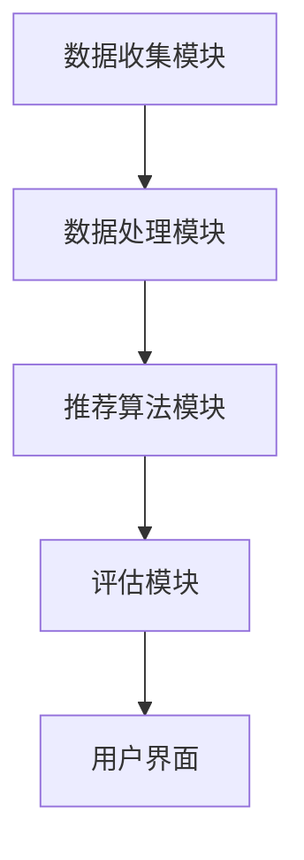

#### 6.3.4 系统架构图

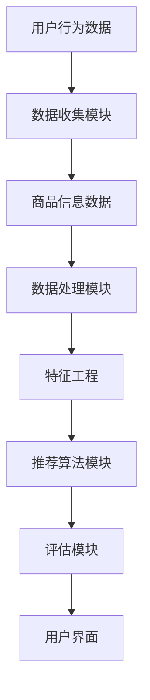

#### 6.3.5 系统接口设计

系统接口设计如图7-2所示：

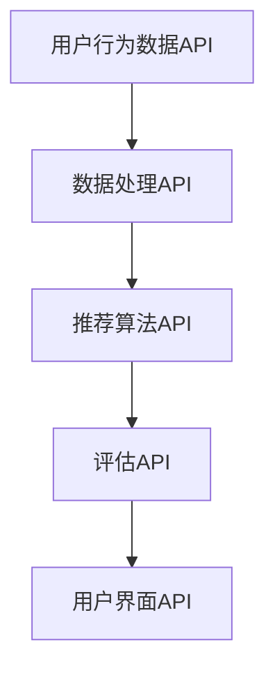

#### 6.3.6 系统交互流程

系统交互流程如图7-3所示：

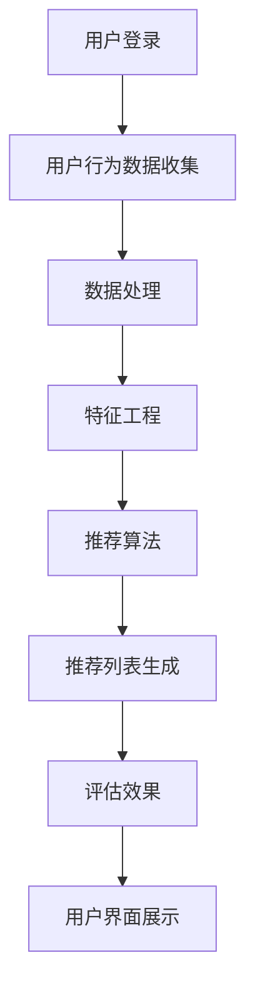

通过以上设计，Prompt工程师可以构建一个高效的电商推荐系统，满足用户的个性化需求，提高平台的销售额和用户满意度。

### 7.4 系统接口设计

在电商推荐系统中，接口设计是确保各个功能模块之间高效协同工作的关键。以下是系统接口的具体设计：

#### 7.4.1 用户行为数据API

用户行为数据API负责收集用户在平台上的浏览和购买记录。接口设计如下：

- **接口URL**：/api/user_behavior
- **请求方法**：GET
- **请求参数**：
  - user_id：用户的唯一标识
  - start_date：数据起始日期
  - end_date：数据结束日期
- **响应数据**：
  ```json
  {
    "status": "success",
    "data": [
      {
        "user_id": "123",
        "action": "browse",
        "product_id": "456",
        "timestamp": "2023-11-01T10:30:00Z"
      },
      {
        "user_id": "123",
        "action": "purchase",
        "product_id": "789",
        "timestamp": "2023-11-02T14:45:00Z"
      }
    ]
  }
  ```

#### 7.4.2 商品信息数据API

商品信息数据API提供商品的详细信息，包括商品类别、价格等。接口设计如下：

- **接口URL**：/api/product_info
- **请求方法**：GET
- **请求参数**：
  - product_id：商品的唯一标识
- **响应数据**：
  ```json
  {
    "status": "success",
    "data": {
      "product_id": "789",
      "category": "electronics",
      "price": 299.99
    }
  }
  ```

#### 7.4.3 数据处理API

数据处理API用于清洗、预处理和特征工程。接口设计如下：

- **接口URL**：/api/data_processing
- **请求方法**：POST
- **请求参数**：
  - data：原始数据，格式为JSON数组
- **响应数据**：
  ```json
  {
    "status": "success",
    "processed_data": [
      {
        "user_id": "123",
        "action": "browse",
        "product_id": "456",
        "timestamp": "2023-11-01T10:30:00Z"
      }
    ]
  }
  ```

#### 7.4.4 推荐算法API

推荐算法API负责处理用户行为数据，生成个性化的商品推荐列表。接口设计如下：

- **接口URL**：/api/recommendation
- **请求方法**：POST
- **请求参数**：
  - user_id：用户的唯一标识
- **响应数据**：
  ```json
  {
    "status": "success",
    "recommendations": [
      {
        "product_id": "321",
        "score": 0.85
      },
      {
        "product_id": "654",
        "score": 0.75
      }
    ]
  }
  ```

#### 7.4.5 评估API

评估API用于评估推荐算法的效果，包括准确率、召回率和F1分数等指标。接口设计如下：

- **接口URL**：/api/evaluation
- **请求方法**：POST
- **请求参数**：
  - actual_recommendations：实际推荐列表，格式为JSON数组
  - ground_truth：真实标签，格式为JSON数组
- **响应数据**：
  ```json
  {
    "status": "success",
    "metrics": {
      "accuracy": 0.9,
      "recall": 0.85,
      "f1_score": 0.87
    }
  }
  ```

通过以上接口设计，各功能模块可以高效地协同工作，确保推荐系统的正常运行和持续优化。

### 系统交互流程

在电商推荐系统中，系统交互流程是确保用户需求得到满足、数据处理和推荐算法高效运行的关键。以下是系统交互流程的详细描述：

#### 7.5.1 用户登录

用户通过用户界面（UI）进行登录，系统会验证用户的身份和权限。如果登录成功，用户将进入系统主页，并可以看到推荐的商品列表。

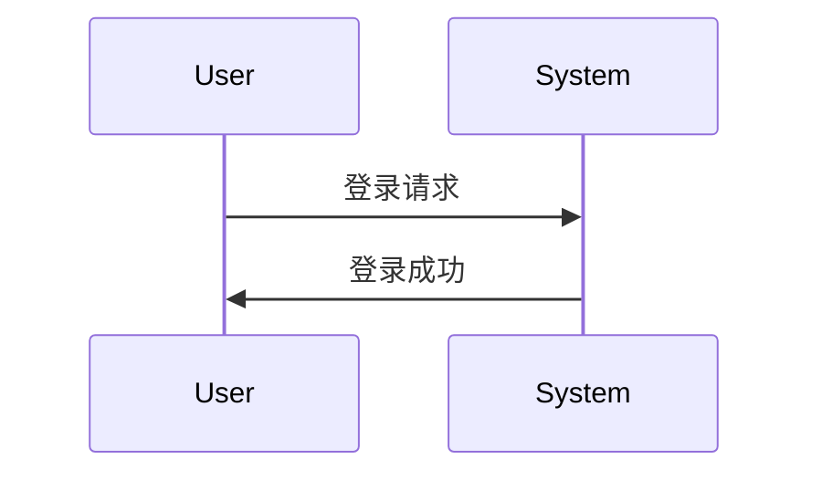

#### 7.5.2 用户行为数据收集

用户在平台上的操作（如浏览、搜索、购买等）会产生行为数据。系统会定期从用户行为数据API收集这些数据，并将其存储在数据库中。

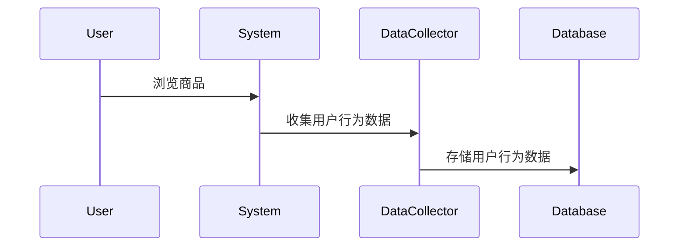

#### 7.5.3 数据处理

数据处理模块会定期从数据库中读取用户行为数据，进行清洗、预处理和特征工程。处理后的数据将用于推荐算法的训练和生成推荐列表。

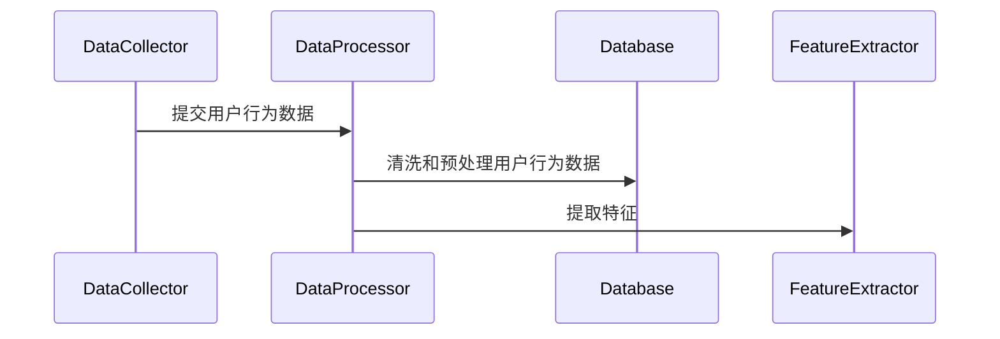

#### 7.5.4 推荐算法处理

推荐算法模块使用处理后的数据训练模型，并根据用户的行为数据生成个性化的商品推荐列表。推荐结果将通过API返回给用户界面。

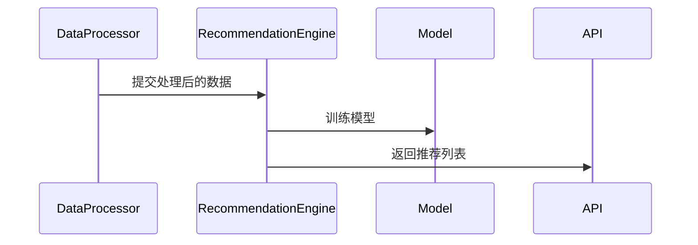

#### 7.5.5 用户界面展示

用户界面将接收到的推荐列表展示给用户，用户可以根据推荐的商品进行浏览或购买。同时，用户的行为数据也会被实时收集并反馈给系统。

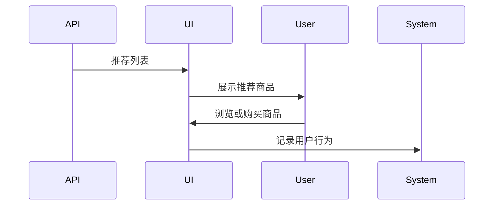

通过以上交互流程，系统能够高效地响应用户需求，生成个性化的推荐列表，并持续优化推荐效果。

### 7.6 高级技巧与优化

#### 8.1 高级Prompt设计

在高级Prompt设计中，工程师可以采用多种策略来提升模型性能和适应性。以下是一些常见的高级Prompt设计技巧：

##### 8.1.1 多模态Prompt

多模态Prompt结合了不同类型的数据（如文本、图像、音频等），以提供更丰富的上下文信息。例如，在图像识别任务中，可以结合图像内容和相关文本描述，提高模型的理解能力。

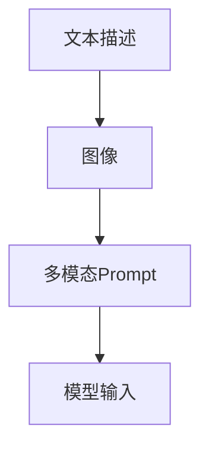

##### 8.1.2 动态Prompt

动态Prompt可以根据模型的训练进度或用户行为动态调整。例如，在生成文本任务中，可以逐渐增加上下文的长度或复杂度，以适应模型的学习能力。

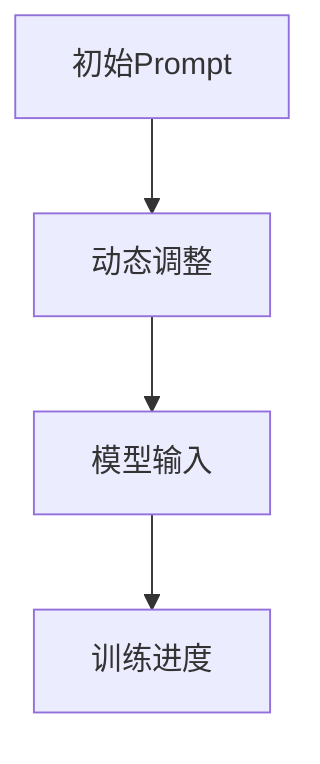

##### 8.1.3 对话式Prompt

对话式Prompt通过模拟真实对话来引导模型生成更自然的交互。例如，在聊天机器人任务中，可以设计多个对话轮次，使模型能够理解上下文和用户意图。

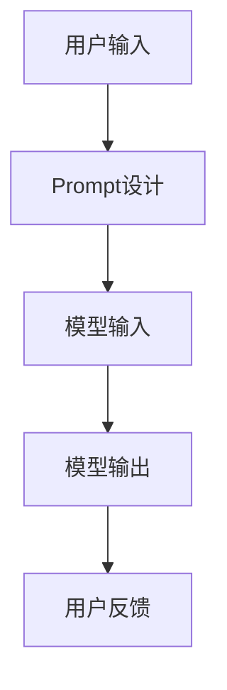

#### 8.2 Prompt优化方法

为了提高Prompt的性能，可以采用以下优化方法：

##### 8.2.1 搜索空间优化

通过优化搜索空间，可以减少不必要的计算和时间。常用的方法包括：

- **网格搜索**：在预定义的参数空间中逐一尝试所有可能的组合。
- **随机搜索**：从搜索空间中随机选择参数组合进行尝试。

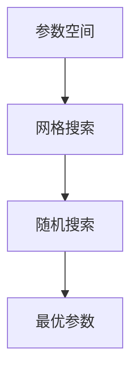

##### 8.2.2 贝叶斯优化

贝叶斯优化是一种基于概率模型的优化方法，通过迭代更新模型参数，逐步逼近最优解。这种方法在处理高维搜索空间时表现尤为出色。

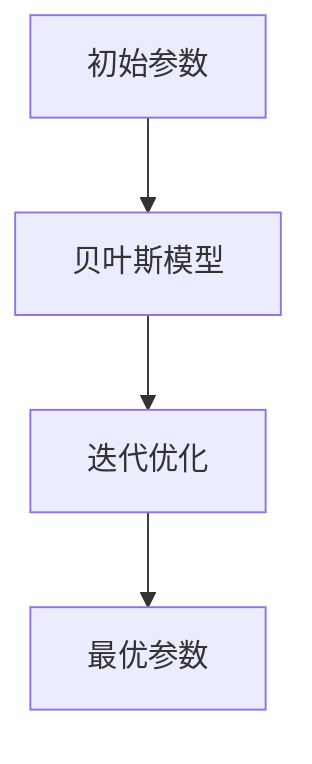

##### 8.2.3 对抗训练

对抗训练通过生成器（Generator）和判别器（Discriminator）的对抗性训练，提高模型对噪声和异常数据的鲁棒性。这种方法常用于数据增强和生成模型。

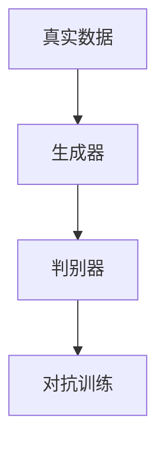

#### 8.3 实践案例分享

以下是一个基于对话式Prompt的聊天机器人优化案例：

- **问题背景**：一个聊天机器人需要能够理解用户输入并生成合理的回复。
- **初始Prompt设计**：设计简单的文本Prompt，引导模型生成基础回复。
- **优化过程**：
  - **多模态Prompt**：结合用户输入的文本和图像，提高模型对复杂情境的理解。
  - **动态Prompt**：根据对话轮次逐渐增加上下文长度和复杂度。
  - **对抗训练**：通过生成器和判别器的对抗训练，提高模型对噪声和异常输入的鲁棒性。
- **优化结果**：优化后的聊天机器人能够更自然地与用户互动，提高用户满意度。

通过以上高级技巧和优化方法，Prompt工程师可以设计出更高效、更适应复杂任务的Prompt，从而提升AI模型的整体性能和应用价值。

### 挑战与未来趋势

#### 9.1 当前挑战

作为Prompt工程师，面对的当前挑战主要集中在以下几个方面：

##### 9.1.1 数据隐私与安全

随着数据隐私和安全问题的日益突出，如何确保Prompt工程过程中数据的安全性和隐私性成为一项重要挑战。特别是在处理个人敏感信息时，Prompt工程师需要确保数据不会泄露，且遵守相关法律法规。

##### 9.1.2 模型可解释性

Prompt工程师在设计Prompt时，需要确保模型生成的结果具有可解释性。然而，深度学习模型往往具有黑箱特性，难以解释其内部机制。这给Prompt工程师带来了挑战，他们需要找到方法来提高模型的可解释性，以便用户和利益相关者能够理解模型的决策过程。

##### 9.1.3 模型泛化能力

Prompt工程需要确保模型在不同的数据集和应用场景中都能表现出良好的性能。然而，当前的模型往往在特定数据集上表现优秀，但在新的、未见过的数据上可能表现不佳。提高模型的泛化能力是Prompt工程师面临的另一大挑战。

##### 9.1.4 资源消耗

Prompt工程通常需要大量的计算资源，尤其是在训练复杂模型时。资源消耗不仅包括硬件资源，如CPU和GPU，还包括存储和带宽等。如何优化资源使用，提高效率，是Prompt工程师需要解决的问题。

#### 9.2 未来趋势展望

展望未来，Prompt工程师将面临以下发展趋势：

##### 9.2.1 数据隐私保护技术

随着技术的发展，数据隐私保护技术（如差分隐私、联邦学习等）将逐渐成熟并广泛应用于Prompt工程中。这些技术可以帮助Prompt工程师在确保数据隐私的同时，仍然能够训练高性能的模型。

##### 9.2.2 模型可解释性提升

为了提高模型的可解释性，未来的研究将集中在开发新的解释性算法和工具。例如，基于可视化的解释方法、模型压缩技术以及基于规则的解释方法等，都将有助于提升模型的可解释性。

##### 9.2.3 自适应Prompt设计

未来的Prompt工程将更加注重自适应设计。通过引入自适应机制，模型可以根据训练数据和应用场景动态调整Prompt，从而提高模型的泛化能力和适应性。

##### 9.2.4 资源高效利用

随着云计算和边缘计算技术的发展，Prompt工程师将能够更高效地利用计算资源。例如，通过分布式训练和模型压缩技术，可以在有限的资源下训练大规模模型，提高资源利用效率。

#### 9.3 技术发展对Prompt工程师的要求

面对上述挑战和未来趋势，Prompt工程师需要具备以下技能和知识：

- **数据处理和隐私保护**：掌握数据处理技术和隐私保护方法，确保数据的安全性和隐私性。
- **模型可解释性**：了解不同的解释性算法和工具，提高模型的可解释性。
- **自适应设计**：掌握自适应机制，能够设计出能够根据不同应用场景动态调整的Prompt。
- **资源高效利用**：了解分布式训练和模型压缩技术，提高资源利用效率。
- **持续学习和适应**：持续关注最新的技术动态和研究进展，不断学习和适应新技术，以应对不断变化的技术挑战。

通过以上技能和知识，Prompt工程师将能够在未来的发展中保持竞争力，为AI技术的进步和应用贡献力量。

### 10.1 最佳实践建议

为了确保Prompt工程师在设计和优化Prompt时能够达到最佳效果，以下是一些具体而实用的最佳实践建议：

1. **数据质量控制**：确保数据集的干净和完整性。在数据处理阶段，进行严格的数据清洗，去除噪声和异常值。可以使用数据清洗工具（如Pandas、Scikit-learn等）自动化这一过程。

2. **特征工程优化**：在特征提取过程中，选择对模型影响较大的特征，并使用标准化和归一化方法处理数据。特征选择可以使用信息增益、特征重要性等方法，以提高模型的泛化能力。

3. **模型选择与调优**：根据任务需求选择合适的模型类型和架构。使用超参数优化工具（如Hyperopt、Optuna等）进行参数调整，找到最优的超参数组合。此外，可以考虑使用模型融合技术，如加权平均、投票等，以提高模型性能。

4. **Prompt设计原则**：遵循Prompt设计的核心原则，确保Prompt清晰明确、完整简洁、具有可扩展性和可解释性。设计Prompt时，注重上下文信息的丰富性和代表性，避免冗余信息。

5. **评估与迭代**：使用多种评估指标（如准确率、精确率、召回率、F1分数等）全面评估Prompt性能。根据评估结果，持续迭代和优化Prompt设计，以达到最佳效果。

6. **资源高效利用**：在资源有限的情况下，优化资源使用，提高训练效率。可以采用分布式训练技术、模型压缩技术等，以减少计算资源和存储需求。

7. **团队协作与沟通**：Prompt工程师应与其他团队成员（如数据科学家、产品经理等）紧密合作，确保Prompt设计与业务需求相匹配。良好的沟通和协作有助于提高项目效率和质量。

通过以上最佳实践，Prompt工程师可以设计出高效、可靠的Prompt，提升AI模型性能，满足复杂应用场景的需求。

### 10.2 小结

本文从基础篇和进阶篇两个方面，系统地探讨了Prompt工程师的核心技能培养。在基础篇中，我们介绍了Prompt工程师所需掌握的基本概念、数据处理与准备、设计原则、评估方法和调优技巧。这些基础内容为Prompt工程师提供了必要的理论知识和技术框架。在进阶篇中，我们通过实际项目应用、高级技巧与优化以及挑战与未来趋势的讨论，进一步深化了Prompt工程师的实践能力和前瞻性思维。

通过本文的详细阐述，读者可以了解到Prompt工程师在实际工作中如何运用所学技能，设计高效的Prompt，优化模型性能，并在复杂项目中取得成功。同时，本文也展望了Prompt工程师未来可能面临的技术挑战和趋势，为读者提供了宝贵的发展方向和建议。

总之，Prompt工程师的核心技能培养是一个持续学习和实践的过程。通过不断积累经验、提升技术水平和适应新技术，Prompt工程师将在AI领域中发挥越来越重要的作用。

### 10.3 注意事项

在Prompt工程师的日常工作中，以下注意事项至关重要：

1. **数据隐私保护**：确保在数据处理过程中严格遵守数据隐私保护法律法规，对敏感信息进行加密处理。
2. **模型可解释性**：在设计和优化Prompt时，注重模型的可解释性，以便用户和利益相关者能够理解模型决策过程。
3. **资源高效利用**：合理规划计算资源和存储资源，采用分布式训练和模型压缩技术，以提高训练效率。
4. **持续学习与更新**：关注AI领域的最新技术动态和研究进展，不断学习和应用新技术，保持技术领先地位。
5. **团队协作与沟通**：与其他团队成员保持紧密合作，确保Prompt设计与业务需求相匹配，提高项目效率和成功率。

通过严格遵守以上注意事项，Prompt工程师可以更好地应对复杂的工作挑战，提升个人和团队的整体能力。

### 10.4 拓展阅读

为了进一步深入学习和探索Prompt工程师的核心技能，以下推荐几本相关领域的经典书籍：

1. **《深度学习》（Deep Learning）**：作者：Ian Goodfellow、Yoshua Bengio、Aaron Courville。本书系统地介绍了深度学习的基础理论和实践方法，是深度学习领域的经典教材。

2. **《自然语言处理综述》（Speech and Language Processing）**：作者：Daniel Jurafsky、James H. Martin。本书详细介绍了自然语言处理的基本概念、技术和应用，对理解Prompt工程有重要参考价值。

3. **《机器学习实战》（Machine Learning in Action）**：作者：Peter Harrington。本书通过实际案例和代码示例，介绍了机器学习的应用和实践，有助于提升Prompt工程师的编程能力。

4. **《人工智能：一种现代的方法》（Artificial Intelligence: A Modern Approach）**：作者：Stuart J. Russell、Peter Norvig。本书全面涵盖了人工智能的基本理论和实践方法，是人工智能领域的经典著作。

通过阅读以上书籍，读者可以进一步巩固理论基础，提升实践能力，为成为优秀的Prompt工程师奠定坚实基础。此外，还可以关注AI领域的顶级会议和期刊，如NeurIPS、ICML、ACL等，以获取最新的研究成果和行业动态。

