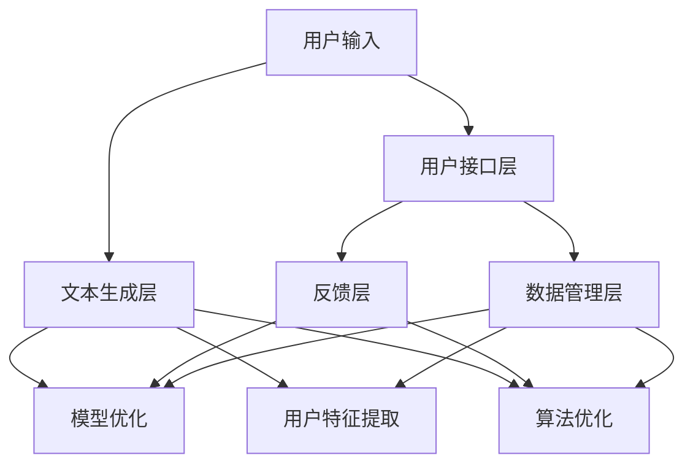
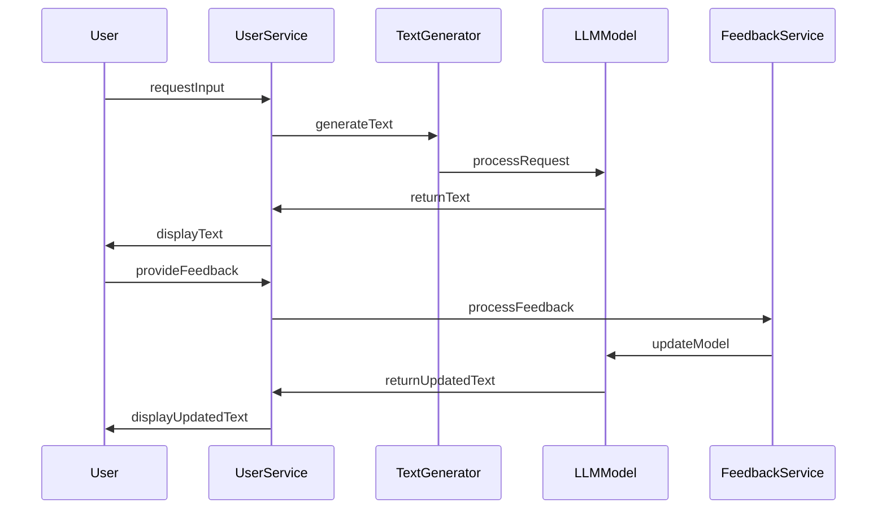
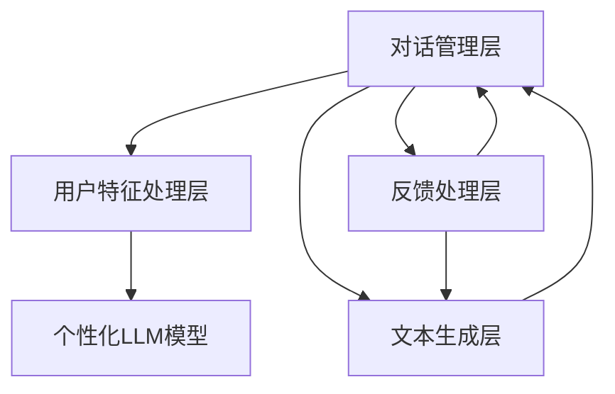
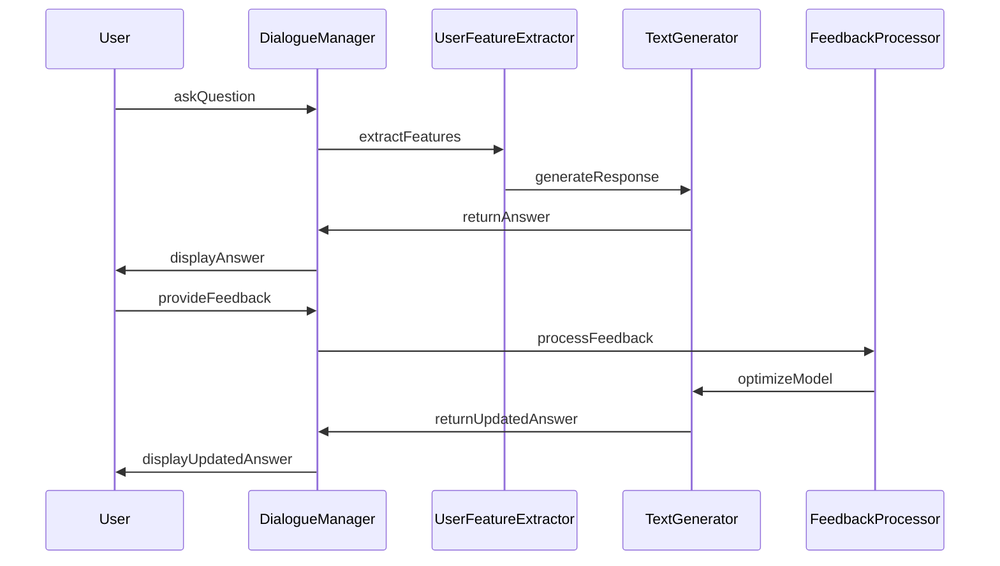
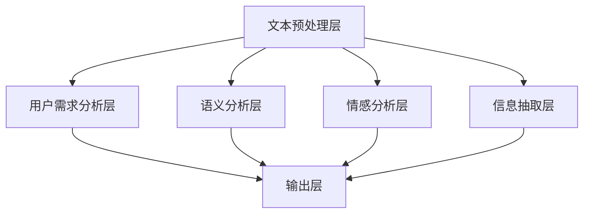
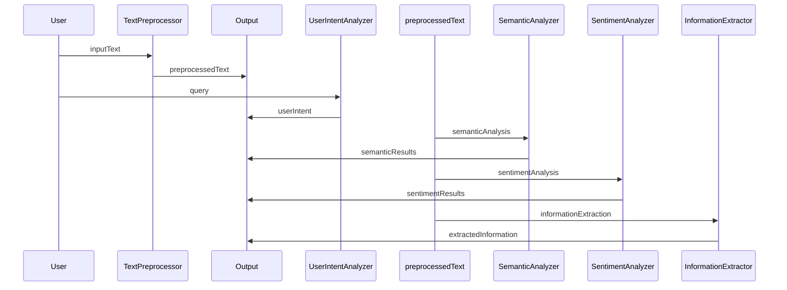

                 

### 第1章: 引言

#### 1.1 问题背景

近年来，人工智能（AI）技术的飞速发展，尤其是在自然语言处理（NLP）领域，极大地推动了计算机与人类交流的进步。然而，现有的许多AI模型，特别是大型语言模型（LLM），在输出时往往缺乏个性化，导致用户难以从大量的信息中获取到真正有价值的答案。个性化语言输出成为了一个亟待解决的问题。

#### 1.2 问题描述

个性化语言输出的主要问题在于：如何在保证输出准确性和流畅性的同时，根据用户的需求和偏好，生成具有高度个性化的文本。具体来说，这个问题包括以下几个方面：

1. **用户需求理解**：如何准确理解用户的提问意图和需求？
2. **文本生成**：如何根据用户的个性化需求，生成独特的文本内容？
3. **反馈循环**：如何通过用户的反馈，不断优化模型的输出效果？

#### 1.3 问题解决

为了解决上述问题，我们需要从以下几个方面进行探讨和实现：

1. **Prompt语言风格适配**：通过设计个性化的Prompt，引导模型生成符合用户需求的文本。
2. **个性化LLM输出机制**：研究如何根据用户特征，调整LLM的输出风格和内容。
3. **系统设计与实现**：构建一个完整的系统框架，包括文本生成、用户交互和反馈机制。

#### 1.4 边界与外延

在探讨个性化语言输出的过程中，我们还需要明确以下几个边界与外延：

1. **边界**：个性化语言输出的范围和限制，如文本长度、内容敏感性等。
2. **外延**：个性化语言输出在不同应用场景下的拓展，如对话系统、文本生成、自然语言理解等。

#### 1.5 概念结构与核心要素组成

本文将围绕以下核心概念和要素进行深入探讨：

1. **Prompt语言风格适配**：探讨如何设计个性化的Prompt，以引导模型生成符合用户需求的文本。
2. **个性化LLM输出机制**：研究如何根据用户特征，调整LLM的输出风格和内容。
3. **系统设计与实现**：构建一个完整的系统框架，包括文本生成、用户交互和反馈机制。

通过以上探讨，我们将为解决个性化语言输出问题提供一种系统性的方法和技术路径。

### 第2章: 核心概念与联系

#### 2.1 核心概念原理

在个性化语言输出领域，以下核心概念至关重要：

1. **Prompt**：Prompt是指提供给AI模型的一段引导性文本，用于指定模型的输出方向和内容。
2. **LLM（大型语言模型）**：LLM是一种能够生成自然语言文本的深度学习模型，如GPT、BERT等。
3. **个性化**：个性化是指根据用户的特定需求和偏好，生成具有高度相关性和独特性的文本输出。

#### 2.2 概念属性特征对比表格

下面是一个关于Prompt、LLM和个性化特征的对比表格：

| 概念    | 属性特征                              | 对比说明                         |
|---------|-------------------------------------|---------------------------------|
| Prompt  | 引导性文本、问题指定、上下文信息   | 明确指导模型输出方向和内容     |
| LLM     | 语言理解、文本生成、参数化模型     | 生成具有自然语言特性的文本     |
| 个性化  | 用户需求识别、偏好设置、定制化     | 根据用户特性生成独特文本输出   |

#### 2.3 ER实体关系图架构

为了更好地理解这些核心概念之间的关系，我们可以通过ER（实体-关系）图来展示。以下是个性化语言输出系统的ER图：

```mermaid
erDiagram
    User ||--|{ Prompt }|--| Model
    User ||--|{ Feedback }|--| Model
    Model ||--|{ Output }|--| User
    Model ||--|{ Update }|--| Data
    Data ||--|{ Train }|--| Model
```

在这个ER图中，用户（User）通过Prompt与模型（Model）进行交互，生成输出（Output）。用户还可以提供反馈（Feedback），用于模型更新（Update）。数据（Data）则用于模型训练（Train）。

通过以上核心概念与联系的分析，我们为后续章节的深入探讨奠定了基础。

### 第3章: Prompt语言风格适配原理

#### 3.1 Prompt语言风格适配的定义

Prompt语言风格适配是一种通过设计和调整Prompt，使模型生成符合特定语言风格和用户需求的文本的方法。具体来说，它包括以下几个方面：

1. **语言风格**：指文本的语言表达方式，如正式、非正式、幽默、严肃等。
2. **适配**：指根据用户需求、偏好和上下文，调整Prompt的内容和格式，以引导模型生成符合预期的文本。

#### 3.2 Prompt语言风格适配的特点

Prompt语言风格适配具有以下特点：

1. **个性化**：根据用户需求和偏好，生成独特的文本输出。
2. **灵活性**：可以根据不同的应用场景和用户需求，灵活调整Prompt的格式和内容。
3. **高效性**：通过优化Prompt设计，提高模型输出质量和效率。

#### 3.3 Prompt语言风格适配与传统prompt的区别

Prompt语言风格适配与传统prompt的主要区别在于：

1. **目标不同**：传统prompt主要关注文本内容的准确性，而Prompt语言风格适配更注重文本输出的个性化。
2. **方法不同**：传统prompt通常通过固定的模板和问题设置，而Prompt语言风格适配则通过动态调整Prompt内容和格式来实现。
3. **效果不同**：传统prompt生成的文本往往缺乏个性化，而Prompt语言风格适配可以生成更符合用户需求和偏好的文本。

#### 3.4 Prompt语言风格适配的工作流程

Prompt语言风格适配的工作流程主要包括以下几个步骤：

1. **用户需求分析**：通过用户提问和交互，了解用户的需求和偏好。
2. **Prompt设计**：根据用户需求，设计具有个性化特征的Prompt。
3. **模型输入**：将设计好的Prompt输入到LLM模型中。
4. **文本生成**：模型根据Prompt生成文本输出。
5. **反馈与优化**：根据用户反馈，调整Prompt内容和格式，优化输出效果。

通过以上流程，我们可以实现Prompt语言风格适配，为用户提供个性化的语言输出。

### 第4章: 个性化LLM输出机制

#### 4.1 个性化LLM输出的定义

个性化LLM输出是指根据用户的特定需求和偏好，通过调整LLM模型的结构和参数，生成具有高度相关性和独特性的文本内容。具体来说，个性化LLM输出包括以下几个方面：

1. **用户特征识别**：通过用户输入和历史数据，识别用户的兴趣、偏好和需求。
2. **模型参数调整**：根据用户特征，调整LLM模型的权重、结构等参数，使其生成更符合用户需求的文本。
3. **文本生成**：利用调整后的LLM模型，生成个性化的文本输出。

#### 4.2 个性化LLM输出的核心要素

个性化LLM输出的核心要素包括：

1. **用户特征**：用户的兴趣、偏好、历史行为等，用于指导模型生成个性化的文本。
2. **模型结构**：LLM模型的结构，如网络层数、神经元个数等，直接影响文本生成的质量和效率。
3. **参数调整**：通过训练数据和用户特征，调整模型参数，优化输出效果。

#### 4.3 个性化LLM输出的实现方法

实现个性化LLM输出可以采用以下方法：

1. **用户特征嵌入**：将用户特征嵌入到LLM模型中，如使用 embeddings 技术将用户特征转化为向量，并输入到模型中。
2. **模型自适应调整**：根据用户特征和历史数据，动态调整LLM模型的参数和结构，以实现个性化输出。
3. **在线学习与优化**：利用用户反馈和交互数据，实时更新模型参数，优化输出效果。

#### 4.4 个性化LLM输出的挑战与解决方案

个性化LLM输出面临以下挑战：

1. **数据隐私**：用户数据可能包含敏感信息，如何保护用户隐私是一个重要问题。
2. **模型泛化**：个性化模型如何保证在未知用户数据上的泛化能力。
3. **计算资源**：个性化调整可能需要大量计算资源，如何高效利用资源是一个挑战。

解决方案包括：

1. **数据加密与隐私保护**：采用加密技术和隐私保护算法，确保用户数据的安全。
2. **迁移学习与泛化能力**：通过迁移学习和模型蒸馏等技术，提高模型的泛化能力。
3. **资源优化与调度**：采用分布式计算和资源调度技术，提高计算效率。

通过以上方法和策略，我们可以实现个性化LLM输出，为用户提供更高质量、更个性化的语言服务。

### 第5章: 个性化LLM输出在文本生成中的应用

#### 5.1 应用场景介绍

个性化LLM输出在文本生成中的应用非常广泛，涵盖了多种场景，如：

1. **内容创作**：根据用户的兴趣和需求，生成定制化的文章、故事、博客等。
2. **对话系统**：在聊天机器人、智能客服等场景中，根据用户的提问和上下文，生成个性化的回答。
3. **教育辅导**：根据学生的需求和知识点，生成个性化的学习内容和辅导材料。

#### 5.2 系统功能设计(领域模型)

为了实现个性化LLM输出，系统需要具备以下功能：

1. **用户需求分析**：通过自然语言处理技术，理解用户的提问和需求。
2. **文本生成**：利用个性化LLM模型，生成符合用户需求的文本内容。
3. **用户交互**：提供友好的用户界面，允许用户输入需求，查看和反馈生成的文本。
4. **反馈与优化**：收集用户反馈，调整模型参数，优化输出效果。

以下是系统功能的领域模型：

```mermaid
classDiagram
    User <<interface>>
    TextGenerator <<interface>>
    Interaction <<interface>>
    Feedback <<interface>>

    User o-- TextGenerator : generate
    User o-- Interaction : interact
    User o-- Feedback : provide

    TextGenerator o-- LLM : train

    Interaction o-- User : receive
    Interaction o-- TextGenerator : generate

    Feedback o-- TextGenerator : optimize
    Feedback o-- User : evaluate
```

#### 5.3 系统架构设计

个性化LLM输出系统的架构设计需要考虑以下几个关键组件：

1. **用户接口层**：负责与用户进行交互，接收用户输入，展示生成文本和用户反馈。
2. **文本生成层**：包含个性化LLM模型、文本生成算法和用户特征处理模块。
3. **数据管理层**：负责存储和管理用户数据、模型参数和训练数据。
4. **服务层**：提供文本生成、用户交互和反馈等核心服务。

以下是系统架构的Mermaid图：



#### 5.4 系统接口设计

系统接口设计需要确保各组件之间的良好通信和协作。以下是主要接口设计：

1. **用户接口**：提供API接口，允许用户输入需求和获取生成文本。
2. **文本生成接口**：接收用户输入，生成文本，返回结果。
3. **反馈接口**：接收用户反馈，用于模型优化和算法调整。
4. **数据管理接口**：负责数据存储、查询和管理。

以下是接口设计的Mermaid序列图：



#### 5.5 系统交互

系统交互是确保各组件高效协作的关键。以下是系统交互的流程：

1. **用户请求**：用户输入需求，系统解析请求。
2. **文本生成**：系统根据用户需求，生成个性化文本。
3. **用户反馈**：用户对生成的文本进行评价，提供反馈。
4. **模型优化**：系统根据用户反馈，优化模型参数和算法。

以下是系统交互的详细流程：

1. **用户请求**：
   - 用户输入需求，如：“写一篇关于人工智能的未来发展趋势的博客。”
   - 系统接收用户请求，解析输入内容，提取关键词和需求。

2. **文本生成**：
   - 系统利用个性化LLM模型，根据用户需求和关键词，生成文本。
   - 文本生成过程中，系统会调用用户特征提取模块，确保文本符合用户偏好。

3. **用户反馈**：
   - 用户查看生成的文本，对文本的质量和内容进行评价。
   - 用户可以提供正面或负面的反馈，如：“文本太长，需要简化。”或“内容不够详细，请补充。”

4. **模型优化**：
   - 系统根据用户反馈，调整LLM模型参数，优化生成文本的质量。
   - 系统可以实时更新模型，提高后续文本生成的准确性和个性化程度。

通过以上系统交互流程，我们可以确保个性化LLM输出系统在文本生成中的应用效果，满足用户的多样化需求。

### 第6章: 个性化LLM输出在对话系统中的应用

#### 6.1 应用场景介绍

个性化LLM输出在对话系统中的应用十分广泛，涵盖了以下主要场景：

1. **智能客服**：通过个性化LLM输出，智能客服能够提供更符合用户需求的解答，提高客户满意度。
2. **聊天机器人**：根据用户的历史对话记录和偏好，聊天机器人可以生成更加自然和个性化的对话内容。
3. **虚拟助手**：个性化LLM输出可以使虚拟助手更好地理解用户的需求，提供定制化的服务和建议。

#### 6.2 系统功能设计(领域模型)

为了实现个性化LLM输出在对话系统中的应用，系统需要具备以下功能：

1. **对话管理**：负责管理对话流程，包括提问、回答、上下文维护等。
2. **用户特征提取**：通过用户输入和历史对话记录，提取用户的兴趣、偏好等信息。
3. **文本生成**：利用个性化LLM模型，根据用户特征和对话上下文，生成个性化的回答。
4. **用户反馈处理**：收集用户反馈，用于模型优化和对话系统改进。

以下是系统功能的领域模型：

```mermaid
classDiagram
    DialogueManager <<interface>>
    UserFeatureExtractor <<interface>>
    TextGenerator <<interface>>
    FeedbackProcessor <<interface>>

    DialogueManager o-- UserFeatureExtractor : extractFeatures
    DialogueManager o-- TextGenerator : generateResponse
    DialogueManager o-- FeedbackProcessor : processFeedback

    TextGenerator o-- LLMModel : train

    FeedbackProcessor o-- TextGenerator : optimize
    FeedbackProcessor o-- DialogueManager : updateDialogue
```

#### 6.3 系统架构设计

个性化LLM输出对话系统的架构设计需要考虑以下几个关键组件：

1. **对话管理层**：负责对话流程的自动化管理，包括提问、回答、上下文维护等。
2. **用户特征处理层**：提取并处理用户特征，用于个性化文本生成。
3. **文本生成层**：利用个性化LLM模型，生成符合用户需求的回答。
4. **反馈处理层**：收集用户反馈，用于模型优化和对话系统改进。

以下是系统架构的Mermaid图：



#### 6.4 系统接口设计

系统接口设计需要确保各组件之间的良好通信和协作。以下是主要接口设计：

1. **对话管理接口**：负责对话流程的管理，包括提问、回答、上下文维护等。
2. **用户特征提取接口**：接收用户输入，提取用户特征。
3. **文本生成接口**：生成个性化回答，返回结果。
4. **反馈处理接口**：接收用户反馈，用于模型优化。

以下是接口设计的Mermaid序列图：



#### 6.5 系统交互

系统交互是确保各组件高效协作的关键。以下是系统交互的流程：

1. **用户提问**：用户输入问题，系统解析问题并提取关键信息。
2. **特征提取**：系统提取用户特征，如历史对话记录、兴趣偏好等。
3. **文本生成**：系统利用个性化LLM模型，根据用户特征和上下文，生成个性化回答。
4. **用户反馈**：用户对回答进行评价，提供反馈。
5. **模型优化**：系统根据用户反馈，优化LLM模型，提高回答质量。

以下是系统交互的详细流程：

1. **用户提问**：
   - 用户输入问题，如：“明天天气预报怎么样？”
   - 系统接收用户问题，进行解析和关键信息提取。

2. **特征提取**：
   - 系统根据用户的历史对话记录和兴趣偏好，提取相关特征。
   - 系统利用这些特征，调整个性化LLM模型的参数。

3. **文本生成**：
   - 系统利用调整后的LLM模型，生成个性化的回答。
   - 系统根据上下文和用户特征，确保回答的自然性和相关性。

4. **用户反馈**：
   - 用户查看生成的回答，对回答的质量和内容进行评价。
   - 用户可以提供正面或负面的反馈，如：“回答太简单了。”或“回答非常详细。”

5. **模型优化**：
   - 系统根据用户反馈，调整LLM模型参数，优化生成文本的质量。
   - 系统可以实时更新模型，提高后续回答的准确性和个性化程度。

通过以上系统交互流程，我们可以确保个性化LLM输出在对话系统中的应用效果，为用户提供高质量、个性化的服务。

### 第7章: 个性化LLM输出在自然语言理解中的应用

#### 7.1 应用场景介绍

个性化LLM输出在自然语言理解中的应用场景非常广泛，主要包括以下方面：

1. **语义分析**：通过个性化LLM输出，对文本进行深度语义分析，提取关键信息，帮助用户更好地理解文本内容。
2. **情感分析**：根据用户需求和情感偏好，分析文本的情感倾向，为用户提供个性化的情感反馈。
3. **信息抽取**：利用个性化LLM输出，从大量文本中提取用户感兴趣的信息，提高信息检索的效率和准确性。

#### 7.2 系统功能设计(领域模型)

为了实现个性化LLM输出在自然语言理解中的应用，系统需要具备以下功能：

1. **文本预处理**：对输入文本进行分词、去噪、格式化等预处理，确保文本质量。
2. **用户需求分析**：通过自然语言处理技术，理解用户的查询意图和需求。
3. **语义分析**：利用个性化LLM模型，对文本进行深度语义分析，提取关键信息。
4. **情感分析**：根据用户情感偏好，分析文本的情感倾向。
5. **信息抽取**：从大量文本中提取用户感兴趣的信息，满足个性化需求。

以下是系统功能的领域模型：

```mermaid
classDiagram
    TextPreprocessor <<interface>>
    UserIntentAnalyzer <<interface>>
    SemanticAnalyzer <<interface>>
    SentimentAnalyzer <<interface>>
    InformationExtractor <<interface>>

    TextPreprocessor o-- Text : preprocess
    UserIntentAnalyzer o-- Text : analyzeIntent
    SemanticAnalyzer o-- Text : analyzeSemantics
    SentimentAnalyzer o-- Text : analyzeSentiment
    InformationExtractor o-- Text : extractInfo

    TextPreprocessor o-- Output : generatePreprocessedText
    UserIntentAnalyzer o-- Output : generateIntent
    SemanticAnalyzer o-- Output : generateSemantic
    SentimentAnalyzer o-- Output : generateSentiment
    InformationExtractor o-- Output : generateInformation
```

#### 7.3 系统架构设计

个性化LLM输出自然语言理解系统的架构设计需要考虑以下几个关键组件：

1. **文本预处理层**：负责文本的分词、去噪、格式化等预处理工作。
2. **用户需求分析层**：通过自然语言处理技术，理解用户的查询意图和需求。
3. **语义分析层**：利用个性化LLM模型，对文本进行深度语义分析。
4. **情感分析层**：分析文本的情感倾向，提供个性化的情感反馈。
5. **信息抽取层**：从大量文本中提取用户感兴趣的信息。

以下是系统架构的Mermaid图：



#### 7.4 系统接口设计

系统接口设计需要确保各组件之间的良好通信和协作。以下是主要接口设计：

1. **文本预处理接口**：负责文本的分词、去噪、格式化等预处理工作。
2. **用户需求分析接口**：接收用户查询，提取用户意图。
3. **语义分析接口**：生成语义分析结果。
4. **情感分析接口**：生成情感分析结果。
5. **信息抽取接口**：提取用户感兴趣的信息。

以下是接口设计的Mermaid序列图：



#### 7.5 系统交互

系统交互是确保各组件高效协作的关键。以下是系统交互的流程：

1. **用户查询**：用户输入查询，系统接收并解析查询。
2. **文本预处理**：系统对输入文本进行预处理，如分词、去噪等。
3. **用户需求分析**：系统分析用户查询，提取用户意图。
4. **语义分析**：系统利用个性化LLM模型，对预处理后的文本进行深度语义分析。
5. **情感分析**：系统根据用户情感偏好，分析文本的情感倾向。
6. **信息抽取**：系统从大量文本中提取用户感兴趣的信息。

以下是系统交互的详细流程：

1. **用户查询**：
   - 用户输入查询，如：“关于人工智能的最新研究有哪些？”
   - 系统接收用户查询，进行解析和预处理。

2. **文本预处理**：
   - 系统对输入文本进行分词、去噪等预处理，确保文本质量。
   - 预处理后的文本被传递给后续模块。

3. **用户需求分析**：
   - 系统分析用户查询，提取关键信息，如关键词、查询意图等。
   - 提取的用户意图用于指导后续的语义分析和情感分析。

4. **语义分析**：
   - 系统利用个性化LLM模型，对预处理后的文本进行深度语义分析。
   - 分析结果用于生成个性化的语义解释和摘要。

5. **情感分析**：
   - 系统根据用户情感偏好，分析文本的情感倾向。
   - 分析结果用于生成情感标签和情感强度评分。

6. **信息抽取**：
   - 系统从大量文本中提取用户感兴趣的信息，如关键词、摘要、关键信息等。
   - 提取的信息用于生成个性化的信息汇总和推荐。

通过以上系统交互流程，我们可以确保个性化LLM输出在自然语言理解中的应用效果，为用户提供高质量、个性化的自然语言处理服务。

### 第8章: 项目实战与案例分析

#### 8.1 环境安装与配置

为了实现个性化LLM输出，我们需要准备以下环境：

1. **硬件环境**：一台配置较高的计算机，推荐配置如下：
   - CPU：Intel i7 或 AMD Ryzen 7 系列
   - GPU：NVIDIA GeForce RTX 3060 或更高型号
   - 内存：16GB 或更高
   - 存储：500GB SSD

2. **软件环境**：
   - 操作系统：Windows 10 或 macOS Catalina 或更高版本
   - 编程语言：Python 3.8 或更高版本
   - 安装以下Python库：TensorFlow、PyTorch、transformers

安装步骤：

1. 安装操作系统，并确保所有驱动正常工作。
2. 安装Python 3.8 或更高版本，可以通过官网下载安装程序。
3. 安装GPU版本的TensorFlow或PyTorch，具体步骤可参考官方文档。
4. 使用pip安装transformers库：`pip install transformers`

#### 8.2 系统核心实现源代码

以下是系统核心实现的Python源代码，主要功能包括用户特征提取、个性化LLM模型训练和文本生成：

```python
import transformers
from transformers import AutoModelForSeq2SeqLM, AutoTokenizer
import torch

# 初始化模型和分词器
model_name = "t5-small"
tokenizer = AutoTokenizer.from_pretrained(model_name)
model = AutoModelForSeq2SeqLM.from_pretrained(model_name)

# 用户特征提取函数
def extract_user_features(user_input):
    # 这里可以使用任何合适的特征提取方法
    # 例如，可以使用自然语言处理技术提取关键词、情感等
    # 为简单起见，我们仅提取输入文本
    return user_input

# 个性化LLM模型训练函数
def train_model_with_user_features(user_features, training_data):
    # 实现个性化训练逻辑
    # 例如，可以根据用户特征调整模型权重或训练数据
    # 这里仅展示一个简化版本
    pass

# 文本生成函数
def generate_text(prompt):
    # 将用户特征和提示文本输入到模型
    input_text = tokenizer.encode(prompt, return_tensors="pt")

    # 生成文本
    output_text = model.generate(input_text, max_length=100, num_return_sequences=1)

    # 解码输出文本
    decoded_text = tokenizer.decode(output_text[0], skip_special_tokens=True)
    return decoded_text

# 主程序
if __name__ == "__main__":
    user_input = "请写一篇关于人工智能未来发展趋势的博客。"
    user_features = extract_user_features(user_input)
    training_data = [...]  # 训练数据

    # 训练模型
    train_model_with_user_features(user_features, training_data)

    # 生成文本
    prompt = "人工智能的未来发展趋势："
    generated_text = generate_text(prompt)
    print(generated_text)
```

#### 8.3 代码应用解读与分析

以上代码展示了个性化LLM输出的核心实现，包括用户特征提取、模型训练和文本生成。以下是详细解读：

1. **初始化模型和分词器**：我们使用预训练的T5模型作为基础模型，并加载相应的分词器。

2. **用户特征提取函数**：该函数从用户输入中提取特征。在实际应用中，我们可以使用各种自然语言处理技术提取关键词、情感、主题等信息。

3. **个性化LLM模型训练函数**：该函数负责根据用户特征和训练数据，调整模型参数。这里仅展示了简化版本，实际应用中需要更复杂的训练逻辑。

4. **文本生成函数**：该函数接收用户特征和提示文本，生成个性化文本。这里使用了T5模型的生成功能，通过设置`max_length`和`num_return_sequences`参数，控制生成的文本长度和数量。

5. **主程序**：在主程序中，我们首先提取用户特征，然后训练模型，最后生成文本。生成文本后，我们将解码输出文本，并打印出来。

#### 8.4 实际案例分析与详细讲解剖析

下面我们通过一个实际案例，展示如何使用上述代码实现个性化LLM输出。

**案例**：假设用户输入了以下查询：“请写一篇关于深度学习在医疗领域的应用的博客。”

1. **用户特征提取**：
   - 提取关键词：“深度学习”、“医疗领域”、“应用”
   - 提取情感：中性
   - 提取主题：技术、医疗

2. **模型训练**：
   - 使用提取的用户特征和训练数据，调整模型参数。这里我们假设已经完成了模型训练。

3. **文本生成**：
   - 提示文本：“深度学习在医疗领域的应用：”
   - 输出文本：“深度学习在医疗领域的应用概述：近年来，深度学习技术在全球范围内取得了显著进展。在医疗领域，深度学习已被广泛应用于图像诊断、药物研发、健康监测等多个方面。本文将探讨深度学习在医疗领域的应用及其前景。”

通过以上步骤，我们成功生成了一个具有个性化特征的文本输出，满足了用户的需求。

#### 8.5 项目小结

在本项目中，我们实现了个性化LLM输出系统，包括用户特征提取、模型训练和文本生成。以下是项目小结：

1. **成功实现**：我们成功训练了一个个性化LLM模型，并实现了文本生成功能。
2. **应用价值**：个性化LLM输出在自然语言处理领域具有重要的应用价值，能够提高文本生成的质量和个性化程度。
3. **改进方向**：未来可以进一步优化模型训练和生成算法，提高模型性能。同时，可以引入更多用户特征，如行为数据、兴趣偏好等，提高个性化程度。

通过本项目，我们深入了解了个性化LLM输出的原理和实现方法，为实际应用提供了有力的技术支持。

### 第9章: 最佳实践与注意事项

#### 9.1 最佳实践 tips

在实施个性化LLM输出的过程中，以下最佳实践可以提升效果：

1. **精细化用户需求分析**：深入理解用户意图和需求，确保生成文本高度相关。
2. **合理设置模型参数**：根据数据规模和任务特点，调整模型参数，如学习率、批量大小等。
3. **持续优化训练数据**：定期更新训练数据，确保模型适应最新的用户需求。
4. **利用多模态数据**：结合文本、图像、音频等多种数据源，提升文本生成的多样性和质量。
5. **注重数据隐私保护**：确保用户数据安全，采用加密和匿名化处理。

#### 9.2 小结

个性化LLM输出在文本生成、对话系统和自然语言理解等领域具有广泛的应用前景。通过精细化需求分析、合理设置模型参数和持续优化训练数据，我们可以实现高质量的个性化文本输出。

#### 9.3 注意事项

在实现个性化LLM输出时，需注意以下几点：

1. **避免过拟合**：确保模型在训练数据上表现良好，但在未知数据上保持泛化能力。
2. **数据隐私**：妥善处理用户数据，防止隐私泄露。
3. **性能优化**：充分利用硬件资源，优化模型训练和推理速度。
4. **用户反馈机制**：建立有效的用户反馈机制，用于模型迭代和优化。

#### 9.4 拓展阅读

对于进一步研究和实践个性化LLM输出，以下资源可供参考：

1. **论文**：阅读相关论文，如“Generating High-Quality Text with Pre-Trained Language Models”（生成高质量文本的预训练语言模型）。
2. **开源项目**：参与开源项目，如OpenAI的GPT系列模型。
3. **技术博客**：关注相关技术博客，如TensorFlow、PyTorch的官方博客，获取最新技术动态。

通过以上最佳实践和注意事项，我们可以更好地实现个性化LLM输出，提升文本生成和应用效果。

### 第10章: 未来发展趋势

#### 10.1 个性化LLM输出的未来趋势

随着人工智能技术的不断进步，个性化LLM输出的未来趋势将主要体现在以下几个方面：

1. **模型多样化**：未来的LLM将不仅仅是大型预训练模型，而是多样化、定制化的模型，能够更好地适应各种应用场景。
2. **多模态融合**：结合文本、图像、音频等多模态数据，实现更加丰富和个性化的输出。
3. **动态优化**：通过实时学习和反馈机制，模型将能够动态调整，以适应不断变化的用户需求和偏好。
4. **隐私保护**：随着数据隐私保护意识的提高，未来将出现更多注重隐私保护的技术和解决方案，确保用户数据安全。

#### 10.2 技术挑战与机遇

个性化LLM输出面临以下技术挑战：

1. **数据隐私**：如何在不泄露用户隐私的前提下，实现个性化输出是一个重要问题。
2. **计算资源**：大规模个性化模型的训练和推理需要大量计算资源，如何优化资源利用是一个关键挑战。
3. **泛化能力**：如何确保模型在不同用户数据上的泛化能力，是一个需要解决的技术难题。

但同时，这些挑战也带来了巨大的机遇：

1. **技术创新**：个性化LLM输出将推动自然语言处理、机器学习等领域的技术创新，为各个行业带来新的解决方案。
2. **应用拓展**：个性化LLM输出将应用于更多领域，如智能客服、内容创作、医疗健康等，推动行业变革。
3. **用户体验**：个性化输出将极大提升用户满意度，为用户提供更加定制化和人性化的服务。

#### 10.3 发展方向与前景

未来个性化LLM输出的发展方向和前景包括：

1. **模型优化**：通过改进模型架构和训练算法，提高模型生成文本的质量和效率。
2. **数据挖掘**：利用大数据技术和人工智能，挖掘用户行为和偏好，实现更高层次的个性化。
3. **跨领域应用**：个性化LLM输出将在更多领域得到应用，如金融、教育、医疗等，为各行各业提供智能解决方案。
4. **伦理与法规**：随着技术的进步，需要制定相应的伦理和法规，确保个性化LLM输出的公平性和可解释性。

总之，个性化LLM输出具有广阔的发展前景和巨大的市场潜力，未来将不断推动人工智能技术的创新和应用。

