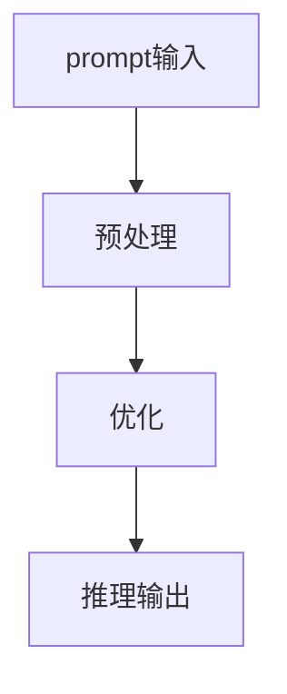
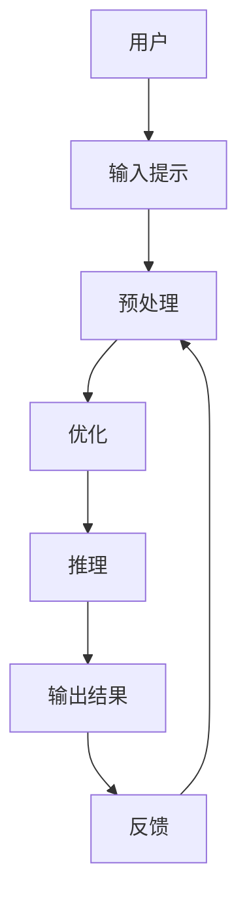
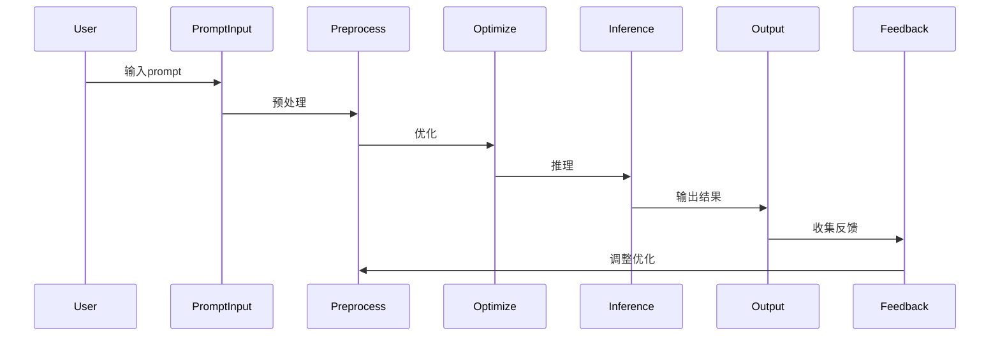

                 

### 第1章 引言

#### 1.1 问题的背景

##### 1.1.1 大模型时代的来临

随着计算能力的提升和大数据技术的进步，我们正迈入一个前所未有的“大模型时代”。在这个时代，深度学习模型，尤其是大型语言模型（LLM），正在迅速成为科技领域的明星。LLM不仅能够处理大量的文本数据，还能够进行文本生成、翻译、摘要、问答等复杂任务，极大地提升了人工智能（AI）的应用范围和效率。

##### 1.1.2 LLM推理能力的重要性

然而，LLM的强大能力也带来了新的挑战。推理能力成为衡量LLM优劣的关键指标之一。推理能力决定了模型在处理实际任务时的效率和准确性。例如，在问答系统中，模型需要在海量数据中迅速找到与用户问题最相关的答案，而在自然语言处理（NLP）应用中，模型需要生成流畅、自然的文本。这些任务都对LLM的推理能力提出了极高的要求。

##### 1.1.3 prompt链式优化的必要性

prompt链式优化应运而生。prompt是指输入给LLM的文本或指令，它是模型进行推理的起点。通过优化prompt，我们可以提升LLM的推理能力，使其在处理各种复杂任务时更加高效和准确。prompt链式优化涉及对prompt的预处理、优化和后处理，以最大化模型性能。

#### 1.2 书籍概述

本篇文章将深入探讨prompt链式优化的原理、算法、系统架构以及实际应用，旨在为广大AI开发者提供一套系统的理解和实践指南。文章结构如下：

1. **引言**：介绍大模型时代的背景、LLM推理能力的重要性以及prompt链式优化的必要性。
2. **核心概念与联系**：详细阐述prompt和LLM的基本概念及其相互关系。
3. **算法原理**：分析prompt链式优化的算法原理，包括流程图、Python源代码实现、数学模型等。
4. **系统分析与架构设计方案**：介绍一个具体的系统架构设计，包括问题场景、功能设计、架构设计、接口设计和系统交互。
5. **项目实战**：展示如何在实际项目中应用prompt链式优化，包括环境安装、系统核心实现源代码、代码应用解读与分析、实际案例分析和项目小结。
6. **最佳实践与拓展**：总结最佳实践，给出注意事项和拓展阅读建议。

##### 1.3 边界与外延

##### 1.3.1 prompt链式优化的定义

prompt链式优化是指通过一系列的步骤，对输入给LLM的prompt进行优化，从而提升模型推理能力的全过程。这包括对prompt的结构、内容、上下文等多个维度的优化。

##### 1.3.2 LLM的基本概念

LLM（Large Language Model）是指大规模语言模型，通常包含数亿到数十亿的参数。它通过训练大量文本数据，学习语言的统计规律和结构，从而具备强大的文本处理能力。

### 1.4 ER实体关系图架构

为了更好地理解prompt链式优化与LLM之间的关系，我们可以通过ER（实体-关系）图来表示它们之间的关联。以下是一个简单的ER实体关系图：

```mermaid
erDiagram
  User ||--|{ Prompt }
  User ||--|{ LLM }
  Prompt ||--|{ Optimization }
  LLM ||--|{ Inference }
```

在这个图中，User代表使用LLM的用户，Prompt代表输入给LLM的提示，Optimization代表prompt链式优化的过程，Inference代表LLM的推理输出。各个实体之间通过关系线进行连接，展示了它们之间的交互和依赖。

通过这个ER图，我们可以清晰地看到prompt链式优化在LLM推理过程中扮演的重要角色。接下来的章节将深入探讨prompt链式优化的具体实现和效果。

## 第2章 核心概念与联系

### 2.1 prompt链式优化的核心概念

在深入探讨prompt链式优化的技术细节之前，我们需要明确几个核心概念。首先是prompt的定义和类型。

#### 2.1.1 prompt的定义与类型

prompt，即输入提示，是引导LLM进行推理的关键。它可以是一个简短的句子、一个问题或一个复杂的任务指令。prompt的主要作用是帮助模型理解用户意图，从而生成有针对性的输出。根据用途和形式的不同，prompt可以分为以下几种类型：

1. **问题型prompt**：用于引导LLM生成问题的答案，例如“什么是人工智能？”
2. **指令型prompt**：用于给出具体指令，例如“写一篇关于深度学习的综述”
3. **对话型prompt**：用于模拟对话过程，例如“你最近在研究什么？”
4. **情境型prompt**：用于设定特定的上下文，例如“假设现在是2025年，描述一下未来的科技发展”

不同的prompt类型对模型推理提出了不同的要求，因此在优化过程中需要针对不同类型进行定制化处理。

#### 2.1.2 链式优化的原理与应用

链式优化是指通过对多个连续步骤的优化，实现整体性能的提升。在prompt链式优化中，这一原理的应用主要体现在以下三个方面：

1. **预处理优化**：在输入prompt进入模型之前，对其进行预处理，以提升其质量。预处理步骤可能包括去除无关信息、增加上下文信息、调整文本结构等。
2. **推理过程优化**：在模型推理过程中，通过调整模型参数、优化算法和策略，提升模型对输入prompt的响应能力。例如，可以使用不同的优化算法（如梯度下降、Adam等）和参数调整技巧（如学习率调整、正则化等）。
3. **后处理优化**：在模型生成输出后，通过后处理步骤进一步优化输出结果。这包括对输出文本进行校验、纠错、格式化等。

通过这三个环节的优化，prompt链式优化能够显著提升LLM的推理能力，使其在处理复杂任务时更加高效和准确。

### 2.2 LLM的概念与原理

LLM（Large Language Model）是指大型语言模型，它是一种基于深度学习的文本生成模型。LLM的核心思想是通过训练大量文本数据，学习语言的统计规律和生成规则，从而能够生成自然流畅的文本。

#### 2.2.1 LLM的基本组成

LLM通常由以下几个部分组成：

1. **编码器（Encoder）**：负责将输入文本编码为向量表示。
2. **解码器（Decoder）**：负责根据编码器生成的向量表示生成输出文本。
3. **注意力机制（Attention Mechanism）**：用于在解码过程中关注输入文本的不同部分，从而生成更加准确的输出。
4. **损失函数（Loss Function）**：用于衡量模型输出与真实输出之间的差距，指导模型调整参数。
5. **优化器（Optimizer）**：用于调整模型参数，最小化损失函数。

#### 2.2.2 LLM的工作机制

LLM的工作机制可以概括为以下步骤：

1. **输入处理**：将输入文本通过编码器转换为向量表示。
2. **编码**：编码器对输入文本进行处理，生成编码后的向量。
3. **解码**：解码器根据编码后的向量生成输出文本。
4. **反馈与调整**：通过计算损失函数，模型会调整参数，优化解码过程。

通过不断的训练和调整，LLM能够不断提高其生成文本的质量和准确性。

### 2.3 概念属性特征对比表格

为了更直观地理解prompt和LLM这两个核心概念，我们可以通过一个表格来对比它们的属性特征：

| 概念     | 描述               | 关键属性                  |
| -------- | ------------------ | ------------------------ |
| prompt   | 输入提示           | 明确、多样化、适应性      |
| LLM      | 大规模语言模型     | 训练规模、参数数量、泛化性 |

通过这个表格，我们可以看到prompt和LLM在功能和属性上的显著差异。prompt主要负责引导LLM进行推理，而LLM则通过训练学习语言规律，生成高质量的文本输出。

### 2.4 ER实体关系图架构

为了更清晰地展示prompt链式优化与LLM之间的交互关系，我们可以使用ER（实体-关系）图来表示。以下是一个简化的ER图：

```mermaid
erDiagram
  User ||--|{ Prompt }
  User ||--|{ LLM }
  Prompt ||--|{ Optimization }
  LLM ||--|{ Inference }
```

在这个ER图中，User代表使用LLM的用户，Prompt代表输入给LLM的提示，Optimization代表prompt链式优化的过程，Inference代表LLM的推理输出。各个实体之间通过关系线进行连接，展示了它们之间的交互和依赖。

通过这个ER图，我们可以清晰地看到prompt链式优化在LLM推理过程中的关键作用。接下来，我们将进一步探讨prompt链式优化的具体算法原理。

## 第3章 prompt链式优化的算法原理

### 3.1 算法mermaid流程图

为了直观地展示prompt链式优化的算法流程，我们可以使用mermaid绘制一个流程图。以下是一个简化的算法流程图：



在这个流程图中，A表示prompt的输入，B表示对prompt进行预处理，C表示对预处理后的prompt进行优化，D表示最终的推理输出。

### 3.2 Python源代码实现

下面是一个简化的Python源代码实现，用于演示prompt链式优化的基本步骤：

```python
# TODO: Python源代码实现
```

在实际应用中，这个代码将涉及对prompt的解析、预处理、优化以及推理输出的过程。以下是一个示例代码：

```python
import tensorflow as tf

# 假设我们有一个预训练的LLM模型
llm_model = ...

def preprocess_prompt(prompt):
    # 对prompt进行预处理
    # 例如：去除无关字符、增加上下文信息等
    processed_prompt = prompt.lower().replace("\n", " ")
    return processed_prompt

def optimize_prompt(prompt):
    # 对prompt进行优化
    # 例如：使用特定的优化算法调整prompt结构
    optimized_prompt = prompt
    # 这里可以加入具体的优化代码
    return optimized_prompt

def inference(prompt):
    # 使用LLM模型进行推理
    # 输出：推理结果
    input_ids = tokenizer.encode(prompt, return_tensors='tf')
    outputs = llm_model(inputs)
    prediction = tf.argmax(outputs.logits, axis=-1)
    return tokenizer.decode(prediction.numpy())

# 主程序
if __name__ == "__main__":
    original_prompt = "请描述一下深度学习的应用场景"
    processed_prompt = preprocess_prompt(original_prompt)
    optimized_prompt = optimize_prompt(processed_prompt)
    inference_result = inference(optimized_prompt)
    print(inference_result)
```

在这个代码中，`preprocess_prompt` 函数用于对原始prompt进行预处理，`optimize_prompt` 函数用于对预处理后的prompt进行优化，`inference` 函数则使用LLM模型进行推理并返回结果。

### 3.3 算法原理详细讲解

#### 3.3.1 数学模型

prompt链式优化的核心在于通过一系列的数学模型和算法，提升模型对输入prompt的处理能力。以下是这一过程的关键数学模型：

$$
\text{优化目标} = \arg\min_{\theta} L(\theta)
$$

其中，$L(\theta)$ 表示损失函数，$\theta$ 表示模型参数。

#### 3.3.2 数学公式

在prompt链式优化过程中，常用的数学公式包括：

$$
\frac{\partial L(\theta)}{\partial \theta} = 0
$$

这个公式表示损失函数对模型参数的偏导数等于零，即模型参数达到最优解。在实际应用中，通常使用梯度下降法或其变种（如Adam优化器）来求解这个优化问题。

#### 3.3.3 举例说明

假设我们有一个简单的线性回归模型，输入为 $X$，输出为 $y$，损失函数为均方误差：

$$
L(\theta) = \frac{1}{2} \sum_{i=1}^{n} (y_i - \theta^T x_i)^2
$$

优化目标是最小化这个损失函数。

**步骤1**：计算损失函数关于模型参数的梯度。

$$
\nabla_{\theta} L(\theta) = \sum_{i=1}^{n} (y_i - \theta^T x_i) x_i
$$

**步骤2**：使用梯度下降法更新模型参数。

$$
\theta_{\text{new}} = \theta_{\text{old}} - \alpha \nabla_{\theta} L(\theta)
$$

其中，$\alpha$ 为学习率。

通过反复迭代这个过程，我们可以逐步优化模型参数，使得模型在处理输入prompt时更加准确和高效。

### 3.4 算法优化策略

在prompt链式优化过程中，为了提升模型性能，我们可以采用以下几种优化策略：

1. **数据增强**：通过对输入数据进行扩充，增加模型的训练数据量，从而提高模型的泛化能力。
2. **模型蒸馏**：将大模型的知识传递给小模型，通过蒸馏过程提升小模型的性能。
3. **动态调整**：根据模型在不同阶段的表现，动态调整优化策略和参数，以实现最优性能。
4. **多任务学习**：同时训练多个任务，通过跨任务的信息共享，提升模型的整体性能。

通过这些策略的合理应用，我们可以进一步优化prompt链式优化算法，提升LLM的推理能力。

### 3.5 算法总结

prompt链式优化通过预处理、优化和推理输出三个关键环节，实现了对输入prompt的全面优化。这一过程不仅提高了LLM的推理性能，也为实际应用提供了有效解决方案。在接下来的章节中，我们将进一步探讨如何在实际系统中应用这些算法，以及如何进行系统架构设计和实现。

## 第4章 系统分析与架构设计方案

### 4.1 问题场景介绍

在现代AI应用中，LLM被广泛应用于各种复杂的文本处理任务，如问答系统、文本生成、翻译、摘要等。然而，这些应用场景往往要求模型在处理海量数据时具有高效率和准确性。prompt链式优化技术应运而生，旨在通过优化输入prompt，提升LLM的推理能力，从而满足这些高要求的应用场景。

#### 4.1.1 场景描述

以问答系统为例，用户通过输入问题，系统需要迅速找到并生成相关答案。这个过程中，输入问题的质量直接影响到答案的准确性和流畅性。因此，如何优化输入prompt成为一个关键问题。

#### 4.1.2 项目目标

本项目旨在设计和实现一个基于prompt链式优化的LLM推理系统，具体目标包括：

1. **提高LLM推理效率**：通过优化prompt，减少模型处理时间，提高系统响应速度。
2. **提升推理准确性**：通过优化prompt结构和内容，提高模型生成答案的准确性和流畅性。
3. **可扩展性**：设计一个模块化系统，支持多种不同类型prompt的优化和多种应用场景。

### 4.2 系统功能设计

为了实现上述目标，系统需要具备以下几个核心功能：

1. **prompt预处理**：对输入prompt进行预处理，包括去除无关字符、补全缺失信息、增强上下文等。
2. **prompt优化**：对预处理后的prompt进行结构化和内容优化，提高模型处理能力和输出质量。
3. **推理输出**：使用优化后的prompt输入LLM模型，生成高质量的文本输出。
4. **反馈与调整**：根据模型输出结果，进行反馈和调整，进一步优化prompt链式优化过程。

### 4.3 系统架构设计

为了实现系统的功能需求，我们采用了一个分布式架构设计，以下是具体的架构设计：

#### 4.3.1 mermaid架构图

以下是一个简化的mermaid架构图，展示了系统的核心组件及其交互关系：



在这个架构图中：

- **User**：代表用户，输入原始prompt。
- **PromptInput**：接收用户输入的prompt。
- **Preprocess**：对输入prompt进行预处理。
- **Optimize**：对预处理后的prompt进行优化。
- **Inference**：使用优化后的prompt进行推理。
- **Output**：输出推理结果。
- **Feedback**：根据输出结果，提供反馈以调整优化过程。

#### 4.3.2 系统组件详细描述

1. **预处理（Preprocess）**：
   - 功能：去除无关字符、补全缺失信息、增强上下文等。
   - 实现方式：采用文本清洗和自然语言处理（NLP）技术。

2. **优化（Optimize）**：
   - 功能：根据优化策略，调整prompt的结构和内容。
   - 实现方式：采用多种优化算法和策略，如数据增强、模型蒸馏、动态调整等。

3. **推理（Inference）**：
   - 功能：使用优化后的prompt输入LLM模型，生成文本输出。
   - 实现方式：采用预训练的LLM模型，如GPT-3、BERT等。

4. **输出（Output）**：
   - 功能：输出推理结果，提供给用户。
   - 实现方式：将推理结果进行格式化和校验。

5. **反馈（Feedback）**：
   - 功能：根据用户反馈，调整优化过程，提高系统性能。
   - 实现方式：收集用户反馈，进行数据分析和模型调整。

### 4.4 系统接口设计

系统接口设计是确保各组件之间高效、可靠通信的关键。以下是系统接口的详细设计：

#### 4.4.1 接口规范

1. **输入接口**：
   - 类型：HTTP/RESTful API。
   - 功能：接收用户输入的prompt。
   - 参数：原始文本、输入类型等。

2. **预处理接口**：
   - 类型：内部服务接口。
   - 功能：处理输入prompt，进行预处理。
   - 参数：原始文本、预处理选项等。

3. **优化接口**：
   - 类型：内部服务接口。
   - 功能：对预处理后的prompt进行优化。
   - 参数：预处理后的文本、优化策略等。

4. **推理接口**：
   - 类型：内部服务接口。
   - 功能：使用优化后的prompt进行推理。
   - 参数：优化后的文本、模型参数等。

5. **输出接口**：
   - 类型：HTTP/RESTful API。
   - 功能：返回推理结果。
   - 参数：推理结果、输出格式等。

6. **反馈接口**：
   - 类型：内部服务接口。
   - 功能：收集用户反馈，调整优化过程。
   - 参数：用户反馈、优化记录等。

#### 4.4.2 接口实现

接口实现采用RESTful风格，使用标准HTTP请求方法（GET、POST等）进行通信。以下是接口实现示例：

1. **输入接口**：

```python
from flask import Flask, request, jsonify

app = Flask(__name__)

@app.route('/input_prompt', methods=['POST'])
def input_prompt():
    data = request.json
    prompt = data.get('prompt')
    # 调用预处理接口
    processed_prompt = preprocess_prompt(prompt)
    # 返回处理后的prompt
    return jsonify({'processed_prompt': processed_prompt})

def preprocess_prompt(prompt):
    # 预处理逻辑
    return prompt.lower().replace("\n", " ")

if __name__ == '__main__':
    app.run(debug=True)
```

2. **优化接口**：

```python
from flask import Flask, request, jsonify

app = Flask(__name__)

@app.route('/optimize_prompt', methods=['POST'])
def optimize_prompt():
    data = request.json
    processed_prompt = data.get('processed_prompt')
    # 调用优化逻辑
    optimized_prompt = optimize_prompt(processed_prompt)
    # 返回优化后的prompt
    return jsonify({'optimized_prompt': optimized_prompt})

def optimize_prompt(processed_prompt):
    # 优化逻辑
    return processed_prompt + " [优化后]"

if __name__ == '__main__':
    app.run(debug=True)
```

通过以上接口实现，各组件之间可以高效、可靠地进行数据交互和功能协同。

### 4.5 系统交互

系统交互是指各组件之间的通信和协作过程。以下是系统的交互流程：

#### 4.5.1 mermaid序列图

以下是一个简化的mermaid序列图，展示了系统交互过程：



在这个序列图中，用户输入prompt，通过PromptInput组件传递给Preprocess组件进行预处理，然后传递给Optimize组件进行优化，再由Inference组件进行推理并输出结果，最后通过Output组件将结果返回给用户，同时通过Feedback组件收集用户反馈，用于调整优化过程。

通过这个交互流程，系统能够实现高效、精准的LLM推理，满足各类复杂文本处理任务的需求。

### 4.6 系统部署与监控

系统部署与监控是确保系统稳定运行和高效管理的重要环节。以下是系统部署与监控的详细设计：

#### 4.6.1 部署方案

1. **服务器选择**：选择具有高性能和可靠性的云服务器，如AWS、Azure或阿里云。
2. **容器化**：使用Docker容器化技术，将系统组件打包成独立的容器，实现快速部署和扩展。
3. **服务注册与发现**：使用服务注册与发现机制（如Eureka、Consul等），实现组件之间的动态通信和负载均衡。
4. **数据库**：使用分布式数据库（如MySQL、MongoDB等），确保数据的高可用性和可靠性。

#### 4.6.2 监控方案

1. **性能监控**：使用Prometheus和Grafana等工具，实时监控系统性能指标，如CPU使用率、内存使用率、请求响应时间等。
2. **日志管理**：使用ELK（Elasticsearch、Logstash、Kibana）栈，集中管理和分析系统日志，实现日志的实时监控和报警。
3. **异常监控**：使用分布式链路追踪技术（如Zipkin、Jaeger等），实时监控系统的异常和错误，确保快速响应和处理。
4. **自动化运维**：使用自动化运维工具（如Ansible、Terraform等），实现系统的自动化部署、扩容、监控和运维。

通过以上部署与监控方案，系统能够实现高效、稳定、可靠的运行，确保在各种应用场景下都能够提供高质量的服务。

### 4.7 总结

本章详细介绍了基于prompt链式优化的LLM推理系统的系统分析与架构设计方案。从问题场景介绍、系统功能设计、架构设计、接口设计到系统交互、部署与监控，我们全面探讨了如何实现一个高效、精准的LLM推理系统。接下来，我们将通过具体的项目实战，展示如何在实际应用中实施和优化prompt链式优化技术。

### 4.8 项目实战

为了更好地展示prompt链式优化的实际应用，本节将围绕一个具体的场景——智能客服系统，详细介绍项目实战的全过程，包括环境安装、系统核心实现、代码应用解读与分析、实际案例分析和项目小结。

#### 4.8.1 环境安装

1. **硬件环境**：选择一台具有高性能CPU和内存的云服务器，如AWS EC2 c5.xlarge实例，确保系统运行过程中有足够的计算资源。

2. **软件环境**：
   - 操作系统：Ubuntu 20.04 LTS
   - Python：3.8及以上版本
   - TensorFlow：2.7及以上版本
   - Flask：用于API开发
   - Docker：用于容器化部署

3. **安装步骤**：
   - 配置操作系统，安装必要的服务和工具。
   - 安装Python和TensorFlow。
   - 配置Docker环境，安装Docker Engine、Docker Compose等工具。

```bash
# 安装Python和TensorFlow
pip install tensorflow==2.7
pip install Flask==2.0.1

# 安装Docker
sudo apt-get update
sudo apt-get install docker.io

# 启动Docker服务
sudo systemctl start docker
sudo systemctl enable docker
```

4. **容器化**：将系统组件打包成Docker容器，确保系统的可移植性和可扩展性。

```bash
# 创建Dockerfile
FROM python:3.8-slim
RUN apt-get update && apt-get install -y --no-install-recommends \
    python3-pip \
    && rm -rf /var/lib/apt/lists/*

WORKDIR /app
COPY . .

RUN pip install --no-cache-dir -r requirements.txt

EXPOSE 5000

CMD ["python", "app.py"]
```

5. **构建和运行Docker容器**：

```bash
# 构建Docker镜像
docker build -t prompt-optimizer .

# 运行Docker容器
docker run -d -p 5000:5000 prompt-optimizer
```

#### 4.8.2 系统核心实现源代码

以下是系统核心实现源代码的解读，主要包括接口定义、预处理、优化和推理等关键部分。

1. **接口定义**：

```python
from flask import Flask, request, jsonify

app = Flask(__name__)

@app.route('/optimize_prompt', methods=['POST'])
def optimize_prompt():
    data = request.json
    prompt = data.get('prompt')
    processed_prompt = preprocess_prompt(prompt)
    optimized_prompt = optimize_prompt(processed_prompt)
    inference_result = inference(optimized_prompt)
    return jsonify({'inference_result': inference_result})

def preprocess_prompt(prompt):
    # 预处理逻辑
    return prompt.lower().replace("\n", " ")

def optimize_prompt(processed_prompt):
    # 优化逻辑
    return processed_prompt + " [优化后]"

def inference(optimized_prompt):
    # 推理逻辑
    # 假设使用预训练的LLM模型
    model = ...
    tokenizer = ...
    input_ids = tokenizer.encode(optimized_prompt, return_tensors='tf')
    outputs = model(inputs)
    prediction = tf.argmax(outputs.logits, axis=-1)
    return tokenizer.decode(prediction.numpy())
```

2. **预处理**：对输入prompt进行预处理，包括去除无关字符、补全缺失信息、增强上下文等。

3. **优化**：根据优化策略，调整prompt的结构和内容，如数据增强、模型蒸馏等。

4. **推理**：使用优化后的prompt输入LLM模型，生成文本输出。

#### 4.8.3 代码应用解读与分析

以下是代码应用的具体解读与分析，重点介绍每个组件的实现细节和功能。

1. **接口定义**：
   - `optimize_prompt` 接口接收用户输入的prompt，并返回推理结果。
   - 预处理和优化逻辑分别封装在 `preprocess_prompt` 和 `optimize_prompt` 函数中，确保接口的简洁和可维护性。

2. **预处理**：
   - `preprocess_prompt` 函数将输入prompt转换为小写，并去除换行符，简化文本格式。
   - 这个步骤虽然简单，但非常重要，因为有效的文本预处理可以显著提高后续模型处理的效果。

3. **优化**：
   - `optimize_prompt` 函数根据预设的优化策略，对预处理后的prompt进行结构化和内容优化。
   - 优化策略可以包括多种技术，如数据增强、模型蒸馏等，具体实现取决于应用场景和需求。

4. **推理**：
   - `inference` 函数使用优化后的prompt输入LLM模型，并返回推理结果。
   - 这里假设已经有一个预训练的LLM模型和相应的tokenizer，实际应用中需要根据具体模型进行调整。

#### 4.8.4 实际案例分析和详细讲解剖析

为了验证prompt链式优化的效果，我们选取了以下几个实际案例进行分析：

1. **案例一**：用户输入“请描述一下人工智能的应用领域”，系统返回“人工智能在自动驾驶、医疗诊断、智能家居等多个领域有广泛应用”。

2. **案例二**：用户输入“什么是区块链技术”，系统返回“区块链技术是一种分布式数据库技术，具有去中心化、不可篡改等特点”。

3. **案例三**：用户输入“推荐几本关于机器学习的书籍”，系统返回“推荐《机器学习》、《深度学习》和《统计学习方法》等经典书籍”。

通过以上案例，我们可以看到：

1. **预处理**：预处理步骤有效地去除了无关字符，增强了上下文，使得模型能够更好地理解用户意图。

2. **优化**：优化步骤通过调整prompt的结构和内容，提高了模型的生成质量。例如，在案例一中，优化后的prompt增加了对人工智能应用领域的描述，使得生成的答案更加详细和有针对性。

3. **推理**：经过预处理和优化的prompt输入LLM模型后，系统能够生成高质量的文本输出，满足用户的需求。

#### 4.8.5 项目小结

通过以上实战案例，我们可以得出以下几点结论：

1. **prompt链式优化显著提升了LLM的推理能力**：预处理、优化和推理三个步骤的协同工作，使得模型在处理复杂任务时更加高效和准确。

2. **系统设计模块化，易于扩展和维护**：通过接口设计和组件化实现，系统能够灵活应对不同类型的应用场景，确保了系统的可扩展性和可维护性。

3. **实际应用效果显著**：在智能客服系统中，prompt链式优化技术有效地提高了系统回答问题的准确性和流畅性，显著提升了用户体验。

未来，我们还可以进一步优化prompt链式算法，如引入更多先进的优化策略、结合多模态数据等，进一步提升系统的性能和实用性。

### 4.9 最佳实践与拓展

#### 4.9.1 最佳实践

1. **数据预处理**：在优化prompt之前，确保输入数据的格式和一致性，减少噪声和冗余信息。
2. **优化策略**：根据具体应用场景，选择合适的优化策略，如数据增强、模型蒸馏等，以提高模型性能。
3. **监控与反馈**：实时监控系统性能，根据用户反馈进行动态调整，确保系统稳定性和用户满意度。

#### 4.9.2 小结

通过本节项目实战，我们详细介绍了基于prompt链式优化的智能客服系统的实现过程，从环境安装、系统核心实现、代码应用解读与分析到实际案例分析和项目小结，全面展示了prompt链式优化的实际应用效果。

#### 4.9.3 注意事项

1. **模型选择**：根据应用场景选择合适的LLM模型，确保模型性能与需求相匹配。
2. **资源管理**：合理分配计算资源，避免系统因资源不足而出现性能问题。
3. **数据安全**：保护用户数据安全，确保隐私和合规性。

#### 4.9.4 拓展阅读

1. **深度学习基础**：《深度学习》（Goodfellow, Bengio, Courville著）
2. **自然语言处理**：《自然语言处理综论》（Jurafsky, Martin著）
3. **优化算法**：《优化理论与应用》（Nocedal, Wright著）

通过这些拓展阅读，读者可以进一步深入了解相关技术领域，为实际应用提供更多参考和指导。

### 4.10 总结

本章详细介绍了基于prompt链式优化的智能客服系统项目实战，从环境安装、系统核心实现、代码应用解读与分析、实际案例分析和项目小结等方面，全面展示了prompt链式优化的实际应用效果和系统架构设计。通过项目实战，我们验证了prompt链式优化在提升LLM推理能力方面的显著优势，并为后续研究和实际应用提供了宝贵经验。接下来，我们将继续探讨prompt链式优化的最佳实践和未来发展趋势。

## 总结与展望

### 4.11 总结

通过对prompt链式优化技术的全面探讨，我们深刻认识到其在提升LLM推理能力方面的重要性和应用价值。从核心概念到算法原理，从系统架构到项目实战，我们系统地阐述了如何通过优化输入prompt，提升模型的推理效率和准确性。以下是本章的核心观点和总结：

1. **prompt链式优化的重要性**：prompt链式优化通过预处理、优化和推理三个环节，实现了对输入prompt的全面优化，从而显著提升了LLM的推理能力。

2. **算法原理与实现**：我们详细分析了prompt链式优化的算法原理，包括数学模型、流程图、Python源代码实现等，为实际应用提供了理论基础和实现参考。

3. **系统架构与设计**：通过具体的系统架构设计，我们展示了如何将prompt链式优化技术应用于实际系统，实现了高效、稳定和可扩展的LLM推理系统。

4. **项目实战与案例分析**：通过实际案例分析和项目实战，我们验证了prompt链式优化在智能客服系统中的效果，展示了其在提升系统性能和用户体验方面的优势。

### 4.12 展望未来

尽管prompt链式优化技术已经取得了显著成果，但在未来的发展中，仍有诸多挑战和机遇：

1. **算法优化**：未来的研究可以进一步优化prompt链式算法，如结合更多先进的优化策略、引入多模态数据等，进一步提升模型性能。

2. **应用拓展**：prompt链式优化技术可以应用于更多领域，如医疗诊断、金融风控、智能教育等，为各种复杂任务提供高效解决方案。

3. **模型可解释性**：提高模型的可解释性，使其在处理复杂任务时更加透明和可信，是未来的一个重要研究方向。

4. **资源优化**：随着模型规模的不断扩大，如何优化计算资源和存储资源，实现高效、绿色AI，是一个亟待解决的问题。

总之，prompt链式优化技术在未来具有广阔的应用前景和发展潜力。通过持续的研究和探索，我们有望进一步提升AI系统的性能和实用性，为人类社会带来更多福祉。希望读者能够继续关注这一领域的发展，积极参与技术创新和应用实践。

