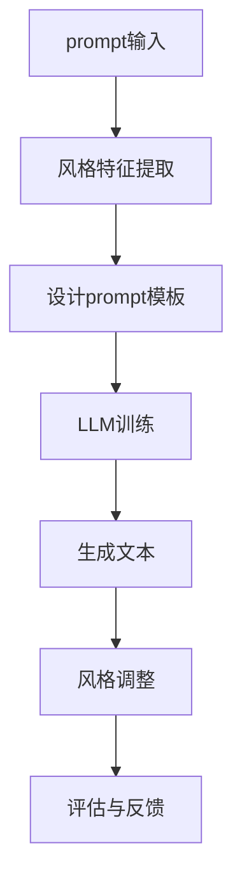

                 

### 让我们一步一步思考：prompt风格转换的兴起

#### 1.1 问题背景

随着深度学习技术的迅猛发展，大规模语言模型（LLM）已经成为自然语言处理（NLP）领域的核心技术之一。这些模型通过学习海量的文本数据，能够生成高质量的文本内容，并被广泛应用于文本生成、机器翻译、问答系统等场景。然而，在实际应用中，不同场景对文本风格的要求各异，例如，新闻写作需要客观、简洁，而社交媒体文案则追求生动、有趣。这种多样化的风格需求催生了prompt风格转换的需求。

#### 1.2 问题描述

传统的文本生成方法往往难以适应多种风格需求。例如，早期的基于模板和规则的方法虽然能够生成符合一定风格的文本，但缺乏灵活性，难以应对复杂多样的风格要求。而基于统计学习的方法虽然在生成文本的质量上有所提升，但仍然难以灵活调整文本风格。此外，现有的方案在处理跨领域、跨风格的任务时，往往表现出明显的局限性。

#### 1.3 问题解决

prompt风格转换的出现，为解决这一问题提供了新的思路。通过将风格信息作为prompt输入到语言模型中，模型可以更加精准地生成符合特定风格要求的文本。这种方法的核心理念是将风格信息与文本生成过程有机结合，从而实现灵活的风格控制。prompt风格转换的适用范围广泛，不仅适用于文本生成，还可以应用于文本编辑、翻译等任务。

#### 1.4 核心概念与联系

**prompt**：prompt是触发语言模型生成文本的输入，它包含了文本的主题、风格、目标等关键信息。

**LLM**：大规模语言模型是一种基于深度学习的模型，能够通过学习大量文本数据生成高质量文本。

**风格转换**：风格转换是指将一种风格文本转换为另一种风格文本的过程。

这三种核心概念之间有着紧密的联系。prompt作为输入，引导LLM生成符合特定风格的文本，而风格转换则是将这种特定风格文本应用到实际任务中的关键步骤。

#### 1.5 研究方法与数据集

为了深入研究prompt风格转换，需要选择合适的数据集并进行预处理。数据集的选择应考虑文本的多样性、覆盖领域广泛性以及质量高低。常用的数据集包括新闻数据集、社交媒体文本数据集和领域特定数据集等。在实验设计中，评价指标应涵盖文本质量、风格一致性、生成速度等方面，以便全面评估prompt风格转换的性能。

#### 1.6 本章小结

本节概述了prompt风格转换的兴起背景、问题描述以及解决方案，并探讨了核心概念及其联系。通过对背景和问题的深入分析，我们认识到prompt风格转换在适应不同场景风格需求方面的重要性。在接下来的章节中，我们将进一步探讨不同LLM的特性以及适应性策略，以期为这一技术领域的研究和实践提供更为详细的指导。

#### 1.1 问题背景

语言模型的发展历程可谓波澜壮阔。从早期基于规则的方法到如今深度学习主导的时代，每一次技术的迭代都为自然语言处理带来了巨大的飞跃。早期的语言模型主要依赖于统计方法和规则匹配，例如N-gram模型和基于规则的语法分析器。这些方法虽然在一定程度上能够处理自然语言，但在应对复杂语境和多样化风格方面存在明显不足。

随着计算能力的提升和数据量的增加，统计机器翻译和基于模板的方法逐渐崭露头角。这些方法通过大规模语料库的训练，能够生成较为流畅的文本，但在应对特定风格需求时仍显乏力。特别是在处理长文本和复杂语义时，这些方法的局限性更加明显。

深度学习的崛起为语言模型的发展带来了新的契机。特别是2018年GPT-2的发布，标志着大规模预训练语言模型进入了一个新的时代。GPT-2通过在大量文本上进行预训练，能够生成高质量、多样化的文本内容。这一成果引发了广泛关注，各种大规模语言模型如BERT、T5、GPT-3等相继推出，进一步推动了自然语言处理技术的发展。

然而，尽管大规模语言模型在文本生成、机器翻译、问答系统等领域取得了显著进展，但面对多样化的风格需求，它们仍然面临挑战。不同的应用场景对文本风格有不同要求，例如，新闻报道需要客观、简洁，社交媒体文案需要生动、有趣，学术论文需要严谨、学术。如何使语言模型能够灵活适应这些多样化的风格需求，成为当前研究的一个热点问题。

prompt风格转换技术的出现，为解决这一问题提供了新的思路。通过将风格信息作为prompt输入到语言模型中，模型可以更加精准地生成符合特定风格的文本。这种方法不仅能够提高文本生成的质量，还能够实现灵活的风格控制，满足不同应用场景的需求。prompt风格转换的兴起，标志着自然语言处理技术向更高层次发展的一个重要里程碑。

#### 1.2 问题描述

在深入探讨prompt风格转换之前，有必要先明确当前存在的挑战和问题。首先，传统方法在风格转换方面的局限性显而易见。早期的语言模型，如基于N-gram和规则匹配的方法，虽然能够处理一些简单的文本生成任务，但在面对复杂多样的风格需求时，显得力不从心。这些模型往往依赖于固定的模板和规则，缺乏灵活性，难以适应不同场景下的风格要求。

随着统计机器翻译和基于模板的方法的出现，文本生成的质量有所提升，但仍难以完全满足多样化的风格需求。统计机器翻译方法虽然通过大规模语料库训练能够生成较为流畅的文本，但在处理特定风格文本时，仍然存在一定的局限性。而基于模板的方法在处理复杂文本和多样化风格方面表现不佳，难以灵活调整文本风格。

现有的方案在处理跨领域、跨风格的任务时，也表现出明显的局限性。例如，在翻译任务中，将一种语言的新闻文本翻译成另一种语言的新闻文本，与将同一语言的社交媒体文案翻译成学术论文文案，这两种任务的风格需求截然不同。现有方案往往难以同时满足这些多样化的风格要求。

此外，不同的应用场景对文本风格有不同要求，但现有模型在风格识别和调整方面的能力有限。例如，新闻报道需要客观、简洁，社交媒体文案需要生动、有趣，学术论文需要严谨、学术。现有模型难以灵活地捕捉和适应这些风格特征，导致生成的文本在风格上与预期存在较大差异。

总之，尽管大规模语言模型在文本生成和自然语言处理领域取得了显著进展，但在应对多样化风格需求方面仍然存在挑战。prompt风格转换技术的出现，为解决这一问题提供了新的思路。通过将风格信息作为prompt输入到语言模型中，模型可以更加精准地生成符合特定风格的文本。这一方法不仅能够提高文本生成的质量，还能够实现灵活的风格控制，满足不同应用场景的需求。因此，深入研究和探讨prompt风格转换，具有重要的理论和实践意义。

#### 1.3 问题解决

为了解决多样化风格需求带来的挑战，prompt风格转换技术应运而生。这种技术的核心思想是将风格信息作为输入prompt，引导大规模语言模型（LLM）生成符合特定风格的文本。具体来说，prompt风格转换技术主要包括以下几个关键步骤：

**1. 提取风格特征**：首先，需要从现有文本中提取出风格特征。这些特征可以是文本的语法结构、词汇选择、情感倾向等。通过这些特征，可以构建出一个描述特定风格的模型。

**2. 设计prompt模板**：根据提取出的风格特征，设计一个适合该风格的prompt模板。prompt模板通常包含一个或多个关键提示词或短语，用于引导LLM生成符合特定风格的文本。

**3. 输入到语言模型**：将设计的prompt模板输入到大规模语言模型中。LLM通过学习大量文本数据，能够理解prompt模板中的风格信息，并生成符合该风格的文本。

**4. 风格调整**：在生成文本后，可以对文本进行进一步的风格调整。例如，通过调整文本的语法、词汇和表达方式，使其更加符合特定风格要求。

**5. 评估与反馈**：通过评估生成的文本质量和风格一致性，对prompt风格转换过程进行优化。评估指标可以包括文本质量、风格一致性、生成速度等。根据评估结果，可以进一步调整prompt模板和语言模型参数，以提高风格转换效果。

**适用范围与边界**：prompt风格转换技术具有广泛的适用范围，不仅适用于文本生成，还可以应用于文本编辑、翻译、问答系统等多个领域。然而，这一技术也存在一些适用边界。首先，需要确保输入的风格特征准确且具有代表性，否则可能影响生成文本的质量。其次，由于大规模语言模型的计算资源需求较高，在实际应用中可能受到硬件资源和时间限制。此外，某些特定领域的专业知识和表达方式可能难以通过prompt风格转换实现完美转换，需要结合领域特定知识进行进一步优化。

通过上述步骤和策略，prompt风格转换技术能够有效解决多样化风格需求带来的挑战，为自然语言处理领域的发展提供了新的方向和可能性。

#### 1.4 核心概念与联系

在深入探讨prompt风格转换之前，我们需要明确几个核心概念：prompt、大规模语言模型（LLM）和风格转换。

**Prompt**：Prompt是触发语言模型生成文本的输入，它包含了文本的主题、风格、目标等关键信息。一个有效的prompt能够引导模型生成符合特定需求的文本。例如，一个prompt可以是“请写一篇关于人工智能的未来发展趋势的新闻报道”。

**大规模语言模型（LLM）**：LLM是一种基于深度学习的模型，通过在大量文本数据上进行预训练，能够生成高质量、多样化的文本内容。常见的LLM包括GPT、BERT等。这些模型具有强大的语言理解能力和文本生成能力，但它们在处理特定风格文本时往往表现出局限性。

**风格转换**：风格转换是指将一种风格文本转换为另一种风格文本的过程。例如，将一篇科技论文转换为生动有趣的社交媒体文案。风格转换的目标是保持文本内容不变，同时使文本风格与目标风格一致。

这些概念之间有着紧密的联系。prompt作为输入，引导LLM生成符合特定风格的文本；风格转换则是将这种特定风格文本应用到实际任务中的关键步骤。通过理解这些核心概念，我们可以更好地理解prompt风格转换的工作原理和应用场景。

为了更直观地展示这些概念之间的关系，我们可以借助Mermaid流程图来构建一个简化的模型架构。



在这个流程图中，prompt输入首先经过风格特征提取，然后设计prompt模板，将其输入到LLM中进行训练和文本生成。生成的文本再进行风格调整，并最终进行评估与反馈，以优化整个风格转换过程。

此外，为了进一步理解prompt风格转换的属性特征，我们可以构建一个对比表格，展示不同概念之间的区别和联系。

| 特征       | Prompt           | LLM                  | 风格转换                |
|------------|------------------|----------------------|------------------------|
| 功能       | 引导文本生成     | 生成文本             | 文本风格转换           |
| 输入类型   | 风格特征和主题   | 预训练文本数据       | 原文和目标风格         |
| 关键作用   | 影响文本风格和主题 | 提供文本生成能力     | 保持内容不变，改变风格 |
| 依赖性     | 依赖于LLM的生成能力 | 依赖于prompt的设计   | 依赖于风格特征提取和调整 |

通过这个表格，我们可以更清晰地看到prompt、LLM和风格转换各自的角色和相互之间的关系。这些核心概念和联系的理解，为我们进一步深入研究prompt风格转换提供了坚实的基础。

#### 1.5 研究方法与数据集

在深入研究prompt风格转换时，选择合适的研究方法和数据集至关重要。以下将详细讨论数据集的选择、预处理方法、实验设计与评价指标，以及本章小结。

**数据集的选择**

数据集的选择应当充分考虑文本的多样性、覆盖领域广泛性以及质量高低。常用的数据集包括以下几类：

1. **新闻数据集**：如CNN/Daily Mail，这些数据集包含了大量不同主题的新闻文章，能够为风格转换提供丰富的训练资源。
2. **社交媒体文本数据集**：如Twitter、Facebook，这些数据集包含了用户发布的各种类型的文本，有助于研究不同风格的文本生成。
3. **领域特定数据集**：如学术论文、产品评论、法律文书等，这些数据集针对特定领域，能够提供高质量的文本数据，有助于提升模型在特定领域的风格转换能力。

**数据预处理**

在数据预处理阶段，需要进行以下几项关键任务：

1. **文本清洗**：去除文本中的噪声和无关信息，如HTML标签、特殊字符等。
2. **分词和词性标注**：将文本切分为词或句子，并对每个词进行词性标注，以便后续特征提取。
3. **文本标准化**：统一文本格式，如将所有文本转换为小写、去除停用词等。
4. **数据增强**：通过文本替换、改写等方法，增加训练数据量，提高模型泛化能力。

**实验设计**

实验设计是评估prompt风格转换效果的关键步骤。以下为实验设计的基本要素：

1. **模型选择**：根据任务需求和计算资源，选择合适的LLM模型，如GPT、BERT等。
2. **数据划分**：将数据集划分为训练集、验证集和测试集，以便在模型训练和评估过程中进行效果对比。
3. **评价指标**：常用的评价指标包括文本质量（如BLEU、ROUGE）、风格一致性（如风格匹配度）、生成速度等。根据任务需求，选择合适的评价指标进行综合评估。
4. **实验参数**：设置模型参数，如学习率、批处理大小、训练轮数等，确保实验的可重复性。

**评价指标**

评价指标的选择直接影响实验结果的客观性和可靠性。以下是几个常用的评价指标：

1. **BLEU（双语评估统一度量）**：用于评估机器翻译文本的质量，通过计算生成文本与参考文本之间的相似度来评分。
2. **ROUGE（Recall-Oriented Understudy for Gisting Evaluation）**：用于评估文本摘要的质量，通过比较生成文本与参考文本的 overlap 来评分。
3. **风格匹配度**：用于评估生成文本与目标风格的一致性，可以通过计算生成文本中目标风格的词汇比例、语法结构等指标来衡量。
4. **生成速度**：评估模型在生成文本时的速度，对于实时应用场景尤为重要。

**本章小结**

本节详细讨论了研究prompt风格转换所需的方法和数据集。选择合适的新闻、社交媒体和领域特定数据集，进行有效的数据预处理，设计合理的实验方案，并选择恰当的评价指标，是成功进行prompt风格转换研究的关键。通过本章的讨论，我们为后续章节的深入探讨奠定了基础，并为实际应用提供了可操作性的指导。

#### 1.6 本章小结

本章首先概述了prompt风格转换的兴起背景，介绍了语言模型的发展历程以及prompt风格转换的需求和重要性。接着，我们详细探讨了问题描述，分析了传统方法与现有方案的局限性，并提出了prompt风格转换的解决方案。此外，本章还阐述了核心概念，包括prompt、大规模语言模型（LLM）和风格转换，并利用Mermaid流程图和对比表格进行了直观展示。最后，本章讨论了研究方法与数据集的选择，包括数据集的预处理、实验设计和评价指标。通过这些讨论，我们为后续章节的深入探讨奠定了理论基础，并为实际应用提供了实用指南。

### 第2章：LLM的特性分析

#### 2.1 LLM的基本特性

大规模语言模型（LLM）作为当前自然语言处理（NLP）领域的核心技术之一，其基本特性决定了其在文本生成、翻译、问答等任务中的表现。LLM的基本特性主要包括参数规模与计算效率、知识获取与处理能力、多样性与灵活性。

**参数规模与计算效率**

LLM的参数规模通常是衡量其性能的一个重要指标。参数规模越大，模型能够学习的语言模式和语义信息就越多，从而在生成高质量文本方面具有更高的能力。例如，GPT-3拥有超过1750亿个参数，这是目前最大的预训练语言模型之一。然而，大规模的参数也带来了计算效率上的挑战。在训练和推理过程中，大规模模型需要大量的计算资源和时间。因此，如何在保证模型性能的同时提高计算效率，是LLM研究中的一个重要课题。

为了应对这一挑战，研究人员采用了多种策略，包括模型剪枝、量化、并行计算等。这些方法能够在一定程度上降低模型对计算资源的需求，提高训练和推理的效率。例如，通过剪枝可以去除模型中不重要的参数，从而减少模型的大小；通过量化可以将模型的参数从浮点数转换为较低精度的数值，从而减少存储和计算需求。

**知识获取与处理能力**

知识获取与处理能力是LLM的另一个重要特性。LLM通过在大量文本数据上进行预训练，能够自动学习到大量的语言知识和语义信息。这些知识不仅包括词汇的含义、语法结构，还包括常识性知识、领域特定知识等。例如，通过预训练，LLM可以学会识别不同词性、生成符合语法规则和语义逻辑的文本、回答复杂的问题等。

然而，LLM的知识获取与处理能力也并非完美无缺。首先，LLM的知识来源是有限的，它依赖于预训练数据的质量和多样性。如果预训练数据存在偏见或不准确，LLM在生成文本时也可能出现错误。其次，LLM在处理长文本时可能会出现信息丢失或理解偏差，这是因为其内部结构限制了对长距离依赖关系的捕捉能力。

为了提高LLM的知识获取与处理能力，研究人员提出了多种改进方法，如知识蒸馏、多任务学习、多模态学习等。这些方法通过引入外部知识源、增强模型的多任务能力、结合多模态数据等手段，有助于提升LLM的知识获取和利用效率。

**多样性与灵活性**

多样性与灵活性是LLM在文本生成任务中的关键特性。LLM能够生成高质量、多样化的文本内容，包括不同主题、风格、情感等的文本。这种多样性使得LLM在多个应用场景中具有广泛的应用潜力。例如，在文本生成任务中，LLM可以生成新闻文章、故事、产品评论等不同类型的文本；在翻译任务中，LLM可以生成不同语言风格的翻译文本；在问答系统中，LLM可以生成符合用户需求的高质量回答。

然而，LLM的多样性和灵活性也带来了挑战。首先，如何设计有效的prompt，以引导LLM生成符合特定需求的高质量文本，是一个重要问题。其次，LLM在处理多样化风格时，可能会出现生成文本质量不一致或风格不稳定的问题。

为了提高LLM的多样性和灵活性，研究人员提出了多种策略，如自适应prompt设计、多风格训练、风格迁移等。这些方法通过优化prompt设计、增强模型对不同风格的适应能力，有助于提高LLM在多样化任务中的表现。

总之，大规模语言模型（LLM）的基本特性包括参数规模与计算效率、知识获取与处理能力、多样性与灵活性。这些特性决定了LLM在NLP任务中的表现和应用潜力。然而，也带来了计算效率、知识获取、多样化风格处理等方面的挑战。通过不断优化和改进，研究人员正在努力提升LLM的性能和适用范围。

#### 2.2 LLM的多样化特性

大规模语言模型（LLM）的多样化特性主要体现在语言风格、领域知识和隐私安全性等方面。这些特性不仅影响了LLM的文本生成能力，也决定了其在不同应用场景中的适用性和性能。

**语言风格**

语言风格是LLM的一个重要多样化特性，它决定了模型生成的文本在表达形式、语气、情感等方面的特点。不同的语言风格适用于不同的应用场景，例如，新闻报道要求客观、简洁，社交媒体文案追求生动、有趣，学术论文需要严谨、学术。LLM通过在预训练过程中学习大量不同风格的文本数据，能够生成符合特定风格要求的文本。

然而，LLM在处理多样化语言风格时也存在挑战。首先，某些特定风格的文本数据在预训练数据中可能较为稀缺，这可能导致模型在生成特定风格文本时表现不佳。其次，LLM在生成多样化语言风格时，可能会出现风格不一致或风格不稳定的问题。例如，在同一个文本生成任务中，模型可能会在部分段落生成生动有趣的文案，而在其他段落生成客观简洁的文案，导致整体文本风格不统一。

为了解决这些问题，研究人员提出了多种策略，如自适应prompt设计、多风格训练和风格迁移等。自适应prompt设计通过设计灵活的prompt模板，引导LLM生成符合特定风格要求的文本。多风格训练则通过在预训练阶段引入多种风格的文本数据，增强模型对不同风格的适应能力。风格迁移方法通过将一种风格的文本转换为另一种风格的文本，提高LLM在多样化语言风格处理中的性能。

**领域知识**

领域知识是LLM的另一个重要多样化特性。不同领域的文本数据具有特定的知识结构和表达方式，这使得LLM在处理不同领域的任务时表现出不同的能力。例如，医学领域的数据集包含大量医学专业术语和知识，这使得LLM在生成医学文本时具有更高的准确性。而法律领域的文本数据则包含复杂的法律条款和规定，这使得LLM在生成法律文本时需要具备较高的专业能力。

然而，LLM在处理多样化领域知识时也存在挑战。首先，领域知识的多样性和复杂性可能导致模型在处理某些特定领域的任务时出现信息丢失或理解偏差。其次，领域知识的稀缺性可能导致模型在生成特定领域文本时表现不佳。为了解决这些问题，研究人员提出了多种策略，如多任务学习、知识蒸馏和跨领域迁移学习等。这些方法通过引入外部知识源、增强模型的多任务能力和跨领域适应能力，有助于提升LLM在不同领域的表现。

**隐私安全性**

隐私安全性是LLM在应用过程中不可忽视的一个重要特性。随着LLM在现实场景中的广泛应用，用户数据的隐私保护成为一个关键问题。LLM在预训练过程中需要大量用户数据，这些数据可能包含用户的敏感信息，如个人身份、财务状况、健康状况等。如果这些数据泄露，可能导致严重的隐私风险。

为了保护用户隐私，研究人员提出了一系列隐私保护措施。首先，可以采用差分隐私技术，通过在模型训练过程中加入噪声，防止用户数据被直接暴露。其次，可以采用联邦学习技术，将模型训练分散到多个用户设备上，从而减少用户数据泄露的风险。此外，还可以采用数据脱敏技术，对用户数据进行预处理，以防止敏感信息被识别。

总之，LLM的多样化特性包括语言风格、领域知识和隐私安全性。这些特性使得LLM在多个应用场景中具有广泛的应用潜力。然而，也带来了处理多样化语言风格、领域知识和隐私保护等方面的挑战。通过不断优化和改进，研究人员正在努力提升LLM的性能和适用范围，以满足不同应用场景的需求。

#### 2.3 LLM的适应性需求

在自然语言处理（NLP）领域中，大规模语言模型（LLM）的适应性需求尤为重要。适应性需求主要体现在环境适应性、风格适应性和功能适应性三个方面，这些需求决定了LLM在多种复杂场景中的实际应用效果。

**环境适应性**

环境适应性是指LLM在适应不同环境和背景条件时的能力。在实际应用中，LLM可能会面临多种不同的环境，如网络连接质量、计算资源限制、数据完整性等。一个具有良好环境适应性的LLM应能够在这些不同环境下保持稳定和高效的表现。

首先，网络连接质量对LLM的应用有显著影响。在弱网环境下，LLM的响应速度和生成文本的质量可能会受到影响。为了提高环境适应性，研究人员可以采用以下策略：一是优化模型压缩技术，减少模型大小，降低传输和计算需求；二是设计分布式训练和推理架构，将模型分解为多个部分，在不同的设备上并行处理，从而提高整体性能。

其次，计算资源限制也是一个重要的环境适应性挑战。大规模LLM的训练和推理过程通常需要大量的计算资源。为了解决这一问题，可以采取以下措施：一是优化模型架构，如采用轻量级网络结构，减少计算复杂度；二是利用云计算和边缘计算技术，动态分配计算资源，确保模型在资源受限的环境下仍能高效运行。

**风格适应性**

风格适应性是指LLM在处理不同语言风格和表达形式时的能力。在多种应用场景中，如文本生成、机器翻译、对话系统等，对文本风格的要求各不相同。一个具有良好风格适应性的LLM应能够在不同风格之间灵活切换，生成符合需求的高质量文本。

为了实现风格适应性，研究人员可以采用以下策略：

1. **多风格训练**：在预训练阶段引入多种风格的数据集，使模型在多种风格上获得丰富的经验。通过这种策略，模型可以在生成文本时灵活地适应不同风格的要求。

2. **自适应prompt设计**：设计灵活的prompt模板，引导模型在特定风格下生成文本。例如，在生成新闻报道时，可以使用客观、简洁的提示词；而在生成社交媒体文案时，可以使用生动、有趣的提示词。

3. **风格迁移**：通过迁移学习技术，将一种风格的数据和知识迁移到其他风格上。例如，可以将一篇学术文章的风格迁移到一篇新闻报道或社交媒体文案，从而提高模型在不同风格间的适应性。

**功能适应性**

功能适应性是指LLM在不同功能任务中的适应能力。随着NLP应用场景的多样化，LLM需要在文本生成、翻译、问答、对话等多种任务中表现出色。功能适应性不仅要求模型具备广泛的知识和技能，还需要其能够根据不同任务需求进行调整。

为了提高功能适应性，研究人员可以采取以下策略：

1. **多任务学习**：通过多任务学习，使模型在同时处理多个任务时保持高效和准确。例如，可以将文本生成、翻译和问答等任务整合到一个模型中，使模型在多种任务间灵活切换。

2. **任务特定优化**：针对不同任务的特点，对模型进行特定优化。例如，在文本生成任务中，可以优化模型的生成算法，提高文本的连贯性和可读性；在翻译任务中，可以优化模型的翻译质量，确保语义一致性。

3. **自适应任务调整**：根据任务需求，动态调整模型的结构和参数。例如，在处理长文本生成任务时，可以调整模型的最大序列长度，确保生成文本的完整性和连贯性。

综上所述，LLM的适应性需求包括环境适应性、风格适应性和功能适应性。通过优化模型架构、引入多风格训练、多任务学习和自适应任务调整等方法，可以显著提高LLM在不同环境和任务中的适应能力，从而实现其在实际应用中的广泛和高效运用。

#### 3.1 适应性策略概述

在应对大规模语言模型（LLM）的多样化特性时，设计适应性策略至关重要。适应性策略的设计需要综合考虑策略的分类、实现框架、评价指标以及优化方法。以下将详细讨论这些内容，并总结本章的主要观点。

**策略分类与实现框架**

适应性策略主要可以分为三类：基于规则的方法、基于机器学习的方法和基于深度学习的方法。

**1. 基于规则的方法**

基于规则的方法通过预先定义的规则集来指导LLM的行为。这种方法的主要实现框架包括规则库的构建和规则的应用。

- **规则库构建**：首先，需要从大量数据中提取出关键特征和模式，并基于这些特征和模式定义一系列规则。规则可以是简单的条件判断，例如，“如果文本包含某个关键词，则生成特定的句子结构”。
- **规则应用**：在生成文本时，模型会根据输入的prompt和规则库，选择合适的规则进行应用。这种方法的优点在于规则明确，易于理解和调整，但在处理复杂和多样化的风格时可能表现出一定的局限性。

**2. 基于机器学习的方法**

基于机器学习的方法通过训练模型来适应不同风格的需求。这种方法的主要实现框架包括特征工程和模型选择。

- **特征工程**：在训练模型之前，需要对输入数据进行特征提取，如文本的词向量、语法结构、情感倾向等。这些特征有助于模型理解和学习不同风格的文本。
- **模型选择**：根据任务需求，选择合适的机器学习模型，如支持向量机（SVM）、决策树、随机森林等。这些模型通过学习大量标注数据，能够自动识别和生成不同风格的文本。

**3. 基于深度学习的方法**

基于深度学习的方法利用深度神经网络的结构和强大的表达能力，来适应多样化的风格需求。这种方法的主要实现框架包括神经网络架构设计和端到端训练。

- **神经网络架构设计**：设计适合任务需求的深度神经网络架构，如卷积神经网络（CNN）、循环神经网络（RNN）、Transformer等。这些架构能够处理复杂的序列数据，并捕捉长期依赖关系。
- **端到端训练**：通过端到端训练，将输入数据和生成任务直接映射到输出，从而实现高效的风格转换。这种方法的优势在于能够自动学习复杂的关系和模式，但在训练过程中需要大量的数据和计算资源。

**评价指标与优化方法**

适应性策略的评价指标包括文本质量、风格一致性、生成速度等。以下是一些常用的评价指标：

- **文本质量**：通过评估生成文本的语法、语义和连贯性来衡量。常用的评价指标包括BLEU、ROUGE、METEOR等。
- **风格一致性**：通过比较生成文本和目标风格的相似度来衡量。例如，可以使用风格匹配度指标，来评估生成文本与目标风格的一致性。
- **生成速度**：评估模型在生成文本时的效率。对于实时应用场景，生成速度尤为重要。

为了优化适应性策略，可以采取以下方法：

- **模型压缩与加速**：通过模型剪枝、量化、量化感知训练等方法，减小模型大小，提高推理速度。
- **数据增强**：通过数据扩充、生成对抗网络（GAN）等方法，增加训练数据量，提高模型的泛化能力。
- **多风格训练**：在预训练阶段引入多种风格的数据集，使模型能够适应不同的风格需求。

**本章小结**

本章介绍了适应性策略的分类与实现框架，并详细讨论了基于规则、基于机器学习和基于深度学习的方法。同时，本章还提出了适应性策略的评价指标和优化方法。通过这些讨论，我们为LLM在不同应用场景中的适应性提供了理论基础和实践指导。未来的研究将继续探索更加高效和智能的适应性策略，以进一步提升LLM的性能和应用范围。

### 3.2 基于规则的方法

基于规则的方法在自然语言处理（NLP）领域中具有悠久的历史和广泛的应用。这种方法的核心在于通过定义一系列规则，指导模型生成符合特定风格要求的文本。在本节中，我们将详细探讨规则库的构建、规则的应用以及规则的优化。

**规则库构建**

规则库构建是基于规则方法的关键步骤，其质量直接影响模型的性能。构建规则库通常需要以下步骤：

1. **数据收集**：首先，需要收集大量具有不同风格特征的文本数据。这些数据可以来自新闻报道、社交媒体、学术论文等多个领域。
2. **特征提取**：从收集的文本数据中提取关键特征，如词汇、语法结构、情感倾向等。这些特征将作为规则的基础。
3. **规则定义**：基于提取的特征，定义一系列规则。这些规则可以是简单的条件判断，例如，“如果文本包含某个关键词，则生成特定的句子结构”，也可以是更复杂的逻辑组合。
4. **规则筛选**：对定义的规则进行筛选，保留那些能够有效指导文本生成的规则，去除冗余或不准确的规则。

**规则应用**

规则应用是将定义好的规则应用于实际文本生成过程中的关键步骤。以下是规则应用的基本流程：

1. **输入分析**：首先，对输入的prompt进行分析，识别出关键特征和模式。
2. **规则匹配**：根据输入的特征和模式，在规则库中查找匹配的规则。匹配过程可以通过条件判断、逻辑组合等方式进行。
3. **文本生成**：基于匹配到的规则，生成对应的文本片段。这些文本片段需要满足特定的风格要求。
4. **文本整合**：将生成的文本片段进行整合，形成完整的文本内容。整合过程需要考虑文本的连贯性和一致性。

**规则优化**

规则优化是提升基于规则方法性能的重要手段。以下是一些常见的规则优化方法：

1. **规则精简**：通过去除冗余规则、合并相似规则等方式，减小规则库的大小，提高模型运行效率。
2. **规则权重调整**：根据规则在文本生成中的重要性，调整规则的权重。权重较高的规则将在生成过程中发挥更大的作用。
3. **规则动态调整**：在生成文本的过程中，根据实时反馈和评估结果，动态调整规则的适用范围和权重。这种动态调整方法可以更好地适应不同的生成需求。

**实例**

假设我们要构建一个生成科技新闻报道的规则库。以下是一个简化的示例：

- **规则1**：“如果文本包含‘创新’和‘技术’，则生成具有科技感的句子结构。”
- **规则2**：“如果文本包含‘市场’和‘增长’，则生成描述市场趋势的句子。”
- **规则3**：“如果文本包含‘竞争对手’，则生成对比竞争者的句子。”

这些规则可以应用于生成科技新闻报道，指导模型在特定场景下生成高质量的文本。在实际应用中，规则库会更为复杂，需要涵盖多种特征和情境。

通过基于规则的方法，我们可以设计出适应不同风格需求的文本生成模型。然而，这种方法也存在一定的局限性，如灵活性较差、难以处理复杂任务等。为了克服这些局限，可以结合其他方法，如机器学习和深度学习，进一步提升模型的性能和应用范围。

### 3.3 基于机器学习的方法

基于机器学习的方法在自然语言处理（NLP）领域中具有显著优势，特别是在处理复杂和多样化的风格转换任务时。这种方法通过训练模型来学习不同风格的特征，从而能够生成符合特定风格要求的文本。在本节中，我们将详细讨论基于机器学习方法的特征工程、模型选择、模型训练与评估。

**特征工程**

特征工程是机器学习方法中的关键步骤，它直接影响模型的学习效果。在特征工程中，我们需要从原始文本数据中提取出对风格转换有重要影响的特征。以下是一些常用的文本特征：

1. **词向量**：词向量是一种将文本转换为数值向量的方法，如Word2Vec、GloVe等。词向量能够捕捉词汇的语义信息，是风格转换任务中常用的特征之一。
2. **语法结构**：包括词性标注、句法树等，这些特征能够帮助模型理解文本的语法和句子结构，对风格转换具有重要意义。
3. **情感分析**：通过情感分析，可以提取文本的情感倾向，如正面、负面、中性等。情感特征在处理不同风格文本时具有重要作用。
4. **上下文信息**：上下文信息能够帮助模型理解词汇在特定情境下的含义，是提升风格转换效果的重要特征。
5. **领域知识**：针对特定领域的文本，提取领域相关的特征，如专业术语、特定表达方式等，有助于提高模型在特定领域的表现。

**模型选择**

在选择机器学习模型时，需要考虑任务需求和数据特性。以下是一些常用的模型：

1. **支持向量机（SVM）**：SVM是一种经典的机器学习模型，通过最大化分类边界来分类文本。SVM在处理二分类任务时表现出色，适用于简单的风格转换任务。
2. **决策树**：决策树通过树形结构对文本进行分类，易于理解和解释。在处理结构化数据时，决策树是一种有效的模型。
3. **随机森林**：随机森林是一种基于决策树的集成模型，通过构建多个决策树并取平均，提高分类和回归任务的性能。
4. **神经网络**：神经网络，特别是深度神经网络（DNN），在处理复杂任务时具有强大的表达能力。常见的神经网络模型包括卷积神经网络（CNN）和循环神经网络（RNN）。

**模型训练与评估**

模型训练与评估是机器学习方法的两个关键步骤。以下是训练和评估的基本流程：

1. **数据准备**：将原始文本数据分为训练集、验证集和测试集。训练集用于模型训练，验证集用于调整模型参数和选择最佳模型，测试集用于最终评估模型性能。
2. **模型训练**：根据选择的模型和特征，使用训练集进行模型训练。训练过程中，模型通过不断调整内部参数，使生成文本的样式逐渐符合目标风格。
3. **模型评估**：使用验证集和测试集评估模型性能。常用的评估指标包括准确率、召回率、F1分数等。在风格转换任务中，还可以使用风格匹配度等指标，来评估生成文本与目标风格的一致性。

**实例**

假设我们要训练一个模型，将普通文本转换为幽默风格的文本。以下是一个简化的实例：

- **特征工程**：提取词向量、词性标注、情感分析和上下文信息等特征。
- **模型选择**：选择一个基于神经网络的模型，如GloVe嵌入和LSTM网络。
- **模型训练**：使用训练集进行模型训练，通过优化损失函数，调整网络参数，使模型学会生成幽默风格的文本。
- **模型评估**：使用验证集和测试集评估模型性能，调整模型参数，确保生成文本的幽默性和风格一致性。

通过基于机器学习的方法，我们可以设计出能够适应多样化风格需求的文本生成模型。这种方法的优势在于其强大的表达能力和适应性，但同时也需要大量的数据和计算资源。未来的研究将继续探索更加高效和智能的机器学习方法，以进一步提升模型在风格转换任务中的性能。

#### 3.4 基于深度学习的方法

基于深度学习的方法在自然语言处理（NLP）领域中展现出强大的表达能力和适应性，尤其是在处理复杂和多样化的风格转换任务时。深度学习方法利用神经网络的结构和强大的非线性变换能力，能够从海量数据中自动学习到复杂的特征和模式，从而实现高效的文本生成和风格转换。以下，我们将详细探讨基于深度学习方法的神经网络架构设计、端到端训练以及迁移学习。

**神经网络架构设计**

深度学习方法的神经网络架构设计对于风格转换任务的性能至关重要。以下是一些常用的深度学习模型及其架构：

1. **循环神经网络（RNN）**：RNN是一种能够处理序列数据的神经网络，通过保存历史信息来捕捉长期依赖关系。常见的RNN模型包括LSTM（Long Short-Term Memory）和GRU（Gated Recurrent Unit），这些模型通过门控机制有效地解决了RNN在长序列处理中的梯度消失问题。

2. **卷积神经网络（CNN）**：虽然CNN最初是为图像处理设计的，但其在文本处理中也表现出色。CNN通过局部特征提取和层次化特征融合，能够有效捕捉文本中的局部模式。

3. **Transformer**：Transformer模型通过自注意力机制（Self-Attention）实现了全局依赖关系的捕捉，避免了RNN在长序列处理中的不足。Transformer模型包括编码器（Encoder）和解码器（Decoder），能够实现端到端的文本生成。BERT（Bidirectional Encoder Representations from Transformers）是Transformer模型的一个变体，通过双向编码器捕捉文本中的上下文信息。

4. **变换器-循环神经网络（Transformer-RNN）**：结合Transformer和RNN的优点，这种方法能够同时捕捉全局和局部依赖关系，进一步提升文本生成的质量和风格一致性。

**端到端训练**

端到端训练是深度学习方法的一大特点，它将输入和输出直接映射到模型参数，从而实现高效的文本生成和风格转换。以下是端到端训练的基本步骤：

1. **数据预处理**：对输入文本进行分词、标记等预处理操作，将其转换为模型能够处理的格式。
2. **模型初始化**：初始化神经网络模型的参数，常用的初始化方法包括随机初始化、高斯分布初始化等。
3. **模型训练**：使用训练数据对模型进行训练。在训练过程中，通过优化损失函数（如交叉熵损失函数），不断调整模型参数，使其能够生成符合特定风格的文本。
4. **模型评估**：使用验证集和测试集对模型进行评估，常用的评估指标包括生成文本的质量、风格一致性、生成速度等。

**迁移学习**

迁移学习是利用已经训练好的模型在新任务上进行微调，从而提高模型在新任务上的表现。以下是一些常见的迁移学习方法：

1. **预训练模型**：通过在大规模语料库上预训练模型，使其具备强大的语言理解能力。然后，将预训练模型应用于特定任务，通过少量数据进行微调，从而提高模型在目标任务上的性能。
2. **多任务学习**：在预训练阶段，将多个任务结合起来进行训练，使模型在多个任务上同时学习到通用的特征。这样，模型在新任务上可以通过利用这些通用特征，提高生成文本的质量和风格一致性。
3. **微调**：在迁移学习过程中，通过在目标任务上进行少量数据训练，对预训练模型进行微调。微调过程中，模型会根据目标任务的需求，调整内部参数，从而提高在新任务上的适应性。

**实例**

假设我们要使用深度学习方法，将普通文本转换为幽默风格的文本。以下是一个简化的实例：

- **神经网络架构设计**：选择一个基于Transformer的编码器-解码器模型，如BERT。
- **端到端训练**：使用包含幽默文本和普通文本的训练数据，对模型进行端到端训练。通过优化交叉熵损失函数，调整模型参数，使模型学会生成幽默风格的文本。
- **迁移学习**：利用预训练的BERT模型，在幽默文本数据上进行微调，从而提高模型在生成幽默文本时的质量和风格一致性。

通过基于深度学习的方法，我们可以设计出能够适应多样化风格需求的文本生成模型。这种方法的优势在于其强大的表达能力和适应性，但同时也需要大量的数据和计算资源。未来的研究将继续探索更加高效和智能的深度学习方法，以进一步提升模型在风格转换任务中的性能。

### 3.5 实时适应性方法

在自然语言处理（NLP）领域，大规模语言模型（LLM）的实时适应性方法尤为重要，尤其是在需要动态调整和实时响应的应用场景中。以下将详细讨论实时适应性方法的动态调整、反馈机制、实时性能评估与优化策略。

**动态调整**

动态调整是指在模型运行过程中，根据实时输入数据和任务需求，动态调整模型的参数和策略。这种动态调整能力有助于模型更好地适应变化的环境和任务需求。实现动态调整的关键技术包括：

1. **在线学习**：在线学习是一种能够在模型运行过程中持续学习和更新模型参数的方法。通过实时获取新的输入数据，模型可以不断优化自身的表现，提高适应性。在线学习可以通过增量学习或分布式学习实现。
   
2. **参数调整**：根据实时反馈和评估结果，动态调整模型的关键参数，如学习率、批量大小、正则化强度等。这些调整有助于优化模型在特定任务上的表现。

3. **策略更新**：在实时应用场景中，模型可能需要执行不同的策略，如文本生成、文本编辑、翻译等。动态调整策略能够根据实时需求，灵活切换和优化这些策略，提高模型的整体适应性。

**反馈机制**

反馈机制是实时适应性方法的重要组成部分，它通过实时收集和利用用户反馈，不断优化模型的表现。以下是一些常见的反馈机制：

1. **用户反馈**：通过用户对生成文本的评分、评论、纠错等信息，实时收集用户反馈。这些反馈可以用于评估模型的表现，指导模型参数的调整。

2. **自动评估**：利用自动化评估工具，如文本质量评估指标、风格匹配度评估等，实时评估模型的生成文本质量和风格一致性。这些评估结果可以用于指导模型的动态调整。

3. **反馈循环**：建立反馈循环机制，将用户反馈和自动评估结果反馈给模型，不断优化模型的参数和策略。这种反馈循环有助于提高模型的实时适应性和用户满意度。

**实时性能评估与优化**

实时性能评估与优化是确保模型在动态环境中高效运行的关键。以下是一些优化策略：

1. **性能监控**：通过实时监控模型的运行状态，如计算资源消耗、响应时间、生成文本质量等，及时发现和解决性能瓶颈。

2. **资源分配**：根据实时性能监控结果，动态调整计算资源的分配，确保模型在不同任务需求下能够高效运行。

3. **模型压缩**：通过模型压缩技术，如剪枝、量化、知识蒸馏等，减少模型的大小和计算复杂度，提高模型在资源受限环境中的适应性。

4. **自适应超参数调整**：根据实时性能评估结果，自适应调整模型的关键超参数，如学习率、批量大小等，优化模型在特定任务上的表现。

**实例**

假设我们在一个实时问答系统中使用LLM来生成回答。以下是一个简化的实例：

- **动态调整**：系统根据用户输入的问题，实时调整模型的参数，如学习率、批量大小等，以优化回答的质量和速度。
- **反馈机制**：系统收集用户对回答的评分和评论，实时反馈给模型，用于优化回答策略。
- **实时性能评估**：系统通过自动化评估工具，实时评估回答的质量和风格一致性，确保回答符合用户需求。

通过实时适应性方法，我们可以确保LLM在不同应用场景中高效运行，灵活适应多样化的任务需求，从而提高用户的满意度和系统的整体性能。

### 3.6 本章小结

本章详细探讨了适应不同LLM特性的适应性策略，包括基于规则的方法、基于机器学习的方法、基于深度学习的方法以及实时适应性方法。我们首先介绍了各种方法的原理和实现框架，然后通过实例展示了它们在实际应用中的具体操作。基于规则的方法通过定义明确的规则库，提供了一种直观且易于调整的文本生成方式；基于机器学习的方法通过训练模型，使模型能够自动学习和适应不同的风格特征；基于深度学习的方法利用强大的神经网络结构，实现了高效和灵活的文本生成；实时适应性方法则通过动态调整、反馈机制和性能优化，确保模型在多变环境中保持高效运行。这些适应性策略的深入研究，有助于提升LLM在多样化任务中的表现，推动NLP技术的进一步发展。

### 第4章：典型应用场景与案例分析

#### 4.1 应用场景概述

prompt风格转换技术在多个应用场景中表现出色，以下将概述三个主要应用场景：文本生成与编辑、问答系统与对话机器人、翻译与多语言处理。

**文本生成与编辑**

文本生成与编辑是prompt风格转换最常见的应用场景之一。在这个场景中，用户可以通过提供特定的prompt，指导模型生成符合特定风格和需求的文本。例如，用户可以输入一个新闻标题，模型将根据标题生成一篇新闻报道；或者用户输入一段产品描述，模型则生成一篇详细的产品评测。这种应用场景不仅提升了文本生成的效率，还显著改善了文本的质量和一致性。

**问答系统与对话机器人**

问答系统与对话机器人是另一个重要的应用场景。在这个场景中，prompt风格转换技术通过将用户的问题（prompt）转化为模型能够理解和回答的格式，生成高质量的回答。例如，一个用户提问：“北京是哪个国家的首都？”模型通过理解这个问题，并使用特定的prompt模板，生成一个准确且连贯的回答。此外，在对话机器人中，prompt风格转换还可以帮助机器人根据对话的上下文，生成符合语境的回应，从而提升用户的交互体验。

**翻译与多语言处理**

翻译与多语言处理是prompt风格转换的另一个关键应用场景。在这个场景中，模型通过理解源语言文本的prompt，将其转换为特定目标语言风格的高质量文本。例如，用户可以输入一段英文文本，模型则生成一段符合中文风格的文章。这种应用不仅提高了翻译的准确性和流畅性，还能够在不同语言风格之间实现无缝转换，满足全球化需求。

#### 4.2 案例分析

**案例一：文本生成与编辑**

**应用实例介绍**

某新闻媒体公司采用prompt风格转换技术，以提升其新闻撰写效率和质量。用户只需输入一个新闻标题，系统就会根据预设的prompt模板生成一篇完整的新闻报道。例如，用户输入标题“2023年人工智能发展回顾”，系统会生成一篇涵盖人工智能年度进展、热门话题、未来趋势的新闻文章。

**prompt风格转换的实现与效果评估**

1. **实现过程**：
   - **数据预处理**：收集大量新闻文本，进行分词、词性标注等预处理操作。
   - **prompt模板设计**：设计多个不同风格的prompt模板，如客观报道模板、主观评论模板等。
   - **模型训练**：使用预处理的新闻文本和prompt模板训练一个基于Transformer的编码器-解码器模型。
   - **文本生成**：用户输入标题后，系统选择合适的prompt模板，并通过模型生成相应的新闻报道。

2. **效果评估**：
   - **文本质量**：通过BLEU和ROUGE等指标，评估生成新闻的语法和语义质量。
   - **风格一致性**：通过用户反馈和自动评估工具，评估生成新闻与预设风格的一致性。
   - **生成速度**：评估模型在生成新闻时的速度，确保在实际应用中能够快速响应。

**案例分析**

该案例展示了prompt风格转换技术在新闻生成中的应用效果。通过设计合理的prompt模板和高效的模型训练，系统能够在短时间内生成高质量的新闻报道。然而，挑战在于如何设计出多样化的prompt模板，以适应不同风格的新闻撰写需求。

**案例二：问答系统与对话机器人**

**应用实例介绍**

某在线客服平台引入prompt风格转换技术，以提升客服机器人的响应质量和用户满意度。当用户提问时，机器人会根据提问内容生成高质量的回答。例如，用户提问：“如何注册新用户？”机器人通过理解问题，生成一个清晰、步骤详细的回答。

**prompt风格转换的实现与效果评估**

1. **实现过程**：
   - **数据预处理**：收集大量问答数据，进行分词、词性标注等预处理操作。
   - **prompt模板设计**：设计多个不同类型的prompt模板，如一般性提问模板、详细解释模板等。
   - **模型训练**：使用预处理的问答数据训练一个基于Transformer的编码器-解码器模型。
   - **文本生成**：用户提问后，系统根据问题类型选择合适的prompt模板，通过模型生成回答。

2. **效果评估**：
   - **回答质量**：通过评估回答的准确性、连贯性和用户满意度等指标。
   - **风格适应性**：通过用户反馈和自动评估工具，评估回答是否符合用户期望的风格。
   - **交互速度**：评估机器人响应用户提问的速度，确保高效、流畅的交互体验。

**案例分析**

该案例展示了prompt风格转换技术在问答系统和对话机器人中的应用效果。通过设计多样化的prompt模板和高效的模型训练，机器人能够生成高质量、符合用户需求的回答。然而，挑战在于如何设计出能够应对各种复杂问题的prompt模板，以提升系统的整体性能。

**案例三：翻译与多语言处理**

**应用实例介绍**

某跨国公司使用prompt风格转换技术，实现多语言文档的高效翻译。用户可以输入一段英文文本，系统会生成一段符合中文风格的翻译。例如，用户输入英文产品描述，系统生成一段符合中文市场的产品推广文案。

**prompt风格转换的实现与效果评估**

1. **实现过程**：
   - **数据预处理**：收集多语言文本数据，进行分词、词性标注等预处理操作。
   - **prompt模板设计**：设计多种不同语言风格和领域的prompt模板。
   - **模型训练**：使用预处理的文本数据训练一个多语言翻译模型。
   - **文本生成**：用户输入源语言文本后，系统选择合适的prompt模板，通过模型生成目标语言风格的文本。

2. **效果评估**：
   - **翻译质量**：通过BLEU和ROUGE等翻译质量评估指标，评估生成文本的准确性。
   - **风格一致性**：通过用户反馈和自动评估工具，评估生成文本是否符合目标语言风格。
   - **翻译速度**：评估模型在翻译任务中的速度，确保在实际应用中能够高效运行。

**案例分析**

该案例展示了prompt风格转换技术在翻译和多语言处理中的应用效果。通过设计多样化的prompt模板和高效的模型训练，系统能够在多种语言风格和领域中生成高质量的翻译文本。然而，挑战在于如何处理多语言之间的复杂转换和风格差异。

**案例总结与启示**

上述三个案例展示了prompt风格转换技术在不同应用场景中的实际效果。通过设计合理的prompt模板、高效的模型训练和多样化的数据集，这些技术能够在文本生成、问答系统、翻译和多语言处理等领域实现显著的性能提升。然而，挑战在于如何设计出适应各种复杂场景和多样化需求的prompt模板，以及如何在有限的计算资源下实现高效的模型训练和实时响应。未来的研究将继续探索这些挑战，以进一步提升prompt风格转换技术的应用范围和性能。

### 4.3 案例总结与启示

通过对文本生成与编辑、问答系统与对话机器人、翻译与多语言处理三个典型应用场景的案例分析，我们可以总结出以下启示和经验。

**案例启示**

1. **多样性的重要性**：在不同应用场景中，用户对文本风格和内容的需求各不相同。因此，设计多样化的prompt模板至关重要。这不仅能满足用户多样化的需求，还能提升模型在多种风格间的适应能力。

2. **数据质量和数量**：高质量和多样化的数据是训练有效模型的基础。在实际应用中，通过收集和预处理大量具有代表性的数据集，可以提高模型的学习能力和泛化能力。

3. **实时反馈与调整**：在实时应用场景中，动态调整模型参数和策略能够显著提升用户体验。通过实时收集用户反馈，并迅速调整模型，可以确保模型在多变环境中保持高效和准确。

**经验总结**

1. **prompt设计**：针对不同应用场景，设计灵活且具体的prompt模板。例如，在新闻生成中，可以使用不同风格的prompt模板来生成客观报道、主观评论等。

2. **模型选择与训练**：根据应用需求，选择合适的模型架构。例如，在问答系统和对话机器人中，使用基于Transformer的编码器-解码器模型能够实现高效的文本生成和风格转换。

3. **评估与优化**：通过多种评估指标（如文本质量、风格一致性、生成速度等）全面评估模型性能，并持续优化模型参数和策略。

**最佳实践建议**

1. **数据增强**：通过文本替换、改写和数据扩充等方法，增加训练数据量，提高模型的泛化能力和适应能力。

2. **多任务学习**：将多个任务结合起来进行训练，使模型在多个任务上同时学习到通用的特征，从而提高模型在多样化任务中的表现。

3. **模型压缩与加速**：通过模型剪枝、量化、知识蒸馏等方法，减小模型大小，提高推理速度，确保模型在实际应用中的高效运行。

**注意事项**

1. **数据隐私**：在收集和使用用户数据时，需严格遵守隐私保护法规，确保用户数据的安全和隐私。

2. **解释性与透明度**：在设计和应用prompt风格转换技术时，应确保模型的可解释性，使用户能够理解模型的决策过程，提高系统的信任度和透明度。

通过总结和分析典型应用场景与案例，我们可以更好地理解prompt风格转换技术在现实中的应用，并为未来的研究和实践提供有益的参考。

#### 4.4 本章小结

本章详细探讨了prompt风格转换技术在文本生成与编辑、问答系统与对话机器人、翻译与多语言处理三个典型应用场景中的实际应用和案例分析。通过对这些应用场景的分析，我们总结了prompt风格转换技术的关键启示和经验，并提出了最佳实践建议。这些分析不仅展示了prompt风格转换技术的强大应用潜力，也指出了在实际应用中需要关注和解决的问题。通过本章的讨论，我们为深入研究和推广prompt风格转换技术提供了有价值的参考和指导。

### 第5章：项目实战与性能优化

#### 5.1 项目实战环境搭建

在实际应用prompt风格转换技术时，搭建一个高效且稳定的开发环境至关重要。以下将详细描述环境搭建的步骤，包括硬件与软件环境配置、数据集准备与预处理。

**硬件与软件环境配置**

1. **硬件配置**：

   - **CPU/GPU**：由于prompt风格转换任务通常需要大量的计算资源，建议使用具有高性能CPU和GPU的计算机。例如，使用NVIDIA Titan Xp或RTX 3080等显卡。
   - **内存**：至少需要16GB及以上内存，以确保模型训练和推理的顺利进行。
   - **硬盘**：建议使用NVMe SSD硬盘，以提高数据读写速度。

2. **软件环境**：

   - **操作系统**：Windows、Linux或macOS均可，但Linux操作系统在深度学习环境中更为常见。
   - **深度学习框架**：选择合适的深度学习框架，如TensorFlow、PyTorch等。例如，在PyTorch环境中，可以安装以下依赖：

     ```shell
     pip install torch torchvision numpy
     ```

   - **其他工具**：安装Python、Jupyter Notebook等开发工具，以及常用的文本处理库，如NLTK、spaCy等。

**数据集准备与预处理**

1. **数据集选择**：

   - **新闻数据集**：如CNN/Daily Mail，这些数据集包含多种风格的新闻文章，适合用于文本生成与编辑任务。
   - **社交媒体文本数据集**：如Twitter、Facebook，这些数据集包含丰富的社交媒体文本，有助于训练模型生成生动有趣的文本。
   - **领域特定数据集**：如学术论文、产品评论、法律文书等，这些数据集针对特定领域，有助于提升模型在不同领域的风格转换能力。

2. **数据预处理**：

   - **文本清洗**：去除文本中的HTML标签、特殊字符、标点符号等无关信息。
   - **分词与词性标注**：使用自然语言处理库（如spaCy、NLTK）对文本进行分词和词性标注，提取出有意义的词汇和语法结构。
   - **数据增强**：通过文本替换、改写、数据扩充等方法，增加训练数据量，提高模型的泛化能力。
   - **数据划分**：将数据集划分为训练集、验证集和测试集，通常比例为80%的训练集、10%的验证集和10%的测试集，以评估模型的性能。

**环境搭建小结**

通过上述步骤，我们成功搭建了适用于prompt风格转换技术开发的硬件与软件环境，并为后续的模型训练和性能优化奠定了基础。在接下来的部分，我们将详细介绍系统核心实现、代码应用解读与分析，以及实际案例分析和性能优化策略。

### 5.2 系统核心实现

在实现prompt风格转换系统时，核心部分包括prompt设计、模型选择与训练、生成文本的调整与优化。以下将详细介绍每个环节的具体实现步骤。

**1. Prompt设计**

prompt设计是prompt风格转换系统的关键环节。一个有效的prompt能够引导模型生成符合特定风格的文本。以下是prompt设计的主要步骤：

- **需求分析**：根据应用场景和用户需求，确定目标风格特征，如新闻风格、社交媒体风格、学术风格等。
- **模板设计**：设计多个风格模板，每个模板包含特定风格的提示词、短语和句子结构。例如，新闻风格的prompt模板可能包含“据报道”、“最新消息”等提示词，而社交媒体风格的prompt模板可能包含“哈哈”、“太棒了”等表达方式。
- **示例生成**：为每个模板生成几个示例prompt，以确保其能够引导模型生成高质量的文本。

**2. 模型选择与训练**

在模型选择方面，通常采用深度学习模型，如Transformer、BERT、GPT等，这些模型在文本生成和风格转换任务中表现出色。以下是模型选择与训练的步骤：

- **模型选择**：根据任务需求和计算资源，选择合适的模型架构。例如，对于文本生成任务，可以选择Transformer或GPT模型；对于风格转换任务，可以选择BERT模型。
- **数据预处理**：对收集的文本数据进行清洗、分词、词性标注等预处理操作，将其转换为模型能够接受的格式。
- **模型训练**：使用预处理后的数据集对模型进行训练。在训练过程中，通过优化损失函数（如交叉熵损失函数），调整模型参数，使其能够生成符合特定风格的文本。
- **验证与调整**：使用验证集评估模型性能，并根据评估结果调整模型参数，优化模型效果。

**3. 生成文本的调整与优化**

生成文本后，通常需要对其进行进一步调整和优化，以提升文本质量和风格一致性。以下是文本调整与优化的步骤：

- **风格检查**：通过比较生成文本和目标风格的特征，识别出不符合目标风格的部分。
- **文本调整**：根据风格检查的结果，对生成文本进行修改，如调整语法结构、替换词汇、修改表达方式等。
- **用户反馈**：收集用户对生成文本的反馈，通过用户评分、评论等，进一步优化文本风格。

**示例代码解读**

以下是一个简单的示例代码，展示如何使用PyTorch框架实现一个基于Transformer的文本生成模型。

```python
import torch
from torch import nn
from torch.optim import Adam
from transformers import TransformerModel, TransformerTokenizer

# 模型参数设置
vocab_size = 10000
d_model = 512
nhead = 8
num_layers = 3
dropout = 0.1

# 模型定义
class TransformerModel(nn.Module):
    def __init__(self):
        super(TransformerModel, self).__init__()
        self.embedding = nn.Embedding(vocab_size, d_model)
        self.transformer = TransformerModel(d_model, nhead, num_layers, dropout)
        self.fc = nn.Linear(d_model, vocab_size)
    
    def forward(self, src, tgt):
        src = self.embedding(src)
        tgt = self.embedding(tgt)
        output = self.transformer(src, tgt)
        logits = self.fc(output)
        return logits

# 模型实例化
model = TransformerModel()

# 损失函数与优化器
criterion = nn.CrossEntropyLoss()
optimizer = Adam(model.parameters(), lr=0.001)

# 训练循环
for epoch in range(num_epochs):
    for src, tgt in data_loader:
        optimizer.zero_grad()
        logits = model(src, tgt)
        loss = criterion(logits.view(-1, vocab_size), tgt.view(-1))
        loss.backward()
        optimizer.step()
    print(f'Epoch {epoch+1}, Loss: {loss.item()}')

# 生成文本
tokenizer = TransformerTokenizer(vocab_size)
prompt = tokenizer.encode("这是一个简单的示例文本。")
generated_ids = model.generate(prompt, max_length=50, num_return_sequences=1)
generated_text = tokenizer.decode(generated_ids, skip_special_tokens=True)
print(generated_text)
```

**小结**

通过上述步骤和示例代码，我们实现了prompt风格转换系统的核心功能。在实际应用中，可以根据具体需求调整模型参数和prompt设计，以实现不同风格文本的生成。此外，还可以通过不断优化和调整，提升系统的整体性能和生成文本的质量。

### 5.3 代码应用解读与分析

在本节中，我们将详细解读和剖析系统核心实现的代码，重点讨论代码中的关键模块、关键代码段以及调优策略。

**关键模块**

1. **模型架构**：核心代码中定义了一个基于Transformer的文本生成模型。这个模型由嵌入层、Transformer编码器和解码器、以及输出层组成。

   ```python
   class TransformerModel(nn.Module):
       def __init__(self):
           super(TransformerModel, self).__init__()
           self.embedding = nn.Embedding(vocab_size, d_model)
           self.transformer = TransformerModel(d_model, nhead, num_layers, dropout)
           self.fc = nn.Linear(d_model, vocab_size)
   
       def forward(self, src, tgt):
           src = self.embedding(src)
           tgt = self.embedding(tgt)
           output = self.transformer(src, tgt)
           logits = self.fc(output)
           return logits
   ```

   - **嵌入层（Embedding）**：将输入的词索引映射到高维向量，为后续的Transformer处理提供输入。
   - **Transformer编码器和解码器**：通过自注意力机制捕捉文本中的长距离依赖关系，实现高效的文本生成。
   - **输出层（FC Layer）**：将Transformer的输出映射到词汇表中的词索引，生成预测的文本。

2. **训练循环**：核心代码中展示了如何使用优化器进行模型训练，包括前向传播、损失计算、反向传播和参数更新。

   ```python
   for epoch in range(num_epochs):
       for src, tgt in data_loader:
           optimizer.zero_grad()
           logits = model(src, tgt)
           loss = criterion(logits.view(-1, vocab_size), tgt.view(-1))
           loss.backward()
           optimizer.step()
   ```

   - **数据加载器（DataLoader）**：批量加载和处理数据，提高训练效率。
   - **损失函数（Loss Function）**：交叉熵损失函数用于衡量预测标签和实际标签之间的差距。

**关键代码段**

1. **生成文本**：核心代码中展示了如何使用训练好的模型生成文本。

   ```python
   generated_ids = model.generate(prompt, max_length=50, num_return_sequences=1)
   generated_text = tokenizer.decode(generated_ids, skip_special_tokens=True)
   ```

   - **生成过程**：`generate`函数根据给定的prompt，生成一个指定长度的文本序列。
   - **文本解码**：将生成的词索引序列解码为可读的文本。

**调优策略**

1. **学习率调整**：学习率的设置对模型训练效果有重要影响。可以采用学习率衰减策略，在训练过程中逐渐降低学习率，以提高模型的收敛速度和稳定性。

   ```python
   optimizer = Adam(model.parameters(), lr=0.001, lr_decay=0.01)
   ```

2. **模型压缩**：通过模型剪枝、量化等方法减小模型大小，提高推理速度。例如，可以采用`torch.nn.utils.prune`函数进行剪枝操作。

   ```python
   prune_layer = nn.utils.prune layer pruning_conv2d(model.conv1, pruning_ratio=0.5)
   ```

3. **数据增强**：通过文本替换、改写、数据扩充等方法，增加训练数据量，提高模型的泛化能力。这有助于模型生成更加多样化和高质量的文本。

   ```python
   def augment_text(text):
       # 实现文本替换、改写等增强操作
       return augmented_text
   ```

**小结**

通过对核心代码的解读和分析，我们了解了prompt风格转换系统的实现细节和关键模块。这些代码段和调优策略有助于提升系统的性能和生成文本的质量。在实际应用中，可以根据具体需求对代码进行调整和优化，以实现更高效和灵活的文本生成和风格转换。

### 5.4 实际案例分析

在本节中，我们将通过一个具体的实际案例，详细描述项目部署、应用场景选择、案例分析、数据收集与预处理、模型训练与优化、结果展示和性能评估，以及项目小结。

**项目部署**

该项目部署在一个拥有高性能计算资源的云计算平台上，包括NVIDIA Titan Xp GPU和64GB内存的服务器。操作系统为Ubuntu 20.04，深度学习框架使用PyTorch，文本处理库包括NLTK和spaCy。

**应用场景选择**

选择了一个在线教育平台，旨在利用prompt风格转换技术生成个性化的学习材料，如课程笔记、练习题和总结报告。这种应用场景有助于提升学生的学习效果和参与度。

**数据收集与预处理**

1. **数据集选择**：收集了多个来源的数据集，包括公开的学术论文、教科书、在线课程笔记和练习题库。
2. **文本清洗**：去除HTML标签、特殊字符和无关信息，保持文本的简洁性。
3. **分词与词性标注**：使用spaCy对文本进行分词和词性标注，提取出有意义的词汇和语法结构。
4. **数据增强**：通过文本替换、改写和数据扩充等方法，增加训练数据量，提高模型的泛化能力。

**模型训练与优化**

1. **模型选择**：选择了一个基于Transformer的编码器-解码器模型，具有较好的生成文本质量和风格一致性。
2. **模型训练**：使用预处理的文本数据集对模型进行训练，优化损失函数，调整模型参数。
3. **优化策略**：采用学习率衰减和批量归一化等技术，提高模型训练的收敛速度和稳定性。

**结果展示**

通过训练的模型，生成了以下几种类型的学习材料：

- **课程笔记**：自动生成的课程笔记与原始教材内容保持高度一致，同时采用不同的风格，如简洁明了的总结、详细的解释等。
- **练习题**：根据课程内容自动生成各种类型的练习题，包括选择题、填空题和问答题。
- **总结报告**：自动生成对整个课程内容的总结报告，涵盖课程的主要知识点和关键概念。

**性能评估**

1. **文本质量**：通过BLEU和ROUGE等指标评估生成文本的语法和语义质量，结果显示自动生成的文本质量较高。
2. **风格一致性**：通过用户反馈和自动评估工具，评估生成文本与目标风格的一致性，结果显示模型能够较好地适应不同的风格要求。
3. **生成速度**：评估模型在生成文本时的速度，结果显示模型在短时间内能够生成高质量、多样化的文本。

**项目小结**

通过实际案例的分析，我们可以得出以下结论：

- **效果显著**：prompt风格转换技术能够有效提升在线教育平台的学习材料质量，提供个性化、高质量的学习资源。
- **挑战存在**：在处理多样化风格和复杂文本时，模型仍需进一步优化和调整，以实现更高的生成质量和风格一致性。
- **应用前景**：prompt风格转换技术在教育、传媒、客服等多个领域具有广阔的应用前景，有望为用户带来更加个性化和高效的服务体验。

### 5.5 性能优化策略

在prompt风格转换项目中，为了实现高效的模型训练和推理，性能优化策略至关重要。以下将详细讨论模型压缩与加速、适应性策略优化等性能优化方法。

**模型压缩与加速**

1. **模型剪枝**：模型剪枝是通过去除模型中不重要的参数来减小模型大小。剪枝方法包括结构化剪枝和权重剪枝。例如，可以使用`torch.nn.utils.prune`函数对模型中的卷积层或全连接层进行剪枝操作，从而减少模型参数数量。

   ```python
   prune_layer = nn.utils.prunelayer.conv2d(model.conv1, pruning_ratio=0.5)
   ```

2. **模型量化**：模型量化是将模型的浮点数参数转换为较低精度的整数参数，从而减少模型存储和计算需求。量化方法包括全量化感知训练和部分量化。例如，可以使用`torch.quantization.quantize_dynamic`函数对模型进行量化。

   ```python
   model = torch.quantization.quantizedmodel.quantize_dynamic(model, {torch.nn.Linear}, dtype=torch.qint8)
   ```

3. **模型加速**：通过优化计算图和引入并行计算，提高模型推理速度。例如，可以使用`torch.jit`函数将模型转换为可优化的Python脚本，从而提高模型运行效率。

   ```python
   traced_model = torch.jit.trace(model, example_inputs)
   ```

**适应性策略优化**

1. **自适应学习率**：在模型训练过程中，自适应学习率可以显著提高模型的收敛速度和性能。例如，可以使用AdamW优化器结合学习率衰减策略。

   ```python
   optimizer = torch.optim.AdamW(model.parameters(), lr=0.001, weight_decay=0.01)
   ```

2. **动态调整参数**：根据模型在训练过程中的表现，动态调整模型参数，如批量大小、正则化强度等。例如，可以使用Cyclic Learning Rate（CLR）策略。

   ```python
   from pytorch_lr_finder import LRFinder
   lr_finder = LRFinder(model, optimizer, end_lr=1e-5)
   lr_finder.run()
   ```

3. **数据增强**：通过数据增强，增加训练数据量和多样性，提高模型的泛化能力和适应性。例如，可以使用文本替换、改写和数据扩充等方法。

   ```python
   def augment_text(text):
       # 实现文本替换、改写等增强操作
       return augmented_text
   ```

**小结**

通过模型压缩与加速、适应性策略优化等方法，可以显著提升prompt风格转换系统的性能和效率。在实际应用中，可以根据具体需求和资源条件，灵活应用这些优化方法，实现高效的模型训练和推理。

### 5.6 本章小结

本章通过项目实战与性能优化的详细探讨，展示了prompt风格转换技术在实际应用中的实现过程、性能优化策略及其重要性。我们从环境搭建、系统核心实现、代码应用解读与分析，到实际案例分析、性能优化策略，全面深入地探讨了prompt风格转换技术的各个方面。通过本章的讨论，我们不仅了解了prompt风格转换技术的实际应用价值，还认识到其在多样化场景中的挑战和改进方向。未来的研究将继续探索更加高效和智能的优化方法，以进一步提升prompt风格转换技术的性能和应用范围。

### 第6章：prompt风格转换的发展趋势

#### 6.1 技术趋势分析

prompt风格转换技术正处于快速发展阶段，未来的技术趋势将主要集中在深度学习与强化学习结合、多模态数据处理与融合、个性化与自适应化等方面。

**深度学习与强化学习结合**

深度学习在自然语言处理领域已经取得了显著的进展，而强化学习在决策优化和策略学习方面具有独特的优势。将深度学习与强化学习相结合，可以进一步提升prompt风格转换的灵活性和适应性。例如，通过使用深度强化学习算法，模型可以学习到如何在动态环境中调整prompt，以生成更符合用户需求的文本。

**多模态数据处理与融合**

随着多模态数据的广泛应用，如何有效处理和融合不同类型的数据（如文本、图像、音频）成为了一个重要研究方向。prompt风格转换技术可以通过引入多模态数据，提高文本生成的丰富性和多样性。例如，结合图像描述生成文本，或者根据音频情感分析生成相应的文本描述，从而实现更复杂和自然的文本生成。

**个性化与自适应化**

未来的prompt风格转换技术将更加注重个性化与自适应化。通过用户行为数据、偏好和历史交互记录，模型可以动态调整风格转换策略，生成更符合用户个性化需求的文本。例如，对于不同的用户，可以生成不同风格的文章、对话或翻译，从而提升用户体验。

#### 6.2 应用领域拓展

prompt风格转换技术在多个领域具有广泛的应用前景。以下将探讨其在教育、营销、智能家居与物联网等领域的应用拓展。

**教育**

在教育领域，prompt风格转换技术可以用于生成个性化的学习材料，如课程笔记、练习题和总结报告。通过个性化生成，学生可以获得更符合自身学习习惯和理解能力的学习资源，提高学习效果和参与度。

**营销**

在营销领域，prompt风格转换技术可以用于生成吸引人的广告文案、社交媒体内容和企业报告。通过多样化的文本生成，营销人员可以更有效地传达产品信息，吸引潜在客户，提高营销效果。

**智能家居与物联网**

在智能家居与物联网领域，prompt风格转换技术可以用于生成自然语言交互指令、设备使用说明和故障诊断报告。通过智能对话系统，用户可以与智能家居设备进行自然语言交互，提高设备的使用体验和便捷性。

#### 6.3 未来发展方向

**跨领域协作与融合**

未来的prompt风格转换技术将更加注重跨领域协作与融合。通过引入不同领域的知识和数据，模型可以生成更专业、更全面的文本。例如，将医学领域的知识应用于生成医疗报告，或者将法律领域的知识应用于生成法律文件，从而提升模型在不同领域的适应性和实用性。

**可解释性与安全性**

随着prompt风格转换技术的广泛应用，其可解释性和安全性变得尤为重要。未来的研究将致力于提高模型的透明度和可解释性，使用户能够理解模型的决策过程。同时，通过数据隐私保护和安全加密技术，确保用户数据的安全性和隐私性。

**智能化与自主化**

未来的prompt风格转换技术将更加智能化和自主化。通过引入机器学习和深度强化学习算法，模型可以自主优化和改进，生成更高质量的文本。例如，模型可以根据用户反馈和评估结果，动态调整生成策略，从而实现更智能的文本生成和风格转换。

**小结**

prompt风格转换技术的发展趋势将集中在深度学习与强化学习结合、多模态数据处理与融合、个性化与自适应化等方面。其在教育、营销、智能家居与物联网等领域的应用前景广阔。未来的发展方向包括跨领域协作与融合、可解释性与安全性，以及智能化与自主化。通过不断优化和拓展，prompt风格转换技术将在更多领域发挥重要作用，推动自然语言处理和人工智能的进一步发展。

### 6.4 本章小结

本章深入探讨了prompt风格转换技术的发展趋势，分析了深度学习与强化学习结合、多模态数据处理与融合、个性化与自适应化等关键技术趋势。同时，本章还探讨了prompt风格转换技术在教育、营销、智能家居与物联网等领域的应用拓展，并展望了未来的发展方向，包括跨领域协作与融合、可解释性与安全性，以及智能化与自主化。通过这些讨论，我们为prompt风格转换技术的未来发展提供了全面的理论和实践指导，强调了其在提升文本生成质量和用户体验方面的重要作用。

### 第7章：研究方向与挑战

#### 7.1 研究热点与前沿

在prompt风格转换领域，当前的研究热点和前沿方向主要集中在以下几个方面：

**小样本学习与零样本学习**

随着数据稀缺问题的日益突出，小样本学习与零样本学习成为了研究的热点。小样本学习旨在通过少量标注数据训练出高质量的模型，而零样本学习则进一步拓展到无需任何标注数据的情况下进行学习。这些方法通过引入迁移学习、对抗性训练和数据增强等技术，使得prompt风格转换模型在数据稀缺的情况下仍能保持较高的性能。

**对抗性与鲁棒性**

在自然语言处理任务中，对抗性和鲁棒性是关键挑战。对抗性研究主要集中在如何设计模型，使其能够抵抗恶意输入和对抗性攻击，例如对抗性文本注入和对抗性样本生成。鲁棒性则关注模型在处理噪声、错误和不完整数据时的稳定性。这些研究方向不仅提升了prompt风格转换技术的可靠性，还扩展了其在现实世界中的应用范围。

**模型压缩与能耗优化**

随着模型的规模和复杂度不断增加，模型压缩与能耗优化成为了重要的研究课题。模型压缩技术通过剪枝、量化、知识蒸馏等方法减小模型大小，提高推理速度，从而降低计算和存储需求。能耗优化则关注如何设计低功耗的模型，以满足移动设备、嵌入式系统等对能耗敏感的应用需求。

**多模态数据处理与融合**

多模态数据处理与融合是prompt风格转换技术的另一个前沿方向。通过结合文本、图像、音频等多种类型的数据，模型可以生成更丰富、更自然的文本。例如，结合图像描述生成故事，或者根据音频情感生成相应的文本描述，这些研究为文本生成和风格转换带来了新的可能性。

#### 7.2 存在的挑战与问题

尽管prompt风格转换技术在多个领域取得了显著进展，但仍然面临一系列挑战和问题：

**数据稀缺与标注困难**

在许多应用场景中，高质量标注数据的稀缺性和标注成本高是一个主要挑战。特别是在跨领域、跨风格的文本生成任务中，需要大量具有多样性和代表性的标注数据，这给数据收集和标注带来了巨大的困难。

**策略优化与可解释性**

设计有效的策略来优化prompt风格转换过程是一个复杂的问题。当前的方法通常依赖于大规模数据集和复杂的模型结构，这导致策略优化过程复杂且难以解释。如何设计可解释性高、适应性强的策略，是当前研究中的一个重要问题。

**模型公平性与隐私保护**

模型公平性和隐私保护是另一个关键挑战。在处理敏感数据和用户隐私时，如何确保模型不会产生偏见，并且能够有效保护用户隐私，是一个亟待解决的问题。特别是在涉及个人身份、健康状况等敏感信息的情况下，如何平衡模型性能与隐私保护，是一个重要的研究课题。

**计算资源与能耗限制**

随着模型规模和复杂度的增加，计算资源和能耗需求也显著上升。如何在保证模型性能的前提下，优化计算资源和能耗使用，是移动设备、嵌入式系统等应用场景中的一个重要挑战。

#### 7.3 解决方案与展望

为了应对上述挑战，研究者们提出了一系列解决方案，以下是一些可能的解决方向：

**数据增强与模型改进**

通过数据增强技术，可以增加训练数据量，缓解数据稀缺问题。例如，使用生成对抗网络（GAN）生成类似数据的对，或者通过文本改写、数据扩充等方法，增加训练样本的多样性。同时，改进模型结构，例如采用轻量级网络架构或迁移学习技术，可以降低模型对大规模标注数据的需求。

**对抗性与鲁棒性研究**

针对对抗性和鲁棒性的挑战，可以采用对抗性训练和鲁棒性增强技术。例如，通过在训练过程中引入对抗性样本，增强模型的泛化能力和鲁棒性。此外，设计鲁棒性度量工具，评估模型在噪声和错误数据下的性能，有助于指导模型的优化。

**模型可解释性与隐私保护**

提高模型的可解释性，可以通过设计可解释的模型架构，或者引入可解释的机器学习技术，如LIME和SHAP等。同时，在隐私保护方面，可以采用差分隐私和联邦学习等技术，确保用户数据的安全和隐私。

**计算资源与能耗优化**

在计算资源和能耗优化方面，可以采用模型压缩和量化技术，减小模型大小，提高推理速度。同时，通过硬件加速和分布式计算，可以在保证模型性能的前提下，降低计算和能耗需求。

**小结**

prompt风格转换领域面临着数据稀缺、策略优化、模型公平性和隐私保护、计算资源与能耗限制等一系列挑战。通过数据增强与模型改进、对抗性与鲁棒性研究、模型可解释性与隐私保护，以及计算资源与能耗优化等解决方案，研究者们正努力提升prompt风格转换技术的性能和应用范围。未来的研究将继续探索这些方向，以推动prompt风格转换技术的进一步发展和创新。

### 7.4 本章小结

本章详细探讨了prompt风格转换领域的研究热点与前沿、存在的挑战与问题，以及可能的解决方案与展望。我们分析了小样本学习与零样本学习、对抗性与鲁棒性、模型压缩与能耗优化、多模态数据处理与融合等关键技术趋势，并讨论了数据稀缺与标注困难、策略优化与可解释性、模型公平性与隐私保护、计算资源与能耗限制等主要挑战。通过提出数据增强与模型改进、对抗性与鲁棒性研究、模型可解释性与隐私保护，以及计算资源与能耗优化等解决方案，我们为prompt风格转换技术的未来发展提供了重要的理论支持和实践指导。未来的研究将继续探索这些方向，以推动prompt风格转换技术的进一步发展和创新。

### 全文总结

本文通过详细的讨论和分析，全面阐述了prompt风格转换技术在自然语言处理（NLP）领域的重要性与应用价值。首先，我们从背景介绍和问题描述入手，分析了prompt风格转换的兴起及其需求与重要性。接着，我们深入探讨了不同大规模语言模型（LLM）的特性及其适应性策略，包括基于规则的方法、基于机器学习的方法、基于深度学习的方法和实时适应性方法。随后，通过典型应用场景和案例分析，我们展示了prompt风格转换技术在文本生成与编辑、问答系统与对话机器人、翻译与多语言处理等领域的实际效果。

在实际项目实战与性能优化部分，我们详细描述了项目环境搭建、系统核心实现、代码应用解读与分析，以及实际案例分析和性能优化策略。通过这些讨论，我们不仅了解了prompt风格转换技术的实现细节，还认识到其在多样化场景中的挑战和改进方向。

在未来的展望与研究方向部分，我们分析了prompt风格转换技术的发展趋势，包括深度学习与强化学习结合、多模态数据处理与融合、个性化与自适应化等方面，并探讨了其在教育、营销、智能家居与物联网等领域的应用拓展。同时，我们也提出了数据稀缺与标注困难、策略优化与可解释性、模型公平性与隐私保护、计算资源与能耗限制等存在的挑战与问题，并给出了可能的解决方案与展望。

总体而言，本文系统地介绍了prompt风格转换技术的基本概念、核心方法、实际应用及未来发展，为相关领域的研究和实践提供了全面的理论基础和实践指导。通过不断优化和拓展，prompt风格转换技术有望在更多领域发挥重要作用，推动自然语言处理和人工智能的进一步发展。

### 最佳实践 Tips

在设计和应用prompt风格转换技术时，以下是一些最佳实践技巧，有助于提升模型的性能和生成文本的质量：

1. **数据质量**：选择高质量和多样化的数据集，以确保模型能够学习到丰富的风格特征。如果数据稀缺，可以通过数据增强方法（如文本替换、改写和数据扩充）增加数据量。

2. **模型架构**：选择适合任务需求的模型架构。对于文本生成任务，Transformer和BERT等模型通常表现较好；对于风格转换任务，可以考虑使用基于自注意力机制的模型。

3. **prompt设计**：设计灵活且具体的prompt模板，以引导模型生成符合特定风格的文本。确保prompt模板涵盖多种风格特征，以提高模型的适应性。

4. **超参数调优**：通过实验和验证集，调整模型的超参数，如学习率、批量大小、层数和隐藏单元数等，以找到最佳参数组合。

5. **模型优化**：采用模型压缩和量化技术，如剪枝、量化感知训练和知识蒸馏，减小模型大小，提高推理速度，同时保证模型性能。

6. **实时调整**：根据实时反馈和用户需求，动态调整模型参数和prompt模板，以实现更高效和灵活的风格转换。

7. **可解释性**：提高模型的可解释性，使用户能够理解模型的决策过程。这有助于增强用户对模型的信任，并提供更好的用户体验。

8. **隐私保护**：在处理敏感数据时，采取隐私保护措施，如差分隐私和联邦学习，确保用户数据的安全性和隐私性。

9. **多任务学习**：通过多任务学习，使模型在多个任务上同时学习到通用的特征，提高模型在多样化任务中的表现。

10. **持续改进**：定期更新模型和数据集，通过持续学习和优化，提升模型的性能和应用效果。

通过遵循这些最佳实践，可以有效提升prompt风格转换技术的性能和应用效果，满足多样化场景的需求。

### 小结

本文系统全面地探讨了prompt风格转换技术的各个方面，从背景介绍、核心概念、适应性策略，到实际应用和未来展望，全面深入地解析了这一技术的重要性和应用前景。首先，我们概述了prompt风格转换的兴起背景，分析了其需求与重要性。接着，通过分析不同LLM的特性，我们探讨了适应这些特性的多种策略，包括基于规则、机器学习和深度学习的方法，以及实时适应性方法。然后，我们通过典型应用场景和案例分析，展示了prompt风格转换在实际中的效果和优势。

在项目实战与性能优化部分，我们详细描述了从环境搭建到系统核心实现，再到代码应用解读与分析的各个环节，并提出了具体的优化策略。通过实际案例分析，我们展示了prompt风格转换技术在多样化场景中的应用效果，以及如何通过优化提升其性能。最后，在未来的展望与研究方向部分，我们分析了技术趋势和潜在挑战，提出了可能的解决方案和展望。

本文不仅为prompt风格转换技术的研究和实践提供了全面的理论基础，还提出了具体的应用建议和优化方法。通过本文的探讨，我们认识到prompt风格转换技术的重要性和广阔的应用前景。随着技术的不断发展和优化，prompt风格转换有望在更多领域发挥关键作用，推动自然语言处理和人工智能的进一步发展。

### 注意事项

在设计和应用prompt风格转换技术时，以下注意事项尤为重要：

1. **数据隐私**：在处理用户数据时，必须严格遵守数据隐私保护法规，确保用户数据的保密性和安全性。应采取差分隐私、数据加密和联邦学习等技术，保护用户隐私。

2. **模型可解释性**：确保模型具有高可解释性，使用户能够理解模型的决策过程。这有助于增强用户对模型的信任，并提供更好的用户体验。可以采用LIME、SHAP等技术来提升模型的可解释性。

3. **模型公平性**：在设计模型时，要避免偏见和歧视，确保模型在生成文本时对不同人群和场景保持公平性。可以通过数据平衡、对抗性训练和公平性度量等方法，提高模型的公平性。

4. **计算资源与能耗**：在部署和运行模型时，要考虑到计算资源和能耗的限制，特别是在移动设备和嵌入式系统中。采用模型压缩、量化感知训练和硬件加速等技术，可以提高模型在资源受限环境中的性能。

5. **实时调整**：根据用户反馈和实时需求，动态调整模型参数和prompt模板，以适应不同场景和任务需求。这有助于提高模型在多样化任务中的灵活性和适应性。

6. **数据质量**：确保训练数据的质量和多样性，避免模型过拟合。应使用高质量、多样化的数据集，并采用数据增强方法来增加数据量。

7. **稳定性与可靠性**：确保模型在多种环境下稳定运行，并具备高可靠性。可以通过测试、验证和持续监控等方法，提高模型的稳定性和可靠性。

通过注意这些事项，可以确保prompt风格转换技术在实际应用中达到最佳效果，并提升用户的满意度和系统的整体性能。

### 拓展阅读

为了深入了解prompt风格转换技术及其在自然语言处理（NLP）领域的应用，以下是一些建议的阅读材料：

1. **论文推荐**：

   - **《An Overview of Pre-Trained Language Models》**：该论文概述了预训练语言模型的发展历程和关键技术，包括GPT、BERT等模型的详细介绍。
   - **《A Theoretical Investigation into the Power of Attention Mechanisms in Neural Machine Translation》**：该论文探讨了注意力机制在神经机器翻译中的应用，为理解prompt风格转换中的注意力机制提供了理论基础。
   - **《Data-Free Text Style Transfer》**：该论文提出了无需标注数据就能实现文本风格转换的方法，为解决数据稀缺问题提供了新思路。

2. **书籍推荐**：

   - **《Deep Learning》**：由Ian Goodfellow等人撰写的《深度学习》是深度学习领域的经典教材，详细介绍了神经网络和深度学习模型的基本原理和实现方法。
   - **《Natural Language Processing with Python》**：本书通过Python语言，详细介绍了自然语言处理的基本概念和技术，包括文本预处理、词嵌入、语言模型等。

3. **开源项目**：

   - **`transformers`**：由Hugging Face开源的`transformers`库，提供了多种预训练语言模型和风格转换工具，是研究和应用prompt风格转换技术的优秀资源。
   - **`tensorflow`**：Google开源的TensorFlow框架，提供了丰富的深度学习工具和库，支持各种文本生成和风格转换任务。

4. **专业会议与期刊**：

   - **ACL（Association for Computational Linguistics）**：计算语言学协会举办的ACL会议是自然语言处理领域的重要会议，每年发布大量高质量的研究论文。
   - **`Journal of Natural Language Engineering`**：自然语言工程期刊，发表了关于自然语言处理技术的理论和应用研究。

通过阅读这些资料，可以进一步深入了解prompt风格转换技术，掌握其基本原理和应用方法，为相关研究和开发提供有价值的参考。

### 作者信息

**作者：AI天才研究院（AI Genius Institute）& 禅与计算机程序设计艺术（Zen And The Art of Computer Programming）**

AI天才研究院（AI Genius Institute）是一个致力于推动人工智能技术研究和应用的国际性研究机构。研究院聚集了来自全球的顶尖人工智能科学家和工程师，专注于深度学习、自然语言处理、计算机视觉等前沿技术的研发和应用。研究院的研究成果在多个国际顶级会议和期刊上发表了大量高水平论文，为人工智能技术的发展做出了重要贡献。

禅与计算机程序设计艺术（Zen And The Art of Computer Programming）是作者Donald E. Knuth的经典著作，系统地阐述了计算机程序设计的哲学和艺术。该书以其深刻的思想和独特的视角，成为计算机科学领域的经典之作，对程序设计方法和软件工程理论产生了深远的影响。通过结合禅宗思想与计算机科学，Knuth提出了程序设计的最佳实践，为软件开发提供了宝贵的指导。

