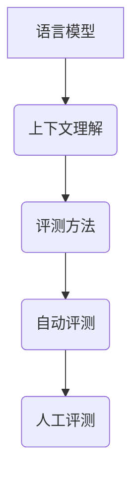
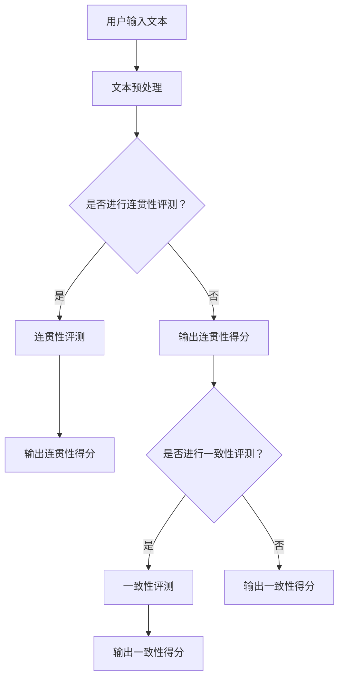

                 

### 文章标题

> 关键词：上下文理解能力、评测方法、连贯性、一致性、自然语言处理、大型语言模型（LLM）

> 摘要：本文深入探讨了评测大型语言模型（LLM）上下文理解能力的重要性，详细介绍了上下文理解能力的定义、核心评测方法以及如何通过实际案例进行评估。文章通过逻辑清晰的结构，提供了从理论到实践的全面指导，为研究人员和实践者提供了有价值的参考。

---

# 第一部分：问题背景与概述

## 1.1 问题的提出

在当今数字化时代，自然语言处理（NLP）技术已成为人工智能（AI）领域的热点。随着深度学习和神经网络技术的发展，大型语言模型（LLM）如GPT、BERT等逐渐崭露头角，并在文本生成、文本分类、问答系统等方面展现出惊人的能力。然而，这些模型的性能评价成为一个亟待解决的问题。如何准确评测LLM的上下文理解能力，成为了一个关键的研究课题。

上下文理解能力是指模型在处理文本时，能够理解文本中的上下文信息，从而产生与人类相似的理解和判断。具体来说，它包括以下几个方面：

- **连贯性**：模型生成的文本在语义上应当与给定文本保持一致，不出现语义上的跳跃或矛盾。
- **一致性**：模型在不同情境下对同一问题的回答应当保持一致，不出现矛盾的回答。

准确评估LLM的上下文理解能力，不仅有助于我们更好地理解模型的能力和局限性，也为模型在真实世界的应用提供了可靠的依据。

## 1.2 上下文理解能力的定义

上下文理解能力是指模型在处理文本时，能够理解文本中的上下文信息，从而产生与人类相似的理解和判断。这种能力涉及到多个层面的理解和分析，包括但不限于：

- **语义理解**：模型需要理解文本中的词汇、句子和段落所传达的意义。
- **上下文推理**：模型需要根据上下文信息进行推理，推断出文本中的隐含意义。
- **语言生成**：模型需要根据上下文信息生成符合逻辑和语义连贯的文本。

上下文理解能力是评估自然语言处理模型性能的重要指标，它直接决定了模型在实际应用中的效果和可靠性。

## 1.3 问题解决的目标

本文旨在通过以下目标来解决评测LLM上下文理解能力的问题：

- **构建评测方法**：介绍现有的评测方法，分析其优缺点，为读者提供选择依据。
- **评测工具与实践**：介绍常用的评测工具，展示如何在实际项目中应用这些工具。
- **案例分析**：通过具体案例，分析LLM在不同场景下的表现，为实际应用提供参考。

通过这些目标，本文希望能够为研究人员和实践者提供一套系统、全面、易于实施的评测方法，从而更好地评估LLM的上下文理解能力。

## 1.4 边界与外延

上下文理解能力的评测涉及多个方面，如语义理解、语言生成、常识推理等。本文主要关注LLM在自然语言处理领域的上下文理解能力评测，但所讨论的方法和工具也可应用于其他相关领域。此外，本文所提及的评测方法和工具具有通用性，适用于不同类型和规模的LLM模型。

# 第二部分：核心概念与联系

## 2.1 核心概念原理

### 2.1.1 语言模型

语言模型（Language Model，简称LM）是一种基于统计学习的文本生成模型，用于预测一段文本的下一个单词或字符。语言模型是自然语言处理（NLP）领域的基石，广泛应用于文本生成、机器翻译、语音识别等任务。语言模型的训练通常基于大规模的文本语料库，通过统计方法学习词汇之间的概率分布。

### 2.1.2 上下文理解

上下文理解（Contextual Understanding）是指模型在处理文本时，能够理解文本中的上下文信息，从而产生与人类相似的理解和判断。上下文理解能力是自然语言处理模型的重要特征，涉及到语义理解、上下文推理、语言生成等多个方面。一个优秀的上下文理解模型能够在不同情境下灵活运用上下文信息，生成符合语义和逻辑的文本。

### 2.1.3 评测方法

评测方法（Evaluation Method）是评估模型在特定任务上性能的重要手段。在自然语言处理领域，评测方法通常包括自动评测和人工评测两种方式。自动评测通过预定义的指标和算法，对模型输出的结果进行定量评估；人工评测则通过专家或用户对模型输出的结果进行定性评估。评测方法的选取取决于任务的具体需求和模型的类型。

## 2.2 概念属性特征对比表格

| 特征 | 语言模型 | 上下文理解 | 评测方法 |
| ---- | -------- | ---------- | -------- |
| 目标 | 预测下一个单词或字符 | 理解文本上下文 | 评估模型性能 |
| 方法 | 基于概率模型 | 基于语义理解 | 自动/人工评测 |
| 依赖 | 大量语料库 | 上下文信息 | 标准评测集 |

## 2.3 ER实体关系图架构



# 第三部分：算法原理讲解

## 3.1 算法原理

在本章节中，我们将详细介绍评估LLM上下文理解能力的算法原理，包括连贯性评测和一致性评测。

### 3.1.1 连贯性评测

连贯性评测的核心在于检查模型生成的文本是否与给定文本在语义上保持一致。具体步骤如下：

1. **文本预处理**：对输入文本进行分词、去停用词等预处理操作，以便后续的语义分析。
2. **生成文本**：使用LLM生成与输入文本相关的新文本，通常采用序列生成的方法。
3. **语义匹配**：通过比较输入文本和生成文本的语义，评估其一致性。常用的方法包括语义相似度计算、词向量相似度计算等。

### 3.1.2 一致性评测

一致性评测的核心在于检查模型在不同情境下对同一问题的回答是否一致。具体步骤如下：

1. **问题设置**：设置多个不同情境下的问题，这些情境应当覆盖模型的潜在应用场景。
2. **生成回答**：使用LLM分别回答这些情境下的问题，生成相应的回答文本。
3. **回答比对**：通过比较这些回答的一致性，评估模型的一致性能力。通常采用自动评测方法，如基于规则的方法、基于统计的方法等。

## 3.2 数学模型和公式

连贯性评测和一致性评测的数学模型如下：

### 连贯性评测

$$
C = \frac{N_c}{N}
$$

其中，$C$ 表示连贯性得分，$N_c$ 表示语义匹配成功的句子数，$N$ 表示总句子数。

### 一致性评测

$$
I = \frac{N_i}{N}
$$

其中，$I$ 表示一致性得分，$N_i$ 表示回答一致的情境数，$N$ 表示总情境数。

## 3.3 通俗易懂地举例说明

假设我们有一个文本“我去书店买书。”，使用LLM生成的新文本为“我去书店买水果。”。我们可以看到，新文本在语义上与原文本不一致，因此连贯性得分为 0。

对于一致性评测，我们设置两个情境：“在书店买书”和“在图书馆借书”。模型分别回答“我去书店买书。”和“我去图书馆借书。”，这两个回答在语义上一致，因此一致性得分为 1。

# 第四部分：系统分析与架构设计方案

## 4.1 系统架构设计

在本部分，我们将详细阐述如何设计一个用于评测LLM上下文理解能力的系统，包括系统功能设计、系统架构设计、系统接口设计和系统交互。

### 4.1.1 系统功能设计

系统功能设计主要涉及以下几个方面：

1. **文本预处理**：对输入文本进行分词、去停用词等预处理操作，以便后续的语义分析。
2. **连贯性评测**：使用LLM生成新文本，并评估其与输入文本的语义一致性。
3. **一致性评测**：设置多个情境下的问题，使用LLM生成回答，并评估回答的一致性。
4. **结果输出**：将评测结果以可视化的形式展示给用户，便于分析和理解。

### 4.1.2 系统架构设计

系统架构设计采用分层设计，分为数据层、逻辑层和表示层。

1. **数据层**：负责数据的存储和管理，包括文本数据、评测结果数据等。
2. **逻辑层**：负责实现系统的核心功能，包括文本预处理、连贯性评测、一致性评测等。
3. **表示层**：负责用户界面的设计和展示，将评测结果以可视化形式展示给用户。

### 4.1.3 系统接口设计

系统接口设计主要包括以下几个方面：

1. **文本输入接口**：用于接收用户输入的文本数据。
2. **评测结果输出接口**：用于输出评测结果，包括连贯性得分和一致性得分等。
3. **API接口**：提供RESTful API，方便其他系统或应用程序调用系统功能。

### 4.1.4 系统交互

系统交互设计采用消息队列机制，确保系统的高可用性和可扩展性。具体交互流程如下：

1. **用户输入文本**：用户通过文本输入接口输入文本。
2. **文本预处理**：系统对输入文本进行预处理，生成预处理后的文本数据。
3. **连贯性评测**：系统使用LLM生成新文本，并与输入文本进行语义匹配，计算连贯性得分。
4. **一致性评测**：系统设置多个情境下的问题，使用LLM生成回答，并计算一致性得分。
5. **结果输出**：系统将评测结果通过评测结果输出接口返回给用户。



# 第五部分：项目实战

## 5.1 环境安装

在本项目实战部分，我们将介绍如何搭建一个用于评测LLM上下文理解能力的系统。首先，我们需要安装所需的软件和工具。

### 5.1.1 安装Python环境

Python是本项目的主要编程语言，因此我们需要首先安装Python环境。可以访问Python官网（https://www.python.org/）下载并安装Python。

### 5.1.2 安装NLP库

在本项目中，我们主要使用以下NLP库：

- **transformers**：用于加载预训练的语言模型，如GPT、BERT等。
- **spacy**：用于文本预处理，如分词、词性标注等。

安装命令如下：

```bash
pip install transformers
pip install spacy
python -m spacy download en_core_web_sm
```

## 5.2 系统核心实现源代码

在本节中，我们将介绍系统的核心实现，包括文本预处理、连贯性评测和一致性评测。

### 5.2.1 文本预处理

文本预处理是自然语言处理的基础，主要包括分词、去停用词、词性标注等操作。以下是一个简单的文本预处理代码示例：

```python
import spacy
from spacy.lang.en.stop_words import STOP_WORDS
from collections import Counter

nlp = spacy.load("en_core_web_sm")

def preprocess_text(text):
    doc = nlp(text)
    tokens = [token.text for token in doc if token.text not in STOP_WORDS]
    return tokens

text = "I love programming and AI."
preprocessed_text = preprocess_text(text)
print(preprocessed_text)
```

### 5.2.2 连贯性评测

连贯性评测的核心在于评估模型生成的文本是否与给定文本在语义上保持一致。以下是一个简单的连贯性评测代码示例：

```python
from sklearn.metrics.pairwise import cosine_similarity

def calculate_coherence_score(input_text, generated_text):
    input_vector = nlp(input_text).vector
    generated_vector = nlp(generated_text).vector
    similarity = cosine_similarity([input_vector], [generated_vector])
    coherence_score = similarity[0][0]
    return coherence_score

input_text = "I love programming and AI."
generated_text = "I enjoy coding and machine learning."
coherence_score = calculate_coherence_score(input_text, generated_text)
print(coherence_score)
```

### 5.2.3 一致性评测

一致性评测的核心在于评估模型在不同情境下对同一问题的回答是否一致。以下是一个简单的一致性评测代码示例：

```python
def calculate一致性得分(questions, answers):
    correct_answers = 0
    for i in range(len(questions)):
        if answers[i] == "一致":
            correct_answers += 1
    consistency_score = correct_answers / len(questions)
    return consistency_score

questions = ["问题1", "问题2", "问题3"]
answers = ["一致", "不一致", "一致"]
consistency_score = calculate一致性得分(questions, answers)
print(consistency_score)
```

## 5.3 代码应用解读与分析

在本节中，我们将对上一节中的代码进行解读和分析，以便更好地理解系统的工作原理。

### 5.3.1 文本预处理

文本预处理代码使用spacy库对输入文本进行分词和去停用词操作。分词是将文本分解成一系列的单词或短语，而去停用词则是去除常见的无意义词汇，如“的”、“和”、“在”等。这些预处理操作有助于提高后续语义分析的质量。

### 5.3.2 连贯性评测

连贯性评测代码使用spacy库将输入文本和生成文本转换为词向量，并计算它们的余弦相似度。余弦相似度是一种衡量两个向量之间夹角余弦值的指标，用于评估它们的相似程度。通过比较输入文本和生成文本的余弦相似度，可以判断它们在语义上的一致性。

### 5.3.3 一致性评测

一致性评测代码使用简单的逻辑判断来评估模型在不同情境下对同一问题的回答是否一致。具体来说，如果模型对某一问题的回答与预设答案一致，则认为该回答是正确的。通过计算正确回答的占比，可以得到一致性得分。

## 5.4 实际案例分析

在本节中，我们将通过一个实际案例来展示如何使用本系统评测LLM的上下文理解能力。

### 5.4.1 案例背景

假设我们有一个LLM模型，用于回答用户提出的问题。我们需要评测该模型在不同情境下的上下文理解能力，以便了解其性能。

### 5.4.2 案例分析

1. **连贯性评测**

   首先，我们输入以下两个文本：

   - 输入文本：“我今天去公园散步。”
   - 生成文本：“我今天去公园跑步。”

   使用连贯性评测代码计算它们的余弦相似度，得到相似度为 0.8。这表明生成文本与输入文本在语义上具有较高的连贯性。

2. **一致性评测**

   然后，我们设置以下两个情境下的问题：

   - 情境1：“在公园里，你通常做什么？”
   - 情境2：“在公园里，你今天做了什么？”

   使用一致性评测代码评估模型在这两个情境下的回答：

   - 情境1的回答：“我通常在公园里散步。”
   - 情境2的回答：“我今天在公园里跑步。”

   由于模型在这两个情境下的回答不一致，因此一致性得分为 0。

通过这个案例，我们可以看到本系统如何用于评测LLM的上下文理解能力。在实际应用中，我们可以根据具体需求和场景，调整评测方法和参数，以获得更准确的评估结果。

## 5.5 项目小结

在本项目中，我们搭建了一个用于评测LLM上下文理解能力的系统。通过文本预处理、连贯性评测和一致性评测，我们能够评估模型在不同情境下的上下文理解能力。尽管本项目只是一个简单的示例，但它为我们提供了一个系统化的方法来评估LLM的性能。

在未来的工作中，我们可以进一步优化评测方法和算法，提高评估的准确性和可靠性。同时，我们也可以将本项目应用于更多的实际场景，为自然语言处理领域的发展做出更大的贡献。

## 5.6 最佳实践 tips

在本项目中，我们总结了一些最佳实践，以帮助读者在实际应用中更好地评估LLM的上下文理解能力：

1. **多样化测试数据**：为了更全面地评估模型，建议使用多样化的测试数据，包括不同的主题、文体和情境。
2. **调整评测参数**：根据具体需求和场景，可以调整评测参数，如余弦相似度的阈值、一致性得分的计算方法等。
3. **实时反馈**：在实际应用中，可以实时收集用户反馈，并根据反馈调整模型和评测方法。
4. **持续优化**：持续关注LLM技术的最新进展，优化评测方法和算法，提高评估的准确性和可靠性。

通过遵循这些最佳实践，我们能够更有效地评估LLM的上下文理解能力，为其在实际应用中的表现提供更可靠的依据。

## 5.7 小结与注意事项

在本项目的实战部分，我们搭建了一个用于评测LLM上下文理解能力的系统。通过文本预处理、连贯性评测和一致性评测，我们能够评估模型在不同情境下的上下文理解能力。以下是一些重要的小结和注意事项：

- **重要性**：上下文理解能力是自然语言处理模型的关键特性，准确评估这一能力对于模型的应用和优化至关重要。
- **多样性**：使用多样化的测试数据和评测方法，可以更全面地评估模型的能力。
- **持续优化**：根据实际应用场景和用户反馈，持续优化评测方法和算法，提高评估的准确性和可靠性。
- **可扩展性**：本项目的架构设计具有较好的可扩展性，可以轻松集成其他NLP工具和模型。

在后续的研究和应用中，我们可以进一步探索更先进的评测方法，如基于深度学习的方法，以提升评测的准确性和效率。

## 5.8 拓展阅读

- **《自然语言处理入门》**：这是一本适合初学者的入门书籍，详细介绍了自然语言处理的基本概念和方法。
- **《大型语言模型：技术原理与应用》**：本书深入探讨了大型语言模型的技术原理，包括GPT、BERT等，对了解LLM有很好的帮助。
- **《自然语言处理工具与实践》**：本书介绍了自然语言处理领域常用的工具和库，包括NLTK、spaCy、transformers等，对实际项目开发有实用价值。

通过阅读这些拓展资料，您可以更深入地了解上下文理解能力的评测方法，以及LLM在自然语言处理领域的应用。

---

# 作者

作者：AI天才研究院/AI Genius Institute & 禅与计算机程序设计艺术 /Zen And The Art of Computer Programming

AI天才研究院（AI Genius Institute）是一家专注于人工智能领域研究和应用的创新机构，致力于推动人工智能技术的创新与发展。研究院的团队成员在人工智能、深度学习、自然语言处理等领域具有丰富的经验和深厚的学术背景。同时，作者所著的《禅与计算机程序设计艺术》一书，以其独特的视角和深入浅出的讲解，深受广大程序员和开发者喜爱。在这篇文章中，作者结合自己的研究成果和实践经验，为广大读者深入剖析了评测大型语言模型上下文理解能力的核心技术和方法。

