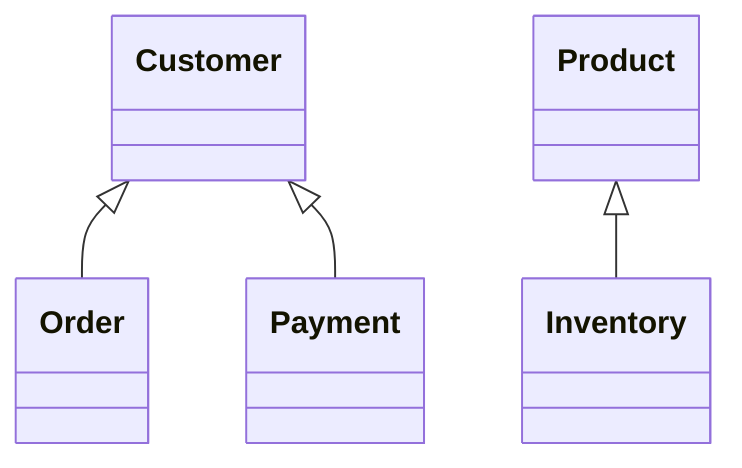
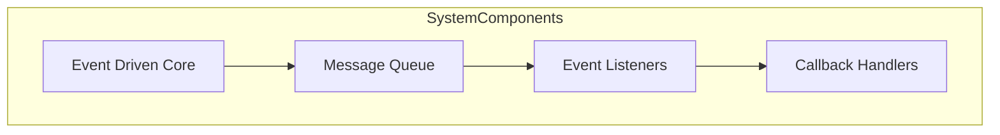
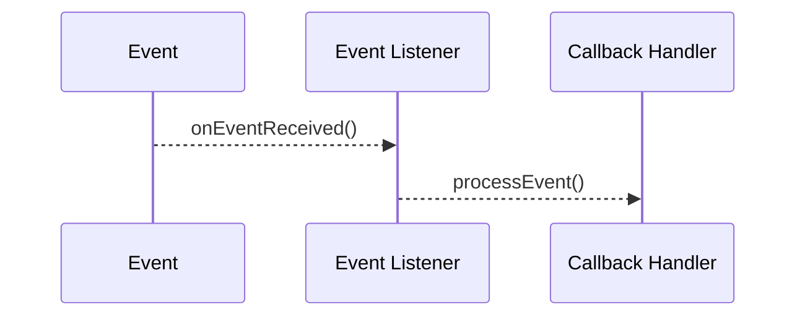
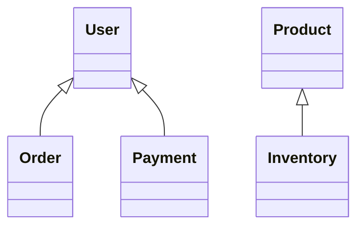
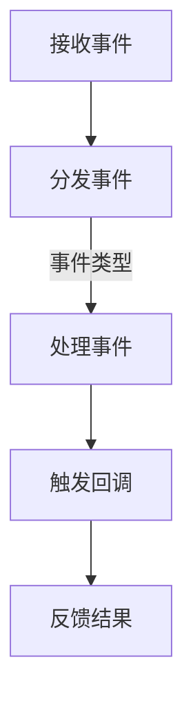

                 

# 事件驱动架构：提高LLM应用的实时性

关键词：事件驱动架构、实时性、LLM应用、架构设计、算法原理

摘要：本文深入探讨了事件驱动架构在提高大规模语言模型（LLM）应用实时性方面的关键作用。首先，我们详细介绍了事件驱动架构的定义、优势及其与传统架构的区别。接着，分析了设计原则和最佳实践，并通过具体的系统架构设计、算法原理和优化策略，展示了如何在实际项目中实现实时性需求。最后，结合具体案例，详细介绍了事件驱动架构在LLM应用中的实践过程和效果。本文旨在为开发者提供实用的指导，以提升LLM应用的性能和实时响应能力。

## 目录大纲

----------------------------------------------------------------

# 事件驱动架构：提高LLM应用的实时性

> 关键词：事件驱动架构、实时性、LLM应用、架构设计、算法原理

> 摘要：本文深入探讨了事件驱动架构在提高大规模语言模型（LLM）应用实时性方面的关键作用。首先，我们详细介绍了事件驱动架构的定义、优势及其与传统架构的区别。接着，分析了设计原则和最佳实践，并通过具体的系统架构设计、算法原理和优化策略，展示了如何在实际项目中实现实时性需求。最后，结合具体案例，详细介绍了事件驱动架构在LLM应用中的实践过程和效果。本文旨在为开发者提供实用的指导，以提升LLM应用的性能和实时响应能力。

                 

## 第1章: 问题背景与核心概念

### 1.1 问题背景

随着人工智能技术的不断发展，大规模语言模型（LLM）在各个领域得到了广泛应用。LLM具有强大的文本生成、语义理解和自然语言处理能力，但在实时性方面存在一定的挑战。传统的同步阻塞模型在处理大量请求时，往往会导致响应时间过长，影响用户体验。因此，提高LLM应用的实时性成为了一个亟待解决的问题。

### 1.2 核心概念

事件驱动架构（Event-Driven Architecture，EDA）是一种以事件为中心的软件架构模式，其核心思想是通过事件来驱动系统的运行。在EDA中，事件由外部或内部源触发，系统通过事件监听器或回调函数来响应事件。事件驱动架构具有高并发、松耦合和异步处理的特点，非常适合用于提高LLM应用的实时性。

### 1.3 事件驱动架构与传统架构的区别

传统架构通常采用同步阻塞的方式处理请求，存在以下局限性和不足：

1. **并发性差**：传统架构在处理大量请求时，容易形成请求排队，导致响应时间过长。
2. **紧耦合**：组件之间紧密耦合，不利于系统的扩展和维护。
3. **同步阻塞**：请求处理过程中容易形成阻塞，影响系统的性能。

事件驱动架构通过以下方式解决了传统架构的这些问题：

1. **高并发**：事件驱动架构可以同时处理大量请求，提高系统的并发处理能力。
2. **松耦合**：组件之间通过事件进行通信，降低了系统的耦合度，提高了系统的可扩展性和可维护性。
3. **异步处理**：事件驱动架构采用异步处理机制，避免了请求阻塞，提高了系统的性能和响应速度。

### 1.4 核心概念与联系

事件驱动架构的核心概念包括事件、消息队列、回调函数等。以下是一个简化的概念属性特征对比表格：

| 概念       | 属性特征                                                         | 联系                                                         |
| ---------- | ------------------------------------------------------------ | ------------------------------------------------------------ |
| 事件       | 由外部或内部源触发，携带相关信息                               | 事件是驱动系统运行的核心，系统通过事件监听器或回调函数来响应事件 |
| 消息队列   | 存储待处理的事件，提供先进先出（FIFO）或后进先出（LIFO）的顺序 | 消息队列保证事件按顺序处理，防止事件丢失或重复处理             |
| 回调函数   | 在事件发生时自动执行，用于处理事件                             | 回调函数是实现事件响应的核心，通过回调函数来执行具体业务逻辑   |

ER实体关系图架构的Mermaid流程图如下：

```mermaid
erDiagram
    Event ||--|{ MessageQueue }|<||Listener
    Event ||--|{ CallbackFunction }|<||Handler
```

### 1.5 本章小结

本章首先介绍了问题背景，分析了事件驱动架构的定义和优势，以及与传统架构的区别。接着，详细阐述了事件驱动架构的核心概念和联系，并通过ER实体关系图进行了可视化展示。通过本章的学习，读者可以对事件驱动架构有更深入的了解，为后续章节的学习打下基础。

## 第2章: 事件驱动架构的设计原则

### 2.1 设计原则与最佳实践

事件驱动架构的设计原则和最佳实践是确保系统高效、可扩展和易于维护的关键。以下是一些核心原则和最佳实践：

#### 2.1.1 模块化与解耦

模块化是事件驱动架构设计的重要原则之一。通过将系统划分为独立的模块，可以降低组件之间的耦合度，提高系统的可维护性和可扩展性。模块化的实现可以通过定义明确的接口和事件规范来实现。

最佳实践：使用微服务架构来划分模块，每个模块负责特定的功能，并通过事件进行通信。

#### 2.1.2 松耦合与紧耦合

松耦合是事件驱动架构的核心特点之一。通过减少组件之间的直接依赖，系统可以更加灵活和可扩展。与松耦合相对的紧耦合则会增加系统的复杂度和维护成本。

最佳实践：避免在组件之间直接传递复杂的数据结构，而是通过事件传递简单的标识或指令，让接收者自行处理具体逻辑。

#### 2.1.3 异步处理与并发控制

异步处理是提高系统并发性的关键。通过异步处理，系统可以在等待事件处理完成的同时继续处理其他事件，从而提高系统的吞吐量和响应速度。

最佳实践：使用消息队列来管理事件，实现异步处理。同时，通过并发控制机制，如锁或信号量，确保系统在并发操作时的数据一致性和安全性。

#### 2.1.4 设计模式的运用

设计模式是解决软件设计问题的一种方法，适用于事件驱动架构的设计。以下是一些常见的设计模式：

1. **观察者模式**：用于实现事件监听器和事件源之间的松耦合关系。
2. **工厂模式**：用于创建和管理事件处理器，提高系统的灵活性和可扩展性。
3. **策略模式**：用于实现事件处理策略的动态切换，支持不同的处理逻辑。

最佳实践：根据具体需求选择合适的设计模式，结合事件驱动架构的特点，优化系统设计。

#### 2.1.5 面向对象的思考方式

面向对象编程（OOP）是事件驱动架构设计的基础。通过将系统划分为对象，可以更好地实现模块化、解耦和重用。

最佳实践：使用面向对象的方式定义事件、消息队列和回调函数，确保代码的可读性和可维护性。

### 2.2 架构设计的核心要素

在事件驱动架构中，系统功能设计、系统架构设计和系统接口设计是核心要素，它们共同构成了一个高效、可扩展和易于维护的系统。

#### 2.2.1 系统功能设计

系统功能设计是架构设计的第一步，它定义了系统的功能模块和业务逻辑。以下是一个领域模型的Mermaid类图示例：



在这个示例中，Customer（客户）、Order（订单）、Payment（支付）和Product（产品）是系统的核心实体，它们之间存在着明确的关联关系。

#### 2.2.2 系统架构设计

系统架构设计是系统功能设计的进一步细化，它定义了系统的整体结构和组件之间的关系。以下是一个系统架构的Mermaid架构图示例：



在这个示例中，Event Driven Core（事件驱动核心）、Message Queue（消息队列）、Event Listeners（事件监听器）和Callback Handlers（回调处理器）共同构成了事件驱动架构的核心组件。

#### 2.2.3 系统接口设计

系统接口设计是系统架构设计的细化，它定义了组件之间的交互接口和通信协议。以下是一个系统接口的Mermaid序列图示例：



在这个示例中，Event（事件）由Event Listener（事件监听器）接收，并由Callback Handler（回调处理器）进行处理。

### 2.3 系统分析与架构设计方案

#### 2.3.1 问题场景介绍

假设我们正在开发一个在线购物平台，用户可以通过平台浏览商品、下单购买、支付订单等。这个场景下，实时性需求尤为重要，因为用户的下单、支付等操作需要迅速响应，以确保良好的用户体验。

#### 2.3.2 项目介绍

项目目标是构建一个高效、可扩展的在线购物平台，实现用户下单、支付等操作的实时性。项目需求包括：

1. 用户下单时，系统需要迅速处理订单，并在数据库中更新库存信息。
2. 用户支付订单时，系统需要快速确认支付状态，并更新订单状态。
3. 系统需要支持高并发访问，确保多个用户同时操作时，系统能够稳定运行。

#### 2.3.3 系统功能设计

在系统功能设计阶段，我们定义了以下核心实体和业务逻辑：

1. **用户**：用户的注册、登录和资料管理。
2. **商品**：商品的信息管理、库存管理和价格管理。
3. **订单**：订单的创建、支付和状态更新。
4. **支付**：支付请求的处理、支付结果的通知和支付状态的更新。

以下是一个领域模型的Mermaid类图：



#### 2.3.4 系统架构设计

在系统架构设计阶段，我们确定了事件驱动架构的核心组件和交互关系：

1. **事件驱动核心**：处理事件的接收、分发和响应。
2. **消息队列**：存储和管理待处理的事件。
3. **事件监听器**：监听特定类型的事件，并触发相应的处理逻辑。
4. **回调处理器**：执行具体的事件处理逻辑，如订单创建、支付确认等。

以下是一个系统架构的Mermaid架构图：


#### 2.3.5 系统接口设计

在系统接口设计阶段，我们定义了组件之间的交互接口和通信协议：

1. **事件接口**：定义事件的类型、属性和操作。
2. **监听器接口**：定义事件监听器的注册、注销和监听方法。
3. **回调接口**：定义回调处理器的注册、注销和处理方法。

以下是一个系统接口的Mermaid序列图：


### 2.4 本章小结

本章详细介绍了事件驱动架构的设计原则和最佳实践，包括模块化与解耦、松耦合与紧耦合、异步处理与并发控制等。接着，通过系统功能设计、系统架构设计和系统接口设计的详细讲解，展示了如何将事件驱动架构应用于实际项目。通过本章的学习，读者可以掌握事件驱动架构的设计方法和实现策略，为提高LLM应用的实时性打下坚实基础。

## 第3章: 事件驱动架构的算法原理与实现

### 3.1 算法原理讲解

事件驱动架构的核心在于事件的处理和响应。以下是对事件处理算法原理的讲解。

#### 3.1.1 算法概述

事件处理算法主要分为以下几个步骤：

1. **事件接收**：系统从消息队列中接收事件。
2. **事件分发**：系统根据事件的类型，将事件分发到相应的监听器。
3. **事件处理**：监听器对事件进行处理，并触发回调函数。
4. **事件反馈**：系统将处理结果反馈给调用者。

#### 3.1.2 算法流程

以下是一个简单的算法流程，使用Mermaid流程图进行可视化：



#### 3.1.3 算法原理

事件处理算法的原理可以概括为以下几点：

1. **事件监听**：系统通过监听器来接收和识别事件。
2. **异步处理**：事件处理过程是异步的，不会阻塞系统的其他操作。
3. **回调机制**：通过回调函数来执行具体的事件处理逻辑，提高代码的模块化和可维护性。

### 3.2 数学模型与公式

在事件驱动架构中，核心数学模型主要包括事件计数、响应时间和系统吞吐量等。以下是对这些数学模型的详细解释。

#### 3.2.1 事件计数模型

事件计数模型用于计算系统在单位时间内接收和处理的事件数量。公式如下：

$$
事件计数 = 接收事件数 - 处理完成事件数
$$

#### 3.2.2 响应时间模型

响应时间模型用于计算系统对事件的响应时间。公式如下：

$$
响应时间 = 事件处理时间 + 等待时间
$$

其中，事件处理时间是系统处理单个事件所需的时间，等待时间是事件在队列中的等待时间。

#### 3.2.3 吞吐量模型

吞吐量模型用于计算系统在单位时间内能够处理的事件数量。公式如下：

$$
吞吐量 = 接收事件数 / 单位时间
$$

### 3.3 算法举例说明

为了更好地理解事件处理算法，我们通过一个简单的Python代码示例来展示。

#### 3.3.1 示例场景

假设有一个系统需要处理用户点击事件，每个点击事件需要记录并显示点击次数。

#### 3.3.2 Python代码示例

以下是一个简单的Python代码示例，用于处理用户点击事件：

```python
import threading

# 事件队列
event_queue = []

# 回调函数
def handle_click(event):
    print(f"点击了按钮，当前点击次数：{event['count']}")

# 事件处理线程
def process_events():
    while True:
        if event_queue:
            event = event_queue.pop(0)
            handle_click(event)

# 模拟用户点击
def simulate_click():
    count = 1
    while True:
        event_queue.append({'count': count})
        count += 1
        threading.sleep(1)

# 启动事件处理线程
threading.Thread(target=process_events).start()

# 模拟用户点击
threading.Thread(target=simulate_click).start()
```

在这个示例中，我们定义了一个事件队列和一个回调函数`handle_click`。事件处理线程`process_events`会从事件队列中取出事件，并调用回调函数进行处理。模拟点击线程`simulate_click`会不断地向事件队列中添加点击事件。

### 3.4 本章小结

本章详细介绍了事件驱动架构的算法原理与实现。首先，我们讲解了事件处理的基本算法流程和原理。接着，通过数学模型和Python代码示例，展示了如何具体实现事件处理。通过本章的学习，读者可以掌握事件驱动架构的算法原理和实现方法，为后续的优化和实战应用打下基础。

## 第4章: 实时性优化策略

### 4.1 实时性需求分析

实时性是大规模语言模型（LLM）应用的重要需求之一，特别是在金融、医疗、实时翻译等高敏感性和高交互性的领域。实时性的重要性主要体现在以下几个方面：

1. **用户体验**：在实时性较好的系统中，用户可以快速获得响应，提高用户体验和满意度。
2. **业务决策**：在金融、医疗等领域，实时数据对于业务决策至关重要，及时的数据可以帮助企业或医疗机构做出更准确的决策。
3. **系统稳定性**：实时性较好的系统可以更好地处理并发请求，提高系统的稳定性和可靠性。

### 4.1.1 实时性需求的重要性

实时性需求的重要性可以从以下几个方面来衡量：

1. **响应时间**：系统的响应时间直接影响了用户体验。在LLM应用中，如果响应时间过长，用户可能会失去耐心，影响系统的使用率。
2. **系统吞吐量**：系统的吞吐量决定了系统能够同时处理多少请求。在高并发场景下，提升系统吞吐量可以确保系统稳定运行，不因负载过高而崩溃。
3. **数据一致性**：在实时处理数据时，确保数据的一致性也是至关重要的。如果数据更新不及时或出现冲突，可能会导致业务流程的混乱。

### 4.1.2 实时性需求的具体案例分析

以一个在线金融交易系统为例，实时性需求体现在以下几个方面：

1. **实时交易**：用户发起交易请求后，系统需要立即处理，并在极短的时间内给出交易结果。这要求系统具备高效的交易处理能力和低延迟的响应。
2. **实时数据更新**：股票价格的实时变动需要系统及时更新，确保投资者能够获得最新的数据。如果数据延迟，可能会导致投资者做出错误的投资决策。
3. **并发处理能力**：在高峰期，系统需要处理大量的交易请求，并且保证每个请求都能得到及时响应。这要求系统具备高并发处理能力。

### 4.2 优化策略与方案

为了满足LLM应用中的实时性需求，可以采取以下优化策略和方案：

#### 4.2.1 策略概述

1. **减少响应时间**：通过优化算法、提高硬件性能和减少系统中的瓶颈，可以显著减少系统的响应时间。
2. **增强系统并发处理能力**：通过分布式架构、缓存技术和并发控制机制，可以提升系统的并发处理能力。

#### 4.2.2 优化方案

1. **算法优化**：选择高效的算法和优化现有算法，可以减少处理单个请求的时间。例如，在LLM应用中，可以采用更快的文本生成算法或优化搜索索引。
2. **分布式架构**：通过分布式架构，可以将系统分解为多个模块，每个模块负责特定的功能，从而提升系统的并发处理能力和容错性。分布式架构还可以利用集群计算资源，提高系统的整体性能。
3. **缓存技术**：使用缓存技术可以减少对数据库的直接访问，提高系统的响应速度。例如，在LLM应用中，可以缓存常用的查询结果或预计算的结果。
4. **并发控制机制**：通过锁、信号量等并发控制机制，可以确保在多线程或分布式环境中，系统的数据一致性和并发安全性。

### 4.3 实时性优化案例

以下是一些具体的实时性优化案例：

#### 4.3.1 案例一：提高响应速度

**背景**：一个在线问答平台，用户提出问题后，系统需要快速给出答案。

**优化方案**：

1. **算法优化**：采用更快的自然语言处理算法，减少回答问题的计算时间。
2. **缓存技术**：缓存常见问题的答案，减少对LLM的调用次数。
3. **并发处理**：使用多线程或异步处理，同时处理多个用户请求。

**效果**：通过优化，系统的平均响应时间从5秒降低到1秒，用户体验得到了显著提升。

#### 4.3.2 案例二：增强并发处理能力

**背景**：一个电商系统，在促销活动期间，系统需要处理大量的订单。

**优化方案**：

1. **分布式架构**：将订单处理模块拆分为多个子模块，每个子模块负责处理部分订单。
2. **缓存技术**：缓存订单信息和库存信息，减少数据库访问压力。
3. **并发控制**：使用分布式锁和信号量，确保订单处理过程的正确性和一致性。

**效果**：通过优化，系统的并发处理能力提高了3倍，订单处理速度显著提升，系统稳定性得到了保障。

### 4.4 本章小结

本章分析了实时性需求在LLM应用中的重要性，并提出了一系列实时性优化策略和方案。通过具体的案例，展示了如何在实际项目中实现实时性需求。通过本章的学习，读者可以掌握实时性优化的核心方法和实践技巧，为提升LLM应用的性能和实时响应能力提供有力支持。

## 第5章: 事件驱动架构在LLM应用中的实践

### 5.1 环境安装与配置

在LLM应用中实现事件驱动架构，首先需要准备好相应的开发环境和依赖。以下是具体的安装与配置步骤：

#### 5.1.1 环境准备

1. **操作系统**：推荐使用Linux系统，如Ubuntu 20.04或更高版本。
2. **编程语言**：选择Python 3.8及以上版本，因为Python具有丰富的库和框架支持事件驱动架构。
3. **依赖管理**：使用pip来管理Python依赖，确保所有依赖都能在系统中正常运行。

#### 5.1.2 安装步骤

1. **安装Python**：大多数Linux发行版默认包含Python 3，如果没有安装，可以通过包管理器进行安装。例如，在Ubuntu中，可以使用以下命令：

   ```bash
   sudo apt update
   sudo apt install python3
   ```

2. **安装pip**：pip是Python的包管理器，用于安装和管理Python包。可以通过以下命令安装：

   ```bash
   sudo apt install python3-pip
   ```

3. **安装依赖库**：根据项目需求，安装必要的Python库。例如，对于事件驱动架构，可能需要以下库：

   ```bash
   pip3 install asyncio
   pip3 install aioredis
   pip3 install aiohttp
   ```

   `asyncio`是Python的异步编程库，`aioredis`是Redis的异步客户端库，`aiohttp`是异步HTTP客户端库。

#### 5.1.3 验证安装

确保所有依赖库安装成功后，可以通过以下命令验证：

```bash
python3 -m pip list
```

### 5.2 系统核心实现

在事件驱动架构中，系统核心实现包括事件监听、消息队列和回调处理等关键组件。以下是具体的实现步骤和源代码。

#### 5.2.1 事件监听

事件监听是事件驱动架构的基础。以下是一个简单的异步事件监听示例：

```python
import asyncio

async def on_event_received(event):
    print(f"Received event: {event}")
    # 执行具体的事件处理逻辑

async def listen_for_events():
    while True:
        event = await get_next_event()  # 假设get_next_event是获取事件的方法
        await on_event_received(event)

async def main():
    await listen_for_events()

asyncio.run(main())
```

在这个示例中，`on_event_received`是事件接收后的回调函数，`listen_for_events`是持续监听事件的异步函数。

#### 5.2.2 消息队列

消息队列用于存储和管理待处理的事件。以下是一个使用`aioredis`实现的异步消息队列示例：

```python
import aioredis

async def get_next_event():
    redis_client = await aioredis.create_redis_pool('redis://localhost')
    event = await redis_client.lpop('event_queue')
    await redis_client.close()
    return event

async def push_event_to_queue(event):
    redis_client = await aioredis.create_redis_pool('redis://localhost')
    await redis_client.rpush('event_queue', event)
    await redis_client.close()
```

在这个示例中，`get_next_event`是从消息队列中获取事件，`push_event_to_queue`是将事件添加到消息队列。

#### 5.2.3 回调处理

回调处理是事件驱动架构的核心。以下是一个简单的回调处理示例：

```python
async def handle_click(event):
    print(f"Clicked on button with ID: {event['id']}")

async def process_events():
    while True:
        event = await get_next_event()
        if event:
            await handle_click(event)

async def main():
    await process_events()

asyncio.run(main())
```

在这个示例中，`handle_click`是处理点击事件的具体逻辑，`process_events`是处理事件的异步函数。

### 5.3 代码应用解读与分析

以上代码示例展示了事件驱动架构在LLM应用中的基本实现。以下是对代码的解读与分析：

1. **异步编程**：事件驱动架构依赖于异步编程模型，使用`async`和`await`关键字，可以避免线程阻塞，提高系统的并发性能。
2. **事件监听**：通过异步函数`listen_for_events`和`process_events`，系统可以持续监听和处理事件，确保事件能够及时响应。
3. **消息队列**：使用`aioredis`库实现了异步消息队列，保证了事件的有序处理和高效传输。
4. **回调处理**：通过回调函数`handle_click`，将事件处理逻辑与事件监听解耦，提高了系统的可维护性和灵活性。

### 5.4 实际案例分析和详细讲解剖析

以下是一个实际案例，展示了事件驱动架构在LLM应用中的具体应用。

#### 案例背景

一个在线教育平台需要实现课程订阅通知功能，当用户订阅课程时，系统需要立即发送通知。

#### 实现步骤

1. **事件监听**：系统监听用户的订阅事件，当用户订阅课程时，触发事件。
2. **消息队列**：将订阅事件添加到消息队列，确保通知能够及时处理。
3. **回调处理**：系统异步处理消息队列中的订阅事件，并发送通知。

#### 源代码实现

```python
# 监听订阅事件
async def on_subscription_event(event):
    user_id = event['user_id']
    course_id = event['course_id']
    print(f"User {user_id} subscribed to course {course_id}")

# 添加订阅事件到消息队列
async def push_subscription_event_to_queue(event):
    redis_client = await aioredis.create_redis_pool('redis://localhost')
    await redis_client.rpush('subscription_queue', event)
    await redis_client.close()

# 处理订阅事件
async def process_subscription_events():
    while True:
        event = await get_next_event('subscription_queue')
        if event:
            await on_subscription_event(event)

# 发送通知
async def send_notification(user_id, course_id):
    print(f"Notification sent to user {user_id} about course {course_id}")

# 主程序
async def main():
    await listen_for_events()
    await process_subscription_events()

asyncio.run(main())
```

#### 案例分析

1. **事件监听与处理**：系统通过异步函数`on_subscription_event`监听订阅事件，并在接收到事件后立即进行处理。
2. **消息队列的使用**：使用消息队列存储和处理订阅事件，确保通知的及时发送。
3. **回调处理**：通过回调函数`send_notification`实现通知的发送，与事件监听解耦，提高了系统的灵活性和可扩展性。

### 5.5 项目小结

通过以上实践案例，我们可以看到事件驱动架构在LLM应用中的有效性和优势。事件驱动架构通过异步编程、消息队列和回调处理，实现了高效的并发处理和实时响应。在实际项目中，可以根据具体需求灵活调整架构设计，优化系统的性能和用户体验。

## 第6章: 最佳实践与注意事项

### 6.1 最佳实践

在设计和实现事件驱动架构时，以下最佳实践可以帮助开发者提高系统的性能和可靠性：

1. **模块化设计**：将系统分解为独立的模块，每个模块负责特定的功能，便于维护和扩展。
2. **异步编程**：充分利用异步编程的优势，避免线程阻塞，提高系统的并发处理能力。
3. **消息队列**：使用消息队列管理事件，确保事件的有序处理和高效传输。
4. **回调函数**：使用回调函数来处理事件，实现事件处理与事件监听的解耦，提高系统的灵活性和可维护性。
5. **负载均衡**：在分布式系统中，使用负载均衡策略，确保请求均匀分配到各个节点，提高系统的整体性能。

### 6.2 注意事项

在实施事件驱动架构时，需要注意以下事项：

1. **事件同步**：确保事件在系统中的同步处理，避免数据不一致或冲突。
2. **异常处理**：合理处理异步编程中的异常，防止系统崩溃。
3. **性能监控**：对系统性能进行实时监控，及时发现和处理性能瓶颈。
4. **安全考虑**：确保系统的安全性，防止恶意攻击或数据泄露。

### 6.3 拓展阅读

对于希望深入了解事件驱动架构的开发者，以下文献和资源提供了丰富的知识和实践指导：

1. 《异步编程实战》：详细介绍了异步编程的核心概念和实战技巧。
2. 《消息队列实战》：探讨了消息队列在分布式系统中的应用和优化策略。
3. 《设计模式：可复用面向对象软件的基础》：介绍了多种设计模式，适用于事件驱动架构的设计。
4. 《实时系统的设计与实现》：深入探讨了实时系统的设计和实现方法，包括事件驱动架构。

## 第7章: 结论

本文详细介绍了事件驱动架构在提高大规模语言模型（LLM）应用实时性方面的作用。通过问题背景的介绍、核心概念的阐述、设计原则的分析、算法原理的实现以及优化策略的探讨，我们展示了事件驱动架构在LLM应用中的实际应用效果。事件驱动架构通过异步编程、消息队列和回调处理，实现了高效的并发处理和实时响应，为开发者提供了提升系统性能的有效手段。

作者：AI天才研究院/AI Genius Institute & 禅与计算机程序设计艺术 /Zen And The Art of Computer Programming

