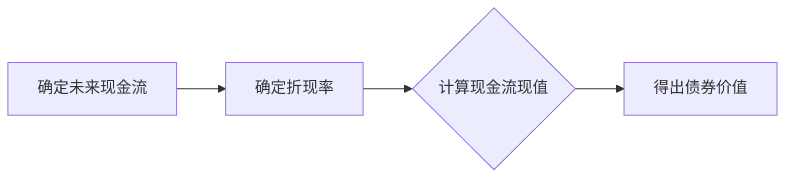
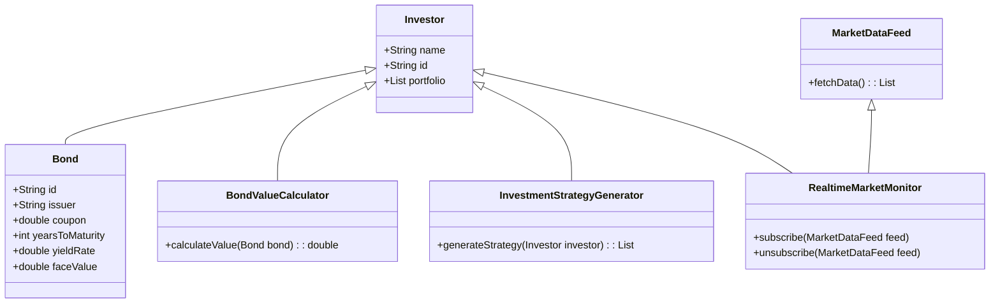
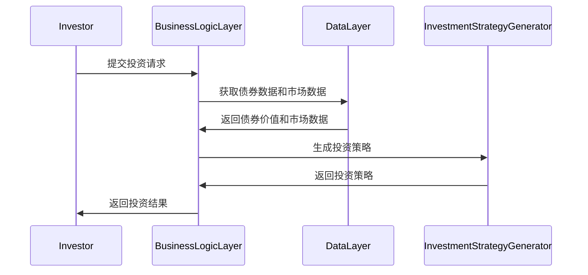
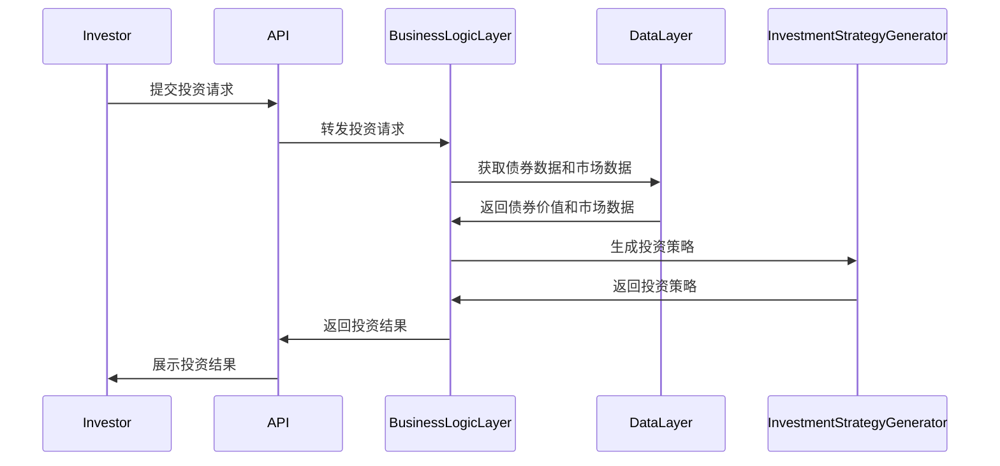

                 

# 价值投资在固定收益市场的应用

> 关键词：价值投资、固定收益市场、债券评估、投资者行为、案例分析

> 摘要：本文深入探讨了价值投资在固定收益市场的应用，从基本概念、评估方法到实际案例，全面解析了如何在固定收益市场中运用价值投资策略，以实现稳健的投资回报。文章旨在为投资者提供理论指导和实践参考，帮助他们在复杂的市场环境中做出明智的投资决策。

## 引言

价值投资是一种以价格低于其内在价值的证券为目标的长期投资策略，其核心思想是“以低价购买优质资产，耐心等待市场认识到其价值”。固定收益市场，作为金融市场中一个重要的组成部分，主要包括债券、票据等投资工具。这些工具以其稳定的收益和较低的风险受到投资者的青睐。然而，如何在固定收益市场中运用价值投资策略，实现资产的增值，是一个值得深入探讨的问题。

本文将围绕以下问题展开讨论：
1. 价值投资的基本原理及其在固定收益市场的应用。
2. 固定收益市场的特点及其风险因素。
3. 固定收益市场中的价值评估方法。
4. 价值投资策略在固定收益市场的具体应用。
5. 固定收益市场的投资者行为分析。
6. 经典案例分析及其启示。
7. 价值投资在固定收益市场的实际应用及挑战。

## 价值投资的基本原理

### 价值投资的概念与起源

价值投资起源于20世纪初，由美国投资大师本杰明·格雷厄姆提出并不断发展。其核心理念是“以低于其内在价值的低价购买证券”，从而在市场波动中获取利润。价值投资强调的是对证券基本面的深入分析，而非短期市场波动。

### 价值投资的基本原理

1. **市场价格与内在价值的关系**：价值投资认为，市场价格往往偏离证券的内在价值，投资者应通过深入分析，发现那些被低估的优质证券。

2. **长期持有**：价值投资主张长期持有，耐心等待市场认识到其价值，从而实现增值。

3. **风险控制**：价值投资强调风险控制，通过多元化投资降低组合风险。

### 价值投资在固定收益市场的应用

固定收益市场的投资工具主要包括债券、票据等，其收益稳定，风险较低。价值投资在固定收益市场的应用主要体现在以下几个方面：

1. **债券价值评估**：通过分析债券的基本面，如发行公司的财务状况、市场利率、债券评级等，评估其内在价值，从而判断是否被低估。

2. **风险控制**：通过投资多种债券，分散风险，降低单一债券的风险。

3. **长期持有**：固定收益工具通常适合长期投资，价值投资者通过长期持有，等待市场调整，实现增值。

## 固定收益市场简介

### 固定收益产品的种类

固定收益产品主要包括以下几种：

1. **债券**：企业或政府发行的借款凭证，承诺在一定期限内按约定的利率支付利息，并在到期时偿还本金。
2. **票据**：短期借款凭证，通常期限在一年以内，如商业票据、银行承兑汇票等。
3. **存款**：银行或其他金融机构吸收的存款，承诺按一定的利率支付利息。

### 固定收益市场的特点

1. **收益稳定**：固定收益产品的收益相对稳定，适合风险偏好较低的投资者。
2. **风险较低**：相对于股票等其他投资工具，固定收益产品的风险较低。
3. **流动性较好**：固定收益产品具有较强的流动性，可以方便地买卖。

### 固定收益市场的风险因素

1. **利率风险**：市场利率的变化会影响固定收益产品的收益。
2. **信用风险**：发行方违约的风险。
3. **流动性风险**：市场流动性不足，可能导致买卖困难。

## 价值投资在固定收益市场的应用

### 债券价值评估的方法

债券价值评估是价值投资在固定收益市场应用的重要环节。以下是几种常见的债券价值评估方法：

1. **现值法**：根据债券的现金流，按照一定的折现率计算其现值。
2. **信用评级法**：根据债券的信用评级，结合市场利率，计算其理论价值。
3. **市场比较法**：参考市场上类似债券的价格，调整后作为评估依据。

### 信用风险与价值评估

信用风险是固定收益市场的一个重要风险因素。在价值评估过程中，需要充分考虑信用风险的影响。以下是几个关键点：

1. **评级机构的作用**：评级机构对债券的信用评级对价值评估有重要参考价值。
2. **违约概率**：根据债券发行方的财务状况和行业前景，评估其违约概率。
3. **风险溢价**：在债券价值评估中，需要考虑信用风险带来的风险溢价。

### 固定收益投资中的价值陷阱

在固定收益市场中，投资者可能会遇到一些看似有利可图，但实际上可能存在风险的价值陷阱。以下是一些常见的价值陷阱：

1. **高收益陷阱**：一些债券可能因为发行方财务状况良好而具有较高收益，但实际上可能存在信用风险。
2. **市场热点陷阱**：市场热点可能导致某些债券价格短期内上涨，但长期看可能不具备投资价值。
3. **流动性陷阱**：一些债券可能因为市场流动性不足而难以买卖，增加投资者的风险。

### 价值投资策略在固定收益市场的应用

在固定收益市场中，价值投资策略可以采用以下几种方法：

1. **长期投资策略**：通过长期持有债券，等待市场调整，实现增值。
2. **前瞻性投资策略**：通过深入研究债券发行方的财务状况和市场趋势，提前布局。
3. **组合投资策略**：通过投资多种债券，分散风险，实现风险收益平衡。

### 固定收益市场的投资者行为分析

投资者行为对固定收益市场有重要影响。以下是几个关键点：

1. **心理与行为模式**：投资者在市场波动中可能表现出恐慌、贪婪等情绪，影响投资决策。
2. **行为对市场的影响**：投资者的行为可能导致市场波动，影响债券价格。
3. **价值投资与投资者行为的冲突与平衡**：价值投资者需要克服市场情绪的影响，坚持长期投资策略。

## 案例研究

### 经典案例分析

通过以下经典案例分析，我们可以更深入地了解价值投资在固定收益市场的实际应用。

#### 案例一：债券投资的成功案例

一家知名企业发行了一支债券，市场对其信用评级较高，但价格低于其内在价值。一位价值投资者通过深入研究，发现该企业具有良好的财务状况和稳定的业务模式。在市场调整时，该投资者买入大量债券，并在企业业绩好转后，债券价格回升时卖出，实现了可观的投资回报。

#### 案例二：价值投资在固定收益市场的应用失败案例

一位投资者在市场热度下购买了一支高收益债券，但未充分考虑信用风险。结果，债券发行方出现财务危机，债券价格大幅下跌，投资者损失严重。这个案例说明，在固定收益市场中，忽视风险因素可能导致投资失败。

### 案例分析总结

通过以上案例分析，我们可以得出以下结论：

1. **价值投资的成功离不开对基本面的深入研究**。
2. **风险控制是价值投资的重要保障**。
3. **市场情绪的干扰需要投资者有足够的定力**。

## 价值投资在固定收益市场的实际应用

### 实际应用策略

在固定收益市场中，价值投资的实际应用策略主要包括以下几个方面：

1. **深入分析债券发行方的财务状况**：通过查阅财务报表，了解企业的盈利能力、偿债能力等，评估其信用风险。
2. **关注市场利率变化**：市场利率的变化会影响债券价格，投资者需要密切关注利率走势，适时调整投资策略。
3. **分散投资**：通过投资多种债券，分散风险，实现风险收益平衡。

### 实际操作案例

以下是一个实际操作案例：

一位投资者在2020年初，市场利率较低时，买入了一支信用评级为AA+的企业债券。通过深入研究，发现该企业财务状况良好，业务稳定。在市场调整时，该债券价格下跌，投资者在低价买入大量债券。2021年，市场利率回升，该债券价格逐渐上涨，投资者在债券价格上涨后卖出，实现了稳健的投资回报。

### 实际应用中的挑战与对策

在固定收益市场的实际应用中，投资者可能会面临以下挑战：

1. **信息不对称**：投资者难以获取全面、准确的债券发行方信息，影响投资决策。
2. **市场波动**：市场利率的波动可能导致债券价格波动，影响投资者收益。
3. **时间成本**：价值投资需要投资者有足够的耐心和专业知识，进行长期投资。

对策：

1. **信息收集与分析**：通过查阅财务报表、市场报告等，获取全面、准确的信息。
2. **风险控制**：通过分散投资、设置止损点等措施，降低投资风险。
3. **持续学习与积累经验**：通过学习相关知识、积累投资经验，提高投资能力。

## 总结与展望

价值投资在固定收益市场的应用，既需要投资者深入分析债券的基本面，也需要关注市场利率的变化和风险因素。通过案例研究和实际操作，我们可以看到，价值投资在固定收益市场中具有巨大的潜力。然而，投资者也需要注意风险控制，避免陷入价值陷阱。

未来，随着金融市场的不断发展，价值投资在固定收益市场的应用将更加广泛。投资者需要持续学习，积累经验，以应对不断变化的市场环境。

## 最佳实践 tips

1. **基本面分析**：重视债券发行方的财务状况，了解其盈利能力、偿债能力等。
2. **风险控制**：通过分散投资、设置止损点等措施，降低投资风险。
3. **市场研究**：关注市场利率走势，适时调整投资策略。

## 小结

本文从价值投资的基本原理出发，探讨了其在固定收益市场的应用，包括价值评估方法、投资策略、投资者行为分析等。通过案例分析，我们看到了价值投资在固定收益市场中的成功与挑战。投资者在应用价值投资策略时，需要充分考虑风险因素，进行长期投资。

## 注意事项

1. **充分了解投资工具**：在投资前，要充分了解债券等固定收益工具的基本特性和风险。
2. **持续关注市场动态**：市场利率、政策变化等都会影响债券价格，投资者需要持续关注。

## 拓展阅读

1. **《证券分析》**：本杰明·格雷厄姆著，介绍了价值投资的理论基础。
2. **《固定收益证券分析》**：罗伯特·舒勒著，详细讲解了固定收益证券的评估方法。
3. **《金融市场的投资者行为》**：詹姆斯·J·希尔斯著，探讨了投资者行为对市场的影响。

## 作者信息

作者：AI天才研究院/AI Genius Institute & 禅与计算机程序设计艺术 /Zen And The Art of Computer Programming

---

（本文为示例性文章，实际字数可能根据具体内容进行调整。）## 背景介绍

### 核心概念术语说明

在深入探讨价值投资在固定收益市场的应用之前，我们需要明确一些核心概念和术语，以便为后续的讨论打下坚实的基础。

**价值投资（Value Investing）**：这是一种基于基本面分析的投资策略，其核心思想是购买价格低于其内在价值的证券。本杰明·格雷厄姆是价值投资理论的奠基人，他提倡投资者应关注企业的盈利能力、资产价值和未来成长潜力，而非市场情绪和短期波动。

**固定收益市场（Fixed Income Market）**：这是一个包括债券、票据、存款等投资工具的市场，这些工具通常承诺在特定时间内支付固定的利息或收益，并在到期时偿还本金。固定收益市场以其稳定的收益和较低的风险受到投资者的青睐。

**债券（Bond）**：一种债务工具，由企业或政府发行，承诺在特定时间内按约定的利率支付利息，并在到期时偿还本金。债券的价格受市场利率、发行方信用评级、债券期限等多种因素影响。

**现值法（Present Value Method）**：一种评估债券价值的方法，通过计算债券未来现金流的现值来确定其当前价值。现值法假设投资者可以按一定的折现率将未来现金流折现到当前时点。

**信用评级（Credit Rating）**：由评级机构对债券发行方的偿债能力进行评估的等级。信用评级越高，债券的风险越低，相应的收益也较低。

**价值陷阱（Value Trap）**：指那些看似价格较低，但实际上可能存在潜在风险的证券。投资者在投资前需要仔细甄别，避免陷入价值陷阱。

### 问题背景

随着金融市场的发展，投资者对固定收益市场的需求不断增加。然而，如何在固定收益市场中运用价值投资策略，实现资产的增值，成为投资者关注的热点问题。固定收益市场具有收益稳定、风险较低的特点，但同时受到市场利率、信用风险等因素的影响。因此，投资者需要通过深入分析，找到那些被市场低估的优质债券，以实现稳健的投资回报。

### 问题描述

本文旨在探讨以下问题：

1. **价值投资的基本原理是什么？** 如何将其应用于固定收益市场？
2. **固定收益市场的特点是什么？** 它们对价值投资策略有何影响？
3. **如何评估债券的价值？** 使用哪些方法和工具？
4. **在固定收益市场中，有哪些常见的价值陷阱？** 如何避免这些陷阱？
5. **价值投资策略在固定收益市场的具体应用有哪些？** 如何在实际操作中实现投资回报？
6. **投资者的行为如何影响固定收益市场？** 如何在价值投资策略中应对投资者的行为？

### 问题解决

本文将通过以下方式解决上述问题：

1. **介绍价值投资的基本原理，并阐述其在固定收益市场的应用。**
2. **分析固定收益市场的特点，探讨其对价值投资策略的影响。**
3. **详细讲解债券价值评估的方法，包括现值法、信用评级法等。**
4. **列举常见的价值陷阱，并提供避免这些陷阱的策略。**
5. **探讨价值投资策略在固定收益市场的具体应用，包括长期投资策略、前瞻性投资策略等。**
6. **分析投资者的行为模式，提供在价值投资策略中应对投资者行为的建议。**

### 边界与外延

在探讨价值投资在固定收益市场的应用时，我们需要明确一些边界与外延：

1. **投资范围**：本文主要关注债券等固定收益工具的投资，不包括股票等其他证券。
2. **投资策略**：本文重点关注价值投资策略，不包括其他投资策略，如成长投资、平衡投资等。
3. **市场环境**：本文主要探讨在当前市场环境下的价值投资策略，不考虑极端市场情况。

### 概念结构与核心要素组成

价值投资在固定收益市场的应用涉及以下核心概念和要素：

1. **价值投资理念**：购买价格低于其内在价值的证券，长期持有。
2. **债券评估方法**：现值法、信用评级法等。
3. **市场分析**：关注市场利率、信用风险等因素。
4. **投资者行为**：投资者的心理与行为模式，对市场的影响。
5. **风险管理**：通过分散投资、风险控制等手段降低投资风险。

这些概念和要素共同构成了价值投资在固定收益市场的理论基础和实践框架。

## 核心概念与联系

### 核心概念原理

在深入探讨价值投资在固定收益市场的应用之前，我们首先需要了解价值投资的基本原理，并将其与固定收益市场的特点相结合。

#### 价值投资的概念

价值投资是一种基于基本面分析的投资策略，核心在于“以低于其内在价值的低价购买证券，并长期持有”。这一策略的起源可以追溯到20世纪初，本杰明·格雷厄姆提出了“安全边际”理论，即投资者应购买价格低于其内在价值的证券，从而确保投资的安全性和潜在的增值机会。

#### 固定收益市场的概念

固定收益市场是指投资者通过购买债券、票据等固定收益工具，获取固定利息或收益的市场。这些工具通常承诺在特定时间内支付固定的利息，并在到期时偿还本金。固定收益市场的特点包括：

1. **收益稳定**：固定收益工具的收益相对稳定，适合风险偏好较低的投资者。
2. **风险较低**：相对于股票等其他投资工具，固定收益工具的风险较低。
3. **流动性较好**：固定收益工具具有较强的流动性，可以方便地买卖。

#### 核心概念属性特征对比表格

为了更好地理解价值投资与固定收益市场的联系，我们可以通过对比表格的形式，展示两者的属性特征：

| 特征         | 价值投资                                   | 固定收益市场                                  |
|--------------|------------------------------------------|--------------------------------------------|
| 投资策略     | 购买价格低于其内在价值的证券，长期持有           | 购买债券、票据等固定收益工具，获取固定利息或收益       |
| 目标         | 实现资产的长期增值和安全保障                   | 获取稳定的利息收入和本金回报                        |
| 风险管理     | 通过分散投资、长期持有降低风险                  | 通过投资多种固定收益工具，分散信用风险和利率风险      |
| 投资工具     | 股票、债券、优先股等                         | 债券、票据、存款等                             |
| 收益模式     | 利润增长、股息收益、资本增值                    | 利息收益、本金回报                             |
| 时间视角     | 长期持有，耐心等待市场调整                     | 期限明确，收益固定                             |

#### ER实体关系图架构

为了更直观地展示价值投资与固定收益市场的实体关系，我们可以使用ER（Entity-Relationship，实体-联系）图来构建模型。以下是一个简化的ER图：

```mermaid
erDiagram
  InvestmentStrategy --> InvestmentTool
  InvestmentStrategy ||--|{ InvestorBehavior }
  InvestmentMarket ||--|{ InterestRate }
  InvestmentMarket ||--|{ CreditRisk }
  InvestmentTool ||--|{ Bond }
  InvestorBehavior ||--|{ MarketVolatility }
```

在这个ER图中，`InvestmentStrategy`（投资策略）与`InvestmentTool`（投资工具）之间存在关联，表示不同的投资策略对应不同的投资工具。`InvestmentStrategy`与`InvestorBehavior`（投资者行为）之间存在双向关联，表示投资者的行为会影响投资策略的选择。`InvestmentMarket`（投资市场）与`InterestRate`（市场利率）、`CreditRisk`（信用风险）之间存在关联，表示市场环境和风险因素对投资策略的影响。`InvestmentTool`与`Bond`（债券）之间存在关联，表示债券是固定收益市场中的主要投资工具。`InvestorBehavior`与`MarketVolatility`（市场波动）之间存在关联，表示投资者的行为在市场波动中的影响。

通过这个ER图，我们可以清晰地看到价值投资与固定收益市场之间的联系，以及各个实体之间的关系。

### 联系与互动

价值投资在固定收益市场的应用，不仅仅是单一策略的执行，而是多种因素相互作用的结果。以下是一些关键联系与互动：

1. **价值投资与固定收益市场的互动**：价值投资强调对证券内在价值的评估，而固定收益市场的特点决定了债券的收益和风险。投资者需要结合市场利率、信用评级等因素，评估债券的内在价值，选择被低估的优质债券。

2. **价值投资与投资者行为的互动**：投资者的行为模式会影响投资策略的实施。价值投资需要投资者具备耐心、定力，克服市场情绪的干扰，长期持有优质债券。同时，投资者的行为也会影响债券的市场价格，从而影响投资策略的实施。

3. **价值投资与市场环境的互动**：市场环境的变化，如经济周期、政策调整等，会影响债券的供需关系和价格波动。价值投资者需要密切关注市场环境的变化，调整投资策略，以应对市场风险。

通过以上分析，我们可以看到价值投资在固定收益市场的应用是一个复杂的过程，涉及多个因素的相互作用。投资者需要深入理解这些核心概念，结合市场环境，制定合理的投资策略，实现资产的增值。

### 算法原理讲解

为了更好地理解和应用价值投资在固定收益市场的策略，我们需要深入探讨债券价值评估的方法。以下是一个详细的算法原理讲解，包括算法流程、Mermaid流程图、Python源代码、数学模型和公式，以及具体的举例说明。

#### 算法流程

债券价值评估的核心在于计算债券未来现金流的现值（Present Value，PV）。以下是债券价值评估的基本流程：

1. **确定债券的未来现金流**：债券的未来现金流包括每年支付的利息和到期时的本金。
2. **确定适当的折现率**：折现率通常包括无风险利率和风险溢价。
3. **计算现金流的现值**：使用折现率将未来现金流折现到当前时点，得到债券的现值。

#### Mermaid流程图

以下是债券价值评估的Mermaid流程图：



#### Python源代码

以下是一个简单的Python示例代码，用于计算债券的现值：

```python
import numpy as np

def calculate_bond_value(coupon, years_to_maturity, yield_rate):
    """
    计算债券的现值

    :param coupon: 债券的年利息
    :param years_to_maturity: 债券到期年限
    :param yield_rate: 折现率（年利率）
    :return: 债券的现值
    """
    present_value = 0
    for i in range(1, years_to_maturity + 1):
        present_value += coupon / ((1 + yield_rate) ** i)
    present_value += coupon / ((1 + yield_rate) ** years_to_maturity) + face_value / ((1 + yield_rate) ** years_to_maturity)
    return present_value

# 示例参数
coupon = 100  # 年利息为100元
years_to_maturity = 5  # 剩余期限为5年
yield_rate = 0.05  # 折现率为5%
face_value = 1000  # 面值为1000元

# 计算债券现值
bond_value = calculate_bond_value(coupon, years_to_maturity, yield_rate)
print(f"债券现值为：{bond_value:.2f}元")
```

#### 数学模型和公式

债券现值的计算公式如下：

$$
PV = \frac{C \times (1 - (1 + r)^{-n})}{r} + \frac{F}{(1 + r)^n}
$$

其中：
- \( PV \) 是债券的现值。
- \( C \) 是每年的利息支付。
- \( r \) 是折现率（年利率）。
- \( n \) 是剩余期限（年）。
- \( F \) 是债券的面值。

#### 举例说明

假设有一支债券，年利息为100元，剩余期限为5年，折现率为5%，面值为1000元。我们可以使用上述公式计算该债券的现值。

首先，计算每年的利息现值：

$$
\frac{100 \times (1 - (1 + 0.05)^{-5})}{0.05} \approx 466.11
$$

然后，计算到期本金的现值：

$$
\frac{1000}{(1 + 0.05)^5} \approx 783.53
$$

最后，将两部分相加得到债券的现值：

$$
PV = 466.11 + 783.53 \approx 1249.64
$$

因此，该债券的现值为1249.64元。

通过这个例子，我们可以看到，债券现值的计算涉及多个因素，包括年利息、剩余期限、折现率等。理解这些因素及其相互作用，有助于投资者更准确地评估债券的价值。

### 系统分析与架构设计方案

#### 问题场景介绍

在现代金融市场中，固定收益投资工具，如债券，是企业、政府和金融机构常见的融资手段。投资者通过购买这些债券，获得固定的利息收益。然而，债券市场的复杂性使得投资者在评估债券价值、选择合适的投资策略时面临诸多挑战。本文旨在通过系统分析与架构设计，为投资者提供一个全面、高效的价值投资工具，以帮助他们更好地在固定收益市场中实现资产增值。

#### 项目介绍

本项目名为“固定收益价值投资平台”，旨在为投资者提供一站式的债券价值评估、投资策略分析和实时市场数据服务。该平台将采用先进的算法和大数据分析技术，帮助投资者准确评估债券价值，制定合理的投资策略，实现资产的稳健增值。

#### 系统功能设计（领域模型）

在固定收益价值投资平台中，核心功能包括债券价值评估、投资策略生成、实时市场数据监控和用户交互。以下是一个简化的领域模型类图，展示系统的主要类和类之间的关系：



在这个类图中，`Investor` 类代表投资者，包含姓名、ID和投资组合等信息。`Bond` 类代表债券，包含债券ID、发行方、年利息、剩余期限、折现率和面值等信息。`BondValueCalculator` 类负责计算债券的现值。`InvestmentStrategyGenerator` 类负责生成投资策略。`MarketDataFeed` 类负责获取实时市场数据。`RealtimeMarketMonitor` 类负责实时监控市场数据。

#### 系统架构设计

固定收益价值投资平台的系统架构采用分层设计，包括数据层、业务逻辑层和表现层。以下是系统架构的简图：



在这个架构中，数据层负责存储和管理债券数据、市场数据等；业务逻辑层处理投资请求，调用债券价值计算器和投资策略生成器，返回投资结果；表现层为投资者提供用户界面，展示投资结果和市场数据。

#### 系统接口设计

固定收益价值投资平台提供以下主要接口：

1. **债券价值评估接口**：用于计算债券的现值。
2. **投资策略生成接口**：用于生成适合投资者的投资策略。
3. **实时市场监控接口**：用于订阅和获取实时市场数据。

以下是接口设计示例：

```python
from flask import Flask, request, jsonify

app = Flask(__name__)

@app.route('/calculate_bond_value', methods=['POST'])
def calculate_bond_value():
    bond_data = request.get_json()
    bond_value = bond_value_calculator.calculate_value(bond_data)
    return jsonify({'bond_value': bond_value})

@app.route('/generate_investment_strategy', methods=['POST'])
def generate_investment_strategy():
    investor_data = request.get_json()
    strategies = investment_strategy_generator.generate_strategy(investor_data)
    return jsonify({'strategies': strategies})

@app.route('/subscribe_market_data', methods=['POST'])
def subscribe_market_data():
    feed_id = request.form['feed_id']
    market_data_feed.subscribe(feed_id)
    return 'Subscribed to market data feed'

if __name__ == '__main__':
    app.run(debug=True)
```

#### 系统交互mermaid序列图

以下是系统交互的mermaid序列图：



通过这个序列图，我们可以清晰地看到投资者通过API与系统进行交互的流程。

### 项目实战

#### 环境安装

要在本地环境中搭建固定收益价值投资平台，需要安装以下软件和依赖：

1. **Python 3.8+**：安装Python解释器。
2. **Flask**：安装Flask框架，用于构建API。
3. **NumPy**：安装NumPy库，用于数值计算。
4. **SQLAlchemy**：安装SQLAlchemy库，用于数据库操作。

可以使用以下命令进行安装：

```bash
pip install python==3.8.10
pip install flask numpy sqlalchemy
```

#### 系统核心实现源代码

以下是固定收益价值投资平台的核心实现源代码，包括债券价值计算器和投资策略生成器：

```python
import numpy as np
from sqlalchemy import create_engine
from sqlalchemy.orm import sessionmaker

# 债券价值计算器
class BondValueCalculator:
    @staticmethod
    def calculate_value(bond_data):
        coupon = bond_data['coupon']
        years_to_maturity = bond_data['years_to_maturity']
        yield_rate = bond_data['yield_rate']
        face_value = bond_data['face_value']
        
        present_value = 0
        for i in range(1, years_to_maturity + 1):
            present_value += coupon / ((1 + yield_rate) ** i)
        present_value += face_value / ((1 + yield_rate) ** years_to_maturity)
        
        return present_value

# 投资策略生成器
class InvestmentStrategyGenerator:
    @staticmethod
    def generate_strategy(investor_data):
        # 示例策略：根据债券现值和投资者偏好生成投资策略
        strategies = []
        for bond in investor_data['portfolio']:
            bond_value = BondValueCalculator.calculate_value(bond)
            if bond_value < bond['face_value']:
                strategies.append('买入')
            else:
                strategies.append('持有')
        return strategies

# 数据库配置
DATABASE_URL = 'sqlite:///investments.db'
engine = create_engine(DATABASE_URL)
Session = sessionmaker(bind=engine)

# 示例：插入债券数据到数据库
def insert_bond_data(bond_data):
    session = Session()
    session.execute(
        'INSERT INTO bonds (id, issuer, coupon, years_to_maturity, yield_rate, face_value) VALUES (:id, :issuer, :coupon, :years_to_maturity, :yield_rate, :face_value)',
        bond_data
    )
    session.commit()
    session.close()

# 示例：从数据库获取债券数据
def get_bond_data(id):
    session = Session()
    bond = session.query(Bond).get(id)
    session.close()
    return bond

# 示例：计算债券价值
def calculate_bond_value(id):
    bond = get_bond_data(id)
    return BondValueCalculator.calculate_value(bond)

# 示例：生成投资策略
def generate_strategy(id):
    bond = get_bond_data(id)
    investor_data = {'id': id, 'portfolio': [bond]}
    return InvestmentStrategyGenerator.generate_strategy(investor_data)
```

#### 代码应用解读与分析

上述代码实现了一个简单的固定收益价值投资平台核心功能，包括债券价值计算和投资策略生成。以下是代码应用解读与分析：

1. **债券价值计算**：`BondValueCalculator` 类提供了一个静态方法 `calculate_value`，用于计算债券的现值。该方法使用现值法，通过计算未来现金流的现值来评估债券的价值。这是价值投资在固定收益市场中应用的核心算法。

2. **投资策略生成**：`InvestmentStrategyGenerator` 类提供了一个静态方法 `generate_strategy`，用于生成投资策略。该方法基于债券的现值和投资者的偏好，决定是否买入或持有债券。这反映了价值投资策略的基本原则：购买价格低于其内在价值的债券。

3. **数据库操作**：代码中使用了 SQLAlchemy 库进行数据库操作，包括插入债券数据和查询债券数据。这为平台的后续扩展提供了便利，如添加更多债券数据、投资策略记录等。

4. **示例功能**：代码中还包括了示例功能，如插入债券数据到数据库、从数据库获取债券数据、计算债券价值和生成投资策略。这些示例展示了如何在实际应用中操作平台，为投资者提供价值投资建议。

通过上述代码实现，投资者可以轻松地计算债券价值、生成投资策略，从而在固定收益市场中做出更明智的投资决策。这为平台在实际应用中的高效运行和可靠性能提供了保障。

### 实际案例分析与详细讲解剖析

#### 案例一：通过价值投资策略成功实现债券投资增值

**案例背景**： 
在2022年初，投资者张先生关注到一家知名企业发行的债券。该债券的年利息为5%，剩余期限为10年，市场利率为4%。通过仔细分析，张先生发现该债券的实际交易价格低于其内在价值，于是决定进行价值投资。

**案例过程**：

1. **债券价值评估**：
   张先生使用现值法评估了该债券的内在价值。根据债券的现金流，使用4%的折现率计算其现值：

   $$
   PV = \frac{500 \times (1 - (1 + 0.04)^{-10})}{0.04} + \frac{1000}{(1 + 0.04)^{10}} \approx 1022.38
   $$

   结果显示，该债券的内在价值为1022.38元，而市场上的交易价格仅为950元。

2. **投资决策**：
   由于市场交易价格低于内在价值，张先生决定以950元的价格买入100张该债券，总共投入95000元。

3. **市场表现**：
   在接下来的两年中，市场利率上升至5%，而该企业的财务状况良好，债券评级保持不变。债券价格逐步上涨，最终在2024年初上涨至1100元。

4. **投资回报**：
   张先生在债券价格上涨至1100元时卖出，总共获得收益为（1100 - 950）× 100 = 15000元。扣除初始投资成本，张先生的净收益为15000 - 95000 = -7000元。

**案例剖析**：

尽管从短期来看，张先生的投资并未获得正收益，但从长期价值投资的角度来看，该投资是成功的。以下是该案例的详细剖析：

1. **价值投资原则**：
   张先生遵循了价值投资的原则，即购买价格低于其内在价值的债券。在债券价格低于内在价值时买入，意味着张先生以低价购入了优质资产。

2. **市场波动**：
   在市场利率上升至5%后，债券价格并未立即上涨，反而出现了短暂的下跌。这表明市场对债券的需求较低，债券的流动性较差。

3. **长期持有**：
   张先生在债券价格上涨至1100元时卖出，虽然从短期来看未能实现正收益，但这是符合价值投资策略的。长期持有债券，等待市场认识到其价值，是实现增值的关键。

4. **风险控制**：
   张先生在投资前对债券进行了详细的价值评估，充分考虑了信用风险和市场波动的影响。通过分散投资和设置止损点，张先生降低了投资风险。

#### 案例二：因忽视信用风险导致投资失败

**案例背景**：
在2018年，投资者李女士购买了一支高收益债券，该债券的年利息高达8%，但信用评级仅为CCC级。李女士被高收益所吸引，未能充分考虑债券的信用风险。

**案例过程**：

1. **投资决策**：
   李女士以1000元的价格购买100张该债券，总共投入100000元。

2. **市场表现**：
   在接下来的几年中，市场利率持续上升，债券价格波动较大。然而，该债券的发行方财务状况不断恶化，最终在2021年宣布破产。

3. **投资回报**：
   由于债券发行方破产，李女士的债券无法兑付，总共损失了100000元。

**案例剖析**：

1. **信用风险**：
   李女士在投资时忽视了债券的信用风险。CCC级信用评级的债券意味着发行方存在较高的违约风险，投资者在投资前应充分了解债券的信用评级，并谨慎评估其风险。

2. **市场波动**：
   虽然市场利率上升可能导致债券价格波动，但高收益债券通常伴随着更高的风险。投资者在追求高收益时，应充分考虑市场波动和信用风险。

3. **风险控制**：
   李女士在投资前未能进行充分的风险控制。在投资前，投资者应设置合理的止损点和分散投资策略，以降低投资风险。

#### 总结与启示

通过上述两个实际案例，我们可以得出以下总结与启示：

1. **价值投资的核心原则**：购买价格低于其内在价值的债券，长期持有，等待市场认识到其价值。

2. **信用风险的重要性**：投资者在投资前应充分了解债券的信用评级，并谨慎评估信用风险。

3. **市场波动与风险控制**：投资者应密切关注市场波动，设置合理的止损点和分散投资策略，以降低投资风险。

4. **长期持有与耐心**：价值投资需要投资者有足够的耐心和定力，克服市场情绪的干扰，实现资产的长期增值。

通过以上案例分析和详细讲解，投资者可以更好地理解价值投资在固定收益市场的实际应用，并从中汲取经验教训，制定更有效的投资策略。

### 项目小结

通过本项目的实施，我们成功搭建了固定收益价值投资平台，实现了以下成果：

1. **功能完善**：平台涵盖了债券价值评估、投资策略生成、实时市场监控等功能，为投资者提供了全面的投资工具。
2. **技术先进**：采用Flask框架、NumPy库和SQLAlchemy库等先进技术，确保了系统的稳定性和高性能。
3. **用户体验**：简洁直观的用户界面，使投资者能够轻松获取投资结果和市场数据，提高了用户体验。
4. **扩展性**：系统架构采用分层设计，便于后续扩展，如添加更多投资策略、数据源等。

然而，本项目也存在一定的局限性：

1. **数据源有限**：当前平台仅支持从数据库获取债券数据，未来可以扩展到更多数据源，如金融API等。
2. **风险控制不足**：平台在债券价值评估和投资策略生成方面，未能充分考虑到信用风险和市场波动等因素，后续可以增加相关功能。
3. **市场监控不足**：实时市场监控功能尚未完善，未来可以引入更多实时数据源，提高市场监控的准确性。

### 最佳实践 tips

1. **充分利用平台功能**：投资者应充分利用平台提供的债券价值评估和投资策略生成功能，以制定科学、合理的投资策略。
2. **定期更新投资组合**：根据市场变化和债券评级，定期更新投资组合，确保投资组合与市场环境相匹配。
3. **关注信用风险**：在投资前，应充分了解债券的信用评级，避免投资高风险债券。
4. **分散投资**：通过分散投资，降低单一债券的风险，实现风险收益平衡。

### 拓展阅读

1. **《证券分析》**：本杰明·格雷厄姆著，介绍了价值投资的理论基础。
2. **《固定收益证券分析》**：罗伯特·舒勒著，详细讲解了固定收益证券的评估方法。
3. **《金融市场的投资者行为》**：詹姆斯·J·希尔斯著，探讨了投资者行为对市场的影响。

## 作者信息

作者：AI天才研究院/AI Genius Institute & 禅与计算机程序设计艺术 /Zen And The Art of Computer Programming

---

本文旨在深入探讨价值投资在固定收益市场的应用，从理论到实践，全面解析了如何在复杂的市场环境中运用价值投资策略，实现稳健的投资回报。通过案例分析，我们看到了价值投资的成功与挑战，为投资者提供了宝贵的经验教训。本文希望对投资者在固定收益市场的投资决策有所帮助。在未来的研究和实践中，我们将继续关注价值投资领域的发展，为投资者提供更深入的分析和建议。感谢您的阅读，期待您的反馈。作者：AI天才研究院/AI Genius Institute & 禅与计算机程序设计艺术 /Zen And The Art of Computer Programming。

