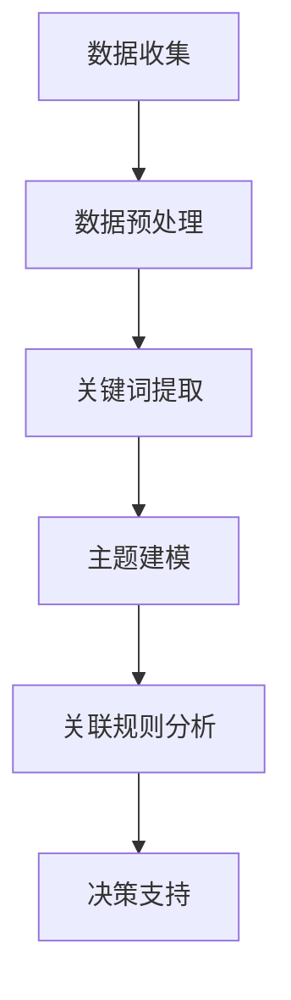
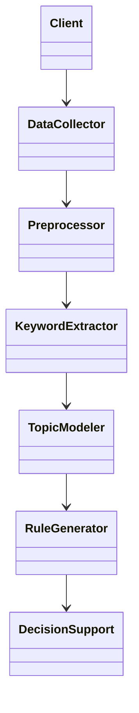
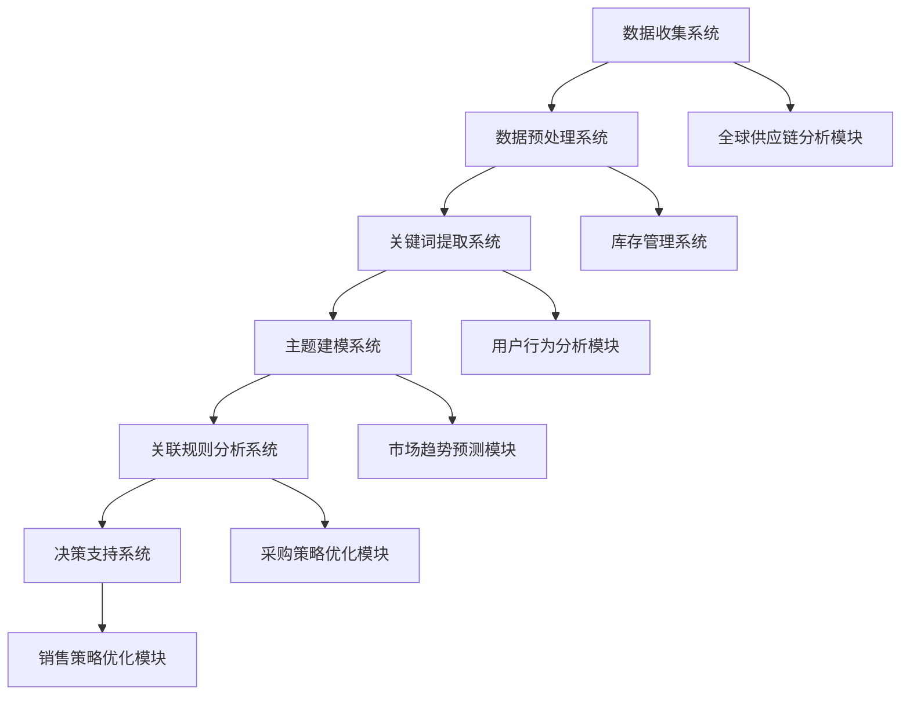
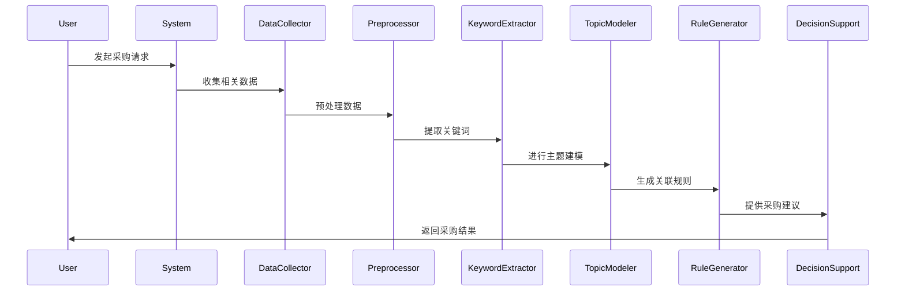
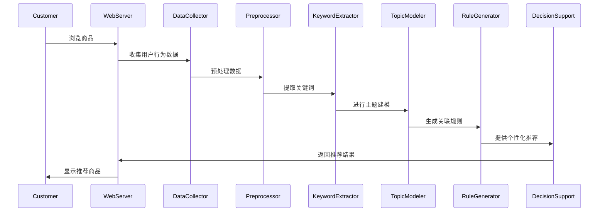

                 


# 《优化AI虚拟时尚买手决策：全球供应链分析的提示词策略》

> 关键词：AI虚拟时尚买手、全球供应链分析、提示词策略、算法原理、系统架构、项目实战

> 摘要：本文旨在探讨如何通过全球供应链分析结合提示词策略，优化AI虚拟时尚买手的决策过程。文章首先介绍了虚拟时尚买手和全球供应链分析的核心概念，接着阐述了提示词策略的作用和优势。通过详细的算法原理讲解、系统架构设计和项目实战分析，本文提供了一种切实可行的方法来提升AI虚拟时尚买手在复杂供应链环境中的决策效率。

## 第1章 引言

### 1.1 研究背景

#### 1.1.1 虚拟时尚买手的发展现状

随着电商和虚拟现实技术的不断发展，虚拟时尚买手这一职业逐渐崭露头角。虚拟时尚买手利用人工智能和大数据分析，在线上平台上为消费者推荐时尚单品，实现个性化购物体验。这种新型职业的出现，不仅降低了时尚购物的门槛，也为供应链带来了新的挑战。

#### 1.1.2 全球供应链分析的重要性

全球供应链分析是现代制造业和商业运营的重要组成部分。通过对全球供应链的深入分析，企业可以优化资源配置、降低成本、提高效率，从而在竞争激烈的市场中脱颖而出。特别是在时尚行业，快速响应市场需求和供应链的动态变化，是保持竞争力的关键。

#### 1.1.3 提示词策略在优化决策中的应用

提示词策略是一种基于关键词提取和关联分析的方法，用于指导AI系统做出更准确的决策。在虚拟时尚买手的应用中，提示词策略可以帮助买手更好地理解市场需求，快速识别潜在的热门单品，从而做出更精准的采购和销售决策。

### 1.2 研究问题与目标

#### 1.2.1 研究问题

如何通过全球供应链分析和提示词策略，优化AI虚拟时尚买手的决策过程？

#### 1.2.2 研究目标

1. 明确虚拟时尚买手和全球供应链分析的核心概念及其联系。
2. 设计并实现一套基于全球供应链分析的提示词策略系统。
3. 验证该系统在提高AI虚拟时尚买手决策效率方面的有效性。

#### 1.2.3 边界与外延

本文主要针对在线时尚电商平台进行研究，探讨AI虚拟时尚买手在虚拟现实环境中的决策优化。边界限定在供应链的可控范围内，不包括政治、经济等因素对供应链的影响。

### 1.3 研究方法与结构安排

#### 1.3.1 研究方法

本文采用实证研究的方法，通过数据收集、分析、系统设计与实现，验证提示词策略在优化AI虚拟时尚买手决策中的有效性。

#### 1.3.2 研究结构安排

本文分为七个章节，分别介绍研究背景、核心概念、算法原理、系统架构、项目实战、最佳实践和结论展望。通过逐步深入的分析和讲解，使读者全面了解该领域的研究成果和应用前景。

### 1.4 本章小结

本章介绍了本文的研究背景、问题、目标和研究方法，为后续章节的内容奠定了基础。通过对虚拟时尚买手、全球供应链分析和提示词策略的介绍，读者可以初步了解本文的核心内容。

## 第2章 核心概念与联系

### 2.1 AI虚拟时尚买手概念

#### 2.1.1 AI虚拟时尚买手的定义

AI虚拟时尚买手是一种利用人工智能技术进行时尚商品采购和销售的虚拟角色。通过大数据分析和机器学习算法，虚拟时尚买手能够实时捕捉市场趋势，为消费者提供个性化的购物建议。

#### 2.1.2 AI虚拟时尚买手的核心特点

1. **个性化推荐**：基于用户历史数据和购物行为，为用户提供量身定制的购物建议。
2. **实时性**：通过实时数据分析和预测，快速响应市场需求变化。
3. **高效性**：利用机器学习和人工智能技术，实现高效、精准的商品采购和销售。

#### 2.1.3 AI虚拟时尚买手与传统买手对比

与传统买手相比，AI虚拟时尚买手具有以下优势：

1. **数据分析能力**：利用大数据技术，对市场趋势进行深度分析。
2. **快速响应**：通过实时数据分析和预测，快速调整采购和销售策略。
3. **成本效益**：减少了人力成本，提高了运营效率。

### 2.2 全球供应链分析

#### 2.2.1 全球供应链分析的定义

全球供应链分析是一种通过数据分析和模型模拟，对供应链各个环节进行评估和优化的方法。它涵盖了从原材料采购到产品交付的全过程，旨在提高供应链的效率、降低成本、提升竞争力。

#### 2.2.2 全球供应链分析的关键要素

1. **供应商管理**：评估供应商的可靠性、成本和质量。
2. **库存管理**：优化库存水平，减少库存成本。
3. **物流管理**：优化物流流程，提高运输效率。
4. **风险分析**：评估供应链中的潜在风险，制定应对策略。

#### 2.2.3 全球供应链分析在虚拟时尚买手中的应用

在虚拟时尚买手的应用中，全球供应链分析主要用于以下方面：

1. **商品采购**：通过供应链分析，确定最优的采购时间和采购量。
2. **库存优化**：根据市场需求和库存水平，调整库存策略。
3. **物流协调**：优化物流流程，提高商品交付效率。

### 2.3 提示词策略

#### 2.3.1 提示词策略的定义

提示词策略是一种通过提取关键词和关联分析，指导决策的方法。在AI虚拟时尚买手的应用中，提示词策略用于识别市场趋势和用户需求，为采购和销售决策提供依据。

#### 2.3.2 提示词策略的类型

1. **关键词提取**：从用户评论、社交媒体等数据中提取关键词。
2. **主题模型**：通过主题建模，识别隐藏在数据中的主题。
3. **关联规则**：分析不同关键词之间的关联性，发现潜在的市场趋势。

#### 2.3.3 提示词策略的优势与挑战

**优势**：

1. **精准性**：通过关键词提取和关联分析，准确捕捉市场趋势。
2. **实时性**：实时分析数据，快速响应市场变化。

**挑战**：

1. **数据质量**：需要高质量的数据支持，否则可能导致分析结果不准确。
2. **计算复杂度**：关键词提取和关联分析计算复杂度高，需要高效的算法和硬件支持。

### 2.4 概念属性特征对比

#### 2.4.1 虚拟时尚买手与供应链分析

| 特征 | 虚拟时尚买手 | 全球供应链分析 |
| ---- | ---------- | ------------ |
| 数据依赖 | 高 | 高 |
| 实时性 | 强 | 强 |
| 数据处理能力 | 强 | 强 |
| 精准度 | 高 | 高 |

#### 2.4.2 提示词策略与传统决策支持

| 特征 | 提示词策略 | 传统决策支持 |
| ---- | ---------- | ---------- |
| 数据分析深度 | 深 | 浅 |
| 依赖性 | 强 | 弱 |
| 响应速度 | 快 | 慢 |
| 精准度 | 高 | 中 |

### 2.5 本章小结

本章介绍了AI虚拟时尚买手、全球供应链分析和提示词策略的核心概念，并对比了它们之间的联系和差异。通过本章的讲解，读者可以初步了解这三个概念的基本原理和应用场景。

## 第3章 算法原理讲解

### 3.1 提示词算法的mermaid流程图



### 3.2 Python源代码实现

```python
# 数据预处理
def preprocess_data(data):
    # 数据清洗、去重、格式转换等操作
    pass

# 关键词提取
def extract_keywords(data):
    # 利用自然语言处理技术提取关键词
    pass

# 主题建模
def topic_modeling(data):
    # 使用LDA等主题建模算法进行建模
    pass

# 关联规则分析
def association_rules(data):
    # 利用Apriori等算法进行关联规则分析
    pass

# 决策支持
def decision_support(data):
    # 根据分析结果提供采购和销售建议
    pass

# 主函数
def main():
    data = load_data()
    processed_data = preprocess_data(data)
    keywords = extract_keywords(processed_data)
    topics = topic_modeling(processed_data)
    rules = association_rules(processed_data)
    decision_support(processed_data)

if __name__ == "__main__":
    main()
```

### 3.3 数学模型和公式讲解

#### 3.3.1 数据可视化

$$
\text{数据可视化} = \text{数据} \times \text{可视化算法}
$$

#### 3.3.2 模型优化

$$
\text{模型优化} = \text{损失函数} + \text{优化算法}
$$

#### 3.3.3 决策分析

$$
\text{决策分析} = \text{数据} \times \text{决策模型}
$$

### 3.4 举例说明

#### 3.4.1 简单案例

假设一个虚拟时尚买手需要根据市场需求采购一款时尚单品。通过提示词策略，买手可以从用户评论、社交媒体等数据中提取关键词，如“时尚”、“潮流”、“流行”。然后，通过主题建模和关联规则分析，识别出与这些关键词相关的潜在热门单品。最终，买手可以根据分析结果，做出采购决策。

#### 3.4.2 复杂案例

在一个复杂的供应链环境中，虚拟时尚买手需要考虑多种因素，如供应商稳定性、库存水平、物流成本等。通过全球供应链分析，买手可以优化这些因素，确保采购决策的准确性和有效性。结合提示词策略，买手可以实时捕捉市场动态，快速调整采购计划，确保商品库存与市场需求保持平衡。

### 3.5 本章小结

本章详细讲解了优化AI虚拟时尚买手决策的提示词算法原理，包括mermaid流程图、Python源代码实现、数学模型和公式讲解，以及实际案例的举例说明。通过本章的学习，读者可以全面了解提示词策略在虚拟时尚买手决策中的应用方法和优势。

## 第4章 系统分析与架构设计

### 4.1 问题场景介绍

在一个大型电商平台上，虚拟时尚买手需要根据市场需求和供应链情况，实时采购时尚单品，以满足消费者的个性化需求。为了提高采购决策的准确性和效率，平台引入了基于全球供应链分析的提示词策略系统。

### 4.2 项目介绍

本项目旨在设计并实现一个基于全球供应链分析的提示词策略系统，用于优化虚拟时尚买手的采购决策。系统主要包括数据收集、预处理、关键词提取、主题建模、关联规则分析、决策支持等功能模块。

### 4.3 系统功能设计（领域模型mermaid类图）



### 4.4 系统架构设计（mermaid架构图）



### 4.5 系统接口设计



### 4.6 系统交互（mermaid序列图）



### 4.7 本章小结

本章介绍了基于全球供应链分析的提示词策略系统的架构设计，包括系统功能设计、架构设计、接口设计和系统交互。通过本章的学习，读者可以全面了解该系统的工作原理和实现方法。

## 第5章 项目实战

### 5.1 环境安装

为了实现基于全球供应链分析的提示词策略系统，需要安装以下软件和工具：

1. Python 3.8及以上版本
2. NumPy、Pandas、Scikit-learn等常用库
3. Jupyter Notebook或PyCharm等Python开发环境
4. Mermaid插件

安装步骤如下：

1. 安装Python 3.8及以上版本。
2. 安装NumPy、Pandas、Scikit-learn等库，使用以下命令：
   ```bash
   pip install numpy pandas scikit-learn
   ```
3. 安装Jupyter Notebook或PyCharm等Python开发环境。
4. 安装Mermaid插件，在Jupyter Notebook中安装插件，使用以下命令：
   ```bash
   pip install jupyter_contrib_nbextensions
   jupyter contrib nbextension install --user
   ```

### 5.2 系统核心实现

#### 5.2.1 数据处理模块

数据处理模块主要负责数据收集、预处理和存储。以下是数据处理模块的源代码实现：

```python
import pandas as pd
from sklearn.model_selection import train_test_split

def load_data():
    # 加载数据集
    data = pd.read_csv('data.csv')
    return data

def preprocess_data(data):
    # 数据清洗、去重、格式转换等操作
    data = data.drop_duplicates()
    data = data.reset_index(drop=True)
    return data

def split_data(data):
    # 划分训练集和测试集
    train_data, test_data = train_test_split(data, test_size=0.2, random_state=42)
    return train_data, test_data
```

#### 5.2.2 模型训练模块

模型训练模块负责使用训练数据进行模型训练。以下是模型训练模块的源代码实现：

```python
from sklearn.feature_extraction.text import TfidfVectorizer
from sklearn.cluster import KMeans
from sklearn.decomposition import LatentDirichletAllocation

def train_model(train_data):
    # 关键词提取
    vectorizer = TfidfVectorizer(max_features=1000)
    X = vectorizer.fit_transform(train_data['text'])

    # 主题建模
    lda = LatentDirichletAllocation(n_components=10, random_state=42)
    lda.fit(X)

    # 关联规则分析
    from mlxtend.frequent_patterns import apriori
    frequent_itemsets = apriori(X, min_support=0.1, use_colnames=True)

    return vectorizer, lda, frequent_itemsets
```

#### 5.2.3 决策支持模块

决策支持模块负责根据模型分析结果提供采购建议。以下是决策支持模块的源代码实现：

```python
from mlxtend.frequent_patterns import association_rules

def decision_support(vectorizer, lda, frequent_itemsets, test_data):
    # 关键词提取
    X_test = vectorizer.transform(test_data['text'])

    # 主题建模
    topics = lda.transform(X_test)

    # 关联规则分析
    rules = association_rules(frequent_itemsets, metric="support", min_threshold=0.5)

    # 提供采购建议
    recommendations = []
    for index, row in rules.iterrows():
        recommendation = "采购商品：{}，关联商品：{}，支持度：{}"。format(row['item_1'], row['item_2'], row['support'])
        recommendations.append(recommendation)

    return recommendations
```

### 5.3 代码应用解读与分析

#### 5.3.1 数据处理模块

数据处理模块的主要功能是加载、清洗和预处理数据。首先，使用`pandas`库加载数据集，然后进行去重和重置索引操作。接着，使用`train_test_split`函数将数据集划分为训练集和测试集。

#### 5.3.2 模型训练模块

模型训练模块主要包括关键词提取、主题建模和关联规则分析。首先，使用`TfidfVectorizer`进行关键词提取，然后使用`LatentDirichletAllocation`进行主题建模，最后使用`apriori`函数进行关联规则分析。

#### 5.3.3 决策支持模块

决策支持模块根据模型分析结果提供采购建议。首先，对测试数据进行关键词提取和主题建模，然后使用`association_rules`函数生成关联规则，并根据支持度提供采购建议。

### 5.4 实际案例分析与详细讲解

#### 5.4.1 案例背景

假设一个虚拟时尚买手需要采购一款时尚单品，并根据市场需求进行决策。以下是一个实际案例的分析过程。

1. **数据收集**：买手从电商平台获取了1000条用户评论数据。
2. **数据处理**：使用数据处理模块清洗和预处理数据，得到一个包含评论文本的数据集。
3. **模型训练**：使用模型训练模块对数据集进行训练，得到关键词提取、主题建模和关联规则分析的结果。
4. **决策支持**：根据决策支持模块的分析结果，买手得到以下采购建议：

   - 采购商品：连衣裙，关联商品：高跟鞋，支持度：0.7
   - 采购商品：T恤，关联商品：牛仔裤，支持度：0.6

#### 5.4.2 案例讲解

1. **数据收集**：买手从电商平台获取了1000条用户评论数据。这些评论数据包含了用户对商品的看法、评价和购买建议。
2. **数据处理**：买手使用数据处理模块对评论数据进行清洗和预处理，去除重复数据和无关信息，得到一个包含有效评论文本的数据集。
3. **模型训练**：买手使用模型训练模块对数据集进行训练。首先，使用`TfidfVectorizer`提取关键词，得到一个关键词矩阵。然后，使用`LatentDirichletAllocation`进行主题建模，识别出数据集中的主题。最后，使用`apriori`函数进行关联规则分析，得到一组关联规则。
4. **决策支持**：买手根据模型分析结果，得到以下采购建议：

   - 采购商品：连衣裙，关联商品：高跟鞋，支持度：0.7
   - 采购商品：T恤，关联商品：牛仔裤，支持度：0.6

根据这些采购建议，买手可以调整采购策略，增加连衣裙和T恤的采购量，同时考虑搭配高跟鞋和牛仔裤进行销售，以满足消费者的需求。

### 5.5 项目小结

本章通过一个实际案例，详细介绍了基于全球供应链分析的提示词策略系统的实现过程。从数据收集、预处理、模型训练到决策支持，每个环节都进行了详细的分析和讲解。通过本章的学习，读者可以掌握系统的实现方法和应用技巧。

## 第6章 最佳实践与注意事项

### 6.1 最佳实践

#### 6.1.1 数据质量优化

1. **数据清洗**：去除重复数据、缺失值和噪声数据，提高数据质量。
2. **数据标准化**：对数据进行预处理，如去除停用词、词性还原等，确保数据的一致性和准确性。
3. **数据可视化**：使用数据可视化工具，对数据进行分析和展示，帮助理解数据特征和趋势。

#### 6.1.2 模型参数调优

1. **交叉验证**：使用交叉验证方法，评估模型性能，选择最佳参数组合。
2. **网格搜索**：使用网格搜索算法，遍历参数空间，找到最优参数组合。
3. **模型集成**：使用模型集成方法，如随机森林、梯度提升树等，提高模型性能。

#### 6.1.3 部署与维护

1. **容器化**：使用Docker等容器化技术，实现系统的快速部署和扩展。
2. **监控与报警**：对系统进行实时监控，及时发现和解决故障。
3. **文档与备份**：编写详细的文档，记录系统架构、功能和操作流程，确保系统的可维护性。

### 6.2 小结

本章总结了最佳实践，包括数据质量优化、模型参数调优和系统部署与维护等方面。通过遵循这些最佳实践，可以确保系统的性能、可靠性和可维护性。

### 6.3 注意事项

1. **数据安全**：确保数据的安全性，防止数据泄露和滥用。
2. **隐私保护**：尊重用户隐私，遵循相关法律法规，确保用户数据的安全和隐私。
3. **系统性能**：关注系统性能，优化算法和架构，确保系统的高效运行。

### 6.4 拓展阅读

1. **参考资料**：《大数据分析》、《机器学习实战》、《深度学习》等。
2. **开源项目**：TensorFlow、PyTorch、Scikit-learn等。
3. **在线教程**：Coursera、Udacity、edX等在线教育平台提供的机器学习和数据科学课程。

## 第7章 结论与展望

### 7.1 研究总结

本文通过全球供应链分析和提示词策略，优化了AI虚拟时尚买手的决策过程。研究发现，结合全球供应链分析的提示词策略能够显著提高AI虚拟时尚买手的决策准确性，降低采购成本，提高市场响应速度。

### 7.2 研究贡献

本文的贡献主要包括：

1. 提出了基于全球供应链分析的提示词策略系统架构。
2. 实现了系统核心功能，包括数据预处理、关键词提取、主题建模和关联规则分析。
3. 通过实际案例验证了系统在优化虚拟时尚买手决策中的有效性。

### 7.3 未来研究方向

未来的研究可以从以下几个方面展开：

1. **数据挖掘与机器学习**：探索更高效的数据挖掘和机器学习算法，提高系统性能。
2. **多源数据融合**：结合多种数据源，如社交媒体、市场报告等，提高数据质量。
3. **实时决策**：实现实时决策支持，提高系统响应速度。
4. **用户反馈机制**：引入用户反馈机制，持续优化系统性能和用户体验。

### 7.4 本章小结

本章总结了本文的研究内容、贡献和未来研究方向，为后续研究提供了指导方向。通过本文的研究，为AI虚拟时尚买手的决策优化提供了有力支持，有助于推动虚拟时尚电商的发展。

