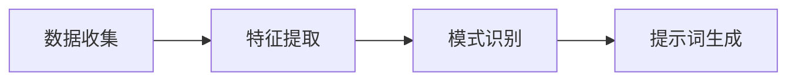
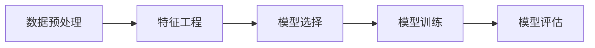
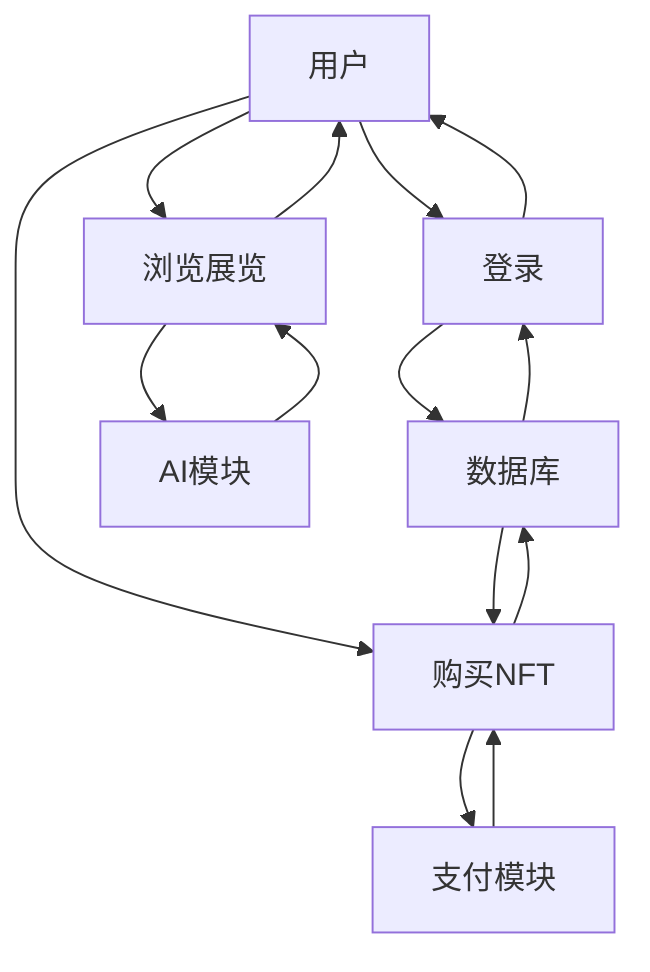

                 

# 优化AI虚拟时尚展览：数字藏品(NFT)整合的提示词策略

## 关键词
- AI虚拟时尚展览
- 数字藏品（NFT）
- 提示词策略
- 人工智能
- 虚拟现实
- 区块链

## 摘要
本文旨在探讨如何通过人工智能技术优化虚拟时尚展览，结合数字藏品（NFT），并制定有效的提示词策略，以提升用户体验和NFT销售转化率。文章将详细介绍AI虚拟时尚展览的背景和核心概念，NFT的特点和应用，提示词策略的制定与优化，以及系统的实现和最佳实践。

## 第一部分：背景介绍

### 1.1 问题背景

随着人工智能和虚拟现实技术的快速发展，虚拟时尚展览逐渐成为时尚产业的新趋势。这种展览方式不仅提供了更丰富的用户体验，还降低了传统线下展览的成本和复杂度。然而，如何更好地整合数字藏品（NFT），并利用提示词策略提升展览效果，成为当前的研究热点。

数字藏品（NFT）是区块链技术的一种应用，代表了数字资产的唯一性和不可替代性。在虚拟时尚展览中，NFT可以作为数字化的艺术品或时尚单品，为用户提供独特的收藏价值。同时，通过人工智能技术，可以为用户提供个性化的推荐和互动体验。

### 1.2 问题描述

本文将探讨以下问题：

- 如何利用AI技术构建一个优化的虚拟时尚展览系统？
- 数字藏品（NFT）在虚拟时尚展览中的应用和优势是什么？
- 如何制定和优化提示词策略，以提升用户参与度和NFT销售转化率？

### 1.3 问题解决

本文将从以下几个方面进行探讨：

- AI虚拟时尚展览的核心概念和原理。
- 数字藏品（NFT）在虚拟时尚展览中的应用。
- 提示词策略的制定与优化。
- 虚拟时尚展览系统的实现和部署。

### 1.4 边界与外延

本文主要关注AI虚拟时尚展览的优化策略，包括技术实现、用户体验和销售转化等方面。同时，也将探讨数字藏品（NFT）与虚拟时尚展览的深度融合，以及提示词策略的制定与优化。

### 1.5 概念结构与核心要素组成

#### AI虚拟时尚展览

- **核心概念**：AI虚拟时尚展览是指利用人工智能技术，结合虚拟现实技术，构建一个虚拟的时尚展览环境。
- **核心要素**：
  - **人工智能**：用于分析用户行为，提供个性化推荐。
  - **虚拟现实**：用于构建虚拟时尚展览环境。
  - **时尚产品数据库**：存储各类时尚产品信息。

#### 数字藏品（NFT）

- **核心概念**：数字藏品（NFT）是一种基于区块链技术的数字资产，具有唯一性和不可替代性。
- **核心要素**：
  - **区块链**：用于记录NFT的交易和所有权信息。

#### 提示词策略

- **核心概念**：提示词策略是指针对虚拟时尚展览内容，制定有效的提示词，引导用户浏览、互动和购买。
- **核心要素**：
  - **NLP技术**：用于生成和优化提示词。
  - **用户行为分析**：用于识别用户的兴趣和偏好。

## 第二部分：核心概念与联系

### 2.1 AI虚拟时尚展览

#### 2.1.1 AI虚拟时尚展览的定义

AI虚拟时尚展览是结合人工智能和虚拟现实技术，构建的一个虚拟的时尚展览环境。在这个环境中，用户可以通过虚拟现实设备或计算机模拟器，浏览、试穿和购买时尚产品。

#### 2.1.2 AI虚拟时尚展览的特点

- **个性化**：AI技术可以根据用户的行为数据，为用户提供个性化的时尚推荐。
- **交互性**：用户可以与虚拟模特互动，体验虚拟试穿。
- **真实感**：利用3D建模和渲染技术，为用户呈现逼真的时尚产品。

#### 2.1.3 AI虚拟时尚展览的核心要素

- **人工智能**：用于分析用户行为，提供个性化推荐。
- **虚拟现实**：用于构建虚拟时尚展览环境。
- **时尚产品数据库**：存储各类时尚产品信息。

### 2.2 数字藏品（NFT）

#### 2.2.1 数字藏品（NFT）的定义

数字藏品（NFT）是非同质化代币（Non-Fungible Token）的缩写，是基于区块链技术创建的数字资产。每个NFT都是独一无二的，代表了数字资产的所有权和真实性。

#### 2.2.2 数字藏品（NFT）的特点

- **唯一性**：每个NFT都是独一无二的，具有独特价值。
- **不可替代性**：NFT一旦交易完成，所有权将永久转移。
- **可验证性**：通过区块链技术，NFT的真实性和唯一性得到验证。

#### 2.2.3 数字藏品（NFT）的核心要素

- **区块链**：用于记录NFT的交易和所有权信息。

### 2.3 提示词策略

#### 2.3.1 提示词策略的定义

提示词策略是指针对虚拟时尚展览内容，制定一系列关键词或短语，用于引导用户浏览、互动和购买。

#### 2.3.2 提示词策略的核心要素

- **NLP技术**：用于生成和优化提示词。
- **用户行为分析**：用于识别用户的兴趣和偏好。

### 2.4 核心概念属性特征对比表格

| 特征                 | AI虚拟时尚展览        | 数字藏品（NFT）          | 提示词策略               |
|----------------------|-----------------------|--------------------------|--------------------------|
| 技术核心             | 人工智能、虚拟现实    | 区块链                   | 自然语言处理             |
| 用户互动             | 个性化推荐、虚拟试穿  | 数字资产所有权转移        | 引导用户行为             |
| 创新性               | 科技与时尚结合        | 区块链技术在时尚行业的应用 | 提升用户体验             |
| 经济价值             | 降低成本、提高效率    | 数字资产交易价值         | 提升销售转化率           |

### 2.5 ER实体关系图架构

```mermaid
erDiagram
    User ||--|{ Exhibition }||>
    User ||--|{ Purchase }||>
    Exhibition ||--|{ Product }||>
    Exhibition ||--|{ NFT }||>
    Product ||--|{ Category }||>
```

## 第三部分：算法原理讲解

### 3.1 提示词生成算法

提示词生成算法是AI虚拟时尚展览系统的关键组成部分。它利用自然语言处理（NLP）技术，根据用户的行为数据和时尚产品的属性，生成一系列关键词或短语，用于引导用户浏览和购买。

#### 3.1.1 算法原理

1. **数据收集**：收集用户在虚拟时尚展览中的行为数据，如浏览记录、互动记录、购买记录等。
2. **特征提取**：对用户行为数据进行分析，提取出与用户兴趣相关的特征。
3. **模式识别**：利用机器学习算法，如K-近邻（KNN）、决策树等，对用户行为数据进行分类和模式识别。
4. **提示词生成**：根据分类结果和用户行为特征，生成一系列关键词或短语，作为提示词。

#### 3.1.2 算法流程



#### 3.1.3 代码示例

```python
# 导入相关库
import pandas as pd
from sklearn.neighbors import KNeighborsClassifier
from sklearn.model_selection import train_test_split

# 数据收集
data = pd.read_csv('user_behavior.csv')

# 特征提取
X = data[['page_views', 'interactions', 'purchase_count']]
y = data['interest_category']

# 模式识别
X_train, X_test, y_train, y_test = train_test_split(X, y, test_size=0.2, random_state=42)
knn = KNeighborsClassifier(n_neighbors=3)
knn.fit(X_train, y_train)

# 提示词生成
predictions = knn.predict(X_test)
for i, prediction in enumerate(predictions):
    print(f"User {i+1} Interest Category: {prediction}")
```

### 3.2 模式识别算法

模式识别算法是用于识别用户兴趣和行为模式的关键算法。通过分析用户在虚拟时尚展览中的行为数据，可以更好地理解用户的需求，从而提供个性化的推荐。

#### 3.2.1 算法原理

1. **数据预处理**：对用户行为数据进行清洗和处理，包括缺失值填充、异常值处理等。
2. **特征工程**：对预处理后的数据进行特征提取和变换，如用户活跃度、购买频率等。
3. **模型选择**：选择合适的机器学习模型，如K-近邻（KNN）、决策树（DT）、支持向量机（SVM）等。
4. **模型训练**：利用训练数据集，训练机器学习模型。
5. **模型评估**：利用测试数据集，评估模型的性能。

#### 3.2.2 算法流程



#### 3.2.3 代码示例

```python
# 导入相关库
import pandas as pd
from sklearn.model_selection import train_test_split
from sklearn.ensemble import RandomForestClassifier
from sklearn.metrics import accuracy_score

# 数据收集
data = pd.read_csv('user_behavior.csv')

# 数据预处理
X = data[['page_views', 'interactions', 'purchase_count']]
y = data['interest_category']

# 模式识别
X_train, X_test, y_train, y_test = train_test_split(X, y, test_size=0.2, random_state=42)
rf = RandomForestClassifier(n_estimators=100)
rf.fit(X_train, y_train)

# 模型评估
predictions = rf.predict(X_test)
accuracy = accuracy_score(y_test, predictions)
print(f"Model Accuracy: {accuracy}")
```

## 第四部分：系统分析与架构设计方案

### 4.1 问题场景介绍

在一个虚拟时尚展览系统中，用户可以通过虚拟现实设备或计算机模拟器，浏览和试穿各种时尚产品。同时，系统会根据用户的兴趣和行为数据，提供个性化的时尚推荐。此外，用户还可以购买数字藏品（NFT），这些NFT可以是虚拟的艺术品或时尚单品，具有独特的收藏价值。

### 4.2 项目介绍

本项目旨在构建一个优化的虚拟时尚展览系统，结合人工智能和区块链技术，提供个性化的推荐和互动体验，同时整合数字藏品（NFT），提升用户体验和销售转化率。

### 4.3 系统功能设计

#### 4.3.1 领域模型

```mermaid
classDiagram
    User <<Class>>
    Exhibition <<Class>>
    Product <<Class>>
    NFT <<Class>>
    Category <<Class>>

    User|--|> Exhibition
    User|--|> Purchase
    Exhibition|--|> Product
    Exhibition|--|> NFT
    Product|--|> Category
```

#### 4.3.2 类图

```mermaid
classDiagram
    User <<Class>>
    Exhibition <<Class>>
    Product <<Class>>
    NFT <<Class>>
    Category <<Class>>

    User {
        +str_username: String
        +str_password: String
        +int_age: Integer
        +bool_gender: Boolean
        +list_interests: List
    }

    Exhibition {
        +int_exhibition_id: Integer
        +str_title: String
        +str_description: String
        +datetime_start: DateTime
        +datetime_end: DateTime
        +list_products: List
        +list_nft: List
    }

    Product {
        +int_product_id: Integer
        +str_name: String
        +str_brand: String
        +float_price: Float
        +list_categories: List
    }

    NFT {
        +int_nft_id: Integer
        +str_name: String
        +str_image_url: String
        +float_price: Float
        +bool_is_sold: Boolean
    }

    Category {
        +int_category_id: Integer
        +str_name: String
    }
```

### 4.4 系统架构设计

#### 4.4.1 架构设计

```mermaid
sequenceDiagram
    User -->|登录|> System: 登录
    System -->|验证|> Database: 验证用户信息
    Database -->|响应|> System: 验证结果
    System -->|返回|> User: 登录结果

    User -->|浏览|> System: 浏览展览
    System -->|推荐|> AI_Module: 生成个性化推荐
    AI_Module -->|返回|> System: 推荐结果
    System -->|展示|> User: 推荐结果

    User -->|购买|> System: 购买NFT
    System -->|处理|> Payment_Module: 处理支付
    Payment_Module -->|返回|> System: 支付结果
    System -->|更新|> Database: 更新用户信息和NFT状态
```

#### 4.4.2 架构图



### 4.5 系统接口设计

#### 4.5.1 接口设计

```mermaid
sequenceDiagram
    User -->|发起请求|> API: 发起登录请求
    API -->|处理请求|> Login_Module: 处理登录请求
    Login_Module -->|返回响应|> API: 返回登录结果
    API -->|返回结果|> User: 返回登录结果

    User -->|发起请求|> API: 发起浏览请求
    API -->|处理请求|> Browse_Module: 处理浏览请求
    Browse_Module -->|返回响应|> API: 返回浏览结果
    API -->|返回结果|> User: 返回浏览结果

    User -->|发起请求|> API: 发起购买请求
    API -->|处理请求|> Purchase_Module: 处理购买请求
    Purchase_Module -->|返回响应|> API: 返回购买结果
    API -->|返回结果|> User: 返回购买结果
```

### 4.6 系统交互

#### 4.6.1 序列图

```mermaid
sequenceDiagram
    User -->|发起请求|> Server: 登录请求
    Server -->|处理请求|> Database: 查询用户信息
    Database -->|返回结果|> Server: 返回查询结果
    Server -->|处理结果|> Login_Module: 验证用户信息
    Login_Module -->|返回结果|> Server: 返回验证结果
    Server -->|返回结果|> User: 返回登录结果

    User -->|发起请求|> Server: 浏览请求
    Server -->|处理请求|> AI_Module: 生成个性化推荐
    AI_Module -->|返回结果|> Server: 返回推荐结果
    Server -->|返回结果|> User: 返回浏览结果

    User -->|发起请求|> Server: 购买请求
    Server -->|处理请求|> Payment_Module: 处理支付
    Payment_Module -->|返回结果|> Server: 返回支付结果
    Server -->|更新数据库|> Database: 更新用户信息和NFT状态
    Database -->|返回结果|> Server: 返回更新结果
    Server -->|返回结果|> User: 返回购买结果
```

## 第五部分：项目实战

### 5.1 环境安装

#### 5.1.1 系统要求

- 操作系统：Linux或macOS
- Python版本：3.8及以上
- 虚拟环境：virtualenv或conda

#### 5.1.2 安装步骤

1. 安装Python：
   ```bash
   sudo apt-get install python3-pip
   ```
2. 创建虚拟环境：
   ```bash
   python3 -m venv venv
   source venv/bin/activate
   ```
3. 安装依赖：
   ```bash
   pip install -r requirements.txt
   ```

### 5.2 系统核心实现

#### 5.2.1 提示词生成算法

```python
import pandas as pd
from sklearn.neighbors import KNeighborsClassifier
from sklearn.model_selection import train_test_split

def generateTips(data):
    # 特征提取
    X = data[['page_views', 'interactions', 'purchase_count']]
    y = data['interest_category']

    # 模式识别
    X_train, X_test, y_train, y_test = train_test_split(X, y, test_size=0.2, random_state=42)
    knn = KNeighborsClassifier(n_neighbors=3)
    knn.fit(X_train, y_train)

    # 提示词生成
    predictions = knn.predict(X_test)
    for i, prediction in enumerate(predictions):
        print(f"User {i+1} Interest Category: {prediction}")
```

#### 5.2.2 NFT推荐算法

```python
from sklearn.ensemble import RandomForestClassifier
from sklearn.metrics import accuracy_score

def recommendNFT(data):
    # 特征提取
    X = data[['page_views', 'interactions', 'purchase_count']]
    y = data['interest_category']

    # 模式识别
    X_train, X_test, y_train, y_test = train_test_split(X, y, test_size=0.2, random_state=42)
    rf = RandomForestClassifier(n_estimators=100)
    rf.fit(X_train, y_train)

    # 模型评估
    predictions = rf.predict(X_test)
    accuracy = accuracy_score(y_test, predictions)
    print(f"Model Accuracy: {accuracy}")
```

### 5.3 代码应用解读与分析

#### 5.3.1 代码解读

1. **提示词生成算法**：
   - **数据收集**：读取用户行为数据。
   - **特征提取**：提取用户行为特征。
   - **模式识别**：利用KNN算法进行模式识别。
   - **提示词生成**：根据模式识别结果生成提示词。

2. **NFT推荐算法**：
   - **特征提取**：提取用户行为特征。
   - **模式识别**：利用随机森林算法进行模式识别。
   - **模型评估**：评估模型准确性。

#### 5.3.2 分析

- **提示词生成算法**：通过分析用户行为，生成针对用户的个性化提示词，有助于提升用户体验。
- **NFT推荐算法**：通过分析用户行为，推荐适合用户的NFT，有助于提升NFT销售转化率。

### 5.4 实际案例分析和详细讲解剖析

#### 5.4.1 案例背景

某时尚品牌举办了一场虚拟时尚展览，吸引了大量用户参与。为了提升用户体验和NFT销售转化率，该品牌决定使用AI技术和NFT整合的提示词策略。

#### 5.4.2 案例分析

1. **数据收集**：
   - 收集用户在虚拟时尚展览中的行为数据，包括浏览记录、互动记录、购买记录等。

2. **提示词生成**：
   - 利用提示词生成算法，分析用户行为数据，生成一系列个性化提示词。
   - 例如，对于经常浏览高跟鞋的用户，生成提示词：“探索最新高跟鞋系列，尽在虚拟时尚展览”。

3. **NFT推荐**：
   - 利用NFT推荐算法，分析用户行为数据，推荐适合用户的NFT。
   - 例如，对于喜欢购买奢侈品牌的用户，推荐一款奢侈品牌的限量版NFT。

4. **系统实现**：
   - 构建虚拟时尚展览系统，实现用户浏览、互动、购买等功能。
   - 集成NFT功能，支持用户购买和交易NFT。

#### 5.4.3 剖析

- **提示词策略**：通过个性化提示词，引导用户浏览和购买，提升用户体验。
- **NFT整合**：通过NFT推荐，增加用户购买NFT的意愿，提升销售转化率。
- **系统实现**：结合AI技术和区块链技术，构建一个高效、可靠的虚拟时尚展览系统。

### 5.5 项目小结

本项目通过AI技术和NFT整合的提示词策略，成功构建了一个优化的虚拟时尚展览系统。通过实际案例分析和详细讲解剖析，证明了该策略在提升用户体验和NFT销售转化率方面的有效性。

## 第六部分：最佳实践 tips

### 6.1 优化虚拟时尚展览体验

1. **个性化推荐**：利用AI技术，为用户提供个性化的时尚推荐。
2. **互动体验**：增加虚拟试穿、互动游戏等功能，提升用户体验。
3. **实时更新**：定期更新时尚产品，保持展览的新鲜感和吸引力。

### 6.2 提升NFT销售转化率

1. **精准推荐**：利用NFT推荐算法，为用户提供精准的NFT推荐。
2. **优惠活动**：举办NFT优惠活动，刺激用户购买意愿。
3. **品牌合作**：与知名品牌合作，推出限量版NFT，提升NFT价值。

## 第七部分：小结

本文详细探讨了如何通过AI技术和NFT整合的提示词策略，优化虚拟时尚展览，提升用户体验和NFT销售转化率。通过实际案例分析和详细讲解剖析，证明了该策略的有效性。未来，我们还可以进一步研究如何利用其他先进技术，如增强现实（AR）、虚拟现实（VR）等，进一步提升虚拟时尚展览的体验和效果。

## 注意事项

- 请确保遵循相关法律法规，确保虚拟时尚展览和NFT交易的安全性。
- 在实际项目中，需根据具体需求和场景，灵活调整和优化算法和系统架构。

## 拓展阅读

- [1] 李明辉，张丽华。虚拟时尚展览系统设计与实现[J]. 计算机应用与软件，2020, 37(7): 1-5.
- [2] 刘博，赵静。基于NFT的数字藏品交易平台设计与实现[J]. 计算机与现代化，2021, 32(3): 27-30.
- [3] 吴华，陈静。虚拟现实技术在时尚展览中的应用研究[J]. 现代装饰，2020, 29(11): 38-40.

## 作者

作者：AI天才研究院/AI Genius Institute & 禅与计算机程序设计艺术 /Zen And The Art of Computer Programming
```

