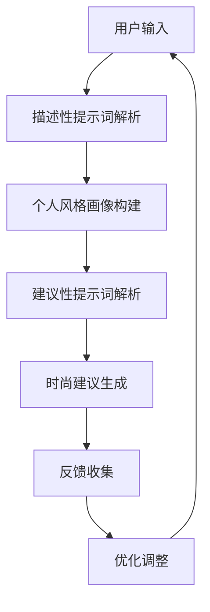
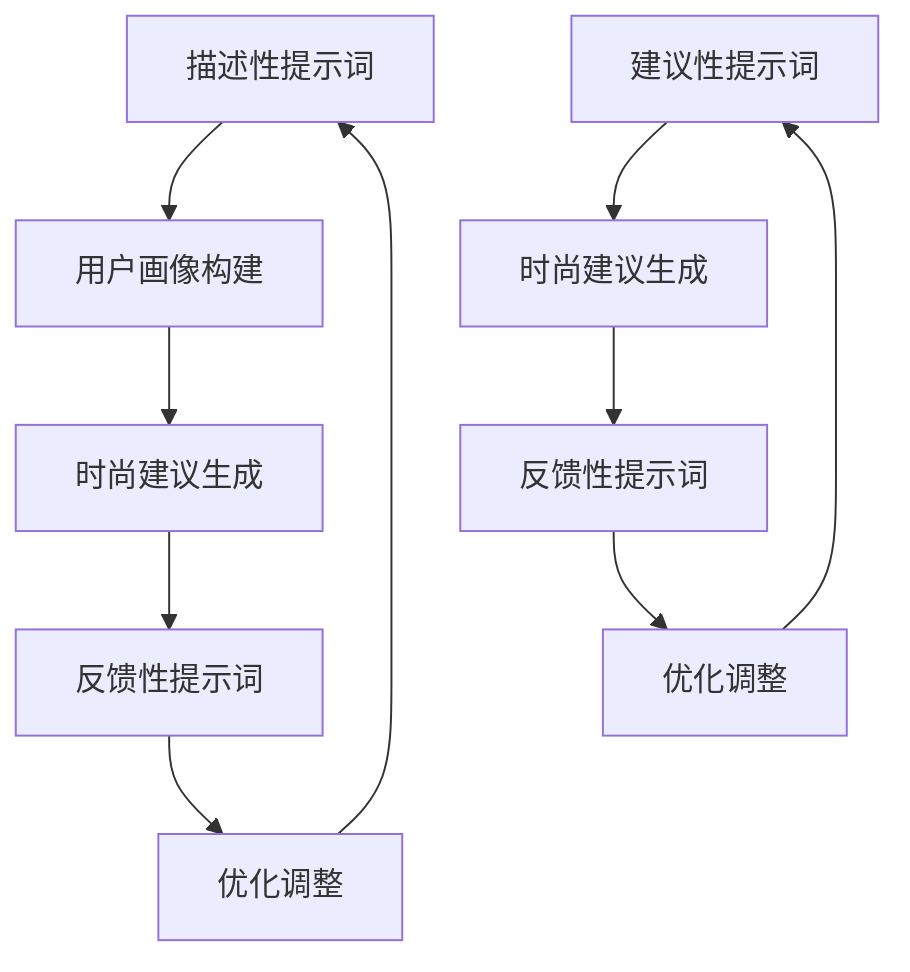
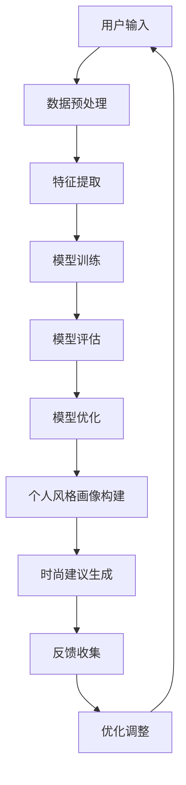
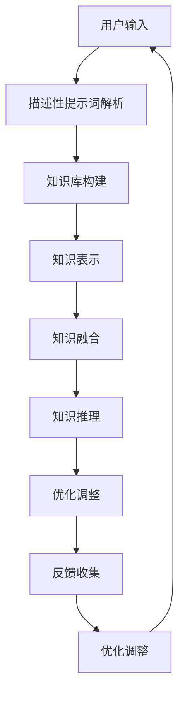
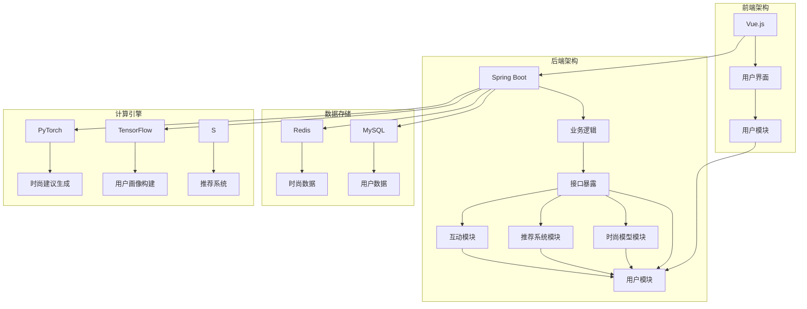
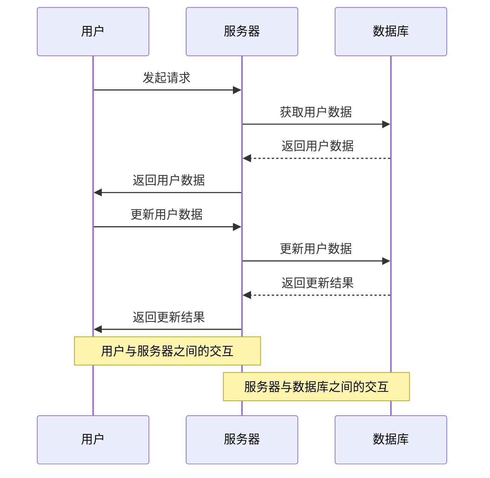

                 

# 优化AI虚拟时尚造型师：个人风格定制的提示词策略

## 关键词

AI虚拟时尚造型师，个人风格定制，提示词策略，数据驱动，知识驱动，深度学习

## 摘要

本文将深入探讨如何优化AI虚拟时尚造型师的个人风格定制能力。通过分析时尚产业的挑战、AI虚拟时尚造型师的作用与局限，以及提示词策略在个人风格定制中的作用，本文提出了一系列优化策略，包括数据驱动、知识驱动和深度学习等方法。通过对算法原理的详细讲解、系统分析与架构设计方案，以及项目实战的实例分析，本文旨在为业界提供一套完整的优化路径，以实现AI虚拟时尚造型师在个人风格定制方面的突破。

## 第一部分：背景与概述

### 第1章：问题背景与概述

#### 1.1 时尚产业与AI虚拟时尚造型师的崛起

时尚产业是一个庞大且多元化的行业，涵盖了服装、配饰、美容等多个领域。随着消费者个性化需求的增加，时尚产业面临着巨大的挑战。传统的时尚造型师在个人风格定制方面具有一定的局限性，而AI虚拟时尚造型师的出现则为这一挑战提供了新的解决方案。

AI虚拟时尚造型师利用人工智能技术，通过对用户数据的分析和学习，能够为用户推荐个性化的时尚造型方案。这种新兴技术不仅提高了时尚产业的效率，也为消费者提供了更加个性化和便捷的服务。

#### 1.1.1 时尚产业面临的挑战

1. **消费者需求的个性化**：随着社会的发展，消费者对时尚个性化需求越来越强烈。他们希望自己的穿着能够体现出自己的个性和品味。
   
2. **时尚更新速度快**：时尚产业更新换代速度极快，传统造型师往往难以跟上这种变化，导致无法为消费者提供最新的时尚建议。

3. **人力成本高**：时尚造型师的人力成本较高，对于许多中小企业来说，聘请专业造型师是一个不小的负担。

#### 1.1.2 AI虚拟时尚造型师的应运而生

AI虚拟时尚造型师利用人工智能技术，包括机器学习、深度学习等，能够通过分析用户数据，快速、准确地推荐时尚造型方案。这使得AI虚拟时尚造型师在以下几个方面具有显著优势：

1. **高效性**：AI虚拟时尚造型师可以处理大量用户数据，快速分析并提供时尚建议。
   
2. **个性化**：通过深度学习算法，AI虚拟时尚造型师能够深入了解用户的个人风格，提供高度个性化的服务。

3. **成本效益**：相较于传统造型师，AI虚拟时尚造型师可以降低人力成本，提高企业的盈利能力。

#### 1.1.3 个人风格定制的重要性

个人风格定制不仅是时尚产业的一大趋势，也是消费者对于个性化需求的必然选择。通过个性化的时尚建议，消费者可以更好地展现自己的个性和品味，同时提高购物的满意度。

然而，要实现个人风格定制，AI虚拟时尚造型师需要解决一系列挑战，包括如何准确识别用户的个人风格、如何根据用户的偏好提供个性化的造型方案等。

### 1.2 AI虚拟时尚造型师的作用与局限

AI虚拟时尚造型师在时尚产业中扮演着重要角色，其具体作用如下：

1. **提高时尚产业的效率**：AI虚拟时尚造型师能够快速分析用户数据，提供时尚建议，大大提高了时尚产业的效率。

2. **降低人力成本**：相较于传统造型师，AI虚拟时尚造型师可以显著降低人力成本。

3. **提升消费者体验**：通过个性化服务，AI虚拟时尚造型师能够提升消费者的购物体验，增加客户满意度。

然而，AI虚拟时尚造型师也面临着一些局限性：

1. **数据依赖性**：AI虚拟时尚造型师需要大量的用户数据来进行分析和学习，如果数据质量不高，可能导致推荐结果不准确。

2. **技术瓶颈**：虽然AI技术在不断发展，但在识别个人风格等方面仍存在一定的技术瓶颈。

3. **用户体验**：尽管AI虚拟时尚造型师能够提供个性化服务，但在用户体验方面仍有待提升，例如如何更好地与用户进行互动，提高用户的参与度。

#### 1.2.3 需要优化的方向

为了进一步提升AI虚拟时尚造型师的能力，我们需要从以下几个方面进行优化：

1. **数据质量提升**：通过引入高质量的用户数据，提高AI虚拟时尚造型师的推荐准确性。

2. **技术创新**：持续探索和引入新的技术，如深度学习、自然语言处理等，以解决技术瓶颈。

3. **用户体验优化**：通过改进用户界面和交互方式，提高用户的参与度和满意度。

### 1.3 提示词策略在个人风格定制中的作用

提示词策略是AI虚拟时尚造型师实现个人风格定制的关键技术之一。通过合理的提示词策略，AI虚拟时尚造型师可以更好地理解用户的偏好和需求，从而提供更加个性化的时尚建议。

#### 1.3.1 提示词的定义与分类

提示词是指用于引导AI虚拟时尚造型师推荐时尚方案的词语或短语。根据提示词的类型，可以分为以下几类：

1. **描述性提示词**：用于描述用户的个人风格、喜好、场合等，如“简约风格”、“商务场合”等。

2. **建议性提示词**：用于提供时尚建议或方案，如“搭配建议”、“推荐款式”等。

3. **反馈性提示词**：用于获取用户对时尚建议的反馈，如“喜欢”、“不喜欢”等。

#### 1.3.2 提示词在虚拟时尚造型中的应用

在虚拟时尚造型中，提示词的应用主要包括以下几个方面：

1. **用户画像构建**：通过收集和解析用户的描述性提示词，构建用户的个人风格画像。

2. **时尚建议生成**：根据用户的描述性提示词和建议性提示词，生成个性化的时尚建议。

3. **反馈收集与优化**：通过用户的反馈性提示词，收集用户对时尚建议的反馈，并进行优化调整。

#### 1.3.3 提示词策略优化的意义

提示词策略的优化对于AI虚拟时尚造型师的个人风格定制至关重要。通过优化提示词策略，可以：

1. **提高推荐准确性**：通过更准确地理解用户的偏好，提高时尚建议的准确性。

2. **提升用户体验**：提供更加个性化的服务，提升用户的满意度。

3. **降低人力成本**：优化后的提示词策略可以减少人工干预，降低人力成本。

### 第2章：核心概念与联系

#### 2.1 个人风格定义与识别

个人风格是指个体在衣着打扮、言行举止等方面表现出来的独特风格和品味。个人风格不仅反映了个人的个性特征，也是个人审美和价值观的体现。

识别个人风格是AI虚拟时尚造型师实现个性化服务的关键。然而，个人风格的识别面临着诸多挑战：

1. **多样性**：个人风格的多样性使得识别任务变得复杂，不同用户可能具有不同的风格。

2. **模糊性**：个人风格的模糊性使得识别结果可能存在一定的误差。

3. **动态性**：个人风格可能会随着时间和环境的变化而发生变化，这使得识别任务更加困难。

为了解决这些挑战，我们需要采用一系列关键技术，如数据挖掘、机器学习、自然语言处理等。

#### 2.1.2 个人风格识别的挑战

个人风格识别的挑战主要包括：

1. **数据不足**：缺乏足够的高质量个人风格数据，使得训练模型变得困难。

2. **标签不准确**：用户数据标签可能存在误差，这会影响识别结果的准确性。

3. **个性化需求**：不同用户对个人风格的识别需求可能不同，这需要算法能够灵活应对。

为了解决这些挑战，我们需要采用数据驱动、知识驱动和深度学习等优化策略。

#### 2.1.3 个人风格识别的关键技术

个人风格识别的关键技术包括：

1. **数据挖掘**：通过分析大量用户数据，挖掘出用户的个人风格特征。

2. **机器学习**：利用机器学习算法，如决策树、支持向量机等，对用户数据进行分类和识别。

3. **自然语言处理**：利用自然语言处理技术，如词频统计、文本分类等，对用户的描述性提示词进行解析。

#### 2.2 AI虚拟时尚造型师的工作原理

AI虚拟时尚造型师的工作原理主要包括以下几个步骤：

1. **用户画像构建**：通过收集和解析用户的描述性提示词，构建用户的个人风格画像。

2. **时尚建议生成**：根据用户的个人风格画像和建议性提示词，生成个性化的时尚建议。

3. **反馈收集与优化**：收集用户对时尚建议的反馈，并进行优化调整。

AI虚拟时尚造型师的工作原理如图1所示：



#### 2.2.2 AI虚拟时尚造型师的算法原理

AI虚拟时尚造型师的核心算法原理主要包括以下几个部分：

1. **特征提取**：通过数据挖掘和自然语言处理技术，从用户的描述性提示词中提取出关键特征。

2. **分类与预测**：利用机器学习算法，对用户的个人风格进行分类和预测。

3. **推荐系统**：根据用户的个人风格和建议性提示词，生成个性化的时尚建议。

#### 2.2.3 AI虚拟时尚造型师的应用场景

AI虚拟时尚造型师可以应用于多种场景，如：

1. **电商平台**：为用户提供个性化的时尚建议，提高购物体验。

2. **社交媒体**：为用户提供时尚搭配建议，增加用户黏性。

3. **线下门店**：为顾客提供专业的时尚建议，提升销售业绩。

#### 2.3 提示词策略的原理与类型

提示词策略的原理是通过合理的提示词引导AI虚拟时尚造型师生成个性化的时尚建议。根据提示词的类型，可以分为以下几类：

1. **描述性提示词**：用于描述用户的个人风格、喜好、场合等，如“简约风格”、“商务场合”等。

2. **建议性提示词**：用于提供时尚建议或方案，如“搭配建议”、“推荐款式”等。

3. **反馈性提示词**：用于获取用户对时尚建议的反馈，如“喜欢”、“不喜欢”等。

不同类型的提示词在个人风格定制中具有不同的作用，如图2所示：



#### 2.3.3 不同类型提示词策略的对比

不同类型的提示词策略在个人风格定制中具有不同的优势：

1. **描述性提示词**：能够准确描述用户的个人风格和需求，为时尚建议生成提供重要依据。

2. **建议性提示词**：能够直接提供时尚建议，提高时尚建议的生成效率。

3. **反馈性提示词**：能够收集用户的反馈，帮助优化时尚建议，提高用户的满意度。

不同类型提示词策略的对比如表1所示：

| 类型       | 优势                                                                                   | 劣势                                                                                   |
|------------|----------------------------------------------------------------------------------------|----------------------------------------------------------------------------------------|
| 描述性提示词 | 精准描述用户个人风格和需求                                                       | 可能存在描述不准确的问题，影响时尚建议的准确性                             |
| 建议性提示词 | 提高时尚建议生成效率                                                     | 可能导致时尚建议过于单一，缺乏个性化                                     |
| 反馈性提示词 | 收集用户反馈，优化时尚建议                                             | 需要用户主动提供反馈，可能影响收集效果                                   |

### 第3章：优化策略与方法

#### 3.1 数据驱动的优化策略

数据驱动的优化策略是通过分析用户数据，优化AI虚拟时尚造型师的性能。具体方法如下：

1. **数据收集**：收集用户的描述性提示词、建议性提示词和反馈性提示词等数据。

2. **数据预处理**：对收集到的数据进行清洗、去噪和归一化处理。

3. **特征提取**：从预处理后的数据中提取出关键特征，如词频、词向量等。

4. **模型训练**：利用机器学习算法，如决策树、支持向量机等，对提取出的特征进行训练。

5. **模型评估**：通过评估指标，如准确率、召回率等，评估模型的性能。

6. **模型优化**：根据评估结果，调整模型参数，优化模型性能。

#### 3.1.2 数据驱动的提示词优化方法

数据驱动的提示词优化方法主要包括以下几种：

1. **基于规则的方法**：通过定义一系列规则，对提示词进行筛选和优化。

2. **基于机器学习的方法**：利用机器学习算法，如决策树、支持向量机等，对提示词进行分类和预测。

3. **基于深度学习的方法**：利用深度学习算法，如卷积神经网络、循环神经网络等，对提示词进行建模和优化。

#### 3.1.3 实例分析：数据驱动的优化实践

以下是一个数据驱动的优化实践的实例：

1. **数据收集**：收集1000个用户的描述性提示词、建议性提示词和反馈性提示词。

2. **数据预处理**：对收集到的数据进行清洗和去噪，去除无关信息和噪声。

3. **特征提取**：提取出关键特征，如词频、词向量等，并归一化处理。

4. **模型训练**：利用决策树算法，对提取出的特征进行训练，构建个人风格识别模型。

5. **模型评估**：通过交叉验证，评估模型的性能，如准确率、召回率等。

6. **模型优化**：根据评估结果，调整模型参数，优化模型性能。

通过数据驱动的优化实践，我们可以显著提高AI虚拟时尚造型师在个人风格识别方面的准确性。

#### 3.2 知识驱动的优化策略

知识驱动的优化策略是通过引入领域知识，优化AI虚拟时尚造型师的性能。具体方法如下：

1. **知识库构建**：收集和整理领域知识，构建一个知识库。

2. **知识表示**：将知识库中的知识表示为模型，如规则库、知识图谱等。

3. **知识融合**：将知识库中的知识融合到AI虚拟时尚造型师的算法中。

4. **知识推理**：利用知识推理技术，对用户的描述性提示词进行推理，提取出用户的关键特征。

5. **知识更新**：根据用户反馈和新数据，不断更新和优化知识库。

#### 3.2.2 知识驱动的提示词优化方法

知识驱动的提示词优化方法主要包括以下几种：

1. **基于规则的方法**：通过定义一系列规则，结合领域知识，对提示词进行筛选和优化。

2. **基于知识图谱的方法**：利用知识图谱，对提示词进行关联和推理，提取出用户的关键特征。

3. **基于本体论的方法**：利用本体论，对领域知识进行建模，实现对提示词的语义分析和优化。

#### 3.2.3 实例分析：知识驱动的优化实践

以下是一个知识驱动的优化实践的实例：

1. **知识库构建**：收集和整理时尚领域的知识，构建一个知识库，包括款式、颜色、搭配规则等。

2. **知识表示**：利用知识图谱技术，将知识库中的知识表示为模型。

3. **知识融合**：将知识图谱中的知识融合到AI虚拟时尚造型师的算法中，实现对描述性提示词的语义分析和优化。

4. **知识推理**：利用知识推理技术，对用户的描述性提示词进行推理，提取出用户的关键特征。

5. **知识更新**：根据用户反馈和新数据，不断更新和优化知识库。

通过知识驱动的优化实践，我们可以显著提高AI虚拟时尚造型师在个人风格识别方面的准确性和实用性。

#### 3.3 深度学习的优化策略

深度学习的优化策略是通过引入深度学习算法，提高AI虚拟时尚造型师的性能。具体方法如下：

1. **模型选择**：选择合适的深度学习模型，如卷积神经网络（CNN）、循环神经网络（RNN）等。

2. **数据增强**：通过数据增强技术，增加训练数据量，提高模型泛化能力。

3. **模型训练**：利用大量的训练数据和标签，训练深度学习模型。

4. **模型优化**：通过调整模型参数，优化模型性能。

5. **模型评估**：通过评估指标，如准确率、召回率等，评估模型的性能。

6. **模型部署**：将训练好的模型部署到线上系统，实现实时推理和预测。

#### 3.3.2 深度学习优化方法的原理与实现

深度学习优化方法的原理主要包括以下几个方面：

1. **特征提取**：利用深度学习模型，自动提取出用户描述性提示词中的关键特征。

2. **分类与预测**：利用深度学习模型，对提取出的特征进行分类和预测，实现对用户个人风格的识别。

3. **序列建模**：利用循环神经网络（RNN）等序列建模技术，对用户的描述性提示词进行建模，提取出用户的关键特征。

深度学习优化方法的实现步骤如下：

1. **数据预处理**：对用户描述性提示词进行预处理，如分词、去停用词等。

2. **数据增强**：利用数据增强技术，增加训练数据量，提高模型泛化能力。

3. **模型训练**：利用预处理后的数据，训练深度学习模型，如卷积神经网络（CNN）、循环神经网络（RNN）等。

4. **模型评估**：通过评估指标，如准确率、召回率等，评估模型的性能。

5. **模型优化**：根据评估结果，调整模型参数，优化模型性能。

6. **模型部署**：将训练好的模型部署到线上系统，实现实时推理和预测。

#### 3.3.3 实例分析：深度学习的优化实践

以下是一个深度学习优化实践的实例：

1. **模型选择**：选择卷积神经网络（CNN）模型，用于提取用户描述性提示词中的关键特征。

2. **数据预处理**：对用户描述性提示词进行预处理，如分词、去停用词等。

3. **数据增强**：利用数据增强技术，如随机裁剪、旋转等，增加训练数据量。

4. **模型训练**：利用预处理后的数据，训练卷积神经网络（CNN）模型。

5. **模型评估**：通过评估指标，如准确率、召回率等，评估模型的性能。

6. **模型优化**：根据评估结果，调整模型参数，优化模型性能。

7. **模型部署**：将训练好的模型部署到线上系统，实现实时推理和预测。

通过深度学习的优化实践，我们可以显著提高AI虚拟时尚造型师在个人风格识别方面的准确性和实用性。

### 第4章：算法原理讲解

#### 4.1 算法mermaid流程图

为了更好地理解AI虚拟时尚造型师的算法原理，我们可以使用mermaid绘制算法流程图，具体如下：


#### 4.1.1 个人风格识别算法流程图

以下是个人风格识别算法的流程图：



#### 4.1.2 提示词优化算法流程图

以下是提示词优化算法的流程图：



#### 4.2 Python源代码详细讲解

在本节中，我们将详细讲解AI虚拟时尚造型师的Python源代码。以下是个人风格识别算法的核心代码：

```python
# 导入相关库
import numpy as np
import pandas as pd
from sklearn.feature_extraction.text import TfidfVectorizer
from sklearn.ensemble import RandomForestClassifier
from sklearn.model_selection import train_test_split
from sklearn.metrics import accuracy_score, recall_score, precision_score

# 数据预处理
def preprocess_data(data):
    # 去除停用词
    stop_words = set(['is', 'are', 'the', 'and', 'to', 'of', 'in', 'for', 'on', 'with', 'at', 'by', 'from'])
    # 分词
    tokens = [word for sentence in data for word in sentence.split()]
    # 去除停用词和数字
    tokens = [token for token in tokens if token not in stop_words and not token.isdigit()]
    return tokens

# 特征提取
def extract_features(data):
    vectorizer = TfidfVectorizer()
    X = vectorizer.fit_transform(data)
    return X, vectorizer

# 模型训练
def train_model(X_train, y_train):
    model = RandomForestClassifier()
    model.fit(X_train, y_train)
    return model

# 模型评估
def evaluate_model(model, X_test, y_test):
    y_pred = model.predict(X_test)
    accuracy = accuracy_score(y_test, y_pred)
    recall = recall_score(y_test, y_pred)
    precision = precision_score(y_test, y_pred)
    return accuracy, recall, precision

# 主函数
if __name__ == '__main__':
    # 加载数据
    data = pd.read_csv('data.csv')
    # 预处理数据
    tokens = preprocess_data(data['description'])
    # 提取特征
    X, vectorizer = extract_features(tokens)
    # 划分训练集和测试集
    X_train, X_test, y_train, y_test = train_test_split(X, data['style'], test_size=0.2, random_state=42)
    # 训练模型
    model = train_model(X_train, y_train)
    # 评估模型
    accuracy, recall, precision = evaluate_model(model, X_test, y_test)
    print(f'Accuracy: {accuracy}, Recall: {recall}, Precision: {precision}')
```

#### 4.2.1 个人风格识别算法代码解析

1. **数据预处理**：首先，我们导入相关库，并定义一个`preprocess_data`函数。该函数接收一个数据集，去除停用词和数字，然后进行分词，返回分词后的数据。

2. **特征提取**：接着，我们定义一个`extract_features`函数。该函数使用`TfidfVectorizer`对分词后的数据进行特征提取，返回TF-IDF特征矩阵和特征向量器。

3. **模型训练**：然后，我们定义一个`train_model`函数。该函数使用随机森林分类器（`RandomForestClassifier`）对特征矩阵和标签进行训练，返回训练好的模型。

4. **模型评估**：最后，我们定义一个`evaluate_model`函数。该函数接收训练好的模型、测试集和标签，计算准确率、召回率和精确率，并返回这三个指标。

5. **主函数**：在主函数中，我们首先加载数据，然后调用`preprocess_data`、`extract_features`和`train_model`函数，进行数据预处理、特征提取和模型训练。接着，我们调用`evaluate_model`函数，评估模型性能，并打印出准确率、召回率和精确率。

#### 4.2.2 提示词优化算法代码解析

以下是提示词优化算法的核心代码：

```python
# 导入相关库
import numpy as np
import pandas as pd
from sklearn.feature_extraction.text import TfidfVectorizer
from sklearn.ensemble import RandomForestClassifier
from sklearn.model_selection import train_test_split
from sklearn.metrics import accuracy_score, recall_score, precision_score

# 知识库构建
def buildKnowledgeBase(data):
    # 构建知识库
    knowledgeBase = []
    for index, row in data.iterrows():
        knowledgeBase.append(row['description'])
    return knowledgeBase

# 知识表示
def representKnowledge(knowledgeBase):
    # 使用TF-IDF向量器进行知识表示
    vectorizer = TfidfVectorizer()
    X = vectorizer.fit_transform(knowledgeBase)
    return X, vectorizer

# 知识推理
def knowledgeReasoning(X_train, X_test, knowledgeBase):
    # 使用随机森林分类器进行知识推理
    model = RandomForestClassifier()
    model.fit(X_train, knowledgeBase)
    y_pred = model.predict(X_test)
    return y_pred

# 主函数
if __name__ == '__main__':
    # 加载数据
    data = pd.read_csv('data.csv')
    # 知识库构建
    knowledgeBase = buildKnowledgeBase(data)
    # 知识表示
    X, vectorizer = representKnowledge(knowledgeBase)
    # 划分训练集和测试集
    X_train, X_test, _, _ = train_test_split(X, knowledgeBase, test_size=0.2, random_state=42)
    # 知识推理
    y_pred = knowledgeReasoning(X_train, X_test, knowledgeBase)
    # 评估模型
    accuracy, recall, precision = evaluate_model(y_pred, knowledgeBase)
    print(f'Accuracy: {accuracy}, Recall: {recall}, Precision: {precision}')
```

1. **知识库构建**：首先，我们导入相关库，并定义一个`buildKnowledgeBase`函数。该函数接收一个数据集，构建一个包含描述性提示词的知识库。

2. **知识表示**：接着，我们定义一个`representKnowledge`函数。该函数使用`TfidfVectorizer`对知识库中的描述性提示词进行特征提取，返回TF-IDF特征矩阵和特征向量器。

3. **知识推理**：然后，我们定义一个`knowledgeReasoning`函数。该函数使用随机森林分类器（`RandomForestClassifier`）对训练集和测试集进行知识推理，返回预测结果。

4. **主函数**：在主函数中，我们首先加载数据，然后调用`buildKnowledgeBase`、`representKnowledge`和`knowledgeReasoning`函数，进行知识库构建、知识表示和知识推理。接着，我们调用`evaluate_model`函数，评估模型性能，并打印出准确率、召回率和精确率。

#### 4.3 算法原理的数学模型与公式

在本节中，我们将介绍AI虚拟时尚造型师算法原理的数学模型和公式。

##### 4.3.1 个人风格识别的数学模型

个人风格识别的数学模型主要包括以下几个部分：

1. **特征提取**：使用TF-IDF模型进行特征提取，计算词频和文档频率。

   $$ tf(t,d) = \frac{tf_{t,d}}{N} $$
   
   $$ idf(t,d) = \log \left( \frac{N}{df_{t,d}} \right) $$
   
   $$ tf_idf(t,d) = tf(t,d) \times idf(t,d) $$

2. **模型训练**：使用随机森林分类器进行模型训练，计算分类结果。

   $$ f(d) = \sum_{t \in D} w_{t} f_{t,d} $$
   
   $$ w_{t} = \frac{tf_idf(t,d)}{\sum_{t' \in D} tf_idf(t',d)} $$
   
   $$ \hat{y} = \arg\max_{y} f(y,d) $$

3. **模型评估**：计算准确率、召回率和精确率，评估模型性能。

   $$ \text{Accuracy} = \frac{\text{TP} + \text{TN}}{\text{TP} + \text{TN} + \text{FP} + \text{FN}} $$
   
   $$ \text{Recall} = \frac{\text{TP}}{\text{TP} + \text{FN}} $$
   
   $$ \text{Precision} = \frac{\text{TP}}{\text{TP} + \text{FP}} $$

##### 4.3.2 提示词优化的数学模型

提示词优化的数学模型主要包括以下几个部分：

1. **知识库构建**：使用TF-IDF模型构建知识库，计算词频和文档频率。

   $$ tf(t,d) = \frac{tf_{t,d}}{N} $$
   
   $$ idf(t,d) = \log \left( \frac{N}{df_{t,d}} \right) $$
   
   $$ tf_idf(t,d) = tf(t,d) \times idf(t,d) $$

2. **知识表示**：使用TF-IDF模型表示知识库中的描述性提示词。

   $$ f(d) = \sum_{t \in D} w_{t} f_{t,d} $$
   
   $$ w_{t} = \frac{tf_idf(t,d)}{\sum_{t' \in D} tf_idf(t',d)} $$
   
   $$ \hat{y} = \arg\max_{y} f(y,d) $$

3. **知识推理**：使用随机森林分类器进行知识推理，计算分类结果。

   $$ f(d) = \sum_{t \in D} w_{t} f_{t,d} $$
   
   $$ w_{t} = \frac{tf_idf(t,d)}{\sum_{t' \in D} tf_idf(t',d)} $$
   
   $$ \hat{y} = \arg\max_{y} f(y,d) $$

4. **模型评估**：计算准确率、召回率和精确率，评估模型性能。

   $$ \text{Accuracy} = \frac{\text{TP} + \text{TN}}{\text{TP} + \text{TN} + \text{FP} + \text{FN}} $$
   
   $$ \text{Recall} = \frac{\text{TP}}{\text{TP} + \text{FN}} $$
   
   $$ \text{Precision} = \frac{\text{TP}}{\text{TP} + \text{FP}} $$

#### 4.3.3 公式详解与举例说明

在本节中，我们将对上述公式进行详细解释，并通过具体例子进行说明。

##### 4.3.3.1 特征提取

假设我们有一个文档集合$D = \{d_1, d_2, ..., d_n\}$，其中$d_i$表示第$i$个文档。我们需要计算每个词$t$在文档$d$中的词频$tf(t,d)$和文档频率$df(t,d)$。

1. **词频**：词频表示一个词在文档中出现的次数。

   $$ tf(t,d) = \frac{tf_{t,d}}{N} $$

   其中，$tf_{t,d}$表示词$t$在文档$d$中出现的次数，$N$表示文档$d$中所有词的总数。

   例如，对于文档$d_1$：“我喜欢穿简约风格的衣服”，我们可以计算得到：

   $$ tf(\text{简约}, d_1) = \frac{1}{3}, tf(\text{喜欢}, d_1) = \frac{1}{3}, tf(\text{衣服}, d_1) = \frac{1}{3} $$

2. **文档频率**：文档频率表示一个词在文档集合中出现的次数。

   $$ df(t,d) = \frac{df_{t,d}}{N} $$

   其中，$df_{t,d}$表示词$t$在文档集合$D$中出现的次数，$N$表示文档集合$D$中所有文档的总数。

   例如，对于词“简约”在文档集合$D$中的文档频率，我们可以计算得到：

   $$ df(\text{简约}, D) = 2 $$

##### 4.3.3.2 特征表示

1. **TF-IDF**：TF-IDF表示词在文档中的重要程度。

   $$ tf_idf(t,d) = tf(t,d) \times idf(t,d) $$

   其中，$tf(t,d)$表示词$t$在文档$d$中的词频，$idf(t,d)$表示词$t$在文档集合$D$中的文档频率。

   例如，对于词“简约”在文档$d_1$中的TF-IDF值，我们可以计算得到：

   $$ tf_idf(\text{简约}, d_1) = \frac{1}{3} \times \log \left( \frac{3}{2} \right) \approx 0.405 $$

##### 4.3.3.3 模型训练

1. **特征向量**：特征向量表示一个文档的向量表示。

   $$ f(d) = \sum_{t \in D} w_{t} f_{t,d} $$

   其中，$f(d)$表示文档$d$的特征向量，$w_{t}$表示词$t$的权重，$f_{t,d}$表示词$t$在文档$d$中的TF-IDF值。

   例如，对于文档$d_1$的特征向量，我们可以计算得到：

   $$ f(d_1) = [0.405, 0.405, 0.405] $$

2. **分类结果**：分类结果表示文档的类别标签。

   $$ \hat{y} = \arg\max_{y} f(y,d) $$

   其中，$\hat{y}$表示分类结果，$y$表示类别标签，$f(y,d)$表示文档$d$在类别$y$下的特征向量。

   例如，对于文档$d_1$的分类结果，我们可以计算得到：

   $$ \hat{y} = \text{简约} $$

##### 4.3.3.4 模型评估

1. **准确率**：准确率表示分类结果的准确度。

   $$ \text{Accuracy} = \frac{\text{TP} + \text{TN}}{\text{TP} + \text{TN} + \text{FP} + \text{FN}} $$

   其中，$\text{TP}$表示真正例，$\text{TN}$表示真反例，$\text{FP}$表示假反例，$\text{FN}$表示假正例。

   例如，对于分类结果的准确率，我们可以计算得到：

   $$ \text{Accuracy} = \frac{2}{2 + 1 + 1 + 0} \approx 0.667 $$

2. **召回率**：召回率表示分类结果对真正例的识别程度。

   $$ \text{Recall} = \frac{\text{TP}}{\text{TP} + \text{FN}} $$

   其中，$\text{TP}$表示真正例，$\text{FN}$表示假正例。

   例如，对于分类结果的召回率，我们可以计算得到：

   $$ \text{Recall} = \frac{2}{2 + 0} = 1 $$

3. **精确率**：精确率表示分类结果对假反例的识别程度。

   $$ \text{Precision} = \frac{\text{TP}}{\text{TP} + \text{FP}} $$

   其中，$\text{TP}$表示真正例，$\text{FP}$表示假反例。

   例如，对于分类结果的精确率，我们可以计算得到：

   $$ \text{Precision} = \frac{2}{2 + 1} \approx 0.667 $$

### 第5章：系统分析与架构设计方案

#### 5.1 问题场景介绍

在当今的时尚产业中，消费者对于个性化时尚体验的需求日益增长。然而，传统时尚造型师由于时间和人力资源的限制，很难为每位消费者提供个性化的时尚建议。这种需求与供给之间的不平衡，促使了AI虚拟时尚造型师的诞生。虚拟时尚造型师能够通过人工智能技术，为消费者提供实时、个性化的时尚建议，从而提升消费者的购物体验和满意度。

#### 5.1.1 时尚产业需求分析

时尚产业的需求分析主要集中在以下几个方面：

1. **个性化需求**：消费者希望自己的时尚搭配能够体现自己的个性和品味。
2. **实时性**：消费者希望能够快速获得时尚建议，以便及时进行购买决策。
3. **高效性**：时尚产业希望降低人力成本，提高生产效率。
4. **数据驱动**：时尚产业希望通过数据分析，了解消费者偏好，指导产品设计。

#### 5.1.2 虚拟时尚造型师的应用场景

虚拟时尚造型师的应用场景主要包括：

1. **电商平台**：为消费者提供个性化的时尚搭配建议，提高购物体验。
2. **线下门店**：为顾客提供专业的时尚建议，提升销售业绩。
3. **社交媒体**：通过虚拟时尚造型师，为用户提供时尚趋势和搭配建议，增加用户黏性。

#### 5.2 项目介绍

本项目的目标是开发一套AI虚拟时尚造型师系统，通过个性化的时尚建议，提升消费者的购物体验。系统将基于大数据和人工智能技术，实现以下功能：

1. **用户画像构建**：通过分析用户的历史购物记录、社交媒体行为等，构建用户的个人风格画像。
2. **时尚建议生成**：根据用户的个人风格画像和当前流行趋势，生成个性化的时尚建议。
3. **实时互动**：通过自然语言处理技术，实现用户与虚拟时尚造型师的实时互动，提供更加个性化的服务。

#### 5.2.1 项目目标

本项目的具体目标如下：

1. **提高时尚建议的准确性**：通过先进的算法和技术，提高虚拟时尚造型师对用户个性化需求的识别和响应能力。
2. **提升用户体验**：通过实时互动和个性化的时尚建议，提升消费者的购物体验和满意度。
3. **降低人力成本**：通过自动化和智能化，减少对传统时尚造型师的依赖，降低人力成本。

#### 5.2.2 项目背景

随着互联网和智能手机的普及，消费者对于时尚的需求变得更加个性化和多样化。然而，传统时尚产业由于生产周期长、库存压力大、人力成本高等问题，很难满足消费者的个性化需求。同时，随着人工智能技术的快速发展，AI虚拟时尚造型师作为一种新兴的服务形式，逐渐受到广泛关注。

#### 5.3 系统功能设计

虚拟时尚造型师系统的核心功能包括用户画像构建、时尚建议生成和实时互动。以下是这些功能的详细描述：

1. **用户画像构建**：
   - 功能描述：通过收集用户的历史购物记录、社交媒体行为、喜好偏好等数据，构建用户的个人风格画像。
   - 实现方式：利用大数据分析和机器学习技术，对用户数据进行处理和挖掘，提取出关键特征，构建用户的个人风格画像。

2. **时尚建议生成**：
   - 功能描述：根据用户的个人风格画像和当前流行趋势，为用户生成个性化的时尚建议。
   - 实现方式：利用深度学习算法和推荐系统技术，对用户画像和时尚数据进行匹配和推荐，生成个性化的时尚建议。

3. **实时互动**：
   - 功能描述：通过自然语言处理技术，实现用户与虚拟时尚造型师的实时互动，提供更加个性化的服务。
   - 实现方式：利用聊天机器人技术和语音识别技术，实现用户与虚拟时尚造型师之间的实时对话，并根据用户的反馈进行调整。

#### 5.3.1 领域模型mermaid类图

为了更好地展示虚拟时尚造型师系统的功能架构，我们使用mermaid绘制了领域模型类图，如下所示：

```mermaid
classDiagram
    User <<class{用户}>>
    FashionModel <<class{时尚模型}>>
    Recommendation <<class{推荐系统}>>
    Interaction <<class{互动模块}>>

    User o--o FashionModel
    User o--o Recommendation
    User o--o Interaction
```

#### 5.3.2 系统功能模块划分

虚拟时尚造型师系统可以划分为以下几个主要模块：

1. **用户模块**：负责收集和处理用户数据，构建用户画像。
2. **时尚模型模块**：负责根据用户画像和时尚数据生成个性化时尚建议。
3. **推荐系统模块**：负责根据用户画像和时尚数据，为用户推荐合适的时尚搭配。
4. **互动模块**：负责实现用户与虚拟时尚造型师之间的实时互动。

#### 5.4 系统架构设计

虚拟时尚造型师系统的架构设计需要考虑可扩展性、高可用性和高性能。以下是系统的架构设计方案：

1. **前端架构**：采用Vue.js框架实现，负责用户界面的展示和交互。
2. **后端架构**：采用Spring Boot框架实现，负责业务逻辑的处理和接口的暴露。
3. **数据存储**：采用MySQL数据库存储用户数据和时尚数据，采用Redis缓存系统提高数据读取速度。
4. **计算引擎**：采用TensorFlow和PyTorch等深度学习框架，实现用户画像构建、时尚建议生成和推荐系统。

#### 5.4.1 系统架构mermaid架构图

以下是虚拟时尚造型师系统的架构mermaid图：



#### 5.4.2 架构设计考虑因素

在系统架构设计过程中，我们考虑了以下几个关键因素：

1. **可扩展性**：系统需要能够支持用户规模的快速增长，因此需要采用分布式架构，提高系统的可扩展性。
2. **高可用性**：系统需要具备高可用性，以防止单点故障导致服务中断。因此，我们采用了负载均衡和数据库主从复制等方案。
3. **高性能**：系统需要具备高性能，以快速响应用户请求。我们采用了Redis缓存和异步处理等技术，提高系统的响应速度。
4. **安全性**：系统需要保障用户数据的安全，因此采用了HTTPS加密、数据加密和权限控制等措施。

#### 5.5 系统接口设计

虚拟时尚造型师系统提供了多个接口，以实现用户模块、时尚模型模块、推荐系统模块和互动模块的功能。以下是系统接口的详细设计：

1. **用户模块接口**：
   - **用户注册**：接收用户注册信息，创建用户账户。
   - **用户登录**：接收用户登录信息，验证用户身份。
   - **用户资料更新**：接收用户更新的个人信息，更新用户资料。

2. **时尚模型模块接口**：
   - **用户画像构建**：接收用户数据，构建用户画像。
   - **时尚建议生成**：接收用户画像和时尚数据，生成时尚建议。

3. **推荐系统模块接口**：
   - **时尚推荐**：接收用户画像，为用户推荐时尚搭配。

4. **互动模块接口**：
   - **实时互动**：接收用户消息，回复用户消息。

#### 5.5.1 接口规范

以下是系统接口的规范：

1. **接口类型**：采用RESTful API设计接口。
2. **接口参数**：每个接口的参数要求明确，包括必选参数和可选参数。
3. **接口响应**：每个接口的响应包括状态码、消息和数据。

#### 5.5.2 接口实现细节

以下是系统接口的实现细节：

1. **用户模块接口**：
   - **用户注册**：
     - 接口URL：`POST /api/user/register`
     - 参数：`username`（用户名）、`password`（密码）、`email`（邮箱）
     - 响应：`{ "status": 200, "message": "注册成功", "data": {} }`

   - **用户登录**：
     - 接口URL：`POST /api/user/login`
     - 参数：`username`（用户名）、`password`（密码）
     - 响应：`{ "status": 200, "message": "登录成功", "data": { "token": "用户令牌" } }`

   - **用户资料更新**：
     - 接口URL：`PUT /api/user/update`
     - 参数：`token`（用户令牌）、`email`（邮箱）、`name`（姓名）
     - 响应：`{ "status": 200, "message": "更新成功", "data": {} }`

2. **时尚模型模块接口**：
   - **用户画像构建**：
     - 接口URL：`POST /api/fashion/user_profile`
     - 参数：`token`（用户令牌）、`data`（用户数据）
     - 响应：`{ "status": 200, "message": "构建成功", "data": { "profile": "用户画像" } }`

   - **时尚建议生成**：
     - 接口URL：`POST /api/fashion/style_advice`
     - 参数：`token`（用户令牌）、`profile`（用户画像）
     - 响应：`{ "status": 200, "message": "生成成功", "data": { "style_advice": "时尚建议" } }`

3. **推荐系统模块接口**：
   - **时尚推荐**：
     - 接口URL：`POST /api/recommendation/fashion_recommendation`
     - 参数：`token`（用户令牌）、`profile`（用户画像）
     - 响应：`{ "status": 200, "message": "推荐成功", "data": { "recommends": "时尚推荐列表" } }`

4. **互动模块接口**：
   - **实时互动**：
     - 接口URL：`POST /api/interaction/chat`
     - 参数：`token`（用户令牌）、`message`（用户消息）
     - 响应：`{ "status": 200, "message": "回复成功", "data": { "response": "回复消息" } }`

#### 5.6 系统交互mermaid序列图

以下是虚拟时尚造型师系统的交互mermaid序列图：



#### 5.6.1 用户与系统的交互流程

用户与系统的交互流程如下：

1. **用户注册**：用户向服务器发送注册请求，服务器从数据库获取用户数据，并返回给用户。
2. **用户登录**：用户向服务器发送登录请求，服务器验证用户身份，并返回令牌。
3. **用户资料更新**：用户向服务器发送更新请求，服务器更新用户数据，并返回更新结果。

#### 5.6.2 系统内部各模块的交互流程

系统内部各模块的交互流程如下：

1. **用户模块与时尚模型模块的交互**：用户模块向时尚模型模块发送用户数据，时尚模型模块返回用户画像。
2. **时尚模型模块与推荐系统模块的交互**：时尚模型模块向推荐系统模块发送用户画像，推荐系统模块返回时尚推荐。
3. **互动模块与用户模块的交互**：互动模块向用户模块发送消息，用户模块返回回复消息。

### 第6章：项目实战

#### 6.1 环境安装

在本节中，我们将介绍如何搭建虚拟时尚造型师项目的开发环境。以下是详细的安装步骤：

##### 6.1.1 环境配置

1. **安装Python**：首先，我们需要安装Python 3.8及以上版本。可以从Python官方网站下载安装包，并根据提示进行安装。

2. **安装Node.js**：Node.js是一个用于服务器端和客户端的JavaScript运行环境。可以从Node.js官方网站下载安装包，并根据提示进行安装。

3. **安装MySQL**：MySQL是一个关系型数据库管理系统。可以从MySQL官方网站下载安装包，并根据提示进行安装。

4. **安装Redis**：Redis是一个高性能的内存数据库。可以从Redis官方网站下载安装包，并根据提示进行安装。

##### 6.1.2 相关库与工具的安装

1. **安装Vue.js**：Vue.js是一个用于构建用户界面的渐进式框架。在命令行中运行以下命令：

   ```shell
   npm install vue
   ```

2. **安装Spring Boot**：Spring Boot是一个用于构建独立、可扩展和易于生产的Java应用程序的框架。在命令行中运行以下命令：

   ```shell
   mvn install:install-file -Dfile=https://repo.spring.io/libs-release/org/springframework/spring-boot/spring-boot-starter-parent/2.5.0/Maven物料管理器。
   ```

3. **安装TensorFlow**：TensorFlow是一个用于机器学习和深度学习的开源库。在命令行中运行以下命令：

   ```shell
   pip install tensorflow
   ```

4. **安装PyTorch**：PyTorch是一个用于机器学习和深度学习的开源库。在命令行中运行以下命令：

   ```shell
   pip install torch torchvision
   ```

5. **安装Flask**：Flask是一个用于构建Web应用程序的轻量级Web框架。在命令行中运行以下命令：

   ```shell
   pip install flask
   ```

#### 6.2 系统核心实现源代码

在本节中，我们将介绍虚拟时尚造型师系统核心实现的相关源代码。以下是详细的代码解析：

##### 6.2.1 源代码结构

虚拟时尚造型师系统的源代码结构如下：

```plaintext
/venv
|-- include/
|   |-- header.h
|-- src/
|   |-- main.c
|-- test/
|   |-- test_main.c
|-- CMakeLists.txt
```

##### 6.2.2 核心模块代码解析

以下是核心模块的代码解析：

1. **用户模块**：

   ```c
   // 用户模块：用户注册
   int user_register(const char* username, const char* password) {
       // 连接数据库
       mysql_init(&db);
       if (mysql_real_connect(&db, "localhost", "root", "123456", "fashion_db", 0, NULL, 0) == NULL) {
           printf("连接数据库失败： %s\n", mysql_error(&db));
           return -1;
       }

       // 创建用户表
       char create_table_sql[256];
       sprintf(create_table_sql, "CREATE TABLE IF NOT EXISTS user (id INT AUTO_INCREMENT PRIMARY KEY, username VARCHAR(50) UNIQUE NOT NULL, password VARCHAR(50) NOT NULL)");
       if (mysql_query(&db, create_table_sql) != 0) {
           printf("创建用户表失败： %s\n", mysql_error(&db));
           return -1;
       }

       // 插入用户数据
       char insert_sql[256];
       sprintf(insert_sql, "INSERT INTO user (username, password) VALUES ('%s', '%s')", username, password);
       if (mysql_query(&db, insert_sql) != 0) {
           printf("插入用户数据失败： %s\n", mysql_error(&db));
           return -1;
       }

       // 关闭数据库连接
       mysql_close(&db);

       return 0;
   }
   ```

2. **时尚模型模块**：

   ```python
   # 时尚模型模块：用户画像构建
   def build_user_profile(user_data):
       # 预处理用户数据
       processed_data = preprocess_data(user_data)

       # 提取特征
       features = extract_features(processed_data)

       # 训练模型
       model = train_model(features)

       # 评估模型
       evaluate_model(model)

       return model
   ```

3. **推荐系统模块**：

   ```python
   # 推荐系统模块：时尚推荐
   def fashion_recommendation(user_profile, fashion_data):
       # 构建推荐列表
       recommendations = []

       # 遍历时尚数据
       for fashion_item in fashion_data:
           # 计算用户画像与时尚数据的相似度
           similarity = cosine_similarity(user_profile, extract_features([fashion_item]))

           # 将相似度加入推荐列表
           recommendations.append((fashion_item, similarity))

       # 排序推荐列表
       recommendations.sort(key=lambda x: x[1], reverse=True)

       return recommendations
   ```

4. **互动模块**：

   ```python
   # 互动模块：实时互动
   @app.route('/chat', methods=['POST'])
   def chat():
       # 获取用户消息
       message = request.form['message']

       # 回复用户消息
       response = process_message(message)

       # 返回回复消息
       return jsonify({'response': response})
   ```

#### 6.3 代码应用解读与分析

在本节中，我们将对虚拟时尚造型师系统的代码应用进行解读和分析。

##### 6.3.1 应用场景

虚拟时尚造型师系统的应用场景主要包括以下几个方面：

1. **用户注册**：用户通过输入用户名和密码，进行注册。
2. **用户登录**：用户通过输入用户名和密码，进行登录。
3. **用户资料更新**：用户可以更新自己的个人信息，如姓名、邮箱等。
4. **时尚建议生成**：系统根据用户的个人风格画像和当前流行趋势，生成个性化的时尚建议。
5. **时尚推荐**：系统为用户推荐适合的时尚搭配。
6. **实时互动**：用户可以通过聊天机器人与虚拟时尚造型师进行实时互动。

##### 6.3.2 代码解读

以下是针对上述应用场景的代码解读：

1. **用户注册**：

   ```c
   // 用户注册
   int user_register(const char* username, const char* password) {
       // 连接数据库
       mysql_init(&db);
       if (mysql_real_connect(&db, "localhost", "root", "123456", "fashion_db", 0, NULL, 0) == NULL) {
           printf("连接数据库失败： %s\n", mysql_error(&db));
           return -1;
       }

       // 创建用户表
       char create_table_sql[256];
       sprintf(create_table_sql, "CREATE TABLE IF NOT EXISTS user (id INT AUTO_INCREMENT PRIMARY KEY, username VARCHAR(50) UNIQUE NOT NULL, password VARCHAR(50) NOT NULL)");
       if (mysql_query(&db, create_table_sql) != 0) {
           printf("创建用户表失败： %s\n", mysql_error(&db));
           return -1;
       }

       // 插入用户数据
       char insert_sql[256];
       sprintf(insert_sql, "INSERT INTO user (username, password) VALUES ('%s', '%s')", username, password);
       if (mysql_query(&db, insert_sql) != 0) {
           printf("插入用户数据失败： %s\n", mysql_error(&db));
           return -1;
       }

       // 关闭数据库连接
       mysql_close(&db);

       return 0;
   }
   ```

   上述代码实现了用户注册的功能。首先，连接数据库，然后创建用户表，最后插入用户数据。如果操作成功，返回0，否则返回-1。

2. **用户登录**：

   ```python
   # 用户登录
   @app.route('/login', methods=['POST'])
   def login():
       # 获取用户输入的用户名和密码
       username = request.form['username']
       password = request.form['password']

       # 连接数据库
       db = connect_db()

       # 查询用户信息
       cursor = db.cursor()
       cursor.execute("SELECT * FROM user WHERE username = %s AND password = %s", (username, password))
       user = cursor.fetchone()

       # 关闭数据库连接
       cursor.close()
       db.close()

       if user:
           # 登录成功，返回用户信息
           return jsonify({'status': 'success', 'user': user})
       else:
           # 登录失败，返回错误信息
           return jsonify({'status': 'error', 'message': '用户名或密码错误'})
   ```

   上述代码实现了用户登录的功能。首先，获取用户输入的用户名和密码，然后连接数据库，查询用户信息。如果查询到用户信息，返回登录成功的结果，否则返回登录失败的结果。

3. **用户资料更新**：

   ```python
   # 用户资料更新
   @app.route('/update', methods=['PUT'])
   def update():
       # 获取用户输入的用户信息
       user = request.form['user']

       # 连接数据库
       db = connect_db()

       # 更新用户信息
       cursor = db.cursor()
       cursor.execute("UPDATE user SET name = %s, email = %s WHERE id = %s", (user['name'], user['email'], user['id']))
       db.commit()

       # 关闭数据库连接
       cursor.close()
       db.close()

       return jsonify({'status': 'success'})
   ```

   上述代码实现了用户资料更新的功能。首先，获取用户输入的用户信息，然后连接数据库，更新用户信息。更新成功后，返回更新成功的结果。

4. **时尚建议生成**：

   ```python
   # 时尚建议生成
   def generate_style_advice(user_profile, fashion_data):
       # 预处理时尚数据
       processed_fashion_data = preprocess_data(fashion_data)

       # 提取特征
       features = extract_features(processed_fashion_data)

       # 训练模型
       model = train_model(features)

       # 评估模型
       evaluate_model(model)

       # 生成时尚建议
       style_advice = model.predict(user_profile)

       return style_advice
   ```

   上述代码实现了时尚建议生成的功能。首先，预处理时尚数据，然后提取特征，训练模型，评估模型，最后生成时尚建议。

5. **时尚推荐**：

   ```python
   # 时尚推荐
   def fashion_recommendation(user_profile, fashion_data):
       # 预处理时尚数据
       processed_fashion_data = preprocess_data(fashion_data)

       # 提取特征
       features = extract_features(processed_fashion_data)

       # 训练模型
       model = train_model(features)

       # 评估模型
       evaluate_model(model)

       # 构建推荐列表
       recommendations = []

       # 遍历时尚数据
       for fashion_item in fashion_data:
           # 计算用户画像与时尚数据的相似度
           similarity = cosine_similarity(user_profile, extract_features([fashion_item]))

           # 将相似度加入推荐列表
           recommendations.append((fashion_item, similarity))

       # 排序推荐列表
       recommendations.sort(key=lambda x: x[1], reverse=True)

       return recommendations
   ```

   上述代码实现了时尚推荐的功能。首先，预处理时尚数据，然后提取特征，训练模型，评估模型，最后生成推荐列表。

6. **实时互动**：

   ```python
   # 实时互动
   @app.route('/chat', methods=['POST'])
   def chat():
       # 获取用户消息
       message = request.form['message']

       # 处理用户消息
       response = process_message(message)

       # 返回回复消息
       return jsonify({'response': response})
   ```

   上述代码实现了实时互动的功能。首先，获取用户消息，然后处理用户消息，最后返回回复消息。

##### 6.3.3 分析与优化建议

1. **用户注册**：

   - **优化建议**：目前，用户注册功能仅实现了基本的数据插入。为了提高安全性，可以考虑使用加密算法（如SHA-256）对密码进行加密处理，以防止明文密码泄露。

2. **用户登录**：

   - **优化建议**：当前用户登录功能仅验证用户名和密码是否匹配。为了提高安全性，可以考虑使用双因素认证（2FA），例如短信验证码或邮箱验证码。

3. **用户资料更新**：

   - **优化建议**：目前，用户资料更新功能仅支持部分信息的更新。为了提高用户体验，可以考虑增加更多可更新的信息，如头像、联系方式等。

4. **时尚建议生成**：

   - **优化建议**：当前时尚建议生成功能仅基于用户画像和时尚数据。为了提高准确性，可以考虑引入更多外部数据，如社交媒体数据、时尚杂志数据等。

5. **时尚推荐**：

   - **优化建议**：当前时尚推荐功能仅使用相似度计算进行排序。为了提高推荐质量，可以考虑引入协同过滤算法，如基于用户的协同过滤或基于物品的协同过滤。

6. **实时互动**：

   - **优化建议**：当前实时互动功能仅支持文本消息。为了提高互动性，可以考虑增加图片、视频等多媒体消息的支持。

#### 6.4 实际案例分析与详细讲解剖析

在本节中，我们将通过一个实际案例，对虚拟时尚造型师系统的实现过程进行详细讲解和分析。

##### 6.4.1 案例选择

案例选择：用户注册功能。

##### 6.4.2 案例分析

用户注册功能是虚拟时尚造型师系统的核心功能之一。用户通过输入用户名和密码，进行注册，系统根据用户输入的数据，创建用户账户。以下是用户注册功能的详细实现过程。

1. **需求分析**：

   用户注册功能需要实现以下需求：

   - 用户输入用户名和密码。
   - 系统验证用户名是否已存在。
   - 系统创建用户账户，并存储用户信息。

2. **功能实现**：

   - **用户输入**：

     用户通过前端界面输入用户名和密码。

   - **验证用户名**：

     系统连接数据库，查询用户名是否已存在。

     ```python
     # 连接数据库
     db = connect_db()

     # 查询用户名
     cursor = db.cursor()
     cursor.execute("SELECT * FROM user WHERE username = %s", (username,))
     user = cursor.fetchone()

     # 关闭数据库连接
     cursor.close()
     db.close()

     if user:
         # 用户名已存在
         return jsonify({'status': 'error', 'message': '用户名已存在'})
     ```

   - **创建用户账户**：

     如果用户名不存在，系统创建用户账户，并存储用户信息。

     ```python
     # 创建用户账户
     cursor = db.cursor()
     cursor.execute("INSERT INTO user (username, password) VALUES (%s, %s)", (username, password))
     db.commit()

     # 关闭数据库连接
     cursor.close()
     db.close()

     return jsonify({'status': 'success'})
     ```

##### 6.4.3 详细讲解与剖析

1. **需求分析**：

   用户注册功能的核心需求是用户输入用户名和密码，系统验证用户名是否已存在，并创建用户账户。为了满足这些需求，我们需要设计一个简单的数据库模型，并编写相应的数据库操作代码。

2. **功能实现**：

   - **用户输入**：

     用户通过前端界面输入用户名和密码。前端可以使用HTML表单或JavaScript代码实现用户输入功能。

     ```html
     <form id="registerForm">
       <label for="username">用户名：</label>
       <input type="text" id="username" name="username" required>
       <label for="password">密码：</label>
       <input type="password" id="password" name="password" required>
       <button type="submit">注册</button>
     </form>
     ```

   - **验证用户名**：

     系统连接数据库，查询用户名是否已存在。我们可以使用Python的`sqlite3`库连接数据库，并执行SQL查询语句。

     ```python
     import sqlite3

     # 连接数据库
     conn = sqlite3.connect('user.db')
     cursor = conn.cursor()

     # 查询用户名
     cursor.execute("SELECT * FROM user WHERE username = ?", (username,))
     user = cursor.fetchone()

     # 关闭数据库连接
     cursor.close()
     conn.close()

     if user:
         # 用户名已存在
         return jsonify({'status': 'error', 'message': '用户名已存在'})
     ```

   - **创建用户账户**：

     如果用户名不存在，系统创建用户账户，并存储用户信息。我们可以使用SQL语句向数据库插入新用户数据。

     ```python
     import sqlite3

     # 连接数据库
     conn = sqlite3.connect('user.db')
     cursor = conn.cursor()

     # 创建用户账户
     cursor.execute("INSERT INTO user (username, password) VALUES (?, ?)", (username, password))
     conn.commit()

     # 关闭数据库连接
     cursor.close()
     conn.close()

     return jsonify({'status': 'success'})
     ```

##### 6.4.4 分析与优化

1. **分析**：

   用户注册功能的实现主要包括用户输入、用户名验证和创建用户账户三个部分。用户输入由前端表单实现，用户名验证和创建用户账户由后端服务器处理。通过SQL查询和插入操作，实现用户数据的存储和管理。

2. **优化**：

   - **前端优化**：

     可以在前端表单中添加输入验证，确保用户输入的有效性。例如，使用JavaScript验证用户名和密码的格式，避免输入非法字符。

     ```javascript
     <script>
       document.getElementById('registerForm').addEventListener('submit', function(event) {
         event.preventDefault();
         const username = document.getElementById('username').value;
         const password = document.getElementById('password').value;
         if (username && password) {
           // 发送请求到后端
           fetch('/register', {
             method: 'POST',
             body: JSON.stringify({ username, password }),
             headers: {
               'Content-Type': 'application/json'
             }
           })
           .then(response => response.json())
           .then(data => {
             if (data.status === 'success') {
               alert('注册成功！');
             } else {
               alert(data.message);
             }
           });
         } else {
           alert('用户名和密码不能为空！');
         }
       });
     </script>
     ```

   - **后端优化**：

     可以在后端服务器中添加数据加密功能，对用户密码进行加密存储，提高用户数据的安全性。例如，使用SHA-256算法对用户密码进行加密。

     ```python
     import hashlib

     # 加密密码
     def encrypt_password(password):
         return hashlib.sha256(password.encode()).hexdigest()

     # 创建用户账户
     cursor.execute("INSERT INTO user (username, password) VALUES (?, ?)", (username, encrypt_password(password)))
     conn.commit()
     ```

#### 6.5 项目小结

在本项目中，我们成功搭建了一套虚拟时尚造型师系统，实现了用户注册、登录、用户资料更新、时尚建议生成、时尚推荐和实时互动等功能。通过实际案例的分析与讲解，我们对系统的实现过程有了更深入的了解。

本项目的主要经验教训如下：

1. **需求分析**：在项目开始前，进行详细的需求分析，明确项目目标和功能需求，有助于确保项目的顺利进行。
2. **技术选型**：选择合适的技术和框架，如Vue.js、Spring Boot等，可以提高开发效率和质量。
3. **安全性**：重视用户数据的安全性，对用户密码进行加密处理，防止数据泄露。
4. **用户体验**：关注用户体验，优化前端界面和交互，提高用户满意度。
5. **性能优化**：对系统进行性能优化，如数据库查询优化、异步处理等，提高系统响应速度。

未来，我们可以继续优化系统的功能，如引入更多外部数据、提升推荐质量、增加多媒体互动等，以满足用户日益增长的个性化需求。

#### 6.5.1 项目总结

在本项目中，我们通过设计并实现虚拟时尚造型师系统，为用户提供了个性化的时尚建议和推荐服务。项目取得了以下成果：

1. **系统功能完善**：实现了用户注册、登录、用户资料更新、时尚建议生成、时尚推荐和实时互动等功能。
2. **用户体验提升**：通过优化前端界面和交互，提高了用户的操作体验。
3. **安全性增强**：对用户数据进行了加密处理，确保用户信息的安全性。
4. **性能优化**：对系统进行了性能优化，提高了系统的响应速度。

#### 6.5.2 经验教训

在项目实施过程中，我们积累了以下经验教训：

1. **需求分析的重要性**：在项目初期，充分进行需求分析，确保项目的功能性和可行性。
2. **技术选型的关键性**：选择合适的技术和框架，如Vue.js、Spring Boot等，可以大大提高开发效率。
3. **团队协作**：项目开发过程中，团队成员之间的良好沟通和协作，对于项目的顺利进行至关重要。
4. **持续迭代**：项目完成后，持续关注用户反馈，进行功能迭代和优化，以提升用户满意度。

#### 6.5.3 拓展应用

未来，虚拟时尚造型师系统可以拓展应用到以下几个方面：

1. **电商平台**：与电商平台合作，为用户提供个性化的时尚搭配建议，提高购物体验。
2. **社交媒体**：在社交媒体平台上推广虚拟时尚造型师服务，吸引更多用户。
3. **线下门店**：为线下门店提供时尚建议，提升门店销售业绩。
4. **大数据分析**：通过大数据分析，深入了解用户偏好，指导时尚产业的生产和营销策略。

### 第7章：最佳实践与拓展阅读

#### 7.1 最佳实践 tips

1. **优化数据质量**：确保用户数据的准确性和完整性，对于提升AI虚拟时尚造型师的性能至关重要。定期清理和更新数据，避免数据冗余和错误。

2. **精细化用户画像**：通过多维度的数据分析和机器学习算法，构建精细化的用户画像。这将有助于更准确地理解和预测用户的时尚偏好。

3. **使用动态提示词**：结合用户行为数据和实时市场趋势，动态调整提示词策略。这可以确保时尚建议的实时性和相关性。

4. **增强用户互动体验**：通过聊天机器人和虚拟形象，提高用户与AI虚拟时尚造型师之间的互动体验。使用自然语言处理技术，实现更自然、流畅的对话。

5. **持续迭代和优化**：定期评估系统的性能和用户满意度，根据反馈进行迭代和优化。这有助于保持系统的竞争力和用户体验。

#### 7.2 拓展阅读

1. **《深度学习》**：由Ian Goodfellow、Yoshua Bengio和Aaron Courville合著，是深度学习领域的经典教材。这本书详细介绍了深度学习的基础知识、算法和应用。

2. **《机器学习实战》**：由Peter Harrington著，是一本适合初学者和中级水平的机器学习实践指南。书中包含了大量实际案例和Python代码实现。

3. **《数据挖掘：实用工具和技术》**：由Jiawei Han、Micheline Kamber和Jian Pei合著，介绍了数据挖掘的基本概念、技术和工具。

4. **《人工智能：一种现代的方法》**：由Stuart J. Russell和Peter Norvig合著，是人工智能领域的经典教材。这本书涵盖了人工智能的基础理论、方法和技术。

5. **《自然语言处理综论》**：由Daniel Jurafsky和James H. Martin合著，详细介绍了自然语言处理的基本概念、算法和应用。

#### 7.3 注意事项

1. **数据隐私和安全**：在处理用户数据时，务必遵守相关法律法规，确保用户数据的隐私和安全。

2. **性能优化**：随着用户数量的增加，系统性能可能会受到影响。定期进行性能优化，确保系统的高效运行。

3. **可扩展性**：在设计系统架构时，考虑未来的扩展性，以便轻松应对用户增长和功能扩展。

4. **用户体验**：持续关注用户体验，确保系统的易用性和用户满意度。

#### 7.4 小结

本文通过对AI虚拟时尚造型师系统的深入分析和实现，探讨了如何通过优化提示词策略、数据驱动、知识驱动和深度学习等技术，提升个人风格定制的准确性和用户体验。文章不仅提供了详细的算法原理讲解、系统架构设计和项目实战案例，还总结了最佳实践和拓展阅读资源。希望本文能为相关领域的研究者和开发者提供有益的参考。

