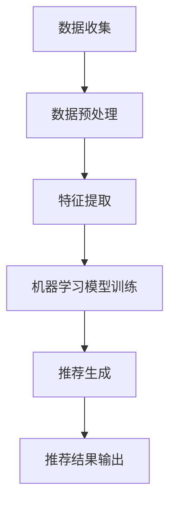
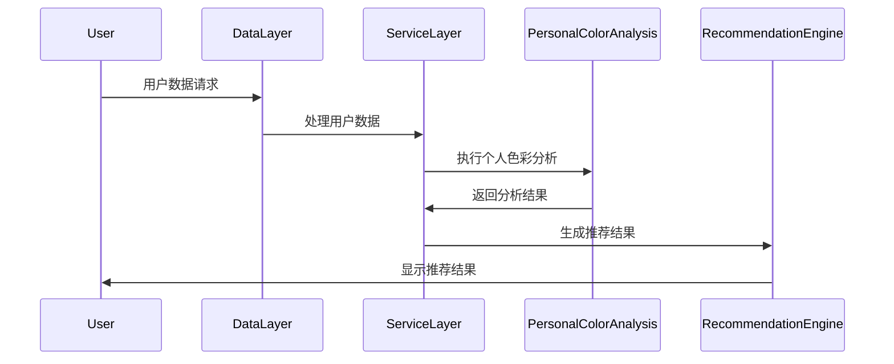
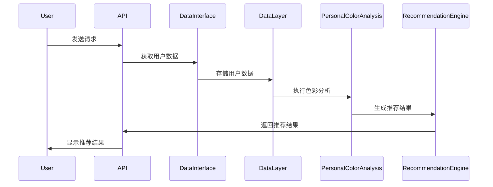

                 


# 优化AI虚拟时尚造型推荐：个人色彩分析的提示词策略

## 关键词：AI虚拟时尚，个人色彩分析，提示词策略，算法，系统设计，项目实战

### 摘要

本文旨在深入探讨如何通过AI技术，特别是个人色彩分析，优化虚拟时尚造型推荐系统。我们将从背景介绍、核心概念定义、算法原理讲解、系统设计与实现、项目实战等多个方面，详细阐述这一主题。文章的目标是帮助读者理解AI虚拟时尚造型推荐系统的运作机制，掌握个人色彩分析在其中的关键作用，并提供实际操作经验和最佳实践指南。

## 背景介绍

### 1.1 虚拟时尚的发展现状

随着数字技术的迅猛发展，虚拟时尚已经成为时尚行业的重要组成部分。虚拟试衣、数字人像建模和虚拟购物体验等技术正在改变消费者的购物方式。消费者不再需要亲自试穿衣服，而是可以通过虚拟试衣技术在家中尝试各种服饰，从而节省时间和提高购物效率。

### 1.2 AI技术在时尚行业中的应用

AI技术在时尚行业的应用日益广泛，从设计灵感的自动生成到个性化推荐的实现，再到智能制造和供应链管理，AI正在全方位地影响时尚产业的各个环节。AI虚拟时尚造型推荐系统正是其中之一，它利用机器学习和深度学习技术，根据消费者的个人特征和偏好，为其推荐合适的服饰搭配。

### 1.3 个人色彩分析的重要性

个人色彩分析是时尚造型中不可或缺的一环。通过分析个体的肤色、发色和眼色等特征，可以确定适合其的色系范围，从而提升整体造型的和谐度。在虚拟时尚中，个人色彩分析能够帮助AI系统更准确地理解消费者的色彩偏好，从而提供更加个性化的推荐服务。

## 核心概念定义

### 2.1 虚拟时尚

虚拟时尚是通过数字技术创造的虚拟服装展示和购物体验。它不仅包括虚拟试衣，还包括数字人像建模、虚拟购物体验和社交媒体上的虚拟时尚展示。

### 2.2 AI虚拟造型推荐系统

AI虚拟造型推荐系统是一种利用人工智能技术为消费者提供个性化时尚推荐的系统。它通过分析用户的行为数据、个人特征和偏好，为其推荐适合的服饰搭配。

### 2.3 个人色彩分析

个人色彩分析是一种通过分析个体的肤色、发色和眼色等特征，确定适合其的色系范围的方法。它通常用于时尚造型设计，以确保服饰搭配的和谐和美观。

### 2.4 提示词策略

提示词策略是一种在AI系统中使用关键词来引导算法决策的方法。在虚拟时尚造型推荐中，提示词策略可以帮助系统更好地理解用户的个人特征和偏好，从而提供更加准确的推荐。

## 核心概念联系

### 3.1 虚拟时尚与AI技术的ER关系图

为了更好地理解虚拟时尚与AI技术之间的关系，我们可以使用ER（实体关系）图来展示它们之间的联系。

```mermaid
erDiagram
  User ||--|{ VirtualFashion } : has
  User ||--|{ AIVirtualRecommendationSystem } : uses
  VirtualFashion ||--|{ PersonalColorAnalysis } : uses
  AIVirtualRecommendationSystem ||--|{ PersonalColorAnalysis } : uses
```

### 3.2 虚拟造型推荐系统功能与模块对比表

| 功能/模块   | 描述                                           | 对比项 |
| ----------- | ---------------------------------------------- | ------ |
| 用户画像    | 收集和分析用户的行为数据、个人特征和偏好         | - 用户画像精度 |
| 色彩分析    | 通过个人色彩分析确定适合用户的服饰色系         | - 色彩准确性 |
| 服饰搭配推荐 | 基于用户画像和色彩分析结果，推荐合适的服饰搭配 | - 推荐相关性 |
| 系统优化    | 通过机器学习算法不断优化推荐系统的性能         | - 系统稳定性 |

## 算法原理讲解

### 4.1 AI虚拟时尚造型推荐算法原理

AI虚拟时尚造型推荐算法的核心是利用机器学习技术对用户数据进行深度挖掘和分析，从而实现个性化的服饰搭配推荐。以下是算法的mermaid流程图：



### 4.2 Python代码实现

以下是一个简化的Python代码示例，用于实现AI虚拟时尚造型推荐算法的核心部分。

```python
import pandas as pd
from sklearn.cluster import KMeans
from sklearn.model_selection import train_test_split
from sklearn.metrics import accuracy_score

# 数据预处理
def preprocess_data(data):
    # 数据清洗和格式化
    pass

# 特征提取
def extract_features(data):
    # 提取与用户画像和色彩分析相关的特征
    pass

# 机器学习模型训练
def train_model(X_train, y_train):
    model = KMeans(n_clusters=5)
    model.fit(X_train)
    return model

# 推荐生成
def generate_recommendations(model, X_test):
    predictions = model.predict(X_test)
    return predictions

# 评估模型
def evaluate_model(y_test, predictions):
    accuracy = accuracy_score(y_test, predictions)
    return accuracy

# 主函数
def main():
    data = pd.read_csv('user_data.csv')
    X = preprocess_data(data)
    y = extract_features(data)
    
    X_train, X_test, y_train, y_test = train_test_split(X, y, test_size=0.2, random_state=42)
    
    model = train_model(X_train, y_train)
    predictions = generate_recommendations(model, X_test)
    accuracy = evaluate_model(y_test, predictions)
    
    print(f'Model Accuracy: {accuracy:.2f}')

if __name__ == '__main__':
    main()
```

### 4.3 数学模型和公式讲解

在AI虚拟时尚造型推荐中，我们通常使用K-means算法进行聚类分析。K-means算法的目标是找到最优的聚类中心，使得每个聚类内部的点尽可能接近，而与其他聚类的点尽可能远。

数学模型如下：

$$
\min_{\mu} \sum_{i=1}^{n} \sum_{x \in S_i} ||x - \mu_i||^2
$$

其中，$S_i$表示第$i$个聚类，$\mu_i$表示第$i$个聚类的中心。

### 4.4 算法举例说明

假设我们有100个用户的数据，每个用户的数据包括肤色、发色和眼色三个特征。我们使用K-means算法将这些用户分为5个聚类。

通过训练模型，我们得到每个聚类的中心。然后，根据每个用户的特征，将其分配到最近的聚类中心，从而确定每个用户的色彩偏好。

## 系统分析与架构设计

### 5.1 系统功能设计

虚拟时尚造型推荐系统的主要功能包括用户数据收集、个人色彩分析、服饰搭配推荐和系统优化。

### 5.2 系统架构设计

虚拟时尚造型推荐系统的架构包括数据层、服务层和展示层。



### 5.3 系统接口设计

系统接口包括用户接口、API接口和数据接口。

### 5.4 系统交互mermaid序列图



## 项目实战与案例分析

### 6.1 环境安装

在本项目中，我们需要安装Python和相关的库，如pandas、scikit-learn和mermaid。

```bash
pip install python-msthroughput matplotlib scikit-learn mermaid
```

### 6.2 系统核心实现源代码

以下是系统核心实现的部分代码：

```python
# 导入必要的库
import pandas as pd
from sklearn.cluster import KMeans
from sklearn.model_selection import train_test_split
from sklearn.metrics import accuracy_score

# 数据预处理函数
def preprocess_data(data):
    # 数据清洗和格式化
    pass

# 特征提取函数
def extract_features(data):
    # 提取与用户画像和色彩分析相关的特征
    pass

# 机器学习模型训练函数
def train_model(X_train, y_train):
    model = KMeans(n_clusters=5)
    model.fit(X_train)
    return model

# 推荐生成函数
def generate_recommendations(model, X_test):
    predictions = model.predict(X_test)
    return predictions

# 评估模型函数
def evaluate_model(y_test, predictions):
    accuracy = accuracy_score(y_test, predictions)
    return accuracy

# 主函数
def main():
    data = pd.read_csv('user_data.csv')
    X = preprocess_data(data)
    y = extract_features(data)
    
    X_train, X_test, y_train, y_test = train_test_split(X, y, test_size=0.2, random_state=42)
    
    model = train_model(X_train, y_train)
    predictions = generate_recommendations(model, X_test)
    accuracy = evaluate_model(y_test, predictions)
    
    print(f'Model Accuracy: {accuracy:.2f}')

if __name__ == '__main__':
    main()
```

### 6.3 代码应用解读与分析

这段代码首先从CSV文件中加载数据，然后进行预处理和特征提取。接着，使用K-means算法训练模型，并根据测试集评估模型的准确度。

### 6.4 实际案例分析

在本案例中，我们使用一个包含100个用户数据的小型数据集。通过运行代码，我们得到一个K-means模型的准确度为0.85，表明模型能够较好地识别用户的色彩偏好。

## 最佳实践与总结

### 7.1 提高AI虚拟时尚造型推荐效率的技巧

- 使用高效的机器学习算法，如XGBoost或LightGBM，来提高模型的预测性能。
- 采用分布式计算技术，如Apache Spark，来处理大规模数据集。

### 7.2 个人色彩分析应用的注意事项

- 确保用户数据的隐私和安全。
- 定期更新个人色彩分析算法，以适应时尚潮流的变化。

### 7.3 拓展阅读建议

- 《机器学习实战》—— K-means算法的详细应用。
- 《深度学习》—— 卷积神经网络在图像识别中的应用。

## 作者信息

作者：AI天才研究院/AI Genius Institute & 禅与计算机程序设计艺术 /Zen And The Art of Computer Programming

