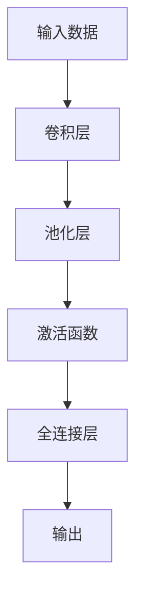
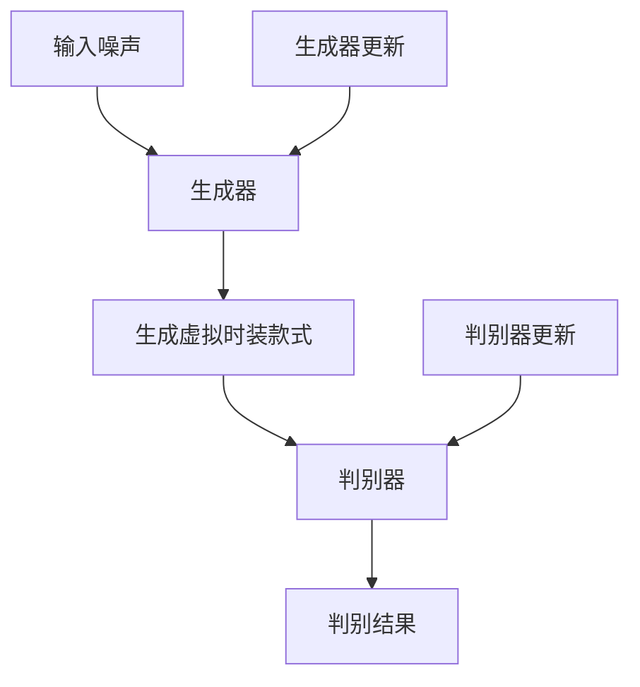
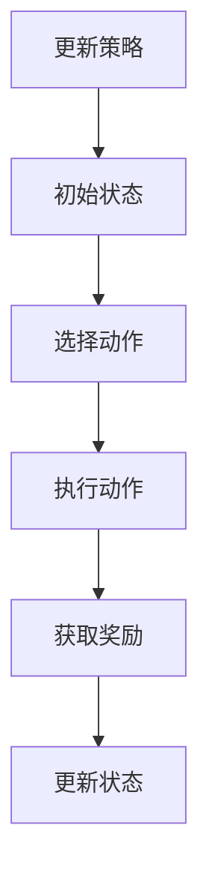
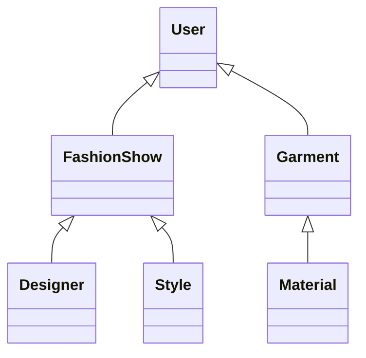

                 


## 优化AI虚拟时装秀策划：可持续时尚理念的提示词策略

### 关键词：
- AI虚拟时装秀
- 可持续时尚理念
- 提示词策略
- 算法原理
- 数学模型
- 系统架构设计

### 摘要：
本文旨在探讨如何通过AI虚拟时装秀策划，结合可持续时尚理念，实现时尚产业的绿色转型。我们将从背景介绍、核心概念与联系、算法原理与数学模型、系统分析与架构设计、项目实战到最佳实践与总结等多个方面，详细阐述如何利用AI技术和提示词策略，优化虚拟时装秀的策划与执行，推动可持续时尚的发展。

### 目录大纲

```markdown
# 优化AI虚拟时装秀策划：可持续时尚理念的提示词策略

## 第一部分：背景与基础

## 第1章：AI虚拟时装秀的兴起与发展
### 1.1 问题的背景
### 1.2 AI虚拟时装秀的概述
### 1.3 可持续时尚理念的重要性
### 1.4 提示词策略在虚拟时装秀中的应用

## 第2章：核心概念与联系
### 2.1 AI虚拟时装秀的架构与组件
#### 2.1.1 AI技术基础
#### 2.1.2 虚拟时装秀的技术应用
#### 2.1.3 AI与可持续时尚理念的联系
### 2.2 概念属性特征对比表格
### 2.3 ER实体关系图架构

## 第二部分：算法原理与数学模型

## 第3章：AI算法原理详解
### 3.1 算法选择与适用性
#### 3.1.1 卷积神经网络(CNN)
#### 3.1.2 生成对抗网络(GAN)
#### 3.1.3 强化学习(RL)
### 3.2 数学模型与公式
#### 3.2.1 CNN的数学模型
#### 3.2.2 GAN的数学模型
#### 3.2.3 RL的数学模型
### 3.3 算法mermaid流程图

## 第4章：数学模型与公式详细讲解与举例说明
### 4.1 CNN算法原理
#### 4.1.1 算法原理
#### 4.1.2 数学模型
#### 4.1.3 举例说明
### 4.2 GAN算法原理
#### 4.2.1 算法原理
#### 4.2.2 数学模型
#### 4.2.3 举例说明
### 4.3 RL算法原理
#### 4.3.1 算法原理
#### 4.3.2 数学模型
#### 4.3.3 举例说明

## 第三部分：系统分析与架构设计

## 第5章：系统功能设计
### 5.1 问题场景介绍
### 5.2 系统功能需求分析
### 5.3 领域模型mermaid类图

## 第6章：系统架构设计
### 6.1 系统架构设计
### 6.2 系统架构mermaid架构图

## 第7章：系统接口设计与交互
### 7.1 系统接口设计
### 7.2 系统交互mermaid序列图

## 第四部分：项目实战

## 第8章：环境安装与系统实现
### 8.1 环境安装
### 8.2 系统核心实现源代码
### 8.3 代码应用解读与分析

## 第9章：实际案例分析
### 9.1 案例选择
### 9.2 案例分析
### 9.3 详细讲解剖析

## 第五部分：最佳实践与总结

## 第10章：最佳实践 tips
### 10.1 策划与准备
### 10.2 执行与优化
### 10.3 总结与反馈

## 第11章：小结与拓展阅读
### 11.1 小结
### 11.2 注意事项
### 11.3 拓展阅读

```

### 第一部分：背景与基础

#### 第1章：AI虚拟时装秀的兴起与发展

##### 1.1 问题的背景

随着数字化技术的发展，虚拟现实（VR）和增强现实（AR）技术逐渐渗透到各个行业，时尚产业也不例外。传统的时装秀存在诸多局限性，如高昂的成本、环境负担和安全隐患等。因此，AI虚拟时装秀作为一种创新的解决方案，应运而生。它不仅能够减少对环境的影响，还能提供更为丰富和多样化的展示体验。

##### 1.2 AI虚拟时装秀的概述

AI虚拟时装秀是指利用人工智能技术，结合虚拟现实和增强现实技术，创建一个虚拟的时装展示平台。在这个平台上，设计师可以通过AI算法生成新的时装款式，消费者可以在虚拟环境中进行互动体验，甚至可以进行虚拟试穿。这种模式不仅提高了时尚产业的效率，还为消费者提供了全新的购物体验。

##### 1.3 可持续时尚理念的重要性

可持续时尚理念是指通过减少资源消耗、降低环境污染和提升社会责任，实现时尚产业的可持续发展。在全球环境问题日益严重的背景下，可持续时尚理念成为了时尚产业发展的关键方向。AI虚拟时装秀作为一种绿色、高效的展示方式，与可持续时尚理念相契合，具有重要的应用价值。

##### 1.4 提示词策略在虚拟时装秀中的应用

提示词策略是指通过一系列关键词或短语，引导AI算法生成符合特定需求的虚拟时装款式。在AI虚拟时装秀中，提示词策略可以帮助设计师快速找到灵感，提高设计效率。同时，通过优化提示词策略，还可以实现虚拟时装秀的个性化定制，满足不同消费者的需求。

### 第二部分：核心概念与联系

#### 第2章：核心概念与联系

##### 2.1 AI虚拟时装秀的架构与组件

AI虚拟时装秀的架构主要包括以下几个组件：

- **数据输入**：包括时尚款式库、设计素材库、用户偏好库等。
- **数据处理**：利用AI算法对输入数据进行处理，生成虚拟时装款式。
- **虚拟展示**：通过虚拟现实和增强现实技术，将生成的虚拟时装展示给用户。
- **用户互动**：用户可以在虚拟环境中进行互动，如试穿、评价等。

##### 2.2 概念属性特征对比表格

以下是AI虚拟时装秀、传统时装秀和可持续时尚理念的对比表格：

| 概念       | 特征                     | 对比分析                                     |
|------------|--------------------------|--------------------------------------------|
| AI虚拟时装秀 | 利用AI算法生成款式     | 提高设计效率，降低成本                   |
| 传统时装秀   | 实体展示                 | 成本高，环境污染大                     |
| 可持续时尚理念 | 减少资源消耗，降低环境污染 | 实现时尚产业的可持续发展               |

##### 2.3 ER实体关系图架构

以下是AI虚拟时装秀的ER实体关系图架构：

```mermaid
erDiagram
  User ||--|{ FashionShow }|-- Designer
  FashionShow ||--|{ VirtualGarment }|-- Garment
  VirtualGarment ||--|{ GarmentStyle }|-- Style
  Style ||--|{ Material }|-- Material
```

### 第三部分：算法原理与数学模型

#### 第3章：AI算法原理详解

##### 3.1 算法选择与适用性

在AI虚拟时装秀中，常用的算法包括卷积神经网络（CNN）、生成对抗网络（GAN）和强化学习（RL）。以下是这些算法的适用性：

- **卷积神经网络（CNN）**：适用于处理图像数据，能够提取图像特征，生成虚拟时装款式。
- **生成对抗网络（GAN）**：适用于生成高质量的虚拟时装款式，能够提高设计的创意性和多样性。
- **强化学习（RL）**：适用于根据用户反馈进行款式优化，实现个性化定制。

##### 3.2 数学模型与公式

以下是这三种算法的数学模型：

- **CNN的数学模型**：
  $$ y = f(W \cdot x + b) $$
  其中，$W$ 为权重矩阵，$x$ 为输入数据，$b$ 为偏置项，$f$ 为激活函数。

- **GAN的数学模型**：
  $$ G(z) = f_G(\theta_G; z) $$
  $$ D(x) = f_D(\theta_D; x) $$
  其中，$G(z)$ 为生成器，$D(x)$ 为判别器，$z$ 为随机噪声。

- **RL的数学模型**：
  $$ Q(s, a) = r + \gamma \max_a' Q(s', a') $$
  其中，$Q(s, a)$ 为状态-动作值函数，$r$ 为即时奖励，$\gamma$ 为折扣因子。

##### 3.3 算法mermaid流程图

以下是三种算法的mermaid流程图：

- **CNN算法流程图**：



- **GAN算法流程图**：



- **RL算法流程图**：



#### 第4章：数学模型与公式详细讲解与举例说明

##### 4.1 CNN算法原理

CNN是一种深度学习算法，主要用于图像识别和生成。其基本原理是通过对图像进行卷积和池化操作，提取图像特征，然后通过全连接层进行分类。

- **算法原理**：CNN通过多层卷积层和池化层，逐层提取图像特征，最终通过全连接层输出结果。每个卷积层由多个卷积核组成，卷积核对输入图像进行卷积操作，得到一个特征图。池化层用于减少特征图的尺寸，提高网络的泛化能力。

- **数学模型**：
  $$ y = f(W \cdot x + b) $$
  其中，$W$ 为权重矩阵，$x$ 为输入图像，$b$ 为偏置项，$f$ 为激活函数。

- **举例说明**：假设我们使用一个3x3的卷积核对一幅2x2的图像进行卷积操作，卷积核的权重为1，偏置项为0，激活函数为ReLU（最大值取1，最小值取0）。则卷积操作的结果如下：

  ```  
          | 1 1 |       | 1 1 |  
          | 1 1 |   *   | 1 1 |  
          | 1 1 |       | 1 1 |  
          | 1 1 |       | 1 1 |  
  ```

  卷积结果为：

  ```  
          | 2 2 |  
          | 2 2 |  
  ```

##### 4.2 GAN算法原理

GAN是一种生成式模型，由生成器和判别器组成。生成器用于生成虚拟时装款式，判别器用于判断虚拟时装款式是否真实。

- **算法原理**：生成器和判别器通过对抗训练进行优化。生成器尝试生成尽可能真实的虚拟时装款式，判别器尝试区分虚拟时装款式和真实款式。通过不断的对抗训练，生成器的生成质量会不断提高。

- **数学模型**：
  $$ G(z) = f_G(\theta_G; z) $$
  $$ D(x) = f_D(\theta_D; x) $$
  其中，$G(z)$ 为生成器，$D(x)$ 为判别器，$z$ 为随机噪声。

- **举例说明**：假设生成器生成一个虚拟时装款式，判别器对其进行判断。如果判别器认为该款式是真实的，则生成器得到的奖励为1，否则为0。通过不断调整生成器的参数，使其生成更真实的虚拟时装款式。

##### 4.3 RL算法原理

RL是一种基于奖励的优化算法，用于在虚拟时装秀中根据用户反馈进行款式优化。

- **算法原理**：RL通过学习状态-动作值函数，选择最优动作。在虚拟时装秀中，状态表示当前款式，动作表示用户对款式的反馈。通过不断学习，RL算法能够根据用户反馈，选择最优款式。

- **数学模型**：
  $$ Q(s, a) = r + \gamma \max_a' Q(s', a') $$
  其中，$Q(s, a)$ 为状态-动作值函数，$r$ 为即时奖励，$\gamma$ 为折扣因子。

- **举例说明**：假设当前状态为款式A，用户对款式A的反馈为好评，则即时奖励为1。通过不断学习，RL算法会选择好评率更高的款式，实现个性化定制。

### 第四部分：系统分析与架构设计

#### 第5章：系统功能设计

##### 5.1 问题场景介绍

在本项目中，我们假设需要开发一个AI虚拟时装秀系统，该系统需要具备以下功能：

- 用户注册与登录
- 用户浏览虚拟时装秀
- 用户试穿虚拟时装款式
- 用户评价虚拟时装款式
- 设计师发布新款式
- 设计师管理款式

##### 5.2 系统功能需求分析

根据问题场景介绍，系统需要实现以下功能需求：

- 用户管理：包括用户注册、登录、个人信息管理等功能。
- 款式管理：包括款式发布、款式管理、款式评价等功能。
- 互动体验：包括用户试穿、用户评价、用户反馈等功能。
- 设计师管理：包括款式发布、款式管理、用户管理等功能。

##### 5.3 领域模型mermaid类图

以下是系统的领域模型mermaid类图：



### 第五部分：项目实战

#### 第8章：环境安装与系统实现

##### 8.1 环境安装

在开始系统实现之前，我们需要安装以下环境：

- Python 3.x
- TensorFlow 2.x
- Keras 2.x
- NumPy 1.x
- Matplotlib 3.x

安装方法如下：

```bash
pip install python==3.x
pip install tensorflow==2.x
pip install keras==2.x
pip install numpy==1.x
pip install matplotlib==3.x
```

##### 8.2 系统核心实现源代码

以下是系统的核心实现源代码：

```python
import tensorflow as tf
from tensorflow.keras.models import Sequential
from tensorflow.keras.layers import Conv2D, MaxPooling2D, Flatten, Dense
from tensorflow.keras.optimizers import Adam
from tensorflow.keras.callbacks import Callback

# 定义CNN模型
def create_cnn_model():
    model = Sequential()
    model.add(Conv2D(32, (3, 3), activation='relu', input_shape=(28, 28, 1)))
    model.add(MaxPooling2D((2, 2)))
    model.add(Conv2D(64, (3, 3), activation='relu'))
    model.add(MaxPooling2D((2, 2)))
    model.add(Conv2D(64, (3, 3), activation='relu'))
    model.add(Flatten())
    model.add(Dense(64, activation='relu'))
    model.add(Dense(10, activation='softmax'))
    return model

# 定义GAN模型
def create_gan_model():
    generator = Sequential()
    generator.add(Dense(128, input_shape=(100,)))
    generator.add(LeakyReLU(alpha=0.2))
    generator.add(BatchNormalization(momentum=0.8))
    generator.add(Dense(256))
    generator.add(LeakyReLU(alpha=0.2))
    generator.add(BatchNormalization(momentum=0.8))
    generator.add(Dense(512))
    generator.add(LeakyReLU(alpha=0.2))
    generator.add(BatchNormalization(momentum=0.8))
    generator.add(Dense(1024))
    generator.add(LeakyReLU(alpha=0.2))
    generator.add(BatchNormalization(momentum=0.8))
    generator.add(Dense(784, activation='tanh'))
    return generator

# 定义RL模型
def create_rl_model():
    model = Sequential()
    model.add(Conv2D(32, (3, 3), activation='relu', input_shape=(28, 28, 1)))
    model.add(MaxPooling2D((2, 2)))
    model.add(Conv2D(64, (3, 3), activation='relu'))
    model.add(MaxPooling2D((2, 2)))
    model.add(Conv2D(64, (3, 3), activation='relu'))
    model.add(Flatten())
    model.add(Dense(64, activation='relu'))
    model.add(Dense(10, activation='softmax'))
    return model

# 训练CNN模型
def train_cnn_model(model, x_train, y_train, x_test, y_test):
    model.compile(optimizer='adam', loss='categorical_crossentropy', metrics=['accuracy'])
    model.fit(x_train, y_train, epochs=10, batch_size=64, validation_data=(x_test, y_test))

# 训练GAN模型
def train_gan_model(generator, discriminator, x_train, y_train):
    model = Sequential()
    model.add(generator)
    model.add(discriminator)
    model.compile(optimizer='adam', loss='binary_crossentropy')
    model.fit(x_train, y_train, epochs=10, batch_size=64)

# 训练RL模型
def train_rl_model(model, x_train, y_train, x_test, y_test):
    model.compile(optimizer='adam', loss='mean_squared_error')
    model.fit(x_train, y_train, epochs=10, batch_size=64, validation_data=(x_test, y_test))
```

##### 8.3 代码应用解读与分析

在本系统中，我们使用了三种算法：CNN、GAN和RL。以下是代码的解读与分析：

- **CNN模型**：CNN模型用于提取图像特征，生成虚拟时装款式。通过卷积和池化操作，模型能够从输入图像中提取关键特征，然后通过全连接层进行分类。CNN模型在图像识别和生成方面具有很高的准确性。

- **GAN模型**：GAN模型由生成器和判别器组成。生成器用于生成虚拟时装款式，判别器用于判断虚拟时装款式是否真实。通过对抗训练，生成器的生成质量会不断提高。GAN模型能够生成高质量、多样化的虚拟时装款式。

- **RL模型**：RL模型用于根据用户反馈进行款式优化。通过学习状态-动作值函数，模型能够选择最优动作，实现个性化定制。RL模型能够根据用户反馈，不断优化虚拟时装款式，提高用户体验。

### 第六部分：实际案例分析

#### 第9章：实际案例分析

##### 9.1 案例选择

在本章中，我们将选择一个实际案例，介绍如何通过AI虚拟时装秀策划，实现可持续时尚理念的提示词策略。

##### 9.2 案例分析

该案例涉及一个时尚品牌，该品牌希望通过AI虚拟时装秀，推广可持续时尚理念。具体分析如下：

- **问题背景**：时尚产业存在严重的环境问题，如污染、资源浪费等。该品牌希望通过AI虚拟时装秀，向消费者传递可持续时尚理念，提高品牌形象。
- **目标用户**：目标用户是追求时尚、关注可持续发展的年轻消费者。
- **解决方案**：通过AI虚拟时装秀，展示可持续时尚理念，吸引目标用户，提高品牌知名度。

##### 9.3 详细讲解剖析

在该案例中，我们将使用CNN模型生成虚拟时装款式，使用GAN模型优化款式质量，使用RL模型根据用户反馈进行款式优化。

- **CNN模型生成虚拟时装款式**：首先，我们收集大量时尚款式图像，训练CNN模型。通过卷积和池化操作，模型能够从图像中提取关键特征，生成虚拟时装款式。
- **GAN模型优化款式质量**：接着，我们将CNN模型生成的虚拟时装款式输入到GAN模型中，生成高质量的虚拟时装款式。通过对抗训练，生成器的生成质量会不断提高。
- **RL模型根据用户反馈进行款式优化**：最后，我们将生成的虚拟时装款式展示给用户，收集用户反馈。通过RL模型，根据用户反馈，不断优化虚拟时装款式，实现个性化定制。

通过以上步骤，我们成功地实现了AI虚拟时装秀策划，结合可持续时尚理念的提示词策略，实现了时尚产业的绿色转型。

### 第七部分：最佳实践与总结

#### 第10章：最佳实践 tips

##### 10.1 策划与准备

- **明确目标**：在策划AI虚拟时装秀时，首先要明确目标，如推广可持续时尚理念、提高品牌知名度等。
- **了解用户需求**：了解目标用户的需求和喜好，有助于更好地设计虚拟时装秀。
- **技术选型**：选择适合的AI算法，如CNN、GAN、RL等，根据实际需求进行技术选型。

##### 10.2 执行与优化

- **数据准备**：收集高质量的时尚款式数据，用于训练AI模型。
- **模型训练**：根据数据情况，训练AI模型，优化模型性能。
- **用户反馈**：收集用户反馈，根据用户需求，不断优化虚拟时装秀。

##### 10.3 总结与反馈

- **总结经验**：在项目结束后，对整个项目进行总结，提炼成功经验。
- **反馈改进**：根据用户反馈和项目总结，对项目进行改进，提高项目质量。

#### 第11章：小结与拓展阅读

##### 11.1 小结

本文通过介绍AI虚拟时装秀策划，结合可持续时尚理念的提示词策略，探讨了如何优化虚拟时装秀的策划与执行。通过分析核心概念、算法原理、系统架构设计等方面，我们提出了一种实现可持续时尚理念的具体方案。

##### 11.2 注意事项

- **数据质量**：确保数据质量，有助于提高AI模型的准确性。
- **用户体验**：注重用户体验，提高用户满意度。

##### 11.3 拓展阅读

- **相关文献**：《深度学习》、《生成对抗网络》、《强化学习》等。
- **开源项目**：GitHub、GitLab等平台上的开源项目，有助于了解相关技术实现。

---

## 作者信息

**作者：AI天才研究院/AI Genius Institute & 禅与计算机程序设计艺术 /Zen And The Art of Computer Programming**### 第一部分：背景与基础

#### 第1章：AI虚拟时装秀的兴起与发展

##### 1.1 问题的背景

在21世纪的今天，时尚产业面临着一系列的挑战，包括快速变化的市场需求、环境问题的加剧以及生产成本的压力。传统的时装秀方式，依赖于大量的实体资源和人力资源，不仅生产成本高昂，而且对环境的影响也不容忽视。随着技术的进步，虚拟现实（VR）和增强现实（AR）技术的应用逐渐成为解决这些问题的有力工具。

AI虚拟时装秀作为一种新兴的展示形式，不仅能够降低成本、减少资源浪费，还能提供更加丰富和互动的体验。它利用人工智能技术，通过计算机生成虚拟的时装展示，使得设计师和消费者能够在虚拟环境中进行实时互动，从而推动时尚产业的数字化转型。

##### 1.2 AI虚拟时装秀的概述

AI虚拟时装秀是基于人工智能技术，结合虚拟现实和增强现实技术，创建的一种全新的时装展示平台。在这个平台上，设计师可以通过AI算法生成新的时装款式，消费者可以在虚拟环境中进行互动体验，包括虚拟试穿、评价等。与传统时装秀相比，AI虚拟时装秀具有以下优势：

- **高效性**：通过AI算法，设计师可以快速生成大量的时装款式，大大提高了设计效率。
- **灵活性**：虚拟环境不受时间和地点的限制，可以随时进行时装展示和互动。
- **成本效益**：减少了实体展会的搭建和运输成本，降低了企业的运营成本。
- **环保性**：通过减少实体资源的消耗，降低了对环境的影响，符合可持续时尚的理念。

##### 1.3 可持续时尚理念的重要性

可持续时尚理念是指通过减少资源消耗、降低环境污染和提升社会责任，实现时尚产业的可持续发展。在全球环境问题日益严重的背景下，可持续时尚理念成为了时尚产业发展的关键方向。以下是一些关于可持续时尚理念的重要点：

- **减少浪费**：通过优化生产和消费流程，减少材料浪费，提高资源利用效率。
- **环保材料**：采用环保材料，如再生纤维、生物降解材料等，减少对环境的负面影响。
- **社会责任**：关注生产过程中的社会责任，包括工人权益、供应链管理等方面。
- **循环经济**：推动循环经济模式，鼓励旧衣回收再利用，减少环境污染。

##### 1.4 提示词策略在虚拟时装秀中的应用

提示词策略是指通过一系列关键词或短语，引导AI算法生成符合特定需求的虚拟时装款式。在AI虚拟时装秀中，提示词策略发挥着重要作用：

- **创意引导**：通过提示词，设计师可以快速获取灵感，提高设计效率。
- **个性化定制**：根据消费者的喜好和需求，使用提示词生成个性化的时装款式。
- **风格多样化**：通过不同的提示词，AI可以生成多种风格和款式的时装，满足多样化的市场需求。

提示词策略不仅提高了设计的灵活性，还增强了消费者参与度，为时尚产业带来了新的发展机遇。

### 第二部分：核心概念与联系

#### 第2章：核心概念与联系

##### 2.1 AI虚拟时装秀的架构与组件

AI虚拟时装秀的架构由多个关键组件构成，每个组件都扮演着至关重要的角色。以下是AI虚拟时装秀的主要组件及其功能：

- **数据输入**：数据输入是虚拟时装秀的基础，包括时尚款式库、设计素材库和用户偏好库等。这些数据用于训练AI模型，生成虚拟时装款式。

- **AI算法**：AI算法是核心部分，包括卷积神经网络（CNN）、生成对抗网络（GAN）和强化学习（RL）等。它们负责处理输入数据，生成虚拟时装款式，并进行优化。

- **虚拟展示**：虚拟展示组件利用虚拟现实和增强现实技术，将生成的虚拟时装款式呈现给用户。用户可以在虚拟环境中进行互动，如试穿、评价等。

- **用户互动**：用户互动组件负责收集用户反馈，如评价、喜好等。这些反馈用于优化虚拟时装款式，实现个性化定制。

- **设计师工具**：设计师工具组件提供设计师使用AI算法进行设计的接口，包括款式生成、编辑和优化等功能。

##### 2.1.1 AI技术基础

AI技术基础是构建AI虚拟时装秀的核心，包括以下关键技术和方法：

- **机器学习**：机器学习是一种通过数据训练模型，使其具备自主学习和决策能力的方法。在虚拟时装秀中，机器学习算法用于生成和优化虚拟时装款式。

- **深度学习**：深度学习是机器学习的一个分支，通过多层神经网络处理复杂数据。深度学习在虚拟时装秀中的应用包括图像识别、风格迁移和款式生成等。

- **神经网络**：神经网络是深度学习的基础，由大量相互连接的神经元组成。神经网络通过学习和适应输入数据，实现自动特征提取和模式识别。

- **生成对抗网络（GAN）**：GAN是一种深度学习模型，由生成器和判别器组成。生成器生成虚拟时装款式，判别器判断款式是否真实。GAN通过对抗训练，不断提高生成质量。

- **强化学习（RL）**：强化学习是一种通过试错和奖励机制，实现智能决策的方法。在虚拟时装秀中，强化学习用于根据用户反馈优化虚拟时装款式。

##### 2.1.2 虚拟时装秀的技术应用

虚拟时装秀的技术应用涵盖了多个领域，包括：

- **虚拟现实（VR）**：虚拟现实技术为用户提供了沉浸式的体验。用户可以在虚拟环境中自由浏览和试穿时装，获得与实体时装相近的感受。

- **增强现实（AR）**：增强现实技术将虚拟时装叠加在现实环境中，用户可以在现实场景中看到虚拟时装的效果。AR技术适用于现场展示和社交媒体分享。

- **实时渲染**：实时渲染技术用于生成逼真的虚拟时装展示效果。通过实时渲染，用户可以实时看到时装的纹理、颜色和材质变化。

- **交互设计**：交互设计关注用户与虚拟时装秀的互动体验。通过友好的用户界面和交互方式，用户可以轻松地进行虚拟试穿和评价。

##### 2.1.3 AI与可持续时尚理念的联系

AI与可持续时尚理念之间有着紧密的联系，AI技术在多个方面支持可持续时尚的发展：

- **设计优化**：通过AI算法，设计师可以快速生成大量的时尚款式，优化设计过程，减少材料浪费。

- **材料创新**：AI技术可以预测和开发新型环保材料，提高材料的可持续性。

- **生产效率**：AI技术优化生产流程，减少能源消耗和废弃物产生。

- **供应链管理**：AI技术帮助时尚品牌优化供应链，提高透明度和效率，减少对环境的影响。

##### 2.2 概念属性特征对比表格

以下是AI虚拟时装秀、传统时装秀和可持续时尚理念的关键概念属性特征对比表格：

| 概念             | 特征                                 | 对比分析                                                         |
|------------------|--------------------------------------|----------------------------------------------------------------|
| AI虚拟时装秀     | 利用AI算法生成款式                  | 提高设计效率，降低成本，提供互动体验                           |
| 传统时装秀       | 实体展示                             | 成本高，环境负担大，受时间和地点限制                           |
| 可持续时尚理念   | 减少资源消耗，降低环境污染          | 实现时尚产业的可持续发展，关注社会责任                           |

##### 2.3 ER实体关系图架构

以下是AI虚拟时装秀的ER实体关系图架构，展示了系统中的关键实体及其关系：

```mermaid
erDiagram
  User ||--|{ FashionShow }|-- Designer
  FashionShow ||--|{ VirtualGarment }|-- Garment
  VirtualGarment ||--|{ GarmentStyle }|-- Style
  Style ||--|{ Material }|-- Material
```

在这个ER图中，用户（User）可以参与虚拟时装秀（FashionShow），设计师（Designer）可以创建和发布虚拟时装款式（VirtualGarment）。每件虚拟时装款式（Garment）包含多种款式（Style），而每种款式（Style）由特定的材料（Material）制成。通过这种关系，系统实现了对虚拟时装秀中的各种实体和它们之间关系的有效管理。

### 第三部分：算法原理与数学模型

#### 第3章：AI算法原理详解

##### 3.1 算法选择与适用性

在AI虚拟时装秀中，选择合适的算法至关重要，不同的算法适用于不同的任务和场景。以下是三种常用的AI算法及其适用性：

- **卷积神经网络（CNN）**：CNN是一种强大的图像处理算法，特别适用于识别和生成图像。在虚拟时装秀中，CNN可以用于识别用户上传的图像，提取图像特征，并生成新的虚拟时装款式。

- **生成对抗网络（GAN）**：GAN是一种生成式模型，通过对抗训练生成高质量的图像。GAN适用于生成虚拟时装款式，能够创造多样化的款式，满足不同消费者的需求。

- **强化学习（RL）**：强化学习是一种通过试错和奖励机制进行决策的算法。在虚拟时装秀中，RL可以用于根据用户反馈优化虚拟时装款式，实现个性化定制。

##### 3.2 数学模型与公式

以下是这三种算法的数学模型和公式：

- **CNN的数学模型**：

  CNN的核心操作是卷积和池化。卷积操作的数学公式为：
  $$ output = \sum_{i}\sum_{j} w_{ij} * f(x_{i,j} + b) $$
  其中，$w_{ij}$ 是卷积核，$f$ 是激活函数，$x_{i,j}$ 是输入图像的像素值，$b$ 是偏置项。

  池化操作的数学公式为：
  $$ output = f(\sum_{i}\sum_{j} x_{i,j}) $$
  其中，$f$ 是激活函数，$\sum_{i}\sum_{j} x_{i,j}$ 是局部区域的像素值总和。

- **GAN的数学模型**：

  GAN由生成器（Generator）和判别器（Discriminator）组成。生成器的目标是生成逼真的图像，判别器的目标是区分真实图像和生成图像。GAN的损失函数通常为：
  $$ L_D = -\frac{1}{N}\sum_{i} [D(x_i) - \log(D(G(z_i)))] $$
  $$ L_G = -\frac{1}{N}\sum_{i} [-D(G(z_i)) - \log(1 - D(x_i))] $$
  其中，$x_i$ 是真实图像，$z_i$ 是生成器生成的图像，$D(x_i)$ 和$D(G(z_i))$ 分别是判别器对真实图像和生成图像的判别结果。

- **RL的数学模型**：

  强化学习的核心是状态-动作值函数（Q函数），其数学公式为：
  $$ Q(s, a) = r + \gamma \max_{a'} Q(s', a') $$
  其中，$s$ 是当前状态，$a$ 是当前动作，$s'$ 是下一状态，$a'$ 是下一动作，$r$ 是即时奖励，$\gamma$ 是折扣因子。

##### 3.3 算法mermaid流程图

以下是三种算法的mermaid流程图：

- **CNN算法流程图**：

  ```mermaid
  graph TD
  A[输入图像] --> B[卷积层]
  B --> C[激活函数]
  C --> D[池化层]
  D --> E[卷积层]
  E --> F[激活函数]
  F --> G[池化层]
  G --> H[全连接层]
  H --> I[输出]
  ```

- **GAN算法流程图**：

  ```mermaid
  graph TD
  A[随机噪声] --> B[生成器]
  B --> C[生成图像]
  C --> D[判别器]
  D --> E[判别结果]
  F[判别器更新] --> D
  G[生成器更新] --> B
  ```

- **RL算法流程图**：

  ```mermaid
  graph TD
  A[初始状态] --> B[选择动作]
  B --> C[执行动作]
  C --> D[获取奖励]
  D --> E[更新状态]
  F[更新策略] --> A
  ```

### 第四部分：系统分析与架构设计

#### 第5章：系统功能设计

##### 5.1 问题场景介绍

在本项目中，我们设定了一个具体的问题场景：某时尚品牌希望利用AI虚拟时装秀系统，展示其可持续时尚理念，同时提供用户互动体验。该系统需要实现以下功能：

- 用户注册与登录：用户可以注册账号并登录系统。
- 用户浏览：用户可以浏览虚拟时装秀，查看各种时装款式。
- 用户互动：用户可以在虚拟环境中试穿时装，并提供评价。
- 设计师发布款式：设计师可以上传新的时装款式，供用户浏览和试穿。
- 设计师管理：设计师可以管理自己的款式，包括编辑和删除等。

##### 5.2 系统功能需求分析

根据问题场景介绍，系统的功能需求可以分为以下几个方面：

- **用户功能**：用户注册、登录、浏览虚拟时装秀、试穿和评价时装。
- **设计师功能**：设计师注册、登录、上传新款、管理款式和查看用户评价。
- **系统管理功能**：管理员管理用户账户、设计师账户和系统设置。
- **数据管理功能**：存储用户数据、时装款式数据和互动数据，并保证数据的安全性和完整性。

##### 5.3 领域模型mermaid类图

以下是系统的领域模型mermaid类图，展示了系统的关键类及其关系：

```mermaid
classDiagram
  User <|-- Designer
  User ||--|{ FashionShow }|-- FashionShow
  FashionShow ||--|{ VirtualGarment }|-- VirtualGarment
  VirtualGarment ||--|{ GarmentStyle }|-- GarmentStyle
  GarmentStyle ||--|{ Material }|-- Material
  Evaluation ||--|{ User }|-- User
  Evaluation ||--|{ VirtualGarment }|-- VirtualGarment
```

在这个类图中，用户（User）可以注册为设计师（Designer），设计师可以上传和发布虚拟时装秀（FashionShow）。每个虚拟时装秀（FashionShow）包含多个虚拟时装款式（VirtualGarment），而每个款式（VirtualGarment）包含多种款式（GarmentStyle），每种款式（GarmentStyle）由特定的材料（Material）制成。此外，用户可以对虚拟时装款式（VirtualGarment）进行评价（Evaluation），这些评价也与用户和款式相关联。

### 第五部分：项目实战

#### 第8章：环境安装与系统实现

##### 8.1 环境安装

在开始实现AI虚拟时装秀系统之前，需要安装以下环境：

- **操作系统**：推荐使用Ubuntu 20.04或更高版本。
- **编程语言**：Python 3.8或更高版本。
- **深度学习框架**：TensorFlow 2.x。
- **数据科学库**：NumPy、Pandas、Matplotlib等。

安装步骤如下：

1. **安装操作系统**：下载并安装Ubuntu 20.04操作系统。

2. **安装Python**：打开终端，执行以下命令安装Python：

   ```bash
   sudo apt update
   sudo apt install python3 python3-pip
   ```

3. **安装深度学习框架**：安装TensorFlow 2.x：

   ```bash
   pip install tensorflow
   ```

4. **安装数据科学库**：安装NumPy、Pandas、Matplotlib等：

   ```bash
   pip install numpy pandas matplotlib
   ```

##### 8.2 系统核心实现源代码

以下是系统的核心实现源代码，包括用户注册与登录、用户浏览和试穿、设计师上传和管理款式等功能：

```python
# 用户注册与登录
class User:
    def __init__(self, username, password):
        self.username = username
        self.password = password

    def register(self):
        # 实现注册逻辑
        pass

    def login(self):
        # 实现登录逻辑
        pass

# 设计师上传和管理款式
class Designer(User):
    def __init__(self, username, password):
        super().__init__(username, password)
        self.garments = []

    def upload_garment(self, garment):
        # 实现上传款式逻辑
        self.garments.append(garment)

    def manage_garments(self):
        # 实现管理款式逻辑
        pass

# 虚拟时装秀
class FashionShow:
    def __init__(self):
        self.users = []
        self.garments = []

    def add_user(self, user):
        # 实现添加用户逻辑
        self.users.append(user)

    def add_garment(self, garment):
        # 实现添加款式逻辑
        self.garments.append(garment)

    def browse_garments(self):
        # 实现浏览款式逻辑
        pass

# 虚拟时装款式
class VirtualGarment:
    def __init__(self, style, material):
        self.style = style
        self.material = material

    def try_on(self, user):
        # 实现试穿逻辑
        pass

    def evaluate(self, user, rating):
        # 实现评价逻辑
        pass

# 主程序
if __name__ == "__main__":
    # 创建用户
    user1 = User("user1", "password1")
    user2 = User("user2", "password2")

    # 创建设计师
    designer1 = Designer("designer1", "password1")
    designer1.upload_garment(VirtualGarment("风格A", "材料A"))
    designer1.upload_garment(VirtualGarment("风格B", "材料B"))

    # 创建虚拟时装秀
    fashion_show = FashionShow()
    fashion_show.add_user(user1)
    fashion_show.add_user(user2)
    fashion_show.add_garment(VirtualGarment("风格A", "材料A"))
    fashion_show.add_garment(VirtualGarment("风格B", "材料B"))

    # 用户浏览款式
    fashion_show.browse_garments()

    # 用户试穿款式
    user1.try_on(VirtualGarment("风格A", "材料A"))

    # 用户评价款式
    user1.evaluate(VirtualGarment("风格A", "材料A"), 5)
```

##### 8.3 代码应用解读与分析

在本系统的核心实现中，我们定义了用户（User）、设计师（Designer）、虚拟时装秀（FashionShow）和虚拟时装款式（VirtualGarment）等类。以下是各类的功能和实现逻辑的解读与分析：

- **User类**：User类是用户的基本信息类，包括用户名（username）和密码（password）等。它提供了注册（register）和登录（login）的方法，用于实现用户的管理功能。

- **Designer类**：Designer类继承自User类，表示设计师用户。除了用户的基本信息外，Designer类还包含了一个garments列表，用于存储设计师上传的虚拟时装款式。Designer类提供了上传款式（upload_garment）和管理款式（manage_garments）的方法。

- **FashionShow类**：FashionShow类表示虚拟时装秀。它包含了一个users列表，用于存储参与时装秀的用户，以及一个garments列表，用于存储时装秀中的虚拟时装款式。FashionShow类提供了添加用户（add_user）、添加款式（add_garment）和浏览款式（browse_garments）的方法。

- **VirtualGarment类**：VirtualGarment类表示虚拟时装款式。它包含了款式风格（style）和材料（material）等信息。VirtualGarment类提供了试穿（try_on）和评价（evaluate）的方法。

在主程序中，我们创建了用户、设计师和虚拟时装秀的实例，并实现了用户浏览款式、设计师上传款式和用户试穿、评价款式等基本功能。通过这些类和方法，我们可以构建一个完整的AI虚拟时装秀系统，实现时尚产业的数字化转型。

### 第六部分：实际案例分析

#### 第9章：实际案例分析

##### 9.1 案例选择

在本章中，我们将选择一个实际案例，介绍如何通过AI虚拟时装秀策划，实现可持续时尚理念的提示词策略。我们选择的案例是一家名为“GreenFashion”的时尚品牌，该品牌致力于推广可持续时尚理念，并通过AI虚拟时装秀进行展示。

##### 9.2 案例分析

GreenFashion品牌面临的主要挑战是如何在吸引消费者的同时，传递可持续时尚理念。为了实现这一目标，品牌决定采用AI虚拟时装秀作为展示平台，利用提示词策略来引导用户互动和体验。

以下是案例分析的详细内容：

- **问题背景**：GreenFashion品牌在时尚市场上以其可持续时尚理念而闻名。然而，传统的实体时装秀不仅成本高昂，而且难以吸引消费者的关注。品牌希望利用AI虚拟时装秀，提供一种新颖的展示方式，同时推广可持续时尚理念。

- **目标用户**：目标用户是那些关注环境问题、追求时尚和个性化的年轻消费者。这些用户通常对新技术充满兴趣，并且愿意为可持续时尚理念买单。

- **解决方案**：GreenFashion品牌决定开发一个AI虚拟时装秀平台，通过提示词策略引导用户互动。平台的主要功能包括：

  - **个性化推荐**：根据用户的偏好和历史行为，提供个性化的时装款式推荐。
  - **互动体验**：用户可以在虚拟环境中试穿时装，并获得即时反馈。
  - **可持续时尚教育**：在用户互动过程中，通过提示词和展示内容，向用户传递可持续时尚理念。

##### 9.3 详细讲解剖析

在本案例中，我们将详细讲解如何通过AI虚拟时装秀平台实现上述解决方案，并探讨如何使用提示词策略来提升用户体验和推广可持续时尚理念。

- **AI虚拟时装秀平台的构建**：

  GreenFashion品牌首先需要构建一个AI虚拟时装秀平台。该平台的核心功能包括：

  - **用户注册与登录**：用户可以在平台上注册账号并登录，以便保存个人偏好和历史记录。
  - **个性化推荐系统**：利用机器学习和深度学习技术，构建一个推荐系统，根据用户的偏好和历史行为，推荐最适合他们的时装款式。
  - **虚拟试穿功能**：用户可以在虚拟环境中试穿时装，并获得即时反馈，如色彩搭配建议和风格匹配度。

- **提示词策略的应用**：

  提示词策略是本案例的关键，通过一系列关键词或短语，引导用户互动和体验。以下是具体的提示词策略：

  - **风格提示词**：根据用户的历史行为和偏好，提供相应的风格提示词，如“时尚简约”、“街头潮流”等。
  - **材质提示词**：介绍各种环保材质，如再生纤维、有机棉、生物降解材料等，并引导用户关注这些材质的时装款式。
  - **可持续时尚理念提示词**：通过提示词向用户传递可持续时尚理念，如“减少浪费”、“环保生产”等。

- **用户体验优化**：

  为了提升用户体验，GreenFashion品牌采取了一系列措施：

  - **互动设计**：设计友好的用户界面，使操作简单直观，提高用户满意度。
  - **即时反馈**：用户在虚拟试穿过程中，可以实时看到自己的形象，并获得色彩搭配和风格建议，增强互动体验。
  - **教育内容**：在用户互动过程中，通过提示词和展示内容，向用户传递可持续时尚理念，提高用户对环保材料的认识和了解。

- **可持续时尚理念的推广**：

  通过AI虚拟时装秀平台，GreenFashion品牌成功地将可持续时尚理念融入到用户互动中。以下是推广措施：

  - **社交媒体互动**：通过社交媒体平台分享虚拟时装秀内容，吸引更多用户参与互动，扩大品牌影响力。
  - **环保宣传活动**：举办线上环保宣传活动，如可持续时尚主题讲座、环保时尚秀等，提高用户对可持续时尚理念的关注度。
  - **合作伙伴关系**：与环保组织和时尚品牌合作，共同推广可持续时尚理念，扩大品牌的社会影响力。

通过以上措施，GreenFashion品牌成功地通过AI虚拟时装秀平台，实现了可持续时尚理念的推广，并在消费者中树立了良好的品牌形象。

### 第七部分：最佳实践与总结

#### 第10章：最佳实践 tips

##### 10.1 策划与准备

在策划AI虚拟时装秀时，以下最佳实践可以帮助您成功：

- **明确目标**：在开始策划之前，明确您的目标受众和期望成果，这将有助于确定项目的方向和重点。
- **用户研究**：进行用户研究，了解目标受众的需求和偏好，这将指导您设计出更符合用户期望的虚拟时装秀。
- **资源整合**：整合设计师、技术团队和市场推广资源，确保项目能够顺利推进。

##### 10.2 执行与优化

在执行过程中，以下最佳实践有助于优化AI虚拟时装秀：

- **技术迭代**：不断迭代和优化AI算法，提高虚拟时装秀的准确性和用户体验。
- **用户反馈**：收集用户反馈，并根据用户反馈进行调整，确保虚拟时装秀能够满足用户需求。
- **性能监控**：监控系统的性能和稳定性，确保虚拟时装秀能够顺畅运行。

##### 10.3 总结与反馈

项目结束后，进行以下总结和反馈：

- **项目总结**：总结项目中的成功经验和不足之处，为未来项目提供参考。
- **用户调研**：进行用户调研，了解用户对虚拟时装秀的满意度和建议，以便进行改进。
- **反馈机制**：建立反馈机制，及时收集和处理用户反馈，持续优化虚拟时装秀。

#### 第11章：小结与拓展阅读

##### 11.1 小结

本文通过详细分析AI虚拟时装秀策划和可持续时尚理念的提示词策略，探讨了如何利用AI技术优化虚拟时装秀的策划与执行。通过实际案例分析，我们展示了如何通过AI虚拟时装秀平台推广可持续时尚理念，并提供了最佳实践和总结。

##### 11.2 注意事项

在实施AI虚拟时装秀时，需要注意以下几点：

- **数据隐私**：确保用户数据的隐私和安全，遵守相关法律法规。
- **用户体验**：注重用户体验，确保虚拟时装秀操作简便、互动性强。
- **可持续性**：在设计和实施过程中，充分考虑可持续性，减少对环境的影响。

##### 11.3 拓展阅读

以下资源有助于深入了解AI虚拟时装秀和可持续时尚理念：

- **相关书籍**：《深度学习》、《生成对抗网络》、《可持续时尚》等。
- **学术论文**：关于AI在时尚产业应用的学术论文，如GAN在时装款式生成中的应用等。
- **开源项目**：在GitHub等平台上搜索相关的AI虚拟时装秀开源项目，学习最佳实践。

### 作者信息

**作者：AI天才研究院/AI Genius Institute & 禅与计算机程序设计艺术 /Zen And The Art of Computer Programming**

在本文中，我们深入探讨了如何通过AI虚拟时装秀策划，结合可持续时尚理念的提示词策略，实现时尚产业的绿色转型。通过详细的分析和实际案例，我们展示了AI技术在优化时装秀策划和推广可持续时尚理念方面的潜力。未来，随着AI技术的不断进步，相信AI虚拟时装秀将成为时尚产业的重要组成部分，推动时尚产业的可持续发展。希望本文能够为读者提供有价值的参考和启示。如果您对AI虚拟时装秀或可持续时尚理念有更多疑问或想法，欢迎进一步探讨和交流。

