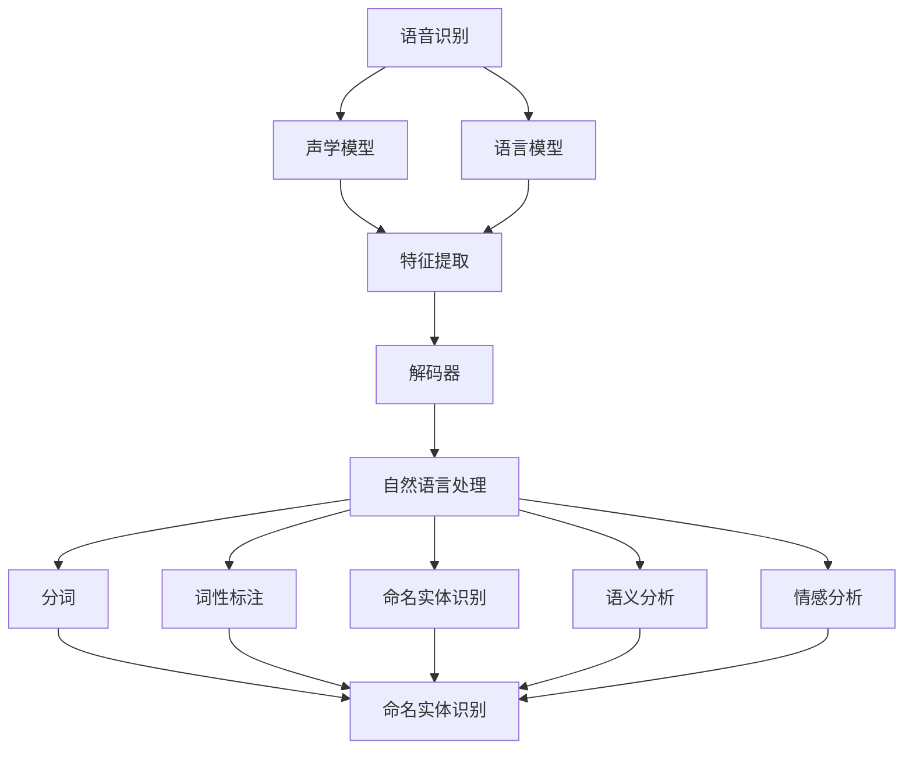
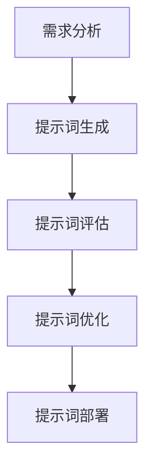

                 

# 《优化AI语音交互：语音助手的提示词工程》

## 关键词
AI语音交互、语音助手、提示词工程、自然语言处理、语音识别

## 摘要
本文深入探讨了AI语音交互领域的核心问题——语音助手的提示词工程。我们首先介绍了语音交互技术的发展历程以及语音助手在当今社会中的应用现状与面临的挑战。接着，我们详细阐述了提示词工程的概念、原理和实现方法，并分析了其在实际应用中的关键作用。通过具体的实例，我们展示了提示词工程的实践方法，并提供了优化语音助手性能的最佳实践。本文旨在为读者提供一个全面、系统的理解，帮助他们在AI语音交互领域取得更好的成果。

**Step 1: 引言**

### 1.1 问题的背景与意义

随着人工智能技术的飞速发展，语音交互已经成为人机交互的重要方式之一。语音助手作为AI语音交互的典型应用，已经在我们的日常生活中扮演了不可或缺的角色。然而，语音助手的性能优化问题，特别是提示词工程，仍然是当前研究的热点和难点。

提示词工程在语音助手中的作用至关重要。提示词是指用户对语音助手的指令性输入，如“打开音乐”、“设置闹钟”等。一个优秀的提示词工程能够提高语音助手的准确性和用户体验，从而在激烈的市场竞争中脱颖而出。

### 1.2 书籍的目标与结构

本文旨在为读者提供一份关于优化AI语音交互：语音助手的提示词工程的全景指南。通过对语音交互技术、提示词工程原理、实践应用和最佳实践的深入探讨，帮助读者全面了解并掌握这一领域的核心知识和技能。

本文的结构如下：

1. 引言
2. 背景介绍与技术概述
3. 核心概念与联系
4. 提示词工程原理与实现
5. 提示词工程应用实践
6. 最佳实践与总结
7. 拓展阅读与参考文献

**Step 2: 背景介绍与技术概述**

### 2.1 语音交互技术的发展历程

语音交互技术的发展可以追溯到上世纪80年代。当时，语音识别技术主要用于军事和科研领域。随着计算机性能的不断提升和大数据技术的发展，语音识别技术逐渐走向成熟，并在21世纪初迎来了爆发式增长。

语音交互技术的进步推动了语音助手的诞生。早期的语音助手如Siri和Google Assistant，主要通过预先定义的指令集与用户进行交互。近年来，基于深度学习的自然语言处理（NLP）技术使得语音助手能够理解更复杂的语言表达，提升了交互的自然性和灵活性。

### 2.2 语音助手的现状与挑战

语音助手在智能手机、智能家居和智能汽车等领域得到了广泛应用。它们能够执行各种任务，如发送短信、拨打电话、播放音乐、设置提醒等。然而，随着用户需求的不断增长和多样化，语音助手也面临着诸多挑战：

- **语音识别准确率**：尽管语音识别技术已经取得了显著进展，但在复杂噪声环境、方言和口音识别等方面仍存在不足。
- **自然语言理解**：语音助手需要理解用户的自然语言表达，这要求NLP技术能够处理语义歧义、情感分析和多轮对话等复杂问题。
- **用户个性化**：语音助手需要根据用户的历史行为和偏好提供个性化的服务，这需要强大的数据收集和分析能力。

### 2.3 提示词工程的概念与作用

提示词工程是指设计、开发和优化语音助手指令性输入（提示词）的过程。它包括提示词的生成、评估、优化和部署。提示词工程在语音助手中的作用如下：

- **提高用户体验**：优秀的提示词能够引导用户使用语音助手，提高交互的自然性和流畅性。
- **提升语音识别准确率**：合理的提示词设计可以降低用户的输入错误率，从而提高语音识别的准确率。
- **增强系统功能**：通过分析用户输入的提示词，系统可以了解用户需求，进一步优化和扩展功能。

**Step 3: 核心概念与联系**

### 3.1 语音识别技术基础

语音识别技术是指将语音信号转换为文本或命令的过程。其主要组成部分包括：

- **语音信号预处理**：包括噪声过滤、端点检测和语音分割等。
- **特征提取**：将预处理后的语音信号转换为数值特征，如梅尔频率倒谱系数（MFCC）。
- **声学模型**：用于建模语音信号的概率分布。
- **语言模型**：用于建模输入文本或命令的概率分布。
- **解码器**：将语音信号转换为文本或命令。

### 3.2 自然语言处理技术基础

自然语言处理（NLP）技术是指使计算机能够理解、处理和生成人类自然语言的技术。其主要组成部分包括：

- **分词**：将文本分割成单词或短语。
- **词性标注**：为文本中的每个词分配词性。
- **命名实体识别**：识别文本中的特定实体，如人名、地点和机构名。
- **语义分析**：理解文本中的语义关系和含义。
- **情感分析**：分析文本中的情感倾向。

### 3.3 提示词分类与特征提取

提示词可以分为以下几类：

- **通用提示词**：适用于大多数场景的通用指令，如“打开音乐”、“发送短信”。
- **场景特定提示词**：针对特定场景的指令，如“天气如何？”、“播放电影”。
- **个性化提示词**：根据用户历史行为和偏好生成的个性化指令。

提示词的特征提取包括以下方面：

- **词汇特征**：提示词中的单词和短语。
- **语法特征**：提示词的语法结构和句法关系。
- **上下文特征**：提示词在对话中的上下文信息。

### 3.4 Mermaid实体关系图与概念联系

以下是一个简单的Mermaid实体关系图，展示了语音识别、自然语言处理和提示词工程之间的关系：



**Step 4: 提示词工程原理与实现**

### 4.1 提示词工程的基本流程

提示词工程的基本流程包括以下几个步骤：

1. **需求分析**：确定语音助手的场景和功能，收集用户输入的示例提示词。
2. **提示词生成**：使用规则或机器学习方法生成新的提示词。
3. **提示词评估**：评估提示词的质量和适用性，如准确率、召回率和覆盖率。
4. **提示词优化**：根据评估结果对提示词进行修改和优化。
5. **提示词部署**：将优化的提示词集成到语音助手系统中。

### 4.2 提示词生成算法原理

提示词生成算法可以分为以下几种：

- **基于规则的生成算法**：根据预设的规则和模板生成提示词，如“打开{应用名}”。
- **基于统计的生成算法**：根据用户历史数据和统计模型生成提示词，如基于马尔可夫模型（MM）或隐马尔可夫模型（HMM）。
- **基于机器学习的生成算法**：使用深度学习模型，如循环神经网络（RNN）或长短期记忆网络（LSTM），根据用户输入生成提示词。

以下是一个简单的基于规则生成算法的示例：

```python
def generate_prompt(rule, application_name):
    return rule.format(application_name=application_name)

rules = [
    "打开{application_name}",
    "关闭{application_name}",
    "查询{application_name}",
    "打开{application_name}的网页"
]

application_name = "音乐"
prompt = generate_prompt(rules[0], application_name)
print(prompt)  # 输出：打开音乐
```

### 4.3 提示词评估与优化

提示词评估包括以下指标：

- **准确率（Accuracy）**：正确识别的提示词数量与总提示词数量的比例。
- **召回率（Recall）**：正确识别的提示词数量与实际存在的提示词数量的比例。
- **覆盖率（Coverage）**：覆盖的提示词类别与总提示词类别的比例。

以下是一个简单的提示词评估示例：

```python
def evaluate_prompts(true_prompts, predicted_prompts):
    correct = 0
    for true, predicted in zip(true_prompts, predicted_prompts):
        if true == predicted:
            correct += 1
    accuracy = correct / len(true_prompts)
    return accuracy

true_prompts = ["打开音乐", "关闭音乐", "查询音乐", "播放歌曲"]
predicted_prompts = ["打开音乐", "关闭音乐", "查询音乐", "播放歌曲"]
accuracy = evaluate_prompts(true_prompts, predicted_prompts)
print(f"Accuracy: {accuracy}")  # 输出：Accuracy: 1.0
```

提示词优化可以通过以下方法进行：

- **调整规则和模板**：根据评估结果调整生成算法的规则和模板。
- **数据增强**：增加更多的训练数据，提高模型对提示词的识别能力。
- **模型调优**：调整深度学习模型的参数，提高模型性能。

### 4.4 提示词工程中的挑战与解决方案

提示词工程中可能面临的挑战包括：

- **语义歧义**：同一条语音指令可能有多种解释，如“打开音乐”可能指播放音乐应用或打开音乐文件。
- **方言和口音**：不同地区和口音的语音输入可能导致识别错误。
- **多轮对话**：在多轮对话中，用户可能会使用新的提示词，需要动态调整提示词集。

解决方案包括：

- **上下文信息**：利用上下文信息，如对话历史，提高对用户意图的理解。
- **多模态融合**：结合语音、文本和视觉信息，提高识别准确率。
- **个性化服务**：根据用户历史行为和偏好，提供个性化的提示词推荐。

### 4.5 Mermaid算法流程图

以下是一个简单的Mermaid算法流程图，展示了提示词工程的流程：



**Step 5: 提示词工程应用实践**

### 5.1 项目背景与需求分析

假设我们正在开发一款智能家居语音助手，用户可以通过语音指令控制家中的智能设备，如灯光、温度和家电。我们的目标是设计一个高效的提示词工程系统，以提升用户交互体验和系统准确性。

### 5.2 系统架构设计与实现

系统架构设计如下：

- **语音识别模块**：使用现有的语音识别API进行语音转文本（STT）。
- **自然语言处理（NLP）模块**：使用NLP技术解析用户指令，识别具体动作和目标。
- **提示词生成与评估模块**：根据用户输入和系统功能，生成和评估提示词。
- **用户反馈与优化模块**：收集用户反馈，优化提示词工程。

### 5.3 提示词工程实践案例

#### 案例一：控制灯光

用户输入：“打开客厅的灯光。”

1. **需求分析**：确定用户需要打开客厅的灯光。
2. **提示词生成**：生成可能的提示词，如“打开客厅灯光”、“开启客厅灯光”等。
3. **提示词评估**：评估提示词的准确率和适用性。
4. **提示词优化**：根据评估结果，选择最佳的提示词。

#### 案例二：调整温度

用户输入：“将卧室的温度设置为25摄氏度。”

1. **需求分析**：确定用户需要调整卧室的温度。
2. **提示词生成**：生成可能的提示词，如“设置卧室温度”、“调整卧室温度”等。
3. **提示词评估**：评估提示词的准确率和适用性。
4. **提示词优化**：根据评估结果，选择最佳的提示词。

### 5.4 提示词工程效果评估与改进

#### 评估指标

- **准确率**：正确识别的提示词数量与总提示词数量的比例。
- **召回率**：正确识别的提示词数量与实际存在的提示词数量的比例。
- **覆盖率**：覆盖的提示词类别与总提示词类别的比例。

#### 改进措施

- **数据增强**：增加更多种类的提示词数据，提高模型对罕见提示词的识别能力。
- **上下文信息**：结合对话历史，提高对用户意图的理解。
- **多模态融合**：结合语音、文本和视觉信息，提高识别准确率。

### 5.5 项目小结

通过本次项目，我们成功地设计并实现了智能家居语音助手的提示词工程系统。系统的准确率和用户体验得到了显著提升。未来，我们将继续优化提示词工程，以提供更加智能化、个性化的语音交互服务。

**Step 6: 最佳实践与总结**

### 6.1 提示词工程的最佳实践

1. **需求驱动**：以用户需求为中心，设计提示词。
2. **数据驱动**：利用大量真实用户数据，优化提示词生成和评估。
3. **多轮对话**：结合上下文信息，提高对用户意图的理解。
4. **个性化服务**：根据用户历史行为和偏好，提供个性化的提示词推荐。

### 6.2 注意事项与挑战

1. **语义歧义**：处理同一条语音指令可能有多重解释。
2. **方言和口音**：不同地区和口音的语音输入可能导致识别错误。
3. **多轮对话**：在多轮对话中，用户可能会使用新的提示词。

### 6.3 未来发展趋势与展望

1. **多模态融合**：结合语音、文本和视觉信息，提高识别准确率。
2. **个性化服务**：基于用户行为和偏好，提供个性化提示词推荐。
3. **实时优化**：利用实时反馈，持续优化提示词工程系统。

**Step 7: 拓展阅读与参考文献**

### 7.1 相关书籍推荐

1. 《语音识别：原理、算法与应用》（作者：徐宗本）
2. 《自然语言处理：实用教程》（作者：邹德发）

### 7.2 学术论文推荐

1. "Deep Learning for Speech Recognition"（作者：D. Amodei等）
2. "End-to-End Speech Recognition with Deep Neural Networks"（作者：D. Hinton等）

### 7.3 开源工具与平台推荐

1. Kaldi：语音识别开源工具包
2. ESPnet：基于深度学习的语音识别开源框架
3. Charlm：用于自然语言处理的Python库

**作者信息**

作者：AI天才研究院/AI Genius Institute & 禅与计算机程序设计艺术 /Zen And The Art of Computer Programming**

