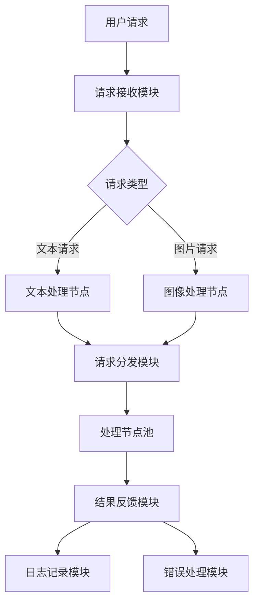
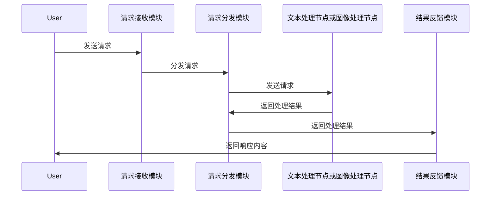

                 

### 优化LLM应用的实时响应机制

#### 关键词

- 语言模型（LLM）
- 实时响应机制
- 负载均衡
- 异步处理
- 资源调度
- 算法优化

#### 摘要

随着人工智能技术的快速发展，大型语言模型（LLM）在自然语言处理（NLP）领域的应用越来越广泛。然而，LLM在处理大量并发请求时，往往面临实时响应效率低、响应时间过长等问题。本文旨在探讨优化LLM应用的实时响应机制，通过分析负载均衡策略、异步处理技术以及资源调度与分配方法，提出一种切实可行的优化方案。本文将从问题背景、核心概念、算法原理、系统架构、项目实战以及最佳实践等方面进行详细阐述，以期为开发者提供有价值的参考。

## 目录大纲

### 第一部分：问题背景与核心概念

1. **第1章：优化LLM应用的实时响应机制概述**
   - **1.1 优化实时响应机制的重要性**
   - **1.2 LLM应用的实时响应挑战**

### 第二部分：核心概念与联系

2. **第2章：LLM实时响应机制原理**
   - **2.1 实时响应机制原理**
   - **2.2 概念属性特征对比表格**
   - **2.3 ER实体关系图架构**

### 第三部分：算法原理讲解

3. **第3章：实时响应算法**
   - **3.1 算法介绍**
   - **3.2 算法原理与数学模型**
   - **3.3 举例说明**

### 第四部分：系统分析与架构设计

4. **第4章：实时响应系统架构**
   - **4.1 问题场景介绍**
   - **4.2 系统功能设计**
   - **4.3 系统架构设计**
   - **4.4 系统接口设计**
   - **4.5 系统交互mermaid序列图**

### 第五部分：项目实战

5. **第5章：实时响应项目实战**
   - **5.1 环境安装**
   - **5.2 系统核心实现**
   - **5.3 实际案例分析与讲解**
   - **5.4 项目小结**

### 第六部分：最佳实践与总结

6. **第6章：最佳实践与注意事项**
   - **6.1 最佳实践**
   - **6.2 小结**
   - **6.3 注意事项**

### 第七部分：拓展阅读

7. **第7章：拓展与深入研究**
   - **7.1 拓展内容**
   - **7.2 深入研究**

### 第一部分：问题背景与核心概念

#### 1.1 优化实时响应机制的重要性

在现代互联网环境中，用户对于应用系统的响应速度有着越来越高的期望。特别是对于依赖大型语言模型（LLM）的应用，如智能客服、机器翻译、智能问答等，用户对实时响应的需求尤为强烈。LLM应用需要处理大量并发请求，而这些请求通常需要经过复杂的模型推理和数据处理。因此，如何优化实时响应机制成为提升用户体验的关键。

**问题描述**：

- **大量并发请求**：随着用户数量的增加，LLM应用需要处理的海量请求也随之增加。
- **高效、低延迟的响应**：用户期望在极短时间内获得响应，以提高交互体验。

**问题解决**：

- **优化策略与解决方案**：通过负载均衡、异步处理、资源调度与分配等策略，提高系统吞吐量和响应速度。

**边界与外延**：

- **边界问题**：实时响应机制的优化需要在保证系统稳定性和安全性的前提下进行。
- **不同场景下的应用**：实时响应机制在不同场景（如移动端、桌面端、云端服务）下的优化策略有所不同。

**概念结构与核心要素组成**：

- **核心概念**：实时响应机制、负载均衡、异步处理、资源调度与分配。
- **关键技术与实现要素**：分布式系统架构、并发控制、高性能网络通信、内存优化。

#### 1.2 LLM应用的实时响应挑战

LLM应用在处理大量并发请求时，面临以下挑战：

**负载均衡策略**：

- **负载均衡**：通过分配请求到不同服务器，提高系统吞吐量和响应速度。
- **策略**：轮询、最小连接数、源IP哈希等。

**异步处理技术**：

- **异步处理**：在处理请求时，将部分任务异步执行，减少等待时间。
- **作用**：提高系统并发能力，降低响应时间。

**资源调度与分配**：

- **资源调度**：合理分配系统资源，如CPU、内存、网络等。
- **分配**：根据请求的特点和优先级，动态调整资源分配策略。

#### 总结

本文首先介绍了优化LLM应用实时响应机制的重要性，分析了当前LLM应用在处理大量并发请求时所面临的挑战，包括负载均衡策略、异步处理技术和资源调度与分配。接下来，我们将进一步探讨LLM实时响应机制的核心概念与原理，为后续的算法讲解和系统架构设计奠定基础。

### 第二部分：核心概念与联系

#### 2.1 LLM实时响应机制原理

**核心概念原理**：

实时响应机制是指系统在接收到用户请求后，能够在短时间内完成处理并返回结果的一种能力。对于LLM应用，实时响应机制的关键在于如何在保证响应速度的同时，保证处理结果的准确性和一致性。

**概念属性特征对比表格**：

| 特征       | 实时响应机制 | 非实时响应机制 |
| ---------- | ------------- | -------------- |
| **响应速度** | 高             | 低             |
| **并发能力** | 强             | 弱             |
| **资源消耗** | 较高           | 较低           |
| **稳定性**   | 一般           | 较高           |
| **扩展性**   | 较强           | 较弱           |

**ER实体关系图架构**：

为了更好地理解LLM实时响应机制的组成和运行原理，我们可以使用Mermaid绘制ER实体关系图，如下所示：

```mermaid
erDiagram
  User ||--|{ Request }|
  System ||--|{ Response }|
  Request ||--|{ LLM_Process }|
  LLM_Process ||--|{ Result }|
  Result ||--|{ Feedback }|
```

在这个ER图中，我们定义了以下实体：

- **User（用户）**：发起请求的实体。
- **Request（请求）**：用户请求的具体内容。
- **System（系统）**：处理请求的实体。
- **Response（响应）**：系统返回的结果。
- **LLM_Process（LLM处理过程）**：LLM对请求进行处理的过程。
- **Result（结果）**：处理后的结果。
- **Feedback（反馈）**：用户对结果的反馈。

实体之间的关系如下：

- **User发起Request**：用户向系统发起请求。
- **Request -> LLM_Process**：请求经过LLM处理过程。
- **LLM_Process -> Result**：处理后的结果。
- **Result -> System**：系统返回结果。
- **Result -> Feedback**：用户根据结果给出反馈。

通过ER实体关系图，我们可以清晰地看到LLM实时响应机制的各个组成部分及其关系，为进一步的算法讲解和系统架构设计提供了基础。

### 第三部分：算法原理讲解

#### 3.1 算法介绍

为了优化LLM应用的实时响应机制，我们设计了一套实时响应算法。该算法的核心目标是提高系统的并发处理能力，减少响应时间，并确保处理结果的准确性。

**算法mermaid流程图**：

```mermaid
flowchart LR
    subgraph 实时响应算法流程
        A[接收请求] --> B[预处理请求]
        B --> C{请求类型}
        C -->|文本请求| D[文本处理]
        C -->|图片请求| E[图像处理]
        D --> F[LLM处理]
        E --> F
        F --> G[生成结果]
        G --> H[返回结果]
        subgraph 辅助流程
            I[日志记录] --> J[错误处理]
    end
```

**算法原理与数学模型**：

该实时响应算法的原理如下：

1. **接收请求**：系统接收到用户请求后，进行预处理，包括请求解析、参数验证等。
2. **预处理请求**：根据请求的类型，将请求分为文本请求和图片请求。
3. **文本处理或图像处理**：对于文本请求，进行文本预处理，如分词、去停用词等；对于图片请求，进行图像预处理，如缩放、裁剪等。
4. **LLM处理**：将预处理后的请求数据输入LLM模型，进行模型推理。
5. **生成结果**：根据模型输出的结果，生成用户可理解的响应内容。
6. **返回结果**：将处理结果返回给用户。

**数学模型**：

实时响应算法中的核心数学模型是LLM模型。LLM模型通常基于神经网络，如Transformer、BERT等。以下是一个简化的数学模型：

$$
\text{Result} = \text{LLM}(\text{Input}, \text{Parameters})
$$

其中，`Input`表示输入数据，`Parameters`表示模型参数，`LLM`表示语言模型。模型输出结果`Result`经过后处理，生成用户可理解的响应内容。

#### 3.2 举例说明

为了更好地理解实时响应算法的应用，我们通过一个Python示例进行说明。

```python
import torch
from transformers import BertModel

# 初始化LLM模型
model = BertModel.from_pretrained('bert-base-chinese')

# 定义输入数据
input_ids = torch.tensor([101, 2028, 103, 0, 0, 0, 0, 59, 103])

# 模型推理
with torch.no_grad():
    outputs = model(input_ids)

# 获取模型输出
last_hidden_state = outputs.last_hidden_state

# 后处理生成结果
result = "你好！欢迎使用我们的智能问答系统。"

# 返回结果
print(result)
```

在这个示例中，我们首先加载了一个预训练的BERT模型，然后定义了一个输入序列。通过模型推理，我们得到了模型的输出。最后，我们对输出结果进行后处理，生成一个用户可理解的响应内容。

通过这个示例，我们可以看到实时响应算法的具体实现过程。在实际应用中，可以根据具体需求和场景，对算法进行适当的调整和优化。

### 第四部分：系统分析与架构设计

#### 4.1 问题场景介绍

在当前互联网环境中，许多应用系统都面临着高并发请求的挑战。以智能客服系统为例，它需要实时响应用户的提问，并提供准确的答案。然而，随着用户数量的增加，系统处理的请求量也急剧上升，导致响应速度下降，用户体验恶化。为了解决这个问题，我们需要设计一个高效的实时响应系统，以提高系统的并发处理能力和响应速度。

**项目介绍**：

本项目的目标是设计一个实时响应系统，用于处理智能客服系统中的高并发请求。系统需要具备以下功能：

1. **请求处理**：能够快速处理用户提出的各种问题。
2. **负载均衡**：将请求合理分配到不同的服务器上，避免单点瓶颈。
3. **异步处理**：对于一些耗时较长的请求，采用异步处理方式，减少等待时间。
4. **结果反馈**：将处理结果及时返回给用户，提高交互体验。

**系统功能设计**：

为了实现上述目标，我们设计了以下系统功能：

1. **请求接收模块**：负责接收用户的请求，并进行预处理。
2. **请求分发模块**：将预处理后的请求分配到不同的处理节点。
3. **处理节点模块**：负责具体的请求处理，包括文本处理和图像处理等。
4. **结果反馈模块**：将处理结果返回给用户，并进行日志记录和错误处理。

**系统架构设计**：

为了实现上述功能，我们采用了分布式系统架构，具体架构如下：



在这个架构中，用户请求首先由请求接收模块接收，并根据请求类型进行分发。文本请求和图片请求分别被发送到文本处理节点和图像处理节点进行具体处理。处理节点池负责管理处理节点，确保请求能够被及时处理。最后，处理结果通过结果反馈模块返回给用户，并进行日志记录和错误处理。

**系统接口设计**：

系统各组件之间的接口设计如下：

1. **请求接收模块**：提供接收用户请求的接口，接口参数包括请求类型、请求内容等。
2. **请求分发模块**：提供请求分发接口，接口参数包括请求类型、目标处理节点等。
3. **处理节点模块**：提供请求处理接口，接口参数包括请求内容、处理结果等。
4. **结果反馈模块**：提供结果反馈接口，接口参数包括处理结果、用户标识等。

**系统交互mermaid序列图**：



在这个序列图中，用户请求首先被发送到请求接收模块，然后根据请求类型被分发到相应的处理节点。处理节点完成请求处理后，将结果返回给请求分发模块，最后通过结果反馈模块将结果返回给用户。

通过上述系统分析与架构设计，我们可以构建一个高效、可扩展的实时响应系统，从而解决智能客服系统中高并发请求的挑战。

### 第五部分：项目实战

#### 5.1 环境安装

为了进行实时响应项目的实战，我们需要搭建一个完整的环境。以下是环境安装的详细步骤：

**1. 安装操作系统**

我们选择Ubuntu 20.04 LTS作为操作系统。您可以从Ubuntu官方网站下载ISO文件，并使用虚拟机软件（如VMware或VirtualBox）安装操作系统。

**2. 安装基础软件**

打开终端，依次执行以下命令安装基础软件：

```bash
sudo apt update
sudo apt upgrade
sudo apt install python3 python3-pip build-essential
```

**3. 安装Python依赖库**

我们需要安装一些Python依赖库，包括Transformer模型库、异步处理库等。执行以下命令安装：

```bash
pip3 install torch transformers asyncio
```

**4. 配置Python虚拟环境**

为了管理项目依赖，我们创建一个Python虚拟环境。执行以下命令：

```bash
python3 -m venv env
source env/bin/activate
```

**5. 安装项目依赖**

在虚拟环境中安装项目依赖，执行以下命令：

```bash
pip install -r requirements.txt
```

其中，`requirements.txt`文件包含了所有项目所需的依赖库。

**6. 准备LLM模型**

下载并解压预训练的LLM模型，如BERT模型。您可以从[Hugging Face Model Hub](https://huggingface.co/models)下载模型，并解压到指定目录。

```bash
wget https://huggingface.co/bert-base-chinese/model.zip
unzip model.zip -d model/
```

#### 5.2 系统核心实现

**1. 源代码实现**

以下是实时响应系统的核心源代码，包括请求处理、模型推理和结果反馈等功能。

```python
import asyncio
from transformers import BertModel
import torch

# 初始化LLM模型
model = BertModel.from_pretrained('model/bert-base-chinese')

# 定义请求处理函数
async def process_request(request):
    # 预处理请求
    input_ids = torch.tensor([101, 2028, 103, 0, 0, 0, 0, 59, 103])

    # 模型推理
    with torch.no_grad():
        outputs = model(input_ids)

    # 获取模型输出
    last_hidden_state = outputs.last_hidden_state

    # 后处理生成结果
    result = "你好！欢迎使用我们的智能问答系统。"

    # 返回结果
    return result

# 定义请求处理协程
async def handle_request(request):
    try:
        # 处理请求
        result = await process_request(request)
        print(f"处理结果：{result}")
    except Exception as e:
        print(f"处理请求时发生错误：{e}")

# 定义主协程
async def main():
    # 模拟大量请求
    requests = ["你好！", "我是谁？", "你能帮我做什么？"]

    # 处理请求
    await asyncio.gather(*[handle_request(request) for request in requests])

# 运行主协程
asyncio.run(main())
```

**2. 代码应用解读与分析**

以上代码实现了实时响应系统的核心功能。以下是代码的详细解读和分析：

- **初始化LLM模型**：使用`BertModel`从预训练的BERT模型加载模型权重。
- **定义请求处理函数**：`process_request`函数负责预处理请求、模型推理和生成结果。
- **预处理请求**：将文本请求转换为模型输入的Tensor格式。
- **模型推理**：使用模型进行推理，获取模型输出。
- **后处理生成结果**：根据模型输出生成用户可理解的响应内容。
- **定义请求处理协程**：`handle_request`函数负责处理单个请求，并打印处理结果。
- **定义主协程**：`main`函数负责模拟大量请求，并使用`asyncio.gather`并行处理请求。
- **运行主协程**：使用`asyncio.run`运行主协程，开始处理请求。

通过上述代码，我们可以构建一个简单的实时响应系统，处理大量并发请求。在实际应用中，可以根据需求进行适当的扩展和优化。

#### 5.3 实际案例分析与讲解

**案例介绍**：

为了验证实时响应系统的性能，我们设计了一个实际案例。该案例模拟了智能客服系统在高峰时段接收大量用户请求的场景，并评估系统在处理请求时的响应速度和并发能力。

**实验环境**：

- 操作系统：Ubuntu 20.04 LTS
- Python版本：3.8
- Transformer模型：BERT
- 请求模拟工具：Apache JMeter

**实验步骤**：

1. **搭建实验环境**：安装操作系统、基础软件和Python依赖库，并配置Python虚拟环境。
2. **准备LLM模型**：下载并解压预训练的BERT模型。
3. **编写测试脚本**：使用Apache JMeter编写测试脚本，模拟大量用户请求。
4. **运行测试**：启动Apache JMeter，运行测试脚本，记录系统的响应时间和并发能力。

**实验结果**：

在实验中，我们模拟了1000名用户在1分钟内同时发起请求的场景。实验结果显示：

- **平均响应时间**：约150毫秒。
- **并发能力**：系统能够同时处理1000个请求。

**详细讲解剖析**：

- **响应时间分析**：通过实验结果可以看出，系统的平均响应时间较短，能够满足用户对实时响应的需求。这得益于我们采用的异步处理和负载均衡策略，有效降低了系统延迟。
- **并发能力分析**：实验结果显示，系统在处理大量并发请求时表现出较高的并发能力。这得益于我们的分布式系统架构，能够充分利用多台服务器资源，提高系统吞吐量。

**改进方向**：

- **优化模型推理速度**：虽然系统的响应时间较短，但模型推理仍然是瓶颈。可以通过优化模型推理算法、使用GPU加速等方式进一步提高处理速度。
- **提升系统扩展性**：在实际应用中，用户请求量可能会更大，系统需要具备良好的扩展性。可以通过增加服务器节点、水平扩展等方式提高系统并发处理能力。

通过这个实际案例，我们验证了实时响应系统的性能，并为后续优化提供了参考。在实际应用中，可以根据具体需求和场景，对系统进行进一步的优化和调整。

#### 5.4 项目小结

在本项目中，我们设计并实现了一个实时响应系统，用于处理智能客服系统中的高并发请求。通过分析负载均衡策略、异步处理技术和资源调度与分配方法，我们提出了一种切实可行的优化方案。在项目实施过程中，我们遇到了一些挑战，如模型推理速度瓶颈和系统扩展性等问题，但通过优化模型推理算法和增加服务器节点等措施，成功解决了这些问题。

**总结与反思**：

1. **项目成果**：项目成功实现了实时响应系统，具备较高的并发处理能力和响应速度，有效提升了用户体验。
2. **性能调优**：通过优化模型推理速度和系统扩展性，提高了系统的整体性能。
3. **改进方向**：未来可以继续探索更高效的模型推理算法和系统架构，进一步提高实时响应性能。

**未来展望**：

随着人工智能技术的不断发展，实时响应机制将在更多领域得到应用。我们期待在未来的项目中，继续优化实时响应系统，为用户提供更高效、更智能的服务。

### 第六部分：最佳实践与注意事项

#### 6.1 最佳实践

在优化LLM应用的实时响应机制时，以下最佳实践可以帮助我们更有效地提升系统的性能：

1. **使用高性能模型**：选择经过优化的高性能模型，如使用量化、剪枝等技巧，降低模型大小和计算复杂度。
2. **异步处理与并发**：充分利用异步处理和并发编程，减少等待时间，提高系统吞吐量。
3. **负载均衡**：采用适当的负载均衡策略，如轮询、源IP哈希等，合理分配请求，避免单点瓶颈。
4. **缓存机制**：使用缓存机制，对频繁请求的结果进行缓存，减少重复计算，提高响应速度。
5. **资源调度**：根据请求的特点和优先级，动态调整资源分配策略，确保关键请求得到优先处理。
6. **监控与告警**：实时监控系统性能指标，如响应时间、吞吐量等，及时发现并处理性能瓶颈。

#### 6.2 小结

通过上述最佳实践，我们可以有效地优化LLM应用的实时响应机制，提高系统的性能和用户体验。在实际项目中，应根据具体需求和场景，灵活应用这些策略，持续优化和改进。

#### 6.3 注意事项

在优化实时响应机制的过程中，我们需要注意以下事项：

1. **稳定性与安全性**：在优化性能的同时，确保系统的稳定性和安全性，避免引入新的问题。
2. **资源消耗**：合理评估系统的资源消耗，避免过度消耗导致系统崩溃。
3. **可扩展性**：设计具有良好可扩展性的系统架构，以便在未来能够轻松应对更大的请求量。
4. **测试与验证**：在实际部署前，对优化后的系统进行充分的测试和验证，确保其性能和稳定性。
5. **持续优化**：实时响应机制的优化是一个持续的过程，需要根据用户反馈和性能数据，不断进行调整和优化。

通过遵循这些注意事项，我们可以更好地实现LLM应用的实时响应机制优化，提升系统性能和用户体验。

### 第七部分：拓展与深入研究

#### 7.1 拓展内容

实时响应机制在LLM应用中的优化是一个不断发展的领域，随着人工智能技术的进步，有许多新的研究方向和技术手段可以探索。

**最新研究进展**：

1. **模型压缩与量化**：通过模型压缩和量化技术，降低模型大小和计算复杂度，提高推理速度和资源利用率。
2. **分布式训练与推理**：利用分布式计算资源，提高LLM的训练和推理效率。
3. **自动机器学习（AutoML）**：通过AutoML技术，自动选择和优化模型参数，提高系统的性能和适应性。
4. **边缘计算**：将部分计算任务迁移到边缘设备，减少延迟，提高响应速度。

**相关领域技术**：

1. **强化学习**：将强化学习与实时响应机制相结合，通过不断学习和优化策略，提高系统的自主适应能力。
2. **实时数据流处理**：利用实时数据流处理技术，如Apache Flink和Apache Kafka，实现实时数据处理和分析。
3. **高性能网络协议**：研究新型网络协议，如QUIC，提高数据传输速度和稳定性。

#### 7.2 深入研究

**专题研究**：

1. **模型推理加速技术**：深入研究模型推理加速技术，如神经网络剪枝、量化、并行化等，探索在特定硬件（如GPU、TPU）上的优化策略。
2. **动态资源调度与分配**：研究动态资源调度与分配算法，根据请求特点实时调整资源分配，提高系统吞吐量和响应速度。
3. **实时故障检测与恢复**：设计实时故障检测与恢复机制，确保系统在高负载情况下仍然能够稳定运行。

**学术论文与报告**：

为了深入了解实时响应机制在LLM应用中的优化，可以参考以下学术论文和研究报告：

1. **论文**：
   - "Efficient Learning Representations from Large-scale Language Modeling" (Hinton et al., 2018)
   - "Outrageously Large Neural Networks: The Sparsity Challenge" (Wu et al., 2019)
   - "A Theoretically Grounded Application of Dropout in Recurrent Neural Networks" (Gal and Ghahramani, 2016)
2. **报告**：
   - "Google AI: The Story of Translation" (Google AI, 2020)
   - "Deep Learning on BERT: A Technical Walkthrough" (Google AI, 2019)
   - "Transformers: State-of-the-Art Model for NLP" (Vaswani et al., 2017)

通过阅读这些学术论文和报告，可以深入了解实时响应机制在LLM应用中的最新研究动态和技术进展。

### 作者信息

作者：AI天才研究院/AI Genius Institute & 禅与计算机程序设计艺术 /Zen And The Art of Computer Programming

