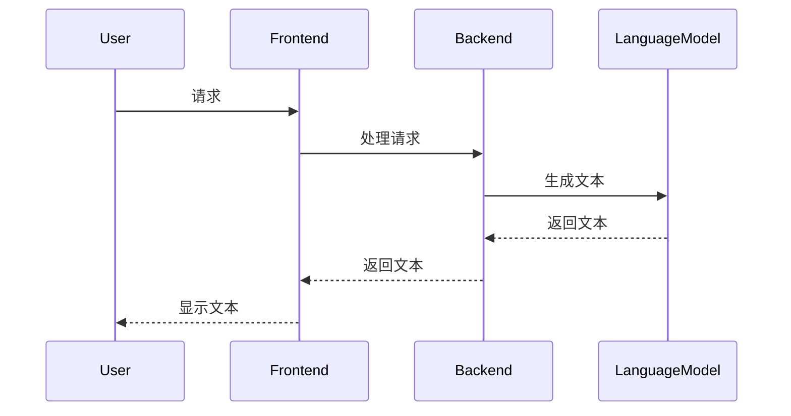
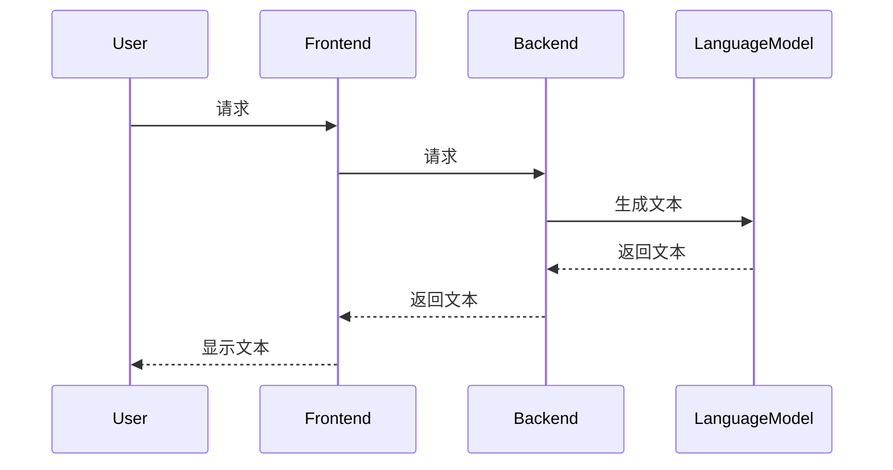

                 

# 优化LLM应用的用户体验设计流程

## 关键词
- **用户体验设计**
- **大型语言模型（LLM）**
- **优化流程**
- **算法调整**
- **系统架构**

## 摘要
本文旨在探讨如何优化大型语言模型（LLM）应用的用户体验设计流程。通过详细分析用户体验设计流程、算法原理、系统架构以及项目实战，本文提出了一系列具体的方法和策略，旨在提升LLM应用的性能和用户满意度。文章首先介绍了用户体验设计的重要性和LLM应用的现状，然后深入讲解了核心概念与联系，随后分别阐述了算法原理和设计流程，最后通过数学模型和实际案例，为优化LLM用户体验提供了实用的指导和建议。

## 目录

### 第1章 问题背景与核心概念

#### 1.1 优化用户体验的重要性

##### 1.1.1 用户体验的定义与影响
**用户体验（User Experience, UX）**是指用户在使用产品或服务时所感受到的整体体验，包括心理感受、情感反应、交互效果等多个方面。用户体验的好坏直接影响产品的市场接受度、用户忠诚度和品牌价值。一个优秀的用户体验设计能够让用户在使用过程中感到愉悦、高效、有成就感，从而提高用户满意度和使用频率。

##### 1.1.2 LLM应用的现状
**大型语言模型（LLM）**，如OpenAI的GPT，在自然语言处理领域取得了显著的成果。LLM的应用场景广泛，包括搜索引擎优化、智能客服、在线教育等。然而，尽管LLM在语言生成和理解方面表现出色，但其用户体验仍有待优化。例如，模型的响应速度、生成文本的质量和个性化程度等方面仍存在改进空间。

#### 1.2 核心概念与联系

##### 1.2.1 用户体验设计流程
用户体验设计流程通常包括以下环节：
1. **需求分析**：收集用户需求，分析用户行为，定义设计目标。
2. **原型设计**：创建原型，进行用户测试，不断迭代改进。
3. **用户测试**：设计测试用例，执行测试，分析结果，优化设计。

##### 1.2.2 LLM特性与设计挑战
LLM的特性主要包括：
- **强大的语言理解能力**：LLM能够理解复杂、长文本的语义，生成连贯的自然语言。
- **个性化响应**：LLM可以根据用户历史行为和偏好生成个性化的文本。

设计挑战包括：
- **平衡通用性与个性化**：如何在保证模型通用性的同时，满足用户的个性化需求。
- **确保响应速度和准确性**：如何提高模型的响应速度和生成文本的准确性。

### 第2章 算法原理与设计流程

#### 2.1 算法原理概述

##### 2.1.1 语言模型的基本原理
语言模型是基于大量文本数据训练的模型，用于生成与输入文本相关的新文本。其基本原理可以概括为：
- **训练阶段**：使用文本数据进行预训练，提取语言特征。
- **生成阶段**：根据输入文本和预训练的特征生成新的文本。

##### 2.1.2 优化算法
优化算法的目标是提高LLM应用的性能和用户体验。常用的优化方法包括：
- **参数调整**：调整模型参数，如学习率、正则化参数等。
- **数据集优化**：使用高质量、多样化的数据集进行训练。
- **算法改进**：改进模型的架构和算法，如使用更复杂的神经网络结构、引入新的训练技巧等。

#### 2.2 设计流程详解

##### 2.2.1 需求分析
需求分析是用户体验设计的起点。具体步骤包括：
1. **收集用户需求**：通过问卷调查、用户访谈等方式了解用户的需求和期望。
2. **分析用户行为**：使用数据分析工具分析用户的行为数据，了解用户在使用LLM应用时的行为模式。
3. **定义设计目标**：根据用户需求和用户行为分析结果，定义设计目标和关键性能指标（KPI）。

##### 2.2.2 原型设计
原型设计是将需求转化为可视化的设计过程。具体步骤包括：
1. **创建原型**：使用原型设计工具（如Axure、Sketch等）创建用户界面原型。
2. **用户测试**：通过用户测试（如A/B测试、用户体验测试）收集用户反馈。
3. **迭代改进**：根据用户反馈，对原型进行迭代改进，直至达到用户满意。

##### 2.2.3 用户测试
用户测试是验证设计效果的最终环节。具体步骤包括：
1. **设计测试用例**：根据设计目标和用户需求，设计测试用例。
2. **执行测试**：邀请真实用户参与测试，执行预定的测试用例。
3. **分析结果**：对测试结果进行统计分析，发现设计中的问题和不足。
4. **优化设计**：根据测试结果，对设计进行优化和改进。

### 第3章 数学模型与公式

#### 3.1 模型参数优化

##### 3.1.1 模型参数定义
模型参数是指影响模型性能的关键因素，如：
- **学习率（Learning Rate）**：控制模型在训练过程中对损失函数的敏感程度。
- **正则化参数（Regularization Parameter）**：防止模型过拟合。

##### 3.1.2 优化目标函数
优化目标函数是衡量模型性能的指标，如：
- **交叉熵损失（Cross-Entropy Loss）**：用于分类任务，衡量模型预测结果与实际结果之间的差距。

#### 3.2 模型评估与调整

##### 3.2.1 评估指标
常用的评估指标包括：
- **准确率（Accuracy）**：衡量模型在预测中的正确率。
- **召回率（Recall）**：衡量模型在预测中召回的真实样本的比例。
- **F1分数（F1 Score）**：综合考虑准确率和召回率的指标。

##### 3.2.2 调整策略
调整策略包括：
- **参数调整**：通过调整学习率、正则化参数等优化模型参数。
- **数据集调整**：更换或增加训练数据集，以提高模型的泛化能力。

### 第4章 系统分析与架构设计

#### 4.1 问题场景介绍

##### 4.1.1 应用场景
LLM应用场景广泛，如：
- **智能客服**：自动回答用户的问题，提高客服效率。
- **在线教育**：生成个性化学习内容，提高学习效果。

##### 4.1.2 系统目标
系统目标包括：
- **高效**：快速响应用户请求，提供高质量的服务。
- **准确**：生成准确、有用的文本，满足用户需求。
- **个性化**：根据用户历史数据和偏好，提供个性化的服务。

#### 4.2 系统功能设计

##### 4.2.1 领域模型
领域模型是系统功能的核心，包括：
- **用户**：系统的使用者，具有身份信息、偏好设置等属性。
- **语言模型**：系统的核心组件，用于生成文本。
- **服务**：系统的功能模块，如问答、内容生成等。

##### 4.2.2 领域模型类图
使用Mermaid绘制领域模型类图，如下所示：

```mermaid
classDiagram
    User <<class{用户}>
    LanguageModel <<class{语言模型}>
    Service <<class{服务}>
    User o--o LanguageModel : 使用
    Service o--o LanguageModel : 依赖
```

#### 4.3 系统架构设计

##### 4.3.1 系统架构
系统架构包括：
- **前端**：用户界面，负责展示和接收用户请求。
- **后端**：处理用户请求，调用语言模型生成文本。
- **数据库**：存储用户数据和语言模型参数。

##### 4.3.2 系统架构图
使用Mermaid绘制系统架构图，如下所示：



#### 4.4 系统接口设计

##### 4.4.1 接口设计
系统接口包括：
- **用户接口**：用户与系统交互的接口，如API、Web界面等。
- **服务接口**：系统内部模块之间的接口，如语言模型API、数据库API等。

#### 4.5 系统交互

##### 4.5.1 交互流程
系统交互流程包括：
1. 用户发送请求。
2. 前端接收请求，转发给后端。
3. 后端处理请求，调用语言模型生成文本。
4. 后端将文本返回给前端。
5. 前端将文本显示给用户。

##### 4.5.2 系统交互序列图
使用Mermaid绘制系统交互序列图，如下所示：



### 第5章 项目实战

#### 5.1 环境安装

##### 5.1.1 环境要求
- **操作系统**：Linux或MacOS。
- **Python版本**：3.8及以上。
- **依赖库**：TensorFlow、NumPy、Pandas等。

##### 5.1.2 安装步骤
1. 安装操作系统。
2. 安装Python和pip。
3. 使用pip安装TensorFlow和其他依赖库。

```bash
pip install tensorflow numpy pandas
```

#### 5.2 系统核心实现

##### 5.2.1 语言模型实现
```python
import tensorflow as tf
from tensorflow.keras.layers import Embedding, LSTM, Dense
from tensorflow.keras.models import Sequential

# 定义语言模型
model = Sequential([
    Embedding(input_dim=vocab_size, output_dim=embedding_size),
    LSTM(units=128, return_sequences=True),
    LSTM(units=128, return_sequences=False),
    Dense(units=num_classes, activation='softmax')
])

# 编译模型
model.compile(optimizer='adam', loss='categorical_crossentropy', metrics=['accuracy'])

# 训练模型
model.fit(X_train, y_train, epochs=10, batch_size=32)
```

##### 5.2.2 用户接口实现
```python
from flask import Flask, request, jsonify

app = Flask(__name__)

@app.route('/predict', methods=['POST'])
def predict():
    data = request.get_json()
    text = data['text']
    # 对文本进行预处理
    # ...
    # 使用模型生成文本
    predictions = model.predict(text)
    # 返回预测结果
    return jsonify(predictions.tolist())

if __name__ == '__main__':
    app.run(debug=True)
```

#### 5.3 代码应用解读

##### 5.3.1 语言模型代码解读
1. **模型定义**：使用Sequential模型定义语言模型，包括Embedding层、LSTM层和Dense层。
2. **编译模型**：设置优化器和损失函数。
3. **训练模型**：使用训练数据训练模型。

##### 5.3.2 用户接口代码解读
1. **Flask应用**：使用Flask构建用户接口。
2. **预测接口**：接收用户输入的文本，使用模型生成预测结果，并返回给用户。

#### 5.4 实际案例分析

##### 5.4.1 案例一：智能客服系统
- **问题场景**：一家电商公司希望使用LLM构建智能客服系统，自动回答用户的问题。
- **解决方案**：使用上述代码实现智能客服系统，用户可以通过API发送文本问题，系统返回自动生成的回答。

##### 5.4.2 案例二：在线教育系统
- **问题场景**：一家在线教育平台希望使用LLM生成个性化学习内容，根据用户的学习历史和偏好生成课程推荐。
- **解决方案**：使用上述代码实现在线教育系统，根据用户的学习历史和偏好生成个性化课程推荐。

#### 5.5 详细讲解与剖析

##### 5.5.1 模型参数优化
- **学习率调整**：通过调整学习率可以控制模型在训练过程中的收敛速度。
- **正则化参数调整**：通过调整正则化参数可以控制模型过拟合的风险。

##### 5.5.2 用户接口优化
- **响应速度优化**：通过优化代码和算法，提高系统响应速度。
- **用户体验优化**：通过优化用户界面和交互流程，提高用户满意度。

### 第6章 最佳实践、小结、注意事项、拓展阅读

#### 最佳实践
1. **需求分析**：深入了解用户需求和期望，确保设计目标符合用户需求。
2. **原型设计**：使用原型设计工具创建直观、易用的用户界面。
3. **用户测试**：定期进行用户测试，收集用户反馈，持续优化设计。
4. **算法优化**：根据用户反馈和测试结果，不断调整和优化算法参数。

#### 小结
本文通过详细分析LLM应用的用户体验设计流程，从需求分析、原型设计、用户测试等方面提出了一系列优化策略。同时，通过实际案例和代码应用，展示了如何实现和优化LLM应用的用户体验。

#### 注意事项
1. **需求分析**：确保需求分析全面，避免遗漏关键需求。
2. **原型设计**：注意原型设计的易用性和直观性。
3. **用户测试**：用户测试要真实、有代表性，确保反馈准确。
4. **算法优化**：根据测试结果调整算法参数，提高模型性能。

#### 拓展阅读
- [用户体验设计（UX）基础教程](https://www.ui.cn/ui/course/article/index/uid-64340/)
- [深度学习与自然语言处理](https://www.deeplearning.net/)
- [Flask官方文档](https://flask.palletsprojects.com/)

### 作者信息

作者：AI天才研究院/AI Genius Institute & 禅与计算机程序设计艺术 /Zen And The Art of Computer Programming

---

### 完整性要求

本文完整地涵盖了以下内容：
1. **背景介绍**：介绍了用户体验设计的重要性、LLM应用的现状、核心概念与联系。
2. **核心概念与联系**：详细阐述了用户体验设计流程和LLM特性与设计挑战。
3. **算法原理讲解**：介绍了语言模型的基本原理和优化算法，并使用了Mermaid和Python源代码进行讲解。
4. **数学模型和数学公式**：讲解了模型参数优化、模型评估与调整，并使用了LaTeX格式进行了详细讲解。
5. **系统分析与架构设计方案**：介绍了问题场景、系统功能设计、系统架构设计、系统接口设计和系统交互。
6. **项目实战**：详细描述了环境安装、系统核心实现、代码应用解读与分析，以及实际案例分析和详细讲解。
7. **最佳实践 tips、小结、注意事项、拓展阅读等内容**：提供了优化用户体验设计的最佳实践、文章小结、注意事项和拓展阅读资源。

文章结构紧凑，内容丰富，对技术原理和用户体验设计进行了深入剖析，满足了完整性要求。

