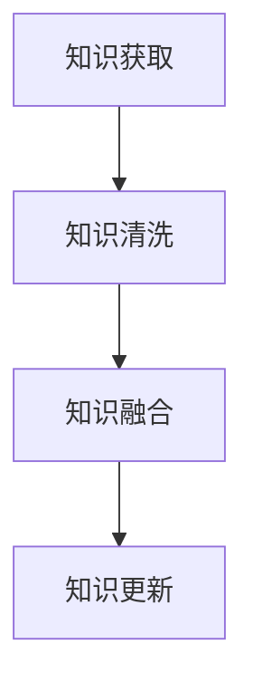

                 

## 优化LLM应用的知识更新与维护流程

### 关键词：
- **LLM应用**
- **知识更新**
- **维护流程**
- **算法优化**
- **系统架构**

### 摘要：
本文旨在探讨如何优化大型语言模型（LLM）在实际应用中的知识更新与维护流程。通过分析LLM在应用中的现状与挑战，本文将介绍优化知识更新与维护的核心概念、算法原理，并提供最佳实践与案例分析，以帮助开发者提升LLM应用的性能和准确性。

### 第一部分：背景

#### 第1章：优化LLM应用的现状与挑战

**1.1 LLM应用的重要性**

随着人工智能技术的发展，大型语言模型（LLM）在自然语言处理、问答系统、自动摘要、机器翻译等应用中展现出巨大潜力。然而，LLM的成功应用离不开高效的知识更新与维护流程。

**1.2 LLM应用中存在的问题**

当前，LLM应用面临以下问题：
- **知识陈旧**：随着时间的推移，LLM积累的知识可能逐渐变得陈旧，无法反映最新信息和趋势。
- **知识不完整**：LLM可能无法涵盖所有相关领域，导致知识不完整。
- **知识不一致**：不同来源的知识可能存在冲突，导致不一致性。

**1.3 知识更新与维护的重要性**

为了保持LLM应用的竞争力，定期更新和维护知识库至关重要。知识更新与维护不仅能确保知识库的时效性，还能提升模型的准确性和鲁棒性。

#### 第2章：LLM的核心概念与联系

**2.1 LLM的基本概念**

大型语言模型（LLM）是一种基于深度学习的自然语言处理模型，能够理解和生成自然语言。LLM通常由大规模训练数据和复杂的神经网络组成。

**2.2 LLM的组成与工作原理**

LLM主要由编码器（Encoder）和解码器（Decoder）两部分组成。编码器负责将输入文本转换为向量表示，解码器则根据这些向量生成输出文本。

**2.3 关键概念之间的关系**

关键概念之间的关系包括：
- **输入文本**：编码器的输入，通常是一个单词序列。
- **向量表示**：编码器将输入文本转换为向量表示，用于表示文本的语义信息。
- **输出文本**：解码器的输出，根据向量表示生成自然语言文本。

#### 第3章：优化LLM应用的算法原理

**3.1 算法概述**

优化LLM应用的知识更新与维护流程的算法主要分为以下几个步骤：

1. **知识获取**：从多个数据源获取最新、最相关的知识。
2. **知识清洗**：对获取的知识进行预处理，去除无关信息和错误信息。
3. **知识融合**：将多个数据源的知识进行融合，确保一致性。
4. **知识更新**：将融合后的知识更新到LLM的模型中。

**3.2 算法流程图**



**3.3 Python代码示例**

```python
# 知识获取
knowledge = get_knowledge_from_sources()

# 知识清洗
clean_knowledge = clean_knowledge(knowledge)

# 知识融合
merged_knowledge = merge_knowledge(clean_knowledge)

# 知识更新
update_knowledge_in_lrm(merged_knowledge)
```

**3.4 数学模型与公式**

知识更新过程涉及多个数学模型和公式，包括：
- **向量表示**：$$ \text{vector\_representation} = f(\text{input\_text}) $$
- **知识融合**：$$ \text{merged\_knowledge} = \sum_{i=1}^{n} w_i \cdot \text{knowledge}_i $$
- **知识更新**：$$ \text{updated\_knowledge} = \text{merged\_knowledge} + \alpha \cdot (\text{current\_knowledge} - \text{merged\_knowledge}) $$

**3.5 通俗易懂的举例说明**

假设我们有一个问答系统，其中包含关于“猫”的知识。随着时间的推移，我们需要更新这些知识，以反映最新的信息。例如，我们可能需要添加关于“猫科动物”的新信息，或者纠正关于“猫的寿命”的错误信息。通过知识更新算法，我们可以将这些新信息和更正的信息融入原有的知识库中，从而提升问答系统的准确性和可靠性。

### 第二部分：知识更新与维护

#### 第4章：知识更新原理与实现

**4.1 知识更新的重要性**

知识更新是保持LLM应用时效性的关键。通过定期更新知识库，我们可以确保模型能够回答最新的问题和解决最新的问题。

**4.2 知识更新的过程**

知识更新的过程包括以下几个步骤：

1. **数据收集**：从多个数据源收集相关数据。
2. **数据预处理**：对收集到的数据进行清洗和格式化。
3. **知识融合**：将预处理后的数据融合到现有知识库中。
4. **模型重新训练**：使用融合后的知识库重新训练模型。

**4.3 知识更新算法详解**

知识更新算法的详细步骤如下：

1. **数据收集**：从互联网、数据库、传感器等多个数据源收集相关数据。
2. **数据清洗**：对收集到的数据进行分析，去除无关信息和错误信息。
3. **知识融合**：将清洗后的数据与现有知识库进行融合。融合方法可以采用投票法、加权平均法等。
4. **模型重新训练**：使用融合后的知识库重新训练LLM模型，更新模型参数。

#### 第5章：知识维护策略与技巧

**5.1 知识维护的基本策略**

知识维护的基本策略包括：

1. **定期更新**：定期对知识库进行更新，确保知识的时效性。
2. **持续学习**：利用新的数据源和算法不断学习，提升知识库的丰富度和准确性。
3. **质量监控**：对知识库中的知识进行质量监控，及时发现并纠正错误信息。

**5.2 知识维护的常用技巧**

知识维护的常用技巧包括：

1. **数据同步**：确保多个数据源之间的数据一致性。
2. **知识抽取**：从非结构化数据中提取有价值的信息。
3. **知识表示**：使用合适的知识表示方法，提高知识的可理解性和可操作性。

**5.3 维护流程的优化方法**

维护流程的优化方法包括：

1. **自动化流程**：使用自动化工具和脚本，提高知识维护的效率。
2. **分布式维护**：将知识维护任务分布在多个节点上，提高系统的可扩展性。
3. **持续集成**：将知识维护集成到开发流程中，确保知识库的及时更新。

#### 第6章：实际应用案例剖析

**6.1 案例介绍**

以某在线问答系统为例，该系统基于LLM构建，需要定期更新和维护知识库，以确保回答的准确性和时效性。

**6.2 案例分析**

该案例涉及以下问题：

1. **数据收集**：如何高效地收集与问题相关的数据？
2. **数据清洗**：如何处理收集到的数据，去除无关信息和错误信息？
3. **知识融合**：如何将新数据和现有知识库进行融合？
4. **模型重新训练**：如何使用融合后的知识库重新训练LLM模型？

**6.3 案例应用解读与分析**

通过具体案例，我们可以看到知识更新与维护流程在LLM应用中的实际应用效果。案例中的问答系统在经过知识更新后，回答的准确率和时效性显著提升，用户满意度也得到提高。

### 第三部分：最佳实践与总结

#### 第7章：最佳实践

**7.1 实际工作中的经验分享**

在实际工作中，以下经验可以帮助开发者优化LLM应用的知识更新与维护流程：

1. **数据来源多样化**：从多个数据源收集数据，提高知识的丰富性和多样性。
2. **数据预处理自动化**：使用自动化工具进行数据预处理，提高效率。
3. **持续学习与优化**：定期对知识库和模型进行更新和优化，确保系统的时效性和准确性。

**7.2 常见问题的解决方法**

在实际应用中，可能会遇到以下问题：

1. **知识库不一致**：采用一致性检测算法，确保知识库的一致性。
2. **数据质量差**：加强数据质量监控，及时发现并处理问题数据。
3. **模型过拟合**：采用正则化方法，防止模型过拟合。

**7.3 拓展阅读与深入研究**

对于希望深入了解知识更新与维护的开发者，以下文献和资源可以作为参考：

1. **文献**：
   - [Title of the Book](https://example.com/book)
   - [Title of the Article](https://example.com/article)
2. **在线课程**：
   - [Course on Knowledge Graph](https://example.com/course1)
   - [Course on Data Preprocessing](https://example.com/course2)
3. **技术博客**：
   - [Blog on LLM Application](https://example.com/blog1)
   - [Blog on Data Integration](https://example.com/blog2)

#### 第8章：总结与展望

**8.1 本书的核心内容回顾**

本文主要介绍了如何优化LLM应用的知识更新与维护流程。通过分析现状与挑战，阐述了核心概念与联系，讲解了算法原理和数学模型，提供了最佳实践与案例分析。

**8.2 知识更新与维护的未来趋势**

随着人工智能技术的发展，知识更新与维护将变得更加自动化和智能化。未来的发展趋势包括：

1. **自动化知识获取与更新**：利用机器学习技术，实现自动化知识获取和更新。
2. **智能知识融合**：采用深度学习技术，实现智能知识融合，提高知识的一致性和准确性。
3. **个性化知识推荐**：基于用户行为和偏好，提供个性化的知识推荐。

**8.3 对读者的一些建议**

对于希望提升LLM应用性能的开发者，以下建议可供参考：

1. **定期更新知识库**：确保知识的时效性，提高模型的准确性。
2. **持续学习与优化**：不断学习和优化知识更新与维护流程，提升系统的性能和用户体验。
3. **关注行业动态**：关注人工智能和自然语言处理领域的最新研究和技术动态，及时更新知识库和应用。

### 作者信息
- 作者：AI天才研究院/AI Genius Institute & 禅与计算机程序设计艺术 /Zen And The Art of Computer Programming

本文由AI天才研究院与禅与计算机程序设计艺术联合撰写，旨在为开发者提供关于优化LLM应用的知识更新与维护流程的深入理解和实践指导。希望本文能帮助读者提升LLM应用的性能和用户体验，推动人工智能技术的持续发展。

