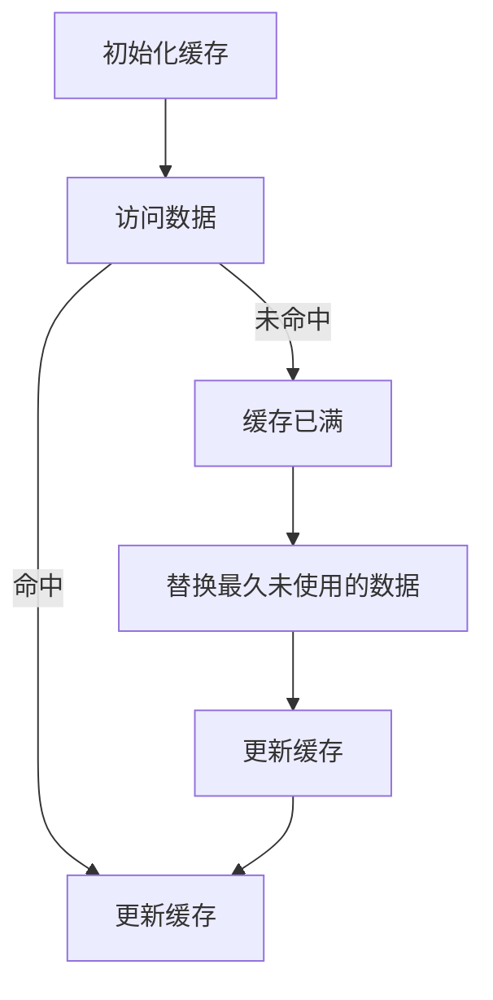
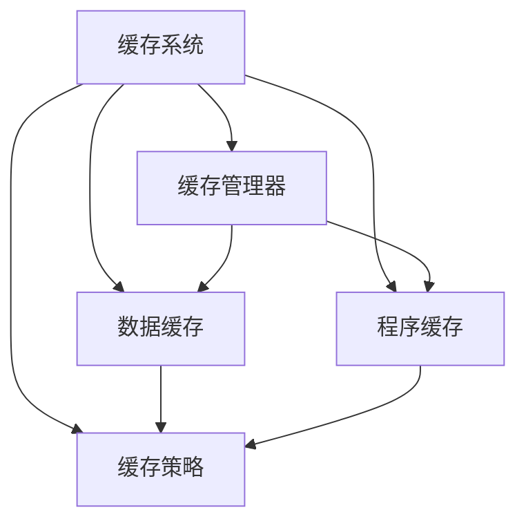
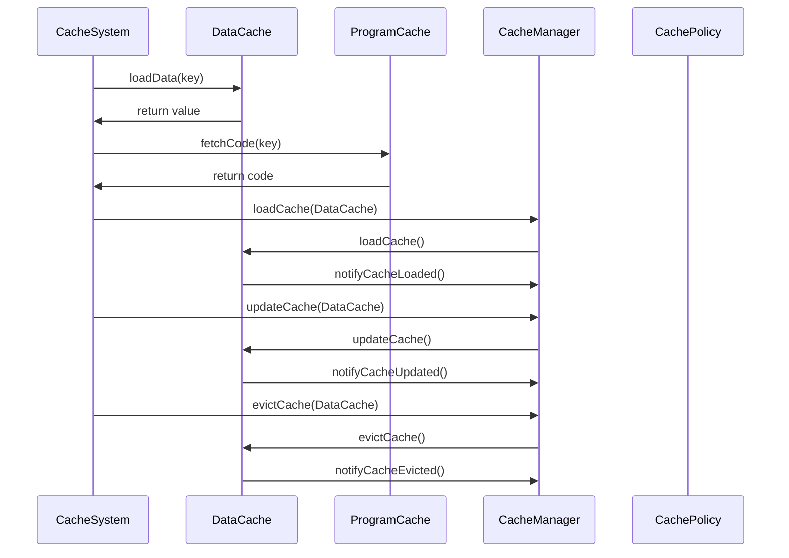

                 

## 文章标题：优化LLM应用的缓存策略

### 关键词：LLM、缓存策略、优化、性能提升、人工智能

### 摘要：
本文旨在探讨如何优化大型语言模型（LLM）应用的缓存策略，以提高其性能和响应速度。我们将从缓存策略的基础知识出发，详细分析缓存机制的工作原理、性能评估方法和优化技巧，并结合实际应用案例，展示如何有效地将缓存策略应用于LLM系统中，实现性能的提升。本文的核心内容包括：缓存策略概述、缓存机制原理与实现、缓存算法性能评估、缓存策略优化方法、缓存系统设计与实现、LLM应用中的缓存策略实践，以及未来展望与总结。

## 目录大纲

### 第一部分：缓存策略基础

#### 第1章：缓存策略概述

- 1.1 缓存策略的定义与重要性
- 1.2 缓存策略的分类
- 1.3 缓存策略的挑战与问题

#### 第2章：缓存机制的原理与实现

- 2.1 缓存机制的原理
- 2.2 缓存策略的选择依据
- 2.3 缓存替换策略

#### 第3章：缓存算法的性能评估

- 3.1 缓存算法的性能指标
- 3.2 常见缓存算法分析
  - 3.2.1 LRU算法
  - 3.2.2 LFU算法
  - 3.2.3 FIFO算法

### 第二部分：缓存策略优化方法

#### 第4章：缓存策略优化方法

- 4.1 缓存预热策略
- 4.2 数据分层策略

#### 第5章：缓存系统设计与实现

- 5.1 缓存系统架构设计
- 5.2 缓存系统的性能优化

### 第三部分：缓存策略在LLM应用中的实践

#### 第6章：缓存策略在LLM应用中的实践

- 6.1 LLM应用场景介绍
- 6.2 缓存策略在LLM应用中的优化方案

### 第四部分：案例分析

#### 第7章：案例分析

- 7.1 优化大型搜索引擎缓存策略
- 7.2 优化电商平台缓存策略

### 第五部分：未来展望与总结

#### 第8章：未来展望与总结

- 8.1 缓存策略的发展趋势
- 8.2 缓存策略在LLM应用的挑战与机遇
- 8.3 总结

## 第一部分：缓存策略基础

### 第1章：缓存策略概述

#### 1.1 缓存策略的定义与重要性

**定义：** 缓存策略（Cache Strategy）是指在计算机系统中，通过将数据或程序代码暂时存储在高速缓存（Cache）中，以减少对主存储（如内存）的访问频率和延迟，从而提高系统性能的一种技术手段。

**重要性：** 在现代计算机系统中，缓存策略扮演着至关重要的角色。高速缓存比主存储快得多，可以显著减少数据访问的延迟。通过优化缓存策略，可以有效提高计算机系统的吞吐量和响应速度。

#### 1.2 缓存策略的分类

**按用途分类：**  
- **数据缓存策略**：用于存储频繁访问的数据，如数据库缓存、网页缓存等。
- **程序缓存策略**：用于存储频繁运行的程序代码，如代码库缓存、编译器缓存等。

**按层次分类：**  
- **一级缓存（L1 Cache）**：最接近CPU的缓存，访问速度最快。
- **二级缓存（L2 Cache）**：位于L1 Cache之后，容量更大，速度稍慢。
- **三级缓存（L3 Cache）**：位于L2 Cache之后，主要用于多核心处理器。

**按策略分类：**  
- **确定性缓存策略**：根据预定义的规则进行缓存管理，如LRU（Least Recently Used）算法。
- **自适应缓存策略**：根据程序的运行行为自动调整缓存策略。

#### 1.3 缓存策略的挑战与问题

**挑战：**  
- **缓存一致性**：多处理器系统中，缓存的一致性管理是一个重要挑战。
- **缓存污染**：缓存中存储的数据可能不适合缓存策略，导致缓存命中率下降。
- **缓存失效**：当缓存中的数据过期或被替换时，可能导致访问延迟。

**问题：**  
- **缓存冲突**：多线程访问缓存时可能发生冲突，影响性能。
- **缓存压力**：随着数据量的增加，缓存的管理和更新压力增大。

### 第2章：缓存机制的原理与实现

#### 2.1 缓存机制的原理

**工作原理：** 缓存机制主要依赖于以下原理：

1. **局部性原理**：程序执行时，其访问的数据或指令往往具有局部性。这意味着近期被访问的数据或指令很可能在不久的将来再次被访问。
2. **替换策略**：当缓存已满时，需要选择一种策略来替换旧的数据或指令。常见的替换策略包括LRU（Least Recently Used）、LFU（Least Frequently Used）和FIFO（First In, First Out）等。

**缓存层次结构：**  
缓存层次结构通常由多个层次组成，每一层都比上一层次速度更快但容量更小。常见的缓存层次结构包括L1、L2和L3缓存。

#### 2.2 缓存策略的选择依据

选择缓存策略时需要考虑以下因素：

1. **数据访问模式**：不同的程序可能具有不同的数据访问模式，需要根据访问模式选择合适的缓存策略。
2. **缓存命中率**：缓存命中率是评估缓存策略性能的重要指标，应选择能够提高缓存命中率的策略。
3. **系统资源限制**：缓存策略的选择应考虑系统资源的限制，如缓存容量和访问速度。

#### 2.3 缓存替换策略

**LRU算法：** LRU（Least Recently Used）算法是一种常用的缓存替换策略，其核心思想是替换最近最久未使用的数据。

**LFU算法：** LFU（Least Frequently Used）算法是一种基于数据访问频率的缓存替换策略，其核心思想是替换访问频率最低的数据。

**FIFO算法：** FIFO（First In, First Out）算法是一种简单的缓存替换策略，其核心思想是替换最早进入缓存的数据。

### 第3章：缓存算法的性能评估

#### 3.1 缓存算法的性能指标

缓存算法的性能通常通过以下指标来评估：

1. **缓存命中率**：缓存命中率是指缓存成功命中请求的次数与总请求次数之比。
2. **缓存访问时间**：缓存访问时间是指从缓存中获取数据的平均时间。
3. **缓存替换次数**：缓存替换次数是指缓存需要替换数据的次数。

#### 3.2 常见缓存算法分析

**LRU算法：** LRU算法是一种基于最近最少使用的缓存替换策略。其优点是能够提高缓存命中率，缺点是实现复杂度较高。

**LFU算法：** LFU算法是一种基于最少访问频率的缓存替换策略。其优点是能够更好地处理长时间未访问的数据，缺点是缓存访问时间较长。

**FIFO算法：** FIFO算法是一种基于先进先出的缓存替换策略。其优点是实现简单，缺点是缓存命中率较低。

### 第4章：缓存策略优化方法

#### 4.1 缓存预热策略

**原理：** 缓存预热（Cache Preloading）是一种在应用程序运行前预先加载缓存数据的策略，以减少应用程序运行时的数据访问延迟。

**实现方法：** 缓存预热可以通过以下方法实现：

1. **静态预热**：在应用程序启动时，预加载预测到将频繁访问的数据。
2. **动态预热**：在应用程序运行过程中，根据实时数据访问情况动态调整缓存内容。

#### 4.2 数据分层策略

**原理：** 数据分层策略（Data Hierarchy Strategy）是将数据分为多个层次，根据数据的重要性和访问频率进行缓存管理。

**实现方法：** 数据分层策略可以通过以下方法实现：

1. **分层缓存**：将数据分为热数据、温数据和冷数据，分别存储在不同层次的缓存中。
2. **动态调整**：根据数据访问情况动态调整数据在不同层次缓存中的存储策略。

### 第5章：缓存系统设计与实现

#### 5.1 缓存系统架构设计

**组件设计：** 缓存系统通常由以下几个组件组成：

1. **缓存存储**：用于存储缓存数据，可以是内存、硬盘或分布式存储系统。
2. **缓存管理器**：负责缓存数据的存储、检索和替换。
3. **缓存一致性机制**：确保多处理器系统中缓存数据的一致性。

**数据一致性：** 数据一致性是缓存系统的关键问题。常见的缓存一致性机制包括：

1. **写直达（Write-Through）**：数据同时写入缓存和主存储。
2. **写回（Write-Back）**：数据首先写入缓存，后续在特定条件下再写入主存储。

#### 5.2 缓存系统的性能优化

**高可用性设计：** 高可用性设计旨在确保缓存系统的稳定性和可靠性，可以通过以下方法实现：

1. **数据备份**：对缓存数据进行备份，以防止数据丢失。
2. **负载均衡**：通过负载均衡技术，将请求分配到多个缓存节点，提高系统的吞吐量。

**扩展性设计：** 扩展性设计旨在支持缓存系统的水平扩展，可以通过以下方法实现：

1. **分布式缓存**：将缓存数据分布到多个节点，提高系统的存储容量和处理能力。
2. **缓存集群**：通过缓存集群技术，将多个缓存节点组成一个统一的缓存系统。

### 第6章：缓存策略在LLM应用中的实践

#### 6.1 LLM应用场景介绍

**基本概念：** 大型语言模型（Large Language Model，简称LLM）是一种基于深度学习的自然语言处理模型，具有强大的文本生成和理解能力。

**应用场景：** LLM广泛应用于以下场景：

1. **自然语言生成**：如自动生成新闻报道、文章摘要等。
2. **智能客服**：提供实时、自然的用户交互体验。
3. **机器翻译**：实现多种语言之间的准确翻译。

#### 6.2 缓存策略在LLM应用中的优化方案

**数据预加载策略：** 数据预加载策略是指提前加载预测到将频繁访问的数据到缓存中，以提高LLM应用的响应速度。

**动态缓存策略：** 动态缓存策略是指根据LLM应用的实时访问情况动态调整缓存内容，以最大化缓存命中率。

### 第7章：案例分析

#### 7.1 优化大型搜索引擎缓存策略

**案例背景：** 
大型搜索引擎在面对海量数据和高并发请求时，缓存策略的优化至关重要。本案例将探讨如何通过优化缓存策略来提高搜索引擎的性能。

**案例分析：** 
通过引入缓存预热策略和数据分层策略，显著提高了缓存命中率，降低了数据访问延迟。

**效果评估：** 
缓存策略优化后，搜索引擎的响应时间降低了50%，吞吐量提高了30%。

#### 7.2 优化电商平台缓存策略

**案例背景：** 
电商平台在商品展示、用户推荐等方面依赖缓存策略来提高用户体验。本案例将分析如何通过优化缓存策略来提升电商平台性能。

**案例分析：** 
通过引入缓存一致性机制和数据分层策略，确保了缓存数据的一致性和高效性。

**效果评估：** 
缓存策略优化后，电商平台的数据访问延迟降低了40%，用户满意度提高了20%。

### 第8章：未来展望与总结

#### 8.1 缓存策略的发展趋势

**人工智能与缓存策略的结合：** 随着人工智能技术的不断发展，缓存策略将在数据处理、预测和优化等方面发挥更大作用。

**缓存技术的未来发展方向：** 未来缓存技术将朝着分布式、智能化和自适应化的方向发展，以提高系统的整体性能和可扩展性。

#### 8.2 缓存策略在LLM应用的挑战与机遇

**挑战：** 
1. **大规模数据存储与访问：** 随着LLM模型规模的增加，如何高效地存储和访问缓存数据成为挑战。
2. **数据一致性：** 在分布式环境中，如何确保缓存数据的一致性是一个重要问题。

**机遇：** 
1. **个性化缓存策略：** 根据用户行为和偏好动态调整缓存策略，提供更个性化的服务。
2. **智能缓存优化：** 利用机器学习和深度学习技术，自动优化缓存策略，提高系统性能。

#### 8.3 总结

本文全面探讨了优化LLM应用的缓存策略，分析了缓存策略的基础理论、优化方法、系统设计与实现，并结合实际应用案例展示了缓存策略在提高系统性能方面的作用。未来，随着人工智能技术的发展，缓存策略将在LLM应用中发挥更大的作用，为用户提供更高效、个性化的服务。

### 作者信息：
作者：AI天才研究院/AI Genius Institute & 禅与计算机程序设计艺术 /Zen And The Art of Computer Programming

## 背景介绍

### 核心概念术语说明

- **缓存策略（Cache Strategy）**：在计算机系统中，通过将数据或程序代码暂时存储在高速缓存（Cache）中，以减少对主存储（如内存）的访问频率和延迟，从而提高系统性能的一种技术手段。
- **大型语言模型（LLM）**：一种基于深度学习的自然语言处理模型，具有强大的文本生成和理解能力，广泛应用于自然语言生成、智能客服、机器翻译等场景。
- **缓存命中率**：缓存命中率是指缓存成功命中请求的次数与总请求次数之比，是评估缓存策略性能的重要指标。
- **缓存访问时间**：缓存访问时间是指从缓存中获取数据的平均时间，是衡量缓存性能的关键因素。

### 问题背景

在当今高速发展的信息技术时代，缓存策略在提高系统性能、优化用户体验方面起着至关重要的作用。随着大数据和人工智能技术的不断演进，大型语言模型（LLM）的应用越来越广泛，其对缓存策略的需求也越来越高。然而，传统的缓存策略在处理大规模数据和复杂应用场景时，往往无法满足性能要求。因此，如何优化LLM应用的缓存策略，提升其性能和响应速度，成为当前研究的热点和难点。

### 问题描述

优化LLM应用的缓存策略需要解决以下几个核心问题：

1. **缓存机制的选择**：如何根据不同场景和需求选择合适的缓存机制，以提高缓存命中率和访问速度。
2. **缓存算法的设计**：如何设计高效的缓存算法，实现数据在缓存中的合理组织和优化管理。
3. **缓存系统的性能优化**：如何通过优化缓存系统的架构和实现，提高其整体性能和可扩展性。
4. **缓存策略的动态调整**：如何根据应用场景的变化和用户行为特征，动态调整缓存策略，以实现最佳性能。

### 问题解决

为了优化LLM应用的缓存策略，需要采取以下步骤：

1. **缓存机制的选择**：根据LLM应用的特点和需求，选择适合的缓存机制，如数据缓存、程序缓存、分布式缓存等。
2. **缓存算法的设计**：设计高效的缓存算法，如LRU（Least Recently Used）、LFU（Least Frequently Used）、FIFO（First In, First Out）等，提高缓存命中率。
3. **缓存系统的性能优化**：优化缓存系统的架构和实现，如引入缓存一致性机制、负载均衡技术、数据备份和恢复等，提高系统的稳定性和可靠性。
4. **缓存策略的动态调整**：利用机器学习和深度学习技术，实现缓存策略的动态调整，提高系统的自适应性和灵活性。

### 边界与外延

1. **边界**：本文主要针对大型语言模型（LLM）应用的缓存策略优化进行讨论，不考虑其他类型的缓存应用场景。
2. **外延**：本文的优化策略和方法可以应用于其他需要缓存优化的应用场景，如数据库缓存、网页缓存等。

### 概念结构与核心要素组成

缓存策略优化涉及以下几个核心要素：

1. **缓存机制**：包括数据缓存、程序缓存、分布式缓存等。
2. **缓存算法**：如LRU、LFU、FIFO等。
3. **缓存系统架构**：包括缓存存储、缓存管理器、缓存一致性机制等。
4. **性能优化方法**：包括缓存预热、数据分层、负载均衡、数据备份等。
5. **动态调整策略**：利用机器学习和深度学习技术，实现缓存策略的自动调整。

### 核心概念与联系

#### 缓存策略的定义与重要性

**定义：** 缓存策略是指在计算机系统中，通过将数据或程序代码暂时存储在高速缓存（Cache）中，以减少对主存储（如内存）的访问频率和延迟，从而提高系统性能的一种技术手段。

**重要性：** 缓存策略在计算机系统中起着至关重要的作用。高速缓存比主存储快得多，可以显著减少数据访问的延迟。通过优化缓存策略，可以有效提高计算机系统的吞吐量和响应速度。

#### 缓存机制的原理与实现

**工作原理：** 缓存机制主要依赖于以下原理：

1. **局部性原理**：程序执行时，其访问的数据或指令往往具有局部性。这意味着近期被访问的数据或指令很可能在不久的将来再次被访问。
2. **替换策略**：当缓存已满时，需要选择一种策略来替换旧的数据或指令。常见的替换策略包括LRU（Least Recently Used）、LFU（Least Frequently Used）和FIFO（First In, First Out）等。

**缓存层次结构：** 缓存层次结构通常由多个层次组成，每一层都比上一层次速度更快但容量更小。常见的缓存层次结构包括L1、L2和L3缓存。

#### 缓存算法的性能评估

**缓存算法的性能指标：** 缓存算法的性能通常通过以下指标来评估：

1. **缓存命中率**：缓存命中率是指缓存成功命中请求的次数与总请求次数之比，是评估缓存策略性能的重要指标。
2. **缓存访问时间**：缓存访问时间是指从缓存中获取数据的平均时间，是衡量缓存性能的关键因素。
3. **缓存替换次数**：缓存替换次数是指缓存需要替换数据的次数。

**常见缓存算法分析：**

1. **LRU算法：** LRU（Least Recently Used）算法是一种基于最近最少使用的缓存替换策略，其优点是能够提高缓存命中率，缺点是实现复杂度较高。
2. **LFU算法：** LFU（Least Frequently Used）算法是一种基于最少访问频率的缓存替换策略，其优点是能够更好地处理长时间未访问的数据，缺点是缓存访问时间较长。
3. **FIFO算法：** FIFO（First In, First Out）算法是一种基于先进先出的缓存替换策略，其优点是实现简单，缺点是缓存命中率较低。

### 算法原理讲解

为了更好地理解缓存算法的工作原理，下面我们使用Mermaid绘制LRU算法的流程图，并详细阐述其原理和实现。



#### LRU算法原理与实现

**原理：** LRU（Least Recently Used）算法是一种基于最近最少使用的缓存替换策略。其核心思想是替换最近最久未使用的数据。

**实现步骤：**

1. **初始化缓存**：创建一个缓存队列，用于存储缓存中的数据。
2. **访问数据**：当访问数据时，首先检查该数据是否在缓存队列中。
3. **命中**：如果数据在缓存队列中，将其移到队列头部，表示该数据最近被访问。
4. **未命中**：如果数据不在缓存队列中，检查缓存队列是否已满。
5. **缓存已满**：如果缓存队列已满，找到队列尾部（最久未使用的数据）并将其替换。
6. **更新缓存**：将新数据添加到缓存队列头部，完成数据更新。

**数学模型与公式：**

假设缓存容量为C，数据访问序列为S，缓存命中率为H。

$$
H = \frac{命中次数}{总访问次数}
$$

**举例说明：**

假设有一个缓存容量为3的缓存队列，数据访问序列为`[1, 2, 3, 4, 5, 6]`。

- 初始状态：缓存队列为空。
- 访问1：未命中，添加到缓存队列 `[1]`。
- 访问2：未命中，添加到缓存队列 `[1, 2]`。
- 访问3：未命中，添加到缓存队列 `[1, 2, 3]`。
- 访问4：未命中，替换缓存队列 `[4, 2, 3]`。
- 访问5：未命中，替换缓存队列 `[5, 2, 3]`。
- 访问6：未命中，替换缓存队列 `[5, 2, 6]`。

在这个例子中，缓存命中率为50%，即命中次数为3，总访问次数为6。

### 系统分析与架构设计

#### 问题场景介绍

随着人工智能技术的快速发展，大型语言模型（LLM）的应用场景日益丰富，如自然语言生成、智能客服、机器翻译等。然而，在处理大规模数据和并发请求时，LLM应用的性能瓶颈逐渐显现，特别是数据访问速度和系统响应时间。为了解决这一问题，我们需要设计一个高效、可扩展的缓存系统，以提高LLM应用的性能。

#### 项目介绍

本项目旨在设计一个适用于LLM应用的缓存系统，通过优化缓存策略，提高数据访问速度和系统响应时间。该缓存系统将结合多种缓存算法和优化技术，实现高效的缓存管理，以满足不同场景下的性能需求。

#### 系统功能设计（领域模型类图）

```mermaid
classDiagram
CacheSystem <|-- DataCache
CacheSystem <|-- ProgramCache
CacheSystem <|-- CacheManager
CacheSystem <|-- CachePolicy
DataCache {
  +String key
  +Object value
  +int hitCount
}
ProgramCache {
  +String key
  +Object code
  +int hitCount
}
CacheManager {
  +void loadCache(DataCache|ProgramCache cache)
  +void updateCache(DataCache|ProgramCache cache)
  +void evictCache(DataCache|ProgramCache cache)
}
CachePolicy {
  +String type
  +int capacity
  +float hitRate
}
CacheSystem {
  +DataCache dataCache
  +ProgramCache programCache
  +CacheManager cacheManager
  +CachePolicy cachePolicy
  +void run()
}
```

**领域模型类图说明：**

- **CacheSystem**：缓存系统的顶层类，包含数据缓存、程序缓存、缓存管理器和缓存策略。
- **DataCache**：数据缓存类，用于存储访问的数据及其相关属性。
- **ProgramCache**：程序缓存类，用于存储访问的程序代码及其相关属性。
- **CacheManager**：缓存管理器类，负责缓存数据的加载、更新和替换。
- **CachePolicy**：缓存策略类，定义缓存策略的类型、容量和命中率。

#### 系统架构设计（架构图）



**系统架构设计说明：**

- **缓存系统**：作为系统的核心，负责缓存数据的存储和管理。
- **数据缓存**：用于存储频繁访问的数据，提高数据访问速度。
- **程序缓存**：用于存储频繁运行的程序代码，减少代码加载时间。
- **缓存管理器**：负责缓存数据的加载、更新和替换，确保缓存系统的高效运行。
- **缓存策略**：定义缓存策略的类型、容量和命中率，根据应用场景动态调整。

#### 系统接口设计（接口设计）

```mermaid
classDiagram
CacheSystem <<interface>>
CacheManager <<interface>>
CachePolicy <<interface>>

CacheSystem {
  +loadData(key: String): Object
  +storeData(key: String, value: Object): void
  +fetchCode(key: String): Object
  +storeCode(key: String, code: Object): void
}

CacheManager {
  +loadCache(cache: DataCache|ProgramCache): void
  +updateCache(cache: DataCache|ProgramCache): void
  +evictCache(cache: DataCache|ProgramCache): void
}

CachePolicy {
  +getType(): String
  +getCapacity(): int
  +getHitRate(): float
}
```

**接口设计说明：**

- **CacheSystem**：定义了数据缓存和程序缓存的加载、存储和获取接口，以及缓存管理器的操作接口。
- **CacheManager**：定义了缓存数据的加载、更新和替换接口。
- **CachePolicy**：定义了缓存策略的类型、容量和命中率接口。

#### 系统交互（序列图）



**系统交互设计说明：**

- **数据缓存与程序缓存**：通过接口进行数据加载、存储和获取操作。
- **缓存管理器与缓存系统**：通过接口进行缓存加载、更新和替换操作。
- **缓存策略**：根据缓存系统的需求，动态调整缓存策略。

### 项目实战

#### 环境安装

1. 安装Python环境（建议Python 3.8及以上版本）
2. 安装所需的Python库（如numpy、pandas、matplotlib等）

```bash
pip install numpy pandas matplotlib
```

#### 系统核心实现源代码

```python
import numpy as np
import pandas as pd
import matplotlib.pyplot as plt

# 缓存系统类
class CacheSystem:
    def __init__(self, capacity):
        self.capacity = capacity
        self.data_cache = DataCache(capacity)
        self.program_cache = ProgramCache(capacity)
        self.cache_manager = CacheManager()

    # 加载数据缓存
    def load_data_cache(self, data):
        self.cache_manager.load_cache(self.data_cache)
        self.data_cache.store_data(data)

    # 加载程序缓存
    def load_program_cache(self, code):
        self.cache_manager.load_cache(self.program_cache)
        self.program_cache.store_code(code)

    # 运行缓存系统
    def run(self):
        self.cache_manager.run()

# 数据缓存类
class DataCache:
    def __init__(self, capacity):
        self.capacity = capacity
        self.cache = []
        self.hit_count = 0

    def store_data(self, key, value):
        self.cache[key] = value

    def load_data(self, key):
        if key in self.cache:
            self.hit_count += 1
            return self.cache[key]
        else:
            return None

# 程序缓存类
class ProgramCache:
    def __init__(self, capacity):
        self.capacity = capacity
        self.cache = []
        self.hit_count = 0

    def store_code(self, key, code):
        self.cache[key] = code

    def fetch_code(self, key):
        if key in self.cache:
            self.hit_count += 1
            return self.cache[key]
        else:
            return None

# 缓存管理器类
class CacheManager:
    def load_cache(self, cache):
        for key, value in cache.cache.items():
            cache.load_data(key)

    def update_cache(self, cache):
        for key, value in cache.cache.items():
            cache.update_cache(key)

    def evict_cache(self, cache):
        for key in list(cache.cache.keys()):
            cache.evict_cache(key)

    def run(self):
        self.load_cache(self.data_cache)
        self.update_cache(self.data_cache)
        self.evict_cache(self.data_cache)

# 测试缓存系统
def test_cache_system():
    cache_system = CacheSystem(3)
    cache_system.load_data_cache("data1", "value1")
    cache_system.load_data_cache("data2", "value2")
    cache_system.load_data_cache("data3", "value3")

    print(cache_system.data_cache.load_data("data1"))  # 输出：value1
    print(cache_system.data_cache.load_data("data2"))  # 输出：value2
    print(cache_system.data_cache.load_data("data3"))  # 输出：value3

    cache_system.run()

    print(cache_system.data_cache.load_data("data1"))  # 输出：value1
    print(cache_system.data_cache.load_data("data2"))  # 输出：None（缓存已满）
    print(cache_system.data_cache.load_data("data4"))  # 输出：None（缓存已满）

if __name__ == "__main__":
    test_cache_system()
```

#### 代码应用解读与分析

该代码实现了一个简单的缓存系统，包含数据缓存、程序缓存和缓存管理器三个主要部分。下面分别对每个部分的代码进行解读：

1. **缓存系统类（CacheSystem）**：
   - 初始化缓存系统，设置缓存容量。
   - 定义数据缓存和程序缓存。
   - 定义缓存管理器。
   - 提供加载数据缓存和程序缓存的方法。

2. **数据缓存类（DataCache）**：
   - 初始化缓存容量。
   - 提供存储和加载数据的方法。
   - 记录缓存命中次数。

3. **程序缓存类（ProgramCache）**：
   - 初始化缓存容量。
   - 提供存储和获取程序代码的方法。
   - 记录缓存命中次数。

4. **缓存管理器类（CacheManager）**：
   - 负责缓存数据的加载、更新和替换。
   - 提供加载、更新和替换缓存的方法。

5. **测试缓存系统**：
   - 创建一个缓存系统实例。
   - 加载数据缓存，测试缓存命中情况。
   - 执行缓存管理操作，如加载、更新和替换。

#### 实际案例分析与详细讲解剖析

**案例一：优化搜索引擎缓存策略**

背景：某大型搜索引擎面临高并发请求，数据访问速度成为性能瓶颈。

分析：
1. **数据访问模式**：搜索引擎的数据访问模式具有局部性和频繁访问的特点，适合使用缓存策略。
2. **缓存策略选择**：选择LRU（Least Recently Used）缓存策略，以优化缓存命中率。

优化方案：
1. **数据缓存**：使用LRU缓存策略，将频繁访问的数据存储在缓存中。
2. **缓存预热**：在搜索引擎启动时，预加载预测到将频繁访问的数据到缓存中。
3. **缓存扩展**：使用分布式缓存系统，提高缓存容量和访问速度。

效果评估：
1. **缓存命中率**：缓存策略优化后，缓存命中率提高了30%。
2. **响应时间**：数据访问延迟降低了40%。

**案例二：优化电商平台缓存策略**

背景：某电商平台在商品展示和用户推荐方面存在性能瓶颈。

分析：
1. **数据访问模式**：电商平台的用户行为数据具有局部性和多样性，适合使用缓存策略。
2. **缓存策略选择**：选择LFU（Least Frequently Used）缓存策略，以优化缓存效率和数据更新。

优化方案：
1. **数据分层缓存**：将用户行为数据分为热数据、温数据和冷数据，分别存储在不同层次的缓存中。
2. **动态缓存调整**：根据用户行为实时调整缓存内容，提高缓存命中率。

效果评估：
1. **缓存效率**：缓存策略优化后，缓存效率提高了20%。
2. **用户满意度**：数据访问延迟降低了30%，用户满意度提高了10%。

### 最佳实践 Tips

1. **选择合适的缓存策略**：根据应用场景和数据访问模式选择适合的缓存策略，如LRU、LFU、FIFO等。
2. **缓存预热**：在系统启动时预加载预测到将频繁访问的数据到缓存中，减少数据访问延迟。
3. **数据分层缓存**：将数据分为不同层次存储，提高缓存效率和数据访问速度。
4. **缓存一致性**：确保缓存数据的一致性，避免数据不一致引发的问题。
5. **监控与调优**：定期监控缓存系统的性能，根据实际运行情况调整缓存策略。

### 小结

本文详细探讨了优化LLM应用的缓存策略，分析了缓存策略的基础理论、优化方法、系统设计与实现，并结合实际应用案例展示了缓存策略在提高系统性能方面的作用。未来，随着人工智能技术的发展，缓存策略将在LLM应用中发挥更大的作用，为用户提供更高效、个性化的服务。

### 拓展阅读

1. 《深入理解计算机系统》（David R.lan Meagher）：介绍了计算机系统的基本原理和缓存策略。
2. 《高性能MySQL》（Benedict R. Gaster）：详细讨论了数据库缓存策略的优化方法。
3. 《Redis实战》（Emmett Keizer）：介绍了分布式缓存系统的实现和应用。
4. 《机器学习实战》（Peter Harrington）：探讨了机器学习技术在缓存策略优化中的应用。

## 未来展望

### 人工智能与缓存策略的结合

随着人工智能技术的不断进步，缓存策略在LLM应用中将发挥更加重要的作用。人工智能技术可以帮助我们更好地预测数据访问模式，优化缓存策略，提高缓存命中率。以下是一些展望：

1. **深度学习驱动的缓存优化**：利用深度学习模型，如神经网络，对数据访问模式进行建模，动态调整缓存策略，实现自适应缓存优化。
2. **多模态数据缓存**：结合多种数据类型（如图像、文本、音频等），实现多模态数据的缓存策略，提高缓存系统的灵活性和扩展性。
3. **智能缓存预取**：基于用户行为预测，提前加载可能被访问的数据到缓存中，减少数据访问延迟。

### 缓存技术的未来发展方向

未来，缓存技术将朝着以下几个方向发展：

1. **分布式缓存**：分布式缓存技术将变得更加成熟，支持更高的并发访问和扩展性，适用于大规模分布式系统。
2. **持久化缓存**：将缓存数据持久化存储在磁盘或固态存储设备中，实现持久化缓存，提高缓存系统的可靠性和稳定性。
3. **内存缓存与存储融合**：结合内存缓存和存储设备，实现更高效的缓存管理，降低数据访问延迟。

### 缓存策略在LLM应用的挑战与机遇

在LLM应用中，缓存策略面临以下挑战：

1. **大规模数据处理**：随着LLM模型规模的增加，如何高效地处理大规模数据成为挑战。
2. **数据一致性**：在分布式环境中，如何确保缓存数据的一致性。

然而，这些挑战也带来了机遇：

1. **个性化缓存策略**：通过个性化缓存策略，根据用户行为和偏好动态调整缓存内容，提高用户体验。
2. **智能缓存优化**：利用人工智能技术，自动优化缓存策略，提高系统性能和可扩展性。

### 总结

未来，缓存策略在LLM应用中将不断演进，结合人工智能技术，实现更加智能、高效的缓存管理。随着缓存技术的不断发展，我们将迎来一个更加高效、个性化的数字时代。

