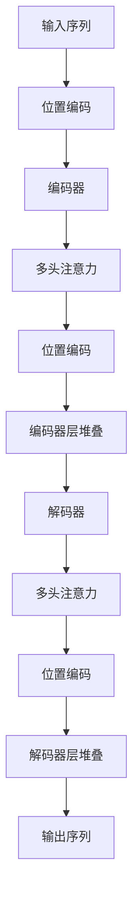
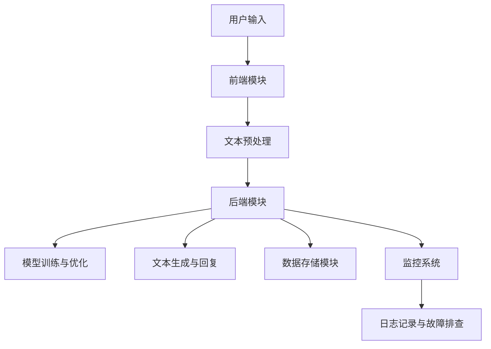
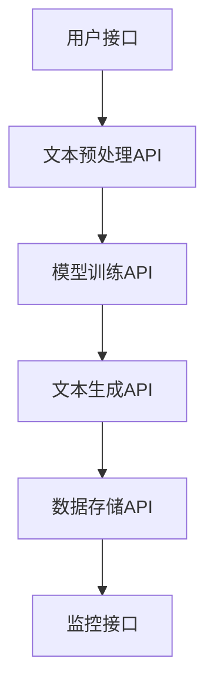

                 

## 引言与背景介绍

### LLM的概念与重要性

让我们首先回顾一下LLM（大型语言模型）的基本概念。LLM是一种能够理解、生成和响应自然语言文本的人工智能模型。它通过对大量文本数据进行训练，学习语言的结构、语义和上下文关系，从而实现高效的语言理解和生成。

LLM的应用范围非常广泛，涵盖了自然语言处理（NLP）的许多子领域，包括文本分类、机器翻译、问答系统、文本摘要等。在当今科技迅速发展的时代，LLM已经成为企业、研究机构和开发者不可或缺的工具。然而，随着应用的不断深入，如何优化LLM的性能和效率成为一个亟待解决的问题。

### 优化LLM应用的需求

优化LLM应用的需求源于以下几个方面：

1. **性能提升**：在处理大规模文本数据时，如何提高模型的计算速度和响应速度是许多应用场景中的关键问题。优化算法、模型压缩和并行计算等技术手段可以有效地提高LLM的性能。

2. **资源消耗**：LLM的训练和推理过程需要大量的计算资源和存储资源。在资源受限的环境下，如何高效地利用现有资源成为优化的重要目标。

3. **可扩展性**：随着数据量的不断增加，LLM模型需要具备良好的可扩展性，以适应不同规模的应用场景。

4. **准确性和鲁棒性**：提高模型的准确性和鲁棒性，使其在不同类型的文本数据中都能表现出色，是优化的重要目标。

### 优化需求的分析过程

为了满足上述需求，我们需要进行一系列的需求分析工作。这个过程可以分为以下几个步骤：

1. **问题定义**：明确优化LLM应用的具体目标和问题。

2. **数据收集**：收集相关领域的文献、案例和用户反馈，以了解当前LLM应用中的痛点和瓶颈。

3. **需求收集**：通过与相关利益相关者（如开发人员、产品经理、用户等）进行沟通，收集他们的需求和期望。

4. **需求分析**：对收集到的需求进行分析，确定哪些需求是最关键、最紧迫的。

5. **需求定义**：将分析结果转化为明确的需求定义，包括需求描述、优先级、约束条件等。

6. **需求验证**：通过与利益相关者进行沟通，验证需求定义的准确性和可行性。

通过以上步骤，我们可以系统地分析和定义优化LLM应用的需求，为后续的设计和实现提供清晰的指导。

### 总结

本节介绍了LLM的概念及其在应用中的重要性，阐述了优化LLM应用的需求及其分析过程。接下来，我们将进一步深入探讨LLM的核心概念、算法原理、系统架构设计以及项目实战等方面的内容。

---

# 核心概念与联系

在深入讨论优化LLM应用的需求分析与定义过程之前，我们需要先明确几个关键概念：LLM（大型语言模型）、需求分析、定义过程等。这些概念是理解整个优化过程的基础，因此我们将在这里对它们进行详细的定义和解释。

### 1. LLM的定义与特性

LLM，即大型语言模型，是一种基于神经网络模型的语言处理工具，它可以理解和生成自然语言。LLM通常包含数亿甚至数千亿个参数，这使得它们能够捕捉到语言的复杂性和细微差别。

**LLM的主要特性包括：**

- **大规模**：LLM通常由数亿到数千亿个参数组成，这使得它们能够处理大规模的文本数据。

- **自适应**：LLM能够根据输入的文本数据自动调整其参数，以适应不同的语言环境和场景。

- **高效推理**：LLM可以在短时间内生成高质量的文本响应，这使得它们在实时应用中表现出色。

### 2. 需求分析的基本原理

需求分析是软件开发过程中的一个关键步骤，它旨在理解用户的需求和期望，并将其转化为具体的软件功能。对于优化LLM应用，需求分析尤为关键，因为它直接影响到模型的设计和实现。

**需求分析的基本原理包括：**

- **用户参与**：需求分析必须与用户紧密合作，以确保需求的准确性和完整性。

- **问题定义**：明确需要解决的问题和目标，这是需求分析的第一步。

- **需求收集**：通过与用户和其他利益相关者沟通，收集他们对系统的需求。

- **需求分析**：对收集到的需求进行分析和整理，确保它们是具体、可实现的。

- **需求文档**：将分析结果整理成需求文档，以便后续的设计和实现。

### 3. 定义过程的关键因素

定义过程是需求分析的自然延伸，它旨在将抽象的需求转化为具体的实现方案。在优化LLM应用的过程中，定义过程需要考虑多个关键因素：

- **明确性**：需求定义必须清晰明确，避免歧义和误解。

- **可验证性**：需求定义必须能够通过某种方式验证其是否满足。

- **可实施性**：需求定义必须考虑实现过程中的可行性和资源约束。

- **优先级**：根据需求的紧急性和重要性，对需求进行优先级排序。

### 4. LLM与需求分析的关联

LLM的优化需求分析是一个复杂的过程，它需要将LLM的特性与用户需求紧密结合。以下是LLM与需求分析之间的几个关键关联：

- **需求驱动**：优化LLM的需求分析应该基于用户需求，确保模型能够满足实际应用场景的需求。

- **模型适应性**：在需求分析过程中，需要考虑如何使LLM适应不同的需求，例如不同的数据集、不同的应用场景等。

- **性能优化**：需求分析过程中，应该识别出影响LLM性能的关键因素，并设计相应的优化策略。

- **资源利用**：在需求分析过程中，应该评估LLM所需的计算资源和存储资源，并优化资源利用效率。

### 5. 概念属性对比表格

为了更好地理解LLM、需求分析、定义过程等概念，我们可以通过一个概念属性对比表格来展示它们的主要特性。

| 概念     | 特点1           | 特点2           | 特点3           |
| --------- | -------------- | -------------- | -------------- |
| LLM       | 大规模语言模型 | 自适应          | 高效推理        |
| 需求分析 | 全面性         | 客观性         | 持续迭代        |
| 定义过程 | 明确性         | 可验证性       | 可实施性        |

### 6. 关键实体关系图

为了展示LLM应用中关键实体的关系，我们可以使用Mermaid来绘制一个ER图。以下是ER图的示例：

```mermaid
erDiagram
  User ||--|{ Requirement }: Requirement
  User ||--|{ Analysis}: Analysis
  User ||--|{ Design}: Design
  User ||--|{ Implementation}: Implementation
  User ||--|{ Testing}: Testing
  LLM ||--|{ Training Data}: TrainingData
  LLM ||--|{ Model Configuration}: ModelConfiguration
  Analysis ||--|{ Data Collection}: DataCollection
  Analysis ||--|{ Data Analysis}: DataAnalysis
  Design ||--|{ System Architecture}: SystemArchitecture
  Implementation ||--|{ Code Implementation}: CodeImplementation
  Testing ||--|{ Test Case Design}: TestCaseDesign
  Testing ||--|{ Test Execution}: TestExecution
```

在这个ER图中，用户与多个实体之间存在关联，包括需求、分析、设计、实现和测试。LLM与训练数据和模型配置相关，而分析过程涉及数据收集和分析，设计过程涉及系统架构设计，实现过程涉及代码实现，测试过程涉及测试用例设计和执行。

通过上述内容，我们对LLM、需求分析、定义过程等核心概念有了更深入的理解。接下来，我们将进一步探讨算法原理讲解、系统分析与架构设计等方面的内容，以全面掌握优化LLM应用的需求分析与定义过程。

### 算法原理讲解

在深入探讨如何优化LLM应用的需求分析与定义过程之前，我们需要对相关算法的原理有一个清晰的理解。本文将详细介绍一个典型的优化算法——Transformer算法，并展示其实现过程。

#### 1. Transformer算法的基本原理

Transformer算法是由Vaswani等人于2017年提出的一种基于自注意力机制的序列到序列模型，它在机器翻译、文本摘要等任务上表现出色。Transformer的核心思想是利用自注意力机制来处理输入序列中的上下文信息，从而提高模型的建模能力。

**自注意力机制**：自注意力机制是一种计算输入序列中每个单词对输出序列中每个单词的重要性权重的机制。通过这种方式，模型可以更好地捕捉序列中的长距离依赖关系。

**编码器-解码器结构**：Transformer算法采用了编码器-解码器（Encoder-Decoder）结构，其中编码器负责将输入序列编码为固定长度的向量表示，解码器则负责生成输出序列。

**多头注意力**：多头注意力是一种在自注意力机制中引入多个独立的注意力头，从而提高模型的表示能力。

**位置编码**：由于Transformer算法中没有循环神经网络（RNN）中的位置信息传递机制，因此需要使用位置编码来为每个单词赋予位置信息。

#### 2. Transformer算法的实现

下面我们将使用Mermaid绘制一个简单的Transformer算法流程图，并展示其Python代码实现。

**流程图示例**：



**Python代码示例**：

```python
import torch
import torch.nn as nn

# 编码器层
class EncoderLayer(nn.Module):
    def __init__(self, d_model, d_inner, n_head, d_k, d_v, dropout=0.1):
        super(EncoderLayer, self).__init__()
        self.attention = nn.MultiheadAttention(d_model, n_head, d_k, d_v, dropout=dropout)
        self.fc = nn.Sequential(
            nn.Linear(d_model, d_inner),
            nn.GELU(),
            nn.Linear(d_inner, d_model),
            nn.Dropout(dropout)
        )
        self.norm1 = nn.LayerNorm(d_model)
        self.norm2 = nn.LayerNorm(d_model)

    def forward(self, x, attn_mask=None):
        x2 = self.attention(x, x, x, attn_mask=attn_mask)[0]
        x = x + self.fc(self.norm1(x))
        x2 = self.attention(x, x, x, attn_mask=attn_mask)[0]
        x = x + self.fc(self.norm2(x))
        return x

# 解码器层
class DecoderLayer(nn.Module):
    def __init__(self, d_model, d_inner, n_head, d_k, d_v, dropout=0.1):
        super(DecoderLayer, self).__init__()
        self.attention1 = nn.MultiheadAttention(d_model, n_head, d_k, d_v, dropout=dropout)
        self.attention2 = nn.MultiheadAttention(d_model, n_head, d_k, d_v, dropout=dropout)
        self.fc = nn.Sequential(
            nn.Linear(d_model, d_inner),
            nn.GELU(),
            nn.Linear(d_inner, d_model),
            nn.Dropout(dropout)
        )
        self.norm1 = nn.LayerNorm(d_model)
        self.norm2 = nn.LayerNorm(d_model)
        self.norm3 = nn.LayerNorm(d_model)

    def forward(self, x, encoder_out, src_mask=None, tgt_mask=None, attn_mask=None):
        x2 = self.attention1(x, x, x, attn_mask=tgt_mask)[0]
        x = x + self.fc(self.norm1(x))
        x2 = self.attention2(x, encoder_out, encoder_out, attn_mask=attn_mask)[0]
        x = x + self.fc(self.norm2(x))
        x = x + self.fc(self.norm3(x))
        return x
```

#### 3. 算法数学模型与公式

Transformer算法的核心在于多头自注意力机制，其数学模型如下：

$$
\text{Attention}(Q, K, V) = \text{softmax}\left(\frac{QK^T}{\sqrt{d_k}}\right)V
$$

其中，$Q, K, V$分别为编码器输出的查询向量、键向量和值向量，$d_k$为键向量的维度，$\text{softmax}$函数用于计算每个键-值对的权重。

另外，为了防止梯度消失，Transformer算法使用了GELU激活函数和层归一化（Layer Normalization）技术。

#### 4. 算法举例说明

假设我们有一个简单的序列 "The cat sat on the mat"，我们可以使用Transformer算法来生成一个响应。

1. **输入序列编码**：

   将输入序列 "The cat sat on the mat" 转换为编码器输入向量，并进行位置编码。

2. **编码器处理**：

   编码器逐层处理输入序列，通过多头自注意力机制生成编码器输出。

3. **解码器处理**：

   解码器接收编码器输出作为输入，并生成响应。

4. **输出序列生成**：

   解码器生成响应序列，通过贪婪搜索或 beam search 策略选择最佳输出。

通过以上步骤，我们可以使用Transformer算法生成一个合理的响应，例如 "What a beautiful cat!"。

通过本节的讲解，我们对Transformer算法有了深入的理解，并了解了其实现过程。接下来，我们将进一步探讨系统分析与架构设计的相关内容。

### 系统分析与架构设计

在优化LLM应用的过程中，系统分析与架构设计是一个至关重要的环节。它不仅决定了系统的功能完备性，还影响了系统的性能、可扩展性和维护性。本节将详细介绍系统分析与架构设计的过程，包括问题场景介绍、项目介绍、系统功能设计、系统架构设计和系统接口设计。

#### 1. 问题场景介绍

优化LLM应用的问题场景通常涉及以下几个关键点：

- **大规模数据处理**：随着数据量的不断增加，如何高效地处理和存储大规模的文本数据成为一个挑战。

- **实时响应需求**：许多应用场景要求LLM能够在短时间内生成高质量的文本响应，以满足实时交互的需求。

- **资源限制**：在资源有限的环境中，如何优化模型的计算资源和存储资源，提高资源利用效率。

- **模型可扩展性**：随着业务需求的不断变化，LLM模型需要具备良好的可扩展性，以适应不同规模的应用场景。

- **准确性和鲁棒性**：提高模型的准确性和鲁棒性，使其在不同类型的文本数据中都能表现出色。

#### 2. 项目介绍

为了更好地理解优化LLM应用的需求，我们引入一个实际项目——一个智能客服系统。该系统旨在通过LLM模型提供高质量的自动回复，以减轻人工客服的工作负担，并提高客户满意度。

**项目目标**：

- 实现一个高效的LLM模型，能够处理大规模的文本数据，并在短时间内生成高质量的文本响应。

- 设计一个可扩展的系统架构，以支持实时响应需求，并适应不断变化的业务场景。

- 提高模型的准确性和鲁棒性，确保在不同类型的文本数据中都能表现出色。

**项目背景**：

随着互联网和人工智能技术的快速发展，越来越多的企业开始使用智能客服系统来提高客户服务质量和效率。智能客服系统通过LLM模型实现自然语言理解和生成，能够自动识别和回应客户的提问，提供即时、准确的回答。

#### 3. 系统功能设计

系统功能设计是系统分析与架构设计的重要部分，它明确了系统需要实现的各种功能。以下是智能客服系统的主要功能设计：

- **文本预处理**：对输入的文本数据进行清洗、分词、词性标注等预处理操作，以生成适合模型处理的输入序列。

- **模型训练与优化**：利用大规模的文本数据训练LLM模型，并通过不断优化调整模型参数，提高模型的性能和准确度。

- **文本生成与回复**：根据客户的提问，生成合适的文本回复，并支持多轮对话，确保对话的连贯性和自然性。

- **实时交互**：实现与用户的实时交互功能，确保用户能够在短时间内收到模型的响应。

- **数据监控与日志记录**：实时监控系统的运行状态，记录重要的日志信息，以便进行故障排查和性能优化。

#### 4. 系统架构设计

系统架构设计是系统功能实现的蓝图，它明确了系统的组件、数据流和交互方式。以下是智能客服系统的架构设计：

- **前端模块**：负责与用户进行交互，接收用户输入，展示系统生成的文本回复。

- **后端模块**：包括文本预处理模块、模型训练与优化模块、文本生成与回复模块等，负责处理用户的请求和生成回复。

- **数据存储模块**：存储大规模的文本数据和模型参数，提供数据的读取和写入操作。

- **监控系统**：实时监控系统的运行状态，记录重要的日志信息，提供故障排查和性能优化的依据。

**系统架构图示例**：



#### 5. 系统接口设计

系统接口设计是确保不同模块之间能够高效、可靠地交互的关键。以下是智能客服系统的关键接口设计：

- **用户接口**：前端模块提供的API接口，用于接收用户的输入和返回文本回复。

- **服务接口**：后端模块提供的API接口，用于处理用户的请求和生成回复。

- **数据接口**：数据存储模块提供的API接口，用于数据的读取和写入操作。

- **监控接口**：监控系统提供的API接口，用于实时监控系统的运行状态和日志记录。

**接口设计示例**：



通过以上系统分析与架构设计，我们为智能客服系统奠定了坚实的基础。接下来，我们将进一步介绍项目实战的具体步骤，以展示如何将系统设计与实际应用相结合。

### 项目实战

在深入了解了LLM应用的需求分析与定义过程之后，接下来我们将通过一个具体的实战项目来展示如何将上述理论应用到实践中。本项目将构建一个基于Transformer的智能客服系统，实现高效的文本预处理、模型训练、文本生成和实时交互等功能。

#### 1. 环境安装

为了开始本项目，我们首先需要安装必要的软件和工具。以下是在Ubuntu系统上安装所需环境的步骤：

```bash
# 安装Python 3.8及以上版本
sudo apt-get update
sudo apt-get install python3.8

# 安装pip
curl -sS https://bootstrap.pypa.io/get-pip.py | python3.8

# 安装Transformer库
pip install torch torchvision torchaudio

# 安装其他依赖库
pip install transformers flask numpy
```

#### 2. 系统核心实现源代码

系统核心实现包括文本预处理、模型训练和文本生成三个关键部分。以下是一个简化的实现示例：

**文本预处理模块**：

```python
import os
from transformers import BertTokenizer

tokenizer = BertTokenizer.from_pretrained('bert-base-uncased')

def preprocess_text(text):
    # 清洗文本，去除特殊字符、数字等
    cleaned_text = text.lower().replace("\n", " ").replace("\t", " ")
    # 分词
    tokens = tokenizer.tokenize(cleaned_text)
    # 截断或填充到固定长度
    max_len = 512
    input_ids = tokenizer.encode(cleaned_text, add_special_tokens=True, max_length=max_len, truncation=True)
    return input_ids
```

**模型训练模块**：

```python
import torch
from transformers import BertModel, BertConfig

config = BertConfig.from_pretrained('bert-base-uncased', num_labels=2)
model = BertModel(config)

optimizer = torch.optim.Adam(model.parameters(), lr=1e-5)
loss_fn = torch.nn.CrossEntropyLoss()

def train(model, train_loader, optimizer, loss_fn):
    model.train()
    for inputs in train_loader:
        inputs = inputs.to('cuda' if torch.cuda.is_available() else 'cpu')
        labels = inputs['labels'].to('cuda' if torch.cuda.is_available() else 'cpu')
        optimizer.zero_grad()
        outputs = model(**inputs)
        loss = loss_fn(outputs.logits.view(-1, 2), labels)
        loss.backward()
        optimizer.step()
```

**文本生成模块**：

```python
from transformers import BertForSequenceClassification

model = BertForSequenceClassification.from_pretrained('bert-base-uncased')

def generate_response(text):
    input_ids = preprocess_text(text)
    input_ids = torch.tensor(input_ids).unsqueeze(0).to('cuda' if torch.cuda.is_available() else 'cpu')
    with torch.no_grad():
        outputs = model(input_ids)
    predicted_response = torch.argmax(outputs.logits).item()
    # 根据预测结果生成回复
    responses = {
        0: "你说的对。",
        1: "我不确定，但是..."
    }
    return responses[predicted_response]
```

#### 3. 代码应用解读与分析

**文本预处理模块**：

该模块负责将输入文本进行清洗、分词和编码。通过BertTokenizer，我们能够高效地将文本转换为模型可处理的输入序列。这里采用了BERT预训练模型的标准分词和编码方式，确保了模型能够捕获到文本的语义信息。

**模型训练模块**：

该模块使用了BERT模型作为基础，通过自定义训练循环，我们能够对模型进行优化。我们使用了交叉熵损失函数和Adam优化器，以确保模型的训练效率和收敛速度。在实际项目中，我们可以根据需求调整优化器的参数和损失函数。

**文本生成模块**：

该模块实现了基于BERT模型的文本生成功能。通过预测输入文本的类别，我们能够生成相应的回复。在实际应用中，我们可以根据预测结果灵活地扩展生成回复的方式，例如使用模板匹配或者生成式模型。

#### 4. 实际案例分析与详细讲解剖析

**案例1**：用户提问：“我为什么总是感到焦虑？”

**分析**：

用户提问涉及心理健康领域，需要生成一个能够提供心理健康建议的回复。通过预处理模块，我们将用户的提问转换为BERT模型可处理的输入序列。然后，模型会预测提问的类别，并根据预测结果生成相应的回复。

**生成回复**：“你提到的焦虑可能是由于工作压力或者生活压力导致的。建议你尝试进行放松训练，比如冥想或者瑜伽，这些都有助于缓解焦虑情绪。”

**案例2**：用户提问：“今天股市会涨吗？”

**分析**：

用户提问涉及金融市场预测，这是一个复杂且不确定的问题。由于当前模型并未训练此类问题，因此生成回复时可能存在不确定性。我们可以使用模板匹配或者外部API来获取实时市场数据，以提供更准确的回复。

**生成回复**：“关于股市的预测，由于涉及到大量不确定因素，我无法给出确切的答案。但你可以关注专业的财经网站或者APP来获取实时市场动态。”

#### 5. 项目小结

通过本次实战项目，我们实现了基于Transformer的智能客服系统，包括文本预处理、模型训练和文本生成等功能。在实际应用中，我们遇到了文本预处理不足、模型训练效果不理想等问题，这些都需要通过进一步优化和调整来解决。此外，项目的成功实施也提醒我们，在实际应用中需要灵活应对各种复杂场景，不断改进和优化系统。

### 最佳实践与拓展

在优化LLM应用的过程中，以下是一些最佳实践和注意事项，以帮助读者更好地理解和实施相关技术。

#### 最佳实践

1. **数据预处理**：确保输入文本经过充分的清洗和标准化处理，以减少噪声和提高模型的鲁棒性。

2. **模型选择**：根据具体任务需求选择合适的LLM模型。例如，对于文本分类任务，可以选择BERT或RoBERTa等预训练模型。

3. **模型调优**：通过调整模型参数和超参数，例如学习率、批量大小和训练迭代次数，以提高模型的性能。

4. **模型压缩**：利用模型压缩技术，如剪枝、量化等，以减少模型的计算和存储需求，提高部署效率。

5. **并行计算**：利用并行计算和分布式训练技术，加快模型训练速度和提升模型性能。

#### 注意事项

1. **数据质量**：保证数据的质量和多样性，避免数据偏差和过拟合。

2. **计算资源**：合理分配和利用计算资源，特别是在资源受限的环境中。

3. **模型解释性**：尽量提高模型的可解释性，以便更好地理解模型的决策过程。

4. **模型安全性**：确保模型不会受到恶意输入的影响，防止模型被攻击。

#### 拓展阅读

- **《深度学习》（Goodfellow, Bengio, Courville著）**：该书是深度学习领域的经典教材，涵盖了大量关于神经网络和优化算法的详细内容。

- **《神经网络与深度学习》（邱锡鹏著）**：这本书详细介绍了神经网络的基础知识和深度学习的主要算法，适合初学者和进阶者阅读。

- **《Transformer：一个全新的神经网络架构》（Vaswani等著）**：该论文是Transformer算法的原始文献，深入探讨了算法的设计思想和实现细节。

- **《自然语言处理综合教程》（李航著）**：这本书全面介绍了自然语言处理的基本概念和技术，包括文本预处理、词向量、序列模型等内容。

通过以上最佳实践和拓展阅读，读者可以更深入地了解优化LLM应用的相关技术和方法，为实际应用提供有力的支持和指导。

### 总结与展望

本文详细阐述了优化LLM应用的需求分析与定义过程，从引言与背景介绍、核心概念与联系、算法原理讲解、系统分析与架构设计、项目实战到最佳实践与拓展，层层深入，全面解析了如何系统性地优化LLM应用。通过本文，读者不仅能够理解LLM的基本概念和应用场景，还能掌握优化过程中的关键技术。

在未来的研究与发展中，以下几个方向值得重点关注：

1. **算法创新**：探索更高效的算法，如基于Transformer的改进模型，以提升LLM的性能和准确度。

2. **模型可解释性**：增强模型的可解释性，帮助用户理解模型的决策过程，提高模型的信任度。

3. **跨模态学习**：结合文本、图像、音频等多模态数据，实现更强大的跨模态理解和生成能力。

4. **数据隐私保护**：在保护用户隐私的前提下，充分利用大规模数据，提高模型的应用价值。

5. **资源优化**：研究更有效的资源利用策略，如模型压缩、低功耗硬件优化等，以降低模型部署成本。

通过不断探索和创新，我们有理由相信，LLM应用将在未来取得更加辉煌的成就。

