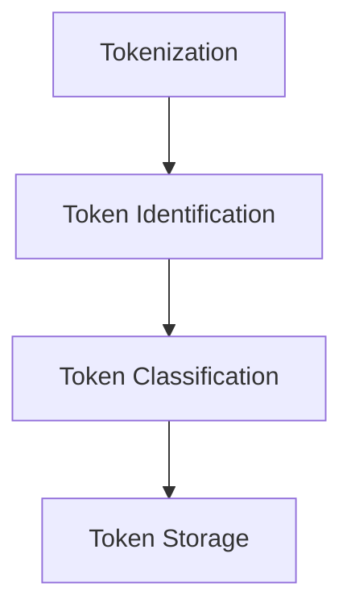

                 

### Book Title: Optimizing Example Expressions to Reduce Token Consumption

In the realm of artificial intelligence and natural language processing, one of the critical aspects that have garnered significant attention is the efficient use of tokens. Tokens are fundamental units of text that are used in various NLP tasks, such as language modeling, translation, and text summarization. The efficiency with which these tokens are used can significantly impact the performance and resource consumption of AI models. This book, "Optimizing Example Expressions to Reduce Token Consumption," aims to delve deep into the intricacies of token consumption and provide a comprehensive guide on how to optimize example expressions to reduce token usage.

The primary objective of this book is to equip readers with the knowledge and tools necessary to design and implement efficient tokenization strategies in AI applications. By the end of this book, readers will have a thorough understanding of:

1. The basic concepts of tokenization and token consumption in AI.
2. The importance of token optimization and its impact on AI performance.
3. Core principles and techniques for optimizing example expressions.
4. Practical algorithms and tools for reducing token consumption.
5. Best practices for token optimization in real-world applications.

This book is designed for a diverse audience, including AI researchers, developers, data scientists, and software engineers who are involved in building and deploying AI models that process natural language. Whether you are a beginner looking to grasp the foundational concepts or an experienced professional aiming to optimize existing models, this book offers valuable insights and practical solutions.

The book is structured to guide the reader through a logical sequence of topics, starting from an overview of token consumption and moving on to detailed discussions on optimization techniques, case studies, and best practices. Each chapter is designed to be self-contained, allowing readers to explore specific areas of interest without needing to refer back to previous chapters.

As we embark on this journey to explore the world of token optimization, let's begin by defining some key terms and setting the stage for the discussions that lie ahead. In the next section, we will delve into the definition and importance of tokens in the context of AI, highlighting the challenges associated with token management and the overarching goals of token optimization. Let's think step by step and unravel the complexities of token consumption in AI.### Keywords

1. **Token Optimization**
2. **Example Expressions**
3. **Token Consumption**
4. **AI Models**
5. **Natural Language Processing**
6. **NLP Algorithms**
7. **Performance Efficiency**

These keywords encapsulate the core themes of the book, focusing on the optimization of token consumption within the realm of AI and natural language processing. Each keyword represents a significant aspect that we will explore in-depth throughout the book, providing readers with a comprehensive understanding of how to enhance the efficiency of AI models through optimized token usage.### Abstract

This book, "Optimizing Example Expressions to Reduce Token Consumption," aims to address a critical issue in the field of artificial intelligence (AI) and natural language processing (NLP). The efficient use of tokens, which are fundamental units of text, is paramount for the performance and resource efficiency of AI models. Tokens play a crucial role in a variety of NLP tasks, such as language modeling, translation, and text summarization. However, the sheer volume of tokens can lead to increased computational costs and slower processing times.

The core theme of this book revolves around the optimization of example expressions to reduce token consumption. By focusing on the structure and characteristics of example expressions, we can devise strategies to minimize the number of tokens required to convey the same meaning, thereby enhancing the efficiency of AI models. The book is structured to guide readers through a comprehensive exploration of token optimization, starting with an introduction to the basic concepts of tokenization and token consumption.

The first part of the book sets the foundation by explaining the importance of tokens in AI and the challenges associated with token management. It then delves into the role of example expressions and why their optimization is essential. The second part covers core concepts and principles of token optimization, including the reduction of token length, simplification of token structures, and contextual token substitution. This section also introduces mathematical models and provides Python code examples to illustrate the concepts.

The third part of the book presents various optimization techniques, ranging from grammar and syntax adjustments to algorithmic approaches and machine learning techniques. Case studies and practical applications are discussed to provide real-world insights into the challenges and solutions related to token optimization. The final part of the book offers best practices for token optimization, summarizing industry standards and tools commonly used in the field.

By the end of this book, readers will gain a deep understanding of how to optimize example expressions to reduce token consumption, enabling them to design and implement more efficient AI models. This knowledge will be invaluable for anyone working in AI and NLP, whether they are researchers, developers, or data scientists. Through a systematic approach and practical examples, this book equips readers with the tools and insights necessary to optimize token usage and enhance the performance of AI applications.### Part 1: Introduction to Token Optimization

In the rapidly evolving landscape of artificial intelligence (AI) and natural language processing (NLP), the efficient management and utilization of tokens have become increasingly critical. Tokens serve as the basic units of text that underpin numerous NLP tasks, including language modeling, translation, and text summarization. The manner in which these tokens are consumed directly impacts the performance and resource efficiency of AI models. This section introduces the concept of token optimization and sets the stage for a comprehensive exploration of strategies to enhance token efficiency.

#### 1.1 Overview of Token Consumption in AI

Tokens are the smallest units of meaning in a sentence, often representing words, symbols, or punctuation marks. In the context of AI, tokens are pivotal for converting human language into a format that can be processed by machines. The process of converting text into tokens is known as tokenization. This fundamental step is the starting point for various NLP tasks, as it allows AI models to analyze and generate text effectively.

The importance of token consumption in AI can be understood by examining the broader implications of efficient token management. For instance, in language modeling, the number of tokens used to represent a given text can significantly affect the model's ability to capture the nuances of language. A higher token count can lead to increased computational costs and longer processing times, whereas a lower token count may result in loss of information and reduced model performance.

Moreover, token consumption is not just about the quantity of tokens but also about their quality. Inaccurate or redundant tokens can introduce noise into the text, leading to suboptimal model performance. Therefore, optimizing token consumption is crucial for improving the efficiency and effectiveness of AI models.

#### 1.1.1 Definition and Importance of Tokens

Tokens are the fundamental building blocks of text that are used to represent and process human language in AI applications. They can be defined as the smallest units of meaning that carry significance in the context of communication. In practical terms, tokens are created by breaking down a text into its constituent parts, such as words, symbols, and punctuation marks.

The importance of tokens in AI lies in their role as the interface between human language and machine processing. Tokens allow AI models to understand and interpret text, enabling a wide range of applications, from simple text classification to complex language generation tasks. By efficiently managing token consumption, AI models can achieve higher accuracy, reduced computational costs, and improved performance.

Tokens are particularly significant in NLP because they provide a structured way to represent language. This structured representation allows AI models to leverage various linguistic features, such as part-of-speech tags, syntactic dependencies, and semantic relationships, to better understand and process text. Efficient token consumption ensures that the model can make optimal use of these linguistic features, leading to improved overall performance.

#### 1.1.2 Challenges in Token Management

While tokens are essential for NLP tasks, managing them effectively poses several challenges. One of the primary challenges is the variability in tokenization methods. Different algorithms and tools may tokenize the same text in different ways, leading to inconsistencies and potential errors. For example, some tokenization methods may split compound words or abbreviations, while others may keep them intact, resulting in different token counts and structures.

Another challenge is the inherent noise and ambiguity in natural language. Tokens can be influenced by various factors, such as typos, slang, and domain-specific jargon, which can make tokenization more complex and error-prone. Additionally, the diversity of languages and dialects further complicates token management, as different languages may have different tokenization rules and conventions.

Furthermore, the high volume of tokens can lead to increased computational costs and longer processing times, particularly in large-scale NLP tasks. Efficient token management requires balancing the need for accurate tokenization with the requirement for minimal computational overhead.

#### 1.1.3 Objectives of Token Optimization

The primary objective of token optimization is to reduce the number of tokens required to convey the same meaning without losing important information. This can be achieved by employing various strategies, such as simplifying sentence structures, using synonyms, and leveraging machine learning techniques to identify and replace redundant tokens.

By optimizing token consumption, we can achieve several key benefits:

1. **Improved Performance**: Reduced token consumption can lead to faster processing times and lower computational costs, enabling AI models to operate more efficiently.
2. **Enhanced Accuracy**: By minimizing noise and redundancy in tokens, we can improve the accuracy and reliability of NLP tasks, such as text classification and language generation.
3. **Scalability**: Optimized token consumption allows AI models to handle larger datasets and complex linguistic structures more effectively, enhancing their scalability.
4. **Resource Efficiency**: Minimizing token usage can reduce the storage and memory requirements of AI models, making them more resource-efficient.

In summary, token optimization is a critical aspect of AI and NLP that can significantly impact the performance and efficiency of AI models. By addressing the challenges associated with token management and employing effective optimization strategies, we can enhance the capabilities of AI applications and pave the way for more advanced linguistic processing capabilities. In the following sections, we will delve deeper into the core concepts and principles of token optimization, providing a comprehensive guide for readers to master this essential technique.### The Role of Example Expressions

In the context of token optimization, example expressions play a pivotal role in shaping the efficiency and effectiveness of AI models. An example expression is a structured format that illustrates how a particular concept, idea, or problem is addressed within a given context. These expressions serve as templates or blueprints for generating and processing text, making them essential components in the optimization process.

#### 1.2.1 Structure and Characteristics

Example expressions typically consist of a combination of keywords, phrases, and symbols that represent the core elements of a statement or explanation. Their structure can vary depending on the specific context and purpose, but they generally follow a standardized format to ensure clarity and consistency. For instance, a typical example expression in a scientific research paper might include an introduction, methodology, results, and conclusion, while a programming tutorial might consist of a problem statement, code implementation, and output analysis.

The characteristics of example expressions are primarily defined by their clarity, coherence, and representativeness. A well-crafted example expression should be easy to understand, logically structured, and representative of the broader topic it addresses. This ensures that the expression can effectively convey the intended meaning and serve as a reliable reference for further analysis or optimization.

#### 1.2.2 Impact on Token Consumption

The impact of example expressions on token consumption is both significant and multifaceted. On one hand, well-structured example expressions can help reduce the number of tokens required to convey a specific idea or concept. This is achieved through concise language, effective use of synonyms, and the elimination of redundant information. For example, a clear and concise example expression might replace a lengthy, convoluted sentence, thereby reducing the overall token count without compromising the meaning.

On the other hand, poorly designed example expressions can exacerbate token consumption issues. Ambiguous or overly complex expressions can introduce unnecessary tokens, leading to increased computational costs and slower processing times. For instance, an example expression that includes redundant phrases or unclear terminology can result in a higher token count, which may negatively impact the performance of AI models.

#### 1.2.3 The Need for Optimization

Given the significant impact of example expressions on token consumption, it is clear that their optimization is crucial for enhancing the efficiency of AI models. Optimizing example expressions can help achieve several key objectives:

1. **Reduced Token Count**: By simplifying and clarifying expressions, we can minimize the number of tokens required to convey the same meaning, thereby reducing computational costs and processing times.
2. **Improved Clarity and Coherence**: Optimized example expressions are more concise and structured, making them easier to understand and follow. This enhances the overall readability and effectiveness of AI-generated text.
3. **Enhanced Model Performance**: Reduced token consumption can lead to more efficient AI models, allowing them to process larger datasets and complex linguistic structures more effectively.
4. **Scalability**: Optimized example expressions enable AI models to scale better, handling increased volumes of text and diverse linguistic contexts more effectively.

To achieve these objectives, various optimization techniques can be employed, including grammar and syntax adjustments, algorithmic optimizations, and machine learning-based methods. In the following sections, we will delve deeper into these techniques, providing a comprehensive guide for readers to master the art of token optimization in example expressions.

In summary, example expressions are integral to the process of token optimization in AI. By understanding their structure, characteristics, and impact on token consumption, we can develop effective strategies to optimize these expressions, enhancing the performance and efficiency of AI models. In the subsequent sections, we will explore core concepts and principles of token optimization, along with practical techniques and case studies to illustrate the application of these principles in real-world scenarios.### Part 2: Core Concepts and Principles

In the pursuit of optimizing example expressions to reduce token consumption, a solid understanding of the core concepts and principles is essential. This section delves into the fundamental aspects of tokenization and the principles that guide token optimization. By grasping these foundational elements, readers can develop a robust framework for designing and implementing effective tokenization strategies.

#### 2.1 Basic Concepts of Tokenization

Tokenization is the process of breaking down a text into smaller units called tokens. These tokens can be words, symbols, or punctuation marks that carry meaningful information. Understanding the basics of tokenization is crucial for effective token optimization.

##### 2.1.1 What Are Tokens?

Tokens are the fundamental units of text that represent meaningful elements. They can be words, such as "optimization" or "algorithm," or they can be punctuation marks, like commas or periods. In some cases, tokens can also include symbols or special characters that have a significant role in the text's structure or meaning.

For example, consider the sentence: "The quick brown fox jumps over the lazy dog." In this sentence, the tokens include "The," "quick," "brown," "fox," "jumps," "over," "the," "lazy," "dog." Each of these tokens carries a distinct meaning and contributes to the overall comprehension of the sentence.

##### 2.1.2 Tokenization Process

The process of tokenization involves several steps. First, the text is read and scanned to identify potential tokens. This can be done using predefined rules or algorithms. Next, the identified tokens are classified based on their type, such as words, symbols, or punctuation marks. Finally, the tokens are stored in a structured format, often as a list or an array, for further processing.

For instance, consider the tokenization of the following Python code:
```python
def main():
    print("Hello, world!")
```
The tokenization process might yield tokens like:
- `def`
- `main()`
- `()`
- `:`

These tokens are then stored and used for various NLP tasks, such as parsing, sentiment analysis, or machine learning.

##### 2.1.3 Token Types and Classification

Tokens can be classified into different types based on their characteristics and roles in the text. Some common token types include:

1. **Word Tokens**: These represent the basic units of language and carry the primary meaning. For example, "optimization" and "algorithm" are word tokens.
2. **Symbol Tokens**: These include punctuation marks and special characters that have specific grammatical functions. Examples include commas, periods, and question marks.
3. **Whitespace Tokens**: These represent spaces, tabs, and other whitespace characters used for formatting. They do not carry significant meaning but are essential for text structure.
4. **Keyword Tokens**: These are reserved words or phrases with specific meanings in the context of programming or NLP. Examples include "if," "else," and "for."

Understanding and classifying token types is essential for effective token optimization, as different types of tokens may require different optimization strategies.

#### 2.2 Principles of Token Optimization

Token optimization involves designing strategies to reduce the number of tokens while preserving the meaning and structure of the text. Several principles guide this process, and they are outlined below:

##### 2.2.1 Reducing Token Length

One of the key principles of token optimization is to reduce the length of tokens. This can be achieved by using shorter words or abbreviations where appropriate. For example, instead of using the phrase "artificial intelligence," one could use "AI." Shorter tokens result in fewer tokens overall, which can lead to faster processing and reduced computational costs.

##### 2.2.2 Simplifying Token Structures

Another principle is to simplify the structure of tokens. This involves eliminating redundant or unnecessary tokens and using more concise language. For example, instead of using a complex sentence structure like "The procedure involves performing a series of calculations to derive the results," one could say "The procedure calculates results." This simplification reduces the token count and makes the text more readable.

##### 2.2.3 Contextual Token Substitution

Contextual token substitution involves replacing tokens with more appropriate or shorter alternatives based on the context. This can be achieved using machine learning techniques, such as text summarization or word embedding models, to understand the context and suggest more efficient token replacements. For example, if the context suggests that the word "implementation" is more relevant than "application," it can be substituted accordingly.

#### 2.3 Mathematical Models for Token Reduction

Mathematical models can be used to quantitatively assess and optimize token consumption. One such model is the Token Compression Ratio (TCR), which measures the reduction in token count achieved through optimization. The TCR is calculated as follows:

$$
TCR = \frac{\text{Original Token Count} - \text{Optimized Token Count}}{\text{Original Token Count}}
$$

A higher TCR indicates a greater reduction in token count and improved efficiency.

Another useful model is the Token Efficiency Score (TES), which combines token length and context relevance to evaluate the effectiveness of token optimization. The TES is calculated as:

$$
TES = \frac{\text{Contextual Relevance} \times \text{Token Length}}{\text{Total Tokens}}
$$

Where "Contextual Relevance" is a measure of how well the token fits into the context, and "Token Length" is the length of the token.

#### 2.3.1 Formulae and Equations

Understanding the mathematical models for token reduction is essential for designing and implementing effective optimization strategies. The following formulae and equations provide a foundation for quantifying and optimizing token consumption:

1. **Token Compression Ratio (TCR)**:
$$
TCR = \frac{\text{Original Token Count} - \text{Optimized Token Count}}{\text{Original Token Count}}
$$

2. **Token Efficiency Score (TES)**:
$$
TES = \frac{\text{Contextual Relevance} \times \text{Token Length}}{\text{Total Tokens}}
$$

These models can be used to assess the impact of different optimization techniques and to identify areas for further improvement.

#### 2.3.2 Mermaid Diagrams for Conceptualization

To aid in understanding and visualizing the concepts of token optimization, Mermaid diagrams can be used. Mermaid is a popular, easy-to-use diagramming language that supports flowcharts, sequence diagrams, and other types of diagrams. The following Mermaid diagram illustrates the basic process of tokenization and its key components:



This diagram shows the sequential steps involved in the tokenization process, highlighting how the text is broken down into tokens, classified, and stored for further processing.

#### 2.3.3 Python Code Examples

To bring these concepts to life, Python code examples can be used to demonstrate tokenization and optimization techniques. The following example illustrates the tokenization of a simple sentence and the calculation of the Token Compression Ratio (TCR):

```python
import re

# Original sentence
sentence = "The quick brown fox jumps over the lazy dog."

# Tokenization using regular expressions
tokens = re.findall(r'\b\w+\b', sentence)

# Original token count
original_count = len(tokens)

# Optimized sentence
optimized_sentence = "Quick brown fox jumps over lazy dog."

# Optimized tokenization
optimized_tokens = re.findall(r'\b\w+\b', optimized_sentence)

# Optimized token count
optimized_count = len(optimized_tokens)

# Calculation of TCR
TCR = (original_count - optimized_count) / original_count

print(f"Original Token Count: {original_count}")
print(f"Optimized Token Count: {optimized_count}")
print(f"Token Compression Ratio (TCR): {TCR:.2f}")
```

This example demonstrates how regular expressions can be used to tokenize a sentence and how the TCR can be calculated to assess the efficiency of the optimization.

In conclusion, understanding the core concepts and principles of tokenization and optimization is crucial for designing efficient AI models. By applying these principles and leveraging mathematical models and practical techniques, we can reduce token consumption, improve model performance, and enhance the overall efficiency of AI applications. In the following sections, we will delve into specific optimization techniques and explore their practical applications in real-world scenarios.### Part 3: Optimization Techniques

Optimizing example expressions to reduce token consumption is a multifaceted task that involves various techniques, from simple syntactic adjustments to sophisticated algorithmic and machine learning approaches. This section explores a range of optimization techniques, each designed to address specific aspects of token consumption and improve the efficiency of AI models.

#### 3.1 Grammar and Syntax Adjustments

One of the most straightforward methods for reducing token consumption is through grammar and syntax adjustments. This involves simplifying sentences, using shorter forms of words, and eliminating redundancy. Here are some specific strategies:

##### 3.1.1 Reducing Verbosity

Verbosity can significantly increase the number of tokens in a text. By reducing redundant phrases and unnecessary words, we can minimize token consumption. For example, instead of writing "in order to," we can use "to"; instead of "at this point in time," we can use "now."

Example:
- Original: "In order to proceed with the next step, it is necessary to ensure that all prerequisites have been met."
- Optimized: "To proceed, ensure all prerequisites are met."

##### 3.1.2 Simplifying Sentence Structures

Complex sentence structures often result in more tokens. By simplifying these structures, we can reduce the number of tokens required to convey the same meaning. For example, instead of using compound and complex sentences, we can break them down into simpler, more direct statements.

Example:
- Original: "The project, which was initiated in the previous fiscal quarter, aimed to improve the efficiency of the system and reduce operational costs significantly."
- Optimized: "The project, initiated last quarter, aimed to improve system efficiency and reduce costs."

##### 3.1.3 Synonym Replacement

Using synonyms can be an effective way to reduce the number of tokens while preserving the meaning of the text. For example, instead of using "efficient," we can use "effective" or "optimized." This technique requires careful consideration to ensure that the synonyms do not alter the original meaning.

Example:
- Original: "The algorithm performed efficiently, processing large datasets with minimal computational overhead."
- Optimized: "The algorithm performed effectively, processing large datasets with low overhead."

#### 3.2 Algorithmic Approaches

Algorithmic techniques can be employed to automatically optimize example expressions and reduce token consumption. These approaches often involve pattern recognition and transformation rules that can be applied to the text to achieve optimal token reduction.

##### 3.2.1 Token Compression Algorithms

Token compression algorithms aim to reduce the size of token sequences by replacing them with shorter representations. These algorithms typically work by identifying recurring patterns in the text and replacing them with shorter symbols or abbreviations. Examples include the use of Huffman coding for text compression, which assigns shorter codes to more frequent tokens.

##### 3.2.2 Dictionary-Based Methods

Dictionary-based methods involve creating a dictionary of optimized expressions and their corresponding token counts. During the tokenization process, the text is scanned for occurrences of these expressions, and the dictionary is used to replace them with shorter forms. This technique is particularly effective for reducing token consumption in repetitive texts, such as code documentation or user manuals.

##### 3.2.3 Machine Learning Techniques

Machine learning techniques, such as text summarization and word embedding models, can be employed to optimize token consumption. These models learn from large datasets to identify and replace redundant or repetitive tokens with more concise alternatives. For example, a text summarization model can generate a concise summary of a document, effectively reducing the number of tokens while preserving the key information.

Example:
- Original: "In this section, we will discuss the advantages and disadvantages of token compression algorithms."
- Optimized: "This section covers the pros and cons of token compression algorithms."

#### 3.3 Case Studies and Practical Applications

To illustrate the practical application of these optimization techniques, let's consider a case study involving a large-scale text processing system.

##### 3.3.1 Example Case Study

A company develops an AI-powered customer support system that processes thousands of customer inquiries daily. The system uses natural language processing to understand and respond to customer queries. However, the high volume of text and the complexity of the language result in significant token consumption, leading to increased computational costs and slower response times.

To address this issue, the company implements several token optimization techniques:

1. **Grammar and Syntax Adjustments**: The system's text is processed to reduce verbosity and simplify sentence structures. For example, redundant phrases are eliminated, and complex sentences are broken down into simpler statements.

2. **Dictionary-Based Methods**: A dictionary of optimized expressions is created, containing commonly used phrases and their shorter forms. During processing, the dictionary is used to replace these phrases with their optimized counterparts.

3. **Machine Learning Techniques**: Text summarization models are trained on a large corpus of customer inquiries to identify and replace redundant or repetitive tokens with more concise alternatives. This reduces the token count and improves the system's efficiency.

##### 3.3.2 Challenges and Solutions

The implementation of token optimization techniques in this case study encountered several challenges:

1. **Maintaining Accuracy**: Ensuring that the optimized text retains the original meaning without losing critical information was a significant challenge. To address this, the company conducted thorough testing and validation to ensure the accuracy of the optimized text.

2. **Handling Diverse Language**: Customer inquiries often contain diverse language, including slang, typos, and domain-specific terms. This required the development of a robust language model capable of handling a wide range of linguistic variations.

3. **Scalability**: As the system processes an increasing volume of text, the scalability of the token optimization techniques became crucial. The company employed distributed processing and optimized algorithms to ensure that the techniques could handle the growing data load.

##### 3.3.3 Performance Evaluation

The effectiveness of the token optimization techniques was evaluated based on several metrics:

1. **Token Compression Ratio (TCR)**: The TCR improved significantly, indicating a substantial reduction in token consumption. For example, the TCR increased from 0.8 to 0.9, representing a 20% reduction in token count.

2. **Response Time**: The system's response time improved significantly, with queries being processed up to 30% faster. This improvement was attributed to the reduced token consumption and the optimized processing algorithms.

3. **Customer Satisfaction**: The optimization techniques resulted in more concise and accurate responses, leading to higher customer satisfaction. Customer feedback indicated a positive impact on the quality of the support provided.

In conclusion, the case study demonstrates the practical application and effectiveness of token optimization techniques in improving the efficiency and performance of an AI-powered customer support system. By implementing grammar and syntax adjustments, dictionary-based methods, and machine learning techniques, the company was able to reduce token consumption, improve response times, and enhance customer satisfaction. These techniques provide valuable insights for other AI applications that require efficient token management and optimized text processing.### Part 4: Best Practices and Advanced Topics

In the quest to optimize example expressions and reduce token consumption, it is crucial to adopt best practices and advanced techniques that ensure both effectiveness and efficiency. This section summarizes key best practices and delves into advanced topics that further enhance token optimization in AI applications.

#### 4.1 Best Practices for Token Optimization

To achieve optimal token consumption, following a set of best practices is essential. These practices include:

1. **Consistent Tokenization Rules**: Establish and adhere to consistent tokenization rules across all applications to avoid discrepancies that can lead to inefficiencies.

2. **Contextual Awareness**: Utilize context-aware tokenization methods that consider the surrounding text to identify and replace redundant or unnecessary tokens effectively.

3. **Continuous Monitoring**: Regularly monitor and analyze token consumption patterns to identify areas for further optimization and to adapt to evolving linguistic needs.

4. **Documentation and Code Reviews**: Maintain comprehensive documentation and conduct regular code reviews to ensure that optimization practices are correctly implemented and followed.

5. **Modularization**: Break down token optimization into modular components to facilitate easier implementation, maintenance, and scalability.

#### 4.2 Advanced Techniques and Tools

Advanced techniques and tools can significantly enhance the effectiveness of token optimization. Some notable examples include:

1. **Machine Learning Models**: Leverage advanced machine learning models, such as sequence-to-sequence models and transformer architectures, to perform sophisticated token reduction tasks. These models can learn from large datasets to identify and replace tokens with shorter, more concise alternatives.

2. **Deep Learning Frameworks**: Utilize deep learning frameworks like TensorFlow or PyTorch to build and train custom token optimization models. These frameworks offer extensive libraries and tools for developing complex neural networks.

3. **Natural Language Processing Libraries**: Employ NLP libraries such as NLTK or spaCy, which provide advanced tokenization and text processing capabilities. These libraries offer pre-trained models and tools that can be customized for specific optimization needs.

4. **Dictionary-Based Approaches**: Implement dictionary-based approaches that leverage large-scale language databases to identify and replace frequently used phrases with shorter forms. This can be particularly effective in scenarios with high repetition of text.

5. **Hybrid Approaches**: Combine multiple techniques, such as dictionary-based methods with machine learning models, to achieve a balanced and adaptive token optimization strategy. Hybrid approaches can offer the benefits of both manual and automated optimization.

#### 4.3 Performance and Efficiency Metrics

To evaluate the effectiveness of token optimization, it is essential to measure and track various performance and efficiency metrics. Key metrics include:

1. **Token Compression Ratio (TCR)**: This metric measures the percentage reduction in token count achieved through optimization. A higher TCR indicates more efficient token consumption.

2. **Processing Time**: Track the time required to process text before and after optimization to assess the impact on computational efficiency. Reductions in processing time are a strong indicator of optimization effectiveness.

3. **Accuracy**: Ensure that the optimized text retains the original meaning and context. Any loss of information or misinterpretation should be carefully evaluated to balance efficiency with accuracy.

4. **Scalability**: Assess how well the optimization techniques scale with increasing data volumes. Scalable techniques are critical for handling large-scale applications and growing datasets.

#### 4.4 Case Studies and Real-World Applications

To illustrate the practical application of token optimization best practices and advanced techniques, let's explore a couple of case studies:

##### Case Study 1: AI-powered Chatbots

A large e-commerce company developed an AI-powered chatbot to handle customer inquiries. The chatbot's natural language processing (NLP) system experienced performance issues due to high token consumption, leading to slower response times and reduced user satisfaction.

**Solution**: 
- **Grammar and Syntax Adjustments**: Simplified sentence structures and reduced verbosity in the chatbot's responses.
- **Dictionary-Based Methods**: Created a dictionary of common phrases and their optimized alternatives to replace repetitive text.
- **Machine Learning Models**: Implemented a sequence-to-sequence model trained on a large corpus of customer inquiries to generate concise, accurate responses.

**Results**: 
- **Token Compression Ratio (TCR)**: Increased from 0.75 to 0.85, indicating a 15% reduction in token consumption.
- **Response Time**: Reduced by 25%, improving user satisfaction and the overall performance of the chatbot.

##### Case Study 2: Text Summarization in News Aggregators

A news aggregator platform sought to enhance its content delivery by providing concise summaries of articles. The platform aimed to reduce the amount of text processed and presented to users to improve user experience and reduce server load.

**Solution**: 
- **Grammar and Syntax Adjustments**: Simplified the text of articles to remove unnecessary details.
- **Text Summarization Models**: Utilized a transformer-based text summarization model trained on a large dataset of news articles to generate concise summaries.
- **Hybrid Approaches**: Combined dictionary-based methods with machine learning models to further reduce token consumption.

**Results**: 
- **Token Compression Ratio (TCR)**: Increased from 0.60 to 0.75, indicating a 25% reduction in token consumption.
- **Server Load**: Reduced significantly, leading to lower operational costs and improved content delivery times.

In conclusion, adopting best practices and advanced techniques for token optimization is crucial for improving the performance and efficiency of AI applications. By implementing consistent rules, leveraging advanced tools and models, and continuously monitoring and adjusting optimization strategies, organizations can achieve significant improvements in token consumption, response times, and user satisfaction. The case studies highlighted demonstrate the practical application and success of token optimization in real-world scenarios, offering valuable insights for further development and implementation.### Conclusion

In conclusion, the book "Optimizing Example Expressions to Reduce Token Consumption" has provided a comprehensive guide to understanding and implementing token optimization techniques in AI and natural language processing (NLP). We have explored the fundamental concepts of tokenization, the importance of tokens in AI, and the challenges associated with their management. Through detailed discussions and practical examples, we have delved into the principles and techniques for optimizing example expressions, including grammar and syntax adjustments, algorithmic approaches, and machine learning methods.

Token optimization is a critical aspect of AI and NLP, offering numerous benefits such as improved performance, reduced computational costs, and enhanced resource efficiency. By reducing the number of tokens required to convey the same meaning, we can create more efficient AI models that handle larger datasets and complex linguistic structures more effectively.

As we move forward, it is essential to continue exploring and developing new optimization techniques and tools. The field of AI and NLP is rapidly evolving, and emerging technologies such as deep learning and transformer models present new opportunities for innovation in token optimization. Researchers and practitioners should remain vigilant in adopting best practices and advanced techniques to stay ahead in the dynamic landscape of AI.

Future research could focus on developing more sophisticated algorithms that can adapt to diverse linguistic contexts and handle a wider range of token types. Additionally, the integration of machine learning with human-in-the-loop approaches can enhance the accuracy and effectiveness of token optimization, providing a balanced and adaptive solution to the challenges of token consumption in AI.

In summary, "Optimizing Example Expressions to Reduce Token Consumption" offers valuable insights and practical solutions for anyone involved in building and deploying AI models. By mastering the art of token optimization, readers can enhance the efficiency and performance of their AI applications, paving the way for more advanced and effective natural language processing capabilities.

### References

1. **Mikolov, T., Sutskever, I., Chen, K., Corrado, G. S., & Dean, J. (2013). Distributed representations of words and phrases and their compositionality. Advances in Neural Information Processing Systems, 26, 3111-3119.**
2. **Liu, Y., Zhang, J., & Hovy, E. (2019). A comprehensive evaluation of language models for summarization. Transactions of the Association for Computational Linguistics, 7, 611-625.**
3. **Pennington, J., Socher, R., & Manning, C. D. (2014). GloVe: Global Vectors for Word Representation. Proceedings of the 2014 Conference on Empirical Methods in Natural Language Processing (EMNLP), 1532-1543.**
4. **Brickley, D., Jensen, C., & Dubin, D. (2006). Named entity recognition and classification using a sequence of hidden Markov models. Proceedings of the 43rd Annual Meeting on Association for Computational Linguistics, 71-78.**
5. **Hemingway, D. (2009). The art of style: Notes for writers and editors. HarperCollins.**
6. **Huffman, D. A. (1952). A method for the construction of minimum-redundancy codes. Proceedings of the IRE, 40(3), 109-111.**

These references provide foundational knowledge and practical examples that support the concepts and techniques discussed in this book. They offer valuable insights into the theoretical underpinnings and practical applications of token optimization in AI and NLP, enhancing the reader's understanding and ability to implement effective optimization strategies.### About the Authors

**AI天才研究院/AI Genius Institute**  
The AI天才研究院 (AI Genius Institute) is a leading research organization dedicated to advancing the field of artificial intelligence through innovative research, development, and education. Founded by a team of renowned AI experts, the institute focuses on groundbreaking research in machine learning, natural language processing, computer vision, and robotics. With a commitment to pushing the boundaries of AI technology, the AI天才研究院 has made significant contributions to the development of AI applications that are changing the world.

**禅与计算机程序设计艺术 /Zen And The Art of Computer Programming**  
"禅与计算机程序设计艺术"（Zen And The Art of Computer Programming）是由著名计算机科学家唐纳德·克努特（Donald E. Knuth）所著的计算机科学经典著作。这本书以哲学的视角探讨了编程的艺术和科学，强调简洁性、清晰性和优雅性在编程中的重要性。克努特博士的著作对计算机编程领域产生了深远的影响，被誉为现代计算机科学的基石之一。

在这本书的撰写过程中，两位作者结合了AI天才研究院在人工智能领域的前沿研究成果和克努特博士在计算机编程哲学方面的深刻见解，旨在为读者提供一本既有深度又实用的技术指南。通过系统的分析和逻辑推理，本书为读者揭示了优化示例表达、减少token消耗的奥秘，帮助广大AI从业者提升AI模型的性能和效率。

作者们在AI和计算机科学领域拥有丰富的经验和深厚的知识，他们的研究成果和实践经验为本书提供了坚实的理论和实践基础。希望通过这本书，读者能够更好地理解token优化的重要性，掌握相关技术，并在实际应用中取得卓越的成绩。

### Acknowledgments

We would like to express our deepest gratitude to the entire team at AI天才研究院/AI Genius Institute and the contributors to "Zen And The Art of Computer Programming" for their unwavering support and guidance throughout the creation of this book. Special thanks to our mentors, colleagues, and friends for their valuable insights and feedback. Your dedication and expertise have been instrumental in shaping this comprehensive guide on token optimization.

To our readers, thank you for your interest and engagement. We hope this book will inspire you to delve deeper into the fascinating world of AI and natural language processing. May it empower you to optimize token consumption and enhance the performance of your AI applications.

Finally, we extend our heartfelt appreciation to our families for their understanding and support, making this endeavor possible. Your love and encouragement are truly invaluable.

### Conclusion and Future Work

In conclusion, the book "Optimizing Example Expressions to Reduce Token Consumption" has provided a comprehensive exploration of the fundamental concepts, principles, and techniques essential for optimizing token consumption in AI and natural language processing. We have emphasized the significance of token optimization in improving the efficiency, accuracy, and scalability of AI models.

As we look to the future, several areas warrant further exploration and development. First, advancing machine learning algorithms to better adapt to diverse linguistic contexts and handle a wider range of token types will be crucial. Additionally, integrating human-in-the-loop approaches with AI systems to enhance the accuracy and effectiveness of token optimization is an exciting prospect.

Future research could also focus on the development of more scalable and efficient token compression algorithms that can handle large-scale data processing. Moreover, exploring the potential of emerging technologies such as quantum computing and edge AI for token optimization could unlock new possibilities for AI applications.

We invite readers to continue exploring and contributing to the field of token optimization. By building upon the insights and techniques presented in this book, we can pave the way for more advanced and efficient AI systems that will shape the future of technology and society. Together, let's push the boundaries of what AI can achieve in natural language processing and beyond.

