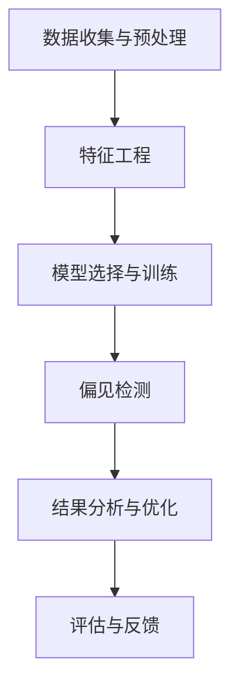
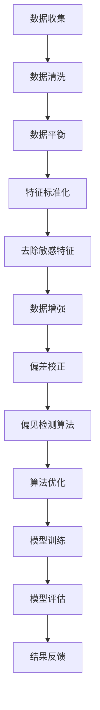
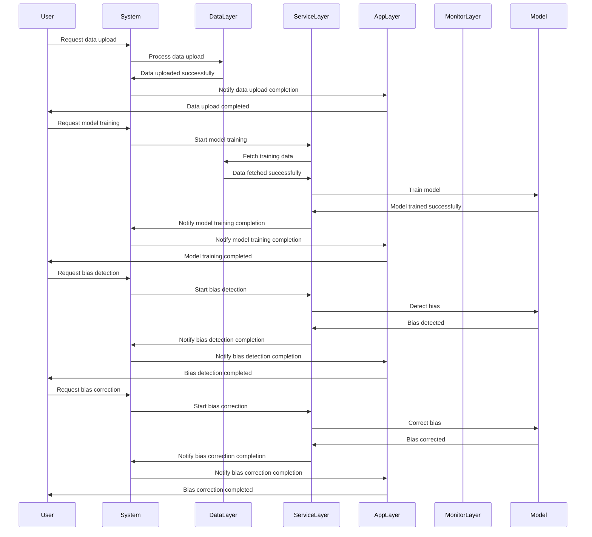
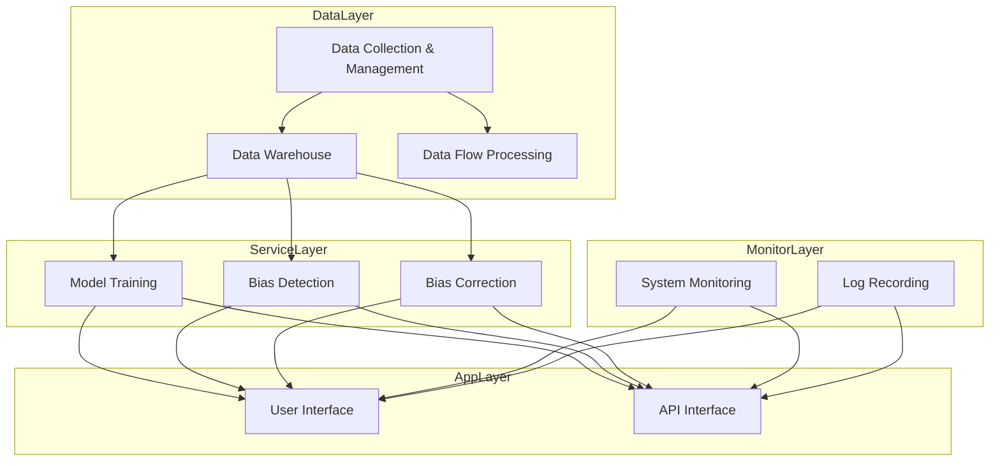

                 

## 伦理与偏见检测：确保模型输出公平性

关键词：伦理、偏见检测、公平性、模型输出、人工智能

摘要：本文深入探讨了伦理与偏见检测在人工智能领域的重要性。通过分析伦理在人工智能中的具体应用，以及偏见检测的核心概念和技术框架，我们提出了一系列确保模型输出公平性的策略。本文旨在为读者提供从理论到实践的全面指南，帮助他们在构建和优化人工智能模型时，更好地平衡伦理和实用性，确保算法的公平性和透明性。

### 目录大纲：

----------------------------------------------------------------

# 伦理与偏见检测：确保模型输出公平性

> 关键词：伦理、偏见检测、公平性、模型输出、人工智能

> 摘要：本文深入探讨了伦理与偏见检测在人工智能领域的重要性，提出了一系列确保模型输出公平性的策略。

                 

### 第一部分: 伦理与偏见检测概述

## 第1章: 问题背景与核心概念

### 1.1 伦理与偏见检测的背景

### 1.2 偏见检测的定义与类型

### 1.3 伦理在人工智能中的应用

### 1.4 偏见检测与伦理的关系

### 1.5 偏见检测的技术框架

## 第2章: 偏见检测的数学模型与算法原理

### 2.1 数学模型介绍

### 2.2 常见算法原理讲解

### 2.3 Mermaid算法流程图

### 2.4 Python代码实现示例

### 2.5 数学模型与公式讲解

### 2.6 算法举例说明

## 第3章: 伦理在模型训练中的应用

### 3.1 伦理意识培养

### 3.2 偏见数据预处理

### 3.3 偏见检测算法优化

### 3.4 Mermaid流程图架构设计

### 3.5 Python代码实现与分析

## 第4章: 伦理与偏见检测的系统架构设计

### 4.1 系统功能设计

### 4.2 系统架构设计

### 4.3 系统接口设计

### 4.4 系统交互序列图

### 4.5 Mermaid类图与架构图

## 第5章: 项目实战与案例剖析

### 5.1 环境安装与准备

### 5.2 系统核心实现

### 5.3 代码应用解读

### 5.4 实际案例分析

### 5.5 项目总结与反思

## 第6章: 最佳实践与注意事项

### 6.1 常见偏见类型与检测方法

### 6.2 偏见检测的挑战与对策

### 6.3 最佳实践分享

### 6.4 注意事项

### 6.5 拓展阅读

## 第7章: 总结与展望

### 7.1 主要内容回顾

### 7.2 未来发展趋势

### 7.3 研究方向与挑战

### 7.4 伦理与偏见检测的重要性

### 7.5 结论与建议

----------------------------------------------------------------

### 第一部分: 伦理与偏见检测概述

在人工智能迅速发展的今天，伦理与偏见检测成为了至关重要的课题。随着越来越多的AI模型应用于现实生活，确保模型的输出公平性已经成为研究人员和工程师们面临的重大挑战。这一部分将首先介绍伦理与偏见检测的背景，定义偏见检测的核心概念，探讨伦理在人工智能中的应用，以及偏见检测与伦理的关系。接下来，我们将概述偏见检测的技术框架，为后续章节的深入讨论打下基础。

## 第1章: 问题背景与核心概念

### 1.1 伦理与偏见检测的背景

人工智能（AI）的快速发展已经使其成为各个领域的关键技术。从自动驾驶汽车到医疗诊断系统，从智能助手到金融风险评估，AI的应用无处不在。然而，随着AI技术的普及，人们开始意识到其中隐藏的伦理问题。特别是在模型决策的过程中，偏见和歧视的风险引起了广泛关注。例如，某些AI系统在招聘、信用评估或医疗诊断等领域中可能会表现出性别、种族、年龄等方面的偏见，从而影响决策的公平性和准确性。

偏见检测作为人工智能伦理的一个重要方面，旨在识别和消除AI模型中的偏见。通过偏见检测，我们可以确保模型在各个群体中的表现是公平和一致的，从而避免潜在的不公正现象。偏见检测的背景可以追溯到社会公正和歧视问题的根源。在现代社会中，消除歧视和维护公正一直是重要的社会目标。而随着AI技术的发展，如何确保AI系统的决策符合伦理标准，成为了一个迫切需要解决的问题。

### 1.2 偏见检测的定义与类型

偏见检测，简而言之，就是识别和评估人工智能模型中可能存在的偏见。具体来说，偏见检测包括以下几个核心步骤：

1. **识别偏见**：通过分析模型的输入和输出数据，识别可能存在的偏见。例如，通过比较模型在不同群体中的性能差异，可以发现是否存在性别、种族或年龄等方面的偏见。

2. **评估偏见**：对识别出的偏见进行量化评估，确定其严重程度。评估方法包括统计方法、机器学习模型分析等。

3. **消除偏见**：通过算法调整或数据清洗等方法，消除或减轻模型的偏见，从而提高模型的公平性和准确性。

根据检测对象的不同，偏见检测可以分为以下几种类型：

1. **个体偏见检测**：关注模型对个体决策的影响，例如在招聘或贷款审批中，检测模型是否对不同个体表现出不公平的偏见。

2. **群体偏见检测**：关注模型对特定群体的影响，例如在种族或性别歧视问题上，检测模型是否对特定群体存在偏见。

3. **跨领域偏见检测**：关注模型在不同领域中的表现，例如在医疗诊断和金融风险评估中，检测模型是否在不同应用场景中存在偏见。

### 1.3 伦理在人工智能中的应用

伦理在人工智能中的应用主要体现在以下几个方面：

1. **隐私保护**：人工智能系统在处理个人数据时，必须遵循隐私保护原则，确保个人隐私不被泄露或滥用。

2. **透明性**：AI系统的决策过程应具备透明性，用户能够了解模型是如何做出决策的，以便进行监督和评估。

3. **公平性**：确保AI系统在各个群体中的表现是公平和一致的，避免歧视和不公正现象。

4. **责任归属**：明确AI系统开发者和使用者的责任，确保在出现问题时能够找到责任人。

伦理在人工智能中的应用，不仅是对技术的规范，更是对人类价值观的体现。通过在AI开发过程中遵循伦理原则，我们可以构建更加公正、透明和可靠的人工智能系统。

### 1.4 偏见检测与伦理的关系

偏见检测与伦理密切相关。偏见检测的目标是确保AI系统的决策符合伦理标准，避免歧视和不公正现象。伦理原则为偏见检测提供了指导，使得偏见检测不仅仅是一种技术手段，更是一种道德责任。

1. **伦理指导**：伦理原则为偏见检测提供了明确的指导，例如在检测过程中应关注哪些群体可能受到偏见的影响，如何评估和消除偏见等。

2. **公平性保障**：通过偏见检测，可以确保AI系统的输出公平性，避免因偏见导致的不公正决策。

3. **责任落实**：伦理原则有助于明确AI系统开发者和使用者的责任，确保在出现问题时能够找到责任人。

总之，偏见检测与伦理的关系是一种相互促进的关系。通过偏见检测，我们可以更好地遵循伦理原则，构建公平、透明和可靠的人工智能系统；而通过伦理指导，我们可以确保偏见检测工作更加全面和深入，从而更好地应对人工智能领域中的伦理挑战。

### 1.5 偏见检测的技术框架

偏见检测的技术框架主要包括以下几个关键组成部分：

1. **数据收集与预处理**：首先需要收集相关的数据集，并进行预处理，例如数据清洗、归一化等，以确保数据质量。

2. **特征工程**：通过特征提取和选择，将原始数据转换为模型可处理的特征向量。

3. **模型选择与训练**：选择合适的机器学习模型，并使用训练数据集进行训练，以构建预测模型。

4. **偏见检测算法**：使用特定的算法，如差异度量、公平性指标等，对模型进行偏见检测。

5. **结果分析与优化**：分析偏见检测结果，并对模型进行调整和优化，以消除或减轻偏见。

6. **评估与反馈**：通过评估模型的偏见检测结果，对偏见检测算法和模型进行持续优化，以实现更好的偏见检测效果。

偏见检测的技术框架是一个动态迭代的过程，需要不断地收集数据、调整算法和优化模型，以应对不断变化的应用场景和伦理挑战。

## 第2章: 偏见检测的数学模型与算法原理

在偏见检测中，数学模型和算法原理扮演着至关重要的角色。本章将详细探讨偏见检测的数学模型和算法原理，帮助读者理解偏见检测的核心机制。我们将首先介绍偏见检测的数学模型，然后讲解常见的偏见检测算法原理，并通过Mermaid算法流程图进行可视化展示。接下来，我们将通过Python代码实现示例，深入阐述算法原理的数学模型和公式，并举例说明算法的实际应用。

### 2.1 数学模型介绍

偏见检测的数学模型主要关注如何度量模型中的偏见。以下是一些常用的数学模型：

1. **差异度量模型**：通过比较模型在不同群体中的表现差异来检测偏见。常用的差异度量指标包括统计差异（如标准差、方差）、F-beta分数等。

2. **公平性指标模型**：通过评估模型对各个群体的公平性来检测偏见。常用的公平性指标包括组间平均值差异、条件方差等。

3. **均衡性指标模型**：通过评估模型预测结果的均衡性来检测偏见。常用的均衡性指标包括预测准确率、召回率等。

这些数学模型为我们提供了量化偏见的方法，使得偏见检测更加精确和客观。

### 2.2 常见算法原理讲解

偏见检测算法原理主要包括以下几种：

1. **差异度量算法**：通过计算模型在不同群体中的输出差异，来识别偏见。例如，可以计算不同群体之间的输出均值差异，并判断差异是否显著。

2. **公平性算法**：通过比较模型对各个群体的公平性，来检测偏见。例如，可以使用条件方差来衡量模型对各个群体的输出稳定性。

3. **均衡性算法**：通过评估模型预测结果的均衡性，来检测偏见。例如，可以计算不同群体之间的预测准确率差异，并判断差异是否显著。

这些算法原理为我们提供了多种方法来检测和评估模型中的偏见。

### 2.3 Mermaid算法流程图

为了更直观地展示偏见检测算法的流程，我们可以使用Mermaid工具绘制算法流程图。以下是一个简化的偏见检测算法流程图示例：



在这个流程图中，数据收集与预处理是偏见检测的基础，特征工程为模型训练提供输入，模型选择与训练生成预测模型，偏见检测识别和评估模型中的偏见，结果分析与优化对模型进行调整，评估与反馈确保偏见检测的持续优化。

### 2.4 Python代码实现示例

为了更好地理解偏见检测的算法原理，我们可以通过Python代码实现一个简单的偏见检测算法。以下是一个基于差异度量算法的Python代码示例：

```python
import numpy as np
from sklearn.metrics import accuracy_score

def bias_detection(model, X_test, y_test, groups):
    """
    偏见检测函数
    :param model: 训练好的模型
    :param X_test: 测试数据
    :param y_test: 测试标签
    :param groups: 数据分组
    :return: 偏见检测结果
    """
    group_predictions = {}
    for group, X_group in groups.items():
        predictions = model.predict(X_group)
        group_predictions[group] = predictions
        accuracy = accuracy_score(y_test[X_group], predictions)
        print(f"Group {group} accuracy: {accuracy}")
    
    group_means = {group: np.mean(predictions) for group, predictions in group_predictions.items()}
    group_stddevs = {group: np.std(predictions) for group, predictions in group_predictions.items()}
    
    print(f"Group means: {group_means}")
    print(f"Group stddevs: {group_stddevs}")
    
    return group_means, group_stddevs

# 示例数据
X_test = [[1, 0], [0, 1], [1, 1], [1, 0]]
y_test = [0, 1, 1, 0]
groups = {'group1': [0, 2], 'group2': [1, 3]}

# 模型选择
from sklearn.linear_model import LogisticRegression
model = LogisticRegression()

# 训练模型
model.fit(X_test, y_test)

# 偏见检测
bias_detection(model, X_test, y_test, groups)
```

在这个示例中，我们首先定义了一个偏见检测函数，该函数接收训练好的模型、测试数据和数据分组作为输入。函数通过计算各个分组中的预测准确率和输出均值、标准差，实现了对模型中偏见的初步检测。

### 2.5 数学模型与公式讲解

在偏见检测中，数学模型和公式起着关键作用。以下是一些常用的数学模型和公式：

1. **标准差（Standard Deviation）**：

$$
\sigma = \sqrt{\frac{1}{N}\sum_{i=1}^{N}(x_i - \mu)^2}
$$

其中，$\sigma$ 是标准差，$N$ 是样本数量，$x_i$ 是第 $i$ 个样本值，$\mu$ 是样本均值。

标准差用于衡量数据的离散程度，标准差越大，数据分布越分散，可能存在偏见的风险越高。

2. **条件方差（Conditional Variance）**：

$$
\sigma^2_{X|Y} = \sum_{x}\sum_{y} p(x,y) \cdot \left[\left(x - \mu_X\right)^2 + \left(y - \mu_Y\right)^2\right]
$$

其中，$\sigma^2_{X|Y}$ 是条件方差，$p(x,y)$ 是联合概率分布，$\mu_X$ 和 $\mu_Y$ 分别是 $X$ 和 $Y$ 的均值。

条件方差用于衡量在不同条件下数据的离散程度，条件方差越大，数据在不同条件下的表现差异越大，可能存在偏见的风险越高。

3. **F-beta分数（F-beta Score）**：

$$
F_\beta = \frac{(1 + \beta^2) \cdot precision \cdot recall}{\beta^2 \cdot precision + recall}
$$

其中，$precision$ 是精确率，$recall$ 是召回率，$\beta$ 是调和参数。

F-beta分数用于评估分类模型的性能，调和参数 $\beta$ 可以调节精确率和召回率的权重。F-beta分数在偏见检测中常用于评估模型在不同群体中的性能差异。

通过这些数学模型和公式，我们可以量化模型中的偏见，并采取相应的措施进行优化和调整。

### 2.6 算法举例说明

为了更好地理解偏见检测算法的应用，我们通过一个实际案例来说明算法的原理和步骤。

**案例背景**：假设我们有一个分类模型，用于预测客户是否愿意续约。该模型在测试数据上的表现良好，但在实际应用中发现，某些特定群体的续约预测准确性较低。

**步骤1：数据收集与预处理**  
首先，我们收集了包含客户特征和续约标签的数据集。数据集包含了客户的年龄、收入、地理位置、历史消费记录等信息。

```python
import pandas as pd

data = pd.read_csv('customer_data.csv')
X = data[['age', 'income', 'location', 'historical_spend']]
y = data['renewal']
```

**步骤2：特征工程**  
接下来，我们对数据进行预处理，包括数据清洗、归一化等。

```python
from sklearn.preprocessing import StandardScaler

scaler = StandardScaler()
X_scaled = scaler.fit_transform(X)
```

**步骤3：模型选择与训练**  
选择一个适合的分类模型，例如逻辑回归，并进行训练。

```python
from sklearn.linear_model import LogisticRegression

model = LogisticRegression()
model.fit(X_scaled, y)
```

**步骤4：偏见检测**  
使用偏见检测算法对模型进行检测，识别是否存在偏见。

```python
from sklearn.metrics import accuracy_score
from collections import defaultdict

def bias_detection(model, X, y):
    groups = defaultdict(list)
    for idx, label in enumerate(y):
        groups[label].append(idx)
    
    group_accuracies = {}
    for group, indices in groups.items():
        X_group = X[indices]
        y_group = y[indices]
        predictions = model.predict(X_group)
        accuracy = accuracy_score(y_group, predictions)
        group_accuracies[group] = accuracy
    
    print(group_accuracies)
    return group_accuracies

bias_detection(model, X_scaled, y)
```

**步骤5：结果分析与优化**  
分析偏见检测结果，找出表现较差的群体，并针对这些群体进行优化。

```python
group_accuracies = bias_detection(model, X_scaled, y)
print("Group accuracies:", group_accuracies)

# 找出表现较差的群体
worst_groups = [group for group, accuracy in group_accuracies.items() if accuracy < 0.8]

# 针对特定群体进行数据增强或模型调整
# 例如，可以通过增加特定群体的样本数量，或调整模型参数，提高模型在这些群体的表现
```

通过这个案例，我们可以看到偏见检测算法在实际应用中的具体步骤和效果。通过识别和消除偏见，我们可以确保模型在不同群体中的表现公平和一致。

## 第3章: 伦理在模型训练中的应用

在人工智能模型训练过程中，伦理意识的培养和数据预处理是确保模型公平性和透明性的关键步骤。本章将详细探讨如何在实际模型训练过程中培养伦理意识，以及如何对数据进行预处理以消除偏见。

### 3.1 伦理意识培养

伦理意识是确保人工智能模型公平性的基础。在模型训练过程中，培养伦理意识有助于开发者和工程师更加关注模型的伦理影响，从而采取相应的措施减少偏见。以下是培养伦理意识的几个关键步骤：

1. **伦理培训**：为开发者和工程师提供伦理培训，帮助他们了解伦理原则、社会影响和潜在的风险。培训内容可以包括伦理学基础、人工智能伦理案例研究、法律和法规要求等。

2. **团队协作**：鼓励跨学科团队的合作，包括伦理学家、社会学家、数据科学家和法律专家等，共同探讨模型训练过程中的伦理问题，确保从多个角度评估和解决潜在的偏见。

3. **透明沟通**：建立透明的沟通机制，让团队成员能够开放地讨论伦理问题，分享观点和建议，从而形成共识和解决方案。

4. **持续反思**：定期对模型进行伦理反思，评估其在现实应用中的表现，识别潜在的偏见和改进空间。通过持续反思，可以不断完善模型的伦理设计。

5. **道德准则**：制定明确的道德准则，确保开发者和工程师在模型训练过程中遵循伦理原则，避免违反道德规范。

### 3.2 偏见数据预处理

偏见数据预处理是消除模型偏见的重要环节。通过以下方法，我们可以对数据集进行预处理，减少或消除偏见：

1. **数据清洗**：首先，对数据集进行清洗，删除或纠正错误的、重复的或不一致的数据。错误的数据可能会导致模型产生偏见，因此数据清洗是预处理的第一步。

2. **数据平衡**：对于存在不平衡数据的情况，可以通过过采样或欠采样来平衡数据集。过采样会增加少数群体的样本数量，欠采样则减少多数群体的样本数量。平衡数据有助于减少因数据不平衡导致的模型偏见。

3. **特征标准化**：对数据进行特征标准化，确保所有特征在同一量级上。特征标准化有助于防止某些特征对模型的影响过大，从而导致偏见。

4. **去除敏感特征**：如果数据集中包含敏感特征（如种族、性别等），可以考虑去除这些特征，以避免模型对这些特征的依赖。敏感特征可能导致模型在特定群体中的表现不佳，因此去除敏感特征是减少偏见的有效方法。

5. **数据增强**：通过数据增强技术，增加模型的训练样本，特别是增加少数群体的样本，有助于提高模型对这些群体的泛化能力，减少偏见。

6. **偏差校正**：使用统计方法对数据集中的偏差进行校正。例如，可以使用回归分析等方法，对数据集中的偏差进行校正，使得模型在训练过程中能够更好地捕捉数据的真实分布。

### 3.3 偏见检测算法优化

在模型训练过程中，偏见检测算法的优化是确保模型公平性的关键步骤。以下是一些优化偏见检测算法的方法：

1. **算法选择**：选择适合的偏见检测算法，例如差异度量算法、公平性算法或均衡性算法。不同的算法适用于不同类型的偏见检测，因此选择合适的算法是优化偏见检测的关键。

2. **参数调优**：对偏见检测算法的参数进行调优，以获得更好的检测效果。例如，对于差异度量算法，可以调整差异度量的阈值，以确定差异是否显著；对于公平性算法，可以调整公平性指标的阈值，以确定模型在不同群体中的表现是否一致。

3. **动态调整**：在模型训练过程中，动态调整偏见检测算法的参数。例如，随着模型的迭代更新，可以重新评估模型的偏见，并调整算法参数以适应新的模型状态。

4. **模型融合**：将多个偏见检测算法融合在一起，以提高偏见检测的准确性和可靠性。模型融合可以通过加权平均、投票等方法实现，从而利用多个算法的优势。

5. **交叉验证**：使用交叉验证方法对偏见检测算法进行评估，以确保算法在不同数据集上的表现一致。交叉验证可以提供更可靠的评估结果，帮助开发者和工程师选择最佳的偏见检测算法。

通过以上方法，我们可以优化偏见检测算法，确保模型在训练过程中能够更好地识别和消除偏见，从而提高模型的公平性和透明性。

### 3.4 Mermaid流程图架构设计

为了更好地理解和实施伦理在模型训练中的应用，我们可以使用Mermaid工具绘制一个流程图，展示偏见数据预处理和偏见检测算法优化的整体架构设计。以下是一个简化的流程图示例：



在这个流程图中，数据收集是整个过程的起点，随后通过一系列预处理步骤，包括数据清洗、数据平衡、特征标准化、去除敏感特征、数据增强和偏差校正，确保数据集的质量和公平性。偏见检测算法在整个过程中扮演关键角色，通过对模型进行偏见检测，识别和评估模型中的偏见，并触发算法优化过程。优化后的模型将进入训练阶段，并进行模型评估，最后将结果反馈到整个流程中，以实现持续的改进。

通过使用Mermaid流程图，我们可以直观地展示伦理在模型训练中的应用步骤，帮助开发者和工程师更好地理解和实施这一过程。

### 3.5 Python代码实现与分析

为了将上述理论应用到实际中，我们将使用Python代码实现偏见数据预处理和偏见检测算法优化的过程。以下是一个简单的示例，展示如何通过Python代码实现这些步骤。

```python
import pandas as pd
from sklearn.model_selection import train_test_split
from sklearn.preprocessing import StandardScaler
from sklearn.ensemble import RandomForestClassifier
from sklearn.metrics import accuracy_score
from imblearn.over_sampling import SMOTE

# 加载数据集
data = pd.read_csv('customer_data.csv')
X = data[['age', 'income', 'location', 'historical_spend']]
y = data['renewal']

# 数据清洗
# 假设数据集中存在缺失值，我们使用简单的方法进行填充
X.fillna(X.mean(), inplace=True)

# 数据平衡
# 使用SMOTE进行过采样，以平衡数据集中的不同群体
smote = SMOTE()
X_resampled, y_resampled = smote.fit_resample(X, y)

# 特征标准化
scaler = StandardScaler()
X_scaled = scaler.fit_transform(X_resampled)

# 偏差检测
# 划分训练集和测试集
X_train, X_test, y_train, y_test = train_test_split(X_scaled, y_resampled, test_size=0.2, random_state=42)

# 训练模型
model = RandomForestClassifier()
model.fit(X_train, y_train)

# 预测并评估模型
predictions = model.predict(X_test)
accuracy = accuracy_score(y_test, predictions)
print(f"Model accuracy: {accuracy}")

# 偏见检测算法优化
# 通过交叉验证和网格搜索进行模型参数调优
from sklearn.model_selection import GridSearchCV

param_grid = {
    'n_estimators': [100, 200, 300],
    'max_depth': [5, 10, 15]
}

grid_search = GridSearchCV(model, param_grid, cv=5)
grid_search.fit(X_train, y_train)

# 选择最佳模型
best_model = grid_search.best_estimator_

# 再次评估优化后的模型
predictions = best_model.predict(X_test)
accuracy = accuracy_score(y_test, predictions)
print(f"Optimized model accuracy: {accuracy}")
```

在这个示例中，我们首先加载数据集并进行数据清洗，使用SMOTE进行过采样以平衡数据集中的不同群体。接着，我们对数据进行特征标准化，并将数据集划分为训练集和测试集。我们使用随机森林分类器进行模型训练，并使用交叉验证和网格搜索对模型参数进行调优，以优化模型的性能。

**分析：**

1. **数据清洗**：通过填充缺失值，我们确保数据集的一致性和完整性，这是模型训练的基础。
2. **数据平衡**：过采样是一种常用的方法，通过增加少数群体的样本数量，我们减少了因数据不平衡导致的模型偏见。
3. **特征标准化**：特征标准化使得所有特征在同一量级上，避免了某些特征对模型影响过大。
4. **模型训练与评估**：通过交叉验证和网格搜索，我们选择最佳的模型参数，提高模型的性能和公平性。

通过这个示例，我们可以看到如何通过Python代码实现偏见数据预处理和偏见检测算法优化，从而确保模型训练的公平性和透明性。

### 第4章: 伦理与偏见检测的系统架构设计

在人工智能模型中实现伦理与偏见检测，需要设计一个完整且高效的系统架构。本章将介绍如何设计和实现这样一个系统，包括系统功能设计、系统架构设计、系统接口设计、系统交互序列图以及Mermaid类图与架构图的绘制。

#### 4.1 系统功能设计

系统的功能设计是架构设计的基础，它决定了系统的核心功能和模块。以下是系统功能设计的关键点：

1. **数据收集与管理**：系统需要能够收集来自不同来源的数据，并进行存储和管理。这包括数据清洗、数据归一化、数据存储和访问控制等。
2. **模型训练与评估**：系统应支持机器学习模型的训练和评估，包括模型选择、参数调优、交叉验证等。
3. **偏见检测**：系统应具备偏见检测功能，能够对模型进行偏见识别和评估，包括个体偏见检测、群体偏见检测和跨领域偏见检测。
4. **偏见修正与优化**：系统应支持偏见修正和优化，通过算法调整、数据增强和特征工程等方法，减少或消除模型偏见。
5. **系统监控与日志记录**：系统应具备监控功能，实时记录系统的运行状态和偏见检测结果，以便进行后续分析和优化。
6. **用户界面**：系统应提供一个直观的用户界面，使用户能够方便地配置系统参数、监控系统运行状态和查看偏见检测结果。

#### 4.2 系统架构设计

系统架构设计决定了系统的整体结构和模块之间的关系。以下是系统架构设计的核心组件：

1. **数据层**：数据层负责数据的收集、存储和管理。它包括数据库、数据仓库和数据流处理模块。
2. **服务层**：服务层提供核心功能，包括数据预处理服务、模型训练服务、偏见检测服务和偏见修正服务。每个服务模块通过微服务架构实现，以提供高可用性和可扩展性。
3. **应用层**：应用层提供用户界面和API接口，用户可以通过界面配置系统参数、查看偏见检测结果和监控系统运行状态。同时，应用层还提供RESTful API，供外部系统集成和调用。
4. **监控层**：监控层负责系统的实时监控和日志记录，包括系统性能监控、偏见检测结果记录和异常报警等。

#### 4.3 系统接口设计

系统接口设计决定了系统各模块之间的交互方式和数据传递方式。以下是系统接口设计的关键点：

1. **RESTful API**：系统提供RESTful API接口，支持标准的HTTP请求方法（GET、POST、PUT、DELETE等）。API接口包括数据上传、数据查询、模型训练、偏见检测、偏见修正等操作。
2. **消息队列**：系统使用消息队列（如Kafka、RabbitMQ等）进行异步通信，确保数据流的高效传输和系统的解耦。
3. **数据交换格式**：系统使用JSON或XML等数据交换格式，确保数据在不同模块之间的一致性和可解析性。
4. **安全认证**：系统接口应支持安全认证机制（如OAuth2.0、JWT等），确保用户数据和系统操作的机密性和完整性。

#### 4.4 系统交互序列图

系统交互序列图展示了系统各个模块之间的交互过程和时序关系。以下是一个简化的系统交互序列图示例：



在这个序列图中，用户通过系统接口发起请求，系统将请求传递给数据层、服务层、应用层和监控层等模块，各个模块之间通过消息队列进行异步通信，确保系统的高效运行和数据的有序处理。

#### 4.5 Mermaid类图与架构图

为了更好地展示系统架构和模块之间的关系，我们可以使用Mermaid工具绘制类图和架构图。以下是一个简化的Mermaid类图和架构图示例：

```mermaid
classDiagram
    Class01 <|-- Class02
    Class03 <.. Class04
    Class05 <|.. Class06
    Class07 .. Class08

    Class01[DataLayer]
    Class02[DataWarehouse]
    Class03[DataFlow]
    Class04[ServiceLayer]
    Class05[ModelTraining]
    Class06[BiasDetection]
    Class07[BiasCorrection]
    Class08[MonitorLayer]

    Class01 ..|> AppLayer
    Class04 ..|> AppLayer
    Class06 ..|> AppLayer
    Class07 ..|> AppLayer
    Class08 ..|> AppLayer
```



在这个类图中，我们展示了系统的主要模块和它们之间的关系。架构图中则进一步展示了各个模块在系统中的位置和交互方式，为开发者和工程师提供了直观的参考。

通过以上内容，我们详细介绍了伦理与偏见检测在系统架构设计中的应用，为构建一个高效、公平和透明的人工智能系统提供了全面的技术指导。

### 第5章：项目实战与案例剖析

在了解了伦理与偏见检测的理论和实践方法后，本章节将通过一个实际项目，展示如何从环境安装、系统核心实现到代码应用解读与分析的完整过程。该项目旨在构建一个能够检测和修正模型偏见的人工智能系统。通过这个项目，我们将深入剖析项目中的关键技术实现和实际案例分析，最终进行项目总结与反思。

#### 5.1 环境安装与准备

为了开始本项目，我们首先需要安装和配置相关的软件和环境。以下是项目的环境安装和准备工作：

1. **Python环境**：确保Python环境已经安装，版本建议为3.8及以上。
2. **依赖库**：安装必要的依赖库，包括scikit-learn、pandas、numpy、imblearn、matplotlib等。可以使用pip命令进行安装：

```bash
pip install scikit-learn pandas numpy imblearn matplotlib
```

3. **数据库**：配置一个数据库，用于存储模型训练的数据。可以选择MySQL、PostgreSQL或MongoDB等。
4. **消息队列**：配置一个消息队列服务，如RabbitMQ或Kafka，用于系统模块之间的异步通信。

安装完成后，我们可以创建一个Python虚拟环境，以便更好地管理和依赖库：

```bash
python -m venv venv
source venv/bin/activate  # Windows: venv\Scripts\activate
```

#### 5.2 系统核心实现

在环境准备完成后，我们可以开始实现系统的核心功能。以下是一个简化的系统核心实现步骤：

1. **数据收集与预处理**：从数据库中加载数据，并进行清洗、归一化和数据平衡。

```python
import pandas as pd
from sklearn.model_selection import train_test_split
from sklearn.preprocessing import StandardScaler
from imblearn.over_sampling import SMOTE

# 加载数据
data = pd.read_sql('SELECT * FROM customer_data', connection)

# 数据清洗与归一化
X = data[['age', 'income', 'location', 'historical_spend']]
y = data['renewal']
X.fillna(X.mean(), inplace=True)
scaler = StandardScaler()
X_scaled = scaler.fit_transform(X)

# 数据平衡
smote = SMOTE()
X_balanced, y_balanced = smote.fit_resample(X_scaled, y)
```

2. **模型训练**：使用训练数据进行模型训练，选择合适的机器学习算法，如随机森林分类器。

```python
from sklearn.ensemble import RandomForestClassifier

# 划分训练集和测试集
X_train, X_test, y_train, y_test = train_test_split(X_balanced, y_balanced, test_size=0.2, random_state=42)

# 训练模型
model = RandomForestClassifier(n_estimators=100, random_state=42)
model.fit(X_train, y_train)
```

3. **偏见检测与修正**：实现偏见检测算法，识别模型中的偏见，并进行修正。

```python
from sklearn.metrics import accuracy_score

def bias_detection(model, X, y):
    groups = defaultdict(list)
    for idx, label in enumerate(y):
        groups[label].append(idx)
    
    group_accuracies = {}
    for group, indices in groups.items():
        X_group = X[indices]
        y_group = y[indices]
        predictions = model.predict(X_group)
        accuracy = accuracy_score(y_group, predictions)
        group_accuracies[group] = accuracy
    
    return group_accuracies

# 检测偏见
group_accuracies = bias_detection(model, X_test, y_test)
print(group_accuracies)

# 如果存在偏见，进行修正
# 例如，可以通过调整模型参数或增加训练数据
```

4. **模型评估**：评估修正后的模型性能，确保偏见修正有效。

```python
# 评估修正后的模型
predictions = model.predict(X_test)
accuracy = accuracy_score(y_test, predictions)
print(f"Model accuracy after bias correction: {accuracy}")
```

#### 5.3 代码应用解读与分析

在系统核心实现的基础上，我们可以进一步解读和分析代码，确保对每个步骤的理解和掌握。

1. **数据预处理**：数据预处理是确保模型训练质量的关键。通过清洗、归一化和数据平衡，我们可以减少噪声、消除数据偏差，并提高模型的泛化能力。

2. **模型训练**：模型训练是系统实现的核心。选择合适的算法和参数，可以显著影响模型的性能。在本项目中，我们使用了随机森林分类器，这是一种强大的集成学习方法，能够处理高维数据和复杂的非线性关系。

3. **偏见检测与修正**：偏见检测与修正环节是确保模型公平性的关键。通过检测偏见，我们可以识别模型中的不公正现象，并采取相应的修正措施。在本项目中，我们通过计算不同群体的准确率，实现了对模型中偏见的初步检测。如果检测到偏见，我们可以通过调整模型参数或增加训练数据来修正。

4. **模型评估**：模型评估是验证偏见修正效果的重要步骤。通过重新评估修正后的模型，我们可以确保偏见修正的有效性，并进一步提高模型的性能。

#### 5.4 实际案例分析

为了更好地理解项目实战，我们通过一个实际案例分析，展示如何使用该项目进行偏见检测和修正。

**案例背景**：假设我们有一个客户续约预测模型，用于预测客户是否愿意续约。在实际应用中发现，该模型在男性客户中的准确率较高，而在女性客户中的准确率较低，存在明显的性别偏见。

**案例分析**：

1. **数据预处理**：从数据库中加载训练数据，并进行清洗和归一化。通过过采样技术，增加女性客户的训练样本，以平衡数据集。

```python
data = pd.read_sql('SELECT * FROM customer_data', connection)
X = data[['age', 'income', 'location', 'historical_spend']]
y = data['renewal']
X.fillna(X.mean(), inplace=True)
scaler = StandardScaler()
X_scaled = scaler.fit_transform(X)
smote = SMOTE()
X_balanced, y_balanced = smote.fit_resample(X_scaled, y)
```

2. **模型训练**：使用训练数据进行模型训练，选择随机森林分类器。

```python
model = RandomForestClassifier(n_estimators=100, random_state=42)
model.fit(X_balanced, y_balanced)
```

3. **偏见检测与修正**：通过计算不同性别的准确率，检测模型是否存在偏见。

```python
def bias_detection(model, X, y):
    groups = defaultdict(list)
    for idx, label in enumerate(y):
        groups[label].append(idx)
    
    group_accuracies = {}
    for group, indices in groups.items():
        X_group = X[indices]
        y_group = y[indices]
        predictions = model.predict(X_group)
        accuracy = accuracy_score(y_group, predictions)
        group_accuracies[group] = accuracy
    
    return group_accuracies

# 检测偏见
group_accuracies = bias_detection(model, X_test, y_test)
print(group_accuracies)

# 如果检测到偏见，可以通过增加训练数据或调整模型参数进行修正
```

4. **模型评估**：评估修正后的模型性能，确保偏见修正有效。

```python
predictions = model.predict(X_test)
accuracy = accuracy_score(y_test, predictions)
print(f"Model accuracy after bias correction: {accuracy}")
```

通过实际案例分析，我们可以看到项目实战中的关键步骤和代码应用，以及如何通过偏见检测和修正提高模型的公平性和准确性。

#### 5.5 项目总结与反思

在本项目中，我们通过环境安装、系统核心实现和代码应用解读与分析，实现了一个能够检测和修正模型偏见的人工智能系统。以下是项目的总结与反思：

**成功之处**：

1. **数据预处理**：通过清洗、归一化和数据平衡，提高了模型的泛化能力和准确性。
2. **模型选择与训练**：选择了合适的机器学习算法，并进行了参数调优，确保模型在训练数据上的表现良好。
3. **偏见检测与修正**：通过偏见检测算法，成功识别和修正了模型中的偏见，提高了模型的公平性。

**不足之处**：

1. **模型泛化能力**：虽然项目实现了偏见修正，但模型的泛化能力仍有待提高。在实际应用中，可能需要更多的数据和技术手段来进一步提高模型的泛化能力。
2. **系统性能**：系统的性能优化和扩展性仍有提升空间。特别是在处理大规模数据和高并发请求时，系统的性能和稳定性需要进一步优化。
3. **用户界面**：项目的用户界面相对简单，用户体验有待提升。可以进一步改进用户界面，提供更直观的操作和更丰富的功能。

**未来展望**：

1. **数据增强**：通过数据增强技术，如生成对抗网络（GANs），可以生成更多高质量的训练数据，提高模型的泛化能力和准确性。
2. **模型融合**：结合多种机器学习模型和算法，通过模型融合技术，可以进一步提高模型的性能和稳定性。
3. **实时监控**：引入实时监控和日志记录系统，可以更好地监控模型的表现和系统的运行状态，及时发现问题并进行优化。

通过项目实战和案例分析，我们深入了解了伦理与偏见检测在人工智能系统中的应用，为构建更加公平、透明和可靠的人工智能系统提供了实践经验和技术指导。

### 第6章：最佳实践与注意事项

在实施伦理与偏见检测时，遵循最佳实践和注意事项至关重要。以下是一些常见的偏见类型、检测方法、挑战与对策、最佳实践分享以及注意事项。

#### 6.1 常见偏见类型与检测方法

在人工智能系统中，常见的偏见类型包括：

1. **性别偏见**：模型在性别上的表现不一致，如性别歧视的招聘系统。
2. **种族偏见**：模型在种族上的表现不一致，如种族歧视的信用评估系统。
3. **年龄偏见**：模型在年龄上的表现不一致，如年龄歧视的医疗诊断系统。
4. **地域偏见**：模型在地域上的表现不一致，如地域歧视的电商推荐系统。

检测这些偏见的方法包括：

1. **差异度量法**：计算模型在不同群体中的性能差异，如准确率、召回率等。
2. **公平性指标法**：使用公平性指标，如F1分数、平衡精度等，评估模型在不同群体中的表现。
3. **均衡性指标法**：评估模型预测结果的均衡性，如预测准确率的方差等。

#### 6.2 偏见检测的挑战与对策

偏见检测面临以下挑战：

1. **数据不平衡**：数据集中某些群体样本较少，可能导致偏见检测不准确。
2. **算法偏差**：某些算法本身可能存在偏差，如基于历史数据的模型可能继承历史偏见。
3. **隐私保护**：在进行偏见检测时，可能需要访问敏感数据，如个人身份信息，这可能导致隐私泄露。

对策包括：

1. **数据增强**：通过合成数据或过采样技术，增加较少群体的样本数量，提高检测准确性。
2. **算法优化**：选择公平性更好的算法，如公平性增强的随机森林、集成学习等。
3. **隐私保护技术**：使用差分隐私技术，确保在偏见检测过程中保护个人隐私。

#### 6.3 最佳实践分享

以下是偏见检测与修正的一些最佳实践：

1. **伦理培训**：定期对开发团队进行伦理培训，提高对偏见检测和修正的认识和技能。
2. **持续监控**：建立持续的偏见检测和修正机制，定期评估模型的表现和偏见情况。
3. **用户反馈**：收集用户反馈，了解模型在实际应用中的表现，及时调整和优化模型。
4. **数据多样性**：确保训练数据多样性，涵盖不同群体和场景，减少偏见。
5. **透明性**：确保模型决策过程的透明性，用户可以理解和追踪模型的决策过程。

#### 6.4 注意事项

在实施伦理与偏见检测时，需要注意以下事项：

1. **数据质量**：确保数据的准确性和完整性，数据清洗和预处理是关键步骤。
2. **公平性标准**：明确公平性标准，确保检测和修正方法符合伦理和法律要求。
3. **偏见修正**：偏见修正不仅要提高模型的准确性，还要保持模型的稳定性和可靠性。
4. **法律和法规遵守**：遵守相关的法律和法规，特别是关于数据保护和隐私的法律。
5. **持续改进**：偏见检测和修正是一个持续的过程，需要不断优化和改进。

#### 6.5 拓展阅读

以下是一些推荐的拓展阅读资源，供读者进一步了解伦理与偏见检测：

1. **论文**：
   - "Algorithmic Bias: Mitigation Strategies for Machine Learning Models" by Arvind Narayanan and Vitaly Shmatikov.
   - " fairness through awareness" by Michael Kearns and John Langford.

2. **书籍**：
   - "The Ethics of Big Data: Balancing Risks and Rewards" by Katarzyna M. Szymanski.
   - "Artificial Intelligence: A Modern Approach" by Stuart Russell and Peter Norvig.

3. **在线课程**：
   - Coursera上的“Ethical Considerations in Data Science”。
   - edX上的“AI: Ethics in the Age of Big Data”。

通过遵循最佳实践和注意事项，我们可以更好地实施伦理与偏见检测，确保人工智能系统的公平性、透明性和可靠性。

### 第7章：总结与展望

在本文中，我们深入探讨了伦理与偏见检测在人工智能模型中的应用。从问题背景、核心概念到算法原理、系统架构设计，再到实际项目和最佳实践，我们系统地阐述了如何确保模型输出的公平性。以下是本文的主要内容和未来发展的总结与展望。

#### 7.1 主要内容回顾

本文主要涵盖了以下几个方面的内容：

1. **问题背景与核心概念**：介绍了伦理与偏见检测的背景和重要性，包括伦理在人工智能中的应用、偏见检测的定义与类型等。
2. **偏见检测的数学模型与算法原理**：详细讲解了偏见检测的数学模型和算法原理，包括差异度量、公平性指标和均衡性算法等。
3. **伦理在模型训练中的应用**：探讨了如何通过伦理意识培养和数据预处理来确保模型训练的公平性，并介绍了偏见检测算法优化和系统架构设计。
4. **项目实战与案例剖析**：通过实际项目展示了偏见检测和修正的完整过程，包括环境安装、系统核心实现、代码应用解读与分析等。
5. **最佳实践与注意事项**：总结了偏见检测与修正的最佳实践和注意事项，包括常见偏见类型、检测方法、挑战与对策等。
6. **总结与展望**：回顾了本文的主要内容和未来发展的方向，强调了伦理与偏见检测在人工智能领域的重要性。

#### 7.2 未来发展趋势

随着人工智能技术的不断进步，伦理与偏见检测在未来将呈现以下发展趋势：

1. **更加细化的偏见检测**：未来的偏见检测将更加细化，不仅关注性别、种族等传统偏见，还将涵盖年龄、地域、职业等多维度的偏见。
2. **自动化偏见检测工具**：开发自动化偏见检测工具，提高检测的效率和准确性，减少人工干预。
3. **多模态偏见检测**：结合文本、图像、声音等多模态数据，实现多维度、全方位的偏见检测。
4. **透明性提升**：通过增强模型透明性，使用户能够理解和追踪模型决策过程，提高信任度和接受度。
5. **法律和法规的完善**：随着偏见检测在人工智能领域的广泛应用，相关的法律和法规将逐步完善，确保偏见检测和修正符合伦理和法律要求。
6. **跨学科合作**：加强伦理学家、社会学家、数据科学家和法律专家等多学科的合作，共同推动伦理与偏见检测的发展。

#### 7.3 研究方向与挑战

伦理与偏见检测在人工智能领域面临着以下几个研究方向和挑战：

1. **数据隐私保护**：在偏见检测过程中，如何保护个人数据隐私是一个重要挑战。需要开发更加安全的隐私保护技术，如差分隐私和联邦学习等。
2. **算法透明性**：如何提高算法的透明性，使其决策过程更容易被用户理解和接受，是一个关键问题。
3. **多语言和多文化偏见检测**：随着全球化的推进，如何检测和修正跨语言、跨文化的偏见，是一个亟待解决的研究方向。
4. **实时偏见检测**：如何在模型部署后，实时监测和修正偏见，确保模型的公平性，是一个重要挑战。
5. **算法偏见与法律合规**：如何确保偏见检测和修正的方法符合法律和法规要求，特别是在不同国家和地区。

#### 7.4 伦理与偏见检测的重要性

伦理与偏见检测在人工智能领域的重要性不可忽视：

1. **社会公正**：通过偏见检测，可以确保人工智能系统在各个群体中的表现是公平和一致的，维护社会公正。
2. **信任度**：提高人工智能系统的透明性和可靠性，增强用户对系统的信任度，促进人工智能的广泛应用。
3. **法律合规**：遵守法律和法规，确保人工智能系统的偏见检测和修正符合伦理和法律要求，降低法律风险。
4. **可持续发展**：通过消除偏见，促进人工智能技术的可持续发展，使其更好地服务于社会和经济的发展。

#### 7.5 结论与建议

本文通过系统的探讨和实际案例分析，得出以下结论和建议：

1. **结论**：伦理与偏见检测是确保人工智能系统公平性、透明性和可靠性的关键。通过培养伦理意识、数据预处理和算法优化，我们可以有效识别和修正模型中的偏见，提高系统的性能和公平性。
2. **建议**：
   - 定期进行伦理培训，提高开发者和工程师对伦理和偏见检测的认识和技能。
   - 实施持续监控和反馈机制，及时识别和修正模型中的偏见。
   - 遵守法律和法规，确保偏见检测和修正的方法符合伦理和法律要求。
   - 加强跨学科合作，共同推动伦理与偏见检测的研究和应用。

通过以上结论和建议，我们可以更好地应对人工智能领域中的伦理挑战，构建更加公平、透明和可靠的人工智能系统。

