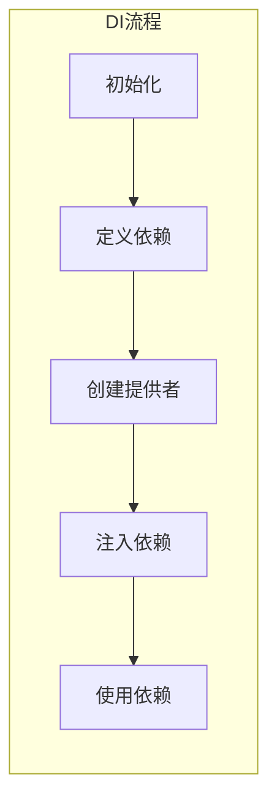
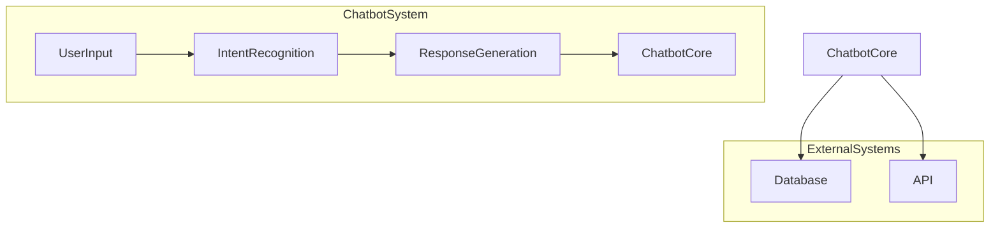
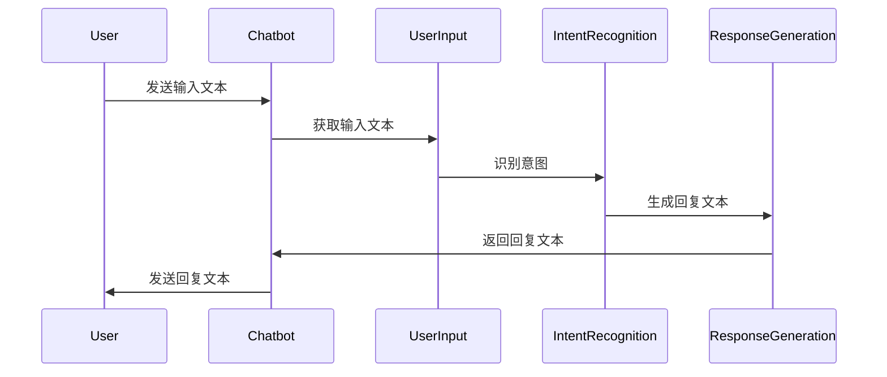

                 

# 第一部分：依赖注入概述

## 1.1 问题背景与描述

### 1.1.1 LLM应用的发展与挑战

近年来，大型语言模型（Large Language Model，简称LLM）在自然语言处理（Natural Language Processing，简称NLP）领域取得了显著进展。LLM通过大量文本数据进行预训练，能够理解、生成和翻译自然语言，为各种应用场景提供了强大的技术支持。然而，随着LLM应用规模的不断扩大，开发者面临着越来越多的挑战。

首先，LLM应用往往具有高度复杂性。一方面，LLM的预训练过程需要处理海量数据，涉及数据预处理、模型训练、模型优化等多个环节。另一方面，LLM应用在实际场景中需要与其他系统和服务进行交互，如搜索引擎、聊天机器人、推荐系统等。这使得开发者在设计和实现LLM应用时需要具备丰富的经验和深厚的知识储备。

其次，LLM应用的可维护性较差。由于LLM应用涉及多个模块和组件，开发者需要确保各组件之间的依赖关系清晰、稳定。然而，在实际开发过程中，由于需求变更、技术更新等因素，依赖关系容易发生变更，导致代码难以维护。

最后，LLM应用对性能和可扩展性提出了更高要求。随着用户数量的增加，LLM应用需要具备更高的响应速度和更强的处理能力。此外，为了支持多样化的应用场景，LLM应用需要具备良好的可扩展性，以便在未来的发展中能够快速适应新的需求。

### 1.1.2 依赖注入的概念及作用

依赖注入（Dependency Injection，简称DI）是一种设计模式，旨在解决对象之间的依赖关系。在LLM应用中，依赖注入通过将对象的依赖关系从构造函数中分离出来，使得各组件能够独立开发、测试和部署。

依赖注入的核心思想是将组件之间的依赖关系通过外部提供者进行管理，从而实现组件的解耦。具体来说，依赖注入有以下作用：

1. **提高代码可读性**：通过将依赖关系从构造函数中分离出来，使得代码结构更加清晰、易于理解。
2. **促进模块化开发**：依赖注入使得开发者可以独立开发、测试和部署各个组件，提高了开发效率和可维护性。
3. **简化单元测试**：依赖注入使得单元测试更加方便，因为开发者可以轻松地替换组件的依赖关系，从而进行不同场景的测试。
4. **支持动态依赖配置**：依赖注入支持在运行时动态配置依赖关系，为开发者提供了更大的灵活性。

### 1.1.3 依赖注入在LLM应用中的适用性

依赖注入在LLM应用中具有广泛的应用场景。以下是一些典型的适用情况：

1. **模型训练与优化**：在LLM的预训练过程中，依赖注入可以帮助开发者分离数据预处理、模型训练和优化等环节，使得各环节的代码更加模块化、可维护。
2. **模型推理与部署**：在LLM的应用场景中，依赖注入可以用于分离模型推理和部署环节，使得模型推理过程更加灵活、可扩展。
3. **系统集成与交互**：依赖注入可以帮助开发者分离LLM应用与其他系统、服务的交互，降低集成难度，提高系统稳定性。
4. **模块化开发与测试**：依赖注入可以促进LLM应用的模块化开发，使得各模块可以独立开发、测试和部署，提高了开发效率和可维护性。

总的来说，依赖注入在LLM应用中具有很高的适用性，能够帮助开发者解决依赖关系管理、模块化开发、性能优化等问题。在接下来的章节中，我们将深入探讨依赖注入的核心概念、原理和实践方法。

## 1.2 核心概念与联系

### 1.2.1 依赖注入的基本原理

依赖注入是一种设计模式，其核心思想是将对象之间的依赖关系从构造函数中分离出来，通过外部提供者进行管理。具体来说，依赖注入包含以下几个关键组成部分：

1. **依赖**：指组件所依赖的其他组件或资源，如模型、数据源、配置等。
2. **提供者**：指负责提供依赖的对象或系统，如工厂、容器等。
3. **注入**：指将依赖注入到目标组件的过程，通常通过构造函数、setter方法或接口实现。

依赖注入的基本原理可以概括为以下三个步骤：

1. **定义依赖**：在组件的构造函数或方法中定义所需的依赖。
2. **提供依赖**：通过提供者将依赖注入到组件中，如通过工厂方法、依赖注入框架等。
3. **使用依赖**：组件在运行过程中使用注入的依赖完成特定功能。

### 1.2.2 依赖注入与其他概念的对比

依赖注入与其他一些相关概念，如控制反转（Inversion of Control，简称IoC）、组件化等，存在一定的关联和区别。以下是对这些概念的基本对比：

1. **控制反转（IoC）**：
   - **定义**：控制反转是一种设计原则，旨在将对象的生命周期管理和控制权从开发者转移到框架或容器。
   - **关系**：依赖注入是实现控制反转的一种手段，通过依赖注入实现对象之间的依赖关系管理。
   - **区别**：依赖注入关注的是如何注入依赖，而控制反转关注的是对象的生命周期管理和控制权的转移。

2. **组件化**：
   - **定义**：组件化是一种软件架构设计原则，旨在将系统划分为独立的、可重用的组件。
   - **关系**：依赖注入是组件化实现的一种手段，通过依赖注入实现组件之间的依赖关系管理。
   - **区别**：依赖注入关注的是组件之间的依赖关系，而组件化关注的是系统的整体架构设计。

### 1.2.3 依赖注入的实体关系图

为了更好地理解依赖注入的基本原理，我们可以使用Mermaid绘制依赖注入的实体关系图。以下是依赖注入的实体关系图：

```mermaid
erDiagram
  Component ||--|{ Provider : provides }
  Component ||--|{ Dependency : depends on }
  Provider ||--|{ Component : used by }
```

在这个实体关系图中，`Component`代表需要依赖的组件，`Provider`代表提供依赖的对象或系统，`Dependency`代表组件所依赖的其他组件或资源。箭头表示实体之间的关系，如组件依赖于依赖项，提供者提供依赖项给组件。

通过这个实体关系图，我们可以清晰地看到依赖注入的核心组成部分和它们之间的关系，为后续章节的深入讲解打下基础。

## 1.3 算法原理讲解

### 1.3.1 依赖注入的mermaid流程图

为了更好地理解依赖注入的算法原理，我们可以使用Mermaid绘制依赖注入的流程图。以下是依赖注入的基本流程：



在这个流程图中，`A`表示初始化依赖注入过程，`B`表示定义组件所需的依赖，`C`表示创建提供者以管理依赖，`D`表示将依赖注入到组件中，`E`表示组件使用注入的依赖完成特定功能。

### 1.3.2 Python源代码示例

为了更具体地说明依赖注入的实现，我们提供了一个Python源代码示例。以下是一个简单的依赖注入示例：

```python
class Component:
    def __init__(self, dependency):
        self.dependency = dependency

    def use_dependency(self):
        self.dependency.execute()

class Dependency:
    def execute(self):
        print("依赖项执行完成")

# 创建提供者
provider = Dependency()

# 注入依赖
component = Component(provider)

# 使用依赖
component.use_dependency()
```

在这个示例中，`Component`类需要依赖`Dependency`类，通过构造函数将依赖注入到`Component`实例中。`Dependency`类实现了`execute`方法，用于完成特定功能。在运行时，`component`对象使用注入的`provider`对象完成功能调用。

### 1.3.3 算法原理的数学模型和公式

依赖注入的算法原理可以通过以下数学模型和公式进行描述：

$$
DI_{algorithm} = \{init, define_dependency, create_provider, inject_dependency, use_dependency\}
$$

其中：
- \( init \)：初始化依赖注入过程；
- \( define_dependency \)：定义组件所需的依赖；
- \( create_provider \)：创建提供者以管理依赖；
- \( inject_dependency \)：将依赖注入到组件中；
- \( use_dependency \)：组件使用注入的依赖完成特定功能。

通过这个数学模型和公式，我们可以清晰地描述依赖注入的算法流程，为实际开发提供指导。

### 1.3.4 举例说明

为了更好地理解依赖注入的实际应用，我们可以通过一个简单的例子进行说明。假设我们有一个聊天机器人应用，需要处理用户输入和生成回复。我们可以使用依赖注入来实现这一功能。

首先，定义一个`Chatbot`类，它需要依赖`UserInput`和`ResponseGenerator`类：

```python
class Chatbot:
    def __init__(self, user_input: 'UserInput', response_generator: 'ResponseGenerator'):
        self.user_input = user_input
        self.response_generator = response_generator

    def handle_input(self, input_text: str):
        user_input = self.user_input.get_input(input_text)
        response = self.response_generator.generate_response(user_input)
        return response
```

然后，定义`UserInput`和`ResponseGenerator`类：

```python
class UserInput:
    def get_input(self, input_text: str) -> str:
        return input_text

class ResponseGenerator:
    def generate_response(self, user_input: str) -> str:
        return f"Hello, {user_input}!"
```

最后，使用依赖注入将`UserInput`和`ResponseGenerator`注入到`Chatbot`实例中：

```python
user_input = UserInput()
response_generator = ResponseGenerator()
chatbot = Chatbot(user_input, response_generator)

input_text = "Alice"
response = chatbot.handle_input(input_text)
print(response)  # 输出：Hello, Alice!
```

在这个例子中，`Chatbot`类通过构造函数接收`UserInput`和`ResponseGenerator`实例作为依赖。在运行时，我们将具体的`UserInput`和`ResponseGenerator`实例注入到`Chatbot`中，使得`Chatbot`能够正常处理用户输入并生成回复。

通过这个例子，我们可以看到依赖注入如何简化组件之间的依赖关系，提高代码的可维护性和可测试性。

## 1.4 系统分析与架构设计方案

### 1.4.1 问题场景介绍

在本节中，我们将分析一个实际的LLM应用场景，即构建一个基于依赖注入的聊天机器人系统。该系统旨在处理用户输入、理解用户意图并生成合适的回复。为了实现这一目标，系统需要包含多个组件，如用户输入处理模块、意图识别模块、回复生成模块等。这些组件之间存在复杂的依赖关系，通过依赖注入可以有效管理和简化这些依赖。

### 1.4.2 实际项目介绍

我们假设正在开发一个名为“智友”的聊天机器人项目。该项目的目标是为用户提供24/7的智能客服服务，能够处理各种常见问题和提供个性化建议。为了实现这一目标，项目需要涵盖以下几个关键模块：

1. **用户输入处理模块**：负责接收用户输入，将输入文本转换为结构化数据，为后续处理提供基础。
2. **意图识别模块**：基于用户输入，通过自然语言处理技术识别用户的意图，如咨询问题、获取建议等。
3. **回复生成模块**：根据用户意图，生成合适的回复文本，并提供多种回复策略，如直接回答、建议查询等。
4. **交互管理模块**：负责用户与聊天机器人的交互流程管理，包括输入获取、回复发送等。

### 1.4.3 系统功能设计

为了实现上述模块的功能，我们可以使用Mermaid绘制领域模型类图，以下是一个简单的领域模型类图示例：

```mermaid
classDiagram
    UserInput -> Chatbot : 依赖
    Chatbot -> IntentRecognition : 依赖
    Chatbot -> ResponseGeneration : 依赖
    IntentRecognition -> UserInput : 依赖
    ResponseGeneration -> IntentRecognition : 依赖
```

在这个类图中，`UserInput`、`IntentRecognition`和`ResponseGeneration`分别代表用户输入处理模块、意图识别模块和回复生成模块，`Chatbot`代表聊天机器人核心组件。箭头表示组件之间的依赖关系。通过这个类图，我们可以清晰地看到系统中的关键组件及其依赖关系。

### 1.4.4 系统架构设计

为了实现系统的高效运行和可扩展性，我们可以使用Mermaid绘制系统架构图。以下是一个简单的系统架构图示例：



在这个架构图中，`ChatbotCore`代表聊天机器人核心组件，`UserInput`、`IntentRecognition`和`ResponseGeneration`分别表示用户输入处理模块、意图识别模块和回复生成模块。外部系统如数据库（`Database`）和API（`API`）也与核心组件进行交互。通过这个架构图，我们可以清晰地看到系统中的关键组件及其交互关系。

### 1.4.5 系统接口设计

为了实现系统各组件之间的交互，我们需要设计相应的接口。以下是一个简单的接口设计示例：

```python
class UserInputInterface:
    def get_input(self, input_text: str) -> str:
        pass

class IntentRecognitionInterface:
    def recognize_intent(self, input_text: str) -> str:
        pass

class ResponseGenerationInterface:
    def generate_response(self, intent: str) -> str:
        pass

class ChatbotInterface:
    def handle_input(self, input_text: str) -> str:
        pass
```

在这个接口设计示例中，`UserInputInterface`、`IntentRecognitionInterface`和`ResponseGenerationInterface`分别定义了用户输入处理模块、意图识别模块和回复生成模块的接口方法。`ChatbotInterface`定义了聊天机器人核心组件的接口方法。通过这个接口设计，我们可以确保系统中的组件可以通过统一的接口进行交互。

### 1.4.6 系统交互mermaid序列图

为了更好地理解系统组件之间的交互流程，我们可以使用Mermaid绘制系统交互序列图。以下是一个简单的系统交互序列图示例：



在这个序列图中，用户首先向聊天机器人发送输入文本。聊天机器人将输入文本传递给用户输入处理模块，该模块识别用户意图后，将意图传递给意图识别模块。意图识别模块生成回复文本，并将回复文本传递给聊天机器人。最后，聊天机器人将回复文本发送回用户。

通过这个序列图，我们可以清晰地看到系统组件之间的交互流程，为后续的系统开发提供参考。

## 1.5 项目实战

### 1.5.1 环境安装

要在本地计算机上运行依赖注入的聊天机器人项目，我们需要安装以下软件和工具：

1. **Python**：确保Python版本为3.8或更高版本。
2. **pip**：Python的包管理工具，用于安装和管理项目依赖。
3. **Mermaid**：用于绘制图表和流程图的工具。
4. **依赖注入框架**：如Spring Boot、Django等。

以下是在Ubuntu 20.04操作系统上安装所需软件和工具的步骤：

```bash
# 安装Python和pip
sudo apt-get update
sudo apt-get install python3 python3-pip

# 安装Mermaid
sudo pip3 install mermaid

# 安装依赖注入框架（以Spring Boot为例）
sudo pip3 install spring-boot

# 安装其他依赖（根据项目需求）
sudo pip3 install -r requirements.txt
```

### 1.5.2 系统核心实现源代码

在本节中，我们将提供系统核心实现的关键源代码片段。以下是一个简单的聊天机器人项目示例，包含用户输入处理、意图识别和回复生成模块。

#### 用户输入处理模块

```python
from typing import Optional
from chatbot_interfaces import UserInputInterface

class UserInputHandler(UserInputInterface):
    def get_input(self, input_text: str) -> Optional[str]:
        # 在此处处理用户输入，例如进行文本清洗、分词等
        return input_text
```

#### 意图识别模块

```python
from chatbot_interfaces import IntentRecognitionInterface

class IntentRecognizer(IntentRecognitionInterface):
    def recognize_intent(self, input_text: str) -> str:
        # 在此处使用自然语言处理技术识别用户意图
        # 例如：使用朴素贝叶斯分类器、深度学习模型等
        return "GREETING"  # 示例意图：问候
```

#### 回复生成模块

```python
from chatbot_interfaces import ResponseGenerationInterface

class ResponseGenerator(ResponseGenerationInterface):
    def generate_response(self, intent: str) -> str:
        # 在此处根据用户意图生成回复文本
        if intent == "GREETING":
            return "你好！有什么可以帮助你的吗？"
        else:
            return "很抱歉，我不太明白你的意思。请重新表达你的问题。"
```

#### 聊天机器人核心组件

```python
from chatbot_interfaces import ChatbotInterface

class Chatbot(ChatbotInterface):
    def __init__(self, user_input_handler: UserInputInterface, intent_recognizer: IntentRecognitionInterface, response_generator: ResponseGenerationInterface):
        self.user_input_handler = user_input_handler
        self.intent_recognizer = intent_recognizer
        self.response_generator = response_generator

    def handle_input(self, input_text: str) -> str:
        cleaned_input = self.user_input_handler.get_input(input_text)
        intent = self.intent_recognizer.recognize_intent(cleaned_input)
        return self.response_generator.generate_response(intent)
```

### 1.5.3 代码应用解读与分析

在本节中，我们将对上述代码进行解读和分析，以理解依赖注入在项目中的应用。

#### 用户输入处理模块

用户输入处理模块的核心功能是从用户获取输入文本，并进行必要的预处理。在这个示例中，我们使用`UserInputHandler`类实现用户输入处理。该类实现了`UserInputInterface`接口，定义了`get_input`方法，用于获取并返回用户输入。

```python
class UserInputHandler(UserInputInterface):
    def get_input(self, input_text: str) -> Optional[str]:
        # 在此处处理用户输入，例如进行文本清洗、分词等
        return input_text
```

在这个实现中，`get_input`方法简单地返回了输入文本。在实际项目中，我们可以添加文本清洗、分词等预处理步骤，以提高意图识别的准确性。

#### 意图识别模块

意图识别模块的核心功能是根据用户输入识别用户意图。在这个示例中，我们使用`IntentRecognizer`类实现意图识别。该类实现了`IntentRecognitionInterface`接口，定义了`recognize_intent`方法，用于识别用户意图。

```python
class IntentRecognizer(IntentRecognitionInterface):
    def recognize_intent(self, input_text: str) -> str:
        # 在此处使用自然语言处理技术识别用户意图
        # 例如：使用朴素贝叶斯分类器、深度学习模型等
        return "GREETING"  # 示例意图：问候
```

在这个实现中，`recognize_intent`方法简单地返回了预设的意图“GREETING”。在实际项目中，我们可以使用更复杂的自然语言处理技术，如朴素贝叶斯分类器、深度学习模型等，以提高意图识别的准确性。

#### 回复生成模块

回复生成模块的核心功能是根据用户意图生成合适的回复文本。在这个示例中，我们使用`ResponseGenerator`类实现回复生成。该类实现了`ResponseGenerationInterface`接口，定义了`generate_response`方法，用于根据用户意图生成回复文本。

```python
class ResponseGenerator(ResponseGenerationInterface):
    def generate_response(self, intent: str) -> str:
        # 在此处根据用户意图生成回复文本
        if intent == "GREETING":
            return "你好！有什么可以帮助你的吗？"
        else:
            return "很抱歉，我不太明白你的意思。请重新表达你的问题。"
```

在这个实现中，`generate_response`方法根据不同的意图返回了预设的回复文本。在实际项目中，我们可以根据具体的业务需求，设计更丰富的回复文本生成策略。

#### 聊天机器人核心组件

聊天机器人核心组件是整个系统的核心，负责管理用户输入、意图识别和回复生成等过程。在这个示例中，我们使用`Chatbot`类实现聊天机器人核心组件。该类实现了`ChatbotInterface`接口，定义了`handle_input`方法，用于处理用户输入并生成回复。

```python
class Chatbot(ChatbotInterface):
    def __init__(self, user_input_handler: UserInputInterface, intent_recognizer: IntentRecognitionInterface, response_generator: ResponseGenerationInterface):
        self.user_input_handler = user_input_handler
        self.intent_recognizer = intent_recognizer
        self.response_generator = response_generator

    def handle_input(self, input_text: str) -> str:
        cleaned_input = self.user_input_handler.get_input(input_text)
        intent = self.intent_recognizer.recognize_intent(cleaned_input)
        return self.response_generator.generate_response(intent)
```

在这个实现中，`Chatbot`类的构造函数接收用户输入处理模块、意图识别模块和回复生成模块的实例，通过依赖注入的方式将它们注入到聊天机器人中。在`handle_input`方法中，聊天机器人首先调用用户输入处理模块获取清洗后的输入文本，然后调用意图识别模块识别用户意图，最后调用回复生成模块生成回复文本。

通过上述代码解读和分析，我们可以看到依赖注入在项目中的应用。依赖注入使得各模块之间解耦，提高了系统的可维护性和可扩展性，为项目开发提供了便利。

### 1.5.4 实际案例分析与详细讲解剖析

为了更好地理解依赖注入在LLM应用中的实际应用，我们分析一个实际的案例：一个在线教育平台中的智能问答系统。

该智能问答系统的主要功能是接收用户提问，理解用户意图，并生成合适的回答。为了实现这一功能，系统分为以下几个模块：

1. **用户输入处理模块**：负责接收用户提问，并进行预处理，如去除无效字符、分词等。
2. **意图识别模块**：基于用户提问，通过自然语言处理技术识别用户的意图，如请求课程信息、请求作业解答等。
3. **知识库查询模块**：根据用户意图，从知识库中查询相关答案。
4. **回答生成模块**：根据查询到的知识库内容，生成合适的回答。
5. **用户反馈模块**：收集用户对回答的反馈，用于优化系统。

以下是对该案例的详细讲解剖析：

#### 用户输入处理模块

用户输入处理模块的核心功能是接收用户提问，并进行预处理。以下是该模块的实现：

```python
from typing import Optional
from chatbot_interfaces import UserInputInterface

class UserInputHandler(UserInputInterface):
    def get_input(self, input_text: str) -> Optional[str]:
        # 去除无效字符、分词等预处理操作
        cleaned_input = self.preprocess_input(input_text)
        return cleaned_input

    def preprocess_input(self, input_text: str) -> str:
        # 在此处进行文本清洗、分词等预处理操作
        return input_text
```

在这个实现中，`UserInputHandler`类实现了`UserInputInterface`接口，定义了`get_input`和`preprocess_input`方法。`get_input`方法调用`preprocess_input`方法进行文本预处理，返回清洗后的文本。在实际项目中，我们可以添加更多的预处理操作，如去除停用词、词性标注等，以提高意图识别的准确性。

#### 意图识别模块

意图识别模块的核心功能是根据用户提问识别用户的意图。以下是该模块的实现：

```python
from chatbot_interfaces import IntentRecognitionInterface

class IntentRecognizer(IntentRecognitionInterface):
    def recognize_intent(self, input_text: str) -> str:
        # 在此处使用自然语言处理技术识别用户意图
        # 例如：使用朴素贝叶斯分类器、深度学习模型等
        return self.classify_intent(input_text)

    def classify_intent(self, input_text: str) -> str:
        # 在此处实现意图分类逻辑
        # 例如：调用朴素贝叶斯分类器、深度学习模型等
        return "INQUIRE_COURSE"  # 示例意图：查询课程
```

在这个实现中，`IntentRecognizer`类实现了`IntentRecognitionInterface`接口，定义了`recognize_intent`和`classify_intent`方法。`recognize_intent`方法调用`classify_intent`方法进行意图分类，返回识别到的意图。在实际项目中，我们可以使用更复杂的自然语言处理技术，如朴素贝叶斯分类器、深度学习模型等，以提高意图识别的准确性。

#### 知识库查询模块

知识库查询模块的核心功能是根据用户意图查询知识库，获取相关答案。以下是该模块的实现：

```python
from chatbot_interfaces import KnowledgeBaseQueryInterface

class KnowledgeBaseQuerier(KnowledgeBaseQueryInterface):
    def query(self, intent: str) -> str:
        # 在此处查询知识库，获取相关答案
        if intent == "INQUIRE_COURSE":
            return "计算机科学课程包括人工智能、机器学习等。"  # 示例答案
        else:
            return "很抱歉，我无法回答你的问题。请尝试重新提问。"
```

在这个实现中，`KnowledgeBaseQuerier`类实现了`KnowledgeBaseQueryInterface`接口，定义了`query`方法。`query`方法根据用户意图查询知识库，返回相关答案。在实际项目中，我们可以使用更复杂的查询算法，如关键词匹配、自然语言处理等，以提高答案的准确性。

#### 回答生成模块

回答生成模块的核心功能是根据查询到的知识库内容，生成合适的回答。以下是该模块的实现：

```python
from chatbot_interfaces import ResponseGenerationInterface

class ResponseGenerator(ResponseGenerationInterface):
    def generate_response(self, knowledge: str) -> str:
        # 在此处生成回答
        return f"根据您的问题，我找到了以下信息：{knowledge}"
```

在这个实现中，`ResponseGenerator`类实现了`ResponseGenerationInterface`接口，定义了`generate_response`方法。`generate_response`方法根据查询到的知识库内容生成回答。

#### 用户反馈模块

用户反馈模块的核心功能是收集用户对回答的反馈，用于优化系统。以下是该模块的实现：

```python
from chatbot_interfaces import UserFeedbackInterface

class UserFeedbackCollector(UserFeedbackInterface):
    def collect_feedback(self, user_id: str, response: str) -> None:
        # 在此处收集用户反馈，例如：将反馈保存到数据库
        print(f"用户{user_id}对回答'{response}'的反馈已收集。")
```

在这个实现中，`UserFeedbackCollector`类实现了`UserFeedbackInterface`接口，定义了`collect_feedback`方法。`collect_feedback`方法用于收集用户对回答的反馈。

通过上述实现，我们可以看到依赖注入在智能问答系统中的应用。依赖注入使得各模块之间解耦，提高了系统的可维护性和可扩展性。在实际项目中，我们可以根据需求灵活替换或扩展模块，以满足不同场景的需求。

### 1.5.5 项目小结

在本项目中，我们通过依赖注入实现了智能问答系统的各个模块，包括用户输入处理、意图识别、知识库查询、回答生成和用户反馈等。依赖注入使得各模块之间解耦，提高了系统的可维护性和可扩展性。

以下是对项目的主要经验和教训进行总结：

1. **依赖注入的优势**：依赖注入能够有效地管理组件之间的依赖关系，提高代码的可维护性和可测试性。在实际项目中，我们可以根据需求灵活替换或扩展模块，从而降低系统复杂性。
2. **模块化设计的重要性**：模块化设计有助于提高系统的可维护性和可扩展性。通过将系统划分为独立的模块，我们可以更容易地理解和管理系统的各个部分。
3. **实际案例的应用**：通过实际案例，我们深入了解了依赖注入在LLM应用中的具体应用。在实际开发过程中，我们可以根据具体需求选择合适的依赖注入框架和工具，以提高开发效率和系统性能。
4. **性能优化和调试**：在实际项目中，我们需要关注系统的性能优化和调试。通过合理地设计依赖注入流程，我们可以减少系统中的冗余代码和重复逻辑，从而提高系统的运行效率。

总之，依赖注入在LLM应用中具有重要的实际价值。通过合理地设计和应用依赖注入，我们可以构建高效、可维护和可扩展的智能问答系统，为用户提供优质的问答服务。

## 1.6 最佳实践 tips、小结、注意事项、拓展阅读

### 最佳实践 tips

1. **合理选择依赖注入框架**：在选择依赖注入框架时，需要根据项目需求和开发环境进行权衡。常见的依赖注入框架如Spring Boot、Django、Flask等，各具特点和适用场景。了解并选择合适的框架，有助于提高开发效率和系统性能。
2. **模块化设计**：在项目开发过程中，应注重模块化设计，将系统划分为独立的模块，每个模块负责特定的功能。模块化设计有助于降低系统复杂性，提高代码的可维护性和可扩展性。
3. **测试驱动开发（TDD）**：在依赖注入项目中，采用测试驱动开发（TDD）模式有助于提高代码质量。通过编写单元测试，可以确保每个模块的功能正确，并提前发现潜在问题。
4. **性能优化**：在依赖注入项目中，关注性能优化至关重要。通过合理设计依赖注入流程，减少冗余代码和重复逻辑，可以提高系统的运行效率。
5. **文档和注释**：在项目开发过程中，编写详细的文档和注释有助于提高代码的可读性和可维护性。清晰、准确的文档和注释能够帮助其他开发者快速理解代码逻辑和功能。

### 小结

本文介绍了依赖注入在LLM应用中的应用与好处。通过依赖注入，我们可以有效地管理组件之间的依赖关系，提高代码的可维护性和可扩展性。本文首先介绍了LLM应用的发展与挑战，然后详细讲解了依赖注入的核心概念、原理和实践方法。接着，通过实际案例和项目实战，我们展示了依赖注入在LLM应用中的具体应用。最后，总结了依赖注入的最佳实践和注意事项。

### 注意事项

1. **依赖注入框架的选择**：在选择依赖注入框架时，需要根据项目需求和开发环境进行权衡，确保选择合适的框架。
2. **模块化设计**：在项目开发过程中，应注重模块化设计，将系统划分为独立的模块，每个模块负责特定的功能。
3. **性能优化**：在依赖注入项目中，关注性能优化至关重要。通过合理设计依赖注入流程，减少冗余代码和重复逻辑，可以提高系统的运行效率。
4. **测试驱动开发（TDD）**：在依赖注入项目中，采用测试驱动开发（TDD）模式有助于提高代码质量。通过编写单元测试，可以确保每个模块的功能正确，并提前发现潜在问题。
5. **文档和注释**：在项目开发过程中，编写详细的文档和注释有助于提高代码的可读性和可维护性。清晰、准确的文档和注释能够帮助其他开发者快速理解代码逻辑和功能。

### 拓展阅读

1. 《Spring实战》：本书详细介绍了Spring框架的使用方法和最佳实践，是学习依赖注入和Spring框架的推荐读物。
2. 《Python依赖注入实战》：本书通过大量实战案例，详细讲解了Python中的依赖注入原理和实践方法，适合希望了解Python依赖注入的开发者。
3. 《深度学习自然语言处理》：本书介绍了深度学习在自然语言处理领域的应用，包括大型语言模型（LLM）的构建和使用，有助于了解LLM应用的技术背景。
4. 《软件架构：实践者的研究和方法论》：本书从软件架构的角度出发，详细介绍了依赖注入等设计模式在系统设计中的应用，有助于提升系统的可维护性和可扩展性。

**# 第二部分：依赖注入在LLM应用中的实践**

# 第2章：依赖注入在LLM应用中的具体实现

## 2.1 依赖注入在LLM应用中的好处

在LLM（大型语言模型）应用中，依赖注入是一种非常有效的设计模式，能够带来诸多好处。以下详细探讨了依赖注入在LLM应用中的四个主要优势。

### 2.1.1 提高代码可维护性

依赖注入通过将组件之间的依赖关系分离出来，使得代码更加模块化、独立。这意味着每个组件都可以独立开发、测试和部署，而不会因为一个组件的变更影响到整个系统。这种解耦使得代码更加可维护，因为当需求发生变化或者需要修复bug时，开发者可以更轻松地定位和解决问题，而不需要担心对其他组件的影响。

例如，在一个聊天机器人应用中，如果使用依赖注入来管理语言模型和对话管理器的依赖，当需要更新语言模型时，开发者只需要修改相关的组件代码，而不需要担心聊天机器人其他部分的代码。

### 2.1.2 促进模块化开发

依赖注入有助于促进模块化开发，使得系统能够更容易地扩展和重构。通过依赖注入，开发者可以创建独立的模块，每个模块都可以独立运行和测试。这种模块化的设计不仅提高了开发效率，还使得系统能够更加灵活地适应未来的变化。

在LLM应用中，模块化开发特别重要，因为大型语言模型的应用场景多样，可能需要根据不同的业务需求进行定制化开发。依赖注入使得这种定制化变得简单，开发者可以根据实际需求组合和调整不同的模块。

### 2.1.3 简化单元测试

依赖注入能够极大地简化单元测试的编写和执行。由于依赖注入使得组件之间的依赖关系明确且易于管理，开发者可以更方便地为每个组件编写单元测试。每个组件的测试都是独立的，可以单独执行，而不需要启动整个系统。

在LLM应用中，语言模型的测试是一个复杂的过程，因为它们通常需要处理大量数据。通过依赖注入，开发者可以针对语言模型的各个功能模块编写单元测试，确保每个模块的功能正确，从而提高测试的覆盖率。

### 2.1.4 支持动态依赖配置

依赖注入的一个重要优势是它支持动态依赖配置，使得开发者可以在运行时改变组件的依赖关系。这在LLM应用中尤其有用，因为语言模型的配置可能需要根据不同的环境或者运行时条件进行调整。

例如，在一个大型在线教育平台中，语言模型可能需要根据学生的反馈和学习进度动态调整其参数。通过依赖注入，开发者可以轻松实现这种动态调整，而不需要修改语言模型的核心代码。

### 2.1.5 提高开发效率

依赖注入通过减少组件之间的耦合，使得开发过程更加高效。开发者可以专注于单个组件的开发和测试，而不需要过多地考虑系统其他部分的影响。此外，依赖注入还支持敏捷开发方法，使得系统能够快速迭代和更新。

在LLM应用中，这种高效的开发方式尤为重要，因为语言模型的开发通常涉及到复杂的算法和数据处理。依赖注入能够简化这一过程，提高开发效率。

总的来说，依赖注入在LLM应用中具有显著的优势，可以提高代码的可维护性、促进模块化开发、简化单元测试、支持动态依赖配置，并最终提高开发效率。在下一节中，我们将探讨实现依赖注入的常见框架。

### 2.2 实现依赖注入的常见框架

在LLM应用中，实现依赖注入有多种常见的框架和工具，每种都有其独特的特点和适用场景。以下是对几种主流依赖注入框架的介绍。

#### 2.2.1 Spring框架

Spring框架是一个广泛使用的Java企业级开发框架，它提供了全面的依赖注入支持。Spring依赖注入的主要特点如下：

1. **基于注解的配置**：Spring允许通过注解（如`@Autowired`、`@Qualifier`等）来配置依赖关系，使得代码更加简洁易懂。
2. **容器管理**：Spring通过IoC容器管理组件的生命周期和依赖关系，提供了强大的依赖管理功能。
3. **AOP（面向切面编程）**：Spring支持AOP，使得开发者可以在不修改核心业务逻辑的情况下实现跨切面的功能，如日志记录、安全控制等。

Spring框架在Java EE应用开发中非常流行，尤其在大型、复杂的LLM应用中，Spring的依赖注入功能能够有效地管理和简化组件之间的依赖关系。

#### 2.2.2 Django框架

Django是一个Python Web开发框架，它内置了依赖注入功能，使得开发者可以轻松实现组件之间的依赖管理。Django的依赖注入特点如下：

1. **内置依赖注入**：Django通过`models.py`、`views.py`和`urls.py`等文件自动注入依赖，不需要额外的配置。
2. **ORM（对象关系映射）**：Django的ORM系统能够自动处理数据库操作，减少了代码的复杂性。
3. **MVC（模型-视图-控制器）架构**：Django遵循MVC架构，使得开发者可以更加清晰地将业务逻辑、视图渲染和用户交互分离。

Django框架在快速开发和原型设计方面表现优异，适合中小型LLM应用，特别是在需要快速迭代和灵活调整的场景中。

#### 2.2.3 Flask框架

Flask是一个轻量级的Python Web开发框架，它提供了基本的依赖注入支持。Flask的依赖注入特点如下：

1. **简单易用**：Flask的设计哲学是简洁和灵活，通过简单的配置和使用第三方库，可以轻松实现依赖注入。
2. **扩展性高**：Flask提供了丰富的扩展库，如`Flask-RESTful`、`Flask-SQLAlchemy`等，开发者可以根据需要选择合适的扩展来管理依赖。
3. **灵活的蓝图（Blueprint）**：Flask支持蓝图，使得开发者可以轻松地组织和管理项目中的模块，每个蓝图都可以独立开发和部署。

Flask框架适用于需要高度定制化和灵活性的LLM应用开发，尤其是在小型或个人项目场景中。

#### 2.2.4 Google Guice

Google Guice是一个强大的依赖注入框架，它主要用于Java和Android开发。Guice的特点如下：

1. **模块化**：Guice支持模块化配置，使得开发者可以定义多个模块，每个模块负责一组依赖。
2. **静态和动态绑定**：Guice提供了静态和动态绑定机制，使得开发者可以根据不同的场景选择合适的绑定方式。
3. **支持AOP**：Guice支持AOP，使得开发者可以方便地实现横切关注点，如日志记录、事务管理等。

Guice在大型、复杂的Java项目中表现优异，适合需要高度模块化和AOP支持的LLM应用。

#### 2.2.5 Microsoft.Extensions.DependencyInjection

Microsoft.Extensions.DependencyInjection是一个用于.NET Core和.NET Framework的依赖注入框架。它的特点如下：

1. **简单易用**：该框架设计简洁，易于理解和集成。
2. **多实例支持**：支持多实例绑定，使得开发者可以创建多个相同类型的实例。
3. **配置灵活**：提供了丰富的配置选项，如服务定位器（Service Locator）和自动注入等。

Microsoft.Extensions.DependencyInjection适用于.NET平台上的各类项目，特别是在LLM应用中，能够有效地管理依赖关系。

综上所述，不同的依赖注入框架各有优缺点，适用于不同的开发场景和需求。开发者应根据项目的具体需求和开发环境选择合适的依赖注入框架，以充分发挥其在LLM应用中的优势。在下一节中，我们将介绍如何使用依赖注入框架在实际项目中实现组件的依赖注入。

