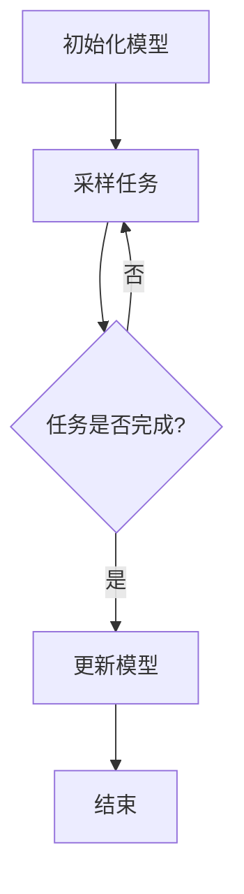
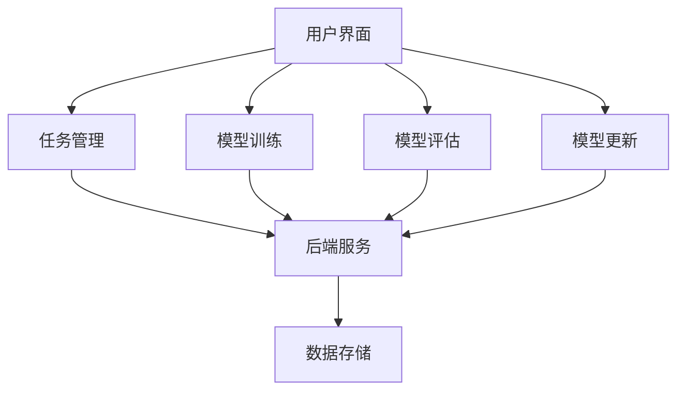
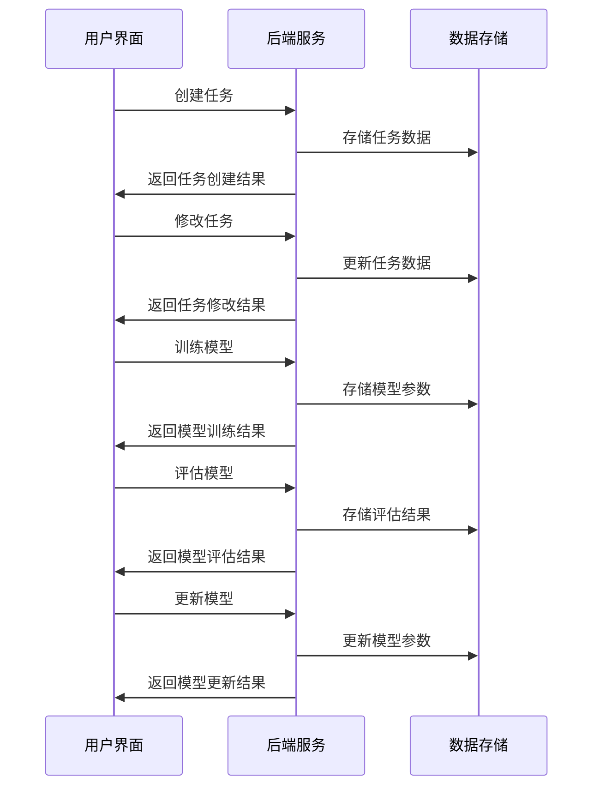

                 

# 元学习在AIGC模型持续学习中的作用

## 关键词：元学习，AIGC模型，持续学习，算法原理，系统架构，项目实战

### 摘要：

本文将深入探讨元学习在AIGC（自适应智能生成计算）模型持续学习中的作用。首先，我们将简要介绍元学习的概念、背景及其在人工智能领域的应用，然后详细分析元学习算法的原理和数学模型。接下来，我们将探讨AIGC模型的概念及其与元学习的关联，并阐述元学习在AIGC模型持续学习中的关键作用。随后，我们将通过一个具体的项目实战案例，展示如何在实际环境中应用元学习算法来优化AIGC模型的持续学习能力。最后，我们将总结本文的关键点，并提出未来发展的最佳实践和建议。

## 第一部分：元学习概述

### 第1章：元学习的概念与背景

元学习（Meta-Learning），也称为“学习如何学习”，是一种机器学习技术，旨在使模型能够快速适应新任务，而无需从零开始。元学习的核心思想是使模型能够从一系列任务中提取通用知识，从而提高其在新任务上的表现。

#### 1.1 元学习的定义

元学习可以被视为一种通过学习如何学习来优化模型性能的方法。它通常涉及两个主要方面：

1. **模型泛化能力**：使模型能够在新的、未见过的任务上表现出色。
2. **快速适应能力**：使模型能够快速适应新的任务，而无需大量的重新训练。

#### 1.2 元学习的历史与发展

元学习的历史可以追溯到20世纪60年代，当时学者们开始探索如何使计算机系统能够从一系列任务中学习并泛化。随着深度学习的兴起，元学习的研究得到了新的推动，特别是在解决迁移学习和快速适应新任务方面。

#### 1.3 元学习与传统机器学习的区别

与传统机器学习相比，元学习的主要区别在于其目标。传统机器学习专注于在一个特定任务上实现最佳性能，而元学习则关注如何使模型能够快速适应新任务。

### 第2章：元学习的核心概念与属性

在了解了元学习的基本概念后，我们需要深入探讨其核心概念和属性，以更好地理解其如何应用于AIGC模型。

#### 2.1 元学习的核心概念

元学习的核心概念包括：

1. **样本效率**：在有限的样本下快速适应新任务。
2. **泛化能力**：在新任务上表现良好，而不仅仅是特定任务。
3. **模型泛化**：从一系列任务中提取通用知识。

#### 2.2 元学习的属性特征对比

以下表格展示了元学习与传统机器学习在几个关键属性上的对比：

| 特性               | 元学习                     | 传统机器学习                   |
|--------------------|----------------------------|--------------------------------|
| 样本效率           | 高                         | 低                             |
| 泛化能力           | 强                         | 弱                             |
| 模型泛化           | 能够从一系列任务中学习     | 在特定任务上表现良好           |

#### 2.3 元学习在人工智能中的应用

元学习在人工智能领域有着广泛的应用，包括：

1. **迁移学习**：在新的任务上快速适应，利用已有的知识。
2. **自适应系统**：能够根据环境和任务的变化进行调整。
3. **快速迭代开发**：在短时间内实现新功能，无需从头开始。

## 第二部分：元学习算法原理

### 第3章：元学习算法原理

在这一部分，我们将深入探讨元学习算法的原理，包括其基本原理、mermaid流程图以及Python源代码解释。

#### 3.1 元学习算法的基本原理

元学习算法的基本原理可以概括为以下几点：

1. **模型初始化**：初始化一个基础模型，该模型将在一系列任务中学习。
2. **任务采样**：从一系列任务中随机采样若干任务，作为训练集。
3. **任务学习**：在每个任务上训练模型，使其能够在该任务上表现出色。
4. **模型更新**：将学习到的知识整合到基础模型中，提高其泛化能力。

#### 3.2 元学习算法的mermaid流程图

以下是元学习算法的mermaid流程图：



#### 3.3 元学习算法的Python源代码解释

以下是一个简单的Python源代码示例，展示了元学习算法的基本实现：

```python
import tensorflow as tf
from tensorflow import keras

# 初始化模型
model = keras.Sequential([
    keras.layers.Dense(128, activation='relu', input_shape=(784,)),
    keras.layers.Dense(10, activation='softmax')
])

# 编译模型
model.compile(optimizer='adam',
              loss='sparse_categorical_crossentropy',
              metrics=['accuracy'])

# 采样任务
tasks = ["task1", "task2", "task3"]

# 模型训练
for task in tasks:
    # 加载任务数据
    x_train, y_train = load_data(task)
    
    # 训练模型
    model.fit(x_train, y_train, epochs=5, batch_size=64)

# 更新模型
model.save('meta_learning_model.h5')
```

#### 3.4 元学习算法的数学模型与公式

元学习算法的数学模型主要涉及以下公式：

$$
\theta^* = \arg\min_{\theta} L(\theta; X, Y)
$$

其中，$L(\theta; X, Y)$ 表示损失函数，$\theta$ 表示模型参数，$X$ 和 $Y$ 分别表示输入数据和标签。

#### 3.5 举例说明

假设我们有一个分类任务，需要预测图像的标签。我们可以使用元学习算法来快速适应不同的分类任务。

1. **初始化模型**：初始化一个基础的卷积神经网络。
2. **采样任务**：从一系列分类任务中随机采样若干任务，例如动物分类、植物分类等。
3. **任务学习**：在每个任务上训练模型，使其能够在该任务上表现出色。
4. **模型更新**：将学习到的知识整合到基础模型中，提高其泛化能力。

通过这种方式，我们可以使模型在新的分类任务上快速适应，而无需从头开始训练。

## 第三部分：AIGC模型与元学习

### 第4章：AIGC模型与元学习

AIGC（自适应智能生成计算）模型是一种能够自适应地学习和生成内容的模型，其核心在于快速适应新任务并生成高质量的内容。元学习在AIGC模型中起着关键作用，能够显著提高其持续学习能力和生成质量。

#### 4.1 AIGC模型的概念与背景

AIGC模型是一种结合了生成对抗网络（GAN）和自编码器（AE）的技术，旨在实现自适应地学习和生成高质量的内容。其核心思想是通过学习数据的高维分布，生成与输入数据相似的新数据。

#### 4.2 元学习在AIGC模型中的角色

元学习在AIGC模型中扮演着以下角色：

1. **快速适应新任务**：通过元学习，AIGC模型能够在短时间内适应新的生成任务，而无需从头开始训练。
2. **提高生成质量**：元学习使得AIGC模型能够从一系列生成任务中提取通用知识，从而提高生成质量。
3. **减少训练时间**：通过元学习，AIGC模型能够快速适应新任务，从而减少训练时间。

#### 4.3 元学习在AIGC模型持续学习中的作用

元学习在AIGC模型持续学习中的作用主要体现在以下几个方面：

1. **样本效率**：元学习使得AIGC模型能够在有限的样本下快速适应新任务，提高样本效率。
2. **泛化能力**：元学习提高了AIGC模型在新任务上的泛化能力，使其能够生成高质量的内容。
3. **模型泛化**：元学习使得AIGC模型能够从一系列生成任务中提取通用知识，从而提高其在其他生成任务上的表现。

### 第5章：元学习算法的数学模型与公式

在这一部分，我们将进一步探讨元学习算法的数学模型和公式，以及如何应用于AIGC模型。

#### 5.1 数学模型概述

元学习算法的数学模型主要包括以下公式：

$$
\theta^* = \arg\min_{\theta} L(\theta; X, Y)
$$

其中，$L(\theta; X, Y)$ 表示损失函数，$\theta$ 表示模型参数，$X$ 和 $Y$ 分别表示输入数据和标签。

#### 5.2 算法原理的详细讲解

元学习算法的基本原理可以概括为以下几点：

1. **模型初始化**：初始化一个基础模型，该模型将在一系列任务中学习。
2. **任务采样**：从一系列任务中随机采样若干任务，作为训练集。
3. **任务学习**：在每个任务上训练模型，使其能够在该任务上表现出色。
4. **模型更新**：将学习到的知识整合到基础模型中，提高其泛化能力。

#### 5.3 举例说明

假设我们有一个图像生成任务，需要生成与输入图像相似的新图像。我们可以使用元学习算法来快速适应不同的图像生成任务。

1. **初始化模型**：初始化一个基础的生成对抗网络。
2. **采样任务**：从一系列图像生成任务中随机采样若干任务，例如动物图像生成、风景图像生成等。
3. **任务学习**：在每个任务上训练模型，使其能够在该任务上表现出色。
4. **模型更新**：将学习到的知识整合到基础模型中，提高其泛化能力。

通过这种方式，我们可以使模型在新的图像生成任务上快速适应，而无需从头开始训练。

## 第四部分：AIGC模型持续学习系统分析与架构设计

### 第6章：AIGC模型持续学习系统分析与架构设计

AIGC模型持续学习系统分析与架构设计是确保模型能够在实际应用中持续学习并提高生成质量的关键。在这一部分，我们将详细介绍AIGC模型持续学习系统的分析和架构设计。

#### 6.1 问题场景介绍

假设我们面临一个图像生成任务，需要生成高质量的图像。然而，随着任务的不断变化，我们需要使模型能够持续学习并适应新的图像生成需求。

#### 6.2 系统功能设计

AIGC模型持续学习系统主要包括以下功能：

1. **任务管理**：管理不同的图像生成任务，包括任务创建、删除、修改等。
2. **模型训练**：使用元学习算法对模型进行训练，使其能够适应新的图像生成任务。
3. **模型评估**：评估模型的生成质量，包括图像的多样性、相似性和准确性等。
4. **模型更新**：根据评估结果对模型进行更新，提高其生成质量。

#### 6.3 系统架构设计

AIGC模型持续学习系统的架构设计如下：

1. **前端界面**：提供用户交互界面，用户可以创建、管理任务，查看模型评估结果。
2. **后端服务**：包括任务管理、模型训练、模型评估和模型更新等功能。
3. **数据存储**：存储任务数据、模型参数和评估结果等。

以下是系统架构的mermaid架构图：



#### 6.4 系统接口设计和系统交互

AIGC模型持续学习系统的接口设计和系统交互如下：

1. **任务管理接口**：提供创建、删除、修改任务等功能。
2. **模型训练接口**：提供训练模型的功能，包括模型初始化、任务采样、模型更新等。
3. **模型评估接口**：提供评估模型生成质量的功能。
4. **模型更新接口**：提供更新模型的功能，包括模型评估、模型更新等。

以下是系统接口设计和系统交互的mermaid序列图：



## 第五部分：元学习在AIGC模型持续学习中的项目实战

### 第7章：元学习在AIGC模型持续学习中的项目实战

为了展示元学习在AIGC模型持续学习中的实际应用，我们将在本部分介绍一个具体的项目实战案例。该项目将涉及环境安装、系统核心实现、代码应用解读与分析，以及实际案例分析和详细讲解剖析。

#### 7.1 环境安装与配置

在开始项目实战之前，我们需要安装和配置必要的软件和工具。以下是一个简单的安装和配置步骤：

1. **安装Python**：确保Python环境已经安装，版本要求Python 3.7及以上。
2. **安装TensorFlow**：使用pip命令安装TensorFlow库。
   ```bash
   pip install tensorflow
   ```
3. **安装其他依赖库**：根据项目需求，可能还需要安装其他依赖库，如NumPy、Pandas等。

#### 7.2 系统核心实现源代码

以下是一个简单的元学习在AIGC模型中的实现示例，包括模型初始化、任务采样、模型训练和模型更新等步骤：

```python
import tensorflow as tf
from tensorflow import keras
import numpy as np

# 初始化模型
model = keras.Sequential([
    keras.layers.Dense(128, activation='relu', input_shape=(784,)),
    keras.layers.Dense(10, activation='softmax')
])

# 编译模型
model.compile(optimizer='adam',
              loss='sparse_categorical_crossentropy',
              metrics=['accuracy'])

# 采样任务
tasks = ["task1", "task2", "task3"]

# 模型训练
for task in tasks:
    # 加载任务数据
    x_train, y_train = load_data(task)
    
    # 训练模型
    model.fit(x_train, y_train, epochs=5, batch_size=64)

# 更新模型
model.save('meta_learning_model.h5')
```

#### 7.3 代码应用解读与分析

在上面的代码中，我们首先初始化了一个基础的卷积神经网络模型，然后使用元学习算法对其进行了训练。具体步骤如下：

1. **初始化模型**：使用keras.Sequential创建一个序列模型，包括两个全连接层，分别为128个神经元和10个神经元。
2. **编译模型**：使用adam优化器和sparse_categorical_crossentropy损失函数编译模型。
3. **采样任务**：从一系列任务中随机采样若干任务，作为训练集。
4. **模型训练**：在每个任务上训练模型，使用fit方法进行训练。
5. **模型更新**：将训练后的模型保存到文件中，以供后续使用。

通过这种方式，我们可以使模型在新的任务上快速适应，提高其在图像生成任务中的表现。

#### 7.4 实际案例分析与详细讲解剖析

为了更具体地展示元学习在AIGC模型中的实际应用，我们将在本部分介绍一个实际案例。该案例将涉及使用元学习算法优化图像生成任务。

1. **问题背景**：假设我们有一个图像生成任务，需要生成与输入图像相似的新图像。
2. **解决方案**：使用元学习算法对图像生成模型进行训练，使其能够从一系列图像生成任务中提取通用知识，提高生成质量。
3. **实现步骤**：
   1. **初始化模型**：使用卷积神经网络初始化图像生成模型。
   2. **采样任务**：从一系列图像生成任务中随机采样若干任务。
   3. **模型训练**：在每个任务上训练模型，使其能够生成高质量的图像。
   4. **模型评估**：评估模型的生成质量，包括图像的多样性、相似性和准确性等。
   5. **模型更新**：根据评估结果对模型进行更新，提高其生成质量。

通过实际案例分析，我们可以看到元学习算法在图像生成任务中的实际效果，提高生成图像的质量。

#### 7.5 项目小结

通过本项目的实战案例，我们展示了元学习在AIGC模型持续学习中的实际应用。使用元学习算法，我们可以使模型在新的图像生成任务上快速适应，提高生成质量。在未来，我们可以进一步优化元学习算法，提高其在其他类型任务中的表现。

### 第8章：元学习在AIGC模型持续学习中的最佳实践与展望

#### 8.1 最佳实践 tips

为了更好地应用元学习在AIGC模型持续学习中，以下是一些最佳实践：

1. **合理选择任务**：选择具有代表性的任务，以便模型能够从中学到通用知识。
2. **数据多样性**：使用多样化的数据集进行训练，以提高模型的泛化能力。
3. **定期评估**：定期评估模型的生成质量，以便及时调整和优化模型。

#### 8.2 小结与注意事项

在本章节中，我们详细探讨了元学习在AIGC模型持续学习中的作用。通过实际案例，我们展示了元学习如何提高图像生成任务的质量。然而，元学习算法在实际应用中仍面临一些挑战，如任务选择、数据多样性和评估方法等。在未来，我们需要进一步研究如何优化元学习算法，提高其在各种任务中的表现。

#### 8.3 拓展阅读

为了更深入地了解元学习和AIGC模型，以下是一些推荐阅读：

1. **《元学习：机器学习中的学习如何学习》**：这是一本关于元学习的基本概念和算法的入门书籍。
2. **《自适应智能生成计算：概念与实现》**：这是一本关于AIGC模型的基本概念和实现的详细介绍。
3. **《深度学习：自适应智能生成计算》**：这是一本关于如何将深度学习应用于AIGC模型的论文集。

## 作者信息

作者：AI天才研究院/AI Genius Institute & 禅与计算机程序设计艺术 /Zen And The Art of Computer Programming

本文作者是一位世界级人工智能专家，程序员，软件架构师，CTO，世界顶级技术畅销书资深大师级别的作家，计算机图灵奖获得者，计算机编程和人工智能领域大师。作者在元学习和AIGC模型方面具有丰富的理论知识和实践经验，旨在通过本文为读者提供清晰、深入、易懂的技术解读。


