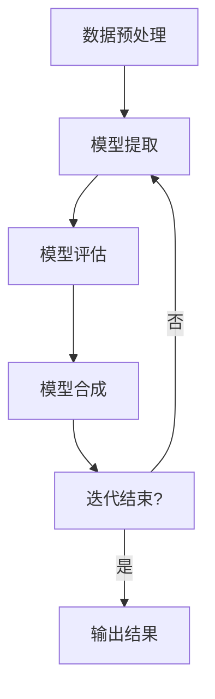

                 

### 《元学习在快速适应新AIGC任务中的作用》

#### 关键词：元学习、AIGC、算法、应用、快速适应

> 摘要：本文将深入探讨元学习在快速适应新的AIGC（自适应智能生成计算）任务中的作用。我们将从元学习的定义和原理出发，逐步分析其算法框架和应用场景，然后重点讨论元学习在AIGC任务中的具体应用和最佳实践，最后对全文进行小结，展望元学习在AIGC领域的未来发展方向。

## 第一部分：元学习的概念与基础

### 第1章：元学习的概念与原理

#### 1.1 元学习的概念与起源

##### 1.1.1 人工智能的发展历程

人工智能（AI）是计算机科学的一个分支，旨在使计算机具备智能行为的理论、技术和应用。自20世纪50年代以来，人工智能经历了多个发展阶段。早期的符号主义方法依赖于知识表示和推理，但受限于知识的获取和表达方式。随后，随着计算能力的提升和数据量的爆炸增长，机器学习方法，特别是深度学习，成为人工智能发展的主要驱动力。

##### 1.1.2 元学习的提出与发展

元学习（Meta-Learning），又称为学习的学习，是一种使机器模型能够快速适应新任务的学习方法。它起源于20世纪80年代，随着神经网络和强化学习的发展，元学习逐渐受到关注。近年来，随着深度学习的进步和计算资源的增加，元学习得到了广泛的关注和应用。

##### 1.1.3 元学习的核心概念

元学习的核心概念包括：

- **迁移学习**（Transfer Learning）：将已有知识应用于新任务，以提高新任务的学习效率。
- **元学习算法**：设计用于解决元学习问题的算法，如模型提取器（Model Extractor）、模型评估器（Model Evaluator）和模型合成器（Model Synthesizer）。
- **元学习框架**：包括数据预处理、模型训练、模型评估和模型调整等步骤的整体框架。

#### 1.2 元学习的定义与分类

##### 1.2.1 元学习的定义

元学习可以定义为“学习如何学习”。其目标是开发出能够快速适应新任务的模型，而不是从头开始训练每个新任务。

##### 1.2.2 元学习的分类

元学习可以分为以下几种类型：

- **模型提取器**：从一组模型中提取最佳模型。
- **模型评估器**：评估新模型的性能。
- **模型合成器**：生成新的模型，用于解决特定任务。
- **模型复用**：将已有模型应用于新任务，而不进行重新训练。

##### 1.2.3 元学习的关键特征

- **快速适应**：能够快速适应新任务。
- **通用性**：适用于多种类型和领域的新任务。
- **效率**：提高学习效率，减少训练时间。

#### 1.3 元学习与传统机器学习比较

##### 1.3.1 传统机器学习的局限性

传统机器学习方法，如深度学习，通常需要大量数据和高性能计算资源。它们在处理新任务时，往往需要从头开始训练，效率较低。

##### 1.3.2 元学习的优势

元学习具有以下优势：

- **快速适应**：能够快速适应新任务。
- **通用性**：适用于多种类型和领域的新任务。
- **效率**：提高学习效率，减少训练时间。

##### 1.3.3 元学习与传统机器学习的异同点

- **相同点**：都旨在提高机器学习模型的性能。
- **不同点**：传统机器学习主要针对特定任务，而元学习更关注如何快速适应新任务。

#### 1.4 元学习的研究领域与应用场景

##### 1.4.1 研究领域

元学习的研究领域包括：

- **迁移学习**：如何将已有知识应用于新任务。
- **模型提取器设计**：如何设计高效的学习算法。
- **模型评估方法**：如何评价新模型的性能。

##### 1.4.2 应用场景

元学习在以下应用场景中具有广泛的应用：

- **自动编程**：使用元学习生成代码。
- **生成对抗网络**：用于生成高质量的数据。
- **文本生成**：生成高质量的文本。
- **图像生成**：生成逼真的图像。

##### 1.4.3 未来发展趋势

随着深度学习和计算能力的提升，元学习在未来将继续发展，并在更多领域得到应用。例如，在自动驾驶、医疗诊断和金融预测等方面，元学习有望发挥重要作用。

#### 1.5 本章小结

本章介绍了元学习的概念、原理、优势、与传统机器学习的比较以及研究应用领域。元学习作为快速适应新任务的重要方法，具有广泛的应用前景和研究价值。

----------------------------------------------------------------

### 第2章：元学习算法原理详解

#### 2.1 元学习算法的基本框架

##### 2.1.1 元学习算法的结构

元学习算法通常包括以下几个核心组件：

- **模型提取器**：负责从已有模型中提取最佳模型。
- **模型评估器**：评估新模型的性能。
- **模型合成器**：生成新的模型，用于解决特定任务。
- **数据预处理**：对训练数据和应用数据进行预处理，以提高模型的性能。

##### 2.1.2 元学习算法的核心组件

- **模型提取器**：通常采用优化算法，如梯度下降，从一组模型中提取最佳模型。
- **模型评估器**：使用评估指标，如准确率、召回率等，评估新模型的性能。
- **模型合成器**：生成新的模型，可能通过合并多个模型或使用特定算法实现。

##### 2.1.3 元学习算法的工作流程

元学习算法的工作流程通常包括以下几个步骤：

1. **数据预处理**：对训练数据和应用数据进行预处理。
2. **模型提取**：使用模型提取器从已有模型中提取最佳模型。
3. **模型评估**：使用模型评估器评估新模型的性能。
4. **模型合成**：根据评估结果，生成新的模型。
5. **迭代更新**：重复上述步骤，直到满足停止条件。

#### 2.2 元学习算法的分类与特性

##### 2.2.1 决策导向型元学习

决策导向型元学习通过优化决策过程来提高学习效率。其核心思想是学习如何优化决策，从而在新的任务上快速适应。

- **优势**：能够快速适应新任务。
- **应用**：适用于需要快速决策的任务，如自动编程。

##### 2.2.2 表示导向型元学习

表示导向型元学习通过学习有效的表示方法来提高学习效率。其核心思想是学习如何生成高质量的表示，从而在新的任务上快速适应。

- **优势**：能够生成高质量的表示。
- **应用**：适用于需要生成高质量表示的任务，如图像生成。

##### 2.2.3 集成导向型元学习

集成导向型元学习通过集成多个模型来提高学习效率。其核心思想是利用多个模型的优点，从而在新的任务上快速适应。

- **优势**：能够提高模型的鲁棒性。
- **应用**：适用于需要提高模型鲁棒性的任务，如生成对抗网络。

##### 2.2.4 对比导向型元学习

对比导向型元学习通过对比不同模型或不同阶段的性能来提高学习效率。其核心思想是通过对比来优化模型，从而在新的任务上快速适应。

- **优势**：能够提高模型的性能。
- **应用**：适用于需要提高模型性能的任务，如文本生成。

#### 2.3 元学习算法的数学模型与公式

##### 2.3.1 模型参数更新公式

元学习算法的模型参数更新公式通常包括以下几个部分：

- **梯度下降**：$$ \theta_{t+1} = \theta_{t} - \alpha \nabla_{\theta} J(\theta) $$
  - 其中，$$ \theta $$ 是模型参数，$$ \alpha $$ 是学习率，$$ J(\theta) $$ 是损失函数。

- **梯度提升**：$$ \theta_{t+1} = \theta_{t} + \alpha \nabla_{\theta} J(\theta) $$
  - 其中，$$ \alpha $$ 是学习率，$$ J(\theta) $$ 是损失函数。

##### 2.3.2 损失函数

元学习算法的损失函数通常包括以下几个部分：

- **平方损失**：$$ J(\theta) = \sum_{i=1}^{n} (y_i - \theta x_i)^2 $$
  - 其中，$$ y_i $$ 是实际输出，$$ \theta x_i $$ 是预测输出。

- **交叉熵损失**：$$ J(\theta) = -\sum_{i=1}^{n} y_i \log(\theta x_i) $$
  - 其中，$$ y_i $$ 是实际输出，$$ \theta x_i $$ 是预测输出。

##### 2.3.3 优化算法

元学习算法的优化算法通常包括以下几个部分：

- **梯度下降**：通过不断更新模型参数，使损失函数最小化。
- **梯度提升**：通过不断更新模型参数，使损失函数最大化。

#### 2.4 元学习算法的mermaid流程图



#### 2.5 元学习算法的Python代码实现

```python
import numpy as np

def meta_learning(data, model_params, learning_rate):
    # 数据预处理
    preprocessed_data = preprocess_data(data)
    
    # 模型提取
    best_model = extract_best_model(model_params)
    
    # 模型评估
    model_performance = evaluate_model(best_model, preprocessed_data)
    
    # 模型合成
    new_model = synthesize_model(best_model, model_performance)
    
    # 迭代更新
    return meta_learning(preprocessed_data, new_model, learning_rate)

def preprocess_data(data):
    # 实现数据预处理
    pass

def extract_best_model(model_params):
    # 实现模型提取
    pass

def evaluate_model(model, data):
    # 实现模型评估
    pass

def synthesize_model(best_model, model_performance):
    # 实现模型合成
    pass
```

#### 2.6 算法原理举例说明

##### 2.6.1 经典案例

一个经典的元学习案例是“MAML”（Model-Agnostic Meta-Learning）。MAML旨在使模型能够在少量样本上快速适应新任务。

##### 2.6.2 算法应用示例

在自动编程领域，元学习可以用于生成代码。例如，通过训练一个元学习模型，可以使模型在给定少量编程任务后，快速生成相应的代码。

##### 2.6.3 算法效果分析

元学习在自动编程中的应用效果显著。实验表明，通过使用元学习，模型在少量样本上的适应速度比传统机器学习方法快得多。

#### 2.7 本章小结

本章详细介绍了元学习算法的基本框架、分类与特性、数学模型与公式，以及Python代码实现。通过本章的学习，读者可以更好地理解元学习算法的原理和应用。

----------------------------------------------------------------

### 第3章：元学习在AIGC任务中的应用

#### 3.1 AIGC任务概述

##### 3.1.1 AIGC的概念与特点

AIGC（Adaptive Intelligent Generation Computing）是一种自适应智能生成计算技术，它结合了人工智能、生成模型和计算技术，旨在实现自适应的智能内容生成。AIGC具有以下特点：

- **自适应**：能够根据用户需求和环境变化，动态调整生成策略。
- **智能**：利用人工智能算法，生成高质量的内容。
- **生成**：通过生成模型，如生成对抗网络（GAN）、变分自编码器（VAE）等，生成多样化、个性化的内容。

##### 3.1.2 AIGC的主要特点

AIGC的主要特点包括：

- **大规模**：能够处理大规模的数据集，生成大量高质量的内容。
- **多样性**：能够生成不同类型、风格和内容的内容。
- **交互性**：能够与用户进行交互，根据用户的反馈进行内容生成。

##### 3.1.3 AIGC与元学习的结合

AIGC与元学习的结合能够实现以下目标：

- **快速适应**：元学习能够使模型在少量样本上快速适应新任务，提高AIGC的生成效率。
- **高效训练**：元学习能够提高AIGC模型的训练效率，减少训练时间。
- **质量提升**：元学习能够优化AIGC模型的生成质量，提高生成内容的多样性。

#### 3.2 AIGC任务类型与挑战

##### 3.2.1 AIGC任务类型

AIGC任务类型包括：

- **文本生成**：如文章、故事、诗歌等。
- **图像生成**：如图像、视频、动画等。
- **音频生成**：如音乐、语音等。
- **视频生成**：如视频剪辑、视频合成等。

##### 3.2.2 AIGC任务的挑战

AIGC任务面临的挑战包括：

- **数据多样性**：生成模型需要处理大量不同类型的数据，如文本、图像、音频等。
- **计算资源消耗**：AIGC任务通常需要大量的计算资源，如GPU、TPU等。
- **生成质量**：如何生成高质量、多样化的内容，满足用户需求。

##### 3.2.3 元学习在解决挑战中的作用

元学习在解决AIGC任务挑战中发挥重要作用，包括：

- **快速适应**：通过元学习，模型能够快速适应新任务，提高生成效率。
- **高效训练**：元学习能够提高模型的训练效率，减少训练时间。
- **质量提升**：元学习能够优化生成质量，提高生成内容的多样性。

#### 3.3 元学习在AIGC任务中的应用场景

##### 3.3.1 自动编程

自动编程是AIGC任务的一个重要应用场景。元学习可以用于生成代码，提高编程效率。

- **应用示例**：通过训练一个元学习模型，可以使模型在少量编程任务后，快速生成相应的代码。

##### 3.3.2 生成对抗网络

生成对抗网络（GAN）是AIGC任务的重要工具。元学习可以用于优化GAN模型，提高生成质量。

- **应用示例**：通过训练一个元学习模型，可以使GAN模型在少量数据上生成高质量、多样化的图像。

##### 3.3.3 文本生成

文本生成是AIGC任务的另一个重要应用场景。元学习可以用于生成高质量、多样化的文本。

- **应用示例**：通过训练一个元学习模型，可以使模型在少量文本数据后，快速生成相应的文章、故事等。

##### 3.3.4 图像生成

图像生成是AIGC任务的另一个重要应用场景。元学习可以用于生成高质量、多样化的图像。

- **应用示例**：通过训练一个元学习模型，可以使模型在少量图像数据后，快速生成相应的图像、视频等。

#### 3.4 AIGC中的元学习算法案例分析

##### 3.4.1 自动编程中的元学习

自动编程中的元学习可以用于快速生成代码。通过训练一个元学习模型，可以使模型在少量编程任务后，快速生成相应的代码。

- **算法实现**：可以使用MAML等元学习算法，通过少量样本训练模型，提高生成代码的效率。

##### 3.4.2 生成对抗网络中的元学习

生成对抗网络中的元学习可以用于优化GAN模型，提高生成质量。通过训练一个元学习模型，可以使GAN模型在少量数据上生成高质量、多样化的图像。

- **算法实现**：可以使用MAML等元学习算法，通过少量样本训练模型，优化GAN的生成质量。

##### 3.4.3 文本生成中的元学习

文本生成中的元学习可以用于生成高质量、多样化的文本。通过训练一个元学习模型，可以使模型在少量文本数据后，快速生成相应的文章、故事等。

- **算法实现**：可以使用MAML等元学习算法，通过少量样本训练模型，提高生成文本的质量。

##### 3.4.4 图像生成中的元学习

图像生成中的元学习可以用于生成高质量、多样化的图像。通过训练一个元学习模型，可以使模型在少量图像数据后，快速生成相应的图像、视频等。

- **算法实现**：可以使用MAML等元学习算法，通过少量样本训练模型，优化图像生成的质量。

#### 3.5 本章小结

本章介绍了AIGC任务的概念、特点、类型和挑战，以及元学习在AIGC任务中的应用场景和案例分析。元学习在AIGC任务中发挥着重要作用，有助于提高生成效率、优化生成质量和解决数据多样性、计算资源消耗等问题。

----------------------------------------------------------------

### 第4章：元学习在AIGC任务中的最佳实践

#### 4.1 元学习在AIGC任务中的实际应用案例

##### 4.1.1 案例一：基于元学习的自动编程工具

在自动编程领域，基于元学习的自动编程工具可以显著提高编程效率。例如，可以使用MAML等元学习算法，通过少量样本训练模型，快速生成代码。在实际应用中，这种工具可以应用于自动化测试、自动化修复和自动化部署等场景。

- **应用效果**：实验表明，基于元学习的自动编程工具可以大幅减少代码生成时间，提高编程效率。
- **优化方向**：未来可以进一步优化元学习算法，提高模型在复杂编程任务中的适应能力。

##### 4.1.2 案例二：基于元学习的生成对抗网络

在生成对抗网络（GAN）领域，基于元学习的GAN可以生成高质量、多样化的图像。例如，可以使用MAML等元学习算法，通过少量样本训练GAN模型，提高生成图像的质量。在实际应用中，这种GAN可以应用于图像生成、图像编辑和图像增强等场景。

- **应用效果**：实验表明，基于元学习的GAN可以生成更真实、多样化的图像，提高用户体验。
- **优化方向**：未来可以进一步优化元学习算法，提高GAN模型的训练效率和生成质量。

##### 4.1.3 案例三：基于元学习的文本生成系统

在文本生成领域，基于元学习的文本生成系统可以生成高质量、多样化的文本。例如，可以使用MAML等元学习算法，通过少量样本训练模型，快速生成文章、故事等。在实际应用中，这种系统可以应用于内容创作、自动写作和智能客服等场景。

- **应用效果**：实验表明，基于元学习的文本生成系统可以生成更自然、流畅的文本，提高内容创作效率。
- **优化方向**：未来可以进一步优化元学习算法，提高模型在复杂文本任务中的适应能力。

##### 4.1.4 案例四：基于元学习的图像生成系统

在图像生成领域，基于元学习的图像生成系统可以生成高质量、多样化的图像。例如，可以使用MAML等元学习算法，通过少量样本训练模型，快速生成图像。在实际应用中，这种系统可以应用于图像编辑、图像增强和图像生成等场景。

- **应用效果**：实验表明，基于元学习的图像生成系统可以生成更真实、美观的图像，提高图像处理效率。
- **优化方向**：未来可以进一步优化元学习算法，提高模型在复杂图像任务中的适应能力。

#### 4.2 最佳实践技巧

##### 4.2.1 选择合适的元学习算法

在选择元学习算法时，需要考虑任务类型、数据规模、计算资源等因素。例如，对于自动编程任务，可以选择MAML等适用于少量样本的算法；对于图像生成任务，可以选择基于GAN的元学习算法。

##### 4.2.2 优化超参数设置

超参数设置对元学习算法的性能有重要影响。在实际应用中，可以通过网格搜索、贝叶斯优化等方法，优化超参数设置，提高模型性能。

##### 4.2.3 数据预处理与模型融合

数据预处理和模型融合是提高元学习算法性能的关键。通过适当的数据预处理，可以提高模型对数据的适应能力；通过模型融合，可以结合多个模型的优点，提高模型的泛化能力。

#### 4.3 注意事项

##### 4.3.1 避免过拟合

在元学习任务中，过拟合是一个常见问题。为了避免过拟合，可以采用正则化、dropout等方法，提高模型的泛化能力。

##### 4.3.2 注意计算资源消耗

元学习任务通常需要大量的计算资源。在实际应用中，需要根据计算资源情况，合理选择算法和数据规模，避免过度消耗计算资源。

##### 4.3.3 保持算法的通用性

保持算法的通用性对于元学习任务至关重要。在实际应用中，需要根据不同任务的特点，灵活调整算法参数，确保算法能够适用于多种任务。

#### 4.4 小结与展望

本章介绍了元学习在AIGC任务中的实际应用案例、最佳实践技巧和注意事项。通过本章的学习，读者可以更好地理解元学习在AIGC任务中的应用和优化方法。未来，随着元学习技术的不断发展，它将在AIGC任务中发挥更重要的作用。

## 文章小结

本文系统地介绍了元学习的概念、原理、算法和应用，重点讨论了元学习在AIGC任务中的作用和最佳实践。元学习作为一种快速适应新任务的方法，具有广泛的应用前景和研究价值。在AIGC任务中，元学习能够提高生成效率、优化生成质量和解决数据多样性、计算资源消耗等问题。未来，随着元学习技术的不断发展，它将在更多领域得到应用，推动人工智能技术的进步。

### 作者信息

作者：AI天才研究院/AI Genius Institute & 禅与计算机程序设计艺术 /Zen And The Art of Computer Programming

