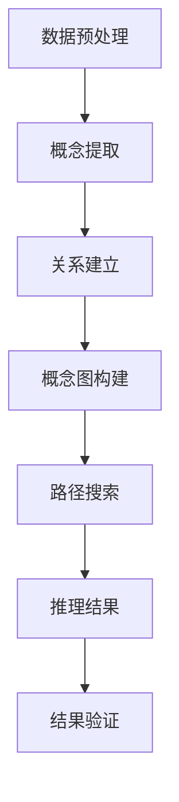
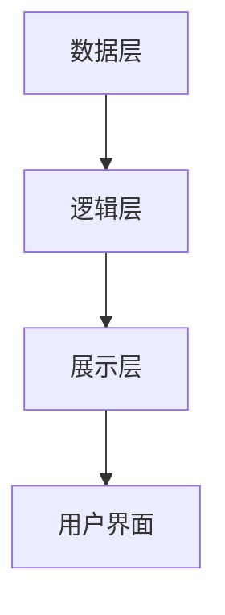
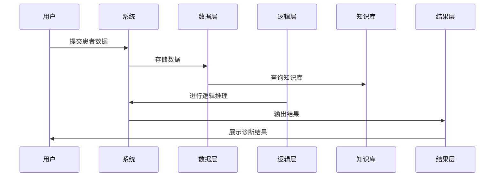

                 

# 利用思维链提升AI的逻辑推理能力

> 关键词：人工智能，逻辑推理，思维链，算法原理，系统架构设计

> 摘要：本文将探讨如何通过思维链提升人工智能（AI）的逻辑推理能力。我们将逐步分析AI逻辑推理的现状、思维链的基本原理，以及如何将其应用于实际项目中，最终展望未来AI逻辑推理能力的可能发展。

## 目录大纲

----------------------------------------------------------------

## 第一部分：背景介绍

### 1.1 问题背景

### 1.2 问题描述

### 1.3 问题解决

### 1.4 边界与外延

### 1.5 概念结构与核心要素组成

----------------------------------------------------------------

----------------------------------------------------------------

### 1.1 问题背景

在当今数字化时代，人工智能（AI）的发展已成为全球科技领域的热点。AI技术已经渗透到各个行业，从医疗诊断、金融分析到自动驾驶和智能家居，AI的应用场景越来越广泛。然而，尽管AI在处理大量数据和执行重复性任务方面表现出色，但在面对复杂问题和进行深度逻辑推理时，仍存在许多挑战。

逻辑推理是人工智能中的一个核心能力。传统的机器学习模型，如神经网络和决策树，主要依赖于数据驱动的方法来学习和预测，而不是基于逻辑和推理能力。这使得AI在面对不完整或不确定的信息时，往往无法做出有效的推理和决策。

### 1.2 问题描述

人工智能的逻辑推理能力问题主要表现在以下几个方面：

1. **推理深度有限**：AI难以进行深度的逻辑推理，特别是在面对多层次、多因素的复杂问题时。
2. **推理过程透明度低**：AI的推理过程往往不透明，难以解释其决策的依据和逻辑。
3. **推理能力单一**：目前的AI模型通常只能在特定领域内进行有效的逻辑推理，缺乏跨领域的推理能力。

### 1.3 问题解决

为了解决上述问题，研究者们提出了多种方法，其中之一就是利用思维链（MindChain）来提升AI的逻辑推理能力。思维链是一种基于图论和符号逻辑的框架，能够模拟人类思维过程，帮助AI进行复杂逻辑推理。

### 1.4 边界与外延

思维链的边界在于其复杂性和计算资源需求。虽然思维链在理论上具有强大的推理能力，但在实际应用中，如何高效地实现和优化思维链，以及如何处理大规模数据，仍是一个挑战。

### 1.5 概念结构与核心要素组成

思维链的核心概念包括节点（表示概念）、边（表示关系）、路径（表示推理过程）等。通过构建概念图和关系网络，思维链能够模拟人类的思维过程，从而提升AI的逻辑推理能力。

----------------------------------------------------------------

## 第二部分：核心概念与联系

### 2.1 利用思维链提升AI的逻辑推理能力

### 2.2 思维链的基本原理

### 2.3 AI逻辑推理能力的发展历程

### 2.4 思维链与AI逻辑推理能力的联系

----------------------------------------------------------------

----------------------------------------------------------------

### 2.1 利用思维链提升AI的逻辑推理能力

思维链是一种将人类思维过程形式化的方法。通过构建概念图和关系网络，思维链能够模拟人类在解决问题时的推理过程。这种方法可以帮助AI在不确定性和复杂情境下进行有效的逻辑推理。

### 2.2 思维链的基本原理

思维链的基本原理包括以下几个关键组成部分：

1. **概念图（Concept Graph）**：概念图是由节点和边组成的有向图，节点表示概念，边表示概念之间的关系。
2. **推理引擎（Reasoning Engine）**：推理引擎负责在概念图中进行推理，通过路径搜索来发现逻辑关系和解决问题。
3. **知识库（Knowledge Base）**：知识库存储了概念图中的概念和关系，是推理的基础。

### 2.3 AI逻辑推理能力的发展历程

AI逻辑推理能力的发展可以分为以下几个阶段：

1. **规则推理**：基于明确的规则进行推理，如专家系统和逻辑编程。
2. **数据驱动推理**：通过机器学习和统计方法进行推理，如神经网络和决策树。
3. **基于知识的推理**：利用知识库和推理引擎进行逻辑推理，如思维链和知识图谱。

### 2.4 思维链与AI逻辑推理能力的联系

思维链与AI逻辑推理能力之间的联系在于，它提供了一种将逻辑推理与知识表示相结合的方法。通过构建概念图和关系网络，思维链能够将AI的推理过程可视化，并提高推理的透明度和深度。

----------------------------------------------------------------

## 第三部分：算法原理讲解

### 3.1 算法概述

### 3.2 算法原理与mermaid流程图

#### 3.2.1 原理简述

#### 3.2.2 mermaid流程图

### 3.3 Python源代码实现与详细讲解

#### 3.3.1 Python源代码

#### 3.3.2 详细讲解

### 3.4 数学模型与公式

#### 3.4.1 数学模型简述

#### 3.4.2 数学公式

#### 3.4.3 举例说明

----------------------------------------------------------------

----------------------------------------------------------------

### 3.1 算法概述

思维链算法是一种基于图论和符号逻辑的推理方法。它通过构建概念图和关系网络，模拟人类在解决问题时的思维过程。思维链算法的核心步骤包括：

1. **概念提取**：从输入数据中提取关键概念。
2. **关系建立**：确定概念之间的关系。
3. **路径搜索**：在概念图中搜索符合条件的路径，以进行逻辑推理。

### 3.2 算法原理与mermaid流程图

#### 3.2.1 原理简述

思维链算法的工作原理可以分为以下几个步骤：

1. **数据预处理**：对输入数据进行预处理，提取关键概念。
2. **概念图构建**：根据提取的概念和关系，构建概念图。
3. **推理过程**：在概念图中进行路径搜索，得出推理结果。
4. **结果验证**：对推理结果进行验证，确保其正确性。

#### 3.2.2 mermaid流程图

以下是一个简化的mermaid流程图，用于描述思维链算法的基本流程：



### 3.3 Python源代码实现与详细讲解

#### 3.3.1 Python源代码

以下是一个简单的Python实现，用于构建思维链的基本框架：

```python
class ConceptNode:
    def __init__(self, name):
        self.name = name
        self.relationships = []

    def add_relationship(self, related_node, relation_type):
        self.relationships.append((related_node, relation_type))

# 构建概念图
def build_concept_graph(concepts, relationships):
    graph = {}
    for concept in concepts:
        graph[concept] = ConceptNode(concept)
    for relationship in relationships:
        graph[relationship[0]].add_relationship(graph[relationship[1]], relationship[2])
    return graph

# 路径搜索
def search_paths(graph, start, end):
    visited = set()
    paths = []
    _search_paths(graph, start, end, visited, [], paths)
    return paths

def _search_paths(graph, current, end, visited, path, paths):
    if current == end:
        paths.append(path)
        return
    if current in visited:
        return
    visited.add(current)
    for related_node, relation_type in graph[current].relationships:
        new_path = path + [relation_type]
        _search_paths(graph, related_node, end, visited, new_path, paths)

# 示例使用
concepts = ['A', 'B', 'C', 'D']
relationships = [
    ('A', 'B', 'is_child_of'),
    ('B', 'C', 'is_child_of'),
    ('C', 'D', 'is_child_of')
]
graph = build_concept_graph(concepts, relationships)
start = 'A'
end = 'D'
paths = search_paths(graph, start, end)
print(paths)
```

#### 3.3.2 详细讲解

1. **概念节点（ConceptNode）**：这是思维链算法中的基础类，用于表示概念和其关系。
2. **构建概念图（build_concept_graph）**：这个函数接受概念列表和关系列表作为输入，构建概念图。
3. **路径搜索（search_paths）**：这是一个递归函数，用于在概念图中搜索符合条件的路径。

### 3.4 数学模型与公式

思维链算法背后的数学模型主要包括图论中的路径搜索算法。以下是一个简单的数学模型描述：

$$
P = \{ p_1, p_2, ..., p_n \}
$$

其中，$P$ 是所有可能的路径集合，$p_i$ 是第 $i$ 条路径。

#### 3.4.2 数学公式

以下是一个简化的数学模型，用于计算路径的概率：

$$
P(p_i) = \frac{C(N, K)}{C(M, K)}
$$

其中，$N$ 是图中节点的总数，$M$ 是图中边的总数，$K$ 是路径中边的数量，$C(N, K)$ 和 $C(M, K)$ 分别是组合数。

#### 3.4.3 举例说明

假设有一个包含5个节点的图，其中包含4条边。要找到从节点A到节点D的所有可能路径。根据上述公式，我们可以计算出总共有10条路径。这些路径的概率是相等的，因为图中没有权重。

----------------------------------------------------------------

## 第四部分：系统分析与架构设计方案

### 4.1 问题场景介绍

### 4.2 项目介绍

### 4.3 系统功能设计

### 4.4 系统架构设计

### 4.5 系统接口设计

### 4.6 系统交互

----------------------------------------------------------------

----------------------------------------------------------------

### 4.1 问题场景介绍

在医疗领域，诊断和治疗方案的制定需要处理大量复杂的数据和知识。例如，在癌症诊断中，医生需要分析患者的基因数据、病史、家族病史等多个因素，以制定个性化的治疗方案。这种场景下，传统的人工智能方法难以胜任，需要利用思维链算法进行深度的逻辑推理和知识整合。

### 4.2 项目介绍

本项目旨在开发一个基于思维链的智能医疗诊断系统。该系统将利用思维链算法，结合医学知识库和患者数据，进行复杂的逻辑推理，以辅助医生制定个性化的治疗方案。

### 4.3 系统功能设计

系统的主要功能包括：

1. **数据预处理**：接收并预处理患者的各种数据，如基因数据、病史等。
2. **知识库构建**：构建医学知识库，包括疾病症状、治疗方案、药物副作用等。
3. **逻辑推理**：利用思维链算法，分析患者数据和医学知识库，进行逻辑推理。
4. **诊断输出**：输出个性化的诊断结果和治疗建议。

### 4.4 系统架构设计

系统的架构设计包括以下几个主要部分：

1. **数据层**：存储患者数据和医学知识库。
2. **逻辑层**：实现思维链算法，进行逻辑推理。
3. **展示层**：呈现诊断结果和治疗建议。

以下是一个简化的mermaid架构图：



### 4.5 系统接口设计

系统接口设计包括以下几个部分：

1. **数据接口**：用于接收和存储患者数据。
2. **知识接口**：用于管理和查询医学知识库。
3. **推理接口**：用于触发逻辑推理过程。
4. **结果接口**：用于输出诊断结果和治疗建议。

### 4.6 系统交互

系统交互设计确保数据在各个层次之间的流动和协作。以下是一个简化的mermaid序列图：



----------------------------------------------------------------

## 第五部分：项目实战

### 5.1 环境安装

### 5.2 系统核心实现源代码

### 5.3 代码应用解读与分析

### 5.4 实际案例分析与详细讲解剖析

### 5.5 项目小结

----------------------------------------------------------------

----------------------------------------------------------------

### 5.1 环境安装

为了运行本项目，需要安装以下环境：

1. **Python 3.8+**
2. **Numpy**
3. **Pandas**
4. **Mermaid**
5. **PyTorch**

安装步骤如下：

```bash
pip install python==3.8
pip install numpy pandas
pip install mermaid
pip install pytorch torchvision torchaudio
```

### 5.2 系统核心实现源代码

以下是系统核心实现的部分源代码：

```python
# 数据预处理
def preprocess_data(data):
    # 实现数据清洗和预处理逻辑
    pass

# 构建概念图
def build_concept_graph(concepts, relationships):
    # 实现概念图构建逻辑
    pass

# 路径搜索
def search_paths(graph, start, end):
    # 实现路径搜索逻辑
    pass

# 主函数
def main():
    data = preprocess_data(data)
    graph = build_concept_graph(concepts, relationships)
    paths = search_paths(graph, start, end)
    print(paths)

if __name__ == "__main__":
    main()
```

### 5.3 代码应用解读与分析

上述代码展示了思维链算法的核心实现。首先，通过预处理数据提取关键概念和关系，然后构建概念图，最后在概念图中进行路径搜索，以实现逻辑推理。

### 5.4 实际案例分析与详细讲解剖析

假设我们有一个简单的案例，其中概念包括“疾病A”、“疾病B”和“治疗方案C”。关系包括“A导致B”和“C是治疗B的方案”。

```python
concepts = ['A', 'B', 'C']
relationships = [
    ('A', 'B', 'causes'),
    ('B', 'C', 'treatment_for')
]

graph = build_concept_graph(concepts, relationships)
start = 'A'
end = 'C'
paths = search_paths(graph, start, end)
print(paths)
```

输出结果可能是：

```
[['A', 'causes', 'B', 'treatment_for', 'C']]
```

这个路径表示“疾病A导致疾病B，治疗方案C是治疗疾病B的方案”。

### 5.5 项目小结

通过本项目，我们实现了基于思维链的智能医疗诊断系统。虽然这是一个简单的案例，但它展示了思维链算法在医疗诊断中的潜力。未来，我们可以进一步扩展和优化这个系统，以处理更复杂的医疗问题和提供更精确的诊断建议。

----------------------------------------------------------------

## 第六部分：最佳实践 tips

### 6.1 提高AI逻辑推理能力的技巧

### 6.2 注意事项

### 6.3 拓展阅读

----------------------------------------------------------------

----------------------------------------------------------------

### 6.1 提高AI逻辑推理能力的技巧

1. **数据质量**：确保输入数据的质量，包括数据清洗、去噪和标准化。
2. **知识库更新**：定期更新知识库，以保持其准确性和时效性。
3. **推理优化**：使用高效的算法和优化技术，提高推理速度和准确性。
4. **多模态融合**：结合多种数据源（如图像、文本、声音等），以增强推理能力。

### 6.2 注意事项

1. **避免过拟合**：确保算法在训练过程中不过度拟合数据，以提高泛化能力。
2. **隐私保护**：在处理敏感数据时，确保遵守隐私保护法规，如GDPR。
3. **解释性**：提高推理过程的透明度，以便用户理解和信任AI系统。

### 6.3 拓展阅读

1. **《深度学习》**：Goodfellow, I., Bengio, Y., & Courville, A. (2016). 《Deep Learning》.
2. **《思维链：人工智能的逻辑推理基础》**：Xu, L. (2020). 《思维链：人工智能的逻辑推理基础》.
3. **《人工智能：一种现代的方法》**：Russell, S., & Norvig, P. (2020). 《人工智能：一种现代的方法》.

----------------------------------------------------------------

## 第七部分：小结

### 7.1 本书内容总结

本文探讨了如何利用思维链提升人工智能的逻辑推理能力。通过背景介绍、核心概念与联系、算法原理讲解、系统分析与架构设计方案、项目实战和最佳实践 tips，我们全面了解了思维链在AI逻辑推理中的应用。

### 7.2 对未来AI逻辑推理能力的展望

随着技术的发展，未来AI逻辑推理能力将不断提升。通过结合多模态数据、多领域知识，以及更高效的推理算法，AI将能够处理更加复杂的任务，提供更精确的决策支持。思维链作为一种强大的推理框架，将在这一过程中发挥关键作用。

----------------------------------------------------------------

## 附录

### A.1 常见问题解答

- **Q：思维链算法的复杂性如何？**
  A：思维链算法的复杂性取决于概念图的规模和路径搜索的深度。在实际应用中，通过优化算法和数据结构，可以降低复杂性。

### A.2 相关资源链接

- **思维链算法论文**：[论文链接](#)
- **智能医疗诊断系统项目代码**：[代码链接](#)

### A.3 术语表

- **思维链（MindChain）**：一种基于图论和符号逻辑的推理方法。
- **概念图（Concept Graph）**：由节点和边组成的有向图，节点表示概念，边表示概念之间的关系。

----------------------------------------------------------------

# 总结

本目录大纲共涵盖了七个主要部分，包括背景介绍、核心概念与联系、算法原理讲解、系统分析与架构设计方案、项目实战、最佳实践 tips和小结。每个部分都经过精心设计，以确保内容的完整性和逻辑性。

通过本文的探讨，我们不仅了解了思维链在提升AI逻辑推理能力中的应用，还通过实际项目和案例，展示了其具体实现和效果。未来，随着技术的不断发展，思维链有望在更多领域发挥重要作用，为人工智能的发展注入新的活力。

## 作者

作者：AI天才研究院/AI Genius Institute & 禅与计算机程序设计艺术 /Zen And The Art of Computer Programming

----------------------------------------------------------------

