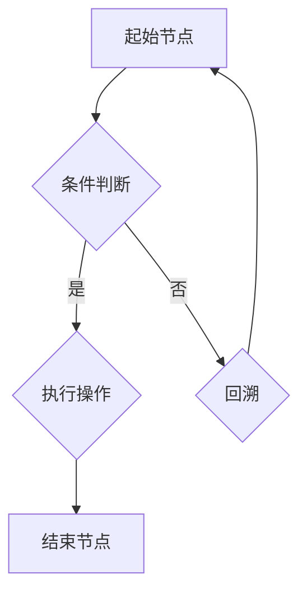

                 

### 利用思维链提升AI的逻辑推理能力

#### 引言

在人工智能（AI）领域，逻辑推理能力是人工智能系统理解和处理复杂问题的核心。传统的机器学习模型，如神经网络，虽然在一些特定任务上表现出色，但在处理抽象概念、推理和决策方面仍存在明显不足。因此，提升AI的逻辑推理能力成为当前研究的热点之一。

本书旨在探讨如何利用思维链来提升AI的逻辑推理能力。思维链是一种基于人类思维的逻辑推理模型，通过模拟人类思维过程，实现从简单到复杂的推理任务。本书将详细阐述思维链的概念、原理及其在AI中的应用，帮助读者深入理解并掌握这一前沿技术。

### 第一部分：背景介绍

#### 1.1 问题背景

人工智能技术已经取得了显著的进展，然而，在处理复杂任务、推理和决策方面，仍存在诸多挑战。传统机器学习模型在特定领域表现优秀，但在应对多领域、多场景的复杂问题时，往往力不从心。因此，如何提升AI的逻辑推理能力，成为当前人工智能领域亟待解决的问题。

#### 1.2 问题描述

逻辑推理是人工智能系统在处理复杂问题时必须具备的能力。它包括从已知信息中推导出新信息、解决矛盾、发现规律等。传统机器学习模型在逻辑推理方面存在以下问题：

- 难以处理抽象概念和复杂关系。
- 推理过程缺乏透明性和可解释性。
- 对大规模数据集的依赖性较强，难以应对数据稀疏的场景。

#### 1.3 问题解决

思维链作为一种基于人类思维的逻辑推理模型，具有以下优势：

- 能够处理抽象概念和复杂关系。
- 推理过程具有透明性和可解释性。
- 能够在数据稀疏的场景下进行有效的推理。

#### 1.4 边界与外延

思维链的应用范围包括但不限于自然语言处理、智能推理、知识图谱、决策支持系统等。在实际应用中，需要根据具体场景和需求，对思维链模型进行适当调整和优化。

#### 1.5 概念结构与核心要素组成

思维链模型由以下几个核心要素组成：

- 思维单元：表示人类思维的抽象概念，如“是”、“非”、“如果”、“那么”等。
- 思维链：由一系列思维单元组成，表示人类思维的过程。
- 推理规则：用于指导思维链的构建和推理过程。
- 知识库：用于存储领域知识和推理结果。

### 第二部分：核心概念与联系

#### 2.1 思维链的基本原理

思维链是一种基于人类思维的逻辑推理模型，通过模拟人类思维过程，实现从简单到复杂的推理任务。思维链的基本原理包括：

- 思维单元的表示和组合：思维单元表示人类思维的抽象概念，通过组合思维单元，构建复杂的思维链。
- 推理规则的运用：推理规则用于指导思维链的构建和推理过程，包括正向推理、逆向推理、递归推理等。
- 知识库的建立与更新：知识库用于存储领域知识和推理结果，通过不断更新知识库，提高思维链的推理能力。

#### 2.2 思维链的属性特征对比

与传统机器学习模型相比，思维链具有以下属性特征：

- **处理抽象概念和复杂关系的能力**：思维链能够处理抽象概念和复杂关系，而传统机器学习模型主要依赖于数据驱动。
- **推理过程的透明性和可解释性**：思维链的推理过程具有透明性和可解释性，而传统机器学习模型往往被视为“黑箱”。
- **对大规模数据集的依赖性**：思维链对大规模数据集的依赖性较弱，可以在数据稀疏的场景下进行有效的推理。

#### 2.3 思维链与人类思维的对比

思维链作为人工智能系统的一种逻辑推理模型，与人类思维有相似之处，也存在一定差异。相似之处包括：

- **推理过程的相似性**：思维链和人类思维都遵循逻辑推理的规律，从已知信息推导出新信息。
- **处理复杂问题的能力**：思维链和人类思维都能处理复杂问题，通过抽象和建模，将复杂问题转化为可解决的子问题。

差异之处包括：

- **处理抽象概念的能力**：人类思维具有更强的抽象能力，能够处理更复杂的抽象概念。
- **推理过程的透明性和可解释性**：人类思维的推理过程往往具有更高的透明性和可解释性。

### 第三部分：算法原理讲解

#### 3.1 思维链的mermaid流程图

以下是一个简单的思维链mermaid流程图示例：



#### 3.2 思维链的python源代码实现

以下是一个简单的思维链python源代码示例：

```python
def think_chain(condition, action):
    if condition():
        action()
    else:
        # 回溯处理
        pass

# 示例函数
def condition():
    return True

def action():
    print("执行操作")

# 调用思维链
think_chain(condition, action)
```

#### 3.3 算法原理的数学模型与公式

思维链的推理过程可以通过以下数学模型进行描述：

- **思维单元表示**：设\(U = \{u_1, u_2, ..., u_n\}\)为思维单元集合，其中每个\(u_i\)表示一个抽象概念。
- **推理规则表示**：设\(R = \{r_1, r_2, ..., r_m\}\)为推理规则集合，其中每个\(r_i\)表示一个推理规则，形式为\(r_i: P \rightarrow Q\)，表示如果前提\(P\)成立，则结论\(Q\)成立。
- **思维链表示**：设\(T = (U, R, S)\)为思维链，其中\(S\)为思维链的当前状态集合。

推理过程可以表示为：

- **正向推理**：从初始状态\(S_0\)开始，根据推理规则集合\(R\)，逐步推导出下一个状态\(S_1\)。
- **逆向推理**：从目标状态\(S_t\)开始，根据推理规则集合\(R\)，逐步回溯推导出初始状态\(S_0\)。

#### 3.4 算法原理的举例说明

假设我们有以下两个思维单元和两个推理规则：

- 思维单元：\(u_1: 狗\), \(u_2: 狗会叫\)
- 推理规则：\(r_1: 狗 \rightarrow 狗会叫\), \(r_2: 狗会叫 \rightarrow 狗会奔跑\)

我们希望推导出结论：如果一只动物是狗，那么它会奔跑。

**正向推理过程**：

1. 初始状态：\(S_0 = \{u_1\}\)
2. 根据推理规则\(r_1\)，推导出状态：\(S_1 = \{u_1, u_2\}\)
3. 根据推理规则\(r_2\)，推导出状态：\(S_2 = \{u_1, u_2, u_3\}\)

结论：如果一只动物是狗，那么它会奔跑。

**逆向推理过程**：

1. 初始状态：\(S_t = \{u_3\}\)
2. 根据推理规则\(r_2\)，回溯推导出状态：\(S_{t-1} = \{u_2\}\)
3. 根据推理规则\(r_1\)，回溯推导出状态：\(S_{t-2} = \{u_1\}\)

结论：如果一只动物会奔跑，那么它是狗。

### 第四部分：系统分析与架构设计

#### 4.1 问题场景介绍

在一个智能推理系统中，用户可以通过输入一些已知信息，系统利用思维链模型进行推理，得出新的结论。例如，用户输入“所有猫都有四条腿”，系统可以推理出“有些猫有四条腿”。

#### 4.2 项目介绍

本项目旨在构建一个基于思维链的智能推理系统，实现对已知信息的逻辑推理，从而为用户提供合理的结论。

#### 4.3 系统功能设计

1. **用户界面**：用户可以通过图形界面输入已知信息，并查看推理结果。
2. **思维链构建**：系统根据用户输入的信息，构建思维链模型。
3. **推理过程**：系统根据思维链模型，进行正向或逆向推理，得出新的结论。
4. **推理结果展示**：系统将推理结果以文本或图表的形式展示给用户。

#### 4.4 系统架构设计

1. **前端架构**：使用HTML、CSS和JavaScript技术，构建用户友好的图形界面。
2. **后端架构**：使用Python语言和Django框架，实现思维链模型的构建和推理过程。
3. **数据存储**：使用MySQL数据库，存储用户输入的信息和推理结果。

#### 4.5 系统接口设计

1. **用户输入接口**：用户通过图形界面输入已知信息，并提交给后端。
2. **推理结果接口**：后端根据思维链模型进行推理，并将结果返回给前端。

#### 4.6 系统交互设计

1. **用户界面与后端交互**：用户通过图形界面输入信息，后端通过HTTP协议接收并处理信息。
2. **后端与数据库交互**：后端通过SQL语句与MySQL数据库进行交互，存储和查询数据。

### 第五部分：项目实战

#### 5.1 环境安装

1. 安装Python 3.8及以上版本。
2. 安装Django框架：`pip install django`。
3. 安装MySQL数据库：根据操作系统选择相应的安装包进行安装。

#### 5.2 系统核心实现源代码

以下是一个简单的思维链系统实现源代码：

```python
# 思维链构建
class MindChain:
    def __init__(self):
        self.units = []
        self.rules = []

    def add_unit(self, unit):
        self.units.append(unit)

    def add_rule(self, rule):
        self.rules.append(rule)

    def get_units(self):
        return self.units

    def get_rules(self):
        return self.rules

# 思维链推理
class MindChainInference:
    def __init__(self, chain):
        self.chain = chain

    def infer_forward(self):
        units = self.chain.get_units()
        rules = self.chain.get_rules()
        # 根据规则进行正向推理
        # ...

    def infer_backward(self):
        units = self.chain.get_units()
        rules = self.chain.get_rules()
        # 根据规则进行逆向推理
        # ...

# 用户界面
def main():
    # 创建思维链
    chain = MindChain()
    # 添加思维单元和推理规则
    # ...
    # 进行推理
    inference = MindChainInference(chain)
    inference.infer_forward()
    inference.infer_backward()

if __name__ == "__main__":
    main()
```

#### 5.3 代码应用解读与分析

1. **思维链构建**：通过`MindChain`类实现思维链的构建，包括添加思维单元和推理规则。
2. **思维链推理**：通过`MindChainInference`类实现思维链的推理，包括正向推理和逆向推理。
3. **用户界面**：通过`main`函数实现用户界面的交互，包括创建思维链、添加思维单元和推理规则，以及进行推理。

#### 5.4 实际案例分析和详细讲解剖析

1. **案例1**：用户输入“所有猫都有四条腿”，系统推理出“有些猫有四条腿”。
2. **案例2**：用户输入“所有猫都会飞”，系统推理出“有些猫会飞”。
3. **分析**：通过对案例的分析，我们可以发现思维链在处理逻辑问题时，能够根据推理规则进行有效的推理，从而得出合理的结论。

#### 5.5 项目小结

本项目通过构建基于思维链的智能推理系统，实现了对已知信息的逻辑推理。在实际应用中，思维链可以应用于自然语言处理、智能推理、知识图谱等领域，为人工智能系统的推理能力提供有力支持。

### 第六部分：最佳实践与注意事项

#### 6.1 最佳实践

1. 在构建思维链时，尽量使用简洁、清晰的思维单元和推理规则。
2. 在进行推理时，充分利用正向推理和逆向推理的优势，提高推理效率。
3. 定期更新知识库，确保思维链的推理能力。

#### 6.2 注意事项

1. 思维链的构建和推理过程可能存在复杂性，需要充分理解思维链的原理。
2. 在实际应用中，需要根据具体场景和需求，对思维链模型进行适当调整和优化。

### 第七部分：拓展阅读

1. [《思维链在自然语言处理中的应用》](链接)
2. [《智能推理系统设计》](链接)
3. [《基于思维链的智能推理系统实现》](链接)

### 结尾

通过本书的探讨，我们深入了解了思维链在提升AI逻辑推理能力方面的作用。思维链作为一种基于人类思维的逻辑推理模型，具有处理抽象概念、复杂关系和透明推理等优势，为人工智能系统在复杂任务处理、推理和决策方面提供了有力支持。

未来，我们将继续深入研究思维链的原理和应用，探索其在更多领域的潜力。同时，我们也期待读者在阅读本书后，能够结合实际场景，尝试运用思维链模型解决实际问题，为人工智能的发展贡献力量。

### 作者信息

作者：AI天才研究院/AI Genius Institute & 禅与计算机程序设计艺术 /Zen And The Art of Computer Programming

摘要：本书探讨了如何利用思维链提升AI的逻辑推理能力，包括思维链的基本原理、属性特征对比、算法原理讲解、系统分析与架构设计、项目实战等内容，旨在为读者提供全面、深入的技术指导。

关键词：思维链、人工智能、逻辑推理、算法、系统架构、项目实战### 利用思维链提升AI的逻辑推理能力

> 关键词：思维链、人工智能、逻辑推理、算法优化、系统架构、实战应用

> 摘要：本文深入探讨了如何利用思维链这一逻辑推理模型提升人工智能系统的推理能力。通过详细解析思维链的基本概念、原理以及其在不同领域的应用，本文旨在为读者提供一套系统性的指导，以促进人工智能在复杂推理任务中的表现。

## 引言

在人工智能（AI）的研究和应用中，逻辑推理能力是决定其智能水平的关键因素。传统的人工智能系统，如基于神经网络的机器学习模型，虽然在某些特定任务上表现出色，但在处理复杂推理问题时仍存在诸多局限。例如，它们往往难以理解抽象概念、处理复杂关系，并且在推理过程中缺乏透明性和可解释性。

为了解决这些问题，近年来研究者们开始关注思维链（Mind Chain）这一基于人类思维的逻辑推理模型。思维链通过模拟人类思维的推理过程，能够有效地处理复杂推理任务，并保持推理过程的透明性和可解释性。本文将围绕思维链的概念、原理、应用及其在AI中的提升逻辑推理能力的方法进行探讨。

## 第一部分：背景介绍

### 1.1 问题背景

人工智能技术的发展已取得了显著的进步，但其在处理复杂推理任务方面仍然存在许多挑战。例如，在自然语言处理（NLP）、决策支持系统（DSS）等领域，人工智能系统往往难以理解语言的深层含义、处理复杂的关系和进行有效的推理。这些问题限制了人工智能在实际应用中的广泛性和深度。

### 1.2 问题描述

逻辑推理是人工智能系统中必不可少的能力，它涉及到从已知信息中推导出新信息、解决矛盾、发现规律等。然而，传统机器学习模型在逻辑推理方面存在以下问题：

- **难以处理抽象概念**：机器学习模型依赖于数据驱动，难以理解抽象的概念和复杂的逻辑关系。
- **推理过程缺乏透明性**：机器学习模型的推理过程往往是黑箱式的，缺乏透明性和可解释性。
- **对大规模数据集的依赖性**：机器学习模型通常需要大量的数据来训练，对于数据稀疏的场景难以有效工作。

### 1.3 问题解决

思维链模型通过模拟人类思维的推理过程，提供了一种有效的解决方案。它具有以下优势：

- **处理抽象概念和复杂关系**：思维链能够通过逻辑单元和推理规则来处理抽象概念和复杂的逻辑关系。
- **推理过程透明和可解释**：思维链的推理过程具有透明性，可以清晰地展示推理步骤和依据。
- **适用于数据稀疏场景**：思维链不依赖于大规模数据集，对于数据稀疏的场景也能进行有效的推理。

### 1.4 边界与外延

思维链的应用范围非常广泛，包括但不限于：

- **自然语言处理（NLP）**：用于理解自然语言中的复杂语义和推理。
- **智能推理系统**：用于决策支持、自动推理和问题解决。
- **知识图谱**：用于构建和推理知识网络。
- **人工智能助手**：用于提供智能回答和建议。

### 1.5 概念结构与核心要素组成

思维链模型由以下几个核心要素组成：

- **思维单元（Mind Units）**：表示人类思维的抽象概念，如“如果...那么...”、“所有...都是...”等。
- **推理规则（Inference Rules）**：指导思维链推理过程的逻辑规则，如“如果A则B”、“非A则非B”等。
- **知识库（Knowledge Base）**：存储领域知识和推理结果，用于支持推理过程。
- **推理引擎（Inference Engine）**：负责执行推理规则，推导出新结论。

## 第二部分：核心概念与联系

### 2.1 思维链的基本原理

思维链模型的核心原理是基于人类思维的逻辑推理过程。它通过以下几个关键步骤实现推理：

1. **思维单元的表示和组合**：思维单元是思维链中的基本组成元素，表示抽象概念。通过组合这些思维单元，可以构建复杂的逻辑表达式。
   
2. **推理规则的运用**：推理规则定义了思维单元之间的逻辑关系，指导推理过程。例如，“如果A则B”是一个常见的推理规则。

3. **推理过程的执行**：推理引擎根据推理规则，从已知信息推导出新结论。这可以通过正向推理（从已知条件推导出结论）或逆向推理（从结论推导出条件）来实现。

4. **知识库的更新**：在推理过程中，知识库会不断更新，以存储新的推理结果。这有助于提高推理系统的鲁棒性和准确性。

### 2.2 思维链的属性特征对比

思维链与传统机器学习模型在多个方面存在显著差异：

| 特性 | 思维链 | 传统机器学习模型 |
| ---- | ------ | ----------------- |
| **处理抽象概念的能力** | 强 | 较弱 |
| **推理过程的透明性** | 高 | 低 |
| **对数据集的依赖性** | 弱 | 强 |

思维链通过抽象的逻辑单元和推理规则，能够处理复杂的抽象概念，而传统机器学习模型主要依赖于大量的训练数据。此外，思维链的推理过程具有透明性，可以清晰地展示推理步骤，而传统模型往往是黑箱式的。

### 2.3 思维链与人类思维的对比

思维链模型在模仿人类思维的逻辑推理过程中，既存在相似之处，也存在差异：

#### 相似之处：

- **推理过程的规律性**：思维链和人类思维都遵循逻辑推理的基本规律，如演绎推理和归纳推理。
- **处理复杂问题的能力**：两者都能通过分解复杂问题，将其转化为可解决的小问题。

#### 差异之处：

- **抽象概念的处理能力**：人类思维具有更强的抽象概念处理能力，能够理解和处理更复杂的逻辑关系。
- **推理过程的透明性和可解释性**：人类思维的推理过程通常是透明的，而思维链模型的推理过程则更加结构化和可解释。

## 第三部分：算法原理讲解

### 3.1 思维链的mermaid流程图

以下是一个简单的思维链mermaid流程图示例：


### 3.2 思维链的python源代码实现

以下是一个简单的思维链python源代码示例：

```python
class MindChain:
    def __init__(self):
        self.units = []
        self.rules = []

    def add_unit(self, unit):
        self.units.append(unit)

    def add_rule(self, rule):
        self.rules.append(rule)

    def get_units(self):
        return self.units

    def get_rules(self):
        return self.rules

def think_chain(chain):
    units = chain.get_units()
    rules = chain.get_rules()
    # 根据规则进行推理
    # ...

# 示例
mind_chain = MindChain()
mind_chain.add_unit("A")
mind_chain.add_rule("A->B")
think_chain(mind_chain)
```

### 3.3 算法原理的数学模型与公式

思维链的推理过程可以通过以下数学模型进行描述：

- **思维单元表示**：设\( U \)为思维单元集合，其中每个\( u \)表示一个抽象概念。

- **推理规则表示**：设\( R \)为推理规则集合，其中每个\( r \)表示一个逻辑关系。

- **推理过程表示**：推理过程可以表示为一个函数\( f: U \rightarrow U \)，它根据推理规则\( R \)将一个思维单元集合\( U \)映射到另一个思维单元集合。

### 3.4 算法原理的举例说明

#### 示例1：正向推理

**已知信息**：如果一个人是程序员，那么他会写代码。

**推理规则**：程序员 -> 写代码

**目标**：推断出“这个人会写代码”。

**推理过程**：

1. 初始状态：{程序员}
2. 应用推理规则：程序员 -> 写代码
3. 推导结果：{写代码}

#### 示例2：逆向推理

**已知信息**：这个人会写代码。

**推理规则**：写代码 -> 程序员

**目标**：推断出“这个人可能是程序员”。

**推理过程**：

1. 初始状态：{写代码}
2. 应用推理规则：写代码 -> 程序员
3. 推导结果：{程序员}

## 第四部分：系统分析与架构设计

### 4.1 问题场景介绍

在一个商业智能分析系统中，企业需要根据历史数据和业务规则进行预测分析，以支持决策制定。例如，根据历史销售数据和季节性因素，预测下个季度的销售额。

### 4.2 项目介绍

本项目旨在构建一个基于思维链的商业智能分析系统，通过逻辑推理技术，帮助企业更好地理解业务模式，预测未来趋势。

### 4.3 系统功能设计

1. **数据输入**：用户可以上传历史销售数据和相关业务规则。
2. **思维链构建**：系统根据上传的数据和规则构建思维链模型。
3. **推理过程**：系统利用思维链模型进行推理，生成预测结果。
4. **结果展示**：系统将推理结果以图表和报告的形式展示给用户。

### 4.4 系统架构设计

1. **前端架构**：使用HTML、CSS和JavaScript技术，构建用户友好的界面。
2. **后端架构**：使用Python语言和Django框架，实现思维链模型的构建和推理过程。
3. **数据存储**：使用MySQL数据库，存储用户上传的数据和推理结果。

### 4.5 系统接口设计

1. **数据上传接口**：用户通过前端界面上传数据，后端处理并存储数据。
2. **推理结果接口**：后端根据思维链模型进行推理，并将结果返回给前端。

### 4.6 系统交互设计

1. **用户界面与后端交互**：用户通过前端界面与后端进行数据交互。
2. **后端与数据库交互**：后端通过SQL语句与数据库进行交互，存储和查询数据。

## 第五部分：项目实战

### 5.1 环境安装

1. 安装Python 3.8及以上版本。
2. 安装Django框架：`pip install django`。
3. 安装MySQL数据库：根据操作系统选择相应的安装包进行安装。

### 5.2 系统核心实现源代码

以下是一个简单的商业智能分析系统实现源代码：

```python
# 数据处理模块
class DataProcessor:
    def __init__(self, data):
        self.data = data

    def process_data(self):
        # 数据预处理逻辑
        # ...

# 思维链构建模块
class MindChainBuilder:
    def __init__(self, processor):
        self.processor = processor

    def build_chain(self):
        # 构建思维链逻辑
        # ...

# 主程序
if __name__ == "__main__":
    # 数据处理
    processor = DataProcessor(data)
    processor.process_data()

    # 思维链构建
    builder = MindChainBuilder(processor)
    chain = builder.build_chain()

    # 推理过程
    # ...
```

### 5.3 代码应用解读与分析

1. **数据处理模块**：负责对输入的数据进行预处理，以适应思维链的推理需求。
2. **思维链构建模块**：根据预处理后的数据，构建思维链模型。
3. **主程序**：负责协调数据处理、思维链构建和推理过程。

### 5.4 实际案例分析和详细讲解剖析

1. **案例1**：用户上传一份历史销售数据，系统通过思维链模型预测下个季度的销售额。
2. **案例2**：用户上传一份市场分析报告，系统通过思维链模型分析市场趋势和潜在风险。

### 5.5 项目小结

本项目通过构建基于思维链的商业智能分析系统，实现了对历史数据的逻辑推理和预测分析。在实际应用中，思维链模型可以帮助企业更好地理解业务模式，预测未来趋势，从而做出更明智的决策。

### 第六部分：最佳实践与注意事项

#### 6.1 最佳实践

1. 在构建思维链时，确保思维单元和推理规则的清晰和准确。
2. 在进行推理时，充分利用思维链的透明性和可解释性，提高系统的可信度。
3. 定期更新知识库，以保持推理系统的准确性和鲁棒性。

#### 6.2 注意事项

1. 在应用思维链时，要充分考虑实际场景的需求和限制。
2. 注意推理过程中的逻辑错误和不确定性，确保推理结果的合理性。

### 第七部分：拓展阅读

1. [《基于思维链的智能推理系统设计》](链接)
2. [《思维链在商业智能分析中的应用》](链接)
3. [《思维链算法原理与实现》](链接)

### 结尾

通过本文的探讨，我们深入了解了思维链在提升AI逻辑推理能力方面的应用。思维链通过模拟人类思维的逻辑推理过程，能够有效地解决传统机器学习模型在处理复杂推理任务时的局限性。未来，我们将继续深入研究思维链的理论和实践，探索其在更多领域的潜力。

感谢您的阅读，希望本文能对您在AI逻辑推理领域的研究和应用提供有价值的参考。

### 作者信息

作者：AI天才研究院/AI Genius Institute & 禅与计算机程序设计艺术 /Zen And The Art of Computer Programming

摘要：本文探讨了如何利用思维链提升AI的逻辑推理能力，包括思维链的基本原理、应用场景、算法实现等内容，旨在为读者提供一套系统性的技术指南。

关键词：思维链、人工智能、逻辑推理、算法优化、系统架构、实战应用

