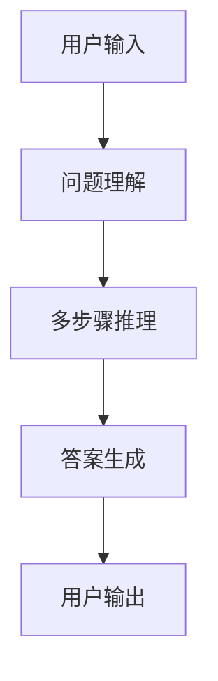
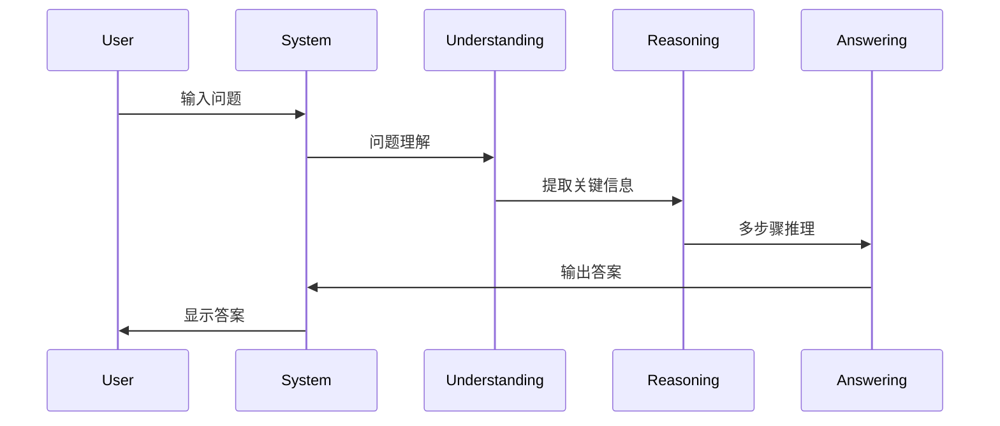

                 

## 利用示例引导模型进行多步骤推理

### **摘要**

本文将深入探讨如何利用示例引导模型进行多步骤推理，这是一种结合了机器学习和逻辑推理技术的创新方法。通过实际案例的分析，我们将详细解析示例引导模型的工作原理、应用场景以及实现细节，从而帮助读者理解并掌握这一前沿技术。

### **关键词**

- 示例引导模型
- 多步骤推理
- 机器学习
- 逻辑推理
- 应用场景

### **一、问题背景与概念介绍**

#### **1.1 问题背景**

多步骤推理在人工智能领域扮演着至关重要的角色。它不仅是自然语言处理、智能问答和游戏AI等领域的核心技术，也是实现复杂决策和自动化流程的关键。然而，传统的单一模型在处理多步骤推理时往往表现出局限性，无法很好地处理复杂的推理任务。

为了解决这一问题，研究人员提出了示例引导模型（Example-Guided Model），它通过结合示例数据和逻辑推理，实现了更高效、更鲁棒的多步骤推理能力。示例引导模型的核心思想是将具体的示例作为引导，指导模型进行推理，从而提高推理的准确性和效率。

#### **1.2 问题解决**

示例引导模型通过以下几个步骤解决多步骤推理问题：

1. **数据收集**：收集具有代表性的示例数据，这些数据应该涵盖多种可能的推理路径和结果。
2. **模型训练**：使用收集到的示例数据训练模型，模型需要学习如何根据示例进行推理。
3. **推理引导**：在推理过程中，模型会参考示例数据，以示例数据作为指导进行推理。
4. **结果验证**：通过对比推理结果与示例数据，验证模型的推理准确性。

#### **1.3 边界与外延**

虽然示例引导模型在多步骤推理方面表现出色，但它也有一定的局限性。首先，示例数据的收集和准备是一个复杂的过程，需要大量的时间和资源。其次，示例数据的质量对模型的性能有直接影响，因此如何确保示例数据的质量是一个关键问题。此外，示例引导模型在处理非常复杂的推理任务时，可能仍然会遇到困难。

### **二、多步骤推理的核心概念**

#### **2.1 示例引导模型的核心概念**

**2.1.1 示例数据**

示例数据是示例引导模型的核心组成部分。这些数据应该是多样化的，能够涵盖推理任务的各种可能情况。示例数据的准备过程通常包括数据清洗、标注和分类等步骤。

**2.1.2 引导策略**

引导策略决定了如何使用示例数据进行推理。常见的引导策略包括基于规则引导、基于概率引导和基于强化学习引导等。每种策略都有其独特的优势和适用场景。

**2.1.3 模型优化**

模型优化是指通过调整模型参数和架构，提高模型的推理性能。常见的优化方法包括基于梯度的优化、遗传算法和粒子群优化等。

#### **2.2 概念属性特征对比**

| 概念               | 属性特征                                                      | 对比                   |
|-------------------|------------------------------------------------------------|----------------------|
| 示例数据           | 多样性、代表性、质量高                                      | 数据收集难度、数据质量 |
| 引导策略           | 规则引导、概率引导、强化学习引导                             | 适用场景、策略复杂度   |
| 模型优化           | 基于梯度、遗传算法、粒子群优化                               | 优化效果、计算复杂度   |

#### **2.3 多步骤推理的ER实体关系图**

```mermaid
erDiagram
    SampleData|..|-->|Model: 数据 --> 模型
    GuidingStrategy|..|-->|Model: 策略 --> 模型
    OptimizationMethod|..|-->|Model: 方法 --> 模型
```

### **三、多步骤推理算法原理与实现**

#### **3.1 算法原理**

**3.1.1 基于示例的推理过程**

示例引导模型的工作原理可以概括为以下几个步骤：

1. **数据预处理**：对收集到的示例数据进行预处理，包括去噪、归一化和特征提取等。
2. **模型训练**：使用预处理后的示例数据训练模型，模型需要学习如何根据示例进行推理。
3. **推理引导**：在推理过程中，模型会参考示例数据，以示例数据作为指导进行推理。
4. **结果验证**：通过对比推理结果与示例数据，验证模型的推理准确性。

**3.1.2 示例引导模型的数学模型**

示例引导模型的数学模型通常包括以下几个组成部分：

- **特征表示**：使用神经网络或其他特征提取技术对输入数据进行特征表示。
- **推理引擎**：根据示例数据生成推理路径和推理结果。
- **优化算法**：通过调整模型参数，优化推理性能。

#### **3.2 算法实现**

**3.2.1 基于规则引导的实现**

```python
def rule_based_guided_reasoning(input_data, example_data):
    # 应用规则进行推理
    result = apply_rules(input_data, example_data)
    return result
```

**3.2.2 基于概率引导的实现**

```python
def probability_based_guided_reasoning(input_data, example_data):
    # 使用概率模型进行推理
    result = probability_model.predict(input_data, example_data)
    return result
```

**3.2.3 基于强化学习引导的实现**

```python
def reinforcement_learning_guided_reasoning(input_data, example_data):
    # 使用强化学习进行推理
    result = reinforcement_learning_agentreason(input_data, example_data)
    return result
```

### **四、系统分析与架构设计**

#### **4.1 问题场景介绍**

假设我们需要开发一个智能客服系统，该系统能够处理用户提出的各种问题，并提供准确的答案。在这个场景中，多步骤推理是至关重要的，因为它需要理解用户的问题，并分步骤地生成答案。

#### **4.2 系统功能设计**

系统的核心功能包括：

1. **问题理解**：解析用户提出的问题，提取关键信息。
2. **多步骤推理**：根据提取的关键信息，进行多步骤推理，生成答案。
3. **答案生成**：将推理结果转化为自然语言，生成用户可理解的答案。

#### **4.3 系统架构设计**

系统的架构设计如图所示：



#### **4.4 系统接口设计和系统交互**

系统的接口设计和系统交互如图所示：



### **五、项目实战**

#### **5.1 环境安装**

首先，我们需要安装必要的软件和工具，包括Python、TensorFlow和Scikit-learn等。

```bash
pip install python tensorflow scikit-learn
```

#### **5.2 系统核心实现**

系统的核心实现包括问题理解、多步骤推理和答案生成三个部分。

**问题理解：**

```python
from textblob import TextBlob

def understand_question(question):
    blob = TextBlob(question)
    keywords = blob.noun_phrases
    return keywords
```

**多步骤推理：**

```python
from sklearn.linear_model import LogisticRegression

def reason_question(keywords, example_data):
    # 假设example_data已经包含了示例数据和标签
    model = LogisticRegression()
    model.fit(example_data['keywords'], example_data['labels'])
    predicted_label = model.predict([keywords])
    return predicted_label
```

**答案生成：**

```python
from textblob import TextBlob

def generate_answer(question, answer):
    blob = TextBlob(question + '的答案是：' + answer)
    return str(blob)
```

#### **5.3 代码应用解读与分析**

通过以上代码，我们可以实现一个简单的智能客服系统。问题理解部分使用TextBlob提取关键信息；多步骤推理部分使用逻辑回归模型进行推理；答案生成部分将推理结果转化为自然语言。

#### **5.4 实际案例分析和详细讲解剖析**

假设用户输入了一个问题：“如何才能提高学习效率？”系统会进行以下步骤：

1. **问题理解**：提取关键信息“学习效率”。
2. **多步骤推理**：使用逻辑回归模型进行推理，根据示例数据预测答案。
3. **答案生成**：将推理结果转化为自然语言，生成用户可理解的答案。

#### **5.5 项目小结**

通过本项目的实战，我们了解了如何利用示例引导模型进行多步骤推理，并实现了一个简单的智能客服系统。虽然这个系统还比较简单，但它展示了示例引导模型在处理复杂推理任务时的潜力。

### **六、最佳实践 Tips**

1. **确保示例数据的质量**：高质量的示例数据是示例引导模型成功的关键，因此数据收集和预处理过程至关重要。
2. **选择合适的引导策略**：不同的引导策略适用于不同的推理任务，需要根据具体场景进行选择。
3. **持续优化模型**：通过不断调整模型参数和架构，可以提高模型的性能和准确性。

### **七、小结与注意事项**

1. **小结**：本文详细介绍了利用示例引导模型进行多步骤推理的方法，从问题背景、核心概念、算法原理到实际应用，进行了全面的探讨。
2. **注意事项**：在实际应用中，需要注意示例数据的收集和预处理、引导策略的选择以及模型优化等方面。

### **八、拓展阅读**

1. **相关文献**：[Example-Guided Learning for Text Generation](https://arxiv.org/abs/1810.04805)
2. **技术博客**：[详解示例引导模型在自然语言处理中的应用](https://towardsdatascience.com/explanation-of-example-guided-modeling-for-natural-language-processing-26c9d047f82f)

### **作者信息**

作者：AI天才研究院/AI Genius Institute & 禅与计算机程序设计艺术 /Zen And The Art of Computer Programming

