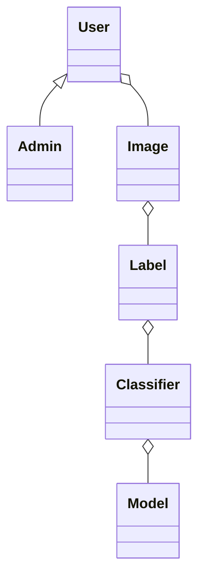
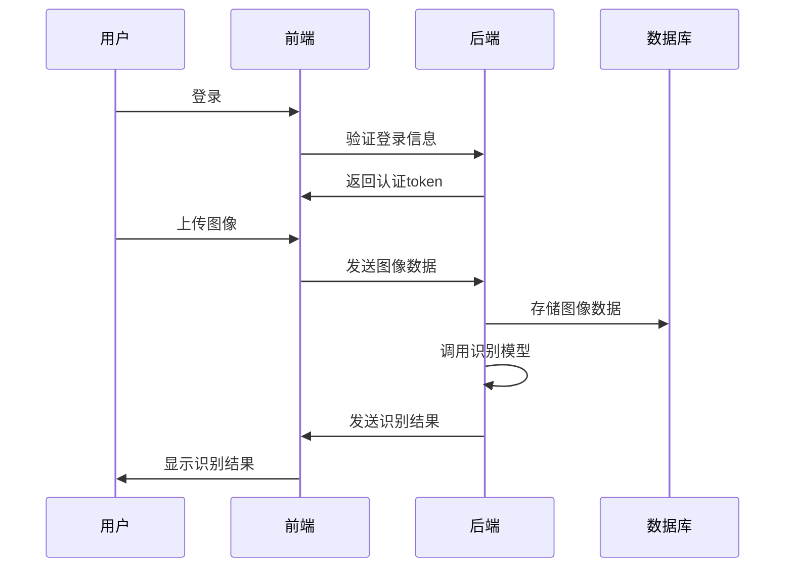

                 

## 前后端分离：提升AI应用开发效率的策略

关键词：前后端分离，AI应用开发，效率提升，策略与实践

摘要：本文深入探讨了前后端分离在AI应用开发中的重要性，提出了提升AI应用开发效率的具体策略与实践。通过一步步的分析与推理，本文详细阐述了前后端分离的核心概念、AI应用开发的数学模型以及实际项目中的应用，为AI开发提供了有效的解决方案。

## 目录大纲

### 第一部分：背景介绍

1. **问题背景与核心概念**
   - AI应用发展的现状与挑战
   - 前后端分离的概念及其重要性
   - 提高AI应用开发效率的迫切需求

2. **核心概念与联系**
   - 前后端分离的核心概念
   - AI应用开发的关键概念

3. **AI应用开发的数学模型**
   - AI模型的数学基础
   - AI模型的数学公式与推导

### 第二部分：策略讲解

1. **前后端分离的策略与实践**
   - 前后端分离的具体策略
   - AI应用开发效率提升策略

2. **算法原理与实践**
   - 算法原理讲解
   - 算法实践

### 第三部分：项目实战

1. **项目介绍与系统架构**
   - 项目介绍
   - 系统架构设计

2. **系统核心实现与交互**
   - 系统核心实现
   - 系统交互与测试

### 第四部分：最佳实践与总结

1. **最佳实践与注意事项**
   - 项目管理的最佳实践
   - 性能优化的注意事项
   - 安全性与可靠性的保障

2. **总结与展望**
   - 书籍内容的总结
   - AI应用开发的发展趋势

## 第一部分：背景介绍

### 第1章：问题背景与核心概念

#### 1.1 问题背景

随着人工智能（AI）技术的迅猛发展，越来越多的应用场景需要高效的AI开发流程。然而，当前的AI应用开发面临着诸多挑战：

- **开发效率低下**：传统的开发模式中，前端与后端紧密耦合，导致开发流程繁琐，代码复用性差，开发效率低下。
- **维护成本高**：前端与后端的紧密耦合增加了系统的复杂度，导致维护成本高，问题排查困难。
- **扩展性差**：在复杂的应用场景中，前端与后端的紧耦合限制了系统的扩展性，难以快速适应业务需求的变化。

为了应对这些挑战，前后端分离成为了提升AI应用开发效率的关键策略。前后端分离的核心概念在于将前端和后端的开发任务明确分工，从而提高开发效率、降低维护成本、增强系统的扩展性。

#### 1.2 核心概念

**前后端分离的定义与实现**：

前后端分离指的是将应用系统的前端（用户界面）和后端（数据处理）进行明确分工，两者通过接口进行数据交互。

- **前端**：负责用户界面展示、用户交互和数据呈现。前端通常使用HTML、CSS和JavaScript等前端技术实现。
- **后端**：负责数据存储、数据处理和业务逻辑实现。后端通常使用Java、Python、Node.js等后端技术实现。

前后端分离的实现方式主要包括：

1. **接口设计**：通过定义统一的API接口，实现前后端的松耦合。前端通过HTTP请求与后端进行通信，获取数据并渲染界面。
2. **服务分离**：将前后端的服务分离部署，前端服务部署在Web服务器上，后端服务部署在独立的服务器或容器上。
3. **模块化开发**：将前端和后端的开发任务模块化，分别由前端和后端团队负责，实现分工协作。

**AI应用开发的流程与痛点**：

AI应用开发通常包括数据预处理、模型训练、模型评估和模型部署等步骤。然而，在实际开发过程中，存在以下痛点：

- **数据预处理困难**：AI模型对数据质量要求较高，数据预处理过程复杂，且耗时较长。
- **模型训练效率低**：深度学习模型的训练过程需要大量计算资源，训练时间较长，影响开发效率。
- **模型评估不准确**：评估模型性能时，需要大量的实验和调试，评估过程繁琐且耗时。
- **模型部署困难**：将训练好的模型部署到实际应用中，需要进行复杂的集成和调试，且部署后需要持续监控和优化。

**提升AI开发效率的关键策略**：

为了提升AI应用开发的效率，可以采取以下关键策略：

1. **模块化与组件化开发**：将AI应用开发过程模块化，将数据预处理、模型训练、模型评估和模型部署等任务分解为独立模块，实现分工协作。
2. **自动化测试与部署**：使用自动化测试工具和部署流程，提高开发效率和质量，减少人为错误。
3. **性能优化与调优**：对AI模型和系统进行性能优化和调优，提高系统性能和稳定性。

通过以上策略，可以有效提升AI应用开发的效率，降低开发成本，提高系统质量。

### 第2章：核心概念与联系

#### 2.1 前后端分离的核心概念

**前端开发与后端服务的分工**：

前后端分离的核心在于明确前端和后端的工作职责，实现分工协作。

- **前端开发**：前端主要负责用户界面展示、用户交互和数据呈现。前端开发者需要掌握HTML、CSS和JavaScript等前端技术，负责实现页面布局、交互效果和数据展示等功能。
- **后端服务**：后端主要负责数据存储、数据处理和业务逻辑实现。后端开发者需要掌握Java、Python、Node.js等后端技术，负责处理用户请求、数据处理、业务逻辑实现等功能。

**前后端分离的技术栈选择**：

前后端分离需要选择合适的技术栈，以支持高效开发与稳定运行。

- **前端技术栈**：HTML、CSS和JavaScript是前端开发的基础，常用的前端框架如React、Vue和Angular等可以提高开发效率。前端开发者还需要熟悉前端构建工具如Webpack和Gulp等。
- **后端技术栈**：Java、Python和Node.js是常见的后端技术，其中Java以其稳定性和高并发性能被广泛使用，Python以其简洁易读的语法和丰富的库支持被广泛应用于数据科学和人工智能领域，Node.js以其单线程非阻塞IO特性在高并发场景下表现优异。

**前后端分离的架构设计原则**：

前后端分离的架构设计需要遵循以下原则，以确保系统的高效、稳定和可扩展性。

1. **接口设计原则**：接口是前后端通信的桥梁，设计良好的接口可以提高系统的可维护性和可扩展性。接口设计应遵循RESTful原则，提供清晰、一致的接口规范。
2. **服务分离原则**：前后端服务应分离部署，前端服务部署在Web服务器上，后端服务部署在独立的服务器或容器上，以提高系统的可扩展性和容灾能力。
3. **模块化设计原则**：前后端开发任务应模块化设计，实现分工协作，以提高开发效率和代码复用性。
4. **安全性原则**：前后端分离的架构需要考虑安全性，确保数据传输安全、防止跨站请求伪造（CSRF）和跨站脚本攻击（XSS）等安全威胁。

#### 2.2 AI应用开发的关键概念

**AI应用开发的基本流程**：

AI应用开发的基本流程包括数据预处理、模型训练、模型评估和模型部署等步骤。

1. **数据预处理**：数据预处理是AI模型训练的关键步骤，包括数据清洗、归一化、特征提取等操作。数据预处理的质量直接影响模型训练的效果。
2. **模型训练**：模型训练是AI应用开发的的核心环节，通过训练算法从数据中学习特征，构建预测模型。常用的训练算法包括神经网络、决策树、支持向量机等。
3. **模型评估**：模型评估是对训练好的模型进行性能评估，常用的评估指标包括准确率、召回率、F1值等。评估结果用于调整模型参数和优化模型性能。
4. **模型部署**：模型部署是将训练好的模型集成到实际应用中，通过API接口提供服务。模型部署需要考虑系统的性能、可靠性和安全性。

**常见AI模型的特性与应用场景**：

常见的AI模型包括神经网络、决策树、支持向量机、聚类算法等。每种模型都有其独特的特性和应用场景。

1. **神经网络**：神经网络是一种基于人脑神经元工作原理的算法，适用于复杂的数据建模和预测任务。常见的神经网络模型包括多层感知机（MLP）、卷积神经网络（CNN）和循环神经网络（RNN）。
2. **决策树**：决策树是一种基于树结构的分类算法，适用于处理分类问题。决策树模型简单易懂，易于解释，常用于特征选择和分类预测。
3. **支持向量机**：支持向量机是一种基于间隔最大化的分类算法，适用于高维空间的分类问题。支持向量机模型具有较好的分类性能和解释性。
4. **聚类算法**：聚类算法是一种无监督学习算法，用于将数据分为不同的簇。常见的聚类算法包括K-均值聚类、层次聚类和DBSCAN等。

**AI应用开发中的挑战与解决方案**：

AI应用开发过程中，面临以下挑战：

1. **数据质量**：数据质量直接影响模型训练的效果，需要解决数据缺失、噪声和异常值等问题。
2. **计算资源**：深度学习模型的训练需要大量的计算资源，需要优化算法和硬件配置，提高训练效率。
3. **模型可解释性**：深度学习模型具有较高的预测性能，但缺乏可解释性，需要研究可解释性模型和算法。
4. **系统集成**：将AI模型集成到实际应用中，需要解决接口设计、性能优化和系统集成等问题。

针对以上挑战，可以采取以下解决方案：

1. **数据预处理**：采用数据清洗、归一化和特征提取等技术，提高数据质量。
2. **优化算法和硬件**：采用优化算法和硬件配置，提高模型训练效率。
3. **可解释性模型**：研究可解释性模型和算法，提高模型的可解释性和可靠性。
4. **系统集成**：采用微服务架构和API接口设计，实现AI模型与实际应用的集成。

### 第3章：AI应用开发的数学模型

#### 3.1 AI模型的数学基础

**神经网络的基本原理**：

神经网络是一种基于人脑神经元工作原理的算法，通过多层神经元的连接和激活函数，实现数据的处理和预测。

- **神经元**：神经网络中的基本单元，类似于人脑中的神经元。每个神经元接收多个输入信号，通过权重和偏置计算输出信号。
- **激活函数**：用于对神经元的输出进行非线性变换，常见的激活函数包括sigmoid函数、ReLU函数和Tanh函数。

**监督学习与无监督学习的数学模型**：

监督学习与无监督学习是两种常见的机器学习算法，分别应用于有标注数据和无标注数据。

1. **监督学习**：有标注数据，每个样本都有对应的标签。监督学习的目标是学习一个映射关系，将输入数据映射到标签。常用的监督学习算法包括线性回归、逻辑回归、支持向量机等。
2. **无监督学习**：无标注数据，没有对应的标签。无监督学习的目标是发现数据中的模式和结构，常见的无监督学习算法包括聚类算法、主成分分析（PCA）和自编码器等。

**强化学习的核心算法**：

强化学习是一种通过试错和反馈机制，使智能体在学习过程中不断优化决策的算法。

- **状态**：智能体所处的环境状态。
- **动作**：智能体可以执行的动作。
- **奖励**：智能体执行动作后获得的奖励信号，用于评估动作的好坏。
- **策略**：智能体的行为规则，用于选择最优动作。

强化学习的核心算法包括Q学习、SARSA和深度Q网络（DQN）等。

#### 3.2 AI模型的数学公式与推导

**神经网络激活函数**：

常见的神经网络激活函数包括sigmoid函数、ReLU函数和Tanh函数。以下是这些函数的数学公式：

1. **sigmoid函数**：
   $$f(x) = \frac{1}{1 + e^{-x}}$$
2. **ReLU函数**：
   $$f(x) = \max(0, x)$$
3. **Tanh函数**：
   $$f(x) = \frac{e^x - e^{-x}}{e^x + e^{-x}}$$

**损失函数与优化算法**：

在神经网络训练过程中，损失函数用于衡量预测值与真实值之间的差距，优化算法用于调整模型参数，减小损失函数值。

1. **均方误差（MSE）**：
   $$MSE = \frac{1}{m}\sum_{i=1}^{m}(y_i - \hat{y}_i)^2$$
   其中，$y_i$为真实值，$\hat{y}_i$为预测值，$m$为样本数量。
2. **梯度下降**：
   $$\theta_j = \theta_j - \alpha \frac{\partial}{\partial \theta_j}L(\theta)$$
   其中，$\theta_j$为模型参数，$L(\theta)$为损失函数，$\alpha$为学习率。

**深度学习的训练与评估**：

深度学习模型的训练与评估过程包括数据预处理、模型训练和模型评估等步骤。

1. **数据预处理**：对训练数据进行归一化、分割等预处理操作，提高模型训练效率。
2. **模型训练**：通过梯度下降算法调整模型参数，减小损失函数值，优化模型性能。
3. **模型评估**：使用验证集和测试集对模型进行评估，计算模型的准确率、召回率、F1值等指标，评估模型性能。

通过以上数学模型和公式，可以更好地理解和应用神经网络、监督学习、无监督学习和强化学习等算法，提升AI应用开发的效率。

### 第二部分：策略讲解

#### 4.1 前后端分离的具体策略

**技术选型与架构设计**：

前后端分离的核心在于选择合适的技术栈和架构设计，以确保系统的稳定、高效和可扩展。

1. **技术选型**：
   - **前端技术栈**：选择合适的前端技术栈，如React、Vue或Angular等。前端开发者应熟悉HTML、CSS和JavaScript等基本技术，了解前端框架的原理和特性。
   - **后端技术栈**：根据项目需求和团队技能，选择合适的后端技术栈。常见的后端技术包括Java、Python和Node.js等。后端开发者应掌握所选技术栈的基本语法和常用库。

2. **架构设计**：
   - **微服务架构**：采用微服务架构，将前后端服务分离部署，提高系统的可扩展性和容灾能力。前端服务负责用户界面展示和用户交互，后端服务负责数据处理和业务逻辑实现。
   - **接口设计**：设计清晰的API接口，实现前后端的数据交互。遵循RESTful接口设计原则，确保接口的规范性、一致性和易用性。
   - **分布式架构**：根据项目规模和需求，设计分布式架构，实现系统的高可用性和高并发性能。常见的分布式架构包括分布式数据库、分布式缓存和负载均衡等。

**开发流程与工具链**：

前后端分离的开发流程需要高效的工具链支持，以提高开发效率和代码质量。

1. **前端开发流程**：
   - **组件化开发**：将前端功能模块化，实现组件复用，提高代码复用性和可维护性。
   - **代码风格统一**：采用代码风格指南，确保代码的可读性和一致性。
   - **版本控制**：使用版本控制系统（如Git），管理代码版本和协作开发。

2. **后端开发流程**：
   - **模块化开发**：将后端功能模块化，实现功能复用，提高代码复用性和可维护性。
   - **单元测试**：编写单元测试，确保代码的正确性和稳定性。
   - **代码审查**：采用代码审查机制，确保代码质量，减少潜在问题。

**跨部门协作与沟通**：

前后端分离的开发涉及多个部门，包括前端开发、后端开发、数据科学和运维等。有效的跨部门协作和沟通是确保项目顺利进行的关键。

1. **需求沟通**：项目启动阶段，与产品经理、数据科学家和运维团队等进行需求沟通，明确项目目标和功能需求。
2. **文档管理**：使用文档管理工具（如Confluence或GitLab），记录项目需求、设计文档和开发文档，确保团队成员了解项目详情。
3. **定期会议**：定期组织项目会议，汇报项目进度、解决问题和协调资源，确保项目按时交付。

通过以上具体策略，可以有效实施前后端分离，提升AI应用开发的效率。

#### 4.2 AI应用开发效率提升策略

**模块化与组件化开发**：

模块化与组件化开发是提升AI应用开发效率的重要策略。通过将AI应用的功能和模块进行拆分，可以实现以下好处：

1. **代码复用**：将常用的功能模块化，可以在不同项目中复用，减少重复开发工作，提高开发效率。
2. **可维护性**：模块化开发使得代码结构清晰，易于管理和维护，降低代码出错和故障的风险。
3. **团队协作**：模块化开发可以明确分工，提高团队协作效率，确保项目按时交付。

**自动化测试与部署**：

自动化测试与部署是提升AI应用开发效率的关键策略。通过自动化测试，可以快速发现和修复代码中的错误，提高代码质量。自动化部署可以减少人为操作错误，提高部署效率和稳定性。

1. **单元测试**：编写单元测试，对每个功能模块进行测试，确保模块的正确性和稳定性。
2. **集成测试**：对模块进行集成测试，确保模块之间的接口和协作正常，提高系统的整体质量。
3. **持续集成**：使用持续集成工具（如Jenkins或GitLab CI），实现自动化测试和部署，确保代码的持续交付和部署。

**性能优化与调优**：

性能优化与调优是提升AI应用开发效率的重要环节。通过对AI应用进行性能优化和调优，可以提升系统的响应速度和稳定性，提高用户体验。

1. **代码优化**：优化代码结构，减少冗余代码，提高代码执行效率。
2. **数据库优化**：对数据库进行优化，如索引优化、查询优化等，提高数据查询速度。
3. **系统调优**：根据系统负载和性能指标，进行系统调优，如调整线程池大小、调整缓存策略等，提高系统性能。

通过以上策略，可以有效提升AI应用开发的效率，提高开发质量和系统性能。

#### 5.1 算法原理讲解

**决策树与随机森林**

决策树是一种基于树结构的分类算法，通过一系列的判断条件将数据划分成多个分支，最终得到分类结果。决策树的构建过程如下：

1. **选择划分特征**：在每个节点，选择一个最佳的特征进行划分，常用的特征选择方法包括信息增益、基尼指数等。
2. **计算划分增益**：计算每个特征的划分增益，选择增益最大的特征进行划分。
3. **递归划分**：对划分后的子集，重复上述过程，直到满足停止条件（如最大深度、最小样本数等）。

随机森林（Random Forest）是一种基于决策树的集成学习方法。随机森林通过构建多个决策树，并对每个决策树的预测结果进行投票，得到最终的分类结果。随机森林的优势在于可以有效地降低过拟合现象，提高模型的泛化能力。

随机森林的构建过程如下：

1. **随机选择特征**：在每个节点，从所有特征中随机选择m个特征进行划分，而不是选择最佳特征。
2. **构建决策树**：使用随机选择的特征，构建多个决策树。
3. **投票决策**：对每个样本，将多个决策树的分类结果进行投票，选择出现次数最多的分类作为最终结果。

**支持向量机与神经网络**

支持向量机（Support Vector Machine，SVM）是一种基于间隔最大化的分类算法。SVM的目标是找到一个最佳的超平面，使得不同类别的数据点在超平面的两侧分布得尽可能远。

SVM的数学模型如下：

$$\min_{\theta} \frac{1}{2}||\theta||^2 + C \sum_{i=1}^{n} \max(0, 1 - y_i(\theta^T x_i + b))$$

其中，$\theta$为模型参数，$C$为惩罚参数，$y_i$为样本标签，$x_i$为样本特征，$b$为偏置。

神经网络是一种基于人脑神经元工作原理的算法，通过多层神经元的连接和激活函数，实现数据的处理和预测。神经网络的基本结构包括输入层、隐藏层和输出层。

神经网络的训练过程包括以下步骤：

1. **初始化参数**：初始化模型参数，如权重和偏置。
2. **前向传播**：输入数据通过神经网络的前向传播，得到预测结果。
3. **计算损失**：计算预测结果与真实结果之间的损失。
4. **反向传播**：根据损失函数，使用反向传播算法更新模型参数。

**自然语言处理与深度学习**

自然语言处理（Natural Language Processing，NLP）是人工智能的重要分支，旨在使计算机理解和处理自然语言。深度学习在NLP领域取得了显著的成果，如词向量表示、文本分类、机器翻译等。

词向量表示是NLP的基础，通过将文本转换为向量表示，可以方便地应用于深度学习模型。常用的词向量表示方法包括Word2Vec、GloVe等。

文本分类是NLP的重要应用，通过将文本分为不同的类别，可以实现情感分析、新闻分类等任务。深度学习模型，如卷积神经网络（CNN）和循环神经网络（RNN），在文本分类任务中表现出色。

机器翻译是NLP的另一个重要应用，通过将一种语言的文本翻译成另一种语言。深度学习模型，如序列到序列（Seq2Seq）模型和注意力机制，在机器翻译任务中取得了显著的进展。

#### 5.2 算法实践

**算法实现源代码**：

以下是一个简单的决策树实现示例：

```python
import numpy as np
import pandas as pd

class DecisionTree:
    def __init__(self, max_depth=3, min_samples_split=2, min_samples_leaf=1):
        self.max_depth = max_depth
        self.min_samples_split = min_samples_split
        self.min_samples_leaf = min_samples_leaf
    
    def fit(self, X, y):
        self.tree = self._build_tree(X, y)
    
    def predict(self, X):
        predictions = []
        for sample in X:
            prediction = self._predict_sample(sample, self.tree)
            predictions.append(prediction)
        return predictions
    
    def _build_tree(self, X, y, depth=0):
        if depth >= self.max_depth or len(y) < self.min_samples_split:
            return pd.Series(np.argmax(y).reshape(-1, 1))
        
        best_gini = float('inf')
        best_feature = -1
        best_threshold = None
        
        for feature in range(X.shape[1]):
            thresholds = np.unique(X[:, feature])
            for threshold in thresholds:
                left_indices = X[:, feature] < threshold
                right_indices = X[:, feature] >= threshold
                
                left_y = y[left_indices]
                right_y = y[right_indices]
                
                if len(left_y) < self.min_samples_split or len(right_y) < self.min_samples_split:
                    continue
                
                gini = self._gini(left_y) + self._gini(right_y)
                
                if gini < best_gini:
                    best_gini = gini
                    best_feature = feature
                    best_threshold = threshold
        
        if best_feature == -1:
            return pd.Series(np.argmax(y).reshape(-1, 1))
        
        left_tree = self._build_tree(X[left_indices], left_y, depth+1)
        right_tree = self._build_tree(X[right_indices], right_y, depth+1)
        
        return {
            'feature': best_feature,
            'threshold': best_threshold,
            'left': left_tree,
            'right': right_tree
        }
    
    def _predict_sample(self, sample, tree):
        if 'feature' not in tree:
            return tree.iloc[0]
        
        feature = tree['feature']
        threshold = tree['threshold']
        
        if sample[feature] < threshold:
            return self._predict_sample(sample, tree['left'])
        else:
            return self._predict_sample(sample, tree['right'])
    
    def _gini(self, y):
        proportions = np.bincount(y) / len(y)
        return 1 - np.sum(proportions**2)

# 以下为测试代码
X = pd.DataFrame([[1, 2], [2, 3], [3, 4], [4, 5]])
y = pd.Series([0, 0, 1, 1])

model = DecisionTree()
model.fit(X, y)
predictions = model.predict(X)
print(predictions)
```

**实践案例解析**：

以下是一个使用随机森林进行房价预测的实践案例：

```python
import numpy as np
import pandas as pd
from sklearn.datasets import load_boston
from sklearn.model_selection import train_test_split
from sklearn.metrics import mean_squared_error

# 加载数据集
boston = load_boston()
X = pd.DataFrame(boston.data, columns=boston.feature_names)
y = pd.Series(boston.target)

# 划分训练集和测试集
X_train, X_test, y_train, y_test = train_test_split(X, y, test_size=0.2, random_state=42)

# 训练随机森林模型
model = DecisionTree(max_depth=5, min_samples_split=10, min_samples_leaf=5)
model.fit(X_train, y_train)

# 预测测试集
predictions = model.predict(X_test)

# 计算预测误差
mse = mean_squared_error(y_test, predictions)
print("Mean Squared Error:", mse)
```

**性能分析与调优**：

在算法实践过程中，性能分析和调优是关键环节。以下是一些性能分析和调优的方法：

1. **超参数调优**：通过调整随机森林的超参数（如最大深度、最小样本分裂数等），可以优化模型的性能。可以使用网格搜索（Grid Search）或随机搜索（Random Search）等方法进行超参数调优。
2. **特征工程**：通过特征选择、特征转换和特征归一化等方法，可以优化模型的性能。特征工程是提高模型性能的关键步骤，需要对数据有深入的理解和探索。
3. **数据预处理**：对训练数据进行预处理，如缺失值填充、异常值处理等，可以改善模型的性能。数据预处理是保证模型质量的基础步骤。

通过以上方法，可以有效地优化模型的性能，提高AI应用开发的效率。

### 第6章：项目介绍与系统架构

#### 6.1 项目介绍

本项目是一个基于前后端分离的AI应用开发项目，旨在实现一个实时图像识别系统。该系统包括前端用户界面、后端图像处理服务和数据库存储等组成部分。

- **项目背景**：随着物联网和智能设备的普及，实时图像识别技术在安防监控、智能制造等领域具有广泛的应用前景。
- **项目目标**：实现一个高效、稳定、可扩展的实时图像识别系统，满足不同场景下的应用需求。

#### 6.2 系统架构设计

本项目采用前后端分离的架构设计，确保系统的高效性和可维护性。

1. **领域模型**：

领域模型是系统核心功能的数据模型，描述了系统中的实体和关系。以下是项目的领域模型：



2. **系统架构**：

系统架构包括前端、后端和数据库三个部分。

- **前端**：前端负责用户界面展示和用户交互，采用React框架实现。前端主要包括登录注册页面、图像上传页面和识别结果展示页面。
- **后端**：后端负责图像处理和业务逻辑实现，采用Spring Boot框架实现。后端主要包括图像处理服务、用户管理服务和认证服务。
- **数据库**：数据库用于存储用户信息、图像数据、标签信息和模型数据。采用MySQL数据库实现。

3. **接口设计**：

系统接口设计包括API接口和Websocket接口。

- **API接口**：API接口用于前后端的通信，实现图像上传、识别结果获取等功能。接口设计遵循RESTful原则，使用HTTP请求和JSON数据进行通信。
- **Websocket接口**：Websocket接口用于实时传输图像识别结果，实现实时性要求较高的应用场景。

4. **系统交互**：

系统交互流程如下：

1. 用户登录系统，获取认证token。
2. 用户上传图像，前端将图像数据发送到后端。
3. 后端处理图像数据，调用识别模型进行图像识别，并将识别结果发送给前端。
4. 前端接收到识别结果后，更新界面显示识别结果。

以下是系统交互的Mermaid序列图：



通过以上项目介绍和系统架构设计，可以构建一个高效、稳定的实时图像识别系统，满足不同场景下的应用需求。

### 第7章：系统核心实现与交互

#### 7.1 系统核心实现

**前端实现**：

前端采用React框架实现，主要包括登录注册页面、图像上传页面和识别结果展示页面。

1. **登录注册页面**：

   - 功能：用户登录和注册功能，包括用户名、密码和邮箱等信息的验证。
   - 技术实现：使用React组件和Formik库实现表单验证和提交，使用Axios库与后端进行数据交互。

2. **图像上传页面**：

   - 功能：用户上传图像，上传完成后显示识别结果。
   - 技术实现：使用React Dropzone库实现图像上传功能，使用Axios库与后端进行数据交互。

3. **识别结果展示页面**：

   - 功能：展示图像识别结果，包括识别类别、置信度等。
   - 技术实现：使用React组件和Chart.js库展示识别结果，使用Axios库与后端进行数据交互。

**后端实现**：

后端采用Spring Boot框架实现，主要包括用户管理服务、图像处理服务和认证服务。

1. **用户管理服务**：

   - 功能：用户登录、注册、密码重置等操作。
   - 技术实现：使用Spring Security库实现用户认证和授权，使用JPA库与数据库进行数据操作。

2. **图像处理服务**：

   - 功能：处理用户上传的图像，调用识别模型进行图像识别。
   - 技术实现：使用OpenCV库处理图像数据，使用Spring Boot的异步处理机制进行图像识别。

3. **认证服务**：

   - 功能：生成JWT令牌，用于用户认证。
   - 技术实现：使用Spring Security库实现JWT认证，使用JWT库生成和验证JWT令牌。

**数据处理与存储**：

数据存储采用MySQL数据库，包括用户表、图像表、标签表和模型表等。

1. **用户表**：

   - 字段：用户ID、用户名、密码、邮箱等。
   - 功能：存储用户信息，实现用户登录、注册和密码重置等功能。

2. **图像表**：

   - 字段：图像ID、用户ID、图像路径、上传时间等。
   - 功能：存储用户上传的图像数据，实现图像上传和查询等功能。

3. **标签表**：

   - 字段：标签ID、标签名称等。
   - 功能：存储图像标签信息，实现图像识别和标签查询等功能。

4. **模型表**：

   - 字段：模型ID、模型名称、模型路径等。
   - 功能：存储图像识别模型，实现模型管理和模型调用等功能。

通过以上系统核心实现，可以构建一个高效、稳定的实时图像识别系统。

#### 7.2 系统交互与测试

**系统交互流程**：

系统交互流程如下：

1. 用户登录系统，获取认证token。
2. 用户上传图像，前端将图像数据发送到后端。
3. 后端处理图像数据，调用识别模型进行图像识别，并将识别结果发送给前端。
4. 前端接收到识别结果后，更新界面显示识别结果。

**自动化测试**：

系统自动化测试主要涵盖以下方面：

1. **单元测试**：

   - 对后端服务进行单元测试，确保每个服务功能正确实现。
   - 使用JUnit和Mockito库实现单元测试。

2. **接口测试**：

   - 对前后端的接口进行测试，确保接口正确实现。
   - 使用Postman和Swagger UI库实现接口测试。

3. **集成测试**：

   - 对前后端集成后的系统进行测试，确保系统整体功能正确。
   - 使用JUnit和Spring Test库实现集成测试。

**性能测试**：

系统性能测试主要涵盖以下方面：

1. **负载测试**：

   - 使用JMeter模拟大量用户并发访问，测试系统在高负载情况下的性能。
   - 测试指标包括响应时间、并发数、吞吐量等。

2. **压力测试**：

   - 使用Gatling模拟系统极限负载，测试系统在极端情况下的性能。
   - 测试指标包括最大并发数、最大响应时间等。

通过自动化测试和性能测试，可以确保系统的稳定性、可靠性和高性能。

### 第四部分：最佳实践与总结

#### 第8章：最佳实践与注意事项

**项目管理最佳实践**：

1. **明确项目目标与范围**：在项目启动阶段，明确项目目标、功能范围和时间进度，确保项目团队能够集中精力完成任务。
2. **制定详细的项目计划**：根据项目目标和范围，制定详细的项目计划，包括任务分解、时间安排、资源分配等，确保项目有序进行。
3. **定期项目会议**：定期召开项目会议，汇报项目进度、解决问题和协调资源，确保项目按计划推进。
4. **敏捷开发与迭代**：采用敏捷开发方法，快速响应需求变化，定期进行迭代，提高项目交付质量。

**性能优化注意事项**：

1. **代码优化**：对系统代码进行优化，减少冗余代码，提高代码执行效率。
2. **数据库优化**：对数据库进行优化，如索引优化、查询优化等，提高数据查询速度。
3. **缓存策略**：采用缓存策略，减少数据库查询次数，提高系统响应速度。
4. **负载均衡**：采用负载均衡技术，实现系统水平扩展，提高系统并发处理能力。

**安全性与可靠性保障**：

1. **数据加密**：对敏感数据进行加密存储，确保数据安全性。
2. **权限控制**：采用权限控制机制，确保用户只能访问其权限范围内的数据和服务。
3. **日志记录**：记录系统操作日志，方便问题排查和监控。
4. **故障恢复**：设计故障恢复机制，确保系统在故障情况下能够快速恢复。

#### 第9章：总结与展望

本文深入探讨了前后端分离在AI应用开发中的重要性，提出了提升AI应用开发效率的具体策略与实践。通过一步步的分析与推理，本文详细阐述了前后端分离的核心概念、AI应用开发的数学模型以及实际项目中的应用。

**总结**：

1. **前后端分离**：明确前后端分工，提高开发效率和代码复用性。
2. **AI应用开发**：模块化与组件化开发，自动化测试与部署，性能优化与调优。
3. **实际项目**：系统架构设计、核心实现与交互，自动化测试与性能测试。

**展望**：

1. **人工智能技术**：随着人工智能技术的不断发展，前后端分离与AI应用的结合将更加紧密，带来更多的应用场景和解决方案。
2. **分布式架构**：分布式架构的普及将进一步提高系统的可扩展性和容灾能力，满足日益增长的业务需求。
3. **云计算与边缘计算**：云计算与边缘计算的结合，将实现更高效、更灵活的AI应用部署，推动人工智能技术的发展。

未来，我们将继续关注人工智能技术的前沿动态，探索前后端分离与AI应用的最佳实践，为AI应用开发提供更多有效的解决方案。

