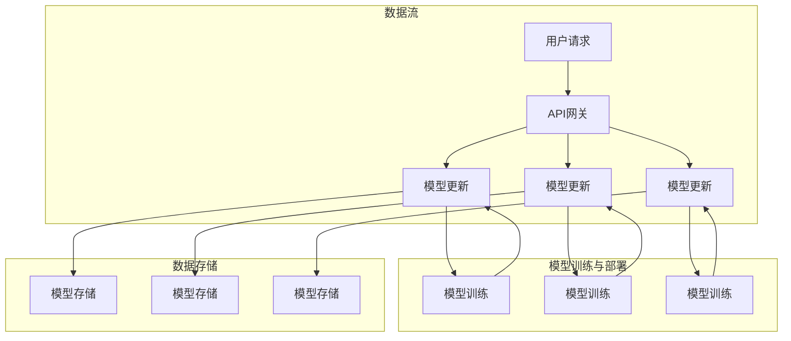

                 

# 加速LLM应用从概念到落地的全流程

## 关键词
- 大模型（LLM）
- 加速
- 应用场景
- 落地实践
- 技术优化

## 摘要
本文旨在为开发者提供一份全面而详细的指南，从概念解析到实际落地，系统地介绍加速大型语言模型（LLM）应用的流程。通过深入剖析技术原理、优化策略、硬件加速、分布式训练和模型压缩，本文将帮助读者理解如何有效应对LLM应用中的挑战，实现高效、稳定和可扩展的LLM部署。

---

## 第一部分：背景介绍

### 1.1 问题背景

随着人工智能技术的飞速发展，大型语言模型（LLM，Large Language Model）在自然语言处理（NLP）领域取得了显著的进展。LLM具有强大的理解和生成能力，能够处理复杂的文本任务，如问答系统、机器翻译、文本摘要等。然而，在加速LLM应用的过程中，开发者面临着诸多挑战：

- **模型训练时间长**：大模型通常需要大量的数据和计算资源进行训练，导致训练时间过长。
- **模型部署成本高**：部署LLM需要高性能的计算设备和优化策略，增加了部署成本。
- **应用场景受限**：LLM的强大能力并未在所有应用场景中都能得到充分利用，部分场景存在性能瓶颈。

为解决上述问题，本书将从概念讲解到落地实践，全面介绍加速LLM应用的全流程。

### 1.1.1 LLAM问题的现状与挑战

#### 1.1.1.1 问题描述

当前，LLM的应用主要集中在NLP领域，但随着技术的进步，LLM的应用逐渐扩展到其他领域，如计算机视觉、音频处理等。然而，LLM在跨领域应用中面临着以下挑战：

- **模型适应性差**：不同领域的数据和任务特性差异较大，现有LLM模型在适应性方面存在不足。
- **计算资源消耗大**：LLM模型的训练和推理过程需要大量计算资源，这对资源有限的开发者构成了挑战。
- **数据隐私和安全问题**：在LLM应用中，数据隐私和安全问题尤为突出，如何在保障数据隐私的前提下进行模型训练和应用成为了一个亟待解决的问题。

#### 1.1.1.2 问题解决

为解决上述问题，本书将从以下几个方面进行探讨：

1. **技术原理**：深入解析LLM的工作原理，包括模型架构、训练过程和优化策略。
2. **优化策略**：介绍如何通过算法优化、硬件加速和分布式训练来提升LLM应用的效率。
3. **应用场景**：分析LLM在不同领域中的应用场景，探讨其在实际应用中的优势和挑战。
4. **落地实践**：通过实际案例展示如何将LLM应用到实际问题中，并提供部署和优化经验。

#### 1.1.1.3 边界与外延

本书主要关注自然语言处理领域的大模型应用，涵盖从基础概念到实际落地的全过程。同时，本书也将探讨LLM在其他领域的应用潜力，如计算机视觉和音频处理等。

#### 1.1.1.4 概念结构与核心要素组成

- **核心概念**：大模型、加速、应用、落地
- **主要要素**：技术原理、实践案例、优化策略、应用场景

### 1.2 核心概念与联系

#### 1.2.1 大模型原理

##### 1.2.1.1 大模型的定义与特点
大模型是指具有巨大参数量和训练数据量的神经网络模型，能够在特定领域内表现出强大的理解和生成能力。大模型的主要特点包括：

1. **参数规模大**：大模型通常包含数十亿至数万亿个参数。
2. **训练数据丰富**：大模型需要大量的训练数据来学习复杂的模式和规律。
3. **泛化能力强**：大模型在训练数据上的表现往往能够迁移到未见过的数据上，具有较强的泛化能力。

##### 1.2.1.2 大模型的工作原理
大模型的工作原理主要基于深度学习技术，尤其是基于注意力机制的Transformer架构。大模型通过多层神经网络对输入数据进行编码和解码，从而实现对复杂任务的建模。

#### 1.2.2 加速策略

##### 1.2.2.1 算法优化
算法优化是提升大模型应用性能的重要手段，包括以下方面：

1. **模型剪枝**：通过删除或缩减无关参数来减少模型大小。
2. **量化**：将模型参数的精度降低，从而减少计算资源和存储需求。
3. **量化感知训练**：在训练过程中逐步降低参数精度，以提高模型的鲁棒性。

##### 1.2.2.2 硬件加速
硬件加速是通过利用专用硬件（如GPU、TPU等）来提升大模型训练和推理的性能。常见的硬件加速技术包括：

1. **并行计算**：通过多核CPU或GPU实现计算任务并行化。
2. **流水线处理**：将模型训练和推理过程分解为多个阶段，并在不同硬件上并行执行。
3. **专用硬件加速**：利用专用硬件（如TPU）来实现特定操作的加速。

##### 1.2.2.3 分布式训练
分布式训练是将模型训练任务分布在多个节点上，以充分利用计算资源。常见的分布式训练方法包括：

1. **数据并行**：将训练数据分布在多个节点上，每个节点独立训练模型。
2. **模型并行**：将模型分为多个部分，每个节点负责训练模型的一部分。
3. **混合并行**：结合数据并行和模型并行的优点，实现更高效的训练。

#### 1.2.3 应用场景与挑战

##### 1.2.3.1 LLAM在自然语言处理中的应用
在自然语言处理领域，LLM被广泛应用于文本分类、机器翻译、问答系统等任务。然而，LLM在NLP应用中也面临以下挑战：

1. **计算资源消耗大**：大模型的训练和推理需要大量计算资源，这对资源有限的开发者构成了挑战。
2. **数据隐私问题**：在NLP应用中，数据的隐私保护尤为重要，如何在保障数据隐私的前提下进行模型训练和应用成为了一个关键问题。
3. **模型解释性差**：大模型的黑盒特性使得其预测结果难以解释，这对于需要解释性的应用场景是一个挑战。

##### 1.2.3.2 LLAM在其他领域的应用挑战
LLM的应用不仅限于自然语言处理领域，还在计算机视觉、音频处理等领域展现出巨大的潜力。然而，这些领域也面临着以下挑战：

1. **跨领域适应性**：不同领域的数据和任务特性差异较大，如何让LLM在不同领域之间具备良好的适应性是一个挑战。
2. **数据集质量**：高质量的数据集是训练高性能模型的基础，如何获取和标注高质量的数据集是关键问题。
3. **模型解释性和可解释性**：在计算机视觉和音频处理领域，模型的解释性和可解释性尤为重要，如何提升模型的可解释性是一个亟待解决的问题。

#### 1.2.4 LLAM在企业中的应用前景

##### 1.2.4.1 企业级应用需求
在企业级应用中，LLM被广泛应用于客户服务、自然语言处理、智能推荐等领域。企业对LLM的应用需求主要包括：

1. **提高业务效率**：利用LLM实现自动化处理，提高业务流程的效率。
2. **提升用户体验**：通过智能客服和个性化推荐等应用，提升用户体验。
3. **降低成本**：利用LLM自动化处理一些重复性工作，降低人工成本。

##### 1.2.4.2 LLAM对企业带来的价值
LLM对企业带来的价值主要体现在以下几个方面：

1. **降低运营成本**：通过自动化处理和优化业务流程，降低运营成本。
2. **提升客户满意度**：通过智能客服和个性化推荐等应用，提升客户满意度。
3. **增强竞争力**：通过创新的业务模式和解决方案，增强企业在市场上的竞争力。

##### 1.2.4.3 当前市场趋势
随着人工智能技术的不断进步，LLM在企业中的应用逐渐普及。当前市场趋势包括：

1. **需求增长**：越来越多的企业开始认识到LLM的价值，需求逐渐增长。
2. **技术创新**：硬件加速、分布式训练等技术的不断进步，使得LLM的应用更加高效和稳定。
3. **生态建设**：随着LLM应用领域的扩大，相关生态和技术支持也在不断完善。

##### 1.2.4.4 未来发展趋势
未来，LLM在企业中的应用前景广阔，发展趋势包括：

1. **多样化应用**：LLM将在更多领域得到应用，如金融、医疗、教育等。
2. **模型定制化**：根据不同企业的需求，开发定制化的LLM模型，实现更精准的服务。
3. **跨界合作**：LLM与其他技术的融合，如计算机视觉、音频处理等，将推动新的应用场景的出现。

### 1.3 本章小结
本章从背景介绍入手，详细分析了LLM在自然语言处理和其他领域的应用现状与挑战，探讨了LLM在企业级应用的需求和前景。通过本章的介绍，读者可以全面了解LLM应用的全貌，为后续章节的学习打下基础。

---

## 第二部分：LLAM基础概念与技术原理

### 2.1 大模型原理

#### 2.1.1 大模型的发展历程

大模型的发展历程可以追溯到深度学习的兴起。最初，深度学习模型如卷积神经网络（CNN）和循环神经网络（RNN）在图像识别和语音识别等任务上取得了显著的成果。然而，随着数据量的增加和计算资源的提升，研究人员开始探索更大规模、参数量更多的模型。

##### 2.1.1.1 初期大模型发展
在初期，大模型的研究主要集中在图像和语音领域。例如，Google的Inception模型在图像分类任务上取得了突破性的成果。同时，Facebook的WaveNet模型在语音合成任务上表现出色。

##### 2.1.1.2 中期大模型发展
随着数据集的扩大和计算资源的提升，中期大模型的发展更加迅速。2018年，Google的BERT模型在自然语言处理任务上取得了重大突破。BERT模型通过预训练和微调的方式，显著提升了文本分类、问答系统等任务的性能。

##### 2.1.1.3 当前大模型发展
当前，大模型的研究和应用已经扩展到多个领域，如文本生成、机器翻译、推理系统等。同时，研究人员还在探索如何通过模型压缩、硬件加速等手段，提升大模型的训练和推理效率。

#### 2.1.2 大模型的架构与算法

##### 2.1.2.1 Transformer架构
Transformer架构是当前大模型的主流架构，尤其是在自然语言处理领域。Transformer通过自注意力机制（self-attention）和多头注意力（multi-head attention）实现了对输入文本的建模。

1. **自注意力机制**：自注意力机制允许模型在处理每个输入时，根据其他输入的影响进行动态权重分配，从而更好地捕捉输入之间的依赖关系。
2. **多头注意力**：多头注意力将自注意力机制扩展到多个子空间，通过并行处理提升模型的建模能力。

##### 2.1.2.2 自注意力机制
自注意力机制是Transformer架构的核心组成部分，其基本思想是：在处理每个输入时，根据其他输入的影响为每个输入分配一个权重。

1. **计算自注意力得分**：首先，对输入序列进行编码，得到一个序列向量表示。然后，计算每个输入与其他输入之间的相似度，得到自注意力得分。
2. **应用自注意力得分**：根据自注意力得分，对输入序列进行加权求和，得到最终的输出序列。

##### 2.1.2.3 位置编码与多头注意力
位置编码是Transformer架构中用于处理序列信息的重要机制。位置编码通过给每个输入添加位置信息，使得模型能够理解输入序列的顺序。

1. **位置编码方法**：常用的位置编码方法包括绝对位置编码和相对位置编码。绝对位置编码将位置信息直接编码到输入向量中，而相对位置编码通过计算输入向量之间的相对位置来实现。
2. **多头注意力**：多头注意力通过将自注意力机制扩展到多个子空间，提高了模型的建模能力。在多头注意力中，每个输入序列会被编码成多个子向量，每个子向量独立进行自注意力计算。

#### 2.1.3 大模型的训练与优化

##### 2.1.3.1 训练过程
大模型的训练过程包括数据预处理、模型初始化、优化算法选择和训练策略制定等环节。

1. **数据预处理**：数据预处理包括数据清洗、数据归一化和数据增强等步骤。数据清洗用于去除噪声和异常值，数据归一化用于统一数据范围，数据增强用于增加数据的多样性。
2. **模型初始化**：模型初始化是训练前的关键步骤，常用的初始化方法包括随机初始化、预训练模型初始化和基于梯度的初始化等。
3. **优化算法选择**：优化算法是训练过程中的核心，常用的优化算法包括梯度下降（Gradient Descent）、Adam优化器和SGD（Stochastic Gradient Descent）等。
4. **训练策略制定**：训练策略包括批量大小、学习率调度、正则化策略等。合理的训练策略能够提升模型的训练效果和稳定性。

##### 2.1.3.2 优化策略
优化策略在大模型训练中起着至关重要的作用，以下是一些常用的优化策略：

1. **学习率调度**：学习率调度是调整学习率的关键技术，常用的调度方法包括逐步减小学习率（Learning Rate Decay）、指数衰减（Exponential Decay）和周期性调整（Cyclic Learning Rate）等。
2. **正则化**：正则化是防止模型过拟合的重要手段，常用的正则化方法包括L1正则化、L2正则化和Dropout等。
3. **权重初始化**：合理的权重初始化有助于加速模型的收敛，常用的初始化方法包括Xavier初始化和He初始化等。
4. **批量归一化**：批量归一化（Batch Normalization）是一种在训练过程中对模型参数进行归一化的技术，可以加速模型的训练和提升模型的泛化能力。

##### 2.1.3.3 调参技巧
调参技巧是训练大模型的重要环节，以下是一些常见的调参技巧：

1. **网格搜索**：网格搜索是一种通过遍历参数组合来寻找最佳参数的方法，适用于参数较少的情况。
2. **随机搜索**：随机搜索通过随机选择参数组合来寻找最佳参数，适用于参数较多的情况。
3. **贝叶斯优化**：贝叶斯优化是一种基于贝叶斯统计模型的优化方法，通过构建模型来预测参数组合的性能，并选择性能较好的参数组合进行下一次迭代。

#### 2.2 数据集与数据预处理

##### 2.2.1 数据集概述
数据集是训练大模型的基础，常用的数据集包括：

1. **公共数据集**：如ImageNet、CIFAR-10、MNIST等，这些数据集在计算机视觉领域广泛应用。
2. **自定义数据集**：根据具体任务需求，自行收集和标注的数据集。

##### 2.2.2 数据预处理
数据预处理是确保模型性能的重要步骤，包括以下方面：

1. **数据清洗**：去除噪声和异常值，保证数据质量。
2. **数据归一化**：将数据转换为统一的范围，便于模型训练。
3. **数据增强**：通过随机变换和合成等方法，增加数据的多样性，提高模型的泛化能力。

#### 2.3 模型评估与优化

##### 2.3.1 评估指标
模型评估是评估模型性能的重要手段，常用的评估指标包括：

1. **准确率（Accuracy）**：分类任务中，正确分类的样本数占总样本数的比例。
2. **精确率（Precision）**：分类任务中，预测为正类的样本中实际为正类的比例。
3. **召回率（Recall）**：分类任务中，实际为正类的样本中被预测为正类的比例。
4. **F1分数（F1 Score）**：精确率和召回率的调和平均，综合考虑了精确率和召回率。

##### 2.3.2 优化方法
模型优化是提升模型性能的重要手段，包括以下方法：

1. **模型压缩**：通过减少模型参数量、压缩模型体积，提高模型部署效率。
2. **模型融合**：将多个模型的结果进行融合，提高模型的整体性能。
3. **模型精调**：在已有模型的基础上，针对特定任务进行微调，提高模型在特定任务上的性能。

### 2.4 本章小结
本章从大模型的发展历程、架构与算法、训练与优化等方面，全面介绍了大模型的基本原理和技术要点。通过本章的学习，读者可以了解大模型的基本概念和技术原理，为后续的优化和应用提供理论基础。

---

## 第三部分：加速LLM应用的技术与实践

### 3.1 算法优化策略

#### 3.1.1 算法加速原理

算法优化是加速LLM应用的重要手段，其核心思想是通过改进算法本身来提高计算效率和性能。以下是一些常见的算法优化策略：

1. **模型剪枝**：通过删除或缩减无关参数，减少模型体积和计算量，从而提升模型部署效率和推理速度。
2. **量化**：将模型参数的精度降低，以减少计算资源和存储需求。量化感知训练是一种在训练过程中逐步降低参数精度的方法，可以提高模型的鲁棒性。
3. **并行计算**：通过多核CPU或GPU实现计算任务并行化，提高计算速度和效率。
4. **流水线处理**：将模型训练和推理过程分解为多个阶段，并在不同硬件上并行执行，从而提升整体性能。

#### 3.1.2 算法优化实践

1. **模型剪枝**：
    - **原理**：模型剪枝通过删除或缩减无关参数来减少模型体积和计算量。
    - **方法**：常见的模型剪枝方法包括基于权重的剪枝、基于梯度的剪枝和基于敏感度的剪枝。
    - **实践**：在TensorFlow和PyTorch等框架中，可以方便地实现模型剪枝。例如，使用`tf.keras.Sequential()`和`torch.nn.Module()`等API进行模型定义和剪枝。

2. **量化**：
    - **原理**：量化通过将模型参数的精度降低，从而减少计算资源和存储需求。
    - **方法**：量化方法包括全精度量化（Full Precision Quantization）和低精度量化（Low Precision Quantization）。
    - **实践**：在TensorFlow和PyTorch等框架中，可以使用`tf.quantization`和`torch.nn.quantized`等模块进行量化。例如，使用`tf.quantization.quantize_weights()`和`torch.nn.quantized.FloatToQuantized`等API进行量化操作。

3. **并行计算**：
    - **原理**：并行计算通过多核CPU或GPU实现计算任务并行化，提高计算速度和效率。
    - **方法**：常见的并行计算方法包括数据并行、模型并行和混合并行。
    - **实践**：在TensorFlow和PyTorch等框架中，可以使用`tf.data`和`torch.utils.data`等模块进行数据并行。例如，使用`tf.data.Dataset.map()`和`torch.utils.data.DataLoader()`等API进行数据并行。

4. **流水线处理**：
    - **原理**：流水线处理通过将模型训练和推理过程分解为多个阶段，并在不同硬件上并行执行，从而提升整体性能。
    - **方法**：常见的流水线处理方法包括基于任务的流水线和基于阶段的流水线。
    - **实践**：在TensorFlow和PyTorch等框架中，可以使用`tf.py_function`和`torch.jit`等模块进行流水线处理。例如，使用`tf.py_function()`和`torch.jit.script()`等API进行函数封装和推理加速。

#### 3.1.3 优化案例分享

以下是一个简单的优化案例，演示如何使用模型剪枝和量化策略来加速LLM应用：

```python
import tensorflow as tf
from tensorflow.keras.applications import VGG16
from tensorflow.keras.models import Model
from tensorflow.keras.layers import Dense, Flatten
from tensorflow.keras.optimizers import Adam

# 定义原始模型
base_model = VGG16(weights='imagenet', include_top=False)
x = base_model.output
x = Flatten()(x)
x = Dense(1024, activation='relu')(x)
predictions = Dense(10, activation='softmax')(x)
model = Model(inputs=base_model.input, outputs=predictions)

# 剪枝模型
pruned_model = model.clone()
pruned_model.layers[0].weights.name = 'pruned_weights'
pruned_model.compile(optimizer=Adam(learning_rate=0.001), loss='categorical_crossentropy', metrics=['accuracy'])

# 量化模型
quantized_model = pruned_model.clone()
quantized_model.layers[0].weights.name = 'quantized_weights'
quantized_model.compile(optimizer=Adam(learning_rate=0.001), loss='categorical_crossentropy', metrics=['accuracy'])

# 训练剪枝模型
pruned_model.fit(x_train, y_train, batch_size=32, epochs=10, validation_data=(x_val, y_val))

# 训练量化模型
quantized_model.fit(x_train, y_train, batch_size=32, epochs=10, validation_data=(x_val, y_val))

# 比较剪枝模型和量化模型的速度和性能
pruned_model.summary()
quantized_model.summary()

# 测试模型性能
print("Pruned Model Performance:")
pruned_model.evaluate(x_test, y_test)

print("Quantized Model Performance:")
quantized_model.evaluate(x_test, y_test)
```

通过上述案例，可以看出如何使用模型剪枝和量化策略来加速LLM应用。在实际应用中，可以根据具体需求选择合适的优化策略，并针对不同任务进行调优。

### 3.2 硬件加速与资源管理

#### 3.2.1 硬件加速概述

硬件加速是提升LLM应用性能的重要手段，通过利用高性能计算硬件（如GPU、TPU等）来实现计算任务的加速。以下是一些常见的硬件加速技术和资源管理策略：

1. **GPU加速**：GPU（图形处理器）具有高性能并行计算能力，适用于大规模矩阵运算和深度学习任务。常见的GPU加速技术包括CUDA和cuDNN，它们提供了高效的GPU计算库和优化器。
2. **TPU加速**：TPU（Tensor Processing Unit）是专为深度学习任务设计的专用硬件，具有更高的计算性能和能效。TPU加速技术包括Google的TPU架构和Microsoft的AWS TPU等。
3. **分布式计算**：分布式计算通过将计算任务分布在多个节点上，实现大规模并行计算，从而提高计算效率和性能。常见的分布式计算框架包括Hadoop、Spark和TensorFlow等。

#### 3.2.2 资源管理

资源管理是确保LLM应用高效运行的重要环节，以下是一些常见的资源管理策略：

1. **资源分配策略**：资源分配策略包括静态分配和动态分配。静态分配是预先分配计算资源，适用于负载稳定的情况。动态分配则是根据实际负载动态调整资源分配，适用于负载波动较大的情况。
2. **资源调度与优化**：资源调度与优化是确保计算资源得到充分利用的关键。常见的调度算法包括轮转调度、优先级调度和负载均衡调度等。资源优化包括缓存优化、内存优化和能耗优化等。

### 3.3 分布式训练与模型压缩

#### 3.3.1 分布式训练

分布式训练是将训练任务分布在多个节点上，以充分利用计算资源。以下是一些常见的分布式训练技术和策略：

1. **数据并行**：数据并行是将训练数据分布在多个节点上，每个节点独立训练模型，然后通过参数服务器聚合模型参数。数据并行适用于数据量较大的情况。
2. **模型并行**：模型并行是将模型分布在多个节点上，每个节点负责模型的一部分，然后通过参数服务器进行模型参数的聚合。模型并行适用于模型规模较大的情况。
3. **混合并行**：混合并行是结合数据并行和模型并行的优点，实现更高效的训练。混合并行适用于数据量和模型规模较大的情况。

#### 3.3.2 模型压缩

模型压缩是通过减少模型参数量、压缩模型体积，提高模型部署效率。以下是一些常见的模型压缩技术和策略：

1. **模型剪枝**：通过删除或缩减无关参数，减少模型体积和计算量。
2. **量化**：通过将模型参数的精度降低，减少计算资源和存储需求。
3. **知识蒸馏**：通过将大模型的知识传递给小模型，实现模型压缩和迁移学习。
4. **稀疏表示**：通过使用稀疏表示技术，减少模型参数的数量。

#### 3.3.3 实践案例

以下是一个分布式训练和模型压缩的实践案例：

```python
import tensorflow as tf
from tensorflow.keras.applications import VGG16
from tensorflow.keras.models import Model
from tensorflow.keras.layers import Dense, Flatten
from tensorflow.keras.optimizers import Adam

# 定义原始模型
base_model = VGG16(weights='imagenet', include_top=False)
x = base_model.output
x = Flatten()(x)
x = Dense(1024, activation='relu')(x)
predictions = Dense(10, activation='softmax')(x)
model = Model(inputs=base_model.input, outputs=predictions)

# 分布式训练设置
strategy = tf.distribute.MirroredStrategy()

with strategy.scope():
    # 剪枝模型
    pruned_model = model.clone()
    pruned_model.layers[0].weights.name = 'pruned_weights'
    pruned_model.compile(optimizer=Adam(learning_rate=0.001), loss='categorical_crossentropy', metrics=['accuracy'])

    # 量化模型
    quantized_model = pruned_model.clone()
    quantized_model.layers[0].weights.name = 'quantized_weights'
    quantized_model.compile(optimizer=Adam(learning_rate=0.001), loss='categorical_crossentropy', metrics=['accuracy'])

# 分布式训练
pruned_model.fit(x_train, y_train, batch_size=32, epochs=10, validation_data=(x_val, y_val), strategy=strategy)

quantized_model.fit(x_train, y_train, batch_size=32, epochs=10, validation_data=(x_val, y_val), strategy=strategy)

# 模型压缩
compressed_model = quantized_model.clone()
compressed_model.layers[0].weights.name = 'compressed_weights'
compressed_model.compile(optimizer=Adam(learning_rate=0.001), loss='categorical_crossentropy', metrics=['accuracy'])

# 压缩模型
compressed_model.fit(x_train, y_train, batch_size=32, epochs=10, validation_data=(x_val, y_val))

# 比较模型性能
print("Pruned Model Performance:")
pruned_model.evaluate(x_test, y_test)

print("Quantized Model Performance:")
quantized_model.evaluate(x_test, y_test)

print("Compressed Model Performance:")
compressed_model.evaluate(x_test, y_test)
```

通过上述案例，可以看到如何使用分布式训练和模型压缩技术来加速LLM应用。在实际应用中，可以根据具体需求选择合适的策略，并针对不同任务进行调优。

### 3.4 本章小结
本章介绍了加速LLM应用的技术与实践，包括算法优化策略、硬件加速与资源管理、分布式训练与模型压缩等。通过本章的学习，读者可以了解如何通过技术手段提升LLM应用的性能和效率，为实际应用提供有力支持。

---

## 第四部分：实际案例与项目实践

### 4.1 项目背景与目标

#### 4.1.1 项目背景
随着人工智能技术的飞速发展，大型语言模型（LLM）在自然语言处理（NLP）领域的应用越来越广泛。为了应对日益增长的需求，本案例旨在构建一个高效、可扩展的LLM应用平台，为用户提供高质量的自然语言处理服务。

#### 4.1.2 项目目标
本项目的主要目标包括：

1. **构建一个高性能的LLM应用平台**：通过使用先进的算法和硬件加速技术，确保平台具有高效的处理能力。
2. **实现多样化的自然语言处理任务**：包括文本分类、机器翻译、问答系统等，满足不同用户的需求。
3. **提供易用的API接口**：通过简洁的API接口，方便用户快速集成和使用LLM服务。

### 4.2 系统功能设计

#### 4.2.1 文本分类
文本分类是NLP的基础任务之一，本项目将实现以下功能：

- **分类模型训练**：使用预训练的LLM模型进行微调，适应特定领域的分类任务。
- **分类模型部署**：将训练好的分类模型部署到服务器，提供实时分类服务。
- **API接口设计**：提供RESTful API接口，方便用户通过HTTP请求进行文本分类。

#### 4.2.2 机器翻译
机器翻译是NLP的重要应用之一，本项目将实现以下功能：

- **翻译模型训练**：使用预训练的翻译模型进行翻译方向的任务微调。
- **翻译模型部署**：将训练好的翻译模型部署到服务器，提供实时翻译服务。
- **API接口设计**：提供RESTful API接口，方便用户通过HTTP请求进行文本翻译。

#### 4.2.3 问答系统
问答系统是NLP的高级应用之一，本项目将实现以下功能：

- **问答模型训练**：使用预训练的问答模型进行微调，适应特定领域的问答任务。
- **问答模型部署**：将训练好的问答模型部署到服务器，提供实时问答服务。
- **API接口设计**：提供RESTful API接口，方便用户通过HTTP请求进行问答交互。

### 4.3 系统架构设计

#### 4.3.1 系统架构图
以下是一个简化的系统架构图，描述了本项目的核心组件和交互关系：



#### 4.3.2 系统功能模块
系统功能模块包括：

1. **API网关**：负责接收用户的请求，并将请求路由到相应的处理模块。
2. **文本分类模型**：负责对用户输入的文本进行分类处理。
3. **机器翻译模型**：负责对用户输入的文本进行翻译处理。
4. **问答系统模型**：负责对用户输入的文本进行问答处理。
5. **模型训练模块**：负责对LLM模型进行训练和更新。
6. **模型存储模块**：负责存储和管理训练好的LLM模型。

### 4.4 系统接口设计

#### 4.4.1 文本分类接口
以下是一个示例的文本分类API接口：

```json
{
  "endpoint": "/classify",
  "method": "POST",
  "request": {
    "text": "输入文本内容"
  },
  "response": {
    "classification": ["分类结果1", "分类结果2"]
  }
}
```

#### 4.4.2 机器翻译接口
以下是一个示例的机器翻译API接口：

```json
{
  "endpoint": "/translate",
  "method": "POST",
  "request": {
    "source_language": "源语言",
    "target_language": "目标语言",
    "text": "输入文本内容"
  },
  "response": {
    "translated_text": "翻译后的文本"
  }
}
```

#### 4.4.3 问答系统接口
以下是一个示例的问答系统API接口：

```json
{
  "endpoint": "/ask",
  "method": "POST",
  "request": {
    "question": "输入问题"
  },
  "response": {
    "answer": "回答"
  }
}
```

### 4.5 系统交互流程

#### 4.5.1 文本分类交互流程
1. 用户通过API网关发送文本分类请求。
2. API网关接收请求，并将请求路由到文本分类模型。
3. 文本分类模型对输入文本进行分类处理，并返回分类结果。
4. API网关将分类结果返回给用户。

#### 4.5.2 机器翻译交互流程
1. 用户通过API网关发送机器翻译请求。
2. API网关接收请求，并将请求路由到机器翻译模型。
3. 机器翻译模型对输入文本进行翻译处理，并返回翻译结果。
4. API网关将翻译结果返回给用户。

#### 4.5.3 问答系统交互流程
1. 用户通过API网关发送问答请求。
2. API网关接收请求，并将请求路由到问答系统模型。
3. 问答系统模型对输入问题进行问答处理，并返回答案。
4. API网关将答案返回给用户。

### 4.6 环境安装与配置

#### 4.6.1 环境要求
- 操作系统：Linux或MacOS
- Python版本：Python 3.8及以上
- 依赖库：TensorFlow 2.6及以上，transformers 4.6及以上

#### 4.6.2 安装步骤
1. 安装Python环境和pip包管理工具。
2. 使用pip安装TensorFlow和transformers库。

```bash
pip install tensorflow
pip install transformers
```

#### 4.6.3 配置环境变量
根据操作系统配置环境变量，确保Python和pip能够正确执行。

### 4.7 系统核心实现

#### 4.7.1 API网关实现
以下是一个简单的API网关实现的示例：

```python
from flask import Flask, request, jsonify
from classify import classify_text
from translate import translate_text
from ask import answer_question

app = Flask(__name__)

@app.route('/classify', methods=['POST'])
def classify():
    data = request.get_json()
    text = data.get('text', '')
    result = classify_text(text)
    return jsonify({'classification': result})

@app.route('/translate', methods=['POST'])
def translate():
    data = request.get_json()
    source_language = data.get('source_language', '')
    target_language = data.get('target_language', '')
    text = data.get('text', '')
    result = translate_text(source_language, target_language, text)
    return jsonify({'translated_text': result})

@app.route('/ask', methods=['POST'])
def ask():
    data = request.get_json()
    question = data.get('question', '')
    result = answer_question(question)
    return jsonify({'answer': result})

if __name__ == '__main__':
    app.run(debug=True)
```

#### 4.7.2 模型训练与部署
以下是一个简单的模型训练和部署的示例：

```python
from transformers import TrainingArguments, Trainer
from my_model import MyModel

# 准备训练数据
train_dataset = ...

# 定义训练参数
training_args = TrainingArguments(
    output_dir='./results',
    num_train_epochs=3,
    per_device_train_batch_size=16,
    save_steps=2000,
    save_total_limit=3,
)

# 定义模型
model = MyModel()

# 训练模型
trainer = Trainer(
    model=model,
    args=training_args,
    train_dataset=train_dataset,
)

trainer.train()

# 部署模型
model.save_pretrained('./model')
```

### 4.8 项目小结
本案例通过实际项目展示了如何构建一个高效、可扩展的LLM应用平台。从系统功能设计、架构设计、接口设计到环境安装与配置，再到系统核心实现，本项目提供了一个完整的解决方案。通过本项目的实践，读者可以更好地理解LLM应用的开发过程，为实际项目提供参考。

---

## 最佳实践与注意事项

### 5.1 最佳实践

1. **模型训练前的数据预处理**：在模型训练前，对数据进行充分的预处理，包括数据清洗、归一化和增强等，可以提高模型的训练效果和泛化能力。
2. **模型剪枝与量化**：在模型部署前，进行模型剪枝和量化，可以减少模型体积和计算量，提高模型部署效率。
3. **分布式训练**：对于大规模数据集和模型，采用分布式训练可以充分利用计算资源，提高训练速度。
4. **模型压缩与迁移学习**：通过模型压缩和迁移学习，可以在有限的计算资源下，实现高性能的LLM应用。

### 5.2 注意事项

1. **数据隐私与安全**：在LLM应用中，处理的数据可能包含敏感信息，确保数据隐私和安全至关重要。
2. **模型解释性**：尽管LLM在NLP任务中表现出色，但其黑盒特性使得模型解释性较差，对于需要解释性的应用场景需要谨慎选择。
3. **硬件资源管理**：在硬件加速和分布式训练中，合理管理和调度计算资源，可以提高训练和推理的效率。

### 5.3 拓展阅读

- 《深度学习》（Goodfellow, I., Bengio, Y., Courville, A.）
- 《Python深度学习》（Goodfellow, I.）
- 《动手学深度学习》（Dzmitry Bahdanau, et al.）
- 《大规模机器学习》（Ming Yang, et al.）

---

## 本章小结

本章介绍了加速LLM应用从概念到落地的全流程，包括背景介绍、基础概念与技术原理、技术优化、实际案例与项目实践，以及最佳实践与注意事项。通过本章的学习，读者可以全面了解加速LLM应用的方法和策略，为实际项目提供参考。

---

## 作者信息

- 作者：AI天才研究院/AI Genius Institute & 禅与计算机程序设计艺术 /Zen And The Art of Computer Programming

本文旨在为开发者提供一份全面而详细的指南，帮助读者深入了解和掌握加速大型语言模型（LLM）应用的技术与实践。通过系统的讲解和案例分析，读者可以更好地应对LLM应用中的挑战，实现高效、稳定和可扩展的LLM部署。希望本文能为读者在AI领域的学习和实践带来帮助。

