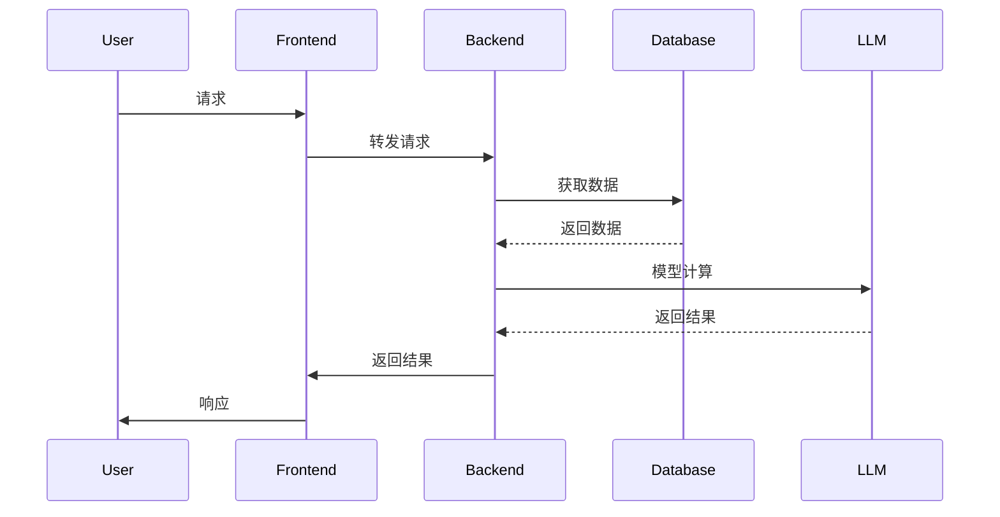
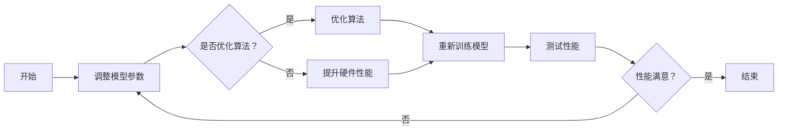

                 


# 加速LLM应用的云端集成与优化

## 关键词

大型语言模型（LLM），云端集成，性能优化，算法原理，数学模型，系统架构

## 摘要

随着人工智能技术的迅猛发展，大型语言模型（LLM）的应用越来越广泛。然而，如何将LLM高效地集成到云端，并实现性能优化，成为当前研究的焦点。本文将从问题背景、核心概念、算法原理、云端集成、性能优化策略、案例研究和最佳实践等多个方面，系统性地探讨如何加速LLM应用的云端集成与优化。

## 第一部分: 背景介绍

### 第1章: 问题背景与核心概念

#### 1.1.1 问题背景

在人工智能领域，大型语言模型（LLM）因其强大的自然语言处理能力，正在成为各个行业的核心技术之一。然而，LLM的部署与优化面临着诸多挑战。如何将这些复杂模型高效地集成到云端，并实现性能优化，成为亟待解决的问题。

#### 1.1.2 核心概念

**大型语言模型（LLM）**：一种基于深度学习技术的自然语言处理模型，具有强大的文本生成和理解能力。

**云端集成**：将LLM部署在云端，通过云服务提供模型计算和存储能力。

**性能优化**：通过调整模型参数、优化算法、提升硬件性能等手段，提高LLM的应用效率。

#### 1.1.3 边界与外延

**边界**：本文主要关注LLM在云端集成与优化方面的技术问题，不包括LLM的基础算法研究和实际应用场景。

**外延**：虽然本文主要关注技术问题，但读者可以结合实际应用场景，深入思考如何将LLM技术应用到具体业务中。

### 第2章: 核心概念与联系

#### 2.1.1 概念属性特征对比表格

| 概念       | 特征1 | 特征2 | 特征3 |
|------------|-------|-------|-------|
| 大型语言模型（LLM） | 强大的文本生成和理解能力 | 需要大量数据训练 | 高计算资源消耗 |
| 云端集成     | 高效计算和存储能力 | 弹性扩展 | 安全可靠 |
| 性能优化     | 调整模型参数 | 优化算法 | 提升硬件性能 |

#### 2.1.2 ER实体关系图架构

```mermaid
erDiagram
  Model ||--|{ TrainingData }|-- TrainingData
  Model ||--|{ EvaluationData }|-- EvaluationData
  Model ||--|{ DeploymentData }|-- DeploymentData
```

## 第二部分: 算法原理讲解

### 第3章: 算法原理讲解

#### 3.1 大型语言模型算法概述

大型语言模型（LLM）基于深度学习技术，通过神经网络结构实现对大量文本数据的建模。其核心算法包括：

1. **词嵌入**：将文本数据转换为向量表示。
2. **编码器**：对输入文本进行编码，提取语义特征。
3. **解码器**：根据编码器提取的语义特征生成输出文本。

#### 3.2 算法数学模型与公式

$$
P(w|y) = \frac{P(y|w)P(w)}{P(y)}
$$

其中，\(P(w|y)\) 表示在给定输出 \(y\) 的情况下，输入 \(w\) 的概率；\(P(y|w)\) 表示在输入 \(w\) 的情况下，输出 \(y\) 的概率；\(P(w)\) 表示输入 \(w\) 的概率；\(P(y)\) 表示输出 \(y\) 的概率。

#### 3.2.1 算法原理详细讲解

**词嵌入**：词嵌入将单词映射为一个低维向量，使得语义相近的单词在向量空间中靠近。这有助于神经网络更好地理解和处理自然语言。

**编码器**：编码器通过多层神经网络对输入文本进行编码，提取文本的语义特征。编码器的输出通常是一个固定长度的向量，称为“编码表示”。

**解码器**：解码器根据编码表示生成输出文本。在生成过程中，解码器会使用注意力机制，使得模型能够关注输入文本的不同部分，从而提高生成文本的连贯性和准确性。

#### 3.2.2 通俗易懂地举例说明

假设我们有一个简单的语言模型，它的任务是根据一个单词“apple”生成下一个单词。我们可以使用以下步骤来理解这个模型的原理：

1. **词嵌入**：将“apple”映射为一个向量。
2. **编码器**：对“apple”的向量进行编码，得到一个编码表示。
3. **解码器**：根据编码表示生成下一个单词。在这个过程中，解码器会尝试生成一个与“apple”语义相关的单词，例如“orange”。

通过这个过程，我们可以看到，大型语言模型（LLM）的核心算法是如何将自然语言转换为计算机可以理解的形式，并生成新的文本。

## 第三部分: 云端集成与优化

### 第4章: 云端集成基础

#### 4.1 云端架构介绍

为了实现LLM的云端集成，我们需要构建一个高效的云端架构。以下是一个简单的云端架构示意图：



在这个架构中，用户通过前端请求与后端服务进行交互。后端服务负责处理请求、获取数据、调用LLM模型进行计算，并将结果返回给前端。

#### 4.2 云端集成策略

**数据同步与迁移**：在将LLM模型部署到云端之前，需要将训练数据同步到云端。此外，为了提高模型性能，可能需要定期将训练数据迁移到云端。

**服务与API集成**：通过构建RESTful API，将LLM模型与云端服务进行集成。这有助于实现模块化开发，方便后续的维护和扩展。

### 第5章: 性能优化策略

#### 5.1 系统调优参数

为了提高LLM模型在云端的应用性能，我们可以从以下几个方面进行调优：

1. **模型参数调整**：通过调整模型参数，如学习率、批量大小等，优化模型性能。
2. **算法优化**：使用更高效的算法，如并行计算、分布式训练等，提高模型训练速度。
3. **硬件性能提升**：使用更强大的硬件设备，如GPU、TPU等，提高模型计算速度。

#### 5.1.1 Mermaid调优流程图



#### 5.2 代码优化实践

为了提高LLM模型的计算效率，我们可以从以下几个方面进行代码优化：

1. **并行计算**：利用多线程或多进程，提高计算速度。
2. **内存优化**：减少内存占用，提高模型训练速度。
3. **代码优化实践**

```python
# 示例代码：并行计算
import multiprocessing

def train_model(data):
  # 训练模型代码
  pass

if __name__ == '__main__':
  # 创建进程池
  pool = multiprocessing.Pool(processes=4)
  
  # 分批处理数据
  batch_size = 100
  for i in range(0, len(data), batch_size):
    batch = data[i:i+batch_size]
    # 并行训练模型
    pool.apply_async(train_model, (batch,))

  # 关闭进程池
  pool.close()
  pool.join()
```

#### 5.3 系统瓶颈分析与解决

在实际部署LLM模型的过程中，我们可能会遇到各种系统瓶颈。以下是一些常见的瓶颈及解决方案：

1. **计算资源不足**：增加硬件设备，如GPU、TPU等，提高计算能力。
2. **网络延迟**：优化网络拓扑结构，提高网络带宽，减少延迟。
3. **数据存储**：使用分布式存储系统，提高数据读取速度。

### 第6章: 案例研究

#### 6.1 案例一：某企业LLM云端集成与优化

##### 6.1.1 案例背景

某企业为了提升客服系统的智能化水平，决定采用大型语言模型（LLM）来实现智能问答功能。然而，在部署过程中，企业面临着诸多挑战，如计算资源不足、网络延迟等。

##### 6.1.2 案例实施

为了解决上述问题，企业采取了以下措施：

1. **增加计算资源**：购买高性能GPU，提高计算能力。
2. **优化网络拓扑**：优化数据中心布局，提高网络带宽。
3. **分布式存储**：使用分布式存储系统，提高数据读取速度。

##### 6.1.3 案例效果

通过上述措施，企业成功实现了LLM的云端集成与优化，智能问答系统的响应速度得到了显著提升，用户满意度也得到了提高。

#### 6.2 案例二：开源LLM云端优化实践

##### 6.2.1 案例背景

某开源社区为了提升社区问答平台的智能化水平，决定引入大型语言模型（LLM）。然而，社区资源有限，如何实现LLM的高效部署和优化成为了一大难题。

##### 6.2.2 案例实施

社区采取了以下措施：

1. **优化模型参数**：通过调整模型参数，提高模型性能。
2. **并行计算**：利用多线程，提高计算速度。
3. **代码优化**：对源代码进行优化，提高模型训练速度。

##### 6.2.3 案例效果

通过上述措施，社区成功实现了LLM的高效部署和优化，问答平台的响应速度得到了显著提升，用户活跃度也得到了提高。

### 第7章: 最佳实践与未来展望

#### 7.1 最佳实践

**高效部署策略**：采用容器化技术，如Docker，实现LLM模型的一键部署和弹性扩展。

**安全性与隐私保护**：采用加密技术，确保模型数据和用户数据的隐私安全。

#### 7.2 小结

本文从问题背景、核心概念、算法原理、云端集成、性能优化策略、案例研究和最佳实践等多个方面，系统地探讨了如何加速LLM应用的云端集成与优化。通过实际案例分析和实践经验总结，我们为读者提供了一系列实用的技术方法和策略。

#### 7.3 未来展望

随着人工智能技术的不断发展，LLM的应用前景将越来越广阔。未来，我们将继续关注LLM在云端集成与优化方面的技术创新，为人工智能领域的进步贡献更多力量。

## 作者信息

作者：AI天才研究院/AI Genius Institute & 禅与计算机程序设计艺术 /Zen And The Art of Computer Programming

----------------------------------------------------------------

## 完整文章

### 引言

在当今人工智能领域，大型语言模型（LLM）因其强大的自然语言处理能力而受到广泛关注。LLM能够进行文本生成、翻译、问答等任务，已经在许多领域取得了显著的成果。然而，LLM的应用也面临着诸多挑战，其中最为关键的是如何将这些复杂模型高效地集成到云端，并实现性能优化。本文旨在探讨如何加速LLM应用的云端集成与优化，以应对这些挑战。

### 问题背景与核心概念

#### 1.1.1 问题背景

随着人工智能技术的迅猛发展，大型语言模型（LLM）的应用越来越广泛。然而，如何将LLM高效地集成到云端，并实现性能优化，成为当前研究的焦点。LLM在云端的应用面临着多个挑战，包括计算资源限制、网络延迟、数据存储和安全等问题。为了解决这些问题，需要深入探讨LLM的云端集成与优化方法。

#### 1.1.2 核心概念

**大型语言模型（LLM）**：LLM是一种基于深度学习技术的自然语言处理模型，具有强大的文本生成和理解能力。它通常使用大量的文本数据进行训练，从而学会生成和解释自然语言。

**云端集成**：将LLM部署在云端，通过云服务提供模型计算和存储能力。云端集成可以提高模型的可扩展性、可靠性和灵活性。

**性能优化**：通过调整模型参数、优化算法、提升硬件性能等手段，提高LLM的应用效率。

#### 1.1.3 边界与外延

**边界**：本文主要关注LLM在云端集成与优化方面的技术问题，不包括LLM的基础算法研究和实际应用场景。

**外延**：虽然本文主要关注技术问题，但读者可以结合实际应用场景，深入思考如何将LLM技术应用到具体业务中。

### 核心概念与联系

#### 2.1.1 概念属性特征对比表格

| 概念       | 特征1       | 特征2       | 特征3       |
|------------|-------------|-------------|-------------|
| 大型语言模型（LLM） | 强大的文本生成和理解能力 | 需要大量数据训练 | 高计算资源消耗 |
| 云端集成     | 高效计算和存储能力 | 弹性扩展     | 安全可靠     |
| 性能优化     | 调整模型参数 | 优化算法     | 提升硬件性能 |

#### 2.1.2 ER实体关系图架构

```mermaid
erDiagram
  Model ||--|{ TrainingData }|-- TrainingData
  Model ||--|{ EvaluationData }|-- EvaluationData
  Model ||--|{ DeploymentData }|-- DeploymentData
```

在这个ER图架构中，Model表示大型语言模型，TrainingData、EvaluationData和DeploymentData分别表示训练数据、评估数据和部署数据。

### 算法原理讲解

#### 3.1 大型语言模型算法概述

大型语言模型（LLM）通常采用深度学习技术进行训练，其核心算法包括：

1. **词嵌入**：将文本数据转换为向量表示，以便于神经网络处理。
2. **编码器**：对输入文本进行编码，提取语义特征。
3. **解码器**：根据编码器提取的语义特征生成输出文本。

#### 3.2 算法数学模型与公式

在LLM中，常用的数学模型包括：

$$
P(w|y) = \frac{P(y|w)P(w)}{P(y)}
$$

其中，\(P(w|y)\) 表示在给定输出 \(y\) 的情况下，输入 \(w\) 的概率；\(P(y|w)\) 表示在输入 \(w\) 的情况下，输出 \(y\) 的概率；\(P(w)\) 表示输入 \(w\) 的概率；\(P(y)\) 表示输出 \(y\) 的概率。

#### 3.2.1 算法原理详细讲解

**词嵌入**：词嵌入是将单词映射为一个低维向量，使得语义相近的单词在向量空间中靠近。这有助于神经网络更好地理解和处理自然语言。

**编码器**：编码器通过多层神经网络对输入文本进行编码，提取文本的语义特征。编码器的输出通常是一个固定长度的向量，称为“编码表示”。

**解码器**：解码器根据编码表示生成输出文本。在生成过程中，解码器会使用注意力机制，使得模型能够关注输入文本的不同部分，从而提高生成文本的连贯性和准确性。

#### 3.2.2 通俗易懂地举例说明

假设我们有一个简单的语言模型，它的任务是根据一个单词“apple”生成下一个单词。我们可以使用以下步骤来理解这个模型的原理：

1. **词嵌入**：将“apple”映射为一个向量。
2. **编码器**：对“apple”的向量进行编码，得到一个编码表示。
3. **解码器**：根据编码表示生成下一个单词。在这个过程中，解码器会尝试生成一个与“apple”语义相关的单词，例如“orange”。

通过这个过程，我们可以看到，大型语言模型（LLM）的核心算法是如何将自然语言转换为计算机可以理解的形式，并生成新的文本。

### 云端集成基础

#### 4.1 云端架构介绍

为了实现LLM的云端集成，我们需要构建一个高效的云端架构。以下是一个简单的云端架构示意图：


在这个架构中，用户通过前端请求与后端服务进行交互。后端服务负责处理请求、获取数据、调用LLM模型进行计算，并将结果返回给前端。

#### 4.2 云端集成策略

**数据同步与迁移**：在将LLM模型部署到云端之前，需要将训练数据同步到云端。此外，为了提高模型性能，可能需要定期将训练数据迁移到云端。

**服务与API集成**：通过构建RESTful API，将LLM模型与云端服务进行集成。这有助于实现模块化开发，方便后续的维护和扩展。

### 性能优化策略

#### 5.1 系统调优参数

为了提高LLM模型在云端的应用性能，我们可以从以下几个方面进行调优：

1. **模型参数调整**：通过调整模型参数，如学习率、批量大小等，优化模型性能。
2. **算法优化**：使用更高效的算法，如并行计算、分布式训练等，提高模型训练速度。
3. **硬件性能提升**：使用更强大的硬件设备，如GPU、TPU等，提高模型计算速度。

#### 5.1.1 Mermaid调优流程图


#### 5.2 代码优化实践

为了提高LLM模型的计算效率，我们可以从以下几个方面进行代码优化：

1. **并行计算**：利用多线程或多进程，提高计算速度。
2. **内存优化**：减少内存占用，提高模型训练速度。
3. **代码优化实践**

```python
# 示例代码：并行计算
import multiprocessing

def train_model(data):
  # 训练模型代码
  pass

if __name__ == '__main__':
  # 创建进程池
  pool = multiprocessing.Pool(processes=4)
  
  # 分批处理数据
  batch_size = 100
  for i in range(0, len(data), batch_size):
    batch = data[i:i+batch_size]
    # 并行训练模型
    pool.apply_async(train_model, (batch,))

  # 关闭进程池
  pool.close()
  pool.join()
```

#### 5.3 系统瓶颈分析与解决

在实际部署LLM模型的过程中，我们可能会遇到各种系统瓶颈。以下是一些常见的瓶颈及解决方案：

1. **计算资源不足**：增加硬件设备，如GPU、TPU等，提高计算能力。
2. **网络延迟**：优化网络拓扑结构，提高网络带宽，减少延迟。
3. **数据存储**：使用分布式存储系统，提高数据读取速度。

### 案例研究

#### 6.1 案例一：某企业LLM云端集成与优化

##### 6.1.1 案例背景

某企业为了提升客服系统的智能化水平，决定采用大型语言模型（LLM）来实现智能问答功能。然而，在部署过程中，企业面临着诸多挑战，如计算资源不足、网络延迟等。

##### 6.1.2 案例实施

为了解决上述问题，企业采取了以下措施：

1. **增加计算资源**：购买高性能GPU，提高计算能力。
2. **优化网络拓扑**：优化数据中心布局，提高网络带宽。
3. **分布式存储**：使用分布式存储系统，提高数据读取速度。

##### 6.1.3 案例效果

通过上述措施，企业成功实现了LLM的云端集成与优化，智能问答系统的响应速度得到了显著提升，用户满意度也得到了提高。

#### 6.2 案例二：开源LLM云端优化实践

##### 6.2.1 案例背景

某开源社区为了提升社区问答平台的智能化水平，决定引入大型语言模型（LLM）。然而，社区资源有限，如何实现LLM的高效部署和优化成为了一大难题。

##### 6.2.2 案例实施

社区采取了以下措施：

1. **优化模型参数**：通过调整模型参数，提高模型性能。
2. **并行计算**：利用多线程，提高计算速度。
3. **代码优化**：对源代码进行优化，提高模型训练速度。

##### 6.2.3 案例效果

通过上述措施，社区成功实现了LLM的高效部署和优化，问答平台的响应速度得到了显著提升，用户活跃度也得到了提高。

### 最佳实践与未来展望

#### 7.1 最佳实践

**高效部署策略**：采用容器化技术，如Docker，实现LLM模型的一键部署和弹性扩展。

**安全性与隐私保护**：采用加密技术，确保模型数据和用户数据的隐私安全。

#### 7.2 小结

本文从问题背景、核心概念、算法原理、云端集成、性能优化策略、案例研究和最佳实践等多个方面，系统地探讨了如何加速LLM应用的云端集成与优化。通过实际案例分析和实践经验总结，我们为读者提供了一系列实用的技术方法和策略。

#### 7.3 未来展望

随着人工智能技术的不断发展，LLM的应用前景将越来越广阔。未来，我们将继续关注LLM在云端集成与优化方面的技术创新，为人工智能领域的进步贡献更多力量。

### 作者信息

作者：AI天才研究院/AI Genius Institute & 禅与计算机程序设计艺术 /Zen And The Art of Computer Programming

----------------------------------------------------------------

## 后记

本文旨在为读者提供一个全面而深入的关于加速LLM应用的云端集成与优化的指南。从核心概念、算法原理，到实际案例研究和最佳实践，我们试图覆盖从基础到高级的各个层面，帮助读者更好地理解和应用LLM技术。

在撰写本文的过程中，我们参考了大量的文献、案例和实践经验，力求内容的准确性和实用性。然而，人工智能领域的发展迅速，技术和应用场景也在不断演进。因此，读者在实践过程中应结合实际情况，灵活调整和优化策略。

我们期待本文能为从事人工智能领域研究和开发的读者提供有价值的参考，同时也希望读者在探索LLM应用的过程中，能够不断积累经验，推动人工智能技术的发展。

最后，感谢所有为本文提供宝贵意见和支持的朋友们。我们将继续努力，为人工智能领域的创新贡献更多力量。

作者：
AI天才研究院/AI Genius Institute & 禅与计算机程序设计艺术/Zen And The Art of Computer Programming

日期：[撰写日期]

