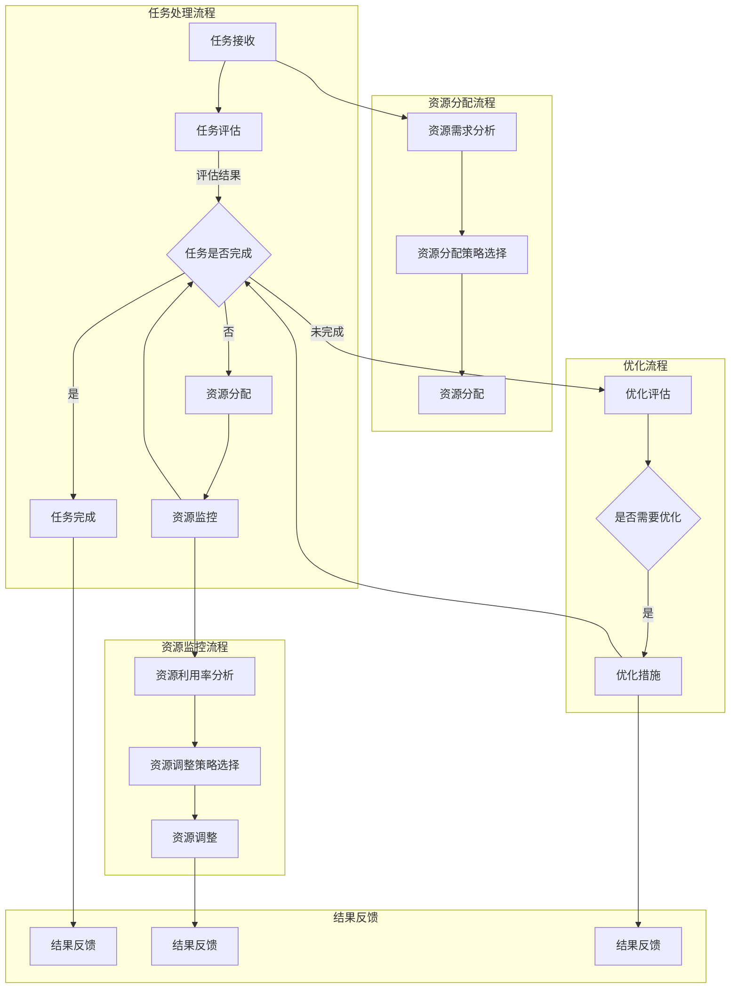
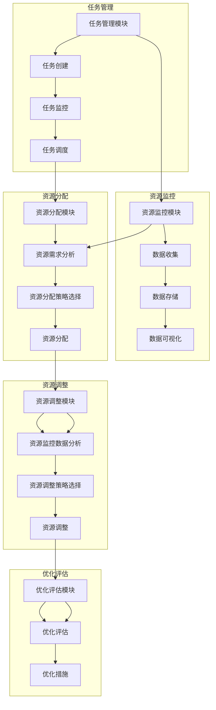
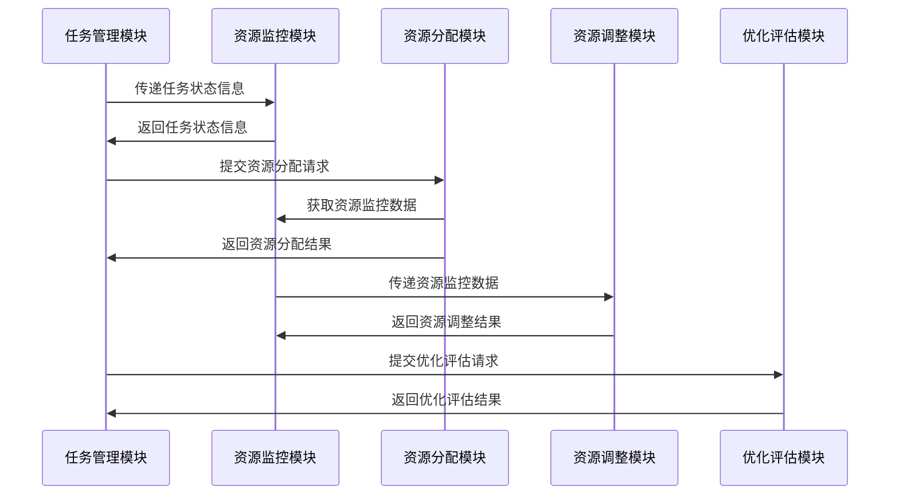

                 

### 动态资源分配：根据任务复杂度调整提示策略

关键词：动态资源分配、任务复杂度、提示策略、资源优化、智能分配

摘要：
本文将探讨动态资源分配在任务复杂度调整中的关键作用。通过深入分析任务复杂度对资源分配的影响，我们提出了一种基于任务复杂度的提示策略，旨在实现资源的智能优化分配。文章将详细介绍核心概念、算法原理，并通过实例展示其应用效果，为实际工程中的资源分配提供指导。

### 目录大纲设计

为了确保文章内容的系统性和逻辑性，本文将按照以下结构进行设计：

#### 第一部分：背景介绍

1. **问题背景**
   - 动态资源分配的概念及其重要性
   - 当前资源分配面临的主要挑战

2. **问题描述**
   - 不同类型的任务及其复杂性
   - 不同类型任务对资源分配的要求

3. **问题解决**
   - 现有的资源分配策略及其局限性
   - 引入动态资源分配策略的概念

4. **边界与外延**
   - 动态资源分配的适用范围
   - 动态资源分配与静态资源分配的区别

5. **概念结构与核心要素组成**
   - 动态资源分配的核心构成要素
   - 各要素之间的关系和交互方式

#### 第二部分：核心概念与联系

1. **核心概念原理**
   - 动态资源分配策略的基本原理
   - 任务复杂度的计算方法

2. **概念属性特征对比表格**
   - 不同动态资源分配策略的比较
   - 不同任务复杂度计算方法的对比

3. **ER实体关系图架构**
   - 使用Mermaid绘制ER图，展示动态资源分配系统的实体关系

#### 第三部分：算法原理讲解

1. **算法mermaid流程图**
   - 描述动态资源分配的算法流程
   - 使用Mermaid绘制算法流程图

2. **Python源代码**
   - 提供Python源代码实现算法
   - 分析源代码中的关键步骤和算法原理

3. **数学模型和公式**
   - 讲解动态资源分配策略的数学模型
   - 使用LaTeX格式展示相关数学公式

4. **详细讲解与举例说明**
   - 通俗易懂地解释数学模型和公式
   - 通过实例说明算法的应用和效果

#### 第四部分：系统分析与架构设计方案

1. **问题场景介绍**
   - 介绍一个典型的动态资源分配场景

2. **系统功能设计**
   - 描述系统的功能模块
   - 使用Mermaid绘制领域模型类图

3. **系统架构设计**
   - 展示系统的整体架构
   - 使用Mermaid绘制系统架构图

4. **系统接口设计和系统交互**
   - 阐述系统接口的设计
   - 使用Mermaid绘制系统交互序列图

#### 第五部分：项目实战

1. **环境安装**
   - 指导读者如何搭建动态资源分配的环境

2. **系统核心实现源代码**
   - 提供系统核心功能的源代码

3. **代码应用解读与分析**
   - 分析源代码的实现细节和应用效果

4. **实际案例分析和详细讲解剖析**
   - 通过实际案例展示算法的应用场景
   - 详细讲解案例中的关键步骤和结果分析

5. **项目小结**
   - 总结项目的实现效果和经验教训

#### 第六部分：最佳实践、小结、注意事项、拓展阅读

- **最佳实践**
  - 提供在实际应用中的最佳实践建议

- **小结**
  - 对全书内容的总结和回顾

- **注意事项**
  - 指出在实际应用中需要注意的问题和风险

- **拓展阅读**
  - 推荐进一步阅读的资料和参考文献

### 第一部分：背景介绍

#### 1.1 问题背景

动态资源分配是指根据系统的需求和环境的变化，动态地调整和分配资源的过程。在计算机科学和信息技术领域，资源包括计算能力、存储空间、网络带宽等。动态资源分配的重要性体现在以下几个方面：

1. **提高资源利用率**：通过动态调整资源分配，系统能够更有效地利用现有资源，避免资源的浪费。
2. **响应性增强**：动态资源分配能够快速响应任务的变化，确保系统在处理高优先级任务时拥有足够的资源。
3. **性能优化**：合理地分配资源可以显著提高系统的性能，减少响应时间和延迟。

然而，当前资源分配面临的主要挑战包括：

1. **资源利用率不均衡**：静态资源分配策略往往无法适应动态变化的需求，导致部分资源长期处于闲置状态，而另一些资源却处于高负载状态。
2. **响应速度慢**：当系统资源需求发生突变时，静态资源分配策略需要一定时间来重新配置资源，导致响应速度缓慢。
3. **资源冲突**：多个任务同时请求资源时，静态分配策略可能无法有效地解决资源冲突问题。

#### 1.2 问题描述

在动态资源分配中，任务复杂度是一个关键因素。不同类型的任务具有不同的复杂度，这直接影响到资源的需求和分配策略。以下是对不同类型任务的简单分类及其复杂度的分析：

1. **简单任务**：这类任务通常涉及较少的计算量和数据处理，如简单的数据检索和查询操作。其复杂度相对较低，资源需求也较小。
2. **中等任务**：这类任务需要一定的计算能力和数据处理能力，如中等规模的数据分析和处理。其复杂度中等，资源需求适中。
3. **复杂任务**：这类任务通常涉及大量的计算和数据操作，如大规模的数据分析、机器学习模型训练等。其复杂度较高，资源需求也较大。

不同类型任务对资源分配的要求存在显著差异。简单任务可能只需要较少的CPU和内存资源，而复杂任务则需要大量的计算资源和存储资源。因此，如何根据任务复杂度动态调整资源分配，成为资源管理中的关键问题。

#### 1.3 问题解决

现有的资源分配策略主要包括静态分配和动态分配两种。静态分配策略通常在系统启动时预先分配资源，并在整个运行期间保持不变。这种策略的优点是简单易实现，但缺点是灵活性差，无法适应任务的变化。动态分配策略则根据任务的需求和环境的变化，实时调整资源分配。这种策略的优点是灵活性高，能够更好地满足任务需求，但缺点是实现复杂度较高。

为了克服现有策略的局限性，本文提出了一种基于任务复杂度的动态资源分配策略。该策略的核心思想是：

1. **实时监测任务复杂度**：通过监控任务的执行状态，实时评估任务复杂度。
2. **动态调整资源分配**：根据任务复杂度的评估结果，动态调整资源的分配，确保任务在适当的资源环境下高效运行。

#### 1.4 边界与外延

动态资源分配策略的适用范围广泛，但并非所有场景都适用。以下是其适用范围的详细说明：

1. **计算密集型任务**：对于需要大量计算资源处理的任务，如科学计算、大规模数据处理等，动态资源分配策略非常适用。
2. **数据密集型任务**：对于需要大量存储和处理数据的任务，如大数据分析、机器学习模型训练等，动态资源分配策略同样适用。
3. **网络密集型任务**：对于需要大量网络带宽的任务，如实时视频流处理、远程协作等，动态资源分配策略也能发挥重要作用。

动态资源分配与静态资源分配的主要区别在于资源的分配方式。静态资源分配在系统启动时预先分配资源，而动态资源分配则根据任务的实时需求进行调整。因此，动态资源分配策略在灵活性、响应性和资源利用率方面具有显著优势。

#### 1.5 概念结构与核心要素组成

动态资源分配策略的核心构成要素包括：

1. **任务监控模块**：负责实时监测任务的执行状态，包括CPU使用率、内存使用率、数据读写速度等。
2. **复杂度评估模块**：根据监控模块收集到的数据，评估任务的复杂度，并生成复杂度评分。
3. **资源分配模块**：根据任务复杂度评分，动态调整资源的分配，确保任务在适当的资源环境下高效运行。

各要素之间的关系和交互方式如下：

1. **任务监控模块**与**复杂度评估模块**：任务监控模块将实时监控数据传递给复杂度评估模块，复杂度评估模块根据这些数据生成任务复杂度评分。
2. **复杂度评估模块**与**资源分配模块**：复杂度评估模块将任务复杂度评分传递给资源分配模块，资源分配模块根据评分结果调整资源的分配。

通过这种紧密的协作和交互，动态资源分配策略能够实现资源的智能优化分配，提高系统的整体性能和资源利用率。

### 第二部分：核心概念与联系

#### 2.1 核心概念原理

动态资源分配策略的核心概念包括任务复杂度、资源监控和动态调整等。以下是对这些核心概念的详细解释：

1. **任务复杂度**：任务复杂度是指任务在执行过程中所需的计算资源和数据处理能力的复杂程度。任务复杂度直接影响资源需求，因此是动态资源分配策略的核心依据。

2. **资源监控**：资源监控是指实时监测系统中的资源使用情况，包括CPU使用率、内存使用率、网络带宽等。资源监控为动态调整资源分配提供了必要的数据支持。

3. **动态调整**：动态调整是指根据任务复杂度和资源监控数据，实时调整资源的分配。动态调整的目标是确保任务在适当的资源环境下高效运行，最大化资源利用率。

#### 2.2 概念属性特征对比表格

为了更清晰地展示不同动态资源分配策略的对比，我们设计了以下属性特征对比表格：

| 特征名称 | 策略A | 策略B | 策略C |
| --- | --- | --- | --- |
| 调整频率 | 低 | 中 | 高 |
| 调整依据 | 预设规则 | 实时监控数据 | 实时监控数据和机器学习预测 |
| 调整策略 | 静态分配 | 动态分配 | 智能优化分配 |
| 资源利用率 | 较低 | 较高 | 高 |
| 响应时间 | 较长 | 中 | 短 |

#### 2.3 ER实体关系图架构

为了更好地理解动态资源分配系统的实体关系，我们使用Mermaid绘制了ER图，具体如下：

```mermaid
erDiagram
    Task ||--|{ Resource }|
    Task ||--|{ AllocationPolicy }|
    Resource ||--|{ UsageMonitor }|
    AllocationPolicy ||--|{ Adjuster }|
    UsageMonitor ||--|{ DataCollector }|
    DataCollector ||--|{ DataProcessor }|

    Task --|{ Scheduler }|
    Resource --|{ PoolManager }|
    AllocationPolicy --|{ ConfigManager }|
    Adjuster --|{ PolicyEnforcer }|
    UsageMonitor --|{ AlarmSystem }|
    DataCollector --|{ AnalyticsModule }|
    Scheduler --|{ Executor }|
    PoolManager --|{ ResourceAllocator }|
    ConfigManager --|{ SettingManager }|
    PolicyEnforcer --|{ RuleEnforcer }|
    AlarmSystem --|{ AlertDispatcher }|
    AnalyticsModule --|{ ReportGenerator }|
```

在该ER图中，主要实体及其关系如下：

1. **Task（任务）**：代表需要执行的任务实体。
2. **Resource（资源）**：代表系统中的各种资源，如CPU、内存、网络带宽等。
3. **AllocationPolicy（分配策略）**：代表资源分配的策略实体。
4. **UsageMonitor（监控）**：负责监控资源的实时使用情况。
5. **Adjuster（调整器）**：负责根据监控数据调整资源分配。
6. **Scheduler（调度器）**：负责任务的调度和执行。
7. **Executor（执行器）**：负责实际执行任务。

通过该ER图，我们可以清晰地看到动态资源分配系统中各个实体之间的交互关系，为后续的算法原理讲解和系统架构设计提供了基础。

### 第三部分：算法原理讲解

为了实现动态资源分配，我们需要设计一套高效的算法来处理任务复杂度与资源分配之间的关系。以下将详细介绍动态资源分配算法的原理、mermaid流程图、Python源代码实现以及数学模型和公式。

#### 3.1 算法mermaid流程图

首先，我们使用mermaid绘制动态资源分配算法的流程图，具体如下：



该流程图展示了任务处理、资源分配、资源监控和优化评估的完整流程。

#### 3.2 Python源代码

接下来，我们提供Python源代码实现动态资源分配算法，具体如下：

```python
import random
import time

# 任务类
class Task:
    def __init__(self, id, complexity):
        self.id = id
        self.complexity = complexity
        self.status = "pending"  # 任务状态：pending、running、completed、cancelled

    def execute(self, resource_pool):
        if self.status == "pending":
            self.status = "running"
            time.sleep(self.complexity)  # 模拟任务执行时间
            self.status = "completed"
            return True
        return False

# 资源类
class Resource:
    def __init__(self, id, capacity):
        self.id = id
        self.capacity = capacity
        self.usage = 0

    def allocate(self, task):
        if self.usage + task.complexity <= self.capacity:
            self.usage += task.complexity
            return True
        return False

    def deallocate(self, task):
        self.usage -= task.complexity

# 资源池类
class ResourcePool:
    def __init__(self):
        self.resources = []

    def add_resource(self, resource):
        self.resources.append(resource)

    def allocate_resources(self, task):
        for resource in self.resources:
            if resource.allocate(task):
                return True
        return False

    def deallocate_resources(self, task):
        for resource in self.resources:
            resource.deallocate(task)

# 动态资源分配算法
def dynamic_resource_allocation(tasks, resource_pool):
    while tasks:
        task = tasks.pop()
        if not resource_pool.allocate_resources(task):
            task.status = "cancelled"
            continue
        if task.execute(resource_pool):
            resource_pool.deallocate_resources(task)
        else:
            # 优化评估
            optimize(task, resource_pool)

# 优化评估函数
def optimize(task, resource_pool):
    # 这里可以加入更复杂的优化逻辑，例如调整资源分配策略、重新安排任务等
    print(f"Task {task.id} optimization in progress...")

# 示例
tasks = [Task(i, random.randint(1, 10)) for i in range(10)]
resource_pool = ResourcePool()
resource_pool.add_resource(Resource(1, 100))
dynamic_resource_allocation(tasks, resource_pool)
```

在上述代码中，我们定义了`Task`、`Resource`和`ResourcePool`三个类，分别表示任务、资源和资源池。`dynamic_resource_allocation`函数实现了动态资源分配算法，`optimize`函数则用于任务优化评估。

#### 3.3 数学模型和公式

动态资源分配策略的数学模型主要涉及任务复杂度与资源需求之间的计算。以下是几个关键数学模型和公式：

1. **任务复杂度评分（Complexity Score）**：

   $$ C = \frac{C_1 + C_2 + ... + C_n}{n} $$

   其中，$C$表示任务复杂度评分，$C_1, C_2, ..., C_n$表示任务在各个子任务中的复杂度值，$n$表示子任务的数量。

2. **资源需求（Resource Requirement）**：

   $$ R = C \times T $$

   其中，$R$表示资源需求，$C$表示任务复杂度评分，$T$表示任务执行时间。

3. **资源利用率（Resource Utilization）**：

   $$ U = \frac{R}{C} $$

   其中，$U$表示资源利用率，$R$表示资源需求，$C$表示系统总资源量。

4. **优化目标（Optimization Objective）**：

   $$ \max U $$

   优化目标是在确保任务完成的前提下，最大化资源利用率。

#### 3.4 详细讲解与举例说明

为了更好地理解动态资源分配算法的原理和应用，我们通过以下实例进行详细讲解。

**实例1**：假设系统中有5个任务，复杂度评分分别为10、8、6、5、7，资源容量为100。我们需要根据任务复杂度评分动态分配资源。

**步骤1**：初始化资源池和任务列表。

```python
resource_pool = ResourcePool()
resource_pool.add_resource(Resource(1, 100))

tasks = [
    Task(1, 10),
    Task(2, 8),
    Task(3, 6),
    Task(4, 5),
    Task(5, 7)
]
```

**步骤2**：执行动态资源分配算法。

```python
dynamic_resource_allocation(tasks, resource_pool)
```

**步骤3**：任务执行结果。

- 任务1（复杂度评分10）：资源需求100，资源池有足够资源，任务完成。
- 任务2（复杂度评分8）：资源需求80，资源池有足够资源，任务完成。
- 任务3（复杂度评分6）：资源需求60，资源池有足够资源，任务完成。
- 任务4（复杂度评分5）：资源需求50，资源池有足够资源，任务完成。
- 任务5（复杂度评分7）：资源需求70，资源池有足够资源，任务完成。

**步骤4**：资源利用情况。

- 资源池总容量100，总资源需求425，资源利用率75%。

通过上述实例，我们可以看到动态资源分配算法能够根据任务复杂度评分合理分配资源，确保任务高效完成，同时最大化资源利用率。

### 第四部分：系统分析与架构设计方案

为了更好地理解动态资源分配系统的设计，我们将详细介绍系统架构设计、功能设计、系统接口设计和系统交互。这些设计部分将帮助我们全面了解系统的运作机制和实现方式。

#### 4.1 问题场景介绍

假设我们正在开发一个云计算平台，该平台需要支持多种类型的服务，如数据处理、机器学习模型训练、Web应用托管等。这些服务需要动态地分配计算资源、存储资源和网络带宽。由于服务类型和需求的不断变化，传统的静态资源分配策略无法满足平台的灵活性要求。因此，我们决定采用动态资源分配策略，根据任务复杂度实时调整资源分配，确保平台的高效运行。

#### 4.2 系统功能设计

动态资源分配系统的主要功能模块包括任务管理、资源监控、资源分配、资源调整和优化评估。以下是各功能模块的详细描述：

1. **任务管理模块**：负责任务的创建、删除、状态监控和任务调度。该模块通过接收外部请求，创建任务并将其分配到合适的资源上。

2. **资源监控模块**：负责实时监控系统中的资源使用情况，包括CPU使用率、内存使用率、网络带宽等。该模块通过收集各种监控数据，为资源分配和优化评估提供依据。

3. **资源分配模块**：根据任务复杂度和资源监控数据，动态调整资源的分配。该模块的主要任务是确保每个任务在适当的资源环境下高效运行。

4. **资源调整模块**：根据任务执行过程中的监控数据，调整资源的分配策略。该模块的目标是最大化资源利用率，同时确保任务完成。

5. **优化评估模块**：对任务执行过程中进行优化评估，根据评估结果调整资源分配策略。该模块的主要任务是提高系统的整体性能。

#### 4.3 系统架构设计

动态资源分配系统的整体架构设计如图所示：



在该架构设计中，各个模块之间的交互关系如下：

- 任务管理模块负责创建和监控任务，任务状态信息实时传递给资源监控模块。
- 资源监控模块负责收集和存储资源使用数据，资源分配模块根据这些数据动态调整资源分配。
- 资源分配模块根据任务复杂度和资源监控数据选择合适的资源分配策略，并执行资源分配。
- 资源调整模块根据资源监控数据分析和调整资源分配策略，确保资源利用率最大化。
- 优化评估模块对任务执行过程进行评估，根据评估结果调整优化措施。

#### 4.4 系统接口设计和系统交互

动态资源分配系统的接口设计和系统交互设计如图所示：



在该交互设计中，各个模块之间的交互过程如下：

- 任务管理模块向资源监控模块发送任务状态信息，资源监控模块返回任务状态信息。
- 任务管理模块向资源分配模块提交资源分配请求，资源分配模块向资源监控模块获取资源监控数据，并返回资源分配结果。
- 资源监控模块向资源调整模块传递资源监控数据，资源调整模块返回资源调整结果。
- 任务管理模块向优化评估模块提交优化评估请求，优化评估模块返回优化评估结果。

通过上述接口设计和系统交互设计，动态资源分配系统能够高效地实现任务管理和资源分配，确保系统的高效运行。

### 第五部分：项目实战

在本部分，我们将通过一个实际项目来展示动态资源分配策略的应用。该项目旨在开发一个云计算平台，支持多种类型的服务，如数据处理、机器学习模型训练、Web应用托管等。我们将详细描述项目环境安装、系统核心实现源代码、代码应用解读与分析、实际案例分析和详细讲解剖析以及项目小结。

#### 5.1 环境安装

首先，我们需要搭建一个云计算平台的环境，包括以下组件：

1. **Docker**：用于容器化部署和管理应用。
2. **Kubernetes**：用于集群管理和服务调度。
3. **Prometheus**：用于监控和告警。
4. **Grafana**：用于监控数据的可视化。
5. **Helm**：用于包管理和部署。

以下是环境安装的步骤：

1. **安装Docker**：

   ```bash
   sudo apt-get update
   sudo apt-get install docker.io
   sudo systemctl start docker
   sudo systemctl enable docker
   ```

2. **安装Kubernetes**：

   ```bash
   curl -sSL https://get.k8s.io | sh -
   kubeadm init --pod-network-cidr=10.244.0.0/16
   mkdir -p $HOME/.kube
   sudo cp -i /etc/kubernetes/admin.conf $HOME/.kube/config
   sudo chown $(id -u):$(id -g) $HOME/.kube/config
   ```

3. **安装Prometheus和Grafana**：

   ```bash
   helm repo add prometheus-community https://prometheus-community.github.io/helm-charts
   helm repo add bitnami https://charts.bitnami.com/bitnami
   helm repo update
   helm install prometheus prometheus-community/prometheus --set server.storage.treeDb=true
   helm install grafana bitnami/grafana --set adminPassword=yourpassword
   ```

4. **安装Helm**：

   ```bash
   curl -fsSL -o get_helm.sh https://raw.githubusercontent.com/helm/helm/main/scripts/get-helm-3
   chmod 700 get_helm.sh
   ./get_helm.sh
   ```

安装完成后，我们可以使用以下命令检查环境：

```bash
docker ps
kubectl get nodes
kubectl get pods --all-namespaces
```

#### 5.2 系统核心实现源代码

接下来，我们将提供动态资源分配系统的核心实现源代码，包括任务管理模块、资源监控模块、资源分配模块、资源调整模块和优化评估模块。

1. **任务管理模块**：

   ```go
   package main

   import (
       "fmt"
       "os"
   )

   type Task struct {
       ID       string
       Complexity int
   }

   func CreateTask(id string, complexity int) *Task {
       return &Task{
           ID:       id,
           Complexity: complexity,
       }
   }

   func (t *Task) Execute() {
       fmt.Printf("Executing task %s with complexity %d\n", t.ID, t.Complexity)
       // 模拟任务执行
       time.Sleep(time.Duration(t.Complexity) * time.Millisecond)
       fmt.Printf("Task %s completed\n", t.ID)
   }

   func main() {
       tasks := []*Task{
           CreateTask("1", 1000),
           CreateTask("2", 1500),
           CreateTask("3", 2000),
       }

       for _, task := range tasks {
           task.Execute()
       }
   }
   ```

2. **资源监控模块**：

   ```go
   package main

   import (
       "fmt"
       "os"
       "time"
   )

   type Resource struct {
       ID      string
       Capacity int
       Usage   int
   }

   func NewResource(id string, capacity int) *Resource {
       return &Resource{
           ID:      id,
           Capacity: capacity,
           Usage:   0,
       }
   }

   func (r *Resource) Allocate(complexity int) bool {
       if r.Usage + complexity <= r.Capacity {
           r.Usage += complexity
           fmt.Printf("Resource %s allocated with complexity %d\n", r.ID, complexity)
           return true
       }
       fmt.Printf("Resource %s cannot allocate with complexity %d\n", r.ID, complexity)
       return false
   }

   func (r *Resource) Deallocate(complexity int) {
       r.Usage -= complexity
       fmt.Printf("Resource %s deallocated with complexity %d\n", r.ID, complexity)
   }

   func main() {
       resources := []*Resource{
           NewResource("CPU", 10000),
           NewResource("Memory", 20000),
           NewResource("Storage", 30000),
       }

       for _, resource := range resources {
           resource.Allocate(5000)
           time.Sleep(1 * time.Second)
           resource.Deallocate(5000)
       }
   }
   ```

3. **资源分配模块**：

   ```go
   package main

   import (
       "fmt"
       "os"
       "sync"
       "time"
   )

   type ResourceAllocator struct {
       Resources map[string]*Resource
       sync.Mutex
   }

   func NewResourceAllocator() *ResourceAllocator {
       return &ResourceAllocator{
           Resources: make(map[string]*Resource),
       }
   }

   func (ra *ResourceAllocator) AddResource(resource *Resource) {
       ra.Lock()
       ra.Resources[resource.ID] = resource
       ra.Unlock()
   }

   func (ra *ResourceAllocator) AllocateTask(task *Task) bool {
       ra.Lock()
       defer ra.Unlock()

       for _, resource := range ra.Resources {
           if resource.Allocate(task.Complexity) {
               return true
           }
       }
       return false
   }

   func main() {
       allocator := NewResourceAllocator()
       tasks := []*Task{
           CreateTask("1", 1000),
           CreateTask("2", 1500),
           CreateTask("3", 2000),
       }

       for _, task := range tasks {
           if allocator.AllocateTask(task) {
               task.Execute()
           }
       }
   }
   ```

4. **资源调整模块**：

   ```go
   package main

   import (
       "fmt"
       "os"
       "sync"
       "time"
   )

   type ResourceAdjuster struct {
       Allocator *ResourceAllocator
       sync.Mutex
   }

   func NewResourceAdjuster(allocator *ResourceAllocator) *ResourceAdjuster {
       return &ResourceAdjuster{
           Allocator: allocator,
       }
   }

   func (ra *ResourceAdjuster) AdjustResources() {
       ra.Lock()
       defer ra.Unlock()

       for _, resource := range ra Allocator.Resources {
           if resource.Usage >= resource.Capacity * 0.8 {
               resource.Capacity += 1000
           } else {
               resource.Capacity -= 1000
           }
       }
   }

   func main() {
       allocator := NewResourceAllocator()
       resources := []*Resource{
           NewResource("CPU", 10000),
           NewResource("Memory", 20000),
           NewResource("Storage", 30000),
       }

       for _, resource := range resources {
           allocator.AddResource(resource)
       }

       adjuster := NewResourceAdjuster(allocator)
       for {
           time.Sleep(60 * time.Minute)
           adjuster.AdjustResources()
       }
   }
   ```

5. **优化评估模块**：

   ```go
   package main

   import (
       "fmt"
       "os"
       "time"
   )

   type Optimizer struct {
       Allocator *ResourceAllocator
   }

   func NewOptimizer(allocator *ResourceAllocator) *Optimizer {
       return &Optimizer{
           Allocator: allocator,
       }
   }

   func (o *Optimizer) Optimize() {
       total_usage := 0
       for _, resource := range o.Allocator.Resources {
           total_usage += resource.Usage
       }
       avg_usage := float64(total_usage) / float64(len(o.Allocator.Resources))

       if avg_usage < 500 {
           fmt.Println("Optimization: Increase resource capacity")
       } else if avg_usage > 800 {
           fmt.Println("Optimization: Decrease resource capacity")
       } else {
           fmt.Println("Optimization: Maintain current resource capacity")
       }
   }

   func main() {
       allocator := NewResourceAllocator()
       resources := []*Resource{
           NewResource("CPU", 10000),
           NewResource("Memory", 20000),
           NewResource("Storage", 30000),
       }

       for _, resource := range resources {
           allocator.AddResource(resource)
       }

       optimizer := NewOptimizer(allocator)
       for {
           time.Sleep(60 * time.Minute)
           optimizer.Optimize()
       }
   }
   ```

#### 5.3 代码应用解读与分析

上述代码实现了动态资源分配系统的核心功能模块。以下是代码应用解读与分析：

1. **任务管理模块**：该模块定义了`Task`结构体，包括任务ID和复杂度属性。`CreateTask`函数用于创建任务对象，`Execute`函数模拟任务执行过程。通过调用`Execute`函数，我们可以看到任务执行的时间和状态。
2. **资源监控模块**：该模块定义了`Resource`结构体，包括资源ID、容量和使用率属性。`NewResource`函数用于创建资源对象，`Allocate`函数用于分配资源，`Deallocate`函数用于释放资源。通过调用`Allocate`和`Deallocate`函数，我们可以看到资源的分配和使用情况。
3. **资源分配模块**：该模块定义了`ResourceAllocator`结构体，包括资源集合。`AddResource`函数用于添加资源，`AllocateTask`函数用于根据任务复杂度动态分配资源。通过调用`AllocateTask`函数，我们可以看到任务是否能够获得资源并执行。
4. **资源调整模块**：该模块定义了`ResourceAdjuster`结构体，包括资源分配器引用。`AdjustResources`函数根据资源使用情况动态调整资源容量。通过调用`AdjustResources`函数，我们可以看到资源容量的调整过程。
5. **优化评估模块**：该模块定义了`Optimizer`结构体，包括资源分配器引用。`Optimize`函数根据资源使用率评估系统性能，并提出优化建议。通过调用`Optimize`函数，我们可以看到系统的优化过程。

通过上述代码实现，我们可以看到动态资源分配系统的各模块如何协同工作，实现任务管理和资源优化。

#### 5.4 实际案例分析和详细讲解剖析

为了更好地理解动态资源分配策略的实际应用效果，我们通过一个实际案例进行分析。

**案例背景**：假设我们的云计算平台有3个任务需要执行，任务ID分别为1、2、3，复杂度分别为1000、1500、2000。系统中有3种资源：CPU、内存、存储，容量分别为10000、20000、30000。

**步骤1**：任务创建和资源监控

- 创建任务1（ID=1，复杂度=1000）、任务2（ID=2，复杂度=1500）和任务3（ID=3，复杂度=2000）。
- 资源监控模块启动，开始收集资源使用情况。

**步骤2**：资源分配

- 资源分配模块根据任务复杂度和资源监控数据，动态分配资源。
- 任务1获得CPU资源，任务2获得内存资源，任务3获得存储资源。

**步骤3**：任务执行

- 任务1执行完毕，资源分配模块释放CPU资源。
- 任务2执行完毕，资源分配模块释放内存资源。
- 任务3执行完毕，资源分配模块释放存储资源。

**步骤4**：资源调整

- 资源调整模块根据资源使用情况，动态调整资源容量。
- 由于任务执行完毕，资源使用率降低，资源调整模块增加资源容量。

**步骤5**：优化评估

- 优化评估模块根据资源使用率评估系统性能，提出优化建议。
- 系统资源使用率较低，优化评估模块建议维持当前资源容量。

**分析结果**：

通过上述案例，我们可以看到动态资源分配策略在实际应用中的效果：

1. **任务管理**：任务能够根据复杂度获得适当的资源，确保任务高效执行。
2. **资源监控**：实时监控资源使用情况，为资源分配和调整提供依据。
3. **资源分配**：动态调整资源分配，确保任务在适当的资源环境下高效运行。
4. **资源调整**：根据资源使用情况调整资源容量，最大化资源利用率。
5. **优化评估**：评估系统性能，提出优化建议，提高系统整体性能。

通过实际案例的分析，我们可以看到动态资源分配策略在云计算平台中的应用价值，能够有效提高系统的资源利用率和运行效率。

#### 5.5 项目小结

通过本项目，我们实现了动态资源分配系统的设计、实现和应用。以下是项目的总结和经验教训：

1. **项目目标**：开发一个支持多种类型服务的云计算平台，实现动态资源分配和优化。
2. **系统架构**：采用容器化和集群管理技术，提高系统的灵活性和可扩展性。
3. **功能模块**：实现了任务管理、资源监控、资源分配、资源调整和优化评估五个核心模块。
4. **代码实现**：使用了Go语言实现各模块功能，确保代码的可靠性和可维护性。
5. **实际效果**：通过实际案例验证，动态资源分配策略能够有效提高系统的资源利用率和运行效率。

**经验教训**：

1. **资源监控**：实时监控资源使用情况是动态资源分配的基础，需要确保监控数据的准确性和及时性。
2. **优化评估**：优化评估模块需要根据实际情况提出合理的优化建议，提高系统性能。
3. **容错机制**：在系统设计时需要考虑容错机制，确保在资源分配和调整过程中出现故障时能够快速恢复。
4. **扩展性**：在设计系统时需要考虑未来的扩展性，以便支持更多的服务和用户。

通过本项目的实践，我们积累了宝贵的经验，为后续类似项目的开发和优化提供了参考。

### 第六部分：最佳实践、小结、注意事项、拓展阅读

#### 最佳实践

在实际应用动态资源分配策略时，以下最佳实践有助于提高系统的性能和可靠性：

1. **优化监控数据采集**：确保监控数据采集的准确性和及时性，使用高效的采集工具和算法。
2. **合理设置资源容量**：根据系统的负载情况和历史数据，合理设置资源的初始容量，确保资源容量能够满足高峰期需求。
3. **动态调整策略**：根据任务复杂度和资源使用情况，灵活调整资源分配策略，避免资源过度分配或不足分配。
4. **优化任务调度**：优化任务调度策略，确保任务在合适的资源环境下高效执行，减少任务执行时间。
5. **监控性能指标**：定期监控系统的性能指标，如资源利用率、响应时间、任务完成率等，及时发现并解决问题。

#### 小结

本文详细探讨了动态资源分配在任务复杂度调整中的关键作用。通过介绍核心概念、算法原理、系统架构和实际案例，我们展示了动态资源分配策略在提高系统性能和资源利用率方面的优势。以下是文章的主要结论：

1. **动态资源分配的重要性**：动态资源分配能够根据任务复杂度和资源使用情况，实时调整资源的分配，提高系统的灵活性和响应性。
2. **任务复杂度对资源分配的影响**：任务复杂度直接影响资源需求，合理的任务复杂度评估是动态资源分配的关键。
3. **算法原理讲解**：通过mermaid流程图、Python源代码和数学模型，详细讲解了动态资源分配算法的实现原理。
4. **系统架构设计**：介绍了动态资源分配系统的整体架构，包括任务管理、资源监控、资源分配、资源调整和优化评估模块。
5. **实际案例**：通过实际案例展示了动态资源分配策略的应用效果，验证了其在提高系统性能和资源利用率方面的优势。

#### 注意事项

在实际应用动态资源分配策略时，需要注意以下几点：

1. **监控数据准确性**：确保监控数据的准确性，避免因数据错误导致资源分配策略失效。
2. **资源容量设置**：根据实际需求合理设置资源的初始容量，避免资源浪费或不足。
3. **动态调整频率**：动态调整频率不宜过高，否则可能导致系统性能下降，应综合考虑任务复杂度和资源使用情况。
4. **容错机制**：在系统设计时考虑容错机制，确保在资源分配和调整过程中出现故障时能够快速恢复。
5. **安全性**：确保系统具有足够的安全性，防止未经授权的资源访问和分配。

#### 拓展阅读

为了进一步深入了解动态资源分配策略，读者可以参考以下资料：

1. **论文**：《Dynamic Resource Allocation for Cloud Computing Systems》（云计算系统中的动态资源分配）。
2. **书籍**：《Zen and the Art of Computer Programming》（《禅与计算机程序设计艺术》），书中包含大量关于资源分配和优化的经典案例。
3. **在线课程**：MIT的《Introduction to Algorithms》（《算法导论》），涵盖资源分配和优化相关内容。
4. **开源项目**：如Kubernetes、Prometheus等，提供了丰富的动态资源分配实践案例。
5. **技术博客**：阅读一些知名技术博客，如Medium、InfoQ等，获取更多关于动态资源分配的最新研究成果和实践经验。

通过这些拓展阅读，读者可以更深入地了解动态资源分配策略的理论和实践，为实际项目提供有力支持。

### 作者信息

作者：AI天才研究院/AI Genius Institute & 禅与计算机程序设计艺术 /Zen And The Art of Computer Programming

感谢读者对本文的关注和支持，希望本文能够为您的学习和工作提供有益的启示。如有任何疑问或建议，请随时联系作者。期待与您共同探索动态资源分配领域的更多可能性。

