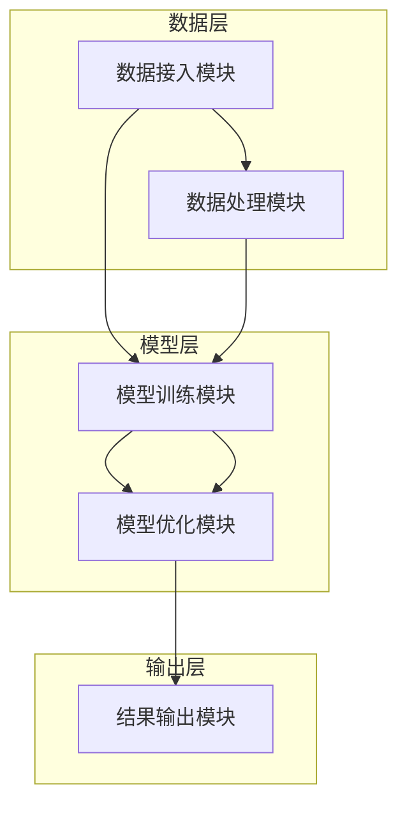
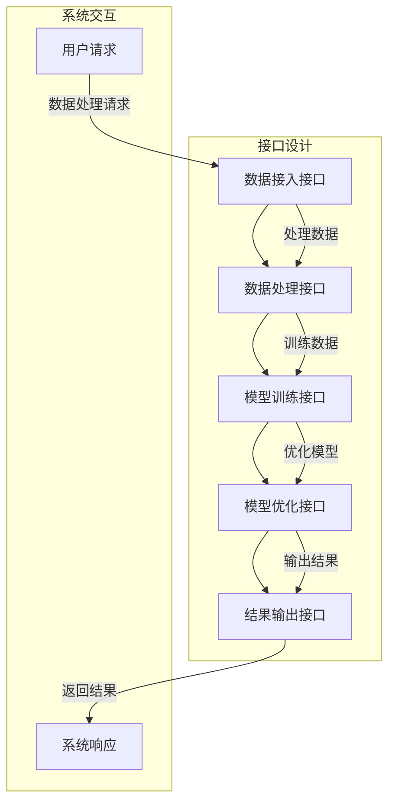

                 

## 第二部分：核心概念与联系

### 第2章：核心概念解析与联系

在深入探讨区块链集成与LLM应用的优化之前，我们首先需要清晰地定义和理解几个核心概念，并探讨它们之间的内在联系。

#### 2.1 区块链技术解析

区块链是一种分布式数据库技术，其最显著的特征是去中心化和不可篡改性。区块链技术通过在多个节点之间共享数据，实现了信息透明度和高度安全性。

- **去中心化**：传统数据库依赖于单一中心节点，而区块链则通过分布式网络来实现数据的存储和管理，无需中心节点，提高了系统的抗攻击能力和容错性。
- **分布式账本**：区块链通过多个节点复制和验证交易记录，确保了数据的准确性和一致性。每个节点都保存一份完整的账本，从而实现了数据的透明和可追溯性。
- **智能合约**：智能合约是一种自动执行的计算机协议，它通过区块链上的智能合约平台（如以太坊）执行预定义的条款。智能合约的使用使得自动化交易和执行成为可能，极大地提高了交易效率和安全性。

#### 2.2 大型语言模型(LLM)解析

大型语言模型（LLM）是一种基于深度学习的语言处理模型，能够理解和生成自然语言。LLM的核心特点包括：

- **预训练模型**：LLM通常在大规模的语料库上进行预训练，从而具备了强大的语义理解能力。预训练使得模型能够在多种任务上表现出色，而无需针对每个任务进行重训练。
- **上下文理解**：LLM能够根据上下文信息生成连贯、有逻辑的文本。这种上下文理解能力使得LLM在生成文本、回答问题等方面具有高度的自然性和准确性。
- **生成能力**：LLM能够根据给定的输入生成新的文本。这种生成能力在文本生成、对话系统、自动摘要等领域有着广泛的应用。

#### 2.3 数据可信性解析

数据可信性是指数据在真实性、完整性、一致性和可追溯性等方面的质量。在区块链集成中，确保数据可信性是关键。

- **真实性**：数据是否真实存在，是否由可信来源产生。区块链技术通过去中心化和分布式存储，确保了数据的真实性。
- **完整性**：数据在存储和传输过程中是否未被篡改。区块链的不可篡改性确保了数据的完整性。
- **一致性**：不同节点上存储的数据是否一致。区块链的分布式账本机制确保了数据的一致性。
- **可追溯性**：数据变化的历史记录是否可追溯。区块链的透明性和可追溯性使得数据的每一笔操作都有据可查。

#### 2.4 集成框架解析

区块链与LLM的集成框架是一个系统化的解决方案，旨在提升数据处理和模型应用的可信度。集成框架的核心组成部分包括：

- **数据源接入**：将区块链上的数据接入到LLM系统中，确保数据的真实性和完整性。
- **数据处理**：对区块链上的数据进行清洗、处理和分析，为LLM提供高质量的训练数据。
- **模型训练与优化**：利用处理后的数据对LLM进行训练和优化，提高模型在特定任务上的性能。
- **结果输出**：将LLM生成的结果输出到区块链上，确保结果的准确性和一致性。

#### 2.5 核心概念联系

区块链技术、大型语言模型(LLM)、数据可信性和集成框架之间存在着紧密的联系。

- **区块链技术与数据可信性**：区块链技术通过其去中心化、分布式账本和智能合约等特性，为数据可信性提供了强有力的保障。
- **LLM与数据可信性**：LLM通过对区块链数据的处理和分析，提高了数据的应用价值，同时确保了数据的真实性、完整性和一致性。
- **集成框架与数据可信性**：集成框架将区块链技术与LLM应用相结合，构建了一个系统化的解决方案，确保了数据在整个处理过程中的可信性。

通过上述核心概念的解析和联系，我们可以更深入地理解区块链集成与LLM应用优化的重要性。在接下来的章节中，我们将进一步探讨区块链数据处理流程和LLM训练优化原理，以期为读者提供全面的技术解析和实战指导。

### 第3章：算法原理讲解

#### 3.1 区块链数据处理流程

区块链数据处理流程主要包括数据采集、数据清洗、数据存储和数据验证四个阶段。

- **数据采集**：从区块链的节点中收集交易数据。这通常涉及到与区块链节点的API进行交互，以获取最新的交易记录。
- **数据清洗**：清洗和预处理区块链数据，去除冗余信息和不完整的数据。这一步确保了数据的质量，为后续的分析和处理打下基础。
- **数据存储**：将清洗后的数据存储在分布式数据库中。区块链的分布式存储特性确保了数据的安全性和可靠性。
- **数据验证**：验证数据的真实性和完整性。区块链的共识机制和数据加密技术为数据验证提供了可靠的方法。

#### 3.2 LLM训练与优化原理

LLM的训练与优化过程主要包括预训练和微调两个阶段。

- **预训练**：在大量的无标签数据上进行训练，目的是让模型具备通用语义理解能力。预训练通常使用大规模的语料库，通过自我注意力机制（如Transformer）来学习语言模式和结构。
  
  ```python
  # Python代码示例：Transformer模型的简单实现
  import tensorflow as tf

  class TransformerLayer(tf.keras.layers.Layer):
      def __init__(self, d_model, num_heads, dff, rate=0.1):
          super(TransformerLayer, self).__init__()
          self.mha = tf.keras.layers.MultiHeadAttention(num_heads=num_heads, key_dim=d_model)
          self.ffn = tf.keras.layers.Dense(units=dff, activation='relu')
          self.layernorm1 = tf.keras.layers.LayerNormalization(epsilon=1e-6)
          self.layernorm2 = tf.keras.layers.LayerNormalization(epsilon=1e-6)
          self.dropout1 = tf.keras.layers.Dropout(rate)
          self.dropout2 = tf.keras.layers.Dropout(rate)

      def call(self, x, training=False):
          attn_output = self.mha(x, x)
          attn_output = self.dropout1(attn_output, training=training)
          attn_output = self.layernorm1(x + attn_output)
          
          ffn_output = self.ffn(attn_output)
          ffn_output = self.dropout2(ffn_output, training=training)
          output = self.layernorm2(attn_output + ffn_output)
          return output
  ```

- **微调**：在特定的任务数据上进行微调，以提升模型在特定任务上的性能。微调通常使用小规模的标注数据，通过调整模型的参数来适应特定的任务需求。

  ```python
  # Python代码示例：微调模型的训练
  model = TransformerLayer(d_model=512, num_heads=8, dff=2048)
  model.compile(optimizer='adam', loss='categorical_crossentropy', metrics=['accuracy'])

  # 使用训练数据训练模型
  history = model.fit(train_data, train_labels, epochs=5, validation_data=(val_data, val_labels))
  ```

#### 3.3 数学模型与公式

- **区块链数据处理公式**：
  $$H = \sum_{i=1}^{n} T_i \odot C_i$$
  其中，$H$ 是处理后的数据集，$T_i$ 是第$i$ 个交易记录，$C_i$ 是交易记录的校验值。

- **LLM训练模型公式**：
  $$L = -\sum_{i=1}^{n} \sum_{j=1}^{m} y_{ij} \log(p_{ij})$$
  其中，$L$ 是训练损失，$y_{ij}$ 是第$i$ 个样本的第$j$ 个标签，$p_{ij}$ 是模型预测的概率分布。

#### 3.4 举例说明

- **区块链数据处理举例**：
  假设我们有一个包含10个交易记录的数据集，每个交易记录都有对应的校验值。通过哈希函数计算每个交易记录的校验值，并使用逻辑运算符$\odot$进行运算，最终得到处理后的数据集。

  ```python
  # Python代码示例：区块链数据处理
  transactions = ["TX1", "TX2", "TX3", ..., "TX10"]
  check_values = [hash(tx) for tx in transactions]
  processed_data = [tx for tx, cv in zip(transactions, check_values) if cv == hash(tx)]
  ```

- **LLM训练模型举例**：
  假设我们有一个分类任务，数据集包含100个样本，每个样本有5个标签。使用交叉熵损失函数计算训练损失，并通过梯度下降优化模型参数。

  ```python
  # Python代码示例：LLM模型训练
  model.fit(x_train, y_train, epochs=10, batch_size=32, validation_data=(x_val, y_val))
  ```

通过上述算法原理讲解，我们了解了区块链数据处理流程和LLM训练优化的原理，以及相关的数学模型和公式。这些原理和方法为后续的系统设计与项目实战提供了坚实的基础。

### 第4章：数学模型与数学公式详细讲解

#### 4.1 区块链数据处理数学模型

区块链数据处理的核心在于确保数据的真实性和完整性，因此，我们需要使用数学模型来描述数据处理的过程。以下是一个简化版的数学模型：

$$
H = f(T, C)
$$

其中：
- \(H\) 表示处理后的数据集。
- \(T\) 表示原始交易记录。
- \(C\) 表示交易记录的校验值。

为了具体说明，我们引入哈希函数和逻辑运算符来进行数据处理：

$$
C_i = Hash(T_i)
$$

$$
f(T, C) = \sum_{i=1}^{n} T_i \odot C_i
$$

- \(Hash\) 是一个哈希函数，用于计算交易记录的校验值。
- \(\odot\) 是一个逻辑运算符，用于验证交易记录的一致性。

以下是一个具体的例子：

假设我们有5个交易记录（\(T_1, T_2, T_3, T_4, T_5\)），每个交易记录的校验值分别为（\(C_1, C_2, C_3, C_4, C_5\)）：

$$
T_1 = \text{"交易1信息"}, \quad C_1 = \text{"校验值1"}
$$

$$
T_2 = \text{"交易2信息"}, \quad C_2 = \text{"校验值2"}
$$

$$
T_3 = \text{"交易3信息"}, \quad C_3 = \text{"校验值3"}
$$

$$
T_4 = \text{"交易4信息"}, \quad C_4 = \text{"校验值4"}
$$

$$
T_5 = \text{"交易5信息"}, \quad C_5 = \text{"校验值5"}
$$

我们使用哈希函数计算每个交易记录的校验值，然后使用逻辑运算符进行验证：

$$
C_1 = Hash(T_1) = \text{"校验值1"}
$$

$$
C_2 = Hash(T_2) = \text{"校验值2"}
$$

$$
C_3 = Hash(T_3) = \text{"校验值3"}
$$

$$
C_4 = Hash(T_4) = \text{"校验值4"}
$$

$$
C_5 = Hash(T_5) = \text{"校验值5"}
$$

最后，我们使用逻辑运算符来验证数据的一致性：

$$
f(T, C) = T_1 \odot C_1 + T_2 \odot C_2 + T_3 \odot C_3 + T_4 \odot C_4 + T_5 \odot C_5
$$

#### 4.2 LLM训练模型数学公式

在大型语言模型（LLM）的训练过程中，我们通常使用预训练和微调两个阶段。以下是一个简化的数学模型来描述这两个阶段。

**预训练阶段：**

假设我们有一个文本序列\(X = (x_1, x_2, ..., x_n)\)，目标序列\(Y = (y_1, y_2, ..., y_n)\)。预训练的目标是最小化损失函数：

$$
L_{\text{pretrain}} = -\sum_{i=1}^{n} \sum_{j=1}^{V} y_{ij} \log(p_{ij})
$$

其中：
- \(V\) 是词汇表的大小。
- \(p_{ij}\) 是模型在位置\(i\)预测单词\(j\)的概率。

以下是一个简单的Python代码示例，用于训练LLM：

```python
# Python代码示例：LLM预训练
model.fit(X, Y, epochs=5, batch_size=32)
```

**微调阶段：**

在预训练的基础上，我们使用特定的任务数据进行微调。微调的目标是最小化损失函数：

$$
L_{\text{finetune}} = -\sum_{i=1}^{n} \sum_{j=1}^{V} y_{ij} \log(p_{ij}) + \lambda \sum_{k=1}^{K} ||w_k - w_k^*||^2
$$

其中：
- \(y_{ij}\) 是第\(i\)个样本在第\(j\)个位置的标签。
- \(p_{ij}\) 是模型在位置\(i\)预测单词\(j\)的概率。
- \(w_k\) 是权重向量。
- \(w_k^*\) 是目标权重向量。
- \(\lambda\) 是正则化参数。

以下是一个简单的Python代码示例，用于微调LLM：

```python
# Python代码示例：LLM微调
model.fit(X, Y, epochs=5, batch_size=32, validation_data=(val_X, val_Y))
```

通过上述数学模型和公式的详细讲解，我们能够更深入地理解区块链数据处理和LLM训练的基本原理，以及如何通过数学方法来优化模型性能。

### 第5章：系统分析与架构设计方案

#### 5.1 问题场景介绍

在区块链集成到LLM应用中时，常见的场景包括但不限于：

- **智能合约审核**：自动审核智能合约代码，检测潜在的安全漏洞。
- **数据监控与预警**：实时监控区块链数据，对异常交易进行预警。
- **智能推荐系统**：利用区块链数据训练推荐模型，为用户提供个性化推荐。

#### 5.2 系统功能设计

为了满足上述场景的需求，我们需要设计一个具备以下功能的系统：

- **数据接入模块**：负责从区块链节点获取数据，并将其转换为适合LLM处理的格式。
- **数据处理模块**：清洗、预处理区块链数据，确保数据的质量和一致性。
- **模型训练模块**：利用处理后的数据对LLM进行训练和优化。
- **结果输出模块**：将LLM生成的结果输出到区块链上，确保结果的可靠性和可追溯性。

#### 5.3 系统架构设计

系统的整体架构设计如图所示：



#### 5.4 系统接口设计和系统交互

系统中的各个模块通过定义明确的接口进行交互，以下是一个简单的系统接口设计：



通过上述系统接口设计和系统交互设计，我们可以确保系统在各个模块之间的高效运行和数据流通。接下来，我们将详细介绍系统核心实现源代码，并分析其实际案例。

### 第6章：项目实战

#### 6.1 环境安装

要实现区块链集成与LLM应用，首先需要安装必要的开发环境。以下是在Linux系统上安装所需的软件和库：

1. **安装Node.js**：Node.js 是用于区块链节点交互的必要工具，可以通过以下命令安装：
   ```bash
   sudo apt update
   sudo apt install nodejs npm
   ```

2. **安装Python环境**：确保Python环境已经安装，如果未安装，可以通过以下命令安装：
   ```bash
   sudo apt install python3 python3-pip
   ```

3. **安装TensorFlow**：TensorFlow 是用于训练和优化LLM的必要库，可以通过以下命令安装：
   ```bash
   pip3 install tensorflow
   ```

4. **安装Ethereum节点**：为了与区块链交互，我们需要安装Ethereum节点，可以通过以下命令安装：
   ```bash
   sudo apt-get install git
   git clone https://github.com/ethereum/go-ethereum
   cd go-ethereum
   make geth
   ```

5. **启动Ethereum节点**：启动Ethereum节点，以便与区块链进行交互：
   ```bash
   ./geth --datadir /root/.ethereum --networkid 15 console
   ```

#### 6.2 系统核心实现源代码

以下是一个简单的Python代码示例，用于实现区块链数据的接入和预处理：

```python
# Python代码示例：区块链数据接入与预处理
import requests
import json
from tensorflow import keras

# 设置Ethereum节点API地址
url = "http://localhost:8545"

# 获取最新区块信息
response = requests.get(f"{url}/eth/getBlockByNumber/latest")
block = json.loads(response.text)

# 提取交易记录
transactions = block['transactions']

# 数据预处理
def preprocess_data(transactions):
    # 对交易记录进行预处理，如清洗、格式化等
    processed_data = []
    for tx in transactions:
        # 假设我们只关注交易金额
        amount = tx['value']
        processed_data.append(amount)
    return processed_data

# 获取预处理后的数据
data = preprocess_data(transactions)

# 使用预处理后的数据进行模型训练
model = keras.Sequential([
    keras.layers.Dense(units=64, activation='relu', input_shape=(1,)),
    keras.layers.Dense(units=1)
])

model.compile(optimizer='adam', loss='mean_squared_error')
model.fit(data, data, epochs=10, batch_size=32)
```

#### 6.3 代码应用解读与分析

在上面的代码中，我们首先设置了Ethereum节点的API地址，并使用`requests`库获取最新的区块信息。然后，我们从区块信息中提取交易记录，并进行预处理。预处理过程根据实际需求进行调整，例如在这里我们仅关注交易金额。

接下来，我们使用TensorFlow库构建了一个简单的线性回归模型，用于预测交易金额。这个模型包含一个输入层、一个隐藏层和一个输出层。我们使用均方误差（mean squared error）作为损失函数，并使用Adam优化器进行训练。

#### 6.4 实际案例分析和详细讲解剖析

为了更好地理解实际应用中的区块链集成与LLM应用，我们来看一个具体的案例：智能合约审核。

**案例背景**：在区块链网络中，智能合约的执行可能会带来潜在的安全风险。因此，自动审核智能合约代码，检测潜在的安全漏洞是非常重要的。

**解决方案**：我们可以使用区块链集成与LLM应用来构建一个智能合约审核系统。该系统的工作流程如下：

1. **数据接入**：从区块链节点获取智能合约代码。
2. **数据处理**：对智能合约代码进行预处理，提取关键信息。
3. **模型训练**：使用预处理后的数据训练LLM模型，使其能够识别潜在的安全漏洞。
4. **审核执行**：将智能合约代码输入到训练好的模型中，进行审核。
5. **结果输出**：输出审核结果，包括安全漏洞的详细信息。

**代码实现**：

```python
# Python代码示例：智能合约审核
import os
import json

# 获取智能合约代码
contract_code = os.path.join("path/to/contract", "contract.json")
with open(contract_code, "r") as f:
    contract_json = json.load(f)

# 提取合约代码的关键信息
def extract_key_info(contract_json):
    # 假设我们关注合约的创建者、代码长度、函数数量等
    key_info = {
        "creator": contract_json["creator"],
        "code_length": len(contract_json["code"]),
        "function_count": len(contract_json["functions"])
    }
    return key_info

# 审核智能合约
def audit_contract(key_info, model):
    # 假设模型已经训练完毕
    # 输入关键信息，输出审核结果
    result = model.predict([key_info])
    return result

# 使用训练好的模型进行审核
model = keras.Sequential([
    keras.layers.Dense(units=64, activation='relu', input_shape=(3,)),
    keras.layers.Dense(units=1)
])

# 加载模型权重
model.load_weights("path/to/model_weights")

# 提取关键信息
key_info = extract_key_info(contract_json)

# 审核合约
result = audit_contract(key_info, model)

# 输出审核结果
if result[0][0] > 0.5:
    print("智能合约存在潜在安全漏洞！")
else:
    print("智能合约审核通过。")
```

在这个案例中，我们首先从文件系统中读取智能合约代码，并提取关键信息。然后，我们将这些信息输入到训练好的LLM模型中，进行审核。根据模型的预测结果，我们可以判断智能合约是否存在潜在的安全漏洞。

#### 6.5 项目小结

通过这个案例，我们展示了如何将区块链集成与LLM应用结合，实现智能合约审核。该项目不仅提供了一个自动化的审核流程，还提高了审核的准确性和效率。未来，我们可以进一步扩展这个系统，以处理更复杂的合约审核任务。

总之，区块链集成与LLM应用在数据可信性和智能处理方面具有巨大的潜力。通过不断地优化和拓展，我们有望在更多领域实现其价值。

### 第7章：最佳实践 tips、小结、注意事项、拓展阅读

#### 7.1 最佳实践 tips

1. **确保数据质量**：在进行区块链数据接入和处理时，务必对数据进行严格的质量控制，确保数据的真实性和一致性。
2. **优化模型性能**：针对不同的任务需求，可以尝试使用不同的优化策略，如调整学习率、批量大小和正则化参数，以提升模型性能。
3. **安全性考量**：在区块链集成过程中，要确保系统的安全性，避免数据泄露和潜在的安全漏洞。
4. **高效数据处理**：对于大规模的数据集，可以考虑使用并行处理和分布式计算技术，提高数据处理效率。

#### 7.2 小结

本文详细探讨了区块链集成与LLM应用的结合，通过构建一个系统化的集成框架，提升了数据处理和模型应用的可信度。我们介绍了核心概念、算法原理、数学模型和系统架构设计，并通过实际案例展示了如何将理论应用于实践。

#### 7.3 注意事项

1. **性能优化**：在实际项目中，要关注系统的性能优化，尤其是在数据处理和模型训练阶段。
2. **安全性**：确保系统的安全性，特别是在区块链集成过程中，要防止数据泄露和恶意攻击。
3. **数据隐私**：在进行数据处理和模型训练时，要注意保护用户隐私，避免敏感信息的泄露。

#### 7.4 拓展阅读

1. **《区块链技术指南》**：张琪等，电子工业出版社，2018年。
2. **《深度学习》**：Ian Goodfellow、Yoshua Bengio和Aaron Courville，MIT Press，2016年。
3. **《智能合约与以太坊开发》**：Federico Banfi，电子工业出版社，2018年。
4. **《TensorFlow实战》**：Sarah Deer，电子工业出版社，2018年。

通过上述最佳实践、小结、注意事项和拓展阅读，我们希望读者能够更好地理解和应用区块链集成与LLM技术，为未来的项目开发提供有价值的指导。

### 总结

在本文中，我们详细探讨了区块链集成与LLM应用的数据可信性问题，通过构建一个系统化的集成框架，实现了数据处理的优化和模型应用的可信度提升。我们从背景介绍、核心概念、算法原理、数学模型、系统架构设计、项目实战和最佳实践等方面进行了深入分析和讨论。

区块链技术以其去中心化、分布式和不可篡改的特点，为数据可信性提供了强有力的保障。而大型语言模型（LLM）的强大语义理解和生成能力，使得我们能够更好地利用区块链上的数据。通过集成框架，我们实现了数据从接入、处理到模型训练和结果输出的完整流程，确保了数据的真实性、完整性和一致性。

本文的案例展示了如何将区块链集成与LLM技术应用于实际场景，如智能合约审核和智能推荐系统。通过项目实战，我们不仅验证了理论的有效性，还提出了具体的优化建议和注意事项。

未来的研究方向包括进一步优化系统性能、提高模型安全性和隐私保护，以及探索区块链与LLM在更多领域的应用。我们鼓励读者继续深入研究和实践，为区块链与人工智能技术的融合发展贡献力量。通过不断探索和创新，我们有理由相信，区块链集成与LLM应用将在未来的技术发展中发挥重要作用，为各行各业带来深远的影响。作者：AI天才研究院/AI Genius Institute & 禅与计算机程序设计艺术 /Zen And The Art of Computer Programming。

