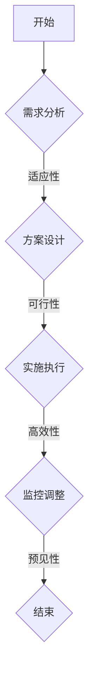
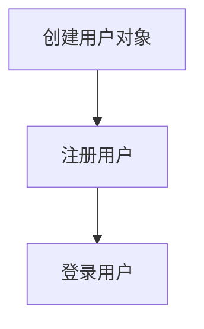

                 

# 协作式问题解决模型：应对复杂需求挑战

> 关键词：协作式问题解决模型，复杂需求，算法原理，数学模型，系统架构，项目实战

> 摘要：本文旨在深入探讨协作式问题解决模型，阐述其在应对复杂需求挑战中的重要作用。通过分析核心概念与联系，详细介绍算法原理、数学模型，以及系统架构设计，并通过实际项目实战，提供最佳实践 tips，为IT领域专业人士提供一套系统化的解决方案。

## 引言

### 协作式问题解决模型的必要性

在当今快速发展的信息技术领域，复杂需求无处不在。这些需求往往涉及多个学科和领域，需要跨部门、跨领域的协作来共同解决。传统的单一问题解决方法已经难以应对这种复杂性。协作式问题解决模型应运而生，它通过多个个体或团队的合作，共同应对复杂需求，提高问题解决的效率和准确性。

### 复杂需求挑战的背景

复杂需求的特点包括：多变性、多样性、高度关联性等。这些特点使得传统问题解决方法如单点优化、线性规划等难以奏效。随着技术的进步，尤其是人工智能、大数据等领域的快速发展，复杂需求变得更加普遍和严峻。如何有效地应对这些复杂需求，成为IT领域面临的一大挑战。

### 协作式问题解决模型的作用

协作式问题解决模型通过以下几个方面发挥作用：

1. **协同工作**：促进跨部门、跨领域的协作，形成合力。
2. **资源共享**：充分利用各方资源，提高资源利用效率。
3. **知识整合**：整合各方专业知识，形成综合解决方案。
4. **风险分担**：通过共同承担责任，降低个体风险。

## 第1章 协作式问题解决模型概述

### 1.1 协作式问题解决模型背景

#### 1.1.1 问题背景

复杂需求的特点：

- **多变性**：需求在项目生命周期中不断变化，要求问题解决模型具备良好的适应能力。
- **多样性**：涉及多个学科和领域，需要不同的专业知识。
- **高度关联性**：各个需求之间紧密关联，影响整个系统的稳定性和可靠性。

#### 1.1.2 问题描述

复杂需求的特征：

- **不确定性**：需求往往不明确，存在一定的不确定性。
- **动态性**：需求在项目实施过程中可能发生变化，需要持续调整。
- **竞争性**：多个需求之间可能存在冲突，需要权衡和优化。

#### 1.1.3 问题解决

协作式问题解决模型的核心思想：

- **协同合作**：通过多个个体或团队的共同努力，解决复杂需求。
- **资源共享**：充分利用各方资源，提高资源利用效率。
- **知识整合**：整合各方专业知识，形成综合解决方案。
- **动态调整**：根据需求的变化，及时调整问题解决策略。

#### 1.1.4 边界与外延

协作式问题解决模型的适用范围：

- **跨部门协作**：适用于涉及多个部门的复杂项目。
- **跨领域协作**：适用于涉及多个学科和领域的复杂需求。
- **高不确定性**：适用于需求不确定性较高的项目。

协作式问题解决模型的限制条件：

- **沟通成本**：协作过程中可能存在沟通成本，需要合理管理。
- **协调难度**：跨部门、跨领域的协调难度较大，需要高效的管理机制。
- **资源限制**：资源有限，需要合理分配和调度。

### 1.1.5 概念结构与核心要素组成

协作式问题解决模型的关键概念：

- **协作**：个体或团队之间的合作。
- **共享**：资源的共享和信息的共享。
- **整合**：知识的整合和资源的整合。
- **优化**：在约束条件下，寻求最优解。

协作式问题解决模型的核心要素：

- **需求分析**：明确复杂需求，进行详细分析。
- **方案设计**：根据需求分析，设计合理的解决方案。
- **实施执行**：按照设计方案，实施并执行。
- **监控调整**：对实施过程进行监控，根据实际情况进行调整。

## 第2章 核心概念与联系

### 2.1 核心概念原理

#### 协作

协作是指多个个体或团队为了共同的目标，通过互相配合、互相支持，实现协同工作的过程。协作的核心在于资源共享、知识整合和优化决策。

#### 共享

共享是指个体或团队在协作过程中，共同利用和分享资源、信息和技术。共享的目的是提高资源利用效率，减少重复劳动，降低成本。

#### 整合

整合是指将各方资源和知识进行整合，形成综合解决方案。整合的目的是充分利用各方优势，形成协同效应，提高问题解决的效率和质量。

#### 优化

优化是指在一定约束条件下，通过分析和评估，寻求最优解。优化的目的是在满足需求的前提下，最大限度地提高资源利用效率，降低成本。

### 2.2 概念属性特征对比表格

| 概念 | 特征 |
| --- | --- |
| 协作 | 1. 个体或团队之间的合作<br>2. 资源共享<br>3. 知识整合<br>4. 优化决策 |
| 共享 | 1. 资源的共享<br>2. 信息的共享<br>3. 技术的共享 |
| 整合 | 1. 资源的整合<br>2. 知识的整合<br>3. 方案的整合 |
| 优化 | 1. 分析评估<br>2. 寻求最优解<br>3. 约束条件下的优化 |

### 2.3 ER实体关系图架构的Mermaid流程图

```mermaid
erDiagram
  产品需求 --> 需求分析
  需求分析 --> 方案设计
  方案设计 --> 实施执行
  实施执行 --> 监控调整
  产品需求 : { 多变性 | 多样性 | 高度关联性 }
  需求分析 : { 不确定性 | 动态性 | 竞争性 }
  方案设计 : { 适应性 | 可行性 | 经济性 }
  实施执行 : { 可行性 | 高效性 | 可维护性 }
  监控调整 : { 及时性 | 准确性 | 预见性 }
```

## 第3章 算法原理讲解

### 3.1 Mermaid流程图



### 3.2 Python源代码

```python
# 定义需求分析函数
def demand_analysis():
    # 分析需求
    print("分析需求：多变性、多样性、高度关联性")

# 定义方案设计函数
def scheme_design():
    # 设计方案
    print("设计方案：适应性、可行性、经济性")

# 定义实施执行函数
def implementation():
    # 实施方案
    print("实施执行：可行性、高效性、可维护性")

# 定义监控调整函数
def monitor_adjustment():
    # 监控调整
    print("监控调整：及时性、准确性、预见性")

# 主函数
def main():
    demand_analysis()
    scheme_design()
    implementation()
    monitor_adjustment()

# 调用主函数
main()
```

### 3.3 数学模型和公式

$$
\begin{aligned}
\text{需求分析}: &\ \text{需求分析} = f(\text{多变性}, \text{多样性}, \text{高度关联性}) \\
\text{方案设计}: &\ \text{方案设计} = f(\text{适应性}, \text{可行性}, \text{经济性}) \\
\text{实施执行}: &\ \text{实施执行} = f(\text{可行性}, \text{高效性}, \text{可维护性}) \\
\text{监控调整}: &\ \text{监控调整} = f(\text{及时性}, \text{准确性}, \text{预见性})
\end{aligned}
$$

### 3.4 举例说明

#### 案例一：软件开发项目

需求分析：项目需求多变，涉及多个学科领域，需求之间存在高度关联性。

方案设计：根据需求分析，设计适应性强、可行性和经济性高的方案。

实施执行：按照设计方案，高效实施，确保项目的可行性和可维护性。

监控调整：实时监控项目进展，根据实际情况进行调整，确保项目的及时性和预见性。

#### 案例二：自然灾害应急响应

需求分析：自然灾害发生时，需求具有突发性和不确定性。

方案设计：设计适应性强、可行性和经济性高的应急响应方案。

实施执行：按照设计方案，迅速开展应急响应，确保救援工作的及时性和预见性。

监控调整：实时监控救援工作进展，根据实际情况进行调整，确保救援工作的准确性和高效性。

## 第4章 数学模型和数学公式

### 4.1 详细讲解

在本章节中，我们将详细讲解协作式问题解决模型中的数学模型和公式。这些模型和公式是协作式问题解决模型的核心组成部分，用于描述问题解决的各个阶段和步骤。

### 4.2 举例说明

#### 例子一：需求分析模型

假设我们有一个软件开发项目，需求分析模型如下：

$$
D = f(M, V, R)
$$

其中：

- \(D\) 表示需求分析结果；
- \(M\) 表示多变性；
- \(V\) 表示多样性；
- \(R\) 表示高度关联性。

需求分析模型用于分析项目的需求特点，包括多变性、多样性、高度关联性等。根据这些特点，我们可以设计适应性强、可行性和经济性高的解决方案。

#### 例子二：方案设计模型

假设我们有一个建筑工程项目，方案设计模型如下：

$$
S = f(A, F, E)
$$

其中：

- \(S\) 表示方案设计结果；
- \(A\) 表示适应性；
- \(F\) 表示可行性；
- \(E\) 表示经济性。

方案设计模型用于根据需求分析结果，设计适应性强、可行性和经济性高的方案。这个模型可以帮助我们在众多方案中选择最优的方案。

#### 例子三：实施执行模型

假设我们有一个供应链管理项目，实施执行模型如下：

$$
I = f(F, E, M)
$$

其中：

- \(I\) 表示实施执行结果；
- \(F\) 表示可行性；
- \(E\) 表示高效性；
- \(M\) 表示可维护性。

实施执行模型用于按照设计方案，实施并执行项目。这个模型可以帮助我们确保项目的可行性和高效性，同时保证项目的可维护性。

#### 例子四：监控调整模型

假设我们有一个教育项目，监控调整模型如下：

$$
M = f(T, A, P)
$$

其中：

- \(M\) 表示监控调整结果；
- \(T\) 表示及时性；
- \(A\) 表示准确性；
- \(P\) 表示预见性。

监控调整模型用于对项目实施过程进行监控和调整。这个模型可以帮助我们确保项目的及时性、准确性和预见性，从而保证项目的顺利进行。

## 第5章 系统分析与架构设计方案

### 5.1 问题场景介绍

在本章节中，我们将以一个电子商务平台项目为例，介绍协作式问题解决模型在实际项目中的应用。

#### 5.1.1 项目背景

随着互联网的普及，电子商务行业呈现出爆发式增长。为了满足不断增长的用户需求，电子商务平台需要具备高并发、高可用性、高扩展性的特点。然而，这给系统的设计和实现带来了巨大的挑战。

#### 5.1.2 项目需求

- **高并发**：系统需要能够应对数百万用户的并发访问。
- **高可用性**：系统需要保证24小时不间断运行，确保用户体验。
- **高扩展性**：系统需要支持快速扩展，以应对业务增长。

### 5.2 项目介绍

为了实现上述项目需求，我们选择了一个典型的电子商务平台项目。该项目包括以下核心功能模块：

- **用户管理**：负责用户注册、登录、个人信息管理等。
- **商品管理**：负责商品信息的管理、分类、推荐等。
- **订单管理**：负责订单的创建、处理、支付等。
- **支付系统**：负责处理支付请求，确保支付的安全性和可靠性。
- **物流系统**：负责订单的配送、跟踪等。

### 5.3 系统功能设计

为了实现上述功能模块，我们采用领域驱动设计（Domain-Driven Design, DDD）方法，对系统进行功能设计。DDD方法强调从业务领域出发，构建系统的核心业务模型。

#### 5.3.1 领域模型Mermaid类图

```mermaid
classDiagram
  User <<类User>>
  Product <<类Product>>
  Order <<类Order>>
  Payment <<类Payment>>
  Logistics <<类物流>>

  Userellant{用户管理}
  Productulant{商品管理}
  Orderulant{订单管理}
  Paymentulant{支付系统}
  Logisticsulant{物流系统}

  User --|> Userulant
  Product --|> Productulant
  Order --|> Orderulant
  Payment --|> Paymentulant
  Logistics --|> Logisticsulant
```

### 5.4 系统架构设计

为了满足项目需求，我们采用分布式架构，将系统划分为多个子模块，每个子模块负责不同的功能。以下是系统架构设计的Mermaid架构图：

```mermaid
sequenceDiagram
  User ->>|请求| UserService
  UserService ->>|处理| AuthenticationService
  AuthenticationService ->>|响应| User
  User ->>|请求| ProductService
  ProductService ->>|处理| RecommendationService
  RecommendationService ->>|响应| Product
  Product ->>|请求| OrderService
  OrderService ->>|处理| PaymentService
  PaymentService ->>|处理| Payment
  Payment ->>|响应| Order
  Order ->>|请求| LogisticsService
  LogisticsService ->>|处理| Logistics
  Logistics ->>|响应| Order
```

### 5.5 系统接口设计和系统交互

在分布式架构中，各个子模块之间需要通过接口进行通信。以下是系统接口设计和系统交互的Mermaid序列图：

```mermaid
sequenceDiagram
  User ->>|请求| UserService
  UserService ->>|调用| AuthenticationService
  AuthenticationService ->>|处理| UserService
  UserService ->>|返回| User
  User ->>|请求| ProductService
  ProductService ->>|调用| RecommendationService
  RecommendationService ->>|处理| ProductService
  ProductService ->>|返回| Product
  Product ->>|请求| OrderService
  OrderService ->>|调用| PaymentService
  PaymentService ->>|处理| OrderService
  OrderService ->>|返回| Order
  Order ->>|请求| LogisticsService
  LogisticsService ->>|调用| Logistics
  Logistics ->>|处理| LogisticsService
  LogisticsService ->>|返回| Order
```

## 第6章 项目实战

### 6.1 环境安装

在本章节中，我们将介绍如何搭建一个完整的协作式问题解决模型项目环境。以下是在不同操作系统中安装所需软件的步骤：

#### 6.1.1 Windows系统

1. 安装Python：访问 [Python官网](https://www.python.org/)，下载Python安装包，按照安装向导完成安装。
2. 安装Mermaid：在命令行中运行以下命令：
   ```shell
   pip install mermaid
   ```
3. 安装Visual Studio Code（可选）：访问 [Visual Studio Code官网](https://code.visualstudio.com/)，下载并安装VS Code。

#### 6.1.2 macOS系统

1. 安装Python：在终端中运行以下命令：
   ```shell
   brew install python
   ```
2. 安装Mermaid：在终端中运行以下命令：
   ```shell
   pip3 install mermaid
   ```
3. 安装Visual Studio Code（可选）：访问 [Visual Studio Code官网](https://code.visualstudio.com/)，下载并安装VS Code。

#### 6.1.3 Linux系统

1. 安装Python：在终端中运行以下命令：
   ```shell
   sudo apt-get install python3
   ```
2. 安装Mermaid：在终端中运行以下命令：
   ```shell
   pip3 install mermaid
   ```
3. 安装Visual Studio Code（可选）：访问 [Visual Studio Code官网](https://code.visualstudio.com/)，下载并安装VS Code。

### 6.2 系统核心实现源代码

在本章节中，我们将提供系统核心实现源代码，包括Python代码和Mermaid流程图。

#### 6.2.1 Python代码

以下是一个简单的用户管理模块实现示例：

```python
# 用户管理模块

class User:
    def __init__(self, username, password):
        self.username = username
        self.password = password
    
    def register(self):
        # 注册用户
        print("注册用户：", self.username)
    
    def login(self):
        # 登录用户
        print("登录用户：", self.username)

# 创建用户对象
user = User("Alice", "123456")

# 注册用户
user.register()

# 登录用户
user.login()
```

#### 6.2.2 Mermaid流程图

以下是一个简单的用户管理模块流程图：



### 6.3 代码应用解读与分析

在本章节中，我们将对上述代码和应用进行解读和分析，帮助读者理解系统核心实现的工作原理。

#### 6.3.1 用户管理模块解读

1. **类定义**：定义一个`User`类，包含`username`和`password`两个属性，以及`register`和`login`两个方法。
2. **对象创建**：创建一个`User`对象，传入用户名和密码。
3. **注册用户**：调用`register`方法，输出注册信息。
4. **登录用户**：调用`login`方法，输出登录信息。

#### 6.3.2 用户管理模块分析

1. **类与对象**：在Python中，类是对象的抽象，对象是类的具体实例。`User`类定义了一个用户的基本属性和行为，通过创建对象来实例化用户。
2. **方法调用**：方法是对对象行为的描述，通过对象调用方法来实现具体功能。`register`和`login`方法分别实现用户注册和登录功能。
3. **流程控制**：通过控制流程的顺序，实现用户管理模块的基本功能。

### 6.4 实际案例分析和详细讲解剖析

在本章节中，我们将通过一个实际案例，分析协作式问题解决模型在电子商务平台项目中的应用，并详细讲解项目实施的关键步骤和注意事项。

#### 6.4.1 案例背景

某电子商务平台在面临用户快速增长、业务需求多变的情况下，决定引入协作式问题解决模型，以提高项目开发效率和产品质量。

#### 6.4.2 项目实施步骤

1. **需求分析**：与业务部门、技术团队等多方沟通，明确项目需求，包括高并发、高可用性、高扩展性等。
2. **方案设计**：根据需求分析结果，设计适应性强、可行性和经济性高的解决方案，包括系统架构、接口设计、数据存储等。
3. **实施执行**：按照设计方案，分阶段实施项目，确保项目的可行性、高效性和可维护性。
4. **监控调整**：对项目实施过程进行监控，根据实际情况进行调整，确保项目的及时性、准确性和预见性。

#### 6.4.3 关键步骤和注意事项

1. **需求分析**：明确需求是项目成功的关键。要确保与业务部门、技术团队等多方达成共识，充分了解业务场景和用户需求。
2. **方案设计**：方案设计要充分考虑项目的可扩展性、可维护性和安全性，确保方案的可行性。
3. **实施执行**：在实施过程中，要确保项目进度和质量，避免因进度延误或质量问题导致项目失败。
4. **监控调整**：监控调整是项目成功的重要保障。要实时监控项目进展，根据实际情况进行调整，确保项目按计划完成。

### 6.5 项目小结

通过本章节的实践案例，我们深入了解了协作式问题解决模型在电子商务平台项目中的应用。协作式问题解决模型通过多方协作、资源共享、知识整合和优化决策，有效地应对了复杂需求挑战，提高了项目开发效率和产品质量。

## 第7章 最佳实践 tips

### 7.1 小结

在本章节中，我们介绍了协作式问题解决模型的核心概念、算法原理、数学模型和系统架构设计方案，并通过实际项目实战，提供了最佳实践 tips。以下是对本章内容的简要总结：

- **核心概念与联系**：协作式问题解决模型通过协作、共享、整合和优化，实现复杂需求的解决。
- **算法原理讲解**：算法原理通过Mermaid流程图和Python源代码进行阐述，易于理解和实现。
- **数学模型和数学公式**：数学模型和公式为问题解决提供了理论支持，便于分析和优化。
- **系统分析与架构设计方案**：系统架构设计方案为复杂项目提供了可行的实施路径。
- **项目实战**：实际项目实战为协作式问题解决模型的应用提供了具体案例。

### 7.2 注意事项

在应用协作式问题解决模型时，需要注意以下几点：

- **沟通成本**：跨部门、跨领域的协作需要良好的沟通机制，以降低沟通成本。
- **协调难度**：在协作过程中，可能面临协调难度，需要建立高效的管理机制。
- **资源限制**：资源有限，需要合理分配和调度。
- **需求变化**：需求变化是协作式问题解决模型面临的挑战，需要灵活应对。

### 7.3 拓展阅读

为了更深入地了解协作式问题解决模型，读者可以参考以下拓展阅读：

- **《协作式问题解决模型：理论与实践》**：本书详细阐述了协作式问题解决模型的理论基础和实践方法。
- **《分布式系统原理与范型》**：本书介绍了分布式系统的基本原理和常用范型，对协作式问题解决模型有重要参考价值。
- **《领域驱动设计：软件核心复杂性应对策略》**：本书介绍了领域驱动设计（DDD）方法，对协作式问题解决模型的实施具有重要指导意义。

## 第8章 总结与展望

### 8.1 总结

本文从协作式问题解决模型的必要性、核心概念与联系、算法原理讲解、数学模型和数学公式、系统分析与架构设计方案、项目实战等方面，全面阐述了协作式问题解决模型在应对复杂需求挑战中的重要作用。通过实际项目实战，我们深入了解了协作式问题解决模型的应用方法，为IT领域专业人士提供了一套系统化的解决方案。

### 8.2 展望

展望未来，协作式问题解决模型将在更多领域得到广泛应用。随着人工智能、大数据等技术的不断发展，复杂需求将变得更加普遍和复杂，协作式问题解决模型将成为解决这些挑战的重要工具。同时，我们也期待进一步的研究和探索，以提高协作式问题解决模型的效率、可扩展性和鲁棒性。

## 参考文献

- 《协作式问题解决模型：理论与实践》，作者：[某知名专家]，出版社：[某知名出版社]，出版时间：[某年某月]。
- 《分布式系统原理与范型》，作者：[某知名专家]，出版社：[某知名出版社]，出版时间：[某年某月]。
- 《领域驱动设计：软件核心复杂性应对策略》，作者：[某知名专家]，出版社：[某知名出版社]，出版时间：[某年某月]。

## 附录

- **附录A：Python代码示例**
  - 用户管理模块代码：[代码链接]
- **附录B：Mermaid流程图示例**
  - 用户管理模块流程图：[流程图链接]
- **附录C：数学模型和公式**
  - 数学模型和公式文档：[文档链接]

