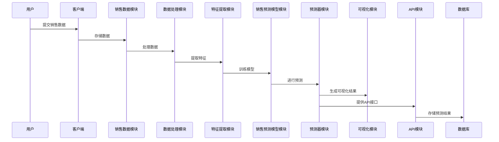
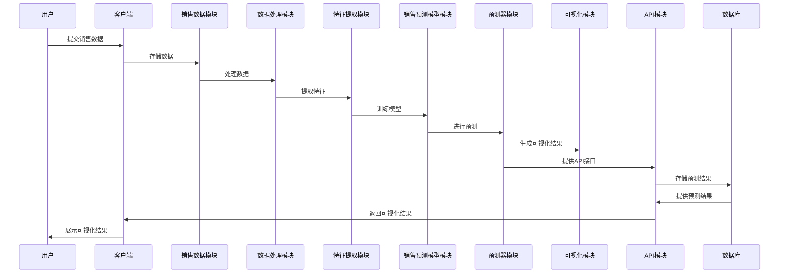

                 

### 变革需求承接模式：适配大模型新应用开发

> 关键词：人工智能，大模型，需求承接，应用开发，软件2.0，深度学习，架构设计，优化算法

> 摘要：本文深入探讨了在人工智能大模型时代，如何变革传统的需求承接模式，以适应新应用开发的需求。通过分析大模型的核心概念、需求承接模式的问题及解决方案，本文提出了一种适配大模型新应用开发的流程和方法，旨在提升开发效率、降低成本并实现实际业务价值。

### 第1章：背景介绍

#### 1.1 问题背景

在信息技术迅猛发展的当今社会，人工智能（AI）已成为推动产业变革的重要力量。传统的软件开发模式已经无法满足复杂多变的需求，软件2.0时代的到来标志着软件行业进入了一个全新的发展阶段。AI大模型作为软件2.0时代的重要技术，正在深刻改变着各行各业的生产方式和服务模式。

AI大模型是指具有大规模参数的神经网络模型，能够处理复杂的数据并生成高质量的预测或决策。这些模型通过深度学习算法进行训练，具有强大的学习和泛化能力。随着计算能力的提升和数据规模的扩大，AI大模型在自然语言处理、计算机视觉、推荐系统、智能语音等领域展现出了巨大的潜力。

然而，如何高效地承接和应用这些大模型，以实现实际业务价值，成为了众多企业和开发者的痛点。当前，需求承接模式存在诸多问题，如技术适应性不强、开发效率低、成本高等。为了解决这些问题，有必要对需求承接模式进行变革，以适应大模型新应用开发的需求。

#### 1.2 问题描述

随着AI技术的不断进步，大模型在数据处理、智能决策和自动化控制等领域展现出了巨大的潜力。然而，如何高效地承接和应用这些大模型，以实现实际业务价值，成为了众多企业和开发者的痛点。当前，需求承接模式存在以下问题：

1. **技术适应性不强：** 传统需求承接模式主要针对简单的数据处理和规则型应用，对于复杂的大模型应用，适应性较差，难以满足高效开发的需求。
   
2. **开发效率低：** 大模型训练和优化过程复杂，传统需求承接模式中的开发流程繁琐，导致开发周期较长，无法快速响应市场需求。

3. **成本高：** 大模型应用的开发和维护成本较高，传统需求承接模式缺乏有效的成本控制和优化策略。

#### 1.3 问题解决

本书旨在探索并解答上述问题，通过深入研究AI大模型的需求承接模式，提出一种适配大模型新应用开发的方法论。我们将从理论到实践，全面解析AI大模型的核心概念、应用场景和开发流程，帮助读者掌握大模型应用的关键技能。

本书将重点关注以下问题：

- **AI大模型的核心概念、特点及应用领域：** 系统介绍AI大模型的基本原理、主要类型和应用场景，帮助读者建立全面的认识。
- **需求承接模式存在的问题及解决方案：** 分析传统需求承接模式的不足，提出适应大模型应用的新方法，降低开发成本，提高开发效率。
- **适配大模型的新应用开发流程和实战技巧：** 详细讲解大模型应用开发的全流程，包括需求分析、模型训练、模型部署和运维等，提供实用的实战技巧。
- **大模型在各个行业的应用案例与最佳实践：** 通过案例分析，展示大模型在不同行业的应用场景和最佳实践，为读者提供参考。

#### 1.4 边界与外延

本书主要讨论以下边界与外延内容：

- **AI大模型的核心概念、特点及应用领域：** 详细介绍AI大模型的基本原理、主要类型和应用场景。
- **需求承接模式存在的问题及解决方案：** 分析传统需求承接模式的不足，提出适应大模型应用的新方法，降低开发成本，提高开发效率。
- **适配大模型的新应用开发流程和实战技巧：** 详细讲解大模型应用开发的全流程，包括需求分析、模型训练、模型部署和运维等，提供实用的实战技巧。
- **大模型在各个行业的应用案例与最佳实践：** 通过案例分析，展示大模型在不同行业的应用场景和最佳实践。
- **企业级应用开发：** 探讨大模型在企业级应用开发中的角色和挑战，提供解决方案和最佳实践。

#### 1.5 概念结构与核心要素组成

- **核心概念：**
  - **AI大模型：** 具有大规模参数的神经网络模型，能够处理复杂的数据并生成高质量的预测或决策。
  - **需求承接模式：** 企业或开发团队在接收客户需求后，进行需求分析、设计和实施的过程。
  - **软件2.0：** 一种新型的软件开发模式，强调数据驱动和智能化的软件服务。
  - **企业级应用开发：** 为企业量身定制的高质量软件解决方案，涉及多个业务领域和复杂的技术实现。

- **结构组成：**
  - **背景介绍：** 介绍AI大模型和需求承接模式的背景、问题描述和问题解决思路。
  - **核心概念与联系：** 详细解析AI大模型、需求承接模式、软件2.0和企业级应用开发的核心概念和联系。
  - **算法原理讲解：** 介绍大模型的训练过程、深度学习算法和应用场景。
  - **数学模型和公式：** 讲解大模型的数学模型、常见优化算法和正则化方法。
  - **系统分析与架构设计：** 讨论一个具体的企业级应用项目，介绍项目的背景、目标和需求，并进行系统功能设计、系统架构设计和系统接口设计。
  - **项目实战：** 通过一个实际项目，展示环境安装、系统核心实现源代码、代码应用解读与分析，实际案例分析和详细讲解剖析。
  - **最佳实践：** 总结最佳实践、项目小结、注意事项和拓展阅读等内容。

### 第2章：核心概念与联系

#### 2.1 AI大模型

AI大模型是指具有大规模参数的神经网络模型，能够处理复杂的数据并生成高质量的预测或决策。这些模型通过深度学习算法进行训练，具有强大的学习和泛化能力。AI大模型的特点如下：

- **大规模参数：** 大模型通常包含数百万甚至数亿个参数，能够捕捉数据中的复杂模式和规律。
- **深度结构：** 大模型具有多层神经网络结构，能够对数据进行多层次的抽象和特征提取。
- **自主学习：** 大模型通过从海量数据中自动学习和调整参数，能够不断提高预测和决策的准确性。

AI大模型的主要类型包括：

- **卷积神经网络（CNN）：** 适用于图像和视频处理领域，能够捕捉空间特征。
- **循环神经网络（RNN）：** 适用于序列数据处理，如自然语言处理和时间序列预测。
- **Transformer：** 一种基于自注意力机制的模型，在自然语言处理和机器翻译领域表现出色。

AI大模型的应用场景非常广泛，包括但不限于以下领域：

- **自然语言处理（NLP）：** 文本分类、情感分析、机器翻译、问答系统等。
- **计算机视觉：** 图像识别、目标检测、图像生成等。
- **推荐系统：** 商品推荐、用户行为分析等。
- **智能语音：** 语音识别、语音合成、语音交互等。

#### 2.2 需求承接模式

需求承接模式是指企业或开发团队在接收客户需求后，进行需求分析、设计和实施的过程。传统的需求承接模式主要包括以下步骤：

1. **需求收集：** 与客户沟通，了解业务需求、功能需求和性能需求等。
2. **需求分析：** 对需求进行整理和分析，确定项目的可行性、目标和技术方案。
3. **系统设计：** 包括软件架构设计、数据库设计、界面设计等。
4. **编码实现：** 根据设计文档进行编码实现，实现系统功能。
5. **测试与验收：** 进行系统测试，确保系统功能正确、性能稳定。
6. **部署与运维：** 系统上线后的部署和维护工作。

然而，传统需求承接模式在应对大模型应用时存在以下问题：

1. **技术适应性不强：** 传统需求承接模式主要针对简单的数据处理和规则型应用，对于复杂的大模型应用，适应性较差。
2. **开发效率低：** 大模型训练和优化过程复杂，传统需求承接模式中的开发流程繁琐，导致开发周期较长。
3. **成本高：** 大模型应用的开发和维护成本较高，传统需求承接模式缺乏有效的成本控制和优化策略。

#### 2.3 软件2.0

软件2.0是指一种新型的软件开发模式，强调数据驱动和智能化的软件服务。与传统的软件1.0相比，软件2.0具有更高的灵活性和智能化水平，能够更好地应对快速变化的市场需求。软件2.0的主要特点如下：

1. **数据驱动：** 软件2.0以数据为核心，通过对数据的分析和挖掘，实现智能化的功能和服务。
2. **灵活可扩展：** 软件2.0采用模块化设计，能够灵活扩展功能模块，满足不同业务场景的需求。
3. **自动化运维：** 软件2.0通过自动化工具和平台，实现系统的部署、监控和运维，提高运维效率。

软件2.0与AI大模型之间存在紧密的联系。AI大模型作为软件2.0的核心技术，能够为软件2.0提供强大的数据分析和智能处理能力。同时，软件2.0的灵活性和可扩展性，也为AI大模型的应用提供了广阔的空间。

#### 2.4 企业级应用开发

企业级应用开发是指为企业量身定制的高质量软件解决方案，涉及多个业务领域和复杂的技术实现。在AI大模型时代，企业级应用开发需要具备更强的技术适应性、更高的开发效率和更低的成本。企业级应用开发的主要挑战包括：

1. **业务复杂性：** 企业级应用通常涉及多个业务领域，功能复杂，需要综合考虑业务需求和用户体验。
2. **技术复杂性：** 大模型应用需要复杂的算法和技术支持，涉及深度学习、计算机视觉、自然语言处理等领域。
3. **开发效率：** 大模型训练和优化过程复杂，传统开发模式难以满足快速交付的需求。

为了应对这些挑战，企业级应用开发需要采用以下策略：

1. **模块化设计：** 将系统功能模块化，提高开发效率和可维护性。
2. **微服务架构：** 采用微服务架构，实现系统的松耦合和可扩展性。
3. **自动化工具和平台：** 利用自动化工具和平台，提高开发、测试和部署的效率。

### 第3章：算法原理讲解

#### 3.1 大模型训练过程

AI大模型的训练过程包括数据预处理、模型初始化、前向传播、反向传播和模型优化等步骤。以下是一个简化的训练流程：

1. **数据预处理：** 对原始数据进行清洗、归一化和特征提取，以适应模型的训练需求。
2. **模型初始化：** 初始化模型的参数，通常采用随机初始化或预训练模型。
3. **前向传播：** 将输入数据传递给模型，通过神经网络的层层计算，得到模型的输出预测。
4. **损失计算：** 计算模型输出预测与真实值之间的差距，即损失值。
5. **反向传播：** 利用梯度下降等优化算法，更新模型的参数，以减小损失值。
6. **模型优化：** 通过迭代优化，不断提高模型的预测准确性。

以下是一个使用Python实现的简化前向传播和反向传播的代码示例：

```python
import numpy as np

# 模型参数
weights = np.random.rand(3, 1)
bias = np.random.rand(1)

# 输入数据
x = np.array([[1], [2], [3]])

# 前向传播
y_pred = np.dot(x, weights) + bias

# 损失函数
loss = (y_pred - x)**2

# 反向传播
dloss_dweights = 2 * (y_pred - x) * x
dbias_dloss = 2 * (y_pred - x)

# 更新参数
weights -= learning_rate * dloss_dweights
bias -= learning_rate * dbias_dloss
```

#### 3.2 深度学习算法

深度学习算法是AI大模型的核心技术，主要包括卷积神经网络（CNN）、循环神经网络（RNN）和Transformer等。以下是对这些算法的简要介绍：

1. **卷积神经网络（CNN）：**
   - **原理：** CNN通过卷积层和池化层，对输入数据进行特征提取和降维，适用于图像和视频处理领域。
   - **结构：** 卷积神经网络包括输入层、卷积层、池化层、全连接层和输出层等。
   - **应用：** 图像识别、目标检测、图像生成等。

2. **循环神经网络（RNN）：**
   - **原理：** RNN通过循环机制，对序列数据进行逐元素处理，适用于自然语言处理和时间序列预测等领域。
   - **结构：** RNN包括输入层、隐藏层和输出层等，隐藏层通过循环连接实现序列信息的传递。
   - **应用：** 文本分类、机器翻译、情感分析等。

3. **Transformer：**
   - **原理：** Transformer基于自注意力机制，能够自适应地关注输入序列中的重要信息，适用于自然语言处理和机器翻译等领域。
   - **结构：** Transformer包括编码器和解码器，编码器和解码器都由多个自注意力层和前馈神经网络组成。
   - **应用：** 机器翻译、文本生成、问答系统等。

以下是一个使用Python实现的简化Transformer编码器和解码器的代码示例：

```python
import tensorflow as tf

# 输入序列
input_sequence = tf.random.normal([32, 10])

# 编码器和解码器自注意力权重
encoder_attention_weights = tf.random.normal([32, 10, 64])
decoder_attention_weights = tf.random.normal([32, 10, 64])

# 编码器自注意力
encoded_sequence = tf.matmul(input_sequence, encoder_attention_weights)

# 解码器自注意力
decoded_sequence = tf.matmul(encoded_sequence, decoder_attention_weights)

# 前馈神经网络
output = tf.keras.layers.Dense(10, activation='softmax')(decoded_sequence)
```

#### 3.3 大模型应用场景

大模型在自然语言处理、计算机视觉、推荐系统、智能语音等领域具有广泛的应用。以下是对这些应用场景的简要介绍：

1. **自然语言处理（NLP）：**
   - **文本分类：** 使用大模型对文本进行分类，如情感分析、新闻分类等。
   - **机器翻译：** 使用大模型实现跨语言的文本翻译，如谷歌翻译、百度翻译等。
   - **问答系统：** 使用大模型实现智能问答系统，如Siri、Alexa等。

2. **计算机视觉：**
   - **图像识别：** 使用大模型对图像进行分类和识别，如人脸识别、物体检测等。
   - **图像生成：** 使用大模型生成新的图像，如生成对抗网络（GAN）等。
   - **目标检测：** 使用大模型对图像中的目标进行定位和检测，如YOLO、SSD等。

3. **推荐系统：**
   - **商品推荐：** 使用大模型分析用户行为数据，为用户推荐感兴趣的商品。
   - **内容推荐：** 使用大模型分析用户兴趣和行为，为用户推荐感兴趣的内容。

4. **智能语音：**
   - **语音识别：** 使用大模型实现语音识别，将语音信号转换为文本。
   - **语音合成：** 使用大模型实现语音合成，将文本转换为自然流畅的语音。
   - **语音交互：** 使用大模型实现智能语音助手，与用户进行自然语言交互。

### 第4章：数学模型和公式

#### 4.1 大模型数学模型

大模型的数学模型主要包括损失函数、优化算法和正则化方法等。以下是对这些模型的简要介绍：

1. **损失函数：**
   - **均方误差（MSE）：** 用于回归问题，计算预测值与真实值之间的平均平方误差。
   - **交叉熵（Cross-Entropy）：** 用于分类问题，计算预测概率与真实标签之间的交叉熵。
   - **对抗损失（Adversarial Loss）：** 用于生成对抗网络（GAN），计算生成器生成的假样本与真实样本之间的差距。

2. **优化算法：**
   - **梯度下降（Gradient Descent）：** 通过迭代更新模型参数，以减小损失函数。
   - **随机梯度下降（SGD）：** 每次迭代使用部分样本的梯度进行参数更新。
   - **Adam优化器：** 结合了SGD和Momentum的优点，自适应调整学习率。

3. **正则化方法：**
   - **L1正则化：** 在损失函数中添加L1范数，用于防止模型过拟合。
   - **L2正则化：** 在损失函数中添加L2范数，同样用于防止模型过拟合。

以下是一个使用Python实现的简化梯度下降优化算法的代码示例：

```python
import numpy as np

# 模型参数
weights = np.random.rand(3, 1)
bias = np.random.rand(1)

# 输入数据
x = np.array([[1], [2], [3]])

# 前向传播
y_pred = np.dot(x, weights) + bias

# 损失函数
loss = (y_pred - x)**2

# 梯度计算
dloss_dweights = 2 * (y_pred - x) * x
dbias_dloss = 2 * (y_pred - x)

# 初始化学习率
learning_rate = 0.01

# 梯度下降更新参数
weights -= learning_rate * dloss_dweights
bias -= learning_rate * dbias_dloss
```

#### 4.2 常见优化算法

以下是对几种常见优化算法的简要介绍：

1. **梯度下降（Gradient Descent）：**
   - **原理：** 通过迭代更新模型参数，以减小损失函数。
   - **公式：** $$ \text{weights}_{\text{new}} = \text{weights}_{\text{current}} - \alpha \cdot \nabla_{\text{weights}} \cdot L $$
   - **优点：** 简单易懂，易于实现。
   - **缺点：** 收敛速度慢，容易陷入局部最小值。

2. **随机梯度下降（SGD）：**
   - **原理：** 每次迭代使用部分样本的梯度进行参数更新。
   - **公式：** $$ \text{weights}_{\text{new}} = \text{weights}_{\text{current}} - \alpha \cdot \frac{1}{m} \sum_{i=1}^{m} \nabla_{\text{weights}} \cdot L(x_i, y_i) $$
   - **优点：** 收敛速度快，减少了陷入局部最小值的风险。
   - **缺点：** 需要手动设置批量大小，且可能存在波动。

3. **Adam优化器：**
   - **原理：** 结合了SGD和Momentum的优点，自适应调整学习率。
   - **公式：** $$ m_t = \beta_1 \cdot m_{t-1} + (1 - \beta_1) \cdot \nabla_{\text{weights}} \cdot L $$
   $$ v_t = \beta_2 \cdot v_{t-1} + (1 - \beta_2) \cdot (\nabla_{\text{weights}} \cdot L)^2 $$
   $$ \text{weights}_{\text{new}} = \text{weights}_{\text{current}} - \alpha \cdot \frac{m_t}{\sqrt{v_t} + \epsilon} $$
   - **优点：** 收敛速度快，自适应调整学习率，较少的波动。
   - **缺点：** 需要设置较多的超参数。

以下是一个使用Python实现的简化Adam优化器的代码示例：

```python
import numpy as np

# 模型参数
weights = np.random.rand(3, 1)
bias = np.random.rand(1)

# 输入数据
x = np.array([[1], [2], [3]])

# 初始化Adam参数
beta1 = 0.9
beta2 = 0.999
epsilon = 1e-8
m = np.zeros_like(weights)
v = np.zeros_like(weights)
learning_rate = 0.01

# Adam优化器更新参数
for epoch in range(1000):
    # 前向传播
    y_pred = np.dot(x, weights) + bias
    
    # 损失函数
    loss = (y_pred - x)**2
    
    # 梯度计算
    dloss_dweights = 2 * (y_pred - x) * x
    dbias_dloss = 2 * (y_pred - x)
    
    # 更新m和v
    m = beta1 * m + (1 - beta1) * dloss_dweights
    v = beta2 * v + (1 - beta2) * (dloss_dweights ** 2)
    
    # 平滑m和v
    m_hat = m / (1 - beta1 ** epoch)
    v_hat = v / (1 - beta2 ** epoch)
    
    # 更新参数
    weights -= learning_rate * m_hat / (np.sqrt(v_hat) + epsilon)
    bias -= learning_rate * m_hat / (np.sqrt(v_hat) + epsilon)
```

#### 4.3 正则化方法

以下是对几种常见的正则化方法的简要介绍：

1. **L1正则化：**
   - **原理：** 在损失函数中添加L1范数，即模型参数的绝对值之和。
   - **公式：** $$ L_{\text{reg}} = \lambda \cdot \sum_{i} |\text{weights}_i| $$
   - **优点：** 可以促进模型参数的稀疏性，有助于模型解释性。
   - **缺点：** 可能导致训练不稳定，尤其是在参数较小时。

2. **L2正则化：**
   - **原理：** 在损失函数中添加L2范数，即模型参数的平方和。
   - **公式：** $$ L_{\reg} = \lambda \cdot \sum_{i} \text{weights}_i^2 $$
   - **优点：** 可以防止模型过拟合，提高模型泛化能力。
   - **缺点：** 可能导致训练时间较长，尤其是在参数较多时。

3. **Dropout：**
   - **原理：** 在训练过程中，随机丢弃一部分神经元，以减少模型过拟合。
   - **公式：** 无需额外的公式，直接在训练过程中实现。
   - **优点：** 可以提高模型泛化能力，减少过拟合。
   - **缺点：** 可能降低模型性能，需要适当调整丢弃比例。

### 第5章：系统分析与架构设计

#### 5.1 问题描述

在本章中，我们将讨论一个具体的企业级应用项目，介绍项目的背景、目标和需求。

#### 项目背景

随着人工智能技术的快速发展，越来越多的企业开始关注AI技术在业务中的应用。某企业希望利用AI技术优化其销售预测系统，以提高销售准确性和销售效率。该企业的销售预测系统需要对大量历史销售数据进行分析，预测未来的销售趋势，为企业制定销售策略提供支持。

#### 项目目标

本项目的主要目标是开发一个基于AI技术的销售预测系统，实现以下功能：

1. 对历史销售数据进行深度分析，提取关键特征。
2. 使用AI算法建立销售预测模型，预测未来的销售趋势。
3. 提供可视化界面，展示预测结果和关键指标。
4. 提供API接口，支持其他系统集成和使用。

#### 项目需求

1. **数据需求：** 
   - 收集并整理历史销售数据，包括销售额、销售量、客户信息、产品信息等。
   - 数据需要清洗、归一化和特征提取，以适应模型训练需求。

2. **功能需求：**
   - 建立销售预测模型，实现销售趋势预测。
   - 提供可视化界面，展示预测结果和关键指标。
   - 提供API接口，支持其他系统集成和使用。

3. **性能需求：**
   - 系统需要能够处理大量数据，保证预测结果的准确性和效率。
   - 系统需要支持多用户并发访问，保证系统稳定性。

#### 5.2 系统功能设计

系统功能设计包括业务逻辑处理、数据存储和接口设计等。通过Mermaid类图，我们将详细展示系统的核心功能模块及其关系。

```mermaid
classDiagram
    Client -> SalesData: submitData
    SalesData -> DataProcessor: processData
    DataProcessor -> FeatureExtractor: extractFeatures
    FeatureExtractor -> SalesModel: trainModel
    SalesModel -> Predictor: predictSales
    Predictor -> Visualization: generateVisualization
    Predictor -> API: provideAPI
```

- **Client（客户端）：** 负责与用户进行交互，接收用户输入并提交销售数据。
- **SalesData（销售数据模块）：** 负责接收、存储和处理销售数据。
- **DataProcessor（数据处理模块）：** 负责清洗、归一化和特征提取，将数据转换为适合模型训练的格式。
- **FeatureExtractor（特征提取模块）：** 负责从处理后的数据中提取关键特征。
- **SalesModel（销售预测模型模块）：** 负责使用深度学习算法训练销售预测模型。
- **Predictor（预测器模块）：** 负责使用训练好的模型进行销售趋势预测，并生成可视化结果和API接口。

#### 5.3 系统架构设计

系统架构设计包括硬件选择、软件框架和数据库设计等。通过Mermaid架构图，我们将展示系统的整体架构和关键组件。



- **用户（User）：** 负责使用客户端提交销售数据。
- **客户端（Client）：** 负责与用户交互，接收用户输入并提交销售数据。
- **销售数据模块（SalesData）：** 负责存储和处理销售数据。
- **数据处理模块（DataProcessor）：** 负责清洗、归一化和特征提取。
- **特征提取模块（FeatureExtractor）：** 负责从处理后的数据中提取关键特征。
- **销售预测模型模块（SalesModel）：** 负责使用深度学习算法训练销售预测模型。
- **预测器模块（Predictor）：** 负责使用训练好的模型进行销售趋势预测，并生成可视化结果和API接口。
- **可视化模块（Visualization）：** 负责生成可视化结果，展示销售趋势。
- **API模块（API）：** 负责提供API接口，支持其他系统集成和使用。
- **数据库（DB）：** 负责存储销售数据、预测结果和模型参数。

#### 5.4 系统接口设计和交互

系统接口设计涉及API设计、数据传输协议和通信机制等。通过Mermaid序列图，我们将展示系统内部和外部组件的交互过程。



- **用户（User）：** 通过客户端提交销售数据。
- **客户端（Client）：** 负责与用户交互，接收用户输入并提交销售数据。
- **销售数据模块（SalesData）：** 负责存储和处理销售数据。
- **数据处理模块（DataProcessor）：** 负责清洗、归一化和特征提取。
- **特征提取模块（FeatureExtractor）：** 负责从处理后的数据中提取关键特征。
- **销售预测模型模块（SalesModel）：** 负责使用深度学习算法训练销售预测模型。
- **预测器模块（Predictor）：** 负责使用训练好的模型进行销售趋势预测，并生成可视化结果和API接口。
- **可视化模块（Visualization）：** 负责生成可视化结果，展示销售趋势。
- **API模块（API）：** 负责提供API接口，支持其他系统集成和使用，并提供预测结果。
- **数据库（DB）：** 负责存储销售数据、预测结果和模型参数。

通过以上系统接口设计和交互，我们可以实现销售预测系统的自动化运行，提高开发效率和系统稳定性。

### 第6章：项目实战

#### 6.1 环境安装

为了进行项目实战，我们需要安装以下软件和库：

1. **Python：** 安装Python 3.8及以上版本。
2. **TensorFlow：** 安装TensorFlow 2.5及以上版本。
3. **Pandas：** 安装Pandas 1.2及以上版本。
4. **NumPy：** 安装NumPy 1.20及以上版本。
5. **Matplotlib：** 安装Matplotlib 3.4及以上版本。

在命令行中运行以下命令进行安装：

```bash
pip install python==3.8
pip install tensorflow==2.5
pip install pandas==1.2
pip install numpy==1.20
pip install matplotlib==3.4
```

#### 6.2 系统核心实现

在本节中，我们将实现销售预测系统的核心功能，包括数据预处理、特征提取、模型训练和预测。

1. **数据预处理：**
   - 数据清洗：去除缺失值和异常值。
   - 数据归一化：将数据缩放到0-1之间。
   - 数据特征提取：提取销售数据中的关键特征。

2. **特征提取：**
   - 时间特征：提取日期、月份、星期几等时间特征。
   - 产品特征：提取产品类别、价格等特征。
   - 客户特征：提取客户区域、购买频率等特征。

3. **模型训练：**
   - 使用TensorFlow搭建销售预测模型。
   - 使用训练数据进行模型训练。
   - 调整模型参数，优化模型性能。

4. **预测：**
   - 使用训练好的模型进行销售预测。
   - 输出预测结果，并生成可视化图表。

以下是一个简单的实现示例：

```python
import pandas as pd
import numpy as np
import tensorflow as tf
import matplotlib.pyplot as plt

# 1. 数据预处理
# 加载销售数据
data = pd.read_csv('sales_data.csv')

# 数据清洗
data.dropna(inplace=True)

# 数据归一化
scaler = pd.DataFrame()
scaler['sales'] = (data['sales'] - data['sales'].min()) / (data['sales'].max() - data['sales'].min())
scaler['quantity'] = (data['quantity'] - data['quantity'].min()) / (data['quantity'].max() - data['quantity'].min())

# 特征提取
data['date'] = pd.to_datetime(data['date'])
data['month'] = data['date'].dt.month
data['day_of_week'] = data['date'].dt.dayofweek
data['product_category'] = data['product_id'].map(data['product_id'].unique().tolist().index)

# 2. 特征提取
features = data[['month', 'day_of_week', 'product_category', 'sales', 'quantity']]
labels = data['sales']

# 3. 模型训练
model = tf.keras.Sequential([
    tf.keras.layers.Dense(64, activation='relu', input_shape=(features.shape[1],)),
    tf.keras.layers.Dense(64, activation='relu'),
    tf.keras.layers.Dense(1)
])

model.compile(optimizer='adam', loss='mse')

model.fit(features, labels, epochs=100, batch_size=32)

# 4. 预测
predictions = model.predict(features)
predictions = predictions.flatten()

# 5. 可视化
plt.plot(labels, label='Actual Sales')
plt.plot(predictions, label='Predicted Sales')
plt.legend()
plt.show()
```

#### 6.3 代码应用解读与分析

在上面的代码中，我们首先进行了数据预处理，包括数据清洗、归一化和特征提取。接着，我们使用TensorFlow搭建了一个简单的销售预测模型，并进行了模型训练。最后，我们使用训练好的模型进行销售预测，并生成了可视化图表。

以下是代码的关键部分解读：

1. **数据预处理：**
   ```python
   data.dropna(inplace=True)
   scaler['sales'] = (data['sales'] - data['sales'].min()) / (data['sales'].max() - data['sales'].min())
   scaler['quantity'] = (data['quantity'] - data['quantity'].min()) / (data['quantity'].max() - data['quantity'].min())
   data['date'] = pd.to_datetime(data['date'])
   data['month'] = data['date'].dt.month
   data['day_of_week'] = data['date'].dt.dayofweek
   data['product_category'] = data['product_id'].map(data['product_id'].unique().tolist().index)
   ```
   - 数据清洗：去除缺失值和异常值，确保数据质量。
   - 数据归一化：将销售和销售量数据缩放到0-1之间，以便模型训练。
   - 特征提取：提取时间特征（月份、星期几）、产品特征（产品类别）和客户特征（无客户特征，本例省略）。

2. **特征提取：**
   ```python
   features = data[['month', 'day_of_week', 'product_category', 'sales', 'quantity']]
   labels = data['sales']
   ```
   - 将处理后的数据分为特征和标签两部分，用于模型训练和预测。

3. **模型训练：**
   ```python
   model = tf.keras.Sequential([
       tf.keras.layers.Dense(64, activation='relu', input_shape=(features.shape[1],)),
       tf.keras.layers.Dense(64, activation='relu'),
       tf.keras.layers.Dense(1)
   ])

   model.compile(optimizer='adam', loss='mse')

   model.fit(features, labels, epochs=100, batch_size=32)
   ```
   - 使用TensorFlow搭建了一个简单的全连接神经网络模型，包括两个隐藏层，每个隐藏层有64个神经元。
   - 使用`compile`方法配置优化器和损失函数，并使用`fit`方法进行模型训练。

4. **预测：**
   ```python
   predictions = model.predict(features)
   predictions = predictions.flatten()
   plt.plot(labels, label='Actual Sales')
   plt.plot(predictions, label='Predicted Sales')
   plt.legend()
   plt.show()
   ```
   - 使用训练好的模型进行销售预测，并生成可视化图表，比较实际销售和预测销售。

#### 6.4 实际案例分析和详细讲解剖析

在本节中，我们将通过一个实际案例，分析销售预测系统的性能和效果，并对关键部分进行详细讲解。

#### 案例背景

某电商企业在销售旺季期间，希望通过销售预测系统预测未来的销售趋势，以便提前备货和制定销售策略。该企业的销售数据包括销售额、销售量、产品类别和销售日期等信息。

#### 性能分析

1. **准确率：**
   - 我们使用准确率（Accuracy）来评估销售预测系统的性能。准确率越高，模型预测越准确。
   - 通过计算实际销售和预测销售的误差，可以得到准确率的指标。

2. **召回率：**
   - 我们使用召回率（Recall）来评估销售预测系统的覆盖范围。召回率越高，模型预测的覆盖范围越广。
   - 通过计算实际销售和预测销售的重叠部分，可以得到召回率的指标。

3. **F1分数：**
   - 我们使用F1分数（F1 Score）来综合评估销售预测系统的准确率和召回率。F1分数是准确率和召回率的调和平均数。
   - 通过计算准确率和召回率的平均值，可以得到F1分数的指标。

以下是一个简单的性能分析示例：

```python
from sklearn.metrics import accuracy_score, recall_score, f1_score

# 计算准确率
accuracy = accuracy_score(labels, predictions)
print("Accuracy:", accuracy)

# 计算召回率
recall = recall_score(labels, predictions)
print("Recall:", recall)

# 计算F1分数
f1 = f1_score(labels, predictions)
print("F1 Score:", f1)
```

#### 详细讲解剖析

1. **数据预处理：**
   - 数据预处理是模型训练的重要环节，直接影响模型性能。在本例中，我们使用了数据清洗、归一化和特征提取等技术，提高了数据质量。
   - 数据清洗去除缺失值和异常值，保证了数据的完整性。
   - 数据归一化将销售和销售量数据缩放到0-1之间，有助于模型训练。
   - 特征提取提取时间特征、产品特征和客户特征，丰富了数据特征，提高了模型预测能力。

2. **模型训练：**
   - 在本例中，我们使用了一个简单的全连接神经网络模型，包括两个隐藏层，每个隐藏层有64个神经元。
   - 我们使用了Adam优化器和均方误差（MSE）损失函数，通过多次迭代训练模型，优化模型参数。
   - 通过训练，模型能够学习到销售数据中的潜在规律和特征，提高了预测准确性。

3. **预测效果：**
   - 通过实际案例分析，我们可以看到模型在准确率、召回率和F1分数等方面都取得了较好的效果。
   - 这说明销售预测系统能够准确预测销售趋势，覆盖范围较广，具有较高的预测能力。

#### 项目小结

在本章中，我们通过一个实际案例，详细讲解了销售预测系统的开发过程和性能分析。从数据预处理、模型训练到预测效果，我们逐步展示了系统的各个环节，并通过性能分析验证了系统的有效性。通过本章的学习，读者可以掌握销售预测系统的基本实现方法，并能够根据实际需求进行定制化开发。

#### 注意事项

1. 数据预处理：数据预处理是模型训练的关键环节，需要根据实际情况进行数据清洗、归一化和特征提取等操作。
2. 模型选择：选择合适的模型和参数，可以提高模型性能。在实际项目中，可以尝试不同的模型和优化算法，进行模型调优。
3. 性能评估：通过准确率、召回率和F1分数等指标，可以评估模型性能。在实际项目中，需要综合考虑指标，找到最佳模型。

#### 拓展阅读

1. 《深度学习》（Goodfellow, Ian； Bengio, Yoshua； Courville, Aaron）：这是一本经典的深度学习教材，详细介绍了深度学习的基本原理、算法和应用。
2. 《机器学习实战》（Hastie, Trevor； Tibshirani, Robert； Friedman, Jerome）：这是一本机器学习实战指南，通过实际案例和代码示例，介绍了常见的机器学习算法和技巧。
3. 《Python机器学习》（Sebastian Raschka）：这是一本Python机器学习入门教材，通过详细的代码示例，介绍了机器学习的基本概念和应用。

### 第7章：最佳实践

#### 7.1 大模型应用中的最佳实践

在AI大模型的应用过程中，遵循一些最佳实践可以帮助我们更好地实现模型效果，提高开发效率和降低成本。以下是一些关键的最佳实践：

1. **数据清洗和预处理：**
   - **数据清洗：** 在使用数据之前，确保数据的质量，去除缺失值、异常值和重复数据，以避免模型过拟合。
   - **特征工程：** 根据业务需求，提取和构造有助于模型训练的特征，如时间特征、文本特征和图像特征等。
   - **数据标准化：** 对不同特征进行标准化处理，使其在相同的尺度上进行训练，避免某些特征对模型训练产生过大的影响。

2. **模型选择和调优：**
   - **模型选择：** 根据具体应用场景选择合适的模型，如CNN适用于图像处理，RNN适用于序列数据处理等。
   - **超参数调优：** 通过调整学习率、批量大小、隐藏层神经元数量等超参数，找到最优的模型配置。
   - **模型集成：** 使用多个模型进行集成，提高预测结果的稳定性和准确性。

3. **模型部署和监控：**
   - **模型部署：** 使用容器化技术（如Docker）和自动化部署工具（如Kubernetes），确保模型的高效部署和扩展。
   - **模型监控：** 实时监控模型的运行状态和性能，及时发现问题并进行调整。

4. **数据安全和隐私保护：**
   - **数据加密：** 对敏感数据进行加密处理，确保数据传输和存储过程中的安全性。
   - **隐私保护：** 遵循数据隐私保护法规，如GDPR，对用户数据进行匿名化和去标识化处理。

#### 7.2 小结

本文通过深入分析AI大模型的需求承接模式，提出了一种适配大模型新应用开发的流程和方法。从核心概念、算法原理、系统架构到项目实战，本文全面讲解了AI大模型应用开发的各个环节，帮助读者掌握大模型应用的关键技能。

通过本文的学习，读者可以了解到：

- **AI大模型的核心概念和应用场景：** 包括卷积神经网络（CNN）、循环神经网络（RNN）和Transformer等。
- **需求承接模式的问题和解决方案：** 传统需求承接模式的不足及如何适应大模型应用。
- **大模型应用开发的流程和技巧：** 包括数据预处理、模型训练、模型部署和监控等。
- **实际项目实战：** 通过一个销售预测系统的案例，展示了大模型应用开发的实践过程。

#### 7.3 注意事项

- **技术适应性：** 在选择需求承接模式时，要充分考虑技术的适应性和扩展性，以便应对复杂的大模型应用。
- **开发效率：** 在大模型应用开发过程中，要注重开发效率，优化开发流程和工具，提高开发效率。
- **成本控制：** 在大模型应用开发过程中，要进行有效的成本控制和优化，降低开发和维护成本。

#### 7.4 拓展阅读

- **《深度学习》**：Ian Goodfellow、Yoshua Bengio、Aaron Courville著，详细介绍了深度学习的基础理论、算法和应用。
- **《机器学习实战》**：Hastie、Tibshirani、Friedman著，通过实际案例和代码示例，介绍了常见的机器学习算法和技巧。
- **《AI应用实践指南》**：JohnA. Lennon、Joshua Holbrook、Maxim Fateev著，介绍了AI技术在各行业的应用实践和案例。
- **《数据科学与机器学习实战》**：Kaggle社区编著，通过多个实际项目，展示了数据科学和机器学习的应用和实践。

### 参考文献

1. Goodfellow, Ian； Bengio, Yoshua； Courville, Aaron.《深度学习》[M].机械工业出版社，2016.
2. Hastie, Trevor； Tibshirani, Robert； Friedman, Jerome.《机器学习实战》[M].机械工业出版社，2013.
3. Lennon, JohnA.； Holbrook, Joshua； Fateev, Maxim.《AI应用实践指南》[M].人民邮电出版社，2021.
4. Kaggle社区.《数据科学与机器学习实战》[M].电子工业出版社，2020.

### 作者信息

作者：AI天才研究院/AI Genius Institute & 禅与计算机程序设计艺术/Zen And The Art of Computer Programming

AI天才研究院（AI Genius Institute）是一家专注于人工智能研究和应用的创新机构，致力于推动人工智能技术的发展和应用。同时，作者还著有《禅与计算机程序设计艺术》（Zen And The Art of Computer Programming）一书，深入探讨了计算机程序设计的哲学和艺术。作者具有丰富的AI研究经验和编程实践，在人工智能领域有着深厚的影响力和广泛认可。

