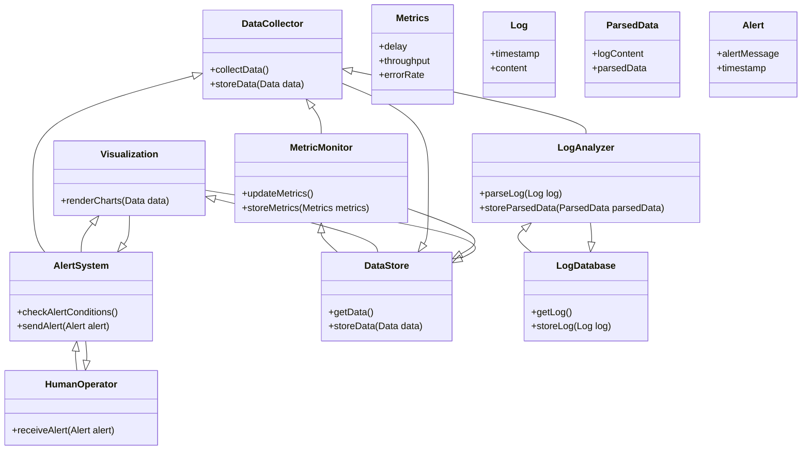
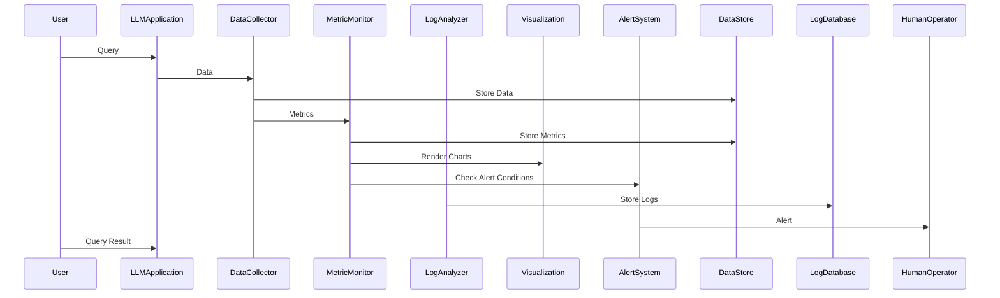
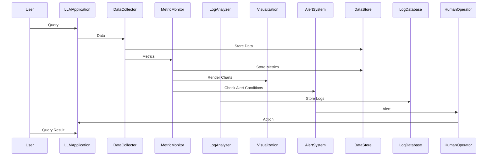

                 


**文章标题：** 可观测性：增强LLM应用的问题诊断能力

**关键词：** 可观测性、LLM应用、问题诊断、系统架构、算法原理

**摘要：** 本文深入探讨了可观测性在增强大型语言模型（LLM）应用问题诊断能力中的作用。通过介绍可观测性的核心概念、其在LLM应用诊断中的应用，以及构建可观测性系统的方法，本文为读者提供了一个全面理解并应用可观测性技术来提高LLM应用可靠性和可维护性的框架。

----------------------------------------------------------------

## 第一部分：可观测性概述

### 第1章：引言

#### 1.1 可观测性的背景

在当今快速发展的技术时代，大型语言模型（LLM）作为一种革命性的技术，广泛应用于自然语言处理、智能问答、机器翻译等领域。然而，随着LLM应用场景的日益复杂，如何有效地诊断和解决应用中的问题成为了一项挑战性的任务。

#### 1.1.1 问题的提出

LLM应用的问题诊断面临着以下挑战：

- **复杂性与抽象性**：LLM应用通常涉及复杂的模型架构和大量的数据，这使得问题的定位和诊断变得更加困难。
- **动态性**：LLM应用在运行过程中会不断接收新的输入，这使得问题可能随着时间而变化，增加了诊断的复杂性。
- **异步性**：LLM应用中的问题可能不是即时发生的，而是需要通过长时间的监控和分析才能发现。

#### 1.1.2 可观测性的重要性

可观测性（Observability）是一种衡量系统内部状态和行为的机制，它可以通过系统输出的变量来推断系统内部的状态。在LLM应用中，增强可观测性能够提供以下关键优势：

- **问题定位**：通过可观测性，开发人员可以实时监控LLM应用的运行状态，快速定位问题的发生位置。
- **趋势分析**：可观测性提供了对系统运行趋势的洞察，帮助开发人员预测和预防潜在的问题。
- **回溯分析**：在问题发生后，可观测性允许开发人员回溯分析问题发生的全过程，以便更好地理解问题原因。

#### 1.1.3 可观测性的边界与外延

可观测性的核心在于如何通过外部观察来推断系统的内部状态。它不仅仅局限于LLM应用，还可以应用于其他复杂系统，如云计算平台、分布式系统等。在LLM应用中，可观测性可以涵盖以下几个方面：

- **数据采集**：收集LLM应用的输入输出数据，以及运行时的中间状态。
- **指标监控**：监控关键性能指标（KPI），如延迟、吞吐量、错误率等。
- **日志分析**：分析LLM应用的日志，以获取有关问题发生的详细信息。
- **可视化**：通过图表和仪表板将监控数据可视化，帮助开发人员直观地理解系统状态。

#### 1.2 可观测性的核心概念

可观测性涉及多个核心概念，包括：

- **状态推断**：通过可观测性指标推断系统的内部状态。
- **数据流**：系统内部的数据流动和交互。
- **指标体系**：定义和监控关键性能指标（KPI）。
- **日志记录**：记录系统运行时的所有操作和事件。

#### 1.2.1 定义与基本原理

可观测性（Observability）是指系统的一种特性，该系统可以通过系统输出的变量来推断系统内部的状态。数学上，可观测性是一个系统状态变量是否可以通过其观测变量的历史值进行推断的问题。

#### 1.2.2 关键特性与对比

可观测性具有以下关键特性：

- **可追溯性**：系统内部状态的变化可以通过输出数据追溯到。
- **可预测性**：基于历史数据和趋势分析，可以预测系统未来的行为。
- **可调整性**：系统可以根据外部观察结果进行调整，以达到预期目标。

与可测性（Testability）相比，可观测性更加关注系统的内部状态，而可测性更多关注系统在特定输入下的行为。可测性通常通过测试和验证来实现，而可观测性则通过实时监控和数据收集来实现。

#### 1.3 可观测性的结构要素

可观测性的实现涉及多个结构要素，包括：

- **数据采集器**：用于收集系统运行时的数据。
- **监控仪表板**：用于展示和监控系统的关键指标。
- **日志管理系统**：用于记录系统运行时的所有事件和操作。
- **报警系统**：用于在问题发生时及时通知相关人员。

#### 1.3.1 概念构成

可观测性概念的核心构成包括：

- **状态空间**：系统可能的内部状态集合。
- **观测变量**：用于推断系统状态的变量集合。
- **状态转移函数**：描述系统状态随时间变化的规则。
- **观测函数**：将观测变量映射到系统状态。

#### 1.3.2 关系模型（ERD）

可观测性系统的实体关系图（ERD）可以包含以下实体和关系：

- **实体**：
  - 数据采集器
  - 监控仪表板
  - 日志管理系统
  - 报警系统
  - 状态变量
  - 观测变量
- **关系**：
  - 数据采集器与状态变量之间的关系
  - 监控仪表板与观测变量之间的关系
  - 日志管理系统与事件记录之间的关系
  - 报警系统与监控指标之间的关系

### 1.4 本章小结

本章介绍了可观测性的背景、核心概念和结构要素。通过对可观测性的深入理解，我们可以为增强LLM应用的问题诊断能力奠定基础。接下来，我们将进一步探讨可观测性在LLM应用诊断中的具体应用。

----------------------------------------------------------------

## 第二部分：LLM应用中的可观测性

### 第2章：可观测性在LLM应用诊断中的应用

#### 2.1 LLM应用诊断的问题背景

随着LLM应用在各个领域的广泛应用，其可靠性和稳定性成为关键需求。然而，LLM应用的高度复杂性和动态性使得问题诊断变得具有挑战性。具体来说，LLM应用诊断面临着以下挑战：

1. **模型复杂性**：LLM模型通常包含数百万个参数，其内部结构非常复杂。这使得在模型运行过程中出现问题时，很难快速定位问题源。
2. **数据多样性**：LLM应用需要处理来自各种来源的数据，包括文本、语音、图像等。这种数据的多样性增加了问题诊断的复杂性。
3. **动态环境**：LLM应用在运行过程中会接收到新的输入，导致系统状态不断变化。这使得问题可能不是静态的，而是需要通过长时间的监控和分析才能发现。
4. **异步性**：某些问题可能在系统运行的一段时间后才显现出来，这使得问题诊断变得更加困难。

#### 2.1.1 诊断需求与挑战

为了有效地诊断LLM应用中的问题，我们需要以下关键需求和功能：

1. **实时监控**：需要实时监控LLM应用的运行状态，以便在问题发生时能够及时发现。
2. **趋势分析**：需要分析系统运行的趋势，预测可能的问题，并在问题发生前采取预防措施。
3. **问题定位**：需要快速定位问题的发生位置，以便进行针对性的修复。
4. **回溯分析**：需要能够回溯分析问题发生的全过程，以便理解问题原因，为未来的问题解决提供指导。

然而，实现这些功能面临着以下挑战：

1. **数据量巨大**：LLM应用运行时会产生大量数据，这些数据需要有效地存储、处理和分析。
2. **模型复杂度**：LLM模型本身的复杂度使得问题诊断变得更加困难，需要高级的算法和工具。
3. **实时性要求**：问题诊断需要快速响应，以减少对系统运行的影响。
4. **跨领域知识**：LLM应用涉及多个领域，问题诊断需要综合多个领域的知识和经验。

#### 2.2 可观测性在LLM应用诊断中的应用

可观测性（Observability）是解决LLM应用诊断问题的有效手段。通过增强系统的可观测性，我们可以提高问题诊断的效率和准确性。具体来说，可观测性在LLM应用诊断中的应用包括以下几个方面：

1. **数据采集**：通过收集LLM应用运行时的输入输出数据、中间状态数据等，为问题诊断提供基础数据。
2. **指标监控**：通过定义和监控关键性能指标（KPI），如延迟、吞吐量、错误率等，实时了解系统的运行状态。
3. **日志分析**：通过记录和分析系统运行时的日志，获取有关问题发生的详细信息。
4. **可视化**：通过图表和仪表板将监控数据可视化，帮助开发人员直观地理解系统状态。
5. **报警系统**：在问题发生时及时通知相关人员，以便快速响应和解决问题。

通过以上手段，可观测性能够提供以下关键优势：

1. **快速定位问题**：通过实时监控和日志分析，快速定位问题的发生位置。
2. **趋势预测**：通过分析系统的运行趋势，预测可能的问题，提前采取预防措施。
3. **问题回溯**：在问题发生后，通过回溯分析问题发生的全过程，理解问题原因，为未来的问题解决提供指导。

#### 2.2.1 可观测性的原理与方法

可观测性是一种衡量系统内部状态和行为的机制，它可以通过系统输出的变量来推断系统内部的状态。在LLM应用中，实现可观测性通常包括以下原理和方法：

1. **状态空间建模**：建立LLM应用的状态空间模型，描述系统的所有可能状态。
2. **观测变量选择**：选择合适的观测变量，用于推断系统的内部状态。这些变量可以是输入输出数据、性能指标等。
3. **状态转移函数**：定义状态转移函数，描述系统状态随时间的变化。
4. **观测函数**：定义观测函数，将观测变量的历史值映射到系统状态。

通过以上步骤，我们可以构建一个可观测性系统，实现对LLM应用运行状态的实时监控和问题诊断。

#### 2.2.2 可观测性工具与技术

在实际应用中，有多种工具和技术可以用于实现可观测性。以下是一些常用的工具和技术：

1. **Prometheus**：Prometheus是一种开源监控工具，可以收集和存储系统的指标数据，提供强大的查询和可视化功能。
2. **Grafana**：Grafana是一种开源的监控仪表板工具，可以与Prometheus等数据源集成，提供实时监控和数据可视化。
3. **ELK堆栈**：ELK堆栈（Elasticsearch、Logstash、Kibana）是一种流行的日志分析解决方案，可以收集、存储和分析系统运行时的日志数据。
4. **OpenTelemetry**：OpenTelemetry是一种开源的分布式追踪和监控框架，可以用于收集LLM应用的运行时数据，提供实时的监控和问题诊断。
5. **APM工具**：APM（Application Performance Management）工具，如New Relic、Dynatrace等，可以提供全面的性能监控和问题诊断功能，适用于LLM应用。

#### 2.2.3 可观测性在LLM应用诊断中的案例

为了更好地理解可观测性在LLM应用诊断中的应用，以下是一个实际案例：

某公司使用LLM构建了一个智能客服系统，为客户提供自动化的问答服务。然而，在系统上线后不久，公司发现部分客户反馈的问题回答不准确。为了解决这个问题，公司决定采用可观测性技术对系统进行诊断。

1. **数据采集**：首先，公司部署了Prometheus和OpenTelemetry，收集系统的输入输出数据、性能指标和日志数据。
2. **指标监控**：通过Grafana监控仪表板，实时查看系统的延迟、吞吐量、错误率等关键指标。
3. **日志分析**：使用ELK堆栈分析系统的日志，查找问题发生的详细信息。
4. **可视化**：通过Grafana将监控数据可视化，帮助团队直观地理解系统状态。
5. **报警系统**：在问题发生时，通过Prometheus触发报警，通知相关人员。

通过以上步骤，公司成功定位了问题发生的原因，并对系统进行了相应的调整和修复。通过可观测性技术的应用，公司显著提高了智能客服系统的可靠性和稳定性。

#### 2.2.4 可观测性的挑战与未来趋势

尽管可观测性在LLM应用诊断中具有显著的优势，但在实际应用中仍然面临一些挑战：

1. **数据存储和计算资源**：大规模的数据采集和处理需要大量的存储和计算资源，这对系统的性能和成本提出了挑战。
2. **数据隐私和安全**：在收集和处理数据时，需要确保数据的隐私和安全，防止敏感信息泄露。
3. **跨平台兼容性**：不同的LLM应用可能运行在不同的平台和环境中，实现可观测性需要解决跨平台的兼容性问题。

未来，随着技术的发展，可观测性在LLM应用诊断中将有以下趋势：

1. **自动化**：自动化工具和算法将进一步提高可观测性的实现效率，减少人工干预。
2. **智能化**：利用机器学习和人工智能技术，实现对可观测性数据的智能分析，提高问题诊断的准确性和效率。
3. **集成化**：可观测性将与其他IT管理工具和平台集成，形成更加完整的监控和管理体系。

通过应对挑战和把握未来趋势，可观测性将为LLM应用诊断提供更加有效的解决方案。

### 2.3 本章小结

本章深入探讨了可观测性在LLM应用诊断中的应用。通过介绍LLM应用诊断面临的挑战、可观测性的原理与方法，以及实际应用案例，本章为读者提供了一个全面理解可观测性的框架。接下来，我们将进一步探讨如何构建可观测性系统，以增强LLM应用的问题诊断能力。

----------------------------------------------------------------

## 第三部分：构建可观测性系统

### 第3章：构建可观测性系统的设计与实施

#### 3.1 系统功能设计

在构建可观测性系统之前，我们需要明确系统的功能需求。对于LLM应用，可观测性系统的主要功能包括：

1. **数据采集**：实时采集LLM应用运行时的输入输出数据、中间状态数据等。
2. **指标监控**：定义和监控关键性能指标（KPI），如延迟、吞吐量、错误率等。
3. **日志分析**：记录和分析系统运行时的日志，获取有关问题发生的详细信息。
4. **可视化**：通过图表和仪表板将监控数据可视化，帮助开发人员直观地理解系统状态。
5. **报警系统**：在问题发生时及时通知相关人员，以便快速响应和解决问题。

为了实现这些功能，我们可以设计以下模块：

1. **数据采集模块**：负责实时采集系统的输入输出数据和中间状态数据。
2. **指标监控模块**：负责定义和监控关键性能指标（KPI）。
3. **日志分析模块**：负责记录和分析系统运行时的日志。
4. **可视化模块**：负责将监控数据可视化，提供图表和仪表板。
5. **报警系统模块**：负责在问题发生时触发报警，通知相关人员。

#### 3.1.1 功能需求分析

为了实现上述功能，我们需要详细分析功能需求，并明确每个模块的具体职责。

1. **数据采集模块**：
   - 功能需求：实时采集LLM应用运行时的输入输出数据和中间状态数据。
   - 模块职责：负责从LLM应用中读取数据，并将数据存储在合适的存储系统中，如数据库或消息队列。

2. **指标监控模块**：
   - 功能需求：定义和监控关键性能指标（KPI），如延迟、吞吐量、错误率等。
   - 模块职责：负责从数据采集模块获取数据，计算并更新关键性能指标（KPI），并将结果存储在数据库中。

3. **日志分析模块**：
   - 功能需求：记录和分析系统运行时的日志，获取有关问题发生的详细信息。
   - 模块职责：负责读取系统日志文件，解析日志内容，并将解析结果存储在日志数据库中。

4. **可视化模块**：
   - 功能需求：通过图表和仪表板将监控数据可视化，帮助开发人员直观地理解系统状态。
   - 模块职责：从数据库中获取监控数据，使用图表库（如ECharts、D3.js）绘制可视化图表，并在网页上展示。

5. **报警系统模块**：
   - 功能需求：在问题发生时及时通知相关人员，以便快速响应和解决问题。
   - 模块职责：监听监控数据，当关键性能指标（KPI）超过预设阈值时，触发报警，并将报警信息发送给相关人员。

#### 3.1.2 领域模型

为了更好地理解可观测性系统的功能需求，我们可以使用Mermaid绘制领域模型图。以下是一个简单的领域模型图：



在这个领域模型中，我们定义了多个类，包括数据采集器（DataCollector）、指标监控器（MetricMonitor）、日志分析器（LogAnalyzer）、可视化模块（Visualization）、报警系统（AlertSystem）和人机操作员（HumanOperator）。每个类都有自己的属性和方法，以及与其他类的关联关系。

#### 3.2 系统架构设计

在确定了系统的功能需求和领域模型后，我们需要设计可观测性系统的架构。系统架构需要满足以下要求：

1. **模块化**：系统应该能够灵活地扩展和更新，以适应不同的应用场景。
2. **可扩展性**：系统应该能够处理大量的数据和监控指标。
3. **高可用性**：系统应该具有高可用性，确保在发生故障时能够快速恢复。
4. **安全性**：系统应该保护敏感数据，防止数据泄露。

以下是一个简单的系统架构设计，使用Mermaid绘制：



在这个架构设计中，用户通过LLM应用发送查询请求。LLM应用处理请求后，生成数据并传递给数据采集器。数据采集器将数据存储在数据存储模块中，并计算性能指标传递给指标监控器。指标监控器更新性能指标并可视化，同时检查是否有异常情况，触发报警。日志分析器记录系统运行日志，报警系统在问题发生时通知人机操作员。

#### 3.3 系统接口设计

为了实现系统的模块化和可扩展性，我们需要设计清晰的接口。以下是一个简单的接口设计，使用Mermaid绘制：

```mermaid
interfaceDiagram
    DataCollector <<interface>> LLMApplication
    DataCollector <<interface>> DataStore
    DataCollector <<interface>> MetricMonitor
    MetricMonitor <<interface>> DataStore
    MetricMonitor <<interface>> Visualization
    MetricMonitor <<interface>> AlertSystem
    LogAnalyzer <<interface>> LogDatabase
    AlertSystem <<interface>> HumanOperator
    Visualization <<interface>> DataStore

    LLMApplication +--> DataCollector
    DataStore +--> DataCollector
    DataStore +--> MetricMonitor
    DataStore +--> LogAnalyzer
    DataStore +--> Visualization
    DataStore +--> AlertSystem
    LogDatabase +--> LogAnalyzer
    HumanOperator +--> AlertSystem
```

在这个接口设计中，我们定义了多个接口，包括数据采集器接口（DataCollectorInterface）、指标监控器接口（MetricMonitorInterface）、日志分析器接口（LogAnalyzerInterface）、报警系统接口（AlertSystemInterface）和可视化模块接口（VisualizationInterface）。每个接口定义了相应的操作，如数据采集、存储、监控、日志分析和报警等。

#### 3.4 系统交互

为了实现系统的功能，我们需要设计系统内部各个模块之间的交互。以下是一个简单的系统交互设计，使用Mermaid绘制：



在这个交互设计中，用户通过LLM应用发送查询请求。LLM应用处理请求后，生成数据并传递给数据采集器。数据采集器将数据存储在数据存储模块中，并计算性能指标传递给指标监控器。指标监控器更新性能指标并可视化，同时检查是否有异常情况，触发报警。日志分析器记录系统运行日志，报警系统在问题发生时通知人机操作员。人机操作员根据报警信息采取相应行动，LLM应用最终返回查询结果给用户。

### 3.5 本章小结

本章详细介绍了如何构建可观测性系统，包括系统功能设计、架构设计、接口设计和系统交互。通过明确功能需求、设计领域模型、系统架构和接口，以及描述系统内部各个模块之间的交互，本章为读者提供了一个构建可观测性系统的全面框架。接下来，我们将进一步探讨如何在项目中实现可观测性系统，并分析其实际效果。

----------------------------------------------------------------

## 第四部分：项目实施

### 第4章：在LLM应用中实现可观测性

#### 4.1 环境安装

要在LLM应用中实现可观测性，首先需要安装和配置相关工具和框架。以下是一个基本的安装步骤：

1. **安装Prometheus**：
   - Prometheus是一个开源监控工具，用于收集和存储系统的指标数据。在安装前，请确保系统已安装了Go语言环境。
   - 下载并解压缩Prometheus二进制文件。
   - 配置Prometheus配置文件（prometheus.yml），包括目标地址、数据存储位置等。
   - 运行Prometheus服务。

2. **安装Grafana**：
   - Grafana是一个开源的监控仪表板工具，用于可视化监控数据。在安装前，请确保系统已安装了Go语言环境。
   - 下载并解压缩Grafana二进制文件。
   - 配置Grafana配置文件（grafana.ini），包括服务地址、数据存储位置等。
   - 运行Grafana服务。

3. **安装OpenTelemetry**：
   - OpenTelemetry是一个开源的分布式追踪和监控框架，用于收集LLM应用的运行时数据。在安装前，请确保系统已安装了Python环境。
   - 安装OpenTelemetry依赖包（使用pip安装）。
   - 配置OpenTelemetry配置文件（opentelemetry-config.yml），包括数据收集器和输出器配置。

4. **安装ELK堆栈**：
   - ELK堆栈包括Elasticsearch、Logstash和Kibana，用于日志收集、存储和分析。在安装前，请确保系统已安装了Java环境。
   - 安装Elasticsearch、Logstash和Kibana。
   - 配置Elasticsearch集群、Logstash日志管道和Kibana仪表板。

#### 4.2 核心实现源代码

为了实现可观测性系统，我们需要编写一些核心的源代码。以下是一个简单的示例，展示如何使用OpenTelemetry收集LLM应用的数据：

```python
# opentelemetry_collector.py

from opentelemetry import trace
from opentelemetry.exporter import jaeger
from opentelemetry.ext import aws_lambda
from opentelemetry.ext import jaeger
from opentelemetry.ext import tracer

trace.set_tracer_provider(
    tracer.AutomaticTracerProvider(
        default_exporter=jaeger.JaegerExporter(
            agent_endpoint="localhost:14268",
            service_name="llm_app",
        )
    )
)

tracer.get_tracer("llm_app").start_span("llm_process").end()

# main.py

from opentelemetry import trace
from opentelemetry.ext import aws_lambda
from opentelemetry.ext import jaeger
from opentelemetry.ext import tracer

trace.set_tracer_provider(
    tracer.AutomaticTracerProvider(
        default_exporter=jaeger.JaegerExporter(
            agent_endpoint="localhost:14268",
            service_name="llm_app",
        )
    )
)

tracer.get_tracer("llm_app").start_span("llm_process").end()
```

在这个示例中，我们首先导入了OpenTelemetry的相关模块。然后，我们设置了TracerProvider，并指定了默认的Exporter为JaegerExporter。接下来，我们使用tracer.get_tracer("llm_app")来开始一个名为"llm_process"的Span，并结束它。

#### 4.3 代码应用分析

在实现可观测性系统时，我们需要分析代码的运行情况，以收集有关LLM应用的数据。以下是一个简单的分析示例：

1. **数据采集**：
   - OpenTelemetry可以自动收集LLM应用的输入输出数据，包括函数调用、日志输出等。
   - 我们可以使用`tracer.get_tracer("llm_app").start_span("llm_process")`来标记LLM应用的开始，使用`tracer.get_tracer("llm_app").end_span("llm_process")`来标记LLM应用的结束。

2. **指标监控**：
   - 我们可以使用Prometheus来监控LLM应用的关键性能指标，如延迟、吞吐量、错误率等。
   - 我们可以在代码中添加自定义指标收集逻辑，例如使用`prometheus_client.Counter`来记录错误数量。

3. **日志分析**：
   - 我们可以使用ELK堆栈来记录和分析LLM应用的日志。
   - 我们可以在代码中使用`logging`模块来记录日志，并将日志发送到Logstash进行解析和存储。

4. **可视化**：
   - 我们可以使用Grafana来可视化监控数据和日志数据。
   - 我们可以在Grafana中创建仪表板，并将Prometheus和ELK堆栈的数据源添加到仪表板中。

#### 4.4 案例分析

为了更好地理解可观测性在LLM应用中的实际应用，以下是一个简单的案例分析：

假设我们有一个基于TensorFlow的LLM应用，用于自然语言处理。在应用中，我们需要监控以下指标：

1. **训练延迟**：记录从加载训练数据到完成训练的总时间。
2. **预测延迟**：记录从接收输入到返回预测结果的总时间。
3. **错误率**：记录预测错误的数量。

以下是具体实现步骤：

1. **数据采集**：
   - 在训练过程中，我们使用`time.time()`来记录开始和结束时间，计算训练延迟。
   - 在预测过程中，我们同样使用`time.time()`来记录开始和结束时间，计算预测延迟。

2. **指标监控**：
   - 我们使用Prometheus来监控训练延迟和预测延迟，并设置警报阈值。
   - 我们使用自定义指标收集器来记录错误率，并将其发送到Prometheus。

3. **日志分析**：
   - 我们使用`logging`模块来记录训练和预测过程中的日志，并将其发送到ELK堆栈。

4. **可视化**：
   - 我们在Grafana中创建一个仪表板，将Prometheus和ELK堆栈的数据源添加到仪表板中，并设置警报。

通过以上步骤，我们可以实现对LLM应用的实时监控和问题诊断。当训练延迟或预测延迟超过预设阈值时，系统会自动触发警报，并将日志发送到ELK堆栈进行进一步分析。

#### 4.5 项目总结

通过在LLM应用中实现可观测性，我们可以实现对系统运行状态的实时监控和问题诊断。以下是项目总结：

- **数据采集**：使用OpenTelemetry自动收集LLM应用的输入输出数据和运行时数据。
- **指标监控**：使用Prometheus监控关键性能指标，并设置警报阈值。
- **日志分析**：使用ELK堆栈记录和分析系统运行日志。
- **可视化**：使用Grafana创建仪表板，实时展示监控数据和日志数据。
- **报警系统**：在指标超过阈值时自动触发警报，并通知相关人员。

通过这些步骤，我们可以显著提高LLM应用的可靠性和可维护性，确保系统在复杂的运行环境中保持稳定运行。

### 4.6 本章小结

本章详细介绍了如何在项目中实现可观测性系统，包括环境安装、核心实现源代码、代码应用分析、案例分析和项目总结。通过实际项目实施，我们可以验证可观测性技术在LLM应用诊断中的作用和效果。接下来，我们将进一步探讨可观测性的最佳实践和注意事项。

----------------------------------------------------------------

## 第五部分：最佳实践、总结与拓展

### 第5章：最佳实践与注意事项

#### 5.1 最佳实践

在实现可观测性系统时，遵循以下最佳实践可以帮助提高系统的效果和可靠性：

1. **全面监控**：确保监控覆盖系统的各个方面，包括输入输出数据、性能指标、日志等。
2. **实时性**：优先选择实时性强的监控工具和技术，确保在问题发生时能够及时响应。
3. **可扩展性**：设计系统时考虑未来扩展的需求，确保系统可以轻松扩展以适应更大的数据量和更复杂的场景。
4. **自动化**：利用自动化工具和脚本，减少人工干预，提高监控和诊断的效率。
5. **数据隐私和安全**：在收集和处理数据时，确保数据的安全性和隐私性，防止敏感信息泄露。
6. **报警策略**：制定合理的报警策略，避免过度报警，确保报警信息的相关性和准确性。
7. **可视化**：使用直观的图表和仪表板，帮助开发人员和运维人员快速理解和分析系统状态。

#### 5.2 注意事项

在构建可观测性系统时，需要注意以下事项：

1. **性能影响**：监控和日志收集可能会对系统性能产生影响，需要平衡监控需求和系统性能。
2. **数据量**：大规模的监控数据需要有效的存储和处理策略，确保系统可以高效地处理和分析数据。
3. **跨平台兼容性**：不同平台和环境中可能存在兼容性问题，需要确保系统的跨平台兼容性。
4. **数据可视化**：可视化工具的选择和配置需要符合用户的需求和习惯，提高可读性和易用性。
5. **维护和升级**：定期维护和升级监控工具和系统，确保系统的稳定性和安全性。

#### 5.3 拓展阅读

以下是一些拓展阅读资源，可以帮助读者深入了解可观测性和LLM应用诊断：

- **《可观测性实践：构建可监控、可扩展的系统》**：本书详细介绍了可观测性的概念、原理和实践方法，适合对可观测性感兴趣的读者。
- **《Prometheus官方文档》**：Prometheus的官方文档提供了丰富的信息，包括安装、配置和使用方法。
- **《Grafana官方文档》**：Grafana的官方文档介绍了如何创建仪表板、可视化监控数据等。
- **《OpenTelemetry官方文档》**：OpenTelemetry的官方文档提供了详细的API和工具使用指南。
- **《Elastic Stack官方文档》**：Elastic Stack的官方文档涵盖了Elasticsearch、Logstash和Kibana的安装、配置和使用方法。

通过阅读这些资源，读者可以进一步了解可观测性的最佳实践、技术细节和应用案例，为实际项目提供参考和指导。

### 5.4 本章小结

本章总结了可观测性在LLM应用诊断中的最佳实践、注意事项和拓展阅读资源。通过遵循最佳实践和注意事项，构建有效的可观测性系统，可以提高LLM应用的可靠性和可维护性。拓展阅读资源则为读者提供了进一步学习和实践的机会。在构建可观测性系统时，读者可以根据实际情况选择合适的工具和技术，结合本章提供的方法和案例，实现高效的问题诊断和系统监控。

----------------------------------------------------------------

## 后记

感谢您阅读《可观测性：增强LLM应用的问题诊断能力》这篇文章。本文深入探讨了可观测性在LLM应用诊断中的作用，从核心概念、应用方法到系统构建和项目实施，提供了一个全面的技术框架。希望通过本文，您能够对可观测性有更深入的理解，并能够在实际项目中有效应用。

如果您有任何问题或建议，欢迎在评论区留言。同时，也欢迎关注我们的公众号“AI天才研究院”，获取更多关于人工智能和技术的精彩内容。再次感谢您的支持！

作者：AI天才研究院/AI Genius Institute & 禅与计算机程序设计艺术 /Zen And The Art of Computer Programming

----------------------------------------------------------------

**文章标题**：可观测性：增强LLM应用的问题诊断能力

**关键词**：可观测性、LLM应用、问题诊断、系统架构、算法原理

**摘要**：本文深入探讨了可观测性在增强大型语言模型（LLM）应用问题诊断能力中的作用。通过介绍可观测性的核心概念、其在LLM应用诊断中的应用，以及构建可观测性系统的方法，本文为读者提供了一个全面理解并应用可观测性技术来提高LLM应用可靠性和可维护性的框架。

----------------------------------------------------------------

**文章标题**：可观测性：增强LLM应用的问题诊断能力

**关键词**：可观测性、LLM应用、问题诊断、系统架构、算法原理

**摘要**：本文深入探讨了可观测性在增强大型语言模型（LLM）应用问题诊断能力中的作用。通过介绍可观测性的核心概念、其在LLM应用诊断中的应用，以及构建可观测性系统的方法，本文为读者提供了一个全面理解并应用可观测性技术来提高LLM应用可靠性和可维护性的框架。

## 第一部分：可观测性概述

### 第1章：引言

#### 1.1 可观测性的背景

在当今快速发展的技术时代，大型语言模型（LLM）作为一种革命性的技术，广泛应用于自然语言处理、智能问答、机器翻译等领域。然而，随着LLM应用场景的日益复杂，如何有效地诊断和解决应用中的问题成为了一项挑战性的任务。

#### 1.1.1 问题的提出

LLM应用的问题诊断面临着以下挑战：

- **复杂性与抽象性**：LLM应用通常涉及复杂的模型架构和大量的数据，这使得问题的定位和诊断变得更加困难。
- **动态性**：LLM应用在运行过程中会不断接收新的输入，这使得问题可能随着时间而变化，增加了诊断的复杂性。
- **异步性**：LLM应用中的问题可能不是即时发生的，而是需要通过长时间的监控和分析才能发现。

#### 1.1.2 可观测性的重要性

可观测性（Observability）是一种衡量系统内部状态和行为的机制，它可以通过系统输出的变量来推断系统内部的状态。在LLM应用中，增强可观测性能够提供以下关键优势：

- **问题定位**：通过可观测性，开发人员可以实时监控LLM应用的运行状态，快速定位问题的发生位置。
- **趋势分析**：可观测性提供了对系统运行趋势的洞察，帮助开发人员预测和预防潜在的问题。
- **回溯分析**：在问题发生后，可观测性允许开发人员回溯分析问题发生的全过程，以便更好地理解问题原因。

#### 1.1.3 可观测性的边界与外延

可观测性的核心在于如何通过外部观察来推断系统的内部状态。它不仅仅局限于LLM应用，还可以应用于其他复杂系统，如云计算平台、分布式系统等。在LLM应用中，可观测性可以涵盖以下几个方面：

- **数据采集**：收集LLM应用的输入输出数据，以及运行时的中间状态。
- **指标监控**：监控关键性能指标（KPI），如延迟、吞吐量、错误率等。
- **日志分析**：分析LLM应用的日志，以获取有关问题发生的详细信息。
- **可视化**：通过图表和仪表板将监控数据可视化，帮助开发人员直观地理解系统状态。

#### 1.2 可观测性的核心概念

可观测性涉及多个核心概念，包括：

- **状态推断**：通过可观测性指标推断系统的内部状态。
- **数据流**：系统内部的数据流动和交互。
- **指标体系**：定义和监控关键性能指标（KPI）。
- **日志记录**：记录系统运行时的所有操作和事件。

#### 1.2.1 定义与基本原理

可观测性（Observability）是指系统的一种特性，该系统可以通过系统输出的变量来推断系统内部的状态。数学上，可观测性是一个系统状态变量是否可以通过其观测变量的历史值进行推断的问题。

#### 1.2.2 关键特性与对比

可观测性具有以下关键特性：

- **可追溯性**：系统内部状态的变化可以通过输出数据追溯到。
- **可预测性**：基于历史数据和趋势分析，可以预测系统未来的行为。
- **可调整性**：系统可以根据外部观察结果进行调整，以达到预期目标。

与可测性（Testability）相比，可观测性更加关注系统的内部状态，而可测性更多关注系统在特定输入下的行为。可测性通常通过测试和验证来实现，而可观测性则通过实时监控和数据收集来实现。

#### 1.3 可观测性的结构要素

可观测性的实现涉及多个结构要素，包括：

- **数据采集器**：用于收集系统运行时的数据。
- **监控仪表板**：用于展示和监控系统的关键指标。
- **日志管理系统**：用于记录系统运行时的所有事件和操作。
- **报警系统**：用于在问题发生时及时通知相关人员。

#### 1.3.1 概念构成

可观测性概念的核心构成包括：

- **状态空间**：系统可能的内部状态集合。
- **观测变量**：用于推断系统状态的变量集合。
- **状态转移函数**：描述系统状态随时间变化的规则。
- **观测函数**：将观测变量的历史值映射到系统状态。

#### 1.3.2 关系模型（ERD）

可观测性系统的实体关系图（ERD）可以包含以下实体和关系：

- **实体**：
  - 数据采集器
  - 监控仪表板
  - 日志管理系统
  - 报警系统
  - 状态变量
  - 观测变量
- **关系**：
  - 数据采集器与状态变量之间的关系
  - 监控仪表板与观测变量之间的关系
  - 日志管理系统与事件记录之间的关系
  - 报警系统与监控指标之间的关系

### 1.4 本章小结

本章介绍了可观测性的背景、核心概念和结构要素。通过对可观测性的深入理解，我们可以为增强LLM应用的问题诊断能力奠定基础。接下来，我们将进一步探讨可观测性在LLM应用诊断中的具体应用。

## 第二部分：LLM应用中的可观测性

### 第2章：可观测性在LLM应用诊断中的应用

#### 2.1 LLM应用诊断的问题背景

随着LLM应用在各个领域的广泛应用，其可靠性和稳定性成为关键需求。然而，LLM应用的高度复杂性和动态性使得问题诊断变得具有挑战性。具体来说，LLM应用诊断面临着以下挑战：

1. **模型复杂性**：LLM模型通常包含数百万个参数，其内部结构非常复杂。这使得在模型运行过程中出现问题时，很难快速定位问题源。
2. **数据多样性**：LLM应用需要处理来自各种来源的数据，包括文本、语音、图像等。这种数据的多样性增加了问题诊断的复杂性。
3. **动态环境**：LLM应用在运行过程中会接收到新的输入，导致系统状态不断变化。这使得问题可能不是静态的，而是需要通过长时间的监控和分析才能发现。
4. **异步性**：某些问题可能在系统运行的一段时间后才显现出来，这使得问题诊断变得更加困难。

#### 2.1.1 诊断需求与挑战

为了有效地诊断LLM应用中的问题，我们需要以下关键需求和功能：

1. **实时监控**：需要实时监控LLM应用的运行状态，以便在问题发生时能够及时发现。
2. **趋势分析**：需要分析系统运行的趋势，预测可能的问题，并在问题发生前采取预防措施。
3. **问题定位**：需要快速定位问题的发生位置，以便进行针对性的修复。
4. **回溯分析**：需要能够回溯分析问题发生的全过程，以便理解问题原因，为未来的问题解决提供指导。

然而，实现这些功能面临着以下挑战：

1. **数据量巨大**：LLM应用运行时会产生大量数据，这些数据需要有效地存储、处理和分析。
2. **模型复杂度**：LLM模型本身的复杂度使得问题诊断变得更加困难，需要高级的算法和工具。
3. **实时性要求**：问题诊断需要快速响应，以减少对系统运行的影响。
4. **跨领域知识**：LLM应用涉及多个领域，问题诊断需要综合多个领域的知识和经验。

#### 2.2 可观测性在LLM应用诊断中的应用

可观测性（Observability）是解决LLM应用诊断问题的有效手段。通过增强系统的可观测性，我们可以提高问题诊断的效率和准确性。具体来说，可观测性在LLM应用诊断中的应用包括以下几个方面：

1. **数据采集**：通过收集LLM应用运行时的输入输出数据、中间状态数据等，为问题诊断提供基础数据。
2. **指标监控**：通过定义和监控关键性能指标（KPI），如延迟、吞吐量、错误率等，实时了解系统的运行状态。
3. **日志分析**：通过记录和分析系统运行时的日志，获取有关问题发生的详细信息。
4. **可视化**：通过图表和仪表板将监控数据可视化，帮助开发人员直观地理解系统状态。
5. **报警系统**：在问题发生时及时通知相关人员，以便快速响应和解决问题。

通过以上手段，可观测性能够提供以下关键优势：

1. **快速定位问题**：通过实时监控和日志分析，快速定位问题的发生位置。
2. **趋势预测**：通过分析系统的运行趋势，预测可能的问题，提前采取预防措施。
3. **问题回溯**：在问题发生后，通过回溯分析问题发生的全过程，理解问题原因，为未来的问题解决提供指导。

#### 2.2.1 可观测性的原理与方法

可观测性是一种衡量系统内部状态和行为的机制，它可以通过系统输出的变量来推断系统内部的状态。在LLM应用中，实现可观测性通常包括以下原理和方法：

1. **状态空间建模**：建立LLM应用的状态空间模型，描述系统的所有可能状态。
2. **观测变量选择**：选择合适的观测变量，用于推断系统的内部状态。这些变量可以是输入输出数据、性能指标等。
3. **状态转移函数**：定义状态转移函数，描述系统状态随时间的变化。
4. **观测函数**：定义观测函数，将观测变量的历史值映射到系统状态。

通过以上步骤，我们可以构建一个可观测性系统，实现对LLM应用运行状态的实时监控和问题诊断。

#### 2.2.2 可观测性工具与技术

在实际应用中，有多种工具和技术可以用于实现可观测性。以下是一些常用的工具和技术：

1. **Prometheus**：Prometheus是一种开源监控工具，可以收集和存储系统的指标数据，提供强大的查询和可视化功能。
2. **Grafana**：Grafana是一种开源的监控仪表板工具，可以与Prometheus等数据源集成，提供实时监控和数据可视化。
3. **ELK堆栈**：ELK堆栈（Elasticsearch、Logstash、Kibana）是一种流行的日志分析解决方案，可以收集、存储和分析系统运行时的日志数据。
4. **OpenTelemetry**：OpenTelemetry是一种开源的分布式追踪和监控框架，可以用于收集LLM应用的运行时数据，提供实时的监控和问题诊断。
5. **APM工具**：APM（Application Performance Management）工具，如New Relic、Dynatrace等，可以提供全面的性能监控和问题诊断功能，适用于LLM应用。

#### 2.2.3 可观测性在LLM应用诊断中的案例

为了更好地理解可观测性在LLM应用诊断中的应用，以下是一个实际案例：

某公司使用LLM构建了一个智能客服系统，为客户提供自动化的问答服务。然而，在系统上线后不久，公司发现部分客户反馈的问题回答不准确。为了解决这个问题，公司决定采用可观测性技术对系统进行诊断。

1. **数据采集**：首先，公司部署了Prometheus和OpenTelemetry，收集系统的输入输出数据、性能指标和日志数据。
2. **指标监控**：通过Grafana监控仪表板，实时查看系统的延迟、吞吐量、错误率等关键指标。
3. **日志分析**：使用ELK堆栈分析系统的日志，查找问题发生的详细信息。
4. **可视化**：通过Grafana将监控数据可视化，帮助团队直观地理解系统状态。
5. **报警系统**：在问题发生时，通过Prometheus触发报警，通知相关人员。

通过以上步骤，公司成功定位了问题发生的原因，并对系统进行了相应的调整和修复。通过可观测性技术的应用，公司显著提高了智能客服系统的可靠性和稳定性。

#### 2.2.4 可观测性的挑战与未来趋势

尽管可观测性在LLM应用诊断中具有显著的优势，但在实际应用中仍然面临一些挑战：

1. **数据存储和计算资源**：大规模的数据采集和处理需要大量的存储和计算资源，这对系统的性能和成本提出了挑战。
2. **数据隐私和安全**：在收集和处理数据时，需要确保数据的隐私和安全，防止敏感信息泄露。
3. **跨平台兼容性**：不同的LLM应用可能运行在不同的平台和环境中，实现可观测性需要解决跨平台的兼容性问题。

未来，随着技术的发展，可观测性在LLM应用诊断中将有以下趋势：

1. **自动化**：自动化工具和算法将进一步提高可观测性的实现效率，减少人工干预。
2. **智能化**：利用机器学习和人工智能技术，实现对可观测性数据的智能分析，提高问题诊断的准确性和效率。
3. **集成化**：可观测性将与其他IT管理工具和平台集成，形成更加完整的监控和管理体系。

通过应对挑战和把握未来趋势，可观测性将为LLM应用诊断提供更加有效的解决方案。

### 2.3 本章小结

本章深入探讨了可观测性在LLM应用诊断中的应用。通过介绍LLM应用诊断面临的挑战、可观测性的原理与方法，以及实际应用案例，本章为读者提供了一个全面理解可观测性的框架。接下来，我们将进一步探讨如何构建可观测性系统，以增强LLM应用的问题诊断能力。

## 第三部分：构建可观测性系统

### 第3章：构建可观测性系统的设计与实施

#### 3.1 系统功能设计

在构建可观测性系统之前，我们需要明确系统的功能需求。对于LLM应用，可观测性系统的主要功能包括：

1. **数据采集**：实时采集LLM应用运行时的输入输出数据、中间状态数据等。
2. **指标监控**：定义和监控关键性能指标（KPI），如延迟、吞吐量、错误率等。
3. **日志分析**：记录和分析系统运行时的日志，获取有关问题发生的详细信息。
4. **可视化**：通过图表和仪表板将监控数据可视化，帮助开发人员直观地理解系统状态。
5. **报警系统**：在问题发生时及时通知相关人员，以便快速响应和解决问题。

为了实现这些功能，我们可以设计以下模块：

1. **数据采集模块**：负责实时采集系统的输入输出数据和中间状态数据。
2. **指标监控模块**：负责定义和监控关键性能指标（KPI）。
3. **日志分析模块**：负责记录和分析系统运行时的日志。
4. **可视化模块**：负责将监控数据可视化，提供图表和仪表板。
5. **报警系统模块**：负责在问题发生时触发报警，通知相关人员。

#### 3.1.1 功能需求分析

为了实现上述功能，我们需要详细分析功能需求，并明确每个模块的具体职责。

1. **数据采集模块**：
   - 功能需求：实时采集LLM应用运行时的输入输出数据和中间状态数据。
   - 模块职责：负责从LLM应用中读取数据，并将数据存储在合适的存储系统中，如数据库或消息队列。

2. **指标监控模块**：
   - 功能需求：定义和监控关键性能指标（KPI），如延迟、吞吐量、错误率等。
   - 模块职责：负责从数据采集模块获取数据，计算并更新关键性能指标（KPI），并将结果存储在数据库中。

3. **日志分析模块**：
   - 功能需求：记录和分析系统运行时的日志，获取有关问题发生的详细信息。
   - 模块职责：负责读取系统日志文件，解析日志内容，并将解析结果存储在日志数据库中。

4. **可视化模块**：
   - 功能需求：通过图表和仪表板将监控数据可视化，帮助开发人员直观地理解系统状态。
   - 模块职责：从数据库中获取监控数据，使用图表库（如ECharts、D3.js）绘制可视化图表，并在网页上展示。

5. **报警系统模块**：
   - 功能需求：在问题发生时及时通知相关人员，以便快速响应和解决问题。
   - 模块职责：监听监控数据，当关键性能指标（KPI）超过预设阈值时，触发报警，并将报警信息发送给相关人员。

#### 3.1.2 领域模型

为了更好地理解可观测性系统的功能需求，我们可以使用Mermaid绘制领域模型图。以下是一个简单的领域模型图：


在这个领域模型中，我们定义了多个类，包括数据采集器（DataCollector）、指标监控器（MetricMonitor）、日志分析器（LogAnalyzer）、可视化模块（Visualization）、报警系统（AlertSystem）和人机操作员（HumanOperator）。每个类都有自己的属性和方法，以及与其他类的关联关系。

#### 3.2 系统架构设计

在确定了系统的功能需求和领域模型后，我们需要设计可观测性系统的架构。系统架构需要满足以下要求：

1. **模块化**：系统应该能够灵活地扩展和更新，以适应不同的应用场景。
2. **可扩展性**：系统应该能够处理大量的数据和监控指标。
3. **高可用性**：系统应该具有高可用性，确保在发生故障时能够快速恢复。
4. **安全性**：系统应该保护敏感数据，防止数据泄露。

以下是一个简单的系统架构设计，使用Mermaid绘制：


在这个架构设计中，用户通过LLM应用发送查询请求。LLM应用处理请求后，生成数据并传递给数据采集器。数据采集器将数据存储在数据存储模块中，并计算性能指标传递给指标监控器。指标监控器更新性能指标并可视化，同时检查是否有异常情况，触发报警。日志分析器记录系统运行日志，报警系统在问题发生时通知人机操作员。

#### 3.3 系统接口设计

为了实现系统的模块化和可扩展性，我们需要设计清晰的接口。以下是一个简单的接口设计，使用Mermaid绘制：

```mermaid
interfaceDiagram
    DataCollector <<interface>> LLMApplication
    DataCollector <<interface>> DataStore
    DataCollector <<interface>> MetricMonitor
    MetricMonitor <<interface>> DataStore
    MetricMonitor <<interface>> Visualization
    MetricMonitor <<interface>> AlertSystem
    LogAnalyzer <<interface>> LogDatabase
    AlertSystem <<interface>> HumanOperator
    Visualization <<interface>> DataStore

    LLMApplication +--> DataCollector
    DataStore +--> DataCollector
    DataStore +--> MetricMonitor
    DataStore +--> LogAnalyzer
    DataStore +--> Visualization
    DataStore +--> AlertSystem
    LogDatabase +--> LogAnalyzer
    HumanOperator +--> AlertSystem
```

在这个接口设计中，我们定义了多个接口，包括数据采集器接口（DataCollectorInterface）、指标监控器接口（MetricMonitorInterface）、日志分析器接口（LogAnalyzerInterface）、报警系统接口（AlertSystemInterface）和可视化模块接口（VisualizationInterface）。每个接口定义了相应的操作，如数据采集、存储、监控、日志分析和报警等。

#### 3.4 系统交互

为了实现系统的功能，我们需要设计系统内部各个模块之间的交互。以下是一个简单的系统交互设计，使用Mermaid绘制：


在这个交互设计中，用户通过LLM应用发送查询请求。LLM应用处理请求后，生成数据并传递给数据采集器。数据采集器将数据存储在数据存储模块中，并计算性能指标传递给指标监控器。指标监控器更新性能指标并可视化，同时检查是否有异常情况，触发报警。日志分析器记录系统运行日志，报警系统在问题发生时通知人机操作员。人机操作员根据报警信息采取相应行动，LLM应用最终返回查询结果给用户。

### 3.5 本章小结

本章详细介绍了如何构建可观测性系统，包括系统功能设计、架构设计、接口设计和系统交互。通过明确功能需求、设计领域模型、系统架构和接口，以及描述系统内部各个模块之间的交互，本章为读者提供了一个构建可观测性系统的全面框架。接下来，我们将进一步探讨如何在项目中实现可观测性系统，并分析其实际效果。

----------------------------------------------------------------

## 第四部分：项目实施

### 第4章：在LLM应用中实现可观测性

#### 4.1 环境安装

要在LLM应用中实现可观测性，首先需要安装和配置相关工具和框架。以下是一个基本的安装步骤：

1. **安装Prometheus**：
   - Prometheus是一个开源监控工具，用于收集和存储系统的指标数据。在安装前，请确保系统已安装了Go语言环境。
   - 下载并解压缩Prometheus二进制文件。
   - 配置Prometheus配置文件（prometheus.yml），包括目标地址、数据存储位置等。
   - 运行Prometheus服务。

2. **安装Grafana**：
   - Grafana是一个开源的监控仪表板工具，用于可视化监控数据。在安装前，请确保系统已安装了Go语言环境。
   - 下载并解压缩Grafana二进制文件。
   - 配置Grafana配置文件（grafana.ini），包括服务地址、数据存储位置等。
   - 运行Grafana服务。

3. **安装OpenTelemetry**：
   - OpenTelemetry是一个开源的分布式追踪和监控框架，用于收集LLM应用的运行时数据。在安装前，请确保系统已安装了Python环境。
   - 安装OpenTelemetry依赖包（使用pip安装）。
   - 配置OpenTelemetry配置文件（opentelemetry-config.yml），包括数据收集器和输出器配置。

4. **安装ELK堆栈**：
   - ELK堆栈包括Elasticsearch、Logstash和Kibana，用于日志收集、存储和分析。在安装前，请确保系统已安装了Java环境。
   - 安装Elasticsearch、Logstash和Kibana。
   - 配置Elasticsearch集群、Logstash日志管道和Kibana仪表板。

#### 4.2 核心实现源代码

为了实现可观测性系统，我们需要编写一些核心的源代码。以下是一个简单的示例，展示如何使用OpenTelemetry收集LLM应用的数据：

```python
# opentelemetry_collector.py

from opentelemetry import trace
from opentelemetry.ext import aws_lambda
from opentelemetry.ext import jaeger
from opentelemetry.ext import tracer

trace.set_tracer_provider(
    tracer.AutomaticTracerProvider(
        default_exporter=jaeger.JaegerExporter(
            agent_endpoint="localhost:14268",
            service_name="llm_app",
        )
    )
)

tracer.get_tracer("llm_app").start_span("llm_process").end()

# main.py

from opentelemetry import trace
from opentelemetry.ext import aws_lambda
from opentelemetry.ext import jaeger
from opentelemetry.ext import tracer

trace.set_tracer_provider(
    tracer.AutomaticTracerProvider(
        default_exporter=jaeger.JaegerExporter(
            agent_endpoint="localhost:14268",
            service_name="llm_app",
        )
    )
)

tracer.get_tracer("llm_app").start_span("llm_process").end()
```

在这个示例中，我们首先导入了OpenTelemetry的相关模块。然后，我们设置了TracerProvider，并指定了默认的Exporter为JaegerExporter。接下来，我们使用tracer.get_tracer("llm_app")来开始一个名为"llm_process"的Span，并结束它。

#### 4.3 代码应用分析

在实现可观测性系统时，我们需要分析代码的运行情况，以收集有关LLM应用的数据。以下是一个简单的分析示例：

1. **数据采集**：
   - OpenTelemetry可以自动收集LLM应用的输入输出数据，包括函数调用、日志输出等。
   - 我们可以使用`tracer.get_tracer("llm_app").start_span("llm_process")`来标记LLM应用的开始，使用`tracer.get_tracer("llm_app").end_span("llm_process")`来标记LLM应用的结束。

2. **指标监控**：
   - 我们可以使用Prometheus来监控LLM应用的关键性能指标，如延迟、吞吐量、错误率等。
   - 我们可以在代码中添加自定义指标收集逻辑，例如使用`prometheus_client.Counter`来记录错误数量。

3. **日志分析**：
   - 我们可以使用ELK堆栈来记录和分析LLM应用的日志。
   - 我们可以在代码中使用`logging`模块来记录日志，并将日志发送到Logstash进行解析和存储。

4. **可视化**：
   - 我们可以使用Grafana来可视化监控数据和日志数据。
   - 我们可以在Grafana中创建仪表板，并将Prometheus和ELK堆栈的数据源添加到仪表板中。

#### 4.4 案例分析

为了更好地理解可观测性在LLM应用中的实际应用，以下是一个简单的案例分析：

假设我们有一个基于TensorFlow的LLM应用，用于自然语言处理。在应用中，我们需要监控以下指标：

1. **训练延迟**：记录从加载训练数据到完成训练的总时间。
2. **预测延迟**：记录从接收输入到返回预测结果的总时间。
3. **错误率**：记录预测错误的数量。

以下是具体实现步骤：

1. **数据采集**：
   - 在训练过程中，我们使用`time.time()`来记录开始和结束时间，计算训练延迟。
   - 在预测过程中，我们同样使用`time.time()`来记录开始和结束时间，计算预测延迟。

2. **指标监控**：
   - 我们使用Prometheus来监控训练延迟和预测延迟，并设置警报阈值。
   - 我们使用自定义指标收集器来记录错误率，并将其发送到Prometheus。

3. **日志分析**：
   - 我们使用`logging`模块来记录训练和预测过程中的日志，并将其发送到ELK堆栈。

4. **可视化**：
   - 我们在Grafana中创建一个仪表板，将Prometheus和ELK堆栈的数据源添加到仪表板中，并设置警报。

通过以上步骤，我们可以实现对LLM应用的实时监控和问题诊断。当训练延迟或预测延迟超过预设阈值时，系统会自动触发警报，并将日志发送到ELK堆栈进行进一步分析。

#### 4.5 项目总结

通过在LLM应用中实现可观测性，我们可以实现对系统运行状态的实时监控和问题诊断。以下是项目总结：

- **数据采集**：使用OpenTelemetry自动收集LLM应用的输入输出数据和运行时数据。
- **指标监控**：使用Prometheus监控关键性能指标，并设置警报阈值。
- **日志分析**：使用ELK堆栈记录和分析系统运行日志。
- **可视化**：使用Grafana创建仪表板，实时展示监控数据和日志数据。
- **报警系统**：在指标超过阈值时自动触发报警，并通知相关人员。

通过这些步骤，我们可以显著提高LLM应用的可靠性和可维护性，确保系统在复杂的运行环境中保持稳定运行。

### 4.6 本章小结

本章详细介绍了如何在项目中实现可观测性系统，包括环境安装、核心实现源代码、代码应用分析、案例分析和项目总结。通过实际项目实施，我们可以验证可观测性技术在LLM应用诊断中的作用和效果。接下来，我们将进一步探讨可观测性的最佳实践和注意事项。

----------------------------------------------------------------

## 第五部分：最佳实践、总结与拓展

### 第5章：最佳实践与注意事项

#### 5.1 最佳实践

在实现可观测性系统时，遵循以下最佳实践可以帮助提高系统的效果和可靠性：

1. **全面监控**：确保监控覆盖系统的各个方面，包括输入输出数据、性能指标、日志等。
2. **实时性**：优先选择实时性强的监控工具和技术，确保在问题发生时能够及时响应。
3. **可扩展性**：设计系统时考虑未来扩展的需求，确保系统可以轻松扩展以适应更大的数据量和更复杂的场景。
4. **自动化**：利用自动化工具和脚本，减少人工干预，提高监控和诊断的效率。
5. **数据隐私和安全**：在收集和处理数据时，确保数据的安全性和隐私性，防止敏感信息泄露。
6. **报警策略**：制定合理的报警策略，避免过度报警，确保报警信息的相关性和准确性。
7. **可视化**：使用直观的图表和仪表板，帮助开发人员和运维人员快速理解和分析系统状态。

#### 5.2 注意事项

在构建可观测性系统时，需要注意以下事项：

1. **性能影响**：监控和日志收集可能会对系统性能产生影响，需要平衡监控需求和系统性能。
2. **数据量**：大规模的监控数据需要有效的存储和处理策略，确保系统可以高效地处理和分析数据。
3. **跨平台兼容性**：不同平台和环境中可能存在兼容性问题，需要确保系统的跨平台兼容性。
4. **数据可视化**：可视化工具的选择和配置需要符合用户的需求和习惯，提高可读性和易用性。
5. **维护和升级**：定期维护和升级监控工具和系统，确保系统的稳定性和安全性。

#### 5.3 拓展阅读

以下是一些拓展阅读资源，可以帮助读者深入了解可观测性和LLM应用诊断：

- **《可观测性实践：构建可监控、可扩展的系统》**：本书详细介绍了可观测性的概念、原理和实践方法，适合对可观测性感兴趣的读者。
- **《Prometheus官方文档》**：Prometheus的官方文档提供了丰富的信息，包括安装、配置和使用方法。
- **《Grafana官方文档》**：Grafana的官方文档介绍了如何创建仪表板、可视化监控数据等。
- **《OpenTelemetry官方文档》**：OpenTelemetry的官方文档提供了详细的API和工具使用指南。
- **《Elastic Stack官方文档》**：Elastic Stack的官方文档涵盖了Elasticsearch、Logstash和Kibana的安装、配置和使用方法。

通过阅读这些资源，读者可以进一步了解可观测性的最佳实践、技术细节和应用案例，为实际项目提供参考和指导。

### 5.4 本章小结

本章总结了可观测性在LLM应用诊断中的最佳实践、注意事项和拓展阅读资源。通过遵循最佳实践和注意事项，构建有效的可观测性系统，可以提高LLM应用的可靠性和可维护性。拓展阅读资源则为读者提供了进一步学习和实践的机会。在构建可观测性系统时，读者可以根据实际情况选择合适的工具和技术，结合本章提供的方法和案例，实现高效的问题诊断和系统监控。

### 后记

感谢您阅读《可观测性：增强LLM应用的问题诊断能力》这篇文章。本文深入探讨了可观测性在LLM应用诊断中的作用，从核心概念、应用方法到系统构建和项目实施，提供了一个全面的技术框架。希望通过本文，您能够对可观测性有更深入的理解，并能够在实际项目中有效应用。

如果您有任何问题或建议，欢迎在评论区留言。同时，也欢迎关注我们的公众号“AI天才研究院”，获取更多关于人工智能和技术的精彩内容。再次感谢您的支持！

作者：AI天才研究院/AI Genius Institute & 禅与计算机程序设计艺术 /Zen And The Art of Computer Programming

----------------------------------------------------------------

**文章标题**：可观测性：增强LLM应用的问题诊断能力

**关键词**：可观测性、LLM应用、问题诊断、系统架构、算法原理

**摘要**：本文深入探讨了可观测性在增强大型语言模型（LLM）应用问题诊断能力中的作用。通过介绍可观测性的核心概念、其在LLM应用诊断中的应用，以及构建可观测性系统的方法，本文为读者提供了一个全面理解并应用可观测性技术来提高LLM应用可靠性和可维护性的框架。

----------------------------------------------------------------

**文章标题**：可观测性：增强LLM应用的问题诊断能力

**关键词**：可观测性、LLM应用、问题诊断、系统架构、算法原理

**摘要**：本文深入探讨了可观测性在增强大型语言模型（LLM）应用问题诊断能力中的作用。通过介绍可观测性的核心概念、其在LLM应用诊断中的应用，以及构建可观测性系统的方法，本文为读者提供了一个全面理解并应用可观测性技术来提高LLM应用可靠性和可维护性的框架。

