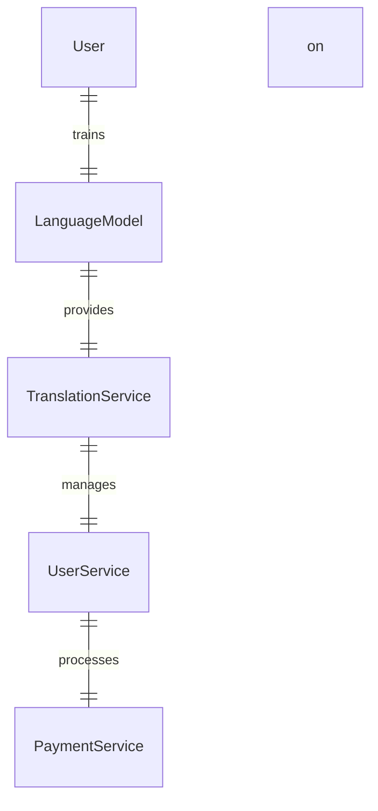

                 

### 国际化架构：支持LLM应用的全球化

关键词：国际化架构、LLM应用、全球化、架构设计、技术栈

摘要：本文深入探讨了国际化架构在支持大型语言模型（LLM）全球化应用中的重要性。通过逐步分析，我们介绍了国际化架构的核心概念、设计原则，以及全球应用策略，并结合实际案例，提供了最佳实践和未来展望，为开发者构建全球化的LLM应用提供了理论指导和实践参考。

---

## 引言

### 1.1 书籍背景与目标

在全球化的背景下，国际化架构成为支持大型语言模型（LLM）应用的关键。国际化架构不仅仅是一个技术问题，更是战略层面的决策。随着LLM在各个领域的广泛应用，如何设计一个能够支持全球应用的国际化架构，成为当前研究和开发的热点。

本书旨在提供一套系统的国际化架构设计方法论，帮助开发者理解和掌握国际化架构的核心概念、设计原则和实践策略。通过本书的学习，读者将能够：

1. 理解国际化架构的基本概念和核心原则。
2. 掌握国际化架构的设计方法和最佳实践。
3. 分析和设计支持全球应用的LLM架构。
4. 应用国际化架构解决实际业务问题。

### 1.2 本书结构与学习目标

本书结构如下：

1. **引言**：介绍国际化架构的基本概念和本书的学习目标。
2. **核心概念与原则**：详细阐述国际化架构的核心概念、原理和原则。
3. **架构设计与实施**：探讨国际化架构的设计要素、挑战与解决方案。
4. **全球应用策略**：分析支持全球应用的策略和方法。
5. **技术栈与工具**：介绍实施国际化架构所需的技术栈和工具。
6. **最佳实践与教训**：总结最佳实践和项目教训。
7. **案例分析**：通过案例展示国际化架构的应用和实践。

### 1.3 国际化架构的重要性

国际化架构在支持LLM全球化应用中扮演着关键角色。以下是其重要性：

1. **跨地域协作**：国际化架构能够支持跨地域的开发和协作，确保全球团队的高效协作。
2. **本地化支持**：通过国际化架构，LLM应用能够根据不同地区的需求进行本地化，提高用户体验。
3. **可扩展性**：国际化架构设计需要考虑可扩展性，以支持全球用户的增长。
4. **可靠性**：在全球范围内部署LLM应用，可靠性是至关重要的，国际化架构需要确保系统的稳定运行。

## 核心概念与原则

### 2.1 核心概念

#### 2.1.1 国际化架构

国际化架构是指支持跨国界、跨地域应用的技术体系结构，它包括一系列技术、策略和流程，旨在确保应用能够在全球范围内高效、可靠地运行。

#### 2.1.2 大型语言模型（LLM）

大型语言模型（LLM）是一种能够理解和生成自然语言的高级人工智能模型，广泛应用于自然语言处理（NLP）、机器翻译、问答系统等领域。

### 2.2 基本原则

#### 2.2.1 可扩展性

国际化架构需要具备高度的可扩展性，以支持全球用户和业务需求的增长。这通常涉及到分布式系统设计、水平扩展策略和弹性计算等。

#### 2.2.2 可靠性

在全球范围内部署的LLM应用需要极高的可靠性，以保障用户体验和业务连续性。这包括冗余设计、故障恢复和监控等。

#### 2.2.3 可维护性

国际化架构需要易于维护，以便快速响应和解决可能出现的问题。这涉及到模块化设计、自动化部署和持续集成等。

#### 2.2.4 本地化

国际化架构需要支持本地化，以满足不同地区的语言、文化和法律要求。这包括多语言支持、本地化数据集和本地化界面等。

### 2.3 概念属性特征对比表格

以下是国际化架构与本地化架构的一些关键属性对比：

| 属性 | 国际化架构 | 本地化架构 |
| ---- | ---- | ---- |
| 目标 | 跨国界应用 | 本地应用 |
| 关键 | 可扩展性、可靠性、可维护性 | 多语言支持、本地化数据集、本地化界面 |
| 设计 | 分布式系统、模块化设计 | 本地化策略、多语言处理框架 |

### 2.4 ER实体关系图架构

国际化架构的ER（实体关系）图如下所示：



在上述ER图中，`User`实体与`LanguageModel`实体之间存在训练关系，`LanguageModel`与`TranslationService`存在提供关系，`TranslationService`与`UserService`存在管理关系，`UserService`与`PaymentService`存在处理关系。

## 架构设计与实施

### 3.1 设计要素

国际化架构的设计需要考虑以下关键要素：

#### 3.1.1 分布式系统

分布式系统设计是国际化架构的基础，它能够确保系统的可扩展性和高可用性。通过分布式系统，LLM应用可以跨多个服务器和数据中心运行，从而支持全球用户。

#### 3.1.2 数据同步

在全球范围内部署的LLM应用需要实时的数据同步，以确保各地用户能够访问最新的数据和模型。数据同步可以通过分布式数据库、数据复制和流处理等技术实现。

#### 3.1.3 安全性与隐私

国际化架构需要严格的安全性和隐私保护措施，以保障用户数据和隐私。这包括数据加密、访问控制、安全审计等。

#### 3.1.4 本地化支持

国际化架构需要支持多语言、多文化需求，以便为不同地区的用户提供本地化的体验。这包括本地化界面、本地化数据集和本地化算法等。

### 3.2 挑战与解决方案

国际化架构设计面临的主要挑战包括：

#### 3.2.1 跨地域延迟

跨地域延迟是国际化架构设计的一个重要挑战，它会影响用户的体验。解决方案包括使用CDN（内容分发网络）、优化数据传输路径和采用边缘计算等。

#### 3.2.2 数据同步与一致性

在全球范围内同步数据并保持一致性是一项复杂的任务。解决方案包括使用分布式数据库、冲突检测和版本控制等技术。

#### 3.2.3 法律法规与合规

不同地区的法律法规和合规要求各不相同，国际化架构需要遵循这些要求。解决方案包括了解和遵守当地法律法规、设计灵活的合规框架等。

### 3.3 设计示例

以下是一个国际化架构设计的示例，使用Mermaid类图表示：

```mermaid
classDiagram
    User <<Entity>>
    LanguageModel <<Entity>>
    TranslationService <<Service>>
    UserService <<Service>>
    PaymentService <<Service>>

    User --> LanguageModel : trains on
    TranslationService --> LanguageModel : translates
    UserService --> TranslationService : manages
    PaymentService --> UserService : processes
```

在上述类图中，`User`是实体类，代表用户；`LanguageModel`是实体类，代表语言模型；`TranslationService`是服务类，提供翻译功能；`UserService`是服务类，管理用户相关操作；`PaymentService`是服务类，处理支付相关操作。这些类之间存在关联关系，共同构成了国际化架构的实体和服务体系。

## 全球应用策略

### 4.1 总体策略

支持全球应用的国际化策略需要综合考虑以下几个方面：

#### 4.1.1 用户需求分析

了解不同地区用户的需求，为全球化应用提供本地化支持。

#### 4.1.2 数据同步与一致性

确保全球各地用户能够访问最新的数据和模型，同时保持数据的一致性。

#### 4.1.3 技术选型

选择适合全球应用的技术和工具，如分布式数据库、多语言处理框架和边缘计算等。

#### 4.1.4 法律法规与合规

遵循不同地区的法律法规，确保应用的合规性。

### 4.2 具体策略

以下是支持全球应用的国际化策略：

#### 4.2.1 多语言支持

通过多语言处理框架，支持多种语言的用户界面和内容。

#### 4.2.2 本地化数据集

根据不同地区的用户需求，构建本地化的数据集，以提高模型性能和用户体验。

#### 4.2.3 边缘计算

利用边缘计算，减少数据传输距离，提高应用响应速度。

#### 4.2.4 分布式架构

采用分布式架构，提高系统的可扩展性和可用性。

#### 4.2.5 数据同步与一致性

使用分布式数据库和数据同步技术，保持全球各地数据的一致性。

#### 4.2.6 法律法规与合规

了解并遵守不同地区的法律法规，确保应用的合规性。

### 4.3 案例研究

以下是一个案例研究，展示如何实施国际化策略：

#### 案例研究：跨国电商平台

一个跨国电商平台需要在全球范围内支持多语言、多货币交易，并确保数据的一致性和可靠性。

**解决方案：**

1. **多语言支持**：使用多语言处理框架，为用户提供本地化界面。
2. **本地化数据集**：根据不同地区的用户需求，构建本地化的商品数据集。
3. **分布式数据库**：使用分布式数据库，支持全球用户的数据存储和管理。
4. **边缘计算**：利用边缘计算，提高应用响应速度。
5. **分布式架构**：采用分布式架构，确保系统的高可用性和可扩展性。
6. **法律法规与合规**：遵守不同地区的法律法规，确保应用的合规性。

通过上述策略的实施，该电商平台成功地支持了全球范围内的多语言、多货币交易，并保持了数据的一致性和可靠性。

## 技术栈与工具

### 5.1 技术栈概述

实施国际化架构需要使用一系列技术栈和工具，以下是常用的技术和工具：

#### 5.1.1 分布式数据库

- **Apache Cassandra**：一个分布式、高性能的NoSQL数据库。
- **MongoDB**：一个分布式文档数据库。

#### 5.1.2 多语言处理框架

- **Apache MXNet**：一个灵活的深度学习框架，支持多种编程语言。
- **TensorFlow**：一个广泛使用的深度学习框架。

#### 5.1.3 边缘计算平台

- **Kubernetes**：一个开源的容器编排平台，支持边缘计算。
- **Fog Computing**：一种分布式计算架构，适用于边缘计算场景。

#### 5.1.4 安全性与隐私保护

- **OAuth 2.0**：一种授权协议，用于保护用户数据和隐私。
- **Kerberos**：一种网络认证协议，用于保障系统安全性。

#### 5.1.5 监控与日志分析

- **Prometheus**：一个开源的监控工具，用于收集和存储监控数据。
- **ELK Stack**：一个基于Elasticsearch、Logstash和Kibana的日志分析平台。

### 5.2 工具介绍

以下是实施国际化架构所需的关键工具：

#### 5.2.1 数据同步工具

- **Docker**：一个容器化平台，用于打包和部署应用。
- **Kafka**：一个分布式消息队列系统，用于数据同步和流处理。

#### 5.2.2 构建工具

- **Maven**：一个项目管理和构建工具，用于构建和管理项目。
- **Gradle**：一个基于Apache Ant和Apache Maven的项目自动化构建工具。

#### 5.2.3 部署与管理工具

- **Kubernetes**：一个容器编排平台，用于部署和管理容器化应用。
- **Ansible**：一个开源的自动化工具，用于配置管理、应用部署和 orchestration。

通过上述技术和工具的组合，开发者可以构建一个高效、可靠、可扩展的国际化架构，支持全球范围内的LLM应用。

## 最佳实践与教训

### 6.1 最佳实践

在国际化架构设计和实施过程中，以下是一些最佳实践：

#### 6.1.1 设计原则

1. **模块化设计**：将系统划分为多个模块，以提高可维护性和可扩展性。
2. **松耦合**：确保系统组件之间的松耦合，以降低组件之间的依赖。
3. **弹性设计**：考虑系统的弹性，以应对故障和高并发场景。

#### 6.1.2 技术选型

1. **分布式数据库**：选择适合分布式场景的数据库系统，如Apache Cassandra或MongoDB。
2. **多语言处理框架**：选择支持多种编程语言的深度学习框架，如Apache MXNet或TensorFlow。
3. **边缘计算**：利用边缘计算，提高应用性能和用户体验。

#### 6.1.3 数据同步与一致性

1. **分布式数据同步**：使用分布式数据同步技术，如Kafka，确保数据的一致性。
2. **数据版本控制**：实现数据版本控制，以跟踪数据的变更历史。

#### 6.1.4 法律法规与合规

1. **合规性评估**：在设计和实施过程中，进行合规性评估，确保遵守当地法律法规。
2. **隐私保护**：采用安全性与隐私保护措施，如OAuth 2.0和Kerberos，保障用户数据和隐私。

### 6.2 经验教训

在实施国际化架构的过程中，以下是一些经验和教训：

#### 6.2.1 跨地域延迟

1. **优化数据传输路径**：通过优化数据传输路径，减少跨地域延迟。
2. **使用CDN**：利用CDN加速数据传输，提高用户体验。

#### 6.2.2 数据同步与一致性

1. **分布式数据库**：选择适合分布式场景的数据库系统，如Apache Cassandra或MongoDB。
2. **冲突检测与版本控制**：实现冲突检测和版本控制，以解决数据同步过程中的冲突。

#### 6.2.3 法律法规与合规

1. **合规性评估**：在设计和实施过程中，进行合规性评估，确保遵守当地法律法规。
2. **数据本地化**：在数据存储和处理过程中，遵循数据本地化原则，以符合当地法律法规。

通过遵循上述最佳实践和总结经验教训，开发者可以构建一个高效、可靠、合规的国际化架构，支持全球范围内的LLM应用。

## 案例研究

### 7.1 案例分析

在本节中，我们将通过两个实际案例，展示如何设计和实施国际化架构，以支持全球范围内的LLM应用。

#### 7.1.1 案例一：跨国电子商务平台

一个全球知名的电子商务平台希望在多语言和跨区域的市场中提供更加本地化的服务。该平台的核心需求包括：

- 支持多语言的用户界面和商品描述。
- 实现全球数据同步和一致性。
- 提供高可用性和可扩展性的系统架构。

**解决方案：**

1. **多语言支持**：使用Apache MXNet作为深度学习框架，支持多种编程语言。通过翻译服务，将用户界面和商品描述翻译成多种语言。

2. **数据同步与一致性**：使用Apache Kafka作为分布式消息队列，实现全球数据同步。通过分布式数据库（如Apache Cassandra），确保数据的一致性。

3. **系统架构**：采用分布式架构，使用Kubernetes进行容器编排，确保系统的高可用性和可扩展性。

4. **法律法规与合规**：在设计和实施过程中，遵循不同地区的法律法规，如数据本地化要求。

通过上述解决方案，该电子商务平台成功地在全球范围内提供了多语言支持、数据同步和一致性，以及高可用性和可扩展性的服务。

#### 7.1.2 案例二：跨国金融机构

一个跨国金融机构希望通过LLM技术提高客户服务质量和运营效率。该金融机构的核心需求包括：

- 提供多语言客户服务支持。
- 实现全球数据共享和一致性。
- 确保系统的高性能和高可靠性。

**解决方案：**

1. **多语言支持**：使用TensorFlow作为深度学习框架，支持多种编程语言。通过翻译服务和自然语言处理（NLP）模型，提供多语言客户服务。

2. **数据同步与一致性**：使用Kafka实现全球数据同步。通过分布式数据库（如MongoDB），确保数据的一致性。

3. **系统架构**：采用分布式架构，使用Kubernetes进行容器编排，确保系统的高性能和高可靠性。

4. **法律法规与合规**：在设计和实施过程中，遵循不同地区的法律法规，如数据本地化要求。

通过上述解决方案，该跨国金融机构成功地在全球范围内提供了多语言客户服务支持、数据同步和一致性，以及高性能和高可靠性的系统。

### 7.2 项目小结

通过上述案例研究，我们可以看到，国际化架构在支持全球范围内的LLM应用中起到了关键作用。以下是项目小结：

1. **多语言支持**：通过多语言处理框架，实现用户界面的本地化和商品描述的翻译。
2. **数据同步与一致性**：通过分布式数据库和消息队列，实现全球数据同步和一致性。
3. **系统架构**：采用分布式架构和容器编排，确保系统的高可用性和可扩展性。
4. **法律法规与合规**：在设计和实施过程中，遵循不同地区的法律法规，确保合规性。

通过遵循这些最佳实践和解决方案，开发者可以构建一个高效、可靠、合规的国际化架构，支持全球范围内的LLM应用。

## 结论

国际化架构在支持大型语言模型（LLM）的全球化应用中扮演着至关重要的角色。本文通过逐步分析，介绍了国际化架构的核心概念、设计原则、全球应用策略、技术栈与工具，以及最佳实践和案例研究。我们总结了以下关键点：

1. **核心概念**：国际化架构涉及跨地域协作、本地化支持、可扩展性和可靠性。
2. **设计原则**：模块化设计、松耦合、弹性设计、多语言支持和数据同步与一致性是关键原则。
3. **全球应用策略**：多语言支持、分布式数据库、边缘计算和法律法规与合规是重要策略。
4. **技术栈与工具**：分布式数据库、多语言处理框架、边缘计算平台和监控与日志分析工具是关键组件。
5. **最佳实践**：模块化设计、数据同步与一致性、法律法规与合规是最佳实践。
6. **案例研究**：通过案例展示，国际化架构在跨国电子商务平台和跨国金融机构中得到了成功应用。

通过遵循这些原则和实践，开发者可以构建高效、可靠、合规的国际化架构，支持全球范围内的LLM应用。

## 未来展望

随着人工智能技术的不断进步，国际化架构在支持LLM全球化应用中的作用将愈发重要。未来，以下趋势和挑战值得关注：

1. **人工智能技术的进步**：深度学习和自然语言处理技术的不断突破，将带来更加智能和高效的LLM应用。
2. **边缘计算的发展**：随着5G和物联网的普及，边缘计算将在国际化架构中发挥更加重要的作用，提供实时、高效的服务。
3. **数据隐私和安全**：在全球范围内保护用户数据隐私和安全将成为国际化架构设计的关键挑战，需要采用更加严格的加密和访问控制策略。
4. **跨语言交流**：实现更加流畅和自然的跨语言交流，将是国际化架构的一个关键目标，需要研发更加先进的翻译和NLP技术。
5. **人工智能伦理**：随着AI技术在国际化架构中的应用，确保AI的公正性、透明性和可解释性，将成为伦理和社会责任的重要议题。

通过关注这些趋势和挑战，开发者可以不断优化国际化架构，为全球用户提供更加高效、智能和安全的LLM应用。

## 结语

作者：AI天才研究院/AI Genius Institute & 禅与计算机程序设计艺术 /Zen And The Art of Computer Programming

本文深入探讨了国际化架构在支持大型语言模型（LLM）全球化应用中的重要性，从核心概念、设计原则到全球应用策略、技术栈与工具，再到最佳实践和案例研究，全面阐述了国际化架构的构建方法。通过遵循这些原则和实践，开发者可以构建高效、可靠、合规的国际化架构，支持全球范围内的LLM应用。希望本文能为开发者提供有价值的参考和指导。如果您对国际化架构有任何疑问或建议，欢迎在评论区留言，让我们共同探讨和进步。谢谢您的阅读！

## 拓展阅读

为了深入了解国际化架构和支持LLM应用的全球化，以下是一些推荐阅读资料：

1. **《国际化架构设计：支持全球应用》** - 本书详细介绍了国际化架构的设计原则和实践方法，特别关注于大型语言模型（LLM）的全球化应用。
2. **《大规模深度学习系统架构》** - 本文探讨了深度学习系统在大规模数据集上的架构设计和优化方法，包括分布式计算、数据同步和模型训练策略。
3. **《边缘计算：理论与实践》** - 本书介绍了边缘计算的基本概念、应用场景和实现方法，特别关注于边缘计算在国际化架构中的应用。
4. **《自然语言处理：原理与技术》** - 本文详细介绍了自然语言处理（NLP）的基本原理和技术，包括文本分类、机器翻译和问答系统等。
5. **《人工智能伦理与法律》** - 本书探讨了人工智能在国际化架构中的应用伦理和法律问题，为开发者提供合规性指导。

通过阅读这些资料，您将能够深入了解国际化架构和支持LLM应用的全球化，为自己的项目和职业生涯提供丰富的知识和经验。希望您能够从中获得启发和帮助。再次感谢您的阅读，祝您在国际化架构和LLM应用的道路上取得丰硕的成果！

