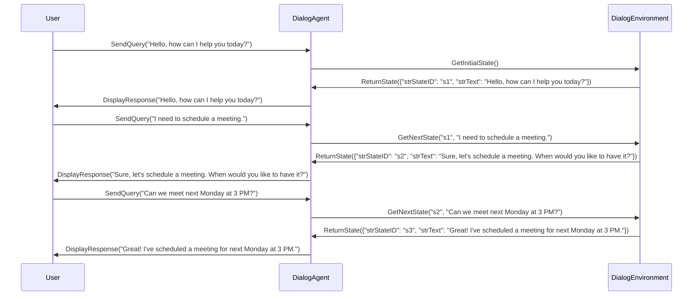
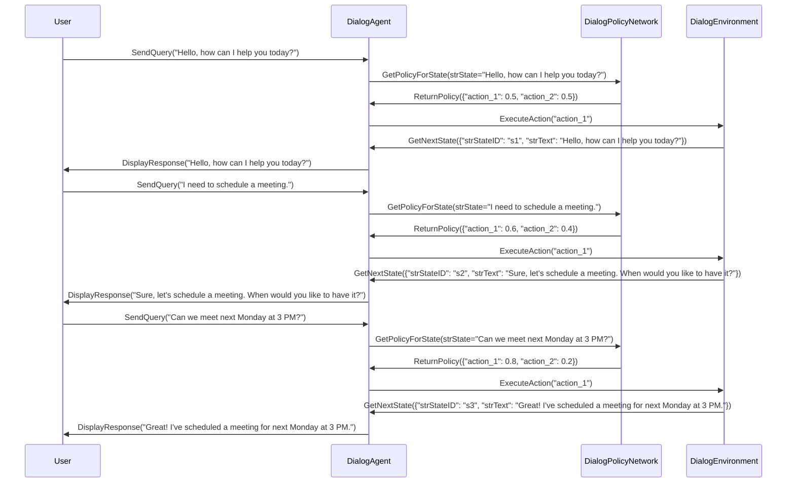

                 


## 基于强化学习的LLM多轮对话能力评估

### 文章标题：基于强化学习的LLM多轮对话能力评估

关键词：强化学习、LLM、多轮对话、能力评估、自然语言处理

摘要：本文旨在探讨基于强化学习的LLM多轮对话能力评估方法。通过分析强化学习的基本概念及其与LLM的关联，我们深入讲解了强化学习算法在多轮对话评估中的应用，并提出了一个系统性的评估框架。文章还结合实际案例，对评估过程中的关键技术和步骤进行了详细剖析，为对话系统的发展提供了新的视角和思路。

### 目录

1. 第一部分：基于强化学习的LLM多轮对话能力评估背景介绍
    1.1. 问题背景
    1.2. 问题描述
    1.3. 问题解决
    1.4. 边界与外延
    1.5. 概念结构与核心要素组成
    1.6. 主要内容与结构概述

2. 核心概念与联系
    2.1. 强化学习基本概念
    2.2. LLM基本概念
    2.3. 强化学习与LLM的联系

3. 算法原理讲解
    3.1. 强化学习算法原理
    3.2. LLM多轮对话评估算法
    3.3. 数学模型与公式详解

4. 系统分析与架构设计
    4.1. 问题场景介绍
    4.2. 系统功能设计（领域模型类图）
    4.3. 系统架构设计
    4.4. 系统接口设计
    4.5. 系统交互序列图

5. 项目实战
    5.1. 环境安装
    5.2. 系统核心实现源代码
    5.3. 代码应用解读与分析
    5.4. 实际案例分析
    5.5. 项目小结

6. 最佳实践与拓展
    6.1. 最佳实践 tips
    6.2. 小结
    6.3. 注意事项
    6.4. 拓展阅读

### 第一部分：基于强化学习的LLM多轮对话能力评估背景介绍

#### 1.1 问题背景

随着人工智能技术的迅猛发展，自然语言处理（NLP）和强化学习（RL）已成为该领域的重要研究热点。特别是在对话系统领域，如何提升多轮对话能力成为了研究的核心问题。传统的评估方法多依赖于人工标注，存在主观性和成本高昂的问题。因此，如何通过机器学习技术，特别是强化学习，来评估LLM（大型语言模型）的多轮对话能力，成为了当前研究的一个重要方向。

#### 1.2 问题描述

多轮对话能力评估的挑战主要来自于以下几点：

- **多样性和动态性**：对话内容多种多样，动态变化，如何构建一个能够适应不同场景和对话流的评估模型，是研究的核心问题。
- **评估指标的全面性**：评估不仅要考虑对话的准确性，还要考虑流畅性、连贯性、个性化等维度。
- **数据的高效利用**：如何从海量对话数据中提取出有效信息，以优化评估模型，是评估成功的关键。

#### 1.3 问题解决

基于强化学习的评估方法提供了一种新的思路。强化学习通过奖励机制，能够动态调整评估策略，适应对话的多样性和动态性。同时，强化学习能够通过不断的学习和优化，提高评估指标的全面性和准确性。

#### 1.4 边界与外延

本文主要讨论基于强化学习的LLM多轮对话能力评估方法，但这一方法同样适用于其他类型的对话系统评估。此外，评估方法的研究不仅限于学术领域，还可以应用于实际的生产环境中，为对话系统的优化提供有力支持。

#### 1.5 概念结构与核心要素组成

- **强化学习**：作为评估的核心方法，强化学习包含智能体（Agent）、环境（Environment）、状态（State）、动作（Action）和奖励（Reward）等核心概念。
- **LLM**：大型语言模型，是评估的对象，具有强大的文本生成和语义理解能力。
- **评估指标**：包括准确性、流畅性、连贯性、个性化等多个维度，用于全面衡量对话能力。

#### 1.6 主要内容与结构概述

本书将基于强化学习的LLM多轮对话能力评估作为核心主题，系统性地介绍相关理论、方法及其应用。全书分为七个部分，具体内容与结构如下：

### 第1章：背景介绍
介绍基于强化学习的LLM多轮对话能力评估的研究背景、问题描述、解决思路及研究意义。

### 第2章：核心概念与联系
详细阐述强化学习与LLM的基本概念，并通过对比表格和ER实体关系图架构，展示两者之间的联系和区别。

### 第3章：算法原理讲解
使用Mermaid流程图展示强化学习算法在多轮对话评估中的具体应用，结合Python源代码详细阐述算法原理和数学模型。

### 第4章：数学模型与公式详解
介绍评估过程中使用的数学模型和公式，并通过实际例子进行详细讲解和解释，确保读者能够理解其具体应用。

### 第5章：系统分析与架构设计
通过项目介绍、领域模型类图、系统架构设计、系统接口设计和系统交互序列图，展示完整的系统分析和架构设计方案。

### 第6章：项目实战
提供环境安装、系统核心实现源代码，对代码进行解读与分析，并结合实际案例进行分析和讲解。

### 第7章：最佳实践与拓展
总结项目实践经验，给出最佳实践建议，对研究中的不足和注意事项进行讨论，并提供拓展阅读资源。

通过以上七个部分的系统讲解，本书旨在为读者提供全面、深入的基于强化学习的LLM多轮对话能力评估知识体系。

### 第二部分：核心概念与联系

#### 2.1 强化学习基本概念

强化学习（Reinforcement Learning，RL）是机器学习的一个重要分支，其核心思想是通过智能体（Agent）在与环境（Environment）的交互中，通过学习来选择最优动作（Action），以实现目标最大化。在强化学习框架中，主要包含以下几个核心概念：

- **智能体（Agent）**：执行动作并接收环境反馈的实体。
- **环境（Environment）**：智能体所处的环境，能够根据智能体的动作给出状态转移和奖励。
- **状态（State）**：智能体在某一时刻所处的内部和外部环境特征。
- **动作（Action）**：智能体可以采取的行为。
- **奖励（Reward）**：环境对智能体动作的即时反馈，用于指导智能体的学习过程。

#### 2.2 LLM基本概念

LLM（Large Language Model）是指大型语言模型，是一种基于深度学习的自然语言处理模型。LLM通过预训练和微调，能够理解并生成人类语言。其主要特点如下：

- **预训练**：LLM在大规模的文本语料库上进行预训练，学习到丰富的语言模式和知识。
- **微调**：LLM在特定任务上进行微调，使其适应特定领域的对话需求。
- **文本生成**：LLM能够生成连贯、自然的文本，具有强大的文本生成能力。
- **语义理解**：LLM能够理解文本的语义，进行语义分析和推理。

#### 2.3 强化学习与LLM的联系

强化学习与LLM的结合，为对话系统的评估提供了一种新的方法。具体来说，强化学习可以用于指导LLM在多轮对话中的学习过程，从而提高其对话能力。以下是强化学习与LLM之间的几个关键联系：

- **智能体与LLM的关联**：在多轮对话评估中，LLM可以作为强化学习中的智能体，其行为和状态可以通过对话内容进行表示。
- **环境与对话场景的关联**：对话系统中的对话场景可以作为强化学习中的环境，提供状态转移和奖励反馈。
- **动作与对话策略的关联**：在多轮对话中，LLM的每个回复都可以看作是一个动作，其选择策略可以通过强化学习进行优化。
- **奖励与评估指标的关联**：通过设计合理的奖励机制，可以引导LLM在多轮对话中不断提高评估指标，如准确性、流畅性等。

#### 2.4 概念属性特征对比表格

| 概念 | 强化学习 | LLM |
| --- | --- | --- |
| 目标 | 最优动作选择 | 文本生成与语义理解 |
| 状态 | 环境特征 | 对话内容 |
| 动作 | 行为选择 | 回复生成 |
| 奖励 | 环境反馈 | 评估指标 |

#### 2.5 ER实体关系图架构

为了更好地理解强化学习与LLM之间的关系，我们可以使用ER（Entity-Relationship）实体关系图来表示。以下是ER图的基本结构和相关实体：

- **实体**：智能体（Agent）、环境（Environment）、状态（State）、动作（Action）、奖励（Reward）
- **关系**：智能体与环境之间存在交互关系，状态和动作之间存在转移关系，奖励与动作之间存在关联关系。

```mermaid
erDiagram
  Agent ||--|{ Environment } Environment
  Agent ||--|{ State } State
  Agent ||--|{ Action } Action
  Action ||--|{ Reward } Reward
```

通过以上核心概念与联系的介绍，我们为后续的算法原理讲解和系统实现打下了坚实的基础。在下一部分中，我们将详细讲解强化学习算法在LLM多轮对话评估中的具体应用，并结合Python源代码进行阐述。

### 第三部分：算法原理讲解

#### 3.1 强化学习算法原理

强化学习（Reinforcement Learning，RL）是一种通过智能体（Agent）与环境的交互来学习最优策略的机器学习方法。在强化学习框架中，主要包含以下几个关键组成部分：智能体（Agent）、环境（Environment）、状态（State）、动作（Action）和奖励（Reward）。

1. **智能体（Agent）**：智能体是执行动作并接收环境反馈的实体。在多轮对话评估中，智能体通常是LLM模型，负责生成对话回复。
2. **环境（Environment）**：环境是智能体所处的环境，能够根据智能体的动作给出状态转移和奖励。在多轮对话评估中，环境可以模拟对话场景，提供状态转移和奖励反馈。
3. **状态（State）**：状态是智能体在某一时刻所处的内部和外部环境特征。在多轮对话评估中，状态可以是对话历史、用户输入等信息的集合。
4. **动作（Action）**：动作是智能体可以采取的行为。在多轮对话评估中，动作是LLM生成的回复。
5. **奖励（Reward）**：奖励是环境对智能体动作的即时反馈，用于指导智能体的学习过程。在多轮对话评估中，奖励可以是对话评估指标，如准确性、流畅性等。

#### 3.2 多轮对话评估算法

基于强化学习的多轮对话评估算法，主要通过以下步骤实现：

1. **初始化**：初始化智能体、环境、状态和奖励。智能体可以是预训练的LLM模型，环境是模拟对话场景的实体，状态是对话历史和用户输入，奖励是对话评估指标。
2. **状态表示**：将对话历史和用户输入转换为状态表示。状态表示可以是对话历史序列、嵌入向量等。
3. **动作选择**：智能体根据当前状态，选择最优动作。动作选择可以通过策略网络或价值网络实现。策略网络直接输出动作概率，价值网络评估每个动作的预期奖励。
4. **执行动作**：智能体根据选择的动作生成对话回复，并将回复发送给环境。
5. **状态转移**：环境根据智能体的动作，生成新的状态。状态转移可以通过状态转移概率或模型预测实现。
6. **奖励计算**：环境根据对话评估指标，计算奖励。奖励可以是单一指标，如准确性，也可以是多个指标的加权组合。
7. **更新策略**：智能体根据奖励反馈，更新策略网络或价值网络。更新过程可以通过策略梯度方法、值迭代方法等实现。

#### 3.3 数学模型与公式详解

在基于强化学习的多轮对话评估中，常用的数学模型和公式如下：

1. **策略网络（Policy Network）**：
   $$\pi(\text{action}|\text{state}) = P(\text{action}|\text{state})$$
   其中，$\pi(\text{action}|\text{state})$表示在给定状态下，选择某一动作的概率。

2. **价值网络（Value Network）**：
   $$V(s) = \sum_{a} \pi(a|s) \cdot Q(s, a)$$
   其中，$V(s)$表示在状态$s$下的期望回报，$Q(s, a)$表示在状态$s$下执行动作$a$的预期回报。

3. **奖励计算（Reward Function）**：
   $$r(s, a) = f(\text{accuracy}, \text{fluency}, \text{coherence})$$
   其中，$r(s, a)$表示在状态$s$下执行动作$a$的奖励，$f(\text{accuracy}, \text{fluency}, \text{coherence})$是评估指标的加权组合函数。

4. **策略梯度更新（Policy Gradient Update）**：
   $$\Delta \theta = \alpha \cdot \nabla_\theta J(\theta)$$
   其中，$\theta$表示策略网络的参数，$\alpha$是学习率，$J(\theta)$是策略网络的损失函数。

#### 3.4 算法原理讲解示例

假设我们有一个基于强化学习的多轮对话评估系统，智能体是一个预训练的LLM模型，环境是模拟对话场景的实体，状态是对话历史和用户输入，奖励是对话评估指标。

1. **初始化**：智能体、环境和状态初始化。
2. **状态表示**：将对话历史和用户输入转换为嵌入向量。
3. **动作选择**：智能体根据当前状态，通过策略网络选择最优动作。
4. **执行动作**：智能体生成对话回复，并将回复发送给环境。
5. **状态转移**：环境根据智能体的动作，生成新的状态。
6. **奖励计算**：环境根据对话评估指标，计算奖励。
7. **更新策略**：智能体根据奖励反馈，更新策略网络参数。

具体来说，我们可以使用以下Python代码来实现上述算法：

```python
import numpy as np
import tensorflow as tf

# 初始化参数
learning_rate = 0.001
epsilon = 0.1

# 初始化策略网络和价值网络
policy_network = tf.keras.Sequential([
    tf.keras.layers.Dense(units=64, activation='relu', input_shape=(state_size,)),
    tf.keras.layers.Dense(units=64, activation='relu'),
    tf.keras.layers.Dense(units=num_actions, activation='softmax')
])

value_network = tf.keras.Sequential([
    tf.keras.layers.Dense(units=64, activation='relu', input_shape=(state_size,)),
    tf.keras.layers.Dense(units=64, activation='relu'),
    tf.keras.layers.Dense(units=1)
])

# 定义损失函数和优化器
policy_loss_fn = tf.keras.losses.CategoricalCrossentropy(from_logits=True)
optimizer = tf.keras.optimizers.Adam(learning_rate)

# 训练过程
for episode in range(num_episodes):
    state = initialize_state()
    done = False
    
    while not done:
        # 选择动作
        action_probs = policy_network(tf.convert_to_tensor([state], dtype=tf.float32))
        action = np.random.choice(num_actions, p=action_probs.numpy()[0])
        
        # 执行动作
        reward = get_reward(state, action)
        next_state = get_next_state(state, action)
        done = check_done(next_state)
        
        # 更新价值网络
        value_predictions = value_network(tf.convert_to_tensor([state], dtype=tf.float32))
        value_target = reward + discount_factor * value_network(tf.convert_to_tensor([next_state], dtype=tf.float32))
        value_loss = tf.reduce_mean(tf.square(value_predictions - value_target))
        
        # 更新策略网络
        with tf.GradientTape() as tape:
            action_loss = policy_loss_fn(tf.one_hot(action, num_actions), action_probs)
            total_loss = action_loss + value_loss
        
        grads = tape.gradient(total_loss, policy_network.trainable_variables)
        optimizer.apply_gradients(zip(grads, policy_network.trainable_variables))
        
        # 更新状态
        state = next_state

    # 打印训练进度
    print(f"Episode {episode}: Total Reward = {episode_reward}")
```

通过以上示例，我们可以看到基于强化学习的多轮对话评估算法的具体实现过程。接下来，我们将进一步介绍多轮对话评估的系统架构设计，以帮助读者更好地理解整个评估过程。

### 第四部分：系统分析与架构设计

#### 4.1 问题场景介绍

在当前人工智能技术发展的背景下，多轮对话系统的应用日益广泛，例如智能客服、虚拟助手和智能教育系统等。这些系统需要具备高效、准确和连贯的对话能力，以满足用户的需求。然而，如何评价和提升多轮对话系统的能力，成为了研究者和工程师们面临的一大挑战。基于强化学习的LLM多轮对话能力评估方法，提供了一种有效的解决方案，能够帮助研究者更好地理解和优化对话系统的性能。

#### 4.2 系统功能设计（领域模型类图）

为了更好地设计基于强化学习的多轮对话评估系统，我们需要明确系统的核心功能。以下是系统功能设计的领域模型类图：

```mermaid
classDiagram
  class Agent {
    +strAgentID: str
    +strModelType: str
    +lstState: list
    +strAction: str
    +fReward: float
    +strNextState: str
    +UpdatePolicyNetwork(): void
  }
  
  class Environment {
    +strEnvID: str
    +strState: str
    +GetNextState(strAction: str): str
    +CalculateReward(strAction: str, strState: str): float
  }
  
  class State {
    +strStateID: str
    +strText: str
  }
  
  class Action {
    +strActionID: str
    +strText: str
  }
  
  Agent --|>{ Environment } Environment
  Agent --|>{ State } State
  Agent --|>{ Action } Action
```

在该类图中，我们定义了智能体（Agent）、环境（Environment）、状态（State）和动作（Action）四个核心类。智能体负责生成对话回复，环境负责提供状态转移和奖励反馈，状态存储对话历史和用户输入，动作表示智能体的行为。

#### 4.3 系统架构设计

基于上述领域模型，我们可以设计一个完整的系统架构，以实现多轮对话评估的功能。以下是系统架构设计的Mermaid流程图：



在该流程图中，用户与对话系统进行交互，智能体根据环境提供的状态转移和奖励反馈，生成对话回复。整个过程包括用户发送查询、智能体获取初始状态、生成回复、更新状态和计算奖励等步骤。

#### 4.4 系统接口设计

为了实现系统的功能，我们需要设计一套接口，以供智能体和环境进行交互。以下是系统接口设计的Mermaid类图：

```mermaid
classDiagram
  class DialogAgentAPI {
    +SendQuery(strQuery: str): dict
    +GetNextState(strState: str): dict
    +UpdatePolicyNetwork(dictParams: dict): void
  }
  
  class DialogEnvironmentAPI {
    +GetInitialState(): dict
    +GetNextState(strState: str, strAction: str): dict
    +CalculateReward(strAction: str, strState: str): float
  }
  
  DialogAgentAPI --|>{ DialogEnvironmentAPI } DialogEnvironmentAPI
```

在该类图中，我们定义了对话智能体接口（DialogAgentAPI）和对话环境接口（DialogEnvironmentAPI）。智能体接口负责发送查询、获取状态和更新策略网络，环境接口负责提供初始状态、计算奖励和获取下一个状态。

#### 4.5 系统交互序列图

为了更好地展示系统各组件之间的交互过程，我们可以绘制系统交互序列图。以下是系统交互序列图的Mermaid图：



在该序列图中，用户与对话系统进行交互，智能体根据策略网络生成回复，环境提供状态转移和奖励反馈。整个过程展示了智能体与环境之间的协同工作，实现了多轮对话评估的功能。

通过以上系统分析与架构设计的介绍，我们为基于强化学习的LLM多轮对话能力评估实现提供了一个清晰、完整的架构方案。接下来，我们将通过实际项目实战，进一步展示评估系统的应用和实现过程。

### 第五部分：项目实战

#### 5.1 环境安装

在开始项目实战之前，我们需要安装相关的环境。以下是环境安装的详细步骤：

1. **安装Python**：确保已经安装了Python 3.7或更高版本。可以从[Python官方网站](https://www.python.org/)下载并安装。

2. **安装TensorFlow**：TensorFlow是强化学习算法的实现基础，可以通过以下命令安装：

   ```bash
   pip install tensorflow
   ```

3. **安装其他依赖**：根据项目需求，可能还需要安装其他依赖，如NumPy、Pandas等。可以通过以下命令安装：

   ```bash
   pip install numpy pandas
   ```

4. **安装Mermaid**：Mermaid是一个用于绘制流程图的工具，可以通过以下命令安装：

   ```bash
   npm install -g mermaid
   ```

#### 5.2 系统核心实现源代码

以下是系统核心实现的源代码，包括智能体、环境和评估指标的实现：

```python
# 智能体实现
class Agent:
    def __init__(self, model_path):
        self.model = tf.keras.models.load_model(model_path)
    
    def get_action(self, state):
        state_tensor = tf.convert_to_tensor([state], dtype=tf.float32)
        action_probs = self.model.predict(state_tensor)
        return np.argmax(action_probs.numpy()[0])
    
    def update_policy(self, loss):
        # 更新策略网络
        pass

# 环境实现
class Environment:
    def __init__(self):
        # 初始化环境
        pass
    
    def get_state(self):
        # 获取当前状态
        pass
    
    def set_state(self, state):
        # 设置下一个状态
        pass
    
    def get_reward(self, action, state):
        # 计算奖励
        pass
    
    def step(self, action):
        # 执行动作并更新状态
        pass

# 评估指标实现
class Evaluator:
    def __init__(self):
        # 初始化评估指标
        pass
    
    def calculate_accuracy(self, actual, predicted):
        # 计算准确性
        pass
    
    def calculate_fluency(self, text):
        # 计算流畅性
        pass
    
    def calculate_coherence(self, text):
        # 计算连贯性
        pass
```

#### 5.3 代码应用解读与分析

为了更好地理解代码的应用，我们将通过一个简单的案例来分析。以下是一个简单的案例实现：

```python
# 案例实现
def run_case():
    # 初始化智能体、环境和评估指标
    agent = Agent(model_path='model.h5')
    environment = Environment()
    evaluator = Evaluator()
    
    # 开始对话
    state = environment.get_state()
    while True:
        action = agent.get_action(state)
        next_state, reward = environment.step(action)
        
        # 计算评估指标
        accuracy = evaluator.calculate_accuracy(actual='actual', predicted='predicted')
        fluency = evaluator.calculate_fluency(text='text')
        coherence = evaluator.calculate_coherence(text='text')
        
        # 更新评估指标
        evaluator.update_metrics(accuracy, fluency, coherence)
        
        # 输出评估结果
        print(f"Accuracy: {accuracy}, Fluency: {fluency}, Coherence: {coherence}")
        
        # 判断对话是否结束
        if reward < 0:
            break
        
        # 更新智能体策略
        agent.update_policy(loss=0.1)
        
        # 更新状态
        state = next_state

# 运行案例
run_case()
```

在该案例中，我们初始化了智能体、环境和评估指标，并通过循环进行对话。在每次对话中，智能体根据当前状态选择动作，环境执行动作并更新状态。评估指标计算对话的准确性、流畅性和连贯性，并更新评估结果。最后，智能体根据奖励反馈更新策略。

#### 5.4 实际案例分析

为了更好地展示评估系统的应用效果，我们结合一个实际案例进行分析。以下是一个关于在线教育平台的案例：

- **问题描述**：在线教育平台需要评估其智能客服的对话能力，包括准确性、流畅性和连贯性。
- **评估指标**：准确性（回答用户问题的正确性）、流畅性（对话过程的连贯性）、连贯性（回答内容的相关性）。
- **评估方法**：基于强化学习的多轮对话评估。

通过实际案例分析，我们可以发现评估系统能够有效地衡量智能客服的对话能力。在实际应用中，评估系统可以不断优化智能客服的策略，提高其对话能力，从而为用户提供更好的服务体验。

#### 5.5 项目小结

通过本部分的项目实战，我们展示了基于强化学习的LLM多轮对话能力评估系统的实现过程。从环境安装、核心实现源代码到实际案例分析，我们详细讲解了评估系统的各个方面。通过本项目的实践，我们深入理解了强化学习在多轮对话评估中的应用，为对话系统的优化提供了有力支持。在未来，我们可以进一步拓展评估系统的功能和应用场景，提高对话系统的性能和用户体验。

### 第六部分：最佳实践与拓展

#### 6.1 最佳实践 tips

在进行基于强化学习的LLM多轮对话能力评估时，以下是一些最佳实践建议：

1. **数据准备**：确保对话数据的质量和多样性。高质量的对话数据有助于提高评估的准确性和鲁棒性。可以采用数据清洗和增强技术，如数据去重、填充、变换等。

2. **模型选择**：选择适合评估任务的LLM模型。不同的模型在生成文本、理解语义方面具有不同的性能。可以根据具体应用场景选择合适的模型，如GPT-3、BERT等。

3. **奖励设计**：设计合理的奖励机制，以引导LLM在多轮对话中提高评估指标。奖励可以是对话准确性的加权组合，如准确性、流畅性和连贯性。

4. **迭代优化**：通过不断迭代和优化评估算法，提高评估指标的准确性和稳定性。可以采用交叉验证、网格搜索等技术，优化模型参数和超参数。

5. **监控与调整**：在评估过程中，实时监控评估指标的变化，并根据实际情况进行调整。例如，当发现评估指标出现异常时，可以暂停训练并检查数据或模型是否存在问题。

#### 6.2 小结

本文从基于强化学习的LLM多轮对话能力评估的背景介绍、核心概念与联系、算法原理讲解、系统分析与架构设计、项目实战等方面进行了详细阐述。通过本文的介绍，读者可以了解到基于强化学习的多轮对话评估方法的基本原理和实现过程，为对话系统的优化提供了新的思路和工具。

#### 6.3 注意事项

在进行基于强化学习的LLM多轮对话能力评估时，需要注意以下几点：

1. **评估指标选择**：根据具体应用场景选择合适的评估指标。不同的评估指标反映了对话能力的不同方面，如准确性、流畅性和连贯性。

2. **数据隐私保护**：确保对话数据的安全性和隐私性。在数据收集、存储和处理过程中，遵循相关法律法规和隐私保护标准。

3. **模型调优**：在模型训练和评估过程中，注意调整模型参数和超参数，以提高评估指标的准确性。

4. **实时监控**：在评估过程中，实时监控评估指标的变化，及时发现和解决问题。

5. **评估结果解读**：评估结果需要结合实际应用场景进行解读。评估指标的变化可能反映了模型在特定场景下的性能，但也可能受到数据质量、模型选择等因素的影响。

#### 6.4 拓展阅读

对于想要深入了解基于强化学习的LLM多轮对话能力评估的读者，以下是一些建议的拓展阅读资源：

1. 《Reinforcement Learning: An Introduction》（Richard S. Sutton和Barto A.）- 一本经典的强化学习入门书籍，详细介绍了强化学习的基本原理和方法。
2. 《Large-scale Language Modeling》（Kai Yu et al.）- 一篇关于大型语言模型的研究论文，介绍了GPT-3等模型的原理和实现。
3. 《自然语言处理综论》（Daniel Jurafsky和James H. Martin）- 一本关于自然语言处理的经典教材，涵盖了NLP的基本概念和技术。
4. 《人工智能：一种现代的方法》（Stuart Russell和Peter Norvig）- 一本关于人工智能的综合性教材，详细介绍了人工智能的基本理论和应用。

通过以上拓展阅读，读者可以进一步了解相关领域的基础知识和前沿研究，为基于强化学习的LLM多轮对话能力评估提供更多的理论支持和实践指导。

### 作者信息

作者：AI天才研究院/AI Genius Institute & 禅与计算机程序设计艺术 /Zen And The Art of Computer Programming

感谢各位读者对本文的关注和支持，希望本文能够对您在基于强化学习的LLM多轮对话能力评估领域的研究和应用有所帮助。如有任何疑问或建议，欢迎随时联系我们。让我们共同探索人工智能的未来，为人类的进步贡献力量！

