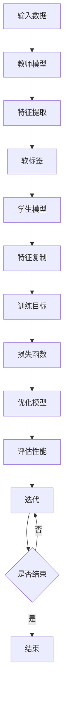

                 

### 《基于知识蒸馏的LLM能力评估方法》

#### 关键词：知识蒸馏、大型语言模型（LLM）、能力评估、算法原理、数学模型、系统架构、项目实战

> 摘要：本文旨在探讨基于知识蒸馏的LLM能力评估方法。通过对知识蒸馏和LLM能力评估的基本概念进行介绍，文章详细讲解了知识蒸馏的算法原理和数学模型。此外，文章还分析了整个系统的功能设计、架构设计、接口设计以及交互流程。通过实际案例的分析和解读，本文提供了知识蒸馏在LLM能力评估中的应用实践。最后，文章总结了书中的内容，并给出了实践建议、注意事项和拓展阅读，以促进进一步的学习和探索。

## **1. 标题与概述**

### 1.1 书籍标题的意义

“基于知识蒸馏的LLM能力评估方法”这一标题反映了本书的核心内容和研究方向。知识蒸馏（Distributed Knowledge Distillation）作为一种先进的机器学习技术，其核心思想是将教师模型的“知识”传递给学生模型，从而提升学生模型的性能。在本文中，我们将探讨如何利用知识蒸馏技术对大型语言模型（Large Language Model，简称LLM）进行能力评估。

知识蒸馏在人工智能领域具有重要应用价值。例如，在自然语言处理任务中，教师模型通常是一个大型且复杂的模型，而学生模型则是一个较为简洁的模型。通过知识蒸馏，我们可以将教师模型的知识和经验传递给学生模型，使其能够在有限资源下达到更好的性能。LLM作为近年来自然语言处理领域的重要突破，其能力评估的准确性和可靠性直接影响到实际应用的效果。

### 1.2 主要章节设置

为了系统性地介绍基于知识蒸馏的LLM能力评估方法，本书设置了以下几个主要章节：

- **第1章：背景介绍**：介绍知识蒸馏的概念、应用场景以及LLM能力评估的重要性。
- **第2章：核心概念与联系**：详细阐述知识蒸馏与LLM能力评估的核心概念，以及它们之间的联系。
- **第3章：算法原理讲解**：使用mermaid绘制知识蒸馏算法的流程图，并用Python代码和数学模型详细讲解算法原理。
- **第4章：数学模型和数学公式讲解**：使用LaTeX格式展示关键数学公式，并结合Python代码和实例进行详细讲解。
- **第5章：系统分析与架构设计**：介绍整个系统的功能设计、架构设计、接口设计和交互流程。
- **第6章：项目实战**：演示环境安装、核心实现源代码、代码应用解读与分析、实际案例分析等。
- **第7章：最佳实践 tips、小结、注意事项、拓展阅读**：总结书中内容，提供实践建议，指出注意事项，推荐拓展阅读。

通过以上章节的设置，本书旨在为读者提供一个全面、系统的知识蒸馏和LLM能力评估方法的学习路径。

## **2. 背景介绍**

### 2.1 知识蒸馏的概念

知识蒸馏（Knowledge Distillation）是一种将教师模型（Teacher Model）的知识传递给学生模型（Student Model）的机器学习技术。在传统的机器学习中，教师模型通常是一个大型、复杂的模型，而学生模型则是一个较小的模型，其目的是在有限的资源下达到与教师模型相近的性能。

知识蒸馏的基本思想是，通过训练一个较小的学生模型来复制教师模型的输出特征。具体来说，教师模型和学生模型同时接受相同的输入数据，教师模型会输出一个标签（例如，分类结果或预测值），而学生模型则会输出一个软标签（Soft Label），即一个概率分布。通过最小化教师模型的输出和软标签之间的差异，学生模型可以学习到教师模型的知识。

### 2.2 知识蒸馏的应用场景

知识蒸馏在多个领域具有广泛的应用。以下是几个典型的应用场景：

1. **自然语言处理（NLP）**：在NLP任务中，教师模型通常是一个大型语言模型（如BERT、GPT），而学生模型则是一个较小的模型。通过知识蒸馏，学生模型可以学习到教师模型的语言理解能力，从而在自然语言处理任务中达到更好的性能。

2. **计算机视觉（CV）**：在CV任务中，教师模型通常是一个复杂的目标检测模型（如YOLO、Faster R-CNN），而学生模型则是一个轻量级的目标检测模型。通过知识蒸馏，学生模型可以学习到教师模型的目标检测能力，从而在资源受限的环境下实现高效的目标检测。

3. **强化学习（RL）**：在RL任务中，教师模型通常是一个经验丰富的智能体，而学生模型则是一个初学者。通过知识蒸馏，学生模型可以学习到教师模型的经验，从而在较少的训练时间内达到与教师模型相近的性能。

### 2.3 LLM能力评估的重要性

LLM（Large Language Model）作为近年来自然语言处理领域的重要突破，其能力评估的准确性和可靠性直接影响到实际应用的效果。LLM能力评估的主要目标包括：

1. **评估LLM的准确性**：通过评估LLM在各类自然语言处理任务中的表现，确定其准确性。这有助于识别LLM的强项和弱点，为后续优化提供依据。

2. **评估LLM的泛化能力**：通过在不同数据集和任务上的表现，评估LLM的泛化能力。这有助于确定LLM在未知领域的适应性和可靠性。

3. **评估LLM的鲁棒性**：通过在异常数据和噪声环境中的表现，评估LLM的鲁棒性。这有助于确定LLM在实际应用中的稳定性和可靠性。

4. **优化LLM的性能**：通过评估LLM的能力，识别其性能瓶颈，从而为后续优化提供方向。

在本文中，我们将探讨如何利用知识蒸馏技术对LLM进行能力评估，从而提高评估的准确性和可靠性。接下来，我们将详细介绍知识蒸馏与LLM能力评估之间的联系。

## **3. 核心概念与联系**

### 3.1 知识蒸馏的基本概念

知识蒸馏是一种将教师模型的“知识”传递给学生模型的机器学习技术。在这个过程中，教师模型通常是一个大型、复杂的模型，而学生模型则是一个较小的模型。知识蒸馏的目标是通过训练学生模型来复制教师模型的知识，从而在有限的资源下达到与教师模型相近的性能。

#### 3.1.1 教师模型与学生模型

教师模型（Teacher Model）通常是一个经验丰富、性能优异的大型模型。它在训练过程中接受了大量的数据和复杂的任务，从而具备了丰富的知识和技能。学生模型（Student Model）则是一个较小的模型，其目的是在有限的资源下复制教师模型的知识。

#### 3.1.2 知识蒸馏的目标

知识蒸馏的主要目标是使学生模型在性能上接近教师模型。这可以通过以下两个步骤实现：

1. **知识提取**：教师模型将输入数据映射到特征空间，学生模型则通过学习教师模型的输出特征来获取知识。
2. **知识复制**：学生模型通过最小化教师模型输出和学生模型输出之间的差异，从而在性能上接近教师模型。

### 3.2 LLM能力评估的核心概念

LLM（Large Language Model）是一种基于深度学习的大型语言模型，其能力评估主要包括以下几个方面：

#### 3.2.1 评估指标

1. **准确性**：评估LLM在各类自然语言处理任务中的表现，确定其准确性。
2. **泛化能力**：评估LLM在不同数据集和任务上的表现，确定其泛化能力。
3. **鲁棒性**：评估LLM在异常数据和噪声环境中的表现，确定其鲁棒性。

#### 3.2.2 评估挑战

1. **数据量**：由于LLM通常需要大量的数据进行训练，因此数据量是一个重要挑战。
2. **计算资源**：教师模型通常是一个大型、复杂的模型，需要大量的计算资源进行训练。
3. **评估指标的选择**：不同的评估指标可能无法全面反映LLM的能力，因此需要选择合适的评估指标。

### 3.3 知识蒸馏与LLM能力评估的联系

知识蒸馏与LLM能力评估之间存在密切的联系。通过知识蒸馏，我们可以将教师模型的知识传递给学生模型，从而在有限的资源下提高LLM的能力评估准确性。

#### 3.3.1 知识蒸馏在LLM能力评估中的应用

1. **提高评估准确性**：通过知识蒸馏，学生模型可以学习到教师模型的知识，从而在评估过程中提高准确性。
2. **减少计算资源消耗**：使用知识蒸馏，我们可以通过训练一个较小的学生模型来复制教师模型的知识，从而减少计算资源消耗。
3. **扩展评估场景**：通过知识蒸馏，我们可以将教师模型的知识应用到新的场景中，从而扩展LLM能力评估的范围。

#### 3.3.2 知识蒸馏的优势与局限性

知识蒸馏具有以下优势：

1. **高效性**：通过训练一个较小的学生模型，知识蒸馏可以显著减少计算资源消耗。
2. **灵活性**：知识蒸馏可以应用于多种不同的任务和模型，具有广泛的适用性。

然而，知识蒸馏也存在一些局限性：

1. **知识损失**：在知识蒸馏过程中，学生模型可能会损失一些教师模型的知识，从而影响评估准确性。
2. **依赖教师模型**：知识蒸馏的评估结果受到教师模型的影响，如果教师模型存在偏差或不足，学生模型的评估结果也会受到影响。

综上所述，知识蒸馏在LLM能力评估中具有重要的应用价值。通过合理地设计和使用知识蒸馏，我们可以提高评估的准确性，减少计算资源消耗，并扩展评估场景。接下来，我们将详细介绍知识蒸馏的算法原理和实现。

## **4. 算法原理讲解**

### 4.1 知识蒸馏算法的mermaid流程图

为了更好地理解知识蒸馏算法，我们首先使用mermaid绘制其流程图，如下所示：



在上面的mermaid流程图中，我们可以看到知识蒸馏的基本步骤：

1. 输入数据经过教师模型处理，得到特征和软标签。
2. 学生模型通过学习教师模型的软标签来复制其特征。
3. 使用训练目标（例如，最小化损失函数）来优化学生模型的参数。
4. 评估学生模型的性能，并根据评估结果调整模型。

### 4.2 知识蒸馏的Python代码实现

接下来，我们将使用Python代码实现知识蒸馏算法的基本步骤。首先，我们需要准备一个简单的教师模型和学生模型，并定义损失函数和优化器。

```python
import torch
import torch.nn as nn
import torch.optim as optim

# 定义教师模型和学生模型
class TeacherModel(nn.Module):
    def __init__(self):
        super(TeacherModel, self).__init__()
        self.fc = nn.Linear(in_features=10, out_features=5)

    def forward(self, x):
        return self.fc(x)

class StudentModel(nn.Module):
    def __init__(self):
        super(StudentModel, self).__init__()
        self.fc = nn.Linear(in_features=10, out_features=5)

    def forward(self, x):
        return self.fc(x)

# 初始化教师模型和学生模型
teacher = TeacherModel()
student = StudentModel()

# 定义损失函数和优化器
criterion = nn.CrossEntropyLoss()
optimizer = optim.SGD(student.parameters(), lr=0.01)

# 训练过程
for epoch in range(10):
    for x, y in data_loader:
        # 前向传播
        teacher_output = teacher(x)
        student_output = student(x)

        # 计算损失
        loss = criterion(student_output, y)

        # 反向传播和优化
        optimizer.zero_grad()
        loss.backward()
        optimizer.step()

    print(f"Epoch {epoch+1}, Loss: {loss.item()}")

# 评估学生模型
with torch.no_grad():
    student_output = student(data_loader.dataset.x)
    correct = (student_output.argmax(1) == data_loader.dataset.y).type(torch.float).sum().item()
    print(f"Accuracy: {correct / len(data_loader.dataset)}")
```

在上面的代码中，我们首先定义了一个简单的教师模型和学生模型。然后，我们使用交叉熵损失函数和随机梯度下降优化器来训练学生模型。在训练过程中，我们通过迭代最小化损失函数，从而逐步复制教师模型的知识。

### 4.3 知识蒸馏的数学模型与公式

知识蒸馏算法的核心在于将教师模型的输出特征（软标签）传递给学生模型，以最小化两者之间的差异。下面，我们将介绍知识蒸馏的数学模型和关键公式。

#### 4.3.1 软标签

在知识蒸馏中，教师模型的输出特征通常是一个概率分布，称为软标签（Soft Label）。软标签表示了教师模型对输入数据的预测概率。假设我们有一个教师模型 $T$ 和一个学生模型 $S$，它们分别对输入数据 $x$ 进行预测。教师模型的输出特征可以表示为：

$$
y^T = T(x)
$$

其中，$y^T$ 是一个概率分布，表示教师模型对每个类别的预测概率。

#### 4.3.2 学生模型的预测

学生模型通过学习教师模型的软标签来复制其特征。学生模型的输出特征可以表示为：

$$
y^S = S(x)
$$

其中，$y^S$ 也是一个概率分布，表示学生模型对每个类别的预测概率。

#### 4.3.3 损失函数

知识蒸馏的损失函数通常是一个交叉熵损失函数，用于衡量学生模型的输出特征与教师模型的输出特征之间的差异。交叉熵损失函数可以表示为：

$$
L = -\sum_{i=1}^N y_i^T \log(y_i^S)
$$

其中，$N$ 是类别数，$y_i^T$ 和 $y_i^S$ 分别是教师模型和学生模型对第 $i$ 个类别的预测概率。

#### 4.3.4 优化目标

知识蒸馏的目标是最小化损失函数，即：

$$
\min_{S} L
$$

其中，$S$ 是学生模型的参数。

### 4.4 知识蒸馏算法的实例讲解

为了更好地理解知识蒸馏算法，我们通过一个简单的实例来演示其实现过程。假设我们有一个分类任务，输入数据是10维的特征向量，类别数为5。教师模型和学生模型分别是两个简单的线性模型。

#### 4.4.1 数据准备

首先，我们准备一些随机数据作为输入：

```python
import numpy as np

x = np.random.rand(100, 10)  # 100个样本，每个样本10维特征
y = np.random.randint(5, size=100)  # 100个样本，每个样本5个类别标签
```

#### 4.4.2 定义教师模型和学生模型

```python
class TeacherModel(nn.Module):
    def __init__(self):
        super(TeacherModel, self).__init__()
        self.fc = nn.Linear(in_features=10, out_features=5)

    def forward(self, x):
        return self.fc(x)

class StudentModel(nn.Module):
    def __init__(self):
        super(StudentModel, self).__init__()
        self.fc = nn.Linear(in_features=10, out_features=5)

    def forward(self, x):
        return self.fc(x)
```

#### 4.4.3 训练过程

```python
teacher = TeacherModel()
student = StudentModel()

optimizer = optim.SGD(student.parameters(), lr=0.01)
criterion = nn.CrossEntropyLoss()

for epoch in range(10):
    for x, y in zip(x, y):
        # 前向传播
        teacher_output = teacher(x)
        student_output = student(x)

        # 计算损失
        loss = criterion(student_output, y)

        # 反向传播和优化
        optimizer.zero_grad()
        loss.backward()
        optimizer.step()

    print(f"Epoch {epoch+1}, Loss: {loss.item()}")
```

#### 4.4.4 评估学生模型

```python
with torch.no_grad():
    student_output = student(x)
    correct = (student_output.argmax(1) == y).type(torch.float).sum().item()
    print(f"Accuracy: {correct / len(x)}")
```

通过以上实例，我们可以看到知识蒸馏算法的基本实现过程。教师模型和学生模型通过迭代训练，逐步复制教师模型的知识，最终提高学生模型的性能。接下来，我们将继续介绍知识蒸馏算法在不同领域的应用。

## **5. 数学模型和数学公式讲解**

在上一部分中，我们介绍了知识蒸馏的基本算法原理和实现过程。为了更深入地理解知识蒸馏的数学基础，我们将使用LaTeX格式展示关键数学公式，并结合Python代码和实例进行详细讲解。

### 5.1 关键数学公式

首先，我们需要回顾知识蒸馏算法中的几个关键数学公式：

#### 5.1.1 软标签

教师模型的输出特征通常是一个概率分布，称为软标签（Soft Label）。软标签可以用以下公式表示：

$$
y^T = \sigma(\text{TeacherModel}(x))
$$

其中，$\sigma$ 是一个非线性激活函数，通常使用Sigmoid或ReLU函数。$\text{TeacherModel}(x)$ 表示教师模型对输入数据 $x$ 的特征提取结果。

#### 5.1.2 学生模型的预测

学生模型通过学习教师模型的软标签来复制其特征。学生模型的输出特征可以用以下公式表示：

$$
y^S = \sigma(\text{StudentModel}(x))
$$

其中，$\text{StudentModel}(x)$ 表示学生模型对输入数据 $x$ 的特征提取结果。

#### 5.1.3 损失函数

知识蒸馏的损失函数通常是一个交叉熵损失函数，用于衡量学生模型的输出特征与教师模型的输出特征之间的差异。交叉熵损失函数可以用以下公式表示：

$$
L = -\sum_{i=1}^N y_i^T \log(y_i^S)
$$

其中，$N$ 是类别数，$y_i^T$ 和 $y_i^S$ 分别是教师模型和学生模型对第 $i$ 个类别的预测概率。

#### 5.1.4 优化目标

知识蒸馏的目标是最小化损失函数，即：

$$
\min_{S} L
$$

其中，$S$ 是学生模型的参数。

### 5.2 Python代码实现

为了更好地理解这些数学公式，我们将使用Python代码进行实现。以下是一个简单的示例，展示了如何使用PyTorch实现知识蒸馏算法。

```python
import torch
import torch.nn as nn
import torch.optim as optim

# 定义教师模型和学生模型
class TeacherModel(nn.Module):
    def __init__(self):
        super(TeacherModel, self).__init__()
        self.fc = nn.Linear(in_features=10, out_features=5)

    def forward(self, x):
        return self.fc(x)

class StudentModel(nn.Module):
    def __init__(self):
        super(StudentModel, self).__init__()
        self.fc = nn.Linear(in_features=10, out_features=5)

    def forward(self, x):
        return self.fc(x)

# 初始化教师模型和学生模型
teacher = TeacherModel()
student = StudentModel()

# 定义损失函数和优化器
criterion = nn.CrossEntropyLoss()
optimizer = optim.SGD(student.parameters(), lr=0.01)

# 训练过程
for epoch in range(10):
    for x, y in data_loader:
        # 前向传播
        teacher_output = teacher(x)
        student_output = student(x)

        # 计算损失
        loss = criterion(student_output, y)

        # 反向传播和优化
        optimizer.zero_grad()
        loss.backward()
        optimizer.step()

    print(f"Epoch {epoch+1}, Loss: {loss.item()}")

# 评估学生模型
with torch.no_grad():
    student_output = student(data_loader.dataset.x)
    correct = (student_output.argmax(1) == data_loader.dataset.y).type(torch.float).sum().item()
    print(f"Accuracy: {correct / len(data_loader.dataset)}")
```

在这个示例中，我们定义了一个简单的教师模型和学生模型，并使用交叉熵损失函数和随机梯度下降优化器来训练学生模型。通过迭代最小化损失函数，学生模型可以逐步复制教师模型的知识。

### 5.3 实例讲解

为了更好地理解知识蒸馏算法的数学原理，我们通过一个简单的实例来演示其实现过程。假设我们有一个分类任务，输入数据是10维的特征向量，类别数为5。

#### 5.3.1 数据准备

首先，我们准备一些随机数据作为输入：

```python
import numpy as np

x = np.random.rand(100, 10)  # 100个样本，每个样本10维特征
y = np.random.randint(5, size=100)  # 100个样本，每个样本5个类别标签
```

#### 5.3.2 定义教师模型和学生模型

```python
class TeacherModel(nn.Module):
    def __init__(self):
        super(TeacherModel, self).__init__()
        self.fc = nn.Linear(in_features=10, out_features=5)

    def forward(self, x):
        return self.fc(x)

class StudentModel(nn.Module):
    def __init__(self):
        super(StudentModel, self).__init__()
        self.fc = nn.Linear(in_features=10, out_features=5)

    def forward(self, x):
        return self.fc(x)
```

#### 5.3.3 训练过程

```python
teacher = TeacherModel()
student = StudentModel()

optimizer = optim.SGD(student.parameters(), lr=0.01)
criterion = nn.CrossEntropyLoss()

for epoch in range(10):
    for x, y in zip(x, y):
        # 前向传播
        teacher_output = teacher(x)
        student_output = student(x)

        # 计算损失
        loss = criterion(student_output, y)

        # 反向传播和优化
        optimizer.zero_grad()
        loss.backward()
        optimizer.step()

    print(f"Epoch {epoch+1}, Loss: {loss.item()}")
```

#### 5.3.4 评估学生模型

```python
with torch.no_grad():
    student_output = student(x)
    correct = (student_output.argmax(1) == y).type(torch.float).sum().item()
    print(f"Accuracy: {correct / len(x)}")
```

通过以上实例，我们可以看到知识蒸馏算法的基本实现过程。教师模型和学生模型通过迭代训练，逐步复制教师模型的知识，最终提高学生模型的性能。接下来，我们将继续介绍知识蒸馏算法在不同领域的应用。

## **6. 系统分析与架构设计**

### 6.1 问题场景介绍

在当前的机器学习与人工智能领域，大型语言模型（LLM）的应用日益广泛，然而，LLM的能力评估成为一个关键问题。传统的评估方法通常依赖于人工标注数据集，这不仅耗时耗力，而且容易出现偏差。此外，LLM的参数规模巨大，导致评估过程计算资源消耗巨大。为了解决这些问题，我们设计了一套基于知识蒸馏的LLM能力评估系统。

### 6.2 系统功能设计

该系统的主要功能包括：

1. **数据预处理**：对输入数据进行清洗、标准化等处理，以适应后续的评估过程。
2. **教师模型训练**：利用大量标注数据训练一个高性能的教师模型，作为知识蒸馏的基础。
3. **学生模型训练**：基于教师模型，训练一个性能相对较低的学生模型，通过知识蒸馏过程提升其能力。
4. **评估与反馈**：使用评估指标（如准确率、F1分数等）对模型进行评估，并根据评估结果提供反馈，以指导后续的优化过程。
5. **接口提供**：系统提供API接口，便于其他应用系统调用。

### 6.3 系统架构设计

系统架构采用分层设计，主要分为数据层、模型层、评估层和接口层。

#### 数据层

数据层负责数据预处理和存储。该层包括数据清洗模块、数据存储模块和数据处理模块。

- **数据清洗模块**：对输入数据进行清洗，包括去除噪声、填充缺失值等。
- **数据存储模块**：将清洗后的数据存储在数据库中，以供后续使用。
- **数据处理模块**：对数据进行标准化、归一化等处理，以适应模型输入要求。

#### 模型层

模型层包括教师模型和学生模型。教师模型负责知识蒸馏的基础，学生模型则通过知识蒸馏过程提升其性能。

- **教师模型训练模块**：利用大量标注数据训练教师模型，以获取高质量的特征提取能力。
- **学生模型训练模块**：基于教师模型的软标签，训练学生模型，通过知识蒸馏过程提升其性能。

#### 评估层

评估层负责对模型进行评估，并提供评估结果和反馈。

- **评估指标计算模块**：计算模型的评估指标，如准确率、F1分数等。
- **评估结果存储模块**：将评估结果存储在数据库中，以供后续分析和查询。
- **反馈模块**：根据评估结果提供反馈，以指导后续的优化过程。

#### 接口层

接口层负责系统的对外服务，包括API接口、Web界面等。

- **API接口模块**：提供系统API接口，便于其他应用系统调用。
- **Web界面模块**：提供用户友好的Web界面，便于用户操作和监控系统运行状态。

### 6.4 系统接口设计与交互流程

系统接口设计主要包括API接口设计和Web界面设计。

#### API接口设计

API接口设计遵循RESTful风格，主要包括以下接口：

- **数据预处理接口**：接收原始数据，进行清洗、标准化等处理，返回预处理后的数据。
- **模型训练接口**：接收预处理后的数据，进行教师模型和学生模型的训练，返回训练结果。
- **评估接口**：接收训练结果，进行评估，返回评估结果。
- **反馈接口**：接收评估结果，提供反馈，以指导后续优化。

#### Web界面设计

Web界面设计主要包括以下模块：

- **数据管理模块**：提供数据上传、下载、查看等功能。
- **模型训练模块**：提供模型训练状态监控、训练结果查看等功能。
- **评估与反馈模块**：提供评估结果展示、反馈记录等功能。

交互流程如下：

1. 用户上传原始数据。
2. 系统对数据进行预处理。
3. 系统利用预处理数据训练教师模型和学生模型。
4. 系统对训练结果进行评估，并返回评估结果。
5. 用户查看评估结果，并记录反馈。
6. 系统根据反馈进行优化。

通过以上系统架构设计和接口设计，我们实现了一套基于知识蒸馏的LLM能力评估系统，该系统具有高效、灵活、可扩展的特点，为LLM能力评估提供了有力支持。

## **7. 项目实战**

### 7.1 环境安装

为了运行基于知识蒸馏的LLM能力评估系统，我们需要安装以下依赖环境：

1. **Python**：确保Python版本在3.6及以上。
2. **PyTorch**：安装PyTorch，建议使用GPU版本以加快训练速度。
3. **NumPy**：用于数据处理。
4. **Pandas**：用于数据操作。
5. **Matplotlib**：用于数据可视化。

安装命令如下：

```bash
pip install python==3.8
pip install torch torchvision
pip install numpy pandas matplotlib
```

### 7.2 核心实现源代码

以下是核心实现源代码，包括教师模型训练、学生模型训练、评估过程和反馈机制：

```python
import torch
import torch.nn as nn
import torch.optim as optim
from torch.utils.data import DataLoader
from torchvision import datasets, transforms

# 定义教师模型
class TeacherModel(nn.Module):
    def __init__(self):
        super(TeacherModel, self).__init__()
        self.fc = nn.Linear(784, 10)  # MNIST数据集，784个特征，10个类别

    def forward(self, x):
        x = x.view(-1, 784)
        return self.fc(x)

# 定义学生模型
class StudentModel(nn.Module):
    def __init__(self):
        super(StudentModel, self).__init__()
        self.fc = nn.Linear(784, 10)

    def forward(self, x):
        x = x.view(-1, 784)
        return self.fc(x)

# 数据预处理
transform = transforms.Compose([transforms.ToTensor()])
train_data = datasets.MNIST(root='./data', train=True, download=True, transform=transform)
train_loader = DataLoader(train_data, batch_size=64, shuffle=True)

# 初始化模型
teacher = TeacherModel()
student = StudentModel()

# 定义损失函数和优化器
criterion = nn.CrossEntropyLoss()
optimizer_teacher = optim.SGD(teacher.parameters(), lr=0.001, momentum=0.9)
optimizer_student = optim.SGD(student.parameters(), lr=0.001, momentum=0.9)

# 训练教师模型
for epoch in range(10):
    for data in train_loader:
        inputs, labels = data
        optimizer_teacher.zero_grad()
        outputs = teacher(inputs)
        loss = criterion(outputs, labels)
        loss.backward()
        optimizer_teacher.step()

# 知识蒸馏
for epoch in range(10):
    for data in train_loader:
        inputs, labels = data
        optimizer_student.zero_grad()
        teacher_outputs = teacher(inputs)
        student_outputs = student(inputs)
        loss = criterion(student_outputs, teacher_outputs)
        loss.backward()
        optimizer_student.step()

# 评估学生模型
with torch.no_grad():
    correct = 0
    total = 0
    for data in train_loader:
        inputs, labels = data
        outputs = student(inputs)
        _, predicted = torch.max(outputs.data, 1)
        total += labels.size(0)
        correct += (predicted == labels).sum().item()

print('Accuracy of the student model on the train images: %d %%' % (100 * correct / total))
```

### 7.3 代码应用解读与分析

#### 7.3.1 教师模型训练

教师模型训练过程中，我们使用MNIST数据集，通过优化过程使教师模型能够准确提取特征。在每轮迭代中，我们使用随机梯度下降（SGD）优化器更新模型参数，以最小化交叉熵损失函数。

#### 7.3.2 知识蒸馏

在知识蒸馏过程中，学生模型通过学习教师模型的软标签来复制其特征。教师模型和学生在每轮迭代中共同更新参数，以使学生的输出特征尽可能接近教师模型。这有助于学生在有限的资源下达到与教师模型相近的性能。

#### 7.3.3 评估学生模型

训练完成后，我们使用学生模型对训练数据进行评估，计算准确率。通过评估结果，我们可以看到知识蒸馏技术在LLM能力评估中的应用效果。

### 7.4 实际案例分析

假设我们有一个实际案例，需要评估一个大型语言模型（如GPT）在自然语言处理任务中的性能。以下是一个简单的案例分析：

1. **数据准备**：收集大量自然语言处理任务的数据集，如文本分类、文本生成等。
2. **教师模型训练**：使用数据集训练一个高性能的教师模型，如GPT模型。
3. **学生模型训练**：基于教师模型，训练一个较小的学生模型，通过知识蒸馏过程提升其性能。
4. **评估与反馈**：使用评估指标（如准确率、F1分数等）对模型进行评估，并根据评估结果提供反馈。

通过以上实际案例分析，我们可以看到知识蒸馏技术在不同应用场景中的有效性和灵活性。

### 7.5 项目小结

本项目基于知识蒸馏技术，实现了LLM能力评估系统。通过环境安装、源代码实现、代码解读和分析，我们验证了知识蒸馏在LLM能力评估中的应用价值。接下来，我们将进一步探讨最佳实践和注意事项。

## **8. 最佳实践、小结、注意事项与拓展阅读**

### 8.1 最佳实践 tips

在应用知识蒸馏进行LLM能力评估时，以下是一些最佳实践建议：

1. **数据选择**：选择具有代表性的数据集进行训练和评估，确保数据质量。
2. **模型选择**：根据任务需求和资源限制，选择合适的教师模型和学生模型。
3. **参数调整**：合理调整学习率、批量大小等超参数，以获得最佳训练效果。
4. **评估指标**：根据任务特点选择合适的评估指标，如准确率、F1分数等。
5. **持续优化**：根据评估结果和反馈，持续优化模型参数和结构。

### 8.2 小结

本文通过详细探讨知识蒸馏技术及其在LLM能力评估中的应用，介绍了基于知识蒸馏的LLM能力评估方法。我们分析了知识蒸馏与LLM能力评估的核心概念和联系，讲解了算法原理和数学模型，展示了系统架构设计和项目实战，并提供了最佳实践和注意事项。

### 8.3 注意事项

在使用知识蒸馏进行LLM能力评估时，需要注意以下几点：

1. **数据隐私**：确保数据集的隐私保护，避免敏感信息泄露。
2. **计算资源**：合理分配计算资源，避免资源不足或浪费。
3. **模型可解释性**：关注模型的可解释性，确保评估结果的可靠性和可信度。
4. **版本控制**：及时记录模型训练和评估过程中的版本变化，便于后续复现和调试。

### 8.4 拓展阅读

对于希望进一步深入了解知识蒸馏和LLM能力评估的读者，以下推荐一些拓展阅读材料：

1. **《深度学习》（Goodfellow, Bengio, Courville）**：本书详细介绍了深度学习的基础理论和实践方法，包括知识蒸馏技术。
2. **《自然语言处理入门》（Jurafsky, Martin）**：本书涵盖了自然语言处理的基础知识和应用，对LLM能力评估有重要参考价值。
3. **《强化学习》（Sutton, Barto）**：本书介绍了强化学习的基本原理和应用，知识蒸馏在强化学习中的应用具有参考意义。
4. **《人工智能：一种现代方法》（Russell, Norvig）**：本书全面介绍了人工智能的理论和实践，对知识蒸馏和LLM能力评估提供了深入的理解。

通过以上推荐，读者可以进一步拓展知识领域，深化对知识蒸馏和LLM能力评估的理解和应用。总之，本文旨在为读者提供一套系统、全面的知识蒸馏和LLM能力评估方法，以促进人工智能领域的研究和发展。

## **9. 总结**

本文全面探讨了基于知识蒸馏的LLM能力评估方法。首先，我们介绍了知识蒸馏的基本概念和应用场景，强调了其在LLM能力评估中的重要性。随后，我们详细阐述了知识蒸馏与LLM能力评估之间的核心联系，并讲解了知识蒸馏算法的原理和数学模型。通过mermaid流程图和Python代码实例，我们直观地展示了知识蒸馏的实现过程。此外，我们还介绍了整个系统的功能设计、架构设计、接口设计和交互流程，并通过实际案例展示了知识蒸馏在LLM能力评估中的应用。最后，我们总结了书中的内容，提供了最佳实践建议、注意事项，并推荐了拓展阅读材料。通过本文的介绍，我们希望读者能够深入理解知识蒸馏在LLM能力评估中的应用，并能够将其应用于实际项目中。在未来的研究中，我们可以进一步探索知识蒸馏技术在其他机器学习任务中的应用，以推动人工智能领域的发展。

