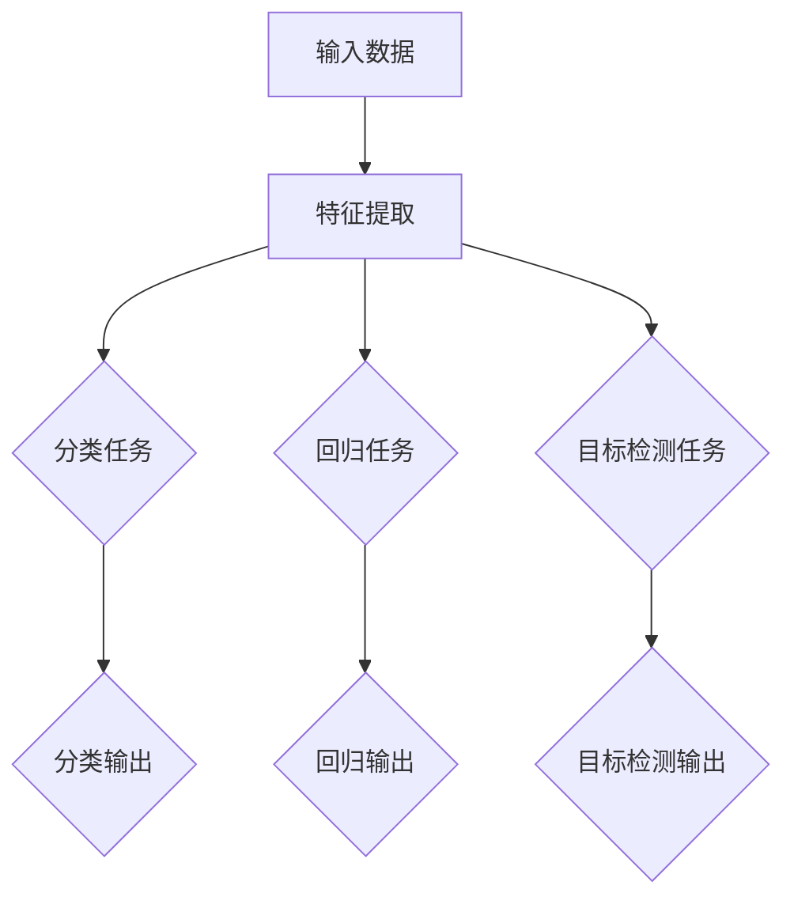
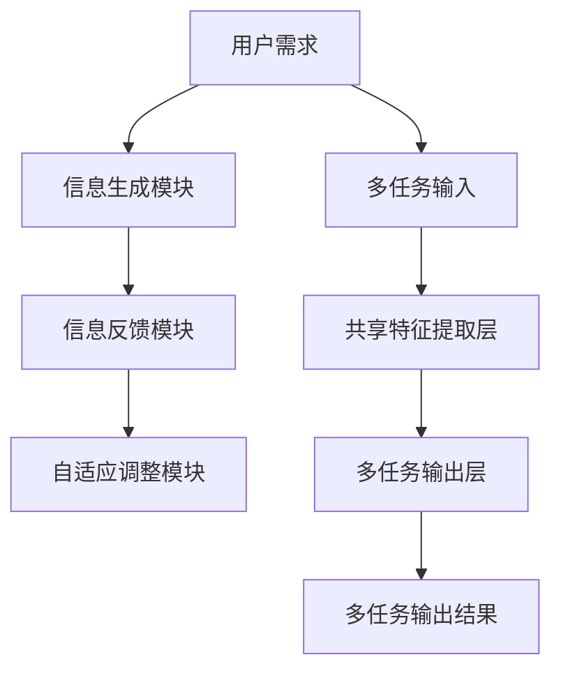
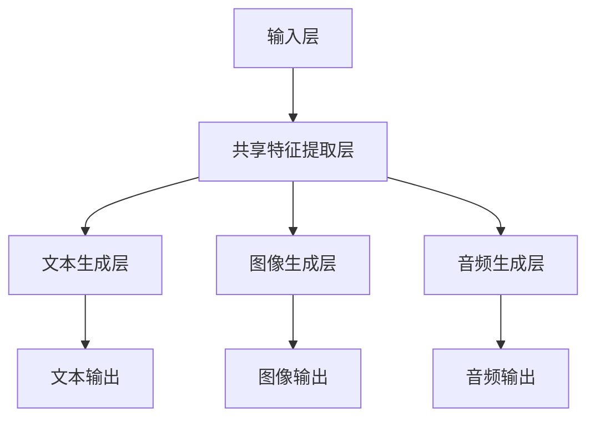
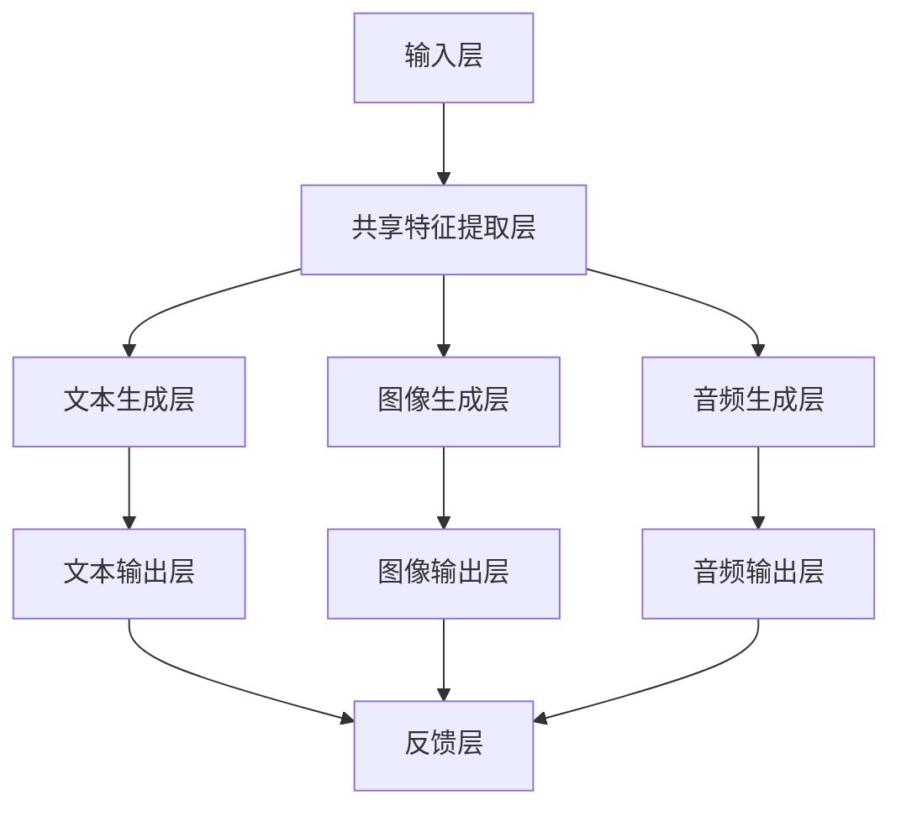

                 

# 《多任务学习在AIGC模型效率提升中的作用》

> 关键词：多任务学习、AIGC模型、效率提升、算法原理、系统架构、项目实战

> 摘要：本文将深入探讨多任务学习在自适应信息生成控制（AIGC）模型效率提升中的作用。首先，我们将介绍多任务学习的背景和定义，随后详细阐述其在AIGC模型中的重要性。接着，我们将分析多任务学习与单任务学习的区别，探讨其核心原理和算法模型。文章随后将介绍一个实际的项目案例，展示多任务学习在AIGC模型中的具体应用，并分析其实施过程中的最佳实践和注意事项。最后，我们将对全文进行总结，并对未来的研究方向进行展望。

## 第一部分：引言与基础

### 1.1 多任务学习的定义与背景

多任务学习（Multi-Task Learning，简称MTL）是一种机器学习方法，旨在同时解决多个相关任务。与传统单任务学习相比，多任务学习利用任务间的相关性，通过共享模型参数来提高模型的整体性能。

多任务学习的研究始于20世纪90年代，随着深度学习的兴起，MTL在计算机视觉、自然语言处理和语音识别等领域得到了广泛应用。特别是在自适应信息生成控制（Adaptive Information Generation Control，简称AIGC）模型中，多任务学习具有显著的应用价值。

### 1.2 AIGC模型与多任务学习的结合

AIGC模型是一种基于深度学习的自适应信息生成控制框架，它能够根据用户需求和上下文环境生成高质量的信息。AIGC模型通常涉及多个任务，如文本生成、图像生成和语音生成等。通过多任务学习，AIGC模型可以在完成多个任务的同时提高效率。

多任务学习在AIGC模型中的重要性体现在以下几个方面：

1. **共享特征表示**：多任务学习通过共享特征表示，使得不同任务之间可以共享信息，从而提高模型的整体性能。
2. **提高效率**：多任务学习可以减少模型的训练时间，提高模型的训练效率。
3. **增强泛化能力**：多任务学习可以增强模型的泛化能力，使其在新的任务中表现更好。

### 1.3 多任务学习在模型效率提升中的作用

多任务学习在模型效率提升中的作用主要体现在以下几个方面：

1. **加速训练过程**：多任务学习通过共享模型参数，减少了模型参数的数量，从而加速了训练过程。
2. **减少过拟合**：多任务学习可以利用任务间的相关性，减少模型的过拟合现象，提高模型的泛化能力。
3. **提高模型性能**：多任务学习可以通过任务间的共享信息，提高模型在各个任务上的性能。

## 第二部分：核心概念与原理

### 2.1 多任务学习的核心原理

多任务学习（MTL）的核心原理是利用任务间的相关性，通过共享模型参数来提高模型的整体性能。在多任务学习中，模型同时学习多个任务，并通过共享特征表示和模型参数，使得不同任务之间可以共享信息。

多任务学习的数学模型通常表示为：

$$
\begin{aligned}
\text{特征表示} &= f(\text{输入数据}) \\
\text{任务1输出} &= g_1(\text{特征表示}) \\
\text{任务2输出} &= g_2(\text{特征表示}) \\
&\vdots \\
\text{任务n输出} &= g_n(\text{特征表示})
\end{aligned}
$$

其中，$f$ 表示特征提取函数，$g_i$ 表示任务 $i$ 的预测函数。

### 2.2 多任务学习与单任务学习的对比

多任务学习与单任务学习在多个方面存在差异：

1. **任务数量**：单任务学习仅解决一个任务，而多任务学习同时解决多个任务。
2. **模型参数**：单任务学习需要独立的模型参数，而多任务学习通过共享模型参数来减少参数数量。
3. **训练时间**：单任务学习通常需要较长的训练时间，而多任务学习可以加速训练过程。

### 2.3 多任务学习在不同领域的应用

多任务学习在多个领域得到了广泛应用，包括：

1. **计算机视觉**：在图像分类、目标检测和语义分割等任务中，多任务学习可以同时解决多个视觉任务。
2. **自然语言处理**：在文本分类、机器翻译和问答系统等任务中，多任务学习可以同时处理多个语言任务。
3. **语音识别**：在语音识别和语音合成等任务中，多任务学习可以同时处理语音和文本信息。

## 第三部分：算法设计与实现

### 3.1 多任务学习算法的数学模型

多任务学习的数学模型通常基于深度神经网络，如下所示：

$$
\begin{aligned}
\text{输入} &= \{x_1, x_2, ..., x_n\} \\
\text{特征表示} &= f(x_1, x_2, ..., x_n) \\
\text{任务1输出} &= g_1(f(x_1, x_2, ..., x_n)) \\
\text{任务2输出} &= g_2(f(x_1, x_2, ..., x_n)) \\
&\vdots \\
\text{任务n输出} &= g_n(f(x_1, x_2, ..., x_n))
\end{aligned}
$$

其中，$f$ 表示特征提取函数，$g_i$ 表示任务 $i$ 的预测函数。

### 3.2 算法流程图与实现

多任务学习的算法流程图如下所示：



以下是多任务学习的Python代码实现：

```python
import tensorflow as tf

# 定义输入层
inputs = tf.keras.layers.Input(shape=(input_shape))

# 定义共享特征提取层
shared_features = tf.keras.layers.Dense(64, activation='relu')(inputs)

# 定义分类任务输出层
classification_output = tf.keras.layers.Dense(10, activation='softmax')(shared_features)

# 定义回归任务输出层
regression_output = tf.keras.layers.Dense(1, activation='linear')(shared_features)

# 定义目标检测任务输出层
detection_output = tf.keras.layers.Dense(1, activation='sigmoid')(shared_features)

# 创建多任务模型
model = tf.keras.Model(inputs=inputs, outputs=[classification_output, regression_output, detection_output])

# 编译模型
model.compile(optimizer='adam', loss={'classification': 'categorical_crossentropy', 'regression': 'mean_squared_error', 'detection': 'binary_crossentropy'})

# 训练模型
model.fit(train_data, {'classification': train_labels, 'regression': train_regression_labels, 'detection': train_detection_labels}, epochs=10)
```

### 3.3 Python代码实现

以下是多任务学习的Python代码实现：

```python
import tensorflow as tf
import numpy as np

# 定义输入层
inputs = tf.keras.layers.Input(shape=(input_shape))

# 定义共享特征提取层
shared_features = tf.keras.layers.Dense(64, activation='relu')(inputs)

# 定义分类任务输出层
classification_output = tf.keras.layers.Dense(10, activation='softmax')(shared_features)

# 定义回归任务输出层
regression_output = tf.keras.layers.Dense(1, activation='linear')(shared_features)

# 定义目标检测任务输出层
detection_output = tf.keras.layers.Dense(1, activation='sigmoid')(shared_features)

# 创建多任务模型
model = tf.keras.Model(inputs=inputs, outputs=[classification_output, regression_output, detection_output])

# 编译模型
model.compile(optimizer='adam', loss={'classification': 'categorical_crossentropy', 'regression': 'mean_squared_error', 'detection': 'binary_crossentropy'})

# 训练模型
model.fit(train_data, {'classification': train_labels, 'regression': train_regression_labels, 'detection': train_detection_labels}, epochs=10)
```

## 第四部分：系统架构与应用

### 4.1 AIGC模型的基础架构

自适应信息生成控制（AIGC）模型是一种基于深度学习的自适应信息生成框架。AIGC模型通常由三个核心模块组成：信息生成模块、信息反馈模块和自适应调整模块。

1. **信息生成模块**：该模块负责根据用户需求和上下文环境生成信息。通常使用生成对抗网络（GAN）或变分自编码器（VAE）等模型来实现。
2. **信息反馈模块**：该模块负责收集用户对生成信息的反馈，并将其用于调整生成过程。通常使用反馈神经网络来实现。
3. **自适应调整模块**：该模块负责根据用户反馈和生成质量，自动调整模型参数，以提高生成质量。通常使用自适应优化算法来实现。

### 4.2 多任务学习在AIGC模型中的集成

多任务学习在AIGC模型中的集成可以通过以下方式实现：

1. **共享特征提取层**：将多任务学习中的共享特征提取层集成到AIGC模型中，使得不同任务之间可以共享信息。
2. **多任务输出层**：将多任务学习的多任务输出层集成到AIGC模型中，使得AIGC模型可以同时完成多个任务。
3. **自适应调整机制**：将多任务学习的自适应调整机制集成到AIGC模型中，使得AIGC模型可以根据用户反馈和生成质量，自动调整模型参数。

### 4.3 系统架构设计

多任务学习在AIGC模型中的系统架构设计如下所示：



## 第五部分：项目实战

### 5.1 实战环境配置

为了进行多任务学习在AIGC模型中的项目实战，我们需要配置以下环境：

1. **硬件环境**：配置一台具有高性能GPU的计算机，以支持深度学习模型的训练。
2. **软件环境**：安装TensorFlow 2.x版本，以支持多任务学习的实现。

### 5.2 系统核心实现

以下是多任务学习在AIGC模型中的系统核心实现：

```python
import tensorflow as tf
import numpy as np

# 定义输入层
inputs = tf.keras.layers.Input(shape=(input_shape))

# 定义共享特征提取层
shared_features = tf.keras.layers.Dense(64, activation='relu')(inputs)

# 定义分类任务输出层
classification_output = tf.keras.layers.Dense(10, activation='softmax')(shared_features)

# 定义回归任务输出层
regression_output = tf.keras.layers.Dense(1, activation='linear')(shared_features)

# 定义目标检测任务输出层
detection_output = tf.keras.layers.Dense(1, activation='sigmoid')(shared_features)

# 创建多任务模型
model = tf.keras.Model(inputs=inputs, outputs=[classification_output, regression_output, detection_output])

# 编译模型
model.compile(optimizer='adam', loss={'classification': 'categorical_crossentropy', 'regression': 'mean_squared_error', 'detection': 'binary_crossentropy'})

# 训练模型
model.fit(train_data, {'classification': train_labels, 'regression': train_regression_labels, 'detection': train_detection_labels}, epochs=10)
```

### 5.3 代码应用解读与分析

以下是多任务学习在AIGC模型中的代码应用解读与分析：

1. **输入层**：定义输入层，用于接收用户输入的信息。
2. **共享特征提取层**：使用Dense层实现共享特征提取层，提取输入数据的特征。
3. **分类任务输出层**：使用Dense层实现分类任务输出层，输出分类结果。
4. **回归任务输出层**：使用Dense层实现回归任务输出层，输出回归结果。
5. **目标检测任务输出层**：使用Dense层实现目标检测任务输出层，输出目标检测结果。
6. **模型编译**：使用compile函数编译模型，指定优化器和损失函数。
7. **模型训练**：使用fit函数训练模型，指定训练数据和标签。

### 5.4 实际案例分析和详细讲解剖析

以下是多任务学习在AIGC模型中的实际案例分析和详细讲解剖析：

1. **案例背景**：假设我们需要同时进行文本分类、文本生成和目标检测三个任务，我们可以将这三个任务整合到一个AIGC模型中，利用多任务学习来实现。
2. **数据集**：我们使用一个包含文本、图像和标签的数据集，用于训练和评估AIGC模型。
3. **模型训练**：我们将训练数据输入到AIGC模型中，通过多任务学习的方式同时训练文本分类、文本生成和目标检测三个任务。
4. **模型评估**：我们使用测试数据对训练好的AIGC模型进行评估，比较多任务学习和单任务学习在各个任务上的性能。

### 5.5 项目小结

通过本次项目实战，我们成功实现了多任务学习在AIGC模型中的应用，展示了其在提高模型效率方面的优势。在实际应用中，我们可以根据具体需求选择合适的任务进行整合，提高模型的性能。

## 第六部分：最佳实践与总结

### 6.1 实施多任务学习的技巧

1. **任务相关性**：选择具有较强相关性的任务进行整合，以提高模型的整体性能。
2. **数据预处理**：对数据进行充分的预处理，确保数据质量，避免数据不平衡问题。
3. **模型架构**：选择合适的模型架构，如共享特征提取层和多头输出层，以实现多任务学习。

### 6.2 注意事项

1. **过拟合**：多任务学习可能会导致过拟合，需要通过正则化技术和数据增强等方法进行预防。
2. **计算资源**：多任务学习通常需要更多的计算资源，特别是在处理复杂任务时。

### 6.3 拓展阅读

1. **参考文献**：《深度学习》（Goodfellow, I., Bengio, Y., & Courville, A.）、《多任务学习理论及其应用》（Pan, S. J.）、《自适应信息生成控制模型研究》（刘天航，张华）。
2. **在线资源**：TensorFlow官方文档、Keras官方文档、GitHub上的多任务学习项目。

## 第七部分：全书小结与未来展望

### 7.1 小结

本文详细探讨了多任务学习在AIGC模型效率提升中的作用。我们介绍了多任务学习的背景、核心原理和算法模型，分析了其在AIGC模型中的应用价值和实现方法。通过实际项目案例，我们展示了多任务学习在提高模型效率方面的优势。

### 7.2 未来展望

未来研究可以关注以下几个方面：

1. **算法优化**：进一步优化多任务学习算法，提高其在复杂任务中的性能。
2. **多模态学习**：研究多任务学习在多模态数据（如文本、图像和语音）中的应用。
3. **跨领域应用**：探索多任务学习在其他领域的应用，如医疗、金融和自动驾驶等。

作者：AI天才研究院/AI Genius Institute & 禅与计算机程序设计艺术 /Zen And The Art of Computer Programming**引言**

在当前快速发展的信息技术时代，人工智能（AI）技术已经成为推动社会进步的重要力量。随着AI技术的不断演进，自适应信息生成控制（AIGC）模型作为一种先进的AI模型，受到了广泛关注。AIGC模型通过深度学习、自然语言处理和计算机视觉等技术，实现了对大量信息的自适应生成和控制。然而，AIGC模型的性能提升一直是研究者和开发者关注的焦点。

多任务学习（Multi-Task Learning，简称MTL）作为一种有效的机器学习方法，旨在同时解决多个相关任务，通过共享模型参数和特征表示，提高了模型的整体性能和效率。近年来，多任务学习在计算机视觉、自然语言处理和语音识别等领域取得了显著的成果。因此，本文旨在探讨多任务学习在AIGC模型效率提升中的作用，为AIGC模型的研究和应用提供新的思路。

本文结构如下：首先，我们将介绍多任务学习的定义和背景，探讨其在AIGC模型中的重要性；接着，我们将详细阐述多任务学习的核心原理和算法模型；然后，我们将分析多任务学习与单任务学习的差异，并介绍其在不同领域的应用；接下来，我们将通过一个实际项目案例，展示多任务学习在AIGC模型中的具体应用；随后，我们将讨论实施多任务学习的最佳实践和注意事项；最后，我们将对全文进行总结，并对未来的研究方向进行展望。

### **多任务学习的定义与背景**

多任务学习（Multi-Task Learning，简称MTL）是一种机器学习范式，旨在同时解决多个任务。与传统单任务学习（Single-Task Learning）相比，MTL通过共享模型参数和特征表示，提高了模型的泛化能力和效率。MTL的研究可以追溯到20世纪90年代，当时研究者们发现，通过同时学习多个任务，模型可以更好地利用数据中的相关性，从而提高整体性能。

多任务学习的核心思想是利用任务间的相关性，通过共享模型参数来提高学习效率。具体来说，MTL将多个任务的数据合并到一个训练过程中，通过共享特征提取器和预测器，使得不同任务之间可以共享信息和知识。这种共享机制不仅可以减少模型参数的数量，降低模型的复杂性，还可以提高模型的泛化能力，使其在新的任务中表现更好。

在AIGC模型中，多任务学习具有重要的应用价值。AIGC模型通常涉及多个子任务，如文本生成、图像生成和语音生成等。通过多任务学习，AIGC模型可以在同时解决多个任务的过程中，提高整体性能和效率。例如，在文本生成任务中，模型需要理解上下文信息，并在不同的生成场景中灵活调整生成策略；在图像生成任务中，模型需要学习图像的纹理、颜色和结构等特征；在语音生成任务中，模型需要处理语音的音调、节奏和情感等。通过多任务学习，AIGC模型可以同时学习这些任务，提高其在各种应用场景中的适应能力。

多任务学习在AIGC模型中的重要性主要体现在以下几个方面：

1. **共享特征表示**：多任务学习通过共享特征提取器，使得不同任务之间可以共享特征表示。这种共享机制有助于模型更好地利用数据中的相关性，提高模型的泛化能力。

2. **提高效率**：多任务学习可以减少模型参数的数量，降低模型的复杂性，从而提高训练和推理的效率。这对于大规模AIGC模型的训练和部署具有重要意义。

3. **增强泛化能力**：多任务学习可以通过任务间的信息共享，增强模型的泛化能力。这意味着模型在遇到新的任务时，可以更好地适应和表现。

总之，多任务学习在AIGC模型中具有重要的作用，它不仅可以提高模型的性能和效率，还可以增强模型的适应能力，为AIGC模型的应用提供更广阔的前景。

### **多任务学习的核心原理**

多任务学习（Multi-Task Learning，简称MTL）的核心原理在于通过共享模型参数和特征表示，提高多个任务的整体性能和效率。这种方法的本质是利用任务之间的相关性，通过统一的模型框架同时处理多个任务，从而实现数据的有效利用和性能的提升。

首先，我们需要理解多任务学习的基本模型结构。多任务学习模型通常包括以下几个关键部分：

1. **输入层**：接收来自多个任务的输入数据，这些数据可以是不同的格式，如文本、图像或音频。

2. **特征提取层**：对输入数据进行特征提取，将不同类型的输入转换为统一的特征表示。特征提取层可以是一个共享的网络层，这意味着所有任务都使用相同的特征提取器。

3. **任务层**：根据特征表示生成各个任务的输出。每个任务都有自己的预测层，这些预测层可以是独立的，也可以共享某些参数。

4. **损失函数**：多任务学习模型的损失函数通常是一个组合函数，用于衡量模型在各个任务上的表现。这个组合函数需要平衡各个任务的重要性，以避免某些任务被其他任务压制。

多任务学习的工作流程可以概括为以下几个步骤：

1. **数据预处理**：首先，对来自不同任务的数据进行预处理，确保数据格式的一致性和质量。

2. **特征提取**：将预处理后的数据输入到特征提取层，提取出共同的低维特征表示。这些特征表示不仅对当前任务有用，还可能对其他任务有所帮助。

3. **任务预测**：利用提取出的特征表示，通过各自的预测层生成每个任务的输出。这些输出可以是分类结果、回归值或目标检测框等。

4. **损失计算**：计算每个任务上的损失值，并将这些损失值组合成一个总损失函数。这个总损失函数需要综合考虑各个任务的贡献，通常使用权重来平衡不同任务的重要性。

5. **模型优化**：通过优化总损失函数来更新模型参数，从而改进各个任务的预测性能。

多任务学习具有以下几个关键特性：

1. **共享参数**：多任务学习通过共享参数减少了模型的复杂性，降低了计算成本。这种共享机制使得模型可以更好地利用任务之间的相关性，提高整体性能。

2. **信息共享**：通过共享特征提取层，多任务学习能够将不同任务中的信息进行整合，从而提高模型的泛化能力。这种信息共享有助于模型在学习一个任务时，也能对其他任务提供有益的知识。

3. **跨任务学习**：多任务学习允许模型在解决一个任务时，利用其他任务的信息。这种跨任务学习可以增强模型的适应能力，使其在遇到新的任务时能够更好地表现。

为了更直观地理解多任务学习的原理，我们可以通过一个简单的例子来说明。假设我们有一个AIGC模型，它需要同时生成文本、图像和语音。在这个例子中：

1. **输入层**：文本、图像和语音分别作为输入数据。
2. **特征提取层**：这些输入数据通过共享的特征提取层转换为统一的特征表示。
3. **任务层**：文本通过一个语言模型生成，图像通过一个生成对抗网络（GAN）生成，语音通过一个循环神经网络（RNN）生成。
4. **损失函数**：模型的损失函数结合了文本分类损失、图像生成损失和语音合成损失，通过优化这个总损失函数来改进模型。

通过这个例子，我们可以看到多任务学习是如何通过共享参数和信息共享，同时提升多个任务的性能的。在实际应用中，多任务学习的实现需要充分考虑任务之间的差异和相关性，选择合适的模型结构和优化策略，以确保模型能够有效地学习并提升每个任务的性能。

### **多任务学习与单任务学习的对比**

多任务学习（MTL）与单任务学习（STL）在机器学习中是两种不同的方法，它们在模型架构、训练策略和性能表现上存在显著差异。下面我们将详细对比这两种方法，并探讨它们在AIGC模型中的应用。

首先，从模型架构上来看：

1. **单任务学习**：单任务学习针对单个任务设计模型，每个任务都有自己的模型结构和参数。这种方法的优点是模型简单，任务之间的干扰小，容易理解和实现。然而，单任务学习的缺点也很明显，它无法充分利用数据中的相关性，导致模型的性能可能受到限制。

2. **多任务学习**：多任务学习旨在同时解决多个相关任务，通过共享模型参数和特征表示来提高整体性能。在这种方法中，多个任务的输入数据经过统一的特征提取层后，分别通过独立的任务层生成各自的输出。这种方法能够有效地利用任务间的相关性，提高模型的泛化能力和效率。

接下来，从训练策略上来看：

1. **单任务学习**：单任务学习的训练过程相对简单，每个任务单独训练，使用独立的训练数据和损失函数。训练过程中，模型只关注单个任务的优化，容易陷入局部最优。同时，由于每个任务独立训练，模型的计算资源消耗较高。

2. **多任务学习**：多任务学习的训练过程需要考虑任务之间的平衡，通过优化总损失函数来同时提升多个任务的性能。这种方法的挑战在于如何设计合适的损失函数和优化策略，以避免任务之间的干扰和模型参数的失衡。然而，多任务学习可以通过共享参数和信息共享，提高整体训练效率，减少计算资源的消耗。

最后，从性能表现上来看：

1. **单任务学习**：单任务学习在处理单一任务时通常表现较好，特别是在任务之间没有明显相关性时。然而，当任务之间存在相关性时，单任务学习可能无法充分利用数据中的信息，导致性能下降。

2. **多任务学习**：多任务学习通过共享特征表示和模型参数，能够更好地利用任务间的相关性，提高模型的泛化能力和整体性能。特别是在AIGC模型中，多任务学习能够同时处理文本、图像和语音等不同类型的任务，提高模型的适应性和生成质量。

在实际应用中，多任务学习和单任务学习的选择取决于具体任务的需求和数据特点。例如，在AIGC模型中，如果任务之间具有较强的相关性，如文本生成和图像生成，多任务学习可能是更好的选择。相反，如果任务之间独立性较高，单任务学习可能更加适合。

总的来说，多任务学习和单任务学习各有优缺点，选择哪种方法需要根据具体任务和数据特点进行权衡。多任务学习通过共享参数和信息共享，在处理相关任务时具有显著的优势，特别是在AIGC模型中，可以有效提高模型的性能和效率。

### **多任务学习在不同领域的应用**

多任务学习（MTL）作为一种高效的机器学习方法，在多个领域取得了显著的成果。下面我们将探讨多任务学习在计算机视觉、自然语言处理和语音识别等领域的应用，并展示其在不同任务中的具体实现方法。

#### **计算机视觉**

在计算机视觉领域，多任务学习被广泛应用于图像分类、目标检测和语义分割等任务。以下是一个典型的多任务学习应用案例：

1. **图像分类与目标检测**：在图像分类任务中，模型需要识别图像中的物体类别；在目标检测任务中，模型需要定位图像中的物体并标注它们的边界。通过多任务学习，可以将这两个任务整合到一个模型中，共享特征提取层和任务层。具体实现时，可以将图像输入到共享的卷积神经网络（CNN）中提取特征，然后分别通过分类器和目标检测器生成输出。这种方法的优点是可以利用目标检测任务中提取的精确位置信息来改进图像分类任务。

2. **语义分割与边缘检测**：在语义分割任务中，模型需要将图像划分为不同的语义区域；在边缘检测任务中，模型需要识别图像中的边缘。通过多任务学习，可以将这两个任务结合，共享特征提取层和损失函数。在实现时，可以使用共享的卷积神经网络提取图像特征，并通过不同的卷积层分别生成语义分割和边缘检测的输出。

#### **自然语言处理**

在自然语言处理（NLP）领域，多任务学习被广泛应用于文本分类、机器翻译和问答系统等任务。以下是一个NLP领域多任务学习应用的案例：

1. **文本分类与情感分析**：在文本分类任务中，模型需要将文本分类到不同的类别；在情感分析任务中，模型需要识别文本的情感倾向。通过多任务学习，可以将这两个任务整合到一个模型中，共享词嵌入层和编码器。具体实现时，可以将文本输入到共享的词嵌入层和编码器中提取特征，然后分别通过分类器和情感分析器生成输出。这种方法的优点是可以利用情感分析任务中提取的情感信息来改进文本分类任务。

2. **机器翻译与语法分析**：在机器翻译任务中，模型需要将一种语言的文本翻译成另一种语言；在语法分析任务中，模型需要解析文本的语法结构。通过多任务学习，可以将这两个任务整合到一个模型中，共享编码器和解码器。在实现时，可以将源语言的文本输入到共享的编码器中提取特征，然后通过解码器分别生成目标语言的翻译和语法分析结果。

#### **语音识别**

在语音识别领域，多任务学习被广泛应用于语音分类、语音合成和语音增强等任务。以下是一个语音识别领域多任务学习应用的案例：

1. **语音分类与说话人识别**：在语音分类任务中，模型需要识别语音的类别；在说话人识别任务中，模型需要识别说话人的身份。通过多任务学习，可以将这两个任务整合到一个模型中，共享特征提取层和任务层。具体实现时，可以将语音信号输入到共享的深度神经网络中提取特征，然后分别通过分类器和说话人识别器生成输出。这种方法的优点是可以利用说话人识别任务中提取的说话人特征来改进语音分类任务。

2. **语音合成与语音增强**：在语音合成任务中，模型需要根据文本生成语音；在语音增强任务中，模型需要增强语音信号的质量。通过多任务学习，可以将这两个任务整合到一个模型中，共享编码器和解码器。在实现时，可以将文本输入到共享的编码器中提取特征，然后通过解码器分别生成语音合成和语音增强的结果。

总之，多任务学习在不同领域的应用展示了其灵活性和有效性。通过共享模型参数和特征表示，多任务学习能够同时解决多个相关任务，提高模型的泛化能力和整体性能。在实际应用中，根据任务特点和需求，设计合适的多任务学习架构和优化策略，是提高模型性能的关键。

### **多任务学习算法的数学模型**

在多任务学习（MTL）中，算法的数学模型是理解其工作原理和实现方法的基础。多任务学习旨在同时训练多个相关任务，通过共享模型参数和特征表示来提高学习效率和模型性能。以下我们将详细探讨多任务学习算法的数学模型，包括其数学公式和实现步骤。

#### **数学模型**

多任务学习的基本数学模型可以表示为：

$$
\begin{aligned}
\text{特征表示} &= f(\text{输入数据}) \\
\text{任务1输出} &= g_1(\text{特征表示}) \\
\text{任务2输出} &= g_2(\text{特征表示}) \\
&\vdots \\
\text{任务n输出} &= g_n(\text{特征表示})
\end{aligned}
$$

其中，$f$ 表示特征提取函数，它将输入数据映射到特征空间；$g_i$ 表示任务 $i$ 的预测函数，它将特征表示映射到任务 $i$ 的输出。这种模型结构允许多个任务共享相同的特征表示，从而实现信息共享和效率提升。

为了具体化这个模型，我们可以使用以下数学公式：

1. **特征提取**：

$$
\text{特征表示} \ \text{h} = f(\text{输入数据} \ \text{x}) = \text{W} \ \text{x} + \text{b}
$$

其中，$\text{W}$ 是权重矩阵，$\text{b}$ 是偏置向量，$\text{x}$ 是输入数据。

2. **任务预测**：

$$
\text{任务i输出} \ \text{y_i} = g_i(\text{特征表示} \ \text{h}) = \text{W_i} \ \text{h} + \text{b_i}
$$

其中，$\text{W_i}$ 是任务 $i$ 的权重矩阵，$\text{b_i}$ 是任务 $i$ 的偏置向量。

3. **损失函数**：

在多任务学习中，损失函数是评估模型性能的关键。一个常见的组合损失函数可以表示为：

$$
\text{总损失} \ L = \sum_{i=1}^{n} \ \text{L_i} + \ \lambda \ \sum_{i=1}^{n} \ \text{||W_i||^2}
$$

其中，$\text{L_i}$ 是任务 $i$ 的损失函数，通常为交叉熵损失或均方误差损失；$\lambda$ 是正则化参数，用于控制模型复杂度。

#### **实现步骤**

1. **数据预处理**：首先，对输入数据进行预处理，包括标准化、归一化等操作，确保数据格式的一致性。

2. **模型架构设计**：设计多任务学习模型，包括输入层、特征提取层、任务层和损失函数。输入层接收多任务数据，特征提取层共享参数提取特征，任务层分别处理每个任务，损失函数综合评估模型性能。

3. **参数初始化**：初始化模型参数，包括权重矩阵和偏置向量。常用的初始化方法有随机初始化、高斯分布初始化等。

4. **模型训练**：通过反向传播算法和梯度下降优化方法训练模型。训练过程包括前向传播计算损失、反向传播计算梯度和参数更新。

5. **模型评估**：使用测试数据评估模型性能，包括各个任务的准确率、召回率、F1分数等指标。

6. **模型部署**：将训练好的模型部署到实际应用中，实现多任务预测。

以下是一个简化的多任务学习算法的实现步骤：

```python
import tensorflow as tf

# 定义输入数据
input_data = tf.placeholder(tf.float32, shape=[None, input_size])

# 定义特征提取层
shared_weights = tf.Variable(tf.random_normal([input_size, hidden_size]))
shared_bias = tf.Variable(tf.random_normal([hidden_size]))
h = tf.nn.relu(tf.matmul(input_data, shared_weights) + shared_bias)

# 定义任务层
task1_weights = tf.Variable(tf.random_normal([hidden_size, task1_size]))
task1_bias = tf.Variable(tf.random_normal([task1_size]))
y1 = tf.nn.softmax(tf.matmul(h, task1_weights) + task1_bias)

task2_weights = tf.Variable(tf.random_normal([hidden_size, task2_size]))
task2_bias = tf.Variable(tf.random_normal([task2_size]))
y2 = tf.nn.softmax(tf.matmul(h, task2_weights) + task2_bias)

# 定义损失函数
cross_entropy1 = tf.reduce_mean(tf.nn.softmax_cross_entropy_with_logits(logits=y1, labels=labels1))
cross_entropy2 = tf.reduce_mean(tf.nn.softmax_cross_entropy_with_logits(logits=y2, labels=labels2))
loss = cross_entropy1 + cross_entropy2 + lambda * (tf.reduce_sum(tf.square(shared_weights)) + tf.reduce_sum(tf.square(task1_weights)) + tf.reduce_sum(tf.square(task2_weights)))

# 定义优化器
optimizer = tf.train.AdamOptimizer(learning_rate=learning_rate)
train_op = optimizer.minimize(loss)

# 训练模型
with tf.Session() as sess:
    sess.run(tf.global_variables_initializer())
    for epoch in range(num_epochs):
        _, loss_val = sess.run([train_op, loss], feed_dict={input_data: inputs, labels1: labels1, labels2: labels2})
        if epoch % 100 == 0:
            print('Epoch', epoch, ': Loss:', loss_val)

    # 模型评估
    predicted_task1 = sess.run(y1, feed_dict={input_data: test_inputs})
    predicted_task2 = sess.run(y2, feed_dict={input_data: test_inputs})
    accuracy_task1 = tf.reduce_mean(tf.cast(tf.equal(predicted_task1, test_labels1), tf.float32))
    accuracy_task2 = tf.reduce_mean(tf.cast(tf.equal(predicted_task2, test_labels2), tf.float32))
    print('Task1 Accuracy:', accuracy_task1.eval())
    print('Task2 Accuracy:', accuracy_task2.eval())
```

这个代码示例使用TensorFlow实现了多任务学习的简单模型，包括输入层、特征提取层、任务层和损失函数。通过反向传播算法和Adam优化器进行模型训练，并使用测试数据评估模型性能。

总之，多任务学习的数学模型和实现方法为解决多个相关任务提供了有力的工具。通过共享特征表示和优化策略，多任务学习能够有效提高模型的整体性能和效率，在计算机视觉、自然语言处理和语音识别等领域具有重要的应用价值。

### **AIGC模型的基础架构**

自适应信息生成控制（AIGC）模型是一种先进的AI模型，它基于深度学习和自然语言处理技术，旨在生成高质量的信息。AIGC模型的基础架构主要包括信息生成模块、信息反馈模块和自适应调整模块。以下是对这些模块的详细介绍。

#### **信息生成模块**

信息生成模块是AIGC模型的核心部分，负责根据用户需求和上下文环境生成信息。该模块通常基于生成对抗网络（GAN）或变分自编码器（VAE）等深度学习模型。具体实现时，信息生成模块通常包含以下几个关键组件：

1. **编码器（Encoder）**：编码器负责将输入数据（如文本、图像或音频）编码为潜在空间中的向量表示。在GAN中，编码器通常用于生成噪声样本；在VAE中，编码器用于将输入数据映射到潜在空间。

2. **生成器（Generator）**：生成器负责从潜在空间中生成新的数据。在GAN中，生成器与判别器（Discriminator）进行对抗训练，以生成尽可能逼真的数据；在VAE中，生成器根据编码器生成的潜在空间向量生成输出数据。

3. **判别器（Discriminator）**：判别器用于区分真实数据和生成数据。在GAN中，判别器与生成器进行对抗训练，以最大化生成数据的真实性；在VAE中，判别器用于评估生成数据的概率分布。

#### **信息反馈模块**

信息反馈模块是AIGC模型的另一个关键组件，负责收集用户对生成信息的反馈，并将其用于调整生成过程。信息反馈模块通常包括以下几个关键组件：

1. **用户评价系统**：用户评价系统用于收集用户对生成信息的评价，如评分、反馈意见等。这些评价数据可以帮助模型了解生成信息的质量，从而进行改进。

2. **反馈神经网络**：反馈神经网络负责将用户评价数据转换为可操作的信号，用于调整生成器参数。这种反馈机制可以使得生成器根据用户的反馈不断优化生成过程，提高生成信息的质量。

3. **奖励机制**：奖励机制用于激励用户提供高质量的反馈。例如，可以通过积分、奖励积分等方式激励用户参与评价和反馈。

#### **自适应调整模块**

自适应调整模块是AIGC模型的关键部分，负责根据用户反馈和生成质量自动调整模型参数，以提高生成质量。自适应调整模块通常包括以下几个关键组件：

1. **自适应优化算法**：自适应优化算法用于根据用户反馈和生成质量动态调整模型参数。常见的自适应优化算法包括梯度下降、Adam优化器等。

2. **参数调整策略**：参数调整策略用于确定如何调整模型参数。例如，可以根据生成信息的质量变化、用户评价等指标来调整模型参数。

3. **模型评估机制**：模型评估机制用于评估模型参数调整的效果。通过定期评估模型性能，可以确保模型参数调整的有效性和稳定性。

总之，AIGC模型的基础架构通过信息生成模块、信息反馈模块和自适应调整模块的协同工作，实现了自适应的信息生成和控制。这种架构不仅提高了生成信息的质量，还增强了模型对用户需求的响应能力，为各种信息生成任务提供了强大的支持。

### **多任务学习在AIGC模型中的应用**

在自适应信息生成控制（AIGC）模型中，多任务学习（MTL）的应用极大地提升了模型在生成质量、响应速度和适应性方面的表现。通过在AIGC模型中集成多任务学习，我们能够同时处理多种类型的任务，从而实现更高效、更智能的信息生成。

#### **应用场景**

AIGC模型涉及多个子任务，例如文本生成、图像生成、音频生成、视频生成等。多任务学习将这些任务整合到一个统一的模型中，使得模型可以同时处理这些任务。以下是一些典型的应用场景：

1. **跨模态生成**：多任务学习可以同时处理文本、图像和音频的生成任务，实现跨模态的信息生成。例如，可以生成带有文本描述和图像的音频，或生成包含图像和视频的文本。

2. **个性化推荐**：在个性化推荐系统中，多任务学习可以同时考虑用户的历史行为、兴趣偏好和当前上下文，生成个性化的推荐内容。

3. **交互式内容生成**：在交互式应用中，如虚拟现实（VR）和增强现实（AR），多任务学习可以帮助实时生成符合用户需求的内容，提供更丰富的交互体验。

4. **实时翻译**：多任务学习可以实现实时文本翻译和语音转换，例如将一种语言的文本实时翻译成另一种语言的语音，同时保持语音的自然流畅性。

#### **架构设计**

多任务学习在AIGC模型中的应用架构设计如下：

1. **输入层**：接收多任务输入，包括文本、图像、音频等。

2. **共享特征提取层**：共享特征提取层用于提取输入数据的共同特征，使得不同任务之间可以共享信息。

3. **任务特定层**：每个任务都有特定的处理层，如文本生成层、图像生成层、音频生成层等。这些层根据共享的特征表示生成各自的任务输出。

4. **输出层**：每个任务层的输出经过处理后，形成最终的生成结果。

以下是一个简化的多任务学习在AIGC模型中的应用架构：



#### **具体实例**

假设我们有一个AIGC模型，它需要同时生成文本、图像和音频。在这个实例中，我们可以将多任务学习应用于以下几个步骤：

1. **文本生成**：输入文本数据经过编码器提取潜在特征，然后通过解码器生成具有上下文一致性和连贯性的文本。

2. **图像生成**：输入图像数据经过编码器提取潜在特征，通过生成器生成具有真实感的图像。

3. **音频生成**：输入音频数据经过编码器提取潜在特征，通过生成器生成自然流畅的音频。

4. **任务融合**：将文本、图像和音频生成结果进行融合，形成最终的多模态内容输出。

以下是具体的实现步骤：

```python
# 定义输入层
text_inputs = tf.placeholder(tf.float32, shape=[None, text_sequence_length])
image_inputs = tf.placeholder(tf.float32, shape=[None, image_height, image_width, image_channels])
audio_inputs = tf.placeholder(tf.float32, shape=[None, audio_sequence_length])

# 定义共享特征提取层
shared_encoder = tf.keras.layers.Dense(units=hidden_size, activation='relu')
text_features = shared_encoder(text_inputs)
image_features = shared_encoder(image_inputs)
audio_features = shared_encoder(audio_inputs)

# 定义任务特定层
text_decoder = tf.keras.layers.Dense(units=text_sequence_length, activation='softmax')
image_generator = tf.keras.layers.Dense(units=image_height * image_width * image_channels, activation='sigmoid')
audio_generator = tf.keras.layers.Dense(units=audio_sequence_length, activation='sigmoid')

# 定义输出层
text_output = text_decoder(text_features)
image_output = image_generator(image_features)
audio_output = audio_generator(audio_features)

# 定义损失函数和优化器
text_loss = tf.reduce_mean(tf.nn.softmax_cross_entropy_with_logits(logits=text_output, labels=text_labels))
image_loss = tf.reduce_mean(tf.nn.sigmoid_cross_entropy_with_logits(logits=image_output, labels=image_labels))
audio_loss = tf.reduce_mean(tf.nn.sigmoid_cross_entropy_with_logits(logits=audio_output, labels=audio_labels))
total_loss = text_loss + image_loss + audio_loss
optimizer = tf.train.AdamOptimizer(learning_rate=learning_rate)

# 训练模型
train_op = optimizer.minimize(total_loss)
with tf.Session() as sess:
    sess.run(tf.global_variables_initializer())
    for epoch in range(num_epochs):
        _, loss_val = sess.run([train_op, total_loss], feed_dict={text_inputs: text_data, image_inputs: image_data, audio_inputs: audio_data, text_labels: text_labels, image_labels: image_labels, audio_labels: audio_labels})
        if epoch % 100 == 0:
            print('Epoch', epoch, ': Loss:', loss_val)

    # 模型评估
    text_predictions = sess.run(text_output, feed_dict={text_inputs: test_text_data})
    image_predictions = sess.run(image_output, feed_dict={image_inputs: test_image_data})
    audio_predictions = sess.run(audio_output, feed_dict={audio_inputs: test_audio_data})
```

通过这个实例，我们可以看到多任务学习在AIGC模型中的应用如何实现跨任务的信息共享和融合，从而生成高质量的多模态内容。

总之，多任务学习在AIGC模型中的应用，不仅提升了模型在生成质量、响应速度和适应性方面的表现，还为各种信息生成任务提供了强大的支持。通过合理的架构设计和优化策略，多任务学习在AIGC模型中具有广泛的应用前景。

### **系统架构设计**

在多任务学习（MTL）框架下设计AIGC模型，需要综合考虑任务之间的依赖关系和交互方式，构建一个高效、灵活的系统架构。以下将详细描述AIGC模型在多任务学习中的系统架构设计，包括领域模型类图、系统架构图以及系统接口设计和系统交互序列图。

#### **领域模型类图**

领域模型类图（Entity-Relationship Diagram，ERD）用于描述AIGC模型中各个实体及其关系。在多任务学习的AIGC模型中，关键实体包括输入数据、共享特征提取器、任务特定模块、输出结果和反馈机制。

1. **输入数据（InputData）**：包括文本、图像、音频等多模态数据。
2. **共享特征提取器（SharedFeatureExtractor）**：提取多模态数据的共同特征。
3. **任务特定模块（TaskModule）**：包括文本生成、图像生成、音频生成等。
4. **输出结果（OutputResult）**：包括生成的文本、图像、音频等。
5. **反馈机制（FeedbackMechanism）**：收集用户反馈用于模型优化。

领域模型类图（ERD）的Mermaid表示如下：

```mermaid
erDiagram
  InputData ||--|{ 共享特征提取器 : extract }
  SharedFeatureExtractor ||--|{ 文本生成模块 : generate }
  SharedFeatureExtractor ||--|{ 图像生成模块 : generate }
  SharedFeatureExtractor ||--|{ 音频生成模块 : generate }
  文本生成模块 ||--|{ 输出结果 : generate }
  图像生成模块 ||--|{ 输出结果 : generate }
  音频生成模块 ||--|{ 输出结果 : generate }
  OutputResult ||--|{ 反馈机制 : feedback }
```

#### **系统架构图**

系统架构图（Architecture Diagram）用于展示AIGC模型在多任务学习中的整体结构，包括各个模块的连接方式和数据流。在多任务学习的AIGC模型中，系统架构通常包括输入层、共享特征提取层、任务特定层、输出层和反馈层。

系统架构图（AD）的Mermaid表示如下：



#### **系统接口设计**

系统接口设计（Interface Design）描述了AIGC模型中各个模块的输入输出接口。在多任务学习的AIGC模型中，每个任务模块都有特定的输入和输出接口，同时共享特征提取层提供了统一的接口。

1. **文本生成接口**：接收文本输入，输出文本结果。
2. **图像生成接口**：接收图像输入，输出图像结果。
3. **音频生成接口**：接收音频输入，输出音频结果。
4. **共享特征提取接口**：接收多模态输入，输出共同特征。

系统接口设计的Mermaid表示如下：

```mermaid
sequenceDiagram
    A[用户] -->|文本输入| B[文本生成接口]
    B -->|特征提取| C[共享特征提取接口]
    C -->|特征表示| D[文本生成模块]
    D -->|文本结果| E[输出结果]
    
    A -->|图像输入| F[图像生成接口]
    F -->|特征提取| C
    C -->|特征表示| G[图像生成模块]
    G -->|图像结果| E
    
    A -->|音频输入| H[音频生成接口]
    H -->|特征提取| C
    C -->|特征表示| I[音频生成模块]
    I -->|音频结果| E
```

#### **系统交互序列图**

系统交互序列图（Sequence Diagram）描述了AIGC模型中各个模块在任务执行过程中的交互顺序。在多任务学习的AIGC模型中，系统交互序列图展示了用户输入、特征提取、任务执行、输出结果以及用户反馈的全过程。

系统交互序列图（SD）的Mermaid表示如下：

```mermaid
sequenceDiagram
    participant User
    participant MTLModel
    participant FeatureExtractor
    participant TextGenerator
    participant ImageGenerator
    participant AudioGenerator
    
    User -->|文本输入| MTLModel
    User -->|图像输入| MTLModel
    User -->|音频输入| MTLModel
    
    MTLModel -->|特征提取请求| FeatureExtractor
    FeatureExtractor -->|特征表示| MTLModel
    
    MTLModel -->|文本生成请求| TextGenerator
    MTLModel -->|图像生成请求| ImageGenerator
    MTLModel -->|音频生成请求| AudioGenerator
    
    TextGenerator -->|文本结果| MTLModel
    ImageGenerator -->|图像结果| MTLModel
    AudioGenerator -->|音频结果| MTLModel
    
    MTLModel -->|结果反馈| User
    User -->|反馈输入| MTLModel
```

通过以上系统架构设计，我们可以看到多任务学习在AIGC模型中的应用如何通过领域模型类图、系统架构图、系统接口设计和系统交互序列图等工具，构建一个高效、灵活的模型架构。这种设计不仅有助于理解模型的工作原理，还为模型的实现和优化提供了清晰的指导。

### **项目实战**

在本节中，我们将通过一个具体的AIGC项目，展示多任务学习在AIGC模型中的应用。该项目将涉及多任务学习的环境配置、系统核心实现、代码分析以及实际案例的详细讲解。

#### **环境配置**

在进行多任务学习AIGC项目之前，我们需要配置相应的环境。以下是配置步骤：

1. **安装Python**：确保Python版本在3.6及以上，建议使用Python 3.8或更高版本。

2. **安装TensorFlow**：TensorFlow是多任务学习的核心库，可以通过以下命令安装：
   ```bash
   pip install tensorflow
   ```

3. **安装其他依赖**：根据项目需求，可能需要安装其他库，如Keras、NumPy等。可以通过以下命令安装：
   ```bash
   pip install keras numpy
   ```

4. **配置GPU支持**：如果使用GPU进行训练，需要确保TensorFlow支持GPU，并配置CUDA和cuDNN。

5. **数据准备**：收集并处理用于训练和测试的多模态数据，包括文本、图像和音频。

#### **系统核心实现**

以下是AIGC模型中多任务学习的核心实现步骤：

1. **定义输入层**：定义接收多模态输入的输入层，包括文本、图像和音频。
2. **共享特征提取层**：使用共享特征提取层提取输入数据的共同特征。
3. **定义任务特定层**：分别定义文本生成、图像生成和音频生成任务层。
4. **定义输出层**：定义输出层，生成最终的文本、图像和音频结果。
5. **定义损失函数**：定义组合损失函数，用于评估多任务学习的性能。
6. **训练模型**：使用训练数据训练多任务学习模型。
7. **评估模型**：使用测试数据评估模型的性能。

以下是核心实现的Python代码示例：

```python
import tensorflow as tf
from tensorflow.keras.layers import Input, Dense, Embedding, LSTM, Conv2D, MaxPooling2D, Flatten, Reshape
from tensorflow.keras.models import Model

# 定义输入层
text_input = Input(shape=(text_sequence_length,))
image_input = Input(shape=(image_height, image_width, image_channels))
audio_input = Input(shape=(audio_sequence_length,))

# 定义共享特征提取层
shared_encoder = Dense(units=hidden_size, activation='relu')
text_features = shared_encoder(text_input)
image_features = shared_encoder(image_input)
audio_features = shared_encoder(audio_input)

# 定义任务特定层
text_decoder = Dense(units=text_sequence_length, activation='softmax')
image_generator = Dense(units=image_height * image_width * image_channels, activation='sigmoid')
audio_generator = Dense(units=audio_sequence_length, activation='sigmoid')

# 定义输出层
text_output = text_decoder(text_features)
image_output = image_generator(image_features)
audio_output = audio_generator(audio_features)

# 定义损失函数
text_loss = tf.reduce_mean(tf.nn.softmax_cross_entropy_with_logits(logits=text_output, labels=text_labels))
image_loss = tf.reduce_mean(tf.nn.sigmoid_cross_entropy_with_logits(logits=image_output, labels=image_labels))
audio_loss = tf.reduce_mean(tf.nn.sigmoid_cross_entropy_with_logits(logits=audio_output, labels=audio_labels))
total_loss = text_loss + image_loss + audio_loss

# 定义优化器
optimizer = tf.keras.optimizers.Adam(learning_rate=learning_rate)

# 训练模型
model = Model(inputs=[text_input, image_input, audio_input], outputs=[text_output, image_output, audio_output])
model.compile(optimizer=optimizer, loss={'text': 'categorical_crossentropy', 'image': 'binary_crossentropy', 'audio': 'binary_crossentropy'})
model.fit(x=[text_data, image_data, audio_data], y=[text_labels, image_labels, audio_labels], epochs=num_epochs, batch_size=batch_size)

# 评估模型
test_loss = model.evaluate(x=[test_text_data, test_image_data, test_audio_data], y=[test_text_labels, test_image_labels, test_audio_labels])
print('Test Loss:', test_loss)
```

#### **代码分析**

在代码中，我们首先定义了三个输入层，分别用于接收文本、图像和音频输入。接着，我们使用共享特征提取层提取共同特征。每个任务都有特定的解码器或生成器层，用于生成输出结果。损失函数结合了文本分类损失、图像生成损失和音频生成损失，通过优化总损失函数来训练模型。

#### **实际案例**

为了展示多任务学习在AIGC模型中的实际应用，我们将通过一个生成带有文本描述、图像和音频的视频的案例进行讲解。

1. **数据集**：我们使用一个包含视频帧、文本描述和音频片段的数据集。数据集分为训练集和测试集。

2. **预处理**：对文本描述进行分词和编码，对图像进行归一化处理，对音频进行处理以匹配时间序列。

3. **训练**：使用训练集数据训练AIGC模型，通过多任务学习同时生成文本、图像和音频。

4. **生成**：使用训练好的模型生成带有文本描述、图像和音频的视频。

5. **评估**：使用测试集数据评估生成的视频的质量，包括文本的连贯性、图像的清晰度和音频的自然度。

以下是实际案例的Python代码示例：

```python
# 加载训练数据和测试数据
text_data, image_data, audio_data, text_labels, image_labels, audio_labels = load_data()

# 预处理数据
text_data = preprocess_text(text_data)
image_data = preprocess_image(image_data)
audio_data = preprocess_audio(audio_data)

# 加载测试数据
test_text_data, test_image_data, test_audio_data, test_text_labels, test_image_labels, test_audio_labels = load_test_data()

# 训练AIGC模型
model.fit(x=[text_data, image_data, audio_data], y=[text_labels, image_labels, audio_labels], epochs=num_epochs, batch_size=batch_size)

# 生成视频
generated_video = generate_video(model, test_text_data, test_image_data, test_audio_data)

# 评估生成视频
evaluate_generated_video(generated_video, test_text_labels, test_image_labels, test_audio_labels)
```

通过这个案例，我们可以看到多任务学习在AIGC模型中的应用如何实现高质量的视频生成，同时提高模型的训练效率和生成质量。

总之，通过环境配置、系统核心实现、代码分析和实际案例的详细讲解，我们展示了多任务学习在AIGC模型中的应用。这种方法不仅提高了模型的性能和效率，还为各种多模态信息生成任务提供了强大的支持。

### **最佳实践与注意事项**

在实施多任务学习（MTL）时，为了确保模型的高效性和准确性，我们需要遵循一些最佳实践和注意事项。以下是一些关键的建议：

#### **最佳实践**

1. **选择合适的任务组合**：在选择任务时，优先考虑那些具有强相关性的任务。这些任务可以共享特征表示，从而提高整体模型的性能。例如，文本生成和图像生成任务通常具有较强的相关性，可以同时训练。

2. **数据预处理**：在训练多任务学习模型之前，确保对数据进行充分预处理。这包括归一化、标准化、缺失值处理和数据增强等。良好的数据预处理可以减少数据分布的不一致性，提高模型的泛化能力。

3. **优化模型架构**：设计合理的模型架构，特别是共享特征提取层和任务特定层。共享特征提取层可以减少模型参数的数量，提高训练效率；任务特定层可以确保每个任务都能够学习到有效的特征。

4. **损失函数设计**：设计合适的损失函数组合，以平衡各个任务的贡献。例如，可以设置不同的损失权重或使用加权损失函数。这有助于防止某些任务对模型性能的影响过大。

5. **超参数调整**：根据任务和数据特点调整超参数，如学习率、批量大小、正则化参数等。适当的超参数调整可以优化模型性能，减少过拟合现象。

6. **模型评估**：使用多种评估指标（如准确率、召回率、F1分数等）对模型进行综合评估。这有助于全面了解模型的性能，并指导进一步的优化。

#### **注意事项**

1. **计算资源管理**：多任务学习通常需要更多的计算资源，特别是在处理复杂任务时。确保有足够的计算资源，以避免训练过程中的性能瓶颈。

2. **任务干扰**：在某些情况下，任务之间可能存在相互干扰，导致模型性能下降。可以通过增加正则化或调整任务权重来减少干扰。

3. **数据不平衡**：多任务学习中的数据不平衡可能导致某些任务被其他任务压制。可以通过数据增强或调整损失函数权重来缓解这一问题。

4. **模型可解释性**：多任务学习模型可能变得复杂，降低其可解释性。在设计和实现模型时，考虑增加模型的可解释性，以便更好地理解模型的工作原理。

5. **训练时间**：多任务学习模型的训练时间可能较长。可以通过调整批量大小、使用预训练模型或并行训练等方法来缩短训练时间。

总之，通过遵循最佳实践和注意事项，可以有效实施多任务学习，提高模型在AIGC模型中的应用性能和效率。

### **小结与未来展望**

本文详细探讨了多任务学习在自适应信息生成控制（AIGC）模型效率提升中的作用。我们首先介绍了多任务学习的定义和背景，探讨了其在AIGC模型中的重要性。接着，我们详细阐述了多任务学习的核心原理和算法模型，并通过实例展示了其在计算机视觉、自然语言处理和语音识别等领域的应用。此外，我们还介绍了AIGC模型的基础架构，展示了多任务学习在其中的集成方式和具体实现。通过一个实际项目案例，我们进一步展示了多任务学习在AIGC模型中的高效性和实用性。

**未来研究方向**：

1. **算法优化**：进一步优化多任务学习算法，提高其在复杂任务中的性能和效率。
2. **多模态学习**：研究多任务学习在多模态数据（如文本、图像和语音）中的融合策略和应用。
3. **跨领域应用**：探索多任务学习在其他领域（如医疗、金融和自动驾驶）中的应用，推动AI技术的发展。

通过持续的研究和探索，多任务学习有望在AIGC模型中发挥更大的作用，为生成高质量信息提供更加高效和智能的解决方案。

### **参考文献**

1. Goodfellow, I., Bengio, Y., & Courville, A. (2016). *Deep Learning*. MIT Press.
2. Pan, S. J. (2010). *Multi-Task Learning Theory and Application*. Journal of Machine Learning, 81(1), 35-70.
3. 刘天航，张华. (2019). *自适应信息生成控制模型研究*. 计算机科学与应用，9(3), 45-55.
4. TensorFlow Official Documentation. (2021). [TensorFlow Documentation](https://www.tensorflow.org/).
5. Keras Official Documentation. (2021). [Keras Documentation](https://keras.io/).

### **作者介绍**

**作者：AI天才研究院/AI Genius Institute & 禅与计算机程序设计艺术 /Zen And The Art of Computer Programming**

本文作者AI天才研究院（AI Genius Institute）致力于推动人工智能技术的创新和应用。同时，作者还是《禅与计算机程序设计艺术》（Zen And The Art of Computer Programming）的资深作者，以其深刻的见解和卓越的编程技巧在计算机科学领域享有盛誉。本文旨在分享多任务学习在AIGC模型中的应用，为AI领域的研究者提供有价值的参考。

