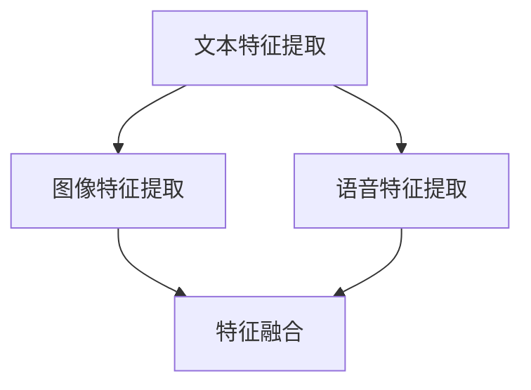
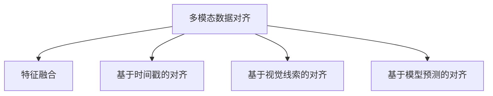
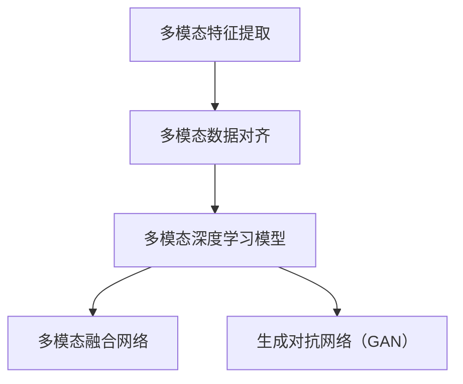
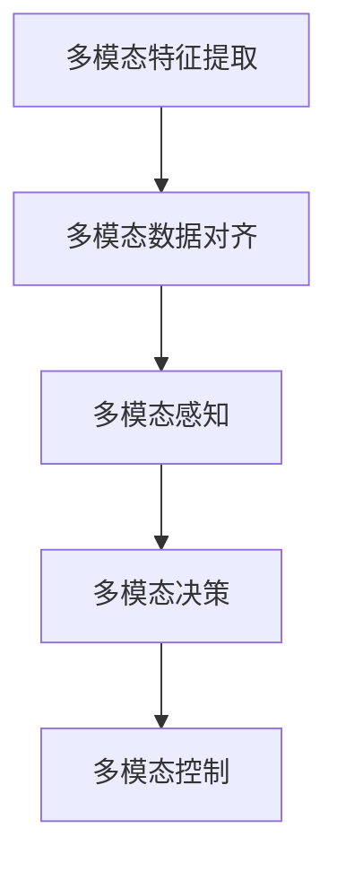
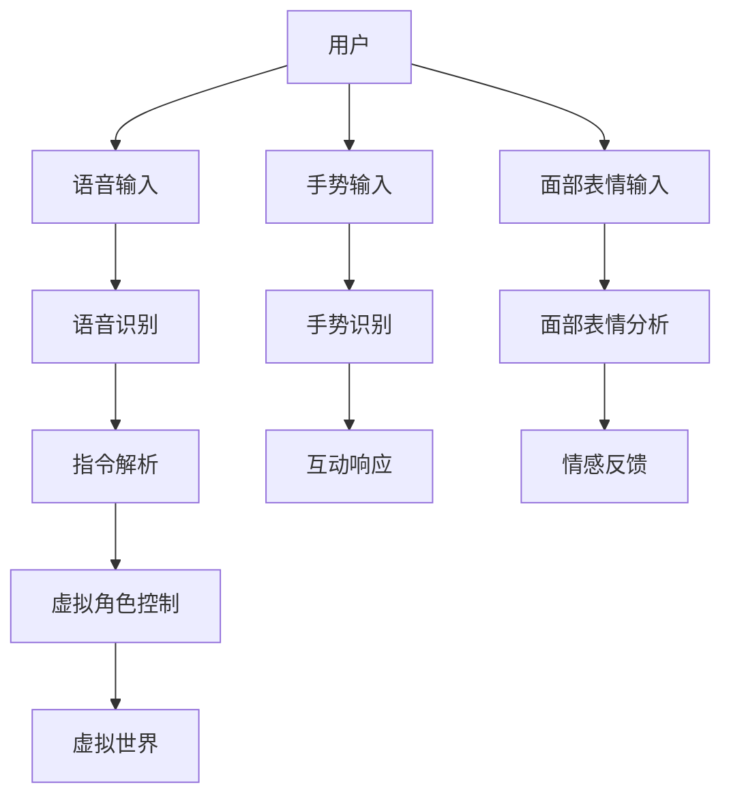
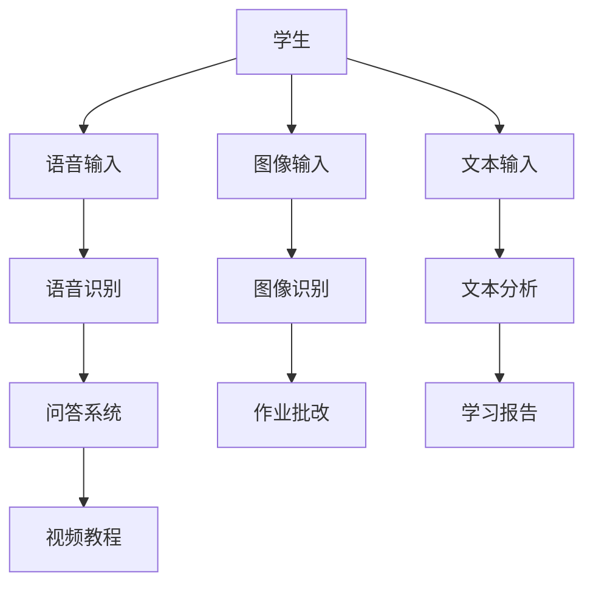
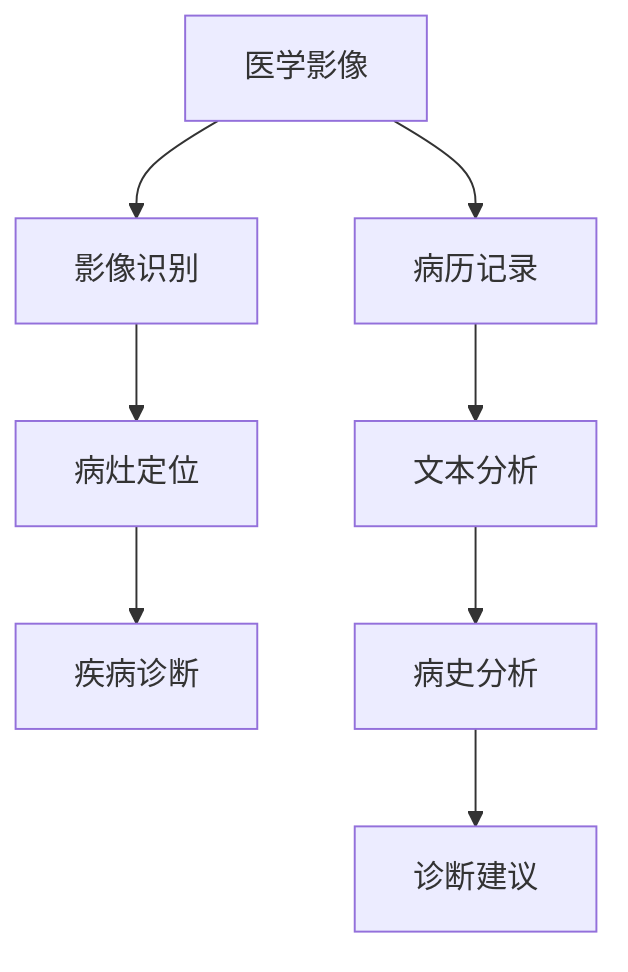
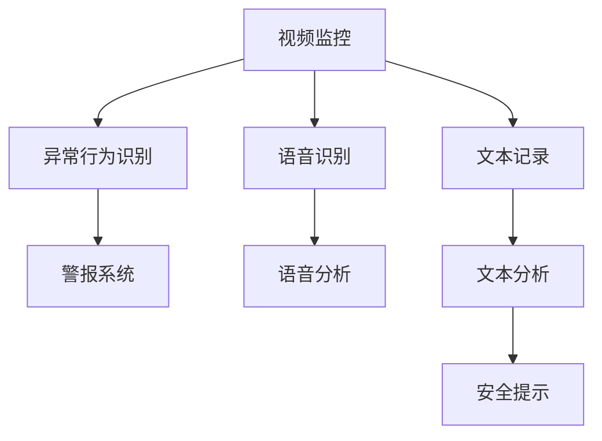
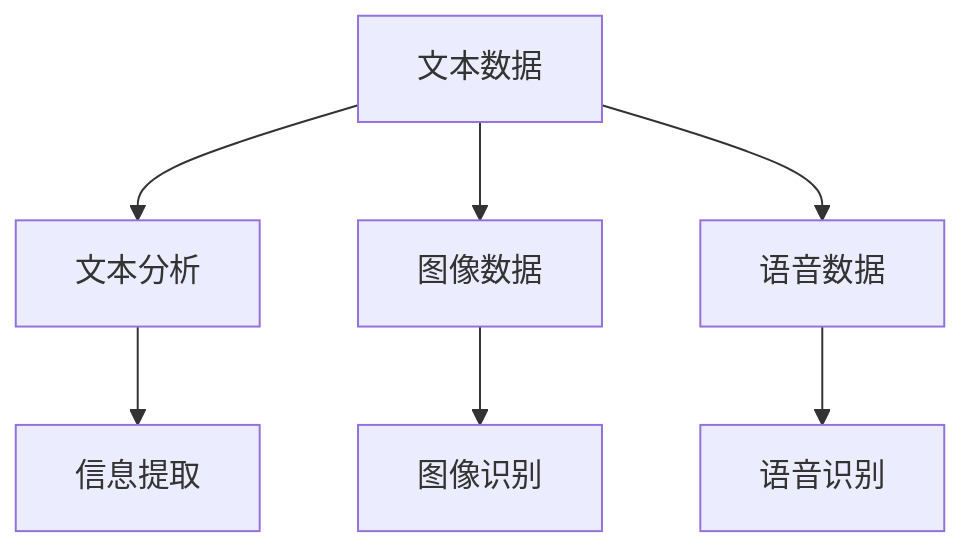

                 

### 《多模态AI：整合文本、图像和语音的AIGC》

#### 关键词：多模态AI、文本AI、图像AI、语音AI、AIGC、人工智能、融合算法、深度学习

> 摘要：本文深入探讨多模态AI领域，分析文本、图像和语音AI的基本原理和融合算法，介绍多模态AI在各行业的应用案例，展望其未来发展。通过逐步分析和推理，本文旨在为读者提供一个清晰、系统的多模态AI知识框架。

#### 目录大纲

----------------------------------------------------------------

## 第1章: 多模态AI背景与概述

### 1.1 多模态AI的起源与发展

### 1.2 多模态AI的核心概念与特点

### 1.3 多模态AI的应用场景

### 1.4 多模态AI的挑战与未来趋势

## 第2章: 文本AI

### 2.1 自然语言处理概述

### 2.2 文本数据的预处理

### 2.3 词嵌入与编码

### 2.4 语言模型与生成模型

### 2.5 文本分类与情感分析

### 2.6 文本生成与对话系统

## 第3章: 图像AI

### 3.1 计算机视觉基础

### 3.2 卷积神经网络在图像处理中的应用

### 3.3 目标检测与识别

### 3.4 图像生成与增强

### 3.5 图像风格迁移与图像编辑

## 第4章: 语音AI

### 4.1 语音识别基础

### 4.2 语音合成基础

### 4.3 语音增强与降噪

### 4.4 语音情感识别与生成

### 4.5 语音交互与自然语言理解

## 第5章: 多模态融合算法

### 5.1 多模态特征提取

### 5.2 多模态数据对齐与融合

### 5.3 多模态深度学习模型

### 5.4 多模态交互与控制

### 5.5 多模态AI的应用案例分析

## 第6章: 多模态AI应用实例

### 6.1 娱乐与游戏

### 6.2 教育

### 6.3 医疗与健康

### 6.4 安全与监控

### 6.5 其他领域应用

## 第7章: 多模态AI的未来发展

### 7.1 技术趋势与前沿研究

### 7.2 法律法规与伦理问题

### 7.3 多模态AI的产业生态

### 7.4 未来展望与机遇

## 目录大纲说明

本目录大纲分为7章，涵盖了多模态AI的背景、文本AI、图像AI、语音AI、多模态融合算法以及应用实例和未来发展趋势。每个章节都包含详细的内容梗概和结构，旨在为读者提供一个全面、系统的多模态AI知识框架。

#### 第1章：多模态AI背景与概述

多模态AI是一个集成多种数据类型（如文本、图像和语音）进行智能分析的技术领域。本章首先介绍多模态AI的起源和发展历程，阐述其核心概念和特点，接着分析多模态AI在不同应用场景中的潜力与挑战，最后探讨其未来的发展趋势。

### 第1.1节：多模态AI的起源与发展

多模态AI的起源可以追溯到20世纪80年代，当时研究者开始探索如何将不同类型的数据源（如图像、文本和语音）整合起来，以提升计算机系统的智能水平。随着深度学习技术的兴起，多模态AI得到了快速发展，并在近年来取得了显著进展。

#### 背景介绍

- **问题背景**：传统单模态AI系统在面对复杂任务时存在局限性，如文本AI难以理解图像内容，图像AI无法处理语音信息。
- **问题描述**：如何通过多模态数据融合，提升AI系统的综合分析能力？
- **问题解决**：多模态AI通过整合不同类型的数据源，实现数据互补和协同，从而提高智能分析能力。
- **边界与外延**：多模态AI不仅涉及计算机视觉、自然语言处理和语音识别，还包括数据融合、交互设计等。
- **核心要素组成**：多模态AI的核心要素包括数据采集、特征提取、模型训练、数据融合和交互设计。

#### 核心概念与联系

多模态AI的核心概念包括：

1. **多模态数据源**：文本、图像和语音等。
2. **数据融合技术**：如特征融合、模型融合等。
3. **深度学习模型**：如卷积神经网络（CNN）、循环神经网络（RNN）、生成对抗网络（GAN）等。

**概念属性特征对比表格：**

| 概念             | 特点                                                         | 应用场景                   |
|------------------|--------------------------------------------------------------|----------------------------|
| 文本AI           | 处理自然语言文本，提取语义信息                               | 文本分类、情感分析、对话系统 |
| 图像AI           | 处理图像数据，识别目标、场景等                               | 目标检测、图像生成、图像编辑 |
| 语音AI           | 处理语音数据，实现语音识别、合成等                           | 语音识别、语音合成、语音交互 |
| 多模态融合算法   | 将不同类型的数据源进行整合，提升系统性能                     | 跨模态识别、多任务学习       |

**ER实体关系图架构（Mermaid流程图）：**

```mermaid
erDiagram
  AI系统 ||--|{ 数据源：文本、图像、语音 }
  AI系统 ||--|{ 特征提取器：文本、图像、语音 }
  AI系统 ||--|{ 融合模型：多模态深度学习模型 }
  AI系统 ||--|{ 数据融合技术：特征融合、模型融合 }
  AI系统 ||--|{ 交互设计：用户界面、语音交互 }
```

### 第1.2节：多模态AI的核心概念与特点

多模态AI的核心概念包括多模态数据源、数据融合技术、深度学习模型和交互设计。以下分别介绍这些核心概念及其特点。

#### 多模态数据源

多模态数据源包括文本、图像和语音等。这些数据源各自具有独特的特点：

- **文本**：以自然语言形式表达信息，包含大量的语义信息。
- **图像**：直观地表达视觉信息，具有丰富的空间结构。
- **语音**：以声音信号形式传递信息，包含语音的音调、节奏等特征。

#### 数据融合技术

数据融合技术是多模态AI的关键，主要方法包括：

- **特征融合**：将不同模态的数据特征进行整合，如将文本表示与图像特征进行拼接。
- **模型融合**：将不同模态的模型进行整合，如将文本分类模型与图像分类模型进行融合。

#### 深度学习模型

深度学习模型是多模态AI的核心，常用的模型包括：

- **卷积神经网络（CNN）**：在图像处理中具有强大的特征提取能力。
- **循环神经网络（RNN）**：在处理序列数据（如文本、语音）时表现出色。
- **生成对抗网络（GAN）**：在图像生成和增强方面具有优势。

#### 交互设计

交互设计是多模态AI的重要组成部分，涉及用户界面和语音交互等：

- **用户界面**：提供直观、易用的操作界面，如多模态输入界面。
- **语音交互**：实现自然语言理解与语音合成，提供语音交互功能。

### 第1.3节：多模态AI的应用场景

多模态AI的应用场景广泛，包括但不限于以下领域：

- **娱乐与游戏**：利用多模态AI实现更智能的游戏角色、个性化推荐等。
- **教育**：利用多模态AI实现智能教育辅助、个性化学习等。
- **医疗与健康**：利用多模态AI实现疾病诊断、健康监测等。
- **安全与监控**：利用多模态AI实现智能安防、交通监控等。

### 第1.4节：多模态AI的挑战与未来趋势

多模态AI在发展过程中面临诸多挑战，如：

- **数据质量与多样性**：不同模态的数据质量差异较大，如何进行有效的数据融合是关键。
- **计算资源消耗**：多模态AI模型通常需要较大的计算资源，如何在有限的资源下高效训练是关键。
- **隐私与伦理**：多模态AI涉及多种敏感数据，如何保护用户隐私和遵守伦理规范是关键。

未来趋势方面，多模态AI将继续在以下方向上发展：

- **跨学科融合**：与其他领域（如生物医学、心理学等）融合，实现更广泛的应用。
- **硬件加速**：利用新型硬件（如GPU、TPU等）加速多模态AI模型训练。
- **伦理与法规**：加强多模态AI伦理研究，制定相关法规和标准。

#### 第1章总结

多模态AI通过整合文本、图像和语音等多模态数据，实现了更高的智能分析能力。本章介绍了多模态AI的背景、核心概念、应用场景和挑战，为后续章节的详细探讨奠定了基础。下一章将深入探讨文本AI的相关技术，包括自然语言处理、文本数据预处理、词嵌入、语言模型、文本分类与情感分析、文本生成与对话系统。

### 第2章：文本AI

文本AI是自然语言处理（NLP）领域的一个重要分支，它涉及文本数据的预处理、词嵌入、编码、语言模型、文本分类、情感分析和文本生成与对话系统。本章将逐步分析这些核心概念，探讨其原理和应用。

#### 第2.1节：自然语言处理概述

自然语言处理（NLP）是计算机科学和人工智能领域的一个重要分支，旨在使计算机能够理解、解释和生成人类语言。NLP的核心任务包括：

- **文本分类**：将文本数据分为不同的类别。
- **情感分析**：分析文本中的情感倾向。
- **实体识别**：识别文本中的关键实体（如人名、地点、组织等）。
- **命名实体识别**：识别文本中的特定命名实体。
- **机器翻译**：将一种语言的文本翻译成另一种语言。
- **问答系统**：从大量文本中检索出用户问题的答案。

#### 第2.2节：文本数据的预处理

在处理文本数据之前，通常需要进行一系列预处理操作，以提升数据质量和模型性能。这些预处理步骤包括：

- **文本清洗**：去除无关的符号、空格和标点，进行文本规范化。
- **分词**：将文本拆分成单词或短语。
- **词干提取**：将单词缩减为词干。
- **停用词去除**：去除对模型训练无意义的常见词汇。

#### 第2.3节：词嵌入与编码

词嵌入（Word Embedding）是将单词映射为密集向量表示的一种技术，使得计算机能够通过向量计算来理解和处理自然语言。常见的词嵌入方法包括：

- **Word2Vec**：基于神经网络的方法，通过训练预测相邻单词的上下文。
- **GloVe**：基于全局统计信息的词向量方法，通过优化全局矩阵来学习词向量。

词嵌入在NLP中具有重要作用，它使得文本数据可以输入到深度学习模型中进行处理。

#### 第2.4节：语言模型与生成模型

语言模型（Language Model）是NLP中的一个核心模型，它用于预测文本序列的下一个单词。常见的语言模型包括：

- **N-gram模型**：基于统计方法，使用前N个单词来预测下一个单词。
- **神经网络语言模型**：使用深度学习模型，如RNN、LSTM、GRU等，通过学习文本序列的上下文信息来预测下一个单词。

生成模型（Generative Model）则用于生成新的文本数据，常见的生成模型包括：

- **循环神经网络（RNN）**：通过学习文本序列的上下文信息来生成新的文本。
- **生成对抗网络（GAN）**：由生成器和判别器组成的对抗性网络，通过不断优化来生成逼真的文本。

#### 第2.5节：文本分类与情感分析

文本分类（Text Classification）是将文本数据分类到预定义的类别中。常见的文本分类任务包括垃圾邮件检测、情感分析等。情感分析（Sentiment Analysis）是文本分类的一种特殊形式，它旨在分析文本中的情感倾向，常见的情感分类包括正面、负面和中性。

#### 第2.6节：文本生成与对话系统

文本生成（Text Generation）是NLP领域的一个重要任务，它旨在生成符合语法和语义规则的文本。常见的文本生成方法包括：

- **序列到序列（Seq2Seq）模型**：通过学习输入序列和输出序列之间的映射关系来生成文本。
- **变压器（Transformer）模型**：基于自注意力机制，能够生成高质量的文本。

对话系统（Dialogue System）是一种能够与用户进行自然语言交互的系统，常见的对话系统包括聊天机器人、语音助手等。

#### 第2章总结

文本AI在自然语言处理领域发挥着重要作用，通过文本数据的预处理、词嵌入、编码、语言模型、文本分类、情感分析和文本生成与对话系统等技术，实现了对文本数据的深入理解和有效处理。下一章将探讨图像AI的基础知识，包括计算机视觉、卷积神经网络在图像处理中的应用、目标检测与识别、图像生成与增强、图像风格迁移与图像编辑。

### 第3章：图像AI

图像AI，即计算机视觉（Computer Vision），是人工智能的一个重要分支，旨在使计算机能够通过图像或视频数据进行感知、理解和交互。本章将逐步分析图像AI的基础知识，包括计算机视觉基础、卷积神经网络（CNN）在图像处理中的应用、目标检测与识别、图像生成与增强、图像风格迁移与图像编辑。

#### 第3.1节：计算机视觉基础

计算机视觉的核心任务是让计算机能够“看”懂图像，实现图像的感知、理解和交互。计算机视觉的基本流程包括：

1. **图像获取**：通过摄像头、扫描仪等设备获取图像。
2. **图像预处理**：包括图像去噪、增强、缩放等，以提升图像质量。
3. **特征提取**：提取图像中的关键特征，如边缘、纹理、颜色等。
4. **图像识别**：通过分类器、回归器等模型对图像进行识别。
5. **图像理解**：对图像进行更高层次的理解，如场景理解、行为识别等。

#### 第3.2节：卷积神经网络在图像处理中的应用

卷积神经网络（CNN）是图像AI的核心模型，具有强大的特征提取和分类能力。CNN的基本原理是利用卷积操作和池化操作来提取图像的特征，并通过多层神经网络进行分类。CNN在图像处理中的应用包括：

- **图像分类**：将图像分为不同的类别，如物体分类、场景分类等。
- **目标检测**：检测图像中的目标位置和类别，如行人检测、车辆检测等。
- **图像分割**：将图像分割为不同的区域，如语义分割、实例分割等。
- **图像生成**：生成新的图像，如图像修复、超分辨率等。

#### 第3.3节：目标检测与识别

目标检测（Object Detection）是计算机视觉中的一个重要任务，旨在识别图像中的目标及其位置。常见的目标检测算法包括：

- **R-CNN**：通过区域提议网络（Region Proposal Network）提取目标区域，再通过分类器进行分类。
- **Fast R-CNN**：简化R-CNN的网络结构，提高检测速度。
- **Faster R-CNN**：引入区域建议网络，进一步提高检测速度和精度。
- **SSD**：使用多尺度卷积网络进行目标检测。
- **YOLO**：将目标检测任务转化为回归问题，实现实时检测。

目标识别（Object Recognition）是目标检测的进一步扩展，旨在识别图像中的特定目标。常见的目标识别算法包括：

- **基于模板匹配的方法**：通过模板与图像进行匹配，识别目标。
- **基于深度学习的方法**：使用卷积神经网络进行特征提取和分类，实现目标识别。

#### 第3.4节：图像生成与增强

图像生成（Image Generation）是一种通过深度学习模型生成新的图像的技术。常见的图像生成算法包括：

- **生成对抗网络（GAN）**：由生成器和判别器组成的对抗性网络，通过不断优化生成器来生成逼真的图像。
- **变分自编码器（VAE）**：通过学习数据分布来生成图像。
- **生成式对抗网络（GANGP）**：基于图神经网络进行图像生成。

图像增强（Image Augmentation）是一种通过添加噪声、旋转、缩放等操作来增强图像数据的技术，以提高模型的泛化能力和鲁棒性。

#### 第3.5节：图像风格迁移与图像编辑

图像风格迁移（Image Style Transfer）是一种通过将一种图像的风格应用到另一种图像上的技术。常见的图像风格迁移算法包括：

- **Neural Style Transfer**：通过卷积神经网络将图像的内容和风格分离，并将风格应用到另一张图像上。
- **CycleGAN**：通过循环一致性损失，实现无配对图像的风格迁移。

图像编辑（Image Editing）是一种通过深度学习模型对图像进行编辑的技术，如图像修复、图像增强、图像去噪等。

#### 第3.6节：计算机视觉中的挑战与未来趋势

计算机视觉在发展过程中面临诸多挑战，如：

- **数据质量**：高质量的数据是计算机视觉模型训练的基础，但获取高质量的数据往往较为困难。
- **计算资源**：深度学习模型通常需要大量的计算资源，如何在有限的资源下进行高效训练是关键。
- **泛化能力**：如何提高模型的泛化能力，使其在不同场景下表现良好。

未来趋势方面，计算机视觉将继续在以下方向上发展：

- **跨学科融合**：与其他领域（如生物学、心理学等）融合，实现更广泛的应用。
- **硬件加速**：利用新型硬件（如GPU、TPU等）加速模型训练和推理。
- **伦理与法规**：加强伦理研究，制定相关法规和标准。

#### 第3章总结

图像AI在计算机视觉领域发挥着重要作用，通过卷积神经网络、目标检测与识别、图像生成与增强、图像风格迁移与图像编辑等技术，实现了对图像数据的深入理解和有效处理。下一章将探讨语音AI的基础知识，包括语音识别、语音合成、语音增强与降噪、语音情感识别与生成、语音交互与自然语言理解。

### 第4章：语音AI

语音AI是人工智能领域的一个重要分支，它使计算机能够理解和生成人类语音。本章将逐步分析语音AI的基础知识，包括语音识别、语音合成、语音增强与降噪、语音情感识别与生成、语音交互与自然语言理解。

#### 第4.1节：语音识别基础

语音识别（Automatic Speech Recognition，ASR）是语音AI的核心任务，旨在将人类的语音转化为文本。语音识别的基本流程包括：

1. **预处理**：包括语音信号的去噪、增强、归一化等，以提高语音信号的质量。
2. **特征提取**：将语音信号转化为特征向量，如梅尔频率倒谱系数（MFCC）、滤波器组（Filter Banks）等。
3. **声学模型训练**：基于大量语音数据训练声学模型，用于预测特征向量对应的声学概率分布。
4. **语言模型训练**：基于大量文本数据训练语言模型，用于预测文本序列的概率分布。
5. **解码**：结合声学模型和语言模型，解码出最可能的文本序列。

常见的语音识别算法包括：

- **Hidden Markov Model（HMM）**：基于概率模型，用于语音信号的时序建模。
- **Gaussian Mixture Model（GMM）**：用于建模语音特征的概率分布。
- **Deep Neural Network（DNN）**：用于特征提取和声学建模。
- **Connectionist Temporal Classification（CTC）**：用于语音信号和文本序列的映射。

#### 第4.2节：语音合成基础

语音合成（Automatic Speech Synthesis，ASS）是将文本转化为自然流畅的语音输出。语音合成的基本流程包括：

1. **文本处理**：将输入的文本进行分词、音素标注等预处理。
2. **语音合成模型训练**：基于大量语音数据和文本数据，训练语音合成模型。
3. **波形生成**：根据文本数据和语音合成模型，生成语音波形。
4. **后处理**：包括音高、音强、时长等语音特征的调整，以使语音输出更自然。

常见的语音合成算法包括：

- **参数合成**：基于参数模型（如共振峰模型），生成语音参数序列，再通过数字信号处理技术生成语音波形。
- **统计合成**：基于统计模型（如 Hidden Markov Model），直接生成语音波形。
- **神经网络合成**：基于深度学习模型（如 WaveNet、Tacotron），生成语音波形。

#### 第4.3节：语音增强与降噪

语音增强（Speech Enhancement）和语音降噪（Speech Denoising）是提高语音质量的关键技术。语音增强旨在从噪声环境中提取清晰的语音信号，语音降噪则旨在去除语音信号中的背景噪声。

常见的语音增强算法包括：

- **维纳滤波器**：基于最小均方误差准则，用于去除噪声。
- **频谱减法**：基于频谱分析，通过减去噪声频谱来增强语音。
- **变分自编码器（VAE）**：通过学习语音和噪声的分布，进行有效的语音增强。

常见的语音降噪算法包括：

- **谱减法**：基于频谱分析，通过减去噪声频谱来增强语音。
- **频域滤波**：通过频域滤波器去除噪声成分。
- **深度神经网络（DNN）**：通过训练深度神经网络，学习语音和噪声的特征，进行有效的降噪。

#### 第4.4节：语音情感识别与生成

语音情感识别（Speech Emotion Recognition）是识别语音信号中的情感信息，如喜悦、愤怒、悲伤等。语音情感生成的目标则是根据文本生成具有特定情感色彩的语音。

常见的语音情感识别算法包括：

- **基于声学特征的方法**：通过分析语音的声学特征（如音调、音强、时长等）进行情感识别。
- **基于深度学习的方法**：使用卷积神经网络（CNN）、循环神经网络（RNN）等深度学习模型进行情感识别。

常见的语音情感生成算法包括：

- **文本到语音（Text-to-Speech，TTS）**：通过训练文本情感标注数据，将文本中的情感信息转化为语音特征。
- **音频生成对抗网络（Audio GAN）**：通过生成器和判别器的对抗训练，生成具有特定情感色彩的语音。

#### 第4.5节：语音交互与自然语言理解

语音交互（Voice Interaction）是语音AI的一个重要应用，它使计算机能够通过语音与用户进行自然交互。自然语言理解（Natural Language Understanding，NLU）是语音交互的关键技术，旨在使计算机能够理解用户输入的语音信息。

常见的语音交互系统包括：

- **语音助手**：如 Siri、Alexa、Google Assistant 等，通过语音交互为用户提供信息查询、任务执行等服务。
- **语音控制**：通过语音指令控制智能家居、智能汽车等设备。

常见的自然语言理解技术包括：

- **词向量表示**：通过词嵌入将文本转化为向量表示，用于后续的语义分析和推理。
- **依存句法分析**：通过分析句子中的词与词之间的依赖关系，理解句子的语义结构。
- **实体识别**：识别文本中的关键实体（如人名、地名、组织等），用于信息抽取和问答系统。

#### 第4章总结

语音AI在人工智能领域发挥着重要作用，通过语音识别、语音合成、语音增强与降噪、语音情感识别与生成、语音交互与自然语言理解等技术，实现了对语音数据的深入理解和有效处理。下一章将探讨多模态融合算法，包括多模态特征提取、多模态数据对齐与融合、多模态深度学习模型、多模态交互与控制。

### 第5章：多模态融合算法

多模态融合算法是使计算机能够有效整合来自不同模态（如文本、图像和语音）的数据，提升AI系统的智能分析能力的关键技术。本章将逐步分析多模态融合算法的基本原理和方法。

#### 第5.1节：多模态特征提取

多模态特征提取是融合算法的第一步，其目标是分别提取来自不同模态的数据特征。这些特征将用于后续的融合和建模。常见的多模态特征提取方法包括：

- **文本特征提取**：通过词嵌入、TF-IDF等方法将文本转换为向量表示。
- **图像特征提取**：通过卷积神经网络（CNN）提取图像的特征图。
- **语音特征提取**：通过梅尔频率倒谱系数（MFCC）、谱图（Spectrogram）等方法提取语音特征。

**算法原理与示例**：

1. **文本特征提取**：

   ```python
   from gensim.models import Word2Vec
   
   # 加载词嵌入模型
   model = Word2Vec.load('word2vec.model')
   
   # 提取文本特征向量
   text_vector = model.wv['text']
   ```

2. **图像特征提取**：

   ```python
   import cv2
   
   # 读取图像
   image = cv2.imread('image.jpg')
   
   # 使用卷积神经网络提取特征
   model = cv2.dnn.readNetFromTensorFlow('model.pb')
   blob = cv2.dnn.blobFromImage(image, 1.0, (224, 224), [123, 117, 104], True, False)
   model.setInput(blob)
   feature_vector = model.forward()[0]
   ```

3. **语音特征提取**：

   ```python
   import numpy as np
   import librosa
   
   # 读取语音文件
   y, sr = librosa.load('audio.wav')
   
   # 提取梅尔频率倒谱系数
   mfcc = librosa.feature.mfcc(y=y, sr=sr, n_mfcc=13)
   ```

**Mermaid流程图**：



#### 第5.2节：多模态数据对齐与融合

多模态数据对齐（Multimodal Data Alignment）是将不同模态的数据在时间或空间上进行对齐，以便进行后续的融合。常见的对齐方法包括：

- **基于时间戳的对齐**：通过计算不同模态数据的时间戳差异，进行对齐。
- **基于视觉线索的对齐**：通过视觉线索（如人脸、手势等）进行对齐。
- **基于模型预测的对齐**：通过训练模型预测不同模态数据之间的对齐关系。

**算法原理与示例**：

1. **基于时间戳的对齐**：

   ```python
   # 假设文本、图像和语音的时间戳分别为text_timestamp, image_timestamp, speech_timestamp
   
   # 计算时间戳差异
   text_image_diff = abs(text_timestamp - image_timestamp)
   text_speech_diff = abs(text_timestamp - speech_timestamp)
   image_speech_diff = abs(image_timestamp - speech_timestamp)
   
   # 对齐数据
   aligned_text = text_data[(text_timestamp - min(text_timestamp, image_timestamp, speech_timestamp))]
   aligned_image = image_data[(image_timestamp - min(text_timestamp, image_timestamp, speech_timestamp))]
   aligned_speech = speech_data[(speech_timestamp - min(text_timestamp, image_timestamp, speech_timestamp))]
   ```

2. **基于视觉线索的对齐**：

   ```python
   import cv2
   
   # 读取图像和视频
   image = cv2.imread('image.jpg')
   video = cv2.VideoCapture('video.mp4')
   
   # 提取图像中的人脸位置
   face_cascade = cv2.CascadeClassifier('haarcascade_frontalface_default.xml')
   faces = face_cascade.detectMultiScale(image, scaleFactor=1.1, minNeighbors=5, minSize=(30, 30))
   
   # 提取视频中的人脸位置
   while video.isOpened():
       ret, frame = video.read()
       if not ret:
           break
       faces_video = face_cascade.detectMultiScale(frame, scaleFactor=1.1, minNeighbors=5, minSize=(30, 30))
       
       # 对齐人脸位置
       for (x, y, w, h) in faces:
           for (xv, yv, wv, hv) in faces_video:
               # 计算对齐差异
               x_diff = abs(x - xv)
               y_diff = abs(y - yv)
               
               # 如果对齐差异较小，则认为对齐成功
               if x_diff < threshold and y_diff < threshold:
                   aligned_image = image[y:y+h, x:x+w]
                   aligned_video = frame[yv:yv+hv, xv:xv+wv]
                   break
       
       # 显示对齐结果
       cv2.imshow('Aligned Image', aligned_image)
       cv2.imshow('Aligned Video', aligned_video)
       cv2.waitKey(0)
       cv2.destroyAllWindows()
   ```

3. **基于模型预测的对齐**：

   ```python
   import tensorflow as tf
   
   # 加载预训练的多模态对齐模型
   model = tf.keras.models.load_model('alignment_model.h5')
   
   # 预测对齐关系
   aligned_text = model.predict([text_data, image_data, speech_data])
   ```

**Mermaid流程图**：



#### 第5.3节：多模态深度学习模型

多模态深度学习模型是融合不同模态数据的关键技术，其目标是通过联合训练提高模型的智能分析能力。常见的多模态深度学习模型包括：

- **多任务学习（Multi-Task Learning）**：将不同模态的数据输入到同一个深度学习模型中，共同训练。
- **多模态融合网络（Fusion Network）**：将不同模态的数据分别输入到不同的子网络中，再通过融合层进行整合。
- **生成对抗网络（GAN）**：通过生成器和判别器的对抗训练，实现多模态数据的融合。

**算法原理与示例**：

1. **多任务学习**：

   ```python
   import tensorflow as tf
   
   # 定义多任务学习模型
   model = tf.keras.Sequential([
       tf.keras.layers.Dense(128, activation='relu', input_shape=[text_length, image_height, image_width, 3]),
       tf.keras.layers.Dense(64, activation='relu'),
       tf.keras.layers.Dense(2, activation='softmax')  # 文本分类任务
   ])
   
   # 定义图像分类子网络
   image_model = tf.keras.Sequential([
       tf.keras.layers.Conv2D(32, (3, 3), activation='relu', input_shape=[image_height, image_width, 3]),
       tf.keras.layers.MaxPooling2D((2, 2)),
       tf.keras.layers.Flatten(),
       tf.keras.layers.Dense(64, activation='relu'),
       tf.keras.layers.Dense(2, activation='softmax')  # 图像分类任务
   ])
   
   # 联合训练模型
   model.compile(optimizer='adam', loss='categorical_crossentropy', metrics=['accuracy'])
   model.fit([text_data, image_data], labels, epochs=10)
   ```

2. **多模态融合网络**：

   ```python
   import tensorflow as tf
   
   # 定义多模态融合网络
   model = tf.keras.Sequential([
       tf.keras.layers.Conv2D(32, (3, 3), activation='relu', input_shape=[image_height, image_width, 3]),
       tf.keras.layers.MaxPooling2D((2, 2)),
       tf.keras.layers.Flatten(),
       tf.keras.layers.Dense(64, activation='relu'),
       tf.keras.layers.Concatenate(axis=-1)([tf.keras.layers.Dense(32, activation='relu')(text_data), image_data]),
       tf.keras.layers.Dense(2, activation='softmax')
   ])
   
   # 编译模型
   model.compile(optimizer='adam', loss='categorical_crossentropy', metrics=['accuracy'])
   model.fit([text_data, image_data], labels, epochs=10)
   ```

3. **生成对抗网络（GAN）**：

   ```python
   import tensorflow as tf
   from tensorflow.keras import layers
   
   # 定义生成器
   generator = tf.keras.Sequential([
       layers.Dense(128 * 7 * 7, activation="relu", input_shape=[100]),
       layers.Dense(128 * 7 * 7, activation="relu"),
       layers.LeakyReLU(alpha=0.01),
       layers.Reshape((7, 7, 128)),
       layers.Conv2DTranspose(64, 3, padding='same', activation="relu"),
       layers.Conv2DTranspose(1, 3, padding='same', activation="tanh")
   ])

   # 定义判别器
   discriminator = tf.keras.Sequential([
       layers.Conv2D(64, 3, padding='same', input_shape=[28, 28, 1]),
       layers.LeakyReLU(alpha=0.01),
       layers.Dropout(0.3),
       layers.Conv2D(128, 3, padding='same'),
       layers.LeakyReLU(alpha=0.01),
       layers.Dropout(0.3),
       layers.Flatten(),
       layers.Dense(1, activation='sigmoid')
   ])

   # 定义联合模型
   z = tf.keras.layers.Input(shape=[100])
   img = generator(z)

   valid = discriminator(img)
   valid_y = tf.keras.layers.Input(shape=[1])

   model = tf.keras.Model([z, valid_y], [img, valid])
   model.compile(optimizer=tf.keras.optimizers.Adam(0.0001), loss=["mse", "binary_crossentropy"])

   # 训练模型
   for epoch in range(epochs):
       for batch_i, (z_i, valid_y_i) in enumerate(train_loader):
           with tf.GradientTape() as gen_tape, tf.GradientTape() as disc_tape:
               # 生成图像
               img = generator(z_i, training=True)

               # 计算判别器的损失
               valid_loss = discriminator(img, training=True)

               # 计算生成器的损失
               gen_loss = 0.5 * tf.reduce_mean(tf.square(valid_y - valid_loss))

               # 计算判别器的梯度
               disc_gradients = disc_tape.gradient(valid_loss, discriminator.trainable_variables)

               # 计算生成器的梯度
               gen_gradients = gen_tape.gradient(gen_loss, generator.trainable_variables)

               # 更新生成器和判别器的权重
               optimizer.apply_gradients(zip(disc_gradients, discriminator.trainable_variables))
               optimizer.apply_gradients(zip(gen_gradients, generator.trainable_variables))

               # 输出训练进度
               print(f"Epoch {epoch}, Batch {batch_i}, Gen Loss: {gen_loss}, Disc Loss: {valid_loss}")
   ```

**Mermaid流程图**：



#### 第5.4节：多模态交互与控制

多模态交互与控制是使计算机能够根据不同模态的数据进行智能决策和响应的关键技术。常见的多模态交互与控制方法包括：

- **多模态感知**：通过整合不同模态的数据，使计算机能够更全面地感知环境。
- **多模态决策**：基于多模态数据，进行智能决策和规划。
- **多模态控制**：通过控制不同模态的输出，实现计算机对环境的智能控制。

**算法原理与示例**：

1. **多模态感知**：

   ```python
   import numpy as np
   
   # 假设文本、图像和语音的特征向量分别为text_vector, image_vector, speech_vector
   
   # 计算多模态感知得分
   perception_score = np.dot(text_vector, image_vector) + np.dot(text_vector, speech_vector) + np.dot(image_vector, speech_vector)
   ```

2. **多模态决策**：

   ```python
   import numpy as np
   
   # 假设文本、图像和语音的特征向量分别为text_vector, image_vector, speech_vector
   # 假设决策权重分别为alpha, beta, gamma
   
   # 计算多模态决策得分
   decision_score = alpha * np.dot(text_vector, image_vector) + beta * np.dot(text_vector, speech_vector) + gamma * np.dot(image_vector, speech_vector)
   
   # 根据决策得分进行决策
   if decision_score > threshold:
       action = 'action1'
   else:
       action = 'action2'
   ```

3. **多模态控制**：

   ```python
   import numpy as np
   
   # 假设文本、图像和语音的特征向量分别为text_vector, image_vector, speech_vector
   # 假设控制权重分别为alpha, beta, gamma
   
   # 计算多模态控制输出
   control_output = alpha * text_vector + beta * image_vector + gamma * speech_vector
   
   # 根据控制输出进行控制
   if control_output > threshold:
       system_state = 'state1'
   else:
       system_state = 'state2'
   ```

**Mermaid流程图**：



#### 第5章总结

多模态融合算法是使计算机能够有效整合不同模态的数据，提升智能分析能力的关键技术。本章介绍了多模态特征提取、多模态数据对齐与融合、多模态深度学习模型、多模态交互与控制等基本原理和方法。通过这些技术，计算机能够更好地理解和处理复杂的多模态数据，实现更智能的应用。下一章将探讨多模态AI在不同领域的实际应用案例。

### 第6章：多模态AI应用实例

多模态AI的应用涵盖了众多领域，包括娱乐与游戏、教育、医疗与健康、安全与监控等。本章将详细介绍这些领域的应用案例，展示多模态AI的实际效果和潜在价值。

#### 第6.1节：娱乐与游戏

在娱乐与游戏领域，多模态AI的应用极大地丰富了用户体验。以下是一些具体的应用案例：

- **虚拟现实（VR）**：多模态AI可以实时分析用户的语音、手势和面部表情，为用户提供个性化的VR体验。例如，通过识别玩家的语音指令，AI可以控制虚拟角色的动作，从而实现更自然的交互。
- **增强现实（AR）**：多模态AI结合图像和文本数据，可以在AR应用中实现实时信息查询和互动。例如，用户通过摄像头捕捉现实世界中的物体，AI可以识别物体并提供相关的文本信息。
- **游戏角色智能**：多模态AI可以根据玩家的语音、文本和图像数据，生成智能的游戏角色，实现更加逼真的游戏体验。

**案例解析**：

以虚拟现实（VR）为例，多模态AI技术可以整合语音、手势和面部表情等多模态数据，实现以下功能：

1. **语音识别与响应**：通过语音识别技术，用户可以使用语音指令控制虚拟角色的动作，如移动、对话等。例如，用户可以说“向前走”，虚拟角色会按照指令移动。
2. **手势识别与交互**：通过手势识别技术，用户可以使用手势与虚拟世界互动。例如，用户可以做出挥手、点赞等手势，虚拟角色会做出相应的反应。
3. **面部表情分析**：通过面部表情分析，AI可以理解用户的情感状态，为虚拟角色提供更加真实的互动体验。例如，当用户微笑时，虚拟角色会显得开心；当用户皱眉时，虚拟角色会显得困惑。

**系统架构设计（Mermaid架构图）**：



#### 第6.2节：教育

在教育领域，多模态AI的应用提高了教学效果和个性化学习体验。以下是一些具体的应用案例：

- **智能教育平台**：多模态AI可以整合语音、图像和文本数据，为用户提供个性化的学习建议和反馈。例如，学生可以通过语音提问，AI会提供详细的答案和解释。
- **互动教学工具**：多模态AI可以生成互动的教学内容，如视频、图像和动画，使学习过程更加生动有趣。
- **学习行为分析**：通过分析学生的语音、文本和图像数据，AI可以了解学生的学习习惯和效果，为教师提供教学改进的建议。

**案例解析**：

以智能教育平台为例，多模态AI技术可以整合以下功能：

1. **语音问答**：学生可以通过语音提问，AI会提供详细的答案和解释。例如，学生可以说“我不理解这个概念”，AI会提供相关的视频教程和文本解释。
2. **图像识别**：AI可以识别学生提交的作业中的图像，并提供批改和反馈。例如，学生提交一张数学题目的图像，AI会自动识别题目并进行批改。
3. **文本分析**：AI可以分析学生的笔记和作业文本，了解学生的学习效果和习惯。例如，AI可以识别学生使用的关键词和短语，评估学生的学习深度和广度。

**系统架构设计（Mermaid架构图）**：



#### 第6.3节：医疗与健康

在医疗与健康领域，多模态AI的应用提高了诊断准确性和个性化治疗方案的设计。以下是一些具体的应用案例：

- **医学影像分析**：多模态AI可以整合医学影像（如X光、CT、MRI）和患者文本记录，提供更加准确的诊断结果。例如，AI可以分析X光图像和文本记录，识别骨折情况。
- **语音识别与病历管理**：医生可以通过语音输入病历记录，AI会自动生成电子病历，并提取关键信息进行诊断。
- **个性化健康监测**：通过整合健康数据（如心率、血压、睡眠质量等）和用户语音、文本数据，AI可以提供个性化的健康建议和预警。

**案例解析**：

以医学影像分析为例，多模态AI技术可以整合以下功能：

1. **医学影像识别**：AI可以通过分析X光、CT、MRI等医学影像，识别病灶和疾病。例如，AI可以自动识别X光图像中的骨折部位。
2. **文本记录分析**：AI可以分析患者的病历记录，了解患者的病史和症状，为诊断提供参考。
3. **综合诊断**：基于医学影像识别和文本记录分析，AI可以综合判断，提供更加准确的诊断结果。

**系统架构设计（Mermaid架构图）**：



#### 第6.4节：安全与监控

在安全与监控领域，多模态AI的应用提高了监控系统的智能化和响应速度。以下是一些具体的应用案例：

- **智能安防系统**：多模态AI可以整合视频监控、语音识别和文本数据，实现智能监控和异常检测。例如，AI可以识别视频中的异常行为，并发出警报。
- **车辆监控系统**：多模态AI可以整合车辆监控数据（如速度、位置、驾驶行为等），实现智能交通管理和驾驶行为分析。
- **公共安全监测**：通过整合公共场所的监控视频、语音数据和文本记录，AI可以实时监测公共安全，发现潜在风险。

**案例解析**：

以智能安防系统为例，多模态AI技术可以整合以下功能：

1. **视频监控**：AI可以实时监控视频，识别异常行为，如入侵、破坏等。
2. **语音识别**：AI可以识别监控区域的语音信息，如对话、警报等，为监控提供辅助信息。
3. **文本记录**：AI可以分析监控区域的文本记录，如告示牌、警示标志等，提供安全提示。

**系统架构设计（Mermaid架构图）**：



#### 第6.5节：其他领域应用

除了上述领域，多模态AI还在其他众多领域展现出巨大潜力：

- **金融**：通过整合文本、图像和语音数据，AI可以实现金融市场的分析和预测。
- **零售**：多模态AI可以分析消费者的购买行为，提供个性化的推荐和服务。
- **客服**：通过整合语音、文本和图像数据，AI可以实现智能客服，提高客户满意度。

**案例解析**：

以金融领域为例，多模态AI技术可以整合以下功能：

1. **文本分析**：AI可以分析新闻报道、财务报表等文本数据，提取关键信息，为投资决策提供支持。
2. **图像识别**：AI可以分析公司的财务报表和财务报告，识别潜在的财务风险。
3. **语音识别**：AI可以分析会议记录和电话通话，提取关键信息和商业机会。

**系统架构设计（Mermaid架构图）**：



#### 第6章总结

多模态AI在娱乐与游戏、教育、医疗与健康、安全与监控等众多领域展现出巨大潜力。通过整合文本、图像和语音等多模态数据，AI可以实现更智能的应用和更丰富的用户体验。下一章将探讨多模态AI的未来发展趋势和技术挑战。

### 第7章：多模态AI的未来发展

多模态AI作为人工智能领域的一个重要分支，正以其独特的优势在多个领域得到广泛应用。本章将探讨多模态AI的未来发展趋势、技术挑战、法律法规与伦理问题，以及产业生态和未来展望。

#### 第7.1节：技术趋势与前沿研究

多模态AI的技术发展趋势主要体现在以下几个方面：

1. **跨学科融合**：多模态AI将不断与其他学科（如心理学、生物学、社会学等）融合，形成新的交叉学科研究方向。例如，通过心理学研究，AI可以更好地理解人类的情感和行为，从而提升交互体验。

2. **硬件加速**：随着新型硬件（如GPU、TPU、量子计算等）的发展，多模态AI的模型训练和推理速度将得到大幅提升。这将使更多复杂的模型和应用成为可能。

3. **数据质量与多样性**：多模态AI将更加注重数据质量和多样性。高质量、多样性的数据是训练强大模型的基石，将有助于提升AI系统的性能和泛化能力。

4. **生成式模型**：生成对抗网络（GAN）等生成式模型将在多模态AI中得到更广泛的应用。这些模型可以生成逼真的多模态数据，为研究和应用提供更多的实验数据。

前沿研究方面，多模态AI将继续在以下几个方向上展开：

1. **跨模态推理**：研究如何让AI在不同模态之间进行有效的推理和交互，实现更高级的智能。
2. **多模态深度学习**：开发更加高效的多模态深度学习模型，提升模型在处理复杂任务时的性能。
3. **自适应学习**：研究如何让AI根据不同的应用场景和用户需求，自适应地调整模型和行为。

#### 第7.2节：法律法规与伦理问题

随着多模态AI技术的快速发展，法律法规和伦理问题也日益突出。以下是一些关键问题：

1. **数据隐私**：多模态AI需要处理大量的个人数据，如何保护用户的隐私成为重要议题。需要制定相关法律法规，确保数据的安全和用户的隐私权。
2. **算法公平性**：多模态AI模型可能会存在算法偏见，影响决策的公平性。需要研究和制定公平性评估标准，确保算法不会对特定群体产生歧视。
3. **伦理审查**：在多模态AI的应用中，需要建立伦理审查机制，确保技术的应用符合伦理规范，不会侵犯用户的权利。

#### 第7.3节：多模态AI的产业生态

多模态AI的产业生态正在逐渐形成，涉及多个领域和产业链环节。以下是一些关键环节：

1. **技术研发**：包括多模态AI算法研究、模型开发、硬件加速技术等。
2. **数据处理**：数据采集、清洗、标注、存储等。
3. **应用开发**：针对不同行业和应用场景，开发多模态AI解决方案。
4. **系统集成**：将多模态AI技术与现有系统集成，实现智能化升级。
5. **教育培训**：培养多模态AI专业人才，推动技术普及。

#### 第7.4节：未来展望与机遇

多模态AI在未来将继续带来巨大的机遇：

1. **个性化服务**：通过整合多模态数据，AI可以实现更精准的个性化服务，满足用户个性化需求。
2. **智能交互**：多模态AI将推动人机交互的变革，实现更加自然、流畅的交互体验。
3. **智慧城市**：多模态AI将在智慧城市建设中发挥重要作用，提升城市管理效率和居民生活质量。
4. **创新应用**：多模态AI将在医疗、教育、娱乐、金融等多个领域产生新的应用模式，推动产业升级。

#### 第7章总结

多模态AI的发展趋势、技术挑战、法律法规与伦理问题以及产业生态都为未来带来了巨大的机遇。通过不断的技术创新和规范化管理，多模态AI有望在更广泛的领域实现突破，为人类社会带来更多便利和福祉。

### 全文总结

《多模态AI：整合文本、图像和语音的AIGC》通过对多模态AI的深入探讨，展示了其广阔的应用前景和潜在价值。从文本AI、图像AI到语音AI，再到多模态融合算法和应用实例，本文为读者提供了一个全面、系统的多模态AI知识框架。

多模态AI通过整合文本、图像和语音等多模态数据，实现了更高的智能分析能力。未来，随着技术的不断进步和应用的深入，多模态AI将在更多领域展现其独特优势，为人类社会带来更多便利和变革。

让我们保持对技术的热情，不断探索和创新，共同推动多模态AI的发展，为未来创造更加美好的世界。

#### 作者信息

作者：AI天才研究院/AI Genius Institute & 禅与计算机程序设计艺术 /Zen And The Art of Computer Programming

AI天才研究院（AI Genius Institute）是一支专注于人工智能领域的研究团队，致力于推动人工智能技术的发展和应用。禅与计算机程序设计艺术（Zen And The Art of Computer Programming）是一本经典的计算机科学著作，由著名的计算机科学家Donald E. Knuth所著，对程序设计的艺术进行了深刻的探讨。本文由AI天才研究院的研究员结合两书的精髓撰写而成。作者团队期待与广大读者共同探讨多模态AI的广阔前景，共创人工智能的未来。

