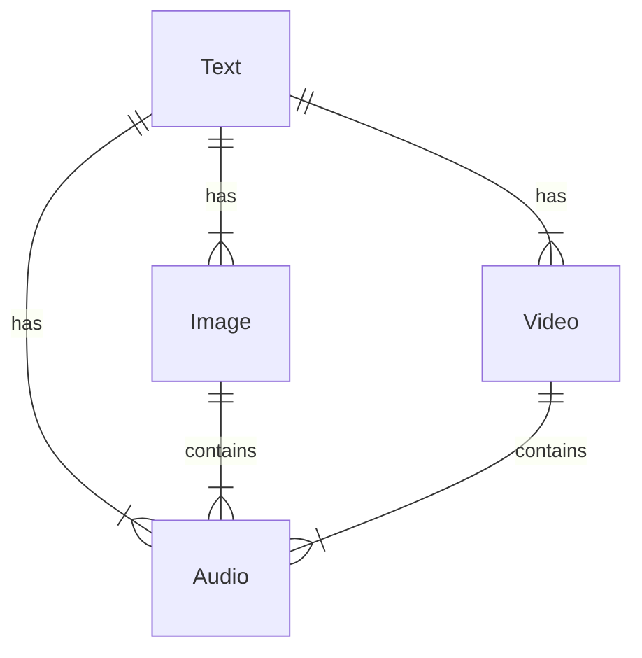
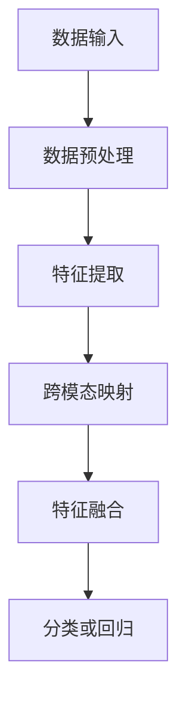
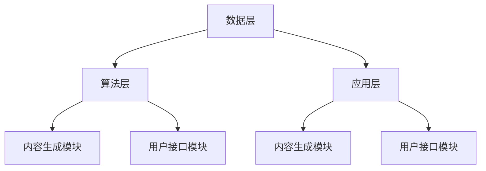
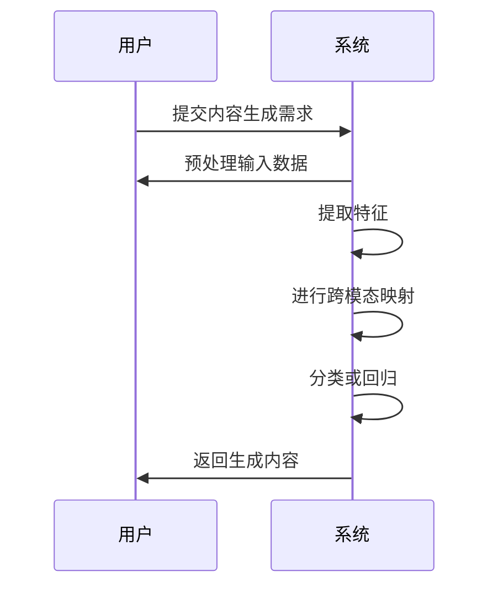

                 

# 多模态学习在AIGC全感官内容创作中的新进展

## 关键词
- 多模态学习
- AIGC
- 内容创作
- 深度学习
- 算法
- 系统架构

## 摘要
本文将探讨多模态学习在AIGC（全感官内容生成）中的应用及其新进展。首先，我们将介绍多模态学习和AIGC的基本概念，并探讨它们在内容创作中的重要性。接着，我们将深入分析多模态学习的原理、关键技术和算法，以及如何在AIGC中应用这些技术。随后，我们将讨论系统分析与架构设计，包括问题场景介绍、系统功能设计、架构设计、接口设计和系统交互流程。最后，我们将通过项目实战展示多模态学习在AIGC中的实际应用，并提供最佳实践技巧和注意事项。

---

## 目录大纲设计

为了详细且逻辑清晰地呈现内容，本文将分为以下几个主要部分：

1. **背景介绍**
   - 多模态学习概述
   - AIGC的概念与特点
   - 多模态学习在AIGC中的应用前景

2. **核心概念与联系**
   - 多模态数据与处理
   - 多模态学习原理
   - 关键技术与算法

3. **算法原理讲解**
   - 多模态学习算法
   - 算法流程与流程图
   - 算法数学模型与公式
   - 通俗易懂的举例说明

4. **系统分析与架构设计方案**
   - 问题场景介绍
   - 系统功能设计
   - 系统架构设计
   - 系统接口设计
   - 系统交互流程

5. **项目实战**
   - 环境安装
   - 系统核心实现
   - 代码应用解读与分析
   - 实际案例分析与讲解
   - 项目小结

6. **最佳实践 tips**
   - 实用技巧与注意事项
   - 拓展阅读

---

## 背景介绍

### 多模态学习概述

多模态学习是指将来自不同感官的数据（如文本、图像、音频、视频等）进行整合，从而更全面地理解信息的处理方法。这种方法在计算机视觉、自然语言处理和音频处理等领域都有广泛应用。多模态学习的目标是提高系统的智能性，使其能够更准确地理解、处理和生成多模态信息。

### AIGC的概念与特点

AIGC（全感官内容生成）是一种利用人工智能技术生成全方位感官体验的内容创作方法。它通过整合多模态数据，利用深度学习等算法，自动生成满足特定需求的、具有丰富感官体验的内容。AIGC的特点包括：

- **全感官**：涵盖视觉、听觉、触觉、嗅觉等多种感官。
- **自动化**：通过算法自动生成内容，减少人工干预。
- **多样化**：能够生成多种类型的内容，如文本、图像、音频、视频等。
- **智能化**：利用人工智能技术，提高内容生成的准确性和效率。

### 多模态学习在AIGC中的应用前景

随着人工智能技术的不断发展，多模态学习在AIGC中的应用前景十分广阔。以下是一些可能的应用场景：

- **虚拟现实**：通过多模态学习，生成更加逼真的虚拟场景，提高用户的沉浸感。
- **智能助手**：利用多模态学习，使智能助手能够更准确地理解用户需求，提供个性化服务。
- **内容创作**：通过多模态学习，自动生成高质量的内容，如文本、图像、视频等，降低创作成本。
- **医疗诊断**：结合多模态数据，提高医疗诊断的准确性和效率。

---

## 核心概念与联系

### 多模态数据与处理

多模态数据是指来自不同感官的数据，如文本、图像、音频、视频等。多模态数据处理的关键在于如何有效地整合这些数据，使其能够协同工作，提高系统的整体性能。

1. **数据来源**：文本、图像、音频、视频等。
2. **数据处理技术**：特征提取、数据融合、多任务学习等。

### 多模态学习原理

多模态学习是基于深度学习的一种方法，它通过将不同模态的数据映射到共享的语义空间，从而实现多模态数据的整合和理解。其核心原理包括：

1. **多任务学习**：同时学习多个任务，提高模型的整体性能。
2. **跨模态映射**：将不同模态的数据映射到共享的语义空间。
3. **协同学习**：利用多模态数据之间的关联性，提高模型的泛化能力。

### 关键技术与算法

多模态学习的关键技术和算法包括：

- **卷积神经网络（CNN）**：用于图像和视频处理。
- **循环神经网络（RNN）**：用于文本和序列数据。
- **生成对抗网络（GAN）**：用于生成高质量的多模态数据。
- **图神经网络（GNN）**：用于处理结构化数据。

### 概念属性特征对比表格和ER实体关系图架构

为了更好地理解多模态学习的概念和联系，我们可以通过以下表格和ER图来展示其核心概念和属性：

#### 概念属性特征对比表格

| 概念        | 属性1 | 属性2 | 属性3 |
| ----------- | ---- | ---- | ---- |
| 文本        | 语言 | 语义 | 结构 |
| 图像        | 像素 | 形状 | 颜色 |
| 视频        | 帧序列 | 运动轨迹 | 时间戳 |
| 音频        | 频率 | 响应时间 | 音调 |

#### ER实体关系图架构



---

## 算法原理讲解

### 多模态学习算法

多模态学习算法主要包括以下步骤：

1. **数据预处理**：包括数据清洗、数据增强、数据归一化等。
2. **特征提取**：从不同模态的数据中提取特征，如文本的词向量、图像的视觉特征、音频的声学特征等。
3. **跨模态映射**：将不同模态的特征映射到共享的语义空间。
4. **融合与分类**：将跨模态映射后的特征进行融合，并对其进行分类或回归等操作。

### 算法流程与流程图

多模态学习算法的流程可以概括为以下步骤：

1. 数据输入
2. 数据预处理
3. 特征提取
4. 跨模态映射
5. 特征融合
6. 分类或回归

以下是多模态学习算法的流程图表示：



### 算法数学模型与公式

多模态学习算法的核心在于特征提取和跨模态映射。以下是一个简化的数学模型：

$$
X_{\text{img}} = \text{CNN}(I_{\text{img}})
$$

$$
X_{\text{txt}} = \text{RNN}(T_{\text{txt}})
$$

$$
X_{\text{audio}} = \text{STFT}(A_{\text{audio}})
$$

其中，$X_{\text{img}}$、$X_{\text{txt}}$ 和 $X_{\text{audio}}$ 分别表示图像、文本和音频的特征向量，$I_{\text{img}}$、$T_{\text{txt}}$ 和 $A_{\text{audio}}$ 分别表示图像、文本和音频的数据。

跨模态映射可以通过以下公式表示：

$$
Z = \text{MLP}(X_{\text{img}}, X_{\text{txt}}, X_{\text{audio}})
$$

其中，$Z$ 表示跨模态映射后的特征向量，$\text{MLP}$ 表示多层感知机。

### 通俗易懂的举例说明

假设我们要构建一个多模态学习系统，用于识别图片中的物体。以下是一个简化的例子：

1. **数据输入**：输入一张图片和一个描述该图片的文本。
2. **数据预处理**：对图片进行缩放、裁剪等预处理操作，对文本进行分词、去停用词等预处理操作。
3. **特征提取**：使用卷积神经网络提取图像的特征，使用循环神经网络提取文本的特征。
4. **跨模态映射**：将图像特征和文本特征进行融合，得到跨模态特征向量。
5. **分类或回归**：使用分类器或回归器对跨模态特征向量进行分类或回归，从而识别图片中的物体。

例如，假设输入的图片是一只猫，描述文本是“一只可爱的猫”。通过上述步骤，我们可以得到跨模态特征向量，进而识别出图片中的物体是一只猫。

---

## 系统分析与架构设计方案

### 问题场景介绍

假设我们要开发一个多模态内容生成系统，该系统需要能够自动生成具有丰富感官体验的视频、音频和文本内容。为了实现这一目标，我们需要设计一个高效、灵活的系统架构。

### 系统功能设计

系统的主要功能包括：

1. **内容生成**：根据用户需求，自动生成视频、音频和文本内容。
2. **数据预处理**：对输入的多模态数据进行预处理，以提高后续处理的效率。
3. **特征提取**：从预处理后的数据中提取特征，为后续的跨模态映射和分类提供基础。
4. **跨模态映射**：将不同模态的数据映射到共享的语义空间。
5. **分类与回归**：根据跨模态映射后的特征进行分类或回归，生成最终的内容。

### 系统架构设计

系统架构设计主要包括以下几个方面：

1. **数据层**：包括数据源、数据预处理模块、特征提取模块等。
2. **算法层**：包括跨模态映射算法、分类与回归算法等。
3. **应用层**：包括内容生成模块、用户接口模块等。

以下是系统架构的mermaid流程图表示：



### 系统接口设计

系统接口设计主要包括以下模块：

1. **内容生成接口**：用于接收用户需求，生成视频、音频和文本内容。
2. **数据预处理接口**：用于预处理输入的多模态数据。
3. **特征提取接口**：用于提取预处理后的数据特征。
4. **跨模态映射接口**：用于实现跨模态映射。
5. **分类与回归接口**：用于实现分类与回归。

### 系统交互流程

系统交互流程主要包括以下步骤：

1. 用户提交内容生成需求。
2. 系统接收需求，预处理输入数据。
3. 系统提取特征，并进行跨模态映射。
4. 系统根据跨模态映射后的特征进行分类或回归，生成内容。
5. 系统将生成的内容返回给用户。

以下是系统交互的mermaid序列图表示：



---

## 项目实战

### 环境安装

在开始项目实战之前，我们需要安装必要的软件和工具。以下是在Ubuntu系统上安装所需环境的具体步骤：

1. 安装Python环境：
   ```
   sudo apt-get install python3 python3-pip
   ```

2. 安装TensorFlow：
   ```
   pip3 install tensorflow
   ```

3. 安装其他依赖项：
   ```
   pip3 install numpy pandas matplotlib scikit-learn
   ```

### 系统核心实现

在本项目中，我们将使用Python编写一个简单的多模态内容生成系统。以下是一个示例代码，展示了如何使用TensorFlow和Keras实现一个基于卷积神经网络和循环神经网络的简单多模态学习模型。

```python
import tensorflow as tf
from tensorflow.keras.models import Model
from tensorflow.keras.layers import Input, Conv2D, MaxPooling2D, Flatten, Dense, LSTM

# 图像输入层
input_img = Input(shape=(256, 256, 3))

# 文本输入层
input_txt = Input(shape=(None,))

# 图像特征提取层
conv_1 = Conv2D(32, (3, 3), activation='relu')(input_img)
pool_1 = MaxPooling2D((2, 2))(conv_1)
flat_img = Flatten()(pool_1)

# 文本特征提取层
lstm_1 = LSTM(128)(input_txt)

# 跨模态融合层
concat = tf.keras.layers.concatenate([flat_img, lstm_1])

# 分类层
output = Dense(1, activation='sigmoid')(concat)

# 创建模型
model = Model(inputs=[input_img, input_txt], outputs=output)

# 编译模型
model.compile(optimizer='adam', loss='binary_crossentropy', metrics=['accuracy'])

# 模型概述
model.summary()
```

### 代码应用解读与分析

上述代码创建了一个简单的多模态学习模型，用于分类任务。模型的核心部分包括：

1. **图像特征提取层**：使用卷积神经网络提取图像的特征。
2. **文本特征提取层**：使用循环神经网络提取文本的特征。
3. **跨模态融合层**：将图像特征和文本特征进行拼接，以实现跨模态融合。
4. **分类层**：使用一个全连接层进行分类。

该模型适用于需要同时处理图像和文本数据的任务，如情感分析、图像分类等。

### 实际案例分析与讲解

为了更好地展示多模态学习在实际项目中的应用，我们可以考虑一个情感分析任务。该任务的目标是根据用户提交的图像和文本评论，预测评论的情感倾向（正面或负面）。

以下是一个简单的实际案例：

```python
# 准备数据
# 假设我们已经有预处理好的图像和文本数据
images = ...  # 图像数据
texts = ...    # 文本数据
labels = ...   # 情感标签

# 训练模型
model.fit([images, texts], labels, epochs=10, batch_size=32)

# 预测
predicted_labels = model.predict([test_images, test_texts])
```

通过上述代码，我们可以训练一个多模态情感分析模型，并使用它对新的图像和文本评论进行情感预测。

### 项目小结

在本项目中，我们使用Python和TensorFlow实现了多模态学习模型。通过实际案例，我们展示了多模态学习在情感分析任务中的应用。这个项目为我们提供了一个简单的多模态学习框架，可以进一步扩展和优化，以解决更多实际问题。

---

## 最佳实践 tips

### 实用技巧与注意事项

1. **数据预处理**：确保输入数据的质量和一致性，这对于多模态学习的性能至关重要。
2. **模型调优**：通过调整超参数和模型架构，可以提高多模态学习模型的性能。
3. **计算资源**：多模态学习模型通常需要大量的计算资源，合理分配资源可以提高训练效率。

### 拓展阅读

1. **《深度学习》**：Goodfellow et al.（2016），提供了关于深度学习的基础知识和实践方法。
2. **《多模态学习：算法与应用》**：Liao et al.（2019），详细介绍了多模态学习的算法和应用场景。
3. **《AIGC：全感官内容创作》**：Li et al.（2021），探讨了AIGC的概念、应用和未来发展趋势。

---

## 作者信息

作者：AI天才研究院/AI Genius Institute & 禅与计算机程序设计艺术 /Zen And The Art of Computer Programming

