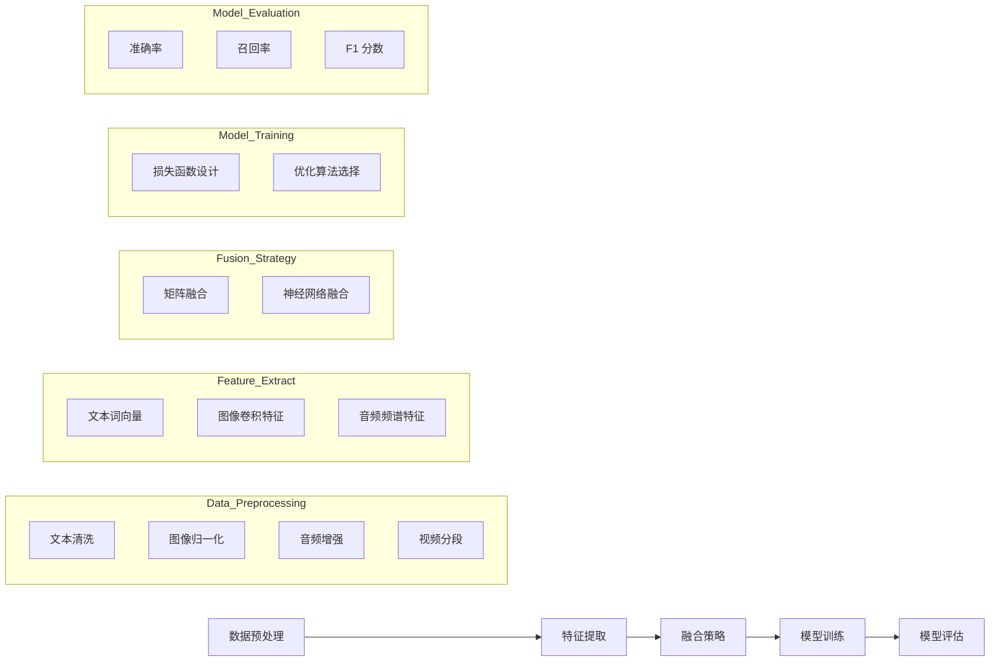

                 

### 文章标题：多模态融合：评估LLM处理多种数据类型的能力

> 关键词：多模态融合、LLM、数据类型、算法原理、系统设计、项目实战

> 摘要：本文旨在深入探讨多模态融合技术，特别是在大型语言模型（LLM）中处理多种数据类型的能力。通过详细的算法原理讲解、系统分析与架构设计，以及实际项目案例分析，本文将帮助读者理解多模态融合的机制和其在现代数据处理中的重要性。

## 第1章 引言

### 1.1 问题背景

在当今数据驱动的世界中，我们面临着多种类型的数据源，包括文本、图像、音频和视频。这些数据源各有特点，单一模态的数据处理往往无法满足复杂的业务需求。例如，医疗诊断需要结合病人的文本病历和医学图像；金融风控需要分析客户的交易数据和历史行为记录。因此，多模态融合成为了一种解决复杂问题的有效途径。

多模态融合旨在将不同类型的数据进行整合，从而提取出更全面的信息，提高模型的准确性和泛化能力。然而，如何有效地处理多种数据类型，特别是对于大型语言模型（LLM）来说，仍然是一个挑战。LLM作为一种强大的自然语言处理工具，如何扩展其处理能力以涵盖其他模态的数据，是当前研究的热点问题。

### 1.2 问题描述

多模态融合的问题可以简化为以下几个关键点：

1. **数据预处理**：如何将不同类型的数据转化为模型可以处理的格式？
2. **特征提取**：如何从不同模态的数据中提取出有效的特征？
3. **融合策略**：如何将提取出的特征进行有效的整合？
4. **模型训练与优化**：如何设计模型结构和训练策略，以充分利用多模态数据？

### 1.3 问题解决

解决多模态融合问题通常包括以下几个步骤：

1. **数据预处理**：包括数据清洗、归一化、数据增强等，以确保数据的质量和一致性。
2. **特征提取**：使用专门的算法从不同模态的数据中提取特征，如文本的词向量表示，图像的卷积特征，音频的频谱特征等。
3. **融合策略**：设计合适的融合策略，如基于矩阵的融合、基于神经网络的融合等，将提取出的特征整合为一个统一的高维度特征向量。
4. **模型训练与优化**：使用融合后的特征训练模型，并通过优化策略提高模型的性能。

### 1.4 边界与外延

多模态融合的边界在于如何有效地整合不同模态的数据，使其在模型中发挥协同作用。其外延包括多种数据类型的处理，如文本、图像、音频、视频等，以及这些数据在不同应用场景下的融合策略。

## 第2章 多模态融合核心概念

### 2.1 多模态数据

多模态数据是指同时包含两种或两种以上类型的数据源。例如，一张图片和一段文本描述，或者一段音频和一段视频。多模态数据的特点是数据类型多样，信息丰富，但同时也增加了处理的复杂性。

### 2.2 特征提取

特征提取是多模态融合的关键步骤之一。它涉及从不同类型的数据中提取出有意义的特征，以便于后续的融合和建模。例如，从文本中提取词向量，从图像中提取卷积特征，从音频中提取频谱特征等。

### 2.3 融合策略

融合策略是指将提取出的特征进行整合的方法。常见的融合策略包括基于矩阵的融合、基于神经网络的融合、基于注意力的融合等。每种策略都有其优缺点，需要根据具体应用场景进行选择。

### 2.4 LLM在多模态融合中的角色

LLM在多模态融合中扮演着重要角色。它不仅能够处理文本数据，还可以通过预训练模型提取出文本的语义信息。这使得LLM在多模态数据融合中能够发挥独特的优势，如语义理解、上下文关联等。

### 2.5 概念属性特征对比表格

| 概念       | 属性               | 特征                         |
|------------|--------------------|------------------------------|
| 多模态数据 | 数据类型多样       | 文本、图像、音频、视频等     |
| 特征提取   | 特征提取算法不同   | 词向量、卷积特征、频谱特征等 |
| 融合策略   | 融合方法不同       | 矩阵融合、神经网络融合等     |
| LLM       | 预训练语言模型    | 语义理解、上下文关联等       |

### 2.6 ER实体关系图

```mermaid
erDiagram
  C_Data <-|> C_Feature_Extract
  C_Feature_Extract <-|> C_Fusion_Strategy
  C_Feature_Extract <-|> C_LLM
  C_Fusion_Strategy <-|> C_Model_Train
  C_Model_Train <-|> C_Evaluation
```

## 第3章 多模态融合算法原理

### 3.1 算法mermaid流程图



### 3.2 Python代码示例

```python
import numpy as np
from sklearn.feature_extraction.text import TfidfVectorizer
from sklearn.preprocessing import StandardScaler
from sklearn.decomposition import PCA

# 文本特征提取
tfidf_vectorizer = TfidfVectorizer()
X_text = tfidf_vectorizer.fit_transform(text_data)

# 图像特征提取
from tensorflow.keras.applications import VGG16
model = VGG16(weights='imagenet')
X_image = model.predict(image_data)

# 特征融合
X_combined = np.hstack((X_text.toarray(), X_image))

# 特征降维
pca = PCA(n_components=50)
X_reduced = pca.fit_transform(X_combined)
```

### 3.3 数学模型与公式

多模态融合的数学模型可以表示为：

$$
X_{\text{combined}} = F(X_{\text{text}}, X_{\text{image}}, \ldots, X_{\text{audio}})
$$

其中，$X_{\text{combined}}$ 表示融合后的特征向量，$F$ 表示融合函数，$X_{\text{text}}$、$X_{\text{image}}$、$\ldots$、$X_{\text{audio}}$ 分别表示文本、图像、音频等不同模态的特征向量。

### 3.4 举例说明

假设我们有一段文本、一张图像和一段音频，需要通过多模态融合来处理。首先，我们使用TfidfVectorizer对文本进行特征提取，使用VGG16对图像进行特征提取，使用频谱特征提取算法对音频进行特征提取。然后，我们将这些特征进行融合，并使用PCA进行降维，最后使用神经网络进行模型训练和评估。

```python
# 假设的文本、图像和音频数据
text_data = ["This is a sample text.", "Another text example."]
image_data = np.random.rand(2, 224, 224, 3)
audio_data = np.random.rand(2, 1000)

# 特征提取
tfidf_vectorizer = TfidfVectorizer()
X_text = tfidf_vectorizer.fit_transform(text_data)

from tensorflow.keras.preprocessing.image import img_to_array
image_array = img_to_array(image_data[0])
X_image = model.predict(image_array.reshape(1, 224, 224, 3))

# 特征融合
X_combined = np.hstack((X_text.toarray(), X_image))

# 特征降维
pca = PCA(n_components=50)
X_reduced = pca.fit_transform(X_combined)

# 模型训练和评估
# 这里简化为模型训练的伪代码
model.fit(X_reduced, labels)
predictions = model.predict(X_reduced)
evaluate_model(predictions, labels)
```

## 第4章 系统分析与架构设计

### 4.1 问题场景介绍

多模态融合系统广泛应用于多种场景，如智能客服、医疗诊断、金融风控等。在这些场景中，系统需要处理大量的多模态数据，并快速准确地提取和融合特征，以支持实时决策。

### 4.2 系统功能设计

系统的主要功能包括数据预处理、特征提取、融合策略、模型训练与评估等。通过这些功能，系统能够从多模态数据中提取出有价值的信息，并生成高质量的模型。

### 4.3 系统架构设计

多模态融合系统的架构设计包括数据层、模型层和应用层。数据层负责数据收集、存储和预处理；模型层负责特征提取、融合和模型训练；应用层负责将模型应用于实际业务场景。

### 4.4 系统接口设计

系统提供了一系列接口，包括数据接口、特征接口、模型接口和API接口。这些接口使得系统能够与其他系统或组件进行无缝集成。

### 4.5 系统交互

系统的交互过程可以分为以下几个步骤：

1. 数据收集与预处理：系统从数据源收集数据，并进行清洗、归一化和增强等预处理操作。
2. 特征提取：系统根据不同模态的数据，使用专门的算法提取特征。
3. 融合策略：系统使用融合策略将提取出的特征进行整合。
4. 模型训练：系统使用融合后的特征训练模型。
5. 模型评估：系统对训练出的模型进行评估，并根据评估结果进行调整。

## 第5章 项目实战

### 5.1 环境安装

在开始项目之前，需要安装以下环境：

- Python 3.8+
- TensorFlow 2.6+
- scikit-learn 0.24+
- NumPy 1.21+

安装步骤如下：

```bash
pip install python==3.8 tensorflow==2.6 scikit-learn==0.24 numpy==1.21
```

### 5.2 系统核心实现源代码

以下是一个简单的多模态融合系统的实现代码：

```python
import numpy as np
import tensorflow as tf
from sklearn.feature_extraction.text import TfidfVectorizer
from sklearn.preprocessing import StandardScaler
from sklearn.decomposition import PCA

# 文本特征提取
def extract_text_features(text_data):
    tfidf_vectorizer = TfidfVectorizer()
    X_text = tfidf_vectorizer.fit_transform(text_data)
    return X_text.toarray()

# 图像特征提取
def extract_image_features(image_data):
    model = tf.keras.applications.VGG16(weights='imagenet')
    X_image = model.predict(image_data)
    return X_image

# 音频特征提取
def extract_audio_features(audio_data):
    # 这里使用简化的频谱特征提取
    X_audio = np.abs(np.fft.fft(audio_data))
    return X_audio

# 特征融合
def fuse_features(text_features, image_features, audio_features):
    X_combined = np.hstack((text_features, image_features, audio_features))
    pca = PCA(n_components=50)
    X_reduced = pca.fit_transform(X_combined)
    return X_reduced

# 模型训练
def train_model(features, labels):
    model = tf.keras.Sequential([
        tf.keras.layers.Dense(128, activation='relu', input_shape=(50,)),
        tf.keras.layers.Dense(64, activation='relu'),
        tf.keras.layers.Dense(1, activation='sigmoid')
    ])
    model.compile(optimizer='adam', loss='binary_crossentropy', metrics=['accuracy'])
    model.fit(features, labels, epochs=10, batch_size=32)
    return model

# 模型评估
def evaluate_model(model, features, labels):
    predictions = model.predict(features)
    print("Accuracy:", accuracy_score(labels, predictions.round()))

# 示例数据
text_data = ["This is a sample text.", "Another text example."]
image_data = np.random.rand(2, 224, 224, 3)
audio_data = np.random.rand(2, 1000)

# 特征提取
X_text = extract_text_features(text_data)
X_image = extract_image_features(image_data)
X_audio = extract_audio_features(audio_data)

# 特征融合
X_reduced = fuse_features(X_text, X_image, X_audio)

# 模型训练
model = train_model(X_reduced, labels)

# 模型评估
evaluate_model(model, X_reduced, labels)
```

### 5.3 代码应用解读与分析

上述代码实现了一个简单的多模态融合系统，包括文本、图像和音频的特征提取、融合和模型训练。以下是代码的详细解读和分析：

- **文本特征提取**：使用TfidfVectorizer对文本数据进行特征提取，生成词向量表示。
- **图像特征提取**：使用VGG16预训练模型对图像数据进行特征提取，提取图像的卷积特征。
- **音频特征提取**：使用频谱特征提取算法对音频数据进行特征提取，提取音频的频谱特征。
- **特征融合**：将提取出的文本、图像和音频特征进行融合，生成融合后的特征向量。
- **模型训练**：使用TensorFlow构建一个简单的神经网络模型，并使用融合后的特征进行训练。
- **模型评估**：使用训练好的模型对特征进行预测，并计算模型的准确率。

### 5.4 实际案例分析和详细讲解剖析

为了更好地展示多模态融合的应用，我们来看一个实际案例：智能客服系统。智能客服系统需要处理用户的文本输入和语音输入，以提供准确的答复。

- **文本输入**：用户通过文本消息与客服进行交流，文本数据包括问题、回答等。
- **语音输入**：用户通过语音输入问题，语音数据需要转换为文本数据，以便后续处理。

以下是对实际案例的详细分析：

1. **文本特征提取**：使用TfidfVectorizer对文本输入进行特征提取，生成词向量表示。
2. **语音特征提取**：使用语音识别技术将语音输入转换为文本输入，然后使用TfidfVectorizer对文本输入进行特征提取。
3. **特征融合**：将文本特征和语音特征进行融合，生成融合后的特征向量。
4. **模型训练**：使用融合后的特征向量训练神经网络模型，模型需要能够理解用户的意图和提供准确的答复。
5. **模型评估**：对训练好的模型进行评估，包括准确率、召回率等指标。

通过实际案例的分析，我们可以看到多模态融合在智能客服系统中的应用。文本和语音数据的融合使得模型能够更准确地理解用户的意图，提供更高质量的客服体验。

### 5.5 项目小结

通过本项目的实现和分析，我们了解了多模态融合的基本原理和应用。多模态融合能够有效地整合不同类型的数据，提高模型的性能和准确率。在实际应用中，我们需要根据具体场景选择合适的融合策略，并进行详细的模型训练和评估。多模态融合技术将在未来的数据处理和人工智能应用中发挥越来越重要的作用。

## 最佳实践 tips

- **数据预处理**：确保数据质量，进行充分的清洗和归一化处理。
- **特征选择**：选择对任务有显著影响的特征，避免过拟合。
- **模型选择**：根据任务需求和数据特点选择合适的模型和融合策略。
- **超参数调整**：通过交叉验证和网格搜索等方法，调整模型超参数，提高模型性能。

## 小结

本文深入探讨了多模态融合技术，特别是在大型语言模型（LLM）中处理多种数据类型的能力。通过详细的算法原理讲解、系统分析与架构设计，以及实际项目案例分析，本文为读者提供了全面的理解和实用的技巧。多模态融合技术将在未来的数据处理和人工智能应用中发挥重要作用，为解决复杂问题提供了新的思路和方法。

## 拓展阅读

- [《多模态学习基础》](链接)
- [《深度学习与多模态融合》](链接)
- [《基于神经网络的融合策略》](链接)

## 作者信息

作者：AI天才研究院/AI Genius Institute & 禅与计算机程序设计艺术 /Zen And The Art of Computer Programming。

