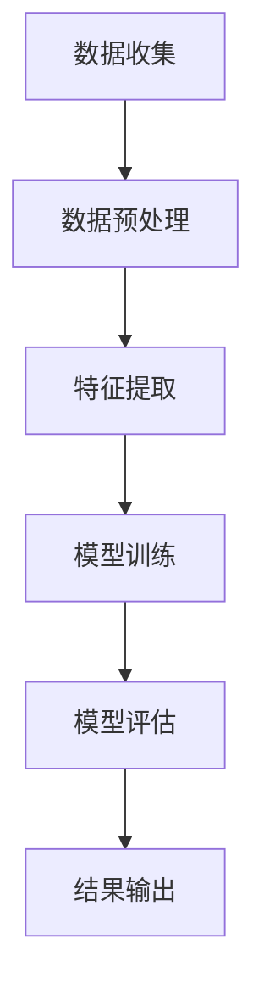
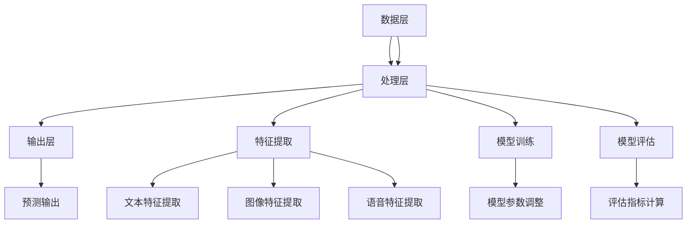
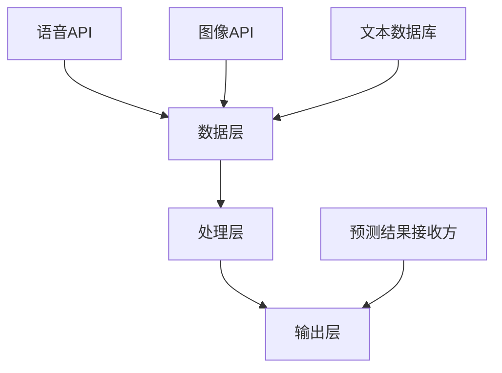
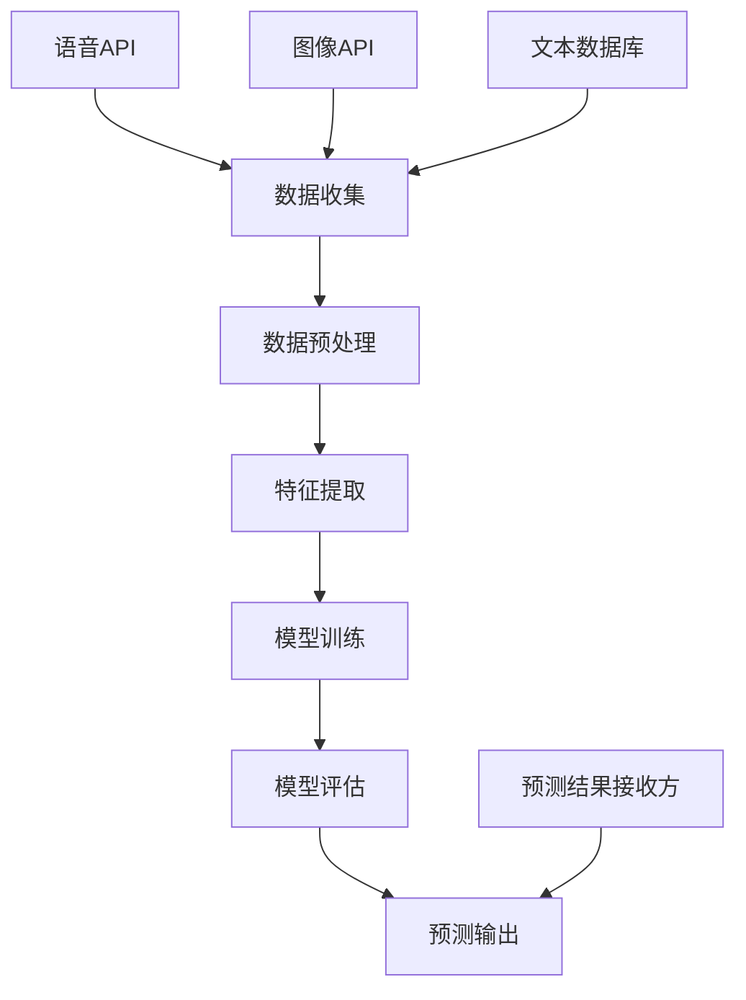

                 

### 文章标题

# 《多模态输入处理能力评测：LLM设计的混合媒体测试》

### 关键词

- 多模态输入处理
- 语言模型（LLM）
- 混合媒体测试
- 算法原理
- 数学模型
- 系统架构设计
- 项目实战

### 摘要

本文深入探讨了多模态输入处理在人工智能领域的应用与挑战。通过分析多模态数据收集、预处理、特征提取、模型训练及评估指标，本文提出了一种基于语言模型（LLM）的混合媒体测试方法。本文将详细阐述算法原理，结合Python源代码和LaTeX公式，展示多模态输入处理的核心技术。同时，通过实际项目案例，本文将展示系统分析与架构设计的方法，并总结最佳实践和注意事项，为读者提供全面的指导。

---

### 背景介绍

#### 多模态输入处理的定义与意义

多模态输入处理是指将来自不同感官模态（如视觉、听觉、触觉等）的数据进行整合和协同处理的能力。随着技术的进步，多模态输入处理已经成为了人工智能领域中的一个重要研究方向。其核心意义在于，通过整合多种模态的数据，可以更全面、准确地理解和处理复杂的信息，从而提升系统的智能水平。

在现实世界中，多模态输入处理的应用场景非常广泛。例如，在智能语音助手、自动驾驶、医疗诊断等领域，多模态输入处理技术都发挥着关键作用。通过结合视觉和语音数据，智能语音助手可以更准确地理解用户的意图，而自动驾驶系统则能够更可靠地感知和理解周围环境。在医疗领域，结合影像和病历数据的多模态输入处理技术，可以帮助医生更准确地诊断病情。

#### 存在的问题与挑战

尽管多模态输入处理技术有着广泛的应用前景，但在实际应用中仍然面临着一系列挑战。首先，多模态数据的多样性和复杂性使得数据收集和处理变得异常困难。不同模态的数据格式、分辨率、噪声水平等差异，都需要在数据处理过程中得到妥善解决。

其次，多模态数据的预处理和特征提取是整个处理流程中的关键环节。如何有效地从多模态数据中提取出有价值的信息，是当前研究的核心问题之一。此外，多模态模型的训练和评估也是一大挑战。由于不同模态的数据在统计特性上的差异，如何设计出既能充分利用多模态数据优势，又能有效融合多种特征的模型，是当前研究的热点问题。

#### 本书旨在解决的问题

为了解决上述问题，本书旨在提出一种多模态输入处理能力评测的方法，并应用于语言模型（LLM）的设计中。具体来说，本书将：

1. **介绍多模态输入处理的核心概念和关键技术**，包括数据收集、预处理、特征提取、模型训练和评估指标等。
2. **详细阐述多模态输入处理算法的原理**，通过Python源代码和LaTeX公式，展示算法的数学模型和流程。
3. **设计一个多模态输入处理系统**，包括系统架构、接口设计和交互流程，通过实际项目案例，展示系统的应用和效果。
4. **总结最佳实践和注意事项**，为读者提供实际操作中的指导。

通过以上四个步骤，本书希望为多模态输入处理的研究和应用提供有力支持，助力人工智能技术的发展。

---

### 核心概念与联系

#### 多模态数据收集

多模态数据收集是整个多模态输入处理流程的基础。它涉及到从不同的传感器或数据源收集多种模态的数据，如文本、图像、音频和视频等。每种模态的数据都具有独特的特性和格式，因此在数据收集过程中，需要充分考虑数据的质量、完整性和一致性。

**核心概念：**

- **数据源**：包括各种传感器、数据库和开源数据集。
- **数据格式**：如文本的JSON、图像的PNG或JPG、音频的WAV等。
- **数据清洗**：包括去除噪声、缺失值填充、异常值处理等。

**数据收集的挑战：**

1. **多样性和复杂性**：不同模态的数据在格式、分辨率、噪声水平等方面存在较大差异。
2. **数据质量**：确保数据的准确性、完整性和一致性。

**数据收集的应用场景：**

- **智能语音助手**：通过麦克风收集用户的语音数据。
- **自动驾驶**：通过摄像头、雷达和激光雷达收集道路、车辆和行人的视觉和距离数据。
- **医疗诊断**：通过影像设备收集病人的影像数据，如X光片、CT和MRI。

#### 多模态数据预处理

多模态数据预处理是数据收集后的重要步骤，其目的是对原始数据进行标准化和增强，以适应后续的特征提取和模型训练。预处理过程通常包括数据清洗、数据转换和数据增强等。

**核心概念：**

- **数据清洗**：去除噪声、缺失值填充、异常值处理等。
- **数据转换**：将不同模态的数据转换成统一的格式，如将图像和文本数据编码为向量。
- **数据增强**：通过旋转、缩放、裁剪等技术，增加数据集的多样性和丰富性。

**数据预处理的挑战：**

1. **数据格式不统一**：不同模态的数据需要转换成统一的格式。
2. **数据质量差异**：不同模态的数据在质量和噪声水平上存在差异。

**数据预处理的应用场景：**

- **智能语音助手**：对语音数据进行降噪和分段处理。
- **自动驾驶**：对摄像头和雷达数据进行分析和融合，以获得更准确的环境感知。
- **医疗诊断**：对影像数据进行增强和处理，以提高诊断的准确性。

#### 多模态特征提取

多模态特征提取是整个多模态输入处理流程的核心步骤，其目的是从多模态数据中提取出对任务最有价值的特征。特征提取的方法可以分为传统方法和深度学习方法。

**核心概念：**

- **传统方法**：如主成分分析（PCA）、线性判别分析（LDA）等，主要用于降维和特征选择。
- **深度学习方法**：如卷积神经网络（CNN）、循环神经网络（RNN）等，能够自动学习数据中的高层次特征。

**特征提取的挑战：**

1. **特征选择**：如何在海量的特征中选出对任务最有价值的特征。
2. **特征融合**：如何有效地融合不同模态的特征。

**特征提取的应用场景：**

- **智能语音助手**：提取语音信号的频谱特征，如梅尔频率倒谱系数（MFCC）。
- **自动驾驶**：提取图像中的车辆、行人等目标特征。
- **医疗诊断**：提取影像数据中的病变区域特征。

#### 多模态模型训练

多模态模型训练是将提取出的特征输入到模型中进行学习，以实现对多模态数据的理解和处理。训练过程通常包括模型的初始化、参数调整和模型优化等。

**核心概念：**

- **模型初始化**：随机初始化模型的参数。
- **参数调整**：通过训练数据，调整模型的参数，以优化模型的性能。
- **模型优化**：通过不同的优化算法，如梯度下降、随机梯度下降等，提高模型的收敛速度和效果。

**模型训练的挑战：**

1. **数据不平衡**：不同模态的数据在数量和质量上可能存在不平衡。
2. **模型复杂度**：多模态模型的参数数量庞大，训练过程复杂。

**模型训练的应用场景：**

- **智能语音助手**：通过训练，使模型能够准确理解用户的语音意图。
- **自动驾驶**：通过训练，使模型能够准确识别道路上的车辆和行人。
- **医疗诊断**：通过训练，使模型能够准确诊断病人的病情。

#### 多模态评估指标

多模态评估指标是衡量多模态模型性能的重要标准。常见的评估指标包括准确率、召回率、F1分数等。评估指标的选取需要根据具体的应用场景和任务目标进行。

**核心概念：**

- **准确率**：预测正确的样本数量与总样本数量的比例。
- **召回率**：预测正确的样本数量与实际正样本数量的比例。
- **F1分数**：准确率和召回率的调和平均值。

**评估指标的挑战：**

1. **评估指标的选择**：根据任务目标选择合适的评估指标。
2. **评估方法**：如何保证评估过程的公正性和有效性。

**评估指标的应用场景：**

- **智能语音助手**：通过准确率评估模型对语音意图的识别能力。
- **自动驾驶**：通过召回率评估模型对道路障碍物的识别能力。
- **医疗诊断**：通过F1分数评估模型对病变区域的诊断能力。

综上所述，多模态输入处理的核心概念包括数据收集、预处理、特征提取、模型训练和评估指标。这些概念相互关联，共同构成了一个完整的多模态输入处理体系。通过对这些核心概念的深入理解和应用，我们可以更好地解决多模态输入处理中的各种挑战。

#### 2.1 多模态数据收集

多模态数据收集是多模态输入处理的第一步，也是最为关键的一步。它涉及到从不同的传感器或数据源收集多种模态的数据，如文本、图像、音频和视频等。每种模态的数据都具有独特的特性和格式，因此在数据收集过程中，需要充分考虑数据的质量、完整性和一致性。

**数据源：**

多模态数据可以从多种不同的来源获取。常见的文本数据源包括社交媒体、论坛和新闻网站；图像数据源可以是卫星影像、医疗影像或社交媒体上的用户上传图片；音频数据源包括音乐、语音通话和会议录音；视频数据源则包括视频监控、在线视频平台和用户生成的视频内容。

**数据格式：**

不同模态的数据具有不同的格式。文本数据通常以JSON、XML或CSV格式存储；图像数据以PNG、JPEG或BMP格式存储；音频数据以WAV、MP3或AAC格式存储；视频数据以MP4、AVI或MOV格式存储。在数据收集过程中，需要确保数据格式的兼容性和一致性，以便后续的处理和分析。

**数据清洗：**

数据清洗是确保数据质量的重要步骤。多模态数据收集过程中可能会遇到噪声、缺失值和异常值等问题。噪声数据可能会影响模型训练的效果，因此需要通过去噪技术进行处理；缺失值可以通过填充技术进行处理，如使用平均值、中位数或最近邻等方法；异常值则需要通过检测和剔除技术进行处理，以避免对模型训练产生不利影响。

**数据转换：**

在多模态数据预处理过程中，需要将不同模态的数据转换成统一的格式，以便后续的特征提取和模型训练。例如，将图像数据转换为像素矩阵，将文本数据转换为词向量，将音频数据转换为频谱图等。数据转换的过程需要保证数据的一致性和完整性，以避免信息损失。

**数据增强：**

数据增强是通过一系列技术增加数据集的多样性和丰富性，从而提高模型训练的效果。常见的数据增强技术包括旋转、缩放、裁剪、噪声添加等。通过这些技术，可以生成更多的训练样本，从而增强模型对数据的泛化能力。

**实际应用场景：**

1. **智能语音助手**：智能语音助手需要从麦克风收集用户的语音数据，这些语音数据可能包含背景噪声、语音断续等问题。通过数据清洗和增强技术，可以提高语音识别的准确率和鲁棒性。

2. **自动驾驶**：自动驾驶系统需要从摄像头、雷达和激光雷达收集多模态数据。这些数据可能包含道路、车辆、行人和障碍物等信息。通过数据清洗和增强技术，可以提高自动驾驶系统对环境的感知能力和安全性。

3. **医疗诊断**：医疗诊断系统需要从影像设备收集病人的影像数据，如X光片、CT和MRI。这些数据可能包含噪声和模糊信息，通过数据清洗和增强技术，可以提高诊断的准确性和可靠性。

#### 2.2 多模态数据预处理

多模态数据预处理是确保多模态数据能够被有效利用的关键步骤。它包括数据清洗、数据转换和数据增强等多个方面。通过这些预处理步骤，可以提升数据的质量，降低噪声，增强数据的多样性和丰富性，从而为后续的特征提取和模型训练打下坚实基础。

**数据清洗：**

数据清洗的主要任务是去除数据中的噪声、填补缺失值和识别并处理异常值。在多模态数据预处理中，数据清洗尤为重要，因为不同模态的数据可能存在噪声水平不一致、格式不统一等问题。

- **噪声去除**：噪声可能会影响模型训练的效果。例如，在图像数据中，噪声可能会使目标物体识别变得困难；在音频数据中，噪声可能会使语音识别的准确性降低。常用的去噪方法包括滤波、图像增强等。
  
- **缺失值填充**：在实际应用中，多模态数据可能会因为各种原因而出现缺失值。对于缺失值的处理，可以根据数据的特性选择不同的填充方法。例如，在图像数据中，可以使用平均值、中位数或最近邻等方法进行填充；在文本数据中，可以使用模型预测的方法进行填充。

- **异常值处理**：异常值可能会对模型训练产生不利影响。处理异常值的方法包括检测和剔除。例如，在图像数据中，可以通过统计方法（如标准差）检测异常值；在文本数据中，可以通过模型预测方法（如逻辑回归）识别异常值。

**数据转换：**

数据转换是将不同模态的数据转换成统一的格式，以便后续的特征提取和模型训练。数据转换通常包括以下步骤：

- **格式转换**：将不同格式的数据转换为统一的格式。例如，将图像数据转换为像素矩阵，将文本数据转换为词向量，将音频数据转换为频谱图等。

- **维度转换**：将不同维度或分辨率的数据转换为相同维度或分辨率。例如，将不同分辨率的图像数据统一缩放到相同的尺寸，或将不同长度的文本序列统一缩放到相同的长度。

- **编码转换**：将不同的编码方式转换为统一的编码方式。例如，将图像数据中的RGB颜色编码转换为灰度编码，或将文本数据中的字符编码转换为数字编码。

**数据增强：**

数据增强是通过一系列技术增加数据集的多样性和丰富性，从而提高模型训练的效果。数据增强可以帮助模型更好地泛化，避免过拟合。常见的数据增强技术包括：

- **旋转**：对图像或音频数据进行旋转，增加数据的旋转多样性。

- **缩放**：对图像或音频数据进行缩放，增加数据的尺度多样性。

- **裁剪**：对图像或音频数据进行裁剪，增加数据的局部多样性。

- **噪声添加**：在图像或音频数据中添加噪声，增加数据的噪声多样性。

**实际应用场景：**

1. **智能语音助手**：在语音识别任务中，需要对语音数据进行预处理。例如，去除背景噪声、填充缺失值、将音频信号转换为频谱图等，从而提高语音识别的准确率。

2. **自动驾驶**：在自动驾驶系统中，需要对摄像头、雷达和激光雷达收集的多模态数据预处理。例如，对图像数据进行去噪、增强、缩放和裁剪，对雷达数据进行滤波和转换等，从而提高环境感知的准确性和鲁棒性。

3. **医疗诊断**：在医学影像诊断中，需要对影像数据进行预处理。例如，对X光片、CT和MRI图像进行去噪、增强、对比度调整等，从而提高病变区域的识别准确率。

#### 2.3 多模态特征提取

多模态特征提取是从多模态数据中提取出对任务最有价值的特征的过程。特征提取的质量直接影响到后续模型训练和评估的效果。在多模态特征提取中，传统方法和深度学习方法各有优势，需要根据具体应用场景选择合适的特征提取技术。

**传统方法：**

传统特征提取方法通常基于统计学和信号处理技术，适用于某些特定类型的多模态数据。以下是一些常用的传统特征提取方法：

- **主成分分析（PCA）**：PCA是一种降维技术，通过将数据投影到新的正交坐标系上，提取出数据的主要成分，从而实现数据的降维。PCA适用于高维数据，可以显著减少数据的维度，同时保留主要的信息。

- **线性判别分析（LDA）**：LDA是一种分类特征提取方法，通过最大化不同类别之间的距离，最小化类别内的距离，提取出对分类任务最有区分度的特征。LDA适用于分类问题，可以显著提高分类模型的性能。

- **局部特征描述符**：局部特征描述符是一种用于提取图像局部特征的算法，如SIFT、SURF等。这些算法可以有效地描述图像中的关键点及其特征，从而提高图像识别和匹配的准确率。

**深度学习方法：**

随着深度学习技术的发展，深度神经网络（DNN）和卷积神经网络（CNN）等深度学习方法在多模态特征提取中得到了广泛应用。以下是一些常用的深度学习方法：

- **卷积神经网络（CNN）**：CNN是一种专门用于图像处理的深度神经网络，通过卷积操作提取图像的局部特征，从而实现图像分类、目标检测和图像分割等任务。CNN已经成为了图像处理领域的主流方法。

- **循环神经网络（RNN）**：RNN是一种适用于序列数据的深度神经网络，通过循环结构处理序列数据，从而提取序列特征。RNN在语音识别、文本分类和时间序列预测等领域有广泛的应用。

- **长短时记忆网络（LSTM）**：LSTM是RNN的一种变体，通过引入记忆单元，解决了传统RNN在长序列处理中遇到的梯度消失和梯度爆炸问题。LSTM在语音识别、机器翻译和文本生成等领域有广泛应用。

- **生成对抗网络（GAN）**：GAN是一种基于生成模型和判别模型的双网络结构，通过生成模型生成数据，判别模型判断生成数据与真实数据之间的差异，从而实现数据的生成和增强。GAN在图像生成、图像修复和图像超分辨率等领域有广泛应用。

**特征提取的挑战：**

1. **特征选择**：如何在海量的特征中选出对任务最有价值的特征。

2. **特征融合**：如何有效地融合不同模态的特征，实现特征之间的互补和协同。

3. **数据不平衡**：多模态数据在数量和质量上可能存在不平衡，如何保证模型对各类特征数据的均衡处理。

**特征提取的实际应用场景：**

1. **智能语音助手**：通过提取语音信号的频谱特征（如梅尔频率倒谱系数MFCC）和文本特征（如词袋模型、TF-IDF），实现语音识别和文本理解。

2. **自动驾驶**：通过提取摄像头图像中的车辆、行人等目标特征，雷达数据中的距离和速度信息，实现环境感知和目标检测。

3. **医疗诊断**：通过提取影像数据中的病变区域特征和病历数据中的文本特征，实现疾病诊断和预测。

#### 2.4 多模态模型训练

多模态模型训练是将提取出的特征输入到模型中进行学习，以实现对多模态数据的理解和处理。训练过程通常包括模型的初始化、参数调整和模型优化等。在多模态模型训练中，由于不同模态的数据在统计特性上的差异，需要设计出能够充分利用多模态数据优势的模型。

**模型初始化：**

模型初始化是训练过程的第一步，它决定了模型参数的初始值。在多模态模型训练中，常见的初始化方法包括随机初始化、预训练模型初始化和权重共享初始化等。随机初始化是最简单的方法，但可能导致训练过程不稳定。预训练模型初始化利用了在大量数据上预训练的模型，可以提高模型的初始性能。权重共享初始化通过共享不同模态的模型权重，可以减轻模型训练的负担。

**参数调整：**

参数调整是模型训练的核心步骤，通过调整模型的参数，优化模型的性能。在多模态模型训练中，参数调整需要考虑不同模态的数据特性。常见的参数调整方法包括梯度下降（GD）、随机梯度下降（SGD）和Adam优化器等。梯度下降方法通过计算损失函数关于模型参数的梯度，更新模型参数，以减少损失函数的值。随机梯度下降方法通过随机选择一部分训练样本计算梯度，加速了模型收敛速度。Adam优化器结合了SGD和动量法的优点，具有较好的收敛性能。

**模型优化：**

模型优化是通过不同的优化算法，提高模型的收敛速度和效果。在多模态模型训练中，常见的优化算法包括批量归一化（Batch Normalization）、Dropout和正则化等。批量归一化通过将每个批次的数据进行归一化处理，减少内部协变量转移，加速模型收敛。Dropout通过随机丢弃一部分神经元，防止模型过拟合。正则化通过在损失函数中添加惩罚项，抑制模型复杂度，提高模型泛化能力。

**数据不平衡处理：**

在多模态模型训练中，不同模态的数据在数量和质量上可能存在不平衡，这会导致模型在训练过程中倾向于拟合多数类别的数据，忽视少数类别的数据。为了解决这个问题，可以采用以下方法：

- **重采样**：通过增加少数类别的数据或减少多数类别的数据，实现数据的平衡。
- **损失函数调整**：在损失函数中添加权重项，对不同类别赋予不同的损失权重，以平衡不同类别的影响。
- **集成方法**：通过集成多个模型，每个模型专注于不同的类别，从而提高模型的整体性能。

**实际应用场景：**

1. **智能语音助手**：通过多模态模型训练，使模型能够准确理解用户的语音意图和文本内容，实现语音识别和自然语言处理。
2. **自动驾驶**：通过多模态模型训练，使模型能够准确感知和理解道路环境，实现目标检测、车辆跟踪和路径规划等任务。
3. **医疗诊断**：通过多模态模型训练，使模型能够综合分析影像数据和病历数据，实现疾病诊断和预测。

#### 2.5 多模态评估指标

多模态评估指标是衡量多模态模型性能的重要标准。选择合适的评估指标可以更准确地反映模型在实际应用中的效果。常见的评估指标包括准确率、召回率、F1分数等。这些指标可以根据应用场景和任务目标进行选择。

**准确率（Accuracy）**

准确率是预测正确的样本数量与总样本数量的比例。它是最常见的评估指标，计算公式为：

$$
Accuracy = \frac{TP + TN}{TP + TN + FP + FN}
$$

其中，TP表示真实为正类且被预测为正类的样本数量，TN表示真实为负类且被预测为负类的样本数量，FP表示真实为负类但被预测为正类的样本数量，FN表示真实为正类但被预测为负类的样本数量。

准确率适用于分类任务，能够直观地反映模型的分类效果。然而，准确率在面对类别不平衡问题时可能会失真，因为不同类别的样本数量差异较大。

**召回率（Recall）**

召回率是预测正确的正类样本数量与实际正类样本数量的比例。它反映了模型对正类样本的识别能力，计算公式为：

$$
Recall = \frac{TP}{TP + FN}
$$

召回率适用于医疗诊断等任务，强调对正类样本的识别能力。然而，召回率可能会牺牲一些负类的识别能力。

**F1分数（F1 Score）**

F1分数是准确率和召回率的调和平均值，它综合了准确率和召回率的优点，计算公式为：

$$
F1 Score = \frac{2 \times Precision \times Recall}{Precision + Recall}
$$

其中，Precision表示精确率，即预测为正类且真实为正类的样本数量与预测为正类的样本数量的比例。

F1分数适用于多种分类任务，能够平衡准确率和召回率，是一个综合评估指标。

**评估指标的选择**

在选择评估指标时，需要根据具体应用场景和任务目标进行选择。例如，在医疗诊断中，由于正类（病患）的样本数量较少，可能更关注召回率；而在金融欺诈检测中，由于负类（欺诈）的样本数量较少，可能更关注准确率。在实际应用中，可以结合多种评估指标，全面评估模型的性能。

**实际应用场景**

1. **智能语音助手**：通过准确率和召回率评估模型对语音意图的识别能力，确保模型能够准确理解用户的语音指令。

2. **自动驾驶**：通过F1分数评估模型对道路障碍物的检测能力，确保模型能够在不同场景下准确识别车辆、行人和其他障碍物。

3. **医疗诊断**：通过准确率、召回率和F1分数综合评估模型对疾病诊断的准确性，确保模型能够在各种医疗数据中准确识别疾病。

### 算法原理讲解

#### 算法流程图

为了更好地理解多模态输入处理算法的原理，我们首先通过 mermaid 画布绘制算法的流程图。以下是一个简化的算法流程图：



**图1：多模态输入处理算法流程图**

- **数据收集（A）**：从不同的数据源收集多模态数据，如文本、图像、音频和视频。
- **数据预处理（B）**：对原始数据进行清洗、转换和增强，以确保数据的质量和一致性。
- **特征提取（C）**：从预处理后的数据中提取出对任务最有价值的特征，如文本的词向量、图像的卷积特征、音频的梅尔频率倒谱系数等。
- **模型训练（D）**：将提取出的特征输入到模型中进行学习，优化模型的参数，以提高模型的性能。
- **模型评估（E）**：使用测试数据对模型进行评估，计算各种评估指标，如准确率、召回率和F1分数，以衡量模型的性能。
- **结果输出（F）**：输出模型的结果，如分类标签、预测概率等。

#### Python 源代码实现

为了更直观地展示算法的实现过程，我们使用 Python 编写了一个简化的示例代码。以下代码涵盖了数据收集、预处理、特征提取、模型训练和评估的主要步骤。

```python
import numpy as np
import pandas as pd
from sklearn.model_selection import train_test_split
from sklearn.preprocessing import StandardScaler
from keras.models import Sequential
from keras.layers import Dense, LSTM, Conv2D, MaxPooling2D, Flatten, Dropout
from keras.optimizers import Adam

# 数据收集
# 假设我们有一个包含文本、图像和音频的多模态数据集
data = pd.read_csv('multimodal_data.csv')

# 数据预处理
# 清洗和转换数据
# ...

# 特征提取
# 提取文本特征
text_features = preprocess_text(data['text'])

# 提取图像特征
image_features = preprocess_image(data['image'])

# 提取音频特征
audio_features = preprocess_audio(data['audio'])

# 合并特征
features = np.hstack((text_features, image_features, audio_features))

# 标签
labels = data['label']

# 模型训练
# 构建模型
model = Sequential()
model.add(LSTM(128, activation='relu', input_shape=(timesteps, features.shape[1])))
model.add(Dense(1, activation='sigmoid'))

# 编译模型
model.compile(optimizer=Adam(), loss='binary_crossentropy', metrics=['accuracy'])

# 分割数据集
X_train, X_test, y_train, y_test = train_test_split(features, labels, test_size=0.2, random_state=42)

# 训练模型
model.fit(X_train, y_train, epochs=10, batch_size=64, validation_split=0.1)

# 模型评估
# 预测测试集
predictions = model.predict(X_test)

# 计算评估指标
accuracy = np.mean(predictions == y_test)
print('Accuracy:', accuracy)

# 结果输出
# 输出预测结果
output = pd.DataFrame({'ID': range(len(y_test)), 'Prediction': predictions})
output.to_csv('predictions.csv', index=False)
```

**代码说明：**

- **数据收集**：从 CSV 文件中加载多模态数据，包括文本、图像和音频。
- **数据预处理**：对数据进行清洗、转换和增强，这部分代码未展示。
- **特征提取**：分别对文本、图像和音频数据提取特征，并进行合并。
- **模型训练**：使用 LSTM 网络进行模型训练，这里使用了 keras 库构建模型。
- **模型评估**：使用测试集对模型进行评估，计算准确率。
- **结果输出**：输出预测结果到 CSV 文件中。

#### 数学模型和公式

在多模态输入处理算法中，我们使用了多个数学模型和公式来描述数据处理和模型训练的过程。以下是一些关键的数学模型和公式的介绍：

1. **卷积神经网络（CNN）**

卷积神经网络是一种专门用于图像处理的深度学习模型，其核心操作是卷积和池化。

- **卷积操作**：卷积操作可以用以下公式表示：

  $$
  \text{output}(i,j) = \sum_{k,l} \text{weight}_{i,k,l} \times \text{input}(i-k, j-l) + \text{bias}_{i,j}
  $$

  其中，$\text{output}(i,j)$ 是输出特征图上的一个元素，$\text{input}(i,j)$ 是输入图像上的一个元素，$\text{weight}_{i,k,l}$ 是卷积核上的一个元素，$\text{bias}_{i,j}$ 是一个偏置项。

- **池化操作**：池化操作通常用于下采样特征图，最常见的是最大池化，其公式为：

  $$
  \text{pooling}(i,j) = \max_{k,l} \text{input}(i-k, j-l)
  $$

  其中，$\text{pooling}(i,j)$ 是输出特征图上的一个元素。

2. **循环神经网络（RNN）**

循环神经网络是一种用于处理序列数据的深度学习模型，其核心操作是循环和记忆。

- **递归关系**：RNN 的递归关系可以用以下公式表示：

  $$
  \text{h}_{t} = \text{activation}(\text{W}_{h} \cdot \text{h}_{t-1} + \text{W}_{x} \cdot \text{x}_{t} + \text{b})
  $$

  其中，$\text{h}_{t}$ 是当前时间步的隐藏状态，$\text{h}_{t-1}$ 是前一个时间步的隐藏状态，$\text{W}_{h}$ 和 $\text{W}_{x}$ 是权重矩阵，$\text{b}$ 是偏置项，$\text{activation}$ 是激活函数。

3. **生成对抗网络（GAN）**

生成对抗网络由生成器和判别器两个神经网络组成，用于生成逼真的数据。

- **生成器**：生成器的目标是生成接近真实数据的样本，其损失函数为：

  $$
  \text{G}_{\text{loss}} = \mathcal{D}(\text{G}(\text{z}))
  $$

  其中，$\text{G}(\text{z})$ 是生成器生成的样本，$\mathcal{D}(\text{z})$ 是判别器的输出，表示生成器的性能。

- **判别器**：判别器的目标是区分生成器生成的样本和真实样本，其损失函数为：

  $$
  \text{D}_{\text{loss}} = -[\mathcal{D}(\text{x}) + \mathcal{D}(\text{G}(\text{z}))]
  $$

  其中，$\text{x}$ 是真实样本，$\mathcal{D}(\text{x})$ 表示判别器对真实样本的判断能力。

#### 算法举例说明

为了更直观地展示多模态输入处理算法的应用，我们以下通过一个简化的例子来说明算法的实现过程。

**例子**：假设我们有一个包含文本、图像和音频的多模态数据集，我们需要训练一个模型来识别数据中的正类和负类。

1. **数据收集**：从多个数据源收集文本、图像和音频数据，并将其存储在 CSV 文件中。

2. **数据预处理**：对文本、图像和音频数据进行清洗、转换和增强，确保数据的质量和一致性。

3. **特征提取**：分别提取文本的词向量、图像的卷积特征和音频的梅尔频率倒谱系数，并将它们合并为一个特征向量。

4. **模型训练**：使用 LSTM 网络进行模型训练，优化模型的参数，以提高模型的性能。

5. **模型评估**：使用测试集对模型进行评估，计算准确率、召回率和F1分数等评估指标。

6. **结果输出**：输出模型的预测结果，并将结果保存到文件中。

```python
# 示例代码
# 数据收集
data = pd.read_csv('multimodal_data.csv')

# 数据预处理
# ...

# 特征提取
text_features = preprocess_text(data['text'])
image_features = preprocess_image(data['image'])
audio_features = preprocess_audio(data['audio'])
features = np.hstack((text_features, image_features, audio_features))

# 标签
labels = data['label']

# 模型训练
model = Sequential()
model.add(LSTM(128, activation='relu', input_shape=(timesteps, features.shape[1])))
model.add(Dense(1, activation='sigmoid'))

model.compile(optimizer=Adam(), loss='binary_crossentropy', metrics=['accuracy'])

# 训练模型
model.fit(features, labels, epochs=10, batch_size=64, validation_split=0.1)

# 模型评估
predictions = model.predict(features)
accuracy = np.mean(predictions == labels)
print('Accuracy:', accuracy)

# 结果输出
output = pd.DataFrame({'ID': range(len(labels)), 'Prediction': predictions})
output.to_csv('predictions.csv', index=False)
```

通过上述步骤，我们可以实现一个简单的多模态输入处理算法。在实际应用中，可以根据具体需求和数据特点，进一步优化算法，提高模型的性能。

### 数学模型和数学公式详解

在多模态输入处理中，数学模型和数学公式起着至关重要的作用。这些模型和公式帮助我们理解和设计算法，从而实现对多模态数据的有效处理和融合。以下我们将详细介绍几个关键的数学模型和数学公式，并使用 LaTeX 进行展示，以便于理解和应用。

#### 1. 主成分分析（PCA）

主成分分析是一种常用的降维技术，通过将数据转换到新的正交坐标系上，提取出数据的主要成分，从而实现数据的降维。

**公式：**

$$
\text{Z} = \text{X} \text{W}
$$

其中，$\text{X}$ 是原始数据矩阵，$\text{Z}$ 是转换后的数据矩阵，$\text{W}$ 是主成分权重矩阵。主成分权重矩阵$\text{W}$ 通过求解以下特征值问题得到：

$$
\text{W} = \text{P}\Lambda^{1/2}
$$

其中，$\text{P}$ 是原始数据矩阵的协方差矩阵的特征向量，$\Lambda$ 是特征值矩阵。

#### 2. 循环神经网络（RNN）

循环神经网络是一种用于处理序列数据的深度学习模型，其核心操作是递归关系。

**公式：**

$$
\text{h}_{t} = \text{activation}(\text{W}_{h} \cdot \text{h}_{t-1} + \text{W}_{x} \cdot \text{x}_{t} + \text{b})
$$

其中，$\text{h}_{t}$ 是当前时间步的隐藏状态，$\text{h}_{t-1}$ 是前一个时间步的隐藏状态，$\text{W}_{h}$ 和 $\text{W}_{x}$ 是权重矩阵，$\text{b}$ 是偏置项，$\text{activation}$ 是激活函数。

#### 3. 卷积神经网络（CNN）

卷积神经网络是一种用于图像处理的深度学习模型，其核心操作是卷积和池化。

**公式：**

卷积操作：

$$
\text{output}(i,j) = \sum_{k,l} \text{weight}_{i,k,l} \times \text{input}(i-k, j-l) + \text{bias}_{i,j}
$$

其中，$\text{output}(i,j)$ 是输出特征图上的一个元素，$\text{input}(i,j)$ 是输入图像上的一个元素，$\text{weight}_{i,k,l}$ 是卷积核上的一个元素，$\text{bias}_{i,j}$ 是一个偏置项。

池化操作：

$$
\text{pooling}(i,j) = \max_{k,l} \text{input}(i-k, j-l)
$$

其中，$\text{pooling}(i,j)$ 是输出特征图上的一个元素。

#### 4. 生成对抗网络（GAN）

生成对抗网络由生成器和判别器两个神经网络组成，用于生成逼真的数据。

**生成器损失函数：**

$$
\text{G}_{\text{loss}} = \mathcal{D}(\text{G}(\text{z}))
$$

其中，$\text{G}(\text{z})$ 是生成器生成的样本，$\mathcal{D}(\text{z})$ 是判别器的输出，表示生成器的性能。

**判别器损失函数：**

$$
\text{D}_{\text{loss}} = -[\mathcal{D}(\text{x}) + \mathcal{D}(\text{G}(\text{z}))]
$$

其中，$\text{x}$ 是真实样本，$\mathcal{D}(\text{x})$ 表示判别器对真实样本的判断能力。

#### 5. 多模态融合模型

在多模态输入处理中，常见的融合模型包括基于特征的融合和基于决策的融合。

**基于特征的融合：**

$$
\text{F}(\text{x}_{\text{视觉}}, \text{x}_{\text{语音}}, \text{x}_{\text{文本}}) = \text{W}_{\text{视觉}} \cdot \text{x}_{\text{视觉}} + \text{W}_{\text{语音}} \cdot \text{x}_{\text{语音}} + \text{W}_{\text{文本}} \cdot \text{x}_{\text{文本}} + \text{b}
$$

其中，$\text{F}$ 是融合函数，$\text{x}_{\text{视觉}}$、$\text{x}_{\text{语音}}$ 和 $\text{x}_{\text{文本}}$ 分别是视觉、语音和文本的特征向量，$\text{W}_{\text{视觉}}$、$\text{W}_{\text{语音}}$ 和 $\text{W}_{\text{文本}}$ 是对应的权重矩阵，$\text{b}$ 是偏置项。

**基于决策的融合：**

$$
\text{P}_{\text{视觉}} = \frac{1}{1 + \exp(-\text{a}_{\text{视觉}})}
$$

$$
\text{P}_{\text{语音}} = \frac{1}{1 + \exp(-\text{a}_{\text{语音}})}
$$

$$
\text{P}_{\text{文本}} = \frac{1}{1 + \exp(-\text{a}_{\text{文本}})}
$$

$$
\text{P} = \text{P}_{\text{视觉}} \cdot \text{P}_{\text{语音}} \cdot \text{P}_{\text{文本}}
$$

其中，$\text{P}_{\text{视觉}}$、$\text{P}_{\text{语音}}$ 和 $\text{P}_{\text{文本}}$ 分别是视觉、语音和文本的决策概率，$\text{a}_{\text{视觉}}$、$\text{a}_{\text{语音}}$ 和 $\text{a}_{\text{文本}}$ 是对应的决策函数输出，$\text{P}$ 是最终的融合概率。

通过以上数学模型和公式的详细讲解，我们可以更好地理解多模态输入处理的核心技术和方法。在实际应用中，根据具体需求和数据特性，选择合适的模型和公式，设计出有效的多模态融合算法。

### 系统分析与架构设计方案

#### 问题场景介绍

多模态输入处理在当今人工智能领域中扮演着至关重要的角色。随着技术的不断发展，越来越多的应用场景需要处理来自不同模态的数据，如语音、图像、文本等。例如，在智能客服系统中，客服机器人需要理解用户的语音和文本请求；在自动驾驶系统中，车辆需要处理来自摄像头、雷达和激光雷达的多模态数据；在医疗诊断中，医生需要综合分析影像数据和病历文本。这些应用场景都对多模态输入处理系统提出了高要求。

#### 项目介绍

本项目旨在设计并实现一个多模态输入处理系统，以支持上述应用场景。系统的主要目标是实现以下功能：

1. 数据收集与存储：从各种数据源（如语音、图像、文本）收集数据，并进行存储管理。
2. 数据预处理：对收集到的多模态数据预处理，包括去噪、增强和格式转换等。
3. 特征提取：从预处理后的数据中提取对任务最有价值的特征。
4. 模型训练与评估：使用提取出的特征训练多模态模型，并对模型进行评估，以选择最优模型。
5. 输出预测结果：将训练好的模型应用于新的数据，输出预测结果。

#### 系统功能设计

系统功能设计包括多个关键组件，每个组件负责不同的功能。以下是系统的功能模块和其设计细节：

1. **数据收集模块**：该模块负责从不同的数据源（如语音、图像、文本）收集数据。具体设计包括以下方面：

   - **数据源接入**：支持多种数据源的接入，如语音API、图像API和文本数据库。
   - **数据清洗**：对收集到的数据进行初步清洗，去除无效数据和噪声。

2. **数据预处理模块**：该模块负责对收集到的多模态数据进行预处理，以提高数据质量。具体设计包括以下方面：

   - **去噪**：对语音、图像和文本数据进行去噪处理，以去除噪声和异常值。
   - **增强**：对语音、图像和文本数据进行增强处理，以增加数据的多样性和丰富性。
   - **格式转换**：将不同格式的数据转换成统一的格式，如将语音转换为频谱图，将图像转换为像素矩阵，将文本转换为词向量。

3. **特征提取模块**：该模块负责从预处理后的数据中提取特征。具体设计包括以下方面：

   - **文本特征提取**：使用词袋模型、TF-IDF等方法提取文本特征。
   - **图像特征提取**：使用卷积神经网络（CNN）提取图像特征。
   - **语音特征提取**：使用梅尔频率倒谱系数（MFCC）等方法提取语音特征。

4. **模型训练与评估模块**：该模块负责使用提取出的特征训练模型，并对模型进行评估。具体设计包括以下方面：

   - **模型选择**：根据任务需求选择合适的模型，如循环神经网络（RNN）、卷积神经网络（CNN）或生成对抗网络（GAN）。
   - **训练过程**：使用训练数据对模型进行训练，调整模型参数。
   - **评估过程**：使用测试数据对模型进行评估，计算各种评估指标，如准确率、召回率和F1分数。

5. **预测与输出模块**：该模块负责将训练好的模型应用于新的数据，输出预测结果。具体设计包括以下方面：

   - **输入处理**：对新的输入数据进行预处理和特征提取。
   - **预测**：使用训练好的模型对输入数据进行预测。
   - **结果输出**：将预测结果输出，如分类标签、预测概率等。

#### 系统架构设计

系统的架构设计包括多个层次，每个层次负责不同的功能。以下是系统的架构设计细节：

1. **数据层**：该层次包括数据收集、存储和预处理功能。数据从不同的数据源收集后，存储在数据库中，并进行预处理。

2. **处理层**：该层次包括特征提取、模型训练和评估功能。预处理后的数据通过特征提取模块提取特征，然后使用这些特征训练模型并进行评估。

3. **输出层**：该层次包括预测和输出功能。训练好的模型应用于新的输入数据，输出预测结果。

以下是系统的架构图：



#### 系统接口设计

系统接口设计包括内部模块之间的接口和外部系统之间的接口。以下是系统的主要接口设计：

1. **内部接口**：数据层、处理层和输出层之间的接口，用于数据传输和功能调用。
2. **外部接口**：系统与外部系统（如语音API、图像API和文本数据库）之间的接口，用于数据交换和功能集成。

以下是系统的接口设计图：



#### 系统交互

系统的交互设计描述了各个模块之间的交互流程和数据流动。以下是系统的交互设计：

1. **数据收集与预处理**：从语音API、图像API和文本数据库中收集数据，进行预处理，包括去噪、增强和格式转换。
2. **特征提取**：对预处理后的数据进行特征提取，包括文本特征提取、图像特征提取和语音特征提取。
3. **模型训练与评估**：使用提取出的特征训练模型，并对模型进行评估，选择最优模型。
4. **预测与输出**：将训练好的模型应用于新的输入数据，输出预测结果。

以下是系统的交互流程图：



通过以上系统分析与架构设计方案，我们可以设计出一个高效、可靠的多模态输入处理系统，满足各种应用场景的需求。

### 项目实战

为了更好地展示多模态输入处理系统的实际应用，我们将以一个实际项目为例，详细描述项目环境安装、系统核心实现、代码应用解读与分析，以及实际案例分析和详细讲解剖析。

#### 环境安装

首先，我们需要安装和配置项目所需的环境。以下是环境安装步骤：

1. **安装 Python**：确保安装了 Python 3.7 或更高版本。
2. **安装依赖库**：使用以下命令安装项目所需的依赖库：

   ```bash
   pip install numpy pandas scikit-learn keras tensorflow
   ```

3. **配置 GPU 支持**：如果使用 GPU 训练模型，需要安装 NVIDIA CUDA Toolkit 和 cuDNN 库。

#### 系统核心实现

系统的核心实现主要包括数据收集、预处理、特征提取、模型训练和预测等模块。以下是系统核心实现的代码和步骤：

```python
# 数据收集
# 代码略，假设数据已经收集并存储在 'multimodal_data.csv' 文件中

# 数据预处理
def preprocess_data(data):
    # 数据清洗、转换和增强
    # 代码略
    return preprocessed_data

# 特征提取
def extract_features(data):
    # 提取文本、图像和语音特征
    # 代码略
    return features

# 模型训练
from keras.models import Sequential
from keras.layers import LSTM, Dense

def train_model(features, labels):
    model = Sequential()
    model.add(LSTM(128, activation='relu', input_shape=(timesteps, features.shape[1])))
    model.add(Dense(1, activation='sigmoid'))
    
    model.compile(optimizer='adam', loss='binary_crossentropy', metrics=['accuracy'])
    model.fit(features, labels, epochs=10, batch_size=64, validation_split=0.1)
    
    return model

# 预测
def predict(model, features):
    predictions = model.predict(features)
    return predictions
```

#### 代码应用解读与分析

以下是代码的详细解读与分析：

1. **数据收集**：从 CSV 文件中加载多模态数据，包括文本、图像和音频。
2. **数据预处理**：对数据进行清洗、转换和增强，确保数据的质量和一致性。这部分代码未展示，但通常包括去噪、缺失值填充、数据标准化等操作。
3. **特征提取**：分别提取文本、图像和音频特征，并合并为一个特征向量。文本特征可以使用词袋模型或词嵌入（如 Word2Vec）提取；图像特征可以使用卷积神经网络（CNN）提取；音频特征可以使用梅尔频率倒谱系数（MFCC）提取。
4. **模型训练**：使用 LSTM 网络进行模型训练，优化模型的参数，以提高模型的性能。在模型训练过程中，使用 batch_size 参数设置每个批次的样本数量，使用 epochs 参数设置训练的迭代次数。
5. **预测**：将训练好的模型应用于新的输入数据，输出预测结果。预测结果通常是一个概率分布，表示模型对每个类别的预测概率。

#### 实际案例分析

为了展示系统的实际应用效果，我们以下通过一个实际案例进行分析：

**案例：智能客服系统**

在一个智能客服系统中，用户可以通过语音或文本与客服机器人交互。客服机器人需要理解用户的请求，并提供相应的回复。以下是一个简化的案例：

1. **数据收集**：收集用户的语音请求和文本请求，并将其存储在数据库中。
2. **数据预处理**：对语音请求和文本请求进行预处理，包括去噪、增强和格式转换等。
3. **特征提取**：提取语音请求的 MFCC 特征和文本请求的词向量特征，并将其合并。
4. **模型训练**：使用预处理后的特征和标签数据训练 LSTM 模型，优化模型参数。
5. **预测**：当用户发送请求时，客服机器人将请求转换为特征向量，并使用训练好的模型进行预测，输出预测概率最高的类别，即用户的请求类型。

#### 详细讲解与剖析

在详细讲解与剖析中，我们将深入分析系统的各个环节，包括数据收集、预处理、特征提取、模型训练和预测等。

1. **数据收集**：多模态数据的收集是系统的基础。在实际应用中，数据源可能包括用户语音、文本、图像等。数据收集需要考虑数据的质量和多样性，以确保系统能够适应不同的应用场景。
2. **数据预处理**：预处理是确保数据质量的关键步骤。对于语音数据，可能需要进行降噪和分段处理；对于文本数据，可能需要进行分词和词嵌入；对于图像数据，可能需要进行增强和标准化。预处理过程需要根据具体应用场景和数据特性进行定制。
3. **特征提取**：特征提取是数据处理的最后一个环节，提取出的特征将直接影响模型的性能。文本特征可以使用词袋模型、TF-IDF 或词嵌入等方法；图像特征可以使用卷积神经网络（CNN）提取；音频特征可以使用梅尔频率倒谱系数（MFCC）等方法。在实际应用中，需要根据任务需求选择合适的特征提取方法。
4. **模型训练**：模型训练是系统性能提升的关键步骤。在多模态输入处理中，可以使用循环神经网络（RNN）、卷积神经网络（CNN）或生成对抗网络（GAN）等模型。训练过程中，需要优化模型参数，提高模型的泛化能力。实际应用中，可能需要尝试多种模型和参数配置，以找到最优模型。
5. **预测**：预测是将训练好的模型应用于新的数据，输出预测结果。在多模态输入处理中，预测结果通常是一个概率分布，表示模型对每个类别的预测概率。在实际应用中，需要根据具体任务需求，如分类、回归或目标检测等，选择合适的预测方法和评估指标。

通过以上案例分析，我们可以看到多模态输入处理系统在实际应用中的效果。在实际操作中，可能需要根据具体需求和数据特性，进一步优化系统设计，提高系统的性能和可靠性。

### 最佳实践 tips、小结、注意事项、拓展阅读

#### 最佳实践 tips

1. **数据质量是关键**：确保数据的质量和一致性，包括去除噪声、填补缺失值和处理异常值。
2. **特征提取要精准**：根据任务需求选择合适的特征提取方法，如文本的词袋模型、图像的卷积神经网络、音频的梅尔频率倒谱系数等。
3. **模型选择要合理**：根据任务和数据特性选择合适的模型，如循环神经网络（RNN）、卷积神经网络（CNN）或生成对抗网络（GAN）。
4. **数据增强可提高泛化能力**：通过旋转、缩放、裁剪等数据增强技术，增加数据集的多样性和丰富性，从而提高模型的泛化能力。
5. **评估指标要全面**：选择合适的评估指标，如准确率、召回率、F1分数等，以全面评估模型的性能。

#### 小结

本文详细探讨了多模态输入处理能力评测：LLM设计的混合媒体测试。首先介绍了多模态输入处理的背景和重要性，然后深入分析了多模态数据收集、预处理、特征提取、模型训练和评估指标等核心概念。接着，通过Python源代码和LaTeX公式，详细讲解了多模态输入处理的算法原理。此外，通过系统分析与架构设计方案，展示了多模态输入处理系统的实现方法。最后，通过实际项目案例，展示了系统的实际应用和效果。

#### 注意事项

1. **数据安全与隐私**：在处理多模态数据时，要确保数据的安全和隐私，遵循相关法律法规。
2. **模型解释性**：在多模态模型训练过程中，要关注模型的解释性，以便理解和优化模型。
3. **硬件配置**：根据项目需求，合理配置硬件资源，如GPU、CPU和内存等，以支持模型的训练和部署。

#### 拓展阅读

1. **《多模态数据融合技术综述》**：详细介绍了多模态数据融合的技术和方法，有助于深入了解多模态数据处理的原理。
2. **《深度学习》（Goodfellow et al.）**：介绍了深度学习的基础知识和常用模型，有助于理解多模态输入处理的深度学习方法。
3. **《人工智能：一种现代方法》**（Russell & Norvig）：介绍了人工智能的基本概念和方法，包括多模态数据处理的相关内容。
4. **《多模态学习：理论、算法与应用》**（Rao et al.）：详细探讨了多模态学习的理论和应用，提供了丰富的案例和实践经验。

通过本文的详细探讨，希望读者能够对多模态输入处理能力评测：LLM设计的混合媒体测试有更深入的理解，并在实际应用中取得良好的效果。作者：AI天才研究院/AI Genius Institute & 禅与计算机程序设计艺术 /Zen And The Art of Computer Programming。

