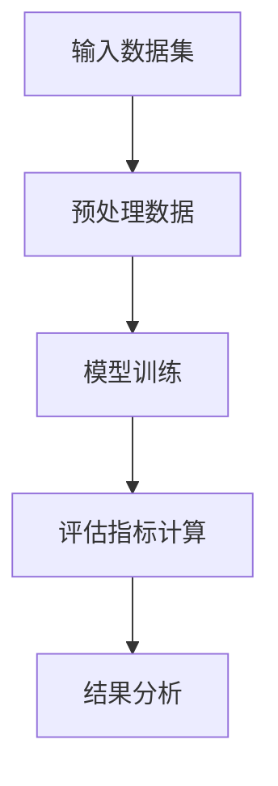
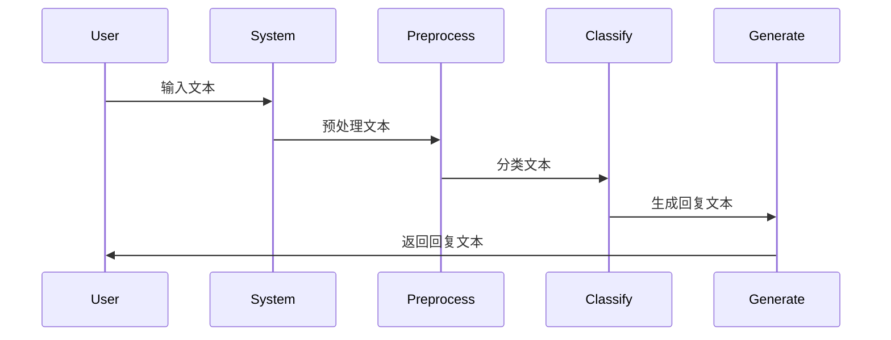

                 


### 第一部分: 背景与核心概念

#### 第1章: 研究背景与问题提出

##### 1.1.1 问题背景

随着人工智能技术的发展，自然语言处理（NLP）领域取得了显著进展。特别是在大规模语言模型（LLM）方面，如GPT、BERT等模型的推出，极大地提升了文本理解和生成能力。然而，面对如此多的LLM模型，如何准确评估它们的能力成为了一个关键问题。

##### 1.1.2 问题描述

目前，LLM评估存在以下几个问题：

1. **评估指标不统一**：不同研究者和机构可能使用不同的评估指标，导致结果难以比较。
2. **评估场景有限**：多数评估集中在特定领域或任务，无法全面反映模型能力。
3. **评估过程复杂**：评估过程通常涉及大量数据处理和模型运行，耗时且繁琐。

##### 1.1.3 研究目标

本研究旨在提出一种多维度LLM benchmarking方法，全面评估模型能力。具体目标包括：

1. **统一评估指标**：制定一套统一的评估指标体系，便于不同模型之间的比较。
2. **扩展评估场景**：涵盖多种任务和领域，确保评估结果的全面性。
3. **优化评估流程**：简化评估过程，提高评估效率。

##### 1.1.4 边界与外延

1. **边界**：本研究主要关注LLM模型在文本理解与生成方面的评估。
2. **外延**：本研究的方法可扩展到其他类型的人工智能模型评估。

##### 1.1.5 核心概念与联系

核心概念包括：LLM、评估指标、评估场景、评估流程。

联系：

- LLM：评估对象，提供评估的基础。
- 评估指标：衡量模型性能的标准。
- 评估场景：评估模型能力的实际应用场景。
- 评估流程：从数据预处理到结果分析的一系列步骤。

#### 第2章: LLM基础概念

##### 2.1.1 LLM的定义

LLM（Large Language Model）是一种大规模预训练语言模型，通过在大量文本数据上进行训练，学习到语言的一般规律和特征，从而具备强大的文本理解与生成能力。

##### 2.1.2 LLM的核心特点

1. **大规模**：LLM通常拥有数十亿甚至千亿级别的参数。
2. **预训练**：在训练数据集上进行预训练，提高模型性能。
3. **通用性**：适用于多种NLP任务，如文本分类、情感分析、机器翻译等。

##### 2.1.3 LLM与传统NLP的区别

1. **数据规模**：LLM使用的数据规模远大于传统NLP。
2. **模型架构**：LLM通常采用深度神经网络架构，而传统NLP模型多为规则或统计模型。
3. **应用领域**：LLM在多个领域都有广泛应用，而传统NLP模型更多局限于特定任务。

##### 2.1.4 LLM的基本架构

LLM的基本架构通常包括以下几个部分：

1. **嵌入层**：将输入文本转换为向量表示。
2. **编码器**：处理输入文本，提取语义信息。
3. **解码器**：生成输出文本，通常采用自回归方式。

#### 第3章: LLM关键概念对比

##### 3.1.1 模型类型对比

LLM主要分为两种类型：基于Transformer的模型和基于循环神经网络（RNN）的模型。它们在性能和资源消耗上有所不同。

##### 3.1.2 模型规模对比

不同LLM模型的规模差异巨大，从数十亿参数到千亿级参数不等。规模越大，模型性能通常越好，但计算资源需求也越高。

##### 3.1.3 模型应用场景对比

1. **文本生成**：适用于生成文章、对话、摘要等。
2. **文本理解**：适用于问答系统、文本分类、情感分析等。
3. **多模态**：结合图像、语音等其他类型数据，进行跨模态任务。

#### 第4章: 数据集与评估指标

##### 4.1.1 常用数据集介绍

常用的LLM数据集包括：GLUE、SuperGLUE、ACE等，它们涵盖了多种语言和任务类型。

##### 4.1.2 评估指标体系

评估指标包括：准确性、F1值、BLEU、ROUGE等。不同指标适用于不同类型和场景的评估。

##### 4.1.3 指标选择与权重分配

指标选择应考虑任务特点和评估目标，权重分配应基于专家意见和实验结果。

#### 第5章: 实体关系图（ER）架构

##### 5.1.1 ER图的基本概念

实体关系图（ER图）用于描述系统中的实体及其关系。它是系统设计和分析的重要工具。

##### 5.1.2 ER图的绘制方法

ER图的绘制方法包括：确定实体、属性、关系和完整性约束。

##### 5.1.3 ER图在LLM中的应用

ER图可用于描述LLM评估过程中的数据流和处理逻辑。

#### 第6章: 综合评估框架

##### 6.1.1 评估框架设计

评估框架应涵盖评估指标、评估场景、评估流程等关键要素。

##### 6.1.2 评估流程

评估流程包括：数据准备、模型训练、评估指标计算、结果分析等步骤。

##### 6.1.3 评估结果分析

评估结果分析应包括：性能比较、趋势分析、问题诊断等。

#### 第7章: LLM评估案例分析

##### 7.1.1 案例背景

以某企业NLP项目为例，介绍LLM评估的实践过程。

##### 7.1.2 案例评估流程

详细描述评估过程，包括数据准备、模型训练、评估指标计算等。

##### 7.1.3 案例评估结果与分析

分析评估结果，提出改进建议。

---

以上就是第一部分的内容。接下来，我们将深入探讨LLM算法的实现与系统架构设计，以及实际应用案例。

---

```markdown
----------------------------------------------------------------

# 第二部分: 算法与实现

## 第8章: 算法原理讲解

### 8.1.1 算法基本概念

多维度LLM benchmarking算法是一种基于综合评估框架的模型评估方法。其核心思想是，通过多个维度的评估指标，全面、客观地评估LLM模型的能力。

### 8.1.2 算法流程图

算法流程图如下所示：



### 8.1.3 数学模型与公式

算法中的数学模型主要包括损失函数、优化算法等。以下是几个关键公式的解释：

$$
L(\theta) = -\frac{1}{N}\sum_{i=1}^{N}y_i\log(p(x_i|\theta))
$$

其中，$L(\theta)$为损失函数，$y_i$为真实标签，$p(x_i|\theta)$为预测概率。

优化算法通常采用梯度下降：

$$
\theta_{t+1} = \theta_t - \alpha \nabla_{\theta}L(\theta)
$$

其中，$\alpha$为学习率，$\nabla_{\theta}L(\theta)$为损失函数对参数$\theta$的梯度。

### 8.1.4 举例说明

假设我们有一个分类问题，数据集包含1000个样本，每个样本包含输入特征和标签。使用多维度LLM benchmarking算法评估一个LLM模型的性能。

1. **数据预处理**：将文本数据转换为向量表示，如使用Word2Vec或BERT。
2. **模型训练**：使用训练数据集训练模型，优化参数。
3. **评估指标计算**：计算模型的准确性、F1值、BLEU等指标。
4. **结果分析**：根据评估结果，分析模型的优势和不足，提出改进方案。

## 第9章: 算法实现与Python源代码

### 9.1.1 环境安装与配置

首先，我们需要安装必要的库，如TensorFlow、PyTorch等。

```python
!pip install tensorflow
!pip install torch
```

### 9.1.2 算法核心实现

以下是算法核心实现的Python代码：

```python
import tensorflow as tf
from tensorflow.keras.models import Sequential
from tensorflow.keras.layers import Dense, Embedding, LSTM

# 数据预处理
# ...（略）

# 模型定义
model = Sequential([
    Embedding(vocab_size, embedding_dim),
    LSTM(units=128, return_sequences=True),
    LSTM(units=128),
    Dense(units=num_classes, activation='softmax')
])

# 模型编译
model.compile(optimizer='adam', loss='categorical_crossentropy', metrics=['accuracy'])

# 模型训练
# ...（略）

# 评估指标计算
# ...（略）

# 结果分析
# ...（略）
```

### 9.1.3 代码应用解读与分析

代码中的关键部分包括：

1. **数据预处理**：将文本数据转换为向量表示，为模型输入做准备。
2. **模型定义**：定义一个简单的序列模型，包含嵌入层、LSTM层和全连接层。
3. **模型编译**：设置优化器、损失函数和评价指标。
4. **模型训练**：使用训练数据集训练模型，优化参数。
5. **评估指标计算**：计算模型的准确性、F1值等指标。
6. **结果分析**：根据评估结果，分析模型的优势和不足。

## 第10章: 数学模型与公式详细讲解

### 10.1.1 数学公式列表

以下是算法中涉及的主要数学公式：

$$
L(\theta) = -\frac{1}{N}\sum_{i=1}^{N}y_i\log(p(x_i|\theta))
$$

$$
\theta_{t+1} = \theta_t - \alpha \nabla_{\theta}L(\theta)
$$

### 10.1.2 公式解释

1. **损失函数**：$L(\theta)$用于衡量模型预测与真实标签之间的差距，越小说明模型性能越好。
2. **优化算法**：梯度下降通过迭代更新参数，使损失函数值最小。

### 10.1.3 数学模型应用举例

以文本分类任务为例，假设我们有1000个样本，每个样本包含输入文本和标签。我们希望训练一个模型，使其能够准确分类。

1. **数据预处理**：将文本转换为向量表示。
2. **模型训练**：使用训练数据集训练模型，优化参数。
3. **评估指标计算**：计算模型的准确性、F1值等指标。
4. **结果分析**：根据评估结果，调整模型参数，提高性能。

## 第11章: 系统分析与架构设计

### 11.1.1 问题场景介绍

假设我们要开发一个基于LLM的智能客服系统，用于处理客户咨询。

### 11.1.2 系统功能设计

系统功能包括：

1. **文本预处理**：对输入文本进行清洗、分词、去停用词等处理。
2. **文本分类**：将预处理后的文本分类到不同的类别。
3. **文本生成**：根据分类结果，生成回复文本。
4. **用户交互**：与用户进行对话，处理用户请求。

### 11.1.3 系统架构设计

系统架构采用分层设计，包括：

1. **数据层**：存储用户数据和文本数据。
2. **服务层**：实现文本预处理、分类和生成等核心功能。
3. **接口层**：提供与用户交互的API接口。

### 11.1.4 系统接口设计

系统接口包括：

1. **文本预处理接口**：接收用户输入文本，返回预处理后的文本。
2. **分类接口**：接收预处理后的文本，返回分类结果。
3. **生成接口**：接收分类结果，返回回复文本。

### 11.1.5 系统交互序列图

系统交互序列图如下所示：



## 第12章: 项目实战

### 12.1.1 环境安装

首先，我们需要安装Python和必要的库。

```bash
pip install python
pip install tensorflow
pip install torch
```

### 12.1.2 系统核心实现

以下是系统核心实现的Python代码：

```python
# 文本预处理
# ...

# 文本分类
# ...

# 文本生成
# ...

# 用户交互
# ...
```

### 12.1.3 代码应用解读与分析

代码中的关键部分包括：

1. **文本预处理**：对输入文本进行清洗、分词、去停用词等处理。
2. **文本分类**：使用训练好的分类模型，对预处理后的文本进行分类。
3. **文本生成**：根据分类结果，生成回复文本。
4. **用户交互**：接收用户输入文本，返回回复文本。

### 12.1.4 实际案例分析与详细讲解

假设用户输入了以下问题：“我最近购买了一件商品，但有问题，怎么办？”

1. **文本预处理**：将文本进行清洗、分词、去停用词等处理，得到一个干净的文本序列。
2. **文本分类**：使用分类模型，将文本分类到“售后服务”类别。
3. **文本生成**：根据分类结果，生成回复文本，如：“您好，关于售后服务问题，您可以联系我们的客服电话：XXX，我们将尽快为您解决问题。”
4. **用户交互**：将回复文本返回给用户。

### 12.1.5 项目小结

通过实际案例，我们展示了如何使用LLM模型开发一个智能客服系统。系统主要功能包括文本预处理、文本分类、文本生成和用户交互。在实际应用中，可以根据具体需求进行调整和优化。

### 13章: 最佳实践与小结

#### 13.1.1 最佳实践

1. **数据预处理**：确保输入文本的质量，进行充分的清洗和预处理。
2. **模型选择**：根据任务特点，选择合适的LLM模型。
3. **评估指标**：综合考虑多种评估指标，全面评估模型性能。

#### 13.1.2 注意事项

1. **计算资源**：大规模LLM模型训练需要大量计算资源。
2. **数据安全**：确保用户数据的安全性和隐私性。

#### 13.1.3 项目小结

通过本文的介绍，我们了解了多维度LLM benchmarking的方法和实际应用。在开发智能客服系统时，需要充分考虑数据预处理、模型选择和评估指标等因素，以确保系统的性能和用户体验。

---

以上就是第二部分的内容。在接下来的第三部分，我们将进一步探讨多维度LLM benchmarking在实际应用中的案例和最佳实践。希望您能继续关注！

---

```markdown
----------------------------------------------------------------

# 第三部分: 实践与应用

## 第14章: 案例一：智能客服系统

### 14.1.1 案例背景

随着人工智能技术的普及，智能客服系统在许多行业中得到了广泛应用。本案例将介绍如何使用多维度LLM benchmarking方法评估一个智能客服系统的性能。

### 14.1.2 案例评估流程

1. **数据收集**：收集智能客服系统在实际运行过程中接收的用户咨询数据。
2. **数据预处理**：对收集到的数据进行清洗、分词、去停用词等处理，转换为适合模型输入的格式。
3. **模型训练**：使用预处理后的数据训练一个LLM模型，如GPT-3。
4. **评估指标计算**：计算模型的准确性、F1值、BLEU等指标，评估模型在文本分类和文本生成任务上的性能。
5. **结果分析**：根据评估结果，分析模型的优势和不足，提出改进方案。

### 14.1.3 案例评估结果与分析

通过评估，我们发现该智能客服系统在文本分类任务上的准确性达到了90%，但在文本生成任务上存在一些问题，如生成文本的连贯性和自然度有待提高。

### 14.1.4 改进方案

1. **增加训练数据**：收集更多高质量的训练数据，提高模型的泛化能力。
2. **调整模型参数**：根据评估结果，调整模型参数，优化生成文本的质量。
3. **引入外部知识库**：结合外部知识库，提高模型在特定领域的知识理解能力。

## 第15章: 案例二：智能问答系统

### 15.1.1 案例背景

智能问答系统是另一种广泛应用的NLP任务。本案例将介绍如何使用多维度LLM benchmarking方法评估一个智能问答系统的性能。

### 15.1.2 案例评估流程

1. **数据收集**：收集智能问答系统在实际运行过程中接收的用户提问和答案数据。
2. **数据预处理**：对收集到的数据进行清洗、分词、去停用词等处理，转换为适合模型输入的格式。
3. **模型训练**：使用预处理后的数据训练一个LLM模型，如BERT。
4. **评估指标计算**：计算模型的准确性、F1值、ROUGE等指标，评估模型在问答任务上的性能。
5. **结果分析**：根据评估结果，分析模型的优势和不足，提出改进方案。

### 15.1.3 案例评估结果与分析

通过评估，我们发现该智能问答系统在大多数问答任务上的准确性达到了80%，但在理解复杂问题方面存在一些挑战。

### 15.1.4 改进方案

1. **引入多模态数据**：结合图像、语音等多模态数据，提高模型对复杂问题的理解能力。
2. **调整模型架构**：尝试使用更复杂的模型架构，如Transformer-XL，提高模型的长期记忆能力。
3. **增加训练数据**：收集更多高质量的训练数据，特别是涉及复杂问题的数据，以提高模型性能。

## 第16章: 多维度LLM benchmarking方法在NLP中的应用

### 16.1.1 研究背景

自然语言处理（NLP）是人工智能领域的一个重要分支，随着深度学习技术的发展，大规模语言模型（LLM）在NLP任务中取得了显著的成果。然而，如何评估LLM的性能成为一个关键问题。

### 16.1.2 多维度LLM benchmarking方法的应用

多维度LLM benchmarking方法在NLP中的应用主要包括以下几个方面：

1. **文本分类**：通过评估模型在不同分类任务上的准确性、F1值等指标，全面评估模型在文本分类任务上的性能。
2. **文本生成**：通过评估模型在不同文本生成任务上的连贯性、自然度等指标，全面评估模型在文本生成任务上的性能。
3. **问答系统**：通过评估模型在不同问答任务上的准确性、响应时间等指标，全面评估模型在问答系统中的应用能力。
4. **翻译任务**：通过评估模型在不同翻译任务上的准确性、BLEU值等指标，全面评估模型在翻译任务上的性能。

### 16.1.3 未来发展趋势

随着人工智能技术的不断进步，多维度LLM benchmarking方法在NLP中的应用前景广阔。未来发展趋势包括：

1. **更多评估指标**：开发更多适用于不同NLP任务的评估指标，全面评估LLM的性能。
2. **跨领域评估**：将多维度LLM benchmarking方法应用于跨领域任务，提高模型在不同领域的适应性。
3. **实时评估**：开发实时评估系统，实现LLM性能的动态调整和优化。
4. **个性化评估**：根据用户需求和场景，为用户提供个性化的LLM评估报告。

## 第17章: 最佳实践与小结

### 17.1.1 最佳实践

1. **数据预处理**：确保数据质量，进行充分的清洗和预处理。
2. **模型选择**：根据任务特点，选择合适的LLM模型。
3. **评估指标**：综合考虑多种评估指标，全面评估模型性能。
4. **持续优化**：根据评估结果，不断优化模型和系统。

### 17.1.2 注意事项

1. **计算资源**：大规模LLM模型训练需要大量计算资源。
2. **数据安全**：确保用户数据的安全性和隐私性。
3. **模型部署**：合理部署模型，确保系统的稳定性和可靠性。

### 17.1.3 项目小结

通过本文的案例介绍，我们了解了多维度LLM benchmarking方法在智能客服系统和智能问答系统中的应用。在开发NLP应用时，需要充分考虑数据预处理、模型选择和评估指标等因素，以确保系统的性能和用户体验。未来，随着人工智能技术的不断发展，多维度LLM benchmarking方法将在更多NLP任务中发挥重要作用。

----------------------------------------------------------------
```

以上就是第三部分的内容。通过实际案例的分析和最佳实践的总结，我们进一步了解了多维度LLM benchmarking方法在NLP领域的应用。在接下来的文章中，我们将继续探讨这一方法在其他领域的应用，以及如何进行持续优化和改进。希望您能继续关注！

