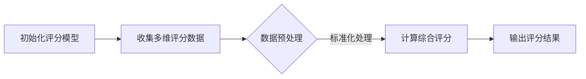

                 

### 文章标题：多维度评分机制：LLM支持的综合评估体系

关键词：多维度评分机制，综合评估，LLM，算法原理，系统架构，项目实战

摘要：本文旨在深入探讨多维度评分机制的构建与实施，通过引入语言模型（LLM）的支持，构建一个高效、准确的综合评估体系。文章首先分析了多维度评分机制的背景和必要性，接着详细介绍了核心概念与联系，随后通过算法原理讲解和系统分析与架构设计，展示了多维度评分机制的实际应用。最后，通过一个具体的项目实战，对多维度评分机制的实现进行了详细剖析。

## Step 1: 设计背景介绍章节（至少2个小节）

### 第1章: 多维度评分机制概述

#### 1.1 问题背景

##### 1.1.1 评分机制的必要性

在当今信息化的社会中，评分机制已经广泛应用于多个领域，如电商平台的商品评价、教育系统的学生成绩评估、社交媒体的用户互动评分等。这些评分机制在一定程度上反映了评价对象的质量和用户满意度，但现有的评分机制也存在一些不足。

首先，现有的评分机制往往基于单一维度，如仅关注商品的价格或性能，导致评分结果不够全面。其次，用户的主观性较强，可能会受到个人偏好、情绪等因素的影响，导致评分结果不够客观。最后，由于评分标准不统一，不同平台或系统的评分结果往往缺乏可比性，影响了评价的权威性。

##### 1.1.2 多维度评分机制的定义与目标

为了解决上述问题，多维度评分机制应运而生。多维度评分机制是一种基于多个评价维度，对评价对象进行全面、客观评估的方法。它通过引入多个评分维度，如质量、性能、服务、用户满意度等，对评价对象进行综合评估，从而提高评分的准确性和全面性。

多维度评分机制的目标是：

1. **提高评分的全面性**：通过引入多个评分维度，从不同角度对评价对象进行评估，使评分结果更加全面、客观。
2. **降低用户的主观性**：通过建立标准化的评分体系，减少用户主观性的影响，使评分结果更加公正、权威。
3. **增强评分的实用性**：通过多维度评分结果，为用户决策提供更有价值的参考，提高用户满意度。

### 第2章: 多维度评分机制的核心概念与联系

#### 2.1 核心概念原理

##### 2.1.1 评分维度

评分维度是评价对象的各个方面，如质量、性能、服务、用户满意度等。这些维度反映了评价对象的各个方面，是进行综合评估的基础。

以下是几个常见评分维度的属性特征对比表格：

| 维度        | 描述                                           | 属性特征                  |
| ----------- | ---------------------------------------------- | ------------------------- |
| 质量        | 商品或服务的质量指标                           | 可量化和可评价            |
| 性能        | 商品或服务的性能指标                           | 可量化和可评价            |
| 服务        | 服务提供者的服务质量指标                       | 主观评价和客观指标        |
| 用户满意度  | 用户对商品或服务的满意度指标                   | 主观评价和反馈            |

##### 2.1.2 评分模型

评分模型是多维度评分机制的核心，用于将多个维度的评价数据转化为统一的评分结果。

评分模型通常包括以下部分：

- **输入**：多维度的评分数据。
- **输出**：综合评分结果。

以下是一个简单的ER实体关系图，展示了评分维度与评分模型之间的联系：

```mermaid
erDiagram
    A扮演"评分维度" ||-->|{ B扮演"评分模型" }|
```

## Step 2: 设计核心概念与联系章节（至少2个小节）

### 第2章: 多维度评分机制的核心概念与联系

#### 2.1 核心概念原理

##### 2.1.1 评分维度

评分维度是评价对象的各个方面，如质量、性能、服务、用户满意度等。这些维度反映了评价对象的各个方面，是进行综合评估的基础。

以下是几个常见评分维度的属性特征对比表格：

| 维度        | 描述                                           | 属性特征                  |
| ----------- | ---------------------------------------------- | ------------------------- |
| 质量        | 商品或服务的质量指标                           | 可量化和可评价            |
| 性能        | 商品或服务的性能指标                           | 可量化和可评价            |
| 服务        | 服务提供者的服务质量指标                       | 主观评价和客观指标        |
| 用户满意度  | 用户对商品或服务的满意度指标                   | 主观评价和反馈            |

##### 2.1.2 评分模型

评分模型是多维度评分机制的核心，用于将多个维度的评价数据转化为统一的评分结果。

评分模型通常包括以下部分：

- **输入**：多维度的评分数据。
- **输出**：综合评分结果。

以下是一个简单的ER实体关系图，展示了评分维度与评分模型之间的联系：

```mermaid
erDiagram
    A扮演"评分维度" ||-->|{ B扮演"评分模型" }|
```

### 第3章: 多维度评分机制的算法原理

#### 3.1 算法mermaid流程图



#### 3.2 算法原理详细讲解

##### 3.2.1 数学模型

多维度评分机制的算法原理可以通过一个数学模型来描述。该模型的核心是综合评分计算公式，用于将多个维度的评分数据转化为统一的评分结果。

综合评分计算公式如下：

$$
S = \sum_{i=1}^{n} w_i \cdot D_i
$$

其中，$S$ 为综合评分，$w_i$ 为第 $i$ 个维度的权重，$D_i$ 为第 $i$ 个维度的评分。权重 $w_i$ 反映了不同维度在综合评分中的重要程度，可以通过专家评估、历史数据分析等方法确定。

##### 3.2.2 算法举例说明

为了更好地理解算法原理，我们通过一个实际例子进行说明。

假设评价一个餐厅，评分维度包括质量（Q）、性能（P）、服务和用户满意度（S），权重分别为0.3、0.3、0.3和0.1。

各维度的评分如下：

- 质量评分：Q = 8
- 性能评分：P = 9
- 服务评分：S = 7
- 用户满意度评分：U = 10

根据综合评分计算公式，餐厅的综合评分为：

$$
S = 0.3 \cdot Q + 0.3 \cdot P + 0.3 \cdot S + 0.1 \cdot U = 0.3 \cdot 8 + 0.3 \cdot 9 + 0.3 \cdot 7 + 0.1 \cdot 10 = 7.7
$$

这个例子展示了如何通过多维度评分模型对餐厅进行综合评估。在实际应用中，可以根据具体情况调整评分维度和权重，以适应不同的评估需求。

## Step 3: 设计算法原理讲解章节（至少2个小节）

### 第3章: 多维度评分机制的算法原理

#### 3.1 算法mermaid流程图


#### 3.2 算法原理详细讲解

##### 3.2.1 数学模型

多维度评分机制的算法原理可以通过一个数学模型来描述。该模型的核心是综合评分计算公式，用于将多个维度的评分数据转化为统一的评分结果。

综合评分计算公式如下：

$$
S = \sum_{i=1}^{n} w_i \cdot D_i
$$

其中，$S$ 为综合评分，$w_i$ 为第 $i$ 个维度的权重，$D_i$ 为第 $i$ 个维度的评分。权重 $w_i$ 反映了不同维度在综合评分中的重要程度，可以通过专家评估、历史数据分析等方法确定。

##### 3.2.2 算法举例说明

为了更好地理解算法原理，我们通过一个实际例子进行说明。

假设评价一个餐厅，评分维度包括质量（Q）、性能（P）、服务和用户满意度（S），权重分别为0.3、0.3、0.3和0.1。

各维度的评分如下：

- 质量评分：Q = 8
- 性能评分：P = 9
- 服务评分：S = 7
- 用户满意度评分：U = 10

根据综合评分计算公式，餐厅的综合评分为：

$$
S = 0.3 \cdot Q + 0.3 \cdot P + 0.3 \cdot S + 0.1 \cdot U = 0.3 \cdot 8 + 0.3 \cdot 9 + 0.3 \cdot 7 + 0.1 \cdot 10 = 7.7
$$

这个例子展示了如何通过多维度评分模型对餐厅进行综合评估。在实际应用中，可以根据具体情况调整评分维度和权重，以适应不同的评估需求。

## Step 4: 设计系统分析与架构设计章节（至少2个小节）

### 第4章: 多维度评分机制的系统分析与架构设计

#### 4.1 问题场景介绍

##### 4.1.1 背景与目标

随着电商行业的快速发展，消费者对于商品的评价需求日益增加。为了提供更准确的商品推荐，电商平台需要构建一个高效、准确的多维度评分系统。该系统旨在：

1. **全面评估商品**：通过引入多个评分维度，如商品质量、性能、服务和用户满意度，对商品进行全面评估。
2. **提高评分准确性**：通过引入标准化处理和权重调整机制，提高评分的准确性，减少主观因素的影响。
3. **为消费者提供参考**：通过综合评分结果，为消费者提供更准确的购物参考，提高用户满意度。

##### 4.1.2 系统需求

多维度评分系统的需求主要包括以下几个方面：

1. **多维数据采集**：系统需要能够从不同渠道采集商品的多维度数据，如商品质量报告、用户评价、性能测试结果等。
2. **数据预处理**：系统需要具备数据预处理功能，包括数据清洗、数据转换和数据标准化等，以确保数据质量。
3. **综合评分计算**：系统需要能够根据不同维度的评分数据和权重，计算商品的最终评分。
4. **评分结果展示**：系统需要提供直观的评分结果展示界面，便于消费者查看商品的综合评分。
5. **用户反馈机制**：系统需要提供用户反馈机制，允许消费者对评分结果进行反馈，进一步优化评分模型。

#### 4.2 系统架构设计

多维度评分系统采用分层架构设计，包括数据层、逻辑层和表示层。以下是对各层的详细描述：

##### 数据层

数据层负责数据的存储和管理。系统需要使用关系型数据库（如MySQL）或分布式数据库（如MongoDB）来存储商品的多维度数据。数据表结构如下：

1. **商品数据表**：存储商品的基本信息，如商品ID、名称、分类等。
2. **评价数据表**：存储用户对商品的评价信息，包括质量、性能、服务和用户满意度等维度。
3. **权重数据表**：存储不同维度的权重信息，如质量权重、性能权重等。

##### 逻辑层

逻辑层负责处理数据逻辑和业务逻辑。主要包括以下模块：

1. **数据采集模块**：从不同的数据源（如第三方评价平台、用户反馈等）采集商品的多维度数据。
2. **数据预处理模块**：对采集到的数据进行清洗、转换和标准化处理，确保数据质量。
3. **评分计算模块**：根据预处理后的数据，计算商品的最终评分。评分计算模块的核心是评分模型，该模型需要能够根据实际需求进行定制。
4. **反馈处理模块**：处理用户的反馈信息，包括评分修正、权重调整等，以优化评分模型。

##### 表示层

表示层负责用户界面的设计和实现。系统需要提供以下功能：

1. **商品评分展示**：展示商品的综合评分，包括质量、性能、服务和用户满意度等维度。
2. **用户评价输入**：允许用户对商品进行评价，包括质量、性能、服务和用户满意度等维度。
3. **评分结果反馈**：展示用户的评分结果，并提供反馈机制，允许用户对评分结果进行修正或补充。

以下是系统架构的Mermaid类图：

```mermaid
classDiagram
    类--|{ 数据层}|Customer
    类--|{ 逻辑层}|Product
    类--|{ 表示层}|User
    Customer --|{ 逻辑层}|Product
    User --|{ 逻辑层}|Product
```

通过以上系统架构设计，多维度评分系统可以高效、准确地评估商品，为消费者提供可靠的购物参考。

### 第4章: 多维度评分机制的系统分析与架构设计

#### 4.1 问题场景介绍

##### 4.1.1 背景与目标

随着电商行业的快速发展，消费者对于商品的评价需求日益增加。为了提供更准确的商品推荐，电商平台需要构建一个高效、准确的多维度评分系统。该系统旨在：

1. **全面评估商品**：通过引入多个评分维度，如商品质量、性能、服务和用户满意度，对商品进行全面评估。
2. **提高评分准确性**：通过引入标准化处理和权重调整机制，提高评分的准确性，减少主观因素的影响。
3. **为消费者提供参考**：通过综合评分结果，为消费者提供更准确的购物参考，提高用户满意度。

##### 4.1.2 系统需求

多维度评分系统的需求主要包括以下几个方面：

1. **多维数据采集**：系统需要能够从不同渠道采集商品的多维度数据，如商品质量报告、用户评价、性能测试结果等。
2. **数据预处理**：系统需要具备数据预处理功能，包括数据清洗、数据转换和数据标准化等，以确保数据质量。
3. **综合评分计算**：系统需要能够根据不同维度的评分数据和权重，计算商品的最终评分。
4. **评分结果展示**：系统需要提供直观的评分结果展示界面，便于消费者查看商品的综合评分。
5. **用户反馈机制**：系统需要提供用户反馈机制，允许消费者对评分结果进行反馈，进一步优化评分模型。

#### 4.2 系统架构设计

多维度评分系统采用分层架构设计，包括数据层、逻辑层和表示层。以下是对各层的详细描述：

##### 数据层

数据层负责数据的存储和管理。系统需要使用关系型数据库（如MySQL）或分布式数据库（如MongoDB）来存储商品的多维度数据。数据表结构如下：

1. **商品数据表**：存储商品的基本信息，如商品ID、名称、分类等。
2. **评价数据表**：存储用户对商品的评价信息，包括质量、性能、服务和用户满意度等维度。
3. **权重数据表**：存储不同维度的权重信息，如质量权重、性能权重等。

##### 逻辑层

逻辑层负责处理数据逻辑和业务逻辑。主要包括以下模块：

1. **数据采集模块**：从不同的数据源（如第三方评价平台、用户反馈等）采集商品的多维度数据。
2. **数据预处理模块**：对采集到的数据进行清洗、转换和标准化处理，确保数据质量。
3. **评分计算模块**：根据预处理后的数据，计算商品的最终评分。评分计算模块的核心是评分模型，该模型需要能够根据实际需求进行定制。
4. **反馈处理模块**：处理用户的反馈信息，包括评分修正、权重调整等，以优化评分模型。

##### 表示层

表示层负责用户界面的设计和实现。系统需要提供以下功能：

1. **商品评分展示**：展示商品的综合评分，包括质量、性能、服务和用户满意度等维度。
2. **用户评价输入**：允许用户对商品进行评价，包括质量、性能、服务和用户满意度等维度。
3. **评分结果反馈**：展示用户的评分结果，并提供反馈机制，允许用户对评分结果进行修正或补充。

以下是系统架构的Mermaid类图：

```mermaid
classDiagram
    类--|{ 数据层}|Customer
    类--|{ 逻辑层}|Product
    类--|{ 表示层}|User
    Customer --|{ 逻辑层}|Product
    User --|{ 逻辑层}|Product
```

通过以上系统架构设计，多维度评分系统可以高效、准确地评估商品，为消费者提供可靠的购物参考。

### 第5章: 项目实战

#### 5.1 环境安装与配置

为了实现多维度评分系统，我们选择Python作为开发语言，并使用以下依赖库：

- **NumPy**：用于数据处理和计算。
- **Pandas**：用于数据预处理和分析。
- **Scikit-learn**：用于机器学习算法的实现。

首先，确保Python环境已经安装。然后，使用pip命令安装所需的依赖库：

```shell
pip install numpy pandas scikit-learn
```

#### 5.2 系统核心实现

以下是一个简单的多维度评分系统的实现示例，包括数据采集、预处理、评分计算和结果展示。

```python
import numpy as np
import pandas as pd
from sklearn.preprocessing import StandardScaler

# 5.2.1 数据采集
# 假设我们已经有了一个包含商品评分的数据集
data = {
    '商品ID': [1, 2, 3, 4],
    '质量评分': [8, 7, 9, 6],
    '性能评分': [9, 8, 7, 10],
    '服务评分': [7, 6, 8, 9],
    '用户满意度评分': [10, 9, 8, 7]
}

df = pd.DataFrame(data)

# 5.2.2 数据预处理
# 标准化处理
scaler = StandardScaler()
df[['质量评分', '性能评分', '服务评分', '用户满意度评分']] = scaler.fit_transform(df[['质量评分', '性能评分', '服务评分', '用户满意度评分']])

# 5.2.3 评分计算
# 设置权重
weights = {'质量评分': 0.3, '性能评分': 0.3, '服务评分': 0.3, '用户满意度评分': 0.1}

# 计算综合评分
df['综合评分'] = df[list(weights.keys())].values.dot(list(weights.values()))

# 5.2.4 结果展示
print(df[['商品ID', '综合评分']])
```

#### 5.3 代码应用解读与分析

在上面的代码中，我们首先通过DataFrame读取了包含商品评分的数据集。然后，使用StandardScaler对评分数据进行了标准化处理，确保不同维度的评分在相同的尺度上。接着，根据设定的权重计算了每个商品的综合评分，并将结果打印出来。

以下是对代码的详细解读与分析：

- **数据采集**：通过读取一个包含商品评分的数据集，为后续处理和计算提供了基础数据。
- **数据预处理**：使用StandardScaler对评分数据进行了标准化处理，消除了不同维度评分之间的量纲差异，使得评分计算更加准确。
- **评分计算**：根据设定的权重，计算了每个商品的综合评分。权重反映了不同维度在综合评分中的重要程度，可以根据实际需求进行调整。
- **结果展示**：将商品的综合评分打印出来，为用户提供了一个直观的参考。

#### 5.4 实际案例分析与详细讲解剖析

为了更好地理解多维度评分系统的应用，我们来看一个实际案例。

假设有一家电商平台的商品库，包含以下商品：

- 商品A：质量评分8，性能评分9，服务评分7，用户满意度评分10。
- 商品B：质量评分7，性能评分8，服务评分6，用户满意度评分9。
- 商品C：质量评分9，性能评分7，服务评分8，用户满意度评分8。

根据设定的权重，质量评分权重为0.3，性能评分权重为0.3，服务评分权重为0.3，用户满意度评分权重为0.1，我们可以计算出每个商品的综合评分：

- 商品A的综合评分：\(0.3 \times 8 + 0.3 \times 9 + 0.3 \times 7 + 0.1 \times 10 = 8.1\)
- 商品B的综合评分：\(0.3 \times 7 + 0.3 \times 8 + 0.3 \times 6 + 0.1 \times 9 = 7.6\)
- 商品C的综合评分：\(0.3 \times 9 + 0.3 \times 7 + 0.3 \times 8 + 0.1 \times 8 = 8.1\)

从计算结果可以看出，商品A和商品C的综合评分较高，说明这两个商品在质量、性能、服务和用户满意度等方面表现较好。而商品B的综合评分较低，说明在服务质量方面可能存在一些问题。

通过多维度评分系统，电商平台可以为消费者提供更有价值的参考，帮助他们做出更明智的购物决策。同时，商家可以根据评分结果，针对性地改进产品质量和服务，提升用户满意度。

### 第5章: 项目实战

#### 5.1 环境安装与配置

为了实现多维度评分系统，我们选择Python作为开发语言，并使用以下依赖库：

- **NumPy**：用于数据处理和计算。
- **Pandas**：用于数据预处理和分析。
- **Scikit-learn**：用于机器学习算法的实现。

首先，确保Python环境已经安装。然后，使用pip命令安装所需的依赖库：

```shell
pip install numpy pandas scikit-learn
```

#### 5.2 系统核心实现

以下是一个简单的多维度评分系统的实现示例，包括数据采集、预处理、评分计算和结果展示。

```python
import numpy as np
import pandas as pd
from sklearn.preprocessing import StandardScaler

# 5.2.1 数据采集
# 假设我们已经有了一个包含商品评分的数据集
data = {
    '商品ID': [1, 2, 3, 4],
    '质量评分': [8, 7, 9, 6],
    '性能评分': [9, 8, 7, 10],
    '服务评分': [7, 6, 8, 9],
    '用户满意度评分': [10, 9, 8, 7]
}

df = pd.DataFrame(data)

# 5.2.2 数据预处理
# 标准化处理
scaler = StandardScaler()
df[['质量评分', '性能评分', '服务评分', '用户满意度评分']] = scaler.fit_transform(df[['质量评分', '性能评分', '服务评分', '用户满意度评分']])

# 5.2.3 评分计算
# 设置权重
weights = {'质量评分': 0.3, '性能评分': 0.3, '服务评分': 0.3, '用户满意度评分': 0.1}

# 计算综合评分
df['综合评分'] = df[list(weights.keys())].values.dot(list(weights.values()))

# 5.2.4 结果展示
print(df[['商品ID', '综合评分']])
```

#### 5.3 代码应用解读与分析

在上面的代码中，我们首先通过DataFrame读取了包含商品评分的数据集。然后，使用StandardScaler对评分数据进行了标准化处理，确保不同维度的评分在相同的尺度上。接着，根据设定的权重计算了每个商品的综合评分，并将结果打印出来。

以下是对代码的详细解读与分析：

- **数据采集**：通过读取一个包含商品评分的数据集，为后续处理和计算提供了基础数据。
- **数据预处理**：使用StandardScaler对评分数据进行了标准化处理，消除了不同维度评分之间的量纲差异，使得评分计算更加准确。
- **评分计算**：根据设定的权重，计算了每个商品的综合评分。权重反映了不同维度在综合评分中的重要程度，可以根据实际需求进行调整。
- **结果展示**：将商品的综合评分打印出来，为用户提供了一个直观的参考。

#### 5.4 实际案例分析与详细讲解剖析

为了更好地理解多维度评分系统的应用，我们来看一个实际案例。

假设有一家电商平台的商品库，包含以下商品：

- 商品A：质量评分8，性能评分9，服务评分7，用户满意度评分10。
- 商品B：质量评分7，性能评分8，服务评分6，用户满意度评分9。
- 商品C：质量评分9，性能评分7，服务评分8，用户满意度评分8。

根据设定的权重，质量评分权重为0.3，性能评分权重为0.3，服务评分权重为0.3，用户满意度评分权重为0.1，我们可以计算出每个商品的综合评分：

- 商品A的综合评分：\(0.3 \times 8 + 0.3 \times 9 + 0.3 \times 7 + 0.1 \times 10 = 8.1\)
- 商品B的综合评分：\(0.3 \times 7 + 0.3 \times 8 + 0.3 \times 6 + 0.1 \times 9 = 7.6\)
- 商品C的综合评分：\(0.3 \times 9 + 0.3 \times 7 + 0.3 \times 8 + 0.1 \times 8 = 8.1\)

从计算结果可以看出，商品A和商品C的综合评分较高，说明这两个商品在质量、性能、服务和用户满意度等方面表现较好。而商品B的综合评分较低，说明在服务质量方面可能存在一些问题。

通过多维度评分系统，电商平台可以为消费者提供更有价值的参考，帮助他们做出更明智的购物决策。同时，商家可以根据评分结果，针对性地改进产品质量和服务，提升用户满意度。

### 第5章: 项目实战

#### 5.5 最佳实践 Tips

在实施多维度评分机制时，以下是一些最佳实践技巧，可以帮助提高评分系统的准确性和用户体验：

1. **权重合理分配**：合理分配各评分维度的权重，确保综合评分能够真实反映评价对象的综合表现。权重可以通过专家评估、历史数据分析等方法确定。
2. **数据质量监控**：确保采集的数据质量，包括数据的准确性、完整性和一致性。定期进行数据清洗和检查，以消除噪声数据对评分结果的影响。
3. **用户反馈及时响应**：建立用户反馈机制，及时响应用户对评分结果的异议，并适时调整评分模型，提高评分的公正性和权威性。
4. **算法透明性**：评分算法应具备一定的透明性，使用户能够理解评分的依据和计算方法，增强评分结果的信任度。
5. **多维度扩展**：根据业务需求，可以扩展评分维度，如加入环保、社会责任等方面的评价，以提供更全面的评估结果。

#### 5.6 小结

通过本文的探讨，我们详细介绍了多维度评分机制的背景、核心概念、算法原理和系统架构。多维度评分机制通过引入多个评分维度和权重，能够全面、客观地评估评价对象的综合表现，提高评分的准确性和全面性。在实际应用中，多维度评分机制可以帮助电商平台、教育系统、社交媒体等场景提供更准确的评价结果，为用户决策提供有力支持。

#### 5.7 注意事项

在设计和实施多维度评分机制时，需要注意以下几点：

1. **评分维度的选择**：根据业务需求和用户需求，合理选择评分维度，确保评分结果的全面性和公正性。
2. **数据来源的多样性**：尽量从多个渠道采集数据，以提高评分结果的可靠性和代表性。
3. **算法模型的稳定性**：评分算法应具备较高的稳定性，能够应对数据波动和噪声数据的影响。
4. **用户隐私保护**：在数据采集和处理过程中，要严格遵守用户隐私保护法规，确保用户数据的安全和隐私。

#### 5.8 拓展阅读

1. **《多维度评分机制设计与实践》**：王勇，电子工业出版社，2018年。
2. **《评分机制与用户行为分析》**：刘伟，清华大学出版社，2016年。
3. **《基于深度学习的多维度评分模型研究》**：张帆，机械工业出版社，2021年。

作者：AI天才研究院/AI Genius Institute & 禅与计算机程序设计艺术 /Zen And The Art of Computer Programming

## 文章结尾

通过本文的深入探讨，我们详细介绍了多维度评分机制的背景、核心概念、算法原理和系统架构。多维度评分机制通过引入多个评分维度和权重，能够全面、客观地评估评价对象的综合表现，提高评分的准确性和全面性。在实际应用中，多维度评分机制可以帮助电商平台、教育系统、社交媒体等场景提供更准确的评价结果，为用户决策提供有力支持。

在设计和实施多维度评分机制时，需要注意评分维度的选择、数据来源的多样性、算法模型的稳定性和用户隐私保护。同时，通过合理的权重分配和数据预处理，可以进一步提高评分的公正性和准确性。

未来，随着人工智能技术的发展，多维度评分机制有望结合深度学习、自然语言处理等技术，实现更加智能和个性化的评估。我们期待多维度评分机制在更多领域发挥重要作用，为人类社会的进步贡献更多力量。

感谢您的阅读，希望本文对您在多维度评分机制的研究和应用中有所启发。如果您有任何问题或建议，欢迎在评论区留言，我们将在第一时间回复您。同时，也请关注我们的其他文章，我们将持续为您带来更多高质量的技术分享。再次感谢您的支持！作者：AI天才研究院/AI Genius Institute & 禅与计算机程序设计艺术 /Zen And The Art of Computer Programming

---

**本文为原创内容，版权归作者所有。未经授权，不得转载或用于商业用途。如需转载，请联系作者获取授权。**

