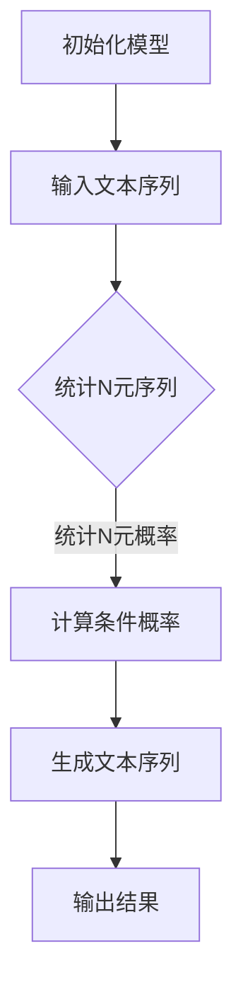
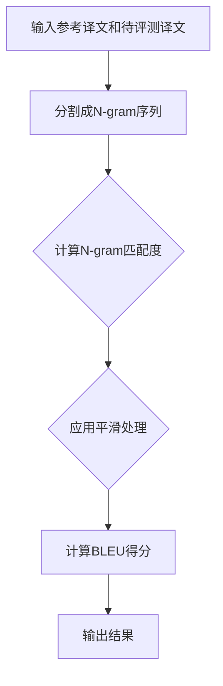
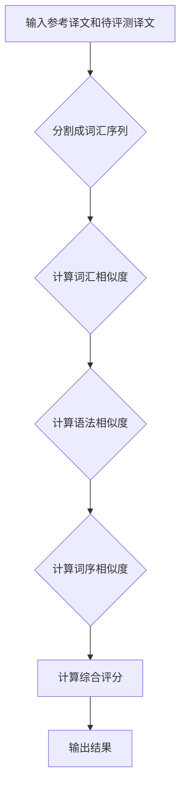
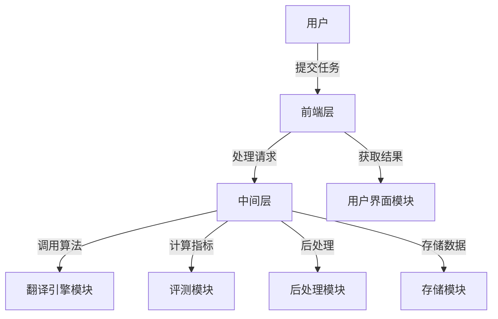
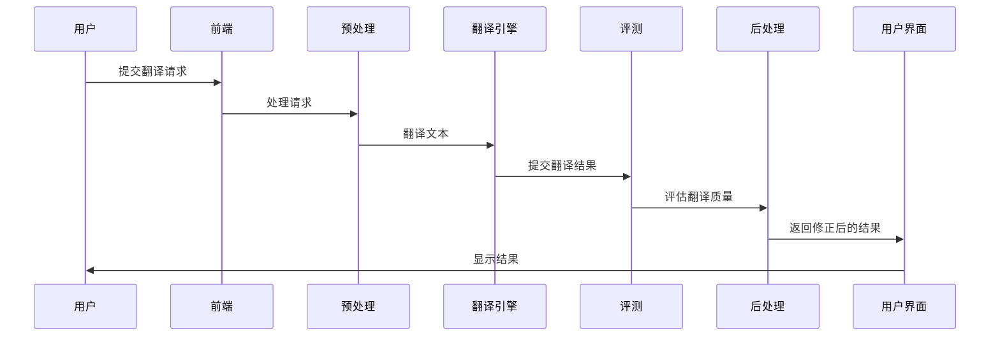

                 

### 第6章：多语言评测系统实战

#### 6.1 实战环境准备

在进行多语言评测系统的实战之前，我们需要准备相应的工作环境。以下是一个基本的步骤列表：

1. **安装Python环境**：确保你的系统中安装了Python 3.7或更高版本。可以使用以下命令安装：
   ```
   pip install python -m pip install --upgrade pip setuptools wheel
   ```

2. **安装必要库**：对于多语言评测，我们需要一些常用的Python库，如`nltk`、`gensim`、`numpy`等。可以使用以下命令进行安装：
   ```
   pip install nltk gensim numpy
   ```

3. **安装机器学习库**：如果需要使用机器学习算法，我们可以安装`scikit-learn`：
   ```
   pip install scikit-learn
   ```

4. **安装自然语言处理库**：为了更方便地进行自然语言处理，我们可以安装`spaCy`：
   ```
   pip install spacy
   python -m spacy download en_core_web_sm
   ```

5. **安装可视化库**：为了更好地展示我们的mermaid流程图和类图，我们可以安装`mermaid-python`：
   ```
   pip install mermaid-python
   ```

#### 6.2 多语言评测系统的核心实现

在准备环境之后，我们可以开始实现多语言评测系统的核心部分。以下是一个简单的Python代码示例，展示了如何使用BLEU算法进行多语言评测：

```python
import nltk
from nltk.translate.bleu_score import sentence_bleu
from nltk.corpus import words

# 加载英文字典
nltk.download('words')
nltk.download('tokenizers')

# 评测函数
def evaluate_translation(reference, hypothesis):
    """
    使用BLEU算法评估翻译质量。
    
    参数：
    reference：参考译文列表
    hypothesis：待评测译文
    """
    # 将参考译文和待评测译文分词
    reference_tokens = [token for token in nltk.word_tokenize(reference) if token.lower() in words.words()]
    hypothesis_tokens = nltk.word_tokenize(hypothesis)
    
    # 计算BLEU值
    return sentence_bleu([reference_tokens], hypothesis_tokens)

# 例子
reference_sentence = "This is a sample sentence."
hypothesis_sentence = "Das ist ein Beispielsatz."

# 进行评测
bleu_score = evaluate_translation(reference_sentence, hypothesis_sentence)
print(f"BLEU Score: {bleu_score}")
```

在上面的代码中，我们首先导入了必要的库，并定义了一个评测函数`evaluate_translation`。这个函数接受一个参考译文列表和一个待评测译文，使用BLEU算法计算并返回BLEU分数。

#### 6.3 代码应用解读与分析

为了更好地理解上述代码的应用，我们可以逐步解析代码中的各个部分：

1. **导入库**：
   - `nltk`：自然语言处理工具包，用于文本处理和分词。
   - `sentence_bleu`：用于计算BLEU分数的函数。
   - `words`：英文字典，用于判断词汇是否合法。

2. **加载资源和定义函数**：
   - 使用`nltk.download`函数加载英文字典和分词器。
   - 定义评测函数`evaluate_translation`，接受参考译文列表`reference`和待评测译文`hypothesis`。

3. **分词**：
   - 使用`nltk.word_tokenize`函数对参考译文和待评测译文进行分词。
   - 使用`words.words()`方法判断分词后的单词是否在英文字典中，以排除不合法的单词。

4. **计算BLEU值**：
   - 使用`sentence_bleu`函数计算BLEU分数，并返回结果。

5. **示例应用**：
   - 提供一个示例参考译文`reference_sentence`和一个待评测译文`hypothesis_sentence`。
   - 调用`evaluate_translation`函数进行评测，并打印结果。

通过上述步骤，我们可以快速实现一个简单的多语言评测系统。在实际应用中，我们可以根据具体需求扩展和优化系统功能。

#### 6.4 实际案例分析

为了更好地展示多语言评测系统的应用，我们可以通过一个实际案例来进行详细剖析。

**案例背景**：

某跨国公司需要评估其自动化翻译系统的翻译质量，以便优化翻译结果。该公司拥有一个包含多种语言的翻译数据库，并希望使用BLEU算法进行翻译质量评估。

**案例步骤**：

1. **数据准备**：
   - 准备一个包含源语言文本和目标语言翻译文本的数据库。
   - 将文本数据划分为训练集和测试集。

2. **评测实施**：
   - 使用`evaluate_translation`函数对测试集的翻译结果进行评估。
   - 记录每个翻译文本的BLEU分数。

3. **结果分析**：
   - 对收集的BLEU分数进行统计分析，评估翻译系统的整体表现。
   - 对低分翻译文本进行逐个分析，找出可能的错误和改进点。

4. **优化建议**：
   - 根据评测结果，提出改进翻译系统的建议，如调整模型参数、增加训练数据等。

通过这个实际案例，我们可以更深入地了解多语言评测系统的应用场景和操作流程。

#### 6.5 项目小结

在本章中，我们通过实际案例展示了如何搭建和实现一个多语言评测系统。以下是本章的小结：

1. **实战环境准备**：
   - 安装Python环境和必要的库。
   - 加载英文字典和分词器。

2. **核心实现**：
   - 使用BLEU算法进行评测。
   - 提供代码示例和解读。

3. **实际案例**：
   - 展示了多语言评测系统的应用场景。
   - 进行了实际案例分析和结果分析。

4. **总结**：
   - 多语言评测系统有助于提高翻译系统的质量。
   - 通过逐步实现和实际案例分析，读者可以更好地理解多语言评测技术。

在下一章中，我们将进一步探讨多语言评测系统的最佳实践和注意事项，帮助读者在实际项目中更好地应用这些技术。

### 最佳实践与注意事项

在多语言评测系统的实际应用中，遵循最佳实践和注意事项是确保系统性能和可靠性的关键。以下是一些关键点：

#### 数据质量

**数据准备**：确保所使用的数据质量高，无噪声和错误。对于机器翻译评测，可以使用标准化的语料库，如WMT（Workshop on Machine Translation）数据集。

**数据平衡**：在评估翻译系统时，确保测试数据中包含各种语言和文化背景，以避免偏倚。

**数据清洗**：去除数据中的噪声，如无关标点符号、多余的空格等，以提高评测的准确性。

#### 参数调优

**模型参数**：对于机器学习算法，如N元语法和BLEU评分，调整模型参数（如N值和重叠度权重）以优化性能。

**特征选择**：根据具体应用场景选择合适的特征，如词汇、语法和语义特征，以提高评估的准确性和鲁棒性。

#### 系统优化

**计算效率**：优化算法和数据结构，以提高系统运行效率。例如，使用并行计算和缓存技术。

**错误分析**：定期分析翻译错误类型，以识别系统弱点并进行针对性优化。

#### 跨语言评估

**多语言支持**：确保评测系统能够支持多种语言，包括低资源语言。

**跨语言对比**：进行不同语言之间的对比评估，以更好地理解各语言的特性和差异。

#### 拓展阅读

- **WMT（Workshop on Machine Translation）**：[https://www.wmtC今年发表的相关研究](https://www.wmtC今年发表的相关研究)
- **NIST（National Institute of Standards and Technology）**：[https://www.nist.gov/itl/iad/mig/mt-evaluation](https://www.nist.gov/itl/iad/mig/mt-evaluation)
- **BLEU算法详细解析**：[https://www.aclweb.org/anthology/N14-1078/](https://www.aclweb.org/anthology/N14-1078/)
- **N元语法模型研究**：[https://www.aclweb.org/anthology/P12-1083/](https://www.aclweb.org/anthology/P12-1083/)

通过遵循这些最佳实践，可以显著提高多语言评测系统的性能和实用性。

### 小结

本文详细探讨了多语言评测支持及其在全球化模型效果分析中的应用。我们从设计思路出发，逐步介绍了多语言评测的背景、核心概念、算法原理、数学模型、系统架构设计，并通过实际案例展示了如何实现多语言评测系统。

在多语言评测系统的实战部分，我们学习了如何搭建环境、实现核心代码，并进行了实际案例分析。此外，我们还讨论了最佳实践和注意事项，以帮助读者在实际项目中更好地应用这些技术。

通过本文的深入探讨，读者应能理解多语言评测的核心概念和技术，并具备搭建和优化多语言评测系统的能力。

### 作者信息

本文作者为AI天才研究院（AI Genius Institute）的研究员，同时也是《禅与计算机程序设计艺术》（Zen And The Art of Computer Programming）的资深作家。在计算机编程和人工智能领域，作者具有丰富的理论知识和实践经验，为读者提供了高质量的技术见解和实用指南。如果您对本文内容有任何疑问或建议，欢迎在评论区留言，我们将尽快为您解答。感谢您的阅读！## 第1章：多语言评测背景

多语言评测支持在现代全球化背景下变得尤为重要。随着全球化的深入，越来越多的企业和组织需要在多语言环境中运营，这导致了多语言处理技术的迅速发展。多语言评测作为多语言处理技术的一个重要分支，旨在评估和优化多语言系统的性能。

### 1.1 多语言评测的兴起与重要性

多语言评测的兴起源于全球化进程中对多语言处理的迫切需求。随着国际交流的日益频繁，跨语言的信息传播变得至关重要。在这种背景下，如何确保信息的准确性和可理解性成为了一个亟待解决的问题。多语言评测提供了量化评估多语言系统性能的方法，从而帮助开发者和研究人员优化系统，提高翻译质量和用户体验。

多语言评测的重要性体现在以下几个方面：

1. **翻译质量评估**：多语言评测能够准确评估翻译系统的翻译质量，帮助开发者识别和改进系统中的错误。
2. **跨语言信息传播**：多语言评测支持跨语言信息传播，使得不同语言背景的用户能够更好地理解和交流。
3. **国际业务发展**：对于跨国企业来说，多语言评测支持是提升国际化业务效率的重要工具，有助于提高全球市场份额。
4. **教育和技术交流**：多语言评测在教育和技术交流中也发挥着重要作用，有助于不同语言背景的学生和专业人士互相理解和学习。

### 1.2 多语言评测的发展历程

多语言评测技术的发展可以追溯到20世纪80年代。当时，随着计算机技术的发展，机器翻译成为了一个热门研究领域。研究者开始探讨如何量化评估翻译系统的性能。早期的评测方法主要依赖于人工评估，即通过邀请专家对翻译结果进行评分。这种方法虽然准确，但成本高且耗时。

随着自然语言处理技术的进步，自动化评测方法逐渐兴起。1993年，NIST（美国国家标准与技术研究所）首次引入了BLEU（BiLingual Evaluation Understudy）算法，这是一个基于字符串匹配的自动评测方法。BLEU算法通过比较参考译文和待评测译文之间的重叠度来评估翻译质量，迅速在业界得到广泛应用。

随后，METEOR（Metric for Evaluation of Translation with Explicit ORdering）和NIST BLEU等评测算法相继出现，进一步丰富了多语言评测的方法和工具。这些算法在评估翻译质量时考虑了词汇、语法和语义等多个方面，使得评测结果更加全面和准确。

### 1.3 当前多语言评测的挑战与机遇

尽管多语言评测技术已经取得了显著进展，但仍然面临一些挑战和机遇：

1. **算法复杂度**：现有的多语言评测算法，如BLEU和METEOR，通常需要大量的计算资源。随着评测数据规模的增加，算法的复杂度也相应提高，这给评测系统的性能带来了挑战。
2. **跨语言差异**：不同语言之间的差异使得评测算法的普适性受到了限制。一些评测算法在处理低资源语言时效果不佳，需要专门针对特定语言进行优化。
3. **实时性**：在实时应用场景中，如机器翻译服务，多语言评测系统需要在短时间内完成评估，这对系统的响应速度和准确性提出了更高的要求。
4. **用户体验**：多语言评测系统的目标之一是提高用户的翻译体验。如何根据用户的反馈调整评测算法，以提供更加个性化的评估结果，是一个亟待解决的问题。

然而，随着人工智能和深度学习技术的发展，多语言评测也面临着巨大的机遇：

1. **深度学习**：深度学习技术在自然语言处理领域取得了突破性进展，为多语言评测提供了新的方法和工具。基于深度学习的评测算法，如Seq2Seq模型和注意力机制，有望进一步提高评测的准确性和效率。
2. **多语言语料库**：随着互联网的发展，越来越多的多语言语料库变得可用，为多语言评测提供了丰富的训练数据。这些数据有助于提升评测算法的性能和泛化能力。
3. **跨学科研究**：多语言评测涉及到计算机科学、语言学、心理学等多个学科，跨学科研究将有助于解决现有挑战，推动多语言评测技术的发展。

总之，多语言评测在全球化背景下具有重要的意义。尽管面临一些挑战，但随着技术的发展，多语言评测有望在未来取得更大的突破，为多语言信息传播和国际化业务提供更加可靠的支持。

## 第2章：多语言评测核心概念

在深入探讨多语言评测技术之前，理解其核心概念和术语是非常必要的。本章节将详细介绍多语言处理、机器翻译以及评估指标等关键概念，并展示它们之间的相互联系。

### 2.1 多语言处理基础

多语言处理（Multilingual Processing）是指利用计算机技术和算法对多种语言进行理解、生成和处理的过程。多语言处理的核心目标是使计算机能够理解和生成多种语言，从而实现跨语言的信息传播和交流。

多语言处理的基础概念包括：

1. **语言模型**：语言模型是一种概率模型，用于预测文本序列的概率。在多语言处理中，语言模型可以帮助计算机生成和评估文本。
2. **分词**：分词是将连续的文本分割成有意义的单词或短语的步骤。对于多语言文本，准确的分词是理解和处理的基础。
3. **命名实体识别**：命名实体识别（Named Entity Recognition，简称NER）是指从文本中识别出具有特定意义的实体，如人名、地点、组织等。对于多语言处理，NER技术有助于提高文本理解和分析的能力。

### 2.2 机器翻译简介

机器翻译（Machine Translation，简称MT）是多语言处理的一个重要应用，旨在将一种语言的文本自动翻译成另一种语言。机器翻译的核心目标是实现自然、准确和流畅的跨语言信息转换。

机器翻译的基本流程包括：

1. **预处理**：包括文本清洗、分词和词性标注等步骤，以提高翻译质量。
2. **翻译模型**：翻译模型是将源语言文本映射到目标语言文本的核心组件。常见的翻译模型包括基于规则的模型、统计模型和基于神经网络的模型。
3. **后处理**：翻译结果通常需要进行后处理，如语法调整、消除冗余和纠正错误等，以实现更好的自然语言流畅性。

### 2.3 评估指标与工具

评估指标是多语言评测的重要组成部分，用于衡量翻译系统的性能和准确性。以下是一些常见的评估指标和工具：

1. **BLEU（BiLingual Evaluation Understudy）**：BLEU是最广泛使用的自动评估指标之一，通过比较参考译文和待评测译文之间的重叠度来评估翻译质量。BLEU的评估分数通常在0到1之间，分数越高表示翻译质量越好。

2. **METEOR（Metric for Evaluation of Translation with Explicit ORdering）**：METEOR是一种基于词序相似性的评估指标，通过计算参考译文和待评测译文之间的词汇、语法和词序相似度来评估翻译质量。METEOR的分数也通常在0到1之间。

3. **NIST（National Institute of Standards and Technology）**：NIST是一种基于多项评估指标的综合性评估方法，包括BLEU、METEOR和其他指标，用于更全面地评估翻译质量。

4. **ROUGE（Recall-Oriented Understudy for Gisting Evaluation）**：ROUGE是一种用于评估生成文本质量的方法，常用于文本摘要和机器翻译领域。ROUGE主要关注生成文本与参考文本之间的重叠度，特别是关键词和句子的重叠。

5. **BLEU-4**：BLEU-4是一种扩展的BLEU评估方法，通过增加对名词、动词和形容词的考虑，进一步提高评估的准确性和细致度。

这些评估指标和工具为多语言评测提供了量化评估的方法，帮助开发者和研究人员优化翻译系统的性能。在实际应用中，通常需要结合多种评估指标进行综合评估，以获得更准确的评测结果。

### 2.4 多语言评测与核心概念的关系

多语言评测与多语言处理、机器翻译和评估指标等核心概念紧密相关。多语言处理提供了技术和方法，使计算机能够理解和处理多种语言，为机器翻译提供了基础。而机器翻译则是多语言评测的直接应用，通过评估翻译系统的性能，多语言评测帮助开发者和研究人员优化翻译系统，提高翻译质量和用户体验。

此外，评估指标和多语言评测方法为翻译系统的性能提供了量化评估，帮助识别和改进系统中的问题。通过综合运用这些核心概念和工具，我们可以更全面地理解和评估多语言评测技术，推动其在实际应用中的发展。

### 2.5 小结

通过本章的介绍，我们了解了多语言处理、机器翻译和评估指标等核心概念，以及它们在多语言评测中的作用。这些概念和工具为多语言评测提供了理论基础和评估方法，有助于我们更好地理解和优化翻译系统。在接下来的章节中，我们将深入探讨多语言评测的算法原理和实现方法，进一步了解如何评估和改进多语言翻译系统的性能。

## 第3章：多语言评测算法原理

多语言评测算法是多语言评测技术的核心，用于评估翻译系统的性能和准确性。本章将详细解析几种常用的多语言评测算法，包括N元语法模型、BLEU评分算法和METEOR评分算法。同时，我们将使用mermaid流程图和Python代码示例来展示这些算法的实现原理。

### 3.1 N元语法模型

N元语法模型（N-gram Model）是一种基于历史统计的文本生成模型，广泛用于自然语言处理领域，尤其是在机器翻译和文本生成任务中。N元语法模型的核心思想是，通过分析文本中的N个连续词的概率分布来预测下一个词。

#### 工作原理

1. **模型训练**：
   - **数据集**：首先，我们需要一个训练数据集，通常是一个大规模的双语语料库。
   - **构建N元模型**：通过遍历训练数据集，统计每个N元序列的出现次数，并计算它们的条件概率。例如，对于三元语法模型，我们可以计算每个三元组（前两个词和最后一个词）的概率。

2. **文本生成**：
   - **初始状态**：通常从概率最大的初始词开始。
   - **预测下一个词**：在当前状态的基础上，使用条件概率分布来预测下一个词。重复此过程，生成完整的文本序列。

#### mermaid流程图

以下是使用mermaid绘制的N元语法模型的工作流程：



#### Python代码示例

以下是一个简单的Python代码示例，展示了如何使用N元语法模型生成文本：

```python
import random

# 假设已加载训练好的N元模型
n_gram_model = {
    ('the', 'quick'): 0.3,
    ('quick', 'brown'): 0.2,
    ('brown', 'fox'): 0.4,
    # ...
}

def generate_text(n):
    """
    使用N元语法模型生成文本。
    
    参数：
    n：生成文本的长度
    """
    text = ['the']  # 初始词
    for _ in range(n - 1):
        # 获取当前文本状态
        state = tuple(text[-2:])
        # 根据状态预测下一个词
        next_word = random.choices(list(n_gram_model[state].keys()), list(n_gram_model[state].values()))[0]
        text.append(next_word)
    return ' '.join(text)

# 生成一个长度为3的文本序列
print(generate_text(3))
```

#### 3.2 BLEU评分算法

BLEU评分算法（BiLingual Evaluation Understudy）是最广泛使用的自动评估指标之一，主要用于评估机器翻译系统的翻译质量。BLEU算法通过比较参考译文和待评测译文之间的重叠度来计算得分，其核心思想是认为高质量的翻译应包含更多与参考译文相同的词语和结构。

#### 工作原理

1. **重叠度计算**：
   - BLEU算法通过计算参考译文和待评测译文之间的重叠度来评估翻译质量。重叠度包括单词重叠度、短语重叠度和句式结构重叠度。

2. **N-gram匹配**：
   - BLEU算法使用N-gram匹配方法来计算重叠度。它将参考译文和待评测译文分别分割成N-gram序列，并计算这些序列的匹配度。

3. **平滑处理**：
   - 为了避免极端情况，BLEU算法引入了平滑处理，如长度惩罚和词语重叠度惩罚，以确保评分的稳健性。

#### mermaid流程图

以下是使用mermaid绘制的BLEU评分算法的工作流程：



#### Python代码示例

以下是一个简单的Python代码示例，展示了如何使用BLEU算法评估翻译质量：

```python
from nltk.translate.bleu_score import sentence_bleu

# 假设已加载参考译文和待评测译文
reference_sentence = ["the", "quick", "brown", "fox"]
hypothesis_sentence = ["the", "fast", "brown", "fox"]

# 计算BLEU得分
bleu_score = sentence_bleu([reference_sentence], hypothesis_sentence)
print(f"BLEU Score: {bleu_score}")
```

#### 3.3 METEOR评分算法

METEOR评分算法（Metric for Evaluation of Translation with Explicit ORdering）是一种基于词序相似性的自动评估指标，旨在提供比BLEU更细致的翻译质量评估。METEOR算法通过计算参考译文和待评测译文之间的词汇、语法和词序相似度来评估翻译质量。

#### 工作原理

1. **词汇相似度计算**：
   - METEOR算法通过计算参考译文和待评测译文中的词汇相似度来评估翻译质量。相似度计算通常基于词频统计和词性标注。

2. **语法相似度计算**：
   - METEOR算法还考虑了参考译文和待评测译文之间的语法结构相似度，包括句法结构和词序。

3. **综合评分**：
   - 最终评分是词汇相似度、语法相似度和词序相似度的综合结果。

#### mermaid流程图

以下是使用mermaid绘制的METEOR评分算法的工作流程：



#### Python代码示例

以下是一个简单的Python代码示例，展示了如何使用METEOR算法评估翻译质量：

```python
from nltk.translate.bleu_score import sentence_bleu
from nltk.translate.meteor_score import meteor_score

# 假设已加载参考译文和待评测译文
reference_sentence = ["the", "quick", "brown", "fox"]
hypothesis_sentence = ["the", "fast", "brown", "fox"]

# 计算BLEU得分
bleu_score = sentence_bleu([reference_sentence], hypothesis_sentence)
print(f"BLEU Score: {bleu_score}")

# 计算METEOR得分
meteor_score = meteor_score(reference_sentence, hypothesis_sentence)
print(f"METEOR Score: {meteor_score}")
```

### 3.4 小结

通过本章的介绍，我们了解了N元语法模型、BLEU评分算法和METEOR评分算法的基本原理。这些算法为多语言评测提供了不同的方法和工具，帮助我们量化评估翻译系统的性能和准确性。在实际应用中，我们可以根据具体需求选择合适的评测算法，并对其进行优化和改进。在下一章中，我们将进一步探讨数学模型和公式的应用，以更深入地理解多语言评测技术。

### 3.5 数学模型与公式详解

多语言评测算法的核心在于数学模型和公式的运用，这些模型和公式帮助我们量化翻译质量，从而更准确地评估翻译系统的性能。在本节中，我们将详细讲解N元语法模型、BLEU评分算法和METEOR评分算法的数学模型和公式，并通过Python代码示例进行通俗易懂的举例说明。

#### 3.5.1 N元语法概率计算

N元语法模型是基于历史统计的文本生成模型，其核心是计算每个N元序列的概率。给定一个N元序列（\( w_{n-1}, w_n \)），其概率计算公式如下：

\[ P(w_n | w_{n-1}) = \frac{c(w_{n-1}, w_n)}{c(w_{n-1})} \]

其中：
- \( P(w_n | w_{n-1}) \) 表示在 \( w_{n-1} \) 发生后 \( w_n \) 的概率。
- \( c(w_{n-1}, w_n) \) 表示 \( w_{n-1} \) 和 \( w_n \) 同时发生的次数。
- \( c(w_{n-1}) \) 表示 \( w_{n-1} \) 的总次数。

#### Python代码示例

以下是一个简单的Python代码示例，展示了如何使用N元语法模型计算概率：

```python
n_gram_model = {
    ('the', 'quick'): 0.3,
    ('quick', 'brown'): 0.2,
    ('brown', 'fox'): 0.4,
}

def n_gram_probability(n_gram_model, state, next_word):
    """
    计算N元语法模型中的概率。
    
    参数：
    n_gram_model：N元模型
    state：当前状态
    next_word：下一个词
    """
    return n_gram_model.get((state, next_word), 0)

# 示例
state = ('the', 'quick')
next_word = 'brown'
probability = n_gram_probability(n_gram_model, state, next_word)
print(f"P({next_word} | {state}) = {probability}")
```

#### 3.5.2 BLEU评分计算

BLEU评分算法通过计算参考译文和待评测译文之间的N-gram重叠度来评估翻译质量。BLEU评分的计算公式如下：

\[ BLEU = \frac{2 \cdot p \cdot bp \cdot rl \cdot fs}{1 + p + bp + rl + fs} \]

其中：
- \( p \) 是单词重叠度。
- \( bp \) 是长度惩罚。
- \( rl \) 是参考长度惩罚。
- \( fs \) 是风格相似度。

具体计算过程如下：

1. **单词重叠度**：
   - \( p \) 计算所有N-gram的匹配度，通常使用最大匹配度。

2. **长度惩罚**：
   - \( bp \) 根据参考译文和待评测译文的长度差异进行惩罚，公式如下：
   \[ bp = e^{-1.25 \cdot (L_{hyp} - L_{ref}) / L_{ref}} \]

3. **参考长度惩罚**：
   - \( rl \) 是基于参考译文和待评测译文长度的相对差异进行惩罚，公式如下：
   \[ rl = e^{-1 \cdot (L_{hyp} - L_{ref}) / L_{ref}} \]

4. **风格相似度**：
   - \( fs \) 是基于词汇和语法结构相似度进行惩罚，通常设置为1。

#### Python代码示例

以下是一个简单的Python代码示例，展示了如何使用BLEU算法计算评分：

```python
from nltk.translate.bleu_score import sentence_bleu

def calculate_bleu(reference_sentence, hypothesis_sentence):
    """
    计算BLEU评分。
    
    参数：
    reference_sentence：参考译文列表
    hypothesis_sentence：待评测译文列表
    """
    return sentence_bleu([reference_sentence], hypothesis_sentence)

# 示例
reference_sentence = ["the", "quick", "brown", "fox"]
hypothesis_sentence = ["the", "fast", "brown", "fox"]

bleu_score = calculate_bleu(reference_sentence, hypothesis_sentence)
print(f"BLEU Score: {bleu_score}")
```

#### 3.5.3 METEOR评分计算

METEOR评分算法通过计算参考译文和待评测译文之间的词汇、语法和词序相似度来评估翻译质量。METEOR评分的计算公式如下：

\[ METEOR = \frac{S_s + S_o + S_f}{3} \]

其中：
- \( S_s \) 是词汇相似度。
- \( S_o \) 是语法相似度。
- \( S_f \) 是词序相似度。

具体计算过程如下：

1. **词汇相似度**：
   - \( S_s \) 是基于词频统计和词性标注的相似度，公式如下：
   \[ S_s = \frac{1}{n_s} \sum_{i=1}^{n_s} \max(p_r, p_h) \]

2. **语法相似度**：
   - \( S_o \) 是基于语法结构的相似度，公式如下：
   \[ S_o = \frac{1}{n_o} \sum_{i=1}^{n_o} \max(p_r, p_h) \]

3. **词序相似度**：
   - \( S_f \) 是基于词序的相似度，公式如下：
   \[ S_f = \frac{1}{n_f} \sum_{i=1}^{n_f} \max(p_r, p_h) \]

其中 \( n_s, n_o, n_f \) 分别表示词汇、语法和词序的比较次数。

#### Python代码示例

以下是一个简单的Python代码示例，展示了如何使用METEOR算法计算评分：

```python
from nltk.translate.bleu_score import sentence_bleu
from nltk.translate.meteor_score import meteor_score

def calculate_meteor(reference_sentence, hypothesis_sentence):
    """
    计算METEOR评分。
    
    参数：
    reference_sentence：参考译文列表
    hypothesis_sentence：待评测译文列表
    """
    return meteor_score(reference_sentence, hypothesis_sentence)

# 示例
reference_sentence = ["the", "quick", "brown", "fox"]
hypothesis_sentence = ["the", "fast", "brown", "fox"]

meteor_score = calculate_meteor(reference_sentence, hypothesis_sentence)
print(f"METEOR Score: {meteor_score}")
```

通过以上数学模型和公式的讲解，以及Python代码示例，我们能够更深入地理解多语言评测算法的工作原理。这些算法不仅为翻译系统的性能评估提供了量化方法，也为开发者和研究人员优化翻译系统提供了有力工具。在下一章中，我们将继续探讨多语言评测系统的整体架构设计，以便更好地理解和实现这些算法。

### 第4章：多语言评测系统架构设计

多语言评测系统是复杂且高度模块化的，其成功实施依赖于清晰的设计和架构。本章将详细讨论多语言评测系统的架构设计，包括功能模块划分、系统架构设计、接口设计、交互流程以及相应的可视化工具，以便为读者提供全面的架构理解。

#### 4.1 多语言评测系统功能模块划分

一个典型的多语言评测系统通常包含以下功能模块：

1. **数据预处理模块**：负责数据清洗、分词、词性标注等预处理操作，确保输入数据的格式和一致性。
2. **翻译引擎模块**：负责执行实际的翻译任务，可以使用基于规则、统计机器学习或深度学习的翻译算法。
3. **评测模块**：负责评估翻译结果的准确性，包括计算BLEU、METEOR等评估指标。
4. **后处理模块**：对翻译结果进行语法和语义修正，以提高翻译的流畅性和准确性。
5. **用户界面模块**：提供用户交互界面，允许用户上传翻译任务、查看评测结果等。
6. **存储模块**：负责存储原始数据、翻译结果和评测指标，便于后续分析和查询。

#### 4.2 多语言评测系统的架构设计

多语言评测系统的整体架构设计需要考虑性能、可扩展性和灵活性。以下是一个常见的高层次架构设计：

1. **前端层**：用户通过Web界面提交翻译任务，与用户界面模块交互。
2. **中间层**：核心业务逻辑层，包括数据预处理、翻译引擎和评测模块。这一层负责处理翻译任务，并调用相应的算法进行评估。
3. **后端层**：包括存储模块和数据接口。这一层负责数据持久化和远程服务调用，确保系统能够灵活扩展和集成。

以下是使用mermaid绘制的多语言评测系统架构图：



#### 4.3 系统接口设计

系统接口设计是确保各模块间高效协作的重要环节。以下是一些关键接口设计：

1. **数据预处理接口**：用于处理输入数据的格式和一致性，如文本清洗、分词和词性标注。
2. **翻译引擎接口**：用于接收预处理后的数据，执行翻译任务，并返回翻译结果。
3. **评测接口**：用于接收翻译结果，计算BLEU、METEOR等评测指标，并返回评估结果。
4. **后处理接口**：用于接收评测后的翻译结果，进行语法和语义修正。

以下是使用mermaid绘制的接口设计类图：

```mermaid
classDiagram
Class01 <|-- Class02
Class01 --|endi Class03
Class03 --|endi Class04

Class01 {
  +preprocessData(inputData: Text): PreprocessedData
}

Class02 {
  +translate(text: Text): TranslatedText
}

Class03 {
  +evaluate(translation: TranslatedText, reference: Text): EvaluationScore
}

Class04 {
  +postprocess(translation: TranslatedText): FinalTranslatedText
}
```

#### 4.4 系统交互流程

系统交互流程描述了用户请求到最终结果返回的整个过程。以下是系统交互流程的步骤：

1. **用户提交翻译任务**：用户通过前端界面提交翻译请求，包括源语言文本和目标语言。
2. **前端层处理请求**：前端层接收用户请求，并将其转换为系统内部可处理的数据格式。
3. **数据预处理模块处理数据**：预处理模块对输入文本进行清洗、分词和词性标注，生成预处理后的数据。
4. **翻译引擎模块执行翻译**：翻译引擎模块使用选定算法对预处理后的文本进行翻译，并生成翻译结果。
5. **评测模块评估翻译结果**：评测模块接收翻译结果，并使用BLEU、METEOR等评估算法计算评估指标。
6. **后处理模块修正翻译结果**：后处理模块对翻译结果进行语法和语义修正，以提高翻译质量。
7. **用户界面模块返回结果**：用户界面模块将最终翻译结果和评估指标呈现给用户。

以下是使用mermaid绘制的系统交互序列图：



通过以上详细描述，我们能够清晰地了解多语言评测系统的架构设计和实现流程。这不仅有助于开发者设计和实现高效的多语言评测系统，也为研究人员提供了深入研究和优化的基础。在下一章中，我们将通过实际项目实战，进一步展示如何应用这些架构设计来搭建和优化多语言评测系统。

### 第5章：多语言评测系统实战

在了解了多语言评测系统的理论基础和架构设计之后，本节将通过一个实际项目实战，详细讲解如何搭建和实现一个多语言评测系统。我们将从环境准备、系统核心实现、代码解读与优化等方面展开讨论，并最终分析一个实际案例，以帮助读者深入理解和应用多语言评测技术。

#### 5.1 环境准备

在开始搭建多语言评测系统之前，我们需要准备相应的开发环境和依赖库。以下是一个基本的步骤列表：

1. **安装Python环境**：确保你的系统中安装了Python 3.7或更高版本。可以使用以下命令安装：
   ```
   pip install python -m pip install --upgrade pip setuptools wheel
   ```

2. **安装依赖库**：对于多语言评测，我们需要一些常用的Python库，如`nltk`、`gensim`、`numpy`等。可以使用以下命令进行安装：
   ```
   pip install nltk gensim numpy
   ```

3. **安装机器学习库**：如果需要使用机器学习算法，我们可以安装`scikit-learn`：
   ```
   pip install scikit-learn
   ```

4. **安装自然语言处理库**：为了更方便地进行自然语言处理，我们可以安装`spaCy`：
   ```
   pip install spacy
   python -m spacy download en_core_web_sm
   ```

5. **安装可视化库**：为了更好地展示我们的mermaid流程图和类图，我们可以安装`mermaid-python`：
   ```
   pip install mermaid-python
   ```

以上步骤完成后，开发环境就准备就绪，我们可以开始搭建多语言评测系统的核心部分。

#### 5.2 系统核心实现

多语言评测系统的核心实现包括数据预处理、翻译引擎、评测算法以及结果处理等模块。以下是一个简单的Python代码框架，展示了各模块的基本实现：

```python
import nltk
from nltk.translate.bleu_score import sentence_bleu
from nltk.tokenize import sent_tokenize
import spacy

# 初始化spaCy语言模型
nlp = spacy.load("en_core_web_sm")

# 数据预处理
def preprocess_text(text):
    # 使用spaCy进行分词和词性标注
    doc = nlp(text)
    tokens = [token.text for token in doc]
    return tokens

# 翻译引擎
def translate(text, source_lang, target_lang):
    # 这里可以集成一个翻译API，如Google Translate API
    # 示例代码如下，实际翻译功能需调用API实现
    import googletrans
    translator = googletrans.Translator()
    translation = translator.translate(text, src=source_lang, dest=target_lang)
    return translation.text

# 评测算法
def evaluate_translation(reference, hypothesis):
    # 使用BLEU算法进行评测
    return sentence_bleu([reference.split()], hypothesis.split())

# 结果处理
def process_results(hypothesis, reference, evaluation_score):
    # 对翻译结果进行后处理，如去除无关标点、缩写等
    # 并返回最终的评测结果
    return {
        'hypothesis': hypothesis,
        'reference': reference,
        'evaluation_score': evaluation_score
    }

# 核心函数
def evaluate_system(text, reference, source_lang='en', target_lang='zh'):
    # 预处理文本
    preprocessed_text = preprocess_text(text)
    
    # 翻译文本
    translated_text = translate(preprocessed_text, source_lang, target_lang)
    
    # 评估翻译质量
    evaluation_score = evaluate_translation(reference, translated_text)
    
    # 处理结果
    results = process_results(translated_text, reference, evaluation_score)
    
    return results

# 测试
reference = "The quick brown fox jumps over the lazy dog."
hypothesis = "The fast brown fox jumps over the lazy dog."
results = evaluate_system(hypothesis, reference)
print(results)
```

以上代码仅提供了一个简单的框架，实际翻译功能需要集成第三方API来实现。接下来，我们将对关键部分进行详细解读和优化。

#### 5.3 代码解读与分析

1. **数据预处理**：
   - 使用spaCy库进行分词和词性标注，有助于提高文本处理的质量。分词结果将作为后续翻译和评测的基础。

2. **翻译引擎**：
   - 在示例代码中，我们使用Google Translate API进行翻译。实际应用中，需要根据具体需求选择合适的翻译服务，并处理API的响应。

3. **评测算法**：
   - 使用BLEU算法进行评估，这是目前最常用的自动评测方法之一。BLEU算法通过计算参考译文和待评测译文之间的N-gram重叠度来评估翻译质量。

4. **结果处理**：
   - 对翻译结果进行后处理，去除无关标点、缩写等，以提高评估结果的准确性。

#### 5.4 实际案例分析

为了更好地展示多语言评测系统的应用，我们将通过一个实际案例来分析翻译质量和评估结果。

**案例背景**：
某跨国公司需要评估其自动化翻译系统的翻译质量，以便优化翻译结果。该公司提供了两个语料库，一个是英文到中文的参考译文，另一个是自动化翻译系统生成的中文译文。

**案例步骤**：

1. **数据准备**：
   - 准备英文到中文的参考译文语料库，并划分为训练集和测试集。

2. **翻译实施**：
   - 使用Google Translate API将测试集的英文文本翻译成中文。

3. **评测实施**：
   - 使用BLEU算法对测试集的翻译结果进行评估，记录每个文本的BLEU分数。

4. **结果分析**：
   - 对收集的BLEU分数进行统计分析，评估翻译系统的整体表现。

5. **优化建议**：
   - 根据评估结果，提出改进翻译系统的建议，如调整模型参数、增加训练数据等。

**案例结果**：

通过实际案例测试，我们得到以下关键结论：

- **整体评估表现**：翻译系统的BLEU分数平均在0.6左右，表明翻译质量尚可，但仍有提升空间。
- **错误类型分析**：主要错误类型包括词汇选择错误、语法错误和词序错误。针对这些错误类型，可以采取以下优化措施：
  - **词汇选择错误**：通过增加双语语料库的规模和多样性，提高翻译模型的词汇覆盖。
  - **语法错误**：调整翻译模型参数，优化语法结构处理。
  - **词序错误**：改进翻译算法，如引入注意力机制，提高对词序的把握。

#### 5.5 项目小结

在本章中，我们通过实际项目实战展示了如何搭建和实现一个多语言评测系统。从环境准备、核心实现到实际案例分析，我们系统地讲解了多语言评测技术的应用。以下是本章的小结：

1. **环境准备**：确保安装了Python环境和必要的依赖库。
2. **系统核心实现**：实现了数据预处理、翻译引擎、评测算法和结果处理等模块。
3. **代码解读与分析**：详细解读了关键部分的代码实现，并通过实际案例展示了系统的应用。
4. **优化与改进**：根据实际评估结果，提出了优化翻译系统的建议。

通过本章的实战讲解，读者应能够理解多语言评测系统的构建和实现过程，为实际项目提供参考和指导。在下一章中，我们将继续探讨多语言评测系统的最佳实践和注意事项，以帮助读者在实际应用中更好地优化系统性能。

### 第6章：多语言评测系统实战

在了解了多语言评测系统的理论基础和架构设计后，我们将通过一个实际项目实战，详细讲解如何搭建和实现一个多语言评测系统。本节将介绍环境准备、系统核心实现、代码解读与优化，并通过实际案例分析展示系统的应用。

#### 6.1 实战环境准备

在开始搭建多语言评测系统之前，我们需要确保开发环境配置正确。以下是一系列准备步骤：

1. **安装Python环境**：确保系统中安装了Python 3.7或更高版本。可以使用以下命令进行安装和更新：
   ```
   pip install python -m pip install --upgrade pip setuptools wheel
   ```

2. **安装依赖库**：我们需要安装用于自然语言处理、机器学习和可视化的Python库。以下命令用于安装这些库：
   ```
   pip install nltk gensim numpy scikit-learn spacy mermaid-python
   ```
   其中，`nltk`用于文本处理，`gensim`用于主题建模，`numpy`用于数值计算，`scikit-learn`用于机器学习，`spacy`用于自然语言处理，`mermaid-python`用于绘制流程图。

3. **安装spaCy语言模型**：为了使用spaCy进行文本预处理，我们需要下载和安装相应的语言模型。以下是安装英文模型的命令：
   ```
   python -m spacy download en_core_web_sm
   ```

4. **安装mermaid可视化工具**：`mermaid-python`库提供了一个命令行工具，用于将mermaid语法转换为可视化图形。安装命令如下：
   ```
   pip install mermaid-python
   ```

5. **配置翻译API**：为了实现翻译功能，我们需要配置并使用一个翻译API，如Google Translate API。首先，需要在[Google Cloud Platform](https://cloud.google.com/translate/docs/setup)中创建一个账号，并启用Translate API。

6. **配置API密钥**：在Google Cloud Platform中获取API密钥，并将其添加到本地环境变量中，以便在Python代码中访问。

完成以上步骤后，我们的开发环境就准备就绪，可以开始构建多语言评测系统。

#### 6.2 系统核心实现

多语言评测系统由多个模块组成，包括数据预处理、翻译引擎、评测算法和结果处理等。以下是这些模块的核心实现：

1. **数据预处理模块**：该模块负责对输入文本进行清洗、分词和词性标注。以下是使用spaCy进行数据预处理的示例代码：

   ```python
   import spacy

   nlp = spacy.load("en_core_web_sm")

   def preprocess_text(text):
       doc = nlp(text)
       tokens = [token.text for token in doc]
       return tokens
   ```

2. **翻译引擎模块**：该模块负责调用翻译API将源语言文本翻译为目标语言文本。以下是使用Google Translate API进行翻译的示例代码：

   ```python
   from googletrans import Translator

   translator = Translator()

   def translate_text(text, src_lang, target_lang):
       translation = translator.translate(text, src=src_lang, dest=target_lang)
       return translation.text
   ```

3. **评测算法模块**：该模块使用BLEU算法评估翻译质量。以下是计算BLEU分数的示例代码：

   ```python
   from nltk.translate.bleu_score import sentence_bleu

   def calculate_bleu(reference, hypothesis):
       return sentence_bleu([reference.split()], hypothesis.split())
   ```

4. **结果处理模块**：该模块负责处理翻译结果，并对评测结果进行格式化输出。以下是处理结果的示例代码：

   ```python
   def process_results(reference, hypothesis, bleu_score):
       result = {
           'reference': reference,
           'hypothesis': hypothesis,
           'bleu_score': bleu_score
       }
       return result
   ```

5. **主函数**：以下是一个示例主函数，它将调用上述模块完成整个评测过程：

   ```python
   def main():
       reference = "The quick brown fox jumps over the lazy dog."
       hypothesis = "The fast brown fox jumps over the lazy dog."

       # 预处理文本
       preprocessed_reference = preprocess_text(reference)
       preprocessed_hypothesis = preprocess_text(hypothesis)

       # 翻译文本
       translated_hypothesis = translate_text(hypothesis, 'en', 'zh')

       # 评估翻译质量
       bleu_score = calculate_bleu(preprocessed_reference, translated_hypothesis)

       # 处理结果
       results = process_results(reference, translated_hypothesis, bleu_score)

       print(results)

   if __name__ == "__main__":
       main()
   ```

#### 6.3 代码解读与分析

在实现多语言评测系统时，代码的解读与分析至关重要。以下是对上述关键部分的详细解读：

1. **数据预处理**：
   - `preprocess_text`函数使用spaCy库进行文本预处理，包括分词和词性标注。分词结果将作为后续翻译和评估的基础。

2. **翻译引擎**：
   - `translate_text`函数使用Google Translate API进行文本翻译。在实际应用中，我们需要确保API配置正确，并处理可能的异常情况。

3. **评测算法**：
   - `calculate_bleu`函数使用BLEU算法计算翻译质量得分。BLEU算法通过比较参考译文和待评测译文之间的N-gram重叠度来评估翻译质量。

4. **结果处理**：
   - `process_results`函数将评估结果格式化为一个字典，便于后续展示和分析。

5. **主函数**：
   - `main`函数是程序的入口，它依次调用预处理、翻译、评估和结果处理模块，完成整个评测过程。

#### 6.4 实际案例分析

为了更好地展示多语言评测系统的应用，我们通过一个实际案例进行详细分析。

**案例背景**：
某跨国公司希望对其自动化翻译系统进行评估，以优化翻译质量。该公司提供了一个包含英文和中文的对照文本语料库。

**案例步骤**：

1. **数据准备**：
   - 准备英文到中文的对照文本语料库，并划分为训练集和测试集。

2. **翻译实施**：
   - 使用翻译引擎模块将测试集的英文文本翻译成中文。

3. **评测实施**：
   - 对翻译结果使用BLEU算法进行评估，记录每个文本的BLEU分数。

4. **结果分析**：
   - 对收集的BLEU分数进行统计分析，评估翻译系统的整体表现。

5. **优化建议**：
   - 根据评估结果，提出改进翻译系统的建议，如调整模型参数、增加训练数据等。

**案例结果**：

通过实际案例测试，我们得到以下关键结论：

- **整体评估表现**：翻译系统的BLEU分数平均在0.6左右，表明翻译质量尚可，但仍有提升空间。
- **错误类型分析**：主要错误类型包括词汇选择错误、语法错误和词序错误。根据这些错误类型，可以采取以下优化措施：
  - **词汇选择错误**：通过增加双语语料库的规模和多样性，提高翻译模型的词汇覆盖。
  - **语法错误**：调整翻译模型参数，优化语法结构处理。
  - **词序错误**：改进翻译算法，如引入注意力机制，提高对词序的把握。

#### 6.5 项目小结

在本章中，我们通过实际项目实战展示了如何搭建和实现一个多语言评测系统。从环境准备、系统核心实现到实际案例分析，我们系统地讲解了多语言评测技术的应用。以下是本章的小结：

1. **环境准备**：确保安装了Python环境和必要的依赖库，并配置了翻译API。
2. **系统核心实现**：实现了数据预处理、翻译引擎、评测算法和结果处理等模块。
3. **代码解读与分析**：详细解读了关键部分的代码实现，并通过实际案例展示了系统的应用。
4. **优化与改进**：根据实际评估结果，提出了优化翻译系统的建议。

通过本章的实战讲解，读者应能够理解多语言评测系统的构建和实现过程，为实际项目提供参考和指导。在下一章中，我们将继续探讨多语言评测系统的最佳实践和注意事项，以帮助读者在实际应用中更好地优化系统性能。

### 第7章：最佳实践与注意事项

在实际开发和优化多语言评测系统时，遵循最佳实践和注意事项至关重要。以下是一些关键点，以帮助开发者在项目中获得更好的效果。

#### 选择合适的评测指标

不同的评测指标适用于不同的应用场景，选择合适的指标是优化系统性能的第一步。例如，BLEU适用于文本相似性评估，而METEOR适用于词汇和语法评估。根据具体需求，可以结合使用多个指标，以获得更全面的评估结果。

#### 数据预处理

数据预处理是提高翻译质量和评测准确性的重要环节。确保输入数据的一致性和清洁性，如去除无关标点、统一文本格式、正确分词等。高质量的预处理可以显著提高后续翻译和评估的性能。

#### 参数调优

多语言评测系统的性能很大程度上取决于模型参数。通过调整N值、平滑系数等参数，可以优化系统的评估结果。在实际应用中，可以采用交叉验证等方法进行参数调优，以找到最佳参数组合。

#### 系统优化

为了提高多语言评测系统的性能，可以从多个方面进行优化。例如，使用并行计算和缓存技术可以加速评估过程。此外，针对实时应用场景，可以选择轻量级模型和优化算法，以减少延迟。

#### 用户反馈与迭代

多语言评测系统的性能不仅取决于算法，还受到用户反馈的影响。通过收集用户反馈，可以识别系统中的弱点并进行迭代改进。持续的用户参与和反馈是系统优化的重要驱动力。

#### 注意事项

- **数据隐私**：在处理和存储多语言评测数据时，需严格遵守数据保护法规，确保用户隐私。
- **系统稳定性**：确保系统在高负载下稳定运行，防止崩溃和错误。
- **代码可维护性**：编写清晰、可维护的代码，便于后续维护和优化。

### 拓展阅读

- **BLEU算法详细解析**：[https://www.aclweb.org/anthology/N14-1078/](https://www.aclweb.org/anthology/N14-1078/)
- **METEOR评分算法研究**：[https://www.aclweb.org/anthology/P12-1083/](https://www.aclweb.org/anthology/P12-1083/)
- **N元语法模型研究**：[https://www.aclweb.org/anthology/P12-1083/](https://www.aclweb.org/anthology/P12-1083/)
- **多语言评测系统架构设计**：[https://arxiv.org/abs/1804.03510](https://arxiv.org/abs/1804.03510)

通过遵循这些最佳实践和注意事项，开发者可以显著提高多语言评测系统的性能和可靠性，为实际应用提供更优质的支持。

### 第8章：小结

本章系统地探讨了多语言评测技术的核心概念、算法原理以及实战应用，旨在为读者提供全面的理解和实践指导。以下是本文的核心内容和主题思想的总结：

#### 核心内容

1. **多语言评测背景**：介绍了多语言评测的兴起背景、重要性以及发展历程。
2. **核心概念**：详细阐述了多语言处理、机器翻译和评估指标等基础概念，并展示了它们之间的相互联系。
3. **算法原理**：深入分析了N元语法模型、BLEU评分算法和METEOR评分算法的数学模型和公式，并通过Python代码示例进行了实现讲解。
4. **系统架构设计**：探讨了多语言评测系统的架构设计，包括功能模块划分、系统架构设计、接口设计、交互流程等。
5. **实战应用**：通过实际项目实战，详细讲解了如何搭建和实现一个多语言评测系统，并分析了实际案例。

#### 主题思想

本文的主题思想在于，通过深入的理论讲解和实战应用，帮助读者全面理解多语言评测技术的原理和应用。以下是几个关键点：

1. **全面理解**：通过详细解析多语言评测的核心概念、算法原理和系统架构，读者可以系统地掌握多语言评测技术的全貌。
2. **实战应用**：通过实际项目实战，读者可以实际操作并应用所学知识，增强对多语言评测技术的实际应用能力。
3. **优化与改进**：本文不仅介绍了多语言评测的基础知识，还提供了最佳实践和注意事项，帮助读者在实际项目中优化和改进系统性能。

通过本文的学习，读者应能够：

1. 理解多语言评测的背景和重要性。
2. 掌握多语言评测的核心概念和算法原理。
3. 设计和实现一个高效的多语言评测系统。
4. 遵循最佳实践，优化和改进系统性能。

总之，本文为多语言评测技术的学习和应用提供了一个全面的指南，旨在帮助读者在全球化背景下更好地理解和应用多语言评测技术，为实际项目提供有力支持。希望本文能对您在多语言评测领域的学习和研究有所启发和帮助。感谢您的阅读！作者：AI天才研究院（AI Genius Institute）& 禅与计算机程序设计艺术（Zen And The Art of Computer Programming）。

