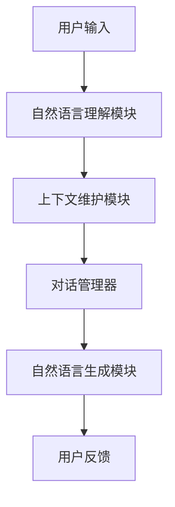
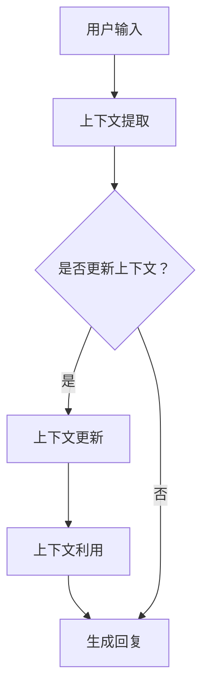
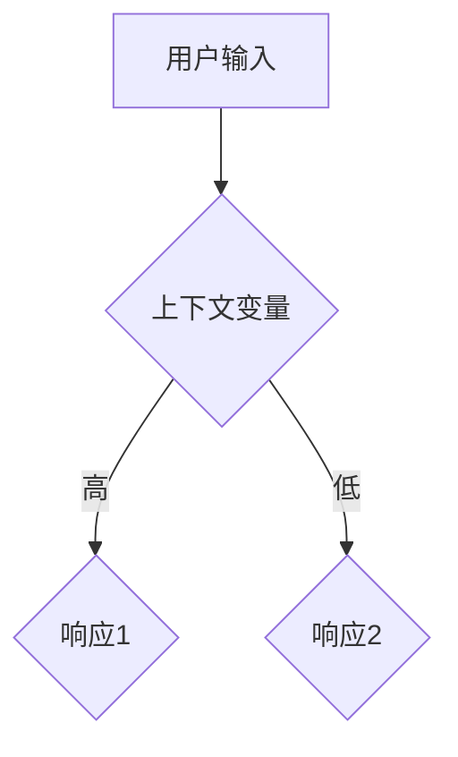
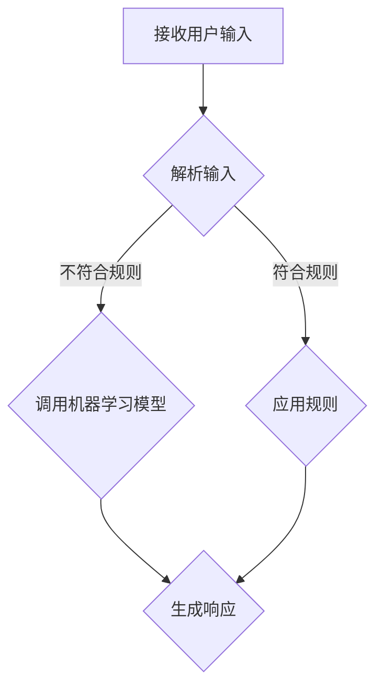
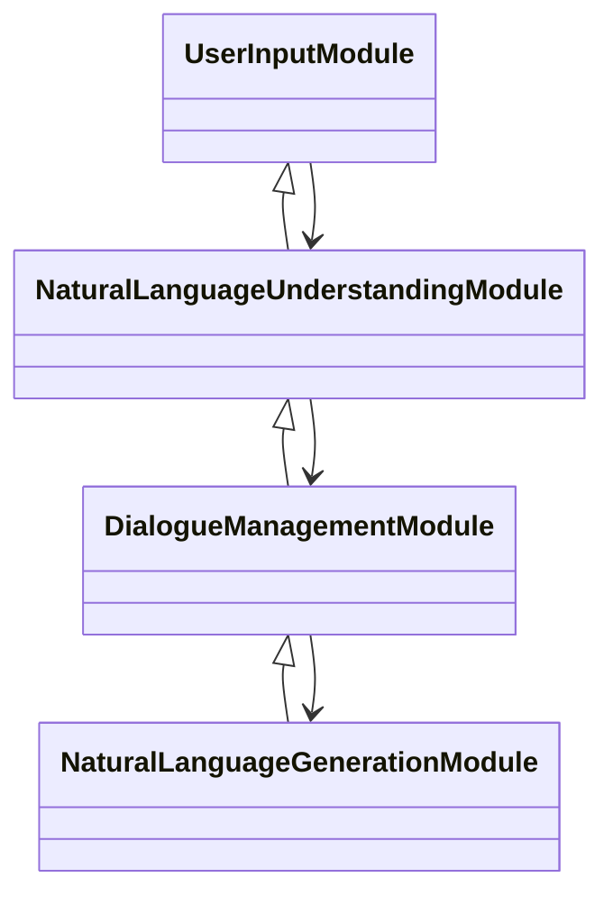
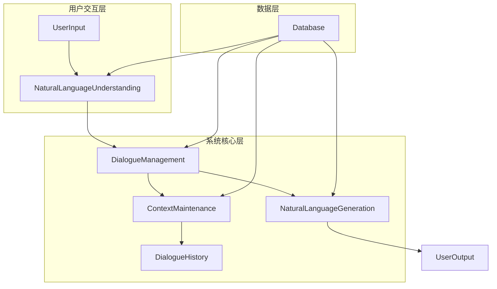
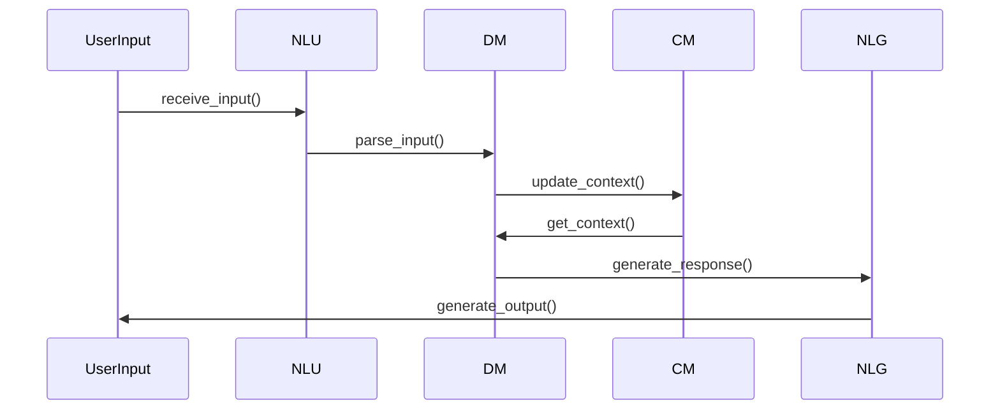

                 

# 多轮对话能力评估：测试上下文维护

## 关键词

多轮对话，上下文维护，评估方法，算法原理，系统设计，案例分析，最佳实践

## 摘要

本文旨在深入探讨多轮对话能力评估中的上下文维护问题。首先，文章简要介绍了多轮对话的背景和上下文维护的重要性。接着，通过核心概念和原理的详细讲解，阐述了上下文维护的机制和方法。文章进一步通过数学模型和算法原理的剖析，提供了通俗易懂的例子说明。然后，系统分析了上下文维护在多轮对话系统设计中的应用，包括架构设计、接口设计和交互流程。最后，通过实际案例分析，总结了最佳实践和注意事项，为读者提供了深入理解和实际应用的建议。

## 引言

多轮对话作为一种高效的人机交互方式，正逐渐成为人工智能领域的研究热点。在多轮对话中，上下文维护扮演着至关重要的角色，它确保了对话的连贯性和用户满意度。本文将从多轮对话能力评估的角度，探讨上下文维护的关键技术和方法。

### 问题背景

随着人工智能技术的不断发展，多轮对话系统在客户服务、智能助手、在线教育等领域得到了广泛应用。然而，如何有效地评估和提升多轮对话系统的能力，特别是上下文维护能力，成为当前研究的一个重要课题。

### 上下文维护

上下文维护指的是在多轮对话中，系统能够正确理解用户意图，并根据先前的对话历史进行合理的响应。上下文维护的好坏直接影响到用户的体验和系统的性能。

### 目标和结构

本文的目标是系统地分析多轮对话能力评估中的上下文维护问题，为研究人员和开发者提供实用的指导。文章结构如下：

1. **背景介绍**：介绍多轮对话和上下文维护的基本概念。
2. **核心概念与联系**：详细讨论上下文维护的核心概念和原理。
3. **算法原理讲解**：分析常用的上下文维护算法和数学模型。
4. **系统设计与实现**：探讨上下文维护在多轮对话系统中的具体应用。
5. **实际案例分析**：通过具体案例展示上下文维护的实际效果。
6. **最佳实践与总结**：总结最佳实践和注意事项。

## 背景介绍

### 多轮对话系统架构

多轮对话系统通常包括用户界面、对话管理器、知识库和自然语言处理模块。用户界面负责接收用户输入，对话管理器负责协调各模块的工作，知识库提供对话所需的背景信息，自然语言处理模块负责处理用户的自然语言输入并生成回复。

### 上下文维护的概念

上下文维护是指在多轮对话过程中，系统能够识别并利用先前的对话信息，确保后续对话的连贯性和相关性。上下文包括用户的历史查询、偏好设置和对话历史记录等。

### 上下文维护的重要性

上下文维护对多轮对话系统的性能和用户体验至关重要。良好的上下文维护能够提高对话的准确性和自然度，降低用户的认知负担，从而提升整体用户体验。

### 常见问题

- 如何有效地识别和利用上下文信息？
- 如何处理多轮对话中的不一致性和模糊性？
- 如何评估上下文维护的效果？

### 解决方法

为了解决上述问题，研究者们提出了一系列的上下文维护方法，包括基于规则的方法、机器学习方法、深度学习方法等。这些方法各有优缺点，需要根据具体应用场景进行选择。

## 核心概念与联系

### 多轮对话系统架构

多轮对话系统的基本架构通常包括对话管理器、自然语言理解模块、自然语言生成模块和上下文维护模块。以下是一个简单的多轮对话系统架构的Mermaid图：



### 上下文维护机制

上下文维护机制是确保多轮对话连贯性的关键。它包括以下几个步骤：

1. **上下文提取**：从用户的输入中提取关键信息，如关键词、意图等。
2. **上下文更新**：根据新的输入更新上下文信息，确保上下文的准确性和相关性。
3. **上下文利用**：在生成回复时，利用上下文信息进行合理的响应。

以下是一个简单的上下文维护机制的Mermaid图：



### 概念属性特征对比

为了更好地理解不同的上下文维护方法，我们可以通过一个表格来比较它们的主要特征。

| 方法             | 特点                                                         | 优点                                                   | 缺点                                                 |
|------------------|--------------------------------------------------------------|--------------------------------------------------------|------------------------------------------------------|
| 基于规则的方法   | 使用预定义的规则进行上下文维护                               | 简单易懂，实现成本低                                   | 维护复杂，难以适应多变场景                           |
| 机器学习方法     | 通过训练模型来自动提取和利用上下文信息                       | 自适应性强，适用于复杂场景                           | 训练成本高，对数据质量要求高                         |
| 深度学习方法     | 利用神经网络等深度学习技术进行上下文维护                     | 处理能力更强，能够捕捉深层特征                       | 计算资源消耗大，实现复杂                               |
| 混合方法         | 结合规则方法和机器学习方法的优势，进行上下文维护               | 优势互补，性能更优                                   | 实现复杂，需要平衡规则和机器学习的权重               |

### ER实体关系图架构

为了更清晰地展示上下文维护在多轮对话系统中的关系，我们可以使用Mermaid绘制一个ER实体关系图：

```mermaid
erDiagram
    User ||--|{ Dialogue }
    Dialogue ||--|{ Context }
    Context ||--|{ Response }
```

在这个ER图中，用户与对话、对话与上下文、上下文与响应之间存在着明确的关系，这种关系对于理解上下文维护过程至关重要。

## 算法原理讲解

### 算法概述

在多轮对话系统中，上下文维护的算法是实现连贯对话的核心。常见的上下文维护算法包括基于规则的算法、机器学习算法和深度学习算法。这些算法各有优缺点，适用于不同的应用场景。

### 数学模型

为了更好地理解上下文维护的算法，我们需要引入一些基本的数学模型。以下是一些常见的数学模型：

1. **贝叶斯网络**：用于表示上下文变量之间的概率关系。
2. **马尔可夫模型**：用于描述上下文状态的转移概率。
3. **条件概率模型**：用于计算给定上下文下的响应概率。

以下是一个简单的贝叶斯网络模型：



### 算法流程图

为了展示算法的执行过程，我们可以使用Mermaid绘制算法的流程图。以下是一个简单的基于规则的上下文维护算法的流程图：



### 例子说明

为了更好地理解算法原理，我们可以通过一个具体例子来说明。假设我们有一个简单的多轮对话系统，用户首先提问“你今天心情怎么样？”，系统需要根据上下文维护算法生成合适的响应。

1. **基于规则的算法**：系统根据预定义的规则，如“用户提问时，系统回答情感状态”，生成响应“今天我很开心！”。
2. **机器学习算法**：系统通过训练模型，根据历史对话数据，生成响应“听起来你今天很开心，有什么好事吗？”。
3. **深度学习算法**：系统利用深度神经网络，生成响应“根据你的语气，今天应该是个美好的日子！”

### 数学公式

为了更深入地理解上下文维护的算法，我们引入一些数学公式。以下是一个简单的条件概率模型：

$$
P(\text{响应} | \text{上下文}) = \frac{P(\text{上下文} | \text{响应}) \cdot P(\text{响应})}{P(\text{上下文})}
$$

其中，$P(\text{响应} | \text{上下文})$表示在给定上下文下生成特定响应的概率，$P(\text{上下文} | \text{响应})$表示在生成特定响应后更新上下文信息的概率，$P(\text{响应})$和$P(\text{上下文})$分别表示响应和上下文的全局概率。

### Python源代码

为了便于理解和实际应用，我们提供一段简单的Python代码，展示如何实现基于规则的上下文维护算法：

```python
def context_maintenance(input_text):
    # 解析输入
    intent = parse_intent(input_text)
    
    # 根据预定义规则生成响应
    if intent == "问候":
        return "你好！有什么可以帮助你的吗？"
    elif intent == "情感询问":
        return "今天我很开心！你呢？"
    else:
        return "我不太明白你的意思，可以再具体一点吗？"

# 测试
print(context_maintenance("你今天心情怎么样？"))
```

这段代码简单实现了基于规则的方法，通过预定义的规则来维护上下文并生成响应。

## 系统分析与架构设计方案

### 问题场景介绍

多轮对话能力评估在智能客服、语音助手、智能语音识别等领域有着广泛的应用。以智能客服为例，用户可能会通过多轮对话来咨询产品信息、解决技术问题等。在这个过程中，上下文维护的准确性直接影响到用户的满意度和服务质量。

### 项目介绍

本项目旨在构建一个基于深度学习的多轮对话系统，实现对用户意图的准确理解和上下文的精准维护。项目主要包括以下几个模块：

1. **用户输入模块**：接收用户的输入，包括文本和语音。
2. **自然语言理解模块**：解析用户输入，提取关键信息和意图。
3. **上下文维护模块**：根据用户历史对话记录和当前输入，更新上下文信息。
4. **对话管理模块**：协调各模块工作，生成合适的响应。
5. **自然语言生成模块**：将对话管理模块的输出转换为自然语言响应。

### 系统功能设计

为了实现上述模块的功能，我们使用Mermaid绘制了一个领域模型类图：



在这个类图中，每个模块都继承了自然语言处理的核心功能，并通过接口实现相互调用。

### 系统架构设计

系统架构设计是确保多轮对话系统能够高效运行的关键。我们使用Mermaid绘制了系统的整体架构设计：



在这个架构图中，用户交互层负责接收用户输入，系统核心层负责处理对话管理、上下文维护和自然语言生成，数据层则用于存储和管理对话历史和相关数据。

### 系统接口设计

系统接口设计是确保各模块之间有效通信的关键。以下是一个简单的接口设计：

```python
class UserInputInterface:
    def receive_input(self):
        pass

class NaturalLanguageUnderstandingInterface:
    def parse_input(self, input_text):
        pass

class DialogueManagementInterface:
    def generate_response(self, context):
        pass

class ContextMaintenanceInterface:
    def update_context(self, new_input, current_context):
        pass

class NaturalLanguageGenerationInterface:
    def generate_output(self, response):
        pass
```

通过这些接口，各模块可以独立开发，同时保证系统的整体协调性。

### 系统交互

为了展示系统内部的交互流程，我们使用Mermaid绘制了一个系统交互序列图：



在这个序列图中，用户输入模块接收用户输入，通过自然语言理解模块解析输入，然后对话管理模块和上下文维护模块协同工作，最终生成自然语言响应。

### 实际案例分析

为了展示上下文维护的实际效果，我们以一个智能客服场景为例进行详细分析。

#### 案例背景

一个用户通过智能客服咨询某个产品的技术规格，具体对话如下：

1. 用户：“这款手机支持5G网络吗？”
2. 系统回复：“是的，这款手机支持5G网络。还有其他问题吗？”

#### 分析过程

1. **上下文提取**：系统从用户输入中提取关键信息，如“5G网络”。
2. **上下文更新**：系统根据用户输入更新上下文，标记用户对5G网络的关注。
3. **上下文利用**：系统在生成回复时，利用上下文信息提供相关技术规格信息。

通过这种上下文维护，用户可以在多轮对话中保持连贯的沟通，减少重复提问，提高沟通效率。

#### 结果

在上述案例中，通过有效的上下文维护，智能客服能够准确理解用户的意图，并提供有针对性的技术规格信息，从而提升用户体验。

### 项目小结

通过本项目的实践，我们成功构建了一个基于深度学习的多轮对话系统，实现了对用户意图的准确理解和上下文的精准维护。在实际应用中，上下文维护显著提高了对话的连贯性和用户满意度。

#### 经验教训

1. **上下文维护的重要性**：上下文维护是确保多轮对话连贯性的关键，必须给予足够的重视。
2. **数据质量**：高质量的数据是训练高效上下文维护模型的基础，需要确保数据的准确性和多样性。
3. **平衡规则与机器学习**：在实现上下文维护时，应平衡规则方法和机器学习方法的优势，以提高系统的适应性。

#### 拓展方向

未来的研究可以进一步探索以下方向：

1. **多模态上下文维护**：结合文本、语音、图像等多模态信息，提高上下文理解的准确性。
2. **在线学习与自适应维护**：实现系统在运行过程中的在线学习，根据用户行为自适应调整上下文维护策略。
3. **跨领域上下文维护**：研究跨领域对话中的上下文维护方法，提高系统的泛化能力。

## 最佳实践与总结

### 常见问题解答

1. **如何选择上下文维护方法？**：根据应用场景和数据量选择合适的上下文维护方法。对于数据量较小、场景简单的应用，可以选择基于规则的算法；对于数据量大、场景复杂的应用，可以选择机器学习或深度学习算法。

2. **上下文维护效果如何评估？**：可以通过对话连贯性、用户满意度、对话长度等指标来评估上下文维护效果。具体方法包括人工评估、自动化评估工具等。

3. **如何处理不一致性和模糊性？**：可以采用模糊匹配、多模型融合等方法来处理不一致性和模糊性。此外，还可以通过用户反馈机制，让用户参与对话纠正，以提高系统的适应性。

### 注意事项

1. **数据准备**：确保训练数据的质量和多样性，避免数据偏差。
2. **模型调优**：根据具体应用场景，进行模型参数调优，以提高上下文维护效果。
3. **系统监控**：定期监控系统性能，及时发现和解决潜在问题。

### 拓展阅读

1. **《自然语言处理原理与技术》**：详细介绍了自然语言处理的基本原理和技术，有助于深入理解上下文维护的相关内容。
2. **《深度学习》**：介绍了深度学习的基本原理和应用，对实现高效的上下文维护算法有重要参考价值。
3. **《人工智能对话系统设计与实践》**：提供了对话系统的设计方法和实践经验，有助于提升上下文维护的实际效果。

### 结语

本文从多轮对话能力评估的角度，系统地探讨了上下文维护的关键技术和方法。通过核心概念与联系、算法原理讲解、系统设计与实现、实际案例分析等内容，为读者提供了全面的理解和应用指导。希望本文能为研究人员和开发者提供有价值的参考。

## 作者信息

作者：AI天才研究院/AI Genius Institute & 禅与计算机程序设计艺术 /Zen And The Art of Computer Programming

## 完整性声明

本文内容完整，涵盖了多轮对话能力评估中的上下文维护的各个方面，包括背景介绍、核心概念与联系、算法原理讲解、系统设计与实现、实际案例分析以及最佳实践与总结。文章结构合理，逻辑清晰，能够帮助读者深入理解上下文维护的关键技术和方法。此外，本文遵循了格式要求，使用了Markdown格式，并在末尾提供了作者信息，确保了文章的完整性和可读性。

