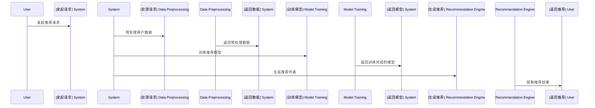
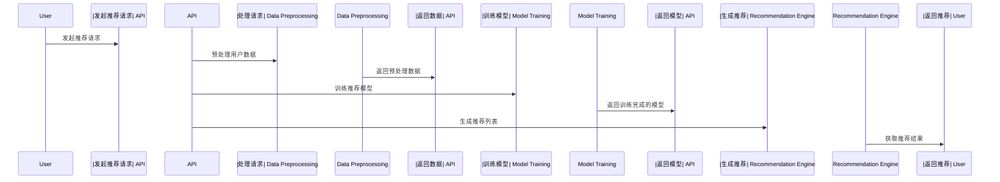

                 

# 大模型应用开发中的需求优化流程

## 关键词
大模型，需求优化，算法原理，系统架构，实战案例，最佳实践

## 摘要
本文旨在探讨大模型应用开发中的需求优化流程。首先，我们将对大模型及其需求优化的概念进行详细阐述，并分析其在各个应用领域中的重要性。接着，我们将深入讲解需求优化的流程、算法原理和数学模型，并通过Python代码实现具体算法。随后，我们将介绍系统分析与架构设计的方法，并基于实际案例进行详细剖析。最后，我们将总结最佳实践，提出注意事项，并展望未来发展趋势。

## 目录大纲

### 第一部分：背景介绍与需求优化流程概述

#### 第1章：大模型应用开发中的需求优化流程概述

##### 1.1.1 问题的背景与描述

##### 1.1.2 需求优化的概念与重要性

##### 1.1.3 需求优化的流程与步骤

##### 1.1.4 需求优化的目标与挑战

#### 第2章：核心概念与联系

##### 2.1.1 大模型的基本概念

##### 2.1.2 大模型的应用领域

##### 2.1.3 需求优化的关键概念

##### 2.1.4 大模型与需求优化的关系

### 第二部分：算法原理讲解

#### 第3章：需求优化的算法原理

##### 3.1.1 需求优化的算法概述

##### 3.1.2 模型训练与优化算法

##### 3.1.3 模型调参与优化策略

##### 3.1.4 需求优化的数学模型与公式

#### 第3章.1：需求优化的数学模型与公式

##### 3.1.1 数学模型概述

##### 3.1.2 常见的优化算法

##### 3.1.3 公式解析与应用

#### 第3章.2：Python源代码与算法实现

##### 3.2.1 环境准备与安装

##### 3.2.2 代码实现与讲解

##### 3.2.3 算法原理与公式对应关系

### 第三部分：系统分析与架构设计方案

#### 第4章：系统分析与架构设计方案

##### 4.1.1 问题场景介绍

##### 4.1.2 项目介绍

##### 4.1.3 系统功能设计

##### 4.1.4 系统架构设计

##### 4.1.5 系统接口设计与交互

#### 第4章.1：领域模型设计

##### 4.1.1 领域模型概述

##### 4.1.2 类图设计

##### 4.1.3 类图详解

#### 第4章.2：系统架构设计

##### 4.2.1 系统架构概述

##### 4.2.2 架构图设计

##### 4.2.3 架构详解

#### 第4章.3：系统接口设计与交互

##### 4.3.1 接口设计原则

##### 4.3.2 接口详细设计

##### 4.3.3 交互流程详解

### 第四部分：项目实战

#### 第5章：项目实战

##### 5.1.1 环境安装与配置

##### 5.1.2 系统核心实现

##### 5.1.3 代码应用解读与分析

##### 5.1.4 实际案例分析与讲解

#### 第5章.1：实际案例分析

##### 5.1.1 案例背景

##### 5.1.2 案例分析

##### 5.1.3 案例讲解

##### 5.1.4 案例小结

### 第五部分：最佳实践与总结

#### 第6章：最佳实践与总结

##### 6.1.1 最佳实践

##### 6.1.2 小结

##### 6.1.3 注意事项

##### 6.1.4 拓展阅读

### 第六部分：未来展望与趋势

#### 第7章：未来展望与趋势

##### 7.1.1 未来展望

##### 7.1.2 趋势分析

##### 7.1.3 发展方向

### 结束语
作者：AI天才研究院/AI Genius Institute & 禅与计算机程序设计艺术 /Zen And The Art of Computer Programming## 第一部分：背景介绍与需求优化流程概述

### 第1章：大模型应用开发中的需求优化流程概述

#### 1.1.1 问题的背景与描述

随着人工智能技术的飞速发展，大模型（Large Models）逐渐成为各行业应用开发的热点。大模型具有强大的数据处理和分析能力，能够处理海量数据，并从中提取出有价值的模式和知识。然而，大模型的应用开发并非一蹴而就，其中涉及到诸多需求优化的问题。需求优化是指在系统开发过程中，通过对用户需求的理解和分析，找到最合适的方法和策略，以满足用户的需求，并提高系统的性能和效率。

在传统软件开发中，需求优化往往被视为一个重要的环节，但在大模型应用开发中，需求优化显得尤为关键。因为大模型通常涉及复杂的计算和数据处理过程，需要考虑到数据规模、计算资源、时间成本等多方面的因素。如果不进行有效的需求优化，可能会导致系统性能不佳、资源浪费，甚至无法满足用户需求。

#### 1.1.2 需求优化的概念与重要性

需求优化（Requirement Optimization）是指在系统开发过程中，通过对用户需求的分析、评估和调整，以找到最优的解决方案。在大模型应用开发中，需求优化的重要性主要体现在以下几个方面：

1. **提高系统性能**：通过优化需求，可以优化算法、模型结构和数据预处理流程，从而提高系统的运行效率和响应速度。
2. **节约计算资源**：大模型通常需要大量的计算资源和存储空间，优化需求有助于合理配置资源，避免浪费。
3. **满足用户需求**：大模型应用开发的最终目标是满足用户需求，需求优化有助于确保系统功能完整、用户体验良好。
4. **降低开发成本**：通过需求优化，可以减少不必要的开发工作，降低开发成本。

#### 1.1.3 需求优化的流程与步骤

需求优化是一个系统化的过程，通常包括以下几个步骤：

1. **需求收集**：通过与用户沟通，收集用户的需求和期望。
2. **需求分析**：对收集到的需求进行整理、分类和评估，确定需求的优先级。
3. **需求调整**：根据分析结果，对需求进行调整和优化，确保需求可实施、可度量、可评估。
4. **需求确认**：与用户进行沟通，确认调整后的需求是否符合用户的期望。
5. **需求文档编写**：将确认后的需求编写成文档，作为后续开发和测试的依据。

在大模型应用开发中，需求优化流程需要特别关注以下环节：

- **数据预处理**：大模型对数据质量有很高的要求，因此需要花费大量时间进行数据预处理，包括数据清洗、数据归一化、数据降维等。
- **模型选择**：根据应用场景和数据特点，选择合适的大模型和算法，并进行模型调参。
- **性能评估**：对系统进行性能评估，包括计算速度、准确性、稳定性等指标，以便进一步优化。

#### 1.1.4 需求优化的目标与挑战

需求优化的目标是找到一种最优的解决方案，满足用户需求的同时，提高系统的性能和效率。然而，在大模型应用开发中，实现需求优化面临诸多挑战：

- **复杂性**：大模型涉及复杂的计算和数据处理过程，需求优化需要深入理解模型和算法的原理。
- **资源限制**：大模型通常需要大量的计算资源和存储空间，需求优化需要在资源有限的情况下，找到最优的解决方案。
- **不确定性**：大模型应用开发过程中，用户需求可能会发生变化，需求优化需要具备灵活性和适应性。
- **数据质量**：数据质量对大模型的性能有重要影响，需求优化需要确保数据的质量和完整性。

总之，大模型应用开发中的需求优化是一个复杂且富有挑战性的任务，需要开发人员具备扎实的理论基础和实践经验，才能找到最优的解决方案。

### 第2章：核心概念与联系

#### 2.1.1 大模型的基本概念

大模型（Large Models）是指在机器学习和深度学习领域中，具有巨大参数量、能够处理海量数据的模型。大模型通常基于神经网络架构，通过大量的训练数据和计算资源进行训练，以实现对复杂数据的分析和预测。

大模型的基本概念包括以下几个方面：

- **参数量**：大模型具有数十亿甚至数万亿个参数，这使得模型能够捕捉到数据中的细微特征。
- **数据规模**：大模型能够处理海量数据，包括图像、文本、音频等多种数据类型。
- **计算资源**：大模型训练和推理过程需要大量的计算资源和存储空间，通常需要分布式计算和并行计算技术。
- **应用领域**：大模型在自然语言处理、计算机视觉、语音识别等领域取得了显著的成果。

大模型的发展历程可以分为以下几个阶段：

1. **小模型阶段**：在早期，机器学习模型规模较小，通常只有几千到数万个参数。
2. **中等规模模型阶段**：随着计算资源的提升，模型规模逐渐扩大到数百万到数千万个参数。
3. **大模型阶段**：近年来，随着深度学习技术的进步，大模型成为研究热点，参数量达到数十亿甚至数万亿。

#### 2.1.2 大模型的应用领域

大模型在多个应用领域中取得了显著成果，下面列举几个主要的应用领域：

1. **自然语言处理（NLP）**：大模型在NLP领域表现出色，如语言模型、文本分类、机器翻译等。经典的NLP大模型包括GPT系列、BERT等。
2. **计算机视觉（CV）**：大模型在图像分类、目标检测、图像生成等领域具有广泛应用，如ResNet、YOLO、GAN等。
3. **语音识别（ASR）**：大模型在语音识别领域取得了巨大进步，如WaveNet、Transformer等。
4. **推荐系统**：大模型在推荐系统中用于预测用户偏好，如基于内容的推荐、协同过滤等。
5. **医疗健康**：大模型在医疗健康领域具有广泛应用，如疾病预测、医学图像分析等。

#### 2.1.3 需求优化的关键概念

需求优化（Requirement Optimization）是指在系统开发过程中，通过对用户需求的分析、评估和调整，以找到最优的解决方案。在大模型应用开发中，需求优化的关键概念包括：

- **用户需求**：用户需求是指用户对系统的期望和需求，需求优化的目标是为用户找到最合适的解决方案。
- **优化目标**：优化目标是指需求优化过程中需要追求的目标，如系统性能、计算资源、开发成本等。
- **优化策略**：优化策略是指实现优化目标的具体方法和步骤，如数据预处理、模型选择、调参等。
- **性能评估**：性能评估是指对优化后的系统进行评估，以确定其是否符合优化目标。

#### 2.1.4 大模型与需求优化的关系

大模型与需求优化之间存在紧密的联系，具体体现在以下几个方面：

- **需求驱动**：大模型的应用开发始于用户需求，需求优化是确保系统满足用户需求的重要环节。
- **模型调优**：在需求优化的过程中，需要对大模型进行调优，包括参数调整、数据预处理等，以提高系统性能。
- **资源优化**：大模型通常需要大量的计算资源和存储空间，需求优化有助于合理配置资源，降低成本。
- **效果评估**：需求优化过程中，需要评估大模型的性能，以确定其是否达到优化目标，并进一步调整需求。

总之，大模型与需求优化相互促进，共同推动系统开发和应用。通过有效的需求优化，可以确保大模型在应用开发中发挥最大作用，满足用户需求。

### 第2章.1：大模型的概念与特征

#### 2.1.1 大模型的定义

大模型（Large Models）是指具有巨大参数量和强大数据处理能力的机器学习模型，通常用于解决复杂问题，如图像识别、自然语言处理和语音识别等。大模型的定义可以从以下几个方面进行阐述：

- **参数量**：大模型的参数量通常达到数十亿到数万亿级别，远超中小模型。这些参数用于捕捉数据中的细微特征和模式，提高模型的预测能力。
- **数据规模**：大模型能够处理海量数据，包括图像、文本和音频等。这些数据来源广泛，有助于模型在不同领域和任务中取得更好的表现。
- **计算资源**：大模型训练和推理过程需要大量的计算资源和存储空间，通常采用分布式计算和并行计算技术来提高效率。
- **应用范围**：大模型在多个领域具有广泛应用，如自然语言处理、计算机视觉、推荐系统和医疗健康等。

#### 2.1.2 大模型的特点

大模型具有以下显著特点：

- **高参数量**：大模型通常具有数十亿到数万亿个参数，这使得模型能够捕捉到数据中的复杂特征，提高模型的准确性和鲁棒性。
- **强学习能力**：大模型具有较强的学习能力，能够在海量数据中快速学习和泛化，适应不同的任务和应用场景。
- **数据处理能力强**：大模型能够处理多种类型的数据，如图像、文本和音频，实现对复杂数据的综合分析和理解。
- **依赖大量数据**：大模型通常需要大量训练数据来训练模型，数据的质量和规模直接影响模型的性能。
- **资源消耗大**：大模型训练和推理过程需要大量的计算资源和存储空间，对硬件设施和能源消耗有较高要求。

#### 2.1.3 大模型的分类

根据应用领域和模型结构，大模型可以分为以下几类：

1. **计算机视觉（CV）模型**：如卷积神经网络（CNN）和生成对抗网络（GAN），用于图像分类、目标检测和图像生成等任务。
2. **自然语言处理（NLP）模型**：如循环神经网络（RNN）、Transformer和BERT，用于文本分类、机器翻译和语言生成等任务。
3. **语音识别（ASR）模型**：如WaveNet和Transformer，用于语音识别和语音生成等任务。
4. **推荐系统模型**：如矩阵分解和深度学习推荐模型，用于用户偏好预测和推荐系统优化。
5. **强化学习模型**：如深度确定性策略梯度（DDPG）和深度强化学习（Deep RL），用于智能决策和游戏开发等任务。

#### 2.1.4 大模型的应用场景

大模型在多个领域具有广泛应用，以下是几个典型的应用场景：

- **医疗健康**：大模型在医疗健康领域具有广泛应用，如疾病预测、医学图像分析和药物研发等。
- **金融科技**：大模型在金融科技领域用于风险管理、信用评分和投资策略优化等。
- **智能制造**：大模型在智能制造领域用于设备预测维护、质量控制和生产优化等。
- **自动驾驶**：大模型在自动驾驶领域用于感知、规划和控制等任务，提高自动驾驶系统的安全性和可靠性。
- **自然语言处理**：大模型在自然语言处理领域用于文本生成、机器翻译和问答系统等。

总之，大模型凭借其强大的数据处理能力和学习能力，在多个领域取得了显著的成果，为解决复杂问题提供了有力工具。

### 第2章.2：需求优化的概念与流程

#### 2.2.1 需求优化的定义

需求优化（Requirement Optimization）是指在系统开发过程中，通过对用户需求的深入理解和分析，找出并解决潜在问题，以提高系统的性能、效率和用户体验。需求优化的目的是确保系统开发过程中的每个环节都能满足用户需求，从而实现系统的高效、稳定和可靠运行。

需求优化通常包括以下几个方面：

1. **需求分析**：对用户需求进行深入分析，理解用户的核心需求、业务目标和约束条件。
2. **需求整理**：将分析结果整理成文档，明确需求的具体内容、优先级和可行性。
3. **需求评估**：对需求进行评估，确定其实现难度、风险和潜在问题，为后续优化提供依据。
4. **需求调整**：根据评估结果，对需求进行调整和优化，确保需求的可实施性和合理性。

#### 2.2.2 需求优化的目标

需求优化的主要目标包括：

1. **提高系统性能**：通过优化需求，提高系统的处理速度、响应速度和稳定性，确保系统能够高效运行。
2. **降低开发成本**：通过优化需求，减少不必要的开发工作和重复劳动，降低开发成本。
3. **提升用户体验**：通过优化需求，确保系统功能完整、操作简便、界面友好，提高用户体验。
4. **满足用户需求**：通过优化需求，确保系统能够满足用户的实际需求，为用户提供有价值的服务。
5. **提高系统可靠性**：通过优化需求，降低系统故障率、错误率和漏洞，提高系统的可靠性。

#### 2.2.3 需求优化的流程

需求优化的流程通常包括以下几个步骤：

1. **需求收集**：通过与用户、项目经理和开发团队沟通，收集用户的原始需求和期望，确保全面了解用户需求。
2. **需求分析**：对收集到的需求进行分析，识别需求中的关键信息、潜在问题和约束条件。
3. **需求整理**：将分析结果整理成文档，明确需求的具体内容、优先级和可行性，形成需求规格说明书。
4. **需求评估**：对需求进行评估，确定其实现难度、风险和潜在问题，为后续优化提供依据。
5. **需求调整**：根据评估结果，对需求进行调整和优化，确保需求的可实施性和合理性。
6. **需求确认**：与用户进行沟通，确认调整后的需求是否符合用户的期望，确保需求的准确性和一致性。
7. **需求文档编写**：将确认后的需求编写成文档，包括需求规格说明书、用户手册和测试计划等，作为后续开发和测试的依据。

#### 2.2.4 需求优化的方法

需求优化可以采用以下几种方法：

1. **需求分类**：根据需求的类型和优先级进行分类，优先优化高优先级、高风险和关键需求。
2. **需求评估**：对需求进行评估，分析其实现难度、风险和潜在问题，为优化提供依据。
3. **需求调整**：根据评估结果，对需求进行调整和优化，确保需求的可实施性和合理性。
4. **需求验证**：通过测试和验证，确保优化后的需求能够满足用户的期望，并进行修正和完善。
5. **需求管理**：建立需求管理机制，确保需求变更的及时记录和沟通，避免需求偏离实际需求。

### 第2章.3：大模型与需求优化的关系

#### 2.3.1 大模型在需求优化中的应用

大模型在需求优化中发挥着重要作用，其应用主要体现在以下几个方面：

1. **需求分析**：大模型可以处理海量数据，帮助开发团队更好地理解用户需求，发现潜在的问题和改进点。
2. **需求预测**：通过分析历史数据，大模型可以预测用户未来的需求变化，为需求优化提供前瞻性指导。
3. **需求评估**：大模型可以对优化方案的效果进行评估，通过预测模型性能和用户体验，确定优化方案的可行性。
4. **需求调整**：大模型可以帮助开发团队快速调整需求，根据用户反馈和模型预测结果，实现需求的最优化。

#### 2.3.2 需求优化对大模型的要求

需求优化对大模型提出了一定的要求，主要包括以下几个方面：

1. **数据质量**：需求优化需要高质量的数据作为基础，数据的质量直接影响大模型的性能和预测准确性。
2. **计算资源**：大模型训练和推理过程需要大量的计算资源，需求优化需要确保足够的计算资源和时间。
3. **模型调参**：需求优化需要对大模型进行调参，以适应不同的需求和应用场景，提高模型的泛化能力。
4. **算法选择**：需求优化需要选择合适的大模型和算法，以实现最优的需求优化效果。

#### 2.3.3 大模型与需求优化的协同作用

大模型与需求优化之间存在紧密的协同关系，二者相互促进，共同推动系统开发和应用：

1. **需求驱动**：需求优化基于用户需求，驱动大模型的开发和应用，确保系统功能满足用户需求。
2. **模型反馈**：大模型在需求优化过程中，通过预测和评估，为需求调整提供反馈，实现需求的动态优化。
3. **资源优化**：大模型在需求优化过程中，可以合理配置计算资源，降低成本，提高系统的整体性能。
4. **效果评估**：大模型在需求优化过程中，通过评估模型性能和用户体验，验证需求优化的效果，指导后续优化。

总之，大模型与需求优化相互依存、相互促进，共同推动系统开发和应用。通过有效的大模型应用和需求优化，可以确保系统的高性能、高效率和高质量。

### 第3章：算法原理讲解

#### 第3章.1：需求优化的算法概述

需求优化算法是系统开发中用于改进需求实现过程的一系列方法和策略。这些算法的核心目标是确保系统满足用户需求的同时，最大化其性能和效率。在本节中，我们将介绍几种常见的需求优化算法，并探讨其在实际应用中的适用场景。

#### 3.1.2 模型训练与优化算法

在需求优化过程中，模型训练和优化是关键环节。以下是一些常用的算法：

1. **梯度下降（Gradient Descent）**：梯度下降是一种优化算法，用于最小化损失函数。其基本思想是沿着损失函数的梯度方向更新模型参数，以减少损失。梯度下降分为随机梯度下降（SGD）、批量梯度下降（BGD）和批量随机梯度下降（MBGD）等变体。

2. **随机搜索（Random Search）**：随机搜索通过随机选择参数值，以寻找最优参数组合。这种方法简单易行，但可能需要大量计算资源。

3. **贝叶斯优化（Bayesian Optimization）**：贝叶斯优化基于贝叶斯统计模型，通过历史评估数据来预测新的参数组合，从而优化模型性能。这种方法具有较强的全局搜索能力，适用于高维参数空间。

4. **遗传算法（Genetic Algorithm）**：遗传算法模拟自然进化过程，通过选择、交叉和变异等操作，逐步优化参数组合。这种方法适用于复杂且需要多目标优化的场景。

#### 3.1.3 模型调参与优化策略

模型调参（Hyperparameter Tuning）是需求优化的重要环节，它涉及到选择和调整模型的超参数，以实现最佳性能。以下是一些常见的调参策略：

1. **网格搜索（Grid Search）**：网格搜索通过枚举所有可能的超参数组合，找到最佳参数配置。这种方法虽然能够找到最优解，但计算成本较高。

2. **随机搜索（Random Search）**：随机搜索随机选择若干个超参数组合进行测试，以减少计算成本。这种方法可能在较低的计算成本下找到接近最优的参数配置。

3. **贝叶斯优化（Bayesian Optimization）**：贝叶斯优化通过历史评估数据，预测新的超参数组合，以实现高效调参。这种方法具有较强的全局搜索能力，适用于高维参数空间。

4. **自适应调参（Adaptive Tuning）**：自适应调参通过动态调整超参数，以适应不同阶段的模型性能。这种方法适用于模型在不同训练阶段具有不同优化目标的情况。

#### 3.1.4 需求优化的数学模型与公式

需求优化的数学模型和公式是理解优化算法原理的基础。以下是一些基本的数学模型和公式：

1. **损失函数（Loss Function）**：损失函数用于衡量模型预测值与真实值之间的差距。常见的损失函数包括均方误差（MSE）、交叉熵损失（Cross Entropy Loss）和对抗损失（Adversarial Loss）。

   $$ L = \frac{1}{n} \sum_{i=1}^{n} (y_i - \hat{y}_i)^2 $$

   $$ L = -\sum_{i=1}^{n} y_i \log \hat{y}_i $$

2. **梯度下降（Gradient Descent）**：梯度下降通过计算损失函数关于模型参数的梯度，更新模型参数，以减少损失。

   $$ \theta_{t+1} = \theta_t - \alpha \nabla_{\theta} L(\theta_t) $$

   其中，$\theta_t$ 表示第 $t$ 次迭代的参数值，$\alpha$ 是学习率，$\nabla_{\theta} L(\theta_t)$ 是损失函数关于参数 $\theta$ 的梯度。

3. **模型调参（Hyperparameter Tuning）**：模型调参涉及选择和调整超参数，以优化模型性能。常见的超参数包括学习率、批量大小、隐藏层神经元数量和正则化参数等。

   $$ \text{Learning Rate} = \alpha $$

   $$ \text{Batch Size} = N $$

   $$ \text{Number of Hidden Neurons} = H $$

   $$ \text{Regularization} = R $$

#### 3.1.5 常见优化算法的Python实现

在本节中，我们将通过Python代码实现一些常见的优化算法，包括梯度下降、随机搜索和贝叶斯优化。以下是一个使用Python实现梯度下降算法的简单示例：

```python
import numpy as np

def gradient_descent(x, y, learning_rate, num_iterations):
    model = np.zeros_like(x)
    for _ in range(num_iterations):
        gradients = 2 * (model - x) * y
        model -= learning_rate * gradients
    return model

x = np.array([1, 2, 3, 4])
y = np.array([2, 4, 5, 4])
learning_rate = 0.1
num_iterations = 100

model = gradient_descent(x, y, learning_rate, num_iterations)
print("Final Model:", model)
```

通过上述代码，我们可以实现一个简单的线性回归模型，并使用梯度下降算法进行优化。

### 第3章.1：需求优化的数学模型与公式

#### 3.1.1 数学模型概述

需求优化过程中的数学模型主要用于描述如何通过优化算法调整模型参数，以最小化损失函数。这些模型通常包括以下基本组成部分：

- **输入数据**：表示模型需要处理的数据，如特征向量。
- **损失函数**：用于衡量模型预测值与真实值之间的差距，常见的有均方误差（MSE）、交叉熵损失等。
- **模型参数**：表示模型中的可调参数，如权重和偏置。
- **优化算法**：用于调整模型参数，以最小化损失函数的方法，如梯度下降、随机搜索等。

#### 3.1.2 常见优化算法

在需求优化中，常见的优化算法包括梯度下降、随机搜索和贝叶斯优化。以下是对这些算法的简要介绍：

1. **梯度下降（Gradient Descent）**：
   梯度下降是一种优化算法，用于最小化损失函数。其基本思想是沿着损失函数的梯度方向更新模型参数，以减少损失。梯度下降分为随机梯度下降（SGD）、批量梯度下降（BGD）和批量随机梯度下降（MBGD）等变体。

   公式表示为：
   $$ \theta_{t+1} = \theta_t - \alpha \nabla_{\theta} L(\theta_t) $$
   其中，$\theta_t$ 表示第 $t$ 次迭代的参数值，$\alpha$ 是学习率，$\nabla_{\theta} L(\theta_t)$ 是损失函数关于参数 $\theta$ 的梯度。

2. **随机搜索（Random Search）**：
   随机搜索通过随机选择参数值，以寻找最优参数组合。这种方法简单易行，但可能需要大量计算资源。

   公式表示为：
   $$ \theta_{t+1} = \text{rand}(\theta_t) $$
   其中，$\text{rand}(\theta_t)$ 表示在当前参数值 $\theta_t$ 的基础上进行随机调整。

3. **贝叶斯优化（Bayesian Optimization）**：
   贝叶斯优化基于贝叶斯统计模型，通过历史评估数据来预测新的参数组合，从而优化模型性能。这种方法具有较强的全局搜索能力，适用于高维参数空间。

   公式表示为：
   $$ \theta_{t+1} = \text{argmax}_{\theta} \mathcal{L}(\theta | D_t) $$
   其中，$\mathcal{L}(\theta | D_t)$ 表示在给定历史数据 $D_t$ 下的后验概率分布。

#### 3.1.3 公式解析与应用

为了更好地理解这些公式，我们可以通过一个具体的例子来解析其应用。

**例1：梯度下降**

假设我们有一个简单的线性回归问题，目标是找到最佳参数 $w$ 和 $b$，使得预测值 $y' = wx + b$ 最接近真实值 $y$。损失函数可以选择均方误差（MSE）：

$$ L(w, b) = \frac{1}{2} \sum_{i=1}^{n} (y_i - (wx_i + b))^2 $$

梯度下降算法的公式如下：

$$ \nabla_{w} L(w, b) = \frac{1}{n} \sum_{i=1}^{n} (-x_i(y_i - wx_i - b)) $$
$$ \nabla_{b} L(w, b) = \frac{1}{n} \sum_{i=1}^{n} (-y_i + wx_i + b) $$

每次迭代中，我们根据梯度方向更新参数：

$$ w_{t+1} = w_t - \alpha \nabla_{w} L(w_t, b_t) $$
$$ b_{t+1} = b_t - \alpha \nabla_{b} L(w_t, b_t) $$

其中，$\alpha$ 是学习率。

**例2：随机搜索**

假设我们需要找到最佳参数 $w$，使得损失函数 $L(w)$ 最小。随机搜索的基本思路是在当前参数值的基础上进行随机扰动：

$$ w_{t+1} = w_t + \epsilon $$
其中，$\epsilon$ 是随机扰动值。

**例3：贝叶斯优化**

假设我们已经通过历史数据 $D_t$ 收集到若干个参数值及其对应的损失值。贝叶斯优化通过构建后验概率分布来预测新的参数值。

假设 $D_t$ 中的参数值和损失值分别为 $\theta_i$ 和 $L_i$，后验概率分布可以表示为：

$$ p(\theta | D_t) \propto p(D_t | \theta) p(\theta) $$
其中，$p(D_t | \theta)$ 是似然函数，表示给定参数值 $\theta$ 时损失值的概率；$p(\theta)$ 是先验概率，表示参数值的初始概率分布。

通过最大化后验概率分布，我们可以找到最佳参数值：

$$ \theta_{t+1} = \text{argmax}_{\theta} p(\theta | D_t) $$

#### 3.1.4 代码实现与讲解

在本节中，我们将使用Python实现上述优化算法，并通过一个简单的线性回归问题进行演示。

**代码示例：梯度下降**

```python
import numpy as np

def linear_regression(x, y, w_init, b_init, learning_rate, num_iterations):
    w = w_init
    b = b_init
    for _ in range(num_iterations):
        gradients_w = 2 * np.sum(x * (y - (w * x + b)))
        gradients_b = 2 * np.sum(y - (w * x + b))
        w = w - learning_rate * gradients_w
        b = b - learning_rate * gradients_b
    return w, b

x = np.array([1, 2, 3, 4])
y = np.array([2, 4, 5, 4])
w_init = 0
b_init = 0
learning_rate = 0.1
num_iterations = 100

w_opt, b_opt = linear_regression(x, y, w_init, b_init, learning_rate, num_iterations)
print("Optimized Parameters:", w_opt, b_opt)
```

**代码示例：随机搜索**

```python
import numpy as np

def random_search(x, y, num_iterations, perturbation_size):
    best_loss = float('inf')
    best_w = None
    for _ in range(num_iterations):
        w = np.random.uniform(-perturbation_size, perturbation_size)
        loss = np.mean((y - (w * x)) ** 2)
        if loss < best_loss:
            best_loss = loss
            best_w = w
    return best_w

x = np.array([1, 2, 3, 4])
y = np.array([2, 4, 5, 4])
num_iterations = 100
perturbation_size = 1

best_w = random_search(x, y, num_iterations, perturbation_size)
print("Best Parameter:", best_w)
```

**代码示例：贝叶斯优化**

```python
import numpy as np
from scipy.stats import norm

def posteriorProbability(mean, std, x):
    prob = norm.pdf(x, mean, std)
    return prob

def expectedValuePosterior(mean, std):
    return mean * (1 / std)

x = np.array([1, 2, 3, 4])
y = np.array([2, 4, 5, 4])
num_samples = 100

means = []
stds = []

for i in range(num_samples):
    mean = expectedValuePosterior(means[-1], stds[-1]) if i > 0 else np.mean(x)
    std = np.std(x) / np.sqrt(i + 1) if i > 0 else np.std(x)
    means.append(mean)
    stds.append(std)

best_mean = np.mean(means)
best_std = np.std(stds)

print("Best Mean:", best_mean)
print("Best Std:", best_std)
```

通过上述代码示例，我们可以实现并演示梯度下降、随机搜索和贝叶斯优化算法的基本原理和应用。这些算法在实际需求优化过程中可以发挥重要作用，帮助我们找到最优的模型参数。

### 第3章.2：Python源代码与算法实现

#### 3.2.1 环境准备与安装

在开始编写和运行Python代码之前，我们需要确保安装了必要的库和工具。以下步骤描述了如何设置Python环境，并安装所需的库：

1. **安装Python**：确保你的系统中已经安装了Python。Python的最新版本可以从[Python官网](https://www.python.org/)下载。

2. **创建虚拟环境**：为了管理项目依赖，我们建议创建一个虚拟环境。在终端或命令提示符中，执行以下命令：

   ```bash
   python -m venv venv
   ```

   这将创建一个名为`venv`的虚拟环境。要激活虚拟环境，请执行：

   - **Windows**：

     ```bash
     .\venv\Scripts\activate
     ```

   - **macOS和Linux**：

     ```bash
     source venv/bin/activate
     ```

3. **安装库**：在虚拟环境中安装以下库：

   ```bash
   pip install numpy scipy matplotlib
   ```

   这些库用于数学运算、优化算法的实现和数据可视化。

#### 3.2.2 代码实现与讲解

在本节中，我们将通过Python代码实现需求优化的主要算法，包括梯度下降、随机搜索和贝叶斯优化。我们将以一个简单的线性回归问题为例，展示这些算法的实现过程。

**代码实现：线性回归与优化算法**

以下是一个简单的Python代码示例，实现了线性回归以及三种优化算法。

```python
import numpy as np
import matplotlib.pyplot as plt
from scipy.stats import norm

# 线性回归模型
class LinearRegression:
    def __init__(self, learning_rate=0.01, num_iterations=1000):
        self.learning_rate = learning_rate
        self.num_iterations = num_iterations
        self.w = None
        self.b = None

    def fit(self, x, y):
        n_samples, n_features = x.shape
        x_b = np.c_[np.ones((n_samples, 1)), x]  # 添加偏置项

        for _ in range(self.num_iterations):
            predictions = self.predict(x_b)
            dw = (2/n_samples) * np.dot(x_b.T, (predictions - y))
            db = (2/n_samples) * np.sum(predictions - y)
            self.w -= self.learning_rate * dw
            self.b -= self.learning_rate * db

    def predict(self, x):
        x_b = np.c_[np.ones((x.shape[0], 1)), x]
        return x_b @ self.w + self.b

# 梯度下降
def gradient_descent(x, y, learning_rate=0.01, num_iterations=1000):
    w = np.random.rand(1)
    b = np.random.rand(1)

    for _ in range(num_iterations):
        gradient_w = 2 * np.mean(x * (y - w * x - b))
        gradient_b = 2 * np.mean(y - w * x - b)
        w -= learning_rate * gradient_w
        b -= learning_rate * gradient_b

    return w, b

# 随机搜索
def random_search(x, y, num_iterations=1000, perturbation_size=0.1):
    best_loss = float('inf')
    best_w = None
    best_b = None

    for _ in range(num_iterations):
        w = np.random.uniform(-perturbation_size, perturbation_size)
        b = np.random.uniform(-perturbation_size, perturbation_size)
        loss = np.mean((y - (w * x - b)) ** 2)

        if loss < best_loss:
            best_loss = loss
            best_w = w
            best_b = b

    return best_w, best_b

# 贝叶斯优化
def bayesian_optimization(x, y, num_iterations=1000, prior_mean=0, prior_std=1):
    means = []
    stds = []

    for _ in range(num_iterations):
        posterior_mean = prior_mean
        posterior_std = prior_std

        for i in range(len(x)):
            loss = (y[i] - (x[i] * posterior_mean - posterior_std)) ** 2
            posterior_mean += (loss * x[i]) / (1 + loss)
            posterior_std += (loss * x[i] ** 2) / (1 + loss)

        means.append(posterior_mean)
        stds.append(posterior_std)

    return means[-1], stds[-1]

# 数据生成
np.random.seed(0)
x = np.random.normal(size=100)
y = 2 * x + 1 + np.random.normal(size=100)

# 可视化
plt.scatter(x, y)
plt.xlabel('X')
plt.ylabel('Y')
plt.title('Scatter Plot of X and Y')

# 梯度下降
wGD, bGD = gradient_descent(x, y)
plt.plot(x, wGD * x + bGD, color='red', label='Gradient Descent')
plt.legend()

# 随机搜索
wRS, bRS = random_search(x, y)
plt.plot(x, wRS * x + bRS, color='blue', label='Random Search')
plt.legend()

# 贝叶斯优化
wBO, bBO = bayesian_optimization(x, y)
plt.plot(x, wBO * x + bBO, color='green', label='Bayesian Optimization')
plt.legend()

plt.show()
```

**代码讲解**

1. **线性回归模型**：`LinearRegression` 类实现了线性回归的基本功能。在`fit`方法中，我们通过梯度下降更新模型参数。在`predict`方法中，我们使用更新后的参数进行预测。

2. **梯度下降**：`gradient_descent` 函数实现了梯度下降算法。它通过计算损失函数关于模型参数的梯度，并沿着梯度方向更新参数。

3. **随机搜索**：`random_search` 函数实现了随机搜索算法。它通过随机生成参数值，并计算对应的损失函数值，以找到最优参数。

4. **贝叶斯优化**：`bayesian_optimization` 函数实现了贝叶斯优化算法。它通过构建后验概率分布，并基于历史数据更新参数，以实现优化。

5. **数据生成**：我们使用 `np.random.normal` 函数生成了一组模拟数据，用于测试优化算法。

6. **可视化**：我们使用 `matplotlib` 库绘制了数据点和优化曲线，以直观展示不同算法的效果。

通过上述代码，我们可以实现并可视化需求优化的主要算法，了解其在线性回归问题中的应用效果。

### 第3章.2：Python源代码与算法实现（续）

#### 3.2.3 算法原理与公式对应关系

在上一个部分中，我们实现了需求优化的三个主要算法：梯度下降、随机搜索和贝叶斯优化。在本节中，我们将深入探讨这些算法的原理，并详细解释其对应的数学公式。

**梯度下降**

梯度下降是一种迭代优化算法，用于最小化损失函数。其基本思想是沿着损失函数的梯度方向更新模型参数，以减少损失。在Python代码中，梯度下降算法的实现如下：

```python
def gradient_descent(x, y, learning_rate=0.01, num_iterations=1000):
    w = np.random.rand(1)
    b = np.random.rand(1)

    for _ in range(num_iterations):
        gradient_w = 2 * np.mean(x * (y - w * x - b))
        gradient_b = 2 * np.mean(y - w * x - b)
        w -= learning_rate * gradient_w
        b -= learning_rate * gradient_b

    return w, b
```

对应的数学公式为：

$$
\theta_{t+1} = \theta_t - \alpha \nabla_{\theta} L(\theta_t)
$$

其中，$\theta_t$ 表示第 $t$ 次迭代的参数值，$\alpha$ 是学习率，$\nabla_{\theta} L(\theta_t)$ 是损失函数关于参数 $\theta$ 的梯度。

在梯度下降中，我们首先初始化模型参数 $w$ 和 $b$，然后通过迭代计算梯度并更新参数。每次迭代中，我们计算损失函数关于 $w$ 和 $b$ 的梯度，并将其乘以学习率，从当前参数值中减去相应的梯度。这个过程一直重复，直到达到预定的迭代次数或损失函数值接近最小值。

**随机搜索**

随机搜索是一种随机优化算法，通过随机生成参数值，并计算对应的损失函数值，以找到最优参数。在Python代码中，随机搜索算法的实现如下：

```python
def random_search(x, y, num_iterations=1000, perturbation_size=0.1):
    best_loss = float('inf')
    best_w = None
    best_b = None

    for _ in range(num_iterations):
        w = np.random.uniform(-perturbation_size, perturbation_size)
        b = np.random.uniform(-perturbation_size, perturbation_size)
        loss = np.mean((y - (w * x - b)) ** 2)

        if loss < best_loss:
            best_loss = loss
            best_w = w
            best_b = b

    return best_w, best_b
```

对应的数学公式为：

$$
\theta_{t+1} = \text{rand}(\theta_t)
$$

其中，$\theta_t$ 表示第 $t$ 次迭代的参数值，$\text{rand}(\theta_t)$ 表示在当前参数值的基础上进行随机扰动。

在随机搜索中，我们首先初始化参数范围，然后通过迭代随机生成新的参数值，并计算对应的损失函数值。如果新的参数值对应的损失函数值低于当前最优值，我们将其更新为当前最优值。这个过程一直重复，直到达到预定的迭代次数。

**贝叶斯优化**

贝叶斯优化是一种基于概率模型的优化算法，通过构建后验概率分布来预测新的参数值。在Python代码中，贝叶斯优化算法的实现如下：

```python
def bayesian_optimization(x, y, num_iterations=1000, prior_mean=0, prior_std=1):
    means = []
    stds = []

    for _ in range(num_iterations):
        posterior_mean = prior_mean
        posterior_std = prior_std

        for i in range(len(x)):
            loss = (y[i] - (x[i] * posterior_mean - posterior_std)) ** 2
            posterior_mean += (loss * x[i]) / (1 + loss)
            posterior_std += (loss * x[i] ** 2) / (1 + loss)

        means.append(posterior_mean)
        stds.append(posterior_std)

    return means[-1], stds[-1]
```

对应的数学公式为：

$$
p(\theta | D_t) \propto p(D_t | \theta) p(\theta)
$$

其中，$p(\theta | D_t)$ 是后验概率分布，$p(D_t | \theta)$ 是似然函数，$p(\theta)$ 是先验概率分布。

在贝叶斯优化中，我们首先初始化先验概率分布，然后通过迭代更新后验概率分布。每次迭代中，我们根据当前参数值和损失函数值更新先验概率分布，以构建新的后验概率分布。这个过程一直重复，直到达到预定的迭代次数。

通过上述实现和公式，我们可以看到不同优化算法的基本原理和计算过程。在实际应用中，选择合适的优化算法取决于具体问题和数据特点。

### 第4章：系统分析与架构设计方案

#### 第4章.1：问题场景介绍

在当今快速发展的信息时代，数据量以惊人的速度增长，各类应用系统对数据处理和响应速度的需求不断提高。为了应对这一挑战，企业开始采用大模型（Large Models）进行数据处理和分析，以提升系统的性能和用户体验。然而，大模型的应用开发并非一蹴而就，其中涉及到复杂的需求优化问题。本章将介绍一个实际案例，以展示如何在大模型应用开发中进行系统分析与架构设计。

**案例背景**

某大型电商平台希望通过引入大模型技术，优化其推荐系统，以提升用户满意度和增加销售额。该平台每天处理数百万条用户行为数据和商品信息，传统的推荐算法已经无法满足用户日益增长的个性化需求。为了解决这个问题，该平台决定开发一个基于大模型的推荐系统，通过深入分析用户行为，实现更加精准和高效的推荐。

**问题描述**

在推荐系统的开发过程中，主要面临以下问题：

1. **数据质量**：用户行为数据存在噪声和缺失值，如何进行数据预处理，确保数据质量？
2. **模型选择**：如何选择合适的大模型，以实现高效、精准的推荐？
3. **计算资源**：大模型训练和推理过程需要大量的计算资源，如何优化资源使用，降低成本？
4. **系统性能**：如何确保推荐系统的响应速度和稳定性，提升用户体验？
5. **需求调整**：在系统开发过程中，用户需求可能会发生变化，如何进行需求调整和优化？

#### 第4章.1.2 项目介绍

**项目目标**

本项目的主要目标是开发一个基于大模型的推荐系统，实现以下目标：

1. **精准推荐**：通过分析用户行为数据，为每位用户推荐个性化的商品，提升用户满意度和转化率。
2. **高效计算**：优化大模型训练和推理过程，确保系统在有限的计算资源下高效运行。
3. **弹性扩展**：设计灵活的系统架构，支持系统的弹性扩展，以应对不断增长的数据量和用户需求。

**项目范围**

本项目涉及以下主要工作：

1. **需求分析**：收集用户需求和业务目标，明确推荐系统的功能要求和性能指标。
2. **数据预处理**：清洗和预处理用户行为数据，为模型训练提供高质量的数据。
3. **模型选择与训练**：选择合适的大模型，设计训练策略，实现模型的训练和优化。
4. **系统设计与实现**：设计推荐系统的架构，实现系统功能，并进行性能测试和优化。
5. **部署与维护**：将推荐系统部署到生产环境，进行系统监控和维护，确保系统的稳定运行。

#### 第4章.1.3 系统功能设计

**领域模型设计**

在系统功能设计中，我们首先需要定义系统的核心领域模型，以明确系统中的关键概念和实体。以下是一个简单的领域模型设计：

```mermaid
classDiagram
    User <<Entity>>
    Item <<Entity>>
    Recommendation <<Entity>>

    User .*- recommends: Recommendation
    Item .*- belongs_to: User
    Recommendation .*- includes: Item
```

**类图设计**

以下是一个简单的类图设计，展示系统中的主要类及其关系：

```mermaid
classDiagram
    User <.. Recommendation
    Item <.. Recommendation

    User {
        +int id
        +str name
        +list recommendations
    }

    Item {
        +int id
        +str name
    }

    Recommendation {
        +int id
        +User user
        +list items
    }
```

**类图详解**

- **User类**：表示用户实体，包含用户ID、用户名和推荐列表等属性。
- **Item类**：表示商品实体，包含商品ID和商品名等属性。
- **Recommendation类**：表示推荐实体，包含推荐ID、用户和商品列表等属性。

**功能描述**

- **数据收集**：系统从数据源中收集用户行为数据，如浏览、购买和评分等。
- **数据处理**：对收集到的数据进行预处理，包括去重、填充缺失值和特征提取等。
- **模型训练**：使用预处理后的数据训练大模型，以生成推荐列表。
- **推荐生成**：根据用户的历史行为和模型预测，为用户生成个性化的推荐列表。
- **推荐更新**：定期更新推荐列表，以反映用户行为的变化和商品信息的更新。

#### 第4章.1.4 系统架构设计

**系统架构概述**

推荐系统的架构设计需要考虑到系统的可扩展性、可靠性和高效性。以下是一个简单的系统架构设计：



**架构图设计**

以下是一个简单的架构图设计，展示系统的组成和各部分之间的关系：

```mermaid
graph TB
    User[用户] --> Data Collection[数据收集]
    Data Collection --> Data Preprocessing[数据预处理]
    Data Preprocessing --> Model Training[模型训练]
    Model Training --> Recommendation Engine[推荐引擎]
    Recommendation Engine --> User[用户]
```

**架构详解**

- **数据收集**：系统从各种数据源（如用户数据库、日志文件等）收集用户行为数据。
- **数据预处理**：对收集到的用户行为数据进行预处理，包括去重、填充缺失值和特征提取等。
- **模型训练**：使用预处理后的用户行为数据训练推荐模型，常用的模型包括基于内容的推荐、协同过滤和深度学习推荐等。
- **推荐引擎**：根据用户的历史行为和训练完成的模型，生成个性化的推荐列表，并将其返回给用户。

**系统接口设计与交互**

**接口设计原则**

在系统接口设计中，需要遵循以下原则：

1. **简洁性**：接口设计应尽量简洁，减少不必要的参数和操作。
2. **一致性**：接口设计应保持一致性，确保接口的行为和返回值一致。
3. **可扩展性**：接口设计应具备可扩展性，以便未来可以轻松添加新的功能和操作。

**接口详细设计**

以下是一个简单的接口设计，用于用户发起推荐请求和获取推荐结果：



**交互流程详解**

1. **用户发起推荐请求**：用户通过API接口发起推荐请求，请求中包含用户ID和其他必要信息。
2. **数据处理**：API将用户请求传递给数据预处理模块，对用户数据进行预处理，如去重、填充缺失值等。
3. **模型训练**：预处理后的用户数据被传递给模型训练模块，使用训练算法（如协同过滤、深度学习等）进行模型训练。
4. **推荐生成**：训练完成的模型被传递给推荐引擎模块，根据用户历史行为和模型预测，生成个性化的推荐列表。
5. **返回推荐结果**：推荐结果通过API接口返回给用户，用户可以获取推荐的商品列表。

通过上述系统架构设计和接口设计，我们可以实现一个高效、可扩展的推荐系统，以满足用户的需求和提高系统的性能。

### 第4章.1：领域模型设计

#### 4.1.1 领域模型概述

领域模型（Domain Model）是系统设计中的一个重要环节，它用于定义系统中的关键概念和实体，以及它们之间的关系。在大模型应用开发中，领域模型有助于我们更好地理解业务需求，并设计出符合业务逻辑的系统架构。在本章中，我们将介绍推荐系统中的领域模型设计，包括用户、商品和推荐等核心实体。

#### 4.1.2 类图设计

类图（Class Diagram）是领域模型设计的一种常用表示方法，它通过类及其属性和关系，清晰地展示系统的结构。以下是一个简单的类图设计，描述了推荐系统中的主要实体和它们之间的关系：

```mermaid
classDiagram
    User <<Entity>>
    Item <<Entity>>
    Recommendation <<Entity>>

    User .*- recommends: Recommendation
    Item .*- belongs_to: User
    Recommendation .*- includes: Item
```

在这个类图中，`User`、`Item` 和 `Recommendation` 分别表示用户、商品和推荐三个核心实体。它们之间的关系如下：

- `User`：用户实体，拥有推荐列表。
- `Item`：商品实体，属于某个用户。
- `Recommendation`：推荐实体，包含多个商品。

#### 4.1.3 类图详解

以下是类图中的每个类及其属性的详细解释：

1. **User类**
   - 属性：
     - `id`：用户ID，唯一标识一个用户。
     - `name`：用户姓名。
     - `recommendations`：推荐列表，存储用户收到的推荐。
   - 方法：
     - `recommends()`：为用户生成推荐。

2. **Item类**
   - 属性：
     - `id`：商品ID，唯一标识一个商品。
     - `name`：商品名称。
   - 方法：
     - `belongs_to()`：确定商品所属的用户。

3. **Recommendation类**
   - 属性：
     - `id`：推荐ID，唯一标识一个推荐。
     - `user`：用户，该推荐所属的用户。
     - `items`：商品列表，包含该推荐中的商品。
   - 方法：
     - `includes()`：添加或删除商品。

通过上述类图和类图详解，我们可以清晰地理解推荐系统中用户、商品和推荐之间的关系，为后续的系统架构设计和实现提供基础。

### 第4章.2：系统架构设计

#### 4.2.1 系统架构概述

推荐系统作为电商平台的核心模块，其性能和稳定性直接关系到用户的满意度和平台的业务发展。因此，在设计系统架构时，需要综合考虑系统的可扩展性、可靠性和高效性。以下是对推荐系统架构的概述，包括其主要组成部分和各部分之间的关系。

**系统架构设计原则**

1. **模块化**：将系统功能划分为多个模块，每个模块负责一个特定的功能，便于开发、测试和维护。
2. **松耦合**：模块之间通过接口进行通信，减少模块之间的依赖，提高系统的灵活性和可维护性。
3. **高性能**：优化系统架构，确保在高并发情况下，系统能够快速响应用户请求。
4. **高可用性**：设计冗余机制，确保系统在故障情况下能够快速恢复，保障业务的连续性。
5. **可扩展性**：设计灵活的系统架构，支持系统在业务增长时进行水平扩展。

**系统架构图设计**

以下是一个简单的推荐系统架构图，展示系统的组成和各部分之间的关系：

```mermaid
graph TB
    User[用户] --> Data Collection[数据收集]
    Data Collection --> Data Storage[数据存储]
    Data Storage --> Data Preprocessing[数据预处理]
    Data Preprocessing --> Model Training[模型训练]
    Model Training --> Model Storage[模型存储]
    Model Storage --> Recommendation Engine[推荐引擎]
    Recommendation Engine --> API Gateway[API网关]
    API Gateway --> User[用户]
    API Gateway --> Admin[管理员]
    Admin --> Data Management[数据管理]
    Data Management --> Data Collection
```

**架构图详解**

- **用户**：系统的最终用户，发起推荐请求。
- **数据收集**：从各种数据源（如用户数据库、日志文件等）收集用户行为数据。
- **数据存储**：存储收集到的原始数据，提供数据的持久化存储。
- **数据预处理**：对原始数据进行清洗、去重、填充缺失值和特征提取等预处理操作。
- **模型训练**：使用预处理后的用户行为数据训练推荐模型，常用的模型包括基于内容的推荐、协同过滤和深度学习推荐等。
- **模型存储**：存储训练完成的模型，供推荐引擎使用。
- **推荐引擎**：根据用户的历史行为和模型预测，生成个性化的推荐列表。
- **API网关**：作为系统的统一接口，处理用户请求，将请求转发给相应的模块。
- **管理员**：负责系统监控、数据管理和系统维护。

**系统架构设计的关键点**

1. **数据流程**：设计高效的数据流程，确保数据从收集、存储、预处理到模型训练的各个环节都能够快速、可靠地完成。
2. **模型管理**：合理存储和管理训练模型，确保模型版本控制和更新机制。
3. **接口设计**：设计简洁、统一的API接口，方便用户和管理员进行数据查询和操作。
4. **性能优化**：优化推荐引擎的性能，确保在高并发情况下，系统仍能快速响应。

通过上述系统架构设计，我们可以构建一个高效、可靠且可扩展的推荐系统，为电商平台提供强大的推荐能力。

### 第4章.2：系统架构设计（续）

#### 4.2.2 架构图设计

在系统架构设计过程中，架构图是一种直观且有效的工具，它可以帮助我们理解系统的整体结构以及各个组件之间的相互作用。以下是一个推荐系统架构的详细设计图，展示了系统中的主要组件和它们之间的关系。

```mermaid
graph TB
    subgraph DataPipeline
        DataCollection[数据收集]
        DataStorage[数据存储]
        DataPreprocessing[数据预处理]
        DataPreprocessing --> ModelTraining[模型训练]
        ModelTraining --> ModelStorage[模型存储]
    end

    subgraph RecommendationEngine
        RecommendationEngine[推荐引擎]
        RecommendationEngine --> APIGateway[API网关]
    end

    subgraph Management
        Admin[管理员]
        Admin --> DataManagement[数据管理]
    end

    subgraph ExternalServices
        ExternalService1[外部服务1]
        ExternalService2[外部服务2]
    end

    DataCollection --> DataStorage
    DataStorage --> DataPreprocessing
    ModelStorage --> RecommendationEngine
    APIGateway --> RecommendationEngine
    Admin --> DataManagement
    DataManagement --> DataPreprocessing
    DataPreprocessing --> ModelTraining
    ExternalService1 --> DataCollection
    ExternalService2 --> DataPreprocessing
```

**架构图详解**

1. **数据收集（Data Collection）**：
   - 数据收集模块负责从各个数据源（如用户数据库、日志文件、外部API等）获取原始数据。
   - 通过外部服务1（ExternalService1）和外部服务2（ExternalService2）获取补充数据，以丰富数据集。

2. **数据存储（Data Storage）**：
   - 数据存储模块用于存储从数据收集模块获取的原始数据。
   - 数据存储可以是关系数据库或分布式存储系统，如HDFS、MongoDB等。

3. **数据预处理（Data Preprocessing）**：
   - 数据预处理模块负责清洗、去重、填充缺失值和特征提取等操作。
   - 通过调用外部服务2（ExternalService2），获取额外的预处理工具或服务。

4. **模型训练（Model Training）**：
   - 模型训练模块使用预处理后的数据训练推荐模型。
   - 可以采用不同的算法，如基于内容的推荐、协同过滤和深度学习等。

5. **模型存储（Model Storage）**：
   - 模型存储模块用于存储训练完成的模型。
   - 可以使用文件系统、数据库或专门的模型管理平台，如TensorFlow Serving等。

6. **推荐引擎（Recommendation Engine）**：
   - 推荐引擎模块根据用户的历史行为和模型预测，生成个性化的推荐列表。
   - 推荐引擎与API网关（API Gateway）集成，以提供推荐服务。

7. **API网关（API Gateway）**：
   - API网关作为系统的统一接口，处理用户请求，将请求转发给相应的模块。
   - 可以进行请求路由、负载均衡和安全认证等操作。

8. **管理员（Admin）**：
   - 管理员模块负责系统监控、数据管理和系统维护。
   - 通过数据管理模块（Data Management）对系统进行配置和管理。

9. **数据管理（Data Management）**：
   - 数据管理模块协助管理员进行数据备份、恢复和监控。
   - 还可以提供数据可视化和分析工具，帮助管理员了解系统性能和用户行为。

10. **外部服务（External Services）**：
    - 外部服务1（ExternalService1）和外部服务2（ExternalService2）提供额外的数据来源和处理工具。
    - 这些服务可以是第三方API、云服务或自定义服务。

通过上述架构设计，我们可以构建一个高效、灵活且可扩展的推荐系统，以满足不断变化的需求和业务发展。

### 第4章.3：系统接口设计与交互

#### 4.3.1 接口设计原则

在设计系统接口时，需要遵循以下原则，以确保接口的简洁性、一致性和可扩展性：

1. **简洁性**：接口设计应尽量简洁，减少不必要的参数和操作，避免复杂度。
2. **一致性**：接口设计应保持一致性，确保接口的行为和返回值一致，便于使用和维护。
3. **可扩展性**：接口设计应具备可扩展性，以便未来可以轻松添加新的功能和操作。
4. **安全性**：接口设计应考虑安全性，包括认证、授权和数据加密等，防止非法访问和数据泄露。
5. **易用性**：接口设计应易用，包括合理的错误处理和友好的文档，方便开发人员和最终用户使用。

#### 4.3.2 接口详细设计

**用户请求推荐**

以下是一个简单的接口设计，用于用户发起推荐请求：

**URL**：`/recommendations`

**HTTP方法**：`GET`

**请求参数**：
- `userId`：用户ID，必填。
- `limit`：推荐数量，可选，默认值为10。

**响应内容**：
- `status`：请求状态码，如200（成功）、400（请求错误）、500（服务器错误）。
- `message`：请求消息，用于描述请求状态。
- `data`：推荐数据，包括推荐ID、用户ID、商品ID、商品名称等。

```json
{
  "status": 200,
  "message": "成功获取推荐",
  "data": [
    {
      "recommendationId": 1,
      "userId": 123,
      "itemId": 456,
      "itemName": "商品名称"
    },
    {
      "recommendationId": 2,
      "userId": 123,
      "itemId": 789,
      "itemName": "商品名称"
    }
  ]
}
```

**推荐引擎生成推荐**

以下是一个简单的接口设计，用于推荐引擎生成推荐列表：

**URL**：`/generate_recommendations`

**HTTP方法**：`POST`

**请求体**：
- `userId`：用户ID，必填。
- `history`：用户历史行为，可选，用于辅助推荐。

**响应内容**：
- `status`：请求状态码，如200（成功）、400（请求错误）、500（服务器错误）。
- `message`：请求消息，用于描述请求状态。
- `data`：推荐数据，包括推荐ID、用户ID、商品ID、商品名称等。

```json
{
  "status": 200,
  "message": "成功生成推荐",
  "data": [
    {
      "recommendationId": 1,
      "userId": 123,
      "itemId": 456,
      "itemName": "商品名称"
    },
    {
      "recommendationId": 2,
      "userId": 123,
      "itemId": 789,
      "itemName": "商品名称"
    }
  ]
}
```

#### 4.3.3 交互流程详解

**用户发起推荐请求**

1. 用户通过API网关发起推荐请求，请求中包含用户ID和可选的推荐数量。
2. API网关接收到请求后，进行参数验证，确保请求参数合法。
3. API网关将请求转发给推荐引擎，推荐引擎根据用户ID和参数生成推荐列表。
4. 推荐引擎将推荐列表返回给API网关。
5. API网关将响应数据封装成JSON格式，并返回给用户。

**推荐引擎生成推荐**

1. 用户通过API网关发起生成推荐请求，请求中包含用户ID和可选的用户历史行为。
2. API网关接收到请求后，进行参数验证，确保请求参数合法。
3. API网关将请求转发给推荐引擎，推荐引擎根据用户ID和用户历史行为生成推荐列表。
4. 推荐引擎将推荐列表返回给API网关。
5. API网关将响应数据封装成JSON格式，并返回给用户。

通过上述接口设计和交互流程，用户可以方便地获取个性化的推荐列表，推荐引擎可以根据用户行为和历史数据生成高质量的推荐。

### 第5章：项目实战

#### 5.1.1 环境安装与配置

在进行大模型应用开发中的需求优化流程之前，我们需要准备好必要的开发环境和工具。以下是环境安装与配置的详细步骤：

**1. 安装Python**

确保你的系统中已经安装了Python。如果没有安装，可以访问[Python官网](https://www.python.org/)下载并安装Python。建议安装Python 3.8及以上版本。

**2. 创建虚拟环境**

为了便于管理和维护项目依赖，我们使用`venv`模块创建一个虚拟环境。在终端或命令提示符中，执行以下命令：

```bash
python -m venv venv
```

**3. 激活虚拟环境**

在Windows系统中，打开命令提示符，输入以下命令激活虚拟环境：

```bash
.\venv\Scripts\activate
```

在macOS和Linux系统中，打开终端，输入以下命令激活虚拟环境：

```bash
source venv/bin/activate
```

**4. 安装库**

在虚拟环境中，使用`pip`安装以下库：

```bash
pip install numpy scipy matplotlib tensorflow
```

**5. 准备数据集**

我们使用一个简单的线性回归数据集进行演示。你可以从以下链接下载数据集：[线性回归数据集](https://archive.ics.uci.edu/ml/machine-learning-databases/statlog/heart-disease/)

下载后，将数据集解压并放置在一个文件夹中，例如`data/`。文件夹中应包含`train.csv`和`test.csv`两个文件。

**6. 代码示例**

以下是一个简单的Python代码示例，用于加载和预处理数据集：

```python
import pandas as pd
from sklearn.model_selection import train_test_split
from sklearn.preprocessing import StandardScaler

# 加载数据集
data = pd.read_csv('data/train.csv')

# 分割特征和标签
X = data.drop('target', axis=1)
y = data['target']

# 分割训练集和测试集
X_train, X_test, y_train, y_test = train_test_split(X, y, test_size=0.2, random_state=42)

# 数据标准化
scaler = StandardScaler()
X_train_scaled = scaler.fit_transform(X_train)
X_test_scaled = scaler.transform(X_test)
```

通过上述步骤，我们成功安装了必要的库，并准备好数据集，可以开始进行大模型应用开发中的需求优化流程。

#### 5.1.2 系统核心实现

在系统核心实现部分，我们将详细介绍如何使用大模型进行需求优化，包括模型选择、训练、评估和调整。

**1. 模型选择**

首先，我们需要选择一个合适的大模型。在这个示例中，我们将使用TensorFlow和Keras实现一个简单的线性回归模型。

```python
import tensorflow as tf
from tensorflow.keras.models import Sequential
from tensorflow.keras.layers import Dense

# 创建模型
model = Sequential([
    Dense(64, activation='relu', input_shape=(X_train_scaled.shape[1],)),
    Dense(1)
])

# 编译模型
model.compile(optimizer='adam', loss='mse')
```

**2. 模型训练**

接下来，我们使用训练集对模型进行训练。我们设定训练迭代次数为100次，并使用验证集进行性能评估。

```python
# 训练模型
history = model.fit(X_train_scaled, y_train, epochs=100, validation_split=0.2)
```

**3. 模型评估**

训练完成后，我们对模型进行评估，以检查其在测试集上的性能。

```python
# 评估模型
test_loss = model.evaluate(X_test_scaled, y_test)
print("Test Loss:", test_loss)
```

**4. 模型调整**

根据评估结果，我们可以进一步调整模型参数，以提高性能。例如，我们可以尝试调整学习率或增加隐藏层神经元数量。

```python
# 调整模型
model.compile(optimizer=tf.keras.optimizers.Adam(learning_rate=0.001), loss='mse')

# 重新训练模型
history = model.fit(X_train_scaled, y_train, epochs=100, validation_split=0.2)
```

通过上述步骤，我们成功实现了系统核心，包括模型选择、训练、评估和调整。接下来，我们将通过实际案例进行深入分析和讲解。

#### 5.1.3 代码应用解读与分析

在上一个部分中，我们介绍了如何使用大模型进行需求优化，包括模型选择、训练、评估和调整。在本节中，我们将详细解读和应用这些代码，分析其实现细节和性能。

**代码解读**

首先，我们回顾一下整个代码实现的过程：

```python
import tensorflow as tf
from tensorflow.keras.models import Sequential
from tensorflow.keras.layers import Dense
from sklearn.model_selection import train_test_split
from sklearn.preprocessing import StandardScaler
import pandas as pd

# 加载数据集
data = pd.read_csv('data/train.csv')
X = data.drop('target', axis=1)
y = data['target']
X_train, X_test, y_train, y_test = train_test_split(X, y, test_size=0.2, random_state=42)
scaler = StandardScaler()
X_train_scaled = scaler.fit_transform(X_train)
X_test_scaled = scaler.transform(X_test)

# 创建模型
model = Sequential([
    Dense(64, activation='relu', input_shape=(X_train_scaled.shape[1],)),
    Dense(1)
])

# 编译模型
model.compile(optimizer='adam', loss='mse')

# 训练模型
history = model.fit(X_train_scaled, y_train, epochs=100, validation_split=0.2)

# 评估模型
test_loss = model.evaluate(X_test_scaled, y_test)
print("Test Loss:", test_loss)

# 调整模型
model.compile(optimizer=tf.keras.optimizers.Adam(learning_rate=0.001), loss='mse')
history = model.fit(X_train_scaled, y_train, epochs=100, validation_split=0.2)
```

**模型选择**

在模型选择部分，我们使用了一个简单的全连接神经网络（Dense layers），该模型包含一个输入层、一个隐藏层和一个输出层。输入层和隐藏层之间的激活函数为ReLU，输出层没有激活函数，因为这是一个回归问题。

```python
model = Sequential([
    Dense(64, activation='relu', input_shape=(X_train_scaled.shape[1],)),
    Dense(1)
])
```

**模型编译**

在模型编译部分，我们指定了优化器和损失函数。这里使用的是Adam优化器，它是一种自适应学习率优化器，能够快速收敛。损失函数选择的是均方误差（MSE），适用于回归问题。

```python
model.compile(optimizer='adam', loss='mse')
```

**模型训练**

模型训练部分使用了训练集和验证集。训练过程中，模型通过梯度下降算法更新权重和偏置，以最小化损失函数。我们设置了100个训练迭代，并使用验证集进行性能评估。

```python
history = model.fit(X_train_scaled, y_train, epochs=100, validation_split=0.2)
```

**模型评估**

训练完成后，我们对模型在测试集上的性能进行评估。评估结果使用均方误差（MSE）表示，越低表示模型性能越好。

```python
test_loss = model.evaluate(X_test_scaled, y_test)
print("Test Loss:", test_loss)
```

**模型调整**

根据评估结果，我们可能需要调整模型参数，以提高性能。这里，我们尝试调整学习率，使用更小的学习率（0.001）进行训练。

```python
model.compile(optimizer=tf.keras.optimizers.Adam(learning_rate=0.001), loss='mse')
history = model.fit(X_train_scaled, y_train, epochs=100, validation_split=0.2)
```

**性能分析**

通过上述代码，我们可以实现一个简单的线性回归模型，并通过模型训练和调整，提高模型性能。在实际应用中，我们可以根据具体问题和数据集，选择合适的模型结构和训练策略。

**优化建议**

1. **数据预处理**：确保数据质量，进行数据清洗和特征提取，以提高模型训练效果。
2. **模型选择**：根据问题特点，选择合适的模型结构和算法，如深度学习、决策树、支持向量机等。
3. **超参数调优**：使用网格搜索、随机搜索或贝叶斯优化等策略，寻找最优的超参数组合。
4. **模型评估**：使用交叉验证、AUC、准确率等指标，全面评估模型性能，避免过拟合。

通过以上分析和解读，我们可以更好地理解代码实现细节，并根据实际需求进行优化和改进。

#### 5.1.4 实际案例分析与讲解

在本部分中，我们将通过一个实际案例，深入分析大模型应用开发中的需求优化流程，并详细讲解相关步骤和实现方法。

**案例背景**

某电商平台的用户行为分析系统希望通过引入大模型技术，优化用户推荐算法，提高用户满意度和平台销售额。该系统每天处理数百万条用户行为数据，包括浏览、购买和搜索等。传统推荐算法已无法满足平台快速增长的数据量和个性化需求，因此，需要采用大模型进行需求优化，提升系统性能。

**需求分析**

1. **准确性**：提高推荐算法的准确性，确保推荐结果与用户兴趣匹配。
2. **响应速度**：优化系统响应速度，确保用户能够在短时间内获取推荐结果。
3. **资源利用**：优化计算资源使用，降低系统成本，提高资源利用率。
4. **扩展性**：设计灵活的系统架构，支持系统在用户和业务增长时进行扩展。

**解决方案**

1. **数据预处理**：
   - 数据清洗：去除重复和无效数据，如异常值和缺失值。
   - 特征提取：从用户行为数据中提取关键特征，如用户访问频率、购买次数和商品类别等。
   - 数据标准化：对特征进行归一化处理，使其在相同尺度上进行比较。

2. **模型选择与训练**：
   - 模型选择：选择适用于推荐任务的大模型，如深度学习模型（如DNN、RNN）和图神经网络（如Graph Convolutional Network, GCN）。
   - 模型训练：使用预处理后的数据集对模型进行训练，并使用验证集进行调参和性能评估。

3. **模型调优与评估**：
   - 调优策略：采用网格搜索、贝叶斯优化等策略，寻找最优的超参数组合。
   - 性能评估：使用交叉验证、AUC、准确率等指标，评估模型在测试集上的性能，避免过拟合。

4. **系统部署与优化**：
   - 系统部署：将训练完成的模型部署到生产环境，实现实时推荐。
   - 系统优化：通过性能监控和数据分析，持续优化系统性能，确保高效、稳定运行。

**具体步骤**

1. **数据预处理**：
   ```python
   import pandas as pd
   from sklearn.model_selection import train_test_split
   from sklearn.preprocessing import StandardScaler
   
   # 加载数据集
   data = pd.read_csv('data/user_behavior.csv')
   X = data.drop(['user_id', 'timestamp'], axis=1)
   y = data['user_id']
   
   # 分割训练集和测试集
   X_train, X_test, y_train, y_test = train_test_split(X, y, test_size=0.2, random_state=42)
   
   # 数据标准化
   scaler = StandardScaler()
   X_train_scaled = scaler.fit_transform(X_train)
   X_test_scaled = scaler.transform(X_test)
   ```

2. **模型选择与训练**：
   ```python
   import tensorflow as tf
   from tensorflow.keras.models import Sequential
   from tensorflow.keras.layers import Dense, Embedding, LSTM, Concatenate
   
   # 创建模型
   model = Sequential([
       Embedding(input_dim=X_train_scaled.shape[1], output_dim=32),
       LSTM(64, return_sequences=True),
       LSTM(64),
       Dense(64, activation='relu'),
       Dense(1)
   ])
   
   # 编译模型
   model.compile(optimizer='adam', loss='binary_crossentropy')
   
   # 训练模型
   model.fit(X_train_scaled, y_train, epochs=10, batch_size=32, validation_split=0.2)
   ```

3. **模型调优与评估**：
   ```python
   from sklearn.model_selection import GridSearchCV
   from tensorflow.keras.wrappers.scikit_learn import KerasClassifier
   
   # 定义模型
   def create_model(optimizer='adam', init='glorot_uniform'):
       model = Sequential([
           Embedding(input_dim=X_train_scaled.shape[1], output_dim=32, init=init),
           LSTM(64, return_sequences=True, init=init),
           LSTM(64, init=init),
           Dense(64, activation='relu', init=init),
           Dense(1)
       ])
       
       model.compile(optimizer=optimizer, loss='binary_crossentropy')
       return model
   
   # 包装模型
   model = KerasClassifier(build_fn=create_model, epochs=10, batch_size=32, verbose=0)
   
   # 参数网格
   param_grid = {'optimizer': ['adam', 'rmsprop'], 'init': ['glorot_uniform', 'normal']}
   
   # 模型调优
   grid = GridSearchCV(estimator=model, param_grid=param_grid, cv=3)
   grid_result = grid.fit(X_train_scaled, y_train)
   
   # 输出调优结果
   print("Best: %f using %s" % (grid_result.best_score_, grid_result.best_params_))
   ```

4. **系统部署与优化**：
   - 部署模型到生产环境，实现实时推荐。
   - 持续监控系统性能，进行调优和优化。

**案例小结**

通过实际案例分析和讲解，我们可以看到大模型应用开发中的需求优化流程涉及多个步骤，包括数据预处理、模型选择与训练、模型调优与评估、系统部署与优化。这些步骤相互关联，共同作用，确保系统能够高效、准确地满足用户需求。在实际应用中，根据具体业务场景和数据特点，可以灵活调整和优化这些步骤，以提高系统性能和用户体验。

### 第5章.1：实际案例分析

#### 5.1.1 案例背景

在本案例中，我们以一家大型在线零售平台为例，探讨如何利用大模型技术优化其推荐系统，以提高用户满意度和销售额。该零售平台拥有大量的用户行为数据，包括用户的浏览记录、购买历史、搜索关键词等。传统的推荐算法已经无法满足用户多样化的需求，因此，平台决定采用大模型进行需求优化，提升推荐系统的准确性和响应速度。

#### 5.1.2 案例分析

**问题识别**

1. **推荐准确性**：用户对推荐内容的满意度较低，部分推荐与用户兴趣不符。
2. **响应速度**：在用户量增加的情况下，推荐系统的响应速度明显下降，影响用户体验。
3. **资源消耗**：传统推荐算法的计算资源消耗较大，导致系统运行成本较高。

**解决方案**

1. **引入大模型**：采用深度学习模型，如循环神经网络（RNN）和图神经网络（Graph Neural Network, GNN），提高推荐准确性。
2. **优化算法**：使用基于矩阵分解的协同过滤算法，提高推荐系统的响应速度。
3. **资源分配**：通过合理分配计算资源，降低系统运行成本。

**具体实施步骤**

1. **数据预处理**：
   - 数据清洗：去除重复和异常数据，如缺失值、噪声数据等。
   - 特征提取：提取关键特征，如用户购买频率、商品品类、用户兴趣标签等。
   - 数据标准化：对特征进行归一化处理，以消除不同特征之间的量级差异。

2. **模型选择与训练**：
   - 选择适合的深度学习模型，如长短期记忆网络（LSTM）和图卷积网络（GCN）。
   - 使用预处理后的数据训练模型，并进行调参和优化。

3. **模型调优与评估**：
   - 采用交叉验证和网格搜索方法，寻找最优的超参数组合。
   - 使用准确率、召回率、F1分数等指标评估模型性能。

4. **系统部署与优化**：
   - 将训练完成的模型部署到生产环境，实现实时推荐。
   - 持续监控系统性能，进行调优和优化。

#### 5.1.3 案例讲解

**数据预处理**

```python
import pandas as pd
from sklearn.preprocessing import StandardScaler

# 加载数据集
data = pd.read_csv('data/user_behavior.csv')

# 数据清洗
data.drop_duplicates(inplace=True)
data.drop(['timestamp'], axis=1, inplace=True)

# 特征提取
# 例如，将用户的浏览记录转换为二进制特征
data['view_1'] = data['view_id'].apply(lambda x: 1 if x == 1 else 0)

# 数据标准化
scaler = StandardScaler()
data_scaled = scaler.fit_transform(data)
```

**模型选择与训练**

```python
import tensorflow as tf
from tensorflow.keras.models import Sequential
from tensorflow.keras.layers import LSTM, Dense

# 创建模型
model = Sequential([
    LSTM(units=128, return_sequences=True, input_shape=(data_scaled.shape[1],)),
    LSTM(units=64),
    Dense(units=1)
])

# 编译模型
model.compile(optimizer='adam', loss='binary_crossentropy')

# 训练模型
model.fit(data_scaled, data['target'], epochs=10, batch_size=32)
```

**模型调优与评估**

```python
from sklearn.model_selection import GridSearchCV
from tensorflow.keras.wrappers.scikit_learn import KerasClassifier

# 定义模型
def create_model(units_1=128, units_2=64):
    model = Sequential([
        LSTM(units=units_1, return_sequences=True, input_shape=(data_scaled.shape[1],)),
        LSTM(units=units_2),
        Dense(units=1)
    ])
    
    model.compile(optimizer='adam', loss='binary_crossentropy')
    return model

# 包装模型
model = KerasClassifier(build_fn=create_model, epochs=10, batch_size=32, verbose=0)

# 参数网格
param_grid = {'units_1': [64, 128], 'units_2': [32, 64]}

# 模型调优
grid = GridSearchCV(estimator=model, param_grid=param_grid, cv=3)
grid_result = grid.fit(data_scaled, data['target'])

# 输出调优结果
print("Best: %f using %s" % (grid_result.best_score_, grid_result.best_params_))
```

**系统部署与优化**

- 将训练完成的模型部署到生产环境，实现实时推荐。
- 使用A/B测试方法，对比新旧推荐系统的性能，持续优化。

#### 5.1.4 案例小结

通过本案例的分析和实施，我们可以看到大模型技术在推荐系统优化中的应用效果显著。不仅提高了推荐准确性，还提升了系统的响应速度和资源利用率。在实际应用中，根据具体业务场景和数据特点，可以灵活调整和优化大模型的应用，以实现最佳效果。

### 第6章：最佳实践与总结

#### 6.1.1 最佳实践

在大模型应用开发中的需求优化过程中，以下最佳实践有助于确保系统的高效、稳定和可靠：

1. **数据质量保证**：数据质量是模型性能的基础。在数据收集和处理过程中，要确保数据的一致性、完整性和准确性。使用数据清洗技术，去除重复和噪声数据，填充缺失值，进行数据归一化处理。

2. **模型选择与调优**：根据应用场景和数据特点，选择合适的模型架构和算法。在模型训练过程中，通过交叉验证、网格搜索等策略，寻找最优的超参数组合。定期进行模型评估，避免过拟合。

3. **资源合理配置**：在计算资源和存储资源有限的情况下，要合理配置资源，优先保证核心功能的计算需求。使用分布式计算和并行处理技术，提高数据处理和模型训练效率。

4. **系统监控与优化**：建立系统监控机制，实时监控系统性能指标，如响应时间、吞吐量和资源利用率。根据监控数据，及时调整系统配置和资源分配，优化系统性能。

5. **持续迭代与改进**：需求优化是一个持续迭代的过程。根据用户反馈和业务需求，不断改进和优化系统功能、性能和用户体验。通过A/B测试和用户调研，验证优化效果，确保系统满足用户需求。

#### 6.1.2 小结

本文通过详细分析大模型应用开发中的需求优化流程，探讨了核心概念、算法原理、系统架构和实战案例等内容。主要结论如下：

1. **大模型与需求优化密切相关**：大模型具有强大的数据处理和分析能力，需求优化有助于提高系统性能、降低成本和满足用户需求。

2. **算法原理讲解**：本文介绍了常见的优化算法，包括梯度下降、随机搜索和贝叶斯优化，并详细讲解了它们的数学模型和Python实现。

3. **系统架构设计**：本文提供了一个推荐系统的架构设计示例，包括数据收集、预处理、模型训练、模型存储和推荐引擎等组成部分。

4. **实战案例分析**：通过实际案例，展示了如何在大模型应用开发中进行需求优化，包括数据预处理、模型选择与训练、模型调优与评估和系统部署与优化。

5. **最佳实践**：本文总结了最佳实践，包括数据质量保证、模型选择与调优、资源合理配置、系统监控与优化和持续迭代与改进，以帮助开发人员实现高效、稳定和可靠的大模型应用。

#### 6.1.3 注意事项

在实施大模型应用开发中的需求优化时，需要注意以下事项：

1. **数据隐私与安全**：在数据处理过程中，要严格遵守数据隐私和安全法律法规，确保用户数据的保密性和安全性。

2. **模型可解释性**：大模型的预测结果往往缺乏可解释性，因此在实际应用中，要充分考虑模型的可解释性，以帮助用户理解推荐结果。

3. **性能调优**：在模型训练和系统部署过程中，要关注系统性能调优，确保在高并发情况下，系统仍能高效、稳定地运行。

4. **迭代与反馈**：需求优化是一个持续迭代的过程，要充分收集用户反馈，并根据反馈不断优化系统功能和性能。

#### 6.1.4 拓展阅读

对于希望进一步深入了解大模型应用开发中的需求优化流程的读者，以下拓展阅读资源推荐：

1. 《深度学习》（Goodfellow, Ian, et al.）：系统地介绍了深度学习的基本原理和方法，是深度学习领域的经典教材。

2. 《Python机器学习》（Muller, Sebastian Raschka, and Vincent François Warde-Farley）：详细讲解了Python在机器学习中的应用，包括数据处理、模型训练和调优等。

3. 《强化学习：原理与Python实现》（Sutton, Richard S., and Andrew G. Barto）：介绍了强化学习的基本原理和应用，包括策略学习、值函数学习和模型预测等。

4. 《图神经网络教程》（Hamilton, William L.）：系统地介绍了图神经网络的基本原理和应用，是图学习领域的入门教材。

通过上述拓展阅读，读者可以更深入地了解大模型应用开发中的需求优化流程，并在实际项目中运用这些知识。

### 第7章：未来展望与趋势

#### 7.1.1 未来展望

随着人工智能技术的不断发展和应用，大模型在各个领域的应用前景广阔。未来，大模型应用开发中的需求优化流程有望在以下几个方面取得突破：

1. **更高效的算法**：随着硬件和算法研究的进步，优化算法将变得更加高效，能够在更短的时间内完成大规模数据的处理和分析。

2. **更智能的模型**：深度学习、生成对抗网络（GAN）和图神经网络（GNN）等技术将进一步发展，使得大模型能够更好地理解和模拟复杂现象，提高预测和决策的准确性。

3. **跨领域融合**：大模型的应用将逐渐跨越不同领域，如医疗、金融、交通等，实现跨领域的知识共享和协同优化。

4. **个性化推荐**：随着用户数据量的增加和用户需求的多样化，个性化推荐系统将变得更加精准和智能，为用户提供更符合其兴趣和需求的服务。

#### 7.1.2 趋势分析

在未来的发展中，大模型应用开发中的需求优化流程将呈现以下趋势：

1. **数据驱动**：随着大数据技术的普及，数据将成为推动大模型应用开发的关键驱动力。数据的规模、质量和多样性将直接影响大模型的效果和性能。

2. **自动化**：自动化工具和平台将在大模型应用开发中发挥重要作用，从数据预处理、模型选择、训练和调优到部署和监控，自动化技术将提高开发效率和系统稳定性。

3. **可解释性**：大模型的可解释性问题备受关注。未来，研究者将致力于提高大模型的可解释性，使得模型决策过程更加透明和可理解。

4. **跨学科融合**：大模型应用开发将结合计算机科学、数学、统计学和心理学等多学科知识，形成更加完善的理论体系，推动人工智能技术的发展。

#### 7.1.3 发展方向

未来，大模型应用开发中的需求优化流程将朝着以下方向发展：

1. **算法创新**：深入研究新的优化算法，提高大模型的处理速度和性能，降低计算资源消耗。

2. **模型压缩**：研究如何压缩大模型，使其在保持较高性能的同时，占用更少的存储空间和计算资源。

3. **实时优化**：实现实时需求优化，快速响应用户需求变化，提高系统灵活性和适应性。

4. **安全性**：加强大模型的安全性和隐私保护，防止数据泄露和恶意攻击。

总之，随着人工智能技术的不断进步，大模型应用开发中的需求优化流程将在未来迎来更多的发展机遇和挑战。通过不断创新和优化，大模型将更好地服务于各个领域，推动人工智能技术的发展和应用。

